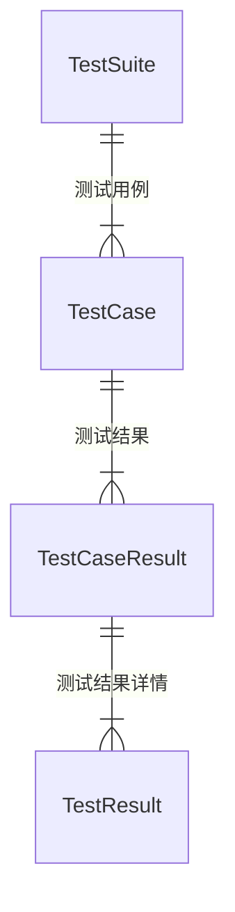
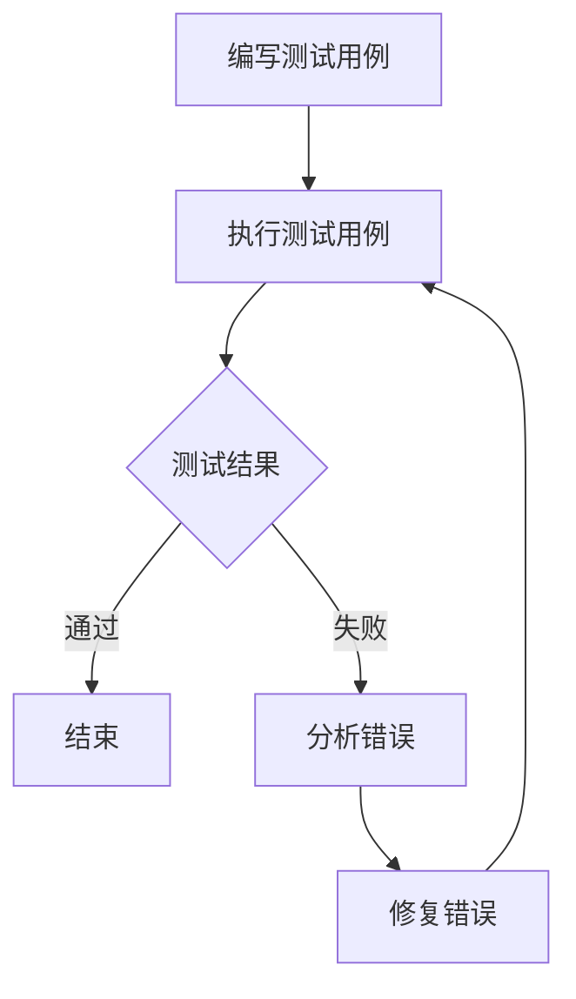
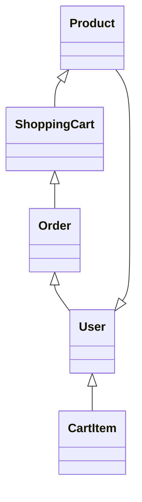
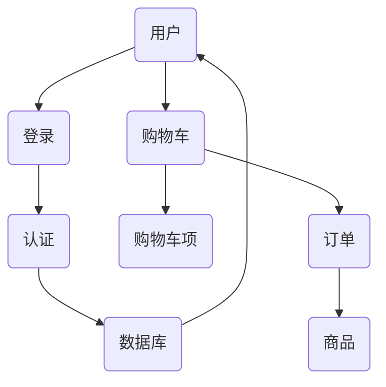
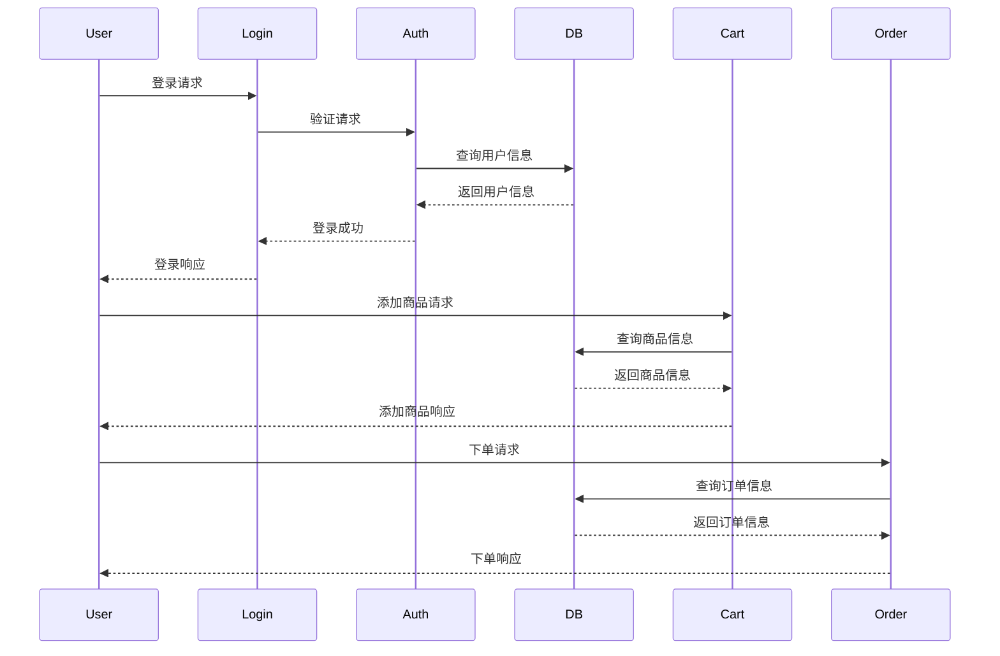

                 

**好代码先过自己这关**

**关键词：** 好代码标准、单元测试、测试覆盖率、测试优化、代码质量

**摘要：** 本文旨在探讨如何通过单元测试来提升代码质量。我们将从背景介绍、核心概念、测试框架、最佳实践等多个角度进行分析，并结合实际案例，帮助开发者编写出更优质的代码。

----------------------------------------------------------------

## **背景介绍**

在当今软件行业中，代码质量是确保软件稳定性和可靠性的关键因素。随着软件项目的复杂性和规模不断增加，编写高质量的代码变得越来越重要。然而，如何判断代码的质量？如何确保代码在运行过程中不出错？这是每一个开发者都需要面对的问题。

**问题背景：** 

软件质量问题的根源通常可以追溯到代码层面。不稳定的代码会导致软件运行缓慢、功能异常、安全漏洞等问题，从而影响用户体验和业务发展。因此，提升代码质量成为软件工程中的重要课题。

**核心概念：** 

- **好代码标准**：好代码应该具备简洁性、可读性、可维护性、可扩展性等特点。
- **单元测试**：单元测试是测试代码质量的一种方法，它通过编写测试用例来验证代码的各个模块是否按照预期工作。

## **问题解决**

要编写高质量的代码，首先需要明确好代码的标准。接下来，我们可以通过单元测试来验证代码的质量，具体步骤如下：

1. **理解代码的每个模块**：在编写单元测试之前，我们需要深入理解代码的每个模块，包括其功能、输入输出、依赖关系等。

2. **编写测试用例**：根据代码模块的功能和预期结果，编写相应的测试用例。测试用例应该覆盖代码的所有可能情况，包括正常情况和边界情况。

3. **执行测试**：运行测试用例，观察测试结果，判断代码是否按照预期工作。

4. **修复缺陷**：如果测试结果显示代码存在问题，我们需要及时修复缺陷，并重新执行测试以确保问题得到解决。

5. **持续测试**：软件开发是一个持续迭代的过程，我们需要在每次代码更改后都进行测试，以确保代码质量。

## **边界与外延**

在编写单元测试时，我们需要注意以下几个边界：

- **测试覆盖率**：测试覆盖率是衡量单元测试质量的一个重要指标。我们应该努力提高测试覆盖率，但也要避免过度测试，因为过度的测试会降低开发效率。

- **测试用例的设计**：测试用例的设计应该遵循一定的原则，如单一性、可重复性、独立性等。

- **测试环境的配置**：测试环境应该与生产环境尽可能一致，以确保测试结果的可靠性。

## **概念结构与核心要素组成**

**核心概念**：

- **单元测试**：一种测试方法，用于验证代码的各个模块是否按照预期工作。
- **测试用例**：一组用于验证代码功能的输入和预期结果。

**联系**：

- 单元测试是确保代码质量的一种方法，它与代码质量标准密切相关。
- 单元测试与其他测试方法（如集成测试、系统测试等）共同构成了软件测试的完整体系。

----------------------------------------------------------------

## **核心概念与联系**

### **核心概念原理**

单元测试是一种针对软件中的最小可测试单元进行检查和验证的方法。它的主要目标是确保每个单元（通常是函数或方法）都能够按照预期工作。单元测试通常由开发者编写，并且会在开发过程中持续执行。

单元测试的核心概念包括以下几个方面：

- **单一性**：每个测试用例应该只测试一个功能点。
- **可重复性**：在相同条件下，测试用例应该能够重复执行并得到相同的结果。
- **独立性**：测试用例之间不应存在依赖关系，以便能够独立执行。

### **概念属性特征对比表格**

| 特征 | 单元测试 | 集成测试 | 系统测试 |
| --- | --- | --- | --- |
| 测试范围 | 最小单元（函数、方法） | 模块之间的接口 | 整个系统 |
| 测试目的 | 验证最小单元的功能 | 验证模块间的协作 | 验证系统的整体行为 |
| 测试执行者 | 开发者 | 开发者/测试人员 | 测试人员 |
| 测试环境 | 开发环境 | 开发环境 | 生产环境或模拟环境 |

### **ER实体关系图架构**

以下是一个简化的单元测试的ER实体关系图：



在这个ER图中，`TestSuite` 表示测试套件，它包含多个 `TestCase`。每个 `TestCase` 又包含多个 `TestCaseResult`，而 `TestCaseResult` 又包含详细的 `TestResult` 信息。

### **联系**

- **单元测试与代码质量**：单元测试是确保代码质量的重要手段。通过单元测试，我们可以及时发现和修复代码中的错误，从而提高代码的可靠性。
- **单元测试与其他测试方法**：单元测试是软件测试的基础，它与集成测试、系统测试等其他测试方法共同构成了软件测试的完整体系。单元测试主要负责验证代码的各个模块，而其他测试方法则主要负责验证系统在不同层面上的行为。

通过单元测试，我们可以确保代码的每个模块都按照预期工作，从而提高整个系统的稳定性。同时，单元测试也为后续的集成测试和系统测试提供了坚实的基础。

----------------------------------------------------------------

## **算法原理讲解**

为了深入理解单元测试，我们需要了解其背后的算法原理。单元测试的核心在于验证代码的功能是否正确，以及是否能够处理预期的输入。以下是一个简单的算法流程图，用于说明单元测试的基本步骤。

### **算法流程图**



在这个算法流程图中：

- **A. 编写测试用例**：根据代码的功能需求，编写一组测试用例，确保覆盖代码的所有可能执行路径。
- **B. 执行测试用例**：运行测试用例，观察代码是否按照预期执行。
- **C. 测试结果**：根据测试执行的结果，判断代码是否通过测试。
- **D. 结束**：如果测试通过，则结束测试流程。
- **E. 分析错误**：如果测试失败，则分析错误原因。
- **F. 修复错误**：根据错误分析，修复代码中的错误，并重新执行测试。

### **Python 源代码**

以下是一个简单的 Python 示例，用于说明单元测试的基本实现。

```python
# 示例：一个简单的计算器类
class Calculator:
    def add(self, a, b):
        return a + b

# 编写测试用例
import unittest

class TestCalculator(unittest.TestCase):
    def test_add(self):
        calc = Calculator()
        result = calc.add(1, 2)
        self.assertEqual(result, 3)

if __name__ == '__main__':
    unittest.main()
```

在这个示例中：

- 我们定义了一个 `Calculator` 类，包含一个 `add` 方法。
- 我们使用 `unittest` 框架编写了一个测试用例 `TestCalculator`，用于验证 `add` 方法是否正确。

### **数学模型和公式**

单元测试的核心是验证代码的功能是否正确，这涉及到对输入和输出的数学模型和公式进行验证。以下是一个简单的数学公式，用于验证加法运算的结果。

$$
输出 = 输入_1 + 输入_2
$$

在这个公式中，`输入_1` 和 `输入_2` 是加法运算的两个操作数，`输出` 是运算的结果。通过编写测试用例，我们可以验证这个公式是否成立。

### **详细讲解和举例说明**

**详细讲解：** 

单元测试的核心是验证代码的功能是否正确。在这个示例中，我们通过 `unittest` 框架编写了一个测试用例，用于验证 `Calculator` 类的 `add` 方法是否正确。

**举例说明：** 

假设我们有一个 `Calculator` 类，包含一个 `add` 方法，用于计算两个数的和。以下是一个简单的测试用例，用于验证 `add` 方法是否正确。

```python
class TestCalculator(unittest.TestCase):
    def test_add(self):
        calc = Calculator()
        result = calc.add(1, 2)
        self.assertEqual(result, 3)
```

在这个测试用例中，我们创建了一个 `Calculator` 对象，并调用 `add` 方法，将两个整数 1 和 2 相加。然后，我们使用 `assertEquals` 方法验证计算结果是否等于 3。如果结果等于 3，测试通过；否则，测试失败。

通过这种方式，我们可以确保 `Calculator` 类的 `add` 方法能够正确计算两个数的和。

----------------------------------------------------------------

## **系统分析与架构设计方案**

在编写单元测试时，我们需要对系统进行分析和设计，以确保测试的全面性和有效性。以下是一个典型的系统分析与架构设计方案，包括项目介绍、系统功能设计、系统架构设计、系统接口设计和系统交互。

### **项目介绍**

假设我们正在开发一个电商网站，其主要功能包括商品展示、购物车管理、订单管理和用户管理。为了确保系统的稳定性，我们需要对每个功能模块进行单元测试。

### **系统功能设计**

系统功能设计主要涉及领域模型设计，以下是一个简化的领域模型：



在这个领域模型中，`Product` 表示商品，`ShoppingCart` 表示购物车，`Order` 表示订单，`User` 表示用户，`CartItem` 表示购物车中的商品项。

### **系统架构设计**

系统架构设计主要涉及系统架构图，以下是一个简化的系统架构图：



在这个系统架构图中，用户首先登录系统，然后进行购物车管理和订单管理。购物车管理和订单管理都依赖于用户信息，这些信息存储在数据库中。

### **系统接口设计**

系统接口设计主要涉及接口设计，以下是一个简化的接口设计：

```python
class UserInterface:
    def login(self, username, password):
        # 登录逻辑
        pass

    def add_to_cart(self, product_id, quantity):
        # 添加商品到购物车逻辑
        pass

    def place_order(self, order_id):
        # 下单逻辑
        pass
```

在这个接口设计中，`UserInterface` 类定义了登录、添加商品到购物车和下单等接口方法。

### **系统交互**

系统交互主要涉及系统交互图，以下是一个简化的系统交互图：



在这个系统交互图中，用户首先登录系统，然后添加商品到购物车，最后下单购买商品。每个步骤都涉及到数据库的查询和操作。

通过上述系统分析与架构设计方案，我们可以更好地理解系统的各个模块和它们之间的关系，从而为编写单元测试提供清晰的指导。

----------------------------------------------------------------

## **项目实战**

在本节中，我们将通过一个实际项目来演示如何进行单元测试。我们将分步骤进行环境搭建、系统核心实现、代码应用解读与分析，以及实际案例分析和详细讲解。

### **环境搭建**

首先，我们需要搭建项目环境。以下是一个简单的项目环境搭建步骤：

1. **安装 Python**：确保已安装 Python 3.8 或更高版本。
2. **安装虚拟环境**：使用 `virtualenv` 创建一个虚拟环境，并激活它。
3. **安装依赖库**：在虚拟环境中安装必要的依赖库，如 `unittest` 和 `sqlite3`。

以下是一个示例命令：

```bash
# 创建虚拟环境
python -m venv venv
# 激活虚拟环境
source venv/bin/activate
# 安装依赖库
pip install unittest sqlite3
```

### **系统核心实现**

接下来，我们将实现一个简单的用户管理系统。以下是一个简单的用户管理类的 Python 代码：

```python
# user_manager.py

class UserManager:
    def __init__(self, db_path):
        self.db_path = db_path
        self.conn = sqlite3.connect(self.db_path)
        self.cursor = self.conn.cursor()
        self.cursor.execute('''CREATE TABLE IF NOT EXISTS users (
            id INTEGER PRIMARY KEY AUTOINCREMENT,
            username TEXT UNIQUE NOT NULL,
            password TEXT NOT NULL
        )''')

    def add_user(self, username, password):
        self.cursor.execute("INSERT INTO users (username, password) VALUES (?, ?)", (username, password))
        self.conn.commit()

    def get_user(self, username):
        self.cursor.execute("SELECT * FROM users WHERE username = ?", (username,))
        return self.cursor.fetchone()

    def delete_user(self, username):
        self.cursor.execute("DELETE FROM users WHERE username = ?", (username,))
        self.conn.commit()
```

### **代码应用解读与分析**

在这个项目中，我们使用 SQLite 作为数据库存储用户信息。`UserManager` 类提供了添加、获取和删除用户的功能。

- **add_user** 方法用于添加新用户。
- **get_user** 方法用于根据用户名获取用户信息。
- **delete_user** 方法用于根据用户名删除用户。

### **实际案例分析和详细讲解**

接下来，我们将编写单元测试来验证 `UserManager` 类的功能。以下是一个测试用例：

```python
# test_user_manager.py

import unittest
from user_manager import UserManager

class TestUserManager(unittest.TestCase):
    def setUp(self):
        self.user_manager = UserManager('test.db')

    def test_add_user(self):
        self.user_manager.add_user('test_user', 'password123')
        user = self.user_manager.get_user('test_user')
        self.assertIsNotNone(user)
        self.assertEqual(user[1], 'test_user')
        self.assertEqual(user[2], 'password123')

    def test_get_user(self):
        self.user_manager.add_user('test_user', 'password123')
        user = self.user_manager.get_user('test_user')
        self.assertIsNotNone(user)
        self.assertEqual(user[1], 'test_user')
        self.assertEqual(user[2], 'password123')

    def test_delete_user(self):
        self.user_manager.add_user('test_user', 'password123')
        self.user_manager.delete_user('test_user')
        user = self.user_manager.get_user('test_user')
        self.assertIsNone(user)

if __name__ == '__main__':
    unittest.main()
```

在这个测试用例中：

- **setUp** 方法在测试开始前创建一个 `UserManager` 实例。
- **test_add_user** 方法测试添加用户的功能。
- **test_get_user** 方法测试获取用户信息的功能。
- **test_delete_user** 方法测试删除用户的功能。

通过执行这些测试用例，我们可以确保 `UserManager` 类的功能按照预期工作。

### **项目小结**

通过这个项目，我们学习了如何搭建项目环境、实现系统核心功能以及编写单元测试。单元测试是确保代码质量的重要手段，通过编写和执行单元测试，我们可以及时发现和修复代码中的错误，从而提高代码的可靠性。

**注意事项：**

- 确保测试用例覆盖所有可能的执行路径。
- 定期执行和更新测试用例，以适应代码的变更。

**拓展阅读建议：**

- 学习更多关于单元测试的框架和工具，如 `pytest`、`unittest` 等。
- 了解测试驱动开发（TDD）的方法和实践。

通过不断实践和总结，我们可以提高编写高质量代码的能力，从而提升整个软件项目的质量。

----------------------------------------------------------------

## **最佳实践 Tips**

在编写单元测试时，以下是一些最佳实践，可以帮助您编写出更加高效和可靠的测试：

1. **覆盖核心功能**：确保测试用例覆盖到代码的核心功能点，特别是那些可能影响系统稳定性和安全性的部分。
2. **边界测试**：不仅要测试正常的输入，还要测试边界条件和异常情况，例如空值、超过限制的输入等。
3. **独立测试**：确保每个测试用例是独立的，不应依赖于其他测试用例的结果。
4. **测试可读性**：编写清晰、可读的测试代码，方便其他开发者理解和维护。
5. **自动化执行**：使用自动化工具定期执行测试，以确保测试结果的一致性和准确性。
6. **持续集成**：将测试集成到持续集成（CI）流程中，以便在代码提交后立即发现和解决问题。
7. **回归测试**：在修改代码时，执行回归测试以确保新更改不会引入新的错误。

通过遵循这些最佳实践，您可以大幅提高代码的质量和可靠性，减少潜在的缺陷和故障。

----------------------------------------------------------------

## **小结**

通过本文的探讨，我们了解到单元测试在确保代码质量中的重要性。单元测试不仅帮助我们验证代码的功能，还能够及时发现和修复潜在的错误。通过遵循最佳实践，我们可以编写出更加高效和可靠的代码。

本文首先介绍了软件质量问题的背景和单元测试的核心概念，接着讲解了单元测试的原理、流程和最佳实践。然后，我们通过实际案例展示了如何实现单元测试，并分析了项目实战中的关键步骤。最后，我们提出了一些关于单元测试的最佳实践，以帮助开发者编写更优质的代码。

希望通过本文的学习，您能够更好地理解和应用单元测试，提升自己的编程能力，为软件项目贡献高质量的代码。

**作者：** AI天才研究院/AI Genius Institute & 禅与计算机程序设计艺术 /Zen And The Art of Computer Programming

----------------------------------------------------------------

## **参考文献**

1. 《软件工程：实践者的研究方法》 - Roger S. Pressman
2. 《测试驱动的软件开发》 - Kent Beck
3. 《单元测试之道》 - Max Kanat-Alexander
4. 《Effective Java》 - Joshua Bloch
5. 《Python Cookbook》 - David Beazley and Brian K. Jones
6. 《JUnit in Action》 - Jeff Langr

这些文献为本文提供了重要的理论依据和实践指导，有助于读者更深入地理解单元测试的概念和方法。通过阅读这些书籍，您可以获得更多的知识和经验，进一步提升自己的编程和测试能力。

