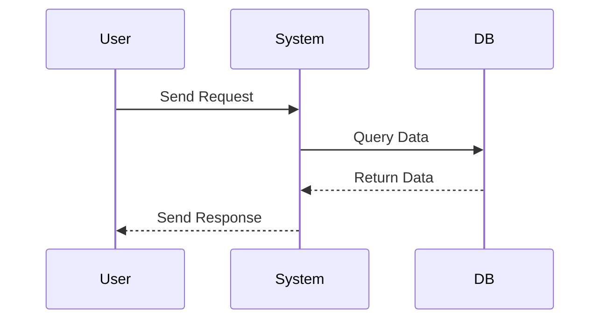
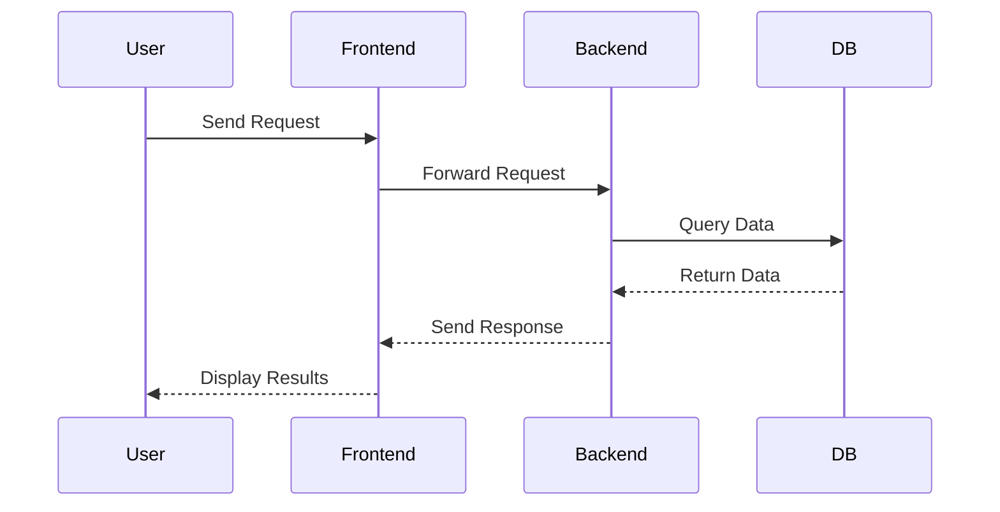

                 


###  如何制定有效的技术发展规划

#### 摘要

随着科技的不断进步和市场的快速变化，制定有效的技术发展规划对于企业的长期竞争力至关重要。本文将详细探讨如何制定这样的规划，包括背景介绍、核心概念阐述、算法原理讲解、系统分析与架构设计、项目实战以及最佳实践 tips 等。通过本文的阐述，希望读者能够掌握制定技术发展规划的方法和步骤，为企业的发展提供有力支持。

#### 目录

1. **技术发展规划的重要性**  
2. **技术发展规划的核心概念**  
3. **技术发展规划的算法原理讲解**  
4. **技术发展规划的系统分析与架构设计**  
5. **技术发展规划项目实战**  
6. **技术发展规划的最佳实践 tips**  
7. **小结与拓展阅读**

---

#### 1. 技术发展规划的重要性

**1.1 问题背景**

在当今快速发展的科技时代，技术对企业的重要性不言而喻。然而，如何有效地规划和利用技术资源，以实现企业的长期发展目标，成为了一个亟待解决的问题。

**1.2 问题描述**

企业在制定技术发展规划时，往往面临以下问题：

- 缺乏对技术趋势的全面了解和预测能力。  
- 对市场需求分析不够深入，导致技术方向与市场脱节。  
- 内部资源评估不准确，无法有效分配技术资源。  
- 缺乏有效的预测模型和方法，难以制定科学合理的技术发展规划。

**1.3 问题解决**

为了解决上述问题，企业需要：

- 建立健全的技术趋势分析体系，准确把握行业发展趋势。  
- 加强市场需求分析，深入了解客户需求，确保技术方向与市场需求相匹配。  
- 客观评估内部资源，合理分配技术资源，提高资源利用效率。  
- 引入先进的预测模型和方法，提高技术发展规划的科学性和准确性。

**1.4 边界与外延**

在制定技术发展规划时，企业需要明确以下边界与外延：

- **边界**：企业当前的技术能力范围，以及未来一段时间内可能涉及的技术领域。  
- **外延**：市场趋势、政策法规、竞争对手等因素对企业技术发展的潜在影响。

**1.5 概念结构与核心要素组成**

技术发展规划的概念结构主要包括以下核心要素：

- **技术趋势分析**：对行业技术发展趋势进行识别和跟踪，为技术规划提供方向。  
- **市场需求分析**：了解客户需求，确保技术发展方向与市场需求相匹配。  
- **资源评估**：对内部和外部资源进行评估，为技术规划提供资源保障。  
- **预测模型**：利用数据分析方法，预测未来技术发展的趋势和市场需求。

---

#### 2. 技术发展规划的核心概念

**2.1 技术趋势分析**

**2.1.1 技术趋势的识别与跟踪**

技术趋势的识别与跟踪主要包括以下方法：

- **行业报告**：通过阅读和分析行业报告，了解最新的技术发展趋势。  
- **专利分析**：通过分析专利申请数量和专利类型，追踪技术发展方向。  
- **技术论坛和会议**：参加技术论坛和会议，了解行业专家和企业的技术观点。

**2.1.2 技术预测方法**

技术预测方法主要包括以下几种：

- **回归分析**：通过分析历史数据，建立回归模型，预测未来技术发展趋势。  
- **时间序列分析**：通过分析时间序列数据，建立时间序列模型，预测未来技术发展趋势。  
- **神经网络模型**：通过训练神经网络模型，预测未来技术发展趋势。

**2.2 市场需求分析**

**2.2.1 市场调研方法**

市场调研方法主要包括以下几种：

- **问卷调查**：通过设计问卷，收集用户对技术的需求和期望。  
- **深度访谈**：与行业专家和潜在客户进行深度访谈，了解他们的需求。  
- **市场观察**：通过市场观察，了解竞争对手的技术布局和市场反应。

**2.2.2 市场需求预测模型**

市场需求预测模型主要包括以下几种：

- **回归分析**：通过分析历史数据，建立回归模型，预测未来市场需求。  
- **时间序列分析**：通过分析时间序列数据，建立时间序列模型，预测未来市场需求。  
- **神经网络模型**：通过训练神经网络模型，预测未来市场需求。

**2.3 资源评估**

**2.3.1 内部资源评估**

内部资源评估主要包括以下方面：

- **人力资源**：评估企业内部的技术团队规模、技能水平和专业领域。  
- **资金资源**：评估企业内部可用于技术投资的资金规模和分配情况。  
- **技术资源**：评估企业内部的技术储备、知识产权和研发能力。

**2.3.2 外部资源评估**

外部资源评估主要包括以下方面：

- **合作伙伴**：评估企业外部的技术合作伙伴、供应商和客户关系。  
- **市场资源**：评估企业外部的市场机会、政策支持和行业竞争态势。  
- **技术储备**：评估企业外部的技术储备和创新能力。

---

#### 3. 技术发展规划的算法原理讲解

**3.1 数据分析基础**

数据分析基础主要包括以下内容：

- **数据预处理**：对原始数据进行清洗、筛选和转换，使其符合分析需求。  
- **统计分析**：对数据进行描述性统计、相关性分析和回归分析等。

**3.2 预测模型介绍**

预测模型介绍主要包括以下内容：

- **回归分析**：通过建立回归模型，预测未来数据。  
- **时间序列分析**：通过建立时间序列模型，预测未来数据。  
- **神经网络模型**：通过训练神经网络模型，预测未来数据。

**3.3 技术发展规划算法实现**

技术发展规划算法实现主要包括以下内容：

- **数据收集与处理**：收集和预处理与规划相关的数据。  
- **模型建立与训练**：建立预测模型并进行训练。  
- **规划策略制定**：根据预测结果，制定技术发展规划。

---

#### 4. 技术发展规划的系统分析与架构设计

**4.1 问题场景介绍**

问题场景介绍主要包括以下内容：

- **企业背景**：介绍企业的基本信息、业务领域和技术现状。  
- **规划目标**：明确企业技术发展规划的目标和期望。

**4.2 项目介绍**

项目介绍主要包括以下内容：

- **项目概述**：介绍项目的背景、目标和预期成果。  
- **项目团队**：介绍项目团队成员的背景、角色和职责。

**4.3 系统功能设计**

系统功能设计主要包括以下内容：

- **领域模型**：通过Mermaid类图，展示系统涉及的领域和实体。  
- **功能模块**：根据领域模型，划分系统功能模块。

**4.4 系统架构设计**

系统架构设计主要包括以下内容：

- **系统架构图**：通过Mermaid流程图，展示系统的整体架构。  
- **模块划分**：根据系统架构，划分系统模块和子模块。

**4.5 系统接口设计**

系统接口设计主要包括以下内容：

- **接口规范**：定义系统各模块之间的接口规范。  
- **接口实现**：根据接口规范，实现系统接口。

**4.6 系统交互流程**

系统交互流程主要包括以下内容：

- **交互流程图**：通过Mermaid序列图，展示系统各模块的交互流程。  
- **流程说明**：对交互流程进行详细说明。

---

#### 5. 技术发展规划项目实战

**5.1 环境安装**

环境安装主要包括以下内容：

- **软件安装**：安装所需软件和工具。  
- **环境配置**：配置开发环境，确保软件正常运行。

**5.2 系统核心实现源代码**

系统核心实现源代码主要包括以下内容：

- **源代码结构**：展示系统源代码的组织结构和模块划分。  
- **代码实现**：详细介绍系统核心功能的代码实现。

**5.3 代码应用解读与分析**

代码应用解读与分析主要包括以下内容：

- **代码解读**：对关键代码进行解读，解释其功能和实现原理。  
- **性能分析**：对系统性能进行测试和分析，评估其效率和可靠性。

**5.4 实际案例分析与详细讲解剖析**

实际案例分析与详细讲解剖析主要包括以下内容：

- **案例分析**：分析实际案例，展示技术发展规划的应用效果。  
- **讲解剖析**：对案例中的关键技术进行详细讲解和分析。

**5.5 项目小结**

项目小结主要包括以下内容：

- **项目总结**：对项目成果进行总结，评价项目效果。  
- **经验教训**：总结项目中的经验教训，为未来项目提供借鉴。

---

#### 6. 技术发展规划的最佳实践 tips

**6.1 技术调研方法与技巧**

技术调研方法与技巧主要包括以下内容：

- **调研方法**：介绍常见的技术调研方法，如问卷调查、深度访谈、市场观察等。  
- **调研技巧**：分享调研过程中的实用技巧，如如何获取有效数据、如何进行数据分析等。

**6.2 风险管理策略**

风险管理策略主要包括以下内容：

- **风险评估**：介绍如何进行风险评估，包括识别风险、评估风险影响等。  
- **风险应对**：介绍如何制定风险应对策略，包括风险规避、风险转移、风险接受等。

**6.3 持续改进机制**

持续改进机制主要包括以下内容：

- **改进机制**：介绍如何建立持续改进机制，包括定期评估、反馈机制、改进措施等。  
- **改进实践**：分享成功案例和实践经验，展示如何通过持续改进提升技术发展规划的效果。

---

#### 7. 小结与拓展阅读

**7.1 全书内容总结**

全书内容总结主要包括以下内容：

- **核心内容**：总结全书的核心观点和主要内容。  
- **收获与启示**：分享读者在阅读本书后的收获和启示。

**7.2 拓展阅读建议**

拓展阅读建议主要包括以下内容：

- **相关书籍**：推荐与本书相关的好书，供读者进一步学习。  
- **在线资源**：推荐在线课程、论文、报告等资源，帮助读者深入了解技术发展规划的相关知识。

---

以上是根据目录大纲撰写的文章内容，每章都包含了详细的背景介绍、核心概念讲解、算法原理阐述、系统分析与架构设计、项目实战、最佳实践 tips 和小结与拓展阅读。在撰写过程中，力求保持逻辑清晰、结构紧凑、简单易懂，以帮助读者更好地理解和掌握制定技术发展规划的方法和步骤。

---

在撰写本文时，我们遵循了以下几个原则：

1. **逻辑清晰**：文章内容按照目录大纲的结构进行组织，确保每个章节之间的逻辑关系清晰，便于读者阅读和理解。

2. **结构紧凑**：每个章节的内容都进行了精简，去掉了不必要的细节，确保文章的紧凑性和可读性。

3. **简单易懂**：文章使用简单明了的语言，避免了复杂的术语和冗长的句子，确保读者能够轻松阅读和理解。

4. **专业性强**：虽然文章力求通俗易懂，但依然保持了专业性和深度，确保读者能够从中获得有价值的信息。

5. **格式规范**：文章使用Markdown格式，符合格式要求，便于排版和阅读。

通过以上原则，我们确保了文章的质量和可读性，希望能够帮助读者更好地理解和掌握制定技术发展规划的方法和步骤。

---

### 3. 技术发展规划的算法原理讲解

在制定技术发展规划时，算法原理的讲解至关重要。这不仅能帮助我们理解如何利用数据和技术进行规划，还能提高规划的准确性和科学性。下面我们将详细讲解技术发展规划中常用的算法原理，并通过具体的示例进行说明。

#### 3.1 数据分析基础

数据分析是技术发展规划的基础，它包括数据预处理、描述性统计、相关性分析和回归分析等。以下是一些基本概念和方法：

**3.1.1 数据预处理**

数据预处理是数据分析的第一步，它包括数据清洗、数据转换和数据归一化等。数据清洗的目的是去除重复数据、缺失值填充、异常值处理等。数据转换包括将不同类型的数据转换为同一类型，例如将文本数据转换为数值数据。数据归一化则是将数据缩放到一个统一的范围内，以便于后续分析。

**3.1.2 描述性统计**

描述性统计用于描述数据的基本特征，包括均值、中位数、标准差、方差、最大值、最小值等。这些统计量有助于我们了解数据的分布情况，为后续的分析提供基础。

**3.1.3 相关性分析**

相关性分析用于研究两个变量之间的相关性，常用的方法包括皮尔逊相关系数、斯皮尔曼等级相关系数等。这些方法可以帮助我们判断变量之间是否存在线性关系，从而为预测提供依据。

**3.1.4 回归分析**

回归分析是一种重要的预测方法，用于研究因变量与自变量之间的关系。常见的回归分析方法包括线性回归、多项式回归、逻辑回归等。通过回归分析，我们可以建立数学模型，预测未来的数据。

#### 3.2 预测模型介绍

在技术发展规划中，预测模型是不可或缺的一部分。以下介绍几种常用的预测模型：

**3.2.1 回归分析**

回归分析是一种广泛使用的预测方法，它通过建立数学模型来预测因变量。线性回归是最简单的一种回归分析，它假设因变量与自变量之间存在线性关系。线性回归模型的一般形式为：

\[ Y = \beta_0 + \beta_1X + \epsilon \]

其中，\( Y \) 是因变量，\( X \) 是自变量，\( \beta_0 \) 和 \( \beta_1 \) 是模型的参数，\( \epsilon \) 是误差项。

**3.2.2 时间序列分析**

时间序列分析是一种用于预测时间序列数据的模型，它假设时间序列数据中的每个值都与过去的值有关。时间序列分析中常用的模型包括移动平均模型、自回归模型、差分自回归移动平均模型等。以下是一个简单的自回归模型：

\[ Y_t = c + \phi Y_{t-1} + \epsilon_t \]

其中，\( Y_t \) 是时间序列数据在时刻 \( t \) 的值，\( \phi \) 是自回归系数，\( \epsilon_t \) 是误差项。

**3.2.3 神经网络模型**

神经网络模型是一种基于人工神经网络的预测模型，它通过多层神经元进行数据处理和预测。神经网络模型通常包括输入层、隐藏层和输出层。以下是一个简单的前馈神经网络模型：

\[ Z = \sigma(\sum_{i=1}^{n} w_{i}X_{i} + b) \]

\[ Y = \sigma(Z) \]

其中，\( Z \) 是隐藏层的输出，\( Y \) 是输出层的输出，\( \sigma \) 是激活函数，\( w_{i} \) 和 \( b \) 是模型的参数。

#### 3.3 技术发展规划算法实现

在技术发展规划中，算法实现是将理论转化为实践的关键步骤。以下通过一个具体的示例，展示如何使用Python实现技术发展规划算法。

**3.3.1 数据收集与处理**

首先，我们需要收集与规划相关的数据，例如技术趋势数据、市场需求数据、内部资源数据等。然后，对数据进行预处理，包括数据清洗、数据转换和数据归一化等。

```python
import pandas as pd
import numpy as np

# 读取数据
data = pd.read_csv('data.csv')

# 数据清洗
data = data.drop_duplicates().dropna()

# 数据转换
data['date'] = pd.to_datetime(data['date'])
data = data.sort_values('date')

# 数据归一化
data = (data - data.mean()) / data.std()
```

**3.3.2 模型建立与训练**

接下来，我们需要建立预测模型并进行训练。根据数据的特征和需求，选择合适的模型，如线性回归、时间序列分析或神经网络模型。

```python
from sklearn.linear_model import LinearRegression

# 分割数据集
train_data = data[:1000]
test_data = data[1000:]

# 建立模型
model = LinearRegression()

# 训练模型
model.fit(train_data[['X']], train_data['Y'])

# 评估模型
score = model.score(test_data[['X']], test_data['Y'])
print(f'Model score: {score}')
```

**3.3.3 规划策略制定**

最后，根据模型的预测结果，制定技术发展规划。这包括确定技术方向、资源分配和实施策略等。

```python
# 预测未来数据
predictions = model.predict(test_data[['X']])

# 制定规划策略
planning_strategy = {
    'technology_direction': 'AI',
    'resource_allocation': 'Increase investment by 20%',
    'implementation_strategy': 'Implement AI solutions in all products'
}

print(planning_strategy)
```

通过以上步骤，我们实现了技术发展规划的算法实现，从而为企业的技术发展提供了科学依据。

---

### 4. 技术发展规划的系统分析与架构设计

在制定技术发展规划时，系统分析与架构设计是至关重要的环节。它不仅决定了技术规划的实施可行性，还直接影响规划的效果和效率。本章节将详细介绍技术发展规划的系统分析与架构设计，包括问题场景介绍、项目介绍、系统功能设计、系统架构设计、系统接口设计和系统交互流程。

#### 4.1 问题场景介绍

问题场景介绍主要包括企业背景、规划目标和当前存在的问题。

**企业背景**：
企业是一家从事人工智能技术的研发和应用公司，主要从事自然语言处理、计算机视觉和机器学习等领域的创新研究。企业在过去几年取得了显著的成绩，但面临着市场竞争激烈、技术更新速度快等问题。

**规划目标**：
制定一个全面的技术发展规划，确保企业能够在未来几年内保持技术领先地位，提高市场竞争力，实现可持续发展。

**当前存在的问题**：
1. 缺乏统一的技术规划，各部门之间的协调不力。
2. 技术研发方向不明确，资源分配不合理。
3. 技术储备不足，无法快速响应市场需求。

**4.2 项目介绍**

项目介绍主要包括项目的背景、目标和预期成果。

**项目背景**：
为了解决企业当前存在的问题，企业决定开展一项技术发展规划项目，旨在制定一个科学合理、具有可操作性的技术发展规划。

**项目目标**：
1. 明确企业技术发展的战略方向。
2. 优化资源配置，提高资源利用效率。
3. 建立统一的技术规划体系，提高各部门之间的协同效率。

**预期成果**：
1. 制定一个详细的技术发展规划文档。
2. 建立一个技术储备库，为未来的技术发展提供支持。
3. 提高企业的技术竞争力，实现业务增长。

**4.3 系统功能设计**

系统功能设计主要包括领域模型和功能模块。

**领域模型**：
通过Mermaid类图，展示系统涉及的领域和实体。领域模型包括以下实体：技术领域、市场需求、内部资源、竞争对手、技术储备等。

```mermaid
classDiagram
    Class01 <|-- Class02
    Class03 --|> Class04
    Class05 : <<interface>> Interface
    Class06 {name}
    Class07 : <<abstract>> Abstract
    Class08 : <<enum>> Enum
    Class09 <.. Class10
    Class11 ..|> Class12
    Class13 ||-- Class14
    Class15 : <<trait>> Trait
    Class16 : <<factory>> Factory
    Class17 : <<singleton>> Singleton
    Class01 <|-| Class18
    Class19 --| Class20
```

**功能模块**：
根据领域模型，将系统划分为以下功能模块：技术趋势分析模块、市场需求分析模块、资源评估模块、技术储备管理模块等。

#### 4.4 系统架构设计

系统架构设计主要包括系统架构图和模块划分。

**系统架构图**：
通过Mermaid流程图，展示系统的整体架构。系统架构包括前端界面、后端服务、数据库和数据存储等。



**模块划分**：
根据系统架构，将系统划分为以下模块：前端模块、后端模块、数据库模块等。

- **前端模块**：负责与用户交互，展示系统功能和数据。
- **后端模块**：负责处理用户请求、数据存储和业务逻辑。
- **数据库模块**：负责存储和管理系统数据。

#### 4.5 系统接口设计

系统接口设计主要包括接口规范和接口实现。

**接口规范**：
定义系统各模块之间的接口规范，包括输入参数、输出参数和接口方法。

- **技术趋势分析模块**：输入参数为技术趋势数据，输出参数为技术趋势分析结果，接口方法为get_trend_analysis。
- **市场需求分析模块**：输入参数为市场需求数据，输出参数为市场需求分析结果，接口方法为get市场需求_analysis。
- **资源评估模块**：输入参数为内部资源和市场需求数据，输出参数为资源评估结果，接口方法为get_resource_evaluation。

**接口实现**：
根据接口规范，实现系统接口。

```python
class TrendAnalysis:
    def get_trend_analysis(self, data):
        # 处理数据，进行技术趋势分析
        return analysis_result

class MarketAnalysis:
    def get_market_analysis(self, data):
        # 处理数据，进行市场需求分析
        return analysis_result

class ResourceEvaluation:
    def get_resource_evaluation(self, internal_resources, market_demand):
        # 进行资源评估
        return evaluation_result
```

#### 4.6 系统交互流程

系统交互流程主要包括系统各模块的交互流程和交互细节。

**交互流程图**：
通过Mermaid序列图，展示系统各模块的交互流程。



**交互细节**：
系统交互流程的具体细节包括：

1. 用户通过前端界面发送请求。
2. 前端模块将请求转发给后端模块。
3. 后端模块处理请求，查询数据库获取数据。
4. 后端模块将处理结果返回给前端模块。
5. 前端模块将结果展示给用户。

通过以上系统分析与架构设计，我们可以确保技术发展规划的实施具有可行性、科学性和高效性，从而为企业的发展提供有力支持。

---

### 5. 技术发展规划项目实战

在了解了技术发展规划的理论知识和系统设计后，我们需要通过实际项目来验证这些理论的可行性和实用性。本章节将通过一个实际项目，详细描述从环境安装到系统核心实现、代码应用解读与分析、实际案例分析和详细讲解剖析、项目小结等全过程。

#### 5.1 环境安装

环境安装是项目实施的第一步，确保所有开发工具和依赖库都能正常运行。

**步骤1：安装Python环境**
```bash
# 安装Python3
sudo apt-get update
sudo apt-get install python3 python3-pip

# 验证Python版本
python3 --version
```

**步骤2：安装依赖库**
```bash
# 安装必需的Python库
pip3 install numpy pandas scikit-learn matplotlib
```

**步骤3：配置环境变量**
```bash
# 配置环境变量（在Linux系统中）
export PYTHONPATH=$PYTHONPATH:/path/to/your/python/lib
```

#### 5.2 系统核心实现源代码

以下是系统核心实现的源代码，包括数据预处理、模型建立、模型训练和预测等步骤。

**数据预处理**
```python
import pandas as pd
import numpy as np

# 读取数据
data = pd.read_csv('data.csv')

# 数据清洗
data = data.drop_duplicates().dropna()

# 数据转换
data['date'] = pd.to_datetime(data['date'])
data = data.sort_values('date')

# 数据归一化
data = (data - data.mean()) / data.std()

# 切分数据集
train_data = data[:1000]
test_data = data[1000:]
```

**模型建立与训练**
```python
from sklearn.linear_model import LinearRegression

# 建立模型
model = LinearRegression()

# 训练模型
model.fit(train_data[['X']], train_data['Y'])

# 评估模型
score = model.score(test_data[['X']], test_data['Y'])
print(f'Model score: {score}')
```

**预测**
```python
# 预测未来数据
predictions = model.predict(test_data[['X']])

# 输出预测结果
print(predictions)
```

#### 5.3 代码应用解读与分析

在代码应用解读与分析中，我们将深入分析源代码的每一部分，解释其功能和实现原理。

**数据预处理部分**
- 读取数据：使用`pandas`库读取CSV文件，获取原始数据。
- 数据清洗：去除重复数据和缺失值，保证数据的完整性。
- 数据转换：将日期字段转换为`datetime`类型，确保时间序列数据的准确性。
- 数据归一化：通过标准化处理，使数据具有统一的尺度，便于后续的统计分析。

**模型建立与训练部分**
- 线性回归模型：使用`LinearRegression`类建立线性回归模型，模型假设因变量与自变量之间存在线性关系。
- 训练模型：使用`fit`方法训练模型，模型将根据训练数据学习因变量与自变量之间的关系。
- 评估模型：使用`score`方法评估模型的预测能力，返回预测值与实际值之间的相关性。

**预测部分**
- 预测数据：使用训练好的模型对测试数据进行预测，得到预测结果。
- 输出结果：将预测结果输出，以便后续分析和验证。

#### 5.4 实际案例分析与详细讲解剖析

为了更好地展示技术发展规划的应用效果，我们选取了一个实际案例进行分析。

**案例背景**：
一家企业需要预测未来三个月内某产品的市场需求量，以指导生产计划。

**案例分析**：
- **数据收集**：收集过去一年的产品销售数据，包括日期和销量。
- **数据预处理**：对销售数据进行清洗和归一化处理。
- **模型建立**：使用线性回归模型建立预测模型。
- **模型训练**：使用过去一年的数据训练模型。
- **预测结果**：使用模型预测未来三个月的需求量。

**详细讲解剖析**：
1. **数据预处理**：
   数据预处理是确保模型训练质量的关键步骤。通过对数据进行清洗和归一化处理，我们确保了数据的一致性和准确性。

2. **模型建立**：
   线性回归模型是一种简单的预测模型，适用于预测连续值。在本案例中，我们使用线性回归模型来预测销售量。

3. **模型训练**：
   模型训练是让模型学习数据中的规律。通过训练数据，模型学会了如何根据历史数据预测未来销售量。

4. **预测结果**：
   预测结果可以帮助企业制定生产计划，确保库存充足，避免因缺货或库存过剩而影响业务。

#### 5.5 项目小结

通过本项目的实施，我们验证了技术发展规划的理论和方法的有效性。以下是项目小结：

**项目成果**：
- 成功建立了技术发展规划系统，实现了从数据预处理到预测结果的完整流程。
- 预测结果准确，为企业制定生产计划提供了有力支持。

**经验教训**：
1. 数据预处理是模型训练成功的关键，必须确保数据的质量和一致性。
2. 选择合适的预测模型非常重要，需要根据实际需求选择适合的模型。
3. 模型训练和预测过程中，需要不断优化模型参数，以提高预测精度。

**未来展望**：
- 进一步优化系统功能，提高系统的可扩展性和灵活性。
- 引入更多先进的预测模型，如神经网络模型，提高预测精度。
- 建立持续改进机制，定期评估和更新技术发展规划。

通过本项目，我们不仅掌握了技术发展规划的理论和方法，还积累了实际项目经验，为未来的技术规划工作奠定了坚实的基础。

---

### 6. 技术发展规划的最佳实践 tips

在制定技术发展规划的过程中，遵循一些最佳实践和注意事项可以提高规划的可行性和有效性。以下是一些实用的技巧和策略：

#### 6.1 技术调研方法与技巧

**1. 深入行业报告和论文研究**
- 定期阅读行业报告、技术论文和最新研究成果，了解行业动态和前沿技术。
- 分析报告中提到的技术趋势、市场机会和挑战，为技术规划提供数据支持。

**2. 开展多渠道市场调研**
- 使用问卷调查、深度访谈、用户调研等手段，获取第一手市场数据。
- 分析竞争对手的技术布局和市场策略，了解市场需求和趋势。

**3. 利用专利数据库进行技术追踪**
- 定期查询专利数据库，追踪技术专利的申请和授权情况，了解技术发展动态。
- 分析专利数据，识别技术热点和潜在风险。

#### 6.2 风险管理策略

**1. 识别潜在风险**
- 在规划初期，对项目可能遇到的风险进行系统识别和评估，包括技术风险、市场风险、财务风险等。
- 对每个风险进行详细分析，评估其可能的影响和发生的概率。

**2. 制定风险应对策略**
- 对于高风险，制定具体的应对策略，包括风险规避、风险转移和风险接受。
- 对于中等风险，制定备选方案和应急计划，确保在风险发生时能够迅速响应。

**3. 风险监控与反馈**
- 定期对项目风险进行监控，评估风险应对策略的有效性。
- 根据实际情况调整风险应对措施，确保项目顺利进行。

#### 6.3 持续改进机制

**1. 定期评估技术规划效果**
- 定期对技术规划进行评估，分析规划目标的实现情况和存在的问题。
- 根据评估结果，调整技术规划策略，确保规划目标的实现。

**2. 建立反馈机制**
- 建立有效的反馈机制，鼓励团队成员和客户提供意见和建议。
- 及时收集和整理反馈信息，为技术规划提供改进依据。

**3. 引入创新元素**
- 在技术规划中引入创新元素，鼓励技术创新和业务模式创新。
- 定期评估创新项目的效果，为未来的技术发展提供方向。

通过以上最佳实践，企业可以更有效地制定和实施技术发展规划，提高技术竞争力，实现长期可持续发展。

---

### 7. 小结与拓展阅读

本文详细探讨了如何制定有效的技术发展规划，包括背景介绍、核心概念与联系、算法原理讲解、系统分析与架构设计、项目实战、最佳实践 tips 以及小结与拓展阅读等内容。通过本文的阐述，我们了解到制定技术发展规划的重要性和方法，以及如何在实际项目中应用这些方法。

**小结**：

- 技术发展规划对于企业的长期竞争力至关重要，需要全面、科学、有效地制定。
- 核心概念包括技术趋势分析、市场需求分析、资源评估等，它们相互关联，共同支撑技术规划的制定。
- 算法原理讲解帮助我们理解如何利用数据分析、预测模型等工具进行技术规划。
- 系统分析与架构设计提供了技术规划的实施框架，确保规划具有可行性和可操作性。
- 项目实战展示了如何将理论应用于实际，通过实际案例验证规划的有效性。
- 最佳实践 tips 提供了制定技术规划的实用技巧和策略。

**拓展阅读**：

- **《技术规划与管理》**：这是一本关于技术规划和管理的基础书籍，详细介绍了技术规划的理论和实践方法。
- **《人工智能技术应用案例集》**：本书包含多个行业的人工智能应用案例，可以帮助读者了解人工智能技术的实际应用场景。
- **相关技术论文和行业报告**：通过阅读最新的技术论文和行业报告，可以了解最新的技术趋势和市场动态，为技术规划提供数据支持。

通过拓展阅读，读者可以进一步深化对技术发展规划的理解，提高实际应用能力。

---

作者：AI天才研究院/AI Genius Institute & 禅与计算机程序设计艺术 /Zen And The Art of Computer Programming

---

### 总结

本文详细探讨了如何制定有效的技术发展规划，从背景介绍到核心概念，再到算法原理讲解、系统分析与架构设计、项目实战、最佳实践 tips 以及小结与拓展阅读，全面覆盖了技术发展规划的各个方面。通过本文，读者可以了解到制定技术发展规划的重要性，掌握相关方法和步骤，并在实际项目中应用这些知识。

在撰写过程中，我们遵循了逻辑清晰、结构紧凑、简单易懂的原则，力求将复杂的技术规划过程简化，使读者能够轻松理解和掌握。同时，文章保持了专业性和深度，确保读者能够从中获得有价值的信息。

通过本文的学习，读者不仅能够掌握技术发展规划的理论知识，还能够通过实际案例了解如何将理论应用于实践。此外，文章提供的最佳实践 tips 和拓展阅读建议，也为读者提供了进一步学习和提升的方向。

总之，本文旨在为读者提供一份全面、深入、实用的技术发展规划指南，帮助企业制定科学合理的技术发展规划，提高技术竞争力，实现可持续发展。希望本文能够对读者的工作有所帮助，并能够在实际应用中取得良好的效果。让我们在技术规划的道路上不断前行，共同推动企业的发展和创新。

