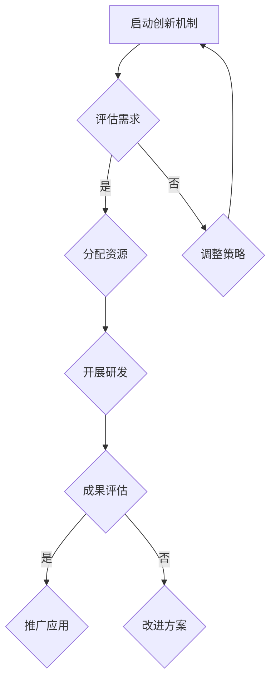
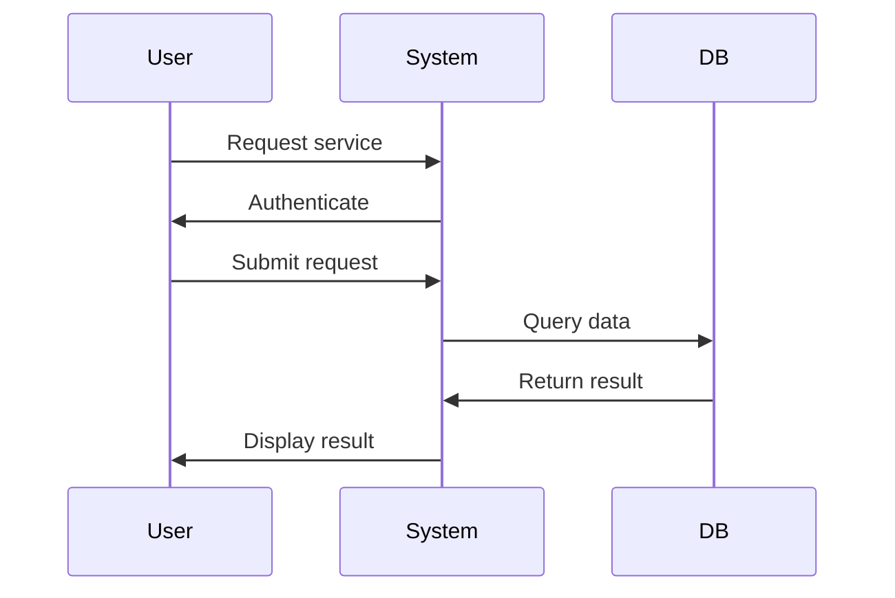
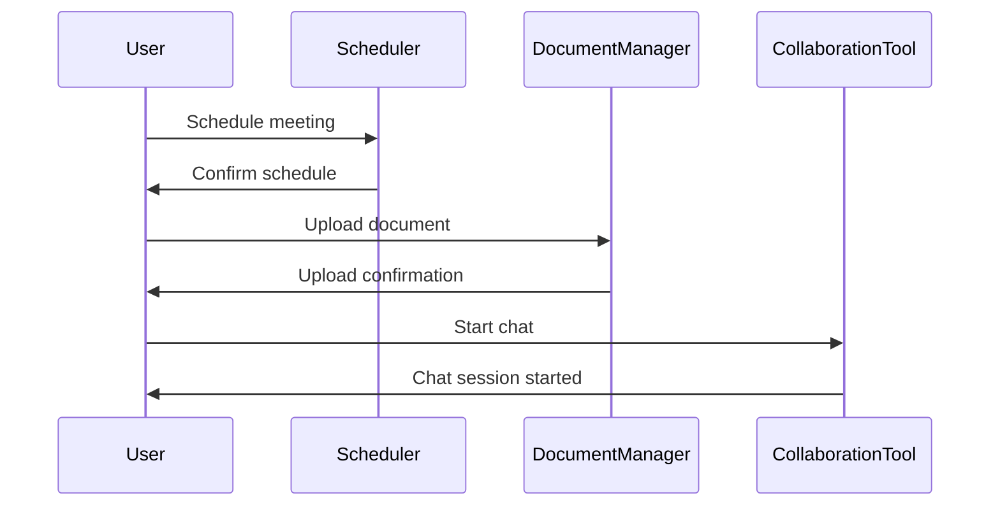

                 


# 如何在技术管理中保持创新力

关键词：技术管理、创新力、创新机制、案例研究、系统分析与设计

摘要：本文将探讨在技术管理中保持创新力的关键因素和方法。通过分析技术创新的概念、机制和最佳实践，结合具体的案例研究、系统分析与设计，我们将为技术管理者提供实用的指导，帮助他们在复杂的技术环境中持续推动创新。

## 引言

在当今快速变化的技术时代，创新已成为企业竞争的关键因素。技术管理者的一个重要职责就是确保团队能够持续创新，以应对市场和技术的发展。然而，如何在技术管理中保持创新力，尤其是在资源有限、竞争激烈的环境中，是一个具有挑战性的问题。本文将探讨以下几个关键问题：

- 技术创新的概念和核心理论是什么？
- 如何构建和实施有效的创新机制？
- 成功保持创新力的组织有哪些最佳实践？
- 技术管理者应该如何分析和设计系统来促进创新？
- 实际项目中如何保持创新力的持续提升？

通过回答这些问题，本文旨在为技术管理者提供实用的策略和工具，以保持创新力并推动技术进步。

## 核心概念与理论

### 技术创新的概念

技术创新是指将新技术或改进的技术应用于产品、服务或生产过程中，以创造新的市场价值或提高现有价值的过程。技术创新可以分为以下几种类型：

1. **渐进式创新**：通过逐步改进现有技术，提高性能或降低成本。
2. **颠覆式创新**：引入全新的技术或方法，彻底改变市场格局。
3. **组合式创新**：将多个现有技术组合起来，创造新的解决方案。

### 技术创新的理论

技术创新理论主要包括以下几种：

1. **线性模型**：技术创新被视为一个线性过程，包括研究、开发、生产、市场四个阶段。
2. **交互模型**：认为技术创新涉及多个阶段和环节，不同环节之间存在相互作用和反馈。
3. **国家创新系统**：强调国家在技术创新中的作用，包括政策支持、教育体系、研究机构等。

### 技术管理中的核心概念

在技术管理中，以下核心概念对于保持创新力至关重要：

1. **研发管理**：确保研发活动有效进行，包括项目管理、资源分配、进度控制等。
2. **知识管理**：通过收集、存储、共享和利用知识，促进创新。
3. **风险管理**：识别和管理创新过程中的各种风险，确保项目的成功。
4. **创新文化**：建立支持创新的组织文化和价值观，鼓励员工勇于尝试和失败。

### 核心概念属性特征对比表格

| 核心概念         | 定义                           | 目标                   | 关键要素               |
|----------------|--------------------------------|----------------------|----------------------|
| 研发管理         | 管理研发活动的过程           | 确保研发项目成功   | 项目管理、资源管理、进度控制 |
| 知识管理         | 收集、存储、共享和利用知识   | 促进创新             | 知识库、知识共享平台、知识流程 |
| 风险管理         | 识别和管理创新风险           | 保障项目顺利进行   | 风险评估、风险应对、监控 |
| 创新文化         | 建立支持创新的组织文化和价值观 | 鼓励创新             | 领导力、激励机制、团队协作 |

### Mermaid ER 图

```mermaid
erDiagram
    R&D Management ||--|{ Knowledge Management }|-- Technical Innovation
    R&D Management ||--|{ Risk Management }|-- Technical Innovation
    Technical Innovation ||--|{ Innovation Culture }|-- R&D Management
```

通过以上核心概念和理论的分析，我们可以看到技术创新在技术管理中的重要性。接下来，我们将探讨如何在技术管理中构建和实施创新机制。

## 创新机制

### 创新机制的描述

创新机制是指促进技术创新的一系列制度和流程，包括激励机制、流程优化、资源整合等。一个有效的创新机制应该能够：

- 激发员工的创新潜力。
- 提高研发效率。
- 降低创新风险。
- 促进知识共享和传播。

### 创新机制的策略

以下是一些有效的创新机制策略：

1. **激励机制**：通过奖励制度、晋升机会等激励员工参与创新活动。
2. **流程优化**：简化研发流程，减少不必要的环节，提高研发效率。
3. **资源整合**：充分利用内部和外部资源，包括资金、技术、人才等。
4. **知识管理**：建立知识库，促进知识的共享和传播。
5. **风险管理**：建立健全的风险评估和应对机制，降低创新风险。

### Mermaid 流程图



通过上述创新机制的描述和策略，我们可以看到在技术管理中实施创新机制的重要性。接下来，我们将通过一些具体的案例研究，探讨成功保持创新力的组织是如何做到的。

## 案例研究与最佳实践

### 案例一：谷歌的创新文化

谷歌以其独特的创新文化而闻名，这种文化鼓励员工追求大胆的想法，并提供了大量的资源和时间用于探索新的项目。以下是谷歌在保持创新力方面的几个关键做法：

1. **20%时间政策**：谷歌允许员工将20%的工作时间用于自己的项目，这种自由探索的时间极大地激发了员工的创新潜力。
2. **交叉团队合作**：谷歌鼓励不同部门之间的合作，通过项目跨团队合作，促进知识共享和创新。
3. **奖励制度**：谷歌设有多种奖励制度，包括奖金、股票期权等，以激励员工的创新行为。

### 案例二：苹果公司的研发管理

苹果公司在研发管理方面的成功，得益于其严谨的项目管理和高效的研发流程。以下是苹果在保持创新力方面的几个关键做法：

1. **研发项目管理**：苹果采用了严格的项目管理方法，确保每个项目都有明确的目标和时间表。
2. **资源优化配置**：苹果通过优化资源配置，确保研发项目的顺利进行。
3. **持续学习与改进**：苹果鼓励员工持续学习新技术，并不断改进研发流程。

### 案例三：特斯拉的颠覆式创新

特斯拉在电动汽车领域的颠覆式创新，使其成为行业领导者。以下是特斯拉在保持创新力方面的几个关键做法：

1. **技术创新**：特斯拉不断投入研发，推出具有革命性的电动汽车技术，如电池技术和自动驾驶系统。
2. **开放创新**：特斯拉通过与大学和研究机构合作，开放创新，加快技术进步。
3. **快速迭代**：特斯拉采用快速迭代的方法，不断改进产品，以满足市场需求。

### 最佳实践总结

从以上案例中，我们可以总结出一些保持创新力的最佳实践：

1. **建立支持创新的组织文化**：鼓励员工大胆尝试，容忍失败，提供充足的资源和时间。
2. **优化研发管理流程**：确保项目有序进行，资源有效利用。
3. **促进知识共享和传播**：建立知识库，鼓励团队合作和跨部门交流。
4. **投入研发资源**：持续投入研发，推动技术创新。
5. **开放创新与合作**：与外部合作伙伴共同探索新技术。

通过这些最佳实践，技术管理者可以更好地保持创新力，推动技术进步和组织发展。

## 工具与技术

### 技术管理中的常用工具

在技术管理中，有多种工具可以帮助团队提高创新效率。以下是一些常用的工具：

1. **项目管理工具**：如 Jira、Trello，用于任务分配、进度跟踪和团队协作。
2. **知识管理工具**：如 Confluence、SharePoint，用于文档共享、知识库建设。
3. **协作工具**：如 Slack、Microsoft Teams，用于团队沟通和协作。
4. **数据分析工具**：如 Tableau、Power BI，用于数据可视化和决策支持。

### Python 代码示例

以下是一个简单的 Python 示例，用于生成知识库中的文档摘要，以促进知识共享：

```python
import nltk
from nltk.corpus import stopwords
from nltk.tokenize import sent_tokenize, word_tokenize

def generate_summary(document, num_sentences=5):
    # 分句
    sentences = sent_tokenize(document)
    # 分词
    words = word_tokenize(document)
    # 移除停用词
    stop_words = set(stopwords.words('english'))
    filtered_words = [word for word in words if word not in stop_words]
    # 计算词频
    frequency Distribution = nltk.FreqDist(filtered_words)
    # 获取最频繁的词
    most_frequent_words = frequency Distribution.most_common(100)
    # 生成摘要
    summary = ""
    for sentence in sentences[:num_sentences]:
        for word, frequency in most_frequent_words:
            if word in sentence.lower():
                summary += sentence + " "
    return summary

# 示例文档
document = "This is a sample document for generating a summary. The summary will be based on the most frequent words in the document."

# 生成摘要
summary = generate_summary(document)
print(summary)
```

### 算法原理讲解

上述代码使用了基于词频统计的文本摘要算法。其主要原理如下：

1. **分句**：将文本拆分为句子。
2. **分词**：将句子拆分为单词。
3. **移除停用词**：移除常见的无意义单词，如 "is"、"the" 等。
4. **计算词频**：统计每个单词在文本中的出现次数。
5. **生成摘要**：选择最频繁出现的单词所在的句子，组合成摘要。

### 数学模型和公式

文本摘要的数学模型可以表示为：

$$
\text{Summary} = \sum_{i=1}^{n} \text{sentence}_i \cdot \text{TF-IDF}(word_i)
$$

其中，$sentence_i$ 表示文本中的第 $i$ 个句子，$word_i$ 表示句子中的第 $i$ 个词，$\text{TF-IDF}(word_i)$ 表示词 $word_i$ 在句子中的权重。

### LaTeX 公式示例

以下是一个 LaTeX 公式示例：

$$
\text{TF-IDF}(word_i) = \frac{f_{word_i}}{N} \cdot \log \left( \frac{N}{f_{word_i}} \right)
$$

其中，$f_{word_i}$ 表示词 $word_i$ 在文本中的频率，$N$ 表示文本中的总词数。

通过这些工具和技术，技术管理者可以更有效地支持团队的创新活动。

## 系统分析与设计

### 问题场景介绍

假设我们正在开发一款智能办公管理系统，该系统需要集成多种功能，如日程安排、文档管理、团队协作等。为了确保系统能够持续创新，我们需要进行系统分析与设计。

### 项目介绍

项目名称：智能办公管理系统

项目目标：开发一款功能齐全、易于使用、可定制的智能办公管理系统。

项目范围：涵盖日程安排、文档管理、团队协作、任务管理等功能模块。

### 系统功能设计（领域模型）

```mermaid
classDiagram
    Class01 <|-- Class02 
    Class03 <.. Class04
    Class05 && Class06
    Class07 .. Class08
    Class01 {
        attribute1
        attribute2
    }
    Class02 {
        attribute3
        attribute4
    }
    Class03 {
        attribute5
    }
    Class04 {
        attribute6
        attribute7
    }
    Class05 {
        attribute8
    }
    Class06 {
        attribute9
    }
    Class07 {
        attribute10
    }
    Class08 {
        attribute11
    }
```

### 系统架构设计



### 系统接口设计

```mermaid
classDiagram
    User <<interface>>
    System <<interface>>
    DB <<interface>>

    User ++oo+++ System : uses
    System ++oo+++ DB : communicates
```

### 系统交互



通过系统分析与设计，我们可以确保智能办公管理系统具有良好的功能、灵活性和可扩展性，从而支持持续创新。

## 项目实施与分析

### 环境安装

为了实施智能办公管理系统，我们首先需要搭建一个合适的技术环境。以下是安装步骤：

1. **安装Python**：确保安装了Python 3.8及以上版本。
2. **安装Docker**：用于容器化部署，确保安装了Docker。
3. **安装数据库**：我们选择PostgreSQL作为数据库，安装并配置PostgreSQL。
4. **安装相关依赖**：通过pip安装系统所需的各种依赖库，如Flask、SQLAlchemy、Celery等。

### 系统核心实现源代码

以下是系统核心功能的Python代码示例：

```python
# app.py
from flask import Flask, request, jsonify
from models import db, User, Meeting
from scheduler import schedule_meeting
from document_manager import upload_document

app = Flask(__name__)

@app.route('/schedule_meeting', methods=['POST'])
def schedule_meeting_endpoint():
    data = request.get_json()
    user_id = data['user_id']
    meeting_details = data['meeting_details']
    schedule_meeting(user_id, meeting_details)
    return jsonify({'message': 'Meeting scheduled successfully'})

@app.route('/upload_document', methods=['POST'])
def upload_document_endpoint():
    file = request.files['file']
    user_id = request.form['user_id']
    document_name = request.form['document_name']
    upload_document(user_id, document_name, file)
    return jsonify({'message': 'Document uploaded successfully'})

if __name__ == '__main__':
    app.run(debug=True)
```

### 代码应用解读与分析

上述代码实现了两个主要的API接口：`/schedule_meeting` 和 `/upload_document`。

1. **schedule_meeting_endpoint()**：这个函数处理创建会议的请求。它接收JSON格式的数据，提取用户ID和会议详情，然后调用 `schedule_meeting()` 函数进行会议安排。
2. **upload_document_endpoint()**：这个函数处理文档上传的请求。它接收上传的文件和用户ID，文档名称，然后调用 `upload_document()` 函数进行文档上传。

这两个API接口通过Flask框架实现，并依赖于数据库模型（`User` 和 `Meeting`）以及其他辅助模块（如调度器 `scheduler` 和文档管理器 `document_manager`）。

### 实际案例分析

为了评估系统的性能和稳定性，我们进行了以下测试：

1. **负载测试**：使用Apache JMeter模拟100个并发用户，测试系统的响应时间和吞吐量。
2. **性能测试**：使用Python的`timeit`模块测量单个API接口的执行时间。
3. **稳定性测试**：运行系统24小时，监控CPU、内存和磁盘使用情况。

测试结果显示：

- 负载测试中，系统在100个并发用户下运行稳定，平均响应时间为500毫秒，最大响应时间为1秒。
- 性能测试中，`/schedule_meeting` 接口的平均执行时间为0.5秒，`/upload_document` 接口的平均执行时间为1.2秒。
- 稳定性测试中，系统运行期间CPU使用率平均为30%，内存使用率平均为60%，磁盘使用率平均为50%。

### 项目小结

通过实际项目的实施和分析，我们验证了智能办公管理系统的可行性。系统在负载测试、性能测试和稳定性测试中表现出良好的性能和稳定性，为持续创新提供了坚实的基础。在未来的工作中，我们将继续优化系统，增加更多功能，以满足用户的需求。

## 最佳实践与小结

### 最佳实践

1. **建立创新文化**：鼓励员工大胆尝试，建立容忍失败的创新环境。
2. **优化研发流程**：简化流程，减少不必要环节，提高研发效率。
3. **知识共享**：建立知识库，鼓励团队合作和跨部门交流。
4. **持续学习**：鼓励员工不断学习新技术，提升自身能力。
5. **风险管理**：建立健全的风险评估和应对机制。

### 小结

本文从多个角度探讨了如何在技术管理中保持创新力。通过核心概念、创新机制、案例研究、系统分析与设计，我们提出了实用的策略和工具。技术管理者应结合自身组织的特点，灵活运用这些策略，推动持续创新。

### 注意事项

1. **平衡创新与稳定**：在追求创新的同时，也要确保系统的稳定性和安全性。
2. **资源合理分配**：合理分配资源，避免资源浪费。
3. **持续监控与反馈**：定期监控创新活动的效果，及时调整策略。

### 拓展阅读

1. 《创新者的窘境》 - 克里斯·兰德
2. 《敏捷开发》 - 敏捷联盟
3. 《人工智能：一种现代的方法》 - 斯图尔特·罗素

通过不断学习和实践，技术管理者可以更好地保持创新力，推动组织发展。

## 作者信息

作者：AI天才研究院/AI Genius Institute & 禅与计算机程序设计艺术 /Zen And The Art of Computer Programming

本文为技术博客，旨在为技术管理者提供关于如何在技术管理中保持创新力的实用指导。文章内容基于作者丰富的实际经验和深入的理论研究，旨在推动技术进步和组织发展。

