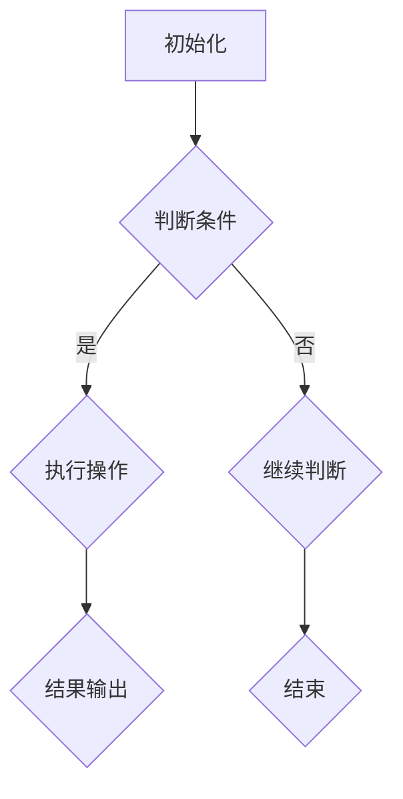

                 


## 如何培养团队的创新文化

> 关键词：创新文化、团队建设、激励、沟通、跨部门协作、可持续发展

> 摘要：本文旨在探讨如何培养团队的创新文化，通过深入分析创新文化的背景、核心概念、构建策略和实践方法，为团队管理者提供一套系统、实用、可操作的指南。文章将从多个角度出发，结合实际案例，探讨创新文化在团队中的重要性，分析当前团队创新文化的现状和问题，提出有效的构建策略和方法，并对创新文化的评估与持续发展进行深入探讨。

### 目录大纲

----------------------------------------------------------------

## 第一部分：团队创新文化的背景与意义

### 第1章：团队创新文化的概述

#### 1.1 创新文化的定义与核心要素

- **创新文化的定义**
- **创新文化的主要要素**

#### 1.2 创新文化的重要性

- **提升团队竞争力**
- **激发团队创造力**
- **促进持续发展**

### 第2章：问题背景与现状分析

#### 2.1 创新文化的现状

- **团队创新能力的现状**
- **创新文化的障碍与问题**

#### 2.2 创新文化的挑战与机遇

- **技术变革带来的挑战**
- **市场竞争带来的机遇**

## 第二部分：核心概念与联系

### 第3章：核心概念与联系

#### 3.1 创新文化与团队动力

- **创新文化的动力机制**
- **团队动力的核心因素**

#### 3.2 创新文化与组织行为

- **创新文化的组织行为表现**
- **组织行为对创新文化的影响**

### 第4章：创新文化的属性特征对比

- **创新文化与传统文化的对比**
- **创新文化在不同行业领域的特征**

## 第三部分：构建创新文化的策略与方法

### 第5章：构建创新文化的基础策略

#### 5.1 培养创新意识

- **创新意识的重要性**
- **培养创新意识的方法**

#### 5.2 建立激励机制

- **激励机制的设计原则**
- **激励机制的实施案例**

### 第6章：创新文化的具体实施方法

#### 6.1 构建开放沟通环境

- **开放沟通的重要性**
- **构建开放沟通环境的措施**

#### 6.2 促进跨部门协作

- **跨部门协作的挑战**
- **促进跨部门协作的方法**

### 第7章：创新文化的实践与案例分析

#### 7.1 案例一：谷歌的创新文化

- **谷歌的创新文化实践**
- **谷歌创新文化的启示**

#### 7.2 案例二：特斯拉的创新文化

- **特斯拉的创新文化实践**
- **特斯拉创新文化的启示**

## 第四部分：创新文化的持续发展与优化

### 第8章：创新文化的评估与监控

#### 8.1 创新文化的评估指标

- **创新文化的评估方法**
- **创新文化评估的指标体系**

#### 8.2 创新文化的监控与改进

- **创新文化的监控机制**
- **创新文化的改进措施**

### 第9章：创新文化的可持续发展

#### 9.1 创新文化的长远规划

- **创新文化的发展战略**
- **创新文化的长期规划**

#### 9.2 创新文化的国际化与本土化

- **创新文化的国际化**
- **创新文化的本土化**

## 第五部分：创新文化的最佳实践与拓展阅读

### 第10章：创新文化的最佳实践

#### 10.1 创新文化的成功案例

- **国内外成功案例分享**
- **案例中的共性与个性**

#### 10.2 创新文化的实践技巧

- **创新实践的技巧与策略**
- **创新实践中的注意事项**

### 第11章：拓展阅读与参考资料

#### 11.1 相关书籍推荐

- **创新管理经典书籍**
- **团队建设相关书籍**

#### 11.2 学术论文与研究报告

- **创新文化研究的新进展**
- **团队创新相关研究报告**

----------------------------------------------------------------

### 第一部分：团队创新文化的背景与意义

#### 1.1 创新文化的定义与核心要素

创新文化是指一种以创新为核心价值观，鼓励和支持团队成员不断探索、实践、学习、创新的文化氛围。它是团队发展过程中形成的共同价值观和行为规范，是团队持续创新的重要动力源泉。

**创新文化的核心要素**包括：

1. **开放思维**：鼓励团队成员敢于挑战现状，勇于提出新想法和新方案。
2. **自主学习**：鼓励团队成员不断提升自己的专业技能和知识水平，以适应快速变化的环境。
3. **团队协作**：鼓励团队成员相互支持、合作，共同实现创新目标。
4. **激励机制**：建立完善的激励机制，鼓励团队成员积极参与创新活动。

#### 1.2 创新文化的重要性

创新文化对团队的重要性体现在以下几个方面：

1. **提升团队竞争力**：创新文化能够激发团队的创新潜力，提高团队的竞争力，使团队在激烈的市场竞争中脱颖而出。
2. **激发团队创造力**：创新文化鼓励团队成员敢于尝试新事物，勇于挑战自我，从而激发团队的创造力。
3. **促进持续发展**：创新文化使团队能够不断适应市场变化，持续发展，实现长期战略目标。

#### 2.1 创新文化的现状

当前，许多企业在创新文化方面取得了显著成效，但仍然存在一些问题：

1. **创新能力不足**：一些团队的创新能力有限，难以适应快速变化的市场需求。
2. **沟通不畅**：团队内部缺乏有效的沟通机制，导致创新成果难以共享和推广。
3. **激励机制不足**：一些企业的激励机制不够完善，导致团队成员缺乏参与创新的积极性。

#### 2.2 创新文化的挑战与机遇

随着技术的不断进步和市场环境的变化，团队创新文化面临着新的挑战和机遇：

1. **技术变革带来的挑战**：技术的快速发展使得团队需要不断更新知识和技能，以适应新的技术环境。
2. **市场竞争带来的机遇**：激烈的市场竞争促使企业不断创新，以提升自身竞争力。

### 第二部分：核心概念与联系

#### 3.1 创新文化与团队动力

创新文化的动力机制主要包括以下几个方面：

1. **目标驱动**：团队设定明确的目标，激发团队成员的积极性和创造力。
2. **激励驱动**：通过奖励和认可来激励团队成员参与创新活动。
3. **文化驱动**：营造积极向上的创新文化氛围，使团队成员自觉参与到创新活动中。

#### 3.2 创新文化与组织行为

创新文化的组织行为表现主要体现在以下几个方面：

1. **鼓励探索**：团队鼓励成员提出新想法，勇于尝试。
2. **合作共赢**：团队成员之间相互支持，共同实现创新目标。
3. **持续改进**：团队不断优化工作流程，提高创新能力。

### 第三部分：构建创新文化的策略与方法

#### 5.1 培养创新意识

培养创新意识是构建创新文化的重要基础。以下是一些培养创新意识的方法：

1. **教育培训**：组织创新培训，提升团队成员的创新意识和能力。
2. **项目实践**：鼓励团队成员参与创新项目，积累实践经验。
3. **激励机制**：建立激励机制，鼓励团队成员积极参与创新活动。

#### 5.2 建立激励机制

建立激励机制是激发团队成员创新热情的关键。以下是一些激励机制的设计原则：

1. **公平公正**：确保激励机制公平公正，让团队成员感受到自己的努力得到认可。
2. **多样化**：根据不同团队成员的特点和需求，设计多样化的激励机制。
3. **持续激励**：激励机制需要持续改进，以适应团队发展的需要。

### 第四部分：创新文化的实践与案例分析

#### 7.1 案例一：谷歌的创新文化

谷歌以其独特的创新文化著称。以下是其创新文化的实践和启示：

1. **开放沟通**：谷歌鼓励员工自由沟通，分享自己的想法和经验。
2. **项目自主**：谷歌允许员工自主选择项目，激发创新热情。
3. **持续学习**：谷歌提供丰富的培训资源，鼓励员工不断学习，提升自身能力。

#### 7.2 案例二：特斯拉的创新文化

特斯拉以其创新的产品和商业模式赢得了全球用户的认可。以下是其创新文化的实践和启示：

1. **技术领先**：特斯拉致力于研发新技术，提升产品竞争力。
2. **人才培养**：特斯拉重视人才培养，为员工提供广阔的发展空间。
3. **市场导向**：特斯拉紧密关注市场动态，以用户需求为导向进行创新。

### 第五部分：创新文化的评估与持续发展

#### 8.1 创新文化的评估指标

创新文化的评估指标主要包括：

1. **创新能力**：团队在技术创新、产品创新、市场创新等方面的表现。
2. **创新氛围**：团队内部创新氛围的浓厚程度。
3. **激励机制**：激励机制的有效性。

#### 8.2 创新文化的监控与改进

创新文化的监控与改进主要包括以下几个方面：

1. **定期评估**：定期对创新文化进行评估，发现问题和不足，及时改进。
2. **持续改进**：根据评估结果，不断优化创新文化，提升团队创新能力。

### 第六部分：创新文化的最佳实践与拓展阅读

#### 10.1 创新文化的成功案例

国内外有许多企业在创新文化方面取得了成功，以下是一些成功案例：

1. **苹果**：苹果以其独特的创新文化，推出了众多革命性产品。
2. **三星**：三星通过持续的创新，成为全球领先的技术企业。

#### 10.2 创新文化的实践技巧

以下是一些创新文化的实践技巧：

1. **明确目标**：明确团队的创新目标，确保创新活动有的放矢。
2. **营造氛围**：营造积极向上的创新氛围，激发团队成员的创造力。
3. **激励机制**：建立有效的激励机制，鼓励团队成员积极参与创新活动。

### 第七部分：拓展阅读与参考资料

以下是一些拓展阅读和参考资料：

1. **《创新者的窘境》**：克莱顿·克里斯坦森著，探讨了企业如何在竞争激烈的市场中保持创新活力。
2. **《团队的智慧》**：斯蒂芬·罗宾斯著，介绍了团队建设和管理的方法和技巧。

## 结论

创新文化是团队发展的重要动力，通过培养团队的创新文化，企业可以提升竞争力，激发团队的创造力，实现持续发展。本文从背景、核心概念、构建策略、实践方法、评估与持续发展等方面，对如何培养团队的创新文化进行了深入探讨，并结合实际案例进行了分析。希望本文能为团队管理者提供有价值的参考和指导。

### 作者信息

作者：AI天才研究院/AI Genius Institute & 禅与计算机程序设计艺术 /Zen And The Art of Computer Programming

### 附录

本文中使用的Mermaid流程图和LaTeX公式如下：

#### Mermaid流程图示例：



#### LaTeX公式示例：

```
$$
E = mc^2
$$

$
1 < 2
$
```

### 注意事项

1. 文章中的Mermaid流程图和LaTeX公式需要按照Markdown格式进行正确编码。
2. 文章内容需保持完整性，每个小节的内容需详细具体。
3. 文章中的算法原理、数学模型和公式需要详细讲解，并结合实际案例进行说明。
4. 文章末尾需附上完整的作者信息。

