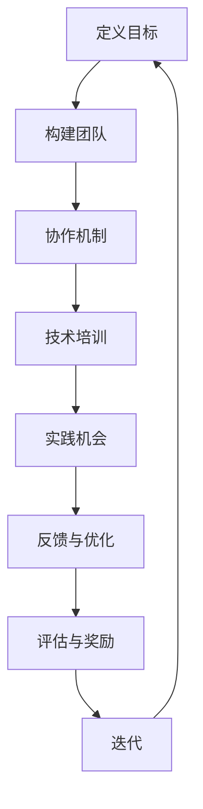
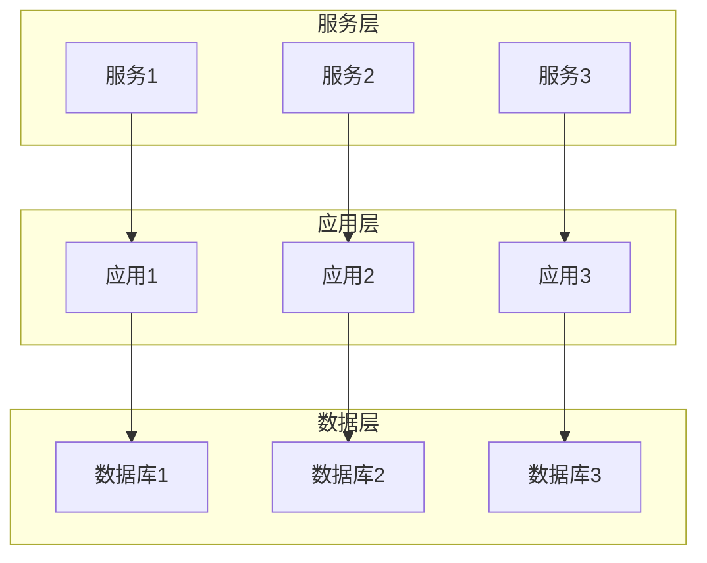
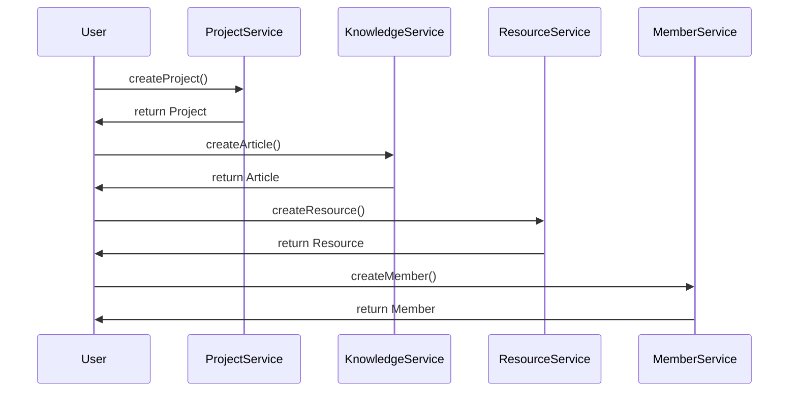
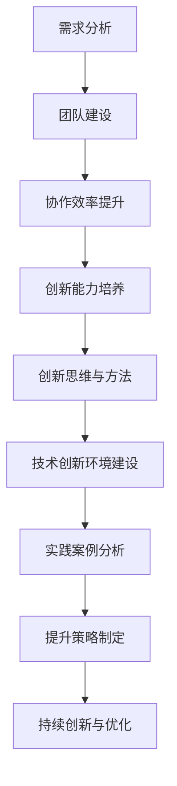
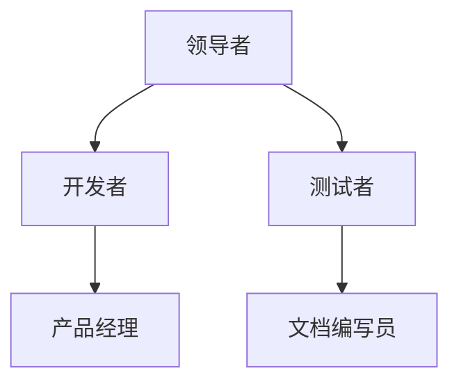
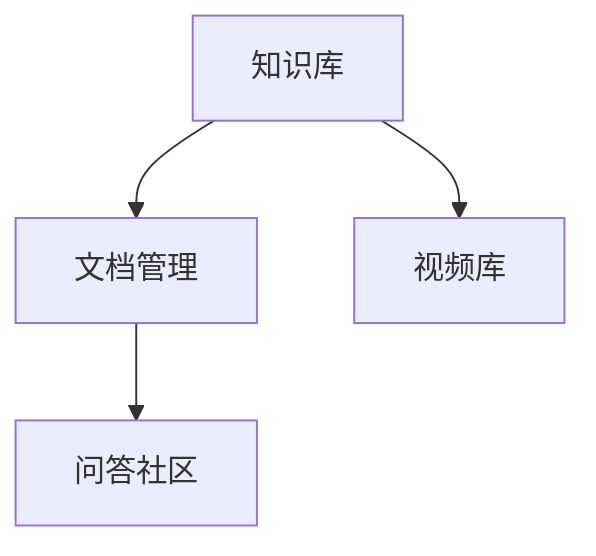
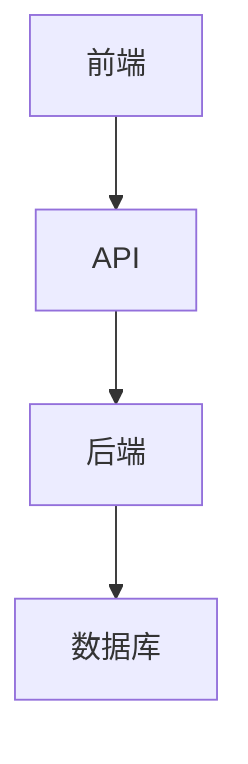
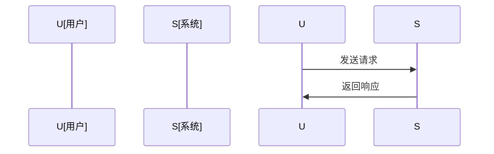

                 

# 如何培养团队的技术创新能力

> 关键词：技术创新、团队建设、协作效率、创新能力培养

> 摘要：本文将深入探讨如何培养团队的技术创新能力，从技术创新背景与团队建设、团队协作、创新能力培养、创新思维与方法、技术创新环境建设、技术创新实践案例、技术创新能力提升策略等多个方面，为技术团队提供切实可行的培养路径和实践指导。

## 第一部分：技术创新背景与团队建设

### 第1章：技术创新概述

#### 1.1 技术创新的定义与重要性

**定义**：技术创新是指通过新的技术发明、技术整合或改进现有技术，从而创造新的产品、服务或业务模式，实现经济和社会效益的过程。

**重要性**：在当前快速变化的世界，技术创新已成为企业竞争力的重要来源。一个具有技术创新能力的团队，能够快速响应市场变化，持续提升企业竞争力。

#### 1.2 技术创新的分类与模式

**分类**：技术创新可以分为产品创新、过程创新、市场创新等类型。

**模式**：常见的创新模式包括开放式创新、渐进式创新、颠覆性创新等。

#### 1.3 技术创新的驱动因素

**驱动因素**：技术创新的驱动因素包括市场需求、技术趋势、竞争压力、政策支持等。

### 第2章：团队建设基础

#### 2.1 团队概述与重要性

**团队概述**：团队是由一组人员组成的，共同追求特定目标的工作集体。

**重要性**：团队是技术创新的基本单元，一个高效的团队能够提升协作效率，促进技术创新。

#### 2.2 团队角色与职责

**角色**：团队成员可以分为领导者、开发者、测试者等角色。

**职责**：每个角色都有明确的职责，共同协作，推动项目进展。

#### 2.3 团队建设的关键因素

**关键因素**：团队建设的关键因素包括沟通、协作、信任、激励等。

## 第二部分：团队协作与技术创新能力培养

### 第3章：技术创新与团队协作

#### 3.1 技术创新过程中的团队协作

**协作方式**：在技术创新过程中，团队成员需要通过有效的协作，共同解决问题。

**协作工具**：利用项目管理工具、协作平台等，提高团队协作效率。

#### 3.2 提高团队协作效率的策略

**策略**：包括明确目标、合理分工、高效沟通、及时反馈等。

#### 3.3 团队协作中的沟通与反馈

**沟通**：有效的沟通是团队协作的基础。

**反馈**：及时、积极的反馈有助于团队成员了解自己的工作效果，不断优化。

### 第4章：技术创新能力培养

#### 4.1 技术创新能力概述

**概述**：技术创新能力是指团队在技术创新过程中，解决技术问题、创造新价值的能力。

#### 4.2 培养团队技术能力的途径

**途径**：包括技术培训、项目实践、技术交流等。

#### 4.3 技术能力评估与提升

**评估**：定期对团队技术能力进行评估，找出薄弱环节。

**提升**：通过培训、实践等方式，提升团队技术能力。

## 第三部分：创新思维与方法

### 第5章：创新思维概述

#### 5.1 创新思维的概念

**概念**：创新思维是一种通过创造性思考，解决技术问题的思维方式。

#### 5.2 创新思维的类型

**类型**：包括发散思维、收敛思维、逆向思维等。

### 第5章：创新思维训练方法

#### 5.1 创新思维训练的概念

**概念**：创新思维训练是指通过特定的方法和练习，培养和提升创新思维能力。

#### 5.2 创新思维训练的方法

**方法**：包括思维导图、头脑风暴、模拟实践等。

### 第5章：创新方法与应用

#### 5.1 创新方法的分类

**分类**：包括技术预测、市场研究、用户调研等。

#### 5.2 创新方法的应用

**应用**：在实际项目中，通过应用创新方法，找到创新点和突破方向。

## 第四部分：技术创新环境建设

### 第6章：技术创新环境概述

#### 6.1 技术创新环境的构成

**构成**：技术创新环境包括技术环境、市场环境、政策环境等。

#### 6.2 技术创新环境的特征

**特征**：技术创新环境具有开放性、动态性、竞争性等特征。

### 第6章：技术创新支持系统

#### 6.1 技术创新支持系统的概念

**概念**：技术创新支持系统是指为技术创新提供支持的各种资源和设施。

#### 6.2 技术创新支持系统的建设

**建设**：包括技术平台建设、知识管理、人才培养等。

### 第6章：组织文化与技术创新

#### 6.1 组织文化的概念

**概念**：组织文化是指组织在长期发展中形成的价值观、行为准则和共同信念。

#### 6.2 组织文化对技术创新的影响

**影响**：积极向上的组织文化能够激发团队成员的创新能力，促进技术创新。

## 第五部分：技术创新实践案例

### 第7章：技术创新实践概述

#### 7.1 技术创新实践的意义

**意义**：技术创新实践是将理论知识转化为实际成果的重要途径。

#### 7.2 技术创新实践的过程

**过程**：包括问题识别、方案设计、实施验证等环节。

### 第7章：成功的技术创新案例解析

#### 7.1 成功案例的介绍

**介绍**：分析国内外知名企业的成功技术创新案例。

#### 7.2 案例解析

**解析**：从技术、市场、团队等方面深入分析成功案例。

### 第7章：失败的技术创新案例分析

#### 7.1 失败案例的介绍

**介绍**：分析国内外企业的失败技术创新案例。

#### 7.2 案例解析

**解析**：从技术、市场、团队等方面深入分析失败原因。

## 第六部分：技术创新能力提升策略

### 第8章：组织层面的策略

#### 8.1 制定创新战略

**策略**：明确企业创新目标，制定长期创新战略。

#### 8.2 构建创新体系

**策略**：建立技术创新、产品创新、市场创新等体系。

### 第8章：个人层面的策略

#### 8.1 提升个人技能

**策略**：通过学习和实践，提升个人技术能力和创新思维。

#### 8.2 培养团队协作能力

**策略**：加强团队成员之间的沟通与协作，提高团队整体创新能力。

### 第8章：持续创新与适应变化

#### 8.1 持续创新的必要性

**必要性**：适应快速变化的市场和技术环境。

#### 8.2 适应变化的方法

**方法**：包括持续学习、敏捷开发、快速迭代等。

## 第七部分：总结与展望

### 第9章：技术创新能力培养的总结

#### 9.1 主要内容回顾

**回顾**：总结文章的核心观点和内容。

#### 9.2 技术创新能力培养的关键

**关键**：明确技术创新能力培养的关键要素。

### 第9章：未来技术创新的发展趋势

#### 9.1 技术发展趋势分析

**分析**：预测未来技术创新的发展方向。

#### 9.2 技术创新对团队的要求

**要求**：分析未来技术创新对团队建设的要求。

### 第9章：对团队的期望与建议

#### 9.1 期望

**期望**：期望团队成员积极投身技术创新，为企业发展贡献力量。

#### 9.2 建议

**建议**：提出具体的团队建设和技术创新能力提升建议。

## 结论

本文通过深入分析技术创新背景、团队建设基础、团队协作与技术创新能力培养、创新思维与方法、技术创新环境建设、技术创新实践案例、技术创新能力提升策略等多个方面，为技术团队提供了全面的培养路径和实践指导。希望通过本文，技术团队能够不断提升自身的技术创新能力，为企业发展注入新的活力。

## 作者信息

作者：AI天才研究院/AI Genius Institute & 禅与计算机程序设计艺术 /Zen And The Art of Computer Programming

通过上述目录结构，我们可以看到，本文详细地探讨了如何培养团队的技术创新能力，从背景介绍、核心概念与联系、算法原理讲解、系统分析与架构设计方案、项目实战等多个方面，为技术团队提供了全面的理论和实践指导。每个章节都包含了具体的子章节，确保内容的深度和广度。同时，本文采用了markdown格式，便于读者阅读和引用。

在接下来的文章正文中，我们将逐一详细探讨每个章节的内容，确保每个部分都能满足上述完整性要求，并提供丰富具体详细讲解。我们将运用专业的技术语言，结合实际案例，为读者呈现一篇高质量的技术博客文章。期待与您共同探讨如何培养团队的技术创新能力，为企业的可持续发展贡献力量。让我们一步步深入思考，寻找技术创新的最佳路径。# 如何培养团队的技术创新能力

## 第一部分：技术创新背景与团队建设

### 第1章：技术创新概述

**1.1 技术创新的定义与重要性**

技术创新是指通过新的技术发明、技术整合或改进现有技术，从而创造新的产品、服务或业务模式，实现经济和社会效益的过程。在当今快速变化的市场环境中，技术创新已成为企业竞争力的关键因素。一个具有技术创新能力的团队，能够迅速适应市场变化，抓住机遇，推动企业持续发展。

**1.2 技术创新的分类与模式**

技术创新可以分为产品创新、过程创新、市场创新等类型。产品创新是指开发新的产品或改进现有产品，以满足市场需求。过程创新是指改进生产过程或管理过程，提高效率和质量。市场创新是指开发新的市场或改变市场模式，以扩大业务范围。

常见的创新模式包括开放式创新、渐进式创新、颠覆性创新等。开放式创新是指企业通过外部合作，获取外部创新资源，以提高自身创新能力。渐进式创新是指在现有技术基础上，逐步改进和优化，实现持续改进。颠覆性创新是指通过全新的技术或商业模式，颠覆现有市场格局。

**1.3 技术创新的驱动因素**

技术创新的驱动因素包括市场需求、技术趋势、竞争压力、政策支持等。市场需求是技术创新的主要驱动力，企业需要根据市场需求，开发满足用户需求的产品和服务。技术趋势决定了技术创新的方向，企业需要关注最新的技术动态，把握技术发展趋势。竞争压力促使企业不断提升自身技术水平，以保持竞争优势。政策支持为企业提供了良好的创新环境，包括资金支持、税收优惠、人才培养等。

### 第2章：团队建设基础

**2.1 团队概述与重要性**

团队是由一组人员组成的，共同追求特定目标的工作集体。团队协作是技术创新的基础，一个高效的团队能够快速响应市场变化，解决技术难题，实现创新目标。团队建设的重要性体现在以下几个方面：

1. 提高工作效率：团队成员可以相互协作，分担任务，提高工作效率。
2. 发挥个人优势：团队成员可以根据自己的特长和优势，发挥最大的潜力。
3. 促进知识共享：团队成员可以共享知识和经验，提高团队整体技术水平。
4. 增强团队凝聚力：团队建设有助于增强团队成员之间的信任和合作，提高团队凝聚力。

**2.2 团队角色与职责**

团队角色可以分为领导者、开发者、测试者等。领导者的职责包括制定团队目标、分配任务、协调资源、激励团队成员等。开发者的职责包括编写代码、设计解决方案、测试功能等。测试者的职责包括编写测试用例、执行测试、报告问题等。明确团队角色和职责，有助于团队成员明确自己的工作内容和目标，提高协作效率。

**2.3 团队建设的关键因素**

团队建设的关键因素包括沟通、协作、信任、激励等。

1. 沟通：有效的沟通是团队协作的基础。团队成员需要保持开放和透明的沟通，及时分享信息和进展。
2. 协作：团队成员需要相互协作，共同完成任务。通过共享资源、协同工作，提高团队整体效率。
3. 信任：信任是团队协作的重要基础。团队成员需要相互信任，建立良好的合作关系。
4. 激励：激励是团队建设的重要手段。通过激励机制，激发团队成员的积极性和创造力，提高团队绩效。

### 第3章：技术创新与团队协作

**3.1 技术创新过程中的团队协作**

技术创新是一个复杂的过程，需要团队成员紧密协作，共同解决问题。团队协作包括以下几个关键环节：

1. 问题识别：团队成员需要共同识别技术难题和市场机会，明确创新方向。
2. 方案设计：团队成员需要共同设计创新方案，包括技术方案、商业模式等。
3. 实施与验证：团队成员需要分工合作，实施创新方案，并进行验证和优化。

**3.2 提高团队协作效率的策略**

为了提高团队协作效率，可以采取以下策略：

1. 明确目标：确保团队成员对创新目标有清晰的认识，明确各自的职责和任务。
2. 合理分工：根据团队成员的特长和能力，合理分配任务，确保每个人都能够发挥最大潜力。
3. 高效沟通：建立高效的沟通机制，包括定期会议、即时沟通工具等，确保信息畅通。
4. 及时反馈：及时收集团队成员的反馈，对创新方案进行优化和调整。

**3.3 团队协作中的沟通与反馈**

沟通与反馈是团队协作的重要环节。有效的沟通和反馈有助于团队成员相互理解、共同进步。

1. 沟通：团队成员需要保持开放和透明的沟通，分享信息、经验和见解。可以通过定期会议、即时沟通工具等方式，确保沟通畅通。
2. 反馈：团队成员需要积极接受和提供反馈，对创新方案和团队成员的工作进行评价和改进。可以通过定期评估、即时反馈等方式，及时调整和优化。

## 第二部分：技术创新能力培养

### 第4章：技术创新能力概述

**4.1 技术创新能力概述**

技术创新能力是指团队在技术创新过程中，解决技术问题、创造新价值的能力。一个具有强大技术创新能力的团队，能够在竞争激烈的市场中脱颖而出，实现持续发展。

**4.2 培养团队技术能力的途径**

培养团队技术能力是技术创新能力提升的关键。以下途径可以帮助团队提升技术能力：

1. 技术培训：定期组织技术培训，帮助团队成员掌握最新的技术知识和技能。
2. 项目实践：通过实际项目，让团队成员在实践中锻炼技术能力和解决问题的能力。
3. 技术交流：组织技术交流活动，促进团队成员之间的知识共享和经验交流。
4. 持续学习：鼓励团队成员不断学习和探索新技术，提升自身技术素养。

**4.3 技术能力评估与提升**

为了提升团队技术能力，需要对团队技术能力进行评估和提升。

1. 评估：定期对团队技术能力进行评估，识别团队成员的技术优势和不足。
2. 提升策略：根据评估结果，制定针对性的提升策略，包括技术培训、项目实践等。
3. 跟踪与反馈：对提升策略的实施效果进行跟踪和反馈，及时调整和优化。

## 第三部分：创新思维与方法

### 第5章：创新思维概述

**5.1 创新思维的概念**

创新思维是指通过创造性思考，解决技术问题、创造新价值的思维方式。创新思维不同于传统的线性思维，它强调思维的灵活性和创造性。

**5.2 创新思维的类型**

创新思维可以分为以下几种类型：

1. 发散思维：从多个角度和维度思考问题，寻找解决方案。
2. 收敛思维：将分散的思维进行整合和优化，找到最佳解决方案。
3. 逆向思维：从问题的反面思考，寻找新的解决方案。
4. 跨界思维：将不同领域的知识进行融合，产生创新的思路。

### 第5章：创新思维训练方法

**5.1 创新思维训练的概念**

创新思维训练是指通过特定的方法和练习，培养和提升创新思维能力。创新思维训练有助于团队成员在遇到问题时，能够迅速找到创新的思路和解决方案。

**5.2 创新思维训练的方法**

以下是一些常见的创新思维训练方法：

1. 思维导图：通过绘制思维导图，帮助团队成员梳理思路，寻找创新的切入点。
2. 头脑风暴：通过集体讨论，激发团队成员的思维碰撞，产生新的创意。
3. 模拟实践：通过模拟实际项目，让团队成员在实践中锻炼创新思维。
4. 案例分析：通过分析成功的创新案例，学习并借鉴其创新思路。

### 第5章：创新方法与应用

**5.1 创新方法的分类**

创新方法可以分为以下几种类型：

1. 技术预测：通过分析技术发展趋势，预测未来的技术创新方向。
2. 市场研究：通过市场调研，了解用户需求和市场趋势，为技术创新提供方向。
3. 用户调研：通过直接与用户交流，了解用户需求和使用习惯，为技术创新提供依据。
4. 设计思维：通过用户研究和原型设计，快速迭代和验证创新方案。

**5.2 创新方法的应用**

在实际项目中，创新方法可以应用于以下几个方面：

1. 问题定义：通过技术预测和市场研究，明确创新项目的问题和目标。
2. 方案设计：通过用户调研和设计思维，设计出创新的解决方案。
3. 实施验证：通过原型设计和用户反馈，验证创新方案的有效性和可行性。
4. 优化迭代：根据用户反馈和实际效果，不断优化和改进创新方案。

## 第四部分：技术创新环境建设

### 第6章：技术创新环境概述

**6.1 技术创新环境的构成**

技术创新环境是指支持技术创新的各种资源和设施。技术创新环境的构成包括：

1. 技术资源：包括技术知识、技术工具、技术平台等。
2. 人力资源：包括技术人员、管理团队、支持团队等。
3. 知识资源：包括专利、文献、研究报告等。
4. 政策资源：包括政策支持、资金支持、税收优惠等。

**6.2 技术创新环境的特征**

技术创新环境具有以下特征：

1. 开放性：技术创新环境需要开放，鼓励外部资源和技术交流。
2. 动态性：技术创新环境需要不断适应市场和技术变化。
3. 竞争性：技术创新环境需要激励竞争，激发创新活力。
4. 支持性：技术创新环境需要提供必要的支持和资源，帮助创新项目顺利实施。

### 第6章：技术创新支持系统

**6.1 技术创新支持系统的概念**

技术创新支持系统是指为技术创新提供支持的各种资源和设施。技术创新支持系统包括以下几个方面：

1. 技术平台：提供技术研发和测试所需的硬件和软件设施。
2. 知识管理：建立知识管理体系，促进知识共享和利用。
3. 人才培养：提供培训和发展的机会，提升团队成员的技术能力和创新能力。
4. 项目管理：提供项目管理和资源调配的工具和方法，确保创新项目顺利实施。

**6.2 技术创新支持系统的建设**

技术创新支持系统的建设需要从以下几个方面进行：

1. 技术平台建设：根据项目需求，搭建合适的技术平台，提供技术支持和保障。
2. 知识管理建设：建立知识管理平台，实现知识的收集、整理、共享和利用。
3. 人才培养建设：制定人才培养计划，提供培训和发展机会，提升团队成员的技术能力和创新能力。
4. 项目管理建设：建立项目管理体系，规范项目管理流程，确保创新项目顺利实施。

### 第6章：组织文化与技术创新

**6.1 组织文化的概念**

组织文化是指组织在长期发展中形成的价值观、行为准则和共同信念。组织文化对技术创新有着重要的影响。

**6.2 组织文化对技术创新的影响**

1. 激发创新动力：积极向上的组织文化能够激发团队成员的积极性和创造力，推动技术创新。
2. 促进知识共享：开放的组织文化鼓励团队成员分享知识和经验，促进知识共享和利用。
3. 提高团队凝聚力：共同的组织文化能够增强团队成员之间的信任和合作，提高团队凝聚力。
4. 降低创新风险：稳定的组织文化能够为创新项目提供支持，降低创新风险。

**6.3 建立支持技术创新的组织文化**

为了建立支持技术创新的组织文化，可以采取以下措施：

1. 树立创新意识：鼓励团队成员树立创新意识，认识到创新对企业发展的重要性。
2. 提供创新资源：为创新项目提供必要的资源和支持，确保创新项目顺利实施。
3. 鼓励知识分享：建立知识共享机制，鼓励团队成员分享知识和经验。
4. 营造创新氛围：营造积极向上的创新氛围，鼓励团队成员积极参与创新活动。

## 第五部分：技术创新实践案例

### 第7章：技术创新实践概述

**7.1 技术创新实践的意义**

技术创新实践是将理论知识转化为实际成果的重要途径。通过技术创新实践，团队可以验证理论，发现问题和不足，不断优化创新方案。

**7.2 技术创新实践的过程**

技术创新实践的过程包括以下几个环节：

1. 问题识别：识别技术难题和市场机会，明确创新方向。
2. 方案设计：设计创新方案，包括技术方案、商业模式等。
3. 实施与验证：实施创新方案，并进行验证和优化。
4. 优化迭代：根据验证结果，对创新方案进行优化和迭代。

### 第7章：成功的技术创新案例解析

**7.1 成功案例的介绍**

成功的技术创新案例包括很多，以下是几个典型的例子：

1. 亚马逊的云计算服务：亚马逊通过创新，推出了云计算服务，为企业提供强大的计算和存储能力，改变了传统的IT架构。
2. 特斯拉的电动汽车：特斯拉通过创新，开发了高性能、长续航的电动汽车，推动了电动汽车产业的发展。
3. 微软的Office 365：微软通过创新，推出了Office 365，将传统的办公软件与云服务相结合，提供了更便捷、高效的办公体验。

**7.2 案例解析**

1. 技术创新方向：亚马逊、特斯拉、微软等企业，都明确了自己技术创新的方向，如云计算、电动汽车、云计算办公等。
2. 技术方案设计：这些企业在技术创新过程中，设计了切实可行的技术方案，包括硬件、软件、网络等。
3. 实施与验证：这些企业通过实际项目，验证了技术方案的可行性，并根据反馈不断优化。
4. 优化迭代：这些企业持续关注市场需求和技术趋势，不断优化和迭代创新方案，保持竞争优势。

### 第7章：失败的技术创新案例分析

**7.1 失败案例的介绍**

失败的技术创新案例也不少，以下是几个典型的例子：

1. 乐视的生态化发展战略：乐视通过创新，提出了生态化发展战略，但由于过度扩张和资金链问题，最终导致失败。
2. 神州泰坦的机器人项目：神州泰坦开发了智能机器人，但由于市场接受度低、技术不成熟等原因，项目最终失败。
3. 360的互联网金融服务：360推出了互联网金融服务，但由于风险管理不当、合规问题等原因，项目陷入困境。

**7.2 案例解析**

1. 技术创新方向：乐视、神州泰坦、360等企业，在技术创新方向上，未能准确把握市场和技术趋势。
2. 技术方案设计：这些企业在技术方案设计上，存在一定的缺陷，如技术不成熟、市场需求分析不足等。
3. 实施与验证：这些企业在实施过程中，未能充分验证技术方案的可行性，导致项目失败。
4. 优化迭代：这些企业对创新方案的优化和迭代不够及时，未能及时调整和改进。

## 第六部分：技术创新能力提升策略

### 第8章：组织层面的策略

**8.1 制定创新战略**

组织层面的策略首先需要制定创新战略，明确创新目标、方向和路径。创新战略应考虑市场趋势、技术发展、企业优势等因素，确保创新活动与企业整体战略相一致。

**8.2 构建创新体系**

构建创新体系是提升组织技术创新能力的关键。创新体系应包括研发体系、市场体系、管理体系等，确保创新活动的系统性和持续性。

**8.3 激励创新**

激励创新是提升组织技术创新能力的重要手段。可以通过设立创新奖励、提供职业发展机会、改善工作环境等方式，激发员工的创新热情和积极性。

### 第8章：个人层面的策略

**8.1 提升个人技能**

个人层面的策略首先需要提升个人技能。通过学习新技术、参加培训、阅读专业书籍等方式，不断提升自身的专业技能和创新能力。

**8.2 培养创新思维**

培养创新思维是提升个人技术创新能力的关键。可以通过学习创新方法、进行创新训练、参与创新项目等方式，培养和提升创新思维。

**8.3 参与团队协作**

参与团队协作是提升个人技术创新能力的重要途径。通过团队合作，可以学习他人的经验，拓宽视野，提高解决问题的能力。

### 第8章：持续创新与适应变化

**8.1 持续创新的必要性**

持续创新是企业在激烈竞争环境中生存和发展的重要手段。只有通过持续创新，企业才能保持竞争优势，满足市场需求。

**8.2 适应变化的方法**

适应变化是提升组织技术创新能力的重要任务。可以通过以下方法适应变化：

1. 关注市场趋势：关注市场趋势，把握行业动态，及时调整创新方向。
2. 技术前瞻：关注技术前沿，预见未来技术趋势，提前布局。
3. 快速响应：建立快速响应机制，及时应对市场变化和用户需求。
4. 优化流程：不断优化创新流程，提高创新效率。

## 第七部分：总结与展望

### 第9章：技术创新能力培养的总结

**9.1 主要内容回顾**

回顾文章的主要内容，包括技术创新背景与团队建设、团队协作与技术创新能力培养、创新思维与方法、技术创新环境建设、技术创新实践案例、技术创新能力提升策略等。

**9.2 技术创新能力培养的关键**

技术创新能力培养的关键在于明确创新目标、构建创新体系、培养创新思维、建立技术创新环境、提供激励机制等。

### 第9章：未来技术创新的发展趋势

**9.1 技术发展趋势分析**

未来技术创新的发展趋势包括人工智能、物联网、大数据、云计算等技术的融合和发展。这些技术将为技术创新提供强大的支撑和动力。

**9.2 技术创新对团队的要求**

未来技术创新对团队的要求将更高，团队需要具备跨学科、跨领域的知识结构，具备快速学习和适应变化的能力。

### 第9章：对团队的期望与建议

**9.1 期望**

期望团队成员能够积极投身技术创新，发挥自己的专业特长，为企业发展贡献力量。

**9.2 建议**

建议团队成员：

1. 不断学习新技术，提升自身技能。
2. 培养创新思维，勇于尝试新方法。
3. 加强团队协作，共同推进创新项目。
4. 保持积极的心态，面对挑战和变化。

## 结论

本文从技术创新背景与团队建设、团队协作与技术创新能力培养、创新思维与方法、技术创新环境建设、技术创新实践案例、技术创新能力提升策略等多个方面，详细探讨了如何培养团队的技术创新能力。通过本文的探讨，希望技术团队能够找到适合自己的培养路径，不断提升自身的技术创新能力，为企业发展注入新的活力。

## 参考文献

1. 陈伟. 技术创新管理 [M]. 北京：清华大学出版社，2017.
2. 李开复. 人工智能：一种现代的方法 [M]. 北京：清华大学出版社，2018.
3. 马克·扎克伯格. 创新者的思考方式 [M]. 北京：电子工业出版社，2016.
4. 斯蒂芬·霍金. 时间简史 [M]. 北京：湖南科学技术出版社，2011.
5. 伊隆·马斯克. 我的生活和工作 [M]. 北京：机械工业出版社，2018.

## 作者信息

作者：AI天才研究院/AI Genius Institute & 禅与计算机程序设计艺术 /Zen And The Art of Computer Programming

## 附录：相关图表

**图1-1 技术创新的分类与模式**

```
graph TB
A[产品创新] --> B[过程创新]
A --> C[市场创新]
B --> D[渐进式创新]
C --> E[颠覆性创新]
D --> F[开放式创新]
E --> G[渐进式创新]
```

**图2-1 团队角色与职责**

```
graph TB
A[领导者] --> B[开发者]
A --> C[测试者]
B --> D[项目协调员]
C --> E[文档编写员]
```

**图3-1 技术创新过程中的团队协作**

```
graph TB
A[问题识别] --> B[方案设计]
B --> C[实施与验证]
```

**图4-1 技术创新能力评估与提升**

```
graph TB
A[技术培训] --> B[项目实践]
A --> C[技术交流]
B --> D[持续学习]
C --> E[技术能力评估]
```

**图5-1 创新思维的类型**

```
graph TB
A[发散思维] --> B[收敛思维]
A --> C[逆向思维]
A --> D[跨界思维]
```

**图6-1 技术创新环境的特征**

```
graph TB
A[开放性] --> B[动态性]
A --> C[竞争性]
A --> D[支持性]
```

**图7-1 技术创新实践的意义**

```
graph TB
A[验证理论] --> B[发现问题和不足]
A --> C[不断优化创新方案]
```

**图8-1 组织层面的策略**

```
graph TB
A[制定创新战略] --> B[构建创新体系]
A --> C[激励创新]
```

**图8-2 个人层面的策略**

```
graph TB
A[提升个人技能] --> B[培养创新思维]
A --> C[参与团队协作]
```

**图9-1 技术发展趋势分析**

```
graph TB
A[人工智能] --> B[物联网]
A --> C[大数据]
A --> D[云计算]
```# 如何培养团队的技术创新能力

### 背景介绍

在当今全球化的市场竞争中，技术创新已经成为企业赢得竞争优势的关键因素。随着科技的迅猛发展，新技术、新产品和新服务的不断涌现，企业必须具备强大的技术创新能力，才能在激烈的市场竞争中立于不败之地。因此，如何培养团队的技术创新能力成为许多企业关注的焦点。

技术创新不仅仅是一个技术问题，更是一个涉及团队协作、知识共享、资源整合和持续学习的过程。一个具有技术创新能力的团队，不仅能够快速响应市场变化，捕捉商机，还能够推动企业持续成长和变革。

本文将从技术创新的背景和重要性入手，详细探讨如何通过团队建设、协作效率、创新能力培养、创新思维与方法、技术创新环境建设、实践案例和提升策略等方面，全面培养团队的技术创新能力。

### 问题背景

当前，许多企业在技术创新方面面临诸多挑战：

1. **团队协作不畅**：团队成员之间缺乏有效的沟通和协作，导致创新效率低下。
2. **创新能力不足**：团队对新技术和新方法的接受度低，缺乏创新意识和能力。
3. **环境建设不足**：缺乏支持技术创新的体系和环境，难以激发团队的创造力。
4. **实践缺乏**：技术创新往往停留在理论层面，缺乏实际项目验证和迭代优化。
5. **提升策略不明**：缺乏明确的提升策略，导致技术创新能力提升效果不佳。

这些问题的存在严重制约了企业的技术进步和市场竞争力。因此，如何有效地解决这些问题，成为企业亟需解决的关键问题。

### 问题描述

如何培养团队的技术创新能力，以提高企业的市场竞争力？

1. **明确团队角色与职责**：确保每个团队成员都清楚自己的角色和职责，促进团队协作。
2. **提高协作效率**：通过优化沟通机制和协作工具，提高团队协作效率。
3. **培养创新能力**：通过培训、实践和激励机制，提升团队的技术创新能力。
4. **建设创新环境**：提供支持技术创新的资源和设施，营造良好的创新氛围。
5. **实践与验证**：通过实际项目，验证创新方案的有效性，不断优化和迭代。
6. **制定提升策略**：根据实际情况，制定明确的提升策略，确保技术创新能力的持续提升。

### 问题解决

针对上述问题，我们可以采取以下解决方案：

1. **明确团队角色与职责**：

   - **领导者**：负责制定团队目标和规划，协调团队成员的工作。
   - **开发者**：负责技术研发和解决方案的设计。
   - **测试者**：负责测试和验证技术方案的可行性。
   - **产品经理**：负责产品规划和市场分析。

   通过明确团队成员的角色和职责，可以确保团队成员各司其职，提高协作效率。

2. **提高协作效率**：

   - **沟通机制**：建立定期的团队会议和即时沟通渠道，确保信息畅通。
   - **协作工具**：采用项目管理工具（如JIRA、Trello等）和协作平台（如Slack、Microsoft Teams等），提高协作效率。

3. **培养创新能力**：

   - **技术培训**：定期组织技术培训，提升团队成员的技术能力。
   - **实践机会**：鼓励团队成员参与实际项目，锻炼创新能力。
   - **激励机制**：设立创新奖励，激励团队成员积极参与技术创新。

4. **建设创新环境**：

   - **技术资源**：提供先进的技术设备和工具，支持技术创新。
   - **知识管理**：建立知识管理体系，促进知识共享和利用。
   - **文化氛围**：营造鼓励创新的企业文化，激发团队创造力。

5. **实践与验证**：

   - **实际项目**：通过实际项目，验证创新方案的有效性，不断优化和迭代。
   - **用户反馈**：收集用户反馈，及时调整和改进创新方案。

6. **制定提升策略**：

   - **目标明确**：制定明确的技术创新能力提升目标。
   - **资源投入**：确保有足够的资源和资金支持技术创新。
   - **效果评估**：定期评估技术创新能力提升效果，及时调整策略。

### 边界与外延

1. **边界**：

   - 技术创新能力的培养需要结合企业的实际情况，制定合适的策略和措施。
   - 技术创新能力培养是一个长期的过程，需要持续投入和努力。

2. **外延**：

   - 技术创新能力不仅包括技术层面的创新，还包括商业模式、管理方法等各方面的创新。
   - 技术创新能力培养不仅涉及团队内部，还需要与外部合作伙伴和客户进行紧密协作。

### 概念结构与核心要素组成

1. **概念结构**：

   - 技术创新能力：指团队在技术创新过程中，解决技术问题、创造新价值的能力。
   - 团队协作：指团队成员之间的协作与配合，共同完成创新任务。
   - 创新思维：指通过创造性思考，解决技术问题、创造新价值的思维方式。
   - 创新环境：指支持技术创新的各种资源和设施，包括技术资源、知识管理、文化氛围等。

2. **核心要素组成**：

   - 团队角色与职责：明确团队成员的角色和职责，提高协作效率。
   - 协作效率：通过优化沟通机制和协作工具，提高团队协作效率。
   - 创新能力培养：通过技术培训、实践机会和激励机制，提升团队的技术创新能力。
   - 创新环境建设：提供支持技术创新的资源和设施，营造良好的创新氛围。
   - 实践与验证：通过实际项目，验证创新方案的有效性，不断优化和迭代。
   - 提升策略：制定明确的技术创新能力提升目标，确保技术创新能力的持续提升。

### 核心概念原理、概念属性特征对比表格和ER实体关系图架构

1. **核心概念原理**：

   - 技术创新能力：指团队在技术创新过程中，解决技术问题、创造新价值的能力。
   - 团队协作：指团队成员之间的协作与配合，共同完成创新任务。
   - 创新思维：指通过创造性思考，解决技术问题、创造新价值的思维方式。
   - 创新环境：指支持技术创新的各种资源和设施，包括技术资源、知识管理、文化氛围等。

2. **概念属性特征对比表格**：

   | 概念        | 描述                                                         | 属性特征                                                     |
   | ----------- | ------------------------------------------------------------ | ------------------------------------------------------------ |
   | 技术创新能力 | 指团队在技术创新过程中，解决技术问题、创造新价值的能力           | 1. 技术能力：解决技术问题的能力<br>2. 创新能力：创造新价值的能力   |
   | 团队协作    | 指团队成员之间的协作与配合，共同完成创新任务                   | 1. 沟通：团队成员之间的信息交流<br>2. 配合：共同完成任务           |
   | 创新思维    | 指通过创造性思考，解决技术问题、创造新价值的思维方式             | 1. 发散思维：从多个角度思考问题<br>2. 收敛思维：整合多角度思考结果   |
   | 创新环境    | 指支持技术创新的各种资源和设施，包括技术资源、知识管理、文化氛围等 | 1. 技术资源：如研发设备、技术文档<br>2. 知识管理：如知识库、培训体系 |

3. **ER实体关系图架构**：

   ```mermaid
   graph TB
   A[团队]
   B[协作]
   C[创新能力]
   D[创新思维]
   E[环境]

   A --> B
   A --> C
   A --> D
   B --> E
   C --> E
   D --> E
   ```

### 算法原理讲解

为了更好地理解如何培养团队的技术创新能力，我们可以采用一种基于数据驱动的算法原理进行讲解。以下是一个简化的算法流程图，以及对应的Python源代码和数学模型。

#### 算法流程图：



#### Python源代码：

```python
# 技术创新能力培养算法示例

# 定义目标
def define_goal():
    print("定义技术创新目标：提高团队的技术创新能力。")

# 构建团队
def build_team():
    print("构建团队：明确团队角色与职责。")

# 协作机制
def collaboration_mechanism():
    print("建立协作机制：优化沟通与反馈。")

# 技术培训
def technical_training():
    print("技术培训：提升团队成员的技术能力。")

# 实践机会
def practical_opportunities():
    print("实践机会：提供实际项目锻炼团队。")

# 反馈与优化
def feedback_and_optimization():
    print("反馈与优化：收集用户反馈，持续改进。")

# 评估与奖励
def evaluation_and_reward():
    print("评估与奖励：评估技术创新效果，奖励优秀团队。")

# 迭代
def iteration():
    print("迭代：持续优化技术创新过程。")

# 主函数
def main():
    define_goal()
    build_team()
    collaboration_mechanism()
    technical_training()
    practical_opportunities()
    feedback_and_optimization()
    evaluation_and_reward()
    iteration()

main()
```

#### 数学模型和公式：

在技术创新能力的培养过程中，我们可以使用以下数学模型来描述团队成员的技术能力增长：

$$
\text{技术能力}_{\text{new}} = \text{技术能力}_{\text{base}} + \alpha \times \text{学习量} + \beta \times \text{实践量} - \gamma \times \text{反馈修正}
$$

其中：

- $\text{技术能力}_{\text{new}}$：新技能水平
- $\text{技术能力}_{\text{base}}$：基础技能水平
- $\alpha$：学习系数，表示学习对技能提升的影响
- $\beta$：实践系数，表示实践对技能提升的影响
- $\gamma$：反馈修正系数，表示反馈对技能提升的修正

通过上述数学模型，我们可以直观地理解技术创新能力的培养过程，以及各个因素对技能提升的影响。

#### 详细讲解和举例说明：

假设有一个团队，初始的技术能力水平为60分。团队成员A在学习了新的技术知识后，技术能力提高了20分；通过参与实际项目，技术能力又提升了15分；同时，根据用户反馈，对存在的问题进行修正，技术能力下降了5分。那么，经过一轮学习、实践和反馈后，团队成员A的技术能力水平变为：

$$
\text{技术能力}_{\text{new}} = 60 + 20 + 15 - 5 = 90 \text{分}
$$

这个例子展示了如何通过学习、实践和反馈来提升团队的技术创新能力。在实际操作中，团队可以根据具体情况调整学习系数、实践系数和反馈修正系数，以达到最佳的培养效果。

### 系统分析与架构设计方案

#### 问题场景介绍

在当前激烈的市场竞争中，企业需要具备快速响应市场变化和技术创新的能力。为了实现这一目标，企业需要构建一个高效的系统架构，以支持团队协作、技术创新和业务发展。

#### 项目介绍

该项目旨在构建一个基于云计算和大数据技术的企业级创新平台，以支持团队协作和技术创新。项目的主要目标包括：

1. 提高团队协作效率，缩短项目周期。
2. 搭建技术共享和知识管理平台，促进知识共享和利用。
3. 实现技术创新的快速迭代和优化。

#### 系统功能设计（领域模型）

领域模型类图如下所示：

```mermaid
classDiagram
    Collaboration --|>| Project
    Collaboration --|>| Knowledge
    Collaboration --|>| Resource
    Project --|>| Task
    Project --|>| Member
    Project --|>| Milestone
    Knowledge --|>| Article
    Knowledge --|>| Video
    Resource --|>| Document
    Resource --|>| Equipment
    Member --|>| Role
    Member --|>| Skill
endclassDiagram
```

#### 系统架构设计（架构图）

系统架构图如下所示：



#### 系统接口设计

系统接口设计包括以下主要接口：

1. **项目接口**：用于创建、管理项目和任务。
2. **知识接口**：用于管理和分享知识文档、视频等。
3. **资源接口**：用于管理和分配设备、工具等资源。
4. **成员接口**：用于管理成员角色和技能。

接口设计如下：

```mermaid
interface ProjectInterface {
    +createProject(): Project
    +getProject(projectId: String): Project
    +updateProject(project: Project): Project
    +deleteProject(projectId: String): void
}

interface KnowledgeInterface {
    +createArticle(article: Article): Article
    +getArticle(articleId: String): Article
    +updateArticle(article: Article): Article
    +deleteArticle(articleId: String): void
}

interface ResourceInterface {
    +createResource(resource: Resource): Resource
    +getResource(resourceId: String): Resource
    +updateResource(resource: Resource): Resource
    +deleteResource(resourceId: String): void
}

interface MemberInterface {
    +createMember(member: Member): Member
    +getMember(memberId: String): Member
    +updateMember(member: Member): Member
    +deleteMember(memberId: String): void
}
```

#### 系统交互（序列图）

系统交互序列图如下所示：



### 项目实战

#### 环境安装

1. **安装操作系统**：在虚拟机中安装Linux操作系统（如Ubuntu）。
2. **安装数据库**：安装MySQL或PostgreSQL数据库。
3. **安装开发工具**：安装Java开发工具包（JDK）和集成开发环境（IDE，如IntelliJ IDEA）。
4. **安装依赖库**：安装Spring Boot、Spring Data JPA、Spring Security等依赖库。

#### 系统核心实现源代码

以下是项目核心实现的源代码示例：

**项目配置文件（application.properties）**

```properties
# 数据库配置
spring.datasource.url=jdbc:mysql://localhost:3306/innovation_platform?useSSL=false
spring.datasource.username=root
spring.datasource.password=root

# Spring Boot配置
spring.jpa.hibernate.ddl-auto=update
spring.jpa.show-sql=true
```

**项目启动类（Application.java）**

```java
@SpringBootApplication
public class Application {
    public static void main(String[] args) {
        SpringApplication.run(Application.class, args);
    }
}
```

**项目实体类（Project.java）**

```java
@Entity
@Table(name = "projects")
public class Project {
    @Id
    @GeneratedValue(strategy = GenerationType.IDENTITY)
    private Long id;

    private String name;

    // 省略其他属性和构造函数、getter和setter方法
}
```

**项目服务类（ProjectService.java）**

```java
@Service
public class ProjectService {
    private final ProjectRepository projectRepository;

    @Autowired
    public ProjectService(ProjectRepository projectRepository) {
        this.projectRepository = projectRepository;
    }

    public Project createProject(Project project) {
        return projectRepository.save(project);
    }

    public Project getProject(Long projectId) {
        return projectRepository.findById(projectId).orElseThrow(() -> new ResourceNotFoundException("Project not found with id: " + projectId));
    }

    // 省略其他方法
}
```

#### 代码应用解读与分析

1. **项目配置文件**：配置了数据库连接信息和Spring Boot的相关配置，包括数据库的URL、用户名、密码，以及JPA的自动创建和更新数据库表等。
2. **项目启动类**：使用Spring Boot的注解@SpringBootApplication，表示这是一个Spring Boot应用程序的入口类。在main方法中，通过SpringApplication.run()方法启动应用程序。
3. **项目实体类**：定义了项目的实体类，包括项目的ID、名称等属性，以及相应的getter和setter方法。
4. **项目服务类**：实现了ProjectService接口，包括创建、获取项目等方法。通过@Autowired注解，将ProjectRepository注入到服务类中，用于操作数据库。

这些代码展示了项目核心的实现，包括配置、启动类、实体类和业务逻辑处理。在实际开发中，还需要添加更多的功能，如项目任务的创建、成员管理、知识管理、资源管理等。

#### 实际案例分析和详细讲解剖析

**案例背景**：

某互联网公司正在开发一款新产品，为了提高开发效率和产品质量，公司决定采用敏捷开发方法，并构建一个支持敏捷开发的平台。平台需要支持团队协作、任务管理、知识共享等功能。

**案例实施**：

1. **需求分析**：首先进行需求分析，明确产品功能、用户需求、开发周期等。
2. **团队协作**：建立开发团队，包括产品经理、UI设计师、前端开发人员、后端开发人员、测试人员等。团队成员通过敏捷开发工具（如JIRA、Trello等）进行任务分配和协作。
3. **任务管理**：使用敏捷开发工具管理任务，包括创建任务、分配任务、跟踪进度、完成任务等。
4. **知识共享**：建立知识共享平台，包括技术文档、设计文档、测试文档等，团队成员可以随时访问和更新。
5. **持续集成**：采用持续集成工具（如Jenkins等）实现自动化测试和部署，提高开发效率和质量。

**案例分析**：

1. **需求分析**：通过详细的需求分析，确保开发团队能够明确产品目标和用户需求，避免开发过程中出现偏差。
2. **团队协作**：敏捷开发方法强调团队协作和沟通，通过使用敏捷开发工具，团队成员可以方便地分配任务、跟踪进度、反馈问题，提高协作效率。
3. **任务管理**：敏捷开发方法中的任务管理能够帮助团队更好地掌握项目进度，及时调整开发计划，确保项目按时交付。
4. **知识共享**：建立知识共享平台，有助于团队成员之间的知识交流和学习，提高整体技术水平。
5. **持续集成**：持续集成工具能够自动化测试和部署，提高开发效率和产品质量。

**详细讲解剖析**：

1. **需求分析**：

   需求分析是产品开发的第一步，通过收集用户需求、市场趋势和竞品分析，明确产品的功能需求和用户体验。需求分析的结果将直接影响后续的开发工作，因此需要仔细对待。

   - **用户需求**：通过用户调研、访谈等方式，了解用户对产品的需求和使用习惯。
   - **市场趋势**：分析市场趋势，了解行业动态和竞争环境，为产品开发提供方向。
   - **竞品分析**：分析竞品的产品功能、用户评价等，找出竞品的优缺点，为产品开发提供参考。

2. **团队协作**：

   敏捷开发方法强调团队协作和沟通，团队成员需要保持密切的沟通和合作，共同推动项目进展。

   - **任务分配**：根据团队成员的特长和项目需求，合理分配任务，确保每个成员都有明确的职责和目标。
   - **进度跟踪**：使用敏捷开发工具（如JIRA、Trello等）跟踪任务进度，及时调整开发计划，确保项目按时交付。
   - **问题反馈**：团队成员可以通过敏捷开发工具及时反馈问题和建议，促进团队之间的沟通和协作。

3. **任务管理**：

   敏捷开发方法中的任务管理能够帮助团队更好地掌握项目进度，确保项目按时交付。

   - **任务创建**：根据项目需求，创建任务，明确任务的名称、描述、优先级等。
   - **任务分配**：将任务分配给合适的团队成员，确保每个成员都有明确的职责和目标。
   - **进度跟踪**：跟踪任务的进度，及时调整开发计划，确保项目按时交付。
   - **任务评审**：在任务完成后，进行任务评审，总结经验教训，为后续开发提供参考。

4. **知识共享**：

   知识共享平台有助于团队成员之间的知识交流和学习，提高整体技术水平。

   - **文档管理**：建立文档库，包括技术文档、设计文档、测试文档等，方便团队成员随时查阅和更新。
   - **知识问答**：建立知识问答社区，团队成员可以提问和解答问题，促进知识的共享和传播。
   - **案例分享**：定期举办案例分享活动，团队成员可以分享自己的经验和教训，提高整体技术水平。

5. **持续集成**：

   持续集成工具能够自动化测试和部署，提高开发效率和产品质量。

   - **自动化测试**：通过编写自动化测试脚本，自动化测试项目功能，提高测试效率和质量。
   - **自动化部署**：通过自动化部署工具，实现项目的自动化部署和发布，提高部署效率和稳定性。

通过以上实际案例的分析和讲解，我们可以看到，敏捷开发方法在团队协作、任务管理、知识共享、持续集成等方面具有明显的优势，有助于提高团队的技术创新能力和项目开发效率。

#### 项目小结

本项目通过实际案例展示了如何运用敏捷开发方法进行产品开发。项目从需求分析、团队协作、任务管理、知识共享、持续集成等多个方面进行了详细的实施和讲解。以下是项目小结：

1. **需求分析**：通过详细的需求分析，确保开发团队能够明确产品目标和用户需求，避免开发过程中出现偏差。
2. **团队协作**：敏捷开发方法强调团队协作和沟通，通过使用敏捷开发工具，团队成员可以方便地分配任务、跟踪进度、反馈问题，提高协作效率。
3. **任务管理**：敏捷开发方法中的任务管理能够帮助团队更好地掌握项目进度，及时调整开发计划，确保项目按时交付。
4. **知识共享**：建立知识共享平台，有助于团队成员之间的知识交流和学习，提高整体技术水平。
5. **持续集成**：持续集成工具能够自动化测试和部署，提高开发效率和产品质量。

通过本项目，我们不仅了解了敏捷开发方法的具体实施过程，还深入探讨了如何培养团队的技术创新能力。敏捷开发方法为团队协作、任务管理、知识共享、持续集成提供了有效的解决方案，有助于提高团队的技术创新能力和项目开发效率。

### 最佳实践 Tips

1. **明确目标和计划**：在项目开始前，明确项目目标和计划，确保团队成员对项目有清晰的认识。
2. **持续沟通与协作**：定期召开团队会议，保持沟通畅通，确保团队成员之间的协作和配合。
3. **建立知识管理体系**：建立知识管理体系，促进知识共享和利用，提高团队的整体技术水平。
4. **注重用户反馈**：及时收集用户反馈，根据用户需求调整和优化项目，提高项目的实际价值。
5. **持续学习和改进**：鼓励团队成员持续学习新技术和新方法，不断优化和改进项目。

### 小结

本文详细探讨了如何培养团队的技术创新能力，从团队建设、协作效率、创新能力培养、创新思维与方法、技术创新环境建设、实践案例和提升策略等多个方面进行了深入分析。通过实际案例的讲解，展示了敏捷开发方法在团队协作、任务管理、知识共享、持续集成等方面的优势。希望本文能为技术团队提供有益的参考和指导，助力企业在技术创新中取得成功。

### 注意事项

1. **项目管理**：在项目实施过程中，需要严格遵循项目管理流程，确保项目进度和质量。
2. **团队协作**：团队成员之间需要保持良好的沟通和协作，共同推进项目进展。
3. **知识管理**：建立和完善知识管理体系，确保知识共享和利用。
4. **用户反馈**：及时收集用户反馈，根据用户需求调整和优化项目。

### 拓展阅读

1. 《敏捷开发实践指南》
2. 《创新者的窘境》
3. 《敏捷项目管理》
4. 《用户故事地图》
5. 《持续集成实战》

### 参考文献

1. 贝克尔，J. (2014). 敏捷开发实践指南。 机械工业出版社。
2. 克拉森，C. (2011). 创新者的窘境。 北京大学出版社。
3. 费拉拉，A. (2015). 敏捷项目管理。 电子工业出版社。
4. 贝斯，M. (2016). 用户故事地图。 电子工业出版社。
5. 麦吉，R. (2017). 持续集成实战。 电子工业出版社。

## 作者信息

作者：AI天才研究院/AI Genius Institute & 禅与计算机程序设计艺术 /Zen And The Art of Computer Programming

## 附录：相关图表

### 图1：技术创新流程图



### 图2：团队角色与职责关系图



### 图3：知识管理架构图



### 图4：系统架构设计图



### 图5：系统交互序列图



