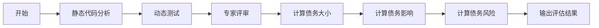
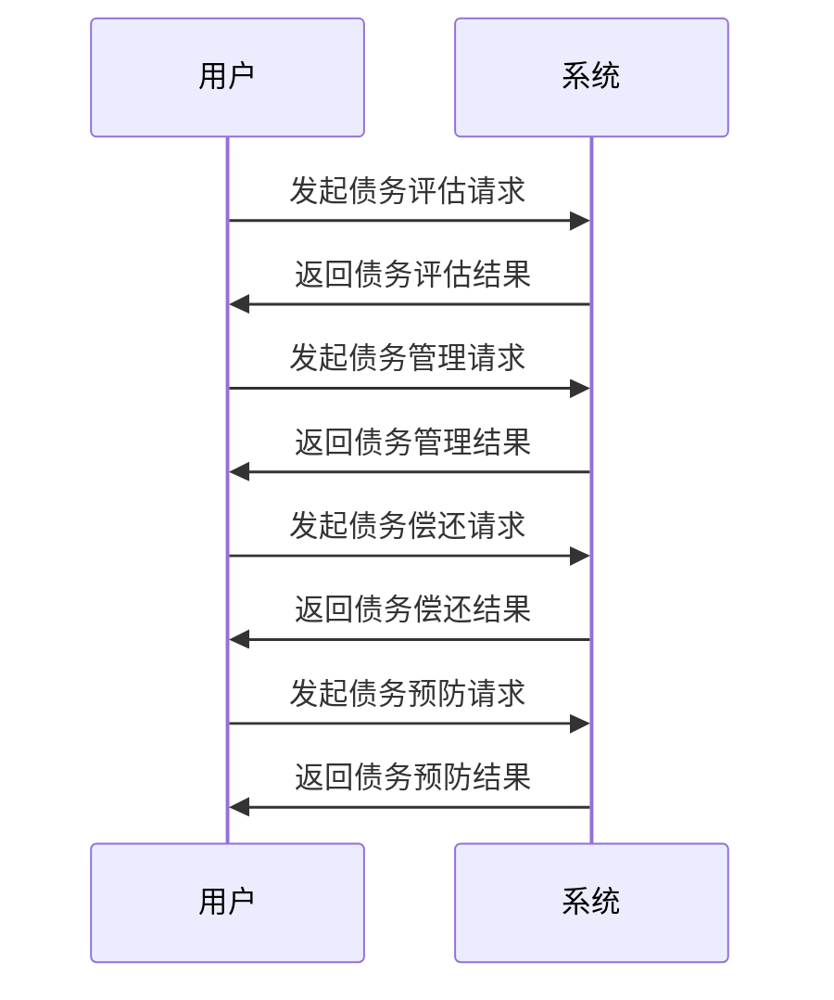

                 

# 如何处理技术债务

## 关键词
技术债务、债务评估、债务管理、债务偿还、债务预防

## 摘要
技术债务是软件开发中不可避免的一部分，它类似于财务债务，指的是在项目开发中为了快速推进而采取的妥协性决策。本文将详细探讨如何处理技术债务，包括背景介绍、核心概念解析、债务评估与管理的算法原理、系统分析与架构设计方案，以及项目实战和最佳实践。

## 第1章: 技术债务的背景与概念

### 1.1 技术债务的起源

技术债务的概念最早由Ward Cunningham在1992年提出。他比喻技术债务就像财务债务，当我们在开发过程中为了快速交付而做出某些短期决策，这些决策可能会在未来带来更多的成本和复杂度。

### 1.2 技术债务的定义

技术债务是指在项目开发中，为了快速推进而采取的妥协性决策。这些决策可能会带来短期的好处，但长期来看会带来额外的维护成本和复杂性。

### 1.3 技术债务的影响

技术债务会降低代码质量，增加维护成本，甚至可能导致项目失败。因此，合理处理技术债务对于项目的长期成功至关重要。

### 1.4 技术债务的边界与外延

技术债务的边界包括代码质量、技术选型、架构设计等方面。外延则涉及到债务的评估、管理和偿还。

### 1.5 技术债务的核心要素组成

技术债务的核心要素包括债务的产生、评估、管理、偿还和预防。这些要素相互关联，构成了一个完整的技术债务生命周期。

## 第2章: 技术债务的核心概念与联系

### 2.1 技术债务的核心概念原理

技术债务的核心概念包括债务的产生、评估、管理和偿还。债务的产生通常是为了满足短期需求，而评估和管理则是为了确保债务的可控性。

### 2.2 技术债务属性特征对比表格

| 特征 | 技术债务 | 财务债务 |
| ---- | -------- | -------- |
| 定义 | 短期决策带来的长期成本 | 短期借款带来的长期还款责任 |
| 影响 | 降低代码质量，增加维护成本 | 影响财务状况，可能导致债务违约 |
| 处理 | 评估、管理和偿还 | 债务重组、还款计划、债务减免 |

### 2.3 技术债务的ER实体关系图架构

```mermaid
erDiagram
  技术债务 ||--|{ 债务评估 } : 被评估
  技术债务 ||--|{ 债务管理 } : 被管理
  技术债务 ||--|{ 债务偿还 } : 被偿还
  技术债务 ||--|{ 技术预防 } : 被预防
```

## 第3章: 技术债务评估与管理的算法原理

### 3.1 技术债务评估算法原理讲解

技术债务评估算法用于评估现有债务的大小和影响。评估方法包括静态代码分析、动态测试和专家评审。

### 3.2 技术债务评估的数学模型和公式

假设债务的大小为D，债务的影响为I，则债务的风险R可以用以下公式计算：

$$ R = D \times I $$

其中，D和I的值可以通过评估算法得到。

### 3.3 技术债务评估算法mermaid流程图



### 3.4 Python源代码实现技术债务评估

```python
# 技术债务评估算法的实现
def debt_evaluation(debt_size, impact):
    risk = debt_size * impact
    return risk

# 示例
debt_size = 10
impact = 3
risk = debt_evaluation(debt_size, impact)
print(f"债务风险：{risk}")
```

## 第4章: 系统分析与架构设计方案

### 4.1 技术债务管理系统问题场景介绍

随着软件项目的不断演进，技术债务的积累不可避免。为了有效管理技术债务，需要一个专业的管理系统。

### 4.2 技术债务管理系统功能设计

技术债务管理系统应包括债务评估、债务管理、债务偿还和债务预防等功能。

### 4.3 技术债务管理系统架构设计

技术债务管理系统采用三层架构设计，包括表示层、业务逻辑层和数据层。

### 4.4 技术债务管理系统接口设计

技术债务管理系统应提供RESTful API，以便与其他系统集成。

### 4.5 技术债务管理系统交互mermaid序列图



## 第5章: 技术债务管理项目实战

### 5.1 技术债务管理系统环境安装

在开始项目实战之前，我们需要安装技术债务管理系统所需的环境。

### 5.2 系统核心实现源代码

以下是技术债务管理系统的核心实现源代码。

```python
# 技术债务管理系统核心实现
class DebtManagementSystem:
    def __init__(self):
        self债务评估算法 = DebtEvaluationAlgorithm()
        self债务管理算法 = DebtManagementAlgorithm()
        self债务偿还算法 = DebtRepaidAlgorithm()
        self债务预防算法 = DebtPreventionAlgorithm()

    def evaluate_debt(self, debt_size, impact):
        risk = self债务评估算法.evaluate(debt_size, impact)
        return risk

    def manage_debt(self, risk):
        management_plan = self债务管理算法.manage(risk)
        return management_plan

    def repay_debt(self, management_plan):
        repaid_result = self债务偿还算法.repay(management_plan)
        return repaid_result

    def prevent_debt(self):
        prevention_plan = self债务预防算法.prevent()
        return prevention_plan
```

### 5.3 代码应用解读与分析

代码中定义了一个`DebtManagementSystem`类，其中包括了债务评估、债务管理、债务偿还和债务预防四个算法。这些算法负责评估、管理、偿还和预防技术债务。

### 5.4 实际案例分析与详细讲解剖析

以下是一个实际案例，展示了如何使用技术债务管理系统。

```python
# 实际案例
system = DebtManagementSystem()
debt_size = 10
impact = 3
risk = system.evaluate_debt(debt_size, impact)
print(f"债务风险：{risk}")

management_plan = system.manage_debt(risk)
print(f"债务管理计划：{management_plan}")

repaid_result = system.repay_debt(management_plan)
print(f"债务偿还结果：{repaid_result}")

prevention_plan = system.prevent_debt()
print(f"债务预防计划：{prevention_plan}")
```

### 5.5 项目小结

通过实际案例，我们展示了如何使用技术债务管理系统评估、管理、偿还和预防技术债务。该项目验证了技术债务管理的重要性，并为后续的项目提供了可借鉴的经验。

## 第6章: 技术债务管理的最佳实践与注意事项

### 6.1 最佳实践 tips

1. 定期进行债务评估，及时发现潜在问题。
2. 建立完善的债务管理流程，确保债务的可控性。
3. 强化团队对技术债务的认识，提高债务管理的意识。

### 6.2 小结

技术债务是软件开发中不可避免的一部分，但通过合理的评估、管理和偿还，可以降低其对项目的影响。

### 6.3 注意事项

1. 不要过度依赖技术债务，以免导致项目失控。
2. 在处理技术债务时，要充分考虑债务的风险和影响。

### 6.4 拓展阅读

1. 《技术债务管理实践指南》
2. 《软件债务：如何评估和优化你的技术债务》

## 作者信息

作者：AI天才研究院/AI Genius Institute & 禅与计算机程序设计艺术 /Zen And The Art of Computer Programming

----------------------------------------------------------------

