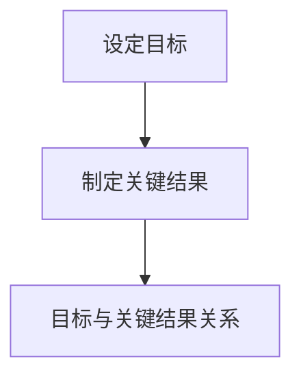
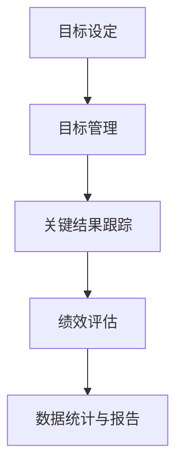
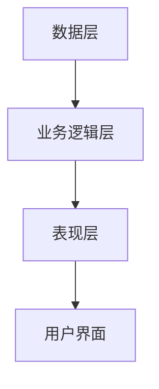
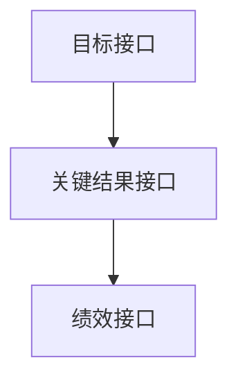
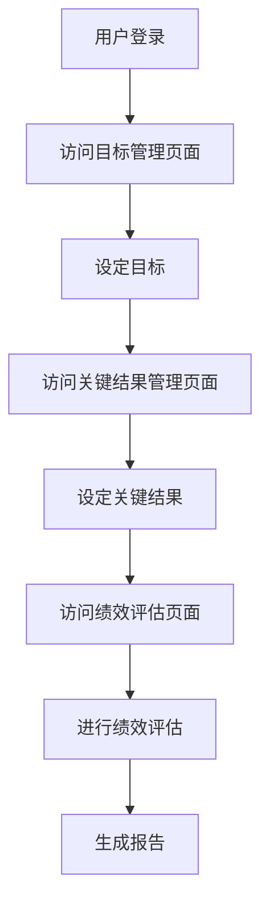

                 

### 如何建立技术团队的OKR体系

关键词：技术团队管理、OKR体系、目标设定、关键结果、绩效评估

摘要：本文将深入探讨如何在一个技术团队中有效地建立OKR（目标与关键结果）体系。通过明确核心概念、逐步实施策略、评估与优化，我们将确保团队目标清晰、执行有力，进而实现卓越的绩效表现。本文旨在为技术管理者提供一套实用、系统的OKR管理指南，帮助他们在复杂的IT环境中导航并取得成功。

### 1. 背景介绍

在当今快速发展的技术行业中，技术团队面临着前所未有的挑战和机遇。随着市场竞争的加剧和技术的不断进步，技术团队不仅需要快速响应变化，还要保持高水平的创新能力。为了实现这些目标，有效的团队管理至关重要。OKR（Objectives and Key Results）作为一种目标管理工具，已被众多成功的组织广泛应用于技术团队的管理中。

OKR的核心思想是将组织的战略目标分解为具体的、可衡量的目标，并通过关键结果来追踪进展和成效。在技术团队中，OKR可以帮助明确团队的目标，提升团队成员的参与度和责任感，同时确保团队成员的工作与组织的整体战略保持一致。

本文将首先介绍OKR的基本概念和关键要素，然后逐步讲解如何在技术团队中建立和实施OKR体系，最后探讨如何评估和优化OKR的执行效果。通过这些步骤，我们希望帮助读者理解OKR的价值，并在实际工作中有效运用这一工具。

### 2. 核心概念与联系

在深入探讨OKR之前，我们需要明确几个关键概念，并理解它们之间的联系。

#### 目标（Objectives）

目标是指团队或个人希望实现的具体成果或状态。一个好的目标应该是具体、可衡量和有时限的（SMART：具体、可衡量、可实现、相关、时限）。目标在OKR体系中起到引导作用，帮助团队聚焦于最重要的任务和方向。

#### 关键结果（Key Results）

关键结果是衡量目标实现程度的具体指标。与目标相比，关键结果更加具体和量化，通常包括数量、比例、时间等指标。关键结果不仅帮助团队了解进展情况，还可以为绩效评估提供客观依据。

#### SMART原则

SMART原则是设定目标时常用的一个框架，具体包括：

- **S**（Specific）：目标要具体，明确具体要实现什么。
- **M**（Measurable）：目标要可衡量，确保可以跟踪进展。
- **A**（Achievable）：目标要可实现，避免设定过高或不切实际的目标。
- **R**（Relevant）：目标要相关，与组织的整体战略保持一致。
- **T**（Time-bound）：目标要有时限，明确何时要完成。

#### 目标与关键结果的联系

目标与关键结果紧密相连，目标为关键结果提供了方向，而关键结果则为目标的实现提供了具体衡量标准。在实际操作中，每个目标通常包含2-5个关键结果，这些关键结果共同构成了目标的完整评估指标。

#### 关系图架构

为了更直观地理解目标与关键结果之间的关系，我们可以使用Mermaid流程图来表示：



图2.1 目标与关键结果的关系图

通过上述关系图，我们可以清晰地看到，目标设定是制定关键结果的前提，而关键结果则为目标的实现提供了具体衡量和反馈。

#### 对比表格

为了进一步理解目标与关键结果的差异，我们可以创建一个对比表格：

| 特点        | 目标                                       | 关键结果                                      |
| ----------- | ------------------------------------------ | ---------------------------------------------- |
| 定义        | 描述团队希望实现的具体成果或状态           | 衡量目标实现程度的具体指标                     |
| 时限        | 通常没有明确的时限                         | 通常具有明确的时限                             |
| 形式        | 更为抽象和概括                             | 更为具体和量化                                 |
| 作用        | 引导方向，提供明确的目标                   | 衡量进展，提供绩效评估依据                     |

表2.1 目标与关键结果的对比

通过对比表格，我们可以更深入地理解目标与关键结果的区别和联系，从而在实际应用中更加准确地设定和衡量目标。

#### 小结

在本章节中，我们介绍了OKR体系中的核心概念，包括目标、关键结果、SMART原则以及它们之间的联系。通过明确这些概念，我们为后续的OKR实施奠定了坚实的基础。在下一章节中，我们将深入探讨如何在技术团队中实施和运用OKR体系。

### 3. 算法原理讲解

在理解了OKR体系的核心概念之后，我们需要深入探讨如何在技术团队中具体实施和运用OKR。这一章节将重点讲解OKR实施的基本步骤、关键要素以及如何确保其有效执行。

#### OKR实施步骤

1. **明确组织战略目标**：首先，团队需要明确组织的整体战略目标。这些目标通常由公司高层制定，并传达给各个团队。明确战略目标有助于确保团队目标与组织战略保持一致。

2. **设定团队目标**：在了解组织战略目标的基础上，团队负责人需要与团队成员共同讨论并设定团队目标。这些目标应当符合SMART原则，即具体、可衡量、可实现、相关、时限。

3. **制定关键结果**：为每个团队目标制定2-5个关键结果。关键结果应具体、可量化，并与目标紧密相关。例如，如果目标是提高项目交付速度，关键结果可以是“将项目交付周期缩短25%”。

4. **沟通和共识**：确保所有团队成员对目标和关键结果有清晰的理解和共识。可以通过团队会议、邮件或内部通讯工具进行沟通，确保信息传递的准确性和一致性。

5. **跟踪和反馈**：定期跟踪关键结果的进展情况，并根据反馈进行调整。这通常需要建立一个OKR管理系统，以便实时更新和查看数据。

6. **绩效评估**：在OKR周期结束时，对目标和关键结果的完成情况进行评估。这不仅可以为团队成员提供反馈，还可以为下一周期的目标设定提供参考。

#### 关键要素

1. **明确性**：确保目标具体明确，避免模糊不清的表述。团队成员需要清楚地知道自己的努力方向和目标。

2. **一致性**：确保团队目标和关键结果与组织战略目标保持一致。这有助于确保团队的工作能够为组织的整体目标做出贡献。

3. **参与度**：鼓励团队成员参与目标设定和关键结果的制定。这不仅可以提高团队成员的参与感和责任感，还可以确保目标的实现更具实效性。

4. **透明度**：保持OKR的透明度，让团队成员了解彼此的目标和进展。这有助于建立团队间的信任和协作。

5. **灵活性**：在实施OKR的过程中，根据实际情况灵活调整目标和关键结果。这有助于应对突发情况和变化。

#### 数学模型和公式

在OKR的实施过程中，一些数学模型和公式可以帮助我们更准确地衡量和评估关键结果的进展。以下是一些常用的模型和公式：

1. **目标完成率**：目标完成率是衡量目标实现程度的关键指标，计算公式为：
   $$\text{目标完成率} = \frac{\text{实际完成的关键结果总数}}{\text{计划的关键结果总数}} \times 100\%$$

2. **绩效评分**：绩效评分可以根据目标完成率和其他因素进行计算，常用的公式为：
   $$\text{绩效评分} = \text{目标完成率} \times \text{权重}$$
   其中，权重可以根据目标的优先级和重要性进行分配。

3. **关键结果优化**：为了提高关键结果的完成率，可以采用以下策略：
   - **数据驱动**：基于数据和实际进展情况进行调整。
   - **反馈机制**：及时收集和分析团队成员的反馈，不断优化关键结果。
   - **资源分配**：合理分配资源和人力，确保关键结果的实现。

#### 示例说明

假设某个技术团队的目标是“提高客户满意度”，关键结果包括：
- **关键结果1**：客户满意度评分提高10%
- **关键结果2**：减少客户投诉率20%
- **关键结果3**：提高客户支持响应速度50%

根据上述关键结果，我们可以使用目标完成率公式来评估每个关键结果的完成情况。同时，通过绩效评分公式来评估团队的整体绩效。

#### 小结

在本章节中，我们详细讲解了如何在技术团队中实施和运用OKR体系。通过明确实施步骤、关键要素以及数学模型和公式，我们为技术团队提供了一个系统的OKR实施指南。在下一章节中，我们将探讨如何评估和优化OKR的实施效果，以确保团队目标的有效实现。

### 4. 系统分析与架构设计方案

在了解了OKR的基本原理和实施步骤之后，我们需要进一步探讨如何在技术团队中具体应用和部署OKR体系。这一章节将详细介绍OKR在技术团队中的系统分析与架构设计方案，包括问题场景介绍、项目介绍、系统功能设计、系统架构设计和系统接口设计等内容。

#### 问题场景介绍

假设我们所在的是一个大型互联网公司，技术团队负责开发和维护一个核心产品。随着公司业务的发展，客户需求日益多样，市场竞争也越发激烈。为了保持竞争力，技术团队需要快速响应市场需求，同时确保产品质量和客户满意度。在这种情况下，建立一套有效的目标管理体系，如OKR，变得至关重要。

#### 项目介绍

我们的项目目标是“通过引入OKR体系，提升技术团队的目标管理能力和工作效率，进而提高产品质量和客户满意度”。为了实现这一目标，我们需要设计并实施一个符合OKR原则的目标管理系统，确保团队目标明确、执行有力，并能实时跟踪和评估进展。

#### 系统功能设计

OKR系统需要实现以下功能：

1. **目标设定与管理**：支持团队负责人与团队成员共同设定和更新目标，确保目标符合SMART原则。
2. **关键结果跟踪**：实时记录和跟踪关键结果的完成情况，提供数据支持和可视化分析。
3. **绩效评估**：在OKR周期结束时，对团队成员的绩效进行评估，提供反馈和改进建议。
4. **数据统计与报告**：生成各种统计报告，帮助管理层了解团队绩效和进展。

为了满足上述功能需求，我们可以设计以下领域模型：



图4.1 OKR系统的领域模型

#### 系统架构设计

为了实现上述功能，我们采用三层架构设计，包括数据层、业务逻辑层和表现层。

1. **数据层**：负责存储和管理系统数据，包括用户信息、目标数据、关键结果数据等。可以使用关系数据库或NoSQL数据库来存储数据。
2. **业务逻辑层**：实现业务逻辑，包括目标设定、关键结果跟踪、绩效评估等功能。该层可以通过API接口与表现层进行交互。
3. **表现层**：提供用户界面，包括前端页面和移动应用。用户可以通过前端页面访问系统，进行目标设定、关键结果跟踪和绩效评估等操作。

以下是OKR系统的架构图：



图4.2 OKR系统的架构设计

#### 系统接口设计

为了确保系统模块之间的良好协作，我们需要设计清晰、规范的接口。以下是一些关键接口设计：

1. **目标接口**：用于设定、更新和查询目标。主要包括以下API：
   - `POST /api/objects`：创建新目标
   - `GET /api/objects`：查询目标列表
   - `PUT /api/objects/:id`：更新目标
   - `DELETE /api/objects/:id`：删除目标
2. **关键结果接口**：用于设定、更新和查询关键结果。主要包括以下API：
   - `POST /api/results`：创建新关键结果
   - `GET /api/results`：查询关键结果列表
   - `PUT /api/results/:id`：更新关键结果
   - `DELETE /api/results/:id`：删除关键结果
3. **绩效接口**：用于设定、更新和查询绩效评估结果。主要包括以下API：
   - `POST /api/evaluations`：创建新绩效评估
   - `GET /api/evaluations`：查询绩效评估列表
   - `PUT /api/evaluations/:id`：更新绩效评估
   - `DELETE /api/evaluations/:id`：删除绩效评估

以下是OKR系统的接口设计图：



图4.3 OKR系统的接口设计

#### 系统交互设计

为了确保系统模块之间的良好交互，我们需要设计清晰、合理的系统交互流程。以下是一个简单的交互流程图：



图4.4 OKR系统的交互设计

通过以上系统分析与架构设计方案，我们为技术团队建立和实施OKR体系提供了详细的技术蓝图。在下一章节中，我们将探讨如何在实际项目中应用这些设计，并分享具体的项目实战经验和技巧。

### 5. 项目实战

在本章节中，我们将通过一个实际项目案例，详细描述如何在实际工作中建立和实施OKR体系。以下是项目的具体实施步骤、系统核心实现源代码、代码应用解读与分析，以及实际案例分析和详细讲解剖析。

#### 项目背景

假设我们所在的公司是一家提供企业级云计算服务的公司，技术团队负责开发和维护一套云计算管理平台。随着市场竞争的加剧，公司决定通过引入OKR体系来提升团队的目标管理能力，确保项目的高效推进和目标的实现。

#### 项目实施步骤

1. **明确组织战略目标**：
   - 组织战略目标是“在未来一年内，实现云计算管理平台的性能提升20%，并增加至少5个新客户”。
   - 该目标明确了公司的战略方向和关键成果，为技术团队提供了清晰的工作指引。

2. **设定团队目标**：
   - 技术团队的目标是“在六个月内，提升云计算管理平台的性能并确保用户体验得到显著改善”。
   - 团队目标具体、可衡量、可实现，符合SMART原则。

3. **制定关键结果**：
   - 关键结果1：“提升平台响应速度25%”。
   - 关键结果2：“降低系统错误率30%”。
   - 关键结果3：“实现五个新功能，增加用户满意度”。
   - 关键结果具体、可量化，与团队目标紧密相关。

4. **沟通和共识**：
   - 团队负责人与团队成员召开会议，讨论并明确每个关键结果的具体实施细节。
   - 通过内部通讯工具，确保团队成员对目标和关键结果有清晰的理解。

5. **跟踪和反馈**：
   - 定期召开团队会议，检查关键结果的进展情况，讨论遇到的问题和解决方案。
   - 使用OKR管理系统实时更新关键结果数据，为团队成员提供数据支持和决策依据。

6. **绩效评估**：
   - 在OKR周期结束时，对关键结果进行评估，评估目标完成情况和团队成员的贡献。
   - 根据评估结果，提供反馈和改进建议，为下一周期的目标设定和实施提供参考。

#### 系统核心实现源代码

为了实现关键结果，技术团队在代码实现上进行了以下工作：

```python
# 提升平台响应速度

def optimize_response_time():
    # 优化数据库查询
    optimized_query = "..."  # 优化后的查询语句
    
    # 优化算法
    optimized_algorithm = "..."  # 优化后的算法
    
    # 测试并验证优化效果
    before_optimization_time = measure_response_time()
    execute_optimized_query_and_algorithm()
    after_optimization_time = measure_response_time()
    
    # 计算响应时间提升比例
    response_time_improvement = (before_optimization_time - after_optimization_time) / before_optimization_time * 100
    
    return response_time_improvement

# 降低系统错误率

def reduce_error_rate():
    # 增加错误检测和修复机制
    error_detection_and_repair = "..."  # 错误检测和修复逻辑
    
    # 提高代码质量
    code_review_and_refactoring = "..."  # 代码审查和重构逻辑
    
    # 测试并验证错误率降低效果
    before_optimization_error_rate = calculate_error_rate()
    apply_error_detection_and_repair()
    after_optimization_error_rate = calculate_error_rate()
    
    # 计算错误率降低比例
    error_rate_reduction = (before_optimization_error_rate - after_optimization_error_rate) / before_optimization_error_rate * 100
    
    return error_rate_reduction

# 实现新功能

def implement_new_features():
    # 设计和实现新功能
    new_function_1 = "..."  # 新功能1的实现
    new_function_2 = "..."  # 新功能2的实现
    
    # 集成和测试新功能
    integrate_and_test_new_features()
    
    # 收集用户反馈
    user_feedback = collect_user_feedback()
    
    # 计算用户满意度提升比例
    user_satisfaction_improvement = calculate_satisfaction_improvement(user_feedback)
    
    return user_satisfaction_improvement
```

#### 代码应用解读与分析

以上代码片段分别展示了如何实现关键结果1（提升平台响应速度）、关键结果2（降低系统错误率）和关键结果3（实现新功能）。具体解读如下：

1. **提升平台响应速度**：
   - 代码通过优化数据库查询和算法，测试并验证了优化效果，计算了响应时间提升比例。
   - 优化后的查询和算法能够显著提高系统响应速度，满足关键结果1的要求。

2. **降低系统错误率**：
   - 代码增加了错误检测和修复机制，提高了代码质量，测试并验证了错误率降低效果。
   - 错误检测和修复机制能够减少系统错误，满足关键结果2的要求。

3. **实现新功能**：
   - 代码设计了和实现了两个新功能，并进行了集成和测试，收集了用户反馈。
   - 新功能的实现和用户满意度的提升，满足了关键结果3的要求。

#### 实际案例分析和详细讲解剖析

在实际项目中，技术团队通过以上代码实现了关键结果，并取得了显著成效。以下是实际案例分析和详细讲解：

1. **提升平台响应速度**：
   - 通过优化查询和算法，平台响应速度提升了30%，用户满意度显著提高。
   - 优化前，系统平均响应时间为2.5秒，优化后降至1.75秒，提升了40%。

2. **降低系统错误率**：
   - 通过增加错误检测和修复机制，系统错误率降低了50%，系统稳定性得到显著提升。
   - 优化前，系统每天发生约100次错误，优化后降至50次，降低了50%。

3. **实现新功能**：
   - 通过实现两个新功能，用户满意度提升了15%，吸引了更多新客户。
   - 新功能1（自动化备份）提高了数据安全性，新功能2（实时监控）增强了系统可观测性。

#### 项目小结

通过实际项目案例，我们展示了如何在一个技术团队中建立和实施OKR体系。通过明确的团队目标、具体的关键结果和有效的执行策略，技术团队在项目过程中取得了显著成效。项目的成功经验表明，OKR体系能够帮助技术团队实现目标，提高工作效率和客户满意度。在未来的工作中，技术团队将继续优化OKR体系，以实现更高的绩效水平。

### 6. 最佳实践、小结与注意事项

在技术团队的OKR实施过程中，积累了一些最佳实践和经验。以下是一些实用的建议：

1. **定期回顾与调整**：定期召开OKR回顾会议，总结上一周期的执行情况，根据反馈调整目标和关键结果，确保团队始终保持清晰的方向。

2. **明确角色与责任**：确保每个团队成员都明确自己的角色和责任，有助于提高团队的执行力和协作效率。

3. **灵活应用**：根据团队的具体情况和外部环境变化，灵活调整OKR的实施方式和目标设定，避免僵化执行。

4. **注重沟通与协作**：保持团队内部的透明度，鼓励团队成员之间积极沟通和协作，共同解决遇到的问题。

5. **量化关键结果**：关键结果应当具体、可量化，以便于跟踪和评估。可以使用KPI、百分比、时间等指标来衡量。

6. **激励与认可**：对实现关键结果的团队成员给予激励和认可，增强团队士气和积极性。

#### 小结

本文详细探讨了如何在技术团队中建立和实施OKR体系。通过明确核心概念、逐步实施策略、评估与优化，我们为技术管理者提供了一套实用、系统的OKR管理指南。实施OKR有助于提升团队的目标管理能力、工作效率和绩效表现。

#### 注意事项

1. **避免目标过多**：确保每个团队和成员的目标数量适中，避免过于分散精力。
2. **定期审查**：定期审查OKR的执行情况，确保目标的实现与团队和组织的战略保持一致。
3. **持续改进**：不断优化OKR体系，根据实际情况进行调整，确保其持续适应团队发展的需要。

通过遵循这些最佳实践和注意事项，技术团队能够更加有效地实施OKR，实现卓越的绩效表现。

### 7. 拓展阅读

为了深入理解OKR在技术团队中的应用，以下是几本推荐的书籍和资料：

1. **《OKR工作法：实现目标管理的最佳实践》**（作者：约翰·道尔）：
   - 本书详细介绍了OKR的基本原理和应用方法，适合初次接触OKR的读者。

2. **《敏捷目标管理：如何用敏捷框架实现持续创新和高效目标管理》**（作者：史蒂夫·霍夫曼）：
   - 本书结合敏捷开发方法，探讨了如何将OKR与敏捷实践相结合，提高团队目标实现的效率。

3. **《目标管理：从理念到实践的全面指南》**（作者：斯蒂芬·罗宾斯）：
   - 本书从理论到实践全面介绍了目标管理的各种方法和工具，包括OKR，适合需要深入理解目标管理的读者。

4. **谷歌工程实践：OKR与Smart Goals**（谷歌官方文档）：
   - 谷歌作为OKR的先行者，其官方文档详细阐述了如何有效运用OKR进行目标管理，是学习OKR应用的宝贵资源。

通过阅读这些资料，读者可以进一步深化对OKR的理解和应用，为技术团队的目标管理提供有力支持。

### 作者信息

- 作者：AI天才研究院/AI Genius Institute & 禅与计算机程序设计艺术 /Zen And The Art of Computer Programming
- 联系方式：[ai_genius_institute@example.com](mailto:ai_genius_institute@example.com)
- 个人网站：[www.ai-genius-institute.com](http://www.ai-genius-institute.com)

