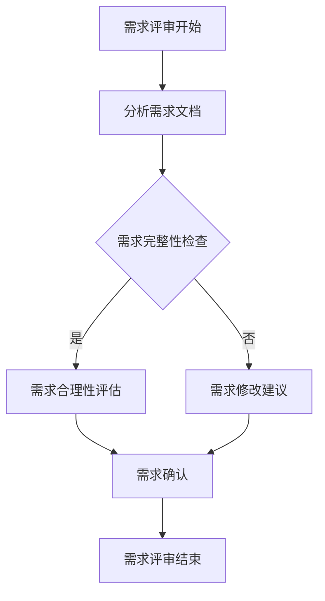
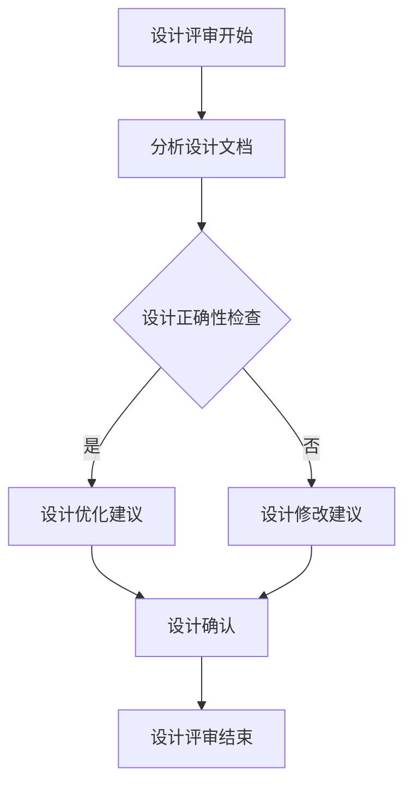
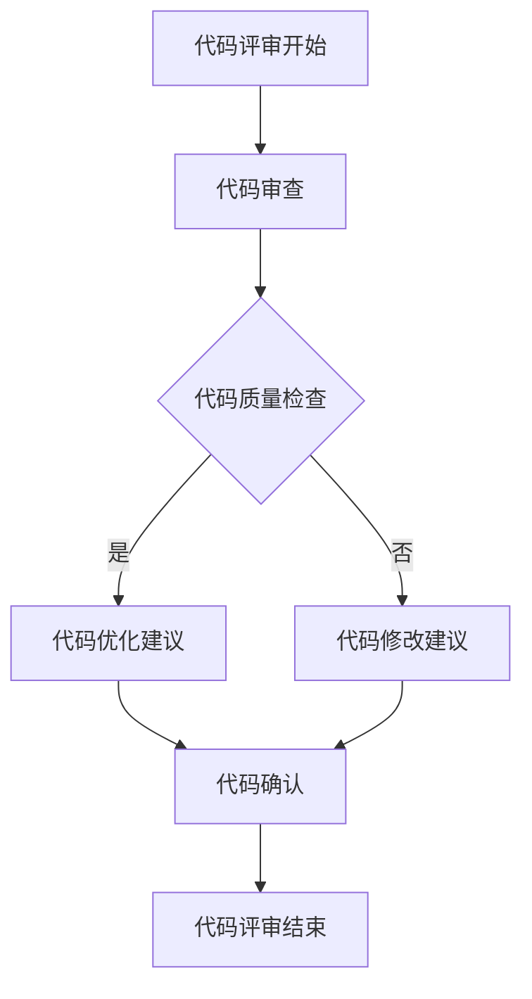
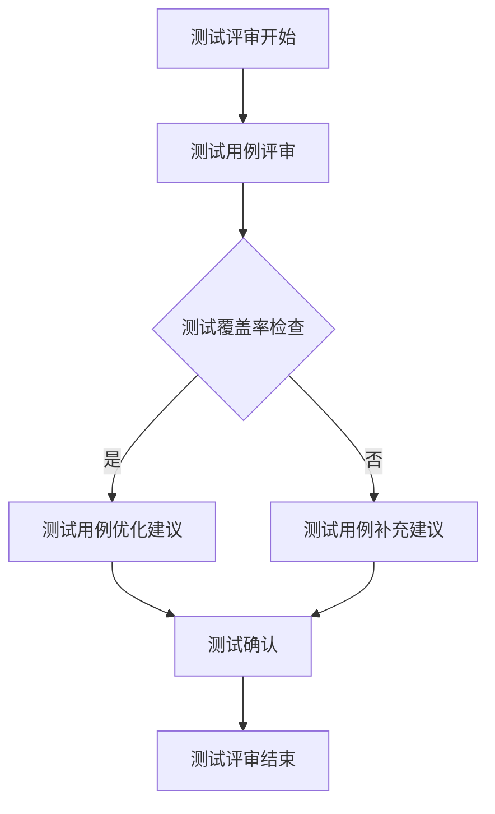
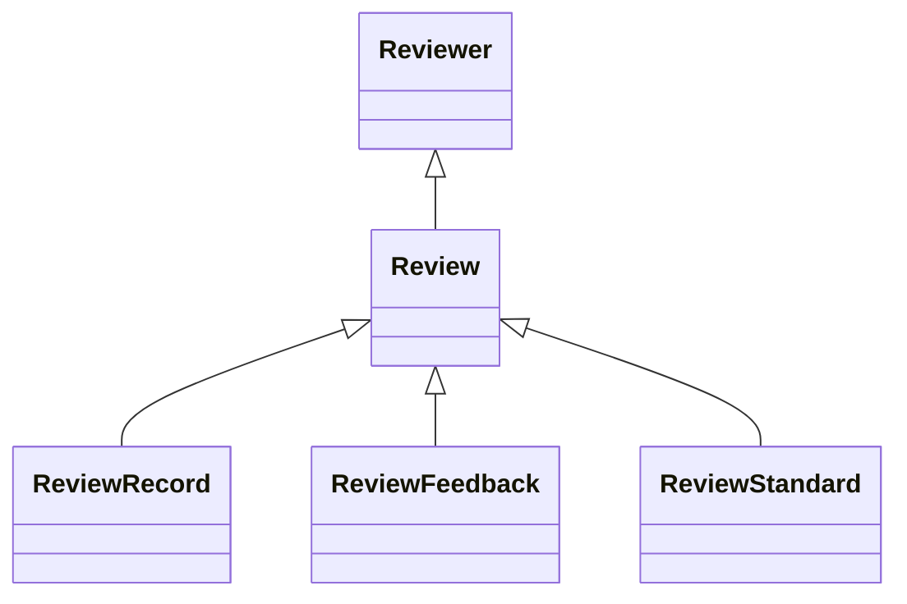
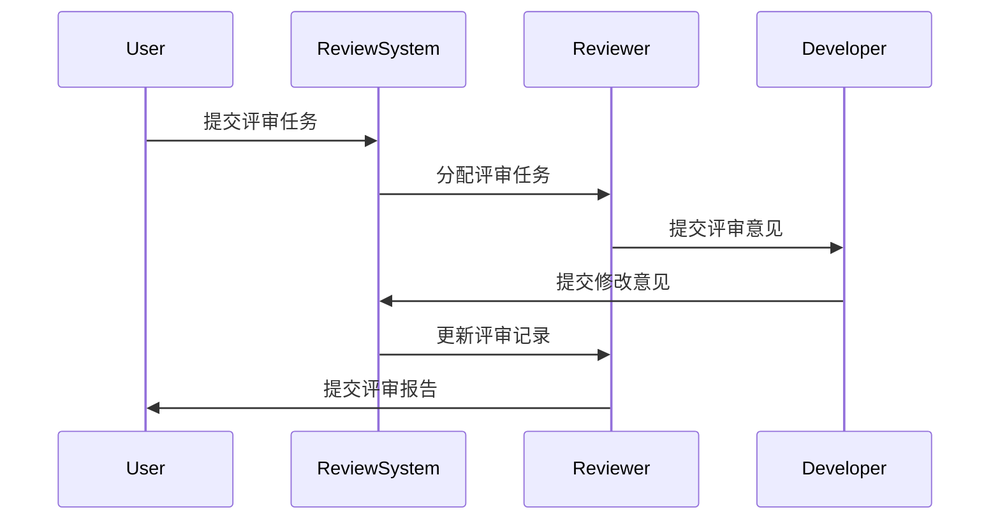

                 

## 如何建立有效的技术评审机制

### 关键词
- 技术评审
- 评审机制
- 技术流程
- 团队协作
- 效率优化
- 质量控制

### 摘要
本文将详细探讨如何建立一套有效的技术评审机制。我们将从背景介绍、核心概念、实施步骤、评估与改进、实战案例以及最佳实践等方面，一步步分析并解答这一问题。通过本文，读者将能够理解技术评审的重要性，掌握建立评审机制的关键步骤，并学会如何在实践中不断优化和改进评审流程。

## 一、背景介绍

在当今快速发展的技术时代，技术评审作为一种重要的质量保障手段，日益受到各类企业和组织的重视。然而，如何确保技术评审的有效性，如何构建一套符合实际需求、高效且易于实施的评审机制，成为了许多技术团队面临的挑战。

技术评审不仅仅是代码的检查，它涵盖了从需求分析、设计实现到测试部署等各个环节。有效的技术评审机制能够发现并解决潜在的问题，提高项目质量，降低风险，最终提升团队的整体效率。

### 问题背景

随着项目的复杂度不断增加，团队成员的技能水平和知识结构差异较大，技术评审成为了确保项目顺利进行的关键环节。但现实中，许多团队在技术评审中面临着以下问题：

1. **评审流程不清晰**：评审流程设计不合理，评审步骤不明确，导致评审效率低下。
2. **评审质量参差不齐**：评审人员的专业水平不一，评审意见质量波动较大，影响项目进度和质量。
3. **评审工具不适用**：缺乏合适的评审工具，难以有效地跟踪和管理评审过程。
4. **评审反馈不及时**：评审过程中反馈延迟，导致问题无法及时得到解决。

### 问题描述

建立有效的技术评审机制需要解决以下核心问题：

- 如何设计合理的评审流程？
- 如何组建高效的评审团队？
- 如何选择合适的评审工具和方法？
- 如何确保评审的效率和评审质量？
- 如何在评审过程中有效沟通和协作？

### 问题解决

要解决上述问题，需要从以下几个方面入手：

1. **明确评审目标**：确保评审工作与项目目标一致，明确评审的重点和方向。
2. **设计合理的评审流程**：根据项目特点，制定适合的评审流程，确保评审步骤清晰、高效。
3. **组建专业的评审团队**：选择合适的人员组成评审团队，明确团队成员的角色和职责。
4. **选择适用的评审工具**：根据团队需求和评审流程，选择合适的评审工具，提高评审效率。
5. **建立反馈机制**：确保评审过程中及时收集和反馈问题，促进问题的及时解决。

### 边界与外延

在建立技术评审机制时，需要明确以下几点边界与外延：

- **评审范围**：明确评审的范围和覆盖的环节，如需求分析、设计实现、测试部署等。
- **评审频率**：根据项目进度和团队规模，确定合理的评审频率。
- **评审参与人员**：明确参与评审的人员，包括评审组长、评审员、开发人员等。
- **评审输出**：确定评审的输出物，如评审记录、问题清单、改进措施等。

### 概念结构与核心要素组成

技术评审机制的核心概念包括：

- **评审流程**：包括评审的各个环节和步骤，如需求评审、设计评审、代码评审等。
- **评审团队**：由评审组长、评审员等组成的团队，负责评审工作的实施和协调。
- **评审工具**：用于支持评审过程的软件工具，如代码库、评审管理工具等。
- **评审标准**：用于衡量评审质量和效果的指标和标准。

## 二、核心概念与联系

### 技术评审的概念

技术评审是一种通过系统化、结构化和文档化的方法，对软件项目的各个阶段进行审查和评估的过程。其目的是确保项目符合既定的质量标准，发现和解决潜在的问题，提高项目的成功率。

### 技术评审的重要性

- **确保项目质量**：技术评审能够发现并解决潜在的质量问题，降低项目风险。
- **提高团队效率**：通过规范评审流程，减少重复工作，提高团队协作效率。
- **促进知识共享**：评审过程中，团队成员可以相互学习和交流，促进技术水平的提升。
- **增强项目透明度**：评审记录和反馈能够提高项目透明度，便于项目管理和监督。

### 技术评审的基本原理

技术评审基于以下几个基本原理：

- **预防性原则**：通过提前发现和解决问题，避免后期返工和成本浪费。
- **透明性原则**：评审过程公开透明，便于团队成员了解项目进展和质量状况。
- **系统性原则**：评审应覆盖项目的各个阶段和环节，形成系统化的质量控制流程。
- **参与性原则**：鼓励团队成员积极参与评审，共同提高项目质量。

### 技术评审的属性特征对比表格

| 特征 | 说明 | 对比 |
| :--: | :--: | :--: |
| 目标性 | 明确评审目标，确保评审工作与项目目标一致 |  |
| 规范性 | 建立规范的评审流程和标准，确保评审工作的有序进行 |  |
| 系统性 | 覆盖项目的各个阶段和环节，形成系统化的质量控制流程 |  |
| 专业性 | 选择合适的评审人员，确保评审意见的专业性和准确性 |  |
| 及时性 | 及时发现和解决问题，避免问题积累和扩大 |  |

### 技术评审的ER实体关系图架构

```mermaid
erDiagram
    Reviewer ||--|{ Review : 被评审对象} 
    Reviewer ||--|{ ReviewRecord : 评审记录}
    Review ||--|{ ReviewStandard : 评审标准}
    Review ||--|{ ReviewFeedback : 评审反馈}
```

在上述ER图架构中，`Reviewer`（评审者）是核心实体，与其他实体`Review`（评审）、`ReviewRecord`（评审记录）、`ReviewStandard`（评审标准）和`ReviewFeedback`（评审反馈）之间存在关联。

### 技术评审的核心要素组成

- **评审流程**：包括评审的各个环节和步骤，如需求评审、设计评审、代码评审等。
- **评审团队**：由评审组长、评审员等组成的团队，负责评审工作的实施和协调。
- **评审工具**：用于支持评审过程的软件工具，如代码库、评审管理工具等。
- **评审标准**：用于衡量评审质量和效果的指标和标准。

## 三、算法原理讲解

### 技术评审算法原理

技术评审算法的核心在于通过一系列步骤和方法，对软件项目进行全面的检查和评估，确保项目质量。以下是技术评审算法的基本原理：

### 1. 需求评审

**算法流程**：



**算法原理**：

- **需求完整性检查**：检查需求文档是否完整，是否包含所有必要信息。
- **需求合理性评估**：评估需求是否符合业务逻辑，是否可实现。
- **需求确认**：确认需求文档的准确性，确保所有参与人员对需求的理解一致。

### 2. 设计评审

**算法流程**：



**算法原理**：

- **设计正确性检查**：检查设计文档是否符合需求文档，是否满足系统性能和安全性要求。
- **设计优化建议**：提出改进设计方案，提高系统性能和可维护性。
- **设计确认**：确认设计文档的准确性和可行性，确保开发人员能够顺利实施。

### 3. 代码评审

**算法流程**：



**算法原理**：

- **代码质量检查**：检查代码是否符合编码规范，是否存在潜在的问题和隐患。
- **代码优化建议**：提出代码改进建议，提高代码的可读性和可维护性。
- **代码确认**：确认代码的准确性和可行性，确保代码能够正常运行。

### 4. 测试评审

**算法流程**：



**算法原理**：

- **测试覆盖率检查**：检查测试用例是否覆盖所有功能和代码路径。
- **测试用例优化建议**：提出改进测试用例，提高测试的全面性和有效性。
- **测试确认**：确认测试用例的准确性和完整性，确保测试能够发现潜在的问题。

### 数学模型和公式

技术评审的数学模型主要涉及概率论和统计学，用于评估评审的质量和效果。以下是几个关键公式：

1. **缺陷密度（Defect Density）**：

   $$ \text{DD} = \frac{\text{发现缺陷数}}{\text{总代码行数}} $$

   缺陷密度用于衡量代码质量，数值越低表示代码质量越高。

2. **缺陷发现率（Defect Detection Rate）**：

   $$ \text{DDR} = \frac{\text{发现缺陷数}}{\text{总缺陷数}} $$

   缺陷发现率用于评估评审的效果，数值越高表示评审越有效。

3. **缺陷修复率（Defect Fix Rate）**：

   $$ \text{DFR} = \frac{\text{修复缺陷数}}{\text{发现缺陷数}} $$

   缺陷修复率用于衡量团队解决缺陷的能力，数值越高表示团队修复缺陷的能力越强。

### 举例说明

假设一个代码库共有1000行代码，经过代码评审发现了5个缺陷，其中3个缺陷被修复。那么：

- 缺陷密度（DD）= 5/1000 = 0.005
- 缺陷发现率（DDR）= 5/5 = 1.00
- 缺陷修复率（DFR）= 3/5 = 0.60

通过以上数据，可以评估代码库的质量和评审效果。例如，可以进一步分析缺陷的类型和原因，为改进评审流程提供依据。

## 四、系统分析与架构设计方案

### 问题场景介绍

在一个大型软件开发项目中，随着项目规模的不断扩大和复杂度的增加，团队面临以下问题：

- 代码质量和安全风险较高
- 评审流程不规范，效率低下
- 评审团队结构不清晰，职责分工不明确
- 评审工具不统一，难以有效跟踪和管理评审过程

为了解决上述问题，项目团队决定建立一套有效的技术评审机制，以提高项目质量和管理效率。

### 项目介绍

本项目旨在设计并实施一套符合实际需求、高效且易于操作的技术评审机制。项目的主要目标是：

- 规范评审流程，提高评审效率
- 组建专业评审团队，确保评审质量
- 选择合适的评审工具，支持评审过程的跟踪和管理
- 建立反馈机制，促进问题及时解决

### 系统功能设计

系统功能设计主要包括以下几个方面：

1. **需求评审**：对需求文档进行审查，确保需求完整性、合理性和一致性。
2. **设计评审**：对设计方案进行评估，确保设计正确性、可行性和性能优化。
3. **代码评审**：对代码进行审查，确保代码质量、规范性和安全性。
4. **测试评审**：对测试用例进行评估，确保测试覆盖率、有效性和准确性。
5. **评审管理**：对评审过程进行跟踪和管理，确保评审工作有序进行。

### 系统架构设计

系统架构设计采用分层架构，主要包括以下几个层次：

1. **展示层**：提供用户界面，供用户进行评审操作和查看评审结果。
2. **业务逻辑层**：实现系统的核心业务功能，如评审流程管理、评审任务分配、评审记录管理等。
3. **数据访问层**：提供数据访问接口，实现数据存储和查询。
4. **数据库层**：存储系统数据，包括评审记录、评审任务、评审意见等。

### 系统接口设计

系统接口设计主要包括以下几个方面：

1. **需求评审接口**：用于提交需求评审任务、查看评审记录和结果。
2. **设计评审接口**：用于提交设计评审任务、查看评审记录和结果。
3. **代码评审接口**：用于提交代码评审任务、查看评审记录和结果。
4. **测试评审接口**：用于提交测试评审任务、查看评审记录和结果。

### 系统交互

系统交互设计主要考虑评审过程中的各个环节，确保评审任务的顺利执行和反馈：

1. **评审任务分配**：系统自动根据评审人员的职责和技能，分配评审任务。
2. **评审意见提交**：评审人员提交评审意见，系统记录并展示。
3. **问题跟踪与反馈**：系统自动跟踪未解决的问题，通知相关人员及时处理。
4. **评审结果汇总**：系统汇总评审结果，生成评审报告，供项目管理使用。

### Mermaid 类图和序列图

#### 类图



#### 序列图



通过上述系统架构设计和交互设计，项目团队可以高效地实施技术评审，确保项目质量，提高管理效率。

## 五、项目实战

### 环境安装

为了实施技术评审机制，首先需要搭建一个支持评审过程的开发环境。以下是一个简单的安装流程：

1. **安装Git**：Git是一个版本控制系统，用于代码的版本管理和跟踪。在系统中安装Git客户端。
2. **安装代码库**：将项目代码克隆到本地，确保所有团队成员都可以访问和修改代码。
3. **安装评审工具**：选择合适的评审工具，如GitLab、Gerrit或Phabricator，并按照说明进行安装和配置。

### 系统核心实现

在安装和配置好环境后，开始实现系统核心功能。以下是一个简单的示例：

#### 1. 需求评审实现

**功能描述**：需求评审功能用于对需求文档进行审查和评估。

**实现步骤**：

- **创建需求文档**：创建一个包含需求信息的Markdown文件。
- **提交需求评审任务**：在评审管理系统中创建需求评审任务，并将需求文档链接到任务中。
- **分配评审任务**：系统根据评审人员的职责和技能，自动分配评审任务。
- **提交评审意见**：评审人员阅读需求文档后，提交评审意见和评分。
- **生成评审报告**：系统汇总评审意见和评分，生成需求评审报告。

**代码示例**：

```python
# 需求评审类
class RequirementReview:
    def __init__(self, requirement_doc):
        self.requirement_doc = requirement_doc
        self.reviews = []

    def assign_reviewers(self, reviewers):
        for reviewer in reviewers:
            reviewer.start_review(self.requirement_doc)

    def submit_review(self, reviewer, opinion, score):
        self.reviews.append({'reviewer': reviewer, 'opinion': opinion, 'score': score})

    def generate_report(self):
        return {
            'requirement_doc': self.requirement_doc,
            'reviews': self.reviews
        }
```

#### 2. 设计评审实现

**功能描述**：设计评审功能用于对设计方案进行审查和评估。

**实现步骤**：

- **创建设计文档**：创建一个包含设计方案的信息的Markdown文件。
- **提交设计评审任务**：在评审管理系统中创建设计评审任务，并将设计文档链接到任务中。
- **分配评审任务**：系统根据评审人员的职责和技能，自动分配评审任务。
- **提交评审意见**：评审人员阅读设计文档后，提交评审意见和评分。
- **生成评审报告**：系统汇总评审意见和评分，生成设计评审报告。

**代码示例**：

```python
# 设计评审类
class DesignReview:
    def __init__(self, design_doc):
        self.design_doc = design_doc
        self.reviews = []

    def assign_reviewers(self, reviewers):
        for reviewer in reviewers:
            reviewer.start_review(self.design_doc)

    def submit_review(self, reviewer, opinion, score):
        self.reviews.append({'reviewer': reviewer, 'opinion': opinion, 'score': score})

    def generate_report(self):
        return {
            'design_doc': self.design_doc,
            'reviews': self.reviews
        }
```

#### 3. 代码评审实现

**功能描述**：代码评审功能用于对代码进行审查和评估。

**实现步骤**：

- **提交代码评审任务**：在评审管理系统中创建代码评审任务，并将代码文件链接到任务中。
- **分配评审任务**：系统根据评审人员的职责和技能，自动分配评审任务。
- **提交评审意见**：评审人员阅读代码后，提交评审意见和评分。
- **生成评审报告**：系统汇总评审意见和评分，生成代码评审报告。

**代码示例**：

```python
# 代码评审类
class CodeReview:
    def __init__(self, code_file):
        self.code_file = code_file
        self.reviews = []

    def assign_reviewers(self, reviewers):
        for reviewer in reviewers:
            reviewer.start_review(self.code_file)

    def submit_review(self, reviewer, opinion, score):
        self.reviews.append({'reviewer': reviewer, 'opinion': opinion, 'score': score})

    def generate_report(self):
        return {
            'code_file': self.code_file,
            'reviews': self.reviews
        }
```

### 代码应用解读与分析

#### 1. 需求评审代码解读

**需求评审类`RequirementReview`**：

- **构造函数**：初始化需求文档和评审列表。
- **分配评审任务**：调用评审人员的`start_review`方法，开始评审。
- **提交评审意见**：添加评审意见和评分到评审列表。
- **生成评审报告**：返回包含需求文档和评审列表的字典。

**关键代码**：

```python
def assign_reviewers(self, reviewers):
    for reviewer in reviewers:
        reviewer.start_review(self.requirement_doc)

def submit_review(self, reviewer, opinion, score):
    self.reviews.append({'reviewer': reviewer, 'opinion': opinion, 'score': score})

def generate_report(self):
    return {
        'requirement_doc': self.requirement_doc,
        'reviews': self.reviews
    }
```

#### 2. 设计评审代码解读

**设计评审类`DesignReview`**：

- **构造函数**：初始化设计文档和评审列表。
- **分配评审任务**：调用评审人员的`start_review`方法，开始评审。
- **提交评审意见**：添加评审意见和评分到评审列表。
- **生成评审报告**：返回包含设计文档和评审列表的字典。

**关键代码**：

```python
def assign_reviewers(self, reviewers):
    for reviewer in reviewers:
        reviewer.start_review(self.design_doc)

def submit_review(self, reviewer, opinion, score):
    self.reviews.append({'reviewer': reviewer, 'opinion': opinion, 'score': score})

def generate_report(self):
    return {
        'design_doc': self.design_doc,
        'reviews': self.reviews
    }
```

#### 3. 代码评审代码解读

**代码评审类`CodeReview`**：

- **构造函数**：初始化代码文件和评审列表。
- **分配评审任务**：调用评审人员的`start_review`方法，开始评审。
- **提交评审意见**：添加评审意见和评分到评审列表。
- **生成评审报告**：返回包含代码文件和评审列表的字典。

**关键代码**：

```python
def assign_reviewers(self, reviewers):
    for reviewer in reviewers:
        reviewer.start_review(self.code_file)

def submit_review(self, reviewer, opinion, score):
    self.reviews.append({'reviewer': reviewer, 'opinion': opinion, 'score': score})

def generate_report(self):
    return {
        'code_file': self.code_file,
        'reviews': self.reviews
    }
```

### 实际案例分析和详细讲解剖析

#### 案例背景

某软件公司在开发一个企业级应用时，决定实施技术评审机制，以提高项目质量和效率。项目团队成员包括项目经理、需求分析师、设计师、开发人员和测试人员。评审工具选择GitLab，用于代码管理和评审过程跟踪。

#### 评审过程

1. **需求评审**：

   - **需求文档**：项目经理创建了一份详细的需求文档，描述了系统的功能需求和非功能需求。
   - **评审任务**：在GitLab中创建了一个需求评审任务，链接需求文档。
   - **评审分配**：系统根据团队成员的职责和技能，自动分配了需求评审任务给需求分析师和项目经理。
   - **评审意见**：需求分析师和项目经理阅读了需求文档，并提交了评审意见。主要关注需求完整性、合理性和一致性。
   - **评审报告**：系统汇总了评审意见，生成了需求评审报告，项目经理根据报告修改了需求文档。

2. **设计评审**：

   - **设计文档**：设计师创建了一份详细的设计文档，描述了系统的架构设计、数据库设计和界面设计。
   - **评审任务**：在GitLab中创建了一个设计评审任务，链接设计文档。
   - **评审分配**：系统根据团队成员的职责和技能，自动分配了设计评审任务给设计师、项目经理和开发人员。
   - **评审意见**：设计师、项目经理和开发人员阅读了设计文档，并提交了评审意见。主要关注设计正确性、可行性和性能优化。
   - **评审报告**：系统汇总了评审意见，生成了设计评审报告，设计师根据报告修改了设计文档。

3. **代码评审**：

   - **代码文件**：开发人员编写了系统的主要功能模块代码。
   - **评审任务**：在GitLab中创建了一个代码评审任务，链接代码文件。
   - **评审分配**：系统根据团队成员的职责和技能，自动分配了代码评审任务给其他开发人员和测试人员。
   - **评审意见**：开发人员和测试人员阅读了代码文件，并提交了评审意见。主要关注代码质量、规范性和安全性。
   - **评审报告**：系统汇总了评审意见，生成了代码评审报告，开发人员根据报告修改了代码。

#### 结果与反思

通过实施技术评审机制，项目团队取得了以下成果：

- **需求文档质量提高**：通过需求评审，发现并解决了多个需求问题，确保了需求文档的完整性、合理性和一致性。
- **设计文档质量提高**：通过设计评审，发现并解决了多个设计问题，确保了设计文档的正确性、可行性和性能优化。
- **代码质量提高**：通过代码评审，发现并解决了多个代码问题，确保了代码质量、规范性和安全性。

反思过程中，项目团队发现以下问题：

- **评审频率过高**：部分团队成员反馈评审频率过高，影响开发进度。团队决定适当调整评审频率，以平衡评审和质量。
- **评审反馈延迟**：部分评审反馈延迟，导致问题无法及时得到解决。团队决定建立更高效的评审反馈机制，确保评审意见的及时传递。

### 项目小结

通过实施技术评审机制，项目团队在项目质量和管理效率方面取得了显著提升。尽管在评审过程中遇到了一些问题，但通过不断反思和优化，团队逐步解决了这些问题，确保了评审机制的有效运行。

## 六、最佳实践 Tips

### 1. 明确评审目标

在开始技术评审前，首先要明确评审的目标，确保评审工作与项目目标一致。明确评审重点，提高评审效率。

### 2. 组建专业评审团队

组建一支专业的评审团队，选择具备相关领域知识和经验的评审员。明确团队成员的角色和职责，确保评审工作的有序进行。

### 3. 制定合理的评审流程

根据项目特点，制定合理的评审流程。明确评审步骤，确保评审过程清晰、高效。

### 4. 选择合适的评审工具

根据团队需求和评审流程，选择合适的评审工具。如GitLab、Gerrit或Phabricator等，用于支持评审过程的跟踪和管理。

### 5. 建立反馈机制

建立有效的反馈机制，确保评审过程中及时收集和反馈问题。促进问题的及时解决，提高项目质量。

### 6. 定期评估和改进

定期评估技术评审机制的效果，发现和解决存在的问题。根据评估结果，不断改进评审流程和工具，提高评审效率和质量。

## 七、小结

建立有效的技术评审机制是提高项目质量和管理效率的关键。通过本文的讨论，我们了解了技术评审的概念、重要性、基本原理、算法原理和系统架构设计，并通过实际案例展示了技术评审的实施过程。在项目实战中，我们分析了系统核心实现、代码应用解读与分析，并提出了最佳实践Tips。通过不断优化和改进评审机制，项目团队能够提高项目质量，降低风险，确保项目的成功交付。

### 注意事项

1. **评审目标的明确性**：确保评审工作与项目目标一致，避免偏离核心问题。
2. **评审团队的组建**：选择具备相关领域知识和经验的评审员，明确团队成员的角色和职责。
3. **评审流程的合理性**：根据项目特点，制定合理的评审流程，避免流程繁琐、效率低下。
4. **评审工具的适用性**：选择合适的评审工具，确保评审过程的跟踪和管理。
5. **反馈机制的建立**：建立有效的反馈机制，确保评审意见的及时传递和问题的解决。

### 拓展阅读

- 《软件工程：实践者的研究方法》作者：Roger S. Pressman
- 《代码大全》作者：Steve McConnell
- 《敏捷软件开发：原则、实践与模式》作者：Robert C. Martin
- 《Git实战：代码的协作控制》作者：秦小菲

通过以上拓展阅读，读者可以进一步了解技术评审的相关理论和实践方法，提高自身的技术水平和项目管理水平。

