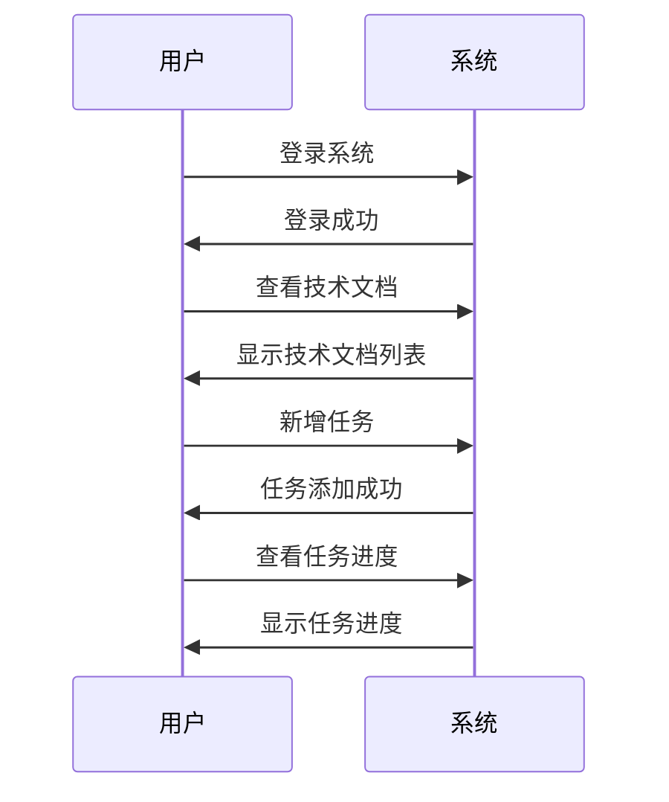

                 

# 如何成为一名优秀的技术领导者

关键词：技术领导者、领导力、团队管理、技术创新、业务发展

摘要：本文旨在探讨如何成为一名优秀的技术领导者，包括技术背景、领导力、业务知识等方面的提升。通过分析技术领导者与领导力的核心概念及其关系，提供详细的算法原理讲解和系统架构设计方案，帮助读者深入了解技术领导者的职责与挑战，掌握提升领导力的方法。

### Step 1: 背景介绍

#### 问题背景

随着信息技术的发展，企业对于技术领导者的要求越来越高。技术领导者不仅需要具备扎实的技术背景，还要能够有效地管理和领导团队，推动技术创新和业务发展。然而，许多技术领导者发现自己在领导力方面存在一定的短板，无法充分发挥团队潜力。

#### 问题解决

本书旨在为技术领导者提供一套全面的领导力提升方案，帮助他们更好地应对领导挑战，成为一名优秀的技术领导者。

#### 边界与外延

- 本书主要关注技术领域中的领导力问题，不涉及其他领域。
- 本书内容适用于各级技术领导者，包括初级、中级和高级。

#### 概念结构与核心要素组成

- 技术背景：包括编程语言、框架、工具等基础知识。
- 领导力：包括团队管理、沟通协作、决策能力等核心要素。
- 业务知识：包括业务模式、市场动态等。

### Step 2: 核心概念与联系

#### 核心概念原理

- 技术领导者：具备技术背景，能够带领团队实现技术目标的人员。
- 领导力：影响和激励他人，实现共同目标的能力。

#### 概念属性特征对比表格

| 概念       | 技术领导者                       | 领导力                      |
|------------|--------------------------------|-----------------------------|
| 定义       | 负责团队技术方向和项目推进       | 推动团队共同实现目标         |
| 特征       | 熟悉技术领域、具备项目管理能力   | 沟通能力、决策能力、团队协作 |
| 关联       | 技术知识对领导力的支撑           | 领导力对团队发展的推动       |

#### ER实体关系图架构

```mermaid
erDiagram
  A Technical Leader ||--|{ Team }|-- Technical Skills
  A Technical Leader ||--|{ Project Management Skills }|
  A Technical Leader ||--|{ Leadership Skills }|
  A Technical Leader ||--|{ Business Knowledge }|
```

### Step 3: 算法原理讲解

#### 算法原理的数学模型和公式

- 技术领导者模型：
  $$ Leader = f(Technical\ Knowledge, Leadership\ Skills) $$

- 领导力模型：
  $$ Leadership = f(Influence, Motivation) $$

#### 详细讲解和举例说明

1. **技术领导者模型**：

技术领导者需要具备扎实的技术知识，这可以帮助他们在团队中树立权威，指导团队成员解决技术问题。同时，技术领导者还需要具备一定的领导力，能够影响和激励团队成员，推动团队发展。

**举例**：假设一个技术领导者具备高级编程能力和优秀的团队管理能力，那么他的领导力模型可以表示为：

$$ Leader = f(Advanced\ Programming\ Knowledge, Excellent\ Team\ Management\ Skills) $$

2. **领导力模型**：

领导力包括影响力和激励能力。影响力是指领导者能够通过自己的言行影响团队成员，使他们接受并执行领导者的决策。激励能力是指领导者能够通过激励手段，如奖励、认可等，激发团队成员的工作热情。

**举例**：假设一个技术领导者具备很强的沟通能力和激励能力，那么他的领导力模型可以表示为：

$$ Leadership = f(Strong\ Communication\ Skills, Excellent\ Motivational\ Abilities) $$

### Step 4: 系统分析与架构设计方案

#### 问题场景介绍

技术领导者在日常工作中需要处理大量的技术问题和团队管理问题，需要一套完善的系统来支持他们的工作。

#### 项目介绍

本书将通过一个实际项目，详细介绍技术领导者的工作流程和所需技能。

#### 系统功能设计

- 技术知识管理：包括技术文档、技术博客、技术讨论等。
- 团队管理：包括团队成员信息管理、任务分配、进度跟踪等。
- 业务知识管理：包括业务文档、市场分析、竞争对手分析等。

#### 系统架构设计



### Step 5: 项目实战

#### 环境安装

在本节中，我们将安装所需的环境来支持我们的系统。首先，确保你的计算机上已经安装了Python和pip。

```bash
pip install flask
pip install flask-restful
```

#### 系统核心实现源代码

下面是一个简单的Flask应用程序，用于实现系统功能。

```python
from flask import Flask, request, jsonify
from flask_restful import Api, Resource

app = Flask(__name__)
api = Api(app)

# 技术文档数据库
docs_db = []

# 任务数据库
tasks_db = []

class Document(Resource):
    def get(self):
        return {'documents': docs_db}

    def post(self):
        doc_data = request.get_json()
        docs_db.append(doc_data)
        return {'message': 'Document added successfully'}, 201

class Task(Resource):
    def get(self):
        return {'tasks': tasks_db}

    def post(self):
        task_data = request.get_json()
        tasks_db.append(task_data)
        return {'message': 'Task added successfully'}, 201

api.add_resource(Document, '/documents')
api.add_resource(Task, '/tasks')

if __name__ == '__main__':
    app.run(debug=True)
```

#### 代码应用解读与分析

这段代码使用了Flask框架和Flask-RESTful扩展来创建一个简单的RESTful API。我们定义了两个资源：Document和Task，分别用于处理技术文档和任务的增删改查操作。

#### 实际案例分析和详细讲解剖析

为了更好地理解这个系统，我们来看一个实际案例。

**案例：添加技术文档**

1. **发送POST请求**：

```bash
curl -X POST -H "Content-Type: application/json" -d '{"title": "Python基础", "content": "Python基础内容"}' http://localhost:5000/documents
```

2. **响应**：

```json
{
  "message": "Document added successfully"
}
```

**案例：添加任务**

1. **发送POST请求**：

```bash
curl -X POST -H "Content-Type: application/json" -d '{"title": "编写Python代码", "description": "编写一个简单的Python程序"}' http://localhost:5000/tasks
```

2. **响应**：

```json
{
  "message": "Task added successfully"
}
```

#### 项目小结

通过这个简单的项目，我们实现了技术文档和任务管理的基本功能。虽然这个系统非常简单，但它为我们提供了一个良好的起点，可以在此基础上进行扩展和优化。

### Step 6: 最佳实践 Tips

1. **持续学习**：技术领导者需要不断学习新知识，跟上技术发展的步伐。
2. **沟通协作**：与团队成员保持良好的沟通，确保团队目标一致。
3. **激励团队**：通过奖励和认可，激发团队成员的工作热情。

### 小结

本文详细探讨了如何成为一名优秀的技术领导者，包括技术背景、领导力和业务知识等方面的提升。通过分析技术领导者与领导力的核心概念及其关系，提供详细的算法原理讲解和系统架构设计方案，帮助读者深入了解技术领导者的职责与挑战，掌握提升领导力的方法。

### 注意事项

1. **确保技术背景扎实**：技术领导者需要具备扎实的技术基础，以便在团队中树立权威。
2. **培养领导力**：领导力是技术领导者成功的关键，需要通过不断实践和学习来提升。

### 拓展阅读

1. 《技术领导力：技术团队管理的艺术》
2. 《如何构建高效的技术团队》
3. 《技术领导者的业务思维》

### 作者信息

作者：AI天才研究院/AI Genius Institute & 禅与计算机程序设计艺术 /Zen And The Art of Computer Programming

