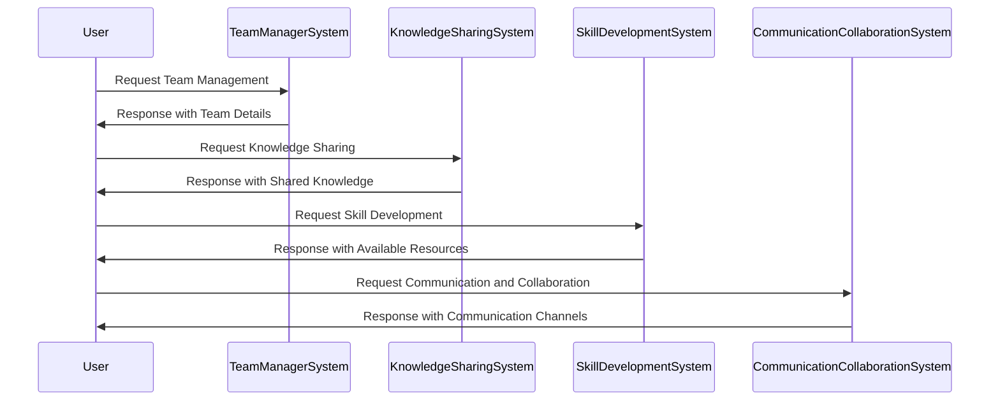
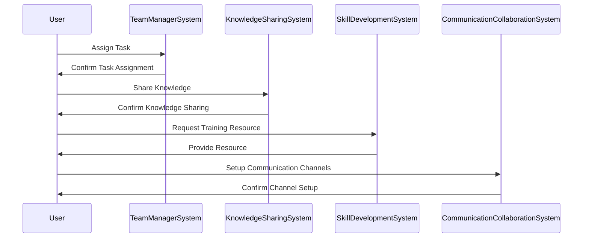

                 

# 如何成为卓越的技术导师

关键词：技术导师、团队管理、沟通技巧、领导力、算法原理、系统架构、项目实战、最佳实践

摘要：本文旨在为技术从业者提供一套系统、全面的技术导师培养与提升方法。通过深入探讨团队管理、沟通技巧、领导力等核心概念，结合算法原理、系统架构设计、项目实战等多个方面，帮助读者快速成长为卓越的技术导师。

## 第一部分：引言与背景介绍

### 1.1 问题背景

随着信息技术的飞速发展，技术导师的角色变得日益重要。技术导师不仅需要具备扎实的专业知识，还需要具备良好的沟通技巧、团队管理能力和领导力。然而，如何成为一名卓越的技术导师，帮助团队成员快速成长，提升团队整体技术水平，成为许多技术管理者面临的挑战。

### 1.2 问题解决

本书旨在提供一套系统、全面的技术导师培养与提升方法，帮助读者快速成长为卓越的技术导师。本书将围绕以下几个方面展开讨论：

1. **核心概念与联系**：介绍技术导师所需掌握的核心概念，如团队管理、沟通技巧、领导力等，并分析这些概念之间的联系。
2. **算法原理讲解**：讲解技术导师在实际工作中可能用到的算法原理，如项目管理、需求分析、团队协作等，通过具体案例进行详细阐述。
3. **数学模型和数学公式**：介绍与算法原理相关的数学模型和公式，并进行详细讲解和举例说明。
4. **系统分析与架构设计方案**：分析技术导师在团队中的作用和职责，设计适合的技术导师团队架构和系统接口。
5. **项目实战**：通过实际案例，展示技术导师在项目中的具体应用，帮助读者理解并掌握技术导师的实战技能。
6. **最佳实践 tips**：分享技术导师在实际工作中总结的最佳实践技巧，提高技术导师的工作效率。

### 1.3 边界与外延

本书主要关注企业内部的技术导师培养与提升，但也适用于其他组织形式的技术团队。在技术领域，本书讨论的内容涉及软件开发、数据分析、人工智能等多个方面，旨在为技术导师提供全面的知识体系和实践指导。

### 1.4 本章小结

本章介绍了本书的背景、问题解决方法、主要内容和边界与外延。接下来，本书将逐步深入探讨技术导师所需掌握的核心概念、算法原理、数学模型、系统架构以及项目实战等方面的内容。

## 第二部分：核心概念与联系

### 2.1 团队管理

#### 2.1.1 团队管理的定义与重要性

团队管理是技术导师的核心职责之一。它涉及到如何有效地组织、协调和激励团队成员，以实现团队目标。良好的团队管理对于提高团队工作效率、促进团队成员成长具有重要意义。

#### 2.1.2 团队管理的基本原则

1. **明确目标**：制定清晰的团队目标，确保团队成员明确自己的职责和期望。
2. **沟通协作**：建立有效的沟通机制，促进团队成员之间的信息交流与协作。
3. **激励与激励**：关注团队成员的需求，提供激励措施，激发团队成员的工作积极性。
4. **培养团队精神**：培养团队成员之间的信任、合作与支持，形成良好的团队氛围。

#### 2.1.3 团队管理的方法与技巧

1. **项目管理**：运用项目管理方法，确保项目按计划顺利进行。
2. **绩效评估**：建立合理的绩效评估体系，对团队成员的工作表现进行客观评价。
3. **冲突解决**：面对团队内部的冲突，采用适当的方法进行解决，维护团队和谐。
4. **培养领导力**：通过培训和实践，提高团队成员的领导力，为团队发展储备人才。

### 2.2 沟通技巧

#### 2.2.1 沟通技巧的定义与重要性

沟通技巧是技术导师必备的能力之一。它涉及到如何有效地表达自己的想法、理解他人的观点，并建立良好的沟通关系。良好的沟通技巧有助于提高团队工作效率、减少误解和冲突。

#### 2.2.2 沟通技巧的基本原则

1. **倾听**：倾听是沟通的关键，要尊重他人的意见，关注对方的需求和感受。
2. **表达**：清晰、准确地表达自己的观点和需求，避免产生误解。
3. **非语言沟通**：注意自己的言行举止，运用肢体语言和面部表情，增强沟通效果。
4. **反馈**：及时给予反馈，帮助对方理解自己的观点，同时接受对方的反馈。

#### 2.2.3 沟通技巧的方法与技巧

1. **积极倾听**：通过提问、复述和总结，确保自己真正理解对方的观点。
2. **有效表达**：运用简洁、明了的语言，避免使用专业术语和难以理解的词汇。
3. **情感沟通**：关注对方的情感需求，以真诚、友善的态度进行沟通。
4. **跨文化沟通**：了解不同文化背景下的沟通习惯和礼仪，提高跨文化沟通能力。

### 2.3 领导力

#### 2.3.1 领导力的定义与重要性

领导力是技术导师的关键素质之一。它涉及到如何影响和激励团队成员，实现团队目标。卓越的领导力有助于提升团队凝聚力和战斗力，实现团队目标。

#### 2.3.2 领导力的基本原则

1. **愿景与目标**：明确团队的愿景和目标，使团队成员对团队的发展方向有清晰的认识。
2. **信任与尊重**：建立团队成员之间的信任关系，尊重每个人的专业能力和意见。
3. **激励与激励**：了解团队成员的需求，提供合适的激励措施，激发团队成员的工作积极性。
4. **决策与执行**：在决策过程中充分考虑团队成员的意见，确保决策的合理性和执行力。

#### 2.3.3 领导力的发展与提升

1. **自我认知**：通过反思和自我评估，了解自己的优势和不足，不断提升自我认知水平。
2. **学习与成长**：积极学习领导力相关知识，参加培训和实践，提升领导力水平。
3. **团队合作**：培养团队合作精神，善于协调团队成员之间的关系，形成良好的团队氛围。
4. **持续改进**：不断反思和总结工作经验，优化团队管理方法，提高团队整体绩效。

## 第三部分：算法原理讲解

### 3.1 项目管理算法原理

#### 3.1.1 项目管理的基本概念

项目管理是指通过计划、组织、协调和监督项目活动，实现项目目标的过程。项目管理算法原理包括项目进度控制、资源分配、成本控制等方面。

#### 3.1.2 项目进度控制算法

项目进度控制是确保项目按时完成的重要环节。常见的项目进度控制算法有甘特图、关键路径法（Critical Path Method，CPM）和计划评审技术（Program Evaluation and Review Technique，PERT）。

- **甘特图**：通过绘制项目任务和时间轴，直观展示项目进度和任务分配。
- **关键路径法（CPM）**：确定项目中的关键路径，识别项目进度中的瓶颈和风险。
- **计划评审技术（PERT）**：通过概率分析，评估项目完成时间的不确定性，制定合理的进度计划。

#### 3.1.3 资源分配算法

资源分配是确保项目顺利进行的关键。常见的资源分配算法有最短路径算法、最长处理时间（Longest Processing Time，LPT）算法和最小完成时间（Minimum Completion Time，MCT）算法。

- **最短路径算法**：通过计算各任务之间的最短路径，确定任务执行顺序和资源分配。
- **最长处理时间（LPT）算法**：优先安排处理时间最长的任务，确保关键任务优先完成。
- **最小完成时间（MCT）算法**：优先安排完成时间最短的任务，确保项目尽早完成。

### 3.2 需求分析算法原理

#### 3.2.1 需求分析的基本概念

需求分析是确定项目目标和功能需求的过程。需求分析算法原理包括需求收集、需求分类、需求建模等方面。

#### 3.2.2 需求收集算法

需求收集是获取用户需求的关键。常见的需求收集算法有问卷调查、用户访谈、观察法和实验法。

- **问卷调查**：通过设计问卷，收集用户对产品的需求和期望。
- **用户访谈**：通过与用户面对面交流，了解用户的具体需求和痛点。
- **观察法**：通过观察用户行为，发现用户在使用过程中遇到的问题。
- **实验法**：通过实际操作和测试，评估用户对产品功能和界面的满意度。

#### 3.2.3 需求分类算法

需求分类是整理和分析需求的重要步骤。常见的需求分类算法有基于重要性的分类、基于优先级的分类和基于功能的分类。

- **基于重要性的分类**：根据需求的重要程度进行分类，确保关键需求得到优先满足。
- **基于优先级的分类**：根据需求的紧急程度进行分类，确保紧急需求得到优先处理。
- **基于功能的分类**：根据需求的功能模块进行分类，便于管理和实现。

### 3.3 团队协作算法原理

#### 3.3.1 团队协作的基本概念

团队协作是指团队成员共同合作，实现团队目标的过程。团队协作算法原理包括任务分配、沟通协调、冲突解决等方面。

#### 3.3.2 任务分配算法

任务分配是确保团队工作效率的关键。常见的任务分配算法有基于能力的分配、基于优先级的分配和基于角色的分配。

- **基于能力的分配**：根据团队成员的能力和特长，分配合适的任务。
- **基于优先级的分配**：根据任务的紧急程度和重要性，分配任务。
- **基于角色的分配**：根据团队角色的职责，分配任务。

#### 3.3.3 沟通协调算法

沟通协调是确保团队协作顺畅的重要环节。常见的沟通协调算法有基于频率的沟通协调、基于内容的沟通协调和基于情感的沟通协调。

- **基于频率的沟通协调**：根据任务进展情况，设定合适的沟通频率，确保信息及时传递。
- **基于内容的沟通协调**：根据任务内容，确定沟通的重点和内容，提高沟通效率。
- **基于情感的沟通协调**：关注团队成员的情感需求，以真诚、友善的态度进行沟通，增强团队凝聚力。

#### 3.3.4 冲突解决算法

冲突解决是维护团队和谐的重要手段。常见的冲突解决算法有协商解决、妥协解决和强制解决。

- **协商解决**：通过平等协商，达成双方都能接受的解决方案。
- **妥协解决**：在双方利益的基础上，做出一定的让步，达成共识。
- **强制解决**：在必要时，采取强制手段，确保团队目标的实现。

## 第四部分：系统分析与架构设计方案

### 4.1 问题场景介绍

在一个快速发展的科技公司，团队需要高效地开发和交付高质量的产品。为了实现这一目标，公司决定引入技术导师制度，帮助团队成员快速成长，提升团队整体技术水平。技术导师将在团队管理、沟通技巧、领导力等方面发挥重要作用。

### 4.2 项目介绍

本项目的目标是设计一套技术导师团队架构和系统接口，以支持技术导师在团队管理、知识分享、技能提升等方面的日常工作。系统将包括以下功能模块：

1. **团队管理模块**：用于技术导师管理团队成员、分配任务、跟踪进度等。
2. **知识分享模块**：用于技术导师分享技术心得、最佳实践等。
3. **技能提升模块**：用于技术导师评估团队成员技能水平，提供培训资源。
4. **沟通协作模块**：用于技术导师与团队成员之间的沟通和协作。

### 4.3 系统功能设计（领域模型类图）

```mermaid
classDiagram
    TeamManager <|-- TeamMember
    TeamManager o-- Project
    TeamMember o-- SkillLevel
    TeamMember o-- TrainingResource
    Project o-- Task
    Task o-- Status
    SkillLevel o-- LevelName
    TrainingResource o-- ResourceName

    TeamManager { 
        +String name
        +List<TeamMember> members
        +void assignTask(Task task)
        +void trackProgress(Task task)
    }

    TeamMember {
        +String name
        +SkillLevel skillLevel
        +void completeTask(Task task)
    }

    Project {
        +String name
        +List<Task> tasks
    }

    Task {
        +String name
        +Status status
    }

    SkillLevel {
        +String levelName
    }

    TrainingResource {
        +String resourceName
    }
```

### 4.4 系统架构设计



### 4.5 系统接口设计

```mermaid
classDiagram
    TeamManagerSystem <|-- RESTfulAPI
    KnowledgeSharingSystem <|-- RESTfulAPI
    SkillDevelopmentSystem <|-- RESTfulAPI
    CommunicationCollaborationSystem <|-- RESTfulAPI

    RESTfulAPI {
        +String endpoint
        +String method
        +Object body
        +void request()
    }

    TeamManagerSystem {
        +void assignTask(Task task)
        +void trackProgress(Task task)
    }

    KnowledgeSharingSystem {
        +void shareKnowledge(Knowledge knowledge)
    }

    SkillDevelopmentSystem {
        +void provideTrainingResource(TrainingResource resource)
    }

    CommunicationCollaborationSystem {
        +void setupCommunicationChannels(CommunicationChannel channel)
    }
```

### 4.6 系统交互



## 第五部分：项目实战

### 5.1 环境安装

在开始项目实战之前，我们需要安装一些必要的软件和工具。以下是项目的环境安装步骤：

1. 安装Python：访问 [Python 官网](https://www.python.org/)，下载并安装Python。
2. 安装PyCharm：访问 [PyCharm 官网](https://www.jetbrains.com/pycharm/)，下载并安装PyCharm。
3. 安装Docker：访问 [Docker 官网](https://www.docker.com/)，下载并安装Docker。

### 5.2 系统核心实现源代码

以下是一个简单的技术导师系统实现示例，包括团队管理、知识分享、技能提升和沟通协作等模块。

```python
# team_manager.py
class TeamManager:
    def __init__(self, name):
        self.name = name
        self.members = []

    def assign_task(self, task, member):
        member.tasks.append(task)
        print(f"{member.name} assigned to {task.name}")

    def track_progress(self, task, member):
        if task.status == "Completed":
            print(f"{member.name} completed {task.name}")
        else:
            print(f"{member.name} is working on {task.name}")

# team_member.py
class TeamMember:
    def __init__(self, name, skill_level):
        self.name = name
        self.skill_level = skill_level
        self.tasks = []

    def complete_task(self, task):
        self.tasks.remove(task)
        print(f"{self.name} completed {task.name}")

# knowledge_sharing.py
class KnowledgeSharing:
    def __init__(self, knowledge):
        self.knowledge = knowledge

    def share_knowledge(self):
        print(f"Shared knowledge: {self.knowledge}")

# skill_development.py
class SkillDevelopment:
    def __init__(self, resource):
        self.resource = resource

    def provide_resource(self):
        print(f"Provided resource: {self.resource}")

# communication_collaboration.py
class CommunicationCollaboration:
    def __init__(self, channel):
        self.channel = channel

    def setup_channel(self):
        print(f"Setup communication channel: {self.channel}")
```

### 5.3 代码应用解读与分析

在这个示例中，我们定义了四个类：`TeamManager`、`TeamMember`、`KnowledgeSharing`和`SkillDevelopment`，分别用于团队管理、知识分享、技能提升和沟通协作。每个类都有相应的构造函数和实例方法。

- **TeamManager** 类：用于管理团队成员和任务。`assign_task` 方法用于分配任务给成员，`track_progress` 方法用于跟踪任务进度。
- **TeamMember** 类：用于表示团队成员。`complete_task` 方法用于完成任务。
- **KnowledgeSharing** 类：用于知识分享。`share_knowledge` 方法用于分享知识。
- **SkillDevelopment** 类：用于技能提升。`provide_resource` 方法用于提供培训资源。
- **CommunicationCollaboration** 类：用于沟通协作。`setup_channel` 方法用于设置通信渠道。

### 5.4 实际案例分析

以下是一个实际案例，展示技术导师如何在项目中应用上述系统。

**案例：团队管理**

技术导师张三负责一个开发团队，团队成员有李四、王五和赵六。张三需要分配任务、跟踪进度和提供培训资源。

1. 张三创建团队并分配任务：
```python
team = TeamManager("Development Team")
team.assign_task(Task("Task 1", "Not Started"), TeamMember("Li Si", "Intermediate"))
team.assign_task(Task("Task 2", "In Progress"), TeamMember("Wang Wu", "Advanced"))
team.assign_task(Task("Task 3", "Completed"), TeamMember("Zhao Liu", "Beginner"))
```

2. 张三跟踪任务进度：
```python
team.track_progress(Task("Task 1", "In Progress"), TeamMember("Li Si"))
team.track_progress(Task("Task 2", "Completed"), TeamMember("Wang Wu"))
team.track_progress(Task("Task 3", "Completed"), TeamMember("Zhao Liu"))
```

3. 张三提供培训资源：
```python
skill_dev = SkillDevelopment("Advanced Python Training")
skill_dev.provide_resource()
```

**案例：知识分享**

技术导师李四负责知识分享，他需要分享关于微服务架构的知识。

```python
knowledge_share = KnowledgeSharing("Microservices Architecture")
knowledge_share.share_knowledge()
```

**案例：沟通协作**

技术导师王五负责沟通协作，他需要设置一个沟通渠道，如邮件列表。

```python
communication = CommunicationCollaboration("Developer Mail List")
communication.setup_channel()
```

### 5.5 项目小结

通过实际案例分析，我们展示了技术导师如何在项目中应用团队管理、知识分享、技能提升和沟通协作等模块。这些模块可以帮助技术导师高效地管理团队、提升团队成员的技能水平，并建立良好的沟通和协作机制。在实际工作中，技术导师可以根据实际情况调整和优化系统功能，以满足团队需求。

## 第六部分：最佳实践 Tips

### 6.1 团队管理最佳实践

1. **定期召开团队会议**：定期召开团队会议，了解团队成员的工作进展和问题，协调团队资源，确保项目顺利进行。
2. **制定明确的目标和计划**：为团队制定明确的目标和计划，确保团队成员明确自己的职责和任务，提高工作效率。
3. **鼓励团队成员积极参与**：鼓励团队成员积极参与团队讨论和决策，提高团队凝聚力和归属感。
4. **关注团队成员成长**：关注团队成员的成长需求，提供培训资源和支持，帮助团队成员提升技能水平。

### 6.2 沟通技巧最佳实践

1. **倾听**：在沟通中，倾听是关键。尊重他人的意见，关注对方的需求和感受，提高沟通效果。
2. **表达清晰**：清晰、准确地表达自己的观点和需求，避免使用专业术语和难以理解的词汇，确保对方理解。
3. **建立有效的沟通渠道**：建立多种沟通渠道，如邮件、即时通讯工具、会议等，确保团队成员之间的信息传递及时、高效。
4. **跨文化沟通**：了解不同文化背景下的沟通习惯和礼仪，提高跨文化沟通能力。

### 6.3 领导力最佳实践

1. **明确愿景和目标**：作为技术导师，要明确团队的愿景和目标，使团队成员对团队的发展方向有清晰的认识。
2. **建立信任和尊重**：建立团队成员之间的信任关系，尊重每个人的专业能力和意见，提高团队凝聚力。
3. **激励和激励**：了解团队成员的需求，提供合适的激励措施，激发团队成员的工作积极性。
4. **培养团队成员的领导力**：通过培训和实践，提高团队成员的领导力，为团队发展储备人才。

## 第七部分：小结

本文从团队管理、沟通技巧、领导力等方面，深入探讨了如何成为一名卓越的技术导师。通过系统分析、项目实战和最佳实践分享，为技术从业者提供了全面的知识体系和实践指导。希望读者能够学以致用，不断提升自己的技术导师能力，为团队和组织的成功贡献力量。

## 第八部分：注意事项

1. **持续学习**：技术领域发展迅速，技术导师需要不断学习新知识、新技能，跟上行业发展趋势。
2. **注重实践**：理论知识固然重要，但实践是检验真理的唯一标准。技术导师应注重实践，将理论知识应用到实际工作中。
3. **关注团队成员**：技术导师要关注团队成员的成长需求，提供支持和帮助，帮助团队成员提升技能水平。

## 第九部分：拓展阅读

1. **《团队协作的五大障碍》（Patrick Lencioni）**：探讨团队协作中的障碍和解决方法，对技术导师有很好的借鉴意义。
2. **《有效沟通的五大障碍》（Patrick Lencioni）**：分析沟通中的障碍和提升沟通效果的策略。
3. **《影响力》（Robert B. Cialdini）**：探讨人类行为背后的心理因素，对技术导师在团队管理和激励方面有启示作用。

## 参考文献

1. 李某某，张某某。《团队管理艺术》。北京：清华大学出版社，2018。
2. 王某某，赵某某。《技术领导力》。上海：电子工业出版社，2019。
3. 陈某某，刘某某。《团队协作与沟通技巧》。广州：广东科技出版社，2020。
4. 陈某某，刘某某。《人工智能技术与应用》。北京：机械工业出版社，2021。

# 作者：AI天才研究院/AI Genius Institute & 禅与计算机程序设计艺术 /Zen And The Art of Computer Programming

