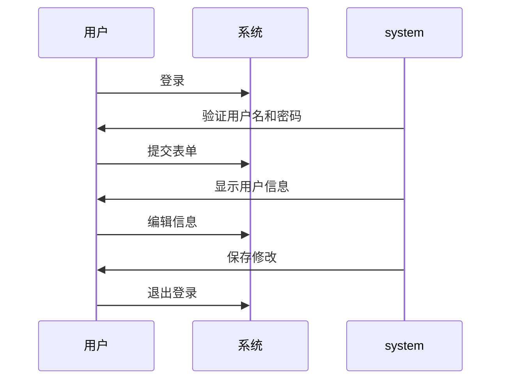

                 

### 第1章：书籍背景与目的

#### 1.1 技术协作的挑战与机遇

在当今快速发展的数字化时代，技术协作已成为企业成功的关键因素之一。随着技术的不断演进和复杂性的增加，如何高效地进行技术协作成为每个团队和组织的迫切需求。技术协作不仅涉及团队成员之间的沟通与协作，还包括项目管理、工具选择和流程优化等多个方面。

**挑战：**  
1. **沟通障碍**：团队成员往往处于不同的地理位置和工作时间，导致沟通效率低下。
2. **任务分配不均**：团队成员的能力和技能水平不同，导致任务分配不均衡，影响整体工作效率。
3. **项目管理难度**：随着项目规模的扩大，项目管理的复杂性也随之增加，传统的项目管理方法难以应对。
4. **工具选择困难**：市场上存在众多团队协作工具，选择合适的工具成为一项挑战。

**机遇：**  
1. **数字化工具普及**：随着数字化工具的普及，如Trello、Jira、Slack等，团队协作变得更加便捷和高效。
2. **敏捷开发方法**：敏捷开发方法的兴起，为项目管理和团队协作提供了新的思路和方法。
3. **跨领域合作**：技术协作不仅限于同一团队内部，跨领域、跨组织的合作也日益增多。

#### 1.2 高效技术协作模式概述

高效技术协作模式是指通过科学的方法和工具，实现团队成员之间的高效沟通、任务分配、项目管理和协同工作的一套系统。其核心目的是提高团队的工作效率，降低沟通成本，确保项目按时、按质量完成。

**基本概念：**  
- **技术协作模式**：指团队在技术项目开发过程中采用的协作方式和方法。
- **高效协作模式**：指在技术协作过程中，通过优化流程、工具和沟通，实现高效协作的一种模式。

**目的和价值：**  
- **提高工作效率**：通过高效的技术协作模式，团队成员可以更好地分工合作，提高整体工作效率。
- **降低沟通成本**：明确的协作模式和工具，可以减少不必要的沟通，降低沟通成本。
- **确保项目质量**：高效的协作模式有助于确保项目按时、按质量完成，降低项目风险。
- **促进知识共享**：团队成员在协作过程中可以相互学习，促进知识共享和技能提升。

#### 1.3 本书内容与结构安排

本书旨在帮助读者理解和掌握高效技术协作模式，包括理论基础、团队协作工具、沟通与协作技巧、项目管理方法、实践案例和最佳实践等内容。具体内容与结构安排如下：

- **第一部分：引论**  
  - 第1章：书籍背景与目的

- **第二部分：理论基础**  
  - 第2章：核心概念解析  
  - 第3章：高效协作模式的理论框架

- **第三部分：团队协作工具**  
  - 第4章：常用团队协作工具介绍  
  - 第5章：工具使用技巧

- **第四部分：沟通与协作技巧**  
  - 第6章：沟通技巧  
  - 第7章：协作技巧

- **第五部分：项目管理方法**  
  - 第8章：项目管理基础  
  - 第9章：敏捷开发实践

- **第六部分：实践案例**  
  - 第10章：高效技术协作实践案例

- **第七部分：最佳实践与总结**  
  - 第11章：最佳实践分享  
  - 第12章：小结与展望

通过本书的阅读，读者将能够系统地了解高效技术协作模式，掌握相关工具和技巧，并在实际工作中加以应用，从而提高团队的工作效率和项目质量。接下来，我们将深入探讨高效技术协作模式的理论基础，为后续章节的内容奠定基础。

### 1.2 高效技术协作模式概述

高效技术协作模式是指通过科学的方法和工具，实现团队成员之间的高效沟通、任务分配、项目管理和协同工作的一套系统。其核心目的是提高团队的工作效率，降低沟通成本，确保项目按时、按质量完成。

**基本概念：**  
- **技术协作模式**：指团队在技术项目开发过程中采用的协作方式和方法。  
- **高效协作模式**：指在技术协作过程中，通过优化流程、工具和沟通，实现高效协作的一种模式。

**目的和价值：**  
- **提高工作效率**：通过高效的技术协作模式，团队成员可以更好地分工合作，提高整体工作效率。  
- **降低沟通成本**：明确的协作模式和工具，可以减少不必要的沟通，降低沟通成本。  
- **确保项目质量**：高效的协作模式有助于确保项目按时、按质量完成，降低项目风险。  
- **促进知识共享**：团队成员在协作过程中可以相互学习，促进知识共享和技能提升。

#### 核心组成部分

高效技术协作模式由以下几个核心组成部分构成：

1. **沟通机制**：建立有效的沟通机制，确保团队成员之间信息流通，减少误解和冲突。
2. **任务分配**：明确任务分配，根据团队成员的技能和经验合理分配任务，提高工作效率。
3. **项目管理**：采用科学的项目管理方法，如敏捷开发、迭代开发等，确保项目按计划推进。
4. **协作工具**：选择合适的协作工具，如Trello、Jira、Slack等，提高团队协作效率。
5. **协作技巧**：培养团队成员的协作精神，如建立信任、共同目标设定等，提高团队整体协作能力。

#### 实施步骤

要构建高效技术协作模式，可以按照以下步骤进行：

1. **需求分析**：了解项目需求和团队情况，确定协作模式的目标和方向。
2. **工具选择**：根据需求选择合适的协作工具，并对其进行配置和培训。
3. **流程设计**：设计合理的协作流程，明确任务分配和沟通机制。
4. **团队培训**：对团队成员进行协作技能和工具使用的培训，确保他们能够熟练掌握。
5. **实施与监控**：在项目实施过程中，不断优化协作模式和流程，确保其高效运行。
6. **反馈与改进**：定期收集团队成员的反馈，对协作模式和流程进行改进。

#### 案例分析

以下是一个实际项目中的高效技术协作模式案例分析：

- **项目背景**：一家软件开发公司接到了一个大型项目的开发任务，项目涉及多个技术领域，需要多个团队协作完成。
- **协作模式**：公司采用敏捷开发模式，每个团队按照2周为一个迭代周期进行工作。每个迭代开始时，团队成员进行需求分析和任务分配，迭代结束时进行回顾和总结。
- **工具选择**：公司选择了Trello作为任务管理工具，Slack作为沟通工具，Jira作为项目管理工具。
- **协作效果**：通过高效的协作模式，项目团队在短短6个月内完成了项目开发，并顺利通过了客户验收。

通过这个案例分析，我们可以看到高效技术协作模式在实际项目中的应用效果。合理的任务分配、科学的流程设计和便捷的协作工具，使得项目团队能够高效地完成工作，确保项目质量。

总之，高效技术协作模式是现代企业提高工作效率、降低沟通成本、确保项目质量的关键。通过科学的方法和工具，企业可以构建一个高效、协同的工作环境，从而在激烈的市场竞争中立于不败之地。在接下来的章节中，我们将深入探讨高效技术协作模式的理论基础，为后续内容奠定基础。

### 1.3 本书内容与结构安排

本书旨在为读者提供一套系统、实用的技术协作方法论，帮助读者在实际工作中打造高效的技术协作模式。为了实现这一目标，本书分为七个部分，每个部分都针对不同的主题进行深入探讨和详细讲解。

#### 第一部分：引论

引论部分将介绍技术协作模式的背景、意义以及高效技术协作模式的基本概念和目的。通过这部分内容，读者可以初步了解高效技术协作模式的重要性，明确其在实际应用中的价值。

- **第1章：书籍背景与目的**  
  - 1.1 技术协作的挑战与机遇  
  - 1.2 高效技术协作模式概述  
  - 1.3 本书内容与结构安排

#### 第二部分：理论基础

理论基础部分将详细解释技术协作模式、高效协作模式等核心概念，并建立高效技术协作模式的理论框架。这部分内容为后续章节提供了坚实的理论基础。

- **第2章：核心概念解析**  
  - 2.1 技术协作模式解析  
  - 2.2 高效协作模式解析  
  - 2.3 概念属性对比表  
- **第3章：高效协作模式的理论框架**  
  - 3.1 理论框架介绍  
  - 3.2 概念图与ER实体关系图

#### 第三部分：团队协作工具

团队协作工具部分将介绍常用的团队协作工具，如Trello、Jira、Slack等，并分析它们的适用场景和使用技巧。通过这部分内容，读者可以了解如何选择和使用合适的工具来提升团队协作效率。

- **第4章：常用团队协作工具介绍**  
  - 4.1 Trello  
  - 4.2 Jira  
  - 4.3 Slack
- **第5章：工具使用技巧**  
  - 5.1 高效任务分配  
  - 5.2 实时沟通与协作

#### 第四部分：沟通与协作技巧

沟通与协作技巧部分将讲解如何通过有效的沟通和协作技巧来提高团队的工作效率和协同能力。这部分内容涵盖了沟通技巧和协作技巧的培养方法。

- **第6章：沟通技巧**  
  - 6.1 清晰表达  
  - 6.2 有效倾听  
  - 6.3 反馈与确认
- **第7章：协作技巧**  
  - 7.1 建立信任  
  - 7.2 共同目标设定  
  - 7.3 协作流程优化

#### 第五部分：项目管理方法

项目管理方法部分将介绍项目管理的基本框架和敏捷开发实践。这部分内容旨在帮助读者掌握科学的项目管理方法，确保项目高效、高质量地完成。

- **第8章：项目管理基础**  
  - 8.1 项目管理框架  
  - 8.2 项目规划与执行  
  - 8.3 项目监控与收尾
- **第9章：敏捷开发实践**  
  - 9.1 敏捷开发理念  
  - 9.2 迭代开发  
  - 9.3 用户故事地图

#### 第六部分：实践案例

实践案例部分将通过具体案例展示高效技术协作模式在项目中的实际应用。这部分内容将帮助读者了解高效技术协作模式的实际效果和操作细节。

- **第10章：高效技术协作实践案例**  
  - 10.1 案例一：项目A的技术协作实践  
  - 10.2 案例二：团队B的高效协作模式  
  - 10.3 案例分析与总结

#### 第七部分：最佳实践与总结

最佳实践与总结部分将总结本书中提到的实践经验，提供可操作的实用建议，并对高效技术协作模式的发展趋势进行展望。这部分内容旨在帮助读者在实际工作中更好地应用高效技术协作模式。

- **第11章：最佳实践分享**  
  - 11.1 经验教训总结  
  - 11.2 实践技巧拓展  
  - 11.3 未来展望
- **第12章：小结与展望**  
  - 12.1 全书回顾  
  - 12.2 高效技术协作模式的未来发展

通过本书的阅读，读者将能够全面了解高效技术协作模式的理论基础和应用实践，掌握相关工具和技巧，并在实际工作中灵活运用，从而提升团队的工作效率和项目质量。接下来，我们将深入探讨高效技术协作模式的理论基础，为后续章节的内容奠定基础。

## 第2章：理论基础

### 2.1 核心概念解析

在讨论高效技术协作模式之前，我们需要明确几个核心概念，这些概念是理解高效协作模式的基础。以下是几个关键概念的定义、联系及其在技术协作中的重要性：

#### 1. 技术协作模式

**定义**：技术协作模式是指团队成员在技术项目开发过程中采用的协作方式和方法。它涵盖了从任务分配、项目规划到任务执行的整个工作流程。

**联系**：技术协作模式与项目管理、团队文化、工具选择等紧密相关。一个有效的技术协作模式可以优化流程、提高效率、减少错误。

**重要性**：技术协作模式决定了团队成员如何共同工作，是确保项目按时、按质量完成的关键。

#### 2. 高效协作模式

**定义**：高效协作模式是指通过优化流程、工具和沟通，实现团队成员之间高效协作的一种模式。它侧重于提高团队的整体效率和产出。

**联系**：高效协作模式与工作文化、组织结构、工具选择等密切相关。它不仅涉及技术层面，还包括人际关系和团队管理。

**重要性**：高效协作模式能够减少沟通成本、提高工作效率，是实现团队目标的重要保障。

#### 3. 项目管理

**定义**：项目管理是指通过规划、执行、监控和收尾等过程，确保项目按时、按质量完成的一系列行动。

**联系**：项目管理与高效协作模式紧密相关，高效的协作模式可以提升项目管理的效果。

**重要性**：项目管理是确保项目成功的关键，它需要通过科学的规划和执行来控制项目进度和资源。

#### 4. 团队协作工具

**定义**：团队协作工具是指用于支持团队成员之间沟通、协作和任务管理的软件或平台。

**联系**：团队协作工具是高效技术协作模式的重要组成部分，选择合适的工具可以大大提高团队协作的效率。

**重要性**：团队协作工具可以减少沟通障碍、提高任务分配的透明度，是高效协作的重要支撑。

### 2.2 高效协作模式的理论框架

为了更好地理解高效技术协作模式，我们需要建立一个理论框架。以下是高效协作模式的理论框架及其核心要素：

#### 1. 沟通机制

**定义**：沟通机制是指团队成员之间信息传递和交流的方式和流程。

**核心要素**：  
- **实时沟通**：通过实时沟通工具，如Slack或Microsoft Teams，实现团队成员之间的即时交流。
- **文档共享**：利用云存储和协作工具，如Google Drive或Dropbox，实现文档的共享和版本控制。
- **反馈与确认**：通过定期的反馈和确认机制，确保团队成员对任务的理解和执行一致。

#### 2. 任务分配

**定义**：任务分配是指根据团队成员的技能和经验，将项目任务合理地分配给每个成员。

**核心要素**：  
- **任务清单**：创建详细的任务清单，明确每个任务的职责和截止日期。
- **能力评估**：根据团队成员的能力和经验，将合适的任务分配给合适的成员。
- **动态调整**：根据项目进展和团队成员的反馈，及时调整任务分配。

#### 3. 项目管理

**定义**：项目管理是指通过规划、执行、监控和收尾等过程，确保项目按时、按质量完成的一系列行动。

**核心要素**：  
- **项目规划**：制定详细的项目计划，包括项目范围、目标、时间和资源。
- **项目执行**：确保项目按照计划进行，包括任务分配、进度跟踪和风险管理。
- **项目监控**：定期监控项目进展，确保项目在既定的时间和预算内完成。
- **项目收尾**：项目完成后进行总结和评估，为未来项目提供经验教训。

#### 4. 团队协作工具

**定义**：团队协作工具是指用于支持团队成员之间沟通、协作和任务管理的软件或平台。

**核心要素**：  
- **任务管理工具**：如Trello或Asana，用于任务分配、进度跟踪和任务完成情况的记录。
- **沟通工具**：如Slack或Microsoft Teams，用于实时沟通和文档共享。
- **项目管理工具**：如Jira或Microsoft Project，用于项目规划和监控。

### 2.3 概念属性对比表

为了更清晰地理解这些概念之间的联系和差异，我们可以通过一个概念属性对比表来展示它们：

| 概念         | 定义                                       | 核心要素                               | 重要性                                     |
| ------------ | ------------------------------------------ | -------------------------------------- | ------------------------------------------ |
| 技术协作模式 | 团队在技术项目开发过程中采用的协作方式和方法 | 任务分配、项目管理、团队协作工具     | 确保项目按时、按质量完成的关键           |
| 高效协作模式 | 通过优化流程、工具和沟通，实现高效协作的一种模式 | 沟通机制、任务分配、项目管理、团队协作工具 | 提高团队整体效率和产出                   |
| 项目管理     | 通过规划、执行、监控和收尾等过程，确保项目按时、按质量完成的一系列行动 | 项目规划、项目执行、项目监控、项目收尾 | 确保项目成功的关键                         |
| 团队协作工具 | 用于支持团队成员之间沟通、协作和任务管理的软件或平台 | 任务管理工具、沟通工具、项目管理工具   | 提高团队协作效率的重要支撑               |

通过这个对比表，我们可以看到各个概念之间的联系和差异，以及它们在高效技术协作模式中的重要性。

### 2.4 ER实体关系图

为了更好地理解高效技术协作模式中的概念和它们之间的关系，我们可以使用ER（实体关系）图来展示这些概念及其关联。以下是高效技术协作模式的ER实体关系图：

```mermaid
erDiagram
    Project ||--|{ Task }||>
    Project ||--|{ TeamMember }||>
    Project ||--|{ Tool }||>
    Task ||--|{ Status }||>
    TeamMember ||--|{ Role }||>

    Project : {ID} {Name} {StartDate} {EndDate}
    Task : {ID} {Name} {Description} {Status} {AssignedTo}
    TeamMember : {ID} {Name} {Role}
    Tool : {ID} {Name} {Type}
    Status : {ID} {Name}
    Role : {ID} {Name}

    Project _hasMany_ Task
    Project _hasMany_ TeamMember
    Project _hasMany_ Tool
    Task _hasMany_ Status
    TeamMember _hasMany_ Role
    Tool _hasMany_ Status
```

这个ER实体关系图展示了项目、任务、团队成员和工具之间的关联。项目包含多个任务，每个任务可以被分配给不同的团队成员，并使用特定的工具。任务有状态，团队成员有角色，工具有不同的类型。

通过这个ER实体关系图，我们可以更直观地理解高效技术协作模式中的各个概念及其相互关系，为后续的理论和实践探讨提供了坚实的基础。

## 第3章：团队协作工具

### 3.1 常用团队协作工具介绍

在构建高效技术协作模式的过程中，选择合适的团队协作工具至关重要。以下是一些常用的团队协作工具，它们在提高团队协作效率方面表现出色。

#### 1. Trello

**特点**：Trello是一款基于看板（Kanban）方法的任务管理工具，用户界面直观，易于上手。

**适用场景**：适用于项目规划、任务分配和进度跟踪。

**功能**：
- **任务看板**：将任务以看板形式展示，便于团队成员直观了解任务状态。
- **任务卡片**：每个任务可以添加描述、标签、截止日期和成员。
- **动态更新**：团队成员可以实时更新任务状态，提高工作效率。

#### 2. Jira

**特点**：Jira是一款功能强大的项目管理工具，广泛应用于敏捷开发。

**适用场景**：适用于项目管理、缺陷跟踪和团队协作。

**功能**：
- **敏捷看板**：提供多种敏捷开发看板视图，帮助团队监控项目进度。
- **迭代规划**：支持迭代规划，帮助团队按计划推进项目。
- **缺陷跟踪**：内置缺陷跟踪功能，便于团队及时发现和解决问题。
- **集成插件**：可以与多种工具集成，如Confluence、Slack等。

#### 3. Slack

**特点**：Slack是一款即时通讯工具，支持实时消息、语音和视频通话。

**适用场景**：适用于团队内部沟通、跨部门协作和外部沟通。

**功能**：
- **实时消息**：支持文本、图片、文件等多种消息格式。
- **频道管理**：可以将团队成员分配到不同的频道，方便分工协作。
- **集成插件**：可以与多种第三方工具集成，如GitHub、Trello等。
- **搜索功能**：强大的搜索功能，便于查找历史消息和文件。

#### 4. Asana

**特点**：Asana是一款全面的任务管理工具，提供丰富的功能和灵活的界面。

**适用场景**：适用于项目规划、任务分配和团队协作。

**功能**：
- **任务列表**：以列表形式展示任务，便于团队成员了解任务分配。
- **甘特图**：可以生成甘特图，帮助团队监控项目进度。
- **项目视图**：提供项目视图，便于团队整体了解项目进展。
- **协作评论**：支持在任务中添加协作评论，便于团队成员讨论和反馈。

#### 5. Notion

**特点**：Notion是一款集成多种功能的工作管理工具，提供灵活的笔记、数据库和看板功能。

**适用场景**：适用于团队笔记、项目管理和知识共享。

**功能**：
- **笔记**：支持Markdown语法，便于团队成员记录笔记和心得。
- **数据库**：可以创建自定义数据库，便于团队管理和查找信息。
- **看板**：提供看板视图，便于团队监控任务进度。
- **集成**：可以与多种第三方工具集成，如Google Drive、Slack等。

### 3.2 工具适用场景分析

不同团队协作工具在功能和使用场景上有所差异，选择合适的工具需要根据团队的具体需求和项目特点进行评估。以下是对常见团队协作工具适用场景的分析：

#### 1. 项目规划与任务分配

**Trello**：适合项目规划初期，任务分配和初步进度跟踪。通过看板视图，可以直观地展示任务的进展状态，便于团队成员了解任务分工。

**Jira**：适合项目中期和后期，特别是敏捷开发团队。Jira提供敏捷看板、迭代规划等功能，可以帮助团队高效地进行任务管理和进度跟踪。

**Asana**：适合项目全周期管理，任务分配、进度跟踪和项目监控。Asana的列表和甘特图视图便于团队整体了解项目进展，适合不同阶段的项目管理。

**Notion**：适合项目规划和知识共享。Notion的灵活性和多样性使其成为一个强大的笔记和知识库工具，可以帮助团队记录和整理项目相关信息。

#### 2. 团队内部沟通

**Slack**：适合团队内部实时沟通和协作。Slack提供实时消息、语音和视频通话功能，便于团队成员之间快速交流，提高工作效率。

**Notion**：适合团队内部交流和知识共享。Notion的笔记和数据库功能可以帮助团队记录和分享知识，便于团队成员学习和参考。

#### 3. 项目管理

**Jira**：适合项目管理和缺陷跟踪。Jira的强大功能使其成为项目管理工具的首选，特别适用于大型项目和跨部门协作。

**Asana**：适合项目规划和任务管理。Asana的功能全面，适用于不同规模和类型的团队，可以帮助团队高效地分配任务和管理项目进度。

#### 4. 知识共享

**Notion**：适合知识共享和团队笔记。Notion的数据库功能和集成插件使其成为一个强大的知识管理工具，可以帮助团队整理和共享知识。

**Confluence**：适合文档管理和知识共享。Confluence是Atlassian旗下的一个文档和知识管理工具，适用于企业内部文档的存储、共享和协作。

### 3.3 工具使用技巧

为了充分发挥团队协作工具的功效，团队成员需要掌握一定的使用技巧。以下是一些常用的工具使用技巧：

#### 1. Trello

- **任务标签**：为任务添加标签，便于分类和管理。
- **任务截止日期**：为每个任务设置截止日期，确保任务按时完成。
- **任务描述**：详细描述任务内容和要求，确保团队成员理解任务。
- **任务分配**：合理分配任务，确保每个任务都有明确的负责人。

#### 2. Jira

- **敏捷看板**：使用敏捷看板视图，实时监控任务进展。
- **迭代规划**：定期进行迭代规划，确保项目按计划推进。
- **缺陷跟踪**：及时记录和跟踪缺陷，确保项目质量。
- **JQL查询**：使用JQL（Jira Query Language）进行复杂查询，方便快速找到相关任务。

#### 3. Slack

- **频道分类**：将不同主题的讨论分配到不同的频道，便于管理和查找。
- **消息提及**：在消息中使用提及功能，如`@用户名`，确保消息传递给相关人员。
- **消息提醒**：设置消息提醒，确保重要信息不被遗漏。
- **集成插件**：充分利用Slack的集成插件，如Trello、GitHub等，实现多种功能的一站式管理。

#### 4. Asana

- **任务跟进**：定期跟进任务进度，确保任务按时完成。
- **项目视图**：使用项目视图，整体了解项目进展。
- **协作评论**：在任务中添加协作评论，便于团队成员交流和反馈。
- **自动化规则**：设置自动化规则，如任务状态更新、任务提醒等，提高工作效率。

#### 5. Notion

- **笔记模板**：创建常用的笔记模板，便于快速记录信息。
- **数据库视图**：使用数据库视图，方便地管理和查找信息。
- **知识库管理**：创建知识库，整理和共享团队知识。
- **集成插件**：充分利用Notion的集成插件，实现多种功能的一站式管理。

通过掌握这些工具使用技巧，团队成员可以更好地利用团队协作工具，提高工作效率和项目质量。接下来，我们将探讨沟通与协作技巧，帮助团队建立良好的沟通机制，确保高效协作。

## 第4章：沟通技巧

### 4.1 清晰表达与有效倾听

在高效技术协作中，沟通技巧至关重要。清晰表达和有效倾听是沟通技巧的两个核心方面，它们直接影响到团队协作的效果和项目成功。

#### 1. 清晰表达

清晰表达是确保信息准确传递的关键。以下是一些提升清晰表达的方法：

- **明确目的**：在沟通前明确要传达的信息和目标，有助于结构化表达。
- **简洁明了**：避免冗长的描述，尽量用简洁、精准的语言传达信息。
- **使用具体例子**：通过具体例子说明问题，有助于对方更好地理解。
- **避免专业术语**：在非必要情况下，避免使用专业术语，以确保所有团队成员都能理解。

**实战技巧**：假设团队成员A需要向团队成员B说明一个技术问题。A可以使用以下步骤进行清晰表达：

1. **明确目的**：“B，我需要和你讨论一下我们项目的某个技术难题，以便找到解决方案。”
2. **简洁明了**：“我们遇到了一个数据库性能问题，查询速度很慢。”
3. **使用具体例子**：“比如，当数据量达到1000条时，查询时间超过了5秒。”
4. **避免专业术语**：“我们需要优化查询语句，而不是进行数据库重构。”

#### 2. 有效倾听

有效倾听是确保沟通双方理解一致的重要手段。以下是一些提升有效倾听的方法：

- **全神贯注**：在对方讲话时，保持专注，不要分心，确保对方感受到尊重。
- **积极回应**：通过点头、眼神接触和适当的口头回应，表明你在认真倾听。
- **避免打断**：在对方讲话过程中，避免打断，等到对方讲完后再发表意见。
- **确认理解**：在对方讲话结束后，用自己的话总结对方的主要观点，确保理解无误。

**实战技巧**：假设团队成员C向团队成员D汇报项目进度。D可以采用以下步骤进行有效倾听：

1. **全神贯注**：D在C汇报时，保持专注，不查看手机或做其他事情。
2. **积极回应**：C讲述时，D适时点头、微笑，表示认同和理解。
3. **避免打断**：C汇报过程中，D保持耐心，避免打断，等C讲完后才提问。
4. **确认理解**：C汇报结束后，D用自己的话总结C的主要观点，如：“我理解你说的意思是，我们的项目进度目前一切顺利，但下周可能会遇到一些挑战。”D再请C确认：“这是你想要表达的意思吗？”

#### 3. 反馈与确认

在沟通过程中，反馈与确认是确保信息准确传递的重要环节。以下是一些反馈与确认的方法：

- **即时反馈**：在对方讲话过程中，适时给出反馈，以表明你在认真听，并理解其意图。
- **书面确认**：在重要信息传达后，通过邮件或即时消息进行书面确认，确保信息无误。
- **定期回顾**：在项目阶段结束时，回顾沟通情况，总结经验和教训，以便改进未来沟通。

**实战技巧**：假设团队成员E需要向团队成员F传达一个关键任务。E可以采用以下步骤进行反馈与确认：

1. **即时反馈**：在传达任务过程中，E适时询问F是否理解，如：“你明白这个任务的要求吗？”
2. **书面确认**：任务传达后，E通过邮件发送任务详情，并要求F在邮件中确认：“请确认你已收到并理解这个任务，并在24小时内回复。”
3. **定期回顾**：任务完成后，E和F一起回顾任务执行情况，总结经验教训，以便未来更好地沟通和协作。

通过清晰表达、有效倾听和反馈与确认，团队成员可以确保信息准确传递，减少误解和冲突，提高沟通效率，从而实现高效技术协作。

### 4.2 反馈与确认

在技术协作过程中，反馈与确认是确保项目顺利进行和任务顺利完成的重要环节。有效的反馈与确认不仅有助于团队成员更好地理解任务要求和目标，还能够及时发现问题并进行调整，从而提高整体工作效率和项目质量。

#### 1. 反馈的类型

**正面反馈**：正面反馈是对团队成员在项目中的良好表现给予肯定和赞赏。正面反馈可以增强团队成员的自信心和积极性，激发他们的工作热情。

**改进型反馈**：改进型反馈是指出团队成员在项目中的不足之处，并提供具体的改进建议。这种反馈有助于团队成员识别问题和不足，从而进行改进。

**建设性反馈**：建设性反馈是一种既指出问题，又提出解决方案的反馈方式。它不仅帮助团队成员认识到问题，还提供了实际可行的改进方法，有助于快速解决问题。

#### 2. 反馈的时机

**实时反馈**：实时反馈是在任务执行过程中给予的反馈，通常用于纠正错误和指导工作。这种反馈可以及时指出问题，帮助团队成员避免走弯路，提高工作效率。

**阶段反馈**：阶段反馈是在项目阶段性完成后进行的反馈，用于评估项目进展和任务完成情况。这种反馈可以帮助团队总结经验，发现不足，为下一阶段工作提供改进方向。

**总结反馈**：总结反馈是在项目完成后进行的全面反馈，用于总结项目经验教训，为后续项目提供参考。这种反馈有助于团队积累知识，提高整体协作水平。

#### 3. 确认的方式

**口头确认**：口头确认是在沟通结束后，通过口头方式对信息进行确认。这种方式可以迅速、直接地确认信息是否准确理解，适用于简单、短期的任务。

**书面确认**：书面确认是通过邮件、即时消息等方式对信息进行书面确认。这种方式可以记录信息，确保双方对任务和目标有统一的理解，适用于复杂、长期的任务。

**会议确认**：会议确认是通过召开会议，面对面地讨论任务和要求。这种方式可以详细、深入地了解任务，确保所有参与者对任务有清晰的认识，适用于重要、关键的任务。

#### 4. 反馈与确认的实践

**案例一：实时反馈**

项目背景：团队A正在开发一个Web应用程序，团队成员B负责前端开发，C负责后端开发。

反馈情景：在B完成前端页面开发后，C发现前端页面与后端接口存在不匹配的问题。

反馈过程：
1. B提交前端代码，C进行代码审查。
2. C发现不匹配问题，向B提出反馈：“B，我发现前端页面与后端接口存在一些不匹配的问题，比如数据返回格式不一致。”
3. B阅读反馈，确认问题，并立即进行修改：“我明白了，我会尽快调整前端代码，确保与后端接口匹配。”

**案例二：书面确认**

项目背景：团队B正在开发一个移动应用程序，团队成员A负责UI设计，D负责功能实现。

确认情景：A设计完成UI界面，并向D提交设计方案。

确认过程：
1. D收到A的设计方案，仔细审查并给出反馈：“A，我对你提交的UI设计方案进行了审查，有一些地方需要改进。”
2. A收到反馈，进行修改：“我明白了，我会根据你的建议对设计方案进行调整。”
3. D再次审查修改后的设计方案，并通过邮件进行书面确认：“A，我已收到并审查了你的设计方案，现在看起来很好，我们可以开始功能实现了。”

**案例三：会议确认**

项目背景：团队C正在开发一个大型企业级系统，团队成员A负责项目规划，B负责技术架构设计。

确认情景：A完成项目规划，并与B讨论技术架构设计。

确认过程：
1. A向B介绍项目规划和架构设计思路：“B，这是我们项目规划和技术架构设计的初步方案，希望能得到你的建议。”
2. B听取A的介绍，提出问题和建议：“A，我有一些关于架构设计的问题，我们可以一起讨论一下。”
3. 双方召开会议，详细讨论项目规划和架构设计，最终达成一致意见：“经过讨论，我们对项目规划和架构设计有了更清晰的认识，我们可以开始具体实施了。”

通过反馈与确认，团队成员可以确保任务和目标的一致性，提高沟通效率，减少误解和冲突，从而实现高效技术协作。有效的反馈与确认不仅有助于当前项目的顺利进行，也为团队的长期发展提供了有力支持。

### 4.3 跨部门沟通策略

在技术协作中，跨部门沟通是确保项目顺利进行和资源高效配置的重要环节。不同部门在职责、目标和工作方式上可能存在差异，因此，制定有效的跨部门沟通策略至关重要。以下是一些跨部门沟通的策略：

#### 1. 明确沟通目的和内容

在跨部门沟通前，明确沟通的目的和内容是非常重要的。项目经理或协调人应提前梳理需要沟通的关键点，确保所有参与部门都能明确自己的任务和目标。

**实战技巧**：例如，在项目启动会议上，项目经理可以明确指出：“我们今天的沟通目的是讨论项目的整体规划和各部门的具体任务，请各部门负责人针对自己的职责范围进行发言。”

#### 2. 建立沟通机制

建立固定的沟通机制，如定期会议、邮件更新、即时通讯等，有助于确保跨部门沟通的持续性和有效性。这些机制应该根据项目特点和部门需求灵活调整。

**实战技巧**：例如，团队可以每周举行一次跨部门会议，用于讨论项目进展、解决存在的问题和协调资源。同时，项目经理可以通过邮件或即时通讯工具定期更新项目动态，确保各部门都能及时获取信息。

#### 3. 倡导开放和透明的沟通文化

开放和透明的沟通文化是跨部门沟通的基础。鼓励团队成员分享信息和经验，建立信任，减少误解和隔阂。

**实战技巧**：例如，公司可以举办跨部门交流活动，如参观其他部门的日常工作、举办知识分享会等，以增进了解和信任。

#### 4. 使用合适的沟通工具

选择合适的沟通工具，如Trello、Jira、Slack等，有助于提高跨部门沟通的效率和效果。这些工具可以提供任务分配、进度跟踪和文件共享等功能，使沟通更加便捷和高效。

**实战技巧**：例如，团队可以使用Trello来创建项目任务看板，明确各部门的任务和进度，使用Slack进行实时沟通和协作。

#### 5. 定期反馈和总结

定期进行反馈和总结，可以帮助团队及时发现和解决问题，调整沟通策略，提高跨部门协作的效率。

**实战技巧**：例如，项目结束后，团队可以召开总结会议，讨论跨部门沟通的经验和教训，并提出改进建议。

#### 6. 培养跨部门协作意识

培养团队成员的跨部门协作意识，使他们在工作中更加关注团队整体目标和项目成功，而非仅关注自己部门的任务。

**实战技巧**：例如，公司可以通过培训、团队建设活动等方式，提高团队成员的协作能力和意识。

通过以上跨部门沟通策略，团队可以克服部门间沟通障碍，提高协作效率，确保项目顺利进行。有效的跨部门沟通不仅有助于项目的成功，也为企业的长远发展奠定了基础。

### 4.4 协作技巧培养

在技术协作中，培养团队成员之间的协作技巧至关重要。良好的协作技巧不仅可以提高团队的工作效率，还能增强团队凝聚力和创新能力。以下是一些培养协作技巧的方法：

#### 1. 建立信任

信任是团队协作的基础。团队成员之间建立信任，可以减少误解和冲突，提高协作效率。

**实战技巧**：  
- **分享成功与失败**：团队成员可以分享自己在项目中的成功经验和失败教训，增进彼此的了解和信任。
- **相互支持**：在团队成员遇到困难时，给予支持和帮助，共同解决问题。

#### 2. 设定共同目标

共同目标是团队协作的动力。明确共同目标，可以统一团队成员的努力方向，提高协作效率。

**实战技巧**：  
- **定期讨论目标**：团队可以定期讨论并明确共同目标，确保每个成员都清楚自己的任务和职责。
- **制定行动计划**：将共同目标分解为具体的行动计划，并明确每个成员在计划中的角色和责任。

#### 3. 培养沟通能力

有效的沟通是团队协作的关键。培养团队成员的沟通能力，可以减少误解和冲突，提高协作效率。

**实战技巧**：  
- **组织培训课程**：邀请专业培训师为团队成员提供沟通技巧培训，提高沟通能力。
- **定期沟通反馈**：团队可以定期组织沟通反馈会议，讨论沟通中的问题，并提出改进建议。

#### 4. 促进知识共享

知识共享是团队协作的重要组成部分。通过促进知识共享，可以提升团队的整体能力和创新能力。

**实战技巧**：  
- **建立知识库**：建立团队知识库，收集和整理项目经验、技术文档和最佳实践，便于团队成员查阅和分享。
- **组织知识分享会**：定期组织知识分享会，鼓励团队成员分享自己的经验和见解，促进知识共享。

#### 5. 培养团队精神

团队精神是团队协作的重要品质。培养团队成员的团队精神，可以增强团队凝聚力和战斗力。

**实战技巧**：  
- **团队建设活动**：组织团队建设活动，如户外拓展、团队竞赛等，增强团队成员之间的互动和信任。
- **庆祝团队成就**：在团队取得成就时，及时给予表扬和奖励，增强团队凝聚力。

通过以上方法，团队可以培养良好的协作技巧，提高协作效率，实现团队目标。有效的协作技巧不仅有助于当前项目的成功，也为团队的长期发展奠定了坚实基础。

## 第5章：项目管理方法

### 5.1 项目管理基础

项目管理是确保项目按时、按质量完成的重要手段。良好的项目管理方法能够帮助团队高效地组织资源、控制风险、优化流程，从而提高项目成功率。以下是一个基本的项目管理框架，包括项目规划、执行、监控和收尾等环节。

#### 1. 项目规划

项目规划是项目管理的第一步，旨在明确项目的目标、范围、时间表和资源需求。

**核心步骤：**
- **项目目标定义**：明确项目需要实现的目标和预期成果。
- **范围管理**：确定项目的范围，包括项目需要完成的工作和不必完成的工作。
- **时间表制定**：制定项目的时间计划，包括关键里程碑和交付日期。
- **资源规划**：确定项目所需的资源，包括人力、资金和物资。
- **风险识别**：识别项目可能面临的风险，并制定相应的应对策略。

**工具与方法：**
- **工作分解结构（WBS）**：将项目工作分解为可管理的任务，便于进度跟踪和资源分配。
- **甘特图**：用于展示项目的时间线和任务进度，便于团队了解项目进展。
- **项目管理软件**：如Microsoft Project、Jira等，用于项目规划、进度跟踪和资源管理。

#### 2. 项目执行

项目执行是项目实施的核心阶段，团队按照项目计划开展具体工作，实现项目目标。

**核心步骤：**
- **任务分配**：根据项目计划，将任务分配给团队成员，明确每个人的职责和任务。
- **团队协作**：确保团队成员之间的沟通和协作，确保任务顺利执行。
- **进度跟踪**：定期监控任务进展，确保项目按计划进行。
- **质量控制**：确保项目交付的成果符合预期质量和标准。
- **变更管理**：在项目执行过程中，可能需要对计划和资源进行调整，变更管理确保变更得到有效控制。

**工具与方法：**
- **任务管理工具**：如Trello、Asana等，用于任务分配、进度跟踪和协作。
- **会议管理**：定期召开项目会议，讨论项目进展、解决问题和调整计划。
- **质量管理工具**：如缺陷跟踪系统，用于记录和追踪项目中的质量问题。

#### 3. 项目监控

项目监控是确保项目按照计划顺利进行的重要环节，通过监控项目进展、成本和质量，及时发现和解决问题。

**核心步骤：**
- **进展报告**：定期生成项目进展报告，包括任务完成情况、进度偏差和风险情况。
- **绩效评估**：评估项目进度、成本和质量，与计划进行对比，找出偏差和问题。
- **问题解决**：针对监控中发现的问题，及时采取措施进行解决，确保项目顺利进行。
- **变更控制**：对项目中的变更进行评估和批准，确保变更不会影响项目的整体进度和目标。

**工具与方法：**
- **项目管理软件**：如Jira、Microsoft Project等，用于项目监控、进度跟踪和变更管理。
- **监控报告**：定期生成项目监控报告，用于项目评审和决策。

#### 4. 项目收尾

项目收尾是项目管理的最后一步，旨在确保项目交付成果得到验收，并为未来项目提供经验教训。

**核心步骤：**
- **成果验收**：对项目交付成果进行验收，确保符合项目目标和质量标准。
- **总结评估**：对项目过程和成果进行总结评估，找出成功经验和不足之处。
- **文档归档**：将项目文档和相关资料进行归档，便于未来参考和学习。
- **经验分享**：组织项目总结会议，分享项目经验和教训，提高团队整体能力。

**工具与方法：**
- **项目总结报告**：用于记录项目成果、经验和教训。
- **经验分享会**：定期组织经验分享会，促进团队成员之间的学习和交流。

### 5.2 项目规划与执行

项目规划和执行是项目管理的核心环节，以下详细探讨这两个环节的具体方法和步骤。

#### 1. 项目规划

项目规划是确保项目顺利进行的基础。以下是一个详细的项目规划步骤：

**步骤一：项目启动会议**

- **明确项目目标和范围**：与项目利益相关者讨论，明确项目的目标和预期成果。
- **组建项目团队**：确定项目经理、团队成员和关键干系人。
- **分配职责和角色**：明确每个团队成员的职责和角色。

**步骤二：项目计划制定**

- **工作分解结构（WBS）**：将项目工作分解为可管理的任务，便于进度跟踪和资源分配。
- **时间表制定**：制定项目的时间计划，包括关键里程碑和交付日期。
- **资源规划**：确定项目所需的资源，包括人力、资金和物资。
- **风险评估**：识别项目可能面临的风险，并制定相应的应对策略。

**步骤三：项目计划评审**

- **评审项目计划**：与项目利益相关者评审项目计划，确保计划可行和合理。
- **批准项目计划**：在项目计划通过评审后，正式批准项目计划。

#### 2. 项目执行

项目执行是按照项目计划开展具体工作的过程。以下是一个详细的项目执行步骤：

**步骤一：任务分配**

- **任务分解**：将项目计划中的任务进一步分解为具体的工作包。
- **任务分配**：根据团队成员的技能和经验，将任务分配给相应的团队成员。
- **职责明确**：确保每个团队成员明确自己的职责和任务要求。

**步骤二：团队协作**

- **沟通机制**：建立有效的沟通机制，确保团队成员之间的信息流通。
- **进度跟踪**：定期监控任务进展，确保任务按时完成。
- **问题解决**：在执行过程中，及时解决遇到的问题，确保项目顺利进行。

**步骤三：进度管理**

- **进度报告**：定期生成项目进度报告，包括任务完成情况、进度偏差和风险情况。
- **绩效评估**：评估项目进度、成本和质量，与计划进行对比，找出偏差和问题。
- **调整计划**：根据进度报告和绩效评估结果，对项目计划进行必要的调整。

**步骤四：质量控制**

- **质量控制计划**：制定质量控制计划，确保项目交付成果符合预期质量和标准。
- **质量检查**：在关键阶段进行质量检查，确保项目质量达标。
- **缺陷管理**：记录和跟踪项目中的质量问题，及时解决并防止再次发生。

#### 3. 项目监控

项目监控是确保项目按计划顺利进行的重要环节。以下是一个详细的项目监控步骤：

**步骤一：监控计划**

- **监控目标**：明确项目监控的目标，如进度、成本、质量等。
- **监控指标**：制定项目监控的指标，如任务完成率、进度偏差率等。
- **监控频率**：确定项目监控的频率，如每周或每月进行一次监控。

**步骤二：进度监控**

- **进度报告**：定期生成项目进度报告，包括任务完成情况、进度偏差和风险情况。
- **进度偏差分析**：分析进度偏差原因，找出影响项目进度的关键因素。
- **调整计划**：根据进度偏差分析结果，对项目计划进行必要的调整。

**步骤三：成本监控**

- **成本报告**：定期生成项目成本报告，包括实际成本和预算成本。
- **成本偏差分析**：分析成本偏差原因，找出影响项目成本的关键因素。
- **成本控制**：采取必要的措施，确保项目成本在预算范围内。

**步骤四：质量监控**

- **质量报告**：定期生成项目质量报告，包括项目质量检查结果和缺陷记录。
- **质量偏差分析**：分析质量偏差原因，找出影响项目质量的关键因素。
- **质量改进**：采取必要的措施，确保项目质量达到预期标准。

通过以上项目规划和执行步骤，团队可以确保项目按计划顺利进行，及时发现和解决问题，提高项目成功率。项目监控则确保项目在执行过程中始终处于受控状态，为项目的顺利完成提供有力保障。

### 5.3 敏捷开发实践

敏捷开发是一种以人为核心、迭代、渐进式的软件开发方法，旨在通过灵活适应变化来提高项目成功率。敏捷开发的核心价值观包括个体和互动、可工作的软件、客户协作和应对变化。以下将详细介绍敏捷开发的基本理念、方法和工具。

#### 1. 敏捷开发理念

敏捷开发的基本理念主要包括以下几点：

- **以人为核心**：敏捷开发强调团队成员的沟通、协作和创造力，认为他们是推动项目成功的关键因素。
- **迭代开发**：敏捷开发采用迭代的方法，将项目分为多个短期迭代，每个迭代都产生可交付的成果，便于及时反馈和调整。
- **持续交付**：敏捷开发注重持续交付可工作的软件，确保项目能够持续适应客户需求和市场变化。
- **客户协作**：敏捷开发强调与客户的紧密协作，通过不断反馈和调整，确保项目能够满足客户需求。
- **应对变化**：敏捷开发鼓励团队在面对变化时灵活应对，而不是严格遵循既定的计划。

#### 2. 迭代开发与用户故事地图

迭代开发是敏捷开发的核心方法之一，它将项目分为多个短期迭代，每个迭代都包括需求收集、设计和开发、测试和评审等环节。

**迭代开发流程**：

1. **需求收集**：在迭代开始时，团队与客户一起收集需求，确保项目能够满足客户需求。
2. **设计和开发**：团队根据需求进行设计和开发，每个迭代都产生一个可工作的软件版本。
3. **测试和评审**：团队对迭代成果进行测试和评审，确保软件质量和功能完整性。

**用户故事地图**：用户故事地图是一种可视化工具，用于描述用户与系统交互的流程，帮助团队理解用户需求和使用场景。

**用户故事地图示例**：



#### 3. 敏捷开发工具与技巧

敏捷开发过程中，使用合适的工具和技巧可以大大提高开发效率和团队协作。

- **任务板**：任务板是敏捷开发中常用的工具，用于展示迭代过程中的任务状态。任务板通常分为“待办”、“进行中”、“已完成”等区域，团队成员可以根据任务状态进行更新。

- **看板**：看板是一种可视化工具，用于展示项目的进度和任务状态。看板通常包括任务列表、任务卡片和进度图表，可以帮助团队成员直观地了解项目进展。

- **站立会议**：站立会议是一种短时间的会议，通常在每天开始时进行，用于团队沟通和任务更新。站立会议可以帮助团队成员了解项目的当前状态和计划，及时解决问题。

- **回顾会议**：回顾会议是在每个迭代结束时进行的会议，用于总结迭代过程中的经验教训，提出改进建议。回顾会议可以帮助团队持续改进，提高项目质量。

#### 4. 敏捷开发案例分析

以下是一个敏捷开发案例，展示敏捷开发在实际项目中的应用。

**案例背景**：一家初创公司开发一款在线教育平台，需要快速适应市场需求和用户反馈。

**迭代1**：

- **需求收集**：团队与客户讨论，确定课程管理、用户注册和支付功能为主要需求。
- **设计和开发**：团队进行设计和开发，每个功能模块分别进行开发。
- **测试和评审**：对每个功能模块进行测试和评审，确保功能完整性。

**迭代2**：

- **需求收集**：根据用户反馈，增加课程推荐功能和论坛讨论区。
- **设计和开发**：团队进行设计和开发，添加新的功能模块。
- **测试和评审**：对新增功能进行测试和评审，确保功能质量。

**迭代3**：

- **需求收集**：根据用户和客户的反馈，优化用户体验和性能。
- **设计和开发**：团队进行优化设计和开发，提升平台性能。
- **测试和评审**：对优化后的平台进行测试和评审，确保性能和用户体验。

通过迭代开发，团队可以快速适应市场需求和用户反馈，确保产品持续改进和优化。敏捷开发方法的灵活性和高效性，使得初创公司能够快速响应市场变化，提高项目成功率。

总之，敏捷开发通过迭代、用户故事地图、任务板和看板等工具和技巧，实现了快速适应变化、提高开发效率的目标。在实际项目中，敏捷开发方法的应用可以大大提高团队协作效率和项目成功率。

## 第6章：实践案例

### 6.1 案例一：项目A的技术协作实践

**背景介绍**：项目A是一个由多部门合作开发的大型软件项目，涉及前端开发、后端开发、测试和运维等多个环节。项目目标是在短时间内开发一个功能全面、性能优异的在线教育平台。

**团队成员**：项目A的团队成员包括前端开发组、后端开发组、测试组和运维组，每个小组由若干名成员组成。

**协作工具**：项目A采用了Trello、Jira和Slack等协作工具，Trello用于任务分配和进度跟踪，Jira用于项目管理、缺陷跟踪和版本控制，Slack用于团队内部沟通和协作。

**协作模式**：

1. **任务分配**：项目开始时，项目经理将项目任务分解为多个小任务，并分配给不同的团队成员。每个任务都附有详细的要求和截止日期。

2. **任务进度跟踪**：团队成员通过Trello更新任务进度，每个任务的状态都会实时反映在任务板上。项目经理可以随时查看任务进度，确保项目按计划进行。

3. **沟通与协作**：团队通过Slack进行日常沟通和协作，每个小组都有专门的频道，用于讨论任务和解决技术问题。项目经理和关键干系人在特定的频道中发布重要通知和更新。

4. **项目管理**：Jira被用于项目管理和缺陷跟踪。项目经理在Jira中创建和管理任务，跟踪项目进度和风险。测试组在Jira中记录和跟踪缺陷，并与开发组协作修复缺陷。

**协作效果**：

- **提高效率**：通过明确的任务分配和进度跟踪，团队成员可以清楚地了解自己的任务和进度，减少沟通成本和误解。
- **确保质量**：通过Jira的缺陷跟踪功能，团队可以及时发现和解决技术问题，确保项目交付的质量。
- **加强协作**：通过Slack的实时沟通功能，团队成员可以快速交流，协同解决问题，提高了团队的整体协作效率。

### 6.2 案例二：团队B的高效协作模式

**背景介绍**：团队B是一个由5名成员组成的小型软件开发团队，负责开发一个企业级的客户关系管理（CRM）系统。项目目标是在有限时间内开发一个功能完善、用户体验优异的CRM系统。

**团队成员**：团队B的成员包括项目经理、前端开发工程师、后端开发工程师、测试工程师和运维工程师。

**协作工具**：团队B采用了Trello、Asana和Slack等协作工具，Trello用于任务分配和进度跟踪，Asana用于项目管理、进度跟踪和协作，Slack用于团队内部沟通和协作。

**协作模式**：

1. **任务分配**：项目经理在Asana中创建项目任务，并将任务分配给不同的团队成员。每个任务都附有详细的描述和截止日期。

2. **进度跟踪**：团队成员通过Asana更新任务进度，项目状态会实时反映在任务板上。项目经理可以随时查看任务进度，确保项目按计划进行。

3. **沟通与协作**：团队通过Slack进行日常沟通和协作，每个小组都有专门的频道，用于讨论任务和解决技术问题。项目经理和关键干系人在特定的频道中发布重要通知和更新。

4. **项目管理**：项目经理在Asana中管理项目进度和任务，通过甘特图和看板视图，直观地了解项目进展和任务状态。

**协作效果**：

- **提高效率**：通过明确的任务分配和进度跟踪，团队成员可以清楚地了解自己的任务和进度，减少沟通成本和误解。
- **确保质量**：通过Asana的缺陷跟踪功能，团队可以及时发现和解决技术问题，确保项目交付的质量。
- **加强协作**：通过Slack的实时沟通功能，团队成员可以快速交流，协同解决问题，提高了团队的整体协作效率。

### 6.3 案例分析与总结

通过对项目A和团队B的实践案例分析，我们可以总结出以下几点经验和教训：

1. **明确的任务分配**：通过明确的任务分配和进度跟踪，团队成员可以清楚地了解自己的任务和进度，提高工作效率。
2. **有效的沟通与协作**：通过实时沟通工具和协作平台，团队成员可以快速交流，协同解决问题，提高协作效率。
3. **项目管理工具的应用**：项目管理工具如Trello、Asana和Jira可以帮助团队更好地管理任务、进度和缺陷，确保项目按计划进行。
4. **质量保证**：通过缺陷跟踪和进度监控，团队可以及时发现和解决技术问题，确保项目交付的质量。
5. **持续改进**：在项目过程中，团队应不断收集反馈，总结经验教训，持续改进协作模式和流程。

通过以上实践案例，我们可以看到高效技术协作模式在实际项目中的应用效果。合理的任务分配、科学的流程设计和便捷的协作工具，使得项目团队能够高效地完成工作，确保项目质量。这些实践经验为其他团队在构建高效技术协作模式时提供了有益的参考。

## 第7章：最佳实践与总结

### 7.1 经验教训总结

通过前面的实践案例和分析，我们可以总结出以下经验教训：

1. **明确任务分配**：明确的任务分配有助于团队成员了解自己的职责和任务，提高工作效率和项目质量。
2. **有效沟通与协作**：使用实时沟通工具和协作平台，如Slack、Trello和Jira，可以大大提高团队协作效率，减少误解和冲突。
3. **项目管理工具**：科学的项目管理工具，如Asana和Jira，可以帮助团队更好地管理任务、进度和缺陷，确保项目按计划进行。
4. **持续改进**：定期收集反馈，总结经验教训，持续改进协作模式和流程，有助于提高团队协作效率。

### 7.2 实践技巧拓展

基于上述经验教训，以下是一些实践技巧的拓展：

1. **跨部门协作**：在跨部门协作中，建立固定的沟通机制和明确的目标，可以减少沟通成本，提高协作效率。
2. **敏捷开发**：采用敏捷开发方法，如迭代开发和用户故事地图，可以更好地适应需求变化，提高项目成功率。
3. **知识共享**：建立团队知识库，定期组织知识分享会，可以促进团队成员之间的学习和交流，提升团队整体能力。
4. **培训与提升**：定期组织培训和技能提升活动，可以帮助团队成员掌握新的协作工具和技术，提高团队协作效率。

### 7.3 未来展望

未来高效技术协作模式的发展趋势可能包括以下几个方面：

1. **人工智能的应用**：随着人工智能技术的发展，AI将越来越多地应用于团队协作，如智能任务分配、自动化报告生成等。
2. **混合办公模式**：随着远程办公的普及，混合办公模式将成为主流，团队协作工具将更加注重远程协作和实时沟通。
3. **协作平台集成**：未来的协作平台将更加注重集成，提供一站式解决方案，涵盖任务管理、项目管理、沟通协作等多个方面。
4. **个性化定制**：协作平台将更加注重个性化定制，根据团队和项目的需求，提供灵活的功能和界面，以满足不同团队的需求。

通过不断探索和实践，未来的高效技术协作模式将更加智能化、个性化和高效化，为团队和企业带来更大的价值。

### 总结与展望

高效技术协作模式是现代企业提高工作效率、降低沟通成本、确保项目质量的关键。通过科学的方法和工具，企业可以构建一个高效、协同的工作环境，从而在激烈的市场竞争中立于不败之地。

本书通过引论、理论基础、团队协作工具、沟通与协作技巧、项目管理方法、实践案例和最佳实践等七个部分，系统地介绍了高效技术协作模式的各个方面，旨在帮助读者掌握相关理论和实践技巧。

未来，高效技术协作模式将继续发展和优化，随着人工智能、混合办公和协作平台集成的普及，团队协作将更加智能化、个性化和高效化。让我们共同探索和践行高效技术协作模式，为企业的持续发展贡献智慧和力量。作者：AI天才研究院/AI Genius Institute & 禅与计算机程序设计艺术 /Zen And The Art of Computer Programming。

