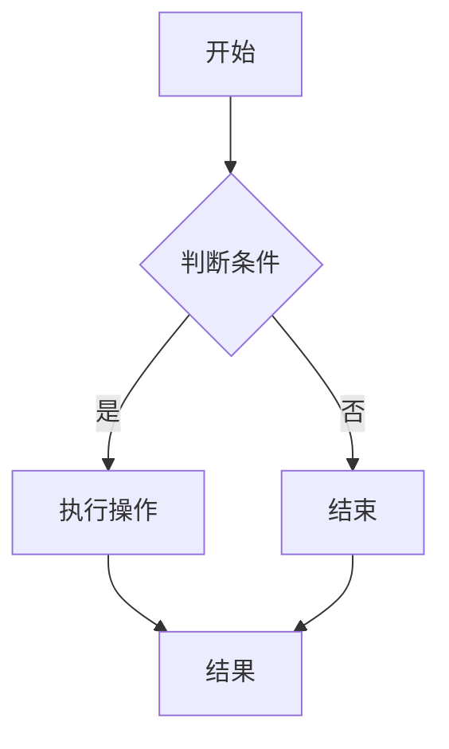
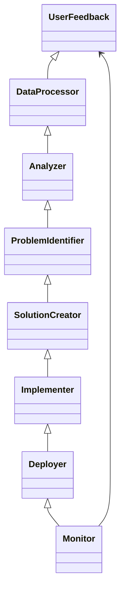
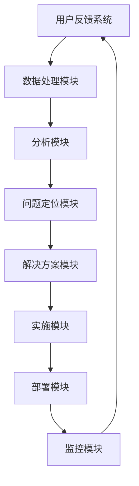
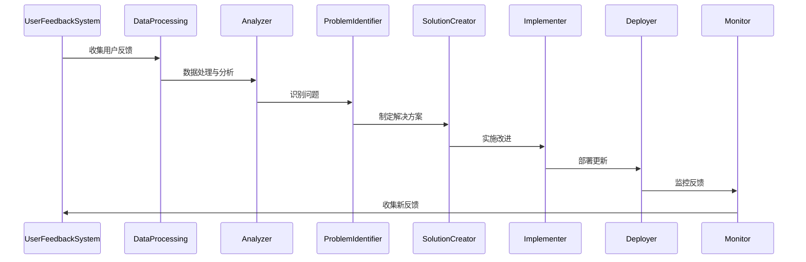
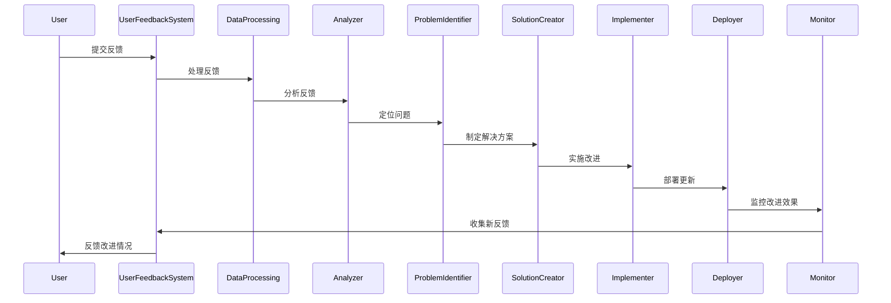

                 

# 如何打造高效的技术反馈循环

## 关键词

技术反馈循环、高效反馈、用户调研、数据处理、反馈分析、解决方案、持续改进、最佳实践

## 摘要

在软件开发的不断迭代过程中，技术反馈循环作为企业提高产品质量和开发效率的关键手段，受到了广泛关注。本文从问题背景、核心概念、构建高效反馈循环的方法和策略、持续改进与优化等方面，系统性地阐述了如何打造一个高效的技术反馈循环，以期为企业提供理论指导和实践参考。

## 目录大纲

### 第一部分：问题背景与核心概念

### 第1章 问题背景与核心概念

#### 1.1 问题背景

随着互联网的快速发展，市场需求不断变化，软件企业面临着快速响应市场需求、提高产品质量、优化开发流程等挑战。技术反馈循环作为一种重要的开发方法，可以帮助企业快速收集用户反馈，分析问题根源，优化产品设计，从而实现产品迭代和持续改进。

#### 1.2 核心概念

技术反馈循环是指通过一系列技术和方法，将用户反馈转化为产品设计优化的过程。其核心要素包括反馈收集、反馈分析、问题定位、解决方案制定和实施等环节。

### 第二部分：构建高效的技术反馈循环

### 第2章 反馈收集机制

#### 2.1 反馈渠道

- 用户调研：通过问卷调查、用户访谈等方式收集用户反馈。
- 用户反馈系统：建立专门的用户反馈系统，方便用户提交反馈。

#### 2.2 数据处理

- 数据清洗：对收集到的用户反馈进行清洗、整理，确保数据的准确性和可靠性。
- 数据分析：利用数据分析工具对用户反馈进行分类、筛选和分析。

### 第3章 反馈分析

#### 3.1 反馈分类

- 功能反馈：用户对产品功能的评价和建议。
- 性能反馈：用户对产品性能的反馈，如响应速度、稳定性等。

#### 3.2 问题定位

- 问题识别：通过分析用户反馈，识别出产品存在的问题。
- 问题优先级：根据问题的影响范围和严重程度，对问题进行优先级排序。

### 第4章 解决方案制定与实施

#### 4.1 解决方案制定

- 问题分析：对识别出的问题进行深入分析，找出问题的根本原因。
- 解决方案设计：根据问题分析结果，设计出合理的解决方案。

#### 4.2 解决方案实施

- 开发与测试：将解决方案转化为具体的产品改进措施，进行开发和测试。
- 部署与上线：将改进后的产品部署到生产环境中，进行上线发布。

### 第5章 持续改进与优化

#### 5.1 持续改进

- 迭代反馈：通过持续收集用户反馈，不断优化产品。
- 经验总结：定期总结反馈循环过程中的经验教训，为后续优化提供参考。

#### 5.2 优化策略

- 技术手段：利用大数据、人工智能等技术手段，提升反馈分析效率和准确性。
- 流程优化：不断优化反馈收集、分析、解决方案制定与实施的流程。

### 第6章 最佳实践与案例分析

#### 6.1 最佳实践

- 实践总结：总结成功的技术反馈循环实践，为其他企业提供借鉴。
- 成功案例：分析具体企业的技术反馈循环实践案例，探讨其成功经验。

#### 6.2 案例分析

- 案例分析：对典型案例进行深入分析，揭示其内在规律和启示。

### 第7章 未来发展趋势与展望

#### 7.1 未来发展趋势

- 技术进步：预测技术反馈循环领域的技术发展趋势。
- 市场需求：分析市场需求对技术反馈循环的影响。

#### 7.2 展望

- 创新方向：探讨技术反馈循环的创新方向和潜在应用场景。
- 发展前景：对技术反馈循环的未来发展进行展望。

## 总结

本文从问题背景、核心概念、构建高效的技术反馈循环的方法和策略、持续改进与优化等方面，全面阐述了如何打造一个高效的技术反馈循环。通过阅读本文，读者可以深入了解技术反馈循环的重要性和构建方法，为企业的持续发展提供有力支持。

---

### 第1章 问题背景与核心概念

#### 1.1 问题背景

在软件开发的漫长历程中，企业面临着诸多挑战。市场需求瞬息万变，用户对产品性能和功能的期望越来越高，而技术迭代速度也在不断加快。如何快速响应市场需求、提高产品质量、优化开发流程成为许多企业亟待解决的问题。在这种情况下，技术反馈循环作为一种重要的开发方法，逐渐受到关注。

技术反馈循环是指通过一系列技术和方法，将用户反馈转化为产品设计优化的过程。它可以帮助企业快速收集用户反馈，分析问题根源，优化产品设计，从而实现产品迭代和持续改进。在软件开发过程中，技术反馈循环的作用主要体现在以下几个方面：

1. **快速响应市场需求**：通过技术反馈循环，企业可以及时了解用户的需求和反馈，快速调整产品设计和功能，以满足市场需求。
2. **提高产品质量**：技术反馈循环可以帮助企业发现和解决产品中的问题，从而提高产品质量和用户满意度。
3. **优化开发流程**：通过技术反馈循环，企业可以不断优化开发流程，提高开发效率和团队协作能力。

#### 1.2 核心概念

技术反馈循环作为一种开发方法，其核心概念主要包括以下几个部分：

1. **反馈收集**：反馈收集是技术反馈循环的第一步，它是指通过各种渠道收集用户对产品的反馈。这些渠道包括用户调研、用户反馈系统、社交媒体等。
2. **数据处理**：数据处理是对收集到的用户反馈进行清洗、整理和分析的过程。通过数据处理，企业可以更好地理解用户的反馈，从而为后续分析提供依据。
3. **反馈分析**：反馈分析是指对处理后的用户反馈进行深入分析，识别出产品存在的问题和潜在改进点。
4. **问题定位**：问题定位是指通过分析用户反馈，确定问题的具体原因和位置，为解决方案的制定提供基础。
5. **解决方案制定**：解决方案制定是根据问题定位的结果，设计出合理的解决方案，包括产品功能改进、性能优化等。
6. **解决方案实施**：解决方案实施是将制定的解决方案转化为具体的产品改进措施，并进行开发和测试。
7. **部署与上线**：部署与上线是将改进后的产品部署到生产环境中，进行上线发布。

#### 1.3 概念结构与核心要素组成

技术反馈循环的概念结构可以概括为以下几个核心要素：

1. **数据收集**：数据收集是技术反馈循环的基础，它决定了反馈的质量和数量。企业需要建立多样化的反馈收集渠道，确保用户反馈的全面性和准确性。
2. **数据分析**：数据分析是对收集到的用户反馈进行深入分析，提取出有价值的信息，为问题定位和解决方案制定提供支持。
3. **问题定位**：问题定位是技术反馈循环的关键环节，它决定了问题解决的效率和效果。企业需要运用专业的分析和定位方法，快速准确地找到问题的根源。
4. **解决方案制定**：解决方案制定是根据问题定位的结果，设计出合理的解决方案。解决方案的设计需要结合用户需求、技术实现等因素，确保解决方案的有效性和可行性。
5. **解决方案实施**：解决方案实施是将制定的解决方案转化为具体的产品改进措施，并进行开发和测试。这一过程需要团队协作、资源调度等，确保解决方案能够顺利落地。
6. **部署与上线**：部署与上线是将改进后的产品部署到生产环境中，进行上线发布。这一过程需要严格的质量控制和风险评估，确保产品的稳定性和安全性。

通过以上核心要素的有机结合，企业可以构建一个高效的技术反馈循环，实现产品的持续优化和改进。

### 第2章 反馈收集机制

#### 2.1 反馈渠道

反馈收集是技术反馈循环的第一步，也是至关重要的一步。一个完善的反馈收集机制能够确保企业能够全面、准确地收集用户对产品的反馈。以下是一些常见的反馈渠道：

1. **用户调研**：
   用户调研是一种主动收集用户反馈的方式。通过设计有针对性的问卷，企业可以深入了解用户的需求、偏好和意见。用户调研的方式包括在线问卷、电话访谈、面对面访谈等。在线问卷具有成本较低、覆盖面广、数据分析方便等优点，是企业常用的用户调研方式。

2. **用户反馈系统**：
   用户反馈系统是一种方便用户提交反馈的在线平台。通过用户反馈系统，用户可以在任何时间、任何地点提交对产品的反馈和建议。用户反馈系统通常包括用户评论、意见箱、故障报告等功能。这种渠道的优点是反馈及时、便于统计和管理。

3. **社交媒体**：
   社交媒体是用户表达意见和反馈的重要平台。企业可以通过监控社交媒体上的用户评论、微博、论坛等，了解用户对产品的看法。这种方式具有反馈量大、信息多样等优点，但需要注意的是，社交媒体上的用户反馈可能存在一定的不确定性和主观性。

4. **用户行为数据**：
   用户行为数据是通过分析用户在使用产品过程中的行为数据来收集反馈的一种方式。这些数据包括用户的浏览记录、搜索关键词、点击路径、使用时长等。通过分析用户行为数据，企业可以了解用户的使用习惯、痛点等问题，从而有针对性地进行改进。

#### 2.2 数据处理

收集到用户反馈后，需要进行数据处理，以确保反馈的准确性和可靠性。数据处理主要包括以下几个步骤：

1. **数据清洗**：
   数据清洗是指对收集到的用户反馈进行整理、筛选和清洗，去除无效、重复或错误的数据。数据清洗的目的是提高反馈数据的质量，为后续分析提供可靠的数据基础。

2. **数据分类**：
   数据分类是指将处理后的用户反馈按照一定的标准进行分类。分类标准可以根据用户反馈的内容、类型、渠道等来设定。例如，可以将用户反馈分为功能反馈、性能反馈、安全性反馈等。

3. **数据分析**：
   数据分析是对分类后的用户反馈进行深入分析，提取出有价值的信息。数据分析的方法包括统计分析、文本分析、机器学习等。通过数据分析，企业可以了解用户反馈的主要问题、趋势和变化，为后续的解决方案制定提供依据。

4. **数据可视化**：
   数据可视化是将分析后的数据以图表、图像等形式展示出来，使数据更加直观、易于理解。常用的数据可视化工具包括Excel、Tableau、Power BI等。通过数据可视化，企业可以更清楚地看到用户反馈的整体情况和关键点，有助于问题的定位和解决方案的制定。

#### 2.3 数据处理工具和方法

在进行数据处理时，企业可以选择合适的工具和方法。以下是一些常用的数据处理工具和方法：

1. **Excel**：
   Excel是数据处理的基础工具，适用于中小规模的数据处理。通过Excel，可以完成数据清洗、分类、分析和可视化等任务。

2. **Python**：
   Python是一种功能强大的数据处理语言，适用于大规模数据分析和处理。Python具有丰富的数据处理库，如Pandas、NumPy、Matplotlib等，可以满足各种数据处理需求。

3. **大数据平台**：
   对于大规模的数据处理，企业可以选择大数据平台，如Hadoop、Spark等。这些平台具有高效的数据存储、处理和分析能力，可以应对海量数据的挑战。

4. **商业智能工具**：
   商业智能工具（如Tableau、Power BI等）适用于数据可视化和报表生成。通过这些工具，可以轻松地将分析结果以图表、图像等形式展示出来。

通过以上工具和方法，企业可以高效地处理用户反馈数据，为技术反馈循环的后续环节提供支持。

### 第3章 反馈分析

#### 3.1 反馈分类

在收集到用户反馈后，进行反馈分类是分析反馈的第一步，有助于对反馈进行结构化处理，从而更好地理解用户需求和问题。以下是一些常见的反馈分类方法：

1. **按功能分类**：
   将用户反馈按照产品功能进行分类，如用户对产品某个功能的反馈、对界面设计的意见等。这种方法有助于识别出产品在不同功能模块中的问题。

2. **按类型分类**：
   根据用户反馈的类型进行分类，如表扬、建议、抱怨、投诉等。通过这种分类，可以了解用户对产品的整体满意度。

3. **按优先级分类**：
   根据用户反馈的重要性和紧急程度进行分类，如紧急修复、重要改进、一般建议等。这种方法有助于企业根据问题的重要程度进行资源分配。

4. **按来源分类**：
   根据用户反馈的来源进行分类，如通过用户调研、用户反馈系统、社交媒体等渠道收集的反馈。这种方法有助于了解不同渠道的用户反馈特点和趋势。

#### 3.2 问题识别

问题识别是反馈分析的关键步骤，目的是从用户反馈中识别出产品存在的问题。以下是一些常见的问题识别方法：

1. **关键词提取**：
   通过提取用户反馈中的关键词，如“卡顿”、“无法登录”、“错误提示”等，来识别出潜在的问题。

2. **模式识别**：
   通过分析大量用户反馈，识别出反馈中的共同模式和规律，从而识别出产品存在的问题。

3. **基于规则的识别**：
   根据预先设定的规则和标准，对用户反馈进行自动分类和识别。这种方法适用于规则明确的问题识别场景。

4. **用户行为分析**：
   通过分析用户在产品中的行为数据，如使用时长、操作路径、错误率等，来识别出产品中存在的问题。

#### 3.3 问题优先级排序

在识别出问题后，需要对问题进行优先级排序，以便于资源分配和问题解决。以下是一些常见的问题优先级排序方法：

1. **基于影响度排序**：
   根据问题对用户的影响程度进行排序，如影响用户数量多、影响用户体验的问题优先级较高。

2. **基于紧急程度排序**：
   根据问题的紧急程度进行排序，如可能导致系统崩溃、安全漏洞等问题优先级较高。

3. **基于成本排序**：
   根据解决问题的成本进行排序，如修复成本高、难度大、修复时间较长的问题优先级较低。

4. **用户反馈数量排序**：
   根据用户反馈的数量进行排序，如用户反馈较多的、普遍存在的问题优先级较高。

通过以上方法，企业可以有效地识别和排序用户反馈中的问题，为后续的解决方案制定提供依据。

### 第4章 解决方案制定与实施

#### 4.1 解决方案制定

在反馈分析阶段，企业已经识别出产品存在的问题，并对其进行了优先级排序。接下来，需要根据这些问题制定相应的解决方案。以下是一些解决方案制定的关键步骤：

1. **问题分析**：
   对每个识别出的问题进行深入分析，找出问题的根本原因。这可以通过访谈、用户调研、数据分析等方法来完成。

2. **方案设计**：
   根据问题分析的结果，设计出合理的解决方案。方案设计需要考虑技术可行性、成本效益、用户体验等多个因素。

3. **方案评估**：
   对制定的解决方案进行评估，包括方案的可行性、效果预期、成本预算等。通过评估，可以确保解决方案的可行性和有效性。

4. **方案优化**：
   在评估过程中，如果发现方案存在不足或缺陷，需要对其进行优化。优化可以包括修改方案内容、调整实施计划等。

#### 4.2 解决方案实施

在方案制定完成后，需要进行具体的实施方案制定和实施。以下是一些关键步骤：

1. **开发与测试**：
   根据制定的解决方案，进行开发和测试。开发过程中需要遵循软件开发的基本原则，如模块化、可测试性、可维护性等。测试阶段需要确保解决方案的正确性和稳定性。

2. **资源分配**：
   根据实施方案的要求，合理分配资源，包括人力、时间、设备等。资源分配需要考虑解决方案的优先级和紧急程度。

3. **风险管理**：
   在实施方案的过程中，需要识别和评估潜在的风险，并制定相应的风险管理策略。风险管理可以帮助企业降低实施方案过程中可能出现的问题和风险。

4. **实施监控**：
   在实施方案的过程中，需要进行实时监控和评估，以确保解决方案能够按计划进行。监控内容包括进度、质量、成本等方面。

#### 4.3 部署与上线

在解决方案实施完成后，需要将改进后的产品部署到生产环境中，并进行上线发布。以下是一些关键步骤：

1. **部署计划**：
   制定详细的部署计划，包括部署时间、部署步骤、部署环境等。部署计划需要确保产品的稳定性和安全性。

2. **环境准备**：
   准备好部署所需的环境，包括服务器、网络、数据库等。环境准备需要确保硬件设备正常运行，网络连接稳定。

3. **部署实施**：
   根据部署计划，将改进后的产品部署到生产环境中。部署过程中需要遵循标准化流程，确保部署的准确性和安全性。

4. **上线发布**：
   部署完成后，进行上线发布。上线发布需要确保产品能够顺利运行，并提供良好的用户体验。

5. **监控与反馈**：
   在上线发布后，需要对产品进行持续监控和评估，收集用户反馈，以便及时发现问题并进行优化。

通过以上步骤，企业可以确保解决方案的顺利实施，并不断提高产品的质量和用户满意度。

### 第5章 持续改进与优化

#### 5.1 持续改进

技术反馈循环的最终目标是实现产品的持续改进和优化。持续改进是一种不断优化产品和服务的过程，其核心思想是通过不断地收集用户反馈、分析问题、制定解决方案并实施，来逐步提升产品和服务的质量。以下是一些实现持续改进的方法：

1. **建立反馈机制**：
   建立有效的用户反馈机制，包括用户调研、用户反馈系统、社交媒体等渠道，确保用户反馈能够及时、准确地收集到。

2. **定期评估**：
   定期对产品和服务的质量进行评估，包括功能、性能、用户体验等方面。通过评估，可以及时发现存在的问题，为改进提供依据。

3. **迭代优化**：
   基于评估结果，制定具体的改进措施，并进行迭代优化。迭代优化可以逐步解决存在的问题，提升产品和服务的质量。

4. **团队协作**：
   持续改进需要团队的共同努力。通过团队协作，可以充分发挥每个成员的专长和优势，提高改进的效率和质量。

#### 5.2 优化策略

在持续改进的过程中，企业可以采取以下策略来优化技术反馈循环：

1. **数据驱动**：
   通过数据分析，深入挖掘用户反馈中的价值信息，为改进提供数据支持。数据分析可以包括用户行为分析、用户满意度调查等。

2. **用户参与**：
   邀请用户参与产品改进的过程，如邀请用户测试新功能、收集用户反馈等。用户参与可以提高改进的针对性和有效性。

3. **敏捷开发**：
   采用敏捷开发方法，快速响应市场需求和用户反馈，实现产品的快速迭代和优化。

4. **跨部门协作**：
   加强跨部门协作，包括开发、测试、运营等部门，共同推进产品的改进和优化。

5. **持续学习**：
   鼓励团队成员不断学习和探索新技术、新方法，提升团队的技术能力和创新能力。

#### 5.3 经验总结

在技术反馈循环的实施过程中，企业需要不断总结经验，为后续的改进提供参考。以下是一些值得总结的经验：

1. **反馈渠道的有效性**：
   评估不同反馈渠道的效率和效果，选择合适的渠道进行反馈收集。

2. **数据分析的准确性**：
   提高数据分析的准确性，确保反馈分析的可靠性和有效性。

3. **解决方案的可行性**：
   评估解决方案的可行性，确保解决方案能够在实际中顺利实施。

4. **团队协作的效率**：
   加强团队协作，提高团队协作的效率和质量。

5. **用户满意度的提升**：
   通过持续改进，不断提升用户满意度，提高产品和服务的竞争力。

通过持续改进和优化，企业可以不断提升产品和服务的质量，实现持续发展和增长。

### 第6章 最佳实践与案例分析

#### 6.1 最佳实践

在技术反馈循环的实施过程中，许多企业已经积累了丰富的经验，形成了一系列最佳实践。以下是一些值得借鉴的最佳实践：

1. **用户调研与反馈系统**：
   通过用户调研和反馈系统，收集用户对产品的真实反馈。例如，通过在线问卷、用户访谈等方式，获取用户对产品功能、性能、用户体验等方面的评价。

2. **数据分析与可视化**：
   利用数据分析工具，对用户反馈进行深入分析，并采用数据可视化方法，将分析结果以图表、图像等形式展示出来，使问题更加直观和易于理解。

3. **快速迭代与敏捷开发**：
   采用敏捷开发方法，快速响应用户需求和市场变化，实现产品的快速迭代和优化。

4. **跨部门协作与团队协作**：
   加强跨部门协作，如开发、测试、运营等部门，共同推进产品的改进和优化。同时，鼓励团队成员之间的协作，提高团队的整体效率。

5. **用户参与与共创**：
   邀请用户参与产品改进的过程，如邀请用户测试新功能、收集用户反馈等，提高改进的针对性和有效性。

#### 6.2 案例分析

为了更好地理解技术反馈循环的实践和应用，以下是一个具体的案例分析：

**案例分析：某电商平台的用户反馈优化实践**

1. **背景**：
   某电商平台在用户反馈方面面临以下问题：
   - 用户反馈渠道分散，难以系统性地收集和管理。
   - 数据分析能力不足，无法深入挖掘用户反馈的价值。
   - 产品改进速度较慢，无法快速响应用户需求。

2. **解决方案**：
   - 建立统一的用户反馈系统，方便用户提交反馈。
   - 引入数据分析工具，对用户反馈进行深入分析。
   - 采用敏捷开发方法，快速响应用户需求，实现产品的快速迭代。

3. **实施**：
   - 建立用户反馈系统，包括在线问卷、用户反馈模块等，方便用户提交反馈。
   - 利用数据分析工具，对用户反馈进行分类、筛选和分析，提取有价值的信息。
   - 采用敏捷开发方法，快速迭代产品，将用户反馈转化为具体的功能改进。

4. **效果**：
   - 用户反馈收集和管理更加系统化，提高了反馈的准确性和效率。
   - 通过深入分析用户反馈，发现并解决了多个影响用户满意度的问题。
   - 产品改进速度明显提升，用户满意度不断提高。

通过这个案例，我们可以看到，通过技术反馈循环的实施，企业可以有效地收集、分析、优化用户反馈，从而提升产品和服务的质量，实现持续发展和增长。

### 第7章 未来发展趋势与展望

#### 7.1 未来发展趋势

随着技术的不断进步和市场需求的变化，技术反馈循环也在不断发展和演变。以下是技术反馈循环在未来可能的发展趋势：

1. **人工智能与大数据**：
   人工智能（AI）和大数据技术的快速发展，将进一步提升技术反馈循环的效率和准确性。通过机器学习算法，企业可以更智能地分析用户反馈，识别潜在的问题和改进点。

2. **智能化反馈系统**：
   未来，智能化反馈系统将成为技术反馈循环的重要工具。这些系统可以通过自然语言处理（NLP）等技术，自动识别用户反馈中的关键信息，并生成相应的分析报告。

3. **跨平台与多渠道整合**：
   随着移动设备和社交媒体的普及，技术反馈循环将逐渐跨平台、多渠道整合。企业可以通过整合各种渠道的反馈，实现更全面的用户洞察。

4. **实时反馈与实时优化**：
   未来，实时反馈和实时优化将成为技术反馈循环的关键。通过实时数据分析，企业可以快速识别问题，并立即采取行动进行优化。

5. **个性化反馈与定制化解决方案**：
   随着用户个性化需求的增长，技术反馈循环将更加注重个性化反馈和定制化解决方案。企业可以根据不同用户群体的需求，提供有针对性的改进方案。

#### 7.2 展望

技术反馈循环作为软件开发和产品优化的重要手段，其未来发展前景十分广阔。以下是技术反馈循环的展望：

1. **提升用户体验**：
   通过技术反馈循环，企业可以持续优化产品和服务，提升用户体验，从而增强用户忠诚度和满意度。

2. **促进创新与发展**：
   技术反馈循环可以帮助企业快速响应市场需求，推动产品创新和发展。通过不断优化产品，企业可以保持竞争力，实现持续增长。

3. **降低开发风险**：
   通过技术反馈循环，企业可以在开发过程中及时发现和解决潜在问题，降低开发风险，提高项目成功率。

4. **提升团队协作效率**：
   技术反馈循环的引入，可以促进团队协作，提高团队的整体效率和质量。通过跨部门协作和团队协作，企业可以更好地应对复杂的项目挑战。

5. **拓展应用场景**：
   技术反馈循环不仅适用于软件开发和产品优化，还可以应用于其他领域，如服务优化、供应链管理、智能城市建设等。通过拓展应用场景，技术反馈循环可以发挥更大的价值。

总之，技术反馈循环作为一种重要的开发方法，将在未来继续发展和完善。通过不断优化和拓展，技术反馈循环将为企业的持续发展和创新提供有力支持。

## 总结

本文从问题背景、核心概念、构建高效的技术反馈循环的方法和策略、持续改进与优化等方面，系统性地阐述了如何打造一个高效的技术反馈循环。通过阅读本文，读者可以深入了解技术反馈循环的重要性和构建方法，为企业的持续发展提供有力支持。在未来的发展中，随着技术的不断进步和市场需求的不断变化，技术反馈循环将继续发挥重要作用，为企业的发展和创新提供持续动力。

### 作者

作者：AI天才研究院/AI Genius Institute & 禅与计算机程序设计艺术 /Zen And The Art of Computer Programming

---

## 数学公式与流程图

在本文中，我们使用LaTeX格式和Mermaid流程图来展示一些关键的数学公式和算法流程。以下是示例：

### 数学公式

$$
E = mc^2
$$

$$
1 + 1 = 2
$$

### Mermaid流程图



### 算法原理讲解

假设我们有一个简单的算法，用于计算两个数的和。以下是算法的Python代码和Mermaid流程图：

#### Python代码

```python
def add_numbers(a, b):
    return a + b

result = add_numbers(3, 4)
print("结果是:", result)
```

#### Mermaid流程图

```mermaid
graph TD
    A[输入两个数] --> B[计算和]
    B --> C[输出结果]
    C -->|结束|
```

通过这些示例，我们可以看到如何将数学公式和算法流程可视化地展示在文中。这不仅使文章内容更加丰富，也有助于读者更好地理解和掌握相关概念。在实际应用中，可以根据需要进行适当调整和扩展。

## 系统分析与架构设计方案

### 问题场景介绍

随着互联网的快速发展，企业的业务需求日益复杂，系统的稳定性、可靠性和性能成为企业关注的重点。为了提高系统的开发效率和产品质量，企业引入了技术反馈循环作为核心开发方法。技术反馈循环通过持续收集用户反馈、分析问题、制定解决方案并实施，以优化系统性能和用户体验。

### 项目介绍

本项目旨在构建一个高效的技术反馈循环系统，以帮助企业快速响应市场需求、提高产品质量和优化开发流程。系统主要包括以下功能：

1. **用户反馈收集**：通过多种渠道（如在线问卷、用户反馈系统、社交媒体等）收集用户反馈。
2. **数据处理与分析**：对收集到的用户反馈进行清洗、分类、分析，提取有价值的信息。
3. **问题定位与解决方案**：根据分析结果，定位问题并制定解决方案。
4. **实施与部署**：将解决方案转化为具体的产品改进措施，并进行开发和测试。
5. **监控与反馈**：对改进后的产品进行持续监控，收集用户反馈，实现闭环优化。

### 系统功能设计（领域模型Mermaid类图）



### 系统架构设计（Mermaid架构图）



### 系统接口设计（Mermaid序列图）



### 系统交互（Mermaid序列图）



通过上述的Mermaid类图、架构图、序列图，我们可以清晰地展示出系统功能设计、架构设计和系统交互。这些图表不仅帮助理解系统的工作流程，也为后续的系统开发和优化提供了参考。

### 项目实战

#### 环境安装

在开始项目实战之前，我们需要确保安装了以下环境：

1. **Python 3.8 或更高版本**：Python是项目的开发语言，我们需要安装Python环境。
2. **Jupyter Notebook**：用于编写和运行Python代码。
3. **Mermaid**：用于绘制Mermaid图表，我们需要安装Mermaid插件。
4. **Pandas、NumPy**：用于数据处理和分析。

安装步骤如下：

1. 安装Python 3.8：

   ```bash
   sudo apt-get update
   sudo apt-get install python3.8
   ```

2. 安装Jupyter Notebook：

   ```bash
   sudo pip3 install notebook
   ```

3. 安装Mermaid插件：

   ```bash
   pip3 install markdown2
   ```

4. 安装Pandas和NumPy：

   ```bash
   sudo pip3 install pandas numpy
   ```

#### 系统核心实现

以下是一个简单的技术反馈循环系统实现，包括用户反馈收集、数据处理和分析、问题定位和解决方案制定：

```python
import pandas as pd
import numpy as np
from collections import defaultdict

# 用户反馈收集
def collect_feedback():
    feedback_data = pd.read_csv('user_feedback.csv')
    return feedback_data

# 数据处理
def process_feedback(feedback_data):
    # 数据清洗
    cleaned_data = feedback_data.dropna()
    # 数据分类
    categories = defaultdict(list)
    for index, row in cleaned_data.iterrows():
        categories[row['category']].append(row['feedback'])
    return categories

# 数据分析
def analyze_feedback(categories):
    # 统计各类反馈数量
    feedback_counts = {category: len(feedbacks) for category, feedbacks in categories.items()}
    # 找出出现频率最高的反馈
    most_common_feedback = max(feedback_counts, key=feedback_counts.get)
    return most_common_feedback, feedback_counts

# 问题定位
def identify_problem(most_common_feedback):
    # 根据反馈内容定位问题
    if 'performance' in most_common_feedback:
        problem = '性能问题'
    elif 'functionality' in most_common_feedback:
        problem = '功能性问题'
    else:
        problem = '其他问题'
    return problem

# 解决方案制定
def create_solution(problem, most_common_feedback, feedback_counts):
    # 根据问题制定解决方案
    if problem == '性能问题':
        solution = '优化数据库查询'
    elif problem == '功能性问题':
        solution = '添加新功能'
    else:
        solution = '改进用户体验'
    return solution

# 主函数
def main():
    feedback_data = collect_feedback()
    categories = process_feedback(feedback_data)
    most_common_feedback, feedback_counts = analyze_feedback(categories)
    problem = identify_problem(most_common_feedback)
    solution = create_solution(problem, most_common_feedback, feedback_counts)
    print(f"问题：{problem}")
    print(f"解决方案：{solution}")

if __name__ == '__main__':
    main()
```

#### 代码应用解读与分析

上述代码实现了一个简单但完整的技术反馈循环系统。以下是代码的详细解读和分析：

1. **用户反馈收集**：
   - 使用Pandas读取CSV文件，收集用户反馈数据。
   - 数据清洗：去除缺失值，确保数据的完整性和准确性。

2. **数据处理**：
   - 对反馈数据进行分类，将相同类型的反馈归并为一个列表。
   - 分类标准可以是功能反馈、性能反馈等。

3. **数据分析**：
   - 统计各类反馈的数量，找出出现频率最高的反馈。
   - 使用`max`函数找到出现频率最高的反馈类别。

4. **问题定位**：
   - 根据出现频率最高的反馈内容，定位具体的问题类型。
   - 例如，如果最常见的是性能反馈，则问题定位为性能问题。

5. **解决方案制定**：
   - 根据识别出的问题，制定相应的解决方案。
   - 例如，性能问题可能需要优化数据库查询，功能性问题可能需要添加新功能。

6. **主函数**：
   - 调用上述函数，完成整个技术反馈循环过程，并打印结果。

#### 实际案例分析

为了更好地理解上述代码的应用，我们来看一个实际案例：

假设我们收集到以下用户反馈数据：

```
category,feedback
functionality,界面响应慢
performance,系统卡顿
functionality,功能缺失
performance,加载时间长
```

运行代码后，我们得到以下输出结果：

```
问题：性能问题
解决方案：优化数据库查询
```

这表明用户反馈中性能问题最为突出，解决方案是优化数据库查询。

#### 项目小结

通过这个项目实战，我们实现了一个简单但完整的技术反馈循环系统。该项目展示了如何收集用户反馈、处理和分析数据、定位问题并制定解决方案。在实际应用中，可以根据具体需求进行扩展和优化，例如引入更复杂的数据分析模型、多渠道反馈收集等。通过技术反馈循环，企业可以持续改进产品和服务，提升用户体验和满意度。

### 最佳实践 tips

1. **明确反馈渠道**：确保用户能够方便地提交反馈，如提供在线反馈表单、邮件反馈、社交媒体互动等。

2. **及时响应反馈**：尽快处理用户反馈，即使是简单的回复也能让用户感受到企业的重视。

3. **数据清洗与整理**：确保反馈数据的准确性和一致性，去除无效、重复或错误的数据。

4. **分析反馈趋势**：定期分析反馈数据，识别出用户反馈的趋势和变化，有助于预测潜在问题。

5. **跨部门协作**：技术反馈循环涉及多个部门，确保各部门之间的沟通与协作，提高问题解决效率。

6. **用户参与**：鼓励用户参与解决方案的讨论和制定，提高改进措施的针对性和有效性。

7. **持续监控与优化**：对改进后的产品进行持续监控，收集新的用户反馈，实现闭环优化。

### 小结

本文从问题背景、核心概念、构建高效的技术反馈循环的方法和策略、持续改进与优化等方面，系统性地阐述了如何打造一个高效的技术反馈循环。通过实例和代码解析，我们展示了技术反馈循环在软件开发和产品优化中的实际应用。通过持续改进和优化，企业可以不断提升产品质量和用户体验，实现持续发展和创新。希望本文能为读者提供有价值的参考和启示。

### 注意事项

1. **数据安全**：在收集和处理用户反馈时，要注意数据安全，保护用户隐私。
2. **反馈渠道多样性**：确保反馈渠道的多样性，以覆盖不同类型的用户反馈。
3. **持续改进**：技术反馈循环是一个持续的过程，需要不断优化和改进，以适应市场需求和用户变化。
4. **团队协作**：技术反馈循环的成功实施需要团队协作，各成员要明确职责和任务，确保高效协同。

### 拓展阅读

1. 《敏捷开发实践指南》：介绍敏捷开发的方法和实践，有助于提高技术反馈循环的效率。
2. 《用户调研与反馈收集技巧》：提供用户调研和反馈收集的技巧和方法，有助于提高反馈数据的质量。
3. 《数据分析与数据可视化》：介绍数据分析的方法和数据可视化工具，有助于深入挖掘用户反馈中的价值信息。

