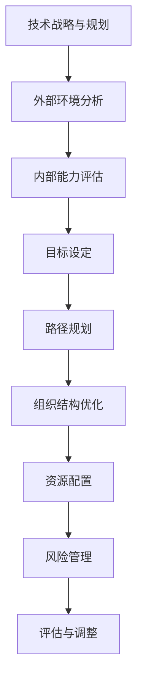
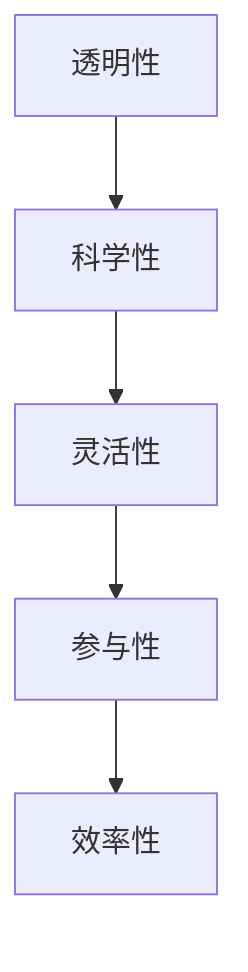
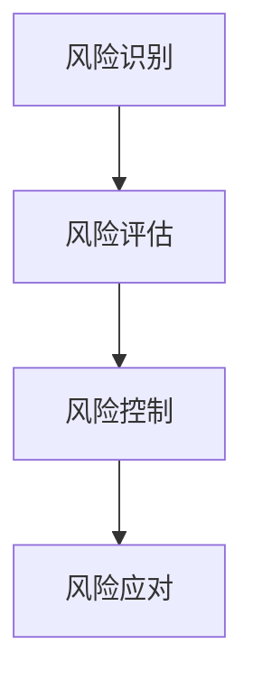
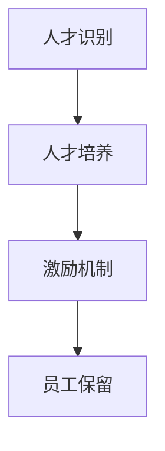

                 

### 第一部分：引言与背景介绍

---

## 1.1 问题背景、问题描述与核心概念

### 1.1.1 问题背景

随着信息技术和互联网的迅猛发展，企业对技术管理体系的需求日益增长。然而，许多企业在技术管理体系上存在诸多问题，如技术决策分散、管理效率低下、创新能力不足等。这些问题不仅影响了企业的业务发展，也制约了其在竞争中的地位。

现代企业的技术管理体系涉及多个方面，包括技术决策、技术规划、技术研发、技术实施、技术评估等。在这一体系中，技术决策尤为重要，它直接影响到企业的发展方向和技术实力。然而，由于各种原因，许多企业的技术决策存在分散化、无序化的问题。例如，不同部门可能各自为政，缺乏统一的技术战略和规划，导致资源浪费和技术重叠。

此外，管理效率低下也是企业技术管理体系中普遍存在的问题。技术管理工作流程繁琐，耗时耗力，往往难以快速响应市场变化和技术创新需求。这不仅降低了企业的竞争力，也影响了企业的可持续发展。

在创新能力方面，许多企业的技术管理体系缺乏对创新的关注和支持。技术管理人员往往更注重短期目标和即时的业务需求，忽视了长期的技术积累和创新能力培养。这导致企业在面对新兴技术和市场机会时，反应迟钝，难以抓住发展机遇。

### 1.1.2 问题描述

技术管理体系是企业内部针对技术工作的一系列管理和组织措施，包括技术决策、技术规划、技术研发、技术实施、技术评估等方面。然而，当前许多企业在技术管理体系上存在以下问题：

1. **技术决策分散**：各部门各自为政，缺乏统一的技术战略和规划。
2. **管理效率低下**：技术管理工作流程繁琐，耗时耗力。
3. **创新能力不足**：技术管理体系缺乏对创新的关注和支持。
4. **人才管理问题**：技术人才流失严重，缺乏有效的培养机制。

这些问题严重影响了企业的技术发展和业务绩效，因此，构建一个高效的技术管理体系成为企业亟需解决的问题。

### 1.1.3 核心概念

为了解决上述问题，企业需要构建一个高效的技术管理体系。以下是构建高效技术管理体系所需的核心概念：

1. **技术战略与规划**：明确企业技术发展方向，制定长期技术规划。
2. **技术决策机制**：建立科学、高效的技术决策机制，确保技术决策的一致性和有效性。
3. **技术创新能力**：加强技术创新体系建设，提高企业技术竞争力。
4. **人才管理体系**：建立完善的人才培养和激励机制，吸引和留住技术人才。
5. **技术风险管理**：建立技术风险管理体系，降低技术风险对企业的影响。

这些核心概念相互作用，共同构成了一个高效的技术管理体系。

### 1.1.4 边界与外延

1. **边界**：技术管理体系主要涵盖企业内部的技术管理工作，不包括外部合作与技术交流。
2. **外延**：技术管理体系不仅涉及技术部门，还涉及其他部门如市场、研发、生产等。

### 1.1.5 概念结构与核心要素组成

技术管理体系的概念结构包括以下核心要素：

1. **技术战略与规划**：明确企业技术发展方向，制定长期技术规划。
2. **技术决策机制**：建立科学、高效的技术决策机制，确保技术决策的一致性和有效性。
3. **技术创新能力**：加强技术创新体系建设，提高企业技术竞争力。
4. **人才管理体系**：建立完善的人才培养和激励机制，吸引和留住技术人才。
5. **技术风险管理**：建立技术风险管理体系，降低技术风险对企业的影响。

### 1.1.6 本章小结

本章介绍了构建高效技术管理体系的重要性和必要性，分析了企业在技术管理体系上存在的问题，并阐述了构建高效技术管理体系所需的核心概念。接下来，本书将围绕这些核心概念，详细探讨如何打造高效的技术管理体系。

---

**关键词**：技术管理体系、技术战略、技术决策、创新能力、人才管理

**摘要**：本文探讨了企业技术管理体系中的核心问题，包括技术决策分散、管理效率低下、创新能力不足和人才管理问题。针对这些问题，本文提出了构建高效技术管理体系所需的核心概念，包括技术战略与规划、技术决策机制、技术创新能力、人才管理体系和技术风险管理。本文旨在为企业提供一套系统性的技术管理体系构建方法，以提升企业的技术竞争力。

---

## 1.2 第二部分：核心概念与联系

---

### 第2章 核心概念原理

---

**2.1 技术战略与规划**

### 2.1.1 技术战略的定义与重要性

**技术战略**是指企业为了实现长期发展目标，对技术领域的发展方向、目标和路径进行规划和布局。技术战略对企业的发展具有重要性，主要体现在以下几个方面：

1. **明确技术发展方向**：技术战略有助于企业明确技术发展方向，避免盲目投资和研发。
2. **提高竞争力**：技术战略有助于企业提高技术竞争力，形成差异化优势。
3. **优化资源配置**：技术战略有助于企业合理配置资源，提高研发效率。
4. **促进创新**：技术战略有助于企业鼓励创新，推动技术进步。

#### 2.1.2 技术战略的制定方法

制定技术战略的方法主要包括以下几种：

1. **外部环境分析**：分析行业发展趋势、竞争对手情况、政策法规等外部环境因素。
2. **内部能力评估**：评估企业现有技术能力、研发团队水平、资源状况等内部因素。
3. **目标设定**：明确企业技术发展的长期和短期目标。
4. **路径规划**：制定实现目标的路径和方法，包括技术选择、研发计划、投资预算等。

#### 2.1.3 技术战略的执行与评估

技术战略的执行与评估主要包括以下几个方面：

1. **组织结构优化**：根据技术战略的需要，调整企业组织结构，明确各部门职责和权限。
2. **资源配置**：合理配置资金、人力、技术等资源，支持技术战略的执行。
3. **风险管理**：识别和评估技术战略实施过程中可能遇到的风险，制定应对措施。
4. **评估与调整**：定期评估技术战略的执行情况，根据实际情况进行调整和优化。

**2.2 技术决策机制**

### 2.2.1 技术决策的定义与重要性

**技术决策**是指企业在技术发展过程中，根据外部环境和企业内部条件，对技术项目、技术方案等进行选择和确定的过程。技术决策对企业的发展具有重要性，主要体现在以下几个方面：

1. **确定技术发展方向**：技术决策有助于企业确定技术发展方向，确保企业技术战略的连贯性和一致性。
2. **提高资源利用效率**：技术决策有助于企业合理分配资源，避免资源浪费。
3. **增强市场竞争力**：技术决策有助于企业根据市场变化迅速调整技术方向，提高市场竞争力。
4. **推动技术创新**：技术决策有助于企业识别和抓住技术创新的机会，推动技术进步。

### 2.2.2 技术决策机制的设计原则

设计一个高效的技术决策机制需要遵循以下原则：

1. **透明性**：技术决策过程应当公开透明，确保各部门和员工能够了解决策过程和决策结果。
2. **科学性**：技术决策应当基于充分的数据分析和市场调研，确保决策的科学性和准确性。
3. **灵活性**：技术决策机制应当具备一定的灵活性，能够根据市场变化和技术发展进行调整。
4. **参与性**：技术决策过程应当鼓励多方参与，特别是技术专家和业务部门的代表，以确保决策的全面性和合理性。
5. **效率性**：技术决策机制应当尽量简化流程，提高决策效率，避免冗长和无效率的决策过程。

### 2.2.3 技术决策机制的执行与监督

技术决策机制的执行与监督主要包括以下几个方面：

1. **决策流程管理**：明确技术决策的流程和步骤，确保决策过程有序进行。
2. **决策结果跟踪**：对技术决策的结果进行跟踪和评估，及时发现问题和调整决策。
3. **监督与问责**：建立健全的监督机制，对决策过程和结果进行监督和问责，确保决策的执行效果。
4. **持续改进**：根据技术决策的执行情况和市场反馈，不断优化决策机制，提高决策的效率和准确性。

---

### 第3章：技术创新能力

#### 3.1 创新能力的定义与重要性

**技术创新能力**是指企业在技术领域进行创新的能力，包括技术发明、技术改进、新技术应用等。技术创新能力对企业的发展具有重要性，主要体现在以下几个方面：

1. **提高市场竞争力**：技术创新能力有助于企业开发出具有竞争优势的新产品、新技术，提高市场占有率。
2. **推动企业持续发展**：技术创新能力是企业持续发展的动力源泉，能够帮助企业适应市场变化和技术进步。
3. **提升企业品牌形象**：技术创新能力能够提升企业的品牌形象，增强企业在市场中的影响力和认可度。
4. **促进产业升级**：技术创新能力有助于推动整个产业的升级和转型，提高产业链的整体竞争力。

#### 3.2 提高技术创新能力的途径

1. **加大研发投入**：企业应当加大对技术研发的投入，确保有足够的资源支持技术创新。
2. **建立研发团队**：建立专业化的研发团队，吸引和培养优秀的研发人才。
3. **加强合作与交流**：通过产学研合作、技术交流等方式，加强与外部科研机构和企业的合作，共同推进技术创新。
4. **构建创新文化**：营造良好的创新氛围，鼓励员工积极参与创新活动，提高企业的整体创新能力。

#### 3.3 创新能力的评估与激励

1. **创新成果评估**：对企业的创新成果进行定期评估，包括技术创新、新产品开发、技术专利等。
2. **激励机制设计**：建立合理的激励机制，对在技术创新方面做出突出贡献的员工给予奖励和认可。
3. **绩效评估体系**：将创新能力的提升纳入企业的绩效评估体系，鼓励员工积极参与技术创新活动。

---

### 第4章：人才管理体系

#### 4.1 人才管理的定义与重要性

**人才管理**是指企业对内部人才进行识别、培养、激励和保留的一系列管理和组织措施。人才管理对企业的发展具有重要性，主要体现在以下几个方面：

1. **提升企业竞争力**：人才是企业发展的关键资源，优秀的人才能够提升企业的市场竞争力。
2. **推动技术创新**：人才是技术创新的主体，优秀的人才能够推动企业的技术创新和进步。
3. **增强企业凝聚力**：优秀的人才管理能够增强企业的凝聚力，提高员工的归属感和忠诚度。
4. **提高管理水平**：人才管理能力是企业整体管理水平的重要体现，优秀的人才管理能够提升企业的管理水平。

#### 4.2 人才管理的核心要素

1. **人才识别**：通过科学的手段和方法，识别企业内部和外部的优秀人才。
2. **人才培养**：通过系统化的培训和发展计划，提升员工的技能和素质。
3. **激励机制**：建立合理的激励机制，激发员工的积极性和创造力。
4. **员工保留**：通过良好的工作环境和企业文化，留住企业的核心人才。

#### 4.3 人才管理体系的设计与实施

1. **明确人才战略**：根据企业的发展目标，明确人才管理的战略和方向。
2. **建立人才评价体系**：制定科学的评价标准，对员工的能力和表现进行客观评价。
3. **优化人才结构**：根据企业的发展需求，优化人才结构，确保人才队伍的多样性和适应性。
4. **构建人才培养体系**：设计系统化的培训和发展计划，提升员工的技能和素质。
5. **建立激励机制**：设计合理的激励机制，激发员工的积极性和创造力。
6. **优化工作环境**：营造良好的工作环境和文化，提高员工的满意度和归属感。

---

### 第5章：技术风险管理

#### 5.1 技术风险管理的定义与重要性

**技术风险管理**是指企业在技术研发、应用和推广过程中，对可能出现的各种技术风险进行识别、评估、控制和应对的一系列管理措施。技术风险管理对企业的发展具有重要性，主要体现在以下几个方面：

1. **保障企业稳健发展**：技术风险管理有助于企业规避技术风险，保障企业的稳健发展。
2. **提高创新能力**：通过技术风险管理，企业能够更好地利用技术创新机会，提高创新能力。
3. **降低成本**：有效管理技术风险能够降低企业在技术研发和应用过程中的成本。
4. **增强市场竞争力**：技术风险管理有助于企业降低因技术问题导致的市场风险，提高市场竞争力。

#### 5.2 技术风险管理的核心要素

1. **风险识别**：通过系统的方法和工具，识别企业可能面临的技术风险。
2. **风险评估**：对识别出的技术风险进行评估，确定风险的可能性和影响程度。
3. **风险控制**：采取有效的措施和控制方法，降低技术风险的可能性和影响。
4. **风险应对**：制定应急预案和应对策略，确保在技术风险发生时能够迅速有效地应对。

#### 5.3 技术风险管理体系的设计与实施

1. **建立风险识别机制**：通过定期调研、市场分析和技术评估等方法，建立有效的风险识别机制。
2. **建立风险评估模型**：设计科学、合理的技术风险评估模型，对风险进行定量和定性分析。
3. **制定风险控制措施**：根据风险评估结果，制定针对性的风险控制措施，降低技术风险的可能性和影响。
4. **建立风险应对预案**：制定详细的风险应对预案，确保在技术风险发生时能够迅速有效地应对。
5. **加强风险监控与沟通**：建立风险监控体系，对技术风险进行实时监控和评估，确保各部门之间的沟通和协作。

---

### 第6章：技术管理体系建设实践

#### 6.1 技术管理体系建设的重要性

技术管理体系建设是企业实现可持续发展的重要保障。一个完善的技术管理体系能够帮助企业优化资源配置、提高创新能力、降低风险，从而提升企业的市场竞争力。

#### 6.2 技术管理体系建设的主要任务

1. **明确技术战略与规划**：制定清晰的技术战略和规划，确保企业技术发展方向与市场和企业战略相匹配。
2. **建立技术决策机制**：设计科学、高效的技术决策机制，确保技术决策的一致性和有效性。
3. **提升技术创新能力**：加强技术创新体系建设，提高企业的技术竞争力。
4. **完善人才管理体系**：建立完善的人才培养和激励机制，吸引和留住优秀的技术人才。
5. **加强技术风险管理**：建立技术风险管理体系，降低技术风险对企业的影响。

#### 6.3 技术管理体系建设的实施步骤

1. **调研与分析**：对企业当前的技术管理体系进行调研和分析，找出存在的问题和不足。
2. **制定建设方案**：根据调研结果，制定技术管理体系建设的具体方案，明确建设目标和实施步骤。
3. **实施与推进**：按照建设方案，逐步实施技术管理体系建设，确保各项措施的有效落实。
4. **评估与优化**：对技术管理体系建设的效果进行评估，根据评估结果进行优化和调整。

#### 6.4 成功案例分享

在技术管理体系建设方面，许多企业取得了显著成效。以下是一个成功案例的分享：

- **企业背景**：某大型互联网企业，技术团队规模庞大，但技术管理体系不够完善，导致技术决策分散、创新能力不足。
- **建设过程**：
  - 明确技术战略与规划，制定长期技术发展规划。
  - 建立技术决策机制，明确各部门的职责和权限。
  - 加强技术创新能力，设立专门的创新部门，鼓励员工参与技术创新。
  - 完善人才管理体系，建立科学的评价和激励机制。
  - 加强技术风险管理，设立专门的风险管理部门，定期评估技术风险。
- **成效**：
  - 技术决策更加集中和高效，各部门能够更好地协同工作。
  - 创新能力显著提升，多个创新项目成功落地，产品竞争力大幅提高。
  - 人才流失率降低，员工满意度提高。
  - 技术风险得到有效控制，企业运营更加稳健。

通过这个案例，我们可以看到，一个完善的技术管理体系对企业的成功至关重要。企业应当结合自身实际情况，借鉴成功经验，构建适合自己的技术管理体系。

---

### 第7章：总结与展望

#### 7.1 总结

本文围绕如何打造高效的技术管理体系，从技术战略与规划、技术决策机制、技术创新能力、人才管理体系和技术风险管理等核心概念进行了深入探讨。通过分析当前企业在技术管理体系中存在的问题，本文提出了构建高效技术管理体系的步骤和方法。

#### 7.2 展望

随着技术的不断进步和市场竞争的加剧，企业需要不断优化和提升技术管理体系。未来，企业应关注以下几个方面：

1. **持续创新**：技术创新是企业发展的重要动力，企业应不断推动技术创新，提高技术竞争力。
2. **人才管理**：人才是企业的核心竞争力，企业应加大对人才的培养和激励，打造高水平的人才队伍。
3. **技术风险管理**：技术风险不可避免，企业应建立完善的技术风险管理体系，降低风险对企业的影响。
4. **数字化转型**：随着数字经济的快速发展，企业应加快数字化转型，利用数字化技术提升管理效率和服务水平。

通过持续优化技术管理体系，企业将能够在激烈的市场竞争中脱颖而出，实现可持续发展。

---

### 附录

**附录A：技术战略与规划流程图**

**附录B：技术决策机制设计原则**

**附录C：技术风险管理体系**

**附录D：人才管理体系要素**

---

**作者：AI天才研究院/AI Genius Institute & 禅与计算机程序设计艺术 /Zen And The Art of Computer Programming**

---

**完**

