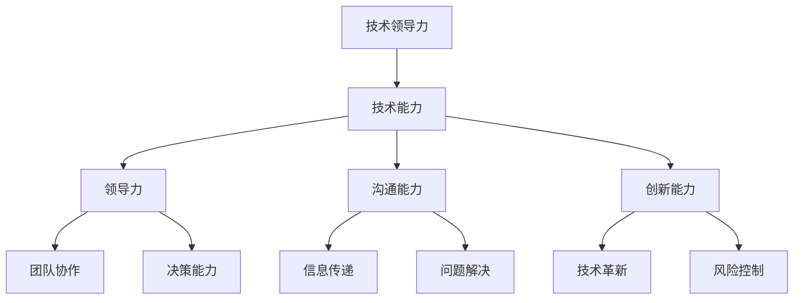
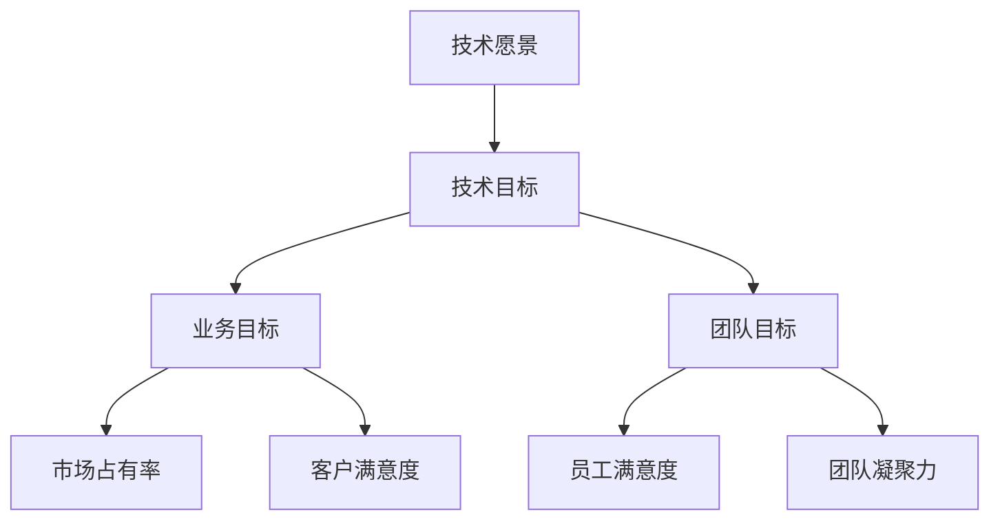
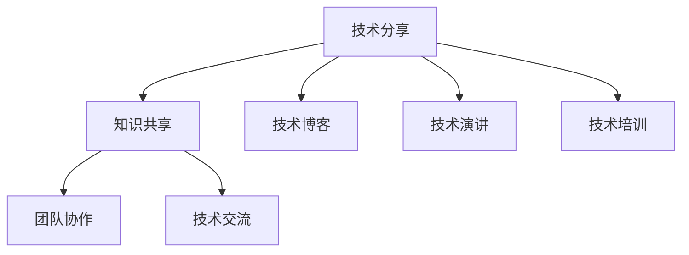
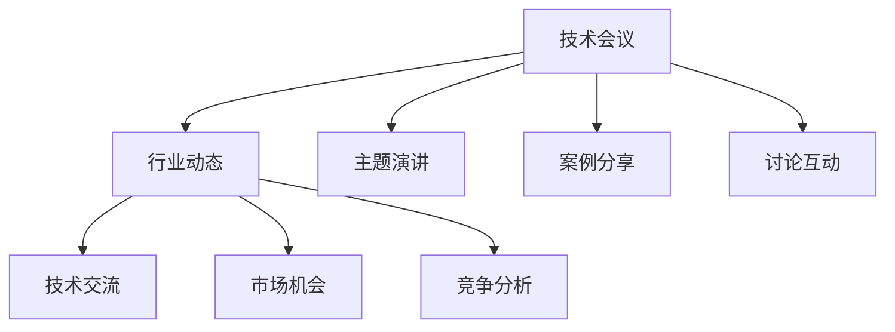
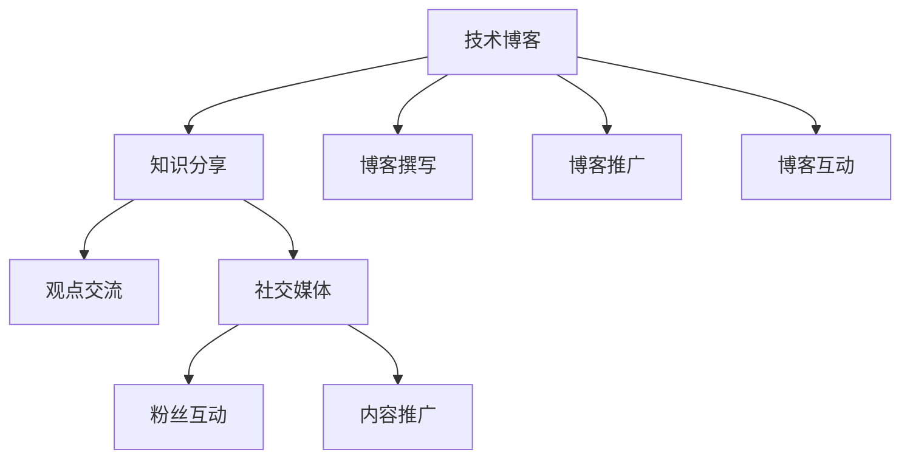
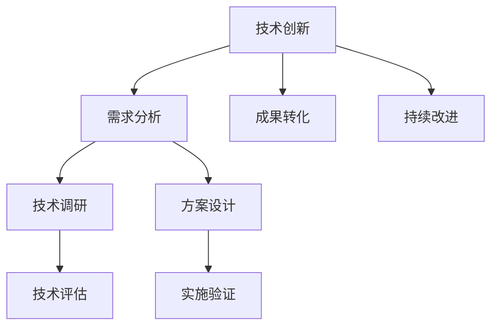

                 

# 如何提升团队的技术影响力

## 关键词

技术影响力、团队效能、领导力、创新策略、传播方法、实践案例

## 摘要

在当今快速发展的技术时代，团队的技术影响力已成为衡量一个团队核心竞争力的重要指标。本文旨在探讨如何通过有效的策略与方法提升团队的技术影响力，从背景介绍、核心概念与联系、策略与方法、技术创新与实践、工具与资源等多个方面进行详细分析，并提供实用的最佳实践和拓展阅读，旨在帮助读者理解和掌握提升团队技术影响力的关键途径。

## 目录大纲设计过程

### 理解书名与目标受众

《如何提升团队的技术影响力》这本书的目标受众主要面向技术团队的管理者、团队成员以及对技术影响力提升有浓厚兴趣的读者。为了确保书籍内容能够满足受众的需求，我们首先明确了提升团队技术影响力的重要性，并定义了相关核心概念，如技术影响力、团队效能等。

### 划分核心部分

本书的核心部分主要分为三大块：背景与基础、策略与方法、工具与资源。背景与基础部分主要介绍提升团队技术影响力的重要性以及相关核心概念；策略与方法部分详细阐述提升团队技术影响力的具体策略和方法；工具与资源部分提供实用的工具和资源，以帮助团队更有效地提升技术影响力。

### 细化每个章节

在核心部分的基础上，我们对每个章节进行了细化。例如，在背景与基础部分，我们首先介绍了提升团队技术影响力的重要性，然后详细阐述了技术影响力与团队效能、项目管理、个人发展之间的联系，并给出了技术影响力模型与要素分析。

### 确保逻辑连贯

为了确保书籍的逻辑连贯性，我们在编写过程中特别注意了章节间的过渡和衔接。例如，在策略与方法部分，我们在介绍技术领导力之前，先介绍了技术愿景与目标的重要性，使得读者能够理解技术领导力在提升团队技术影响力中的作用。

### 注意内容完整性

在编写过程中，我们确保每个章节都包含了核心内容，如背景介绍、核心概念、算法原理、系统架构设计、项目实战等。同时，我们也注意到了内容的完整性，避免了遗漏重要知识点。

### 简洁明了

为了使书籍内容简洁明了，我们在编写过程中尽量避免了冗余和复杂的表述，力求用简单的语言清晰地传达核心知识。

### 遵循格式要求

最后，我们按照markdown格式的要求，清晰地编排了目录结构，确保每个级别的标题都使用正确的符号，使得读者能够方便地阅读和理解书籍内容。

## 目录大纲结构

### 第一部分：背景与基础

#### 第1章：问题背景与定义

- 1.1 提升团队技术影响力的重要性
- 1.2 团队技术影响力模型

#### 第2章：核心概念与联系

- 2.1 技术影响力与团队效能
- 2.2 技术影响力与项目管理
- 2.3 技术影响力与个人发展
- 2.4 技术影响力模型与要素分析

### 第二部分：策略与方法

#### 第3章：提升团队技术影响力的策略

- 3.1 技术领导力
  - 3.1.1 技术领导力的定义与要素
  - 3.1.2 技术领导力的培养方法
- 3.2 技术愿景与目标
  - 3.2.1 技术愿景的制定与传达
  - 3.2.2 技术目标的设定与跟踪

#### 第4章：技术传播与推广

- 4.1 技术分享与文化
  - 4.1.1 技术分享的重要性
  - 4.1.2 技术分享的方法与技巧
- 4.2 技术会议与研讨会
  - 4.2.1 技术会议的组织与策划
  - 4.2.2 研讨会的演讲技巧与注意事项
- 4.3 技术博客与社交媒体
  - 4.3.1 技术博客的撰写与推广
  - 4.3.2 社交媒体在技术传播中的应用

#### 第5章：技术创新与实践

- 5.1 技术创新策略
  - 5.1.1 技术创新的思维与方法
  - 5.1.2 技术创新的管理与支持
- 5.2 实践案例研究
  - 5.2.1 案例一：如何通过技术优化提高团队效率
  - 5.2.2 案例二：技术引领企业转型的成功经验

#### 第三部分：工具与资源

#### 第6章：技术影响力工具

- 6.1 技术评估工具
  - 6.1.1 技术评估指标与方法
  - 6.1.2 常用技术评估工具介绍
- 6.2 团队协作工具
  - 6.2.1 团队协作工具的选择与使用
  - 6.2.2 常用团队协作工具介绍

#### 第7章：资源与支持

- 7.1 学习资源推荐
  - 7.1.1 技术书籍与资料推荐
  - 7.1.2 在线课程与培训资源
- 7.2 社群与网络资源
  - 7.2.1 技术社群的组织与参与
  - 7.2.2 技术网络资源的利用与扩展

#### 结语

- 8.1 小结与反思
- 8.2 提升团队技术影响力的持续之路
- 8.3 读者建议与反馈

## 文章正文

### 第一部分：背景与基础

#### 第1章：问题背景与定义

在当今快速发展的技术时代，团队的技术影响力已成为衡量一个团队核心竞争力的重要指标。一个具有技术影响力的团队，不仅能够在技术领域内保持领先地位，还能为企业带来竞争优势，推动企业持续创新和发展。

**提升团队技术影响力的重要性**

1. **增强企业竞争力**：在激烈的市场竞争中，技术领先的团队能够为企业带来更高的市场份额和盈利能力。
2. **推动团队成长**：技术影响力的提升能够激发团队成员的创造力和积极性，促进团队整体技能水平的提升。
3. **促进知识共享**：技术影响力的提升有助于团队成员之间的知识共享，提高团队的整体协作能力。

**团队技术影响力模型**

为了更好地理解团队技术影响力，我们可以从以下几个方面进行定义：

1. **技术实力**：团队在技术领域内的专业知识和技能水平，包括编程能力、架构设计能力、问题解决能力等。
2. **创新能力**：团队在技术领域内的创新能力，包括对新技术的研究、应用和推广。
3. **影响力**：团队在技术领域内的影响范围和程度，包括在行业内的影响力、在客户和合作伙伴中的认可度等。

**技术影响力模型与要素分析**

通过技术影响力模型，我们可以更清晰地看到提升团队技术影响力的关键要素。以下是一个简单的ER实体关系图架构，用于展示技术影响力模型中的关键要素：

```mermaid
erDiagram
    T技术创新 ||--o> I技术影响力
    T技术创新 ||--o> C技术实力
    T技术创新 ||--o> K知识共享
    I技术影响力 ||--o> P项目管理
    I技术影响力 ||--o> D客户认可
    I技术影响力 ||--o> R行业地位
```

#### 第2章：核心概念与联系

**技术影响力与团队效能**

技术影响力与团队效能之间存在紧密的联系。一个具有技术影响力的团队，通常具有更高的工作效率和更好的团队协作能力。以下是一个关于技术影响力与团队效能的Mermaid类图：

```mermaid
classDiagram
    Team <<class>> Team效能
    TechInfluence <<class>> 技术影响力
    Team效能 &&||--o> TechInfluence
    Team效能 &&||--o> 项目管理
    TechInfluence &&||--o> 个人发展
```

**技术影响力与项目管理**

技术影响力在项目管理中起着至关重要的作用。一个具有技术影响力的团队，能够在项目管理过程中更好地应对技术挑战，提高项目成功率。以下是一个关于技术影响力与项目管理的Mermaid类图：

```mermaid
classDiagram
    Project <<class>> 项目
    TechInfluence <<class>> 技术影响力
    Project &&||--o> TechInfluence
    Project &&||--o> 团队效能
    TechInfluence &&||--o> 创新能力
```

**技术影响力与个人发展**

技术影响力不仅对团队有重要影响，也对团队成员的个人发展有着积极的作用。一个具有技术影响力的团队成员，通常能够获得更多的职业机会和发展空间。以下是一个关于技术影响力与个人发展的Mermaid类图：

```mermaid
classDiagram
    Employee <<class>> 个人发展
    TechInfluence <<class>> 技术影响力
    Employee &&||--o> TechInfluence
    TechInfluence &&||--o> 职业发展
    TechInfluence &&||--o> 技能提升
```

**技术影响力模型与要素分析**

通过上述分析，我们可以看到技术影响力与团队效能、项目管理、个人发展之间存在密切的联系。以下是一个关于技术影响力模型与要素分析的MermaidER图：

```mermaid
erDiagram
    T技术创新 ||--o> I技术影响力
    T技术创新 ||--o> C技术实力
    T技术创新 ||--o> K知识共享
    I技术影响力 ||--o> P项目管理
    I技术影响力 ||--o> D客户认可
    I技术影响力 ||--o> R行业地位
    P项目管理 ||--o> G团队效能
    P项目管理 ||--o> A创新能力
    D客户认可 ||--o> S市场占有率
    R行业地位 ||--o> E品牌影响力
```

### 第二部分：策略与方法

#### 第3章：提升团队技术影响力的策略

**3.1 技术领导力**

技术领导力是提升团队技术影响力的关键。技术领导力不仅包括技术能力，还包括领导力、沟通能力、创新能力等。以下是一个关于技术领导力的Mermaid流程图：



**3.1.1 技术领导力的定义与要素**

技术领导力是指团队领导者通过技术能力和领导力，推动团队实现技术目标和业务目标的能力。技术领导力的要素包括：

1. **技术能力**：团队领导者需要具备扎实的技术基础，能够理解和解决团队面临的技术问题。
2. **领导力**：团队领导者需要具备领导能力，能够激励和引导团队成员，推动团队协作。
3. **沟通能力**：团队领导者需要具备良好的沟通能力，能够有效地传达技术目标和业务目标，确保团队成员理解并执行。
4. **创新能力**：团队领导者需要具备创新能力，能够推动团队进行技术革新，保持技术领先地位。

**3.1.2 技术领导力的培养方法**

1. **加强技术学习**：团队领导者需要不断学习新技术，提升自身技术能力。
2. **参与技术交流**：团队领导者可以参与技术会议、研讨会等活动，拓宽技术视野，了解行业动态。
3. **培养团队文化**：团队领导者可以通过组织团队活动，培养团队成员之间的信任和协作，提升团队凝聚力。
4. **激励创新**：团队领导者可以制定创新激励政策，鼓励团队成员提出创新想法，并对创新成果给予奖励。

**3.2 技术愿景与目标**

技术愿景是团队在技术领域的发展方向和目标，是提升团队技术影响力的核心。以下是一个关于技术愿景与目标的Mermaid流程图：



**3.2.1 技术愿景的制定与传达**

1. **明确技术愿景**：团队领导者需要明确团队在技术领域的发展方向，并将其作为团队的目标。
2. **传达技术愿景**：团队领导者需要将技术愿景传达给团队成员，确保团队成员理解并认同。
3. **制定技术目标**：在明确技术愿景的基础上，制定具体的技术目标，并确保团队成员了解并认同这些目标。

**3.2.2 技术目标的设定与跟踪**

1. **设定技术目标**：根据技术愿景，制定具体的技术目标，包括短期和长期目标。
2. **跟踪技术目标**：定期跟踪技术目标的执行情况，确保团队成员按照计划推进。
3. **调整技术目标**：根据实际情况，及时调整技术目标，确保技术目标与团队愿景保持一致。

### 第4章：技术传播与推广

**4.1 技术分享与文化**

技术分享是提升团队技术影响力的关键途径之一。通过技术分享，团队成员可以相互学习、交流，提升整体技术水平。以下是一个关于技术分享与文化的Mermaid流程图：



**4.1.1 技术分享的重要性**

1. **提升团队技能**：技术分享可以帮助团队成员学习新技术、新方法，提升整体技能水平。
2. **促进知识共享**：技术分享可以促进团队成员之间的知识共享，提高团队协作效率。
3. **增强团队凝聚力**：技术分享可以增强团队成员之间的沟通和合作，提升团队凝聚力。

**4.1.2 技术分享的方法与技巧**

1. **技术博客**：通过技术博客，团队成员可以分享自己的技术经验、心得和见解，提高个人和团队的技术影响力。
2. **技术演讲**：通过参加技术会议、研讨会等活动，团队成员可以展示自己的技术成果，扩大技术影响力。
3. **技术培训**：通过组织内部或外部的技术培训，团队成员可以学习新技术、新方法，提升自身技能。

**4.2 技术会议与研讨会**

技术会议与研讨会是提升团队技术影响力的有效途径之一。通过技术会议与研讨会，团队成员可以了解行业动态、交流技术经验，提升团队的整体技术水平。以下是一个关于技术会议与研讨会的Mermaid流程图：



**4.2.1 技术会议的组织与策划**

1. **确定会议主题**：根据团队的技术发展方向和市场需求，确定会议的主题。
2. **邀请嘉宾**：邀请行业内知名专家、学者和同行，分享技术经验和见解。
3. **策划会议内容**：制定会议议程，包括主题演讲、案例分享、讨论互动等环节。
4. **宣传推广**：通过社交媒体、邮件等方式，宣传推广会议，吸引更多参与者。

**4.2.2 研讨会的演讲技巧与注意事项**

1. **明确演讲目的**：在演讲前，明确演讲的目的和受众，确保演讲内容有针对性。
2. **准备演讲材料**：提前准备好演讲材料，包括PPT、文档等，确保演讲内容清晰、有条理。
3. **练习演讲**：多次练习演讲，提高演讲的流畅性和表达能力。
4. **注意互动**：在演讲过程中，注意与观众的互动，激发观众的兴趣和参与度。

**4.3 技术博客与社交媒体**

技术博客与社交媒体是提升团队技术影响力的重要工具。通过技术博客和社交媒体，团队成员可以分享技术心得、见解和经验，扩大个人和团队的技术影响力。以下是一个关于技术博客与社交媒体的Mermaid流程图：



**4.3.1 技术博客的撰写与推广**

1. **撰写技术博客**：撰写技术博客，分享自己的技术经验和心得，展示团队的技术实力。
2. **推广技术博客**：通过社交媒体、邮件等方式，推广技术博客，吸引更多读者关注。
3. **博客互动**：积极回复读者的评论和提问，提升博客的互动性和影响力。

**4.3.2 社交媒体在技术传播中的应用**

1. **发布技术内容**：通过社交媒体发布技术文章、博客、视频等内容，展示团队的技术实力。
2. **互动交流**：与粉丝进行互动，回答粉丝的问题，分享技术经验，提升个人和团队的技术影响力。
3. **内容推广**：通过社交媒体的推广功能，推广技术内容，扩大技术影响力。

### 第5章：技术创新与实践

**5.1 技术创新策略**

技术创新是提升团队技术影响力的关键途径。通过技术创新，团队可以保持技术领先地位，为企业带来竞争优势。以下是一个关于技术创新策略的Mermaid流程图：



**5.1.1 技术创新的思维与方法**

1. **需求分析**：分析市场需求和客户需求，确定技术创新的方向和目标。
2. **技术调研**：调研行业动态和技术发展趋势，了解新技术、新方法。
3. **方案设计**：根据需求和技术调研结果，设计技术创新的方案。
4. **技术评估**：对技术创新方案进行评估，确保方案的技术可行性。
5. **实施验证**：实施技术创新方案，并进行验证，确保技术创新的有效性。
6. **成果转化**：将技术创新成果转化为实际应用，为企业带来竞争优势。
7. **持续改进**：根据实际应用效果，持续改进技术创新方案，提升技术创新水平。

**5.1.2 技术创新的管理与支持**

1. **创新团队建设**：建立专门的技术创新团队，负责技术创新工作。
2. **创新资源保障**：提供足够的创新资源和经费支持，确保技术创新的顺利进行。
3. **创新激励机制**：制定创新激励机制，鼓励团队成员积极参与技术创新。
4. **创新成果保护**：对技术创新成果进行保护，防止技术泄露和侵权。

**5.2 实践案例研究**

**案例一：如何通过技术优化提高团队效率**

某互联网公司技术团队通过以下技术优化措施，成功提升了团队效率：

1. **代码优化**：通过代码审查和自动化工具，发现并修复了代码中的性能瓶颈，提高了代码的执行效率。
2. **系统重构**：对关键系统进行重构，采用了更高效的算法和架构，提高了系统的响应速度和处理能力。
3. **自动化部署**：引入自动化部署工具，实现了代码的自动化构建、测试和部署，提高了部署效率。

**案例二：技术引领企业转型的成功经验**

某传统制造业企业通过技术引领成功实现了企业转型：

1. **数字化转型**：引入数字化技术，实现了生产过程的自动化和智能化，提高了生产效率和质量。
2. **技术创新**：研发了具有自主知识产权的新产品，拓展了企业市场，提高了企业竞争力。
3. **人才培养**：培养了一支具备数字化技术和创新能力的团队，为企业转型提供了人才保障。

### 第6章：技术影响力工具

**6.1 技术评估工具**

技术评估工具是评估团队技术实力和技术影响力的重要工具。以下是一些常用的技术评估工具：

1. **技术评估指标与方法**：通过设置技术评估指标，如代码质量、系统性能、创新能力等，对团队的技术实力进行评估。
2. **常用技术评估工具介绍**：如SonarQube、JaCoCo、JMeter等，用于评估代码质量、系统性能和用户体验。

**6.2 团队协作工具**

团队协作工具是提升团队协作效率和沟通效果的重要工具。以下是一些常用的团队协作工具：

1. **团队协作工具的选择与使用**：根据团队的需求和特点，选择合适的团队协作工具，如Slack、Trello、JIRA等。
2. **常用团队协作工具介绍**：如Slack、Trello、JIRA等，介绍其功能、使用方法和注意事项。

### 第7章：资源与支持

**7.1 学习资源推荐**

提升团队技术影响力需要不断学习和积累知识。以下是一些推荐的学习资源：

1. **技术书籍与资料推荐**：如《算法导论》、《深度学习》、《软件架构：搭建和开发大型应用系统》等。
2. **在线课程与培训资源**：如Coursera、Udemy、edX等在线教育平台，提供丰富的技术课程和培训资源。

**7.2 社群与网络资源**

社群和网络资源是提升团队技术影响力的重要途径。以下是一些常用的社群和网络资源：

1. **技术社群的组织与参与**：如技术论坛、技术社区、技术沙龙等，可以积极参与，交流技术经验。
2. **技术网络资源的利用与扩展**：如技术博客、技术网站、技术社交媒体等，可以广泛利用，获取技术信息和资源。

### 结语

提升团队的技术影响力是一个长期而复杂的过程，需要团队领导者、团队成员以及外部资源的共同努力。通过有效的策略和方法，团队可以不断提升自身的技术实力和影响力，为企业带来竞争优势。本文从背景介绍、核心概念与联系、策略与方法、技术创新与实践、工具与资源等多个方面进行了详细分析，旨在为团队提升技术影响力提供有益的参考和指导。

### 提升团队技术影响力的持续之路

提升团队的技术影响力并非一蹴而就，而是一个持续不断的过程。要实现这一目标，团队需要制定长期的战略，并采取一系列持续的举措。以下是一些关键步骤和策略：

**1. 建立持续学习文化**

持续学习是提升团队技术影响力的基石。团队应鼓励成员定期学习新技术、新方法，通过内部培训、外部学习、在线课程等多种途径不断提升自身技能。

**2. 设立创新激励制度**

创新是提升技术影响力的核心动力。团队应设立创新激励制度，如创新奖金、晋升机会等，激发团队成员的创新潜力，鼓励他们提出和实施创新项目。

**3. 加强跨部门合作**

技术影响力的提升需要跨部门合作。团队应积极与其他部门沟通合作，共同解决技术难题，推动技术创新，实现业务目标。

**4. 定期评估和反馈**

定期对团队的技术影响力进行评估，收集反馈信息，识别优势和不足，及时调整策略和方法。通过评估和反馈，团队可以持续优化自身的技术能力和影响力。

**5. 持续改进和优化**

技术领域不断变化，团队需要持续改进和优化自身的系统、流程和技术。通过持续改进，团队可以保持技术领先地位，不断提升技术影响力。

**6. 营造开放和包容的氛围**

团队应营造一个开放、包容和尊重创新的环境，鼓励团队成员提出不同的观点和想法，勇于尝试和失败，从而激发团队的创造力和活力。

### 读者建议与反馈

为了更好地提升团队的技术影响力，我们鼓励读者分享自己的经验和建议。以下是一些具体建议：

1. **分享成功经验**：读者可以分享自己团队在提升技术影响力过程中的成功经验，包括具体策略、方法、工具等。
2. **提出问题**：读者可以提出自己在提升技术影响力过程中遇到的问题和挑战，寻求解决方案和指导。
3. **参与讨论**：读者可以参与本书的相关讨论，与其他读者交流心得，共同探讨提升技术影响力的最佳实践。

通过读者的积极参与和反馈，我们可以不断完善和优化本书的内容，为更多团队提供有价值的指导。

### 总结

提升团队的技术影响力是一项复杂而重要的任务，需要团队领导者和成员的共同努力。通过有效的策略和方法，团队可以不断提升自身的技术实力和影响力，为企业带来竞争优势。本文从多个角度探讨了提升团队技术影响力的途径，包括背景介绍、核心概念与联系、策略与方法、技术创新与实践、工具与资源等。希望本文能够为团队提供有益的参考和指导，帮助他们在提升技术影响力的道路上走得更远。

### 作者信息

作者：AI天才研究院/AI Genius Institute & 禅与计算机程序设计艺术 /Zen And The Art of Computer Programming

### 最佳实践 Tips

1. **定期技术分享**：定期组织内部技术分享会，鼓励团队成员分享自己的技术经验和心得，促进知识共享。
2. **积极参与技术社区**：鼓励团队成员积极参与技术社区，参与技术讨论，扩大团队的影响力。
3. **设立创新基金**：设立创新基金，支持团队成员提出和实施创新项目，激发团队的创新能力。
4. **重视团队协作**：加强跨部门合作，促进团队间的技术交流和协作，提升整体技术实力。
5. **持续学习和培训**：为团队成员提供持续学习和培训的机会，提升他们的技能和知识水平。

### 小结

提升团队的技术影响力需要从多个方面进行努力，包括策略与方法、技术创新与实践、工具与资源等。通过有效的策略和方法，团队可以不断提升自身的技术实力和影响力，为企业带来竞争优势。本文从多个角度探讨了提升团队技术影响力的途径，为团队提供了有益的参考和指导。

### 注意事项

1. **重视团队成员的培训和发展**：提升团队的技术影响力，首先要重视团队成员的培训和发展，确保团队成员具备扎实的技能和知识。
2. **鼓励创新和尝试**：鼓励团队成员勇于尝试和创新，为团队成员提供支持和资源，推动技术革新。
3. **加强跨部门沟通与合作**：加强与其他部门的沟通与合作，共同解决技术难题，推动技术创新。
4. **定期评估和反馈**：定期对团队的技术影响力进行评估和反馈，及时调整策略和方法，确保团队持续提升技术影响力。

### 拓展阅读

1. 《技术领导力：如何成为技术团队的领导者》
2. 《技术创新策略：如何推动企业的技术创新》
3. 《技术传播与推广：如何提高技术影响力》
4. 《技术影响力评估：如何评估团队的技术影响力》
5. 《技术社群与网络资源：如何利用技术社群和网络资源提升团队影响力》

通过阅读这些书籍和文章，读者可以进一步了解提升团队技术影响力的方法和策略，为自己的团队提供有价值的指导。

