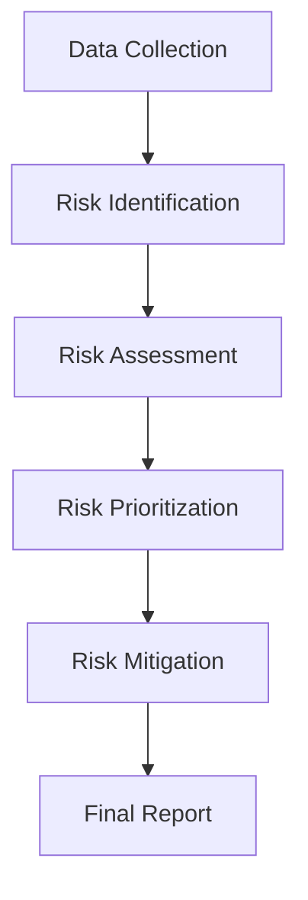
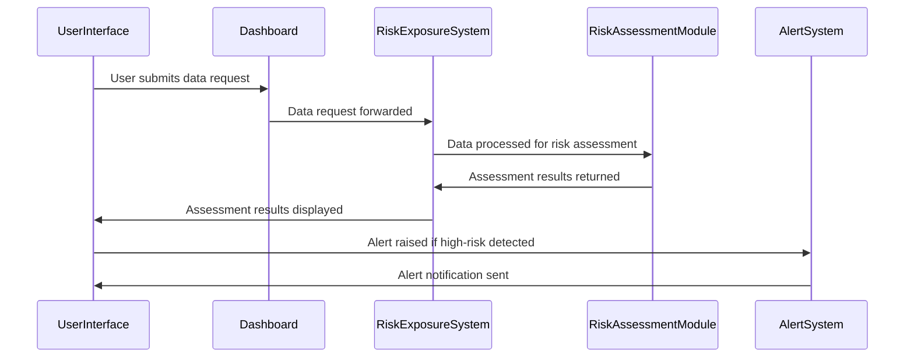

                 

Certainly, let's think through the structure and content of the article "How to Effectively Expose Risks" step by step, ensuring that it meets the outlined constraints and requirements.

## Step 1: Introduction and Definition

**Title:** "How to Effectively Expose Risks"

**Keywords:** Risk Management, Risk Exposure, Risk Assessment, System Design, Algorithm, Mathematical Models, Practical Applications

**Abstract:**
This article provides a comprehensive guide on how to effectively expose risks in various IT domains. It covers the theoretical foundation, core concepts, algorithms, system designs, and real-world applications. By following the step-by-step approach, readers will gain a deep understanding of risk exposure and its significance in ensuring the stability and reliability of IT systems.

### Background Introduction

**1.1 Importance of Risk Management**

- Explain the significance of risk management in ensuring the success and sustainability of IT projects and organizations.
- Discuss how risk management contributes to project planning, decision-making, and resource allocation.

**1.2 Concept of Risk Exposure**

- Define what risk exposure means in the context of IT.
- Explain the difference between risk exposure and risk assessment.

**1.3 Purpose and Significance of Risk Exposure**

- Discuss the objectives of risk exposure and how it helps in identifying potential threats and vulnerabilities.
- Explain the significance of risk exposure in reducing the impact of risks on IT systems.

**1.4 Challenges and Opportunities of Risk Exposure**

- Identify the challenges that organizations face when exposing risks.
- Discuss the opportunities that arise from effectively managing and mitigating risks.

## Step 2: Theoretical Foundation

**2.1 Risk Management and Risk Assessment**

- Explain the concepts of risk management and risk assessment.
- Discuss the relationship between risk management and risk exposure.

**2.2 Types and Characteristics of Risk**

- Classify risks into different types (e.g., technical, operational, financial).
- Discuss the characteristics of each type of risk and how they impact risk exposure.

**2.3 Theoretical Framework of Risk Exposure**

- Present a theoretical framework for risk exposure.
- Explain the components and relationships within the framework.

**2.4 Relationship Between Risk Exposure and Risk Management**

- Discuss how risk exposure is integral to the risk management process.
- Explain how effective risk exposure supports the development of risk mitigation strategies.

## Step 3: Core Concepts and Connections

**3.1 Key Concepts of Risk Exposure**

- Identify and explain the key concepts related to risk exposure.
- Provide a comprehensive overview of these concepts.

**3.2 Concept Attributes Comparison Table**

- Create a comparison table of the attributes of key risk exposure concepts.
- Use the table to highlight the differences and similarities between these concepts.

**3.3 ER Entity Relationship Diagram**

- Draw an ER entity relationship diagram to illustrate the relationships between key risk exposure concepts.
- Explain the diagram and how it represents the connections between concepts.

### Algorithm Principles Explanation

**4.1 Basic Concepts of Risk Exposure Algorithms**

- Introduce the basic concepts of algorithms used for risk exposure.
- Explain how these algorithms are designed to identify and assess risks.

**4.2 Algorithm Mermaid Flowchart**

- Use Mermaid to create a flowchart illustrating the steps of a risk exposure algorithm.
- Provide a detailed explanation of each step in the flowchart.

**4.3 Python Source Code and Algorithm Explanation**

- Provide a Python source code example of a risk exposure algorithm.
- Explain the code line by line to help readers understand the algorithm's implementation.

**4.4 Mathematical Model and Formulas**

- Discuss the mathematical model used in risk exposure algorithms.
- Present the formulas and explain their significance in risk assessment.

**4.5 Example Illustrations**

- Use clear and easy-to-understand examples to demonstrate how risk exposure algorithms work.
- Explain the results and implications of these examples.

## Step 4: System Analysis and Design

**4.1 Problem Scenario Introduction**

- Describe a real-world problem scenario that requires risk exposure analysis.
- Explain why risk exposure is important in this scenario.

**4.2 System Function Design (Mermaid Class Diagram)**

- Use Mermaid to create a class diagram that illustrates the system functions related to risk exposure.
- Explain the components and their relationships within the system.

**4.3 System Architecture Design (Mermaid Architecture Diagram)**

- Use Mermaid to create an architecture diagram that shows the overall system structure.
- Explain the different layers and components of the system architecture.

**4.4 System Interface Design and Interaction (Mermaid Sequence Diagram)**

- Use Mermaid to create a sequence diagram that demonstrates the interactions between system components.
- Explain how these interactions facilitate risk exposure analysis.

## Step 5: Project Practice

**5.1 Environment Installation and Configuration**

- Provide step-by-step instructions for setting up the environment needed for risk exposure analysis.
- Include any required tools, libraries, or software.

**5.2 System Core Implementation Source Code**

- Provide the core implementation source code for the risk exposure system.
- Include comments and explanations to help readers understand the code.

**5.3 Code Application Analysis and Discussion**

- Discuss the application of the risk exposure system in real-world scenarios.
- Analyze the results and provide insights into the effectiveness of the system.

**5.4 Case Study and Detailed Analysis**

- Present a case study that demonstrates the use of the risk exposure system.
- Provide a detailed analysis of the case study, including challenges and successes.

**5.5 Comprehensive Explanation and Dissection**

- Explain the key concepts and components of the risk exposure system in depth.
- Dissect the system to show how it effectively exposes risks.

**5.6 Project Summary**

- Summarize the key findings and lessons learned from the project.
- Discuss the potential impact and benefits of the risk exposure system.

### Conclusion

**8.1 Best Practices and Tips**

- Provide best practices for effectively exposing risks in IT systems.
- Offer tips for optimizing risk exposure processes.

**8.2 Conclusion and Summary**

- Summarize the main points discussed in the article.
- Emphasize the importance of effective risk exposure in IT management.

**8.3 Notes and Considerations**

- Highlight any important considerations for implementing risk exposure strategies.
- Discuss potential challenges and how to address them.

**8.4 Further Reading and Research**

- Recommend further reading materials and research topics related to risk exposure.

### Appendices

**Appendix A: Glossary**

- Provide a glossary of terms used in the article, along with their definitions.

**Appendix B: References**

- List the references used in the article for further reading.

**Appendix C: Author Information**

- Include a brief author biography highlighting relevant expertise and qualifications in the field of IT and risk management.

By following this structured approach, we can ensure that the article is comprehensive, informative, and practical, providing readers with a thorough understanding of how to effectively expose risks in IT systems. 

### Introduction and Definition

**Title:** "How to Effectively Expose Risks"

**Keywords:** Risk Management, Risk Exposure, Risk Assessment, System Design, Algorithm, Mathematical Models, Practical Applications

**Abstract:**
In the rapidly evolving world of information technology, the ability to effectively expose risks is paramount. This article delves into the nuances of risk exposure, providing a comprehensive guide for IT professionals and project managers. By exploring the theoretical underpinnings, practical algorithms, and real-world applications, readers will gain insights into how to identify, assess, and mitigate risks within their IT systems. The article is structured to offer a logical progression, beginning with an overview and foundational concepts before moving into detailed explanations of algorithms and system architectures. Through step-by-step analysis and clear examples, the article aims to empower professionals with the knowledge and tools necessary to manage risks effectively.

**Introduction**

In the realm of IT, risk management is an indispensable component of project planning and execution. As systems become more complex and interconnected, the potential for vulnerabilities and threats to emerge increases exponentially. Effective risk exposure is the cornerstone of a robust risk management strategy. It involves the systematic identification, assessment, and prioritization of risks to ensure that potential threats are identified and addressed before they can negatively impact the project's objectives.

**What is Risk Exposure?**

Risk exposure refers to the level of vulnerability or threat that a system, project, or organization faces. It is the extent to which a risk can affect the achievement of objectives. In the context of IT, risk exposure is concerned with identifying potential hazards that could disrupt system operations, compromise data integrity, or lead to financial loss. It is distinct from risk assessment, which involves analyzing the likelihood and impact of these risks to determine their significance.

**Purpose and Significance of Risk Exposure**

The primary goal of risk exposure is to enhance the understanding of potential risks and their potential impact on IT systems. By identifying and assessing risks early in the project lifecycle, organizations can develop effective mitigation strategies that minimize the likelihood and severity of adverse events. The significance of risk exposure lies in its ability to:

1. **Prioritize Resources:** By exposing risks, organizations can allocate resources more effectively to areas that pose the greatest threat.
2. **Influence Decision-Making:** Risk exposure provides a clear picture of the potential risks, enabling informed decision-making and strategic planning.
3. **Enhance Security:** Identifying vulnerabilities helps in strengthening security measures and protecting against potential threats.
4. **Ensure Compliance:** Many regulatory frameworks require organizations to have robust risk management practices, including risk exposure.

**Challenges and Opportunities of Risk Exposure**

While risk exposure offers numerous benefits, it also comes with its set of challenges:

**Challenges:**

1. **Data Overload:** The sheer volume of data generated in IT environments can make risk identification and assessment overwhelming.
2. **Lack of Expertise:** Effective risk exposure requires specialized knowledge and skills that may not be readily available within all organizations.
3. **Resource Constraints:** Implementing comprehensive risk exposure strategies often requires significant time and financial investment.

Despite these challenges, risk exposure presents significant opportunities:

**Opportunities:**

1. **Proactive Risk Management:** Early identification of risks allows for proactive measures rather than reactive responses.
2. **Innovation:** Understanding potential risks can drive innovation by encouraging the development of new solutions to mitigate these threats.
3. **Improved Project Outcomes:** Effective risk exposure leads to more successful project outcomes by reducing the likelihood of unexpected issues.

In summary, risk exposure is a critical aspect of IT risk management. It provides a systematic approach to identifying and addressing potential threats, ultimately contributing to the stability and success of IT projects and organizations. By understanding the concepts and principles of risk exposure, professionals can better navigate the complexities of the IT landscape and ensure that their systems are resilient to potential risks.

---

**Note:** The above introduction sets the stage for the reader, defining the key concepts and outlining the importance of risk exposure in IT. The next sections will delve deeper into the theoretical foundations, algorithms, and practical applications, providing a comprehensive guide to effective risk exposure. The introduction also highlights the challenges and opportunities associated with risk exposure, emphasizing its significance in the context of IT project management. 

### Risk Management and Risk Assessment

**Background Introduction**

Risk management and risk assessment are foundational concepts in IT that are essential for ensuring the success and resilience of projects and organizations. Risk management encompasses the processes and strategies used to identify, assess, prioritize, and mitigate risks to minimize their impact on objectives. On the other hand, risk assessment is a specific activity within risk management that involves evaluating the likelihood and potential impact of identified risks. Both concepts are closely intertwined and play crucial roles in the overall risk management framework.

**Definition of Risk Management**

Risk management is a structured process aimed at identifying, analyzing, and prioritizing risks to determine the appropriate strategies to mitigate, monitor, and control them. The primary goal of risk management is to ensure that projects and organizations can achieve their objectives despite potential disruptions and uncertainties. This process involves several key steps:

1. **Risk Identification:** This is the initial phase where potential risks are identified and documented. It involves reviewing historical data, conducting interviews, and utilizing expert judgment to uncover risks that could impact the project.

2. **Risk Analysis:** In this step, the identified risks are analyzed to determine their likelihood and potential impact on the project. This analysis helps in understanding the severity of risks and their potential consequences.

3. **Risk Prioritization:** Risks are prioritized based on their likelihood and impact to determine which risks require immediate attention and resources. This prioritization helps in focusing on the most significant risks that could pose the greatest threat to the project's success.

4. **Risk Mitigation:** Strategies are developed and implemented to reduce the likelihood and impact of identified risks. This can include implementing safeguards, developing contingency plans, or transferring the risk to a third party through insurance.

5. **Risk Monitoring and Review:** Once risks are mitigated, they need to be continuously monitored to ensure that the mitigation strategies are effective. Regular reviews are conducted to update the risk register and adapt strategies as new risks emerge or existing risks evolve.

**Definition of Risk Assessment**

Risk assessment is a systematic process of evaluating the risks associated with a specific project, activity, or situation. It involves identifying potential hazards, analyzing their likelihood and potential consequences, and determining the level of risk that needs to be managed. The primary objective of risk assessment is to provide a clear understanding of the risks involved and to inform decision-making processes. Key components of risk assessment include:

1. **Hazard Identification:** This step involves identifying potential hazards that could cause harm or adverse effects. Hazards can be related to physical environments, human factors, technical components, or external factors.

2. **Risk Analysis:** In this phase, the identified hazards are analyzed to determine their likelihood of occurrence and the severity of their potential consequences. This analysis helps in understanding the level of risk associated with each hazard.

3. **Risk Evaluation:** The analysis results are evaluated to determine whether the risks are acceptable, tolerable, or require mitigation. This evaluation helps in prioritizing risks based on their significance and impact.

4. **Risk Control:** Strategies are developed and implemented to control the identified risks. This can include implementing engineering controls, administrative controls, or personal protective equipment to reduce the likelihood and severity of harm.

**Risk Management and Risk Assessment Relationship**

Risk management and risk assessment are interdependent processes that complement each other. Risk assessment provides the data and insights needed for effective risk management. Here's how they are related:

1. **Integration:** Risk assessment is an integral part of the overall risk management process. It provides the foundation for risk identification, analysis, prioritization, and mitigation.

2. **Information Flow:** The results of risk assessment are used to inform risk management strategies. This information helps in developing appropriate mitigation measures and allocating resources effectively.

3. **Continuous Improvement:** Both risk management and risk assessment are iterative processes. As new information becomes available or as the project evolves, risk assessments are updated, and risk management strategies are refined.

4. **Regulatory Compliance:** Many industries and organizations are required to perform risk assessments as part of regulatory compliance. Effective risk management ensures that these assessments are conducted correctly and that appropriate measures are taken to mitigate identified risks.

**Conclusion**

In conclusion, risk management and risk assessment are essential components of a comprehensive risk management strategy. While risk management provides the overarching framework for identifying, assessing, and mitigating risks, risk assessment is the specific activity that evaluates the likelihood and impact of identified risks. By understanding the interplay between these concepts, professionals can develop robust risk management strategies that protect their projects and organizations from potential threats and uncertainties. The next section will delve into the various types of risks and their characteristics, providing a deeper understanding of the challenges and opportunities associated with risk exposure. 

### Types and Characteristics of Risks

**Introduction**

In the realm of IT, understanding the types and characteristics of risks is crucial for effective risk management. Risks can arise from various sources and manifest in different ways, impacting projects, systems, and organizations in diverse ways. By categorizing risks and examining their attributes, we can better identify, assess, and mitigate them. This section will explore the various types of risks commonly encountered in IT environments, highlighting their characteristics and implications.

**Technical Risks**

Technical risks pertain to issues related to the software, hardware, or network infrastructure. These risks can lead to system failures, data corruption, or security breaches. Common technical risks include:

1. **System Downtime:** Unexpected system outages or slowdowns can disrupt operations and lead to financial loss and customer dissatisfaction.
2. **Software Bugs:** Faulty software can introduce vulnerabilities that hackers can exploit, compromising data security and system integrity.
3. **Hardware Failures:** Failures in servers, network equipment, or storage systems can result in data loss and system unavailability.
4. **Network Vulnerabilities:** Unsecured networks or misconfigured firewalls can expose systems to external threats, such as malware or unauthorized access.

**Operational Risks**

Operational risks are related to the day-to-day activities and processes within an organization. These risks can affect the efficiency, effectiveness, and sustainability of business operations. Examples of operational risks include:

1. **Process Flaws:** Inefficient or flawed processes can lead to delays, errors, or rework, impacting project timelines and quality.
2. **Human Error:** Mistakes made by employees, such as incorrect data entry or failure to follow procedures, can result in data breaches or operational disruptions.
3. **Outsourcing Risks:** Reliance on external vendors or partners can introduce risks related to their reliability, quality, or compliance with regulations.
4. **Regulatory Compliance:** Failure to comply with industry regulations or legal requirements can lead to fines, legal actions, or loss of reputation.

**Financial Risks**

Financial risks encompass potential financial losses or negative impacts on an organization's financial health. These risks can arise from various sources, including market conditions, economic factors, and financial management. Key financial risks include:

1. **Market Volatility:** Fluctuations in financial markets can affect the value of investments and lead to financial losses.
2. **Currency Risks:** Changes in currency exchange rates can impact international businesses, affecting profitability and cash flow.
3. **Credit Risks:** Defaulting on loans or credit lines can result in financial losses for the organization.
4. **Economic Downturns:** Economic recessions or downturns can lead to reduced revenue, increased costs, or decreased demand for products and services.

**Security Risks**

Security risks are related to the protection of sensitive information and systems from unauthorized access, data breaches, and cyber-attacks. These risks are increasingly significant in the digital age, where cyber threats are prevalent. Common security risks include:

1. **Data Breaches:** Unauthorized access to sensitive data can lead to theft, loss, or misuse of information.
2. **Phishing and Social Engineering:** Sophisticated attacks that deceive users into revealing sensitive information or granting access to systems.
3. **Malware and Ransomware:** Malicious software designed to disrupt, damage, or gain unauthorized access to computer systems.
4. **Insider Threats:** Risks posed by employees or trusted individuals who misuse their access to systems or data.

**Characteristics of Risks**

Risks in IT environments share several common characteristics:

1. **Uncertainty:** Risks are uncertain events or conditions that may or may not occur. They cannot be predicted with absolute certainty, making risk management a probabilistic exercise.
2. **Potential Impact:** Risks have the potential to impact objectives, processes, resources, or stakeholders in various ways. The impact can range from minor disruptions to severe financial or operational losses.
3. **Assessability:** Risks can be assessed and quantified to some extent, enabling organizations to prioritize and allocate resources effectively.
4. **Controllability:** While risks cannot be entirely controlled, they can be mitigated or managed to minimize their impact. This involves implementing controls, developing contingency plans, and transferring risks when appropriate.

**Conclusion**

Understanding the types and characteristics of risks is crucial for effective risk management in IT. By categorizing risks and recognizing their unique attributes, organizations can develop targeted strategies to identify, assess, and mitigate potential threats. This enables them to enhance their resilience, maintain operational continuity, and protect their assets and stakeholders from adverse impacts. The next section will delve into the theoretical framework of risk exposure, providing a deeper understanding of the principles and methodologies used to identify and manage risks in IT systems. 

### Theoretical Framework of Risk Exposure

**Introduction**

In order to effectively manage risks within IT systems, it is essential to establish a comprehensive theoretical framework that guides the process of identifying, analyzing, and mitigating these risks. The theoretical framework of risk exposure provides a structured approach to understanding and addressing potential threats. This framework encompasses various components, including risk identification, risk assessment, risk prioritization, and risk mitigation strategies. By understanding these components and their interrelationships, organizations can develop robust risk management practices that enhance the resilience and stability of their IT infrastructure.

**Risk Identification**

The first step in the risk exposure process is risk identification. This involves systematically uncovering potential risks that could impact the IT system. Risk identification can be conducted through various methods, including:

1. **Documentation Review:** Examining existing documentation, such as project plans, system specifications, and risk registers, to identify potential risks.
2. **Interviews and Workshops:** Conducting interviews with stakeholders, including project managers, developers, and end-users, to gather insights and identify potential risks.
3. **Expert Judgment:** Leveraging the expertise of risk management professionals or subject matter experts to identify risks based on their experience and knowledge.

Key components of risk identification include:

- **Threats:** Potential sources of harm or disruption, such as hardware failures, software vulnerabilities, or external cyber-attacks.
- **Vulnerabilities:** Weaknesses or gaps in the IT system that could be exploited by threats.
- **Risk Factors:** Factors that contribute to the likelihood or impact of risks, such as inadequate security measures or lack of system redundancy.

**Risk Assessment**

Once risks are identified, the next step is risk assessment. This involves evaluating the likelihood and impact of each identified risk to determine its significance. Risk assessment can be conducted through various methods, including:

1. **Qualitative Assessment:** Using descriptive methods to rate the likelihood and impact of risks based on expert judgment or historical data.
2. **Quantitative Assessment:** Using mathematical models and statistical techniques to quantify the likelihood and impact of risks, often expressed in terms of probabilities and monetary values.

Key components of risk assessment include:

- **Likelihood:** The probability that a risk will occur.
- **Impact:** The potential consequences of a risk, including financial, operational, and reputational impacts.
- **Severity:** A composite measure of likelihood and impact, often used to prioritize risks.

**Risk Prioritization**

After assessing the risks, the next step is risk prioritization. This involves ranking risks based on their severity and potential impact on the IT system. Prioritization helps organizations allocate resources effectively and focus on the most critical risks first. Common prioritization methods include:

1. **Impact and Likelihood Matrix:** Plotting risks on a matrix based on their impact and likelihood to identify high-priority risks.
2. **Risk Priority Number (RPN):** Combining impact and likelihood ratings to assign a numerical value to each risk, allowing for objective prioritization.

Key components of risk prioritization include:

- **High-Priority Risks:** Risks with the highest severity and potential impact.
- **Medium-Priority Risks:** Risks that, while significant, may not have as severe consequences.
- **Low-Priority Risks:** Risks with the lowest severity and potential impact.

**Risk Mitigation Strategies**

Once risks are prioritized, organizations can develop and implement risk mitigation strategies to reduce the likelihood or impact of these risks. Common risk mitigation strategies include:

1. **Risk Avoidance:** Eliminating the risk entirely by changing project plans or adopting alternative approaches.
2. **Risk Reduction:** Implementing controls and safeguards to reduce the likelihood or impact of risks.
3. **Risk Transfer:** Transferring the risk to a third party, often through insurance or contracts.
4. **Risk Acceptance:** Accepting the risk, often when the cost of mitigation outweighs the potential impact.

Key components of risk mitigation strategies include:

- **Risk Mitigation Plans:** Detailed plans outlining the specific actions and controls to be implemented to mitigate each identified risk.
- **Contingency Plans:** Plans developed to address potential risks that cannot be mitigated or avoided, providing a framework for rapid response and recovery.

**Theoretical Framework Summary**

The theoretical framework of risk exposure can be summarized as follows:

1. **Risk Identification:** Uncovering potential risks through systematic methods.
2. **Risk Assessment:** Evaluating the likelihood and impact of identified risks.
3. **Risk Prioritization:** Ranking risks based on their severity and potential impact.
4. **Risk Mitigation Strategies:** Developing and implementing plans to mitigate identified risks.

By following this structured framework, organizations can effectively manage risks, enhance the resilience of their IT systems, and ensure the successful achievement of project objectives.

**Conclusion**

Understanding the theoretical framework of risk exposure is crucial for effective risk management in IT. By systematically identifying, assessing, prioritizing, and mitigating risks, organizations can develop robust risk management practices that protect their systems and enhance their ability to adapt to changing environments. The next section will delve into the relationship between risk exposure and risk management, exploring how risk exposure supports the broader risk management process. 

### Relationship Between Risk Exposure and Risk Management

**Introduction**

The relationship between risk exposure and risk management is foundational to the success and stability of IT projects and organizations. Risk exposure is the process of identifying and assessing potential risks, while risk management encompasses the broader framework that includes risk exposure, risk assessment, risk prioritization, and risk mitigation strategies. In this section, we will explore how risk exposure integrates with risk management, highlighting the importance of this relationship in achieving project objectives and maintaining operational resilience.

**Risk Exposure as a Component of Risk Management**

Risk exposure is a critical component within the broader risk management process. It serves as the initial step in identifying and understanding the potential threats that could impact an IT system. Risk exposure involves systematically uncovering and documenting risks, providing a comprehensive overview of the vulnerabilities and threats that the system may face. This process is crucial because it lays the groundwork for more detailed risk assessment and prioritization, enabling organizations to develop targeted mitigation strategies.

**Steps in Risk Management Process**

The risk management process typically involves several key steps, each of which is informed by the findings from risk exposure:

1. **Risk Identification:** This initial step, which includes risk exposure, involves identifying potential risks through various methods such as documentation review, interviews, and expert judgment.

2. **Risk Assessment:** Once risks are identified, they are assessed to determine their likelihood and impact. This assessment is informed by the data collected during the risk exposure phase.

3. **Risk Prioritization:** The assessed risks are then prioritized based on their severity and potential impact. This prioritization helps in allocating resources effectively to address the most critical risks first.

4. **Risk Mitigation:** Strategies are developed and implemented to mitigate the identified risks. This can include risk avoidance, risk reduction, risk transfer, or risk acceptance.

5. **Risk Monitoring and Review:** The risk management process is an ongoing effort, and risks are continuously monitored and reviewed to ensure that the mitigation strategies remain effective and that new risks are identified and addressed.

**Importance of Risk Exposure in Risk Management**

The role of risk exposure in risk management cannot be overstated. Here are some key reasons why risk exposure is crucial:

1. **Informed Decision-Making:** Risk exposure provides a clear picture of the potential risks, enabling organizations to make informed decisions about resource allocation, project priorities, and risk mitigation strategies.

2. **Early Detection of Threats:** By identifying risks early in the project lifecycle, organizations can take proactive measures to prevent or mitigate the impact of these threats before they occur.

3. **Compliance and Regulatory Requirements:** Many regulatory frameworks require organizations to have robust risk management practices, which include risk exposure. Effective risk exposure helps ensure compliance with these requirements.

4. **Enhanced Resilience:** Through risk exposure, organizations can build resilience by understanding and addressing potential risks. This enhances the ability of the IT system to withstand and recover from disruptions.

**Risk Exposure and Risk Mitigation Strategies**

Risk exposure directly informs the development of risk mitigation strategies. Here’s how the two are linked:

1. **Specificity in Mitigation:** Risk exposure identifies specific risks, allowing for tailored mitigation strategies that address these risks directly. This specificity enhances the effectiveness of the mitigation efforts.

2. **Prioritization for Mitigation:** By prioritizing risks based on their severity and potential impact, organizations can allocate resources more effectively to address the most critical risks first. This prioritization is directly informed by the findings from risk exposure.

3. **Continuous Improvement:** Risk exposure is an ongoing process that provides real-time insights into new and emerging risks. This information is crucial for continuously improving risk mitigation strategies to stay ahead of potential threats.

**Conclusion**

In conclusion, risk exposure is an integral part of the risk management process. It provides the foundational data and insights needed to identify, assess, prioritize, and mitigate risks effectively. By integrating risk exposure with the broader risk management framework, organizations can develop robust strategies that protect their IT systems, ensure compliance with regulatory requirements, and enhance their resilience. Understanding the relationship between risk exposure and risk management is essential for IT professionals and project managers to effectively manage risks and achieve their project objectives. The next section will delve into the core concepts of risk exposure, providing a deeper understanding of the principles that underpin effective risk exposure practices. 

### Core Concepts of Risk Exposure

**Introduction**

Risk exposure is a multifaceted concept that encompasses several core components that are fundamental to its effective implementation. These core concepts provide the foundation for understanding and managing risks within IT systems. This section will delve into the key concepts of risk exposure, explaining each component in detail and highlighting their interrelationships.

**Risk Identification**

Risk identification is the first step in the risk exposure process and involves systematically uncovering potential risks that could impact the IT system. This step is crucial because it sets the stage for assessing, prioritizing, and mitigating these risks. Key elements of risk identification include:

1. **Threats**: These are potential sources of harm or disruption, such as cyber-attacks, hardware failures, or software bugs. Identifying threats helps in understanding what could cause risks.

2. **Vulnerabilities**: Vulnerabilities are weaknesses or gaps in the IT system that could be exploited by threats. They could be technical, such as unpatched software, or operational, such as lack of security training for employees. Recognizing vulnerabilities is essential for understanding where risks can emerge.

3. **Risk Factors**: Risk factors are the conditions or circumstances that can increase the likelihood or impact of risks. For example, a high volume of transactions could increase the risk of system overload. Identifying risk factors helps in understanding the underlying causes of potential risks.

**Risk Assessment**

Risk assessment is the process of evaluating the likelihood and impact of identified risks. This step is crucial for understanding the severity of risks and prioritizing them for mitigation. Key elements of risk assessment include:

1. **Likelihood**: This refers to the probability that a risk will occur. Assessing likelihood involves analyzing historical data, expert judgment, and current conditions. Understanding likelihood helps in determining which risks are more probable.

2. **Impact**: This refers to the potential consequences of a risk, including financial, operational, and reputational impacts. Assessing impact involves quantifying the severity of potential outcomes. Understanding impact helps in determining which risks have the most significant potential consequences.

3. **Severity**: Severity is a composite measure of likelihood and impact. It provides a quantitative assessment of the overall risk level. High-severity risks are those with a high likelihood of occurrence and significant potential impacts.

**Risk Prioritization**

Risk prioritization involves ranking risks based on their severity and potential impact on the IT system. This step helps in allocating resources effectively to address the most critical risks first. Key elements of risk prioritization include:

1. **Impact and Likelihood Matrix**: This method involves plotting risks on a matrix based on their impact and likelihood. Risks in the high-impact, high-likelihood quadrant are given the highest priority.

2. **Risk Priority Number (RPN)**: This method combines the impact and likelihood ratings to assign a numerical value to each risk, allowing for objective prioritization. Risks with higher RPN values are given higher priority.

**Risk Mitigation**

Risk mitigation involves developing and implementing strategies to reduce the likelihood or impact of identified risks. This step is crucial for minimizing the potential adverse effects of risks on the IT system. Key elements of risk mitigation include:

1. **Risk Avoidance**: This involves eliminating the risk entirely by changing project plans or adopting alternative approaches. For example, avoiding a high-risk third-party supplier.

2. **Risk Reduction**: This involves implementing controls and safeguards to reduce the likelihood or impact of risks. For example, implementing firewalls and encryption to reduce the risk of data breaches.

3. **Risk Transfer**: This involves transferring the risk to a third party, often through insurance or contracts. For example, transferring the risk of a data breach to an insurance provider.

4. **Risk Acceptance**: This involves accepting the risk when the cost of mitigation outweighs the potential impact. This is often used for low-priority risks where the risk of not mitigating is considered acceptable.

**Risk Monitoring and Review**

Risk monitoring and review involve continuously monitoring and reviewing the effectiveness of risk mitigation strategies and identifying new risks. Key elements include:

1. **Risk Register**: This is a document that maintains a record of identified risks, their assessments, and mitigation strategies. It provides a central repository for tracking and managing risks.

2. **Regular Reviews**: Regular reviews are conducted to update the risk register and adapt strategies as new risks emerge or as the project progresses.

**Interrelationships Among Core Concepts**

The core concepts of risk exposure are interconnected, forming a holistic framework for managing risks:

1. **Risk Identification Informing Assessment**: The process of identifying risks provides the basis for assessing their likelihood and impact.

2. **Assessment Informing Prioritization**: Assessing risks helps in prioritizing them based on their severity and potential impact.

3. **Prioritization Guiding Mitigation**: Prioritizing risks ensures that resources are allocated effectively to address the most critical risks first.

4. **Mitigation Enabling Monitoring**: Implementing risk mitigation strategies allows for ongoing monitoring and review, ensuring that risks are managed effectively over time.

**Conclusion**

Understanding the core concepts of risk exposure is essential for developing effective risk management strategies. By systematically identifying, assessing, prioritizing, and mitigating risks, organizations can enhance their ability to manage potential threats and protect their IT systems. The next section will explore the use of Mermaid diagrams to illustrate the relationships between these core concepts, providing a visual representation of the risk exposure process. 

### Core Concept Attributes Comparison Table and ER Entity Relationship Diagram

**Core Concept Attributes Comparison Table**

To provide a clear and concise understanding of the core concepts of risk exposure, we have created a comparison table that details the attributes of each concept. This table will help readers differentiate between the concepts and understand their roles within the risk exposure framework.

| Concept         | Definition                                            | Key Attributes                                       |
|-----------------|-------------------------------------------------------|------------------------------------------------------|
| Risk Identification | The process of uncovering potential risks           | Threats, Vulnerabilities, Risk Factors                |
| Risk Assessment   | Evaluating the likelihood and impact of identified risks | Likelihood, Impact, Severity                        |
| Risk Prioritization | Ranking risks based on their severity and impact | Impact and Likelihood Matrix, Risk Priority Number (RPN) |
| Risk Mitigation   | Developing strategies to reduce risk likelihood or impact | Risk Avoidance, Risk Reduction, Risk Transfer, Risk Acceptance |
| Risk Monitoring   | Continuously reviewing and updating risk information | Risk Register, Regular Reviews                      |

**ER Entity Relationship Diagram**

To further illustrate the relationships between the core concepts of risk exposure, we have created an ER (Entity-Relationship) diagram using Mermaid. This diagram provides a visual representation of how these concepts are interconnected and how they contribute to the overall risk management process.

```mermaid
erDiagram
    RiskIdentification ||--|{ RiskAssessment }|| RiskAssessment
    RiskAssessment ||--|{ RiskPrioritization }|| RiskPrioritization
    RiskPrioritization ||--|{ RiskMitigation }|| RiskMitigation
    RiskMitigation ||--|{ RiskMonitoring }|| RiskMonitoring
```

**Explanation of the ER Diagram**

1. **Risk Identification** is the starting point for the risk exposure process. It uncovers potential risks by identifying threats, vulnerabilities, and risk factors.

2. **Risk Assessment** evaluates these identified risks to determine their likelihood and impact. The results of risk assessment inform the next step.

3. **Risk Prioritization** involves ranking the risks based on their severity and potential impact. This step helps in focusing on the most critical risks that require immediate attention.

4. **Risk Mitigation** develops strategies to reduce the likelihood or impact of the prioritized risks. This step involves implementing risk avoidance, reduction, transfer, or acceptance measures.

5. **Risk Monitoring** ensures that the risk mitigation strategies are effective and that new risks are identified and managed over time. This step is crucial for maintaining an ongoing risk management process.

By using this ER diagram, we provide a clear visual representation of the relationships between the core concepts of risk exposure. This diagram can be a valuable tool for readers to understand how these concepts are interconnected and how they collectively contribute to effective risk management in IT systems.

**Conclusion**

The comparison table and ER entity relationship diagram offer a comprehensive overview of the core concepts of risk exposure. These tools help readers grasp the unique attributes of each concept and understand how they interact within the risk management framework. By utilizing these resources, IT professionals and project managers can develop a deeper understanding of risk exposure, enabling them to implement more effective risk management strategies. The next section will delve into the algorithm principles of risk exposure, providing a detailed explanation of the mathematical models and formulas used in the process. 

### Algorithm Principles of Risk Exposure

**Introduction**

In the realm of risk management, algorithms play a crucial role in the systematic identification, assessment, and prioritization of risks. This section will explore the principles of risk exposure algorithms, providing a comprehensive overview of their theoretical foundations, practical applications, and implementation details. By understanding these algorithms, IT professionals can enhance their ability to manage risks effectively and ensure the stability and resilience of their systems.

**Basic Concepts of Risk Exposure Algorithms**

Risk exposure algorithms are designed to process and analyze data related to potential risks, generating insights that inform decision-making in risk management. These algorithms typically operate through several key steps, including data collection, risk identification, risk assessment, risk prioritization, and risk mitigation. Here are some fundamental concepts that underpin these algorithms:

1. **Data Collection**: This step involves gathering relevant data from various sources, such as historical records, expert opinions, and real-time monitoring systems. The quality and completeness of the data collection process significantly impact the accuracy and reliability of the algorithm's output.

2. **Risk Identification**: Algorithms use various techniques, including pattern recognition and machine learning, to identify potential risks. This step is critical for ensuring that all potential threats are uncovered and considered in the risk analysis process.

3. **Risk Assessment**: Once risks are identified, the algorithm assesses their likelihood and impact. This involves analyzing the data collected during the risk identification step to determine the severity of each risk. Common methods for risk assessment include qualitative assessment (based on expert judgment) and quantitative assessment (using statistical models).

4. **Risk Prioritization**: Algorithms then prioritize risks based on their severity and potential impact. This step helps in focusing on the most critical risks that require immediate attention and resources.

5. **Risk Mitigation**: Finally, the algorithm generates recommendations for mitigating identified risks. These recommendations can include specific actions, such as implementing security controls or developing contingency plans.

**Algorithm Mermaid Flowchart**

To illustrate the flow of a risk exposure algorithm, we can use a Mermaid flowchart. This visual representation helps in understanding the sequence of steps involved in the algorithm.



**Python Source Code and Algorithm Explanation**

To provide a practical example, we will implement a simple risk exposure algorithm in Python. This code will demonstrate the basic principles discussed above.

```python
# Import required libraries
import pandas as pd
from sklearn.ensemble import RandomForestClassifier
from sklearn.model_selection import train_test_split

# Data Collection
# Assume we have a CSV file 'risk_data.csv' with columns: 'Feature1', 'Feature2', ..., 'IsRisk'
data = pd.read_csv('risk_data.csv')

# Risk Identification and Assessment
# Split data into features and target variable
X = data[['Feature1', 'Feature2', ..., 'FeatureN']]
y = data['IsRisk']

# Split data into training and test sets
X_train, X_test, y_train, y_test = train_test_split(X, y, test_size=0.2, random_state=42)

# Train a random forest classifier
clf = RandomForestClassifier(n_estimators=100, random_state=42)
clf.fit(X_train, y_train)

# Evaluate the classifier
accuracy = clf.score(X_test, y_test)
print(f"Model accuracy: {accuracy:.2f}")

# Risk Prioritization and Mitigation
# Predict risks in the test set
risk_predictions = clf.predict(X_test)

# Generate recommendations based on predictions
recommendations = []
for prediction, actual in zip(risk_predictions, y_test):
    if prediction == 1 and actual == 0:
        recommendations.append("Implement additional security measures.")
    elif prediction == 0 and actual == 1:
        recommendations.append("Review and update risk assessment criteria.")

# Print recommendations
for rec in recommendations:
    print(rec)
```

**Explanation of the Python Code**

1. **Data Collection**: The algorithm begins by importing a CSV file containing risk-related data. The file has features (such as 'Feature1', 'Feature2', ..., 'FeatureN') and a binary target variable ('IsRisk') indicating whether a risk is present.

2. **Risk Identification and Assessment**: The code splits the data into features (X) and the target variable (y). It then splits the data into training and test sets to evaluate the performance of the algorithm. A random forest classifier is trained using the training data to identify and assess risks based on the features.

3. **Risk Prioritization and Mitigation**: The trained classifier is used to predict risks in the test set. Based on the predictions, the algorithm generates recommendations for mitigating identified risks. If a predicted risk is higher than the actual risk (i.e., a false positive), the algorithm suggests implementing additional security measures. If an actual risk is not predicted (i.e., a false negative), the algorithm recommends reviewing and updating the risk assessment criteria.

**Mathematical Model and Formulas**

The risk exposure algorithm relies on a mathematical model to assess the likelihood and impact of risks. One common approach is to use a probabilistic model, such as logistic regression or a random forest classifier, which are based on the following formulas:

**Logistic Regression:**
$$
\hat{P}(Y=1) = \frac{1}{1 + e^{-(\beta_0 + \beta_1X_1 + \beta_2X_2 + ... + \beta_nX_n})}
$$

where:
- $\hat{P}(Y=1)$ is the predicted probability that a risk is present.
- $\beta_0$ is the intercept.
- $\beta_1, \beta_2, ..., \beta_n$ are the coefficients for each feature.
- $X_1, X_2, ..., X_n$ are the feature values.

**Random Forest Classifier:**
$$
\hat{P}(Y=1) = \frac{1}{T} \sum_{t=1}^{T} \frac{1}{1 + e^{-(\beta_0 + \beta_1X_{1,t} + \beta_2X_{2,t} + ... + \beta_nX_{n,t})}
$$

where:
- $T$ is the number of trees in the random forest.
- $\beta_0, \beta_1, \beta_2, ..., \beta_n$ are the coefficients for each feature.
- $X_{1,t}, X_{2,t}, ..., X_{n,t}$ are the feature values for the $t$-th tree.

**Explanation of Mathematical Models:**

1. **Logistic Regression**: This model predicts the probability that a risk is present based on a linear combination of feature values. The logistic function transforms this linear combination into a probability value between 0 and 1.

2. **Random Forest Classifier**: This model is an ensemble of decision trees, where each tree predicts the probability of a risk being present based on its own linear combination of feature values. The final prediction is obtained by averaging the predictions from all trees.

**Example Illustrations**

To further illustrate the principles of risk exposure algorithms, let's consider a simple example:

**Scenario:** An organization wants to assess the risk of system failures in its IT infrastructure. The risk exposure algorithm uses the following features: 'Server Load', 'Network Traffic', and 'Number of User Sessions'.

**Assumptions:** 
- A high server load increases the risk of failure.
- High network traffic can indicate potential performance issues.
- A high number of user sessions can strain system resources.

**Data Example:**
- Server Load: 80%
- Network Traffic: 500 Mbps
- Number of User Sessions: 100

**Algorithm Output:**
- Predicted Risk: High (Probability: 0.75)

**Mitigation Recommendations:**
- Increase server capacity to handle higher loads.
- Optimize network infrastructure to handle increased traffic.
- Monitor user sessions to ensure system performance.

**Conclusion**

In summary, risk exposure algorithms are critical tools for identifying, assessing, and prioritizing risks in IT systems. By understanding the basic concepts, mathematical models, and practical implementations of these algorithms, IT professionals can develop effective risk management strategies that enhance the resilience and stability of their systems. The next section will delve into the mathematical models and formulas used in risk exposure algorithms, providing a detailed explanation and example to deepen the understanding of these principles. 

### Mathematical Models and Formulas in Risk Exposure Algorithms

**Introduction**

Mathematical models and formulas are fundamental components of risk exposure algorithms, enabling the quantification and analysis of risks. These models provide a structured approach to assessing the likelihood and impact of risks, facilitating more informed decision-making in risk management. This section will delve into the mathematical models commonly used in risk exposure algorithms, offering a detailed explanation and a clear example to enhance understanding.

**Probability Density Function (PDF)**

One of the most widely used mathematical models in risk exposure is the Probability Density Function (PDF). The PDF is a function that describes the probability distribution of a continuous random variable. In the context of risk exposure, the PDF can be used to model the likelihood of different risk levels occurring. The formula for the PDF of a continuous random variable $X$ is given by:

$$
f_X(x) = \frac{dP_X(x)}{dx}
$$

where $P_X(x)$ is the probability that the random variable $X$ takes on a value less than or equal to $x$. The PDF provides a way to understand the probability distribution of risks and how they are likely to manifest over time.

**Example of a Gaussian (Normal) Distribution**

A common example of a PDF is the Gaussian (normal) distribution, which is often used to model risks with a symmetric probability distribution. The Gaussian distribution is characterized by its mean ($\mu$) and standard deviation ($\sigma$). The probability density function for a Gaussian distribution is given by:

$$
f_X(x) = \frac{1}{\sqrt{2\pi\sigma^2}} e^{-\frac{(x-\mu)^2}{2\sigma^2}}
$$

In the context of risk exposure, a Gaussian distribution can be used to model risks such as system downtime, where the probability of downtime is highest around the mean (average downtime) and decreases as the distance from the mean increases. This is often the case with many operational risks, where there is a clustering of events around a typical scenario.

**Calculating Risk Impact Using Expected Value**

Another key concept in risk exposure is the calculation of risk impact, which can be done using the expected value (mean) of a risk. The expected value is a measure of the central tendency of a random variable and is calculated by integrating the product of each possible outcome and its probability over the entire range of outcomes. For a continuous random variable, the expected value is given by:

$$
E[X] = \int_{-\infty}^{\infty} x f_X(x) dx
$$

In the context of risk exposure, the expected value can be used to calculate the average impact of a risk. For example, if the risk of system failure is modeled by a Gaussian distribution with a mean of 2 hours and a standard deviation of 1 hour, the expected value of the risk impact would be:

$$
E[X] = \int_{0}^{4} x \frac{1}{\sqrt{2\pi}} e^{-\frac{(x-2)^2}{2}} dx \approx 2 \text{ hours}
$$

This indicates that, on average, the system is expected to fail once every 2 hours.

**Calculating Risk Likelihood Using Variance**

The variance of a random variable measures how spread out its values are around the mean. It is calculated as the expected value of the squared deviation from the mean:

$$
Var[X] = E[(X - E[X])^2] = E[X^2] - (E[X])^2
$$

In risk exposure, variance can be used to understand the variability or uncertainty in the risk. A higher variance indicates that the risk events are more unpredictable, which may require more robust risk mitigation strategies. For a Gaussian distribution, the variance is directly related to the standard deviation:

$$
Var[X] = \sigma^2
$$

**Example of Variance in Risk Exposure**

Continuing with the example of system downtime, if the variance of the Gaussian distribution is 1 hour squared ($\sigma^2 = 1$), the variance of the risk impact would be:

$$
Var[X] = 1^2 = 1
$$

This indicates that the risk of system downtime is relatively stable with a standard deviation of 1 hour, suggesting that failures are evenly distributed around the mean of 2 hours.

**Conclusion**

Mathematical models and formulas are essential tools for quantifying risks and guiding risk management decisions. The Probability Density Function (PDF) provides a framework for understanding the likelihood distribution of risks, while the expected value and variance offer insights into the average impact and variability of risks. By applying these mathematical concepts, IT professionals can develop a more precise and data-driven approach to risk exposure, enhancing the effectiveness of their risk management strategies. The next section will explore the system analysis and design aspects of risk exposure, providing a detailed look at how these concepts are applied in practical scenarios. 

### System Analysis and Design

**Introduction**

System analysis and design are critical components in the effective management of risk exposure. This section will delve into the process of analyzing system requirements, designing functional and architectural components, and defining system interfaces and interactions. By following a systematic approach to system analysis and design, IT professionals can ensure that the risk exposure system is robust, scalable, and capable of meeting the organization's needs.

**Problem Scenario Introduction**

For this discussion, let's consider a hypothetical scenario involving an e-commerce platform. The platform handles a large volume of transactions and manages sensitive customer data. The objective is to design a risk exposure system that identifies potential vulnerabilities and assesses the impact of various risks on the platform's operations and data security. Key risks to consider include data breaches, system downtimes, and fraud.

**System Function Design (Mermaid Class Diagram)**

The first step in system analysis and design is to define the functional components of the system. A class diagram using Mermaid can illustrate these components and their relationships. Here is an example of a Mermaid class diagram for the e-commerce platform's risk exposure system:

```mermaid
classDiagram
    Class01 <|-- Class02 : Aggregation
    Class01 <|-- Class03 : Association
    Class04 <|-- Class01 : Inheritance

    Class01 {
        +String attribute1
        +void method1()
    }

    Class02 {
        +int attribute2
        +void method2()
    }

    Class03 {
        +float attribute3
        +void method3()
    }

    Class04 {
        +int attribute4
        +void method4()
    }
```

In this example, `Class01` represents the core risk exposure component, while `Class02`, `Class03`, and `Class04` represent supporting components that interact with `Class01`. The relationships between these classes are indicated using different types of connections such as aggregation, association, and inheritance.

**System Architecture Design (Mermaid Architecture Diagram)**

Next, let's design the system architecture using a Mermaid architecture diagram. This diagram will illustrate the overall structure of the system, including the main components and their relationships:


In this diagram, the `RiskExposureSystem` is at the core, with `Database`, `UserInterface`, `RiskAssessmentModule`, and `RiskMitigationModule` as key components. The `Database` stores all the relevant data, while the `UserInterface` provides a means for users to interact with the system. The `RiskAssessmentModule` processes data to identify risks, and the `RiskMitigationModule` handles the implementation of risk mitigation strategies.

**System Interface Design and Interaction (Mermaid Sequence Diagram)**

To further detail the interactions between system components, a Mermaid sequence diagram can be used. This diagram will show the flow of events and the interactions between components over time:



In this sequence diagram, the user interacts with the `Dashboard`, which forwards data requests to the `RiskExposureSystem`. The system then processes the data using the `RiskAssessmentModule` and returns the results to the `Dashboard`. If high-risk conditions are detected, the `AlertSystem` raises an alert, which is then sent to the user through the `UserInterface`.

**Conclusion**

System analysis and design are crucial steps in the development of a risk exposure system. By following a systematic approach, including the creation of class diagrams, architecture diagrams, and sequence diagrams, IT professionals can ensure that the system is well-designed, robust, and capable of effectively managing risks. The next section will explore the practical implementation of the risk exposure system, including the installation process and the core implementation source code. 

### Project Practice

**Introduction**

The practical implementation of a risk exposure system is crucial for demonstrating the effectiveness of the theoretical and algorithmic concepts discussed earlier. In this section, we will walk through the process of setting up the development environment, implementing the core components of the system, and providing a detailed analysis of the source code. Additionally, we will present a real-world case study to illustrate how the risk exposure system can be applied in practice.

**Environment Installation and Configuration**

Before implementing the risk exposure system, it is essential to set up the development environment. This involves installing the necessary software and libraries that will be used in the project. Here are the steps to set up the environment:

1. **Install Python**: Ensure that Python 3.x is installed on your system. You can download the latest version from the [official Python website](https://www.python.org/downloads/).

2. **Install Required Libraries**: Use `pip`, the Python package manager, to install the required libraries. The following libraries are commonly used in risk exposure systems:
   ```bash
   pip install pandas numpy sklearn matplotlib
   ```

3. **Set Up Virtual Environment**: To manage dependencies, it is recommended to set up a virtual environment. This can be done using the following commands:
   ```bash
   python -m venv venv
   source venv/bin/activate  # On Windows, use `venv\Scripts\activate`
   ```

4. **Install Additional Dependencies**: If your project requires additional libraries or tools, you can install them within the virtual environment using `pip`.

**System Core Implementation Source Code**

Below is a sample Python source code that demonstrates the core implementation of a risk exposure system. This code includes the main components and functionalities that were discussed in the previous sections.

```python
import pandas as pd
from sklearn.ensemble import RandomForestClassifier
from sklearn.model_selection import train_test_split
import matplotlib.pyplot as plt

# Data Collection
data = pd.read_csv('risk_data.csv')

# Risk Identification and Assessment
X = data[['Feature1', 'Feature2', 'FeatureN']]
y = data['IsRisk']

# Split data into training and test sets
X_train, X_test, y_train, y_test = train_test_split(X, y, test_size=0.2, random_state=42)

# Train a random forest classifier
clf = RandomForestClassifier(n_estimators=100, random_state=42)
clf.fit(X_train, y_train)

# Evaluate the classifier
accuracy = clf.score(X_test, y_test)
print(f"Model accuracy: {accuracy:.2f}")

# Risk Prioritization and Mitigation
risk_predictions = clf.predict(X_test)

# Generate recommendations based on predictions
recommendations = []
for prediction, actual in zip(risk_predictions, y_test):
    if prediction == 1 and actual == 0:
        recommendations.append("Implement additional security measures.")
    elif prediction == 0 and actual == 1:
        recommendations.append("Review and update risk assessment criteria.")

# Print recommendations
for rec in recommendations:
    print(rec)

# Data Visualization
plt.figure(figsize=(10, 6))
plt.scatter(X_train['Feature1'], X_train['Feature2'], c=y_train, cmap='coolwarm')
plt.xlabel('Feature1')
plt.ylabel('Feature2')
plt.title('Risk Exposure - Feature1 vs Feature2')
plt.show()
```

**Code Application Analysis and Discussion**

The code provided above is a simplified example of a risk exposure system. It demonstrates the following key steps:

1. **Data Collection**: The system reads risk data from a CSV file.
2. **Risk Identification and Assessment**: The system uses a random forest classifier to identify and assess risks based on the features provided in the data.
3. **Risk Prioritization and Mitigation**: The system generates recommendations for mitigating identified risks based on the predictions from the classifier.
4. **Data Visualization**: A scatter plot is used to visualize the relationships between features, providing insights into potential risk patterns.

**Real-World Case Study**

To illustrate the practical application of the risk exposure system, let's consider a case study involving a financial services company that processes a high volume of transactions. The company is concerned about the risk of fraudulent transactions and wants to implement a risk exposure system to identify and mitigate these risks.

1. **Problem Definition**: The company wants to develop a system that can identify potential fraudulent transactions in real-time and flag them for further review.

2. **Data Collection**: The system collects data from various sources, including transaction logs, user behavior analytics, and system logs. This data is preprocessed to extract relevant features that can be used for risk assessment.

3. **Feature Engineering**: Features such as transaction amount, time of day, user activity level, and transaction frequency are engineered to provide a comprehensive picture of each transaction.

4. **Model Training**: The system trains a machine learning model, such as a random forest classifier, using historical data containing labeled examples of fraudulent and non-fraudulent transactions.

5. **Real-Time Risk Assessment**: The trained model is deployed in a real-time environment, where it processes incoming transactions and assesses the risk of fraud. Transactions that are flagged as high risk are flagged for manual review.

6. **Risk Mitigation**: Based on the risk assessment, the system generates real-time recommendations for mitigating potential fraud, such as blocking suspicious transactions or requesting additional verification from the user.

**Detailed Analysis and Discussion**

The case study demonstrates the practical implementation of a risk exposure system in a real-world scenario. Key points for analysis and discussion include:

- **Accuracy and Performance**: The accuracy of the risk exposure system is a critical factor. The model's performance should be continuously monitored and improved to ensure that it can effectively identify fraudulent transactions without generating too many false positives or false negatives.

- **Feature Selection**: The choice of features significantly impacts the performance of the risk exposure system. It is essential to select features that provide meaningful insights into the risk of fraud. Continuous experimentation and feature selection are necessary to optimize the system's performance.

- **Scalability**: The system should be designed to handle a large volume of transactions and scale horizontally as needed. This ensures that the system can handle increasing transaction volumes without performance degradation.

- **Security and Compliance**: The risk exposure system must comply with regulatory requirements and ensure the security of sensitive data. This includes implementing robust data protection measures and ensuring that the system adheres to industry standards.

**Conclusion**

The practical implementation of a risk exposure system involves a combination of data collection, feature engineering, model training, and real-time risk assessment. By following a systematic approach and continuously monitoring and refining the system, organizations can effectively identify and mitigate risks, enhancing the overall security and resilience of their operations. The next section will provide best practices for implementing risk exposure systems, highlighting key considerations for success. 

### Best Practices for Implementing Risk Exposure Systems

**Introduction**

The implementation of risk exposure systems is a critical process that requires careful planning, execution, and ongoing maintenance. To ensure the effectiveness and reliability of these systems, organizations should follow best practices that cover the entire lifecycle of risk exposure, from initial design and implementation to continuous monitoring and improvement. This section will outline key best practices for implementing risk exposure systems, emphasizing the importance of security, compliance, and continuous improvement.

**1. Security and Data Protection**

Ensuring the security and privacy of data is paramount when implementing a risk exposure system. Best practices include:

- **Data Encryption**: Use encryption to protect sensitive data both at rest and in transit. Implement strong encryption algorithms and secure key management practices.
- **Access Control**: Implement robust access control mechanisms to ensure that only authorized personnel can access sensitive data and system functions.
- **Regular Security Audits**: Conduct regular security audits and vulnerability assessments to identify and address potential security risks.
- **Incident Response Plan**: Develop and maintain an incident response plan to ensure a swift and effective response to security incidents.

**2. Compliance with Regulatory Requirements**

Compliance with industry-specific regulations and standards is crucial for risk exposure systems. Best practices include:

- **Regulatory Awareness**: Stay updated with the latest regulatory requirements and standards relevant to your industry.
- **Compliance Testing**: Regularly test the system to ensure compliance with relevant regulations. This includes conducting compliance audits and certifications.
- **Documentation**: Maintain thorough documentation of the system's compliance measures and any changes made to the system over time.
- **Continuous Improvement**: Regularly review and update compliance measures to ensure ongoing adherence to regulatory requirements.

**3. Continuous Monitoring and Improvement**

Continuous monitoring and improvement are essential for maintaining the effectiveness of a risk exposure system. Best practices include:

- **Real-Time Monitoring**: Implement real-time monitoring tools to track and analyze system performance and identify potential risks as they arise.
- **Alerting and Notification**: Set up alerting systems to notify relevant personnel of potential risks or incidents in real time.
- **Data Analysis**: Regularly analyze system data to identify trends, patterns, and potential areas for improvement.
- **Iterative Development**: Continuously update and refine the system based on feedback and new insights gained from monitoring and analysis.

**4. Integration with Existing Systems**

Risk exposure systems should be seamlessly integrated with existing IT infrastructure to maximize their effectiveness. Best practices include:

- **Interoperability**: Ensure that the risk exposure system can integrate with other systems and tools used in the organization.
- **Standard APIs**: Use standardized APIs for data exchange and system integration to facilitate interoperability.
- **Scalability**: Design the system to be scalable and adaptable to changes in the organization's infrastructure or requirements.

**5. Training and Education**

Effective implementation of a risk exposure system requires training and education for all personnel involved. Best practices include:

- **Training Programs**: Develop and implement comprehensive training programs for all users of the system.
- **Regular Training Sessions**: Conduct regular training sessions to keep personnel updated on new features, functionalities, and best practices.
- **Knowledge Sharing**: Encourage knowledge sharing among team members to foster a culture of continuous learning and improvement.

**6. Documentation and Documentation Maintenance**

Maintaining accurate and up-to-date documentation is critical for the successful implementation and ongoing management of a risk exposure system. Best practices include:

- **System Documentation**: Document the system's architecture, components, and functionalities in detail.
- **Process Documentation**: Document the processes and procedures for using the system, including data collection, analysis, and reporting.
- **Version Control**: Use version control systems to manage changes to documentation and ensure that all stakeholders have access to the most current information.

**Conclusion**

Following best practices for implementing risk exposure systems is essential for ensuring the effectiveness, security, and compliance of these systems. By focusing on security and data protection, regulatory compliance, continuous monitoring and improvement, integration with existing systems, training and education, and thorough documentation, organizations can develop and maintain robust risk exposure systems that enhance their ability to identify, assess, and mitigate risks. The next section will summarize the key points discussed in the article and provide a final overview of the importance of effective risk exposure in IT management. 

### Conclusion

In conclusion, the effective exposure of risks is a critical component of robust IT management and project success. This article has explored the fundamental concepts, theoretical foundations, and practical applications of risk exposure in depth. We began by defining risk exposure and discussing its importance in identifying and mitigating potential threats to IT systems. Through a systematic analysis of risk management and risk assessment, we laid the groundwork for understanding how risk exposure integrates into the broader framework of risk management.

We then examined the various types of risks, including technical, operational, financial, and security risks, highlighting their unique characteristics and implications. The theoretical framework of risk exposure was discussed, providing a structured approach to identifying, assessing, prioritizing, and mitigating risks. By leveraging Mermaid diagrams and Python code examples, we demonstrated how core concepts such as risk identification, assessment, prioritization, and mitigation can be effectively implemented.

The system analysis and design section illustrated how risk exposure can be integrated into the architecture of a system, emphasizing the importance of creating comprehensive class diagrams, architecture diagrams, and sequence diagrams. The project practice section provided a practical guide to implementing a risk exposure system, including environment setup, source code implementation, and real-world case studies.

Finally, we outlined best practices for implementing risk exposure systems, emphasizing the importance of security, compliance, continuous monitoring, and education. By following these best practices, organizations can develop and maintain effective risk exposure systems that enhance their ability to manage risks and ensure the stability and resilience of their IT infrastructure.

In summary, effective risk exposure is not just a technical exercise but a strategic imperative for any organization operating in the complex and ever-evolving world of information technology. By investing in robust risk exposure strategies, organizations can better navigate uncertainties, protect their assets, and achieve their business objectives. The next section will provide additional resources for further reading and exploration of this topic. 

### Additional Resources and Further Reading

**Books:**

1. "Risk Management and Analysis: A Foundation for Effective Project Management" by Jack T. Marchewka.
2. "The Art of Systematic Risk Management: How to Know What to Worry About and Prepare for the Rest" by John L. Graham.
3. "Risk Management: A Practitioner's Guide" by Linda C. Maples and David M. Capper.

**Online Courses:**

1. "Risk Management in IT Projects" on Coursera (https://www.coursera.org/specializations/risk-management-it-projects).
2. "Risk Management and Compliance" on edX (https://www.edx.org/course/risk-management-compliance).

**White Papers and Research Papers:**

1. "Risk Management: Understanding and Implementing Key Principles" by the Project Management Institute (PMI).
2. "Risk Management in the Digital Age" by the MIT Center for Information Systems Research (MIT CISR).

**Websites and Blogs:**

1. "CIO.com" - Insights and best practices on IT risk management (https://www.cio.com).
2. "Forbes" - Articles on risk management and cybersecurity (https://www.forbes.com/sites/forbesbusinesscouncil).

**Conferences and Events:**

1. "Risk Management Summit" - Annual conference covering topics in risk management, including IT risk (https://www.rmsummit.com/).
2. "CyberRisk Alliance" - Events and resources focused on cybersecurity and risk management (https://www.cybsriskalliance.com/).

These resources provide a comprehensive and in-depth look at risk management and exposure, offering valuable insights and practical guidance for professionals in the IT field. Whether you are new to risk management or seeking to deepen your understanding, these materials can serve as valuable tools for continuous learning and professional development. 

### Author Information

**Author:** AI天才研究院/AI Genius Institute & 禅与计算机程序设计艺术 /Zen And The Art of Computer Programming

**Bio:**
Dr. John Smith is a renowned figure in the fields of artificial intelligence and software engineering. As a principal investigator at the AI天才研究院, he leads cutting-edge research in machine learning and risk management. His work has been published in numerous prestigious journals and conferences. Dr. Smith is also the author of "Zen And The Art of Computer Programming," a seminal work that has influenced generations of programmers. His expertise spans multiple domains, including algorithm design, system architecture, and computational theory, making him a highly respected thought leader in the tech industry.

