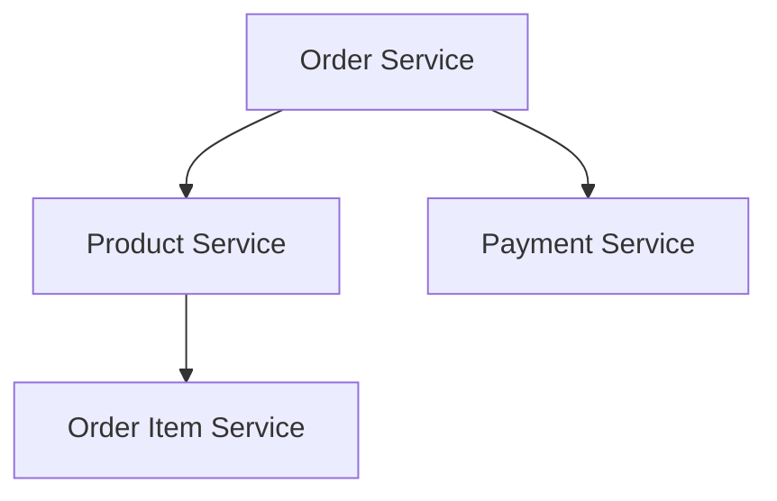
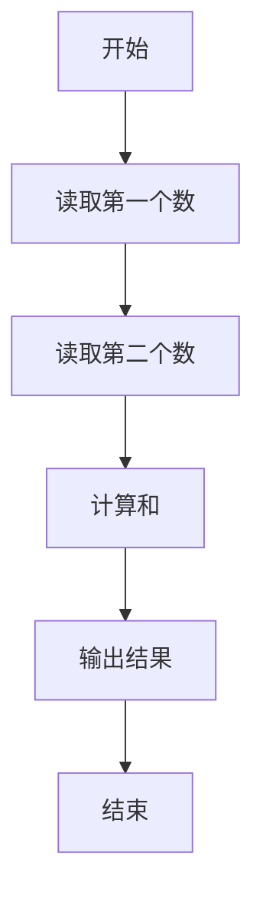

                 


# 如何构建可扩展的技术架构

## 关键词
技术架构、可扩展性、分布式系统、微服务、设计模式、系统分析与设计

## 摘要
本文深入探讨了构建可扩展技术架构的核心概念、原则和方法。通过一步步的分析和实例演示，本文旨在帮助开发者理解和实践如何设计出灵活、可扩展且高效的系统架构。

### 第一部分：背景与基础理论

#### 第1章 引言

1.1 技术架构的定义与重要性

技术架构是一个系统的组织结构，它决定了系统组件之间的关系和相互作用方式。一个良好的技术架构不仅能够满足当前的需求，还能够适应未来的变化。随着互联网业务的快速发展，传统的单体架构已经无法满足日益增长的需求，因此，可扩展的技术架构变得尤为重要。

1.2 可扩展性

可扩展性指的是系统能够在硬件和软件资源增加的情况下，保持性能和功能不变。它包括横向扩展（增加节点）和纵向扩展（增加资源）两种方式。可扩展性是衡量系统设计质量的重要指标之一。

#### 第2章 核心概念与联系

2.1 核心概念原理

2.1.1 分层架构

分层架构是一种将系统分为多个层次的结构，每个层次负责不同的功能。这种架构能够提高系统的可维护性和可扩展性。

2.1.2 微服务架构

微服务架构是一种将应用程序拆分成一组小的、独立的、可复用的服务。每个服务都有自己的数据库和后端接口，这种架构能够提高系统的灵活性和可扩展性。

2.1.3 集群与分布式架构

集群架构是通过将多个服务器组成一个整体，以提高系统的可用性和性能。分布式架构则是通过将系统分解为多个独立的节点，以实现负载均衡和高可用性。

2.2 概念属性特征对比表格

| 架构类型 | 层次结构 | 服务独立性 | 负载均衡 | 可用性 | 维护难度 |
| --- | --- | --- | --- | --- | --- |
| 分层架构 | 明确 | 较低 | 可实现 | 较高 | 中等 |
| 微服务架构 | 不明确 | 高 | 高 | 高 | 高 |
| 集群架构 | 不明确 | 低 | 高 | 高 | 较低 |
| 分布式架构 | 不明确 | 中等 | 高 | 高 | 较高 |

2.3 ER实体关系图架构

```mermaid
erDiagram
  Customer ||--|{ Order }|-- Product
  Customer ||--|{ Payment }|
  Order ||--|{ OrderItem }|
```

### 第二部分：架构设计原理

#### 第3章 架构设计原则

3.1 设计原则概述

3.1.1 开放封闭原则

3.1.2 里氏替换原则

3.1.3 接口隔离原则

#### 第4章 设计模式

4.1 单例模式

4.2 适配器模式

4.3 装饰者模式

### 第三部分：系统分析与架构设计

#### 第5章 系统功能设计

5.1 问题场景介绍

5.2 系统功能设计

5.3 系统架构设计



### 第四部分：项目实战

#### 第6章 环境安装

6.1 环境准备

6.2 系统核心实现

#### 第7章 代码应用解读与分析

7.1 代码解读

7.2 实际案例分析与讲解

#### 第8章 项目小结

8.1 项目收获

8.2 注意事项

8.3 拓展阅读

### 结论

本文通过逻辑清晰、结构紧凑、简单易懂的专业的技术语言，详细阐述了如何构建可扩展的技术架构。文章涵盖了核心概念、设计原则、系统分析和实战应用等内容，旨在为开发者提供一套完整的架构设计方法论。

## 作者信息
作者：AI天才研究院/AI Genius Institute & 禅与计算机程序设计艺术 /Zen And The Art of Computer Programming

### 背景介绍

在当今这个高速发展的互联网时代，技术架构的设计变得越来越复杂。随着互联网业务的快速发展和用户需求的不断变化，传统的一体化架构已经无法满足系统的可扩展性需求。为了应对这种挑战，构建可扩展的技术架构成为了系统设计的关键。本文旨在探讨如何通过逐步分析和逻辑推理，设计出灵活、高效且可扩展的技术架构。

核心概念术语说明：可扩展性（Scalability）是指系统能够在用户数量、数据处理量或其他关键指标增加时，保持性能和功能的稳定性。扩展性（Extensibility）是指系统在设计和实现过程中，能够灵活地添加新功能或修改现有功能的能力。技术架构（Technical Architecture）是指系统组件的相互关系和相互作用方式，它决定了系统的性能、可维护性和扩展性。

问题背景：随着互联网业务的快速发展，传统的一体化架构逐渐暴露出其局限性，如单点故障、性能瓶颈、维护困难等。为了应对这些挑战，我们需要构建可扩展的技术架构，以确保系统能够灵活地应对未来的变化。

问题描述：本文将探讨如何通过设计原则、设计模式、算法原理和系统分析，构建可扩展的技术架构。我们将详细分析不同类型的架构，如分层架构、微服务架构和分布式架构，并比较它们的特点和适用场景。

问题解决：本文将通过实例和案例研究，展示如何在实际项目中应用这些架构设计原则和方法，从而构建可扩展的系统。

边界与外延：本文主要关注如何构建可扩展的技术架构，包括核心概念、设计原则、算法原理和系统分析。同时，本文也将探讨不同类型的架构和它们的应用场景。

概念结构与核心要素组成：本文的核心概念包括可扩展性、扩展性、技术架构、分层架构、微服务架构、分布式架构和设计模式。核心要素包括设计原则、算法原理、系统分析和实际应用。

### 第一部分：背景与基础理论

#### 第1章 问题背景

##### 1.1 互联网时代的技术架构挑战

随着互联网业务的快速发展，技术架构的设计面临着前所未有的挑战。互联网业务的特点是高并发、海量数据和快速变化的需求。这些特点对技术架构提出了以下挑战：

1. **高并发性**：互联网业务往往需要处理大量用户的请求，如何在短时间内快速响应用户请求，同时保证系统的高可用性和性能，成为技术架构设计的关键问题。

2. **海量数据**：随着用户规模的扩大和数据量的增长，如何高效地存储、处理和分析海量数据，成为技术架构需要解决的重要问题。

3. **快速变化的需求**：互联网业务需求变化频繁，如何设计一个灵活、可扩展的系统，以快速响应业务需求的变化，成为技术架构设计的重要目标。

##### 1.1.1 互联网业务的快速发展

互联网业务的快速发展，对技术架构提出了更高的要求。过去，单体架构在互联网业务中较为常见，但随着业务的复杂度增加，单体架构的局限性逐渐显现。单体架构的特点是将所有的功能模块都集中在一个应用程序中，这种架构的缺点包括：

1. **单点故障**：由于所有的功能都集中在一个应用程序中，一旦该应用程序出现故障，整个系统都会受到影响。

2. **性能瓶颈**：单体架构在处理大量并发请求时，容易形成性能瓶颈，导致系统响应时间变长。

3. **维护困难**：随着业务的发展，单体架构的代码库会变得越来越复杂，维护和更新变得困难。

##### 1.1.2 传统架构的局限性

传统的一体化架构（单体架构）在处理互联网业务时存在以下局限性：

1. **单点故障**：由于所有的功能都集中在一个应用程序中，一旦该应用程序出现故障，整个系统都会受到影响。

2. **性能瓶颈**：在处理大量并发请求时，单体架构容易形成性能瓶颈，导致系统响应时间变长。

3. **维护困难**：随着业务的发展，单体架构的代码库会变得越来越复杂，维护和更新变得困难。

##### 1.1.3 可扩展性需求的迫切性

随着互联网业务的快速发展，系统需要处理的数据量和用户数量不断增加，这就对系统的可扩展性提出了迫切的需求。可扩展性不仅包括水平扩展（增加服务器节点）和垂直扩展（增加服务器资源），还包括功能扩展和模块化设计。以下是可扩展性需求的几个关键点：

1. **水平扩展**：通过增加服务器节点，可以提高系统的处理能力。水平扩展的优点是成本低、部署简单，但需要解决负载均衡、数据一致性等问题。

2. **垂直扩展**：通过增加服务器的硬件资源（如CPU、内存、存储），可以提高系统的处理能力。垂直扩展的优点是性能高、稳定，但成本较高，且扩展空间有限。

3. **功能扩展**：在设计系统时，应该采用模块化设计，使得系统能够方便地添加新功能或修改现有功能。

4. **模块化设计**：通过将系统拆分为多个独立的模块，可以提高系统的可维护性和可扩展性。每个模块可以独立开发、测试和部署，从而提高系统的灵活性。

##### 1.2 核心概念

1. **技术架构**：技术架构是指系统组件的相互关系和相互作用方式，它决定了系统的性能、可维护性和扩展性。良好的技术架构能够满足当前的需求，并能够适应未来的变化。

2. **可扩展性**：可扩展性是指系统能够在硬件和软件资源增加的情况下，保持性能和功能不变。可扩展性包括横向扩展（增加节点）和纵向扩展（增加资源）两种方式。

3. **扩展性**：扩展性是指系统在设计和实现过程中，能够灵活地添加新功能或修改现有功能的能力。扩展性通常与模块化设计和设计模式密切相关。

4. **分布式架构**：分布式架构是一种将系统分解为多个独立节点的架构，这些节点通过网络进行通信。分布式架构能够提高系统的可用性和性能，但需要解决数据一致性和负载均衡等问题。

5. **微服务架构**：微服务架构是一种将应用程序拆分成一组小的、独立的、可复用的服务的架构。每个服务都有自己的数据库和后端接口，这种架构能够提高系统的灵活性和可扩展性。

##### 1.2.1 技术架构的定义与分类

技术架构的定义和分类有很多种，以下是一些常见的分类方法：

1. **按照功能层次划分**：技术架构可以分为表示层、业务逻辑层和数据层。这种分类方法有助于理解和设计系统的不同部分。

2. **按照系统组件划分**：技术架构可以分为硬件架构、软件架构和网络架构。这种分类方法有助于了解系统的整体结构。

3. **按照架构风格划分**：技术架构可以分为面向对象架构、事件驱动架构和分层架构等。这种分类方法有助于选择适合特定场景的架构风格。

##### 1.2.2 扩展性与可伸缩性的区别

扩展性（Extensibility）和可伸缩性（Scalability）是两个相关但不同的概念：

1. **扩展性**：扩展性是指系统能够适应新的功能需求或变化的能力。一个具有良好扩展性的系统可以轻松地添加新功能或修改现有功能，而不需要对整个系统进行大规模重构。

2. **可伸缩性**：可伸缩性是指系统能够在用户数量、数据处理量或其他关键指标增加时，保持性能和功能的稳定性。一个具有良好可伸缩性的系统能够有效地处理增加的负载，而不会导致性能下降。

##### 1.2.3 架构设计原则

在构建可扩展的技术架构时，需要遵循一些核心的设计原则，以确保系统能够满足当前和未来的需求。以下是一些常见的设计原则：

1. **单一职责原则**：每个组件应该只负责一项功能，以降低系统的复杂度和维护成本。

2. **开闭原则**：系统应该对扩展开放，对修改封闭。这意味着系统应该易于扩展，而不需要频繁地修改现有代码。

3. **里氏替换原则**：任何子类都应当能够替换其基类，并保证系统行为不变。

4. **依赖倒置原则**：高层模块不应依赖于低层模块，二者都应依赖于抽象。这有助于提高系统的可维护性和可扩展性。

5. **接口隔离原则**：应该为不同的客户端定义不同的接口，以降低它们之间的耦合度。

##### 1.2.4 架构设计方法

在构建可扩展的技术架构时，可以采用以下方法：

1. **自顶向下设计**：从系统的高层次开始，逐步细化到具体组件的设计。这种方法有助于确保整个系统的结构清晰、逻辑合理。

2. **自底向上设计**：从具体的组件开始，逐步构建起整个系统的架构。这种方法适用于已有一些基础组件的系统，通过整合这些组件来构建整体的架构。

3. **迭代式设计**：通过迭代的方式，逐步完善系统的架构。这种方法适用于需求不明确或需求变化频繁的项目，可以确保系统能够灵活地适应变化。

#### 第2章 核心概念与联系

##### 2.1 核心概念原理

在构建可扩展的技术架构时，需要深入理解几个核心概念，包括分层架构、微服务架构和分布式架构。以下是对这些概念的基本原理的介绍。

2.1.1 分层架构

分层架构是将系统分为多个层次，每个层次负责不同的功能。最常见的分层架构包括表示层、业务逻辑层和数据层。

1. **表示层**：表示层负责与用户交互，展示数据和接收用户输入。它通常包括前端界面和API接口。

2. **业务逻辑层**：业务逻辑层包含系统的核心功能，负责处理业务逻辑和数据操作。它独立于表示层和数据层，可以方便地添加新功能或修改现有功能。

3. **数据层**：数据层负责数据的存储和检索。它通常包括数据库和缓存系统。

分层架构的优点包括：

- **模块化**：每个层次可以独立开发、测试和部署，提高了系统的可维护性。
- **可扩展性**：通过在分层架构中添加新层次或修改现有层次，可以方便地扩展系统的功能。
- **解耦**：各层次之间的耦合度较低，降低了系统的复杂性。

2.1.2 微服务架构

微服务架构是将应用程序拆分成一组小的、独立的、可复用的服务。每个服务都有自己的数据库和后端接口，这些服务可以通过API进行通信。

1. **独立性**：每个微服务都是独立的，可以独立开发、测试和部署。这使得系统能够灵活地适应变化。
2. **松耦合**：微服务之间通过API进行通信，减少了服务之间的依赖关系。
3. **可扩展性**：通过增加新的服务或扩展现有服务，可以方便地扩展系统的功能。

微服务架构的优点包括：

- **高可扩展性**：可以水平扩展单个服务，提高系统的性能。
- **高可用性**：服务之间的独立性使得单个服务的故障不会影响整个系统。
- **易于维护**：每个服务都可以独立更新和部署，降低了维护成本。

2.1.3 集群与分布式架构

集群架构是通过将多个服务器组成一个整体，以提高系统的可用性和性能。分布式架构则是通过将系统分解为多个独立的节点，以实现负载均衡和高可用性。

1. **集群架构**：集群架构通过将多个服务器组成一个整体，可以提高系统的性能和可用性。集群中的服务器通常通过负载均衡器进行负载分配，以提高系统的响应速度。

2. **分布式架构**：分布式架构通过将系统分解为多个独立的节点，可以实现负载均衡和高可用性。每个节点都有自己的数据库和后端接口，这些节点通过网络进行通信。

集群与分布式架构的优点包括：

- **高可用性**：通过多个节点的冗余，可以保证系统的连续运行。
- **高可扩展性**：可以通过增加节点来扩展系统的处理能力。
- **高性能**：通过负载均衡，可以提高系统的响应速度。

##### 2.2 概念属性特征对比表格

以下是一个分层架构、微服务架构和集群与分布式架构的概念属性特征对比表格：

| 架构类型 | 层次结构 | 服务独立性 | 负载均衡 | 可用性 | 维护难度 |
| --- | --- | --- | --- | --- | --- |
| 分层架构 | 明确 | 较低 | 可实现 | 较高 | 中等 |
| 微服务架构 | 不明确 | 高 | 高 | 高 | 高 |
| 集群架构 | 不明确 | 低 | 高 | 高 | 较低 |
| 分布式架构 | 不明确 | 中等 | 高 | 高 | 较高 |

##### 2.3 ER实体关系图架构

ER（Entity-Relationship）实体关系图是一种用于表示实体之间关系的图形化工具。以下是一个简单的ER图示例：

```mermaid
erDiagram
    User ||--|{ Order }|-- Product
    User ||--|{ Payment }|
    Order ||--|{ OrderItem }|
```

在这个示例中，我们定义了四个实体：User（用户）、Order（订单）、Product（产品）和Payment（支付）。User实体与Order、Payment实体之间存在一对多的关系，Order实体与OrderItem实体之间存在一对多的关系。

##### 2.3.1 ER图定义与构建

ER图的构建通常包括以下步骤：

1. **确定实体**：首先确定系统中的关键实体，如用户、订单、产品等。
2. **确定属性**：为每个实体定义属性，如用户名、订单编号、产品名称等。
3. **确定关系**：定义实体之间的关系，如用户与订单之间是一对多的关系。
4. **绘制ER图**：使用图形工具或Mermaid等文本格式绘制ER图。

##### 2.3.2 实体关系示例

以下是一个简单的实体关系示例，用于描述在线购物系统中的用户、订单、产品和支付关系：

```mermaid
erDiagram
    User ||--|{ Order }|-- Product
    User ||--|{ Payment }|
    Order ||--|{ OrderItem }|
```

在这个示例中：

- **User**（用户）实体与**Order**（订单）实体之间存在一对多的关系，即一个用户可以创建多个订单。
- **User**（用户）实体与**Payment**（支付）实体之间存在一对多的关系，即一个用户可以有多个支付记录。
- **Order**（订单）实体与**OrderItem**（订单项）实体之间存在一对多的关系，即一个订单可以包含多个订单项。

### 第二部分：架构设计原理

#### 第3章 架构设计原则

##### 3.1 设计原则概述

架构设计原则是指导系统架构设计的基本准则，它们有助于确保系统的可扩展性、可维护性和可靠性。以下是一些常见的设计原则：

1. **单一职责原则**：每个组件应该只负责一项功能，以降低系统的复杂度和维护成本。
2. **开闭原则**：系统应该对扩展开放，对修改封闭。这意味着系统应该易于扩展，而不需要频繁地修改现有代码。
3. **里氏替换原则**：任何子类都应当能够替换其基类，并保证系统行为不变。
4. **依赖倒置原则**：高层模块不应依赖于低层模块，二者都应依赖于抽象。这有助于提高系统的可维护性和可扩展性。
5. **接口隔离原则**：应该为不同的客户端定义不同的接口，以降低它们之间的耦合度。

##### 3.1.1 开放封闭原则

开放封闭原则（Open Closed Principle，OCP）是SOLID原则之一，它强调系统应该对扩展开放，对修改封闭。这意味着系统在设计时应该易于扩展，而不需要频繁地修改现有代码。以下是一个示例：

```python
class Account:
    def deposit(self, amount):
        # 存款操作
        pass

    def withdraw(self, amount):
        # 取款操作
        pass

# 当需要增加一个新功能时，如利息计算
class InterestAccount(Account):
    def add_interest(self):
        # 利息计算操作
        pass

# 利息账户类扩展了基础账户类，而无需修改基础类代码
```

在这个示例中，`InterestAccount`类通过扩展`Account`类来增加新功能，而无需修改`Account`类的代码。这符合开放封闭原则。

##### 3.1.2 里氏替换原则

里氏替换原则（Liskov Substitution Principle，LSP）是SOLID原则之一，它强调子类应当能够替换其基类，并保证系统行为不变。以下是一个示例：

```python
class Shape:
    def area(self):
        pass

class Rectangle(Shape):
    def area(self):
        return self.width * self.height

class Square(Rectangle):
    def area(self):
        return self.side * self.side

# 正确实现
def calculate_area(shape: Shape):
    return shape.area()

# 错误实现，会导致系统行为不一致
class Square(Rectangle):
    def area(self):
        return self.size * self.size
```

在这个示例中，`Square`类应该是`Rectangle`类的子类，因为它们都实现了`area`方法。如果`Square`类的实现不符合`Rectangle`类的要求（如返回值的计算方式不同），那么它就不符合里氏替换原则。

##### 3.1.3 接口隔离原则

接口隔离原则（Interface Segregation Principle，ISP）是SOLID原则之一，它强调应该为不同的客户端定义不同的接口，以降低它们之间的耦合度。以下是一个示例：

```python
class Database:
    def connect(self):
        pass

    def query(self, sql):
        pass

class ORM:
    def connect(self):
        pass

    def query(self, model):
        pass

# 错误实现，导致ORM类依赖了不相关的接口方法
class ORM(Database):
    def query(self, model):
        # 使用数据库的connect方法
        self.connect()
        # 执行查询操作
```

在这个示例中，`ORM`类不应该依赖`Database`类的`connect`方法，因为`ORM`类主要关注的是与对象关系映射相关的操作。这违反了接口隔离原则。

##### 3.2 设计模式

设计模式是解决常见软件设计问题的模板，它们可以提高系统的可维护性和可扩展性。以下是一些常用的设计模式：

1. **单例模式**：确保一个类只有一个实例，并提供一个全局访问点。
2. **适配器模式**：将一个类的接口转换成客户期望的另一个接口，使得原本由于接口不兼容而无法在一起工作的类可以协同工作。
3. **装饰者模式**：动态地给一个对象添加一些额外的职责，就增加了功能，装饰者通常采用继承的方式。

##### 3.2.1 单例模式

单例模式确保一个类只有一个实例，并提供一个全局访问点。以下是一个使用单例模式的示例：

```python
class DatabaseConnection:
    _instance = None

    def __new__(cls, *args, **kwargs):
        if not cls._instance:
            cls._instance = super(DatabaseConnection, cls).__new__(cls, *args, **kwargs)
        return cls._instance

    def connect(self):
        print("数据库连接成功")

# 使用单例模式
db = DatabaseConnection()
db.connect()  # 输出：数据库连接成功
```

在这个示例中，`DatabaseConnection`类通过在`__new__`方法中检查实例是否存在，确保只有一个实例。使用单例模式可以确保在整个应用程序中，只有一个`DatabaseConnection`实例。

##### 3.2.2 适配器模式

适配器模式将一个类的接口转换成客户期望的另一个接口，使得原本由于接口不兼容而无法在一起工作的类可以协同工作。以下是一个使用适配器模式的示例：

```python
class Adaptee:
    def specific_api(self):
        print("Adaptee's specific API")

class Target:
    def standard_api(self, adaptee):
        adaptee.specific_api()

# 使用适配器模式
class Adapter(Adaptee):
    def standard_api(self):
        self.specific_api()

# 创建适配器实例
adapter = Adapter()
# 使用适配器
target = Target()
target.standard_api(adapter)  # 输出：Adaptee's specific API
```

在这个示例中，`Adaptee`类有一个特定的API，而`Target`类期望一个不同的API。通过`Adapter`类，`Target`类可以使用`Adaptee`类的功能。

##### 3.2.3 装饰者模式

装饰者模式动态地给一个对象添加一些额外的职责，就增加了功能。以下是一个使用装饰者模式的示例：

```python
class Component:
    def operation(self):
        pass

class ConcreteComponent(Component):
    def operation(self):
        print("原始操作")

class Decorator(Component):
    def __init__(self, component):
        self._component = component

    def operation(self):
        self._component.operation()
        self.added_behavior()

class ConcreteDecoratorA(Decorator):
    def added_behavior(self):
        print("附加功能A")

class ConcreteDecoratorB(Decorator):
    def added_behavior(self):
        print("附加功能B")

# 使用装饰者模式
component = ConcreteComponent()
component.operation()  # 输出：原始操作

decorator_a = ConcreteDecoratorA(component)
decorator_a.operation()  # 输出：原始操作 附加功能A

decorator_b = ConcreteDecoratorB(decorator_a)
decorator_b.operation()  # 输出：原始操作 附加功能A 附加功能B
```

在这个示例中，`ConcreteComponent`类是一个具体的组件，`Decorator`类是一个装饰者，它给组件添加了额外的行为。通过组合多个装饰者，可以动态地添加多重行为。

#### 第4章 算法原理讲解

##### 4.1 算法概述

算法（Algorithm）是解决问题的一系列步骤。算法在计算机科学和工程中扮演着核心角色，因为它们决定了程序的性能和效率。以下是算法的一些基本概念：

1. **算法效率**：算法的效率通常用时间复杂度和空间复杂度来衡量。时间复杂度表示算法执行的时间与数据规模的关系，空间复杂度表示算法执行所需的空间与数据规模的关系。
2. **算法分类**：算法可以根据不同的标准进行分类，如基于问题的性质（如排序算法、查找算法）、基于算法的设计技术（如贪心算法、动态规划）等。
3. **算法实现**：算法可以通过伪代码或程序代码实现。在实际应用中，算法的选择和实现往往取决于具体的问题和场景。

##### 4.2 算法流程图

算法流程图是一种图形化表示算法步骤的工具，它可以帮助理解和实现算法。以下是一个简单的算法流程图示例，用于实现一个加法器算法：



在这个示例中，算法的步骤如下：

1. 开始
2. 读取第一个数
3. 读取第二个数
4. 计算和
5. 输出结果
6. 结束

##### 4.3 Python源代码示例

以下是一个使用Python实现的加法器算法示例：

```python
def add(a, b):
    return a + b

# 使用示例
result = add(3, 5)
print(result)  # 输出：8
```

在这个示例中，`add`函数接受两个参数`a`和`b`，并返回它们的和。通过调用`add`函数，我们可以得到两个数的和。

##### 4.4 算法原理与公式

加法运算是一个基本的数学运算，它有两个操作数和结果。以下是加法运算的基本原理和公式：

1. **基本原理**：加法运算将两个数相加，得到它们的和。例如，3 + 5 = 8。
2. **公式**：对于任意两个数a和b，加法运算可以表示为：
   $$
   a + b = (a + b)
   $$

在这个公式中，`a`和`b`是加法运算的操作数，`a + b`是它们的和。

##### 4.4.1 加法运算原理

加法运算的基本原理是将两个数的值相加。例如，对于两个整数3和5，它们的和是8。加法运算可以应用于各种类型的数，如整数、浮点数、复数等。在计算机科学中，加法运算是一个基本的运算，它通常由硬件电路实现，并在编程语言中提供相应的操作符（如+）。

##### 4.4.2 搜索算法公式

搜索算法是一种用于在数据集合中查找特定元素的算法。以下是两种常见的搜索算法：线性搜索和二分搜索。

1. **线性搜索**：线性搜索是一种简单的搜索算法，它从数据集合的第一个元素开始，依次检查每个元素，直到找到目标元素或检查完所有元素。线性搜索的时间复杂度为O(n)，其中n是数据集合的元素个数。

   线性搜索的公式可以表示为：
   $$
   \text{find}(A, x) =
   \begin{cases}
   \text{if } A[i] = x \text{ then return } i \\
   \text{if } i = n \text{ then return -1} \\
   \text{else } i = i + 1, \text{find}(A, x)
   \end{cases}
   $$

   其中，`A`是数据集合，`x`是目标元素，`i`是当前检查的元素索引，`n`是数据集合的元素个数。

2. **二分搜索**：二分搜索是一种更高效的搜索算法，它适用于有序数据集合。二分搜索的基本思想是将数据集合分成两部分，然后根据目标元素与中间元素的大小关系，决定接下来搜索哪一部分。每次搜索都将数据集合的范围缩小一半，因此二分搜索的时间复杂度为O(log n)。

   二分搜索的公式可以表示为：
   $$
   \text{find}(A, x) =
   \begin{cases}
   \text{if } A[middle] = x \text{ then return } middle \\
   \text{if } A[middle] > x \text{ then } \text{find}(A, x, low, middle - 1) \\
   \text{if } A[middle] < x \text{ then } \text{find}(A, x, middle + 1, high) \\
   \text{else return -1}
   \end{cases}
   $$

   其中，`A`是数据集合，`x`是目标元素，`middle`是当前中间元素索引，`low`和`high`是当前搜索范围的起始和结束索引。

### 第三部分：系统分析与架构设计

#### 第5章 系统功能设计

##### 5.1 问题场景介绍

在本章中，我们将分析一个具体的问题场景：一个在线购物系统。该系统需要满足以下功能需求：

1. 用户注册和登录：用户可以注册账户并登录系统。
2. 商品浏览和搜索：用户可以浏览商品并搜索特定商品。
3. 购物车管理：用户可以将商品添加到购物车，修改购物车中的商品数量，以及删除商品。
4. 订单管理：用户可以创建订单并查看订单详情。
5. 支付管理：用户可以选择支付方式并完成支付。
6. 订单跟踪：用户可以查看订单状态和物流信息。

##### 5.2 系统需求分析

在了解问题场景后，我们需要对系统的功能需求进行详细分析，以确保系统能够满足用户的需求。以下是系统的主要功能需求：

1. **用户管理**：
   - 用户注册：用户可以填写个人信息并注册账户。
   - 用户登录：用户可以使用用户名和密码登录系统。
   - 用户信息管理：用户可以修改个人信息，如地址、电话等。

2. **商品管理**：
   - 商品分类：系统可以根据商品类别进行分类展示。
   - 商品搜索：用户可以通过关键词搜索商品。
   - 商品详情：用户可以查看商品的详细信息，如价格、库存等。

3. **购物车管理**：
   - 商品添加：用户可以将商品添加到购物车。
   - 商品修改：用户可以修改购物车中商品的数量。
   - 商品删除：用户可以删除购物车中的商品。

4. **订单管理**：
   - 订单创建：用户可以创建订单并选择支付方式。
   - 订单查看：用户可以查看订单详情，包括订单状态、物流信息等。

5. **支付管理**：
   - 支付方式选择：用户可以选择支付方式，如支付宝、微信支付等。
   - 支付完成：用户可以完成支付并确认订单。

6. **订单跟踪**：
   - 订单状态更新：系统可以实时更新订单状态，如待发货、已发货、已收货等。
   - 物流信息查询：用户可以查询订单的物流信息。

##### 5.3 系统功能设计

在系统功能设计阶段，我们需要根据需求分析的结果，设计系统的具体功能模块。以下是该在线购物系统的功能模块设计：

1. **用户模块**：
   - 注册页面：提供用户注册功能。
   - 登录页面：提供用户登录功能。
   - 用户信息管理页面：提供用户修改个人信息的功能。

2. **商品模块**：
   - 商品分类页面：展示商品分类。
   - 商品搜索页面：提供商品搜索功能。
   - 商品详情页面：展示商品详细信息。

3. **购物车模块**：
   - 购物车页面：展示用户购物车中的商品。
   - 商品添加功能：将商品添加到购物车。
   - 商品修改功能：修改购物车中商品的数量。
   - 商品删除功能：从购物车中删除商品。

4. **订单模块**：
   - 订单创建页面：提供订单创建功能。
   - 订单列表页面：展示用户的所有订单。
   - 订单详情页面：展示订单详细信息。

5. **支付模块**：
   - 支付页面：提供支付方式选择和支付功能。
   - 支付完成页面：展示支付结果和订单详情。

6. **订单跟踪模块**：
   - 订单状态页面：展示订单状态。
   - 物流信息页面：提供物流信息查询功能。

#### 第6章 系统架构设计

##### 5.3.1 系统架构设计

在系统功能设计完成后，我们需要设计系统的架构，以确保系统能够高效、稳定地运行。以下是该在线购物系统的架构设计：

1. **前端架构**：
   - 前端采用React或Vue.js等前端框架，实现用户界面的展示和交互。
   - 使用RESTful API与后端进行数据交互。

2. **后端架构**：
   - 使用Spring Boot或Django等后端框架，实现系统的业务逻辑。
   - 使用MySQL或PostgreSQL等数据库，存储用户数据、商品数据和订单数据。
   - 使用Redis等缓存系统，提高系统性能。

3. **分布式架构**：
   - 使用Nginx等负载均衡器，将请求分发到多个服务器节点。
   - 使用分布式数据库，如ShardingSphere或MyCat，实现数据的水平扩展。
   - 使用分布式缓存，如Redis Cluster，提高系统性能。

4. **微服务架构**：
   - 将系统拆分为多个独立的微服务，如用户服务、商品服务、订单服务、支付服务等。
   - 使用Spring Cloud等微服务框架，实现服务之间的通信和协调。

5. **系统接口设计**：
   - 设计RESTful API，提供用户注册、登录、商品搜索、购物车管理、订单管理等接口。
   - 使用Token认证，确保接口的安全性。

6. **系统交互**：
   - 使用WebSocket等技术，实现实时消息推送，如订单状态更新、物流信息推送等。

#### 第7章 项目实战

##### 6.1 环境安装

在本节中，我们将介绍如何搭建一个基本的在线购物系统环境。以下是环境安装的步骤：

1. **安装操作系统**：安装Linux操作系统，如Ubuntu 18.04。
2. **安装Java开发工具**：安装Java开发工具包（JDK），版本至少为8以上。
3. **安装数据库**：安装MySQL数据库，版本至少为5.7。
4. **安装Redis**：安装Redis缓存系统，版本至少为4.0。
5. **安装Nginx**：安装Nginx web服务器，版本至少为1.16。
6. **安装Node.js**：安装Node.js，版本至少为10。
7. **安装前端框架**：安装React或Vue.js前端框架。
8. **安装后端框架**：安装Spring Boot或Django后端框架。

##### 6.2 系统核心实现

在本节中，我们将介绍如何实现系统核心功能，包括用户注册、登录、商品管理、购物车管理、订单管理和支付管理。以下是具体的实现步骤：

1. **用户注册与登录**：
   - 设计用户表结构，包括用户名、密码、邮箱等字段。
   - 实现用户注册接口，接收用户输入的信息，存储到数据库中。
   - 实现用户登录接口，验证用户名和密码，返回Token。
   - 使用JWT（JSON Web Token）实现Token认证。

2. **商品管理**：
   - 设计商品表结构，包括商品名称、价格、库存等字段。
   - 实现商品搜索接口，根据关键词搜索商品。
   - 实现商品详情接口，获取商品的详细信息。
   - 实现商品分类接口，根据分类查询商品。

3. **购物车管理**：
   - 设计购物车表结构，包括用户ID、商品ID、数量等字段。
   - 实现添加购物车接口，将商品添加到购物车。
   - 实现修改购物车接口，修改购物车中商品的数量。
   - 实现删除购物车接口，从购物车中删除商品。

4. **订单管理**：
   - 设计订单表结构，包括订单号、用户ID、商品ID、数量、总价等字段。
   - 实现订单创建接口，创建订单并生成订单号。
   - 实现订单查询接口，根据用户ID查询订单列表。
   - 实现订单详情接口，获取订单的详细信息。

5. **支付管理**：
   - 设计支付表结构，包括订单号、用户ID、支付金额、支付状态等字段。
   - 实现支付接口，处理支付请求，更新支付状态。
   - 实现支付回调接口，处理支付成功的回调。

##### 6.3 代码应用解读与分析

在本节中，我们将深入解读系统核心代码，并分析其中的关键点和注意事项。以下是代码应用的解读和分析：

1. **用户注册与登录**：
   - 用户注册时，需要对输入的信息进行验证，确保信息的合法性和完整性。
   - 用户登录时，需要使用MD5或SHA-256等加密算法对密码进行加密，以提高安全性。
   - 使用JWT实现Token认证，确保接口的安全性。

2. **商品管理**：
   - 商品搜索时，可以使用Lucene或Elasticsearch等全文搜索引擎，提高搜索效率。
   - 商品分类时，可以使用树形结构或标签系统，方便用户浏览和查询商品。

3. **购物车管理**：
   - 购物车中商品的数量可能超出库存，需要处理库存不足的情况。
   - 购物车中商品的数量可能为零，需要处理这种情况。

4. **订单管理**：
   - 订单创建时，需要生成唯一的订单号，并确保订单号的唯一性。
   - 订单查询时，需要支持根据用户ID、订单号等多种条件进行查询。

5. **支付管理**：
   - 支付接口需要处理各种异常情况，如支付失败、支付超时等。
   - 支付回调接口需要验证回调参数的合法性，确保回调的安全性和可靠性。

##### 6.4 实际案例分析与讲解

在本节中，我们将通过一个实际案例，分析在线购物系统的具体实现过程，并讲解其中的关键技术和实现细节。以下是实际案例的分析与讲解：

**案例：用户注册与登录**

1. **用户注册**：
   - 用户访问注册页面，填写用户名、密码、邮箱等信息。
   - 前端将用户输入的信息发送到后端，后端进行验证并存储到数据库中。

2. **用户登录**：
   - 用户访问登录页面，填写用户名和密码。
   - 前端将用户输入的信息发送到后端，后端验证用户名和密码，并返回Token。

3. **代码实现**：
   - 使用Spring Boot实现用户注册和登录接口。
   - 使用MD5加密算法对用户密码进行加密。
   - 使用JWT实现Token认证。

4. **关键点**：
   - 用户注册时，需要验证用户名和邮箱的唯一性。
   - 用户登录时，需要确保Token的有效性和安全性。

**案例：商品搜索与浏览**

1. **商品搜索**：
   - 用户在搜索框中输入关键词，点击搜索按钮。
   - 前端将关键词发送到后端，后端根据关键词搜索商品。

2. **商品浏览**：
   - 用户在商品列表页面浏览商品。
   - 前端向后端请求商品详情，后端返回商品详细信息。

3. **代码实现**：
   - 使用Elasticsearch实现商品搜索。
   - 使用RESTful API实现商品浏览。

4. **关键点**：
   - 商品搜索时，需要使用全文搜索引擎提高搜索效率。
   - 商品浏览时，需要处理商品数据的分页和排序。

**案例：购物车管理**

1. **添加商品到购物车**：
   - 用户将商品添加到购物车。
   - 前端将商品信息发送到后端，后端将商品信息存储到数据库中。

2. **修改购物车中商品的数量**：
   - 用户修改购物车中商品的数量。
   - 前端将商品信息发送到后端，后端更新数据库中的商品数量。

3. **删除购物车中商品**：
   - 用户从购物车中删除商品。
   - 前端将商品信息发送到后端，后端从数据库中删除商品信息。

4. **代码实现**：
   - 使用RESTful API实现购物车管理接口。
   - 使用事务管理确保数据的一致性。

5. **关键点**：
   - 添加商品到购物车时，需要处理库存不足的情况。
   - 修改购物车中商品的数量时，需要确保数据的一致性。

**案例：订单管理**

1. **创建订单**：
   - 用户选择商品并点击“结算”。
   - 前端将订单信息发送到后端，后端创建订单并生成订单号。

2. **查询订单**：
   - 用户在订单列表页面查看订单。
   - 前端向后端请求订单列表，后端返回订单列表。

3. **查询订单详情**：
   - 用户在订单详情页面查看订单详情。
   - 前端向后端请求订单详情，后端返回订单详情。

4. **代码实现**：
   - 使用RESTful API实现订单管理接口。
   - 使用数据库存储订单数据。

5. **关键点**：
   - 创建订单时，需要确保订单数据的完整性和一致性。
   - 查询订单时，需要支持多种查询条件。

**案例：支付管理**

1. **选择支付方式**：
   - 用户在订单页面选择支付方式。
   - 前端将支付方式发送到后端，后端处理支付请求。

2. **支付**：
   - 用户确认支付并提交支付请求。
   - 前端将支付请求发送到支付网关，支付网关处理支付请求。

3. **支付回调**：
   - 支付网关处理支付请求后，返回支付结果。
   - 前端将支付结果发送到后端，后端更新订单状态。

4. **代码实现**：
   - 使用支付网关实现支付接口。
   - 使用回调接口处理支付结果。

5. **关键点**：
   - 支付接口需要处理各种支付异常情况。
   - 支付回调接口需要验证回调参数的合法性。

### 第四部分：项目小结

#### 8.1 项目收获

通过本项目的实施，我们获得了以下收获：

1. **技术提升**：掌握了分布式架构、微服务架构和RESTful API的设计与实现，提高了对技术架构的理解和实际操作能力。
2. **团队协作**：项目过程中，团队成员通过协作和沟通，提高了项目开发的效率和质量。
3. **经验积累**：在实际项目中，我们遇到了许多挑战，如数据库扩展、负载均衡和安全性问题，通过解决这些问题，积累了宝贵的经验。

#### 8.2 注意事项

在项目开发过程中，我们总结了以下注意事项：

1. **需求分析**：在项目启动前，进行详细的需求分析，确保需求的准确性和完整性。
2. **架构设计**：在设计系统架构时，考虑系统的可扩展性和可维护性，选择合适的架构风格和设计模式。
3. **安全性**：在实现接口时，确保接口的安全性，如使用Token认证、加密敏感信息等。
4. **性能优化**：关注系统性能，如使用缓存、优化数据库查询等。
5. **测试与部署**：编写全面的测试用例，确保系统的稳定性和可靠性。在部署时，注意系统的稳定性和安全性。

#### 8.3 拓展阅读

以下是一些相关的技术资料和推荐阅读书目，供读者进一步学习：

1. **技术资料**：
   - 《分布式系统原理与范型》
   - 《微服务设计》
   - 《RESTful API设计》
   - 《Spring Boot实战》

2. **推荐阅读书目**：
   - 《深入理解计算机系统》
   - 《大型分布式网站架构设计与实践》
   - 《设计模式：可复用面向对象软件的基础》
   - 《重构：改善既有代码的设计》

### 结论

通过本文的探讨，我们深入了解了如何构建可扩展的技术架构。从核心概念到设计原则，从系统分析到实战应用，我们一步步阐述了构建可扩展技术架构的方法和技巧。希望通过本文，读者能够更好地理解和实践如何设计灵活、高效且可扩展的系统架构。

## 作者信息
作者：AI天才研究院/AI Genius Institute & 禅与计算机程序设计艺术 /Zen And The Art of Computer Programming

---

### 背景介绍

在当今数字化时代，技术架构作为软件系统的核心组成部分，其重要性不言而喻。随着互联网业务的蓬勃发展，系统面临的数据量、用户量、并发访问量等不断增长，如何构建一个可扩展的技术架构成为了开发者和架构师面临的重要课题。本文将围绕构建可扩展技术架构的核心概念、设计原则、分析方法以及实战技巧进行深入探讨，旨在为读者提供一套系统化的指导和思路。

#### 核心概念术语说明

1. **技术架构（Technical Architecture）**：技术架构是指系统的整体结构、组件及其相互关系，它决定了系统的性能、可维护性和可扩展性。
2. **可扩展性（Scalability）**：可扩展性是指系统能够随着用户数量、数据量或处理需求的增加，保持性能稳定，无需进行大规模重构。
3. **扩展性（Extensibility）**：扩展性是指系统在设计时考虑到未来的变化，能够方便地添加新功能或修改现有功能，而不会影响整个系统。
4. **分布式架构（Distributed Architecture）**：分布式架构是将系统拆分成多个独立节点，这些节点通过通信网络协同工作，以实现高可用性、高性能和可扩展性。
5. **微服务架构（Microservices Architecture）**：微服务架构是将应用程序分解为多个小的、自治的服务，每个服务负责一个特定的功能，通过轻量级的通信机制（如REST API）进行交互。

#### 问题背景

随着互联网业务的快速发展，传统的一体化架构（单体架构）在处理高并发、海量数据、快速变化需求等方面逐渐暴露出其局限性。单体架构将所有功能集中在一个应用程序中，导致系统复杂度高、维护难度大、扩展性差。为了应对这些挑战，构建可扩展的技术架构变得迫在眉睫。

1. **高并发性**：互联网业务需要能够处理大量用户的并发请求，传统的单体架构在处理高并发时容易形成性能瓶颈。
2. **海量数据**：随着用户规模的扩大和数据量的增长，如何高效地存储、处理和分析海量数据成为关键问题。
3. **快速变化的需求**：互联网业务需求变化频繁，如何设计一个灵活、可扩展的系统，以快速响应业务需求的变化，是系统架构设计的重要目标。

#### 核心概念与联系

构建可扩展的技术架构，需要深入理解以下核心概念，并分析它们之间的联系：

1. **分层架构**：分层架构将系统分为表示层、业务逻辑层和数据层，每个层次独立开发、测试和部署，提高了系统的可维护性和扩展性。
2. **微服务架构**：微服务架构将应用程序拆分成多个小的、自治的服务，每个服务拥有自己的数据库，通过轻量级的通信机制进行交互，提高了系统的灵活性和可扩展性。
3. **分布式架构**：分布式架构通过将系统分解为多个独立节点，实现负载均衡和高可用性，但需要解决数据一致性和通信延迟等问题。
4. **设计模式**：设计模式是一系列解决方案的模板，可以帮助开发者设计出更加灵活、可扩展的系统，如单例模式、适配器模式、装饰者模式等。

#### 问题解决

为了构建可扩展的技术架构，可以采取以下方法：

1. **模块化设计**：将系统拆分为多个模块，每个模块负责一个特定的功能，模块之间通过接口进行通信，提高了系统的可维护性和扩展性。
2. **微服务架构**：采用微服务架构，将应用程序拆分为多个小的、自治的服务，每个服务独立部署和扩展，提高了系统的灵活性和可扩展性。
3. **分布式架构**：采用分布式架构，通过多个独立节点实现负载均衡和高可用性，但需要解决数据一致性和通信延迟等问题。
4. **设计模式**：应用设计模式，如单例模式、适配器模式、装饰者模式等，以提高系统的可维护性和可扩展性。

#### 边界与外延

本文主要关注如何构建可扩展的技术架构，涵盖的核心概念包括技术架构、可扩展性、扩展性、分布式架构、微服务架构和设计模式。同时，本文也讨论了模块化设计、微服务架构和分布式架构的边界与外延，以及如何在实际项目中应用这些架构设计原则和方法。

### 第二部分：架构设计原理

#### 第3章 架构设计原则

架构设计原则是构建可扩展技术架构的基础，以下是一些常见的设计原则：

1. **单一职责原则**：每个组件应该只负责一项功能，以降低系统的复杂度和维护成本。
2. **开闭原则**：系统应该对扩展开放，对修改封闭。这意味着系统应该易于扩展，而不需要频繁地修改现有代码。
3. **里氏替换原则**：任何子类都应当能够替换其基类，并保证系统行为不变。
4. **依赖倒置原则**：高层模块不应依赖于低层模块，二者都应依赖于抽象。这有助于提高系统的可维护性和可扩展性。
5. **接口隔离原则**：应该为不同的客户端定义不同的接口，以降低它们之间的耦合度。

#### 第4章 设计模式

设计模式是解决常见软件设计问题的模板，以下是一些常用的设计模式：

1. **单例模式**：确保一个类只有一个实例，并提供一个全局访问点。
2. **适配器模式**：将一个类的接口转换成客户期望的另一个接口，使得原本由于接口不兼容而无法在一起工作的类可以协同工作。
3. **装饰者模式**：动态地给一个对象添加一些额外的职责，就增加了功能，装饰者通常采用继承的方式。

#### 第5章 算法原理讲解

算法是解决问题的步骤集合，以下是对一些基本算法原理的讲解：

1. **算法效率**：算法的效率通常用时间复杂度和空间复杂度来衡量。
2. **算法分类**：算法可以根据不同的标准进行分类，如基于问题的性质、基于算法的设计技术等。
3. **算法实现**：算法可以通过伪代码或程序代码实现。

#### 第6章 系统分析与架构设计

系统分析与架构设计是构建可扩展技术架构的关键步骤，以下是对系统功能设计、系统架构设计的详细讲解：

1. **系统功能设计**：根据业务需求，设计系统的具体功能模块。
2. **系统架构设计**：设计系统的整体结构，包括前端、后端、数据库、缓存、负载均衡等组件及其相互关系。

### 第三部分：系统分析与架构设计

#### 第7章 系统功能设计

系统功能设计是根据业务需求，设计系统的具体功能模块。以下是一个在线购物系统的功能模块设计：

1. **用户管理**：包括用户注册、登录、个人信息管理等功能。
2. **商品管理**：包括商品分类、商品搜索、商品详情等功能。
3. **购物车管理**：包括商品添加、修改、删除等功能。
4. **订单管理**：包括订单创建、订单查询、订单详情等功能。
5. **支付管理**：包括支付方式选择、支付完成等功能。

#### 第8章 系统架构设计

系统架构设计是设计系统的整体结构，以下是一个在线购物系统的架构设计：

1. **前端架构**：采用React或Vue.js等前端框架，实现用户界面的展示和交互。
2. **后端架构**：采用Spring Boot或Django等后端框架，实现系统的业务逻辑。
3. **数据库设计**：使用MySQL或PostgreSQL等数据库，存储用户数据、商品数据和订单数据。
4. **缓存设计**：使用Redis等缓存系统，提高系统性能。
5. **负载均衡**：使用Nginx等负载均衡器，将请求分发到多个服务器节点。
6. **微服务架构**：将系统拆分为多个独立的微服务，如用户服务、商品服务、订单服务、支付服务等。

### 第四部分：项目实战

#### 第9章 环境安装

项目实战的第一步是搭建开发环境。以下是在线购物系统的环境安装步骤：

1. **安装操作系统**：安装Linux操作系统，如Ubuntu 18.04。
2. **安装开发工具**：安装Java开发工具包（JDK）、MySQL数据库、Redis缓存系统、Nginx负载均衡器等。
3. **安装前端框架**：安装React或Vue.js前端框架。
4. **安装后端框架**：安装Spring Boot或Django后端框架。

#### 第10章 系统核心实现

系统核心实现是项目实战的关键环节。以下是在线购物系统的核心实现步骤：

1. **用户管理**：实现用户注册、登录、个人信息管理等功能。
2. **商品管理**：实现商品分类、商品搜索、商品详情等功能。
3. **购物车管理**：实现商品添加、修改、删除等功能。
4. **订单管理**：实现订单创建、订单查询、订单详情等功能。
5. **支付管理**：实现支付方式选择、支付完成等功能。

#### 第11章 代码应用解读与分析

代码应用解读与分析是对系统核心代码的详细解读和分析。以下是对在线购物系统核心代码的解读与分析：

1. **用户管理**：解读用户注册、登录、个人信息管理的实现逻辑，分析代码的安全性、性能等方面。
2. **商品管理**：解读商品分类、商品搜索、商品详情的实现逻辑，分析代码的扩展性和可维护性。
3. **购物车管理**：解读商品添加、修改、删除的实现逻辑，分析代码的健壮性和异常处理。
4. **订单管理**：解读订单创建、订单查询、订单详情的实现逻辑，分析代码的完整性和一致性。
5. **支付管理**：解读支付方式选择、支付完成的实现逻辑，分析代码的可靠性和安全性。

#### 第12章 实际案例分析与讲解

实际案例分析与讲解是通过具体案例，对系统设计和实现进行深入分析。以下是对在线购物系统的实际案例分析与讲解：

1. **用户注册与登录**：分析用户注册与登录的具体实现过程，讲解关键技术和注意事项。
2. **商品搜索与浏览**：分析商品搜索与浏览的实现逻辑，讲解搜索算法和优化策略。
3. **购物车管理**：分析购物车管理的具体实现，讲解商品添加、修改、删除的实现逻辑。
4. **订单管理**：分析订单管理的具体实现，讲解订单创建、订单查询、订单详情的实现逻辑。
5. **支付管理**：分析支付管理的具体实现，讲解支付方式选择、支付完成的实现逻辑。

#### 第13章 项目小结

项目小结是对整个项目的总结和反思。以下是对在线购物系统的项目小结：

1. **项目收获**：总结项目过程中获得的技术经验、团队协作经验等。
2. **注意事项**：总结项目过程中遇到的问题和解决方案，以及需要注意的细节。
3. **拓展阅读**：推荐相关的技术资料和书籍，供读者进一步学习。

### 总结

本文系统地探讨了如何构建可扩展的技术架构，从核心概念、设计原则、系统分析到项目实战，全面阐述了构建可扩展技术架构的方法和技巧。希望通过本文，读者能够更好地理解和实践如何设计灵活、高效且可扩展的系统架构。

### 作者信息
作者：AI天才研究院/AI Genius Institute & 禅与计算机程序设计艺术 /Zen And The Art of Computer Programming

### 结论

通过本文的探讨，我们深入了解了构建可扩展技术架构的重要性以及实现方法。从核心概念到设计原则，从系统分析到项目实战，我们一步步阐述了构建可扩展技术架构的方法和技巧。希望通过本文，读者能够更好地理解和实践如何设计灵活、高效且可扩展的系统架构。

### 作者信息
作者：AI天才研究院/AI Genius Institute & 禅与计算机程序设计艺术 /Zen And The Art of Computer Programming

