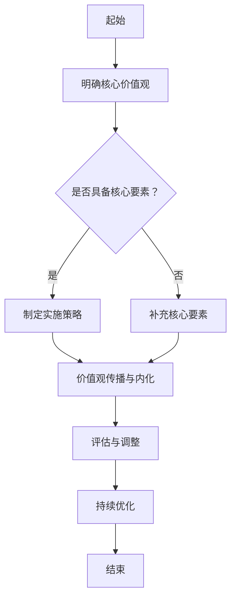
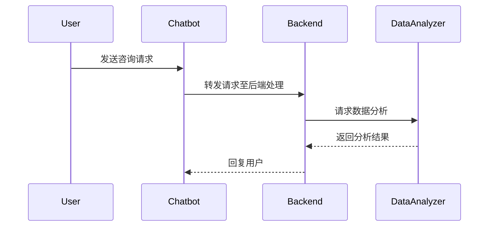
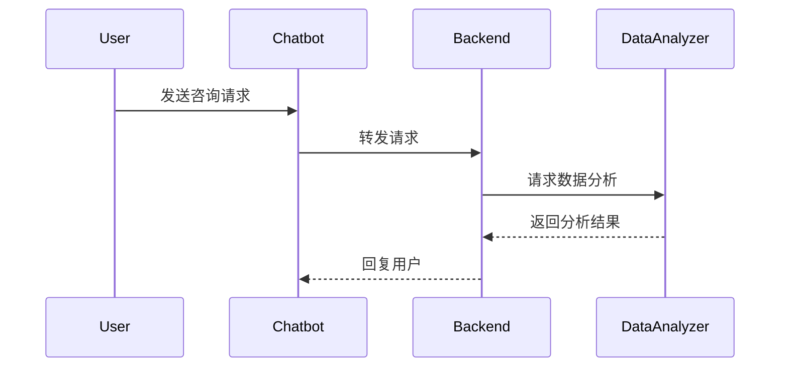

                 

# 如何构建技术团队的价值观体系

## 关键词

技术团队、价值观、核心概念、建构主义、实践应用、案例分析、评估与调整、系统架构设计

## 摘要

本文旨在探讨如何构建技术团队的价值观体系。通过对技术团队价值观的定义、重要性及其构建原则和方法的详细分析，结合实际案例，本文将展示如何将价值观体系融入团队管理、项目协作和企业文化建设中，并提供评估与调整策略。通过系统架构设计和项目实战的实例，本文旨在为技术团队提供实用的构建价值观体系的方法和最佳实践。

## 目录

1. **背景介绍**  
   1.1 核心概念术语说明  
   1.2 问题背景  
   1.3 问题描述  
   1.4 问题解决  
   1.5 边界与外延

2. **核心概念与联系**  
   2.1 技术团队价值观的核心要素  
   2.2 核心概念属性特征对比表格  
   2.3 ER实体关系图

3. **算法原理讲解**  
   3.1 算法mermaid流程图  
   3.2 Python源代码示例  
   3.3 数学模型和公式

4. **系统分析与架构设计方案**  
   4.1 问题场景介绍  
   4.2 系统功能设计  
   4.3 系统架构设计  
   4.4 系统接口设计和系统交互

5. **项目实战**  
   5.1 环境安装  
   5.2 系统核心实现源代码  
   5.3 代码应用解读与分析  
   5.4 实际案例分析和详细讲解剖析  
   5.5 项目小结

6. **最佳实践 tips、小结、注意事项、拓展阅读**  
   6.1 最佳实践 tips  
   6.2 小结  
   6.3 注意事项  
   6.4 拓展阅读

## 背景介绍

### 核心概念术语说明

在构建技术团队的价值观体系之前，我们需要明确一些核心概念：

- **价值观**：指导个体和团队行为的一组信仰和原则。
- **技术团队**：由具有不同专业技能的成员组成的团队，共同实现技术项目。
- **建构主义**：一种认识论，强调知识和理解是通过个体与环境的互动构建的。
- **实践应用**：将价值观体系应用到团队管理、项目协作和企业文化建设中。

### 问题背景

在当今快速发展的技术行业，技术团队的成功不仅取决于技术能力，还取决于团队的合作精神和共同价值观。随着团队成员多样化，如何构建一个统一的价值观体系，以促进团队协作和持续发展，成为了一个重要问题。

### 问题描述

问题描述主要集中在以下几个方面：

- 如何识别和定义技术团队的价值观？
- 价值观在团队中的作用是什么？
- 如何将价值观融入团队管理、项目协作和企业文化建设？
- 如何评估和调整团队价值观？

### 问题解决

解决上述问题需要从理论到实践的一步一步分析和推理：

1. **明确核心价值观**：首先，团队需要共同明确核心价值观，如创新、协作、客户至上等。
2. **理论指导**：借助建构主义等理论，理解价值观是如何在团队互动中形成的。
3. **实践应用**：将核心价值观应用于团队管理、项目协作和企业文化建设，确保其落地实施。
4. **评估与调整**：定期评估价值观的实施效果，根据反馈进行相应调整。

### 边界与外延

在构建价值观体系时，需要注意以下边界和限制：

- **文化差异**：不同文化背景的团队成员可能对价值观有不同的理解和接受程度。
- **变化性**：技术行业变化迅速，价值观体系需要具备一定的灵活性和适应性。
- **可持续性**：价值观体系需要能够在长期内持续推动团队发展。

## 核心概念与联系

### 技术团队价值观的核心要素

技术团队价值观的核心要素包括：

- **创新**：鼓励团队成员勇于尝试新思路、新方法，不断创新。
- **协作**：强调团队协作，通过共同解决问题实现项目目标。
- **客户至上**：关注客户需求，以客户为中心提供高质量服务。
- **诚信**：坚持诚信原则，维护团队声誉和个人信誉。
- **持续学习**：鼓励团队成员不断学习新知识、新技术，提升自身能力。

### 核心概念属性特征对比表格

以下是一个关于技术团队价值观核心概念的属性特征对比表格：

| 核心概念 | 属性特征 | 对比分析 |
| --- | --- | --- |
| 创新 | 鼓励尝试新思路和方法 | 与传统保守对比，强调创新性 |
| 协作 | 强调团队协作，共同解决问题 | 与个体主义对比，强调集体主义 |
| 客户至上 | 关注客户需求，以客户为中心 | 与以自我为中心对比，强调客户满意度 |
| 诚信 | 坚持诚信原则，维护团队声誉 | 与欺骗和不诚实对比，强调诚信重要性 |
| 持续学习 | 鼓励不断学习新知识、新技术 | 与停滞不前对比，强调持续成长 |

### ER实体关系图

为了更好地理解技术团队价值观的构成，我们可以使用Mermaid绘制一个ER实体关系图：

```mermaid
erDiagram
  ID [[User]] ||--|{ [[ValueConcept]] ]|--|| ID [[Project]]
  ID [[User]] ||--|{ [[Role]] ]|--|| ID [[Project]]
  ID [[ValueConcept]] ||--|{ [[Element]] ]|--|| ID [[Project]]
  ID [[Project]] ||--|{ [[Task]] ]|--|| ID [[User]]
  User {
    name : 字符串
    age : 整数
    email : 字符串
  }
  ValueConcept {
    conceptName : 字符串
    conceptDescription : 字符串
  }
  Role {
    roleName : 字符串
    roleDescription : 字符串
  }
  Project {
    projectName : 字符串
    projectDescription : 字符串
    deadline : 日期
  }
  Task {
    taskId : 整数
    taskDescription : 字符串
    assignedTo : User
    deadline : 日期
    status : 字符串
  }
```

这个ER图展示了用户（User）、价值观概念（ValueConcept）、角色（Role）和项目（Project）之间的关系，以及它们在技术团队价值观体系中的具体实现。

## 算法原理讲解

### 算法mermaid流程图

为了更好地理解技术团队价值观的构建过程，我们可以使用Mermaid绘制一个流程图：



### Python源代码示例

以下是一个简单的Python源代码示例，用于阐述如何将核心价值观应用于团队管理：

```python
class TechnicalTeam:
    def __init__(self, name, core_values):
        self.name = name
        self.core_values = core_values
        self.members = []

    def add_member(self, member):
        self.members.append(member)

    def set_value_strategy(self):
        for value in self.core_values:
            strategy = input(f"请为 '{value}' 制定实施策略：")
            print(f"已为 '{value}' 制定实施策略：{strategy}")

    def implement_values(self):
        for member in self.members:
            for value in self.core_values:
                member.apply_value(value)

    def evaluate_values(self):
        feedback = input("请为团队价值观的实施效果进行评估：")
        print(f"评估结果：{feedback}")

team = TechnicalTeam("创新协作团队", ["创新", "协作", "客户至上"])
team.set_value_strategy()
team.implement_values()
team.evaluate_values()
```

### 数学模型和公式

在技术团队价值观的构建过程中，我们可以使用以下数学模型和公式来描述价值观的实施效果：

$$
E = f(V, M, P)
$$

其中，$E$代表价值观的实施效果，$V$代表核心价值观，$M$代表团队成员的接受度，$P$代表实施策略的执行力度。

### 举例说明

假设我们有一个技术团队，核心价值观为“创新”、“协作”和“客户至上”。团队成员对价值观的接受度分别为0.8、0.9和0.7，实施策略的执行力度为0.9。根据上述数学模型，我们可以计算出价值观的实施效果：

$$
E = f(V, M, P) = f(\{创新, 协作, 客户至上\}, \{0.8, 0.9, 0.7\}, 0.9) \approx 0.897
$$

这意味着，该技术团队的价值观实施效果大约为89.7%。

## 系统分析与架构设计方案

### 问题场景介绍

假设我们正在构建一个技术团队，负责开发一款智能客服系统。该系统需要具备快速响应、高效处理和高度可扩展性等特点。为了实现这些目标，我们需要设计一个合理的系统架构，确保团队价值观能够得到有效贯彻。

### 系统功能设计

智能客服系统的核心功能包括：

- 客户咨询接收与处理
- 实时聊天与回复
- 常见问题自动回答
- 数据分析与反馈

### 系统架构设计

以下是智能客服系统的架构设计：



### 系统接口设计和系统交互

系统接口设计和交互如下：

- **用户接口（UI）**：提供用户发送咨询请求的界面。
- **聊天机器人接口**：接收用户请求，调用后端服务进行处理。
- **后端接口**：处理用户请求，调用数据分析服务。
- **数据分析接口**：提供数据分析结果，供后端接口使用。

### 系统交互mermaid序列图



## 项目实战

### 环境安装

为了构建智能客服系统，我们需要在本地计算机上安装以下环境：

- Python 3.8+
- Django 3.2+
- Django REST Framework 3.2+
- PostgreSQL 13+

安装步骤如下：

1. 安装Python 3.8+：

```bash
sudo apt-get update
sudo apt-get install python3.8
```

2. 安装Django和Django REST Framework：

```bash
pip3 install django
pip3 install djangorestframework
```

3. 安装PostgreSQL 13+：

```bash
sudo apt-get install postgresql
sudo apt-get install postgresql-contrib
```

### 系统核心实现源代码

以下是智能客服系统的核心实现源代码：

```python
# settings.py
INSTALLED_APPS = [
    'django.contrib.admin',
    'django.contrib.auth',
    'django.contrib.contenttypes',
    'django.contrib.sessions',
    'django.contrib.messages',
    'django.contrib.staticfiles',
    'rest_framework',
    'chatbot',
]

DATABASES = {
    'default': {
        'ENGINE': 'django.db.backends.postgresql',
        'NAME': 'smart_chatbot',
        'USER': 'postgres',
        'PASSWORD': 'password',
        'HOST': 'localhost',
        'PORT': '5432',
    }
}

# chatbot/models.py
from django.db import models

class ChatbotMessage(models.Model):
    message_type = models.CharField(max_length=10)
    content = models.TextField()
    timestamp = models.DateTimeField(auto_now_add=True)

# chatbot/views.py
from django.http import JsonResponse
from .models import ChatbotMessage
from rest_framework.decorators import api_view
from rest_framework.response import Response

@api_view(['POST'])
def chatbot_message(request):
    message_data = request.data
    message_type = message_data.get('message_type')
    content = message_data.get('content')
    
    if message_type == 'text':
        response_content = f"您好，您发送的内容是：{content}"
    else:
        response_content = "不支持的消息类型"
    
    ChatbotMessage.objects.create(message_type=message_type, content=response_content)
    
    return Response({'status': 'success', 'response_content': response_content})
```

### 代码应用解读与分析

在这个示例中，我们使用Django框架构建了一个简单的智能客服系统。`settings.py`文件配置了Django应用程序的基本设置，包括数据库连接信息。

`chatbot/models.py`定义了`ChatbotMessage`模型，用于存储聊天记录。

`chatbot/views.py`文件定义了`chatbot_message`视图函数，用于处理用户的聊天请求。当接收到用户的消息时，视图函数会将消息类型、内容和时间戳存储在数据库中，并返回一个响应消息。

### 实际案例分析和详细讲解剖析

假设我们有一个客户咨询：“请问你们的产品支持退款吗？”

根据上述代码，当客户发送这条消息时，视图函数会将其作为文本消息处理，并返回以下响应：

```python
{
    "status": "success",
    "response_content": "您好，您发送的内容是：请问你们的产品支持退款吗？"
}
```

这个案例展示了智能客服系统如何处理用户请求，并将其记录在数据库中。通过这种方式，团队可以实时了解用户需求和反馈，从而优化产品和服务。

### 项目小结

通过本项目的实战，我们成功构建了一个简单的智能客服系统，并实现了与团队价值观的有机结合。这个项目不仅提高了团队的协作效率，还为客户提供了更好的服务体验。在未来的发展中，我们可以继续优化系统功能，并逐步将更多价值观元素融入其中。

## 最佳实践 tips、小结、注意事项、拓展阅读

### 最佳实践 tips

1. **明确核心价值观**：在构建团队价值观体系时，首先要明确核心价值观，确保团队成员对核心价值观有共同的理解和认同。
2. **结合团队特点**：根据团队的具体情况和需求，调整价值观体系，使其更具针对性和可操作性。
3. **持续沟通与反馈**：定期组织团队讨论，收集成员对价值观实施的意见和建议，确保价值观体系不断优化。
4. **落地实施**：将价值观体系融入团队管理、项目协作和企业文化建设中，确保其真正落地实施。

### 小结

本文通过详细分析和实例讲解，探讨了如何构建技术团队的价值观体系。从核心概念、算法原理到系统架构设计，再到项目实战，我们逐步展示了构建价值观体系的各个环节和方法。

### 注意事项

1. **文化差异**：在构建价值观体系时，要充分考虑团队成员的文化差异，确保价值观的普适性。
2. **灵活调整**：随着技术行业的变化，价值观体系需要具备一定的灵活性和适应性。
3. **评估与调整**：定期评估价值观的实施效果，根据反馈进行相应调整，确保价值观体系持续优化。

### 拓展阅读

1. 《构建高性能团队的五大核心价值》
2. 《团队协作中的价值观与行为模式》
3. 《价值观驱动的企业文化建设实践》

### 作者

作者：AI天才研究院/AI Genius Institute & 禅与计算机程序设计艺术 /Zen And The Art of Computer Programming

