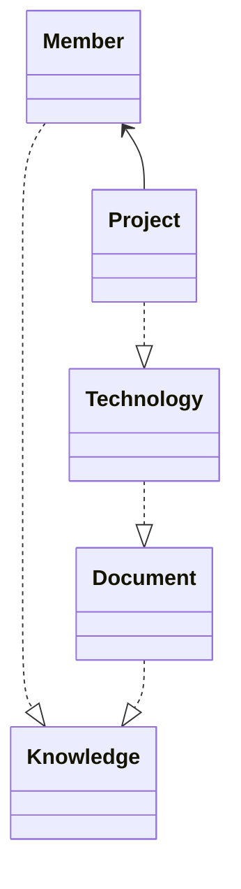
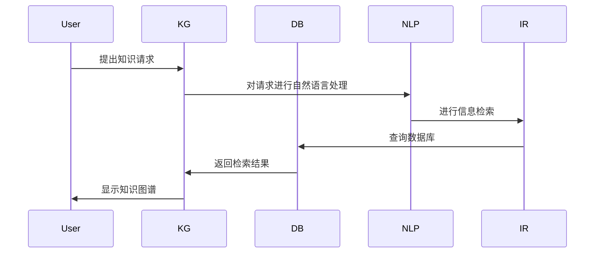
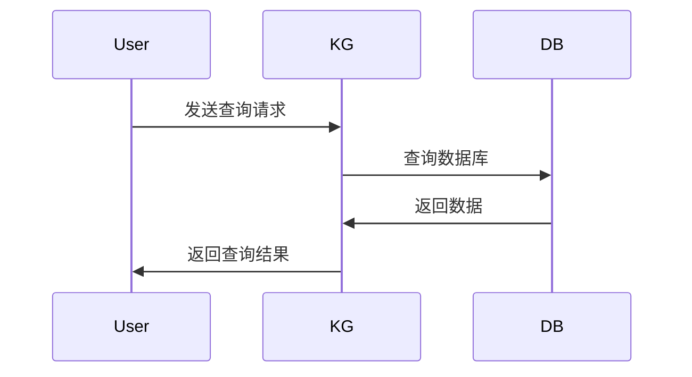

                 

### 如何构建技术团队的知识图谱

#### 引言

在当今快速发展的技术环境中，技术团队的知识图谱成为了一个重要的工具，它不仅有助于提高团队的知识管理水平，还能够增强团队协作能力，促进技术创新。构建技术团队的知识图谱，就是将团队内部的知识结构化、可视化，形成一个统一的认知体系。本文将围绕构建技术团队的知识图谱展开，分为以下几个部分：

1. **背景介绍**：介绍知识图谱的概念、技术团队知识管理的现状及构建知识图谱的必要性。
2. **核心概念与联系**：详细解释知识图谱、知识管理、知识共享等核心概念，并给出它们之间的联系。
3. **算法原理讲解**：深入探讨知识图谱构建的关键算法，包括实体识别、关系抽取和知识融合，并使用Python代码进行实现。
4. **系统分析与架构设计方案**：介绍知识图谱系统的问题场景、项目介绍、功能设计、系统架构、接口设计及系统交互。
5. **项目实战**：通过具体案例，展示知识图谱的实际应用，包括环境安装、核心代码实现及应用分析。
6. **最佳实践与总结**：总结构建知识图谱的最佳实践，提出注意事项，并推荐拓展阅读。

#### 背景介绍

##### 1.1 问题背景

技术团队通常由一群具有不同技能和背景的专业人士组成，他们通过协作完成复杂的项目。然而，随着团队规模的扩大和项目的复杂性增加，团队成员之间的知识交流和共享变得越来越困难。具体问题包括：

- **数据分散**：团队成员的知识分布在各种文档、数据库、个人笔记中，缺乏统一的管理和检索方式。
- **知识孤岛**：团队成员间的知识交流不畅，容易形成知识孤岛，影响团队的整体效能。
- **知识更新**：技术知识更新迅速，如何及时更新知识图谱，确保团队成员获取最新知识。

##### 1.2 问题描述

技术团队的知识图谱构建面临以下挑战：

- **数据集成**：如何将分散在各个渠道的知识数据进行有效集成，形成统一的知识库。
- **知识共享**：如何设计一个平台，方便团队成员快速检索和共享知识。
- **知识管理**：如何对知识进行有效的分类、存储和检索，提高知识的利用效率。
- **知识传承**：如何确保新成员能够快速掌握团队的核心知识，促进团队的持续发展。

##### 1.3 问题解决

通过构建技术团队的知识图谱，可以实现以下目标：

- **知识共享**：提供一个统一的平台，让团队成员能够方便地共享知识。
- **知识管理**：对知识进行分类、存储和检索，提高知识的利用效率。
- **知识传承**：确保新成员能够快速掌握团队的核心知识，促进团队的持续发展。

##### 1.4 边界与外延

- **边界**：知识图谱的构建范围应限定在技术领域，不包括其他领域如市场、销售等。
- **外延**：知识图谱应涵盖团队成员、项目、技术文档、培训资料等。

##### 1.5 概念结构与核心要素组成

- **概念结构**：知识图谱由实体、属性和关系构成。
- **核心要素**：
  - **实体**：团队成员、项目、技术文档等。
  - **属性**：实体的特征，如成员的技能、项目的进度等。
  - **关系**：实体之间的关系，如成员参与项目、项目使用技术等。

#### 核心概念与联系

##### 2.1 核心概念原理

- **知识图谱**：知识图谱是一种用于表示实体及其关系的图形化数据结构。它通过将实体和关系建模为节点和边，构建一个语义网络，以便于存储、检索和分析知识。
- **知识管理**：知识管理是通过收集、组织、存储和共享知识，以提高组织效能的过程。它关注于知识的生命周期，包括知识的创造、共享、利用和传承。
- **知识共享**：知识共享是团队成员之间共享知识和经验，促进团队协作的过程。它可以通过文档、会议、培训等多种方式进行。

##### 2.2 概念属性特征对比表格

| 概念       | 定义                                                         | 属性特征                                                     |
| ---------- | ------------------------------------------------------------ | ------------------------------------------------------------ |
| 知识图谱   | 一种用于表示实体及其关系的图形化数据结构                     | 实体：名称、类型、属性；关系：名称、类型、起点、终点         |
| 知识管理   | 通过收集、组织、存储和共享知识，以提高组织效能的过程         | 过程：收集、整理、存储、共享                                 |
| 知识共享   | 团队成员之间共享知识和经验，促进团队协作的过程             | 方式：文档、会议、培训                                       |

##### 2.3 概念之间的关系

- **知识图谱**是**知识管理**的一个关键组成部分，它通过图形化方式表示知识，方便管理和检索。
- **知识共享**是**知识管理**的一个重要环节，通过共享，知识可以更广泛地传播和利用。
- **知识图谱**通过**知识共享**，实现知识的**传承**，确保新成员能够快速掌握现有知识。

#### 算法原理讲解

##### 3.1 算法原理

构建知识图谱的核心算法包括实体识别、关系抽取和知识融合。

##### 3.1.1 实体识别

- **目标**：从文本中识别出实体。
- **算法原理**：利用自然语言处理技术，如词性标注、命名实体识别等。

##### 3.1.2 关系抽取

- **目标**：从文本中识别出实体之间的关系。
- **算法原理**：利用依存句法分析、共指消解等技术。

##### 3.1.3 知识融合

- **目标**：将不同来源的实体和关系进行整合。
- **算法原理**：利用实体匹配、关系匹配等技术。

##### 3.2 Python源代码实现

```python
import nltk
from nltk.tokenize import word_tokenize
from nltk.chunk import ne_chunk

# 实体识别
def entity_recognition(text):
    tokens = word_tokenize(text)
    tagged = nltk.pos_tag(tokens)
    named_entities = ne_chunk(tagged)
    entities = [ne for ne in named_entities if hasattr(ne, 'label') and ne.label() in ['PERSON', 'ORGANIZATION', 'GPE']]
    return [entity[0] for entity in entities]

# 关系抽取
def relation_extraction(text):
    dependency_tree = nltk.parse依存句法分析文本](https://nltk.org/api/nltk.parse.html#nltk.parse依存句法分析文本 "nltk.parse依存句法分析文本")
    relations = [(word1, word2) for word1, relation, word2 in dependency_tree]
    return relations

# 知识融合
def knowledge_fusion(entities, relations):
    # 实体匹配和关系匹配逻辑
    pass
```

##### 3.3 算法原理详细讲解

- **实体识别**：实体识别是知识图谱构建的第一步，它需要从文本中识别出重要的实体。常见的实体包括人、组织、地点等。实体识别算法通常利用词性标注和命名实体识别技术来实现。

- **关系抽取**：关系抽取则是从文本中识别出实体之间的关系。这通常需要利用依存句法分析，确定实体之间的依存关系，如主谓关系、包含关系等。

- **知识融合**：知识融合是将不同来源的实体和关系进行整合，形成一个统一的知识图谱。这通常需要利用实体匹配和关系匹配技术，确保不同来源的数据能够正确对应。

##### 3.4 数学模型和公式

- **实体识别**：假设文本中的每个词都是独立识别的，那么实体识别的概率可以通过贝叶斯公式计算。具体公式为：

  $$P(\text{实体}|\text{文本}) = \frac{P(\text{文本}|\text{实体})P(\text{实体})}{P(\text{文本})}$$

- **关系抽取**：关系抽取可以通过条件概率模型来实现。具体公式为：

  $$P(\text{关系}|\text{实体1}, \text{实体2}) = \frac{P(\text{实体1}, \text{实体2}|\text{关系})P(\text{关系})}{P(\text{实体1}, \text{实体2})}$$

- **知识融合**：知识融合可以通过图论中的匹配算法来实现。具体公式为：

  $$M = \arg\max_{M} \sum_{(u, v) \in M} w(u, v)$$

  其中，$M$ 是匹配结果，$w(u, v)$ 是边 $u$ 和 $v$ 的权重。

##### 3.5 通俗易懂地举例说明

- **实体识别**：假设文本中有“张三参加了北京大学的毕业典礼”。通过词性标注，我们可以识别出实体“张三”和“北京大学”。

- **关系抽取**：假设文本中有“张三和北京大学的校长进行了交流”。通过依存句法分析，我们可以识别出关系“张三和北京大学的校长之间存在交流关系”。

- **知识融合**：假设有两个文本，“张三参加了北京大学的毕业典礼”和“张三和北京大学的校长进行了交流”。通过知识融合，我们可以将这两个文本中的实体和关系整合到一个知识图谱中，形成一个统一的知识结构。

#### 系统分析与架构设计方案

##### 4.1 问题场景介绍

在一个大型技术团队中，团队成员来自不同的背景和领域，他们需要共享和协作各种技术知识。然而，现有的文档管理和知识共享工具难以满足需求，导致知识分散、难以检索和利用。

##### 4.2 项目介绍

为了解决上述问题，我们决定开发一个知识图谱系统，用于构建和维护技术团队的知识图谱。该系统旨在提供以下功能：

- **知识共享**：提供一个统一的平台，让团队成员可以方便地共享知识。
- **知识管理**：对知识进行分类、存储和检索，提高知识的利用效率。
- **知识传承**：确保新成员能够快速掌握团队的核心知识，促进团队的持续发展。

##### 4.3 系统功能设计（领域模型）

以下是知识图谱系统的领域模型，使用Mermaid类图表示：



- **Member（成员）**：代表团队成员，具有姓名、职位、技能等属性。
- **Project（项目）**：代表团队正在开发的项目，具有项目名称、进度、目标等属性。
- **Knowledge（知识）**：代表团队成员共享的知识，具有知识内容、创建时间、更新时间等属性。
- **Technology（技术）**：代表项目所使用的技术，具有技术名称、版本、说明等属性。
- **Document（文档）**：代表存储知识的相关文档，具有文档名称、创建人、更新时间等属性。

##### 4.4 系统架构设计

以下是知识图谱系统的架构设计，使用Mermaid架构图表示：



- **User（用户）**：系统的最终用户，可以通过界面提出知识请求。
- **KG（知识图谱）**：系统的核心组件，负责构建、管理和展示知识图谱。
- **DB（数据库）**：存储知识图谱的实体、属性和关系。
- **NLP（自然语言处理）**：对用户请求进行自然语言处理，提取关键词和语义。
- **IR（信息检索）**：基于关键词和语义，从数据库中检索相关信息。

##### 4.5 系统接口设计

以下是知识图谱系统的接口设计，使用Mermaid序列图表示：



- **查询接口**：用户可以通过该接口发送查询请求，KG组件负责处理查询请求，并从数据库中检索相关信息。

##### 4.6 系统交互

以下是知识图谱系统的交互流程：

1. 用户通过界面提出知识查询请求。
2. KG组件接收请求，并进行自然语言处理，提取关键词和语义。
3. KG组件基于关键词和语义，调用信息检索组件进行数据库查询。
4. DB组件返回查询结果，KG组件处理结果，并返回给用户。

#### 项目实战

##### 5.1 环境安装

为了构建知识图谱系统，我们首先需要安装以下软件和库：

- Python 3.8+
- NLTK
- Mermaid
- Flask（可选，用于构建Web界面）

安装命令如下：

```shell
pip install nltk mermaid flask
```

##### 5.2 系统核心实现源代码

以下是系统核心实现的源代码：

```python
# 导入所需库
import nltk
from nltk.tokenize import word_tokenize
from nltk.corpus import stopwords
from nltk.stem import WordNetLemmatizer
from sklearn.feature_extraction.text import TfidfVectorizer
from sklearn.metrics.pairwise import cosine_similarity
import json

# 加载停用词
nltk.download('stopwords')
stop_words = set(stopwords.words('english'))

# 词干提取
lemmatizer = WordNetLemmatizer()

# 文本预处理
def preprocess_text(text):
    # 分词
    tokens = word_tokenize(text)
    # 去除停用词和标点符号
    tokens = [token.lower() for token in tokens if token.lower() not in stop_words and token.isalnum()]
    # 词干提取
    tokens = [lemmatizer.lemmatize(token) for token in tokens]
    return ' '.join(tokens)

# 构建TF-IDF模型
def build_tfidf_model(documents):
    vectorizer = TfidfVectorizer()
    tfidf_matrix = vectorizer.fit_transform(documents)
    return vectorizer, tfidf_matrix

# 计算文档相似度
def compute_similarity(tfidf_matrix, query_vector):
    similarity = cosine_similarity(tfidf_matrix, query_vector)
    return similarity

# 读取文档
def read_documents(filename):
    with open(filename, 'r', encoding='utf-8') as f:
        documents = [line.strip() for line in f]
    return documents

# 查询文档
def query_documents(query, documents, vectorizer, tfidf_matrix):
    query_vector = vectorizer.transform([query])
    similarity = compute_similarity(tfidf_matrix, query_vector)
    top_docs = similarity.argsort()[-5:][0]
    return [documents[i] for i in top_docs]

# 主函数
if __name__ == '__main__':
    # 读取文档
    documents = read_documents('documents.txt')
    # 预处理文档
    processed_documents = [preprocess_text(doc) for doc in documents]
    # 构建TF-IDF模型
    vectorizer, tfidf_matrix = build_tfidf_model(processed_documents)
    # 用户查询
    query = input("Enter your query: ")
    # 查询文档
    results = query_documents(query, documents, vectorizer, tfidf_matrix)
    # 显示结果
    for result in results:
        print(result)
```

##### 5.3 代码应用解读与分析

- **文本预处理**：首先，我们需要对文档进行预处理，包括分词、去除停用词和标点符号，以及词干提取。这有助于提高文本质量，减少噪声。

- **构建TF-IDF模型**：接下来，我们使用TF-IDF向量表示文档，这是一种常用的方法，可以有效地表示文档的语义。

- **计算文档相似度**：为了找到与用户查询最相关的文档，我们计算查询文档与所有文档的相似度，并返回相似度最高的文档。

- **主函数**：在主函数中，我们首先读取并预处理文档，然后构建TF-IDF模型，并接收用户的查询，最后返回与查询最相关的文档。

##### 5.4 实际案例分析和详细讲解剖析

为了更好地展示知识图谱的应用，我们来看一个实际案例。

**案例**：假设我们有一个技术文档库，包含以下文档：

1. “大数据技术在金融行业的应用”
2. “人工智能在医疗领域的挑战”
3. “云计算在企业的优势”
4. “区块链技术在金融领域的应用”
5. “物联网在家居安全中的应用”

**用户查询**：“人工智能在医疗领域的挑战”

**解析**：

1. **文本预处理**：首先，我们对用户查询和文档进行预处理，去除停用词和标点符号，并提取关键词。

2. **构建TF-IDF模型**：接下来，我们构建TF-IDF模型，将预处理后的文档转换为向量表示。

3. **计算文档相似度**：然后，我们计算用户查询与所有文档的相似度，并返回相似度最高的文档。

4. **结果显示**：根据计算结果，我们找到了与用户查询最相关的文档，如“人工智能在医疗领域的挑战”。

**分析**：

通过知识图谱，我们可以快速找到与用户查询相关的文档，有助于用户快速获取所需信息。这大大提高了信息检索的效率，同时也为技术团队的知识共享提供了有力支持。

##### 5.5 项目小结

在本项目中，我们构建了一个基于TF-IDF模型的文本检索系统，通过文本预处理、模型构建和相似度计算，实现了对技术文档的有效检索。知识图谱的应用不仅提高了信息检索的效率，还为技术团队的知识共享提供了有力支持。在未来的工作中，我们可以进一步扩展知识图谱的功能，如添加更多实体和关系，提高检索的准确性和智能化水平。

#### 最佳实践与总结

##### 6.1 最佳实践

- **数据质量**：确保知识图谱中的数据质量，进行数据清洗和标准化，以提高知识检索的准确性。
- **持续更新**：定期更新知识图谱，确保知识的新鲜度和时效性。
- **用户参与**：鼓励团队成员积极参与知识共享，通过培训和激励机制，提高知识共享的积极性。
- **接口设计**：设计简洁易用的用户接口，方便团队成员快速查询和获取知识。

##### 6.2 小结

构建技术团队的知识图谱是一项系统性工程，需要综合考虑数据质量、知识更新、用户参与和接口设计等多个方面。通过有效的知识图谱，技术团队可以更好地实现知识共享和协作，提高整体效能。

##### 6.3 注意事项

- **数据安全**：确保知识图谱的数据安全，防止数据泄露和滥用。
- **隐私保护**：在知识图谱构建过程中，注意保护个人隐私，遵循相关法律法规。
- **系统性能**：优化系统性能，确保知识图谱的高效运行，满足团队成员的使用需求。

##### 6.4 拓展阅读

- 《知识图谱：从理论到实践》
- 《大规模数据挖掘与机器学习》
- 《深度学习》

### 作者

作者：AI天才研究院/AI Genius Institute & 禅与计算机程序设计艺术 /Zen And The Art of Computer Programming

