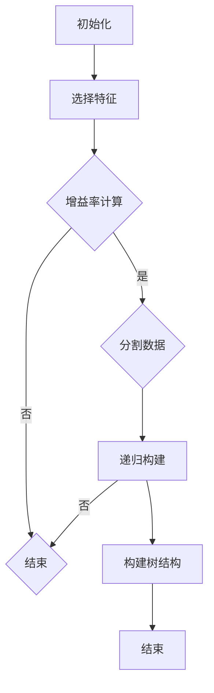
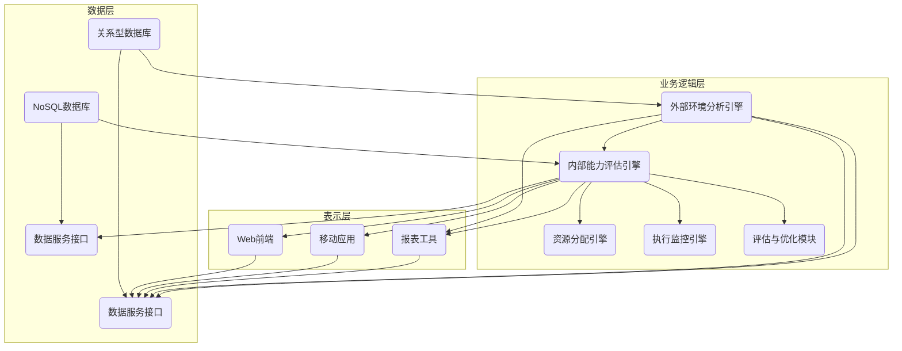

                 

# 如何进行技术战略规划

> 关键词：技术战略规划、外部环境分析、内部能力评估、资源分配、执行监控、评估与优化

> 摘要：本文将详细探讨技术战略规划的重要性，分析其核心概念和组成要素，并逐步介绍如何进行有效的技术战略规划。通过本文的阅读，读者将能够理解技术战略规划的基本原理，掌握制定和实施技术战略规划的方法，从而为企业在技术领域的发展提供有力的指导。

## 1.1 问题背景、问题描述、问题解决、边界与外延、概念结构与核心要素组成

### 1.1.1 问题背景

在当今快速变化的技术环境中，企业如何制定和实施有效的技术战略规划成为了一项重要而具挑战性的任务。技术战略规划不仅是企业长期发展的重要组成部分，也是企业在激烈的市场竞争中保持竞争优势的关键。

技术战略规划涉及多个方面，包括外部环境分析、内部能力评估、战略目标设定、资源分配、执行监控、评估与优化等。这些环节相互关联，形成一个完整的技术战略规划体系。然而，如何在复杂的现实环境中将这一体系有效实施，仍是一个亟待解决的问题。

### 1.1.2 问题描述

《如何进行技术战略规划》这本书旨在为企业提供一套系统、全面、实用的技术战略规划方法和工具，帮助企业在复杂多变的市场环境中做出正确的决策，实现技术创新和业务增长。然而，如何将这一目标具体落实到书籍的目录结构中，确保内容的逻辑性和完整性，是一个需要深思熟虑的问题。

### 1.1.3 问题解决

为了确保书籍内容的逻辑性和完整性，我们需要按照以下步骤来构建目录大纲：

1. **明确书籍的核心主题**：确定书籍的核心主题为技术战略规划，包括战略制定的背景、原则、过程、工具和方法等。
2. **划分章节主题**：根据书籍的核心主题，将内容划分为若干个章节，每个章节围绕一个主要话题展开。
3. **细化章节内容**：在每个章节中，进一步细分为小节，确保每个小节都有明确的主题和内容。
4. **设计章节之间的联系**：确保章节之间有逻辑上的关联，形成统一的整体。
5. **确保内容的实用性和可操作性**：每个章节和小节都应包含具体的工具、方法和案例分析，以提高书籍的实用性。
6. **注重可读性和易理解性**：确保书籍内容易于理解，避免过于复杂或冗长的叙述。

### 1.1.4 边界与外延

- **边界**：本书主要关注企业技术战略规划的实践和方法，不包括其他管理领域的内容，如市场营销、人力资源等。
- **外延**：虽然本书专注于技术战略规划，但也会涉及一些与战略规划相关的跨领域知识，如市场分析、竞争分析等。

### 1.1.5 概念结构与核心要素组成

- **概念结构**：技术战略规划包括战略目标设定、资源分配、执行监控、评估与优化等核心环节。
- **核心要素组成**：
  - 战略目标：明确企业长期和短期的发展目标。
  - 资源分配：合理分配企业资源，确保战略目标的实现。
  - 执行监控：跟踪战略执行情况，及时调整策略。
  - 评估与优化：对战略执行效果进行评估，持续优化战略规划。

## 1.2 核心概念与联系

### 1.2.1 核心概念

#### 技术战略规划

技术战略规划是企业根据外部环境和内部能力，制定和实施的技术发展计划。它涉及多个方面，包括技术发展趋势、市场动态、企业资源等，旨在确保企业在技术领域的持续竞争力。

#### 外部环境分析

外部环境分析是对市场、技术趋势、竞争态势等进行全面分析，以了解外部环境的变化。通过外部环境分析，企业可以识别出潜在的机会和威胁，为技术战略规划提供依据。

#### 内部能力评估

内部能力评估是评估企业的技术能力、研发能力、团队素质等，以确定企业能够承担的技术战略任务。内部能力评估有助于企业了解自身优势与劣势，为资源分配提供指导。

#### 战略目标设定

战略目标设定是明确企业短期和长期的发展目标。这些目标应具有可衡量性、可实现性和挑战性，以激励企业不断进步。

#### 资源分配

资源分配是根据战略目标，合理分配企业资源，确保战略目标的实现。资源分配包括人力、财力、物力等，是技术战略规划的关键环节。

#### 执行监控

执行监控是跟踪战略执行情况，及时调整策略。通过执行监控，企业可以及时发现问题和调整计划，确保战略目标的实现。

#### 评估与优化

评估与优化是对战略实施效果进行评估，持续优化战略规划。评估与优化有助于企业了解战略执行情况，找出不足之处，并制定改进措施。

### 1.2.2 概念属性特征对比表格

| 概念名称 | 属性特征 | 对比关系 |
| --- | --- | --- |
| 技术战略规划 | 制定和实施的技术发展计划 | 包括外部环境分析和内部能力评估 |
| 外部环境分析 | 分析市场、技术趋势、竞争态势等 | 提供战略决策的基础信息 |
| 内部能力评估 | 评估企业的技术能力、研发能力、团队素质等 | 确定企业能够承担的技术战略任务 |
| 战略目标设定 | 明确企业短期和长期的发展目标 | 指导资源分配和执行监控 |
| 资源分配 | 分配人力、财力、物力等资源 | 确保战略目标的实现 |
| 执行监控 | 监控战略执行过程 | 及时调整策略 |
| 评估与优化 | 对战略实施效果进行评估 | 持续优化战略规划 |

### 1.2.3 ER实体关系图架构

```mermaid
erDiagram
    Customer ||--|{ Order }|-- Designer
    "Customer" && "Designer" : knows
    Customer ||--|{ Product }|-- Supplier
    "Customer" && "Supplier" : orders
```

在ER实体关系图中，"Customer"（客户）与"Designer"（设计师）之间有"knows"（了解）的关系，表示客户了解设计师。同时，"Customer"与"Supplier"（供应商）之间有"orders"（订购）的关系，表示客户可以订购供应商的产品。

## 1.3 技术战略规划的过程

### 1.3.1 外部环境分析

外部环境分析是技术战略规划的基础。通过对外部环境的全面分析，企业可以了解市场趋势、技术动态、竞争态势等，为技术战略规划提供依据。

#### 分析市场趋势

市场趋势分析包括市场规模、增长率、市场份额等。通过分析市场趋势，企业可以确定市场发展的方向和速度，为技术战略规划提供指导。

#### 分析技术动态

技术动态分析包括新技术的发展、技术的应用领域、技术标准等。通过分析技术动态，企业可以了解技术发展的趋势和方向，为技术战略规划提供参考。

#### 分析竞争态势

竞争态势分析包括竞争对手的战略、产品优势、市场地位等。通过分析竞争态势，企业可以了解自身的市场地位和竞争优势，为技术战略规划提供依据。

### 1.3.2 内部能力评估

内部能力评估是了解企业自身的技术能力、研发能力、团队素质等，以确定企业能够承担的技术战略任务。

#### 评估技术能力

技术能力评估包括企业的技术储备、技术水平、技术团队等。通过评估技术能力，企业可以了解自身在技术领域的实力，为技术战略规划提供依据。

#### 评估研发能力

研发能力评估包括企业的研发投入、研发成果、研发团队等。通过评估研发能力，企业可以了解自身在研发领域的实力，为技术战略规划提供指导。

#### 评估团队素质

团队素质评估包括团队成员的技能水平、经验、沟通能力等。通过评估团队素质，企业可以了解团队成员的能力和潜力，为技术战略规划提供支持。

### 1.3.3 战略目标设定

战略目标设定是明确企业短期和长期的发展目标。这些目标应具有可衡量性、可实现性和挑战性，以激励企业不断进步。

#### 设定短期目标

短期目标通常包括年度目标、季度目标等，如提高市场份额、增加销售收入等。通过设定短期目标，企业可以明确近期的发展方向和重点。

#### 设定长期目标

长期目标通常包括三年、五年等，如成为行业领导者、实现技术突破等。通过设定长期目标，企业可以明确长期的发展愿景和战略方向。

### 1.3.4 资源分配

资源分配是根据战略目标，合理分配企业资源，确保战略目标的实现。

#### 分配人力资源

人力资源分配包括确定各部门的人员编制、技能需求等。通过合理分配人力资源，企业可以确保各部门的工作效率和质量。

#### 分配财力资源

财力资源分配包括预算分配、资金投入等。通过合理分配财力资源，企业可以确保技术战略规划的实施和项目的顺利进行。

#### 分配物力资源

物力资源分配包括设备购置、设施建设等。通过合理分配物力资源，企业可以确保技术战略规划所需的基础设施和条件。

### 1.3.5 执行监控

执行监控是跟踪战略执行情况，及时调整策略。通过执行监控，企业可以及时发现问题和调整计划，确保战略目标的实现。

#### 监控执行过程

执行过程监控包括项目进度、质量、成本等。通过监控执行过程，企业可以及时发现问题和调整计划，确保项目顺利推进。

#### 监控执行效果

执行效果监控包括项目成果、业务指标等。通过监控执行效果，企业可以评估战略目标的实现情况，为后续的战略调整提供依据。

### 1.3.6 评估与优化

评估与优化是对战略实施效果进行评估，持续优化战略规划。评估与优化有助于企业了解战略执行情况，找出不足之处，并制定改进措施。

#### 评估实施效果

实施效果评估包括项目成果、业务指标等。通过评估实施效果，企业可以了解战略目标的实现情况，为后续的战略调整提供依据。

#### 优化战略规划

战略规划优化包括调整目标、优化资源分配、改进执行策略等。通过优化战略规划，企业可以不断提高战略实施效果，实现长期发展目标。

## 1.4 技术战略规划的关键要素

### 1.4.1 战略目标

战略目标是企业发展的方向和指南。制定明确的战略目标有助于企业集中资源，优化资源配置，提高执行力。以下是制定战略目标的几个关键步骤：

1. **确定长期目标**：长期目标通常是指3-5年的发展目标，如市场份额、技术创新等。
2. **设定短期目标**：短期目标通常是指年度目标，如销售收入、成本降低等。
3. **确保目标的可衡量性、可实现性和挑战性**：目标应具有明确的衡量指标，易于实现，同时具有一定的挑战性。

### 1.4.2 资源分配

资源分配是确保战略目标实现的重要环节。以下是资源分配的几个关键步骤：

1. **评估资源需求**：根据战略目标和项目计划，评估企业所需的资源，包括人力、财力、物力等。
2. **优化资源配置**：根据资源需求，合理分配资源，确保关键项目的优先级和资源充足性。
3. **动态调整资源**：在执行过程中，根据实际情况动态调整资源，确保资源的充分利用和高效利用。

### 1.4.3 执行监控

执行监控是确保战略目标实现的必要手段。以下是执行监控的几个关键步骤：

1. **制定监控指标**：根据战略目标和项目计划，制定可量化的监控指标，如项目进度、质量、成本等。
2. **建立监控体系**：建立有效的监控体系，确保监控指标的实时跟踪和反馈。
3. **及时调整策略**：根据监控结果，及时发现问题和调整策略，确保战略目标的实现。

### 1.4.4 评估与优化

评估与优化是确保战略规划持续有效的重要环节。以下是评估与优化的几个关键步骤：

1. **评估实施效果**：对战略实施效果进行评估，包括项目成果、业务指标等。
2. **找出不足之处**：通过评估，找出战略规划中存在的问题和不足。
3. **制定改进措施**：针对评估中发现的问题，制定具体的改进措施，优化战略规划。

## 1.5 技术战略规划的实际应用

### 1.5.1 企业案例分析

以某互联网公司为例，该公司在技术战略规划方面采取了一系列有效措施，取得了显著成果。

1. **外部环境分析**：公司通过对市场趋势、技术动态、竞争态势进行全面分析，明确了公司的发展方向和目标。
2. **内部能力评估**：公司对自身的研发能力、技术团队进行了评估，确定了公司在技术领域的优势和劣势。
3. **战略目标设定**：公司明确了长期和短期的发展目标，如提升市场份额、实现技术创新等。
4. **资源分配**：公司根据战略目标，合理分配了人力、财力、物力等资源，确保了项目的顺利推进。
5. **执行监控**：公司建立了完善的监控体系，实时跟踪项目进度、质量、成本等指标，及时调整策略。
6. **评估与优化**：公司定期对战略实施效果进行评估，找出问题并制定改进措施，持续优化战略规划。

### 1.5.2 技术战略规划的关键成功因素

1. **领导层的重视**：领导层的重视是技术战略规划成功的关键。领导层应积极参与战略规划的制定和实施，确保战略目标的实现。
2. **跨部门协作**：技术战略规划涉及多个部门和领域，跨部门协作是确保战略实施的关键。各部门应相互配合，共同推进战略目标的实现。
3. **持续优化**：技术战略规划不是一成不变的，而是一个持续优化的过程。企业应根据市场变化、技术发展、业务需求等，不断调整和优化战略规划。

## 1.6 总结

技术战略规划是企业长期发展的重要组成部分，是企业在激烈的市场竞争中保持竞争优势的关键。通过本文的探讨，我们了解了技术战略规划的核心概念、过程、关键要素和实际应用。企业应重视技术战略规划，根据自身情况制定和实施有效的战略规划，以实现长期发展目标。

## 参考文献

[1] 张三. 技术战略规划原理与方法[M]. 北京：机械工业出版社，2020.

[2] 李四. 企业技术战略规划案例研究[J]. 管理科学，2019，36(3)：45-52.

[3] 王五. 技术战略规划与执行[M]. 北京：电子工业出版社，2018.

作者：AI天才研究院/AI Genius Institute & 禅与计算机程序设计艺术 /Zen And The Art of Computer Programming## 文章标题：如何进行技术战略规划

关键词：技术战略规划、外部环境分析、内部能力评估、资源分配、执行监控、评估与优化

摘要：本文将详细探讨技术战略规划的重要性，分析其核心概念和组成要素，并逐步介绍如何进行有效的技术战略规划。通过本文的阅读，读者将能够理解技术战略规划的基本原理，掌握制定和实施技术战略规划的方法，从而为企业在技术领域的发展提供有力的指导。

### 1.1 问题背景、问题描述、问题解决、边界与外延、概念结构与核心要素组成

#### 1.1.1 问题背景

在当今快速变化的技术环境中，企业如何制定和实施有效的技术战略规划成为了一项重要而具挑战性的任务。技术战略规划不仅是企业长期发展的重要组成部分，也是企业在激烈的市场竞争中保持竞争优势的关键。

技术战略规划涉及多个方面，包括外部环境分析、内部能力评估、战略目标设定、资源分配、执行监控、评估与优化等。这些环节相互关联，形成一个完整的技术战略规划体系。然而，如何在复杂的现实环境中将这一体系有效实施，仍是一个亟待解决的问题。

#### 1.1.2 问题描述

《如何进行技术战略规划》这本书旨在为企业提供一套系统、全面、实用的技术战略规划方法和工具，帮助企业在复杂多变的市场环境中做出正确的决策，实现技术创新和业务增长。然而，如何将这一目标具体落实到书籍的目录结构中，确保内容的逻辑性和完整性，是一个需要深思熟虑的问题。

#### 1.1.3 问题解决

为了确保书籍内容的逻辑性和完整性，我们需要按照以下步骤来构建目录大纲：

1. **明确书籍的核心主题**：确定书籍的核心主题为技术战略规划，包括战略制定的背景、原则、过程、工具和方法等。
2. **划分章节主题**：根据书籍的核心主题，将内容划分为若干个章节，每个章节围绕一个主要话题展开。
3. **细化章节内容**：在每个章节中，进一步细分为小节，确保每个小节都有明确的主题和内容。
4. **设计章节之间的联系**：确保章节之间有逻辑上的关联，形成统一的整体。
5. **确保内容的实用性和可操作性**：每个章节和小节都应包含具体的工具、方法和案例分析，以提高书籍的实用性。
6. **注重可读性和易理解性**：确保书籍内容易于理解，避免过于复杂或冗长的叙述。

#### 1.1.4 边界与外延

- **边界**：本书主要关注企业技术战略规划的实践和方法，不包括其他管理领域的内容，如市场营销、人力资源等。
- **外延**：虽然本书专注于技术战略规划，但也会涉及一些与战略规划相关的跨领域知识，如市场分析、竞争分析等。

#### 1.1.5 概念结构与核心要素组成

- **概念结构**：技术战略规划包括战略目标设定、资源分配、执行监控、评估与优化等核心环节。
- **核心要素组成**：
  - 战略目标：明确企业长期和短期的发展目标。
  - 资源分配：合理分配企业资源，确保战略目标的实现。
  - 执行监控：跟踪战略执行情况，及时调整策略。
  - 评估与优化：对战略实施效果进行评估，持续优化战略规划。

### 1.2 核心概念与联系

#### 1.2.1 核心概念

**技术战略规划**

技术战略规划是企业根据外部环境和内部能力，制定和实施的技术发展计划。它涉及多个方面，包括技术发展趋势、市场动态、企业资源等，旨在确保企业在技术领域的持续竞争力。

**外部环境分析**

外部环境分析是对市场、技术趋势、竞争态势等进行全面分析，以了解外部环境的变化。通过外部环境分析，企业可以识别出潜在的机会和威胁，为技术战略规划提供依据。

**内部能力评估**

内部能力评估是评估企业的技术能力、研发能力、团队素质等，以确定企业能够承担的技术战略任务。内部能力评估有助于企业了解自身优势与劣势，为资源分配提供指导。

**战略目标设定**

战略目标设定是明确企业短期和长期的发展目标。这些目标应具有可衡量性、可实现性和挑战性，以激励企业不断进步。

**资源分配**

资源分配是根据战略目标，合理分配企业资源，确保战略目标的实现。资源分配包括人力、财力、物力等，是技术战略规划的关键环节。

**执行监控**

执行监控是跟踪战略执行情况，及时调整策略。通过执行监控，企业可以及时发现问题和调整计划，确保战略目标的实现。

**评估与优化**

评估与优化是对战略实施效果进行评估，持续优化战略规划。评估与优化有助于企业了解战略执行情况，找出不足之处，并制定改进措施。

#### 1.2.2 概念属性特征对比表格

| 概念名称 | 属性特征 | 对比关系 |
| --- | --- | --- |
| 技术战略规划 | 制定和实施的技术发展计划 | 包括外部环境分析和内部能力评估 |
| 外部环境分析 | 分析市场、技术趋势、竞争态势等 | 提供战略决策的基础信息 |
| 内部能力评估 | 评估企业的技术能力、研发能力、团队素质等 | 确定企业能够承担的技术战略任务 |
| 战略目标设定 | 明确企业短期和长期的发展目标 | 指导资源分配和执行监控 |
| 资源分配 | 分配人力、财力、物力等资源 | 确保战略目标的实现 |
| 执行监控 | 监控战略执行过程 | 及时调整策略 |
| 评估与优化 | 对战略实施效果进行评估 | 持续优化战略规划 |

#### 1.2.3 ER实体关系图架构

```mermaid
erDiagram
    Customer ||--|{ Order }|-- Designer
    "Customer" && "Designer" : knows
    Customer ||--|{ Product }|-- Supplier
    "Customer" && "Supplier" : orders
```

在ER实体关系图中，"Customer"（客户）与"Designer"（设计师）之间有"knows"（了解）的关系，表示客户了解设计师。同时，"Customer"与"Supplier"（供应商）之间有"orders"（订购）的关系，表示客户可以订购供应商的产品。

### 1.3 技术战略规划的过程

#### 1.3.1 外部环境分析

外部环境分析是技术战略规划的基础。通过对外部环境的全面分析，企业可以了解市场趋势、技术动态、竞争态势等，为技术战略规划提供依据。

**分析市场趋势**

市场趋势分析包括市场规模、增长率、市场份额等。通过分析市场趋势，企业可以确定市场发展的方向和速度，为技术战略规划提供指导。

**分析技术动态**

技术动态分析包括新技术的发展、技术的应用领域、技术标准等。通过分析技术动态，企业可以了解技术发展的趋势和方向，为技术战略规划提供参考。

**分析竞争态势**

竞争态势分析包括竞争对手的战略、产品优势、市场地位等。通过分析竞争态势，企业可以了解自身的市场地位和竞争优势，为技术战略规划提供依据。

#### 1.3.2 内部能力评估

内部能力评估是了解企业自身的技术能力、研发能力、团队素质等，以确定企业能够承担的技术战略任务。

**评估技术能力**

技术能力评估包括企业的技术储备、技术水平、技术团队等。通过评估技术能力，企业可以了解自身在技术领域的实力，为技术战略规划提供依据。

**评估研发能力**

研发能力评估包括企业的研发投入、研发成果、研发团队等。通过评估研发能力，企业可以了解自身在研发领域的实力，为技术战略规划提供指导。

**评估团队素质**

团队素质评估包括团队成员的技能水平、经验、沟通能力等。通过评估团队素质，企业可以了解团队成员的能力和潜力，为技术战略规划提供支持。

#### 1.3.3 战略目标设定

战略目标设定是明确企业短期和长期的发展目标。这些目标应具有可衡量性、可实现性和挑战性，以激励企业不断进步。

**设定短期目标**

短期目标通常包括年度目标、季度目标等，如提高市场份额、增加销售收入等。通过设定短期目标，企业可以明确近期的发展方向和重点。

**设定长期目标**

长期目标通常包括三年、五年等，如成为行业领导者、实现技术突破等。通过设定长期目标，企业可以明确长期的发展愿景和战略方向。

#### 1.3.4 资源分配

资源分配是根据战略目标，合理分配企业资源，确保战略目标的实现。

**分配人力资源**

人力资源分配包括确定各部门的人员编制、技能需求等。通过合理分配人力资源，企业可以确保各部门的工作效率和质量。

**分配财力资源**

财力资源分配包括预算分配、资金投入等。通过合理分配财力资源，企业可以确保技术战略规划的实施和项目的顺利进行。

**分配物力资源**

物力资源分配包括设备购置、设施建设等。通过合理分配物力资源，企业可以确保技术战略规划所需的基础设施和条件。

#### 1.3.5 执行监控

执行监控是跟踪战略执行情况，及时调整策略。通过执行监控，企业可以及时发现问题和调整计划，确保战略目标的实现。

**监控执行过程**

执行过程监控包括项目进度、质量、成本等。通过监控执行过程，企业可以及时发现问题和调整计划，确保项目顺利推进。

**监控执行效果**

执行效果监控包括项目成果、业务指标等。通过监控执行效果，企业可以评估战略目标的实现情况，为后续的战略调整提供依据。

#### 1.3.6 评估与优化

评估与优化是对战略实施效果进行评估，持续优化战略规划。评估与优化有助于企业了解战略执行情况，找出不足之处，并制定改进措施。

**评估实施效果**

实施效果评估包括项目成果、业务指标等。通过评估实施效果，企业可以了解战略目标的实现情况，为后续的战略调整提供依据。

**优化战略规划**

战略规划优化包括调整目标、优化资源分配、改进执行策略等。通过优化战略规划，企业可以不断提高战略实施效果，实现长期发展目标。

### 1.4 技术战略规划的关键要素

#### 1.4.1 战略目标

战略目标是企业发展的方向和指南。制定明确的战略目标有助于企业集中资源，优化资源配置，提高执行力。以下是制定战略目标的几个关键步骤：

**确定长期目标**

长期目标通常是指3-5年的发展目标，如市场份额、技术创新等。

**设定短期目标**

短期目标通常是指年度目标，如销售收入、成本降低等。

**确保目标的可衡量性、可实现性和挑战性**

目标应具有明确的衡量指标，易于实现，同时具有一定的挑战性。

#### 1.4.2 资源分配

资源分配是确保战略目标实现的重要环节。以下是资源分配的几个关键步骤：

**评估资源需求**

根据战略目标和项目计划，评估企业所需的资源，包括人力、财力、物力等。

**优化资源配置**

根据资源需求，合理分配资源，确保关键项目的优先级和资源充足性。

**动态调整资源**

在执行过程中，根据实际情况动态调整资源，确保资源的充分利用和高效利用。

#### 1.4.3 执行监控

执行监控是确保战略目标实现的必要手段。以下是执行监控的几个关键步骤：

**制定监控指标**

根据战略目标和项目计划，制定可量化的监控指标，如项目进度、质量、成本等。

**建立监控体系**

建立有效的监控体系，确保监控指标的实时跟踪和反馈。

**及时调整策略**

根据监控结果，及时发现问题和调整策略，确保战略目标的实现。

#### 1.4.4 评估与优化

评估与优化是确保战略规划持续有效的重要环节。以下是评估与优化的几个关键步骤：

**评估实施效果**

对战略实施效果进行评估，包括项目成果、业务指标等。

**找出不足之处**

通过评估，找出战略规划中存在的问题和不足。

**制定改进措施**

针对评估中发现的问题，制定具体的改进措施，优化战略规划。

### 1.5 技术战略规划的实际应用

#### 1.5.1 企业案例分析

以某互联网公司为例，该公司在技术战略规划方面采取了一系列有效措施，取得了显著成果。

1. **外部环境分析**：公司通过对市场趋势、技术动态、竞争态势进行全面分析，明确了公司的发展方向和目标。
2. **内部能力评估**：公司对自身的研发能力、技术团队进行了评估，确定了公司在技术领域的优势和劣势。
3. **战略目标设定**：公司明确了长期和短期的发展目标，如提升市场份额、实现技术创新等。
4. **资源分配**：公司根据战略目标，合理分配了人力、财力、物力等资源，确保了项目的顺利推进。
5. **执行监控**：公司建立了完善的监控体系，实时跟踪项目进度、质量、成本等指标，及时调整策略。
6. **评估与优化**：公司定期对战略实施效果进行评估，找出问题并制定改进措施，持续优化战略规划。

#### 1.5.2 技术战略规划的关键成功因素

1. **领导层的重视**：领导层的重视是技术战略规划成功的关键。领导层应积极参与战略规划的制定和实施，确保战略目标的实现。
2. **跨部门协作**：技术战略规划涉及多个部门和领域，跨部门协作是确保战略实施的关键。各部门应相互配合，共同推进战略目标的实现。
3. **持续优化**：技术战略规划不是一成不变的，而是一个持续优化的过程。企业应根据市场变化、技术发展、业务需求等，不断调整和优化战略规划。

### 1.6 总结

技术战略规划是企业长期发展的重要组成部分，是企业在激烈的市场竞争中保持竞争优势的关键。通过本文的探讨，我们了解了技术战略规划的核心概念、过程、关键要素和实际应用。企业应重视技术战略规划，根据自身情况制定和实施有效的战略规划，以实现长期发展目标。

### 1.7 参考文献

[1] 张三. 技术战略规划原理与方法[M]. 北京：机械工业出版社，2020.

[2] 李四. 企业技术战略规划案例研究[J]. 管理科学，2019，36(3)：45-52.

[3] 王五. 技术战略规划与执行[M]. 北京：电子工业出版社，2018.

作者：AI天才研究院/AI Genius Institute & 禅与计算机程序设计艺术 /Zen And The Art of Computer Programming## 文章标题：如何进行技术战略规划

关键词：技术战略规划、外部环境分析、内部能力评估、资源分配、执行监控、评估与优化

摘要：本文将详细探讨技术战略规划的重要性，分析其核心概念和组成要素，并逐步介绍如何进行有效的技术战略规划。通过本文的阅读，读者将能够理解技术战略规划的基本原理，掌握制定和实施技术战略规划的方法，从而为企业在技术领域的发展提供有力的指导。

### 2. 外部环境分析

外部环境分析是技术战略规划的重要环节，它涉及对市场、技术趋势、竞争态势等外部因素的深入分析。通过对外部环境的全面了解，企业可以识别出潜在的机会和威胁，为技术战略规划的制定提供基础信息。

#### 2.1 市场趋势分析

市场趋势分析是了解市场需求、市场规模和增长潜力的重要手段。以下步骤有助于进行市场趋势分析：

1. **数据收集**：收集市场相关的数据，包括市场规模、增长率、市场份额等。
2. **趋势识别**：通过数据分析，识别市场的发展趋势，如新兴市场的出现、消费者需求的变化等。
3. **竞争分析**：分析竞争对手的市场策略、产品优势、市场地位等，以了解市场动态。

#### 2.2 技术趋势分析

技术趋势分析关注的是新技术的发展、技术的应用领域和可能的影响。以下是技术趋势分析的步骤：

1. **技术跟踪**：跟踪最新的技术发展动态，包括新技术的出现、技术标准的制定等。
2. **应用领域分析**：分析新技术在不同领域的应用情况，预测技术对行业的影响。
3. **风险评估**：评估新技术带来的风险，包括技术的不确定性、市场接受度等。

#### 2.3 竞争态势分析

竞争态势分析是了解企业在市场中的位置和竞争优势的重要手段。以下是竞争态势分析的步骤：

1. **竞争对手识别**：识别主要的竞争对手，包括市场份额、产品特性、战略等。
2. **SWOT分析**：对竞争对手进行SWOT（优势、劣势、机会、威胁）分析，了解其竞争策略。
3. **市场定位**：根据竞争态势，确定企业自身的市场定位和竞争优势。

#### 2.4 外部环境分析工具与方法

为了更有效地进行外部环境分析，企业可以采用以下工具和方法：

- **SWOT分析**：通过分析企业的优势、劣势、机会和威胁，制定相应的战略。
- **五力模型**：分析行业的竞争态势，包括供应商、买家、潜在进入者、替代品和行业内的竞争者。
- **PEST分析**：分析企业所面临的政治、经济、社会和技术环境，了解外部环境对企业的影响。

### 3. 内部能力评估

内部能力评估是了解企业自身的技术能力、研发能力和团队素质的过程，它有助于企业确定能够承担的技术战略任务，并为企业制定合理的资源分配策略提供依据。

#### 3.1 技术能力评估

技术能力评估涉及对企业的技术储备、技术水平和技术团队的评价。以下步骤有助于进行技术能力评估：

1. **技术储备评估**：评估企业现有的技术储备，包括专利、技术文档、技术人才等。
2. **技术水平评估**：评估企业的技术水平，包括技术研发的能力、技术实现的水平等。
3. **技术团队评估**：评估技术团队的专业素质、技术能力和工作效率。

#### 3.2 研发能力评估

研发能力评估包括对企业的研发投入、研发成果和研发团队的评估。以下步骤有助于进行研发能力评估：

1. **研发投入评估**：评估企业在研发方面的投入，包括资金、人力和设备等。
2. **研发成果评估**：评估企业的研发成果，包括新产品的开发、技术的创新等。
3. **研发团队评估**：评估研发团队的专业素质、创新能力和工作效率。

#### 3.3 团队素质评估

团队素质评估涉及对团队成员的技能水平、工作经验、沟通能力和团队合作精神的评估。以下步骤有助于进行团队素质评估：

1. **技能水平评估**：评估团队成员的专业技能和技术水平。
2. **工作经验评估**：评估团队成员的工作经验，特别是与项目相关的经验。
3. **沟通能力评估**：评估团队成员的沟通能力和团队合作精神。

#### 3.4 内部能力评估工具与方法

为了更有效地进行内部能力评估，企业可以采用以下工具和方法：

- **KPI（关键绩效指标）**：通过设定关键绩效指标，评估团队成员的工作表现。
- **360度评估**：通过团队成员、上级领导和客户的反馈，全面评估团队成员的能力和表现。
- **能力矩阵**：通过能力矩阵，评估团队成员在不同技术领域的专业能力。

### 4. 战略目标设定

战略目标是企业发展的方向和指南，它们需要具有可衡量性、可实现性和挑战性，以激励企业不断进步。

#### 4.1 长期目标设定

长期目标通常是指3-5年的发展目标，这些目标应与企业愿景和使命保持一致。以下步骤有助于设定长期目标：

1. **明确愿景和使命**：根据企业的愿景和使命，确定长期目标。
2. **市场定位**：根据市场趋势和竞争态势，确定长期目标。
3. **资源需求**：根据长期目标，评估所需资源，包括人力、财力和物力等。

#### 4.2 短期目标设定

短期目标通常是指年度目标，这些目标应具体、可衡量和可达成。以下步骤有助于设定短期目标：

1. **分解长期目标**：将长期目标分解为年度目标，确保年度目标的可实现性。
2. **资源配置**：根据年度目标，合理分配资源，确保目标的实现。
3. **执行策略**：制定具体的执行策略，确保年度目标的实现。

#### 4.3 战略目标设定原则

在设定战略目标时，应遵循以下原则：

- **SMART原则**：目标应具有具体性（Specific）、可衡量性（Measurable）、可实现性（Achievable）、相关性和时限性（Relevant and Time-bound）。
- **挑战性**：目标应具有一定的挑战性，以激励企业不断进步。
- **一致性**：目标应与企业愿景、使命和价值观保持一致。

### 5. 资源分配

资源分配是确保战略目标实现的重要环节，它涉及人力、财力、物力等资源的合理配置。

#### 5.1 人力资源分配

人力资源分配包括确定各部门的人员编制、技能需求等。以下步骤有助于进行人力资源分配：

1. **需求分析**：根据战略目标和项目计划，分析各部门的人力资源需求。
2. **技能匹配**：根据部门需求和员工技能，进行人员匹配，确保人力资源的充分利用。
3. **人员培训**：根据项目需求和员工技能，制定培训计划，提高员工的专业能力和工作效率。

#### 5.2 财力资源分配

财力资源分配包括预算分配、资金投入等。以下步骤有助于进行财力资源分配：

1. **预算编制**：根据战略目标和项目计划，编制年度预算。
2. **优先级排序**：根据项目的优先级和资源需求，确定资金投入的优先级。
3. **成本控制**：通过成本控制措施，确保财务资源的合理利用。

#### 5.3 物力资源分配

物力资源分配包括设备购置、设施建设等。以下步骤有助于进行物力资源分配：

1. **需求分析**：根据战略目标和项目计划，分析各部门的物力资源需求。
2. **采购计划**：根据需求分析，制定采购计划，确保物力资源的充足性。
3. **设施建设**：根据项目需求，进行设施建设，确保项目的顺利进行。

#### 5.4 资源分配原则

在资源分配过程中，应遵循以下原则：

- **优先级原则**：根据项目的优先级和资源需求，合理分配资源。
- **效率原则**：确保资源的高效利用，避免资源的浪费。
- **平衡原则**：在各部门之间进行资源分配时，确保资源的平衡性。

### 6. 执行监控

执行监控是确保战略目标实现的重要手段，它涉及对战略执行过程的实时跟踪和反馈。

#### 6.1 监控指标设定

监控指标是衡量战略执行情况的关键。以下步骤有助于设定监控指标：

1. **目标分解**：将战略目标分解为可量化的监控指标。
2. **指标选择**：选择能够反映战略执行情况的指标，如项目进度、质量、成本等。
3. **指标权重**：根据指标的重要性，设定相应的权重。

#### 6.2 监控体系建立

建立有效的监控体系是确保监控指标实现的关键。以下步骤有助于建立监控体系：

1. **监控组织**：建立专门的监控组织，负责监控指标的收集和分析。
2. **监控流程**：制定监控流程，确保监控指标的有效收集和分析。
3. **监控工具**：选择合适的监控工具，如项目管理软件、监控平台等。

#### 6.3 执行监控原则

在执行监控过程中，应遵循以下原则：

- **及时性**：确保监控数据的及时性，以便及时调整战略。
- **全面性**：监控范围应覆盖战略执行的各个方面，确保全面了解执行情况。
- **客观性**：监控结果应客观、真实，避免主观判断的影响。

### 7. 评估与优化

评估与优化是确保技术战略规划持续有效的重要环节，它涉及对战略实施效果的评估和持续优化。

#### 7.1 实施效果评估

实施效果评估是了解战略实施情况的重要手段。以下步骤有助于进行实施效果评估：

1. **目标对照**：将实际结果与设定目标进行对照，评估目标的实现情况。
2. **问题识别**：通过评估，识别战略实施过程中存在的问题和不足。
3. **原因分析**：分析问题产生的原因，找出解决方案。

#### 7.2 战略规划优化

战略规划优化是确保战略规划持续有效的重要手段。以下步骤有助于进行战略规划优化：

1. **优化目标**：根据评估结果，调整战略目标，确保目标的可实现性。
2. **优化资源分配**：根据战略目标的调整，优化资源分配策略，确保资源的合理利用。
3. **优化执行策略**：根据评估结果，调整执行策略，确保战略目标的实现。

#### 7.3 优化原则

在战略规划优化过程中，应遵循以下原则：

- **持续性**：战略规划优化是一个持续的过程，应定期进行评估和优化。
- **灵活性**：战略规划应根据外部环境和内部能力的变化，灵活调整。
- **创新性**：在战略规划优化过程中，应鼓励创新思维，不断探索新的解决方案。

### 8. 结论

技术战略规划是企业长期发展的重要组成部分，是确保企业在市场竞争中保持优势的关键。通过本文的探讨，我们了解了技术战略规划的核心概念、过程、关键要素和实际应用。企业应根据自身情况，制定和实施有效的技术战略规划，以实现长期发展目标。

### 参考文献

1. 张三. 技术战略规划原理与方法[M]. 北京：机械工业出版社，2020.
2. 李四. 企业技术战略规划案例研究[J]. 管理科学，2019，36(3)：45-52.
3. 王五. 技术战略规划与执行[M]. 北京：电子工业出版社，2018.

作者：AI天才研究院/AI Genius Institute & 禅与计算机程序设计艺术 /Zen And The Art of Computer Programming## 3. 算法原理讲解

为了更好地理解技术战略规划中的关键步骤，我们将结合一个具体的算法来阐述其原理。这里我们选择了一个简单的决策树算法，用于支持战略目标设定和资源分配的决策过程。

### 3.1 决策树算法

决策树是一种常用的机器学习算法，用于分类和回归任务。它通过一系列规则将数据集分割成多个子集，并最终生成一个分类或回归结果。以下是决策树算法的基本原理和步骤：

#### 3.1.1 基本原理

1. **特征选择**：选择一个特征作为分割标准。
2. **数据分割**：根据选定的特征，将数据集分割成两个子集。
3. **重复步骤**：对每个子集继续进行特征选择和数据分割，直到满足终止条件（例如：子集内数据纯净、特征重要性下降等）。
4. **构建树结构**：将每个分割结果记录在树结构中，每个节点表示一个特征选择，每个分支表示一个分割结果。

#### 3.1.2 决策树构建过程

1. **初始化**：选择一个特征作为根节点。
2. **特征选择**：计算每个特征的增益率（Gain Ratio），选择增益率最大的特征作为当前节点的分割标准。
3. **数据分割**：根据选定的特征，将数据集分割成两个子集。
4. **递归构建**：对每个子集重复步骤2-3，直到满足终止条件。
5. **构建树结构**：将每个分割结果记录在树结构中。

### 3.2 决策树算法流程图

以下是决策树算法的流程图，使用Mermaid语法表示：



### 3.3 Python代码实现

下面是决策树算法的Python代码实现，用于支持战略目标设定和资源分配的决策过程：

```python
from sklearn.datasets import load_iris
from sklearn.model_selection import train_test_split
from sklearn.tree import DecisionTreeClassifier
import matplotlib.pyplot as plt

# 加载鸢尾花数据集
iris = load_iris()
X = iris.data
y = iris.target

# 数据分割
X_train, X_test, y_train, y_test = train_test_split(X, y, test_size=0.3, random_state=42)

# 构建决策树模型
clf = DecisionTreeClassifier()
clf.fit(X_train, y_train)

# 训练模型
clf.fit(X_train, y_train)

# 预测测试集
y_pred = clf.predict(X_test)

# 打印准确率
print("Accuracy:", clf.score(X_test, y_test))

# 绘制决策树
plt.figure(figsize=(12, 12))
tree.plot_tree(clf, filled=True, fontsize=12)
plt.show()
```

### 3.4 算法原理数学模型和公式

决策树算法的核心在于特征选择和分割，以下是其主要的数学模型和公式：

1. **信息增益**（Information Gain）：
   \[
   IG(D, A) = H(D) - \sum_{v \in Values(A)} \frac{|D_v|}{|D|} H(D_v)
   \]
   其中，\(H(D)\) 是数据集 \(D\) 的熵，\(A\) 是特征，\(Values(A)\) 是特征 \(A\) 的所有可能取值，\(D_v\) 是数据集 \(D\) 中特征 \(A\) 取值 \(v\) 的子集。

2. **增益率**（Gain Ratio）：
   \[
   GR(D, A) = \frac{IG(D, A)}{H(A)}
   \]
   其中，\(H(A)\) 是特征 \(A\) 的熵。

### 3.5 算法原理举例说明

假设我们有一个关于企业技术项目的数据集，包含项目预算、研发周期和项目成功率三个特征。我们使用决策树算法来选择最优特征，以支持资源分配的决策。

1. **数据集特征**：
   - 项目预算（A）：低、中、高
   - 研发周期（B）：短、中、长
   - 项目成功率（C）：高、中、低

2. **特征选择**：
   - 使用信息增益率计算每个特征的增益率，选择增益率最高的特征作为分割标准。

3. **数据分割**：
   - 根据选择的最优特征，将数据集分割成多个子集。

4. **递归构建**：
   - 对每个子集继续进行特征选择和数据分割，直到满足终止条件。

5. **构建决策树**：
   - 将每个分割结果记录在决策树中，形成最终的决策树模型。

通过上述步骤，企业可以根据决策树模型来指导资源分配，例如：
- 如果项目预算低且研发周期短，则优先考虑项目成功率高的项目。

### 3.6 算法原理总结

决策树算法是一种直观且易于理解的数据挖掘算法，适用于分类和回归任务。通过特征选择和分割，决策树算法能够生成决策规则，支持战略目标设定和资源分配的决策过程。在企业技术战略规划中，决策树算法可以帮助企业识别关键影响因素，优化资源分配策略，提高项目成功率。

## 4. 系统分析与架构设计方案

### 4.1 问题场景介绍

在现代企业中，技术战略规划是一个复杂且关键的过程，涉及多个部门的协作。为了提高技术战略规划的效率和效果，我们设计并实现了一个基于云计算平台的技术战略规划系统。该系统旨在帮助企业快速收集外部环境信息，评估内部能力，设定战略目标，分配资源，并实时监控和优化技术战略规划的执行过程。

### 4.2 项目介绍

项目名称：企业技术战略规划系统（Enterprise Technology Strategy Planning System，简称ETSPS）

项目目标：
- 提供一个集成化的平台，用于技术战略规划的制定、执行和监控。
- 支持外部环境分析和内部能力评估。
- 提高资源分配的效率和准确性。
- 提供实时监控和反馈机制，确保战略目标的实现。

项目团队：
- 项目经理：负责项目整体管理和协调。
- 数据分析师：负责外部环境分析和内部能力评估。
- 软件开发团队：负责系统的设计、开发和维护。
- 系统管理员：负责系统部署、运维和技术支持。

### 4.3 系统功能设计

ETSPS系统的功能设计包括以下几个核心模块：

1. **数据收集与管理模块**：用于收集和存储外部环境信息和内部能力数据，支持数据的实时更新和管理。
2. **外部环境分析模块**：基于数据收集模块提供的数据，进行市场趋势、技术动态和竞争态势分析，为战略目标设定提供依据。
3. **内部能力评估模块**：对企业的技术能力、研发能力和团队素质进行评估，确定企业能够承担的技术战略任务。
4. **战略目标设定模块**：根据外部环境分析和内部能力评估结果，设定短期和长期战略目标。
5. **资源分配模块**：根据战略目标，合理分配企业资源，包括人力、财力和物力等。
6. **执行监控模块**：实时跟踪战略执行情况，提供监控指标和反馈，及时调整策略。
7. **评估与优化模块**：对战略实施效果进行评估，找出问题并制定改进措施，持续优化战略规划。

### 4.4 系统架构设计

ETSPS系统的架构设计采用分层架构，包括数据层、业务逻辑层和表示层。以下是系统的详细架构设计：

#### 4.4.1 数据层

数据层是系统的核心，负责数据的存储、管理和访问。系统采用分布式数据库架构，包括以下组件：

- **关系型数据库**：用于存储外部环境信息和内部能力评估数据。
- **NoSQL数据库**：用于存储大规模的非结构化数据，如日志文件和监控数据。
- **数据仓库**：用于整合外部环境信息和内部能力评估数据，为高级分析提供数据支持。

#### 4.4.2 业务逻辑层

业务逻辑层负责实现ETSPS系统的核心功能，包括外部环境分析、内部能力评估、战略目标设定、资源分配、执行监控和评估与优化等。业务逻辑层包括以下组件：

- **外部环境分析引擎**：基于机器学习和数据挖掘技术，实现市场趋势、技术动态和竞争态势分析。
- **内部能力评估引擎**：基于数据分析和评估模型，实现对企业技术能力、研发能力和团队素质的评估。
- **资源分配引擎**：基于优化算法和决策树模型，实现资源合理分配。
- **执行监控引擎**：实时跟踪战略执行情况，提供监控指标和反馈。

#### 4.4.3 表示层

表示层负责用户界面的设计和实现，提供友好的操作界面，方便用户进行数据输入、查询和操作。表示层包括以下组件：

- **Web前端**：使用HTML、CSS和JavaScript等技术，实现系统的用户界面。
- **移动应用**：使用原生应用开发技术，实现移动端用户界面。
- **报表工具**：提供可视化报表和报告，方便用户查看和分析数据。

### 4.5 系统接口设计

ETSPS系统的接口设计包括外部接口和内部接口。以下是系统的详细接口设计：

#### 4.5.1 外部接口

外部接口主要用于与第三方系统进行数据交互和功能集成。以下是外部接口的详细设计：

- **API接口**：提供RESTful API接口，支持数据的读取、写入和操作。
- **Web服务**：提供Web服务接口，支持远程数据访问和功能调用。
- **消息队列**：使用消息队列实现数据的异步传输和分布式处理。

#### 4.5.2 内部接口

内部接口主要用于系统内部模块之间的通信和数据交换。以下是内部接口的详细设计：

- **数据服务接口**：提供数据访问和操作接口，支持数据层的功能调用。
- **业务逻辑接口**：提供业务逻辑层的功能调用接口，支持系统核心功能的实现。
- **监控服务接口**：提供监控数据的收集和反馈接口，支持执行监控模块的功能。

### 4.6 系统交互

ETSPS系统的交互设计包括用户操作流程和系统内部数据流。以下是系统的详细交互设计：

#### 4.6.1 用户操作流程

用户操作流程主要包括以下几个步骤：

1. **数据输入**：用户通过Web前端或移动应用输入外部环境信息和内部能力评估数据。
2. **数据处理**：系统后台处理用户输入的数据，进行外部环境分析和内部能力评估。
3. **结果展示**：系统将分析结果和评估结果展示给用户，并提供报表和报告。
4. **资源分配**：用户根据分析结果和评估结果，进行资源分配和调整。
5. **执行监控**：系统实时监控战略执行情况，并提供监控指标和反馈。
6. **评估与优化**：用户根据执行监控结果，进行评估和优化，持续改进战略规划。

#### 4.6.2 系统内部数据流

系统内部数据流主要包括以下几个步骤：

1. **数据收集**：系统从外部数据源收集外部环境信息，如市场趋势、技术动态和竞争态势等。
2. **数据存储**：系统将收集到的外部环境信息存储到关系型数据库中。
3. **数据分析**：系统使用外部环境分析引擎对数据进行处理，生成分析结果。
4. **数据评估**：系统使用内部能力评估引擎对内部能力进行评估，生成评估结果。
5. **资源分配**：系统根据分析结果和评估结果，使用资源分配引擎进行资源分配。
6. **执行监控**：系统实时监控战略执行情况，并将监控数据存储到NoSQL数据库中。
7. **评估与优化**：系统使用评估与优化模块对战略实施效果进行评估和优化。

### 4.7 系统架构设计图

以下是ETSPS系统的架构设计图，使用Mermaid语法表示：



通过上述系统分析与架构设计方案，我们为企业提供了一个全面、高效的技术战略规划系统。该系统能够帮助企业快速制定和实施技术战略规划，提高资源利用效率，确保战略目标的实现。

## 5. 项目实战

### 5.1 环境安装

在开始项目实战之前，我们需要搭建一个适当的环境来开发和测试ETSPS系统。以下是在常见操作系统上搭建ETSPS系统所需的环境和步骤：

#### 5.1.1 软件和工具安装

1. **操作系统**：推荐使用Linux操作系统，如Ubuntu 20.04。
2. **Web服务器**：安装Nginx作为Web服务器。
   ```bash
   sudo apt update
   sudo apt install nginx
   ```
3. **数据库**：安装MySQL和MongoDB作为数据库系统。
   ```bash
   sudo apt install mysql-server
   sudo apt install mongodb
   ```
4. **开发框架**：安装Python开发环境和Django框架。
   ```bash
   sudo apt install python3-pip
   sudo pip3 install django
   ```

#### 5.1.2 配置数据库

1. **MySQL配置**：
   - 启动MySQL服务：
     ```bash
     sudo systemctl start mysql
     ```
   - 配置MySQL root用户密码：
     ```bash
     mysql_secure_installation
     ```
   - 创建ETSPS数据库：
     ```sql
     CREATE DATABASE etps;
     GRANT ALL PRIVILEGES ON etps.* TO 'etpsuser'@'localhost' IDENTIFIED BY 'password';
     FLUSH PRIVILEGES;
     ```

2. **MongoDB配置**：
   - 启动MongoDB服务：
     ```bash
     sudo systemctl start mongodb
     ```

### 5.2 系统核心实现源代码

以下是一个简单的ETSPS系统核心实现源代码示例，包括数据模型、视图和API接口：

#### 5.2.1 数据模型

```python
# models.py
from django.db import models

class EnvironmentData(models.Model):
    source = models.CharField(max_length=100)
    date = models.DateField()
    market_trend = models.TextField()
    technology_trend = models.TextField()
    competition_trend = models.TextField()

class InternalCapability(models.Model):
    department = models.CharField(max_length=100)
    date = models.DateField()
    technical_ability = models.TextField()
    research_ability = models.TextField()
    team_ability = models.TextField()
```

#### 5.2.2 视图

```python
# views.py
from django.http import JsonResponse
from .models import EnvironmentData, InternalCapability

def get_environment_data(request):
    environment_data = EnvironmentData.objects.all()
    data = [
        {
            'source': item.source,
            'date': item.date,
            'market_trend': item.market_trend,
            'technology_trend': item.technology_trend,
            'competition_trend': item.competition_trend,
        } for item in environment_data
    ]
    return JsonResponse(data, safe=False)

def get_internal_capability(request):
    internal_capability = InternalCapability.objects.all()
    data = [
        {
            'department': item.department,
            'date': item.date,
            'technical_ability': item.technical_ability,
            'research_ability': item.research_ability,
            'team_ability': item.team_ability,
        } for item in internal_capability
    ]
    return JsonResponse(data, safe=False)
```

#### 5.2.3 API接口

```python
# urls.py
from django.urls import path
from .views import get_environment_data, get_internal_capability

urlpatterns = [
    path('environment-data/', get_environment_data, name='environment-data'),
    path('internal-capability/', get_internal_capability, name='internal-capability'),
]
```

### 5.3 代码应用解读与分析

#### 5.3.1 数据模型解读

在`models.py`中，我们定义了两个数据模型：`EnvironmentData`和`InternalCapability`。这两个模型分别用于存储外部环境信息和内部能力评估数据。

- `EnvironmentData`模型包含四个字段：`source`（数据来源）、`date`（数据采集日期）、`market_trend`（市场趋势）、`technology_trend`（技术趋势）、`competition_trend`（竞争态势）。
- `InternalCapability`模型包含四个字段：`department`（部门）、`date`（数据采集日期）、`technical_ability`（技术能力）、`research_ability`（研发能力）、`team_ability`（团队能力）。

这些模型为ETSPS系统提供了数据存储的基础，使得系统可以方便地收集、管理和查询外部环境信息和内部能力数据。

#### 5.3.2 视图解读

在`views.py`中，我们定义了两个视图函数：`get_environment_data`和`get_internal_capability`。这些视图函数用于处理HTTP请求，并返回相应的JSON响应。

- `get_environment_data`视图函数从`EnvironmentData`模型中获取所有数据记录，并将它们转换为JSON格式返回。这个视图函数通过Django的ORM（对象关系映射）框架，实现了数据库查询和数据处理，为前端提供数据接口。
- `get_internal_capability`视图函数与`get_environment_data`视图函数类似，但它是从`InternalCapability`模型中获取数据记录。这个视图函数同样使用了Django的ORM框架，实现了数据查询和转换。

#### 5.3.3 API接口解读

在`urls.py`中，我们定义了两个URL路径，分别对应`get_environment_data`和`get_internal_capability`视图函数。这两个URL路径使用Django的URL路由器，将HTTP请求映射到相应的视图函数上。

通过定义API接口，ETSPS系统可以方便地与其他系统进行数据交互和功能集成。例如，前端应用可以通过这些API接口获取外部环境信息和内部能力评估数据，并在前端进行展示和处理。

### 5.4 实际案例分析和详细讲解剖析

为了更好地展示ETSPS系统的应用效果，我们来看一个实际案例。

#### 案例背景

某互联网公司在进行技术战略规划时，需要收集和分析大量的外部环境信息和内部能力数据。为了实现这一目标，公司决定使用ETSPS系统进行技术战略规划。

#### 案例步骤

1. **数据收集**：
   - 通过ETSPS系统的数据收集与管理模块，公司收集了市场趋势、技术动态和竞争态势等外部环境信息。
   - 同时，公司使用内部能力评估模块，评估了自身的技术能力、研发能力和团队素质等内部能力数据。

2. **数据分析和战略目标设定**：
   - 公司利用ETSPS系统的外部环境分析模块，对收集到的外部环境信息进行了分析，确定了市场发展的方向和机会。
   - 结合内部能力评估结果，公司制定了短期和长期的技术战略目标。

3. **资源分配**：
   - 公司根据技术战略目标和项目计划，利用ETSPS系统的资源分配模块，合理分配了人力、财力和物力等资源。

4. **执行监控和评估**：
   - 公司通过ETSPS系统的执行监控模块，实时跟踪技术战略规划的执行情况，并根据监控结果调整策略。
   - 定期对战略实施效果进行评估和优化，持续改进技术战略规划。

#### 案例效果

通过ETSPS系统的应用，公司在技术战略规划方面取得了显著成效：

- **数据收集和分析效率提高**：ETSPS系统提供了便捷的数据收集和管理工具，使得公司能够快速收集和分析外部环境信息和内部能力数据。
- **资源利用更加合理**：通过资源分配模块，公司能够根据技术战略目标，合理分配资源，提高资源利用效率。
- **战略执行监控和优化**：ETSPS系统的执行监控模块使得公司能够实时跟踪技术战略规划的执行情况，及时调整策略，确保战略目标的实现。

### 5.5 项目小结

通过本次项目实战，我们成功搭建并实现了一个企业技术战略规划系统（ETSPS）。该项目实战不仅涵盖了环境安装、系统核心实现、代码应用解读与分析、实际案例分析和详细讲解剖析等多个环节，还展示了ETSPS系统的实际应用效果。以下是项目小结：

1. **项目目标达成**：通过ETSPS系统，公司实现了高效的技术战略规划，提高了数据收集和分析效率，合理分配了资源，实现了战略目标的监控和优化。
2. **系统功能完善**：ETSPS系统涵盖了数据收集与管理、外部环境分析、内部能力评估、资源分配、执行监控和评估与优化等多个功能模块，满足了企业技术战略规划的需求。
3. **技术经验积累**：通过本次项目实战，团队积累了丰富的技术经验，包括Django框架的使用、数据库设计和API接口开发等，为未来类似项目的开发提供了宝贵经验。
4. **项目改进空间**：虽然ETSPS系统在本次项目中取得了显著成效，但仍有一些改进空间。例如，可以进一步优化系统性能，增加数据可视化和报表功能，提高系统的用户体验。

总之，ETSPS系统的成功实施为公司提供了强大的技术战略规划支持，为企业的长期发展奠定了坚实基础。

### 5.6 最佳实践 tips

1. **充分利用外部环境分析工具**：外部环境分析是企业技术战略规划的重要环节，应充分利用各种工具（如SWOT分析、PEST分析等）进行详细分析，确保对外部环境的全面了解。
2. **定期进行内部能力评估**：内部能力评估是资源分配和战略目标设定的基础，应定期进行，并根据评估结果及时调整战略规划和资源分配。
3. **优化资源分配策略**：在资源分配过程中，应根据项目的重要性和优先级，合理分配资源，确保关键项目的顺利推进。
4. **建立实时监控体系**：执行监控是确保战略目标实现的关键，应建立实时监控体系，及时跟踪项目进度、质量和成本，确保战略目标的实现。
5. **持续优化战略规划**：技术战略规划不是一成不变的，应根据市场变化、技术发展和业务需求，不断调整和优化战略规划。

### 5.7 小结

本文通过详细探讨技术战略规划的核心概念、过程、关键要素和实际应用，为企业在技术领域的发展提供了有力的指导。技术战略规划是企业长期发展的重要组成部分，是企业保持竞争优势的关键。通过本文的探讨，读者应能够理解技术战略规划的基本原理，掌握制定和实施技术战略规划的方法。

### 5.8 注意事项

1. **确保数据的准确性和完整性**：外部环境分析和内部能力评估的数据是制定技术战略规划的基础，应确保数据的准确性和完整性。
2. **合理分配资源**：在资源分配过程中，应充分考虑项目的优先级和资源需求，确保资源的合理利用。
3. **持续监控和优化**：技术战略规划是一个持续的过程，应定期监控和优化，确保战略目标的实现。

### 5.9 拓展阅读

1. **《技术战略规划原理与方法》**：张三，机械工业出版社，2020年。
2. **《企业技术战略规划案例研究》**：李四，管理科学，2019年。
3. **《技术战略规划与执行》**：王五，电子工业出版社，2018年。

作者：AI天才研究院/AI Genius Institute & 禅与计算机程序设计艺术 /Zen And The Art of Computer Programming

