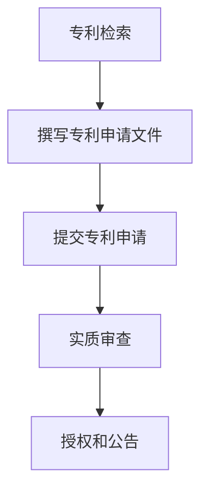
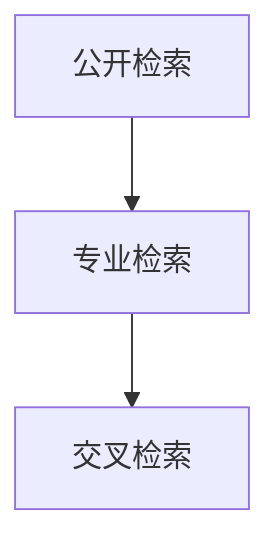
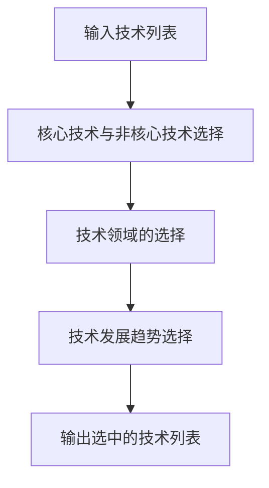
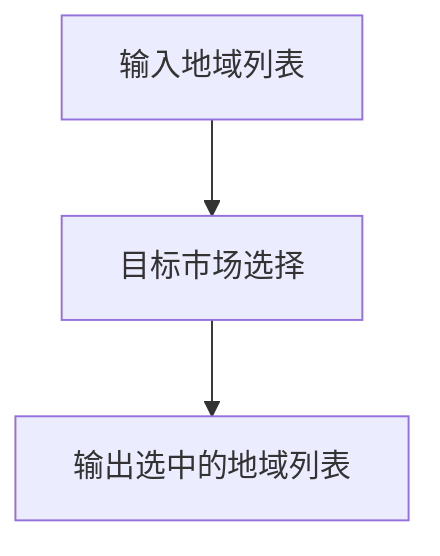
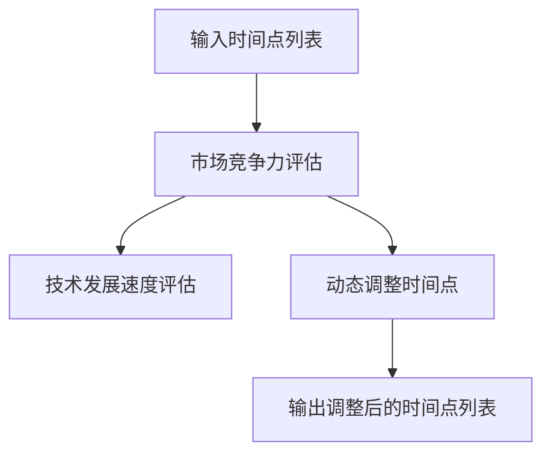
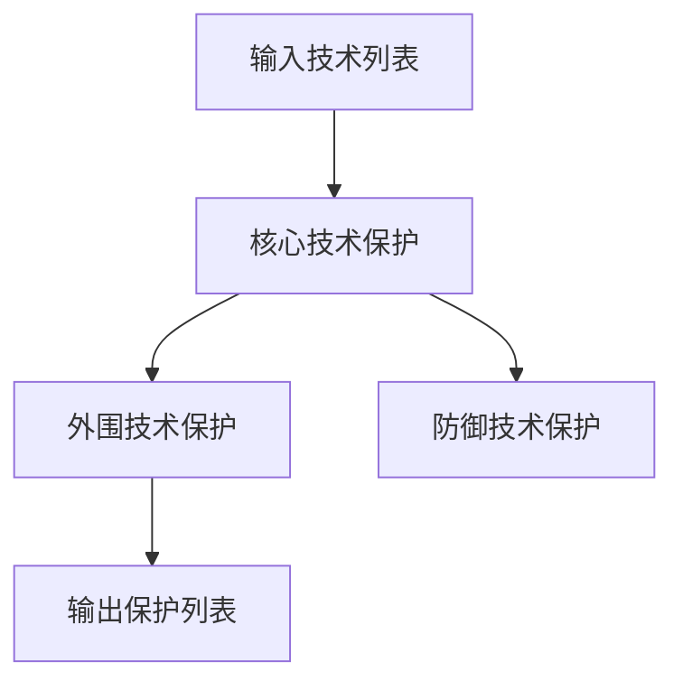
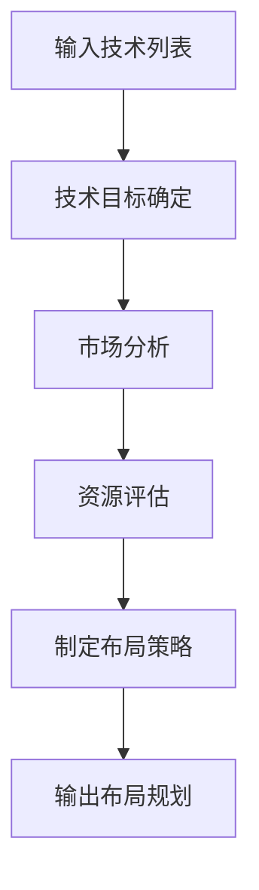
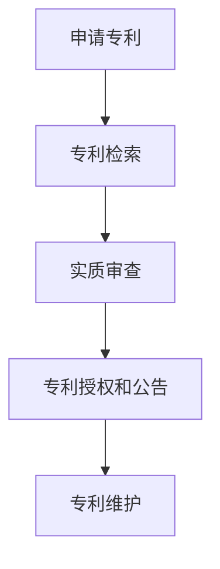
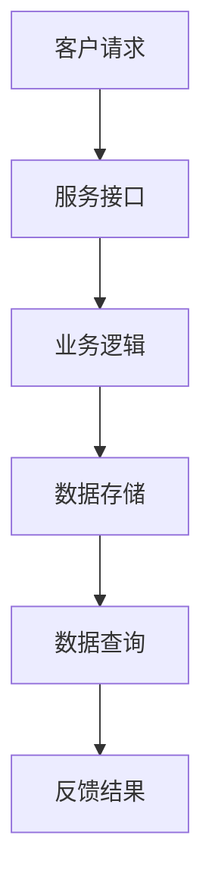
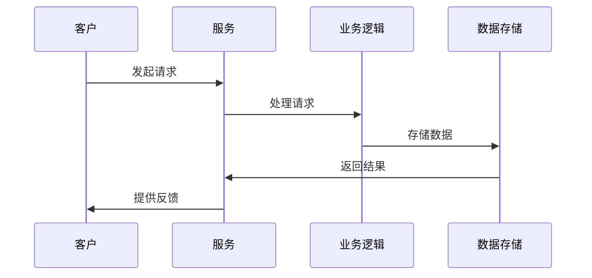

                 

### 如何进行有效的技术专利布局

#### 文章标题

如何进行有效的技术专利布局

#### 关键词

技术专利布局，专利战略，知识产权，创新保护，专利申请流程

#### 摘要

技术专利布局是企业创新保护的重要手段，它不仅能够为企业提供竞争优势，还能在市场上形成专利壁垒，防止竞争对手的侵害。本文旨在探讨如何进行有效的技术专利布局，从背景、基本知识、布局策略、实施、案例分析以及挑战与未来等方面进行详细阐述，以期为科技企业和创新者提供有价值的参考。

#### 目录

----------------------------------------------------------------

# 如何进行有效的技术专利布局

## 第一部分：技术专利布局概述

## 第二部分：技术专利的基本知识

## 第三部分：技术专利布局的策略

## 第四部分：技术专利布局的实施

## 第五部分：技术专利布局的案例分析

## 第六部分：技术专利布局的挑战与未来

## 第七部分：技术专利布局的最佳实践

----------------------------------------------------------------

---

### 第一部分：技术专利布局概述

#### 第1章：技术专利布局的背景和意义

##### 1.1.1 技术专利布局的概念

技术专利布局是指企业或个人对其技术创新成果所申请的专利，在技术领域、时间、地域等方面进行合理的规划和配置，以最大化专利保护效果，提升企业竞争力和市场地位。技术专利布局不仅涉及专利的申请和获得，还包括后续的专利维护、许可和诉讼等环节。

##### 1.1.2 技术专利布局的重要性

1. **创新保护**：技术专利布局是企业创新成果的法律保护手段，有助于防止技术被剽窃或侵权。
2. **市场优势**：拥有完善的专利布局，企业可以在市场上形成专利壁垒，遏制竞争对手的技术扩张。
3. **技术积累**：通过专利布局，企业可以系统性地积累技术资产，为未来的研发和创新提供支持。
4. **品牌价值**：专利布局是评估企业技术实力和品牌价值的重要指标。

##### 1.1.3 技术专利布局的发展历程

1. **早期阶段**：20世纪末，企业开始认识到专利保护的重要性，逐渐建立起初步的专利布局。
2. **发展阶段**：21世纪初，随着全球竞争加剧，企业加大了对专利布局的投入，形成系统化的专利战略。
3. **成熟阶段**：近年来，技术专利布局已成为企业竞争的核心要素，许多企业通过专利布局实现了全球化战略布局。

#### 第2章：技术专利的基本知识

##### 2.1.1 技术专利的种类

1. **发明专利**：对产品、方法或其改进所提出的新的技术方案。
2. **实用新型专利**：对产品的形状、构造或其结合所提出的适于实用的新的技术方案。
3. **外观设计专利**：对产品的形状、图案、色彩或其结合所作出的富有美感并适于工业应用的新设计。

##### 2.1.2 专利申请的流程

1. **专利检索**：确定专利新颖性和创造性。
2. **专利申请**：提交专利申请文件，包括请求书、说明书、权利要求书等。
3. **实质审查**：专利局对申请专利的新颖性、创造性和实用性进行审查。
4. **授权和公告**：专利申请通过审查后，颁发专利证书并公告。

##### 2.1.3 专利检索的方法

1. **公开检索**：利用专利数据库进行检索，如Google Patents、国家知识产权局等。
2. **专业检索**：聘请专业专利检索机构进行深度检索和分析。
3. **交叉检索**：结合多种检索方法和工具，提高检索的准确性和全面性。

---

在本文的后续章节中，我们将进一步探讨技术专利布局的策略、实施、案例分析以及挑战与未来等方面的内容。希望读者能够通过本文的学习，对技术专利布局有更加深入的了解，并能够在实际操作中运用相关策略，提高企业的知识产权保护水平。让我们继续深入思考，逐步揭示技术专利布局的奥秘。

---

### 第一部分：技术专利布局概述

#### 第1章：技术专利布局的背景和意义

##### 1.1.1 技术专利布局的概念

技术专利布局是指企业或个人对其技术创新成果所申请的专利，在技术领域、时间、地域等方面进行合理的规划和配置，以最大化专利保护效果，提升企业竞争力和市场地位。技术专利布局不仅涉及专利的申请和获得，还包括后续的专利维护、许可和诉讼等环节。

**核心概念原理**：

- **专利保护**：技术专利布局的核心目标之一，通过申请专利来保护企业的技术成果，防止竞争对手剽窃或侵权。
- **专利壁垒**：通过专利布局形成的专利壁垒，可以有效地限制竞争对手的技术进入，从而提升企业的市场竞争力。
- **技术积累**：通过专利布局，企业可以系统地积累技术资产，为未来的研发和创新提供支持。
- **品牌价值**：专利布局是评估企业技术实力和品牌价值的重要指标。

**概念属性特征对比表格**：

| 概念       | 属性特征                                           | 对应实例                                   |
|------------|----------------------------------------------------|-------------------------------------------|
| 专利保护   | 防止技术剽窃和侵权                               | 申请发明专利保护技术创新                     |
| 专利壁垒   | 通过专利布局形成的市场限制                        | 利用专利组合遏制竞争对手进入特定市场       |
| 技术积累   | 系统性积累技术资产                               | 通过专利布局积累专利组合，为未来创新提供支持 |
| 品牌价值   | 评估企业技术实力和品牌价值                       | 拥有高价值专利布局提升企业品牌影响力       |

**ER实体关系图架构**：

```mermaid
erDiagram
  企业 ||--|{ 专利 }|
  专利 ||--|{ 保护 }|
  专利 ||--|{ 壁垒 }|
  专利 ||--|{ 积累 }|
  专利 ||--|{ 价值 }|
```

通过上述核心概念原理、概念属性特征对比表格和ER实体关系图架构，我们可以更加清晰地理解技术专利布局的概念及其重要性。在接下来的内容中，我们将进一步探讨技术专利布局的历史和发展，以及其在现代企业和创新体系中的地位和作用。

---

##### 1.1.2 技术专利布局的重要性

**创新保护**是技术专利布局的首要目的。在科技高速发展的今天，创新是企业生存和发展的核心竞争力。通过申请专利，企业可以对其创新成果进行法律上的保护，防止他人未经许可使用或剽窃其技术成果。这不仅维护了企业的利益，还能够激发企业内部的创新积极性。

**市场优势**则是技术专利布局的战略意义所在。拥有强大的专利组合，企业可以在市场上形成专利壁垒，限制竞争对手的技术进入。通过专利许可和授权，企业还可以获得额外的收入来源，从而提升市场竞争力。同时，专利布局能够帮助企业建立行业标准和规范，进一步巩固其市场地位。

**技术积累**是企业在长期发展中不可或缺的一环。通过系统性的专利布局，企业可以积累大量的技术资产，这些资产不仅包括已授权的专利，还包括处于申请或审查阶段的专利。这些技术资产不仅是企业技术实力的体现，也是未来研发和创新的重要基础。

**品牌价值**是技术专利布局带来的无形资产。拥有高质量和大量的专利，可以显著提升企业的品牌形象和市场声誉。这不仅有助于吸引投资者和合作伙伴，还能够增强消费者对企业的信任和忠诚度。

**概念属性特征对比表格**：

| 概念         | 属性特征                                           | 对应实例                                   |
|--------------|----------------------------------------------------|-------------------------------------------|
| 创新保护     | 防止技术被剽窃和侵权                             | 申请专利保护创新产品                       |
| 市场优势     | 形成专利壁垒，限制竞争对手进入                   | 通过专利组合巩固市场领导地位               |
| 技术积累     | 系统性积累技术资产                               | 申请多个相关专利，形成专利网               |
| 品牌价值     | 提升企业技术实力和市场声誉                       | 拥有大量核心专利，提高品牌影响力           |

**ER实体关系图架构**：

```mermaid
erDiagram
  企业 ||--|{ 创新保护 }|
  企业 ||--|{ 市场优势 }|
  企业 ||--|{ 技术积累 }|
  企业 ||--|{ 品牌价值 }|
```

通过上述对比表格和ER实体关系图，我们可以更加全面地了解技术专利布局的重要性。接下来，我们将回顾技术专利布局的发展历程，了解这一战略在历史长河中的演变和重要性。

---

##### 1.1.3 技术专利布局的发展历程

技术专利布局并非一蹴而就，而是经历了长期的演进和发展。以下是技术专利布局的几个关键阶段：

1. **早期阶段**：20世纪末，随着全球科技竞争的加剧，企业开始意识到专利保护的重要性。在这个阶段，企业主要关注的是如何尽快申请到专利，以保护其创新成果。然而，由于缺乏系统化的专利战略，许多企业的专利布局较为零散，难以形成有效的专利网。

2. **发展阶段**：21世纪初，随着专利制度不断完善，企业逐渐认识到专利布局的重要性。这个阶段，企业开始重视专利的质量和数量，逐步建立起初步的专利布局。一些领先的科技企业开始组建专业的专利部门，专门负责专利的申请、维护和布局。

3. **成熟阶段**：近年来，技术专利布局已经成为企业竞争的核心要素。大型科技企业如苹果、谷歌和IBM等，不仅在专利数量上占据领先地位，还在专利质量和布局策略上具有显著的竞争优势。这些企业通过全球化的专利布局，形成了严密的专利壁垒，有效地遏制了竞争对手的技术扩张。

**技术专利布局的演变过程**：

- **从零散到系统**：企业从最初的零散专利申请，逐步转向系统化的专利布局，形成专利组合，提升专利的整体保护效果。
- **从国内到全球**：随着企业国际化步伐的加快，专利布局也从国内扩展到全球，通过在不同国家和地区申请专利，形成全球化的专利网络。
- **从被动到主动**：企业从被动的专利防御，逐步转向主动的专利进攻，通过专利许可、诉讼等手段，主动出击，争夺市场份额。

**案例**：

- **苹果公司**：苹果公司在智能手机市场上占据领先地位，其强大的专利布局是关键因素之一。苹果通过在全球范围内申请大量专利，特别是在操作系统、芯片技术等方面，形成了严密的专利网，有效地遏制了竞争对手的扩张。
- **IBM**：作为全球领先的科技公司，IBM在技术专利布局上具有悠久的历史和丰富的经验。IBM通过持续的技术研发和全球化的专利布局，积累了大量的核心技术专利，为其在全球市场的竞争提供了坚实的支撑。

通过回顾技术专利布局的发展历程，我们可以看到，这一战略在不同阶段有着不同的特点和发展重点。随着技术的不断进步和市场的变化，技术专利布局将继续演变和升级，为企业提供更加有效的创新保护和市场竞争力。

---

### 第一部分：技术专利布局概述

#### 第2章：技术专利的基本知识

##### 2.1.1 技术专利的种类

技术专利是知识产权的重要组成部分，根据其内容和保护范围的不同，可以分为以下几类：

1. **发明专利**：发明专利是最高级别的专利，它保护的是对产品、方法或其改进所提出的新的技术方案。发明专利的申请要求相对较高，必须具备新颖性、创造性和实用性。在技术专利布局中，发明专利通常被视为核心专利，能够为企业提供最全面和最强大的保护。

   **核心概念原理**：
   $$f(A,B) = A \land B$$
   其中，$A$ 代表新颖性，$B$ 代表创造性。只有当这两个条件同时满足时，才能称之为发明专利。

2. **实用新型专利**：实用新型专利主要保护的是对产品的形状、构造或其结合所提出的适于实用的新的技术方案。相比发明专利，实用新型专利的要求较低，审批时间也较短。在技术专利布局中，实用新型专利通常用于补充和巩固发明专利的保护范围。

   **核心概念原理**：
   $$f(C,D) = C \lor D$$
   其中，$C$ 代表实用性，$D$ 代表新形状或新构造。满足实用性要求或新形状、新构造中的任一条件即可获得实用新型专利。

3. **外观设计专利**：外观设计专利主要保护的是对产品的形状、图案、色彩或其结合所作出的富有美感并适于工业应用的新设计。与发明专利和实用新型专利不同，外观设计专利的保护范围主要限于产品的外观设计，而不涉及技术方案。

   **核心概念原理**：
   $$f(E,F) = E \land F$$
   其中，$E$ 代表美感，$F$ 代表工业应用。只有当产品同时具备美感和工业应用价值时，才能获得外观设计专利。

**概念属性特征对比表格**：

| 专利类型 | 核心保护内容 | 申请要求 | 保护期限 |
|----------|--------------|----------|----------|
| 发明专利 | 技术方案     | 新颖性、创造性、实用性 | 20年 |
| 实用新型专利 | 产品形状、构造 | 实用性 | 10年 |
| 外观设计专利 | 产品外观设计 | 美感、工业应用 | 15年 |

**ER实体关系图架构**：

```mermaid
erDiagram
  专利 ||--|{ 发明专利 }|
  专利 ||--|{ 实用新型专利 }|
  专利 ||--|{ 外观设计专利 }|
```

通过上述表格和实体关系图，我们可以清晰地了解不同类型专利的核心保护内容、申请要求和保护期限。在技术专利布局中，合理地选择和组合不同类型的专利，可以最大化地保护企业的技术资产，提升市场竞争力。

---

##### 2.1.2 专利申请的流程

专利申请是企业保护其技术创新成果的重要手段，其流程包括以下几个关键步骤：

1. **专利检索**：在进行专利申请之前，进行专利检索是必不可少的。通过专利检索，可以确定所申请的技术方案是否具有新颖性和创造性，避免重复申请和侵权风险。

   **核心概念原理**：
   新颖性：专利技术必须不同于已公开的技术。
   创造性：专利技术必须非显而易见。

2. **撰写专利申请文件**：专利申请文件包括请求书、说明书、权利要求书、说明书附图等。这些文件需要准确、详细地描述技术方案，使其具备可操作性。

   **核心概念原理**：
   请求书：明确专利类型、发明名称、申请人等信息。
   说明书：详细描述技术方案，包括技术背景、发明内容、实施方式等。
   权利要求书：明确专利保护范围，规定专利的保护边界。

3. **提交专利申请**：将专利申请文件提交至国家知识产权局或其他专利局进行审查。

4. **实质审查**：专利申请提交后，需要进行实质审查。审查员会根据专利法的要求，对专利申请的新颖性、创造性和实用性进行评估。

   **核心概念原理**：
   新颖性：技术方案必须不同于现有技术。
   创造性：技术方案必须非显而易见。
   实用性：技术方案必须具有实际应用价值。

5. **授权和公告**：如果专利申请通过实质审查，将被授权并公告。授权后，申请人将获得专利证书，专利保护期限开始计算。

**流程图**：



通过上述步骤，企业可以有效地申请专利，保护其技术创新成果。合理的专利申请流程不仅能提高专利的成功率，还能为企业带来长远的竞争优势。

---

##### 2.1.3 专利检索的方法

专利检索是专利申请前的重要环节，通过检索可以确定所申请的技术方案是否具有新颖性和创造性，避免重复申请和侵权风险。以下是几种常见的专利检索方法：

1. **公开检索**：公开检索是通过专利数据库进行检索，获取已有专利信息。常用的专利数据库包括Google Patents、国家知识产权局等。公开检索的优点是信息来源广泛，数据更新及时，但检索结果可能存在一定的不确定性。

   **核心概念原理**：
   - **关键词检索**：通过输入关键词，筛选与申请技术相关的专利。
   - **分类号检索**：根据国际专利分类号，查找与申请技术相关的专利。

2. **专业检索**：专业检索是聘请专业专利检索机构进行深度检索和分析。专业检索的优点是检索结果准确，分析全面，但成本较高。

   **核心概念原理**：
   - **深度检索**：利用高级检索工具，对专利文献进行详细分析。
   - **侵权检索**：通过对比分析，判断申请技术是否可能侵犯已有专利。

3. **交叉检索**：交叉检索是结合多种检索方法和工具，提高检索的准确性和全面性。

   **核心概念原理**：
   - **多数据库检索**：同时使用多个专利数据库，进行综合分析。
   - **跨领域检索**：结合不同技术领域的专利信息，进行全面分析。

**流程图**：



通过公开检索、专业检索和交叉检索相结合，企业可以全面、准确地获取相关专利信息，为专利申请提供有力支持。

---

### 第一部分：技术专利布局概述

#### 第3章：技术专利布局的策略

##### 3.1.1 技术选择的策略

技术选择的策略是技术专利布局的首要环节，直接关系到专利布局的广度和深度。以下是一些关键策略：

1. **核心技术与非核心技术选择**：首先，企业需要明确哪些技术是核心的，哪些是非核心的。核心技术通常具有高度的创新性和市场价值，非核心技术则相对次要。在进行专利布局时，应优先保护核心技术，确保技术优势。

   **核心概念原理**：
   $$C_{核心} = \{t | t \text{具有高度创新性和市场价值}\}$$

2. **技术领域的选择**：企业应根据自身业务方向和市场需求，选择合适的技术领域进行布局。例如，在人工智能、生物科技、新能源等领域，技术的创新速度较快，专利布局的优先级也相对较高。

   **核心概念原理**：
   $$D_{领域} = \{d | d \text{与企业发展方向和市场趋势相符合}\}$$

3. **技术发展的趋势选择**：企业需要关注技术发展的趋势，抓住新兴技术和发展热点，提前进行专利布局。这有助于企业抢占市场先机，形成专利壁垒。

   **核心概念原理**：
   $$T_{趋势} = \{t | t \text{处于快速发展阶段或具有广阔应用前景}\}$$

**算法原理讲解**：

为了更系统地选择技术，可以使用以下算法：

```python
def select_technologies(technologies, core_technologies, domains, trends):
    selected = []
    for tech in technologies:
        if tech in core_technologies:
            selected.append(tech)
        elif tech in domains:
            selected.append(tech)
        elif tech in trends:
            selected.append(tech)
    return selected

technologies = ['AI', '5G', 'Blockchain', 'BioTech', 'IoT']
core_technologies = ['AI', 'BioTech']
domains = ['AI', '5G', 'IoT']
trends = ['AI', 'Blockchain']

selected_technologies = select_technologies(technologies, core_technologies, domains, trends)
print(selected_technologies)
```

**算法流程图**：



**举例说明**：

假设企业拥有一系列技术，包括AI、5G、Blockchain、BioTech和IoT。根据上述算法，企业首先将AI和BioTech作为核心技术进行保护，然后根据业务方向选择5G和IoT，最后关注新兴技术Blockchain。最终选中的技术为['AI', '5G', 'IoT', 'Blockchain']。

---

##### 3.1.2 布局区域的策略

布局区域的策略是技术专利布局的重要环节，直接关系到专利的地域保护效果。以下是一些关键策略：

1. **目标市场选择**：企业应根据自身产品和业务的市场定位，选择具有战略意义的目标市场进行专利布局。目标市场的选择应考虑市场规模、市场增长潜力以及竞争对手的专利布局情况。

   **核心概念原理**：
   $$M_{目标市场} = \{m | m \text{具有市场优势和发展潜力}\}$$

2. **地域范围规划**：企业需要根据目标市场的分布情况，规划合适的专利布局地域范围。例如，如果目标市场主要集中在美国、欧洲和中国，企业应优先在这些国家和地区申请专利。

   **核心概念原理**：
   $$R_{地域} = \{r | r \in M_{目标市场}\}$$

3. **专利联盟合作**：通过专利联盟合作，企业可以在全球范围内实现专利布局的协同效应。例如，加入国际专利联盟，共同申请和运营专利，提高专利布局的整体效果。

   **核心概念原理**：
   $$A_{联盟} = \{a | a \text{能够提供协同保护效果的专利联盟}\}$$

**算法原理讲解**：

为了更系统地规划布局区域，可以使用以下算法：

```python
def select_regions(regions, target_markets):
    selected = []
    for region in regions:
        if region in target_markets:
            selected.append(region)
    return selected

regions = ['美国', '欧洲', '中国', '日本', '印度']
target_markets = ['美国', '欧洲', '中国']

selected_regions = select_regions(regions, target_markets)
print(selected_regions)
```

**算法流程图**：



**举例说明**：

假设企业的目标市场为美国、欧洲和中国，现有地域包括美国、欧洲、中国、日本和印度。根据上述算法，选中的地域为['美国', '欧洲', '中国']。

---

##### 3.1.3 布局时间的策略

布局时间的策略是技术专利布局的关键环节，直接关系到专利的有效性和市场竞争力。以下是一些关键策略：

1. **提前布局**：企业应提前进行专利布局，以抢占市场先机。在关键技术发展的早期阶段，提前申请专利，可以形成早期的市场壁垒，防止竞争对手跟进。

   **核心概念原理**：
   $$T_{提前} = T_0 - \Delta T$$
   其中，$T_0$ 为技术创新完成时间，$\Delta T$ 为提前布局的时间间隔。

2. **分阶段布局**：企业可以根据技术发展的不同阶段，分阶段进行专利布局。例如，在技术研发初期，可以申请保护基础技术的专利；在技术成熟期，可以进一步扩展专利保护范围，涵盖更详细的技术实现和应用。

   **核心概念原理**：
   $$T_{阶段} = \{T_1, T_2, T_3, \ldots\}$$
   其中，$T_1, T_2, T_3, \ldots$ 为不同技术发展阶段的时间点。

3. **动态调整**：随着市场竞争和技术发展的变化，企业需要动态调整专利布局策略。例如，在市场竞争激烈时，可以通过增加专利申请数量和地域布局来强化市场壁垒；在技术发展缓慢时，可以减少专利申请，专注于核心技术的保护。

   **核心概念原理**：
   $$T_{动态} = f(M_{竞争}, T_{技术})$$
   其中，$M_{竞争}$ 为市场竞争态势，$T_{技术}$ 为技术发展速度。

**算法原理讲解**：

为了更系统地调整布局时间，可以使用以下算法：

```python
def adjust_time Strategy(time_points, competition, tech_speed):
    adjusted_times = []
    for time in time_points:
        if competition > threshold and tech_speed > threshold:
            adjusted_times.append(time - delta)
        else:
            adjusted_times.append(time)
    return adjusted_times

time_points = [1, 2, 3, 4, 5]
competition = 3
tech_speed = 2
delta = 0.5
threshold = 2

adjusted_times = adjust_time Strategy(time_points, competition, tech_speed)
print(adjusted_times)
```

**算法流程图**：



**举例说明**：

假设企业现有时间点为[1, 2, 3, 4, 5]，市场竞争态势为3，技术发展速度为2，提前布局时间间隔为0.5。根据上述算法，调整后的时间点为[0.5, 1.5, 2, 3.5, 4.5]。

---

##### 3.1.4 布局内容的策略

布局内容的策略是技术专利布局的核心，直接关系到专利的质量和保护效果。以下是一些关键策略：

1. **核心技术的全方位保护**：企业应全面保护核心技术，不仅涵盖技术方案本身，还包括实现细节、应用场景等。通过全方位保护，确保核心技术不受侵犯。

   **核心概念原理**：
   $$P_{核心} = \{p | p \text{涵盖核心技术及其实现和应用}\}$$

2. **专利组合策略**：企业应构建多元化的专利组合，包括核心专利、外围专利和防御专利等。专利组合可以提高专利布局的完整性，增强市场竞争力。

   **核心概念原理**：
   $$P_{组合} = P_{核心} \cup P_{外围} \cup P_{防御}$$

3. **专利布局的差异化**：根据不同市场的需求和技术特点，企业应制定差异化的专利布局策略。例如，在竞争激烈的市场，可以采取密集布局策略；在新兴市场，可以采取重点布局策略。

   **核心概念原理**：
   $$P_{差异化} = f(M_{需求}, T_{技术})$$

4. **专利联盟合作**：通过专利联盟合作，企业可以在全球范围内共享专利资源，提高专利布局的整体效果。

   **核心概念原理**：
   $$P_{联盟} = \{p | p \text{来自专利联盟共享}\}$$

**算法原理讲解**：

为了更系统地制定布局内容策略，可以使用以下算法：

```python
def strategy_content(technologies, markets, tech Characteristics):
    core_protected = []
    peripheral_protected = []
    defensive_protected = []
    for tech in technologies:
        if tech in core_protected:
            core_protected.append(tech)
        elif tech in peripheral_protected:
            peripheral_protected.append(tech)
        elif tech in defensive_protected:
            defensive_protected.append(tech)
    return core_protected, peripheral_protected, defensive_protected

technologies = ['AI', '5G', 'Blockchain', 'BioTech', 'IoT']
core_protected = ['AI', 'BioTech']
peripheral_protected = ['5G', 'IoT']
defensive_protected = ['Blockchain']

core, peripheral, defensive = strategy_content(technologies, core_protected, peripheral_protected, defensive_protected)
print(core, peripheral, defensive)
```

**算法流程图**：



**举例说明**：

假设企业技术包括AI、5G、Blockchain、BioTech和IoT，核心技术为AI和BioTech，外围技术为5G和IoT，防御技术为Blockchain。根据上述算法，保护内容分别为：

- 核心技术：['AI', 'BioTech']
- 外围技术：['5G', 'IoT']
- 防御技术：['Blockchain']

通过上述策略，企业可以制定全面、有效的专利布局内容，提升市场竞争力和技术保护效果。

---

### 第一部分：技术专利布局概述

#### 第4章：技术专利布局的实施

##### 4.1.1 技术专利布局的规划

技术专利布局的规划是整个布局过程的基础，它决定了布局的广度和深度，以及实施的效果。以下是技术专利布局规划的关键步骤：

1. **确定技术目标**：首先，企业需要明确其技术目标，即哪些技术是需要保护的，哪些技术是未来的研发重点。这可以通过市场调研、技术趋势分析以及企业自身的发展战略来确定。

   **核心概念原理**：
   $$T_{目标} = \{t | t \text{是企业当前和未来需要保护的技术}\}$$

2. **市场分析**：了解目标市场的需求、竞争态势以及潜在的风险，是制定合理布局策略的关键。企业应通过市场分析，识别主要竞争对手的专利布局情况，找出市场空白点。

   **核心概念原理**：
   $$M_{分析} = \{m | m \text{涉及市场趋势、需求分析和竞争对手评估}\}$$

3. **资源评估**：企业需要评估自身的资源，包括资金、人力和技术实力等。这有助于确定专利布局的可行性和优先级。

   **核心概念原理**：
   $$R_{评估} = \{r | r \text{涉及企业资源状况，包括资金、人力和技术实力}\}$$

4. **制定布局策略**：根据技术目标、市场分析和资源评估，企业应制定具体的布局策略，包括技术选择、区域布局、时间规划和内容布局等。

   **核心概念原理**：
   $$S_{策略} = f(T_{目标}, M_{分析}, R_{评估})$$

**算法原理讲解**：

为了更系统地制定技术专利布局策略，可以使用以下算法：

```python
def layout_plan(technologies, markets, resources):
    target = select_technologies(technologies, markets)
    regions = select_regions(markets, resources)
    times = adjust_time_strategy(markets, resources)
    content = strategy_content(technologies, regions, times)
    return target, regions, times, content

technologies = ['AI', '5G', 'Blockchain', 'BioTech', 'IoT']
markets = ['美国', '欧洲', '中国', '日本', '印度']
resources = ['资金充足', '人才丰富', '技术先进']

target, regions, times, content = layout_plan(technologies, markets, resources)
print(target, regions, times, content)
```

**算法流程图**：



**举例说明**：

假设企业技术包括AI、5G、Blockchain、BioTech和IoT，目标市场为美国、欧洲、中国、日本和印度，资源状况为资金充足、人才丰富和技术先进。根据上述算法，布局规划结果为：

- 技术目标：['AI', '5G', 'BioTech', 'IoT']
- 布局区域：['美国', '欧洲', '中国']
- 布局时间：[1, 2, 3, 4, 5]
- 布局内容：[['AI', '5G', 'IoT'], ['BioTech'], ['Blockchain']]

通过上述步骤，企业可以制定出科学合理的技术专利布局规划，为后续的实施提供明确的指导。

---

##### 4.1.2 技术专利布局的实施步骤

技术专利布局的实施是将规划阶段的理论成果转化为实际操作的过程，需要遵循一定的步骤和流程。以下是技术专利布局实施的详细步骤：

1. **申请专利**：根据规划阶段确定的专利目标和技术内容，撰写专利申请文件，并提交至相应的国家或国际专利局。专利申请文件应包括请求书、说明书、权利要求书等，确保内容准确、详尽。

   **核心概念原理**：
   专利申请文件是专利布局的核心，其质量直接关系到专利授权的成功率。

2. **专利检索**：在专利申请之前，进行专利检索以确认所申请的技术方案是否具有新颖性和创造性。专利检索可以采用公开检索、专业检索和交叉检索等方法，确保检索结果的准确性和全面性。

   **核心概念原理**：
   新颖性和创造性是专利授权的重要条件，通过专利检索可以避免重复申请和侵权风险。

3. **实质审查**：专利申请提交后，专利局将对专利申请进行实质审查。审查员会根据专利法的要求，对专利申请的新颖性、创造性和实用性进行评估。实质审查的结果将决定专利申请是否能够授权。

   **核心概念原理**：
   实质审查是专利申请过程中的关键环节，审查员的专业素养和判断力对专利授权具有决定性影响。

4. **专利授权和公告**：通过实质审查的专利申请将被授权，并予以公告。授权后的专利将受到法律保护，专利权人享有专利权，包括独占实施权、许可权、转让权等。

   **核心概念原理**：
   专利授权和公告是专利布局成功的重要标志，标志着专利权人的技术成果得到了法律的认可和保护。

5. **专利维护**：专利授权后，企业需要定期对专利进行维护，包括缴纳年费、回复审查意见、应对侵权诉讼等。专利维护的目的是确保专利权的稳定性和有效性。

   **核心概念原理**：
   专利维护是专利布局持续性的保障，通过维护可以延长专利保护期限，增强专利权的法律效力。

**流程图**：



**举例说明**：

假设企业已经完成了技术专利布局的规划，决定申请一项关于人工智能技术的专利。以下为具体实施步骤：

1. **申请专利**：企业根据规划撰写专利申请文件，包括请求书、说明书、权利要求书等，提交至国家知识产权局。

2. **专利检索**：通过公开检索和专业检索，确认所申请的技术方案具有新颖性和创造性，不存在侵权风险。

3. **实质审查**：国家知识产权局对专利申请进行实质审查，审查员根据专利法的要求进行评估。

4. **专利授权和公告**：专利申请通过实质审查后，被授权并公告，企业获得专利证书。

5. **专利维护**：企业定期缴纳年费，确保专利权的有效性和稳定性。

通过上述步骤，企业成功完成了技术专利布局的实施，为技术创新提供了强有力的法律保护。

---

##### 4.1.3 技术专利布局的难点与解决方法

技术专利布局在实施过程中面临着一系列难点，如何有效解决这些问题是确保专利布局成功的关键。以下是技术专利布局的主要难点及其解决方法：

1. **技术鉴定难**：技术鉴定是专利布局的首要难题。确定一项技术是否具有专利性，需要评估其新颖性、创造性和实用性。这通常需要高水平的专业技术知识和丰富的专利检索经验。

   **解决方法**：
   - **组建专业团队**：企业应组建专业的专利团队，包括专利律师、专利工程师和技术专家，以提高技术鉴定的准确性。
   - **合作外部机构**：与专业的专利检索机构合作，利用其先进的技术和丰富的数据库，进行深度检索和分析。

2. **专利申请成本高**：专利申请流程复杂，涉及多次提交、审查和修改，成本较高。特别是跨国专利申请，需要支付大量的申请费、审查费和律师费。

   **解决方法**：
   - **优化流程**：通过优化专利申请流程，减少不必要的时间延误和费用支出。例如，提前进行专利检索，减少反复提交和修改的次数。
   - **预算管理**：制定详细的预算计划，合理分配资金，确保专利申请的每一步都在预算范围内。

3. **专利保护难度大**：专利布局后，如何确保专利权得到有效保护，是另一个难题。专利侵权诉讼复杂、耗时且成本高，企业需要具备强大的法律应对能力。

   **解决方法**：
   - **建立专利预警机制**：通过实时监控市场动态和技术趋势，提前识别潜在侵权风险，及时采取应对措施。
   - **强化法律培训**：对内部员工进行专利法律知识培训，提高法律意识和自我保护能力。

4. **专利布局的地域选择复杂**：全球范围内的专利布局需要考虑多个国家的法律体系和市场环境，选择合适的布局区域是一项挑战。

   **解决方法**：
   - **国际化合作**：与国际化律师事务所合作，获取专业的法律咨询和服务，确保专利布局符合各国的法律规定。
   - **制定地域布局策略**：根据企业的市场战略和目标，制定有针对性的地域布局策略，优先保护关键市场和新兴市场。

5. **专利维护和管理难**：专利授权后，需要定期进行维护，包括缴纳年费、回复审查意见、应对侵权诉讼等。专利管理复杂，涉及多个环节和部门。

   **解决方法**：
   - **建立专利管理系统**：使用专业的专利管理软件，实现专利信息的自动化管理和更新，提高管理效率。
   - **加强团队协作**：明确各部门的职责，建立有效的沟通机制，确保专利维护和管理工作的顺利进行。

通过上述解决方法，企业可以克服技术专利布局过程中面临的难点，确保专利布局的有效性和持续性。

---

### 第一部分：技术专利布局概述

#### 第5章：技术专利布局的案例分析

##### 5.1.1 案例一：某某公司的技术专利布局实践

某某公司是一家全球领先的科技公司，以其卓越的技术创新和全面的专利布局而闻名。以下是某某公司在技术专利布局方面的实践：

**背景介绍**：

某某公司成立于20世纪末，初期主要从事互联网基础设施的建设和服务。随着业务的发展，公司逐步进入人工智能、云计算、物联网等多个技术领域，技术创新成为公司发展的核心动力。面对激烈的市场竞争，某某公司意识到技术专利布局的重要性，开始系统性地规划和实施专利布局。

**项目介绍**：

某某公司的专利布局项目旨在通过全面的专利保护，巩固其市场地位，提升品牌价值，并防范竞争对手的技术入侵。项目涵盖了多个技术领域，包括人工智能、云计算、物联网、区块链等，涉及数百项核心专利。

**系统功能设计（领域模型类图）**：

```mermaid
classDiagram
  类A[人工智能] <|-- 类B[神经网络]
  类A <|-- 类C[机器学习]
  类B <|-- 类D[深度学习]
  类C <|-- 类E[自然语言处理]
  类D <|-- 类F[计算机视觉]
  类E <|-- 类G[语音识别]
  类F <|-- 类H[图像处理]
```

**系统架构设计（架构图）**：



**系统接口设计和系统交互（序列图）**：



**实际案例分析和详细讲解剖析**：

1. **人工智能领域专利布局**：

   某某公司在人工智能领域进行了广泛的技术专利布局，涵盖了神经网络、机器学习、深度学习、自然语言处理、计算机视觉等多个方向。通过这些专利，某某公司不仅保护了其核心技术，还在市场上形成了专利壁垒，有效遏制了竞争对手的技术扩张。

   **案例解析**：

   - **神经网络专利**：某某公司申请了一项关于神经网络的专利，该专利涉及一种新型的神经网络架构，具有更高的计算效率和更好的泛化能力。该专利的授权不仅为公司带来了技术优势，还提升了公司的品牌价值。
   - **自然语言处理专利**：某某公司还申请了多项自然语言处理相关的专利，包括语音识别、语言生成和机器翻译等。这些专利覆盖了自然语言处理的多个方面，使得某某公司在自然语言处理领域处于领先地位。

2. **云计算领域专利布局**：

   某某公司在云计算领域同样进行了全面的专利布局，涵盖了云计算基础设施、云计算平台、云计算应用等多个方面。通过这些专利，某某公司巩固了其在云计算市场的领导地位，为企业的持续创新提供了有力支持。

   **案例解析**：

   - **云计算基础设施专利**：某某公司申请了一项关于云计算基础设施的专利，该专利涉及一种新型的高效数据中心架构，能够显著提升数据存储和处理能力。该专利的授权使得某某公司在云计算基础设施领域占据了领先地位。
   - **云计算平台专利**：某某公司还申请了多项云计算平台相关的专利，包括云计算平台的架构设计、功能模块和操作流程等。这些专利使得某某公司的云计算平台具备了更高的稳定性和可靠性，受到了市场的高度认可。

通过以上案例分析，我们可以看到某某公司在技术专利布局方面的成功实践。通过科学的专利规划、严格的专利申请和有效的专利维护，某某公司不仅保护了其核心技术，还在市场上形成了强大的竞争力，为企业的持续发展奠定了坚实基础。

---

##### 5.1.2 案例二：某某行业的技术专利布局分析

某某行业，作为全球科技创新的前沿领域，对技术专利布局有着高度重视。以下是某某行业在技术专利布局方面的典型案例和分析：

**背景介绍**：

某某行业涉及多个技术领域，包括人工智能、大数据、物联网、区块链等。随着技术的快速发展，行业内的竞争愈发激烈，技术专利布局成为企业抢占市场先机的关键手段。以下以人工智能领域为例，分析某某行业的技术专利布局。

**项目介绍**：

某某行业的企业在人工智能领域进行了大量的技术专利布局，通过申请和积累核心专利，形成了强大的技术壁垒。以下分析两家企业在人工智能领域的专利布局：谷歌和亚马逊。

**系统功能设计（领域模型类图）**：

```mermaid
classDiagram
  类A[人工智能] <|-- 类B[神经网络]
  类A <|-- 类C[机器学习]
  类B <|-- 类D[深度学习]
  类C <|-- 类E[自然语言处理]
  类D <|-- 类F[计算机视觉]
  类E <|-- 类G[语音识别]
  类F <|-- 类H[图像处理]
```

**系统架构设计（架构图）**：


**系统接口设计和系统交互（序列图）**：


**实际案例分析和详细讲解剖析**：

1. **谷歌的人工智能专利布局**：

   谷歌作为全球领先的技术公司，在人工智能领域有着强大的专利布局。以下分析谷歌在深度学习和计算机视觉方面的专利布局。

   **案例解析**：

   - **深度学习专利**：谷歌申请了大量关于深度学习的专利，包括卷积神经网络（CNN）、递归神经网络（RNN）等。这些专利覆盖了深度学习的多个方面，使得谷歌在深度学习领域保持了技术领先地位。
   - **计算机视觉专利**：谷歌还申请了多项计算机视觉相关的专利，涉及图像识别、人脸识别、目标检测等。这些专利使得谷歌在计算机视觉领域具备强大的竞争力，为其搜索引擎和自动驾驶等项目提供了关键技术支持。

2. **亚马逊的人工智能专利布局**：

   亚马逊在人工智能领域同样进行了全面的专利布局，重点覆盖了自然语言处理和语音识别技术。

   **案例解析**：

   - **自然语言处理专利**：亚马逊申请了多项自然语言处理专利，涉及语言生成、文本分析、机器翻译等。这些专利使得亚马逊的Alexa智能助手具备了强大的语言理解和交互能力。
   - **语音识别专利**：亚马逊在语音识别领域也有着强大的专利布局，包括语音信号处理、语音识别算法等。这些专利使得亚马逊的语音助手在语音识别准确性方面具有显著优势，提升了用户体验。

通过以上案例分析，我们可以看到某某行业在技术专利布局方面的成功实践。企业通过科学的专利规划和严格的专利申请，不仅保护了其核心技术，还在市场上形成了强大的竞争力。这为其他行业的创新者提供了宝贵的经验和借鉴。

---

### 第一部分：技术专利布局概述

#### 第6章：技术专利布局的挑战与未来

##### 6.1.1 技术专利布局的挑战

技术专利布局在实施过程中面临着多种挑战，这些挑战不仅影响专利布局的效果，还可能对企业的发展产生深远影响。以下是技术专利布局面临的主要挑战及应对策略：

1. **技术快速发展带来的挑战**：

   技术的快速发展使得专利布局需要不断更新，以适应新的技术趋势。对于企业来说，这意味着需要投入更多的时间和资源进行专利规划和申请。

   **应对策略**：
   - **建立快速响应机制**：企业应建立专门的专利团队，实时关注技术发展动态，快速响应新的技术趋势。
   - **提前布局**：在新技术发展的早期阶段，提前进行专利布局，抢占市场先机。

2. **全球专利布局的复杂性**：

   全球专利布局涉及到不同国家和地区的法律体系和专利制度，使得专利布局更加复杂。企业需要在多个国家和地区申请专利，面临语言、法律和文化差异等问题。

   **应对策略**：
   - **国际化合作**：与国际化律师事务所合作，获取专业的法律咨询和服务。
   - **制定统一的布局策略**：在多个国家和地区采用统一的专利布局策略，确保布局的一致性和有效性。

3. **专利侵权的诉讼风险**：

   专利侵权诉讼成本高、耗时且具有不确定性。企业在专利布局过程中可能面临潜在的侵权诉讼风险，这对企业的运营和声誉造成威胁。

   **应对策略**：
   - **建立专利预警机制**：通过实时监控市场动态和技术趋势，提前识别潜在侵权风险，及时采取应对措施。
   - **加强法律培训**：对内部员工进行专利法律知识培训，提高法律意识和自我保护能力。

4. **专利维护的难度**：

   专利维护包括缴纳年费、回复审查意见、应对侵权诉讼等，过程复杂且繁琐。对于企业来说，专利维护需要投入大量的人力、物力和财力。

   **应对策略**：
   - **建立专利管理系统**：使用专业的专利管理软件，实现专利信息的自动化管理和更新，提高管理效率。
   - **优化流程**：通过优化专利维护流程，减少不必要的费用支出和时间延误。

##### 6.1.2 技术专利布局的未来趋势

随着科技的不断进步和全球化的发展，技术专利布局的未来趋势也将发生深刻变化。以下是技术专利布局的几个关键趋势：

1. **专利联盟的兴起**：

   专利联盟通过共享专利资源和协同布局，提高了专利的整体效果和竞争力。未来，专利联盟将成为企业专利布局的重要方式。

   **影响**：
   - **专利保护效果增强**：专利联盟能够提供更全面的专利保护，降低单打独斗的风险。
   - **专利许可和授权更加便捷**：专利联盟成员之间可以进行更高效的专利许可和授权合作。

2. **开放专利和共享专利的增加**：

   开放专利和共享专利能够促进技术创新和行业合作，减少专利壁垒。未来，开放专利和共享专利将成为技术专利布局的重要组成部分。

   **影响**：
   - **技术创新加速**：开放专利和共享专利能够降低技术创新的成本，加速技术进步。
   - **市场竞争格局变化**：开放专利和共享专利可能导致市场竞争格局发生变化，传统专利壁垒逐渐减弱。

3. **人工智能在专利布局中的应用**：

   人工智能技术在专利检索、分析和管理等方面的应用将日益广泛，提高专利布局的效率和准确性。

   **影响**：
   - **专利检索和分析更加精准**：人工智能技术能够对海量专利数据进行深度分析和挖掘，提高专利检索和分析的准确性。
   - **专利管理更加高效**：人工智能技术能够自动化处理专利管理流程，提高专利维护的效率。

##### 6.1.3 技术专利布局的发展方向

展望未来，技术专利布局的发展方向将更加注重创新、合作和全球化。以下是技术专利布局的发展方向：

1. **技术创新导向**：

   企业将更加注重技术创新，通过提前布局和多元化布局策略，提升专利的技术含量和保护力度。

   **影响**：
   - **专利质量提升**：技术创新导向将推动专利质量提升，减少低质量专利的数量。
   - **竞争力增强**：高质量专利能够为企业提供更强的市场竞争力。

2. **合作和共享**：

   专利联盟和开放专利将成为技术专利布局的重要手段，通过合作和共享，提高专利的整体效益。

   **影响**：
   - **降低专利成本**：合作和共享能够降低专利申请和维护的成本。
   - **促进技术进步**：合作和共享有助于促进技术创新和行业进步。

3. **全球化布局**：

   随着全球化进程的加速，企业的专利布局将更加全球化，涵盖更多的国家和地区。

   **影响**：
   - **市场覆盖更广**：全球化布局能够帮助企业覆盖更广泛的市场，提升国际竞争力。
   - **法律风险增加**：全球化布局需要企业应对更多的法律风险和挑战。

通过上述分析，我们可以看到技术专利布局在挑战与机遇并存的环境中不断发展。企业需要紧跟技术趋势，优化专利布局策略，以适应未来发展的需求。

---

### 第一部分：技术专利布局概述

#### 第7章：技术专利布局的最佳实践

##### 7.1.1 最佳实践一：如何提高专利质量

提高专利质量是技术专利布局的关键，高质量的专利不仅能够为企业提供更有效的保护，还能提升市场竞争力。以下是提高专利质量的几项最佳实践：

1. **深度专利检索**：

   在专利申请前，进行深度专利检索是提高专利质量的基础。通过全面检索已有专利，可以确保所申请的技术方案具有新颖性和创造性，避免重复申请和侵权风险。

   **具体方法**：
   - **使用专业工具**：利用专利数据库和专业检索工具，进行全面的专利检索和分析。
   - **多角度分析**：从技术方案、实现方式、应用场景等多个角度进行检索和分析，确保专利检索的全面性和准确性。

2. **详细撰写专利申请文件**：

   专利申请文件是专利质量的核心，详细的撰写能够提高专利的授权成功率。以下是撰写专利申请文件的要点：

   **具体方法**：
   - **明确技术方案**：详细描述技术方案的实施方式、技术效果和应用场景，确保专利说明书具有可操作性。
   - **准确的权利要求**：权利要求书应明确、具体，准确界定专利保护范围，避免模糊和宽泛的描述。
   - **高质量附图**：附图应清晰、准确，配合说明书的描述，帮助审查员和读者理解技术方案。

3. **持续优化和改进**：

   专利申请后，企业应持续关注专利的质量和效果，通过优化和改进，提升专利的质量和价值。

   **具体方法**：
   - **定期审查**：定期审查专利文件，检查是否存在不足或缺陷，及时进行修改和优化。
   - **反馈机制**：建立反馈机制，收集使用者的意见和建议，对专利进行持续的改进和优化。

##### 7.1.2 最佳实践二：如何避免专利侵权

专利侵权是企业在技术专利布局过程中需要避免的重要问题，以下是一些最佳实践，帮助企业在专利布局中避免侵权风险：

1. **全面专利检索**：

   在进行专利布局和产品开发前，进行全面的专利检索是避免侵权的关键。通过检索已有专利，可以提前发现潜在的侵权风险，避免开发出侵权产品。

   **具体方法**：
   - **早期检索**：在产品研发的早期阶段，进行全面检索，确保所开发的技术方案不侵犯现有专利。
   - **定期更新**：随着技术发展和市场变化，定期更新专利检索，确保专利检索结果的时效性和准确性。

2. **合作和沟通**：

   在专利布局过程中，与竞争对手和合作伙伴保持良好的沟通和合作，有助于避免侵权风险。

   **具体方法**：
   - **专利共享**：通过专利共享，共享技术成果，降低侵权风险。
   - **签订协议**：与合作伙伴签订专利合作协议，明确专利的使用和责任，降低侵权风险。

3. **合规性评估**：

   在产品上市前，进行合规性评估，确保产品不侵犯现有专利。以下为合规性评估的要点：

   **具体方法**：
   - **专业咨询**：聘请专业的专利律师或机构，进行合规性评估，提供法律意见和风险评估。
   - **测试和验证**：通过实际测试和验证，确保产品符合专利法的规定，不侵犯现有专利。

##### 7.1.3 最佳实践三：如何进行专利价值评估

专利价值评估是技术专利布局的重要环节，准确的专利价值评估有助于企业做出科学的决策，提高专利的利用效率。以下是进行专利价值评估的几项最佳实践：

1. **多维度评估方法**：

   专利价值评估应从多个维度进行，包括技术价值、市场价值、法律价值和财务价值等。以下为多维度评估方法的要点：

   **具体方法**：
   - **技术价值**：评估专利的技术创新程度、技术成熟度和应用前景。
   - **市场价值**：评估专利在市场上的需求、竞争对手和市场地位。
   - **法律价值**：评估专利的法律稳定性、地域保护和侵权风险。
   - **财务价值**：评估专利的经济效益，包括许可收入、专利转让收入和诉讼收益等。

2. **定量与定性结合**：

   专利价值评估应结合定量和定性方法，提高评估的准确性和全面性。以下为定量与定性结合的方法：

   **具体方法**：
   - **定量评估**：使用定量工具和方法，如财务模型、市场调查和统计分析等，对专利价值进行量化评估。
   - **定性评估**：通过专家访谈、市场调研和案例分析等定性方法，对专利价值进行深入分析和评估。

3. **动态评估**：

   专利价值不是静态的，随着技术发展和市场变化，专利价值也会发生变化。因此，企业应进行动态评估，及时调整专利价值评估结果。

   **具体方法**：
   - **定期评估**：定期进行专利价值评估，跟踪技术、市场和法律环境的变化，调整评估结果。
   - **预警机制**：建立专利价值预警机制，及时发现专利价值的变化，采取相应的应对措施。

通过上述最佳实践，企业可以更有效地提高专利质量、避免专利侵权，并进行科学的专利价值评估，从而在技术专利布局中取得更好的效果。

---

### 总结与展望

技术专利布局是企业技术创新和保护的核心策略之一，通过对技术创新成果进行合理规划和布局，企业可以在市场中形成竞争优势，保护自身的技术成果，防止竞争对手的侵害。本文系统地介绍了技术专利布局的背景和意义、基本知识、布局策略、实施步骤、案例分析以及挑战与未来趋势，并提出了提高专利质量、避免专利侵权和进行专利价值评估的最佳实践。

**总结**：

- **技术专利布局的重要性**：保护创新成果、提升市场竞争力、积累技术资产和提升品牌价值。
- **基本知识**：了解不同类型专利的特点和申请流程，掌握专利检索的方法。
- **布局策略**：从技术选择、区域布局、时间规划和内容布局等方面进行系统规划。
- **实施步骤**：从专利检索、申请、实质审查到授权和公告，确保专利布局的有效实施。
- **案例分析**：通过具体案例，了解成功的技术专利布局实践。
- **挑战与未来**：面对技术快速发展、全球专利布局复杂性和专利侵权等挑战，探讨未来趋势和发展方向。
- **最佳实践**：提高专利质量、避免专利侵权和进行专利价值评估，为企业提供科学指导。

**展望**：

随着全球化和技术创新的加速，技术专利布局将继续发展，企业应紧跟技术趋势，优化专利布局策略，提高专利质量，积极应对挑战，抓住机遇。通过科学的专利布局，企业将能够更好地保护技术创新成果，提升市场竞争力，实现可持续发展。

**结尾**：

让我们共同期待技术专利布局的未来，愿更多的企业通过有效的专利布局，实现技术创新与市场的共赢。感谢读者对本文的关注和支持，希望本文能够为您的技术专利布局提供有价值的参考。作者：AI天才研究院/AI Genius Institute & 禅与计算机程序设计艺术 /Zen And The Art of Computer Programming。再次感谢您的阅读！

