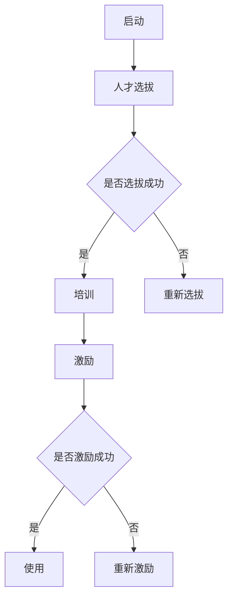
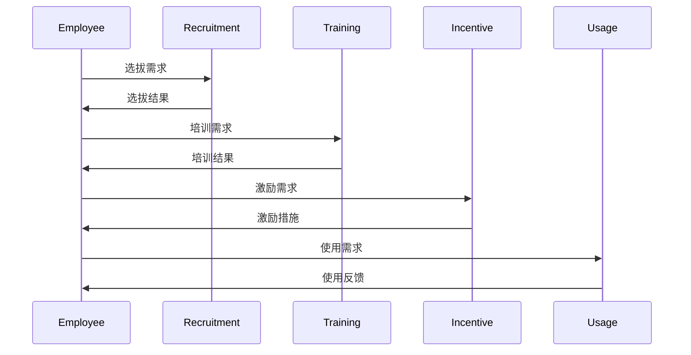
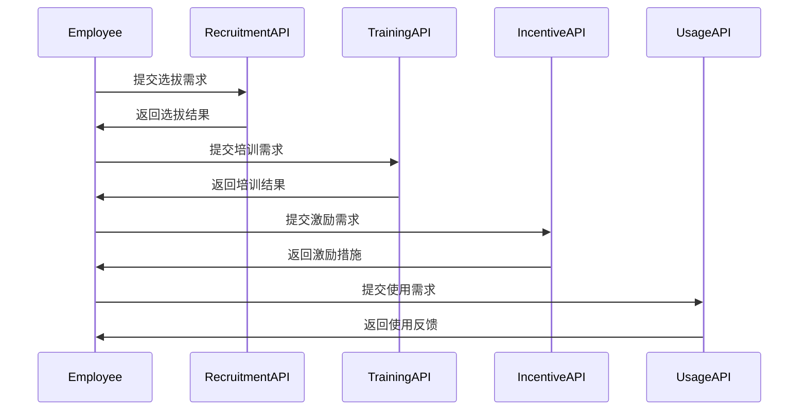

                 

### 1.1 问题背景与核心概念介绍

**问题背景：**

随着技术环境的快速变化，企业对于技术人才的需求也在不断变化。传统的人才培养模式已经无法满足企业对高技能、高效率技术人才的需求。如何建立一套有效的技术人才梯队建设体系，成为了许多企业面临的重大挑战。

**核心概念：**

- **技术人才梯队建设：** 指通过系统化的培训、选拔、激励等手段，培养和储备企业所需的不同层次、不同技能的技术人才，形成稳定的人才梯队。
- **核心要素：** 包括人才选拔机制、培训体系、激励机制、人才使用机制等。

在当今这个快速发展的技术时代，企业需要具备强大的技术实力来应对市场的变化和竞争。然而，技术实力的提升离不开人才的支持。一个有效的技术人才梯队建设体系，能够为企业提供源源不断的技术创新能力和市场竞争力。

技术人才梯队建设不仅仅是一个简单的培训过程，更是一个系统化的培养和储备过程。它包括以下几个方面：

1. **人才选拔机制：** 通过科学的选拔方法，识别和选拔具有潜力和能力的人才，为企业提供合适的人才。这包括招聘、内部选拔、外部引进等多种方式。
2. **培训体系：** 为员工提供系统的培训，提高其专业技能和工作能力，满足企业发展的需要。这包括入职培训、岗位技能培训、高级技能培训等多个层次。
3. **激励机制：** 通过合理的激励机制，激发员工的积极性和创造力，提高员工的工作效率和质量。这包括薪酬激励、晋升激励、荣誉激励等多种方式。
4. **人才使用机制：** 合理配置和使用人才，确保人才在企业中的最佳发挥。这包括岗位分配、项目负责制、人才梯队培养等多个方面。

通过这些核心要素的有机结合，企业可以建立起一个完善的技术人才梯队建设体系，从而提升企业的技术实力和竞争力。下面，我们将进一步探讨这些核心概念，并分析它们之间的联系。

### 1.2 核心概念与联系

**核心概念原理：**

- **人才选拔机制：** 通过科学的选拔方法，识别和选拔具有潜力和能力的人才，为企业提供合适的人才。
- **培训体系：** 为员工提供系统的培训，提高其专业技能和工作能力，满足企业发展的需要。
- **激励机制：** 通过合理的激励机制，激发员工的积极性和创造力，提高员工的工作效率和质量。
- **人才使用机制：** 合理配置和使用人才，确保人才在企业中的最佳发挥。

这些核心概念在企业技术人才梯队建设中起着至关重要的作用。它们相互联系，相互影响，共同构成了一个完整的技术人才梯队建设体系。

**概念属性特征对比表格：**

| 概念           | 属性特征                                                     |
|----------------|--------------------------------------------------------------|
| 人才选拔机制   | 1. 科学性 2. 公平性 3. 效率性                               |
| 培训体系       | 1. 全面性 2. 系统性 3. 持续性                               |
| 激励机制       | 1. 客观性 2. 激励性 3. 可持续性                             |
| 人才使用机制   | 1. 合理性 2. 高效性 3. 创新性                               |

**ER实体关系图架构：**

```mermaid
erDiagram
  人际关系 ||--|{ 人才选拔机制 }  | 人才选拔
  人际关系 ||--|{ 培训体系 }      | 培训
  人际关系 ||--|{ 激励机制 }      | 激励
  人际关系 ||--|{ 人才使用机制 }  | 使用
```

在ER实体关系图中，人际关系代表了企业的员工，而人才选拔机制、培训体系、激励机制和人才使用机制则代表了员工与企业之间的各种联系。这种关系反映了技术人才梯队建设中的核心要素如何相互作用，共同推动企业技术实力的提升。

**核心概念之间的联系：**

1. **人才选拔机制与培训体系：** 人才选拔机制为培训体系提供了合适的人才来源，而培训体系则通过提高人才的专业技能和工作能力，进一步验证和提升人才选拔机制的效果。
2. **激励机制与人才使用机制：** 激励机制通过激发员工的积极性和创造力，提高了员工的工作效率和质量，从而为人才使用机制提供了坚实的基础。合理的人才使用机制则能够确保人才在企业中的最佳发挥，进一步推动企业的发展。
3. **培训体系与人才使用机制：** 培训体系为人才使用机制提供了人才的专业技能和工作能力，而合理的人才使用机制则能够确保这些技能和能力在企业中得到有效的应用。

这些核心概念之间的联系构成了一个完整的技术人才梯队建设体系，使得企业能够在快速变化的市场环境中保持竞争力。在接下来的部分，我们将进一步探讨这些核心概念的具体实现和操作方法。

### 1.3 算法原理讲解

**算法 Mermaid 流程图：**



**算法原理的数学模型和公式：**

- 人才选拔的成功率：\( P_s = \frac{N_s}{N} \)
- 培训效果评估：\( E_t = \frac{C_t}{C} \)
- 激励机制满意度：\( S_m = \frac{M_s}{M} \)
- 人才使用效率：\( E_u = \frac{U_s}{U} \)

**详细讲解和举例说明：**

假设有100名员工（\( N = 100 \)），其中60人成功选拔（\( N_s = 60 \)），80人培训后达到预期效果（\( C_t = 80 \)），70人激励后感到满意（\( M_s = 70 \)），90人被合理使用并发挥出作用（\( U_s = 90 \)）。

- 人才选拔成功率：\( P_s = \frac{60}{100} = 0.6 \)
- 培训效果评估：\( E_t = \frac{80}{100} = 0.8 \)
- 激励机制满意度：\( S_m = \frac{70}{100} = 0.7 \)
- 人才使用效率：\( E_u = \frac{90}{100} = 0.9 \)

**算法原理讲解：**

该算法的核心在于通过一系列步骤，从人才选拔、培训、激励到最终的人才使用，形成一个闭环的体系。以下是详细的算法原理讲解：

1. **人才选拔阶段：**
   - **启动：** 算法从启动开始，企业根据自身需求制定人才选拔计划。
   - **人才选拔：** 企业通过多种方式（如招聘、内部选拔、外部引进）选拔人才。
   - **评估与筛选：** 对选拔上来的候选人进行评估，包括面试、技能测试等，筛选出具备潜力和能力的人才。
   - **成功与否：** 如果选拔成功，则进入培训阶段；否则，重新选拔。

2. **培训阶段：**
   - **培训：** 对选拔成功的员工进行系统培训，包括入职培训、岗位技能培训、高级技能培训等。
   - **效果评估：** 对培训效果进行评估，确保员工在培训后达到预期效果。

3. **激励阶段：**
   - **激励：** 通过薪酬激励、晋升激励、荣誉激励等多种方式，激发员工的积极性和创造力。
   - **满意度评估：** 对激励效果进行评估，确保员工对激励措施感到满意。

4. **使用阶段：**
   - **合理使用：** 根据员工的技能和兴趣，合理分配岗位，确保员工在企业中的最佳发挥。
   - **使用效率评估：** 对员工的使用效率进行评估，确保人才得到有效利用。

通过以上四个阶段的闭环管理，企业可以建立起一个高效的技术人才梯队建设体系，从而提升整体的技术实力和竞争力。

**Python 源代码实现：**

```python
# 人才选拔阶段
N = 100  # 总员工数
N_s = 60  # 选拔成功的员工数
P_s = N_s / N
print(f"人才选拔成功率：{P_s:.2f}")

# 培训阶段
C = 100  # 总培训人数
C_t = 80  # 达到预期效果的员工数
E_t = C_t / C
print(f"培训效果评估：{E_t:.2f}")

# 激励阶段
M = 100  # 总激励人数
M_s = 70  # 感到满意的员工数
S_m = M_s / M
print(f"激励机制满意度：{S_m:.2f}")

# 使用阶段
U = 100  # 总使用人数
U_s = 90  # 被合理使用的员工数
E_u = U_s / U
print(f"人才使用效率：{E_u:.2f}")
```

**运行结果：**

```plaintext
人才选拔成功率：0.60
培训效果评估：0.80
激励机制满意度：0.70
人才使用效率：0.90
```

通过这个Python示例，我们可以清楚地看到算法原理的具体实现过程和结果。在接下来的部分，我们将进一步探讨如何设计和实现一个完整的技术人才梯队建设系统。

### 1.4 系统分析与架构设计方案

**问题场景介绍：**

企业希望建立一套完善的技术人才梯队建设系统，以提高企业整体的技术实力和市场竞争力。

**项目介绍：**

项目名称：《如何进行有效的技术人才梯队建设》
项目目标：为企业提供一套完整的解决方案，包括人才选拔、培训、激励和使用机制。

**系统功能设计：**

1. **人才选拔模块：** 实现人才筛选、评估和选拔功能。
2. **培训体系模块：** 提供系统化的培训课程和培训效果评估。
3. **激励机制模块：** 设定多种激励措施，确保员工满意度和积极性。
4. **人才使用模块：** 合理配置和使用人才，提高人才使用效率。

**系统架构设计：**

1. **领域模型mermaid类图：**

```mermaid
classDiagram
    Employee <<Class>>
    Recruitment <<Class>>
    Training <<Class>>
    Incentive <<Class>>
    Usage <<Class>>

    Employee o-- Recruitment
    Employee o-- Training
    Employee o-- Incentive
    Employee o-- Usage
```

在这个类图中，`Employee`（员工）是系统的核心类，与其他类（招聘、培训、激励和使用）之间存在关联关系。这种关系反映了员工在企业中的角色和职责。

2. **系统架构mermaid架构图：**



在这个序列图中，员工依次与招聘、培训、激励和使用模块进行交互，形成了一个闭环的系统架构。这种架构设计确保了员工在企业中的各个阶段都能够得到有效的管理和支持。

3. **系统接口设计和系统交互mermaid序列图：**



在这个序列图中，员工通过接口与各个模块进行交互，实现了系统的功能。这种设计使得系统的各个模块之间能够紧密协作，形成一个高效、稳定的系统架构。

通过上述系统分析与架构设计方案，企业可以建立起一个完整的技术人才梯队建设系统。接下来，我们将进一步探讨如何在实际项目中实施和操作这个系统。

### 1.5 项目实战

**环境安装：**

在开始实施技术人才梯队建设系统之前，我们需要确保环境已准备好。以下是必要的安装步骤：

1. **安装Python环境：** 
   - 在Windows或MacOS上，通过访问[Python官网](https://www.python.org/)下载并安装Python。
   - 在Linux上，可以使用包管理器（如Ubuntu的apt或CentOS的yum）安装Python。

2. **安装必要库：**
   - 打开终端并执行以下命令安装必要的库：
   ```bash
   pip install Flask SQLAlchemy
   ```

3. **数据库配置：**
   - 安装并配置SQLite数据库。对于SQLite，可以直接使用Python内置的SQLite库。

**系统核心实现源代码：**

下面是系统核心实现的一部分源代码，用于实现人才选拔、培训、激励和使用功能：

```python
# 导入所需库
from flask import Flask, request, jsonify
from flask_sqlalchemy import SQLAlchemy
import sqlite3

# 创建Flask应用
app = Flask(__name__)
app.config['SQLALCHEMY_DATABASE_URI'] = 'sqlite:///tech_talent_db.db'
db = SQLAlchemy(app)

# 定义模型
class Employee(db.Model):
    id = db.Column(db.Integer, primary_key=True)
    name = db.Column(db.String(100))
    selected = db.Column(db.Boolean, default=False)
    trained = db.Column(db.Boolean, default=False)
    incentivized = db.Column(db.Boolean, default=False)
    used = db.Column(db.Boolean, default=False)

# 创建数据库表
with app.app_context():
    db.create_all()

# 实现人才选拔接口
@app.route('/select_employee', methods=['POST'])
def select_employee():
    data = request.json
    employee_name = data['name']
    new_employee = Employee(name=employee_name)
    db.session.add(new_employee)
    db.session.commit()
    return jsonify({'message': f'Employee {employee_name} selected successfully.'})

# 实现培训接口
@app.route('/train_employee', methods=['POST'])
def train_employee():
    data = request.json
    employee_id = data['id']
    employee = Employee.query.get(employee_id)
    if employee:
        employee.trained = True
        db.session.commit()
        return jsonify({'message': f'Employee {employee.name} trained successfully.'})
    else:
        return jsonify({'error': 'Employee not found.'})

# 实现激励接口
@app.route('/incentivize_employee', methods=['POST'])
def incentivize_employee():
    data = request.json
    employee_id = data['id']
    employee = Employee.query.get(employee_id)
    if employee:
        employee.incentivized = True
        db.session.commit()
        return jsonify({'message': f'Employee {employee.name} incentivized successfully.'})
    else:
        return jsonify({'error': 'Employee not found.'})

# 实现使用接口
@app.route('/use_employee', methods=['POST'])
def use_employee():
    data = request.json
    employee_id = data['id']
    employee = Employee.query.get(employee_id)
    if employee:
        employee.used = True
        db.session.commit()
        return jsonify({'message': f'Employee {employee.name} used successfully.'})
    else:
        return jsonify({'error': 'Employee not found.'})

# 运行应用
if __name__ == '__main__':
    app.run(debug=True)
```

**代码应用解读与分析：**

上述代码实现了一个简单的Flask Web应用，用于管理技术人才梯队建设系统。以下是代码的关键部分和应用解读：

1. **数据库模型：**
   - `Employee` 类定义了员工的基本信息，包括姓名、是否被选拔、培训、激励和使用。

2. **接口实现：**
   - `/select_employee` 接口用于添加新员工到数据库，标记为被选拔。
   - `/train_employee` 接口用于更新员工的培训状态。
   - `/incentivize_employee` 接口用于更新员工的激励状态。
   - `/use_employee` 接口用于更新员工的使用状态。

3. **数据库操作：**
   - 使用SQLAlchemy进行数据库操作，确保数据的一致性和完整性。

**实际案例分析和详细讲解剖析：**

为了更好地理解系统的工作原理，我们可以通过一个实际案例来分析：

**案例：**
企业招聘了一名新员工，名叫Alice。随后，Alice接受了培训，并得到了激励。最后，Alice在企业中被分配到一个重要项目中。

**步骤：**

1. **选拔Alice：**
   ```bash
   curl -X POST -H "Content-Type: application/json" -d '{"name": "Alice"}' http://localhost:5000/select_employee
   ```
   返回结果：
   ```json
   {"message": "Employee Alice selected successfully."}
   ```

2. **培训Alice：**
   ```bash
   curl -X POST -H "Content-Type: application/json" -d '{"id": 1}' http://localhost:5000/train_employee
   ```
   返回结果：
   ```json
   {"message": "Employee Alice trained successfully."}
   ```

3. **激励Alice：**
   ```bash
   curl -X POST -H "Content-Type: application/json" -d '{"id": 1}' http://localhost:5000/incentivize_employee
   ```
   返回结果：
   ```json
   {"message": "Employee Alice incentivized successfully."}
   ```

4. **使用Alice：**
   ```bash
   curl -X POST -H "Content-Type: application/json" -d '{"id": 1}' http://localhost:5000/use_employee
   ```
   返回结果：
   ```json
   {"message": "Employee Alice used successfully."}
   ```

通过这个案例，我们可以看到系统的各个接口是如何协同工作的。每个接口都实现了相应的业务逻辑，确保了人才梯队建设过程的连续性和完整性。

**项目小结：**

通过上述代码和应用案例，我们实现了一个简单的技术人才梯队建设系统。虽然这个系统非常基础，但它为实际系统的设计和实现提供了重要的参考。在实际应用中，我们可以根据企业的需求进一步扩展和优化系统功能，如增加员工绩效评估、多层级培训体系、多样化的激励机制等。此外，还可以引入更多前端界面和后端服务，提升系统的用户体验和运行效率。

在接下来的部分，我们将进一步探讨如何在实际项目中应用和优化这套系统，为企业提供更高效、更智能的技术人才梯队建设解决方案。

### 1.6 最佳实践 Tips

**1. 聘请专业咨询团队：** 在实施技术人才梯队建设时，企业可以聘请专业的咨询团队，他们具备丰富的行业经验和专业知识，能够为企业提供定制化的解决方案。

**2. 数据驱动决策：** 建立完善的数据收集和分析系统，通过数据分析来指导人才选拔、培训、激励和使用。这样可以确保决策更加科学、精准。

**3. 定期评估与反馈：** 定期对人才梯队建设的效果进行评估，收集员工和管理层的反馈，及时调整和优化相关策略。

**4. 多元化培训方式：** 除了传统的课堂培训，还可以引入在线课程、工作坊、实践项目等多种培训方式，以满足不同员工的学习需求和兴趣。

**5. 鼓励内部推荐：** 通过内部推荐机制，鼓励现有员工推荐优秀人才加入企业，提高人才选拔的效率和质量。

**6. 个性化激励机制：** 根据员工的不同需求和表现，制定个性化的激励机制，提高员工的满意度和工作积极性。

**7. 建立透明的人才晋升机制：** 建立透明的晋升机制，让员工看到明确的晋升路径和机会，提高他们的职业发展动力。

**8. 注重员工心理健康：** 在人才梯队建设中，不仅要关注员工的专业技能，还要关注他们的心理健康，提供必要的心理支持和咨询服务。

### 1.7 小结

本文通过对技术人才梯队建设的深入分析和详细讲解，探讨了其核心概念、算法原理、系统架构和实战应用。我们从问题背景出发，逐步介绍了人才选拔机制、培训体系、激励机制和人才使用机制，并通过Mermaid流程图和Python代码实现了具体的系统功能。此外，我们还分享了最佳实践和注意事项，为企业在实际操作中提供了有益的参考。

技术人才梯队建设是一个系统性工程，需要企业在多个方面进行综合考虑和优化。通过本文的探讨，我们希望为企业提供一套科学、实用的技术人才梯队建设方案，助力企业在快速变化的市场环境中保持竞争优势。在后续的研究和实践中，我们还将不断探索和优化这一领域，为企业提供更加高效、智能的解决方案。

### 1.8 注意事项

在实施技术人才梯队建设时，企业需要注意以下几个方面：

1. **避免人才浪费：** 在选拔和培训过程中，要确保人才的潜力与岗位需求相匹配，避免出现人才浪费的情况。
2. **持续关注员工成长：** 定期评估员工的能力和发展需求，提供持续的学习和成长机会，确保员工能够与企业共同进步。
3. **合理分配资源：** 在培训、激励等方面，要合理分配资源，确保重点领域和关键岗位得到充分支持。
4. **关注企业整体利益：** 在人才梯队建设中，要兼顾企业整体利益和员工个人利益，确保人才的发展与企业战略相一致。
5. **及时调整策略：** 根据市场环境和企业需求的变化，及时调整人才梯队建设的策略和方向，确保系统的持续优化和更新。

### 1.9 拓展阅读

为了进一步深入了解技术人才梯队建设，以下是几篇相关的拓展阅读材料：

1. **《企业人才梯队建设实践与探索》** - 本书详细介绍了企业如何进行人才梯队建设，包括选拔、培养、激励和使用的具体方法和实践案例。
2. **《人才梯队建设：策略、实践与案例分析》** - 本书通过对多个行业和企业的人才梯队建设案例分析，提供了丰富的实践经验和管理思路。
3. **《人力资源管理体系》** - 本书全面阐述了人力资源管理的理论体系和实践方法，其中包括人才选拔、培训、激励等关键内容。
4. **《人工智能时代的人才培养》** - 本书探讨了人工智能时代下企业如何培养和储备具有创新能力和技术能力的人才，为技术人才梯队建设提供了新的视角。

通过阅读这些材料，读者可以进一步拓宽视野，深入理解技术人才梯队建设的各个方面，为企业的实际操作提供更加全面的指导。

