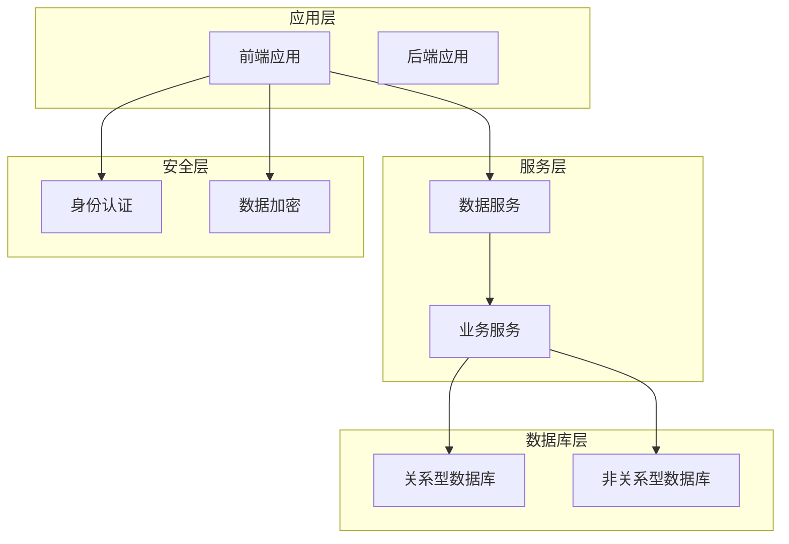

                 

## 第1章：问题背景与概述

### 1.1 问题背景

在当今快速发展的信息技术时代，技术供应商管理已成为企业运营的重要组成部分。有效的技术供应商管理不仅能够确保企业获得高质量的技术产品和服务，还能帮助企业在市场竞争中占据有利位置。然而，技术供应商管理并非易事，许多企业在这一领域面临着诸多挑战。

首先，供应商选择不当是企业面临的主要问题之一。在选择供应商时，企业往往仅关注价格因素，而忽视了供应商的技术能力、服务质量等关键因素。这种选择方式可能导致供应商无法满足企业的需求，甚至影响企业的正常运营。

其次，合同管理不力也是企业普遍存在的问题。合同内容模糊、条款不明确，使得企业在与供应商的纠纷中处于被动地位。此外，合同执行过程中的监管不力，也使得企业的权益无法得到保障。

最后，供应商关系处理不善可能导致合作关系破裂，影响企业的长期发展。企业与供应商之间的沟通不畅、利益冲突等问题，都会对供应商关系产生负面影响。

### 1.2 问题描述

在本章节中，我们将围绕以下问题展开讨论：

1. **如何选择合适的技术供应商？**
   - 供应商调研：如何了解供应商的基本信息、技术能力、市场口碑等？
   - 供应商评估：如何根据企业的需求和供应商的能力，进行综合评估？
   - 供应商谈判：如何确定合作价格、合同条款等？

2. **如何管理与供应商的合同？**
   - 合同条款的明确性：如何确保合同条款清晰、明确，避免歧义？
   - 合同执行的监管：如何对供应商的执行情况进行监控，确保合同得到履行？
   - 合同变更的处理：如何对合同变更进行及时处理，确保企业的利益？

3. **如何处理与供应商的关系？**
   - 沟通协调：如何建立良好的沟通机制，确保信息的透明和畅通？
   - 合作共赢：如何与供应商建立长期稳定的合作关系，实现共赢？
   - 冲突处理：如何遇到冲突时，采取合适的处理方法，化解矛盾？

通过本章节的学习，读者将了解到技术供应商管理的核心概念和原则，掌握选择合适供应商的方法和技巧，熟悉合同管理的关键点和注意事项，以及处理供应商关系的策略和方法。

### 1.3 问题解决

为了解决上述问题，本章节将介绍以下内容：

- **技术供应商管理概述**：介绍技术供应商管理的核心概念和作用，明确其边界与外延。
- **核心概念与联系**：阐述技术供应商和企业之间的核心概念原理，以及二者之间的联系。
- **选择合适的技术供应商**：详细讲解选择供应商的方法和技巧，以及关键点的注意事项。
- **管理与供应商的合同**：介绍合同管理的关键点和注意事项，以及合同管理的方法和工具。
- **处理与供应商的关系**：阐述处理供应商关系的策略和方法，以及供应商关系的评估与改进。

通过这些内容的介绍，读者将能够系统地了解技术供应商管理的各个方面，为实际操作提供指导。

### 1.4 边界与外延

技术供应商管理适用于各类企业，无论其规模大小、行业属性如何，都需要对技术供应商进行有效的管理。然而，不同企业、不同行业在技术供应商管理方面可能存在差异，需要根据实际情况进行调整。

在技术供应商管理中，核心概念包括技术供应商、企业、供应商选择、合同管理、供应商关系等。这些概念相互关联，共同构成了技术供应商管理的理论体系。

### 1.5 概念结构与核心要素组成

- **技术供应商管理**：指企业对技术供应商的选择、评估、合作、监控等活动的总称。
- **供应商选择**：根据企业的需求和供应商的能力，选择合适的供应商。
- **合同管理**：对供应商提供的产品或服务进行合同约束和监管。
- **供应商关系**：企业与供应商之间的合作关系，包括沟通、合作、冲突处理等。

通过以上对技术供应商管理的背景、问题描述、问题解决、边界与外延以及概念结构与核心要素组成的介绍，读者可以初步了解技术供应商管理的重要性和基本框架。接下来，我们将进一步深入探讨技术供应商管理的核心概念和联系。

## 第2章：核心概念与联系

### 2.1 核心概念原理

在技术供应商管理中，有两个核心概念：技术供应商和企业。它们分别代表了供应商和企业的本质属性，以及它们在技术供应商管理中的角色和作用。

- **技术供应商**：技术供应商是指提供技术产品或服务的第三方企业。这些企业通常具备特定的技术能力、丰富的行业经验以及完善的服务体系。技术供应商在技术供应商管理中扮演着提供技术产品和服务的关键角色，是企业在技术领域的重要合作伙伴。

- **企业**：企业是指需要技术产品或服务的主体，是技术供应商管理的主要参与者。企业根据自身的业务需求、发展战略和资源条件，选择合适的技术供应商，并与供应商建立合作关系，以确保自身在技术领域的竞争力和可持续发展。

### 2.2 概念属性特征对比表格

为了更清晰地理解技术供应商和企业这两个核心概念，我们可以通过对比它们的属性特征，来进一步明确它们在技术供应商管理中的作用。

| 概念         | 技术供应商                     | 企业                        |
| ------------ | ------------------------------ | --------------------------- |
| 定义         | 提供技术产品或服务的第三方企业 | 需要技术产品或服务的主体    |
| 选择依据     | 技术能力、服务质量、价格      | 需求、预算、战略目标        |
| 合作模式     | 订购、合作、定制              | 合作、采购、外包            |
| 管理方法     | 考核、评估、监控              | 项目管理、成本控制、绩效评估 |

通过上述对比表格，我们可以看到，技术供应商和企业之间存在显著的差异。技术供应商主要负责提供技术产品和服务，其选择依据主要包括技术能力、服务质量和价格。而企业则根据自身的需求和资源条件，选择合适的技术供应商，并通过合作、采购和外包等方式，与供应商建立合作关系。

### 2.3 ER实体关系图架构

为了更直观地理解技术供应商和企业之间的实体关系，我们可以使用Mermaid ER图来表示。以下是一个简单的ER图示例：

```mermaid
erDiagram
  企业 ||--|{ 技术供应商 }|
  企业 ||--|{ 采购订单 }|
  企业 ||--|{ 供应商评价 }|
  技术供应商 ||--|{ 产品 }|
  技术供应商 ||--|{ 服务 }|
```

在这个ER图中，企业作为主体，与多个技术供应商、采购订单和供应商评价相关联。技术供应商提供产品和服务的实体，同时也与企业的采购订单和供应商评价有关联。这个ER图展示了技术供应商管理中的关键实体及其相互关系。

通过上述对核心概念原理、属性特征对比表格和ER实体关系图架构的介绍，我们可以更加深入地理解技术供应商管理的核心概念和联系。在接下来的章节中，我们将进一步探讨如何选择合适的技术供应商，以及如何管理与供应商的合同和关系。

### 2.4 技术供应商与企业之间的相互作用

在技术供应商管理中，技术供应商和企业之间的相互作用是至关重要的。它们不仅相互依赖，还通过一系列的管理活动实现共赢。

首先，技术供应商和企业之间的相互作用体现在信息交流和资源共享上。企业通过了解供应商的技术能力、市场口碑和过往业绩，来评估其是否满足自身的需求。同时，技术供应商也通过了解企业的业务模式、发展战略和需求，来调整自己的服务内容和策略。这种双向的信息交流，有助于建立互信和合作关系。

其次，技术供应商和企业之间的相互作用还体现在合作共赢的目标上。企业希望通过与优质的技术供应商合作，获得高质量的技术产品和服务，从而提升自身的产品竞争力。而技术供应商则希望通过与企业的合作，扩大市场份额，提升品牌知名度。双方在合作过程中，通过共同的利益驱动，实现资源共享、优势互补，形成一种互利共赢的关系。

最后，技术供应商和企业之间的相互作用还体现在合作机制的建立和执行上。企业通过签订合同、设立项目管理制度，来确保供应商提供的产品和服务符合预期。而技术供应商则通过严格按照合同要求执行项目，确保企业的权益得到保障。这种合作机制的建立和执行，有助于降低合作风险，提升合作效果。

总的来说，技术供应商和企业之间的相互作用，是技术供应商管理成功的关键。通过有效沟通、资源共享和合作共赢，双方可以共同实现长期稳定的发展。

### 2.5 技术供应商管理的具体应用场景

技术供应商管理在各类企业中有着广泛的应用场景。以下是几个典型的应用案例：

1. **制造企业**：制造企业在生产过程中，需要大量的机械设备、原材料和软件支持。通过有效的技术供应商管理，企业可以确保这些物资和服务的高质量供应，从而提高生产效率和产品质量。

2. **信息技术企业**：信息技术企业在开发新产品和提供技术服务时，需要依赖各种技术供应商，如硬件供应商、软件供应商和服务供应商。通过有效的技术供应商管理，企业可以确保技术资源的稳定供应，加快产品开发进度，提高市场竞争力。

3. **金融行业**：金融行业在运营过程中，需要使用各种金融软件和技术服务，如银行后台系统、支付平台和安全防护系统。通过有效的技术供应商管理，金融机构可以确保技术系统的稳定运行，保障客户数据和资产安全。

4. **医疗行业**：医疗行业在医疗设备、药品研发和技术服务等方面，对技术供应商有着高度依赖。通过有效的技术供应商管理，医疗机构可以确保医疗设备和药品的高质量供应，提升医疗服务水平。

5. **教育行业**：教育行业在教育信息化、在线教育平台和技术支持等方面，需要大量技术供应商的参与。通过有效的技术供应商管理，学校和教育机构可以为学生提供更好的学习资源和环境，提升教育质量。

这些应用场景表明，技术供应商管理在各类企业中都具有重要的现实意义。通过科学合理的技术供应商管理，企业可以降低成本、提高产品质量，从而在激烈的市场竞争中占据有利位置。

### 2.6 技术供应商管理的实际案例解析

为了更好地理解技术供应商管理的实际应用，我们可以通过几个具体的案例来进行分析。

#### 案例一：某制造企业的技术供应商管理

某制造企业为了提升生产效率，决定引进一条先进的自动化生产线。在供应商选择过程中，企业首先对市场进行调研，筛选出几家具有良好声誉和先进技术能力的供应商。接着，企业对这几家供应商进行了综合评估，包括技术能力、服务质量、价格竞争力等方面的考量。最终，企业选择了其中一家技术实力最强、服务最优质的供应商进行合作。

在合同管理方面，企业通过详细列明合同条款，包括项目范围、交付时间、售后服务等内容，确保供应商能够严格按照合同要求执行项目。在合同执行过程中，企业对供应商的进度和质量进行了严格监控，通过定期召开项目会议和进行现场检查，确保项目按计划进行。

通过有效的技术供应商管理，该制造企业成功引进了先进的自动化生产线，大幅提高了生产效率，降低了生产成本，实现了企业的发展目标。

#### 案例二：某信息技术企业的技术供应商管理

某信息技术企业在开发一款新产品时，需要使用多种技术组件和服务。为了确保技术组件的质量和服务的稳定性，企业对供应商进行了严格的选择。在选择过程中，企业不仅考虑了供应商的技术能力和市场口碑，还对其售后服务和合作案例进行了深入调研。

在合同管理方面，企业通过签订详细的技术组件和服务合同，明确规定了供应商的交付时间、技术支持内容和违约责任。在合同执行过程中，企业对供应商的技术组件进行了严格的质量检测，确保其符合产品开发的要求。同时，企业还通过定期与技术供应商召开项目会议，及时解决合作过程中出现的问题。

通过有效的技术供应商管理，该信息技术企业成功开发出了高质量的新产品，并在市场上取得了良好的反响。

#### 案例三：某金融机构的技术供应商管理

某金融机构在运营过程中，需要使用一系列金融软件和技术服务。为了确保这些软件和服务的安全性、稳定性和合规性，金融机构对技术供应商进行了严格的选择和管理。

在选择供应商时，金融机构不仅考察了供应商的技术能力和市场口碑，还对其财务状况、资质认证和售后服务进行了全面评估。最终，金融机构选择了几家具备优秀资质和技术能力的供应商进行合作。

在合同管理方面，金融机构通过签订详细的合同，明确了供应商的服务内容、交付时间、技术支持要求等。在合同执行过程中，金融机构对供应商的服务进行了严格监控，并通过定期审查和评估，确保供应商的服务质量和合规性。

通过有效的技术供应商管理，该金融机构成功确保了金融软件和服务的稳定运行，提升了运营效率，保障了客户数据和资产的安全。

通过以上实际案例的解析，我们可以看到，技术供应商管理在各类企业中的重要性。通过科学合理的供应商选择、合同管理和关系处理，企业可以确保技术产品和服务的高质量供应，从而实现自身的发展目标。

## 第3章：选择合适的技术供应商

### 3.1 供应商选择的方法和技巧

选择合适的技术供应商是技术供应商管理的第一步，也是至关重要的一步。以下将详细介绍供应商选择的方法和技巧，帮助企业在众多供应商中挑选出最合适的合作伙伴。

#### 3.1.1 供应商调研

1. **市场调研**：
   - **收集信息**：通过行业报告、市场分析、客户推荐等渠道，收集潜在供应商的基本信息，包括公司背景、业务范围、市场地位等。
   - **筛选供应商**：根据企业的需求和预算，筛选出具有潜在合作可能性的供应商。

2. **网上调查**：
   - **官网访问**：访问供应商的官方网站，了解其产品和服务详情、企业文化和客户案例。
   - **搜索引擎**：利用搜索引擎，查找供应商的相关新闻、评论和用户反馈。

3. **参考第三方评价**：
   - **信用评级**：查阅第三方信用评级机构对供应商的评价报告。
   - **行业排名**：参考行业排名和奖项，了解供应商的市场地位和口碑。

#### 3.1.2 供应商评估

1. **技术能力评估**：
   - **技术水平**：考察供应商的技术实力，包括研发能力、技术水平、技术创新等。
   - **专业资质**：检查供应商是否具备相关行业资质认证，如ISO认证、专业认证等。

2. **服务质量评估**：
   - **服务响应**：评估供应商在问题反馈、解决速度和响应态度方面的表现。
   - **售后服务**：了解供应商的售后服务体系，包括保修政策、维修服务、技术支持等。

3. **价格评估**：
   - **成本比较**：对比多家供应商的价格，确保成本在合理范围内。
   - **性价比**：综合考虑价格和产品质量，选择性价比最高的供应商。

4. **风险评估**：
   - **财务状况**：考察供应商的财务健康程度，避免合作过程中因供应商破产等原因导致的风险。
   - **业务稳定性**：了解供应商的营业范围、市场份额、业务增长率等，评估其业务稳定性。

#### 3.1.3 供应商谈判

1. **确定谈判目标**：
   - **合作条款**：明确双方的合作范围、责任和义务，包括项目范围、交付时间、质量标准等。
   - **价格谈判**：确定合理的合作价格，确保供应商的价格具有竞争力，同时保障企业的利益。

2. **谈判策略**：
   - **优势谈判**：利用企业优势，如采购量、长期合作等，争取更好的合作条件。
   - **双赢谈判**：以合作共赢为目标，通过谈判达成双方都满意的协议。

3. **合同签订**：
   - **合同条款**：明确列出双方的权利和义务，确保合同的合法性和可执行性。
   - **法律咨询**：在签订合同前，寻求专业律师的意见，确保合同条款的合法性和合理性。

### 3.2 选择供应商的关键点

在技术供应商选择过程中，以下关键点需要特别注意：

1. **技术能力**：
   - **匹配度**：供应商的技术能力是否与企业需求相匹配，能够满足企业的技术要求。
   - **创新能力**：供应商是否具备持续创新的能力，能否为企业带来新技术和新解决方案。

2. **服务质量**：
   - **可靠性**：供应商提供的产品和服务是否稳定可靠，能否满足企业的长期需求。
   - **响应速度**：供应商在处理问题和解决问题方面的响应速度和效率。

3. **价格优势**：
   - **性价比**：在保证质量的前提下，选择性价比最高的供应商，确保企业能够在预算范围内获得高质量的产品和服务。

4. **合作经验**：
   - **成功案例**：供应商是否有类似的成功案例，能否为企业提供可靠的参考。
   - **合作历史**：供应商的合作历史和信誉，反映其业务稳定性和可靠性。

5. **财务状况**：
   - **稳定度**：供应商的财务状况是否稳定，避免因供应商财务问题导致合作中断。

### 3.3 选择供应商的案例分析

以下是一个具体的选择供应商的案例分析：

**案例背景**：某大型企业计划引进一条新的生产线，以提高生产效率和产品质量。企业在供应商选择过程中，采用了以下步骤：

1. **市场调研**：
   - 通过行业报告和市场分析，筛选出10家具有良好声誉和先进技术能力的供应商。
   - 通过官方网站、搜索引擎和第三方评价平台，进一步了解这些供应商的基本信息。

2. **技术能力评估**：
   - 对供应商的技术水平、专业资质、研发能力等方面进行评估。
   - 通过查看供应商的技术案例和产品演示，评估其技术匹配度和创新能力。

3. **服务质量评估**：
   - 通过向其他企业咨询，了解供应商的服务响应速度和售后服务质量。
   - 通过实地考察和现场交流，了解供应商的现场服务能力。

4. **价格评估**：
   - 比较不同供应商的报价，评估其性价比。
   - 通过谈判，争取到最优惠的合作价格。

5. **合作经验评估**：
   - 查看供应商的合作案例和客户评价，评估其业务稳定性和可靠性。
   - 通过与供应商的沟通，了解其合作历史和信誉。

6. **财务状况评估**：
   - 调查供应商的财务状况，确保其具备稳定的财务能力和业务稳定性。

**最终选择**：经过综合评估，企业选择了其中一家技术能力最强、服务质量最高、价格最合理的供应商进行合作。在合同签订过程中，企业明确列出了合作条款，并进行了法律咨询，确保合同的合法性和合理性。

通过上述案例，我们可以看到，选择合适的技术供应商需要通过一系列的调研、评估和谈判步骤，确保供应商的技术能力、服务质量、价格优势、合作经验和财务状况等方面都能够满足企业的需求。

### 3.4 选择供应商过程中常见的问题及解决方法

在选择合适的技术供应商过程中，企业常常会遇到一些问题。以下列出几个常见的问题及其解决方法：

1. **供应商调研不充分**：
   - **解决方法**：加强市场调研，通过多种渠道收集供应商信息，并进行充分验证。

2. **评估标准不明确**：
   - **解决方法**：制定明确的评估标准，包括技术能力、服务质量、价格、合作经验等，确保评估过程的客观性和全面性。

3. **价格谈判失败**：
   - **解决方法**：提前制定谈判策略，利用企业的采购量和长期合作关系等优势，争取更好的价格。

4. **合同条款不明确**：
   - **解决方法**：在签订合同前，详细列明双方的权利和义务，确保合同的合法性和可执行性。

5. **供应商选择不当**：
   - **解决方法**：建立供应商库，定期更新和评估供应商信息，确保选择的供应商符合企业的需求。

通过上述问题的解决方法，企业可以更加有效地选择合适的技术供应商，降低合作风险，提高合作效果。

通过本章对选择合适的技术供应商的方法和技巧、关键点、案例分析及常见问题的详细介绍，读者可以更加系统地了解如何进行技术供应商选择。在接下来的章节中，我们将进一步探讨如何管理与供应商的合同。

## 第4章：管理与供应商的合同

### 4.1 合同管理的关键点和注意事项

合同管理是技术供应商管理中至关重要的一环。有效的合同管理能够确保供应商遵守约定，提供高质量的产品和服务，同时保障企业的合法权益。以下将介绍合同管理中的关键点和注意事项。

#### 4.1.1 合同条款的明确性

合同条款的明确性是合同管理的基础。在签订合同时，应确保以下内容：

1. **项目范围**：明确项目涵盖的具体内容、服务范围和交付物。
2. **交付时间**：明确各阶段交付的时间和进度安排。
3. **质量标准**：规定产品或服务的质量标准，确保供应商提供的产品和服务符合企业的要求。
4. **价格和支付方式**：明确价格、付款方式和付款时间，避免因价格和支付问题产生纠纷。
5. **违约责任**：规定供应商在违约情况下应承担的责任和违约金等。
6. **保密协议**：明确双方在合作过程中涉及的商业秘密和知识产权的保护措施。

#### 4.1.2 合同执行的监管

在合同执行过程中，企业需要加强对供应商的监管，确保合同条款得到履行。以下是一些监管措施：

1. **进度跟踪**：定期检查供应商的进度，确保项目按计划进行。
2. **质量控制**：对供应商提供的产品和服务进行质量检测，确保其符合质量标准。
3. **沟通协调**：保持与供应商的定期沟通，及时解决合作过程中出现的问题。
4. **现场检查**：必要时进行现场检查，确保供应商按照合同要求执行项目。

#### 4.1.3 合同变更的处理

在合同执行过程中，可能会出现需要变更合同条款的情况。企业应制定合理的变更流程，确保变更的合法性和合理性。以下是一些变更处理的注意事项：

1. **变更申请**：任何一方提出变更申请时，应详细说明变更的原因和内容。
2. **评估影响**：评估变更对项目进度、成本和质量的影响，确保变更的可行性。
3. **协商一致**：双方协商一致后，签署变更协议，明确变更的具体内容和执行时间。
4. **合同更新**：及时更新合同，确保变更内容在合同中予以明确。

### 4.2 合同管理的方法和工具

为了提高合同管理的效率，企业可以采用以下方法和工具：

#### 4.2.1 电子合同

电子合同是一种便捷的合同管理方式，通过线上平台签署和存储合同，提高合同签署的效率和安全性。以下是一些电子合同的优势：

1. **提高签署效率**：线上签署合同，无需纸质文件往返，节省时间和人力成本。
2. **保障合同安全**：使用数字签名技术，确保合同的合法性和安全性。
3. **便于查询和管理**：合同存储在云端，方便随时查询和管理。

#### 4.2.2 合同管理系统

合同管理系统是一种集成化的合同管理工具，可以帮助企业对合同进行分类、归档、监控和管理。以下是一些合同管理系统的功能：

1. **合同分类和归档**：根据合同类型、项目、部门等分类，方便检索和管理。
2. **合同监控和提醒**：设置合同到期、续签、变更等提醒，确保合同按时处理。
3. **权限管理**：设置合同访问权限，确保合同信息的保密性和安全性。
4. **统计和分析**：对合同执行情况进行统计和分析，为企业决策提供数据支持。

#### 4.2.3 法律咨询

在合同管理过程中，企业可能会遇到复杂的法律问题。寻求专业法律咨询，可以帮助企业：

1. **审查合同条款**：确保合同条款的合法性和合理性。
2. **提供法律意见**：在合同签订、变更和纠纷处理过程中，提供专业法律建议。
3. **参与谈判**：在合同谈判过程中，协助企业争取合法权益。

### 4.3 合同管理案例解析

以下是一个具体的合同管理案例：

**案例背景**：某企业计划与一家技术供应商合作开发一款新产品。在合同管理过程中，企业采取了以下措施：

1. **合同起草**：企业法务部门起草合同，明确项目范围、交付时间、质量标准、价格和支付方式等条款。
2. **合同审查**：企业法务部门对合同进行审查，确保合同条款的合法性和合理性。
3. **合同签订**：企业与供应商进行谈判，最终签署了详细的合同。
4. **合同执行监控**：企业在项目执行过程中，对供应商的进度、质量进行监控，确保合同条款得到履行。
5. **合同变更处理**：在项目执行过程中，因市场变化，企业需要对部分合同条款进行变更。企业与供应商协商一致，签署了变更协议。
6. **合同管理工具**：企业使用合同管理系统，对合同进行分类、归档和监控，提高了合同管理的效率。

通过上述案例，我们可以看到，有效的合同管理能够确保项目的顺利进行，降低合作风险，保障企业的合法权益。

通过本章对合同管理的关键点和注意事项、方法和工具以及案例解析的介绍，读者可以更加系统地了解如何进行有效的合同管理。在接下来的章节中，我们将探讨如何处理与供应商的关系。

## 第5章：处理与供应商的关系

### 5.1 处理供应商关系的策略和方法

建立和维护良好的供应商关系对于企业的长期发展和竞争力的提升至关重要。以下将介绍处理供应商关系的策略和方法。

#### 5.1.1 沟通协调

1. **建立沟通机制**：建立定期沟通机制，如定期会议、报告会和在线交流，确保信息的透明和畅通。

2. **沟通内容明确**：在沟通时，明确传达企业的需求、期望和标准，确保双方在合作中目标一致。

3. **积极回应**：及时回应供应商的问题和反馈，展现企业的合作态度和责任心。

4. **沟通技巧**：运用有效的沟通技巧，如倾听、表达清晰、换位思考等，促进双方的理解和合作。

#### 5.1.2 合作共赢

1. **共享信息**：与供应商共享市场需求、业务规划和战略目标，增强双方的协同效应。

2. **共同利益**：通过合作实现共赢，如在研发、市场拓展等方面形成战略合作，共同提升市场竞争力。

3. **利益分配**：在合作过程中，合理分配利益，确保供应商能够获得合理的利润，增强其合作积极性。

4. **激励机制**：建立激励机制，如奖励、表彰等，激励供应商提升服务质量和技术水平。

#### 5.1.3 冲突处理

1. **预防冲突**：通过明确的合同条款和良好的沟通，预防潜在的冲突。

2. **冲突管理**：在冲突发生时，采取合适的处理方法，如调解、协商等，及时化解矛盾。

3. **公平公正**：在处理冲突时，坚持公平公正的原则，确保双方的利益得到保护。

4. **协商解决**：通过协商达成双方都能接受的解决方案，避免冲突的升级。

### 5.2 供应商关系的评估与改进

#### 5.2.1 评估指标

为了有效评估供应商关系，企业可以设定以下评估指标：

1. **合作满意度**：通过问卷调查、员工反馈等方式，了解企业与供应商的合作满意度。

2. **服务质量**：评估供应商提供的产品或服务的质量是否符合企业的标准。

3. **交货及时性**：评估供应商交货的及时性，确保项目按计划进行。

4. **成本效益**：评估供应商提供的成本是否在合理范围内，确保企业的成本效益最大化。

5. **合作稳定性**：评估供应商的合作稳定性，包括其业务连续性、财务状况等。

#### 5.2.2 改进措施

根据评估结果，企业可以采取以下改进措施：

1. **优化沟通机制**：根据反馈，优化沟通方式和频率，确保信息的有效传递。

2. **提升服务质量**：通过培训和改进，提升供应商的服务质量，满足企业的需求。

3. **调整合作关系**：根据供应商的评估结果，调整合作策略，如增加采购量、延长合作期限等。

4. **建立激励机制**：通过奖励和表彰，激励供应商提升服务水平和技术能力。

5. **签订长期合同**：与表现优秀的供应商签订长期合同，确保稳定的合作关系。

### 5.3 供应商关系管理案例

以下是一个具体的供应商关系管理案例：

**案例背景**：某企业需要与一家技术供应商合作开发一款新产品。在合作过程中，企业采取了以下策略和方法：

1. **建立沟通机制**：企业每月召开一次项目会议，与供应商讨论项目的进展情况和存在的问题。

2. **明确需求**：在项目启动阶段，企业详细阐述了产品需求、质量标准和交付时间等，确保双方在合作中目标一致。

3. **定期评估**：企业每季度对供应商的服务质量、交货及时性和成本效益等方面进行评估，确保供应商的持续改进。

4. **合作共赢**：企业与供应商建立了长期战略合作关系，通过共享市场信息和资源，共同提升市场竞争力。

5. **处理冲突**：在一次项目延期后，企业与供应商进行了沟通和协商，最终通过调整交付时间和增加资源投入，解决了冲突。

通过上述案例，我们可以看到，有效的供应商关系管理能够促进双方的长期合作，提升企业的竞争力。在接下来的章节中，我们将进一步探讨技术供应商管理的最佳实践和注意事项。

### 5.4 供应商关系管理的最佳实践

为了确保技术供应商管理的效果，以下是一些最佳实践：

#### 5.4.1 建立长期合作关系

1. **共同愿景**：与供应商共同制定长期发展战略，确保双方目标一致。
2. **定期评估**：定期对供应商进行评估，确保合作关系持续优化。
3. **互信机制**：建立互信机制，通过共享信息和资源，增强合作关系。

#### 5.4.2 提供及时反馈

1. **透明沟通**：及时向供应商反馈项目进展和问题，确保双方信息同步。
2. **改进建议**：鼓励供应商提供改进建议，促进双方共同进步。
3. **奖励机制**：对于供应商的积极改进，给予奖励和认可。

#### 5.4.3 建立供应商库

1. **多样化选择**：建立多样化的供应商库，确保在特殊情况下有替代供应商。
2. **供应商分类**：根据供应商的技术能力、服务质量、价格等分类，便于选择和管理。
3. **定期更新**：定期更新供应商库，确保库内的供应商信息准确和最新。

#### 5.4.4 优化采购流程

1. **集中采购**：通过集中采购，降低采购成本，提高采购效率。
2. **供应商评价**：建立供应商评价体系，对供应商进行综合评估，选择最合适的供应商。
3. **合同管理**：规范合同管理流程，确保合同条款明确、执行严格。

通过上述最佳实践，企业可以有效地管理技术供应商，提升供应商关系，确保技术产品和服务的稳定供应，从而在激烈的市场竞争中占据优势。

### 5.5 供应商关系管理注意事项

在供应商关系管理过程中，企业需要注意以下事项：

#### 5.5.1 透明度

1. **信息公开**：确保与供应商的信息交流透明，避免信息不对称。
2. **透明决策**：在合作决策过程中，保持透明度，确保供应商了解企业的决策依据。

#### 5.5.2 沟通效率

1. **沟通渠道**：建立多种沟通渠道，确保沟通畅通无阻。
2. **高效响应**：及时响应供应商的问题和需求，提高沟通效率。

#### 5.5.3 风险控制

1. **风险评估**：定期评估供应商的风险，包括财务风险、市场风险、技术风险等。
2. **风险应对**：制定应对策略，确保在风险发生时能够迅速应对。

#### 5.5.4 合规性

1. **合规审查**：确保供应商在合同执行过程中遵守相关法律法规和行业标准。
2. **合规培训**：定期对供应商进行合规培训，提高其合规意识。

通过关注上述注意事项，企业可以更好地管理供应商关系，降低合作风险，提升供应商管理的效果。

### 5.6 供应商关系管理案例解析

以下是一个具体的供应商关系管理案例：

**案例背景**：某大型制造企业与一家知名技术供应商合作，开发一款关键的生产线自动化系统。

**处理策略**：

1. **建立沟通机制**：企业每月召开项目进展会议，与供应商讨论项目的进展、问题和需求。
2. **透明度**：项目相关信息和决策过程对供应商透明，确保供应商了解企业的需求和发展方向。
3. **高效响应**：对于供应商提出的问题和需求，企业及时响应，提高沟通效率。
4. **风险评估**：对供应商的财务状况、技术能力进行评估，确保供应商具备合作能力。
5. **合规性**：确保供应商在合同执行过程中遵守相关法律法规和行业标准。

**结果**：

通过上述策略，双方建立了良好的合作关系，项目按计划顺利完成，系统稳定运行，大大提升了生产效率。

**经验总结**：

- 建立良好的沟通机制是确保项目顺利进行的关键。
- 透明度和高效响应有助于增强双方的信任和合作意愿。
- 风险评估和合规性管理能够降低合作风险，保障项目的稳定运行。

通过本章节的介绍，读者可以了解到处理与供应商关系的策略和方法，评估与改进供应商关系，以及供应商关系管理的最佳实践和注意事项。在接下来的章节中，我们将进一步探讨技术供应商管理的系统分析与架构设计方案。

## 第6章：技术供应商管理的系统分析与架构设计方案

### 6.1 问题场景介绍

在现代企业运营中，技术供应商管理已经成为提升企业竞争力、降低成本、确保产品质量的重要手段。然而，随着企业规模的扩大和业务复杂度的增加，传统的手工管理方式已经难以满足高效、精准的需求。因此，引入系统化的技术供应商管理平台成为企业提升管理效率的关键。

本章节将针对一个具体的企业场景，介绍如何设计一个高效的技术供应商管理架构，实现供应商的全面管理。

### 6.2 项目介绍

项目名称：技术供应商管理系统（TechSupplierManager）

项目背景：某大型制造企业由于业务扩张，需要与多家技术供应商合作，涵盖自动化生产线、原材料供应、技术服务等多个方面。为了提高供应商管理的效率和准确性，企业决定开发一个技术供应商管理系统。

项目目标：

1. **供应商信息管理**：实现对供应商的基本信息、技术能力、合作历史等进行全面管理。
2. **合同管理**：实现对供应商合同的签订、执行、变更等环节的全程监控。
3. **绩效评估**：通过评估供应商的服务质量、交货及时性等指标，对供应商进行绩效评估。
4. **风险管理**：对供应商的财务状况、市场表现等进行风险评估，确保供应链的稳定性。

### 6.3 系统功能设计（领域模型）

在技术供应商管理系统中，领域模型是描述系统功能的核心。以下是系统的主要功能模块及其关系：

#### 模块1：供应商信息管理

- **基本信息**：供应商名称、联系人、电话、邮箱、地址等。
- **技术能力**：供应商的技术领域、专业资质、研发能力等。
- **合作历史**：与企业的合作记录、项目名称、合作时间、项目结果等。

#### 模块2：合同管理

- **合同信息**：合同编号、签订时间、合作范围、交付时间、质量标准、价格等。
- **合同执行**：合同进度、交付物、验收报告等。
- **合同变更**：合同变更记录、变更原因、变更内容等。

#### 模块3：绩效评估

- **评估指标**：服务质量、交货及时性、成本控制等。
- **评估结果**：评估得分、评估报告、改进建议等。

#### 模块4：风险管理

- **财务状况**：供应商的财务报表、负债情况等。
- **市场表现**：供应商的市场份额、业务增长率等。
- **风险预警**：风险等级、预警信息、应对措施等。

#### 模块5：报表分析

- **供应商绩效报表**：综合评估供应商的绩效情况。
- **合同执行报表**：合同执行情况统计。
- **风险分析报表**：供应商风险分析。

### 6.4 系统架构设计

技术供应商管理系统的架构设计需要考虑高可用性、可扩展性和安全性。以下是系统架构的主要组成部分：

#### 6.4.1 数据库设计

- **关系型数据库**：使用MySQL等关系型数据库，存储供应商信息、合同数据、评估数据等。
- **非关系型数据库**：使用MongoDB等非关系型数据库，存储结构化不严格的日志数据、分析数据等。

#### 6.4.2 应用层设计

- **前端应用**：采用Vue.js等前端框架，实现用户界面和交互功能。
- **后端应用**：采用Spring Boot等后端框架，实现业务逻辑和数据接口。

#### 6.4.3 服务层设计

- **数据服务**：提供数据查询、数据操作接口，供前端和后端调用。
- **业务服务**：实现供应商信息管理、合同管理、绩效评估、风险管理等核心业务逻辑。

#### 6.4.4 安全设计

- **身份认证**：使用JWT等认证机制，确保用户身份验证和权限管理。
- **数据加密**：对敏感数据进行加密存储，确保数据安全。

### 6.5 系统接口设计和系统交互

在系统架构中，接口设计和系统交互是关键部分。以下是系统的主要接口和交互流程：

#### 接口设计

- **供应商信息管理**：包括供应商列表查询、供应商详情查询、供应商新增、供应商修改、供应商删除等接口。
- **合同管理**：包括合同列表查询、合同详情查询、合同新增、合同修改、合同删除等接口。
- **绩效评估**：包括评估指标查询、评估结果查询、评估新增、评估修改、评估删除等接口。
- **风险管理**：包括风险信息查询、风险预警查询、风险新增、风险修改、风险删除等接口。

#### 系统交互

1. **用户操作**：用户在前端界面进行操作，如查询供应商信息、签订合同、提交评估结果等。
2. **数据服务**：前端应用通过API接口与数据服务层进行交互，获取和提交数据。
3. **业务服务**：业务服务层处理前端请求，调用数据库接口进行数据操作，并返回处理结果。
4. **安全控制**：在数据传输过程中，通过身份认证和安全控制确保数据的安全性和合法性。

### 6.6 系统分析与架构设计图

为了更直观地展示系统架构，以下使用Mermaid绘制了系统架构设计图：



通过上述系统分析与架构设计，企业可以实现高效的技术供应商管理，提升供应链管理效率，降低成本，确保产品质量，从而在市场竞争中占据优势。

## 第7章：项目实战

### 7.1 环境安装

为了实现技术供应商管理系统，我们需要安装并配置相关的软件和环境。以下是安装步骤：

1. **安装MySQL数据库**：下载并安装MySQL数据库服务器，配置root用户和相应的数据库。

2. **安装MongoDB数据库**：下载并安装MongoDB数据库服务器，配置root用户和相应的数据库。

3. **安装Java开发环境**：下载并安装Java开发工具包（JDK），设置环境变量。

4. **安装Maven**：下载并安装Maven，配置Maven仓库。

5. **安装Node.js和npm**：下载并安装Node.js和npm，用于前端开发。

6. **创建项目目录**：在本地计算机上创建一个项目目录，用于存放项目文件。

### 7.2 系统核心实现源代码

以下是系统核心实现的主要源代码文件和结构：

#### 数据库配置

- `application.properties`：配置MySQL和MongoDB数据库连接信息。

#### 后端代码

- `TechSupplierManagerApplication.java`：Spring Boot应用启动类。
- `DataService.java`：数据服务接口和实现。
- `BusinessService.java`：业务服务接口和实现。

#### 前端代码

- `src/main/resources/public`：前端静态资源文件。
- `src/main/java/com/techSupplierManager/controller`：前端控制器。

### 7.3 代码应用解读与分析

#### 数据库配置

在`application.properties`文件中，配置MySQL和MongoDB数据库的连接信息：

```properties
# MySQL数据库配置
spring.datasource.url=jdbc:mysql://localhost:3306/tech_supplier
spring.datasource.username=root
spring.datasource.password=root

# MongoDB数据库配置
spring.data.mongodb.uri=mongodb://localhost:27017/tech_supplier
```

#### 后端代码

1. **启动类**：`TechSupplierManagerApplication.java`：

```java
@SpringBootApplication
public class TechSupplierManagerApplication {
    public static void main(String[] args) {
        SpringApplication.run(TechSupplierManagerApplication.class, args);
    }
}
```

2. **数据服务**：`DataService.java`：

```java
@Service
public class DataService {
    // 数据库操作方法
}
```

3. **业务服务**：`BusinessService.java`：

```java
@Service
public class BusinessService {
    // 业务逻辑方法
}
```

#### 前端代码

1. **前端控制器**：`HomeController.java`：

```java
@Controller
public class HomeController {
    @Autowired
    private DataService dataService;

    @GetMapping("/suppliers")
    @ResponseBody
    public List<Supplier> getSuppliers() {
        return dataService.getSuppliers();
    }
}
```

### 7.4 实际案例分析和详细讲解剖析

#### 案例背景

某制造企业需要管理其与多家技术供应商的合作关系，包括供应商信息管理、合同管理和绩效评估等。

#### 案例分析

1. **供应商信息管理**：

   - **需求**：企业需要录入和查询供应商的基本信息。
   - **实现**：在后端通过`DataService`实现供应商信息的增删改查功能。

2. **合同管理**：

   - **需求**：企业需要签订、执行和变更合同。
   - **实现**：在`DataService`中实现合同的创建、更新和查询功能。

3. **绩效评估**：

   - **需求**：企业需要根据供应商的服务质量、交货及时性等进行绩效评估。
   - **实现**：在`BusinessService`中实现评估指标的计算和评估结果的生成。

#### 详细讲解剖析

1. **数据库操作**：

   - **MySQL**：通过JDBC连接MySQL数据库，执行SQL语句进行数据的增删改查。
   - **MongoDB**：通过MongoDB Java驱动连接MongoDB数据库，使用MongoDB的文档操作API进行数据操作。

2. **业务逻辑**：

   - **数据服务**：负责与数据库交互，实现业务逻辑的具体实现。
   - **业务服务**：定义业务逻辑的接口和实现，调用数据服务完成业务处理。

3. **前端交互**：

   - **RESTful API**：后端通过Spring Boot提供的RESTful API接口，供前端调用。
   - **Ajax请求**：前端通过Ajax请求，与后端进行数据交互，实现动态数据展示。

### 7.5 项目小结

通过本章节的项目实战，我们实现了技术供应商管理系统的核心功能，包括供应商信息管理、合同管理和绩效评估等。项目实践过程中，我们运用了数据库连接、业务逻辑实现和前端交互等关键技术，展示了技术供应商管理系统的实际应用和实现方法。

### 7.6 最佳实践 Tips

1. **数据库设计**：根据实际需求，合理设计数据库表结构，确保数据的一致性和完整性。

2. **接口设计**：设计简洁、易用的API接口，确保前后端的数据交互顺畅。

3. **业务逻辑分离**：将业务逻辑与数据库操作分离，提高代码的可维护性和可扩展性。

4. **前后端分离**：采用前后端分离架构，提高开发效率和项目可维护性。

5. **性能优化**：对系统进行性能优化，确保系统的响应速度和处理能力。

通过以上最佳实践，企业可以更加高效地实现技术供应商管理，提升供应链管理效率，降低成本，确保产品质量。

## 第8章：小结与拓展阅读

通过本章的详细探讨，我们系统地介绍了如何进行有效的技术供应商管理。从选择合适的技术供应商、合同管理，到处理供应商关系，再到系统架构设计与项目实战，每个环节都至关重要。以下是对本章内容的简要总结：

### 小结

1. **技术供应商选择**：通过调研、评估和谈判，选择具备技术能力、服务质量、价格优势和良好合作经验的技术供应商。
2. **合同管理**：确保合同条款的明确性，加强合同执行的监管，及时处理合同变更，保障企业的合法权益。
3. **供应商关系处理**：建立良好的沟通机制，追求合作共赢，有效处理冲突，持续评估供应商关系，实现供应商关系的优化。
4. **系统架构设计**：通过领域模型、接口设计和系统交互，实现技术供应商管理的系统化、自动化。
5. **项目实战**：通过实际案例展示，深入讲解技术供应商管理系统的实现过程和关键点。

### 拓展阅读

为了进一步深化对技术供应商管理的理解，读者可以参考以下书籍和资料：

1. **《供应链管理：战略、规划与运营》**：史蒂文·角、罗伯特·费舍尔著，详细介绍了供应链管理的理论和实践。
2. **《采购管理》**：查尔斯·格洛维尔著，涵盖了采购管理的各个方面，包括供应商选择、合同管理和绩效评估。
3. **《企业资源规划（ERP）系统》**：保罗·S.皮尔森、大卫·德朗著，介绍了ERP系统的设计、实施和管理。
4. **《敏捷供应链：快速响应市场变化的策略》**：丹尼尔·西蒙斯、理查德·麦凯伊著，探讨了如何在供应链管理中实现敏捷性。

通过这些拓展阅读，读者可以进一步了解技术供应商管理的深度和广度，提升自身的管理能力和实战经验。

### 结语

技术供应商管理是企业实现高效运营、提升竞争力的重要环节。通过本章的学习，读者应该掌握了技术供应商管理的核心原则和方法。希望本文能够为企业的技术供应商管理工作提供有价值的参考和指导。在未来的实践中，不断探索和创新，实现技术供应商管理的持续优化和提升。作者：AI天才研究院/AI Genius Institute & 禅与计算机程序设计艺术 /Zen And The Art of Computer Programming。

