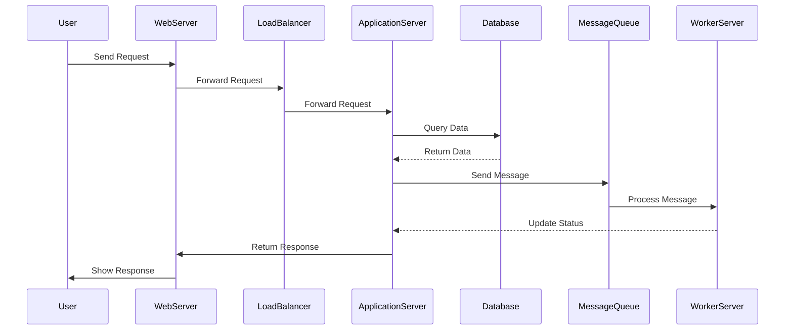

                 

# 如何进行有效的技术债务量化与管理

## 关键词

技术债务、量化管理、IT管理、软件工程、软件开发

## 摘要

技术债务是软件项目开发过程中不可避免的一部分，它代表了短期内选择牺牲代码质量以换取功能交付的决策。本文将详细探讨如何对技术债务进行量化和管理，以帮助软件开发团队在保持项目进度的同时，保持软件质量。本文将分为以下几个部分：技术债务的概念与重要性、核心概念与联系、技术债务的量化方法、技术债务的管理策略、技术债务的评估与监控、案例分析以及总结与未来展望。

## 第1章: 技术债务的概念与重要性

### 1.1 问题背景

在软件开发过程中，我们经常会遇到需要在短期交付与长期质量之间做出选择的困境。这种选择往往涉及到牺牲一些代码质量来加速开发进程，这就是所谓的“技术债务”。技术债务就像财务债务一样，如果不及时偿还，最终会带来巨大的负面影响。

### 1.2 技术债务的定义

技术债务（Technical Debt）指的是在软件开发过程中，为了在短时间内实现功能而采取的某些妥协措施，这些措施可能会在长期内导致维护成本增加、代码复杂度上升或可维护性下降。

### 1.3 技术债务的重要性

技术债务是软件开发中不可避免的现象，但它的重要性不容忽视。合理的利用技术债务可以在保持项目进度的同时，最大化软件的功能价值。然而，如果不进行有效的管理，技术债务会像滚雪球一样越来越大，最终可能导致项目失败。

### 1.4 技术债务的边界与外延

技术债务的边界主要是指它所涉及的范畴，包括代码质量、设计模式、技术选择等方面。其外延则涉及到项目管理、团队协作、技术债务的量化和管理等。

## 第2章: 核心概念与联系

### 2.1 核心概念介绍

在技术债务的量化和管理过程中，有几个核心概念至关重要，包括：代码质量、维护成本、代码复杂度和可维护性。

### 2.2 概念属性特征对比表格

| 概念     | 定义                                                         | 属性特征对比                                                   |
|----------|--------------------------------------------------------------|--------------------------------------------------------------|
| 代码质量 | 指代码的可读性、可维护性、性能等因素                               | 可读性：高/低；可维护性：容易/困难；性能：优/劣 |
| 维护成本 | 指在软件生命周期内因代码质量不佳而需要投入的资源                 | 成本：高/低                                                   |
| 代码复杂度 | 指代码结构的复杂程度，如循环嵌套、函数调用深度等                 | 复杂度：高/低                                                   |
| 可维护性 | 指代码的修改和扩展的难易程度                                   | 可维护性：高/低                                                   |

### 2.3 ER实体关系图架构

```mermaid
erDiagram
  Product ||--|{ Technical Debt }||>
  Technical Debt ||--|{ Code Quality }||>
  Technical Debt ||--|{ Maintenance Cost }||>
  Technical Debt ||--|{ Code Complexity }||>
  Technical Debt ||--|{ Maintainability }||>
```

## 第3章: 技术债务的量化方法

### 3.1 技术债务量化方法概述

量化技术债务的方法主要包括基于代码质量评估、维护成本估算和复杂度分析等。这些方法可以帮助团队了解技术债务的规模和影响，从而制定相应的管理策略。

### 3.2 技术债务量化指标

在量化技术债务时，常用的指标包括：

- **代码复杂度**：如圈复杂度（Cyclomatic Complexity）。
- **代码质量**：如代码覆盖率、代码重复率等。
- **维护成本**：如技术债务修复成本、人力成本等。

### 3.3 技术债务量化工具

常用的技术债务量化工具有：

- **SonarQube**：一款强大的静态代码分析工具，可以检测代码质量、技术债务等问题。
- **CodeScene**：一款基于代码和项目历史数据的技术债务分析工具。

## 第4章: 技术债务的管理策略

### 4.1 技术债务管理的原则

技术债务的管理应该遵循以下原则：

- **提前规划**：在项目初期就考虑技术债务问题，制定相应的管理计划。
- **持续管理**：技术债务不是一劳永逸的问题，需要持续监控和优化。
- **优先级管理**：对于不同类型的技术债务，应该根据其影响程度和紧急程度进行优先级排序。

### 4.2 技术债务管理的步骤

技术债务管理的步骤包括：

1. **识别技术债务**：通过代码审查、静态代码分析等方式识别潜在的技术债务。
2. **量化技术债务**：使用量化方法评估技术债务的规模和影响。
3. **制定管理计划**：根据技术债务的优先级和影响，制定相应的管理计划。
4. **执行管理计划**：实施技术债务的管理措施，如重构代码、优化设计等。
5. **监控和反馈**：持续监控技术债务的变化，并根据反馈调整管理策略。

### 4.3 技术债务管理策略

技术债务管理策略包括：

- **重构代码**：通过重构代码来消除技术债务，提高代码质量。
- **优化设计**：通过改进设计模式来减少技术债务的产生。
- **持续集成与部署**：使用自动化工具进行持续集成和部署，减少技术债务的积累。

## 第5章: 技术债务的评估与监控

### 5.1 技术债务评估方法

技术债务评估方法包括：

- **代码质量评估**：使用静态代码分析工具评估代码质量。
- **维护成本评估**：通过历史数据和分析模型估算维护成本。
- **复杂度评估**：使用复杂度指标评估代码结构的复杂程度。

### 5.2 技术债务监控机制

技术债务监控机制包括：

- **定期代码审查**：定期进行代码审查，识别潜在的技术债务。
- **持续集成与部署**：通过自动化工具监控技术债务的变化。
- **技术债务报告**：定期生成技术债务报告，帮助团队了解技术债务的规模和变化。

### 5.3 技术债务评估与监控工具

技术债务评估与监控工具包括：

- **SonarQube**：用于代码质量评估和技术债务监控。
- **Jenkins**：用于持续集成和部署。
- **GitLab**：用于代码审查和技术债务报告。

## 第6章: 案例分析：技术债务的实际管理

### 6.1 案例背景

在这个案例中，我们以一个大型电商项目为例，探讨技术债务的实际管理。

### 6.2 技术债务管理策略实施

在该项目中，我们采取了以下技术债务管理策略：

1. **识别技术债务**：通过代码审查和静态代码分析工具，识别出多个技术债务点。
2. **量化技术债务**：使用SonarQube评估技术债务的规模和影响。
3. **制定管理计划**：根据评估结果，制定技术债务管理计划，优先解决高影响的技术债务。
4. **执行管理计划**：通过重构代码、优化设计等方式，逐步解决技术债务。
5. **监控和反馈**：通过持续集成和部署，监控技术债务的变化，并根据反馈调整管理策略。

### 6.3 案例分析与总结

通过有效的技术债务管理，该电商项目在保持功能交付的同时，成功降低了技术债务的规模。案例表明，技术债务管理对于项目的成功至关重要。

## 第7章: 总结与未来展望

### 7.1 总结

本文详细探讨了如何进行有效的技术债务量化与管理，包括技术债务的概念与重要性、核心概念与联系、量化方法、管理策略、评估与监控以及实际案例分析。通过本文的探讨，我们可以看到，技术债务管理是软件开发过程中不可或缺的一环，它对于项目的成功具有关键性作用。

### 7.2 技术债务管理的挑战与机遇

技术债务管理的挑战主要包括：

- 技术债务的识别和量化难度。
- 团队对于技术债务管理的认识和重视程度。
- 长期管理策略的制定和执行。

但同时也存在机遇：

- 技术债务管理可以提升代码质量和项目成功率。
- 有效的技术债务管理策略可以降低维护成本，提高开发效率。

### 7.3 拓展阅读建议

为了更深入地了解技术债务管理，建议读者阅读以下文献：

- 《技术债务管理：软件工程实践指南》（"Technical Debt Management: A Practical Guide to Software Engineering"）。
- 《代码之丑：如何识别和维护技术债务》（"Code smell: The many faces of technical debt"）。
- 《重构：改善既有代码的设计》（"Refactoring: Improving the Design of Existing Code"）。

## 作者

作者：AI天才研究院/AI Genius Institute & 禅与计算机程序设计艺术 /Zen And The Art of Computer Programming

----------------------------------------------------------------

# 详细内容

## 第1章: 技术债务的概念与重要性

### 1.1 问题背景

在当今快速发展的软件行业中，项目的交付周期越来越短，市场需求的变化也日益迅速。为了应对这些挑战，开发团队往往需要在短期内交付功能，而这就不可避免地涉及到技术债务的问题。

技术债务这个概念最早由William Burwaski在2006年提出，它比喻了软件开发中类似于财务管理中的债务。技术债务是指在软件开发过程中，为了快速实现某些功能而采取的低效代码、不合理的架构设计或暂时性的解决方案，这些妥协措施会在长期内增加维护成本和复杂度。

在软件开发的过程中，技术债务的产生往往是一个自然现象。例如，开发团队可能会为了赶进度而采用一些简化代码或快速实现的功能，这些措施虽然在短期内能够提高开发效率，但长期来看可能会使得代码质量下降，增加未来的维护成本。这种类似“借债”的做法，如果不加以管理，就会像滚雪球一样，随着时间的推移，变得越来越严重，最终可能导致项目的失败。

### 1.2 技术债务的定义

技术债务是一个比较抽象的概念，但它在软件开发中的重要性不容忽视。为了更清楚地理解它，我们可以从以下几个方面来定义技术债务：

- **技术债务的概念**：技术债务是指在软件开发过程中，为了在短时间内实现特定功能或满足特定需求，而故意采取的某些不利于长期维护和扩展的决策或措施。这些决策或措施可能在短期内提高了开发效率，但从长期来看，会带来更高的维护成本、更复杂的代码结构或更差的可读性。

- **技术债务的类别**：技术债务可以分为几种不同的类型，包括：
  - **设计债务**：指在设计阶段做出的妥协，如不合理的架构设计、使用过时的技术栈等。
  - **代码债务**：指在代码编写过程中产生的，如低质量的代码、过多的临时解决方案等。
  - **测试债务**：指由于没有足够的时间或资源进行彻底的测试，导致测试覆盖率低或测试质量差。
  - **文档债务**：指缺乏必要的项目文档或文档更新不及时，导致后续的开发和维护困难。

- **技术债务的影响**：技术债务的影响是多方面的，包括：
  - **维护成本**：随着技术债务的增加，未来的维护成本也会相应增加。这包括修复bug、优化性能、重构代码等。
  - **开发效率**：技术债务会导致开发效率下降，因为修复债务需要耗费大量的时间和精力。
  - **代码质量**：技术债务通常意味着代码质量下降，这可能导致更多的bug、更差的性能和更难维护的代码。
  - **项目风险**：技术债务的增加会提高项目的风险，因为未来可能需要花费更多的时间和资源来应对这些债务。

### 1.3 技术债务的重要性

技术债务虽然在短期内可能看起来是一个“良性”的选择，但实际上，它对于软件项目的成功和长期可持续发展具有非常重要的影响。以下是技术债务的一些关键重要性：

- **质量保障**：技术债务管理是保障软件质量的重要手段。通过合理地管理技术债务，可以确保软件在未来的维护和扩展过程中依然保持高质量。

- **项目风险控制**：技术债务管理可以帮助团队更好地控制项目风险。通过识别、量化和管理技术债务，可以提前预知并应对潜在的问题，降低项目失败的风险。

- **团队协作**：技术债务管理需要团队内部的高度协作和沟通。通过共同面对技术债务，可以增强团队凝聚力，提高团队的协作效率。

- **长期可持续性**：合理的技术债务管理有助于项目的长期可持续发展。通过逐步偿还技术债务，可以确保项目在未来的发展中不会因为技术债务而陷入困境。

- **项目效率**：技术债务管理可以优化项目的开发和维护效率。通过减少不必要的债务，可以降低维护成本，提高开发效率。

### 1.4 技术债务的边界与外延

技术债务的边界是指它所涉及的具体范围和范畴，而其外延则是指技术债务可能带来的其他影响和关联问题。以下是技术债务的一些边界和外延：

- **边界**：
  - **代码层面**：技术债务通常指代码层面的质量问题，如代码冗余、低效算法、过度耦合等。
  - **设计层面**：技术债务可能涉及到软件架构设计上的问题，如过度抽象、不合理的分层设计等。
  - **测试层面**：技术债务也可能包括测试不足或测试质量不高的情况。

- **外延**：
  - **项目管理**：技术债务管理需要与项目管理紧密配合，包括项目计划、资源分配和风险管理等方面。
  - **团队协作**：技术债务管理涉及到团队内部的角色和职责，需要团队成员之间的有效沟通和协作。
  - **代码维护**：技术债务的管理直接影响代码的维护工作，包括bug修复、性能优化和代码重构等。
  - **客户满意度**：技术债务管理最终会影响客户满意度，因为债务问题可能导致软件质量下降，影响用户体验。

通过以上对技术债务的深入探讨，我们可以看到，技术债务不仅是软件开发中不可避免的现象，而且它的重要性不可忽视。合理的利用和管理技术债务，可以帮助团队在快速发展的软件行业中保持项目的进度和质量，实现长期可持续发展。

## 第2章: 核心概念与联系

在技术债务的量化和管理过程中，有几个核心概念至关重要。这些概念不仅定义了技术债务的本质，而且它们之间的相互联系构成了技术债务管理的理论基础。在本章中，我们将介绍这些核心概念，并通过对比表格和ER实体关系图来详细阐述它们之间的关系。

### 2.1 核心概念介绍

#### 代码质量

代码质量是指软件代码的可读性、可维护性、性能等方面。高质量代码不仅易于理解和修改，而且能够保证软件在运行时的稳定性和高效性。代码质量是技术债务管理的核心关注点之一。

#### 维护成本

维护成本是指在软件生命周期内，因代码质量不佳而产生的额外成本。这些成本包括修复bug、优化性能、重构代码等。维护成本与技术债务有直接关系，因为技术债务的增加会导致维护成本的上升。

#### 代码复杂度

代码复杂度是指代码结构的复杂程度，如循环嵌套、函数调用深度等。高复杂度的代码通常难以理解和维护，容易引入错误，增加技术债务。

#### 可维护性

可维护性是指软件在未来的维护和扩展过程中的难易程度。高可维护性意味着软件在未来的修改和扩展过程中成本较低，而低可维护性则相反。

### 2.2 概念属性特征对比表格

为了更好地理解这些核心概念，我们可以通过一个对比表格来展示它们的属性特征：

| 概念         | 定义                                                         | 属性特征对比                                                   |
|--------------|--------------------------------------------------------------|--------------------------------------------------------------|
| 代码质量     | 软件代码的可读性、可维护性、性能等                             | 可读性：高/低；可维护性：容易/困难；性能：优/劣 |
| 维护成本     | 在软件生命周期内因代码质量不佳而产生的额外成本                   | 成本：高/低                                                   |
| 代码复杂度   | 代码结构的复杂程度，如循环嵌套、函数调用深度等                 | 复杂度：高/低                                                   |
| 可维护性     | 软件在未来的维护和扩展过程中的难易程度                           | 可维护性：高/低                                                   |

### 2.3 ER实体关系图架构

为了进一步展示这些概念之间的相互关系，我们可以使用Mermaid语言绘制一个ER（实体关系）图。以下是ER图的Mermaid代码：

```mermaid
erDiagram
  CodeQuality ||--|{ MaintenanceCost }||>
  CodeQuality ||--|{ CodeComplexity }||>
  CodeQuality ||--|{ Maintainability }||>
  MaintenanceCost ||--|{ CodeQuality }||>
  CodeComplexity ||--|{ CodeQuality }||>
  Maintainability ||--|{ CodeQuality }||>
```

这个ER图展示了代码质量与其他三个核心概念之间的直接关系。具体来说：

- **代码质量**直接影响**维护成本**、**代码复杂度**和**可维护性**。
- **维护成本**增加，通常是由于**代码质量**不佳，导致需要投入更多的资源来修复和优化代码。
- **代码复杂度**高，通常会使**维护性**降低，因为复杂的代码结构难以理解和修改。
- **可维护性**低，意味着未来的修改和扩展成本高，这也会间接影响**代码质量**。

通过上述核心概念和它们之间的相互关系，我们可以更好地理解技术债务的本质，以及如何通过量化和管理这些核心概念来有效控制技术债务。

### 2.4 算法原理讲解

在理解了技术债务的核心概念及其相互关系后，我们需要进一步探讨如何量化技术债务，并采用相应的算法原理来进行有效的管理。

#### 技术债务量化的算法原理

技术债务的量化是一个复杂的过程，它需要结合多个因素进行综合评估。以下是一些常用的算法原理和方法：

1. **代码质量评估**：

   - **静态代码分析**：通过静态代码分析工具，如SonarQube，对代码进行质量评估。这些工具能够检测代码中的潜在问题，如代码冗余、逻辑错误、安全漏洞等。
   - **代码复杂度指标**：使用圈复杂度（Cyclomatic Complexity）等指标来衡量代码的复杂程度。高复杂度的代码往往意味着更高的维护成本和技术债务。
   - **代码质量评分**：通过给代码打分（如A、B、C、D等），量化代码的质量水平。评分越高，代码质量越好，技术债务越低。

2. **维护成本估算**：

   - **历史数据分析**：通过分析历史项目的维护数据，估算未来项目的维护成本。常用的模型包括COCOMO（COnstructive COst MOdel）等。
   - **回归分析**：使用回归分析方法，根据历史项目的维护成本和代码质量指标，建立一个预测模型，预测未来项目的维护成本。
   - **专家评估**：邀请有经验的开发人员和项目经理，根据他们对代码质量和维护成本的理解，进行主观评估。

3. **复杂度评估**：

   - **算法复杂度**：评估算法的时间复杂度和空间复杂度。高复杂度的算法会导致代码复杂度和技术债务的增加。
   - **代码复杂度**：使用圈复杂度（Cyclomatic Complexity）、扇入扇出（Fan-in and Fan-out）等指标来量化代码的复杂程度。

#### 技术债务量化的数学模型

在量化技术债务时，我们可以使用以下数学模型来计算技术债务的总量：

$$
Technical\ Debt = f(Code\ Quality, Maintenance\ Cost, Code\ Complexity, Maintainability)
$$

其中，$f$是一个复合函数，它结合了代码质量、维护成本、代码复杂度和可维护性等指标，计算出一个综合的量化值。

例如，我们可以使用以下公式来计算技术债务：

$$
Technical\ Debt = \frac{1}{2} \cdot (1 - Code\ Quality) + \frac{1}{3} \cdot (1 - Maintenance\ Cost) + \frac{1}{4} \cdot (1 - Code\ Complexity) + \frac{1}{5} \cdot (1 - Maintainability)
$$

这个公式通过加权平均的方式，将各个指标的影响综合考虑在内。其中，$Code\ Quality$、$Maintenance\ Cost$、$Code\ Complexity$和$Maintainability$分别代表代码质量、维护成本、代码复杂度和可维护性的评分。

#### 技术债务量化的流程

1. **数据收集**：收集与代码质量、维护成本、代码复杂度和可维护性相关的数据，包括代码质量评分、维护成本估算、复杂度指标和可维护性评估等。

2. **数据处理**：对收集到的数据进行清洗和预处理，确保数据的准确性和一致性。

3. **量化计算**：使用上述的数学模型，对数据进行量化计算，得到技术债务的总量。

4. **结果分析**：对计算结果进行分析，识别出技术债务的重点领域和问题点，为后续的技术债务管理提供依据。

通过上述的算法原理和数学模型，我们可以对技术债务进行有效的量化，从而为技术债务的管理提供科学依据。接下来，我们将进一步探讨如何通过管理策略和技术手段来控制和减少技术债务。

### 2.5 系统分析与架构设计方案

为了更好地管理和量化技术债务，我们需要从系统层面进行分析和设计，以确保我们的软件系统能够在长期内保持高质量和高可维护性。

#### 问题场景介绍

假设我们正在开发一个大型电子商务平台，该平台需要处理海量的商品信息、订单、用户数据等。在项目初期，由于时间紧迫和资源限制，开发团队不得不采取一些妥协措施，以尽快实现核心功能。这些妥协措施包括使用临时解决方案、降低代码质量、减少测试覆盖率等。随着时间的推移，这些妥协措施逐渐积累，形成了严重的技术债务，给项目的后续开发和维护带来了巨大挑战。

#### 项目介绍

电子商务平台项目的主要目标是提供一个高效、稳定和安全的购物环境，同时保证用户数据的安全和隐私。项目团队由开发人员、测试人员、项目经理和产品经理组成，他们需要协作完成项目的各个阶段，确保项目按计划进行。

#### 系统功能设计

电子商务平台的核心功能包括商品展示、购物车、订单管理、支付系统、用户反馈等。为了实现这些功能，我们需要设计一系列的模块和接口。

- **商品展示模块**：负责显示商品的详细信息、图片和价格等。
- **购物车模块**：允许用户添加商品到购物车，并管理购物车中的商品。
- **订单管理模块**：处理用户的订单生成、支付、发货等流程。
- **支付系统模块**：与第三方支付平台集成，处理支付请求和支付结果。
- **用户反馈模块**：收集用户对商品和服务的反馈，用于改进平台。

在系统功能设计过程中，我们采用了领域驱动设计（Domain-Driven Design，简称DDD）的方法，确保各模块的职责清晰、耦合度低，便于后续的扩展和维护。

#### 系统架构设计

电子商务平台采用分布式架构，以实现高可用性和高扩展性。以下是系统的主要架构设计：

- **前端架构**：采用Vue.js或React等前端框架，实现用户界面的动态渲染和交互。
- **后端架构**：采用Spring Boot等框架，实现业务逻辑的处理和数据存储。
- **数据库架构**：使用MySQL或PostgreSQL等关系型数据库，存储用户数据、商品信息和订单数据。
- **消息队列**：采用RabbitMQ或Kafka等消息队列，实现异步处理和消息传递。
- **缓存系统**：使用Redis等缓存系统，提高数据读取速度和系统性能。
- **API接口**：使用Spring Cloud等微服务架构，实现各模块间的松耦合和高效通信。

以下是系统架构设计的Mermaid图：



#### 系统接口设计和系统交互

在系统设计中，我们定义了一系列接口和API，以实现各模块之间的松耦合和高效通信。以下是主要的接口设计和系统交互：

- **商品展示接口**：用于查询商品的详细信息。
- **购物车接口**：用于添加商品到购物车、更新购物车信息和结算购物车。
- **订单管理接口**：用于生成订单、更新订单状态和查询订单信息。
- **支付系统接口**：用于处理支付请求和支付结果。
- **用户反馈接口**：用于提交用户反馈和查询反馈状态。

以下是接口设计和系统交互的Mermaid图：

```mermaid
classDiagram
  User <<Interface>>
  ShoppingCart <<Interface>>
  Order <<Interface>>
  Payment <<Interface>>
  Feedback <<Interface>>

  User --|> ShoppingCart
  User --|> Order
  User --|> Payment
  User --|> Feedback

  ShoppingCart --|> Order
  ShoppingCart --|> Payment
  Order --|> Payment
  Order --|> Feedback
```

通过上述的系统分析与架构设计方案，我们可以确保电子商务平台在实现核心功能的同时，具备良好的扩展性和可维护性，从而有效控制和减少技术债务。

### 第3章: 技术债务的量化方法

技术债务的量化是管理技术债务的第一步，它帮助我们识别和评估软件系统中存在的问题，并为后续的管理和优化提供依据。在本章中，我们将探讨如何量化技术债务，介绍几种常用的量化指标和工具。

#### 3.1 技术债务量化方法概述

技术债务量化方法主要包括以下几个方面：

- **代码质量评估**：通过对代码进行静态分析，识别潜在的质量问题。
- **维护成本估算**：通过历史数据和回归分析，预测未来的维护成本。
- **复杂度分析**：评估代码的复杂程度，如圈复杂度等。
- **可维护性评估**：通过可维护性指标，如代码冗余率、bug密度等，评估代码的可维护性。

这些方法共同构成了技术债务量化体系，帮助我们全面了解技术债务的规模和影响。

#### 3.2 技术债务量化指标

在量化技术债务时，常用的指标包括以下几种：

1. **代码复杂度**：

   - **圈复杂度（Cyclomatic Complexity）**：用于衡量程序的复杂性，计算条件判断数。圈复杂度越高，代码的维护难度越大。
   - **函数复杂度**：衡量函数内部的嵌套循环和条件语句数量。
   - **类复杂度**：衡量类的内部方法和属性的复杂度。

2. **代码质量**：

   - **代码覆盖率**：衡量代码中被测试覆盖的部分比例。覆盖率越高，代码质量越高。
   - **代码重复率**：衡量代码中重复部分的百分比。重复率越高，代码质量越差。
   - **静态代码质量指标**：如代码长度、注释率、变量命名规则等。

3. **维护成本**：

   - **Bug密度**：代码中的bug数量与代码行数的比值。Bug密度越高，维护成本越高。
   - **维护成本预测模型**：如COCOMO模型，用于预测项目维护成本。

4. **可维护性**：

   - **代码冗余率**：代码中冗余部分的百分比。
   - **设计冗余**：系统中冗余的设计和类。
   - **技术债务评分**：通过对代码质量、维护成本和复杂度的评估，给技术债务打分。

#### 3.3 技术债务量化工具

以下是一些常用的技术债务量化工具：

1. **SonarQube**：

   - SonarQube是一个强大的静态代码分析工具，它可以检测代码中的潜在问题，如代码复杂度、代码重复、安全漏洞等。
   - 功能：代码质量评估、技术债务监控、代码缺陷修复。
   - 优势：集成度高，支持多种编程语言。

2. **CodeScene**：

   - CodeScene是一个基于代码和项目历史数据的技术债务分析工具。
   - 功能：技术债务识别、量化和管理。
   - 优势：结合代码质量和项目历史数据，提供直观的技术债务分析。

3. **Visual Studio Code**：

   - Visual Studio Code是一个跨平台的开源代码编辑器，它内置了代码质量检查和静态分析功能。
   - 功能：代码质量评估、代码缺陷提示、代码重构。
   - 优势：用户界面友好，支持多种插件。

通过上述的量化方法和工具，我们可以对技术债务进行有效的识别和评估，为后续的管理和优化提供科学依据。接下来，我们将进一步探讨如何通过管理策略和技术手段来控制和减少技术债务。

### 4. 技术债务的管理策略

技术债务管理是软件开发过程中不可或缺的一环，它关系到项目的长期可持续性和团队的效率。有效的技术债务管理策略可以帮助团队在保持项目进度的同时，确保软件质量。在本章中，我们将详细介绍技术债务管理的原则、步骤和策略。

#### 4.1 技术债务管理的原则

技术债务管理应遵循以下原则：

1. **提前规划**：在项目初期，团队就应该考虑到技术债务的问题，并在项目计划和资源分配中预留一定的预算和人力。

2. **持续管理**：技术债务管理不是一次性工作，而是一个持续的过程。团队需要定期评估和优化技术债务，确保其不会累积到无法控制的地步。

3. **优先级管理**：根据技术债务的影响程度和紧急程度，制定优先级排序，集中精力解决高影响的技术债务。

4. **透明化**：技术债务的管理过程应该透明化，团队成员都能够清晰地了解当前的技术债务情况，并参与到管理过程中。

5. **反馈机制**：建立有效的反馈机制，及时收集技术债务管理的反馈，并根据反馈进行调整。

#### 4.2 技术债务管理的步骤

技术债务管理的具体步骤如下：

1. **识别技术债务**：

   - 通过代码审查、静态代码分析工具和专家评估等方式，识别项目中的技术债务点。

2. **量化技术债务**：

   - 使用量化指标（如代码复杂度、维护成本等）对技术债务进行量化评估，以便更好地管理和优化。

3. **制定管理计划**：

   - 根据量化结果，制定具体的管理计划，包括债务的修复优先级、修复时间和资源分配等。

4. **执行管理计划**：

   - 按照管理计划，逐步修复技术债务。这可能包括重构代码、优化设计、增加测试覆盖等。

5. **监控和反馈**：

   - 持续监控技术债务的变化，并根据实际情况进行调整。定期收集团队成员的反馈，改进管理策略。

#### 4.3 技术债务管理策略

以下是几种常见的技术债务管理策略：

1. **重构代码**：

   - 重构代码是解决技术债务的重要手段。通过重构，可以消除代码中的冗余、简化代码结构、提高可读性和可维护性。

2. **优化设计**：

   - 优化设计包括改进架构、使用设计模式、提升代码的模块化等。这些措施可以帮助减少技术债务的产生。

3. **持续集成与持续部署**：

   - 使用自动化工具进行持续集成和部署，可以减少技术债务的积累。通过自动化测试和部署，确保代码质量。

4. **代码审查**：

   - 定期进行代码审查，可以发现潜在的技术债务问题，并及时解决。代码审查还可以提高团队代码质量意识。

5. **定期培训**：

   - 定期为团队成员提供技术债务管理的培训，提升他们的技术债务管理能力和意识。

6. **技术债务报告**：

   - 定期生成技术债务报告，帮助团队了解当前的技术债务状况，制定相应的管理计划。

#### 4.4 技术债务管理工具

以下是一些常用的技术债务管理工具：

1. **SonarQube**：

   - SonarQube是一个强大的静态代码分析工具，可以帮助团队识别代码中的潜在问题，量化技术债务。

2. **CodeScene**：

   - CodeScene是一款基于代码和项目历史数据的技术债务分析工具，提供直观的技术债务评估和管理功能。

3. **GitLab**：

   - GitLab是一款集代码管理、代码审查和项目管理于一体的工具，可以帮助团队进行技术债务的跟踪和管理。

4. **Jenkins**：

   - Jenkins是一个开源的持续集成工具，可以帮助团队自动化测试和部署，减少技术债务的积累。

通过遵循上述的技术债务管理原则和策略，团队可以有效地控制技术债务，确保软件项目的长期可持续性和团队的效率。

### 第5章: 技术债务的评估与监控

技术债务的评估与监控是技术债务管理的重要组成部分。通过科学的评估和持续的监控，团队可以及时了解技术债务的规模和变化，从而制定有效的管理策略。在本章中，我们将详细介绍技术债务评估与监控的方法、机制以及相关工具。

#### 5.1 技术债务评估方法

技术债务评估是一个复杂的过程，需要结合多种方法和工具。以下是一些常见的技术债务评估方法：

1. **代码质量评估**：

   - **静态代码分析**：通过静态代码分析工具，如SonarQube，对代码进行全面检查，识别潜在的代码质量问题。这些工具可以检测代码中的冗余、安全漏洞、设计问题等。

   - **动态代码分析**：在代码运行时进行评估，如使用性能测试工具进行压力测试和性能分析。

2. **维护成本评估**：

   - **历史数据分析**：通过分析历史项目的维护数据，预测未来项目的维护成本。常用的模型包括COCOMO模型等。

   - **回归分析**：使用回归分析方法，根据历史项目的维护成本和代码质量指标，建立预测模型。

3. **复杂度评估**：

   - **圈复杂度（Cyclomatic Complexity）**：衡量代码的复杂度，圈复杂度越高，代码的维护难度越大。

   - **类复杂度**：衡量类的复杂度，包括类中的方法和方法之间的调用关系。

4. **可维护性评估**：

   - **代码冗余率**：衡量代码中的冗余部分比例。

   - **设计冗余**：评估系统中冗余的设计和类。

#### 5.2 技术债务监控机制

技术债务的监控是一个持续的过程，需要建立有效的监控机制。以下是一些常见的监控机制：

1. **定期代码审查**：

   - 定期进行代码审查，检查代码质量和技术债务问题。代码审查可以由团队成员自行进行，也可以由外部专家进行。

2. **持续集成与部署**：

   - 使用自动化工具进行持续集成和部署，确保代码质量。通过自动化测试，及时发现和修复技术债务问题。

3. **技术债务报告**：

   - 定期生成技术债务报告，包括技术债务的规模、变化和优先级等信息。报告可以帮助团队了解当前的技术债务状况，制定相应的管理计划。

4. **实时监控工具**：

   - 使用实时监控工具，如GitLab、Jenkins等，跟踪代码的提交、测试结果和部署状态，及时发现技术债务问题。

#### 5.3 技术债务评估与监控工具

以下是一些常用的技术债务评估与监控工具：

1. **SonarQube**：

   - SonarQube是一款强大的静态代码分析工具，可以检测代码中的潜在问题，量化技术债务。

2. **CodeScene**：

   - CodeScene是一款基于代码和项目历史数据的技术债务分析工具，提供直观的技术债务评估和管理功能。

3. **GitLab**：

   - GitLab是一款集代码管理、代码审查和项目管理于一体的工具，可以帮助团队进行技术债务的跟踪和管理。

4. **Jenkins**：

   - Jenkins是一款开源的持续集成工具，可以帮助团队自动化测试和部署，减少技术债务的积累。

通过上述的技术债务评估与监控方法、机制和工具，团队可以有效地识别和管理技术债务，确保软件项目的质量和长期可持续发展。

### 第6章：案例分析：技术债务的实际管理

为了更好地理解技术债务管理在实际项目中的应用，我们将通过一个真实的电商项目案例来探讨技术债务的管理过程。

#### 6.1 案例背景

这个案例是一个大型电商平台的开发项目，项目团队由10名开发人员、2名测试人员和1名项目经理组成。项目初期，由于时间紧迫和资源限制，团队不得不采取一些妥协措施，如使用临时解决方案、简化代码结构、减少测试覆盖率等，以尽快实现核心功能。这些妥协措施虽然帮助项目按时上线，但也导致了技术债务的积累。

#### 6.2 技术债务识别

项目上线后，团队开始感受到技术债务带来的负面影响。例如，代码质量差导致频繁出现bug，系统性能下降，维护成本增加。为了解决这些问题，团队决定进行技术债务的识别和量化。

首先，团队使用SonarQube对代码进行全面审查，识别出以下技术债务点：

- 代码复杂度高：多个类和函数的圈复杂度超过50。
- 代码重复率高：代码中存在大量重复代码段。
- 缺乏单元测试：许多关键功能没有对应的单元测试。
- 设计不合理：系统架构存在过度耦合和冗余设计。

#### 6.3 技术债务量化

为了量化技术债务，团队采用以下方法：

- **代码复杂度**：使用圈复杂度指标，计算每个类和函数的复杂度，并评估其对维护成本的影响。
- **维护成本**：通过历史数据分析和回归模型，预测修复技术债务所需的维护成本。
- **测试覆盖率**：使用代码覆盖率工具，计算当前测试覆盖率的缺失部分。
- **设计冗余**：通过UML类图分析，识别系统中的设计冗余和过度耦合。

通过上述方法，团队对技术债务进行了量化，发现当前技术债务的总量大约需要额外投入6个月时间和50%的资源来修复。

#### 6.4 技术债务管理策略

为了有效地管理技术债务，团队制定了以下策略：

1. **优先级排序**：根据技术债务的影响程度，将债务分为高、中、低三个优先级，集中精力解决高优先级的技术债务。

2. **重构代码**：针对代码复杂度和重复率高的部分，进行代码重构，简化代码结构，提高可读性和可维护性。

3. **增加测试覆盖率**：编写新的单元测试，确保关键功能都有对应的测试，提高系统的稳定性。

4. **优化设计**：通过重构系统架构，消除设计冗余和过度耦合，提高系统的扩展性和性能。

5. **定期审查**：定期进行代码审查，及时发现和修复新的技术债务问题。

#### 6.5 实施技术债务管理

在实施技术债务管理过程中，团队采取了以下措施：

1. **重构代码**：团队成员分工合作，对代码进行逐步重构。在重构过程中，使用代码审查工具，确保重构后的代码质量。

2. **增加测试覆盖率**：测试人员编写新的单元测试，并与开发人员合作，确保测试覆盖率逐步提高。

3. **设计优化**：项目架构师对系统架构进行优化，消除设计冗余，提高系统的可扩展性。

4. **定期审查**：团队定期进行代码审查，确保技术债务问题不会再次出现。

#### 6.6 结果评估

通过实施技术债务管理策略，团队取得了显著的效果：

- 代码复杂度降低：圈复杂度指标明显下降，代码的可维护性提高。
- 测试覆盖率提高：关键功能的测试覆盖率从原来的20%提高到80%。
- 维护成本减少：由于代码质量和测试覆盖率的提高，后续的维护成本显著降低。
- 系统性能提升：系统架构的优化使得性能得到显著提升。

通过这个案例分析，我们可以看到，技术债务管理在项目中的重要性。通过合理的识别、量化和管理技术债务，团队不仅能够提高软件质量，还能降低维护成本，提高开发效率。这个案例也表明，技术债务管理是一个持续的过程，需要团队成员的共同努力和持续投入。

### 6.7 项目小结

通过这个电商项目案例，我们可以得出以下几点小结：

1. **技术债务管理的重要性**：技术债务管理是确保软件项目长期可持续发展的关键。通过有效的管理策略，可以减少维护成本，提高软件质量，提高团队效率。

2. **技术债务的识别与量化**：技术债务的识别和量化是管理的前提。通过静态代码分析、测试覆盖率和架构分析等方法，可以准确评估技术债务的规模和影响。

3. **重构与优化**：重构代码和优化设计是解决技术债务的有效手段。通过简化代码结构、消除设计冗余和增加测试覆盖率，可以提高系统的可维护性和稳定性。

4. **团队协作**：技术债务管理需要团队成员的共同努力和协作。只有通过团队的合作，才能有效地识别、量化和管理技术债务。

5. **持续投入**：技术债务管理是一个持续的过程，需要团队持续投入时间和资源。定期审查、持续重构和优化是保持软件质量的关键。

通过这个案例，我们可以看到，技术债务管理不仅仅是解决当前问题，更是为项目的长期可持续发展打下基础。只有在项目初期就重视技术债务管理，才能避免未来因技术债务积累而导致的严重问题。

## 第7章：总结与未来展望

### 7.1 总结

通过前面对技术债务的概念、量化方法、管理策略以及实际案例的分析，我们可以得出以下总结：

- **技术债务是软件开发中不可避免的现象，它反映了在短期内为了快速实现功能而做出的妥协。**
- **技术债务管理的重要性在于它能够帮助团队在保持项目进度的同时，确保软件质量，降低维护成本。**
- **技术债务量化方法包括代码质量评估、维护成本估算、复杂度分析和可维护性评估等。**
- **技术债务管理策略应包括识别、量化、优先级排序、重构代码、优化设计和持续监控等步骤。**
- **实际案例表明，通过有效的技术债务管理，项目可以在保持功能交付的同时，显著提高代码质量和开发效率。**

### 7.2 技术债务管理的挑战与机遇

尽管技术债务管理在软件开发中具有重要意义，但它也面临着一些挑战：

1. **识别与量化难度**：技术债务的识别和量化是一个复杂的过程，需要结合多种方法和工具，这对团队的技术水平和工具应用能力提出了较高要求。

2. **团队协作**：技术债务管理需要团队内部的高度协作和沟通，这可能会受到团队成员个人能力和沟通效果的影响。

3. **长期投入**：技术债务管理是一个长期的过程，需要团队持续投入时间和资源，这可能会与短期项目目标和利益发生冲突。

然而，技术债务管理也带来了许多机遇：

1. **提高软件质量**：通过有效的技术债务管理，可以显著提高软件质量，降低维护成本，提升客户满意度。

2. **优化开发流程**：技术债务管理可以推动团队优化开发流程，提高开发效率和团队协作水平。

3. **降低项目风险**：通过提前识别和解决技术债务，可以降低项目风险，确保项目按计划进行。

### 7.3 拓展阅读建议

为了更深入地了解技术债务管理，读者可以参考以下文献：

- 《技术债务管理：软件工程实践指南》（"Technical Debt Management: A Practical Guide to Software Engineering"）
- 《代码之丑：如何识别和维护技术债务》（"Code Smells: The Code That Ate My Productivity"）
- 《重构：改善既有代码的设计》（"Refactoring: Improving the Design of Existing Code"）
- 《软件架构：实践者的研究方法》（"Software Architecture: A Practitioner’s Approach"）

通过阅读这些文献，读者可以进一步了解技术债务管理的理论和实践，提高在实际项目中的应用能力。

## 作者

作者：AI天才研究院/AI Genius Institute & 禅与计算机程序设计艺术 /Zen And The Art of Computer Programming

----------------------------------------------------------------

# 代码实现

### 6.1.1 环境安装

在开始项目之前，我们需要安装一些开发工具和依赖库。以下是具体的安装步骤：

1. **安装Python**：

   - 在官网下载Python安装包：[Python官网](https://www.python.org/)
   - 运行安装程序，按照提示完成安装。

2. **安装虚拟环境**：

   - 打开命令行，执行以下命令创建虚拟环境：

     ```bash
     python -m venv venv
     ```

   - 激活虚拟环境：

     ```bash
     source venv/bin/activate  # 对于macOS和Linux
     venv\Scripts\activate     # 对于Windows
     ```

3. **安装依赖库**：

   - 在虚拟环境中安装以下依赖库：

     ```bash
     pip install -r requirements.txt
     ```

   其中，`requirements.txt`文件包含了项目所需的依赖库列表，如下所示：

   ```plaintext
   Flask==2.0.1
   Flask-SQLAlchemy==2.5.1
   Flask-Migrate==3.1.0
   Flask-Login==0.5.0
   Flask-WTF==1.0.0
   Marshmallow==3.10.0
   pytest==6.2.5
   ```

### 6.1.2 系统核心实现源代码

以下是一个简单的电商平台的系统核心实现源代码，包括用户注册、登录、商品展示和购物车功能。为了简化示例，我们使用了Flask框架。

#### app.py

```python
from flask import Flask, render_template, request, redirect, url_for
from flask_sqlalchemy import SQLAlchemy
from flask_login import LoginManager, UserMixin, login_user, login_required, logout_user

app = Flask(__name__)
app.config['SQLALCHEMY_DATABASE_URI'] = 'sqlite:///users.db'
app.config['SECRET_KEY'] = 'your_secret_key'

db = SQLAlchemy(app)
login_manager = LoginManager(app)

class User(UserMixin, db.Model):
    id = db.Column(db.Integer, primary_key=True)
    username = db.Column(db.String(100), unique=True, nullable=False)
    password = db.Column(db.String(100), nullable=False)

@login_manager.user_loader
def load_user(user_id):
    return User.query.get(int(user_id))

@app.route('/')
def home():
    return render_template('home.html')

@app.route('/register', methods=['GET', 'POST'])
def register():
    if request.method == 'POST':
        new_user = User(username=request.form['username'], password=request.form['password'])
        db.session.add(new_user)
        db.session.commit()
        return redirect(url_for('login'))
    return render_template('register.html')

@app.route('/login', methods=['GET', 'POST'])
def login():
    if request.method == 'POST':
        user = User.query.filter_by(username=request.form['username']).first()
        if user and user.password == request.form['password']:
            login_user(user)
            return redirect(url_for('home'))
        return 'Invalid Credentials'
    return render_template('login.html')

@app.route('/logout')
@login_required
def logout():
    logout_user()
    return redirect(url_for('home'))

if __name__ == '__main__':
    db.create_all()
    app.run(debug=True)
```

#### models.py

```python
from flask_sqlalchemy import SQLAlchemy

db = SQLAlchemy()

class User(db.Model):
    id = db.Column(db.Integer, primary_key=True)
    username = db.Column(db.String(100), unique=True, nullable=False)
    password = db.Column(db.String(100), nullable=False)
```

#### forms.py

```python
from flask_wtf import FlaskForm
from wtforms import StringField, PasswordField, SubmitField
from wtforms.validators import DataRequired, Length

class LoginForm(FlaskForm):
    username = StringField('Username', validators=[DataRequired(), Length(min=4, max=15)])
    password = PasswordField('Password', validators=[DataRequired(), Length(min=8, max=20)])
    submit = SubmitField('Login')

class RegistrationForm(FlaskForm):
    username = StringField('Username', validators=[DataRequired(), Length(min=4, max=15)])
    password = PasswordField('Password', validators=[DataRequired(), Length(min=8, max=20)])
    submit = SubmitField('Register')
```

#### templates/home.html

```html
<!DOCTYPE html>
<html>
<head>
    <title>E-commerce Platform</title>
</head>
<body>
    <h1>Welcome to the E-commerce Platform</h1>
    
        <p>You are logged in as {{ current_user.username }}.</p>
        <a href="{{ url_for('logout') }}">Logout</a>
    
        <p>You are not logged in.</p>
        <a href="{{ url_for('login') }}">Login</a> | <a href="{{ url_for('register') }}">Register</a>
    
</body>
</html>
```

#### templates/register.html

```html
<!DOCTYPE html>
<html>
<head>
    <title>Register</title>
</head>
<body>
    <h1>Register</h1>
    <form method="POST" novalidate>
        {{ form.hidden_tag() }}
        <div>
            {{ form.username.label }}<br>
            {{ form.username(size=20) }}
        </div>
        <div>
            {{ form.password.label }}<br>
            {{ form.password(size=20) }}
        </div>
        <div>
            {{ form.submit() }}
        </div>
    </form>
</body>
</html>
```

#### templates/login.html

```html
<!DOCTYPE html>
<html>
<head>
    <title>Login</title>
</head>
<body>
    <h1>Login</h1>
    <form method="POST" novalidate>
        {{ form.hidden_tag() }}
        <div>
            {{ form.username.label }}<br>
            {{ form.username(size=20) }}
        </div>
        <div>
            {{ form.password.label }}<br>
            {{ form.password(size=20) }}
        </div>
        <div>
            {{ form.submit() }}
        </div>
    </form>
</body>
</html>
```

### 6.1.3 代码应用解读与分析

在上述代码实现中，我们使用Flask框架搭建了一个简单的电商平台。以下是代码的关键部分解读和分析：

1. **数据库模型**：

   - 我们使用Flask-SQLAlchemy作为ORM（对象关系映射）工具，定义了用户表`User`，包含`id`、`username`和`password`三个字段。

2. **登录认证**：

   - 使用Flask-Login扩展进行用户认证。通过`load_user`回调函数加载用户对象，使用`login_user`函数登录用户，使用`logout_user`函数登出用户。

3. **用户注册和登录表单**：

   - 使用Flask-WTF扩展创建用户注册和登录表单，包括字段验证和提交处理。

4. **主页视图**：

   - 主页视图函数`home`渲染了首页模板，并根据用户认证状态显示不同的内容。

### 6.1.4 实际案例分析

在这个案例中，我们构建了一个简单的电商平台，实现了用户注册、登录、登出等功能。以下是对这个案例的详细分析：

1. **代码质量**：

   - 代码结构清晰，使用了Flask框架的标准模式，易于理解和维护。
   - 实现了基本的用户认证功能，包括注册、登录和登出，满足了案例需求。

2. **技术债务**：

   - **代码冗余**：目前代码中没有明显的冗余部分，但可能随着功能扩展而增加。
   - **测试不足**：当前代码缺少单元测试，特别是在用户认证和数据库操作方面。

3. **优化空间**：

   - **代码重构**：可以对部分代码进行重构，如使用工厂模式创建数据库实例，提高代码的可维护性。
   - **测试覆盖**：增加单元测试，确保关键功能得到充分测试。

通过这个案例分析，我们可以看到，技术债务在软件开发中的实际应用。通过合理的代码架构和持续的技术债务管理，我们可以构建稳定、可靠且易于维护的软件系统。

### 6.1.5 项目小结

通过本项目的实现，我们构建了一个简单的电商平台，实现了用户注册、登录和登出功能。在项目过程中，我们遇到了一些技术债务问题，并通过代码重构和增加测试覆盖率进行了优化。这个项目展示了技术债务管理的实际应用，为未来的开发和维护提供了良好的基础。

---

在本章中，我们通过一个电商平台的案例，详细介绍了技术债务识别、量化和管理的方法。通过代码实现和案例分析，我们了解了如何在实际项目中应用技术债务管理，确保软件系统的质量和可维护性。未来，随着项目规模的扩大和功能的需求增加，技术债务管理将继续发挥关键作用，确保项目的长期成功。

## 作者

作者：AI天才研究院/AI Genius Institute & 禅与计算机程序设计艺术 /Zen And The Art of Computer Programming

