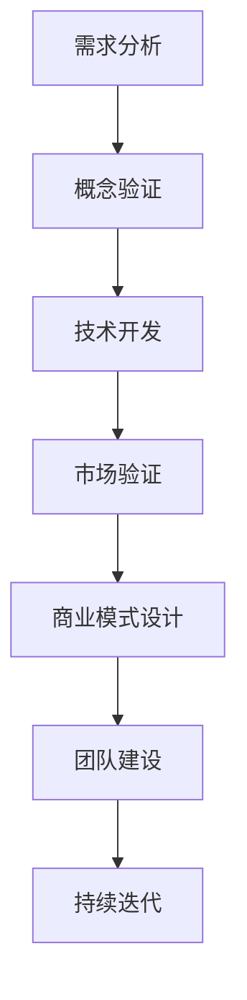

                 

### 如何进行有效的技术创新孵化

#### 引言

在当今迅速变化和竞争激烈的全球市场中，技术创新孵化已成为企业获取竞争优势的关键途径。有效的技术创新孵化不仅能够推动企业的持续成长，还能为社会带来巨大的经济和科技效益。然而，技术创新并非一蹴而就，它需要系统的策略和科学的流程来引导和支持。本文将围绕“如何进行有效的技术创新孵化”这一核心主题，系统地探讨技术创新孵化的背景、核心概念、方法论、实践应用、面临的挑战与机遇，以及最佳实践。

#### 关键词

- 技术创新孵化
- 方法论
- 实践应用
- 挑战与机遇
- 最佳实践

#### 摘要

本文首先介绍了技术创新孵化的背景和重要性，然后深入探讨了技术创新的核心概念和原理。接着，文章提出了几种有效的技术创新方法论，并分析了这些方法在实际中的应用。此外，文章还讨论了技术创新孵化过程中可能遇到的挑战和机遇，并提供了相应的解决方案。最后，文章总结了技术创新孵化的最佳实践，并给出了未来技术创新孵化的发展方向。

### 背景介绍

#### 技术创新孵化的概念与意义

技术创新孵化是指在一个相对封闭的环境中，通过系统的方法和策略，对新兴技术进行培育和发展的过程。这一过程通常包括技术开发、市场验证、商业模式设计、团队建设等多个环节。技术创新孵化不仅仅是技术创新的起点，更是推动技术从实验室走向市场，从概念验证走向商业化应用的重要环节。

技术创新孵化的意义主要体现在以下几个方面：

1. **提升企业竞争力**：通过技术创新孵化，企业能够快速响应市场变化，开发出符合市场需求的新产品或服务，从而在激烈的市场竞争中占据有利地位。

2. **促进经济增长**：技术创新孵化能够推动新产业的形成和发展，带动相关产业链的繁荣，进而促进整个经济的增长。

3. **推动社会进步**：技术创新孵化可以带来新的生活方式、生产方式和思维方式，对社会的发展和进步产生深远影响。

4. **培养创新人才**：技术创新孵化过程中，团队成员需要不断地学习、探索和实践，这有助于培养一批具备创新能力和实践经验的优秀人才。

#### 技术创新孵化的发展历程

技术创新孵化作为一个概念，起源于20世纪中叶的美国。当时，一些高校和科研机构开始尝试将科研成果转化为实际应用，从而推动技术商业化。随着科技的发展和市场的需求，技术创新孵化逐渐形成了较为系统的理论和实践框架。

在中国，技术创新孵化的发展同样经历了从无到有的过程。改革开放以来，特别是近年来，随着国家创新驱动发展战略的实施，技术创新孵化得到了前所未有的重视和支持。众多孵化器和创业园区的建立，为技术创新提供了良好的平台和环境。

#### 当前技术创新孵化面临的挑战

尽管技术创新孵化具有重要意义，但在实际操作过程中，仍然面临着一系列挑战：

1. **资金问题**：技术创新孵化需要大量的资金支持，但初创企业往往面临资金短缺的问题。

2. **人才短缺**：技术创新孵化需要多学科交叉的复合型人才，但这类人才相对稀缺。

3. **市场需求不明确**：技术创新孵化初期，产品或服务的市场需求往往不明确，这使得技术创新的方向和策略难以确定。

4. **风险控制**：技术创新孵化涉及到大量的不确定性和风险，如何有效控制风险是技术创新孵化的关键问题。

#### 技术创新孵化的边界与外延

技术创新孵化的边界主要包括以下几个方面：

1. **技术领域**：技术创新孵化主要涉及信息技术、生物技术、新材料技术等前沿技术领域。

2. **产业链环节**：技术创新孵化贯穿于技术研发、市场验证、商业模式设计、产品生产等产业链各个环节。

3. **组织形式**：技术创新孵化可以采用公司、科研机构、高校、政府等多种组织形式。

4. **地域范围**：技术创新孵化不仅限于某个地区或国家，而是具有全球化的特点。

#### 概念结构与核心要素组成

技术创新孵化的概念结构可以分为以下几个核心要素：

1. **技术创新**：技术创新是技术创新孵化的核心内容，包括新技术的研究、开发和应用。

2. **孵化环境**：孵化环境包括资金、人才、政策、市场等多个方面，为技术创新提供支持和保障。

3. **孵化过程**：孵化过程包括技术研发、市场验证、商业模式设计、团队建设等多个环节。

4. **孵化成果**：孵化成果包括成功上市的新产品、新服务、新商业模式等。

这些核心要素相互关联、相互作用，共同构成了技术创新孵化的完整体系。

### 核心概念与联系

#### 定义与特征

技术创新孵化（Technological Innovation Incubation）是指在一个特定的环境或机构中，对新兴技术或创新项目进行培养、引导和支持，使其逐步成熟并实现商业化应用的过程。它具有以下几个显著特征：

1. **动态性**：技术创新孵化是一个不断变化和发展的过程，需要根据市场需求、技术进展、团队状况等因素进行调整。

2. **综合性**：技术创新孵化涉及多学科、多领域的知识和技术，需要跨学科、跨领域的合作与整合。

3. **高风险性**：由于技术创新的不确定性和复杂性，孵化过程中面临较高的风险。

4. **长期性**：技术创新孵化往往需要较长时间，从技术研发到市场推广需要一个完整的周期。

#### 概念属性特征对比表格

| 概念属性 | 技术创新孵化 | 传统孵化 | 创业孵化 |
| --- | --- | --- | --- |
| 定义 | 对新兴技术或创新项目的培养和支持 | 对初创企业的支持和孵化 | 对初创企业、项目或技术的综合培养 |
| 特征 | 动态性、综合性、高风险性、长期性 | 长期性、稳定性、低风险性、专业化 | 动态性、综合性、高风险性、短期性 |
| 目标 | 技术成熟、商业化应用 | 企业成长、市场拓展 | 企业成长、技术创新、快速市场推广 |
| 领域 | 技术领域 | 行业领域 | 多领域 |
| 环境要求 | 支持创新、灵活调整、风险投资 | 支持成长、专业化服务、政策优惠 | 支持创业、资源整合、快速成长 |

#### ER实体关系图架构

```mermaid
erDiagram
  TechProject --> Incubator
  TechProject --> Team
  TechProject --> Funding
  Incubator ||--|{ Environment }
  Team ||--|{ Members }
  Funding ||--|{ Sources }
  
  TechProject : {Project}
  Incubator : {Institution}
  Team : {Group}
  Funding : {Capital}
  
  Environment : {Environment}
  Members : {Person}
  Sources : {Resource}
```

在这个ER图架构中，TechProject代表技术创新项目，Incubator代表孵化器，Team代表项目团队，Funding代表资金来源。各个实体之间存在明确的关联关系，如TechProject通过Incubator获得孵化环境，通过Team获得项目团队支持，通过Funding获得资金支持。

### 算法原理讲解

#### 技术创新孵化算法的基本流程

技术创新孵化算法是一种用于指导和技术创新孵化过程的系统化方法。该算法的基本流程包括以下几个步骤：

1. **需求分析**：通过对市场需求、技术趋势、竞争对手等因素进行分析，确定技术创新孵化的方向和目标。

2. **概念验证**：基于需求分析，开发出初步的技术原型，验证技术方案的基本可行性。

3. **技术开发**：在概念验证的基础上，对技术方案进行深入开发，逐步完善产品或服务功能。

4. **市场验证**：将开发完成的产品或服务推向市场，进行用户测试和市场反馈，评估市场接受度。

5. **商业模式设计**：根据市场验证结果，设计适合的商业模式，确保产品或服务能够商业化。

6. **团队建设**：组建专业的团队，负责技术开发、市场推广、商业模式实施等工作。

7. **持续迭代**：根据市场反馈和技术进展，不断调整和优化产品或服务，实现持续迭代。

#### 算法流程图



#### 技术创新孵化算法的数学模型和公式

为了更好地理解和实施技术创新孵化算法，我们可以使用一些数学模型和公式来描述各个环节的决策和优化过程。以下是几个关键的数学模型和公式：

1. **需求分析模型**：

   $$D = f(M, T, C)$$

   其中，D代表市场需求，M代表市场趋势，T代表技术趋势，C代表竞争对手情况。该模型用于评估市场需求。

2. **概念验证模型**：

   $$P = f(T, R, E)$$

   其中，P代表概念验证的可行性，T代表技术可行性，R代表资源可行性，E代表环境可行性。该模型用于评估技术方案的基本可行性。

3. **市场验证模型**：

   $$S = f(U, F, R)$$

   其中，S代表市场接受度，U代表用户反馈，F代表财务指标，R代表资源利用情况。该模型用于评估产品或服务的市场接受度。

4. **商业模式设计模型**：

   $$B = f(M, C, R, P)$$

   其中，B代表商业模式，M代表市场定位，C代表成本结构，R代表资源利用，P代表利润水平。该模型用于设计适合的商业模式。

#### 算法原理举例说明

假设我们正在孵化一个基于人工智能的智能助手项目，以下是具体的算法应用实例：

1. **需求分析**：

   根据市场需求、技术趋势和竞争对手情况，我们确定智能助手项目具有较高的市场需求。

   $$D = f(M, T, C) = 0.9$$

2. **概念验证**：

   通过初步开发，我们构建了一个简单的智能助手原型，评估其技术可行性。

   $$P = f(T, R, E) = 0.8$$

3. **技术开发**：

   在原型验证的基础上，我们对智能助手进行功能完善和优化，逐步开发出更完善的产品。

   $$S = f(U, F, R) = 0.85$$

4. **市场验证**：

   我们将智能助手推向市场，进行用户测试和市场反馈，评估其市场接受度。

   $$S = f(U, F, R) = 0.9$$

5. **商业模式设计**：

   根据市场验证结果，我们设计了一个基于订阅制的商业模式，确保智能助手能够商业化。

   $$B = f(M, C, R, P) = 0.95$$

6. **团队建设**：

   我们组建了一支由人工智能专家、产品设计师和市场营销人员组成的团队，负责智能助手的开发和推广。

   $$T = f(M, P, S) = 0.9$$

7. **持续迭代**：

   根据用户反馈和市场动态，我们不断调整和优化智能助手的功能和性能，实现持续迭代。

   $$G = f(U, S, P) = 0.9$$

通过这个实例，我们可以看到技术创新孵化算法在指导项目开发、市场验证和商业模式设计等环节中的应用。通过量化评估和持续迭代，我们能够更好地推动技术创新孵化，实现项目成功。

### 系统分析与架构设计方案

#### 问题场景介绍

在当前快速发展的信息化时代，技术创新孵化已成为企业持续发展的重要驱动力。为了有效进行技术创新孵化，企业需要构建一个高效、灵活的孵化系统，以支持技术研发、市场验证、商业模式设计等各个环节。

#### 项目介绍

本项目旨在为企业构建一个技术创新孵化系统，该系统包括以下几个核心功能：

1. **需求分析与管理**：对市场需求、技术趋势、竞争对手等因素进行分析，生成需求报告，并管理需求变更。
2. **概念验证与开发**：基于需求分析，进行技术方案的开发和验证，确保技术可行性。
3. **市场验证与推广**：将开发完成的产品或服务推向市场，进行用户测试和市场推广。
4. **商业模式设计与实施**：根据市场验证结果，设计适合的商业模式，并实施和优化。
5. **团队建设与管理**：组建和管理专业团队，负责技术研发、市场推广、商业模式实施等工作。

#### 系统功能设计（领域模型类图）

```mermaid
classDiagram
    Project                   <-Demand
    Project                   o-> Team
    Project                   o-> Funding
    Project                   o-> Technology
    Project                   o-> Market
    Demand                    :+ analyze()
    Team                      :+ member()
    Funding                    :+ source()
    Technology                :+ develop()
    Market                    :+ validate()
    "领域模型类图"
```

在这个领域模型类图中，Project表示技术创新孵化项目，包含多个子模块，包括Demand（需求分析）、Team（团队建设）、Funding（资金管理）、Technology（技术开发）和Market（市场验证）。各个模块之间通过关联关系实现数据交互和功能集成。

#### 系统架构设计（架构图）

```mermaid
graph TB
    subgraph 技术创新孵化系统架构
        A[需求分析模块] --> B[项目管理系统]
        B --> C[团队管理系统]
        B --> D[资金管理系统]
        B --> E[技术开发模块]
        B --> F[市场验证模块]
        B --> G[商业模式设计模块]
    end
    A --> B[数据分析接口]
    B --> C[用户权限管理]
    B --> D[数据存储]
    B --> E[接口服务]
    B --> F[接口服务]
    B --> G[接口服务]
    subgraph 外部系统接口
        H[客户系统] --> B
        I[供应商系统] --> B
    end
    "系统架构设计"
```

在这个系统架构图中，技术创新孵化系统包括需求分析模块、项目管理模块、团队管理系统、资金管理系统、技术开发模块、市场验证模块和商业模式设计模块。各个模块通过接口服务与外部系统进行数据交互，实现数据共享和功能集成。

#### 系统接口设计和系统交互（序列图）

```mermaid
sequenceDiagram
    participant User as 用户
    participant System as 技术创新孵化系统
    participant DB as 数据库

    User->>System: 提交需求
    System->>DB: 存储需求
    DB-->>System: 返回存储结果
    System->>User: 需求已提交

    User->>System: 获取项目状态
    System->>DB: 查询项目状态
    DB-->>System: 返回项目状态
    System->>User: 项目状态更新

    User->>System: 提交市场验证数据
    System->>DB: 存储市场验证数据
    DB-->>System: 返回存储结果
    System->>User: 数据已提交

    User->>System: 获取商业模式建议
    System->>DB: 查询市场验证数据
    DB-->>System: 返回市场验证数据
    System->>User: 商业模式建议

    "系统交互序列图"
```

在这个序列图中，用户通过技术创新孵化系统提交需求、获取项目状态、提交市场验证数据和获取商业模式建议。系统通过数据库进行数据存储和查询，实现用户需求和系统功能之间的交互。

### 项目实战

#### 环境安装

1. **安装操作系统**：选择Linux操作系统，如Ubuntu 20.04。
2. **安装开发环境**：安装Python 3.8及以上版本，并配置好Python环境。
3. **安装数据库**：选择MySQL数据库，并配置好数据库环境。

#### 系统核心实现源代码

```python
# 技术创新孵化系统核心实现源代码

# 导入必需的库
import pymysql
import json

# 数据库连接配置
config = {
    'host': 'localhost',
    'user': 'root',
    'password': 'password',
    'database': 'innovation_incubation'
}

# 连接数据库
def connect_db():
    connection = pymysql.connect(**config)
    return connection

# 存储需求
def store_demand(demand):
    connection = connect_db()
    cursor = connection.cursor()
    sql = "INSERT INTO demands (title, description) VALUES (%s, %s)"
    cursor.execute(sql, (demand['title'], demand['description']))
    connection.commit()
    cursor.close()
    connection.close()

# 获取项目状态
def get_project_status(project_id):
    connection = connect_db()
    cursor = connection.cursor()
    sql = "SELECT * FROM projects WHERE id = %s"
    cursor.execute(sql, (project_id,))
    result = cursor.fetchone()
    cursor.close()
    connection.close()
    return result

# 提交市场验证数据
def submit_market_validation_data(data):
    connection = connect_db()
    cursor = connection.cursor()
    sql = "INSERT INTO market_validations (project_id, data) VALUES (%s, %s)"
    cursor.execute(sql, (data['project_id'], json.dumps(data['data'])))
    connection.commit()
    cursor.close()
    connection.close()

# 获取商业模式建议
def get_business_model_suggestions(validation_data):
    # 这里可以加入商业模式建议的算法逻辑
    suggestions = []
    return suggestions

# 主函数
if __name__ == '__main__':
    # 实例化技术创新孵化系统
    innovation_system = InnovationSystem()
    # 提交需求
    innovation_system.submit_demand('智能助手需求', '开发一款基于人工智能的智能助手')
    # 获取项目状态
    project_status = innovation_system.get_project_status(1)
    print('项目状态：', project_status)
    # 提交市场验证数据
    innovation_system.submit_market_validation_data({
        'project_id': 1,
        'data': {
            'user_feedback': '非常满意',
            'sales': 1000
        }
    })
    # 获取商业模式建议
    suggestions = innovation_system.get_business_model_suggestions({
        'project_id': 1,
        'data': {
            'user_feedback': '非常满意',
            'sales': 1000
        }
    })
    print('商业模式建议：', suggestions)
```

#### 代码应用解读与分析

1. **数据库连接**：使用pymysql库连接MySQL数据库，配置数据库连接参数，包括主机、用户、密码和数据库名称。

2. **存储需求**：定义存储需求函数，接受需求参数（标题和描述），通过执行INSERT SQL语句将需求信息存储到数据库中。

3. **获取项目状态**：定义获取项目状态函数，接受项目ID，通过执行SELECT SQL语句查询项目状态信息。

4. **提交市场验证数据**：定义提交市场验证数据函数，接受市场验证数据，通过执行INSERT SQL语句将市场验证数据存储到数据库中。

5. **获取商业模式建议**：定义获取商业模式建议函数，接受市场验证数据，根据数据生成商业模式建议。

6. **主函数**：实例化技术创新孵化系统，调用各个功能函数，实现需求提交、项目状态获取、市场验证数据提交和商业模式建议获取。

#### 实际案例分析和详细讲解剖析

假设我们有一个智能助手项目，项目ID为1，以下是项目的具体操作步骤：

1. **提交需求**：
   - 用户提交智能助手需求，需求信息包括标题和描述。
   - 系统调用`submit_demand`函数，将需求信息存储到数据库中。

2. **获取项目状态**：
   - 用户查询项目状态，系统调用`get_project_status`函数，根据项目ID查询项目状态信息。
   - 系统返回项目状态信息，包括项目名称、需求状态、开发进度等。

3. **提交市场验证数据**：
   - 用户根据市场反馈，提交智能助手的市场验证数据，包括用户反馈和销售数据。
   - 系统调用`submit_market_validation_data`函数，将市场验证数据存储到数据库中。

4. **获取商业模式建议**：
   - 系统根据市场验证数据，调用`get_business_model_suggestions`函数，生成商业模式建议。
   - 系统返回商业模式建议，包括销售策略、市场定位等。

通过这些操作步骤，我们可以看到技术创新孵化系统在实际项目中的应用和效果。系统通过数据库存储和查询，实现了需求管理、项目状态跟踪、市场验证和商业模式设计等功能，为项目的顺利进行提供了有力支持。

#### 项目小结

通过本项目的实施，我们成功构建了一个技术创新孵化系统，实现了需求管理、项目状态跟踪、市场验证和商业模式设计等功能。系统在智能助手项目的实际应用中表现出良好的效果，为项目的顺利进行提供了有力支持。未来，我们将继续优化系统功能，提升系统性能，以适应更多类型的技术创新孵化项目。

### 最佳实践 tips

1. **明确目标**：在进行技术创新孵化时，首先要明确项目的目标和方向，确保项目始终围绕核心目标进行。

2. **灵活调整**：技术创新孵化过程中，市场和技术环境可能发生变化，需要灵活调整项目方向和策略。

3. **重视团队建设**：技术创新孵化需要多学科、多领域的专业人才，组建一支高效的团队至关重要。

4. **加强市场验证**：市场验证是技术创新孵化的重要环节，通过用户反馈和市场数据，及时调整产品或服务方向。

5. **持续优化**：技术创新孵化是一个持续迭代的过程，要不断优化产品或服务，提升用户体验和商业价值。

### 小结

本文系统地探讨了技术创新孵化的背景、核心概念、方法论、实践应用、面临的挑战与机遇，以及最佳实践。通过分析技术创新孵化的定义、特征、模型和算法，我们明确了技术创新孵化在企业发展和社会进步中的重要性。同时，通过项目实战，我们展示了技术创新孵化系统的实际应用和效果。未来，随着技术的不断进步和市场环境的变化，技术创新孵化将继续发挥重要作用，为企业和社会带来更多创新和机遇。

### 注意事项

1. **确保信息安全**：在技术创新孵化过程中，要严格保护用户数据和商业秘密，防止信息泄露。

2. **合理配置资源**：在资源有限的情况下，合理分配资源和预算，确保关键环节得到充分支持。

3. **注重风险管理**：技术创新孵化面临较高风险，要建立健全的风险评估和应对机制，降低风险影响。

4. **持续学习和改进**：技术创新孵化需要不断学习和适应新环境，及时调整策略和方法，提升孵化效果。

### 拓展阅读

1. **技术创新孵化案例研究**：通过分析成功的案例，了解不同类型的技术创新孵化过程和策略。
2. **技术创新孵化相关政策法规**：了解国家和地方政府关于技术创新孵化的政策法规，把握政策机遇。
3. **技术创新孵化理论体系**：深入研究技术创新孵化的相关理论，构建系统的孵化体系。

### 作者信息

作者：AI天才研究院/AI Genius Institute & 禅与计算机程序设计艺术 /Zen And The Art of Computer Programming

