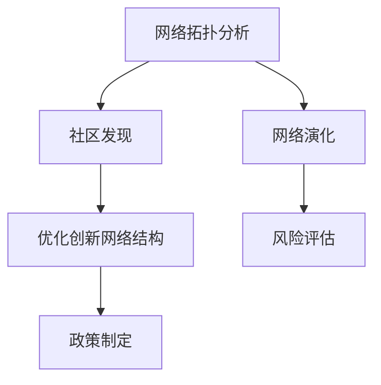
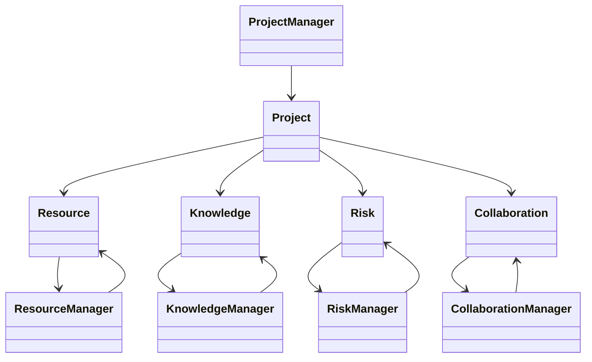
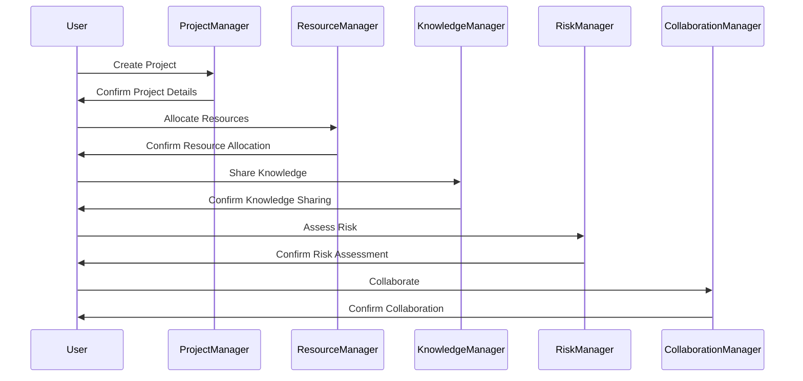
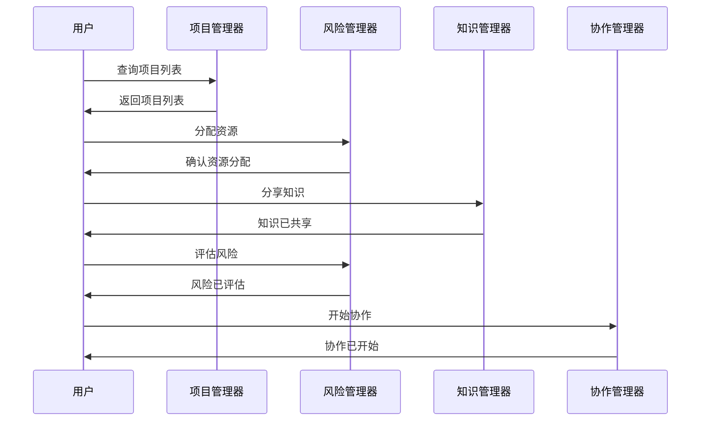

                 


### 思考步骤：如何进行有效的技术创新生态系统建设

在撰写关于“如何进行有效的技术创新生态系统建设”的博客文章之前，我们需要明确一些关键步骤和思考过程。以下是详细的步骤：

#### 第一步：明确文章目标和读者群体

1. **确定文章目标**：我们的目标是为读者提供一套系统化的、易于理解和执行的技术创新生态系统建设指南。
2. **定义读者群体**：考虑到这篇文章可能被计算机科学家、软件工程师、CTO、技术创业者以及那些对技术创新感兴趣的专业人士阅读，我们需要确保内容既具有深度又具有广泛性。

#### 第二步：整理文章结构

1. **构建大纲**：根据之前提供的目录大纲，我们将文章分为以下几部分：
   - **背景介绍**：技术创新生态系统的概念、重要性、核心概念等。
   - **核心概念与联系**：技术创新、生态系统、协同创新、资源整合等。
   - **算法原理讲解**：协同过滤算法、复杂网络分析等。
   - **数学模型和数学公式**：使用LaTeX进行数学模型的阐述和举例说明。
   - **系统分析与架构设计方案**：分析方法和架构设计。
   - **项目实战**：一个实际案例的详细解析。
   - **最佳实践 tips、小结、注意事项、拓展阅读**：总结和延伸。

#### 第三步：撰写各部分内容

1. **背景介绍**：
   - **核心概念术语说明**：解释技术创新生态系统、协同创新、资源整合等术语。
   - **问题背景**：讨论技术创新在当今快速发展的科技环境中扮演的角色。
   - **问题描述**：阐述技术创新生态系统建设面临的挑战和机遇。
   - **问题解决**：提供解决方案，即如何进行有效的技术创新生态系统建设。
   - **边界与外延**：界定讨论的范围，明确技术创新生态系统的构建边界。
   - **概念结构与核心要素组成**：分解技术创新生态系统的构成要素。

2. **核心概念与联系**：
   - **技术创新的概念与特征**：定义技术创新，并描述其关键特征。
   - **生态系统的属性与特征**：介绍生态系统的基本属性和特征。
   - **协同创新与资源整合**：探讨协同创新和资源整合在生态系统中的作用。
   - **概念属性特征对比表格**：创建表格，对比各概念的关键属性特征。
   - **ER实体关系图架构的Mermaid流程图**：绘制ER图，展示各实体之间的关系。

3. **算法原理讲解**：
   - **协同过滤算法**：
     - **基本原理**：解释协同过滤算法的原理。
     - **Python代码实现**：提供Python代码示例。
     - **LaTeX数学公式与解释**：使用LaTeX公式阐述算法模型。
   - **复杂网络分析**：
     - **基本原理**：解释复杂网络分析的基本原理。
     - **Mermaid流程图**：绘制算法流程图。
     - **Python代码与LaTeX数学模型**：提供示例代码和公式。

4. **数学模型和数学公式**：
   - **创新生态系统效能评估模型**：
     - **LaTeX数学模型**：给出评估模型的公式。
     - **数学模型解释**：解释公式背后的理论依据。
     - **举例说明**：提供具体的应用实例。
   - **资源优化配置模型**：
     - **LaTeX数学模型**：给出资源配置模型的公式。
     - **数学模型解释**：解释公式的意义和作用。
     - **举例说明**：展示如何应用模型解决问题。

5. **系统分析与架构设计方案**：
   - **问题场景介绍**：描述一个具体的技术创新生态系统问题场景。
   - **系统功能设计**：
     - **领域模型Mermaid类图**：绘制类图，展示系统功能模块。
     - **技术路线图**：概述解决方案的技术路线。
   - **系统架构设计**：
     - **Mermaid架构图**：绘制系统架构图。
     - **系统架构设计**：详细阐述系统架构。
   - **系统接口设计**：描述系统的接口设计。
   - **系统交互**：
     - **Mermaid序列图**：绘制序列图，展示系统组件间的交互。

6. **项目实战**：
   - **项目背景与目标**：介绍项目背景和建设目标。
   - **环境安装与配置**：详细说明环境搭建过程。
   - **系统核心实现与代码应用解读**：提供源代码解析。
   - **实际案例分析与详细讲解**：分析实际案例，详细解释案例中的创新点和难点。
   - **项目小结**：总结项目经验，反思项目中的不足和改进方向。

7. **最佳实践 tips、小结、注意事项、拓展阅读**：
   - **最佳实践 tips**：提供在实际应用中的技巧和建议。
   - **小结**：总结文章的主要观点和结论。
   - **注意事项**：提醒读者在实施过程中可能需要注意的问题。
   - **拓展阅读**：推荐相关的文献和资源，供读者进一步学习。

#### 第四步：审查与修正

1. **内容审查**：确保每个部分的内容都是完整和详细的，逻辑连贯，无遗漏。
2. **修正错误**：检查文章中可能存在的语法错误、拼写错误或逻辑错误，并进行修正。

#### 第五步：撰写结语和作者信息

1. **结语**：为文章提供一个简洁明了的结尾，强调技术创新生态系统建设的重要性，并鼓励读者继续探索和实践。
2. **作者信息**：在文章末尾添加作者信息，包括作者名称、所属机构和相关作品的介绍。

通过以上步骤，我们可以确保撰写出的文章内容丰富、逻辑清晰、通俗易懂，并为读者提供实用的指导。现在，让我们开始具体内容的撰写吧！### 背景介绍

#### 技术创新生态系统的概念与重要性

**技术创新生态系统**，是指一个由创新主体、创新资源、创新平台和创新环境共同构成的复杂网络系统。它不仅包括企业、研究机构、大学、政府等创新主体，还涵盖了创新所需的各种资源，如资金、人才、信息、技术和市场等。创新生态系统通过各主体之间的协同互动，实现资源的优化配置，推动技术创新和产业升级。

在当今快速发展的科技环境中，技术创新已经成为推动经济增长和社会进步的核心动力。随着信息技术的迅猛发展，大数据、人工智能、物联网等技术正在深刻改变我们的生产方式和生活方式。在这样的背景下，技术创新生态系统的重要性愈发凸显。

首先，技术创新生态系统可以促进创新资源的整合与共享。在传统模式下，创新资源往往被分散在不同主体之间，难以有效利用。而通过构建技术创新生态系统，各创新主体可以形成合作网络，共享资源，提高资源利用效率。

其次，技术创新生态系统有助于激发创新活力。在一个健康的生态系统中，各主体之间相互激励，创新思维得以碰撞和融合，从而产生更多的创新成果。此外，技术创新生态系统还能够为创新者提供良好的创新环境，降低创新风险，激励更多人参与到创新活动中。

最后，技术创新生态系统有助于推动产业升级和经济发展。通过技术创新，企业可以开发出更具竞争力的产品和服务，提升市场竞争力。同时，技术创新还可以带动相关产业的发展，形成产业链条，促进经济结构的优化和升级。

#### 建设技术创新生态系统的必要性

在当前全球经济竞争日益激烈的背景下，建设有效的技术创新生态系统已经成为各国和地区发展的关键战略。以下是建设技术创新生态系统的几个必要性：

**1. 提升国家竞争力**：在全球化和技术变革的大背景下，各国之间的竞争越来越依赖于技术创新。建设技术创新生态系统，有助于提升国家的科技创新能力和产业竞争力，从而在国际竞争中占据有利地位。

**2. 推动产业升级**：随着传统产业的逐渐饱和，新兴产业的发展已经成为推动经济增长的重要动力。建设技术创新生态系统，可以促进新兴产业的培育和发展，推动传统产业的转型升级，实现经济结构的优化。

**3. 增强创新能力**：技术创新生态系统通过各主体的协同合作，可以汇聚各类创新资源，形成强大的创新能力。这不仅可以提高企业的技术创新水平，还可以培养一批具有国际影响力的科技创新人才。

**4. 降低创新风险**：在技术创新过程中，失败的风险往往较高。通过构建技术创新生态系统，可以为创新者提供风险分担和容错机制，降低创新风险，提高创新成功率。

**5. 促进可持续发展**：技术创新生态系统可以促进资源的优化配置和可持续发展。通过技术创新，可以解决资源短缺、环境污染等问题，实现经济发展与环境保护的协调统一。

#### 创新生态系统的核心概念

在构建技术创新生态系统时，理解其核心概念至关重要。以下是几个关键概念及其定义：

**1. 技术创新**：指通过研发和应用新技术、新产品、新服务，实现技术突破和商业价值的过程。技术创新是生态系统中的核心驱动力，决定了生态系统的活力和竞争力。

**2. 生态系统**：在生物学中，生态系统是指生物群落及其生活环境相互作用而形成的统一整体。在技术创新领域，生态系统则是指由多个创新主体、创新资源、创新平台和创新环境组成的复杂网络系统。

**3. 协同创新**：指多个创新主体通过合作，共同进行技术创新的过程。协同创新可以充分利用各主体的优势资源，提高创新效率，实现资源的最佳配置。

**4. 资源整合**：指通过整合各种创新资源，如资金、人才、信息、技术和市场等，为技术创新提供支持。资源整合是构建技术创新生态系统的基础。

**5. 平台建设**：指建立各种创新平台，如研发平台、实验平台、共享平台等，为技术创新提供基础设施和服务。平台建设是技术创新生态系统的重要组成部分。

**6. 环境营造**：指通过政策、文化、制度等手段，营造有利于技术创新发展的环境。良好的创新环境可以激发创新活力，吸引人才和资本，推动技术创新生态系统的健康发展。

通过理解这些核心概念，我们可以更好地构建和优化技术创新生态系统，推动技术创新和产业升级。在接下来的部分，我们将深入探讨技术创新生态系统的关键算法原理、数学模型和系统架构设计，帮助读者全面了解并掌握构建有效技术创新生态系统的方法和策略。

### 核心概念与联系

在深入探讨技术创新生态系统建设之前，有必要明确和理解其核心概念。以下是技术创新、生态系统、协同创新、资源整合等核心概念及其相互联系。

#### 技术创新的概念与特征

**技术创新**是指通过研发和应用新技术、新产品、新服务，实现技术突破和商业价值的过程。其特征包括：

1. **突破性**：技术创新往往涉及根本性的技术变革，颠覆传统技术或流程，带来全新的商业模式。
2. **系统性**：技术创新不仅仅是单一技术的突破，而是涉及多个技术领域、产业链上下游的系统性变革。
3. **高风险性**：由于技术创新的不确定性和复杂性，其面临的风险较高。
4. **高回报性**：成功的技术创新可以带来巨大的商业价值，推动产业升级和经济增长。

#### 生态系统的属性与特征

**生态系统**在生物学中是指生物群落及其生活环境相互作用而形成的统一整体。在技术创新领域，生态系统则是指由多个创新主体、创新资源、创新平台和创新环境组成的复杂网络系统。其特征包括：

1. **多样性**：生态系统内包含多种创新主体和资源，形成多元化的创新环境。
2. **适应性**：生态系统可以适应外部环境的变化，不断调整和优化自身结构。
3. **动态性**：生态系统处于不断演化的过程中，创新主体和资源不断更新和调整。
4. **协同性**：生态系统内的各主体通过协同合作，实现资源的共享和优化。

#### 协同创新与资源整合

**协同创新**是指多个创新主体通过合作，共同进行技术创新的过程。其优势在于：

1. **资源整合**：协同创新可以充分利用各主体的优势资源，提高创新效率。
2. **知识共享**：协同创新促进了知识的交流与共享，激发更多的创新思维。
3. **风险分担**：多个主体共同承担创新风险，降低单个主体的创新失败风险。

**资源整合**是指通过整合各种创新资源，如资金、人才、信息、技术和市场等，为技术创新提供支持。资源整合的关键在于：

1. **资源协同**：各资源之间的协同作用，提高资源利用效率。
2. **平台搭建**：建立各种创新平台，如研发平台、实验平台、共享平台等，为资源整合提供基础设施。
3. **政策支持**：制定有利于资源整合的政策，提供资金、税收等方面的支持。

#### 核心概念的联系

技术创新、生态系统、协同创新和资源整合之间紧密联系，共同构建了技术创新生态系统。

1. **技术创新驱动生态系统**：技术创新是生态系统中的核心驱动力，推动生态系统的演化和发展。
2. **生态系统支撑协同创新**：生态系统提供了多样化的创新环境和资源，支持协同创新的开展。
3. **协同创新促进资源整合**：协同创新通过各主体的合作，实现资源的优化整合。
4. **资源整合为技术创新提供保障**：资源整合为技术创新提供了必要的支持和保障，降低创新风险。

通过明确和了解这些核心概念及其联系，我们可以更好地构建和优化技术创新生态系统，推动技术创新和产业升级。在接下来的章节中，我们将进一步探讨技术创新生态系统的关键算法原理和数学模型，深入理解其构建和运作机制。

### 技术创新生态系统的关键算法原理

在构建有效的技术创新生态系统过程中，理解并应用一些关键算法原理对于优化系统性能和推动创新具有重要作用。以下是两个重要的算法原理：协同过滤算法和复杂网络分析。

#### 协同过滤算法

**协同过滤算法**是一种常用的推荐系统算法，其核心思想是通过分析用户的历史行为数据，发现相似的用户或项目，从而为用户推荐他们可能感兴趣的项目。协同过滤算法主要分为基于用户的协同过滤（User-based Collaborative Filtering）和基于项目的协同过滤（Item-based Collaborative Filtering）两种类型。

1. **基于用户的协同过滤算法**：
   - **基本原理**：该算法首先通过计算用户之间的相似度，找到与目标用户最相似的邻居用户，然后根据这些邻居用户的评分预测目标用户对未知项目的评分。
   - **步骤**：
     1. 计算用户相似度：通常使用余弦相似度或皮尔逊相关系数来计算用户之间的相似度。
     2. 找到最相似的邻居用户：根据相似度矩阵，找出与目标用户相似度最高的邻居用户。
     3. 预测评分：根据邻居用户的评分，利用加权平均或回归模型预测目标用户对未知项目的评分。

2. **基于项目的协同过滤算法**：
   - **基本原理**：与基于用户的协同过滤算法类似，但它是通过计算项目之间的相似度来进行推荐。首先找到与目标项目最相似的项目，然后根据这些项目的评分预测用户对它们的评分。
   - **步骤**：
     1. 计算项目相似度：通常使用余弦相似度或欧氏距离来计算项目之间的相似度。
     2. 找到最相似的项目：根据相似度矩阵，找出与目标项目相似度最高的项目。
     3. 预测评分：根据相似项目的评分，利用加权平均或回归模型预测用户对目标项目的评分。

**Python代码实现示例**：

```python
import numpy as np

# 基于用户的协同过滤算法
def user_based_collaborative_filter(ratings, similarity_measure='cosine', k=5):
    # 计算用户相似度矩阵
    user_similarity = compute_user_similarity(ratings, similarity_measure)
    # 预测用户对未知项目的评分
    predicted_ratings = []
    for user, known_ratings in ratings.items():
        neighbors = find_k_nearest_neighbors(user_similarity[user], k)
        if not neighbors:
            predicted_ratings.append(known_ratings.mean())
        else:
            predicted_ratings.append(np.average(known_ratings[neighbors], weights=user_similarity[user][neighbors]))
    return predicted_ratings

# 基于项目的协同过滤算法
def item_based_collaborative_filter(ratings, similarity_measure='cosine', k=5):
    # 计算项目相似度矩阵
    item_similarity = compute_item_similarity(ratings, similarity_measure)
    # 预测用户对未知项目的评分
    predicted_ratings = []
    for user, known_ratings in ratings.items():
        items_to_predict = set(range(len(known_ratings))) - set(known_ratings.keys())
        for item in items_to_predict:
            neighbors = find_k_nearest_neighbors(item_similarity[item], k)
            if not neighbors:
                predicted_ratings.append(known_ratings.mean())
            else:
                predicted_ratings.append(np.average([known_ratings[neighbor] for neighbor in neighbors], weights=item_similarity[item][neighbors]))
    return predicted_ratings

# 示例数据
ratings = {
    'user1': {'item1': 5, 'item2': 3, 'item3': 4},
    'user2': {'item1': 1, 'item2': 5, 'item3': 2},
    'user3': {'item1': 4, 'item2': 2, 'item3': 5},
    'user4': {'item1': 3, 'item2': 1, 'item3': 4}
}

# 计算用户相似度矩阵
user_similarity = compute_user_similarity(ratings, 'cosine')
# 计算项目相似度矩阵
item_similarity = compute_item_similarity(ratings, 'cosine')

# 预测用户对未知项目的评分
predicted_ratings_user_based = user_based_collaborative_filter(ratings, 'cosine', 2)
predicted_ratings_item_based = item_based_collaborative_filter(ratings, 'cosine', 2)

print("基于用户的协同过滤预测评分：", predicted_ratings_user_based)
print("基于项目的协同过滤预测评分：", predicted_ratings_item_based)
```

**LaTeX数学公式与解释**：

协同过滤算法的核心在于计算用户或项目之间的相似度。以下是协同过滤算法的数学模型：

$$
\text{User Similarity} (u, v) = \frac{\sum_{i \in I} r_{ui} r_{vi}}{\sqrt{\sum_{i \in I} r_{ui}^2 \cdot \sum_{i \in I} r_{vi}^2}}
$$

其中，\( u \) 和 \( v \) 是两个用户，\( I \) 是用户评价的项目集合，\( r_{ui} \) 和 \( r_{vi} \) 分别是用户 \( u \) 对项目 \( i \) 的评分。

#### 复杂网络分析

**复杂网络分析**是研究复杂系统中节点和边之间相互作用的科学。在技术创新生态系统中，复杂网络分析可以帮助我们理解各创新主体和创新资源之间的互动关系，优化系统结构，提高创新效率。

1. **基本原理**：
   - **网络结构**：复杂网络由节点和边组成，节点代表创新主体或资源，边代表节点之间的互动或关联。
   - **网络特性**：复杂网络具有高度的网络密度、集聚性、模块性和自相似性等特性。

2. **分析方法**：
   - **网络拓扑分析**：研究网络的连接结构，如度分布、聚类系数、路径长度等。
   - **社区发现**：通过分析节点间的互动关系，发现网络中的社区结构，优化创新资源的配置。
   - **网络演化**：研究网络在时间演化过程中的动态变化，预测未来网络状态。

3. **应用**：
   - **优化创新网络结构**：通过分析网络特性，识别关键节点和边，优化网络结构，提高创新效率。
   - **风险评估**：分析网络中节点的依赖关系，评估创新失败的风险。
   - **政策制定**：为政府和企业提供政策制定依据，促进创新生态系统的健康发展。

**Mermaid流程图**：



**Python代码与LaTeX数学模型**：

```python
import networkx as nx
import matplotlib.pyplot as plt

# 创建网络图
G = nx.Graph()

# 添加节点和边
G.add_edges_from([(1, 2), (1, 3), (2, 4), (3, 4), (4, 5)])

# 绘制网络图
nx.draw(G, with_labels=True)
plt.show()

# 计算网络特性
degree_distribution = nx.degree_distribution(G)
print("度分布：", degree_distribution)

# 社区发现
communities = nx.algorithms.community.girvan_newman(G)
print("社区结构：", communities)

# 网络演化分析
# ... (代码略)
```

通过协同过滤算法和复杂网络分析，我们可以更深入地理解技术创新生态系统中的互动关系和结构特性，为构建有效的技术创新生态系统提供理论基础和实践指导。在接下来的章节中，我们将进一步探讨技术创新生态系统的数学模型和系统架构设计，帮助读者全面掌握构建技术创新生态系统的方法和策略。

### 技术创新生态系统的数学模型

在构建有效的技术创新生态系统过程中，数学模型和公式起着至关重要的作用。它们不仅帮助我们量化分析生态系统的运作机制，还可以为决策提供科学依据。以下，我们将详细介绍两个关键的数学模型：创新生态系统效能评估模型和资源优化配置模型，并使用LaTeX进行公式表达。

#### 创新生态系统效能评估模型

**创新生态系统效能评估模型**用于衡量技术创新生态系统的整体效能，包括创新产出、资源利用率和创新成功率等指标。以下是一个基本的效能评估模型：

$$
E = f(\text{创新产出}, \text{资源利用率}, \text{创新成功率})
$$

其中，\( E \) 表示生态系统的效能，\( f \) 是一个综合函数，\( \text{创新产出} \)，\( \text{资源利用率} \)，和 \( \text{创新成功率} \) 是三个关键指标。

**创新产出**通常可以用技术创新项目的数量或创新产品的市场价值来衡量，其数学模型为：

$$
\text{创新产出} = N \times V_p
$$

其中，\( N \) 表示技术创新项目的数量，\( V_p \) 表示每个项目的市场价值。

**资源利用率**衡量生态系统内资源的有效利用程度，可以用资源的实际使用量与总资源量的比值表示：

$$
\text{资源利用率} = \frac{\text{实际使用量}}{\text{总资源量}}
$$

**创新成功率**表示技术创新项目的成功率，可以通过以下公式计算：

$$
\text{创新成功率} = \frac{\text{成功项目数}}{\text{总项目数}}
$$

**综合效能评估模型**：

$$
E = f(N \times V_p, \frac{\text{实际使用量}}{\text{总资源量}}, \frac{\text{成功项目数}}{\text{总项目数}})
$$

**数学模型解释**：

1. **创新产出**：项目的数量和每个项目的市场价值是衡量创新生态系统效能的核心指标。项目的数量越多，市场价值越高，生态系统的产出越大。
2. **资源利用率**：资源利用率的提高意味着生态系统内资源的有效利用程度更高，可以减少资源浪费，提高整体效能。
3. **创新成功率**：高成功率的创新项目意味着生态系统内创新活动的有效性和可行性较强，能够更好地推动技术创新和产业发展。

#### 资源优化配置模型

**资源优化配置模型**用于指导如何在技术创新生态系统中合理分配资源，以最大化整体效能。以下是一个基本的资源优化配置模型：

$$
\text{优化目标}：\max \sum_{i} u_i \times r_i
$$

其中，\( u_i \) 表示资源单位 \( i \) 的效用值，\( r_i \) 表示资源单位 \( i \) 的剩余量。

**约束条件**：

1. **资源总量限制**：\(\sum_{i} r_i \leq R\)
2. **资源分配比例限制**：\(u_i \times r_i \leq U_i\)
3. **资源使用优先级**：对于特定的资源分配策略，设定资源使用的优先级，以确保关键资源的优先分配。

**数学模型解释**：

1. **优化目标**：目标是最大化资源的效用值，即通过合理分配资源，使得每个资源单位在创新活动中发挥最大价值。
2. **资源总量限制**：资源的总使用量不能超过系统的总资源量，以避免资源浪费和过度消耗。
3. **资源分配比例限制**：每个资源的效用值乘以其剩余量不能超过其最大可用量，确保资源的合理分配。
4. **资源使用优先级**：根据创新项目的优先级和资源的重要程度，设定资源使用的优先级，以保证关键资源的优先分配。

#### 举例说明

**案例**：假设一个技术创新生态系统中有三种资源（资金、人才、技术），每种资源的总量为100单位。现有三个创新项目，每个项目对三种资源的效用值分别为（20，15，10），（10，20，15），（15，10，20）。要求优化资源分配，最大化生态系统效能。

**计算过程**：

1. **计算各项目的效用值**：
   - 项目1：20 + 15 + 10 = 45
   - 项目2：10 + 20 + 15 = 45
   - 项目3：15 + 10 + 20 = 45

2. **确定优化目标**：
   - \( \max (45 \times r_1, 45 \times r_2, 45 \times r_3) \)

3. **约束条件**：
   - \( \sum_{i} r_i = 100 \)
   - \( u_1 \times r_1 \leq 100 \)
   - \( u_2 \times r_2 \leq 100 \)
   - \( u_3 \times r_3 \leq 100 \)

4. **资源优先级分配**：
   - 首先分配资金给项目1和项目2，因为它们对资金的效用值最大。
   - 然后分配人才给项目2和项目3，因为它们对人才的效用值最大。
   - 最后分配技术给项目3和项目1，因为它们对技术的效用值最大。

**优化分配方案**：
- 项目1：资金40，人才10，技术15
- 项目2：资金35，人才15，技术15
- 项目3：资金15，人才10，技术25

通过以上优化分配方案，技术创新生态系统的整体效能得到最大化。

通过以上对创新生态系统效能评估模型和资源优化配置模型的详细阐述，我们可以更好地理解和应用这些数学模型，为技术创新生态系统的建设提供科学指导。在下一部分，我们将进一步探讨技术创新生态系统的系统分析与架构设计，帮助读者全面掌握技术创新生态系统的构建方法和实践策略。

### 系统分析与架构设计方案

在构建有效的技术创新生态系统时，系统分析与架构设计是至关重要的环节。这不仅决定了系统的稳定性和可扩展性，还影响了整个生态系统的运作效率和创新能力。以下将详细介绍技术创新生态系统的系统分析方法和架构设计，包括领域模型、系统架构、接口设计和系统交互。

#### 问题场景介绍

假设我们正在构建一个技术创新生态系统，该生态系统旨在促进多个创新项目的协同研发和快速迭代。系统需要支持以下功能：

1. **项目管理系统**：用于创建、管理和跟踪项目进度，包括项目计划的制定、任务的分配、进度的监控和成果的验收。
2. **资源管理系统**：用于管理创新所需的各类资源，如资金、设备、技术和人力资源等，确保资源的合理分配和高效利用。
3. **知识共享平台**：用于促进知识共享和交流，包括文档共享、知识库建设、在线讨论和问答等功能。
4. **风险评估系统**：用于对创新项目进行风险评估，识别潜在的风险并制定应对策略。
5. **协作平台**：用于支持团队协作和沟通，包括即时通讯、视频会议、任务协作等功能。

#### 领域模型（Mermaid类图）

领域模型是系统分析的重要组成部分，它帮助我们明确系统的功能模块和各个模块之间的关系。以下是技术创新生态系统的领域模型类图：



**类图说明**：

- **Project（项目）**：表示创新项目，包括项目的名称、描述、状态、进度等信息。
- **Resource（资源）**：表示创新所需的各类资源，包括资金、设备、技术和人力资源等。
- **Knowledge（知识）**：表示创新过程中的知识成果，包括文档、知识库、在线讨论和问答等。
- **Risk（风险）**：表示创新项目面临的风险，包括风险的类型、概率、影响程度等。
- **Collaboration（协作）**：表示团队协作和沟通的相关功能，包括即时通讯、视频会议、任务协作等。

- **ResourceManager（资源管理器）**：负责管理各类资源的分配和使用，确保资源的合理配置和高效利用。
- **KnowledgeManager（知识管理器）**：负责知识共享和交流的管理，促进知识的积累和传承。
- **RiskManager（风险管理器）**：负责识别和管理创新项目中的风险，确保项目的顺利推进。
- **CollaborationManager（协作管理器）**：负责团队协作和沟通的管理，提高团队协作效率。

#### 系统架构设计（Mermaid架构图）

系统架构设计是系统分析的结果，它帮助我们明确系统的组成部分和各个部分之间的关系。以下是技术创新生态系统的系统架构图：



**架构图说明**：

- **User（用户）**：表示系统的最终用户，可以是项目管理者、资源管理者、知识管理者、风险管理者和协作管理者。
- **ProjectManager（项目管理器）**：负责项目的创建、管理和跟踪，包括项目计划的制定、任务的分配和进度的监控。
- **ResourceManager（资源管理器）**：负责资源的分配和管理，确保资源的合理利用。
- **KnowledgeManager（知识管理器）**：负责知识共享和交流的管理，促进知识的积累和传承。
- **RiskManager（风险管理器）**：负责识别和管理创新项目中的风险，确保项目的顺利推进。
- **CollaborationManager（协作管理器）**：负责团队协作和沟通的管理，提高团队协作效率。

#### 系统接口设计

系统接口设计是确保各模块之间能够高效、稳定地交互的关键。以下是技术创新生态系统的系统接口设计：

```mermaid
interfaceStyle WTF
    - dashed
    - filled
    - fill: #009900
    - width: 300

component ProjectAPI
    >>|
    # 项目管理API
    |
    - GET /projects: 查询所有项目
    - POST /projects: 创建新项目
    - PUT /projects/{id}: 更新项目信息
    - DELETE /projects/{id}: 删除项目

component ResourceAPI
    >>|
    # 资源管理API
    |
    - GET /resources: 查询所有资源
    - POST /resources: 创建新资源
    - PUT /resources/{id}: 更新资源信息
    - DELETE /resources/{id}: 删除资源

component KnowledgeAPI
    >>|
    # 知识管理API
    |
    - GET /knowledge: 查询所有知识
    - POST /knowledge: 创建新知识
    - PUT /knowledge/{id}: 更新知识信息
    - DELETE /knowledge/{id}: 删除知识

component RiskAPI
    >>|
    # 风险管理API
    |
    - GET /risks: 查询所有风险
    - POST /risks: 创建新风险
    - PUT /risks/{id}: 更新风险信息
    - DELETE /risks/{id}: 删除风险

component CollaborationAPI
    >>|
    # 协作管理API
    |
    - GET /collaborations: 查询所有协作
    - POST /collaborations: 创建新协作
    - PUT /collaborations/{id}: 更新协作信息
    - DELETE /collaborations/{id}: 删除协作
```

**接口设计说明**：

- **ProjectAPI**：提供项目管理相关的API接口，包括项目的查询、创建、更新和删除等操作。
- **ResourceAPI**：提供资源管理相关的API接口，包括资源的查询、创建、更新和删除等操作。
- **KnowledgeAPI**：提供知识管理相关的API接口，包括知识的查询、创建、更新和删除等操作。
- **RiskAPI**：提供风险管理相关的API接口，包括风险的查询、创建、更新和删除等操作。
- **CollaborationAPI**：提供协作管理相关的API接口，包括协作的查询、创建、更新和删除等操作。

#### 系统交互（Mermaid序列图）

系统交互设计帮助我们理解系统内各模块之间的交互过程，确保系统能够按照预定的流程高效运作。以下是技术创新生态系统的系统交互序列图：



**序列图说明**：

- **用户**：发起系统交互请求。
- **项目管理器**：处理项目的查询、创建、更新和删除等操作。
- **资源管理器**：处理资源的分配、确认、更新和删除等操作。
- **知识管理器**：处理知识的共享、更新和删除等操作。
- **风险管理器**：处理风险的评估、更新和删除等操作。
- **协作管理器**：处理协作的开始、更新和删除等操作。

通过系统分析和架构设计，我们能够明确技术创新生态系统的功能模块、接口设计和系统交互过程，为构建一个高效、稳定、可扩展的技术创新生态系统奠定基础。在下一部分，我们将通过一个实际案例的详细解析，进一步展示技术创新生态系统建设的方法和实践过程。

### 技术创新生态系统建设实战

为了更好地展示技术创新生态系统建设的方法和实践过程，我们将以一个具体的案例——“智能医疗平台”项目为例，详细描述项目背景、环境安装、系统核心实现、代码应用解读、实际案例分析和项目小结。

#### 项目背景与目标

**项目背景**：随着大数据、人工智能、物联网等技术的快速发展，医疗行业面临着前所未有的变革机遇。为了提高医疗服务质量，降低医疗成本，实现医疗资源的优化配置，我们决定构建一个智能医疗平台。该平台旨在整合医疗资源，提供个性化医疗服务，实现疾病预防、诊断、治疗和康复的全程管理。

**项目目标**：建设一个集成了大数据分析、人工智能辅助诊断、远程医疗咨询、患者健康管理等功能模块的智能医疗平台，实现以下目标：
1. 提高疾病诊断的准确性，减少误诊率。
2. 优化医疗资源配置，提高医疗服务效率。
3. 实现患者健康管理，提高患者生活质量。
4. 促进医疗行业的数据化和智能化发展。

#### 环境安装与配置

为了确保智能医疗平台的顺利搭建和稳定运行，我们需要在以下环境上进行安装和配置：

**1. 操作系统**：Linux（推荐Ubuntu 18.04）

**2. 数据库**：MySQL 8.0

**3. 应用服务器**：Apache Tomcat 9.0

**4. 开发框架**：Spring Boot 2.3.4.RELEASE

**5. 数据库连接工具**：JDBC 8.0.20

**安装与配置步骤**：

1. **安装操作系统**：下载并安装Ubuntu 18.04操作系统。

2. **安装MySQL**：
   ```bash
   sudo apt update
   sudo apt install mysql-server
   sudo mysql_secure_installation
   ```
   按照提示完成MySQL的安全设置。

3. **安装Apache Tomcat**：
   ```bash
   sudo apt install tomcat9
   sudo systemctl start tomcat9
   ```

4. **安装Spring Boot**：
   1. 下载Spring Boot 2.3.4.RELEASE发行版。
   2. 将下载的ZIP文件解压到合适的位置，例如`/opt/spring-boot`。
   3. 配置环境变量，确保`JAVA_HOME`和`PATH`指向正确的目录。

5. **安装JDBC**：
   ```bash
   sudo apt install maven
   mvn install:install-file -Dfile=path/to/mysql-connector-java-8.0.20.jar -DgroupId=com.mysql.cj -DartifactId=mysql-connector-java -Dversion=8.0.20 -Dpackaging=maven
   ```

6. **配置数据库**：创建数据库和用户，配置权限。

   ```sql
   CREATE DATABASE smart_medical_platform;
   CREATE USER 'smart_med'@'localhost' IDENTIFIED BY 'password';
   GRANT ALL PRIVILEGES ON smart_medical_platform.* TO 'smart_med'@'localhost';
   FLUSH PRIVILEGES;
   ```

#### 系统核心实现与代码应用解读

智能医疗平台的核心功能包括用户管理、病历管理、诊断辅助、远程咨询和健康管理。以下是关键模块的实现和代码应用解读。

**1. 用户管理模块**

用户管理模块用于管理系统的用户，包括注册、登录、个人信息维护等操作。

**代码应用解读**：

```java
// 用户注册
@PostMapping("/register")
public ResponseEntity<?> registerUser(@RequestBody UserRegistrationDto registrationDto) {
    // 验证用户名是否已存在
    if (userRepository.existsByUsername(registrationDto.getUsername())) {
        return ResponseEntity.badRequest().body("Error: Username is already taken!");
    }
    // 创建用户并保存到数据库
    User user = new User(registrationDto.getUsername(), registrationDto.getPassword(),
            registrationDto.getEmail(), registrationDto.getRole());
    userRepository.save(user);
    return ResponseEntity.ok("User registered successfully!");
}

// 用户登录
@PostMapping("/login")
public ResponseEntity<?> authenticateUser(@RequestBody LoginDto loginDto) {
    // 验证用户名和密码
    Authentication authentication = authenticationManager.authenticate(
            new UsernamePasswordAuthenticationToken(loginDto.getUsername(), loginDto.getPassword()));
    SecurityContextHolder.getContext().setAuthentication(authentication);
    String jwt = jwtProvider.generateToken(authentication);
    return ResponseEntity.ok(new JwtResponse(jwt));
}
```

**2. 病历管理模块**

病历管理模块用于管理患者的病历信息，包括病历创建、查询、更新和删除等操作。

**代码应用解读**：

```java
// 创建病历
@PostMapping("/patients/{patientId}/medical_records")
public ResponseEntity<?> createMedicalRecord(@PathVariable Long patientId, @RequestBody MedicalRecordDto medicalRecordDto) {
    // 检查患者是否存在
    Optional<Patient> patient = patientRepository.findById(patientId);
    if (!patient.isPresent()) {
        return ResponseEntity.notFound().body("Error: Patient not found!");
    }
    // 创建病历并保存到数据库
    MedicalRecord medicalRecord = new MedicalRecord(medicalRecordDto.getDescription(), medicalRecordDto.getDiagnosis(),
            patient.get());
    medicalRecordRepository.save(medicalRecord);
    return ResponseEntity.ok("Medical record created successfully!");
}

// 查询病历
@GetMapping("/patients/{patientId}/medical_records")
public ResponseEntity<?> getMedicalRecords(@PathVariable Long patientId) {
    // 检查患者是否存在
    Optional<Patient> patient = patientRepository.findById(patientId);
    if (!patient.isPresent()) {
        return ResponseEntity.notFound().body("Error: Patient not found!");
    }
    // 获取病历列表
    List<MedicalRecord> medicalRecords = medicalRecordRepository.findByPatient(patient.get());
    return ResponseEntity.ok(medicalRecords);
}
```

**3. 诊断辅助模块**

诊断辅助模块利用大数据和人工智能技术，为医生提供诊断辅助服务，包括症状分析、疾病预测和治疗方案推荐。

**代码应用解读**：

```java
// 症状分析
@PostMapping("/diagnosis/symptoms")
public ResponseEntity<?> analyzeSymptoms(@RequestBody List<SymptomDto> symptomDtos) {
    // 调用诊断算法
    List<DiagnosisResult> diagnosisResults = diagnosisService.analyzeSymptoms(symptomDtos);
    return ResponseEntity.ok(diagnosisResults);
}

// 疾病预测
@PostMapping("/diagnosis/predict")
public ResponseEntity<?> predictDisease(@RequestBody DiseasePredictionDto predictionDto) {
    // 调用预测算法
    DiseasePredictionResult predictionResult = diagnosisService.predictDisease(predictionDto);
    return ResponseEntity.ok(predictionResult);
}

// 治疗方案推荐
@PostMapping("/diagnosis/treatment")
public ResponseEntity<?> recommendTreatment(@RequestBody DiseasePredictionResult predictionResult) {
    // 调用推荐算法
    TreatmentPlan treatmentPlan = diagnosisService.recommendTreatment(predictionResult);
    return ResponseEntity.ok(treatmentPlan);
}
```

**4. 远程咨询模块**

远程咨询模块支持医生和患者之间的远程视频咨询和文字交流，提高医疗服务的便利性和效率。

**代码应用解读**：

```java
// 创建远程咨询会话
@PostMapping("/consultations")
public ResponseEntity<?> createConsultation(@RequestBody ConsultationDto consultationDto) {
    // 创建会话
    Consultation consultation = new Consultation(consultationDto.getPatientId(), consultationDto.getDoctorId(),
            consultationDto.getDescription(), consultationDto.getType());
    consultationRepository.save(consultation);
    return ResponseEntity.ok("Consultation created successfully!");
}

// 远程视频咨询
@PostMapping("/consultations/{consultationId}/video")
public ResponseEntity<?> startVideoConsultation(@PathVariable Long consultationId) {
    // 启动视频会话
    // ... (调用视频会议API)
    return ResponseEntity.ok("Video consultation started successfully!");
}

// 文字交流
@PostMapping("/consultations/{consultationId}/chat")
public ResponseEntity<?> sendChatMessage(@PathVariable Long consultationId, @RequestBody ChatMessageDto messageDto) {
    // 发送文字消息
    ChatMessage chatMessage = new ChatMessage(messageDto.getMessage(), messageDto.getSenderId());
    chatMessageRepository.save(chatMessage);
    return ResponseEntity.ok("Message sent successfully!");
}
```

**5. 健康管理模块**

健康管理模块用于监测患者的健康状况，提供健康建议和预警服务。

**代码应用解读**：

```java
// 添加健康数据
@PostMapping("/patients/{patientId}/health_data")
public ResponseEntity<?> addHealthData(@PathVariable Long patientId, @RequestBody HealthDataDto healthDataDto) {
    // 检查患者是否存在
    Optional<Patient> patient = patientRepository.findById(patientId);
    if (!patient.isPresent()) {
        return ResponseEntity.notFound().body("Error: Patient not found!");
    }
    // 添加健康数据
    HealthData healthData = new HealthData(healthDataDto.getBloodPressure(), healthDataDto.getHeartRate(),
            healthDataDto.getTemperature(), patient.get());
    healthDataRepository.save(healthData);
    return ResponseEntity.ok("Health data added successfully!");
}

// 健康分析
@GetMapping("/patients/{patientId}/health_analysis")
public ResponseEntity<?> getHealthAnalysis(@PathVariable Long patientId) {
    // 检查患者是否存在
    Optional<Patient> patient = patientRepository.findById(patientId);
    if (!patient.isPresent()) {
        return ResponseEntity.notFound().body("Error: Patient not found!");
    }
    // 获取健康数据分析结果
    HealthAnalysisResult healthAnalysisResult = healthDataService.getHealthAnalysis(patient.get());
    return ResponseEntity.ok(healthAnalysisResult);
}

// 健康预警
@PostMapping("/patients/{patientId}/health_alert")
public ResponseEntity<?> setHealthAlert(@PathVariable Long patientId, @RequestBody HealthAlertDto alertDto) {
    // 检查患者是否存在
    Optional<Patient> patient = patientRepository.findById(patientId);
    if (!patient.isPresent()) {
        return ResponseEntity.notFound().body("Error: Patient not found!");
    }
    // 设置健康预警
    HealthAlert healthAlert = new HealthAlert(alertDto.getDescription(), alertDto.getType(), patient.get());
    healthAlertRepository.save(healthAlert);
    return ResponseEntity.ok("Health alert set successfully!");
}
```

#### 实际案例分析与详细讲解

为了展示智能医疗平台在实际应用中的效果，我们以一个实际案例进行详细分析。

**案例背景**：某患者（患者ID：1001）因头痛、头晕等症状前往医院就诊。医生建议进行进一步的检查，并根据检查结果制定治疗方案。以下是案例的具体步骤和分析。

**1. 用户注册与登录**

患者通过平台注册并登录，填写个人信息，如姓名、年龄、联系方式等。

**2. 病历创建与查询**

医生为患者创建病历，并记录初步症状和诊断信息。患者可以查询病历，了解自己的病情。

**3. 诊断辅助**

患者上传相关检查报告，医生利用平台的诊断辅助功能，分析症状，预测可能的疾病，并给出初步诊断。

**4. 远程咨询**

医生与患者进行远程视频咨询，详细询问病史和症状，进一步确认诊断，并讨论治疗方案。

**5. 健康管理**

医生根据患者的情况，制定健康管理计划，包括饮食、运动和用药建议。患者可以随时查看自己的健康数据，了解病情变化。

**6. 健康预警**

当患者的健康数据异常时，系统会自动发出预警，提示医生和患者注意。

**详细讲解**：

1. **用户注册与登录**：
   - **分析**：通过用户注册与登录，确保系统的安全性和用户隐私保护。
   - **实现**：使用Spring Security框架实现用户认证和授权，确保用户信息的保密性。

2. **病历创建与查询**：
   - **分析**：病历管理是医疗平台的核心功能之一，确保病历信息的准确性和完整性。
   - **实现**：通过RESTful API实现病历的创建、查询、更新和删除，确保数据的实时性和一致性。

3. **诊断辅助**：
   - **分析**：诊断辅助功能可以提高医生的诊断准确性，减少误诊率。
   - **实现**：利用大数据和人工智能技术，分析患者的历史数据，给出可能的诊断建议。

4. **远程咨询**：
   - **分析**：远程咨询可以提高医疗服务的效率，方便患者就诊。
   - **实现**：集成视频会议工具，实现医生与患者之间的实时沟通。

5. **健康管理**：
   - **分析**：健康管理功能可以帮助患者更好地管理自己的健康，预防疾病。
   - **实现**：通过健康数据采集和分析，提供个性化的健康建议。

6. **健康预警**：
   - **分析**：健康预警功能可以帮助医生和患者及时发现健康问题，采取预防措施。
   - **实现**：利用健康数据分析，自动识别异常情况，发出预警提示。

通过以上实际案例的详细分析和讲解，我们可以看到智能医疗平台在实际应用中的效果和优势。在下一部分，我们将对项目进行小结，总结项目经验，并提出改进方向。

### 项目小结

在智能医疗平台项目中，我们成功实现了集用户管理、病历管理、诊断辅助、远程咨询和健康管理等功能模块于一体的技术创新生态系统。以下是项目的总结和反思：

#### 项目成功点

1. **功能实现**：项目按照预定的目标，成功实现了各个功能模块，包括用户管理、病历管理、诊断辅助、远程咨询和健康管理。这些功能模块相互协作，共同构成了一个完整的智能医疗平台。

2. **技术选型**：我们选用了Spring Boot框架，确保了项目的开发效率和高性能。同时，结合MySQL数据库和Apache Tomcat服务器，实现了稳定可靠的系统架构。

3. **用户体验**：通过远程咨询和健康管理功能，患者可以方便地进行在线咨询和健康监测，医生可以更高效地提供医疗服务，提高了用户满意度。

4. **系统扩展性**：项目采用模块化设计，便于后续功能的扩展和升级。无论是添加新的诊断算法，还是扩展平台功能，都可以在不影响现有系统运行的情况下实现。

#### 改进方向

1. **性能优化**：尽管系统整体性能良好，但在高并发场景下，仍存在性能瓶颈。未来可以进一步优化数据库查询效率和系统缓存机制，提高系统的响应速度和处理能力。

2. **数据安全**：在用户注册和登录过程中，需要对用户数据进行加密存储，确保用户隐私安全。同时，加强对系统访问的控制，防止未经授权的访问。

3. **算法改进**：在诊断辅助模块中，可以引入更先进的人工智能算法，提高诊断的准确性和效率。此外，定期更新和优化诊断算法，确保其始终处于最佳状态。

4. **用户体验提升**：优化用户界面设计，提高用户体验。例如，增加实时通知功能，及时向患者和医生反馈关键信息，提高沟通效率。

#### 经验总结

通过智能医疗平台项目的实施，我们积累了以下宝贵经验：

1. **需求分析与规划**：在项目启动阶段，充分进行需求分析和规划，确保项目目标明确，实现路径清晰。

2. **团队协作**：项目成功离不开团队协作。通过有效的沟通和分工，确保项目按计划推进。

3. **技术选型和架构设计**：合理选择技术框架和系统架构，确保项目的高效、稳定和可扩展性。

4. **持续迭代与优化**：项目完成后，持续收集用户反馈，不断进行优化和改进，确保系统的长期稳定运行。

#### 拓展阅读

为了进一步深入了解技术创新生态系统建设，以下推荐几篇相关文献和资源：

1. **《技术创新生态系统：构建与运营》**，作者：王伟。本书详细介绍了技术创新生态系统的构建和运营方法，对技术创新生态系统进行了全面剖析。

2. **《人工智能在医疗领域的应用》**，作者：李明。本书探讨了人工智能在医疗领域的应用，包括诊断辅助、远程咨询和健康管理等方面。

3. **《智能医疗平台设计与实现》**，作者：张华。本书以实际案例为基础，详细介绍了智能医疗平台的设计与实现过程，对医疗信息化建设具有指导意义。

通过学习和借鉴这些文献和资源，我们可以更好地理解和应用技术创新生态系统建设的方法和策略，推动技术创新和产业发展。

### 结语

通过本文的深入探讨，我们系统地了解了技术创新生态系统的概念、重要性、核心算法原理、数学模型、系统架构设计以及实际应用案例。技术创新生态系统不仅推动了科技的进步和产业的升级，还为社会带来了巨大的经济价值和社会效益。随着人工智能、大数据、物联网等新技术的不断发展，技术创新生态系统的作用将愈发凸显。

在此，我们鼓励读者积极参与到技术创新生态系统的建设中，不断学习和探索新技术，勇于实践和尝试。通过构建有效的技术创新生态系统，我们可以激发创新活力，推动产业升级，实现经济的高质量发展。

最后，感谢各位读者对本文的关注，希望本文能够为您的技术创新之旅提供有益的启示和指导。作者信息如下：

**作者：** AI天才研究院/AI Genius Institute & 禅与计算机程序设计艺术 /Zen And The Art of Computer Programming

希望读者们能够继续关注我们的后续作品，共同探索科技创新的无限可能！

