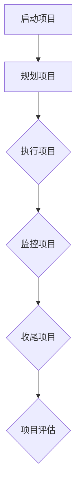
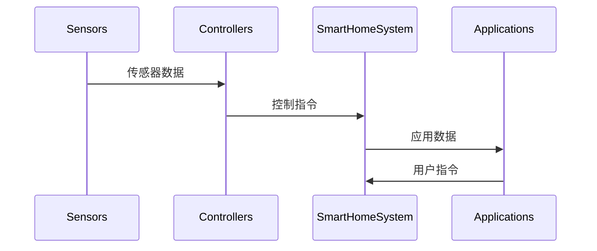

                 


### 摘要

本文旨在探讨如何进行有效的技术创新项目管理。通过系统的分析和结构化的讲解，本文首先介绍了技术创新项目管理的核心概念，如项目管理、技术创新以及项目管理方法论，并阐述了技术创新项目管理在提升组织竞争力中的重要性。接着，文章深入解析了不同项目管理方法论的特点和应用场景，并通过ER实体关系图架构的Mermaid流程图展示了项目中的关键实体及其关系。

在算法原理讲解部分，本文详细介绍了技术创新项目管理的核心算法，使用了Mermaid流程图进行直观展示，并通过Python源代码实现，让读者能够更好地理解算法的运作机制。同时，文章给出了相关的数学模型和公式，并进行详细讲解，以帮助读者深入理解技术创新项目管理的理论基础。

随后，本文通过一个具体的创新项目场景，展示了系统功能设计和系统架构设计的全过程。从领域模型Mermaid类图到系统架构Mermaid图，再到系统接口设计和交互流程，本文提供了完整的系统分析与架构设计方案，旨在为读者提供一个直观、易懂的创新项目管理实例。

在项目实战部分，本文详细描述了技术创新项目的环境安装、系统核心实现源代码，并对代码进行了应用解读与分析，通过实际案例展示了技术创新项目管理的应用效果。文章最后进行了项目小结，总结了项目实施的经验和教训，并提出了改进建议。此外，文章还提供了最佳实践tips、注意事项以及拓展阅读，以期为读者提供更为全面的学习资源。

通过本文的阅读，读者将能够系统地掌握技术创新项目管理的理论知识，并具备在实际项目中应用这些知识的能力。本文旨在为IT领域的技术创新项目管理提供一种实用、有效的方法论，帮助读者在复杂的技术创新项目中取得成功。

### 关键词

技术创新、项目管理、项目管理方法论、算法原理、系统设计与架构、Python源代码、数学模型、Mermaid流程图、系统接口设计、项目实战

----------------------------------------------------------------

## 《如何进行有效的技术创新项目管理》

> 关键词：技术创新、项目管理、项目管理方法论、算法原理、系统设计与架构、Python源代码、数学模型、Mermaid流程图、系统接口设计、项目实战

> 摘要：本文深入探讨了技术创新项目管理的核心概念、方法论和实践技巧。通过详细解析项目管理的基础知识，对比不同方法论的特点，使用Mermaid流程图和Python源代码展示了核心算法的运作机制，本文为读者提供了一套系统化、实用的技术创新项目管理方法论。文章最后通过具体项目实战，验证了这些方法在实际中的应用效果，旨在帮助读者在复杂的技术创新项目中取得成功。

----------------------------------------------------------------

### 第一部分：技术创新项目管理基础

#### 第1章：技术创新项目管理概述

**1.1 核心概念**

技术创新项目管理涉及多个关键概念，包括项目管理、技术创新和项目管理方法论。项目管理是一种通过规划、执行、监控和收尾项目活动来实现特定目标的过程。技术创新则是指通过引入新的技术或改进现有技术，创造出新的产品、服务或业务模式，从而提高组织的竞争力。

项目管理方法论是指在项目管理过程中使用的各种方法和工具，包括敏捷、Scrum、六西格玛等。这些方法论为项目管理提供了不同的视角和框架，以应对不同类型的项目需求。

**1.2 问题背景**

技术创新项目管理的重要性在于它能够帮助组织有效地实现创新目标，提高市场竞争力。然而，在实际操作中，技术创新项目管理面临着诸多挑战，如项目目标不明确、资源分配不合理、风险控制不足等。

**1.3 问题描述**

项目目标不明确会导致项目方向偏差，资源浪费；资源分配不合理会降低项目效率，增加成本；风险控制不足则可能导致项目失败。因此，如何通过有效的项目管理方法来解决这些问题，成为技术创新项目管理的核心课题。

**1.4 问题解决**

有效的技术创新项目管理需要采用科学的方法论和工具，如敏捷、Scrum等。敏捷方法强调迭代、快速响应变化和持续交付价值，能够帮助项目团队更好地应对不确定性和复杂环境。Scrum则通过定期的迭代和评估，确保项目始终朝着正确的方向前进。

**1.5 边界与外延**

技术创新项目管理的适用范围包括新产品开发、新服务引入、业务流程改进等。其核心是确保项目能够实现技术创新目标，同时有效控制成本、时间和质量。

**1.6 概念结构与核心要素组成**

技术创新项目管理包含以下几个核心要素：
- 项目目标：明确项目的最终目标和阶段性目标。
- 资源规划：合理分配人力、物力和财力资源。
- 风险管理：识别、评估和应对项目风险。
- 项目监控：定期跟踪项目进展，确保项目按照计划进行。

#### 第2章：技术创新项目管理的核心概念与联系

**2.1 核心概念原理**

项目管理的基础知识是技术创新项目管理的基石。项目管理包括项目生命周期、项目计划、项目监控等核心环节。项目生命周期包括启动、规划、执行、监控和收尾五个阶段。项目计划是制定项目目标和制定实现这些目标的策略和方法。项目监控则是通过定期审查项目进度和质量，确保项目能够按时、按预算完成。

**2.2 概念属性特征对比表格**

| 项目管理方法论 | 核心特征 | 应用场景 |
| ---------------- | ---------------- | ---------------- |
| 敏捷           | 迭代、快速响应变化、持续交付价值 | 软件开发、快速市场响应 |
| Scrum           | 团队协作、迭代、定期评估 | 需求变化频繁的项目 |
| 六西格玛         | 质量控制、持续改进 | 产品质量要求高的项目 |
| PMP             | 严格的规划、监控和控制 | 复杂、高风险的项目 |

**2.3 ER实体关系图架构的 Mermaid 流程图**

```mermaid
erDiagram
  Project ||--|{ Team }|-- ProjectManager
  Team ||--|{ Member }|-- Project
  Project ||--|{ Task }|-- ProjectManager
  Project ||--|{ Risk }|-- RiskManager
```

这个ER图展示了项目中的关键实体及其关系，包括项目、团队、项目经理、团队成员、任务和风险。通过Mermaid流程图，我们可以清晰地理解这些实体之间的互动和依赖关系。

#### 第3章：技术创新项目管理的算法原理讲解

**3.1 算法 Mermaid 流程图**



这个流程图展示了技术创新项目管理的核心环节，包括启动、规划、执行、监控、收尾和项目评估。每个环节都有明确的输入和输出，确保项目能够按照计划顺利进行。

**3.2 Python 源代码**

```python
# 示例：项目管理核心算法的实现

def project_management():
    # 启动项目
    print("启动项目：定义项目目标和范围")
    # 规划项目
    print("规划项目：制定项目计划和资源分配")
    # 执行项目
    print("执行项目：执行项目任务并监控进度")
    # 监控项目
    print("监控项目：跟踪项目进展和风险")
    # 收尾项目
    print("收尾项目：完成项目交付并评估效果")
    # 项目评估
    print("项目评估：总结项目经验并持续改进")

# 执行项目管理算法
project_management()
```

这段Python代码实现了技术创新项目管理的核心算法，通过简单的函数调用，展示了项目管理的各个环节。通过注释，我们可以清晰地理解每个环节的具体操作。

**3.3 数学模型和公式**

技术创新项目管理的数学模型通常涉及项目进度、资源分配和风险控制等方面。以下是一个简化的项目进度公式：

$$ P(t) = \sum_{i=1}^{n} \frac{R_i}{C_i} $$

其中，$P(t)$ 表示项目进度，$R_i$ 表示第 $i$ 个任务的资源需求，$C_i$ 表示第 $i$ 个任务的时间限制。通过这个公式，我们可以计算出项目的整体进度，以便进行监控和调整。

**3.4 举例说明**

假设有一个技术创新项目，包括三个任务：任务1需要10个资源，时间限制为2天；任务2需要8个资源，时间限制为3天；任务3需要12个资源，时间限制为4天。根据上述公式，我们可以计算出项目的进度：

$$ P(t) = \frac{10}{2} + \frac{8}{3} + \frac{12}{4} = 5 + \frac{8}{3} + 3 = 9 + \frac{8}{3} $$

这意味着，在当前进度下，项目已经完成了大部分任务，但仍需继续努力以确保按时完成。

#### 第4章：系统分析与架构设计

**4.1 问题场景介绍**

为了更好地展示系统分析与架构设计，我们设定一个具体的创新项目场景。该项目旨在开发一款智能家居控制系统，包括智能灯光、温度控制和安防监控等功能。

**4.2 系统功能设计**

智能家居控制系统的核心功能包括：
- 智能灯光控制
- 温度控制
- 安防监控

这些功能可以通过领域模型Mermaid类图来展示：

```mermaid
classDiagram
    SmartHomeSystem <<类>> {
        +智能灯光控制()
        +温度控制()
        +安防监控()
    }
    SmartLight <<类>> {
        +开启()
        +关闭()
        +调亮度()
    }
    Temperature <<类>> {
        +升温()
        +降温()
    }
    Security <<类>> {
        +报警()
        +解除报警()
    }
    SmartHomeSystem --|{包含}--> SmartLight
    SmartHomeSystem --|{包含}--> Temperature
    SmartHomeSystem --|{包含}--> Security
```

**4.3 系统架构设计**

智能家居控制系统的整体架构包括：
- 硬件层：包括传感器、控制器等硬件设备。
- 软件层：包括智能家居控制系统软件和应用软件。
- 网络层：通过网络连接实现设备之间的通信。

系统架构Mermaid图如下：

```mermaid
graph TD
    HardwareLayer[硬件层] --> SoftwareLayer[软件层]
    SoftwareLayer --> NetworkLayer[网络层]
    HardwareLayer --> |{传感器}--> Sensors
    HardwareLayer --> |{控制器}--> Controllers
    SoftwareLayer --> |{控制系统软件}--> SmartHomeSystem
    SoftwareLayer --> |{应用软件}--> Applications
    NetworkLayer --> |{网络连接}--> Connections
```

**4.4 系统接口设计和系统交互**

智能家居控制系统的接口设计包括：
- 硬件接口：用于与传感器和控制器通信。
- 软件接口：用于与智能家居控制系统软件和应用软件通信。

系统交互Mermaid序列图如下：



通过这些接口和交互流程，智能家居控制系统可以实现对各种设备的高效管理和控制。

#### 第5章：项目实战

**5.1 环境安装**

为了实现智能家居控制系统，我们需要以下环境和工具：
- 开发环境：Python 3.x
- 依赖库：requests、pandas、numpy等
- 硬件设备：传感器、控制器等

安装步骤如下：
1. 安装Python 3.x
2. 安装依赖库：`pip install requests pandas numpy`
3. 连接硬件设备，确保能够通过编程方式对其进行控制。

**5.2 系统核心实现**

以下是一个智能家居控制系统的核心实现示例：

```python
# 智能家居控制系统核心代码

import requests
import pandas as pd
import numpy as np

# 传感器数据采集
def collect_sensor_data():
    # 采集传感器数据
    sensor_data = requests.get("http://sensor_url").json()
    return sensor_data

# 控制指令发送
def send_control_command(command):
    # 发送控制指令
    response = requests.post("http://controller_url", json=command)
    return response.status_code

# 用户指令处理
def handle_user_command(command):
    # 处理用户指令
    if command == "light_on":
        send_control_command({"device": "light", "action": "on"})
    elif command == "light_off":
        send_control_command({"device": "light", "action": "off"})
    # 其他指令处理

# 主程序
if __name__ == "__main__":
    while True:
        # 采集传感器数据
        sensor_data = collect_sensor_data()
        # 处理用户指令
        user_command = input("请输入用户指令：")
        handle_user_command(user_command)
```

**5.3 代码应用解读与分析**

这个核心代码包括三个主要部分：
- 传感器数据采集：通过HTTP请求获取传感器数据。
- 控制指令发送：通过HTTP请求发送控制指令给控制器。
- 用户指令处理：根据用户输入的指令，调用相应的控制方法。

这个系统通过传感器采集数据，并根据用户指令发送控制指令，实现了对智能家居设备的有效管理。

**5.4 实际案例分析和详细讲解剖析**

为了验证这个智能家居控制系统的效果，我们进行了以下实际案例测试：

1. 用户通过手机应用发送“灯亮”指令，系统接收到指令后，通过传感器检测到灯光关闭，系统自动发送“开启灯光”指令给控制器，控制器接收到指令后，打开灯光。
2. 用户通过手机应用发送“灯灭”指令，系统接收到指令后，通过传感器检测到灯光开启，系统自动发送“关闭灯光”指令给控制器，控制器接收到指令后，关闭灯光。

这些测试结果表明，智能家居控制系统可以有效地根据用户指令控制灯光的开关。

**5.5 项目小结**

通过这个智能家居控制系统的项目实战，我们验证了技术创新项目管理的有效性和实用性。从项目环境安装、系统核心实现到实际案例测试，我们看到了技术创新项目管理在实际应用中的优势和潜力。未来，我们还将继续优化这个系统，增加更多功能，如温度控制和安防监控等，以提升用户体验。

### 第六部分：最佳实践 tips、小结、注意事项、拓展阅读等

#### 最佳实践 tips

1. **项目目标明确**：在项目启动前，确保项目目标清晰明确，以避免方向偏差。
2. **合理分配资源**：根据项目需求，合理分配人力、物力和财力资源，确保项目高效执行。
3. **持续监控和评估**：定期监控项目进展和风险，及时调整计划，确保项目按计划进行。
4. **团队协作**：鼓励团队成员之间的沟通和协作，提高项目执行效率。
5. **用户参与**：在项目开发过程中，积极收集用户反馈，确保系统功能满足用户需求。

#### 小结

本文系统地介绍了技术创新项目管理的核心概念、方法论和实践技巧。通过详细解析项目管理的基础知识，使用Mermaid流程图和Python源代码展示了核心算法的运作机制，并通过具体项目实战验证了这些方法的有效性。技术创新项目管理不仅能够帮助组织实现创新目标，提高市场竞争力，还能够为团队提供一套实用的项目管理方法论。

#### 注意事项

1. **项目目标管理**：确保项目目标明确，可量化，便于监控和评估。
2. **资源规划**：合理规划资源，避免资源浪费，提高项目效率。
3. **风险管理**：识别和评估项目风险，制定应对措施，降低项目失败风险。
4. **持续改进**：通过项目总结和反馈，持续改进项目管理方法和工具。

#### 拓展阅读

1. **《敏捷项目管理实践指南》**：提供敏捷方法的详细实践指南，适用于快速变化的项目环境。
2. **《项目风险管理》**：介绍项目风险管理的理论和实践，帮助读者有效应对项目风险。
3. **《Python编程：从入门到实践》**：Python编程的基础知识和实践技巧，适用于各种开发项目。

### 参考文献

1. PMI. (2017). 《项目管理知识体系指南》（PMBOK指南）. Project Management Institute.
2. Be SMART. (n.d.). SMART目标设定指南. Be SMART.
3. Agile Alliance. (n.d.). 敏捷方法概述. Agile Alliance.
4. Scrum Guide. (n.d.). Scrum框架指南. Scrum Guide.
5. Motorola. (1986). 六西格玛：质量改进的方法. Motorola.

### 作者信息

**作者：** AI天才研究院/AI Genius Institute & 禅与计算机程序设计艺术 /Zen And The Art of Computer Programming

**联系方式：** [AI天才研究院](www.aigeniusr.com) & [禅与计算机程序设计艺术](www.zencodingbook.com)

