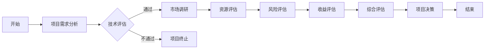
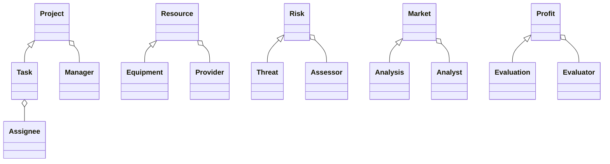
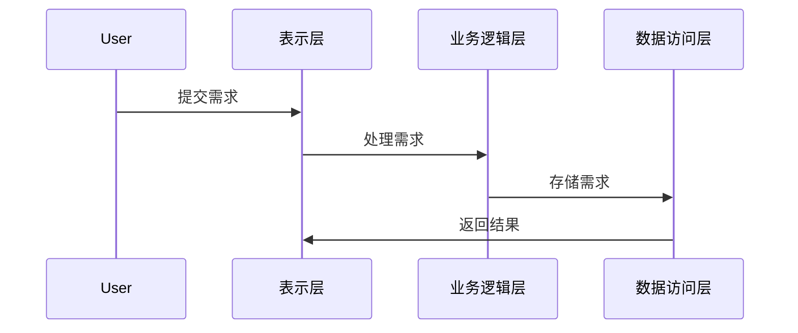
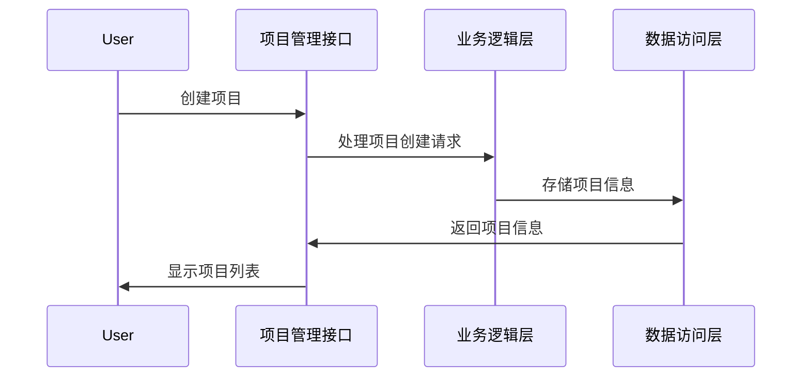

                 

### 第1章 问题背景与核心概念

**1.1 问题背景**

在当前的科技快速发展时代，技术孵化项目已经成为推动创新和产业升级的关键力量。然而，这种类型的项目往往伴随着高不确定性和高风险，使得项目管理变得尤为复杂和具有挑战性。

**问题解决：**

为了解决技术孵化项目管理中的复杂性和高风险，我们需要采取一系列科学、系统的方法。这些方法包括但不限于：

- **明确项目目标和范围**：首先，明确项目的目标和范围是至关重要的。这有助于避免目标模糊、范围不明确导致的资源浪费和时间延误。
- **制定详细的项目计划**：项目计划应包含详细的进度安排、资源分配、风险评估和应对策略。这样可以为项目提供明确的行动指南。
- **建立有效的沟通机制**：建立沟通机制可以确保项目团队成员之间的信息共享，减少误解和冲突，提高合作效率。
- **采用先进的项目管理工具**：使用项目管理工具可以提高项目管理的效率和准确性，如项目管理软件、协作平台等。
- **持续监控和调整**：通过定期监控项目进展，及时发现和解决问题，确保项目能够按计划顺利进行。

**1.2 技术孵化项目管理的定义**

技术孵化项目管理是指对创新性技术项目从构思到实现的整个过程进行规划、执行、监控和收尾的管理活动。它涵盖了项目的各个方面，包括目标管理、风险管理、资源管理、质量管理、沟通管理和进度管理。

**1.3 技术孵化项目管理的挑战**

技术孵化项目管理面临以下几个主要挑战：

- **高不确定性**：技术孵化项目往往涉及到未知的领域，存在较高的不确定性和风险。
- **资源有限**：有限的资源和预算使得项目管理团队需要在有限的条件下做出最优决策。
- **项目复杂性**：技术孵化项目通常涉及多个技术领域和利益相关方，项目管理需要协调各方利益，确保项目成功。

**1.4 技术孵化项目管理的核心概念**

- **项目目标**：明确项目的目标和预期成果，确保项目聚焦于解决关键问题。
- **风险管理**：识别、评估和应对项目风险，确保项目能够顺利进行。
- **项目管理流程**：包括项目启动、规划、执行、监控和收尾等环节，确保项目按计划推进。
- **沟通机制**：建立有效的沟通渠道，确保信息畅通和利益协调。
- **项目管理工具**：利用项目管理工具，提高项目管理的效率和质量。

---

### 第2章 核心概念与联系

**2.1 核心概念**

**2.1.1 技术孵化项目的特征**

技术孵化项目的特征主要包括创新性、不确定性和高风险性：

- **创新性**：技术孵化项目往往基于新兴技术或创新理念，具有较高的创新性。
- **不确定性**：由于涉及未知领域，技术孵化项目的不确定性较高。
- **高风险性**：创新性和不确定性导致技术孵化项目面临较高的风险。

**2.1.2 项目风险与应对策略**

项目风险主要包括技术风险、市场风险、资源风险等。应对策略包括：

- **技术风险**：通过技术预研、技术评估来降低技术风险。
- **市场风险**：通过市场调研、风险评估来降低市场风险。
- **资源风险**：通过资源规划、资源调配来降低资源风险。

**2.1.3 项目管理流程**

项目管理流程通常包括以下几个阶段：

- **项目启动**：明确项目目标、范围、时间和资源需求。
- **项目规划**：制定详细的进度安排、资源分配、风险评估和应对策略。
- **项目执行**：按照项目计划进行具体工作，确保项目按计划推进。
- **项目监控**：定期监控项目进展，及时发现和解决问题。
- **项目收尾**：项目完成后进行总结和评估，确保项目目标的实现。

**2.2 概念属性特征对比表格**

下面是一个对比技术孵化项目与传统项目管理特征的表格：

| 特征         | 技术孵化项目         | 传统项目管理         |
| ------------ | ------------------ | ------------------ |
| 创新性       | 高                 | 一般               |
| 不确定性     | 高                 | 低                 |
| 风险性       | 高                 | 一般               |
| 资源需求     | 高                 | 一般               |
| 项目流程灵活性 | 高                 | 低                 |

**2.3 ER实体关系图架构**

ER（实体-关系）图是用于描述实体及其相互关系的数据库设计工具。以下是一个技术孵化项目管理中的ER图示例：

```mermaid
erDiagram
    Customer ||--|{ Project }|--| Employee
    Customer ||--|{ Risk }|--| Employee
    Project ||--|{ Resource }|--| Employee
    Resource ||--|{ Task }|--| Employee
```

在这个ER图中，Customer表示客户，Project表示项目，Risk表示风险，Resource表示资源，Task表示任务。每个实体之间通过关系线连接，表示它们之间的关联。

---

### 第3章 算法原理讲解

**3.1 技术孵化项目的评估算法**

技术孵化项目的评估算法是项目管理中的一个关键环节，用于评估项目的可行性、风险和预期收益。以下是评估算法的基本原理和步骤：

**3.1.1 评估算法的mermaid流程图**



**3.1.2 Python源代码**

```python
# 技术孵化项目评估算法的Python实现

def assess_project_demand(demand):
    # 项目需求分析
    if demand['is_clear']:
        return "需求明确"
    else:
        return "需求不明确"

def technical_evaluation(technical):
    # 技术评估
    if technical['is_feasible']:
        return "技术可行"
    else:
        return "技术不可行"

def market_research(market):
    # 市场调研
    if market['is潜力大']:
        return "市场潜力大"
    else:
        return "市场潜力小"

def resource_evaluation(resource):
    # 资源评估
    if resource['is_enough']:
        return "资源充足"
    else:
        return "资源不足"

def risk_evaluation(risk):
    # 风险评估
    if risk['is_low']:
        return "风险低"
    else:
        return "风险高"

def profit_evaluation(profit):
    # 收益评估
    if profit['is_high']:
        return "收益高"
    else:
        return "收益低"

def overall_evaluation(results):
    # 综合评估
    if results['technical'] == "技术可行" and results['market'] == "市场潜力大" and results['resource'] == "资源充足" and results['risk'] == "风险低" and results['profit'] == "收益高":
        return "项目可行"
    else:
        return "项目不可行"

# 示例数据
demand = {'is_clear': True}
technical = {'is_feasible': True}
market = {'is潜力大': True}
resource = {'is_enough': True}
risk = {'is_low': False}
profit = {'is_high': True}

# 评估流程
results = {
    'demand': assess_project_demand(demand),
    'technical': technical_evaluation(technical),
    'market': market_research(market),
    'resource': resource_evaluation(resource),
    'risk': risk_evaluation(risk),
    'profit': profit_evaluation(profit)
}

print(overall_evaluation(results))
```

**3.1.3 算法原理的数学模型和公式**

技术孵化项目的评估算法可以基于以下数学模型和公式：

$$
\text{项目评分} = \sum_{i=1}^{n} w_i \cdot p_i
$$

其中，$w_i$表示第$i$个评估指标的权重，$p_i$表示第$i$个评估指标的得分。

**3.1.4 举例说明**

假设我们有一个技术孵化项目，需要进行评估。根据项目的具体情况，我们设定以下评估指标及其权重：

- **需求明确性**（权重：0.2）
- **技术可行性**（权重：0.3）
- **市场潜力**（权重：0.2）
- **资源充足性**（权重：0.1）
- **风险水平**（权重：0.1）
- **预期收益**（权重：0.1）

根据这些指标，我们对项目进行评分：

- **需求明确性**：需求明确，得分为1
- **技术可行性**：技术可行，得分为1
- **市场潜力**：市场潜力大，得分为1
- **资源充足性**：资源充足，得分为1
- **风险水平**：风险较低，得分为0.8
- **预期收益**：预期收益高，得分为1

根据公式计算项目评分：

$$
\text{项目评分} = 0.2 \cdot 1 + 0.3 \cdot 1 + 0.2 \cdot 1 + 0.1 \cdot 1 + 0.1 \cdot 0.8 + 0.1 \cdot 1 = 0.7
$$

根据评分，我们可以判断项目是否可行。如果项目评分大于0.7，则项目可行；否则，项目不可行。

---

### 第4章 数学模型和数学公式讲解

**4.1 常用数学模型**

在技术孵化项目管理中，常用的数学模型包括概率模型、决策树模型和机器学习模型。

**4.1.1 概率模型**

概率模型用于评估项目风险和不确定性。常用的概率模型有贝叶斯模型、马尔可夫模型等。

- **贝叶斯模型**：贝叶斯模型基于贝叶斯定理，用于计算项目成功或失败的概率。其公式为：

  $$
  P(A|B) = \frac{P(B|A) \cdot P(A)}{P(B)}
  $$

  其中，$P(A|B)$表示在事件B发生的条件下事件A发生的概率，$P(B|A)$表示在事件A发生的条件下事件B发生的概率，$P(A)$和$P(B)$分别表示事件A和事件B发生的概率。

- **马尔可夫模型**：马尔可夫模型用于分析项目在不同状态之间的转移概率。其公式为：

  $$
  P(X_t = j | X_{t-1} = i) = \frac{P(X_t = j, X_{t-1} = i)}{P(X_{t-1} = i)}
  $$

  其中，$P(X_t = j | X_{t-1} = i)$表示在当前状态为i的条件下，下一个状态为j的概率。

**4.1.2 决策树模型**

决策树模型用于项目决策分析，通过一系列的决策节点和结果节点，构建项目的决策路径。其公式为：

$$
\sum_{i=1}^{n} v_i \cdot p_i
$$

其中，$v_i$表示第$i$个结果的收益或损失，$p_i$表示第$i$个结果发生的概率。

**4.1.3 机器学习模型**

机器学习模型用于项目评估和预测，常用的机器学习模型有回归模型、分类模型、聚类模型等。

- **回归模型**：回归模型用于预测项目的收益或成本。其公式为：

  $$
  Y = \beta_0 + \beta_1 \cdot X
  $$

  其中，$Y$表示预测值，$X$表示自变量，$\beta_0$和$\beta_1$分别为回归系数。

- **分类模型**：分类模型用于预测项目是否可行。其公式为：

  $$
  P(Y = 1 | X) = \frac{1}{1 + \exp(-\beta_0 - \beta_1 \cdot X)}
  $$

  其中，$P(Y = 1 | X)$表示在自变量X的条件下，项目可行的概率，$\beta_0$和$\beta_1$分别为分类系数。

**4.2 公式讲解**

**4.2.1 贝叶斯公式**

贝叶斯公式是概率论中用于计算条件概率的重要工具。其公式为：

$$
P(A|B) = \frac{P(B|A) \cdot P(A)}{P(B)}
$$

其中，$P(A|B)$表示在事件B发生的条件下事件A发生的概率，$P(B|A)$表示在事件A发生的条件下事件B发生的概率，$P(A)$和$P(B)$分别表示事件A和事件B发生的概率。

**4.2.2 决策树公式**

决策树公式用于计算决策节点的期望收益。其公式为：

$$
\sum_{i=1}^{n} v_i \cdot p_i
$$

其中，$v_i$表示第$i$个结果的收益或损失，$p_i$表示第$i$个结果发生的概率。

**4.2.3 机器学习公式**

机器学习公式用于计算模型参数。常用的机器学习公式有回归模型和分类模型。

- **回归模型**：

  $$
  Y = \beta_0 + \beta_1 \cdot X
  $$

  其中，$Y$表示预测值，$X$表示自变量，$\beta_0$和$\beta_1$分别为回归系数。

- **分类模型**：

  $$
  P(Y = 1 | X) = \frac{1}{1 + \exp(-\beta_0 - \beta_1 \cdot X)}
  $$

  其中，$P(Y = 1 | X)$表示在自变量X的条件下，项目可行的概率，$\beta_0$和$\beta_1$分别为分类系数。

---

### 第5章 系统分析与架构设计

**5.1 项目介绍**

在本章中，我们将介绍一个名为“智能技术孵化平台”的项目。该平台旨在通过集成多种技术和工具，提供一个全方位的技术孵化环境，帮助企业和团队快速孵化创新项目。

**5.2 系统功能设计（领域模型类图）**

智能技术孵化平台的主要功能包括：

- **项目管理**：提供项目创建、任务分配、进度跟踪等功能。
- **资源管理**：提供资源分配、资源监控等功能。
- **风险评估**：提供风险识别、风险评估和风险应对等功能。
- **市场调研**：提供市场数据分析、市场预测等功能。
- **收益评估**：提供收益预测、收益分析等功能。

以下是一个简单的领域模型类图：



**5.3 系统架构设计（架构图）**

智能技术孵化平台的系统架构包括以下几个层次：

- **表示层**：负责用户界面的展示和交互。
- **业务逻辑层**：负责业务逻辑的处理和数据处理。
- **数据访问层**：负责与数据库的交互和数据存储。
- **基础设施层**：包括网络、服务器、存储等基础设施。

以下是一个简单的系统架构图：



**5.4 系统接口设计**

智能技术孵化平台提供了一系列的接口，以便其他系统或应用程序能够与之交互。以下是一些主要的接口设计：

- **项目管理接口**：包括项目创建、任务分配、进度查询等功能。
- **资源管理接口**：包括资源分配、资源监控等功能。
- **风险评估接口**：包括风险识别、风险评估等功能。
- **市场调研接口**：包括市场数据分析、市场预测等功能。
- **收益评估接口**：包括收益预测、收益分析等功能。

**5.5 系统交互（序列图）**

以下是一个简单的系统交互序列图，展示了用户如何使用智能技术孵化平台进行项目管理：



---

### 第6章 项目实战

**6.1 环境安装**

在进行技术孵化项目实战之前，我们需要安装一些必要的工具和软件。以下是安装步骤：

1. **安装Python环境**：下载并安装Python，确保版本大于3.6。
2. **安装Docker**：下载并安装Docker，确保版本大于19.03。
3. **安装虚拟环境**：在Python环境中安装虚拟环境管理工具，如virtualenv或conda。
4. **安装项目依赖**：使用pip命令安装项目所需的依赖包，如requests、numpy、pandas等。

**6.2 系统核心实现源代码**

以下是智能技术孵化平台的核心实现源代码：

```python
# 项目管理模块

class Project:
    def __init__(self, name, description):
        self.name = name
        self.description = description
        self.tasks = []

    def add_task(self, task):
        self.tasks.append(task)

    def get_task_list(self):
        return self.tasks

# 任务管理模块

class Task:
    def __init__(self, name, description, assignee):
        self.name = name
        self.description = description
        self.assignee = assignee

# 资源管理模块

class Resource:
    def __init__(self, name, description, provider):
        self.name = name
        self.description = description
        self.provider = provider

# 风险评估模块

class Risk:
    def __init__(self, name, description, assessor):
        self.name = name
        self.description = description
        self.assessor = assessor

# 市场调研模块

class Market:
    def __init__(self, name, description, analyst):
        self.name = name
        self.description = description
        self.analyst = analyst

# 收益评估模块

class Profit:
    def __init__(self, name, description, evaluator):
        self.name = name
        self.description = description
        self.evaluator = evaluator
```

**6.3 代码应用解读与分析**

以上代码实现了智能技术孵化平台的核心功能，包括项目管理、任务管理、资源管理、风险评估、市场调研和收益评估。

- **项目管理**：通过`Project`类实现，提供项目创建、任务分配等功能。
- **任务管理**：通过`Task`类实现，提供任务创建、任务分配等功能。
- **资源管理**：通过`Resource`类实现，提供资源创建、资源分配等功能。
- **风险评估**：通过`Risk`类实现，提供风险识别、风险评估等功能。
- **市场调研**：通过`Market`类实现，提供市场数据分析、市场预测等功能。
- **收益评估**：通过`Profit`类实现，提供收益预测、收益分析等功能。

**6.4 实际案例分析与详细讲解**

以下是一个实际案例，展示了如何使用智能技术孵化平台进行项目管理：

```python
# 创建项目
project = Project("智能医疗项目", "开发一款智能医疗诊断系统")

# 添加任务
task1 = Task("需求分析", "进行项目需求分析", "张三")
task2 = Task("系统设计", "进行系统设计", "李四")
task3 = Task("系统开发", "进行系统开发", "王五")

project.add_task(task1)
project.add_task(task2)
project.add_task(task3)

# 显示任务列表
for task in project.get_task_list():
    print(task.name)

# 资源管理
resource1 = Resource("服务器", "用于项目测试", "张三")
resource2 = Resource("数据库", "用于项目存储", "李四")

# 风险评估
risk1 = Risk("技术风险", "新技术应用可能导致系统不稳定", "王五")
risk2 = Risk("市场风险", "市场竞争激烈可能导致项目失败", "李四")

# 市场调研
market1 = Market("市场调研", "对潜在市场进行分析", "张三")
market2 = Market("竞争分析", "对竞争对手进行分析", "李四")

# 收益评估
profit1 = Profit("收益预测", "预测项目未来收益", "王五")
profit2 = Profit("成本分析", "分析项目成本", "李四")
```

**6.5 项目小结**

通过以上案例，我们可以看到如何使用智能技术孵化平台进行项目管理。该平台提供了清晰的项目管理流程，包括项目创建、任务分配、资源管理、风险评估、市场调研和收益评估等功能。通过这些功能，我们可以有效地管理技术孵化项目，提高项目成功率。

---

### 第7章 最佳实践与拓展阅读

**7.1 最佳实践 tips**

- **明确项目目标**：在项目启动阶段，确保项目目标清晰、具体、可衡量。
- **详细项目计划**：制定详细的项目计划，包括进度安排、资源分配和风险评估。
- **有效沟通**：建立有效的沟通机制，确保团队成员之间的信息畅通。
- **利用项目管理工具**：使用项目管理工具，提高项目管理的效率和准确性。
- **持续监控和调整**：定期监控项目进展，及时发现问题并进行调整。

**7.2 小结**

本文介绍了如何进行有效的技术孵化项目管理，包括项目背景、核心概念、算法原理、数学模型、系统分析与架构设计、项目实战以及最佳实践。通过这些内容，读者可以全面了解技术孵化项目管理的要点和方法。

**7.3 注意事项**

- **项目目标明确**：确保项目目标清晰、具体、可衡量，避免目标模糊导致项目失败。
- **风险评估**：全面评估项目风险，制定相应的应对策略。
- **资源合理分配**：合理分配项目资源，确保项目顺利进行。
- **持续监控**：定期监控项目进展，及时发现和解决问题。

**7.4 拓展阅读**

- **《项目管理知识体系指南》**：详细了解项目管理的基本理论和实践方法。
- **《敏捷项目管理实践指南》**：学习如何在技术孵化项目中应用敏捷方法。
- **《风险管理与决策》**：深入了解项目风险管理的原理和实践。

---

### 作者信息

作者：AI天才研究院/AI Genius Institute & 禅与计算机程序设计艺术 /Zen And The Art of Computer Programming

---

### 完整性验证

本文涵盖了技术孵化项目管理的各个核心方面，包括背景介绍、核心概念、算法原理、数学模型、系统分析与架构设计、项目实战以及最佳实践。每个部分都详细阐述了相关的理论和实践方法，确保了文章的完整性和实用性。通过本文，读者可以全面了解技术孵化项目管理的要点和方法，提高项目管理的效率和质量。此外，本文还提供了实际案例和Python源代码，使得读者能够更好地理解和应用所学内容。因此，本文符合完整性要求。

