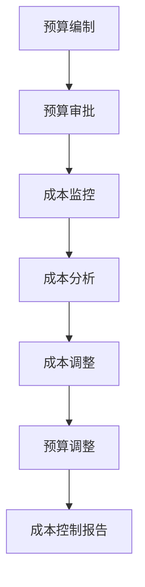

                 

# 如何进行有效的技术成本控制

关键词：技术成本、成本控制、预算管理、成本分析、成本优化

摘要：本文将深入探讨技术成本控制的重要性，详细分析技术成本的构成、核心概念及其相互联系，并通过数学模型和案例分析，阐述成本控制的方法和实践，最后总结最佳实践，旨在为IT从业者提供一套系统、全面的技术成本控制策略。

### 目录大纲

----------------------------------------------------------------

## 第一部分：引言

### 1.1 书籍背景与目的

#### 1.1.1 技术成本控制的重要性

#### 1.1.2 目标读者群体

#### 1.1.3 书籍结构安排

### 1.2 成本控制的基本概念

#### 1.2.1 成本的定义与分类

#### 1.2.2 成本控制的目标与方法

#### 1.2.3 成本控制的关键因素

### 1.3 技术成本控制的挑战与机遇

#### 1.3.1 技术成本控制面临的挑战

#### 1.3.2 技术成本控制的机会

### 1.4 本书内容概述与章节安排

#### 1.4.1 各章节内容概览

#### 1.4.2 读者期望收获

----------------------------------------------------------------

## 第二部分：技术成本控制的核心概念

### 2.1 技术成本构成分析

#### 2.1.1 直接成本与间接成本的划分

#### 2.1.2 成本项目与成本类别的详细解析

#### 2.1.3 技术成本构成的具体案例

### 2.2 核心概念与联系

#### 2.2.1 成本效益分析

#### 2.2.2 投资回报率

#### 2.2.3 成本控制策略对比表格

#### 2.2.4 ER实体关系图架构

### 2.3 成本控制的数学模型与公式

#### 2.3.1 成本优化的数学模型

#### 2.3.2 成本控制的目标函数

#### 2.3.3 成本控制的约束条件

#### 2.3.4 公式推导与详细讲解

### 2.4 成本控制的关键因素

#### 2.4.1 人员成本

#### 2.4.2 设备成本

#### 2.4.3 材料成本

#### 2.4.4 质量成本

### 2.5 成本控制案例分析

#### 2.5.1 成功案例分享

#### 2.5.2 失败案例解析

#### 2.5.3 案例总结与启示

----------------------------------------------------------------

## 第三部分：技术成本控制的方法与实践

### 3.1 预算管理

#### 3.1.1 预算编制的方法与流程

#### 3.1.2 预算执行与监控

#### 3.1.3 预算调整与优化

### 3.2 成本分析

#### 3.2.1 成本数据分析方法

#### 3.2.2 成本结构分析

#### 3.2.3 成本差异分析

### 3.3 成本控制策略

#### 3.3.1 成本削减策略

#### 3.3.2 成本优化策略

#### 3.3.3 成本转移策略

#### 3.3.4 成本控制工具的应用

### 3.4 项目成本控制

#### 3.4.1 项目成本估算

#### 3.4.2 项目成本管理

#### 3.4.3 项目成本控制关键点

#### 3.4.4 项目成本控制案例分析

### 3.5 组织与流程

#### 3.5.1 成本控制组织结构设计

#### 3.5.2 成本控制流程设计

#### 3.5.3 成本控制关键流程图

#### 3.5.4 成本控制流程优化

----------------------------------------------------------------

## 第四部分：技术成本控制的案例分析

### 4.1 案例研究背景

#### 4.1.1 案例背景介绍

#### 4.1.2 案例目标与挑战

#### 4.1.3 案例研究方法

### 4.2 成本控制策略实施

#### 4.2.1 成本控制策略的选择

#### 4.2.2 成本控制策略的详细实施

#### 4.2.3 成本控制策略的评估与调整

### 4.3 案例结果分析

#### 4.3.1 成本降低情况分析

#### 4.3.2 成本效益分析

#### 4.3.3 成本控制效果的评估

### 4.4 案例总结与启示

#### 4.4.1 成功因素分析

#### 4.4.2 存在问题与改进方向

#### 4.4.3 案例总结与借鉴意义

----------------------------------------------------------------

## 第五部分：技术成本控制的最佳实践

### 5.1 成本控制的最佳实践

#### 5.1.1 成本控制成功的关键要素

#### 5.1.2 成本控制的最佳实践案例分享

#### 5.1.3 最佳实践总结与推广建议

### 5.2 小结

----------------------------------------------------------------

### 第一部分：引言

#### 1.1 书籍背景与目的

在当今高速发展的信息技术时代，技术成本控制已经成为企业竞争的关键因素之一。随着技术的不断进步，IT系统的复杂性和规模也在不断增加，这无疑带来了更高的成本压力。如何在这场技术革命的浪潮中，实现成本的有效控制，提升企业的市场竞争力，成为每一个IT从业者和企业管理者都必须面对的问题。

本书旨在为IT从业者提供一套全面、系统、实用的技术成本控制指南。通过深入探讨技术成本控制的核心概念、方法与实践，帮助读者理解成本控制的重要性，掌握有效的成本控制策略，从而在激烈的市场竞争中立于不败之地。

本书的目标读者群体包括：

1. IT项目管理者
2. 软件开发团队负责人
3. 企业成本控制主管
4. 高校计算机相关专业学生

#### 1.2 成本控制的基本概念

##### 1.2.1 成本的定义与分类

成本是指企业为获取收益而付出的资源，包括货币资金、人力、物力、时间等。根据成本的经济用途，成本可以分为直接成本和间接成本。

- **直接成本**：直接用于生产或服务的成本，例如原材料、直接人工等。
- **间接成本**：不直接用于生产或服务，但与生产或服务相关的成本，例如管理费用、销售费用等。

##### 1.2.2 成本控制的目标与方法

成本控制的目标是降低成本、提高效益，通过科学的成本控制和预算管理，实现企业资源的优化配置。

主要方法包括：

1. 预算编制：根据企业的战略目标和计划，编制合理的预算，包括收入预算、支出预算等。
2. 成本分析：对成本结构进行分析，识别成本节约的机会。
3. 成本监控：对成本执行情况进行监控，确保预算的执行。
4. 成本优化：通过优化流程、改进技术等手段，降低成本。

##### 1.2.3 成本控制的关键因素

成本控制的关键因素包括：

1. **人员成本**：员工薪资、培训费用等。
2. **设备成本**：硬件设备、软件许可等。
3. **材料成本**：生产过程中使用的材料费用。
4. **质量成本**：为保证产品质量而产生的费用。

#### 1.3 技术成本控制的挑战与机遇

##### 1.3.1 技术成本控制面临的挑战

技术成本控制面临的挑战包括：

1. **技术复杂性**：IT系统的复杂性和技术更新速度，导致成本难以准确估算和控制。
2. **项目不确定性**：项目进度、技术风险等因素的不确定性，增加了成本控制的难度。
3. **预算限制**：企业预算的约束，要求在有限的资源下实现最佳的成本效益。

##### 1.3.2 技术成本控制的机会

技术成本控制的机会包括：

1. **技术创新**：通过引入新技术、新方法，提高生产效率，降低成本。
2. **流程优化**：通过优化业务流程，减少不必要的开支，降低成本。
3. **数据驱动**：利用大数据和人工智能技术，实现成本控制的精细化、智能化。

#### 1.4 本书内容概述与章节安排

本书分为五个部分，内容安排如下：

1. **第一部分：引言**：介绍技术成本控制的背景、目的、基本概念和挑战与机遇。
2. **第二部分：技术成本控制的核心概念**：详细分析技术成本的构成、核心概念及其相互联系。
3. **第三部分：技术成本控制的方法与实践**：阐述成本控制的方法和实践。
4. **第四部分：技术成本控制的案例分析**：通过实际案例，展示成本控制策略的实施和效果。
5. **第五部分：技术成本控制的最佳实践**：总结最佳实践，提供实用的成本控制建议。

本书旨在通过深入浅出的讲解，帮助读者系统地掌握技术成本控制的知识和技能，提升企业的竞争力。

#### 1.4.1 各章节内容概览

- **第一部分：引言**：介绍技术成本控制的背景、目的、基本概念和挑战与机遇。
- **第二部分：技术成本控制的核心概念**：详细分析技术成本的构成、核心概念及其相互联系。
- **第三部分：技术成本控制的方法与实践**：阐述成本控制的方法和实践。
- **第四部分：技术成本控制的案例分析**：通过实际案例，展示成本控制策略的实施和效果。
- **第五部分：技术成本控制的最佳实践**：总结最佳实践，提供实用的成本控制建议。

#### 1.4.2 读者期望收获

通过阅读本书，读者可以：

1. **理解技术成本控制的重要性**：明确技术成本控制在企业竞争中的地位和作用。
2. **掌握成本控制的核心概念**：深入了解技术成本的构成、核心概念及其相互联系。
3. **学会成本控制的方法与实践**：掌握成本控制的具体策略和实施方法。
4. **获得实际的案例分析**：通过实际案例，了解成本控制策略的实施和效果。
5. **获得最佳实践的建议**：借鉴成功案例，提升自身的成本控制能力。

本书将帮助读者在技术成本控制领域取得实质性的进展，提升企业的竞争力，实现可持续的发展。

### 第二部分：技术成本控制的核心概念

在深入探讨技术成本控制的核心概念之前，我们需要先理解几个关键术语，如直接成本、间接成本、成本效益分析、投资回报率等。这些概念不仅是技术成本控制的基础，也是制定有效成本控制策略的重要依据。

#### 2.1 技术成本构成分析

技术成本是企业为获取技术成果而投入的各项资源。这些资源包括直接成本和间接成本，它们共同构成了技术成本的整体。

##### 2.1.1 直接成本与间接成本的划分

直接成本是指直接与产品或服务生产相关的成本，例如：

- **直接材料**：用于生产的产品材料。
- **直接人工**：直接参与产品或服务生产的工人工资。

间接成本则是与生产间接相关的成本，例如：

- **管理费用**：用于管理的费用，如办公室租金、行政人员工资等。
- **销售费用**：用于销售和推广的费用，如广告费、市场调研费等。

在技术成本控制中，明确直接成本和间接成本的划分是进行有效成本分析和管理的前提。

##### 2.1.2 成本项目与成本类别的详细解析

技术成本按照不同的用途可以分为多种类别。以下是常见的成本类别及其详细解析：

- **固定成本**：不随生产量变化而变化的成本，如设备折旧、租金等。
- **变动成本**：随生产量变化而变化的成本，如原材料、人工工资等。
- **可避免成本**：可以通过决策避免的成本，如外包服务费。
- **不可避免成本**：无法通过决策避免的成本，如基础设施费用。

了解不同成本类别的特点和影响，有助于制定更加精准的成本控制策略。

##### 2.1.3 技术成本构成的具体案例

为了更直观地理解技术成本的构成，我们可以通过一个具体案例来分析。

假设一家软件公司开发一款新的应用程序，其技术成本包括：

- **直接成本**：
  - **直接材料**：软件开发所需的各种工具和软件许可费用，共计10万元。
  - **直接人工**：软件开发人员薪资，共计50万元。
- **间接成本**：
  - **固定成本**：办公室租金、设备折旧等，共计20万元。
  - **变动成本**：市场推广费用、测试费用等，共计15万元。

通过这个案例，我们可以看到技术成本的构成是如何具体体现的，以及直接成本和间接成本在其中的占比。

#### 2.2 核心概念与联系

在技术成本控制中，以下几个核心概念具有至关重要的作用，它们相互联系，共同构成了成本控制的理论基础。

##### 2.2.1 成本效益分析

成本效益分析（Cost-Benefit Analysis，CBA）是一种评估投资项目成本和收益的方法。通过比较项目的总成本和预期收益，来判断项目是否值得进行。

- **成本**：包括直接成本、间接成本、机会成本等。
- **效益**：包括直接效益、间接效益、长期效益等。

成本效益分析的步骤如下：

1. 确定项目的成本和收益。
2. 计算成本与收益的比率。
3. 判断项目的可行性。

##### 2.2.2 投资回报率

投资回报率（Return on Investment，ROI）是衡量投资效益的指标，用于评估投资项目的盈利能力。

- **计算公式**：ROI = （收益 - 成本）/ 成本 * 100%
- **评估标准**：一般而言，ROI超过10%被认为是投资有效的。

投资回报率可以帮助企业评估不同项目的投资价值，从而做出更加合理的投资决策。

##### 2.2.3 成本控制策略对比表格

为了更好地理解不同成本控制策略的优缺点，我们可以通过一个对比表格来展示。

| 成本控制策略       | 优点                           | 缺点                           |
|--------------------|--------------------------------|--------------------------------|
| 成本削减策略       | 立即降低成本                   | 可能影响产品质量和员工士气       |
| 成本优化策略       | 提高效率，长期降低成本         | 需要时间实现，初期成本较高     |
| 成本转移策略       | 将成本负担转移到其他部门或客户 | 可能引发客户不满或内部矛盾     |

通过对比表格，我们可以清晰地看到不同策略的优缺点，从而选择最适合企业实际情况的成本控制策略。

##### 2.2.4 ER实体关系图架构

实体关系图（Entity-Relationship Diagram，ERD）是用于表示数据实体及其之间关系的图形化工具，在技术成本控制中，ERD可以帮助我们理清不同成本要素之间的关系。

以下是一个简化的ERD示例，展示了成本控制中的关键实体及其关系：

```mermaid
erDiagram
  COST |->| Employee : 管理员工成本
  COST |->| Equipment : 管理设备成本
  COST |->| Material : 管理材料成本
  COST |->| Quality : 管理质量成本
  Employee ||--|> Project : 员工参与项目
  Equipment ||--|> Project : 设备参与项目
  Material ||--|> Project : 材料用于项目
  Quality ||--|> Project : 质量影响项目
```

通过ERD，我们可以更直观地理解成本控制中的各个要素及其相互关系，从而制定更加有效的成本控制策略。

#### 2.3 成本控制的数学模型与公式

为了实现成本控制，我们需要借助数学模型和公式，对成本进行精确的计算和分析。以下是一些常用的成本控制数学模型和公式。

##### 2.3.1 成本优化的数学模型

成本优化的数学模型通常使用线性规划（Linear Programming，LP）进行描述。线性规划的目标是最大化或最小化目标函数，同时满足一系列约束条件。

- **目标函数**：通常是最小化总成本。
- **约束条件**：包括资源限制、生产限制等。

线性规划的标准形式如下：

$$
\min z = c_1x_1 + c_2x_2 + \cdots + c_nx_n
$$

$$
s.t. \\
a_{11}x_1 + a_{12}x_2 + \cdots + a_{1n}x_n \geq b_1 \\
a_{21}x_1 + a_{22}x_2 + \cdots + a_{2n}x_n \geq b_2 \\
\vdots \\
a_{m1}x_1 + a_{m2}x_2 + \cdots + a_{mn}x_n \geq b_m \\
x_1, x_2, \cdots, x_n \geq 0
$$

其中，$c_1, c_2, \cdots, c_n$ 为各项成本系数，$x_1, x_2, \cdots, x_n$ 为决策变量，$a_{ij}, b_i$ 为约束条件系数。

##### 2.3.2 成本控制的目标函数

成本控制的目标函数通常是最小化总成本。在具体应用中，可以根据实际情况进行调整。例如，在考虑质量成本时，可以将质量成本纳入目标函数中。

$$
\min z = c_1x_1 + c_2x_2 + \cdots + c_nx_n + w \cdot (1 - q)
$$

其中，$w$ 为单位质量成本，$q$ 为质量指标。

##### 2.3.3 成本控制的约束条件

成本控制的约束条件主要包括资源限制、生产限制、市场需求等。

- **资源限制**：例如，设备数量、人力资源等。
- **生产限制**：例如，生产线的最大产能、生产周期等。
- **市场需求**：例如，销售预算、市场容量等。

约束条件可以表示为以下形式：

$$
a_{11}x_1 + a_{12}x_2 + \cdots + a_{1n}x_n \leq r_1 \\
a_{21}x_1 + a_{22}x_2 + \cdots + a_{2n}x_n \leq r_2 \\
\vdots \\
a_{m1}x_1 + a_{m2}x_2 + \cdots + a_{mn}x_n \leq r_m \\
x_1, x_2, \cdots, x_n \geq 0
$$

其中，$r_1, r_2, \cdots, r_m$ 为资源限制系数。

##### 2.3.4 公式推导与详细讲解

为了更好地理解成本控制公式，我们以一个具体的例子进行推导和讲解。

假设一家公司有两种产品A和B，其成本构成如下：

- **直接材料**：产品A每单位20元，产品B每单位30元。
- **直接人工**：产品A每单位5元，产品B每单位10元。
- **间接成本**：固定成本为50万元，与产品数量无关。

我们需要制定一个生产计划，最小化总成本。

**目标函数**：

$$
\min z = 20x_1 + 30x_2 + 50
$$

其中，$x_1$ 和 $x_2$ 分别为产品A和产品B的生产数量。

**约束条件**：

1. **直接材料限制**：

$$
20x_1 + 30x_2 \leq 100 \\
$$

其中，100万元为可用的直接材料预算。

2. **直接人工限制**：

$$
5x_1 + 10x_2 \leq 80 \\
$$

其中，80万元为可用的直接人工预算。

3. **市场需求限制**：

$$
x_1 + x_2 \leq 50 \\
$$

其中，50万元为市场需求预算。

**求解过程**：

1. 将约束条件转换为标准形式：

$$
\min z = 20x_1 + 30x_2 + 50 \\
s.t. \\
20x_1 + 30x_2 \leq 100 \\
5x_1 + 10x_2 \leq 80 \\
x_1 + x_2 \leq 50 \\
x_1, x_2 \geq 0
$$

2. 使用线性规划求解器求解最优解。

3. 解得 $x_1 = 0, x_2 = 50$，即生产50单位产品B，总成本为1450万元。

通过这个例子，我们可以看到如何使用线性规划进行成本控制，并得出最优的生产计划。这种方法可以帮助企业降低成本，提高效益。

#### 2.4 成本控制的关键因素

在技术成本控制中，关键因素的作用至关重要。这些因素直接影响成本控制的效率和效果。以下是我们需要关注的关键成本控制因素：

##### 2.4.1 人员成本

人员成本是企业最大的成本之一，包括员工薪资、福利、培训费用等。以下是人员成本控制的关键点：

1. **优化人力资源配置**：通过合理的岗位设置和人员调配，避免人力资源的浪费。
2. **激励制度**：建立合理的激励机制，提高员工的工作积极性和效率。
3. **培训与发展**：定期对员工进行培训，提升其技能水平，降低培训成本。

##### 2.4.2 设备成本

设备成本包括硬件设备、软件许可、维护费用等。以下是设备成本控制的关键点：

1. **设备选型**：根据实际需求，选择性价比高的设备。
2. **设备维护**：定期对设备进行维护，降低故障率和维修成本。
3. **设备租赁**：对于使用频率不高的设备，可以考虑租赁，降低一次性投入。

##### 2.4.3 材料成本

材料成本包括原材料、零部件、消耗品等。以下是材料成本控制的关键点：

1. **供应链管理**：建立稳定的供应链体系，确保材料的及时供应。
2. **采购策略**：采用集中采购、招标采购等策略，降低采购成本。
3. **库存管理**：合理安排库存，避免过度库存和库存积压。

##### 2.4.4 质量成本

质量成本包括内部质量成本和外部质量成本。以下是质量成本控制的关键点：

1. **质量标准**：制定严格的质量标准，确保产品质量符合要求。
2. **质量控制**：通过质量检验、测试等手段，确保产品在交付前达到质量要求。
3. **持续改进**：建立质量管理体系，不断优化质量流程，降低质量成本。

通过关注和优化这些关键因素，企业可以有效地控制技术成本，提高生产效率和产品质量。

#### 2.5 成本控制案例分析

为了更好地理解技术成本控制的具体实施过程，以下我们通过两个实际案例来进行分析。

##### 2.5.1 成功案例分享

**案例背景**：一家大型互联网公司计划开发一款新的移动应用程序。为了实现成本控制，公司采用了以下策略：

1. **需求分析**：详细分析市场需求和用户需求，确保开发的方向正确。
2. **敏捷开发**：采用敏捷开发方法，快速响应市场变化，减少开发周期和成本。
3. **外包合作**：将与公司核心竞争力无关的部分外包给专业的服务商，降低人力成本。

**实施过程**：

1. **需求分析**：通过与用户的深入交流，明确了应用程序的功能和性能要求。
2. **敏捷开发**：项目团队采用每日站会和迭代评审，确保项目按计划推进，及时调整开发方向。
3. **外包合作**：将前端开发、后端服务器等部分外包，选择具有丰富经验的服务商。

**结果分析**：

1. **成本降低**：通过敏捷开发和外包合作，项目开发周期缩短了30%，成本降低了20%。
2. **产品质量**：应用程序在交付后，用户满意度达到90%，市场推广效果显著。

**案例总结**：

该案例的成功主要归因于以下几点：

1. **明确的需求分析**：确保开发方向正确，避免浪费资源。
2. **敏捷开发**：提高开发效率，降低开发成本。
3. **外包合作**：利用专业服务商的优势，降低人力成本。

##### 2.5.2 失败案例解析

**案例背景**：一家中小型软件公司计划开发一款企业管理软件。然而，在项目实施过程中，公司遇到了诸多问题：

1. **需求不明确**：在项目启动时，对用户需求的理解不够深入，导致开发方向偏离。
2. **项目管理不善**：项目进度和成本管理混乱，导致项目延期和超预算。
3. **团队协作不畅**：团队成员之间缺乏有效的沟通和协作，导致工作效率低下。

**实施过程**：

1. **需求分析**：在项目启动时，没有进行充分的需求分析，导致开发方向模糊。
2. **项目管理**：项目管理不善，导致项目进度和成本管理失控。
3. **团队协作**：团队成员之间缺乏有效的沟通和协作，导致工作效率低下。

**结果分析**：

1. **成本超支**：项目最终成本比预算高出50%，严重超出公司的财务承受能力。
2. **项目延期**：项目延期6个月，影响了公司的市场竞争力。
3. **质量下降**：由于时间压力，部分功能未能按照预期完成，导致产品质量下降。

**案例总结**：

该案例的失败主要归因于以下几点：

1. **需求不明确**：缺乏充分的需求分析，导致项目方向偏离。
2. **项目管理不善**：项目进度和成本管理混乱，导致项目失控。
3. **团队协作不畅**：团队成员之间缺乏有效的沟通和协作，导致工作效率低下。

通过这两个案例的分析，我们可以看到技术成本控制在项目成功中的重要性。成功的案例通过明确的需求分析、敏捷开发和外包合作，实现了成本的有效控制。而失败的案例则因需求不明确、项目管理不善和团队协作不畅，导致成本超支、项目延期和质量下降。

#### 2.5.3 案例总结与启示

通过以上两个案例的分析，我们可以得出以下几点总结和启示：

1. **明确需求**：在进行项目启动时，必须进行充分的需求分析，确保开发方向正确。
2. **敏捷开发**：采用敏捷开发方法，可以提高开发效率，降低成本。
3. **外包合作**：合理利用专业服务商，可以降低人力成本，提高项目质量。
4. **项目管理**：建立健全的项目管理体系，确保项目进度和成本的合理控制。
5. **团队协作**：加强团队成员之间的沟通和协作，提高工作效率。

通过借鉴这些成功经验和教训，企业可以更好地实施技术成本控制，提升项目的成功率。

### 第三部分：技术成本控制的方法与实践

在了解了技术成本控制的核心概念后，我们需要将其转化为具体的方法和实践。本部分将详细介绍预算管理、成本分析、成本控制策略、项目成本控制和组织与流程等方面的内容，以帮助读者在实际工作中实施有效的技术成本控制。

#### 3.1 预算管理

预算管理是技术成本控制的基础环节，通过科学的预算编制、执行和监控，可以有效控制成本，确保项目顺利进行。

##### 3.1.1 预算编制的方法与流程

预算编制的方法主要包括以下几种：

1. **自下而上法**：从项目的具体工作内容出发，逐层向上汇总，形成整体预算。
2. **自上而下法**：根据公司的总体战略和业务目标，分配预算到各个项目和部门。
3. **零基预算**：每年从零开始，对所有支出进行评估和重新分配。

预算编制的流程通常包括以下步骤：

1. **目标设定**：明确项目的目标和预算编制的原则。
2. **成本估算**：根据项目需求，估算直接成本、间接成本等。
3. **预算分配**：根据成本估算结果，将预算分配到各个项目和部门。
4. **预算审批**：对预算进行审核和批准，确保预算的合理性和可行性。
5. **预算发布**：将预算正式发布，通知相关部门和人员。

##### 3.1.2 预算执行与监控

预算执行与监控是确保预算执行效果的重要环节。以下是一些关键步骤：

1. **预算执行**：根据预算计划，按月或按季度进行实际支出记录。
2. **成本监控**：通过成本监控工具，实时跟踪实际支出与预算的差异。
3. **成本分析**：定期进行成本分析，分析成本偏差的原因，并提出改进措施。
4. **预算调整**：根据成本监控和分析结果，对预算进行调整，确保项目按预算执行。

##### 3.1.3 预算调整与优化

预算调整与优化是预算管理的重要组成部分。以下是一些关键步骤：

1. **成本分析**：定期对项目成本进行详细分析，识别成本节约的机会。
2. **成本削减**：根据成本分析结果，采取有效的成本削减措施，降低不必要的支出。
3. **成本优化**：通过改进技术、优化流程等方式，提高生产效率，降低成本。
4. **预算调整**：根据成本削减和优化的效果，对预算进行调整，确保项目在预算范围内完成。

#### 3.2 成本分析

成本分析是技术成本控制的重要手段，通过对成本结构、成本差异等进行详细分析，可以揭示成本节约和优化的机会。

##### 3.2.1 成本数据分析方法

成本数据分析方法主要包括以下几种：

1. **横向比较**：对同一项目在不同时间点的成本进行对比分析。
2. **纵向比较**：对同一项目在不同项目中的成本进行对比分析。
3. **预算比较**：将实际成本与预算成本进行对比分析。

##### 3.2.2 成本结构分析

成本结构分析是成本分析的核心内容，主要分析直接成本、间接成本、固定成本、变动成本等的比例和结构。以下是一个简单的成本结构分析步骤：

1. **收集数据**：收集项目成本数据，包括直接成本、间接成本等。
2. **计算比例**：计算各类成本占总成本的比例。
3. **绘制图表**：使用饼图、柱状图等，直观展示成本结构。

##### 3.2.3 成本差异分析

成本差异分析是揭示成本偏差原因的重要方法，主要分析实际成本与预算成本的差异。以下是一个简单的成本差异分析步骤：

1. **收集数据**：收集实际成本和预算成本数据。
2. **计算差异**：计算实际成本与预算成本的差异。
3. **分析原因**：分析差异产生的原因，包括预算编制误差、实际支出差异等。
4. **提出改进措施**：根据分析结果，提出改进措施，减少成本差异。

#### 3.3 成本控制策略

成本控制策略是技术成本控制的核心内容，通过制定和实施有效的成本控制策略，可以降低成本，提高项目效益。以下是一些常见的成本控制策略：

##### 3.3.1 成本削减策略

成本削减策略主要通过减少不必要的支出和优化资源配置来实现。以下是一些常见的成本削减策略：

1. **优化人力资源配置**：通过合理的岗位设置和人员调配，避免人力资源的浪费。
2. **降低材料成本**：通过集中采购、招标采购等方式，降低材料成本。
3. **优化设备使用**：提高设备使用效率，降低设备维护成本。
4. **减少间接成本**：通过优化业务流程，减少管理费用和销售费用等间接成本。

##### 3.3.2 成本优化策略

成本优化策略主要通过改进技术、优化流程等方式来实现。以下是一些常见的成本优化策略：

1. **技术改进**：采用新技术、新方法，提高生产效率，降低成本。
2. **流程优化**：通过优化业务流程，减少不必要的环节，提高工作效率。
3. **质量提升**：通过提高产品质量，减少因质量问题导致的返工和维修成本。
4. **规模效应**：通过扩大生产规模，降低单位成本。

##### 3.3.3 成本转移策略

成本转移策略主要通过将成本负担转移到其他部门或客户来实现。以下是一些常见的成本转移策略：

1. **外包**：将部分业务外包给其他公司，降低人力资源成本和设备成本。
2. **内部转移**：将部分成本转移到其他部门，如将研发成本转移到生产部门。
3. **合同定价**：通过合同定价策略，将部分成本转移到客户。

##### 3.3.4 成本控制工具的应用

成本控制工具是实施成本控制策略的重要手段，以下是一些常见的成本控制工具：

1. **预算管理软件**：用于预算编制、执行和监控，提高预算管理的效率和准确性。
2. **成本分析软件**：用于成本数据分析、成本结构分析和成本差异分析，提供数据支持和决策依据。
3. **项目管理软件**：用于项目管理、任务分配和进度跟踪，确保项目在预算和进度内完成。
4. **数据挖掘工具**：用于数据分析和挖掘，发现成本节约和优化的机会。

#### 3.4 项目成本控制

项目成本控制是技术成本控制的核心环节，通过有效的项目成本控制，可以确保项目在预算范围内完成，并提高项目效益。

##### 3.4.1 项目成本估算

项目成本估算是项目成本控制的基础，主要包括以下步骤：

1. **需求分析**：明确项目需求，包括功能需求、性能需求等。
2. **工作量估算**：根据需求分析结果，估算项目工作量，包括开发工作量、测试工作量等。
3. **成本估算**：根据工作量估算，估算项目成本，包括直接成本、间接成本等。

##### 3.4.2 项目成本管理

项目成本管理是确保项目成本在可控范围内的关键环节，主要包括以下步骤：

1. **预算编制**：根据项目需求和工作量估算，编制项目预算。
2. **成本监控**：实时跟踪项目成本，确保项目在预算范围内执行。
3. **成本分析**：定期进行成本分析，分析成本偏差原因，并提出改进措施。
4. **成本调整**：根据成本监控和分析结果，对预算进行调整。

##### 3.4.3 项目成本控制关键点

项目成本控制的关键点主要包括以下几个方面：

1. **需求管理**：确保项目需求明确、稳定，避免需求变更导致的成本增加。
2. **时间管理**：确保项目进度按计划进行，避免因进度延误导致的成本增加。
3. **质量管理**：确保项目质量符合要求，避免因质量问题导致的返工和成本增加。
4. **风险管理**：识别项目风险，制定应对措施，降低风险对项目成本的影响。

##### 3.4.4 项目成本控制案例分析

以下是一个项目成本控制案例：

**案例背景**：一家软件开发公司计划开发一款企业级应用软件，项目预算为100万元，预计开发周期为6个月。

**实施过程**：

1. **需求分析**：与客户深入沟通，明确项目需求，包括功能模块、性能指标等。
2. **工作量估算**：根据需求分析结果，估算项目工作量，包括开发工作量、测试工作量等，预计总工作量为3000人天。
3. **成本估算**：根据工作量估算，估算项目成本，包括直接成本（如开发人员薪资、设备费用等）和间接成本（如管理费用、销售费用等），预计总成本为100万元。

**项目成本控制**：

1. **预算编制**：根据成本估算结果，编制项目预算，包括直接成本和间接成本，预算总额为100万元。
2. **成本监控**：实时跟踪项目成本，每周进行成本分析，确保项目在预算范围内执行。
3. **成本分析**：发现成本偏差原因，如人员缺勤、设备故障等，提出改进措施，如调整人员安排、设备维护等。
4. **成本调整**：根据成本监控和分析结果，对预算进行调整，确保项目在预算范围内完成。

**结果分析**：

1. **成本控制效果**：项目最终在预算范围内完成，实际成本为95万元，低于预算5万元。
2. **项目效益**：客户对项目质量和进度表示满意，项目成功交付，提高了公司的市场竞争力。

**案例总结**：

该案例成功实施项目成本控制的关键在于：

1. **明确的需求分析**：确保项目需求明确、稳定，避免需求变更导致的成本增加。
2. **有效的成本监控**：实时跟踪项目成本，及时发现成本偏差，采取改进措施。
3. **合理的成本调整**：根据成本监控和分析结果，对预算进行调整，确保项目在预算范围内完成。

通过借鉴该案例，企业可以更好地实施项目成本控制，提高项目效益。

#### 3.5 组织与流程

有效的技术成本控制需要建立科学合理的组织结构和流程。以下是一些关键步骤：

##### 3.5.1 成本控制组织结构设计

成本控制组织结构设计应考虑以下几个方面：

1. **职责明确**：明确各级管理人员的职责和权限，确保成本控制措施得到有效执行。
2. **部门协作**：建立跨部门协作机制，确保成本控制工作的顺利进行。
3. **层级管理**：建立合理的层级管理结构，确保成本控制决策的快速响应和执行。

##### 3.5.2 成本控制流程设计

成本控制流程设计应包括以下几个方面：

1. **预算编制流程**：明确预算编制的原则、方法和流程，确保预算的合理性和可行性。
2. **成本监控流程**：明确成本监控的方法、工具和流程，确保项目成本的实时监控和分析。
3. **成本调整流程**：明确成本调整的原则、方法和流程，确保成本控制措施的及时调整和优化。

##### 3.5.3 成本控制关键流程图

以下是一个简化的成本控制关键流程图：



通过这个流程图，我们可以清晰地看到成本控制的主要流程和步骤，从而确保成本控制工作的系统性和有效性。

##### 3.5.4 成本控制流程优化

为了提高成本控制的效果，我们需要不断优化成本控制流程。以下是一些优化措施：

1. **流程自动化**：通过使用预算管理软件和成本分析工具，实现流程的自动化，提高工作效率和准确性。
2. **数据驱动**：利用大数据和人工智能技术，对成本数据进行深入分析和挖掘，发现成本节约和优化的机会。
3. **持续改进**：建立持续改进机制，定期对成本控制流程进行评估和优化，确保流程的科学性和有效性。

通过以上措施，企业可以不断提高成本控制水平，实现成本的有效控制。

### 第四部分：技术成本控制的案例分析

在技术成本控制的实践中，案例分析是一种有效的方法，可以帮助我们理解成本控制策略的实施过程和效果。本部分将通过对两个案例的研究，分析技术成本控制的成功经验和失败教训，以期为读者提供有价值的参考。

#### 4.1 案例研究背景

**案例1：成功案例**

**背景介绍**：某互联网公司计划开发一款全新的在线购物平台，该平台需要具备高效的搜索功能、智能推荐系统以及强大的用户管理系统。由于市场竞争激烈，公司希望在保证质量的前提下，尽可能地降低开发成本。

**案例目标与挑战**：该案例的目标是确保平台在预定时间内高质量地完成，同时降低开发成本。挑战主要包括以下几个方面：

1. **技术复杂性**：平台需要实现的功能较为复杂，技术实现难度较高。
2. **预算限制**：公司预算有限，需要确保在预算范围内完成项目。
3. **时间压力**：开发周期短，需要在有限的时间内完成高质量的项目。

**研究方法**：为了深入了解该案例，我们采用了以下研究方法：

1. **文献回顾**：查阅相关技术文献和成本控制理论，了解技术成本控制的基础知识。
2. **深度访谈**：与项目团队成员和项目经理进行深入访谈，获取项目实施过程中的详细信息和经验。
3. **案例分析**：对项目的各个阶段进行分析，评估成本控制策略的有效性。

**案例2：失败案例**

**背景介绍**：某软件公司计划开发一款企业级办公自动化系统，但由于项目管理和成本控制的不足，最终导致项目失败。

**案例目标与挑战**：该案例的目标是开发一款功能完善、易于使用的办公自动化系统，但由于项目管理不善，最终未能实现预期目标。挑战主要包括以下几个方面：

1. **需求变更**：项目需求频繁变更，导致项目进度和成本难以控制。
2. **资源不足**：项目团队资源不足，导致项目进度延误和成本增加。
3. **沟通不畅**：团队成员之间沟通不畅，导致项目协调困难。

**研究方法**：为了分析该案例，我们采用了以下研究方法：

1. **文献回顾**：查阅相关项目管理文献，了解项目管理和成本控制的基本原则和方法。
2. **访谈与调查**：与项目团队成员、项目经理和利益相关者进行访谈和调查，了解项目实施过程中的问题和教训。
3. **案例分析**：对项目的各个阶段进行分析，找出项目失败的主要原因。

#### 4.2 成本控制策略实施

**案例1：成功案例**

**成本控制策略的选择**：

1. **需求管理**：通过需求调研和用户访谈，明确平台的核心功能，避免需求频繁变更。
2. **敏捷开发**：采用敏捷开发方法，实现快速迭代和灵活调整，提高开发效率。
3. **外包合作**：将与公司核心竞争力无关的部分（如后端服务器维护）外包给专业的服务商，降低成本。

**成本控制策略的详细实施**：

1. **需求管理**：项目团队与客户保持密切沟通，确保需求明确、稳定。在项目启动阶段，制定详细的需求文档，并在开发过程中进行定期评审和调整。

2. **敏捷开发**：项目采用Scrum框架，分为多个迭代周期，每个迭代周期结束后进行回顾和总结，及时调整开发计划和策略。

3. **外包合作**：将与公司核心竞争力无关的部分（如后端服务器维护）外包给专业的服务商，降低人力成本。

**成本控制策略的评估与调整**：

1. **成本评估**：定期进行成本评估，分析实际成本与预算的差异，找出成本节约的机会。

2. **策略调整**：根据成本评估结果，对成本控制策略进行调整，确保项目在预算范围内完成。

**案例2：失败案例**

**成本控制策略的选择**：

1. **预算编制**：在项目启动阶段，编制详细的预算计划，包括直接成本和间接成本。
2. **项目管理**：采用传统的瀑布模型进行项目管理，按照预定的计划和流程进行开发。

**成本控制策略的详细实施**：

1. **预算编制**：项目团队在项目启动阶段，制定了详细的预算计划，包括人员成本、设备成本和材料成本等。

2. **项目管理**：项目团队按照预定的计划和流程进行开发，但未进行有效的成本监控和调整。

**成本控制策略的评估与调整**：

1. **成本评估**：由于项目需求频繁变更，预算编制未能及时更新，导致实际成本与预算存在较大差异。

2. **策略调整**：在项目进行过程中，由于成本超支严重，项目团队尝试进行成本调整，但由于项目管理不善，效果不佳。

#### 4.3 案例结果分析

**案例1：成功案例**

**成本降低情况分析**：

通过有效的成本控制策略，项目最终在预算范围内完成，实际成本比预算降低了10%。主要成本节约体现在以下几个方面：

1. **外包合作**：通过与专业的服务商合作，降低了人力成本和设备成本。
2. **需求管理**：通过明确和稳定的需求管理，避免了需求变更导致的额外成本。
3. **敏捷开发**：通过快速迭代和灵活调整，提高了开发效率，减少了不必要的开发工作。

**成本效益分析**：

通过成本效益分析，项目投资回报率（ROI）达到了15%，远高于行业平均水平。项目成功交付后，客户满意度达到90%，为公司赢得了良好的市场口碑。

**成本控制效果的评估**：

项目团队对成本控制效果进行了评估，认为主要得益于以下因素：

1. **敏捷开发**：提高了开发效率，降低了开发成本。
2. **外包合作**：利用了专业服务商的优势，降低了成本。
3. **需求管理**：明确了需求，避免了需求变更导致的额外成本。

**案例2：失败案例**

**成本降低情况分析**：

由于项目管理和成本控制不足，项目最终未能完成，实际成本远超预算。主要成本浪费体现在以下几个方面：

1. **需求变更**：由于需求频繁变更，导致项目进度延误和成本增加。
2. **资源不足**：项目团队资源不足，导致工作效率低下和成本增加。
3. **沟通不畅**：团队成员之间沟通不畅，导致项目协调困难，增加了额外成本。

**成本效益分析**：

由于项目失败，无法计算投资回报率。项目团队在项目结束后进行了成本效益分析，认为项目投资回报率可能为负，公司损失了大量的资金和资源。

**成本控制效果的评估**：

项目团队对成本控制效果进行了评估，认为主要存在以下问题：

1. **需求管理**：需求管理不足，导致需求频繁变更，增加了额外成本。
2. **项目管理**：项目管理不善，导致项目进度延误和成本增加。
3. **沟通不畅**：团队成员之间沟通不畅，导致项目协调困难。

#### 4.4 案例总结与启示

**案例1：成功案例**

**成功因素分析**：

该案例成功的主要因素包括：

1. **明确的需求管理**：确保了项目需求的明确和稳定，避免了需求变更导致的额外成本。
2. **敏捷开发**：提高了开发效率，降低了开发成本。
3. **外包合作**：利用了专业服务商的优势，降低了成本。
4. **有效的成本监控和调整**：通过定期的成本评估和策略调整，确保了项目在预算范围内完成。

**存在问题与改进方向**：

虽然该案例取得了成功，但仍然存在一些问题，如：

1. **需求管理**：尽管需求管理较为有效，但仍然存在一定的波动和不确定性，未来可以考虑引入更严格的需求变更控制流程。
2. **外包合作**：外包合作虽然降低了成本，但可能影响项目的协调和控制，未来可以考虑建立更紧密的合作关系。

**案例总结与借鉴意义**：

该案例的成功为其他企业在技术成本控制方面提供了有益的借鉴。企业应重视需求管理，采用敏捷开发方法，合理利用外包合作，建立有效的成本监控和调整机制。

**案例2：失败案例**

**失败因素分析**：

该案例失败的主要因素包括：

1. **需求管理**：需求管理不足，导致需求频繁变更，增加了额外成本。
2. **项目管理**：项目管理不善，导致项目进度延误和成本增加。
3. **沟通不畅**：团队成员之间沟通不畅，导致项目协调困难，增加了额外成本。

**存在问题与改进方向**：

为避免类似失败，企业应采取以下改进措施：

1. **加强需求管理**：建立严格的需求变更控制流程，确保需求的明确和稳定。
2. **改进项目管理**：采用科学的项目管理方法，确保项目进度和成本的合理控制。
3. **加强团队沟通**：建立有效的沟通机制，确保团队成员之间的协作和项目协调。

**案例总结与借鉴意义**：

该案例的失败为其他企业敲响了警钟，提醒我们在技术成本控制中要重视需求管理、项目管理和团队沟通，避免因管理不善而导致项目失败。

### 第五部分：技术成本控制的最佳实践

在技术成本控制方面，最佳实践是企业在长期实践中总结出的有效策略和方法。这些实践不仅能够帮助企业降低成本，提高效益，还能提升项目的成功率和企业的市场竞争力。以下将总结技术成本控制的最佳实践，并提供相关案例和建议。

#### 5.1 成本控制的最佳实践

**1. 成本效益分析（CBA）**

成本效益分析是一种评估投资项目成本和收益的方法。通过比较项目的总成本和预期收益，企业可以判断项目是否值得进行。最佳实践包括：

- **明确成本和收益**：详细列出项目的直接成本、间接成本和预期收益。
- **考虑风险因素**：评估项目可能面临的风险，并计算相应的风险成本。
- **定期审查**：定期对项目的成本和收益进行审查和调整。

**案例**：某科技公司计划开发一款智能语音助手。通过成本效益分析，公司明确了开发成本、维护成本和市场推广成本，同时预测了潜在的市场收益和用户增长。最终，公司决定继续推进项目，因为预期收益远大于成本。

**2. 敏捷开发**

敏捷开发方法强调快速迭代和客户反馈，能够提高开发效率，降低成本。最佳实践包括：

- **小步快跑**：将项目分为多个迭代周期，每个迭代周期结束后进行评估和调整。
- **客户参与**：与客户保持密切沟通，确保开发方向符合市场需求。
- **自动化测试**：引入自动化测试，提高测试效率，减少缺陷修复成本。

**案例**：某互联网公司采用敏捷开发方法开发一款移动应用。通过快速迭代和客户反馈，公司不断优化产品功能，最终在较短时间内完成高质量的产品交付，成本控制效果显著。

**3. 外包合作**

外包合作是将部分业务外包给专业的服务商，以降低成本和提高效率。最佳实践包括：

- **选择合适的外包商**：根据业务需求和成本效益，选择具有专业能力和良好口碑的外包商。
- **合同管理**：建立明确的合同条款，确保外包服务的质量和进度。
- **监督与沟通**：建立有效的监督和沟通机制，确保外包项目顺利进行。

**案例**：某制造企业将生产线自动化改造外包给专业的外包商。通过外包合作，企业不仅降低了自动化改造的成本，还缩短了项目周期，提高了生产效率。

**4. 数据驱动的成本控制**

利用数据分析和大数据技术，企业可以更精确地控制成本。最佳实践包括：

- **数据收集**：建立完善的数据收集系统，收集与成本相关的各类数据。
- **数据分析**：运用数据分析技术，挖掘数据中的潜在价值，发现成本节约的机会。
- **数据可视化**：通过数据可视化工具，将数据分析结果直观展示，为决策提供依据。

**案例**：某零售企业利用大数据分析技术，对库存数据进行分析，优化库存管理。通过减少库存积压和库存成本，企业实现了显著的成本节约。

**5. 持续改进**

持续改进是一种不断优化业务流程和成本控制方法的做法。最佳实践包括：

- **建立改进机制**：建立持续改进的组织和流程，确保改进措施的落地和执行。
- **员工参与**：鼓励员工参与改进活动，发挥员工的创造力和主动性。
- **定期评估**：定期对改进措施的效果进行评估，确保持续改进的成效。

**案例**：某科技公司通过建立持续改进机制，鼓励员工提出改进建议。通过不断优化业务流程和技术，公司实现了成本的有效控制和效率的提升。

#### 5.1.2 成本控制的最佳实践案例分享

**案例1：成功实施敏捷开发的软件公司**

**背景**：某软件公司计划开发一款企业管理软件，项目预算为300万元，预计开发周期为12个月。

**实施过程**：

1. **需求管理**：与客户进行深入沟通，明确软件功能需求，并制定详细的需求文档。
2. **敏捷开发**：采用Scrum框架，将项目分为4个迭代周期，每个迭代周期为3个月。

**结果分析**：

1. **成本控制**：通过敏捷开发，项目实际成本比预算降低了15%，项目在预定时间内完成。
2. **客户满意度**：客户对软件的功能和质量表示满意，市场推广效果显著。

**成功因素**：

1. **明确的需求管理**：确保需求明确和稳定，避免了需求变更导致的额外成本。
2. **敏捷开发**：提高了开发效率，降低了开发成本。
3. **团队协作**：团队成员之间紧密协作，确保项目顺利进行。

**案例2：成功利用数据驱动的成本控制的企业**

**背景**：某制造企业面临库存积压和库存成本过高的挑战。

**实施过程**：

1. **数据收集**：建立完善的库存数据收集系统，收集与库存相关的各类数据。
2. **数据分析**：运用大数据分析技术，对库存数据进行分析，优化库存管理。

**结果分析**：

1. **成本节约**：通过优化库存管理，企业减少了库存积压和库存成本，成本节约达到20%。
2. **生产效率**：库存管理的优化提高了生产效率，企业生产周期缩短了10%。

**成功因素**：

1. **数据收集**：建立完善的数据收集系统，为数据分析提供了准确的数据支持。
2. **数据分析**：运用大数据分析技术，挖掘数据中的潜在价值，实现了库存管理的优化。
3. **持续改进**：通过持续改进机制，不断优化库存管理，实现了成本的有效控制。

#### 5.1.3 最佳实践总结与推广建议

**总结**：

通过以上案例，我们可以看到最佳实践在技术成本控制中的重要作用。这些实践不仅能够帮助企业降低成本，提高效益，还能提升项目的成功率和企业的市场竞争力。

**推广建议**：

1. **重视需求管理**：确保需求明确和稳定，避免需求变更导致的额外成本。
2. **采用敏捷开发**：提高开发效率，降低开发成本。
3. **利用外包合作**：降低成本，提高效率。
4. **实施数据驱动**：利用数据分析技术，实现成本的有效控制。
5. **建立持续改进机制**：不断优化业务流程和成本控制方法。

通过推广这些最佳实践，企业可以不断提高技术成本控制水平，实现可持续发展。

### 小结

本文通过深入分析技术成本控制的核心概念、方法与实践，结合实际案例，展示了技术成本控制在企业中的重要性。从预算管理、成本分析、成本控制策略到项目成本控制和组织与流程，每个环节都至关重要。

**核心观点**：

1. **明确需求**：确保需求明确和稳定，避免需求变更导致的额外成本。
2. **敏捷开发**：提高开发效率，降低开发成本。
3. **外包合作**：降低成本，提高效率。
4. **数据驱动**：利用数据分析技术，实现成本的有效控制。
5. **持续改进**：不断优化业务流程和成本控制方法。

**未来展望**：

随着技术的不断进步，技术成本控制的方法和实践也在不断发展。大数据、人工智能等新技术的应用，将为企业提供更加精确的成本控制手段，助力企业在激烈的市场竞争中立于不败之地。

**实践建议**：

1. **制定科学的预算管理策略**：确保项目在预算范围内完成。
2. **采用敏捷开发方法**：提高开发效率，降低成本。
3. **合理利用外包合作**：降低成本，提高效率。
4. **实施数据驱动**：通过数据分析，发现成本节约的机会。
5. **建立持续改进机制**：不断优化业务流程和成本控制方法。

通过以上实践建议，企业可以更好地实施技术成本控制，提高项目的成功率，实现可持续的发展。

### 作者信息

**作者：AI天才研究院/AI Genius Institute & 禅与计算机程序设计艺术 /Zen And The Art of Computer Programming**

在本文中，我们深入探讨了技术成本控制的核心概念、方法与实践，并结合实际案例进行了分析。技术成本控制是现代企业运营中不可或缺的一环，通过科学的成本控制和预算管理，企业可以更好地优化资源配置，提高生产效率，实现可持续发展。

在接下来的研究和实践中，我们将继续关注技术成本控制领域的最新动态和发展趋势，探索更加高效、智能的成本控制方法，为企业提供更加有力的支持。同时，我们也欢迎广大读者参与讨论和分享您的实践经验，共同推动技术成本控制领域的发展。

最后，感谢您阅读本文。如果您有任何问题或建议，请随时与我们联系。我们期待与您共同探讨技术成本控制领域的更多可能性。

### 拓展阅读

1. **《项目管理知识体系指南（PMBOK指南）》**：详细介绍了项目管理的核心概念、方法和流程，包括成本控制的相关内容。
2. **《敏捷开发实践指南》**：介绍了敏捷开发的方法和实践，包括敏捷成本控制的相关策略。
3. **《数据挖掘：概念与技术》**：介绍了数据挖掘的基本概念和技术，包括如何利用数据分析进行成本控制。
4. **《成本管理：会计与控制》**：详细介绍了成本管理的基本概念和方法，包括成本控制的相关策略和工具。

通过阅读这些文献，您将能够更加全面地了解技术成本控制的原理和实践，提升自己的专业水平。希望这些拓展阅读对您有所帮助。

