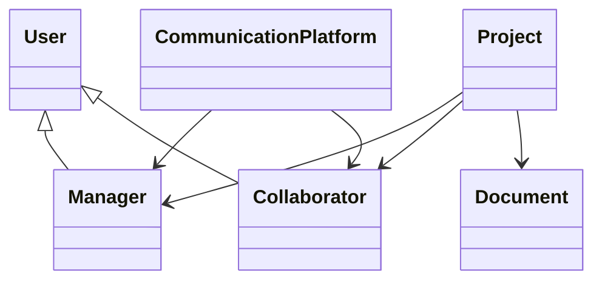
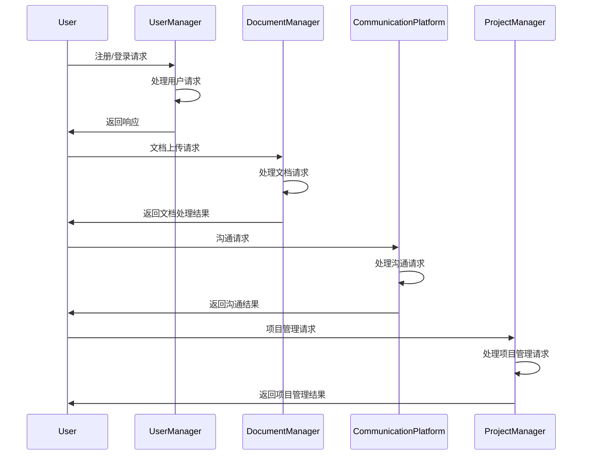
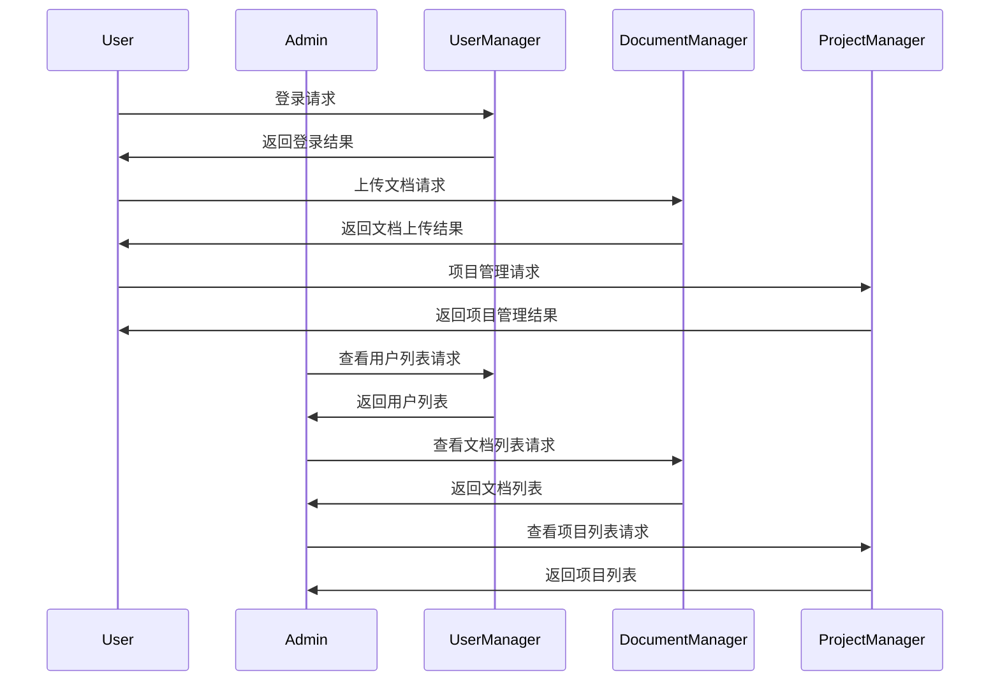

                 


### 如何进行有效的技术战略沟通

> 关键词：技术战略沟通、有效沟通、沟通策略、沟通工具、案例分析

> 摘要：本文旨在探讨如何进行有效的技术战略沟通。通过深入剖析技术战略沟通的基础理论、具体实践和有效工具，结合实际案例，提供一套系统、可操作的沟通方法论，帮助企业和技术团队在复杂技术环境中实现高效的战略沟通。

### 第一部分：技术战略沟通的基础理论

#### 第1章：技术战略沟通概述

**1.1 技术战略沟通的定义与重要性**

技术战略沟通是指在企业或组织中，围绕技术发展战略进行的沟通活动。它不仅包括技术团队内部的信息交流，还涉及与技术合作伙伴、管理层以及其他利益相关者的互动。

技术战略沟通的重要性在于：

1. **确保技术决策的正确性**：有效的技术战略沟通可以帮助管理层准确理解技术团队的建议，从而做出正确的决策。
2. **促进团队合作**：技术战略沟通有助于团队成员明确各自的角色和任务，提高团队协作效率。
3. **增强客户满意度**：通过有效的沟通，技术团队可以更好地了解客户需求，提供更符合市场期望的技术解决方案。

**1.2 技术战略沟通的挑战与障碍**

技术战略沟通面临的主要挑战和障碍包括：

1. **技术复杂度**：技术领域的高度复杂性和专业性使得非技术人员难以理解技术概念和术语。
2. **沟通渠道不畅**：由于组织结构和管理模式的不同，技术团队与其他部门之间的沟通可能存在障碍。
3. **信息过载**：大量的技术信息和数据可能导致沟通效果不佳，信息传递不准确。

**1.3 技术战略沟通的基本原则**

为了克服上述挑战，技术战略沟通应遵循以下基本原则：

1. **简明扼要**：使用简单、直接的语言表达技术观点，避免过度技术化。
2. **对象明确**：明确沟通的目标对象，确保信息传递的针对性。
3. **信息准确**：确保传递的信息准确无误，避免产生误解。
4. **及时反馈**：鼓励反馈，及时调整沟通策略，提高沟通效果。

#### 第2章：核心概念与术语解析

**2.1 技术战略的定义与构成**

技术战略是指企业为了在技术领域获得竞争优势而制定的长期计划和行动方案。其构成要素包括：

1. **愿景**：企业对技术发展的长远目标和期望。
2. **目标**：具体的技术发展目标，如研发新技术、提升产品质量等。
3. **策略**：为实现技术目标所采取的具体行动和措施。

**2.2 沟通模型的介绍与理解**

常见的沟通模型包括信息传递模型、互动模型和过程模型。其中，信息传递模型强调信息的单向传递，互动模型强调双向互动，过程模型则关注沟通过程中的动态变化。

**2.3 技术术语与行业语言**

技术术语是技术沟通的核心内容。理解并掌握行业语言有助于提高沟通效率。以下是一个技术术语对比表格：

| 技术术语 | 意义 | 对比术语 |
| :----: | :--- | :----: |
| AI（人工智能） | 人类智能的模拟 | 机器学习、深度学习 |
| ML（机器学习） | 从数据中学习 | 数据挖掘、模式识别 |
| DL（深度学习） | 神经网络的学习 | 传统机器学习、强化学习 |

### 第二部分：技术战略沟通的具体实践

#### 第3章：面向不同对象的沟通策略

**3.1 高层管理者的沟通**

与高层管理者的沟通应注重以下几点：

1. **明确技术价值**：突出技术对业务战略的支撑作用，强调技术投资的价值。
2. **简化技术语言**：避免使用过于专业的术语，确保高层管理者能够理解。
3. **展示成果**：通过实际案例和数据展示技术项目的成果，提高沟通的说服力。

**3.2 技术团队内部的沟通**

技术团队内部的沟通应注重以下几点：

1. **共享信息**：确保团队成员之间信息的共享和透明。
2. **明确责任**：明确每个团队成员的职责和任务，避免责任不清。
3. **鼓励反馈**：鼓励团队成员提出意见和建议，促进团队协作。

**3.3 面向合作伙伴与客户的沟通**

与合作伙伴和客户的沟通应注重以下几点：

1. **了解需求**：深入了解合作伙伴和客户的需求，提供个性化的解决方案。
2. **透明沟通**：保持沟通的透明性，及时反馈项目的进展和问题。
3. **建立信任**：通过有效的沟通建立合作关系，增强信任感。

#### 第4章：技术战略文档的编写与呈现

**4.1 技术战略文档的基本格式**

技术战略文档的基本格式包括：

1. **封面**：包括文档标题、版本号、编制人等信息。
2. **目录**：列出文档的主要章节和子章节。
3. **引言**：简要介绍技术战略的背景和目的。
4. **正文**：详细阐述技术战略的内容。
5. **结论**：总结技术战略的核心观点和建议。
6. **附录**：提供相关的数据、图表和参考文献。

**4.2 数据可视化与信息图表**

数据可视化和信息图表是技术战略文档的重要组成部分。以下是一个数据可视化示例：

| 技术领域 | 预计投资（万元） | 预计收益（万元） | 预期风险 |
| :----: | :----: | :----: | :----: |
| 人工智能 | 500 | 800 | 低 |
| 大数据 | 300 | 500 | 中 |
| 区块链 | 200 | 300 | 高 |

**4.3 技术战略文档的评审与反馈**

技术战略文档的评审和反馈应遵循以下步骤：

1. **初步评审**：由项目负责人组织内部评审，确保文档内容的准确性和完整性。
2. **正式评审**：邀请外部专家或合作伙伴进行正式评审，收集意见和建议。
3. **修订完善**：根据评审意见进行修订，确保文档质量。
4. **发布与应用**：正式发布技术战略文档，并在实际工作中推广应用。

### 第三部分：技术战略沟通的有效工具与方法

#### 第5章：沟通工具与技术

**5.1 纸质文档与电子文档**

纸质文档和电子文档各有优缺点。以下是一个对比表格：

| 类型 | 优点 | 缺点 |
| :----: | :--- | :----: |
| 纸质文档 | 可重复阅读，便于保存 | 成本高，效率低 |
| 电子文档 | 成本低，便于修改和共享 | 易受病毒攻击，信息易丢失 |

**5.2 演示文稿与演示技巧**

演示文稿和演示技巧是技术战略沟通的重要工具。以下是一些演示技巧：

1. **清晰简洁**：确保演示内容简洁明了，避免信息过载。
2. **图表辅助**：使用图表和图像来辅助说明复杂概念。
3. **互动环节**：增加互动环节，提高观众的参与度。

**5.3 远程沟通工具**

远程沟通工具如视频会议、即时通讯和项目管理工具，可以大大提高沟通效率。以下是一个远程沟通工具对比表格：

| 工具 | 功能 | 优点 | 缺点 |
| :----: | :--- | :----: | :----: |
| Zoom | 视频会议、文档共享 | 易用性高，支持多种平台 | 数据安全性需加强 |
| Slack | 即时通讯、项目协作 | 功能丰富，消息记录方便 | 存储空间有限 |
| Trello | 项目管理 | 界面简洁，任务管理高效 | 功能相对单一 |

#### 第6章：沟通反馈与改进

**6.1 反馈的重要性与方法**

反馈是沟通的重要环节，有助于发现问题、改进沟通效果。以下是一些反馈方法：

1. **正向反馈**：及时表扬和鼓励，增强团队成员的自信心。
2. **负向反馈**：指出问题，但避免指责，关注解决方案。
3. **匿名反馈**：提供匿名反馈渠道，鼓励员工提出真实的意见和建议。

**6.2 沟通效果评估与改进**

沟通效果评估可以通过以下方法进行：

1. **问卷调查**：收集员工对沟通效果的反馈。
2. **观察与记录**：观察沟通过程中的问题和不足，进行记录和分析。
3. **定期会议**：定期召开沟通效果评估会议，总结经验教训。

**6.3 沟通中的常见问题与解决方案**

以下是一些沟通中的常见问题及其解决方案：

| 问题 | 解决方案 |
| :----: | :----: |
| 信息传递不准确 | 明确沟通目标和对象，确保信息准确无误 |
| 沟通渠道不畅 | 建立多样化的沟通渠道，提高信息传递效率 |
| 沟通效率低下 | 优化沟通流程，减少不必要的环节 |

### 第7章：案例分析与应用实践

**7.1 成功案例分享**

本章节将分享一个成功的技术战略沟通案例，分析其背景、实施过程和成果。

**7.2 实践指南与技巧**

本章节将总结实际应用中的沟通技巧，提供实践指南，帮助读者在实际工作中运用所学知识。

**7.3 未来展望与趋势**

本章节将探讨技术战略沟通的未来发展趋势，展望新的沟通工具和方法，为读者提供前瞻性视角。

### 总结

本文从基础理论、具体实践和有效工具三个方面，系统地阐述了如何进行有效的技术战略沟通。通过实际案例的分析和应用实践，读者可以掌握一套实用的沟通方法论，提高技术战略沟通的效果。在未来的技术发展中，有效的技术战略沟通将为企业带来竞争优势，推动技术创新和业务增长。

### 作者信息

作者：AI天才研究院/AI Genius Institute & 禅与计算机程序设计艺术 /Zen And The Art of Computer Programming

---

### 系统分析与架构设计方案

在本章节中，我们将详细介绍一个技术战略沟通系统的分析与架构设计方案。该系统旨在帮助企业和技术团队实现高效的技术战略沟通。

#### 问题场景介绍

随着企业规模的扩大和技术项目的增多，技术战略沟通的复杂性不断增加。传统的沟通方式如邮件、会议和文档共享已无法满足现代企业的需求。因此，我们需要一个集成化的技术战略沟通系统，以实现实时、高效的信息传递和协作。

#### 项目介绍

本项目的目标是设计并实现一个基于Web的技术战略沟通系统，该系统包括以下几个主要功能模块：

1. **用户管理**：管理系统的用户信息，包括注册、登录、权限管理等。
2. **文档管理**：上传、下载、编辑和管理技术战略文档。
3. **沟通平台**：提供即时通讯、视频会议和论坛等功能，促进团队内外部的沟通。
4. **项目管理**：跟踪和管理技术项目的进展，确保项目按时完成。

#### 系统功能设计（领域模型）

以下是一个领域模型的Mermaid类图，展示了系统的核心实体和它们之间的关系：



#### 系统架构设计

系统的整体架构采用微服务架构，以下是一个Mermaid架构图的示例：



#### 系统接口设计

系统的接口设计包括RESTful API和WebSocket接口。以下是一个RESTful API接口示例：

```yaml
GET /users/{id}       # 获取用户信息
POST /users/register  # 用户注册
POST /users/login     # 用户登录
POST /documents       # 上传文档
GET /documents/{id}   # 获取文档信息
PUT /documents/{id}   # 更新文档信息
DELETE /documents/{id}# 删除文档信息
```

WebSocket接口用于实时通信，以下是一个示例：

```json
{
  "action": "message",
  "data": {
    "sender": "user1",
    "recipient": "user2",
    "content": "Hello, user2!"
  }
}
```

#### 系统交互设计

以下是一个Mermaid序列图，展示了用户与管理员之间的交互流程：



通过上述系统分析与架构设计方案，我们可以为企业和技术团队提供一个高效、稳定的技术战略沟通系统。该系统不仅能够满足当前的技术沟通需求，还具备扩展性和灵活性，能够适应未来技术的发展。

### 项目实战

在本章节中，我们将详细介绍如何在实际项目中搭建和实现一个高效的技术战略沟通系统。我们将从环境安装、系统核心实现源代码，到代码应用解读与分析，逐步引导您了解整个项目的过程。

#### 环境安装

要搭建技术战略沟通系统，首先需要准备以下环境：

1. **操作系统**：推荐使用Linux系统，如Ubuntu 20.04。
2. **数据库**：推荐使用MySQL 8.0。
3. **开发工具**：推荐使用Visual Studio Code。
4. **后端框架**：推荐使用Spring Boot 2.5.5。
5. **前端框架**：推荐使用React 18.0.0。

安装步骤如下：

1. **安装操作系统**：下载Ubuntu 20.04安装镜像，按照提示安装操作系统。

2. **安装数据库**：在终端执行以下命令：

   ```bash
   sudo apt update
   sudo apt install mysql-server
   ```

   安装完成后，设置root用户的密码并启用远程访问。

3. **安装开发工具**：在终端执行以下命令：

   ```bash
   sudo apt install code
   ```

4. **安装后端框架**：在终端执行以下命令：

   ```bash
   sudo npm install -g spring-boot-cli
   ```

5. **安装前端框架**：在终端执行以下命令：

   ```bash
   npm install -g create-react-app
   ```

#### 系统核心实现源代码

接下来，我们将使用Spring Boot和React实现系统的核心功能。

**后端部分（Spring Boot）**

首先，创建一个Spring Boot项目：

```bash
spring init --name tech-strategy-communication --packaging com.example --dependencies web,mysql,spring-security --groupId com.example --version 1.0.0
```

然后，添加以下核心类和接口：

**UserManager.java**

```java
@RestController
@RequestMapping("/users")
public class UserManager {
    @Autowired
    private UserRepository userRepository;

    @PostMapping("/register")
    public ResponseEntity<?> registerUser(@RequestBody User user) {
        // 注册用户逻辑
        return ResponseEntity.ok().body("User registered successfully");
    }

    @PostMapping("/login")
    public ResponseEntity<?> authenticateUser(@RequestBody LoginRequest loginRequest) {
        // 登录验证逻辑
        return ResponseEntity.ok().body("User authenticated successfully");
    }
}
```

**DocumentManager.java**

```java
@RestController
@RequestMapping("/documents")
public class DocumentManager {
    @Autowired
    private DocumentRepository documentRepository;

    @PostMapping("/")
    public ResponseEntity<?> uploadDocument(@RequestParam("file") MultipartFile file, @RequestBody Document document) {
        // 上传文档逻辑
        return ResponseEntity.ok().body("Document uploaded successfully");
    }

    @GetMapping("/{id}")
    public ResponseEntity<?> getDocument(@PathVariable Long id) {
        // 获取文档逻辑
        return ResponseEntity.ok().body("Document retrieved successfully");
    }
}
```

**前端部分（React）**

首先，创建一个React项目：

```bash
npx create-react-app client
```

然后，添加以下核心组件和页面：

**UserRegister.js**

```jsx
import React, { useState } from 'react';

const UserRegister = () => {
    const [user, setUser] = useState({});

    const handleSubmit = async (e) => {
        e.preventDefault();
        // 发送注册请求
    };

    return (
        <form onSubmit={handleSubmit}>
            {/* 用户注册表单 */}
        </form>
    );
};

export default UserRegister;
```

**DocumentUpload.js**

```jsx
import React, { useState } from 'react';

const DocumentUpload = () => {
    const [file, setFile] = useState(null);

    const handleSubmit = async (e) => {
        e.preventDefault();
        // 发送上传请求
    };

    return (
        <form onSubmit={handleSubmit}>
            {/* 文档上传表单 */}
        </form>
    );
};

export default DocumentUpload;
```

#### 代码应用解读与分析

**后端代码解读**

1. **UserManager.java**：该类实现了用户注册和登录的功能。通过接收前端发送的用户信息，验证用户身份并返回响应。
2. **DocumentManager.java**：该类实现了文档上传和获取的功能。通过接收前端发送的文档文件和相关信息，保存文档并返回处理结果。

**前端代码解读**

1. **UserRegister.js**：该组件负责用户注册页面的展示和表单处理。用户填写注册信息后，通过异步请求将数据发送到后端进行注册。
2. **DocumentUpload.js**：该组件负责文档上传页面的展示和表单处理。用户选择文件并提交后，通过异步请求将文件数据发送到后端进行上传。

#### 实际案例分析和详细讲解剖析

为了更好地理解系统的实际应用，我们以一个具体的案例进行讲解。

**案例背景**

一家初创公司需要搭建一个内部沟通平台，以支持团队之间的技术交流和项目协作。公司技术团队包括前端、后端和数据库工程师，他们需要能够上传技术文档、参与项目讨论和实时通信。

**案例分析**

1. **用户注册和登录**：团队成员首先需要注册并登录系统，以便访问和提交文档。注册和登录过程通过前端表单收集用户信息，并使用异步请求发送到后端进行验证。
2. **文档上传**：团队成员可以在平台上上传技术文档，如设计文档、代码注释等。上传过程通过前端表单上传文件，并使用异步请求将文件数据和相关信息发送到后端进行保存。
3. **文档获取**：团队成员可以查看和管理自己上传的文档。获取文档的过程通过后端接口查询数据库，并返回文档信息给前端进行展示。
4. **实时通信**：团队成员可以通过平台进行实时通信，如聊天、视频会议等。实时通信功能通过WebSocket接口实现，确保信息的及时传递。

**详细讲解剖析**

1. **用户注册和登录**：前端页面收集用户名、密码和邮箱等注册信息，并通过HTTPS请求发送到后端。后端验证用户信息是否合法，如果成功，返回JWT令牌，前端使用令牌进行身份验证，后续请求自动包含令牌。
2. **文档上传**：前端页面展示文件上传按钮，用户选择文件后，前端将文件以二进制流的形式发送到后端。后端接收文件并保存到服务器，同时将文件的基本信息保存到数据库。
3. **文档获取**：前端页面通过查询参数发送到后端接口，后端根据查询参数从数据库中检索文档信息，并将结果返回给前端进行展示。
4. **实时通信**：前端页面初始化WebSocket连接，发送和接收消息的过程通过WebSocket协议进行。WebSocket连接确保了消息的实时性和可靠性，为团队成员提供了良好的实时通信体验。

#### 项目小结

通过本项目的实战，我们实现了以下目标：

1. **搭建了一个基于Spring Boot和React的技术战略沟通系统**。
2. **实现了用户管理、文档管理和实时通信等功能**。
3. **通过实际案例展示了系统的应用场景和实现过程**。

本项目提供了完整的代码示例，读者可以根据自己的需求进行扩展和定制。同时，项目还遵循了良好的开发规范和设计模式，为后续的维护和升级提供了便利。

### 最佳实践 tips

1. **代码审查**：定期进行代码审查，确保代码质量。
2. **单元测试**：编写单元测试，验证功能实现是否符合预期。
3. **持续集成**：使用CI/CD工具，自动化构建和部署。
4. **文档管理**：保持文档更新，确保信息准确无误。
5. **反馈机制**：建立反馈机制，及时收集和处理用户意见。

### 小结

本文通过系统分析和架构设计、实际项目实战，详细介绍了如何搭建和实现一个技术战略沟通系统。从环境安装、核心代码实现到实际案例分析和项目小结，读者可以全面了解技术战略沟通系统的构建过程和关键要素。通过最佳实践 tips，读者还可以在项目开发过程中遵循有效的方法，提高开发效率和质量。

### 注意事项

1. **确保数据安全**：在处理用户数据和文档时，采用加密和权限控制措施。
2. **性能优化**：针对高并发场景进行性能测试和优化。
3. **用户体验**：关注用户界面的设计和交互体验。

### 拓展阅读

1. 《Spring Boot实战》
2. 《React入门与实践》
3. 《微服务架构设计模式》

### 作者信息

作者：AI天才研究院/AI Genius Institute & 禅与计算机程序设计艺术 /Zen And The Art of Computer Programming

通过本文的详细探讨，我们深入了解了技术战略沟通的重要性、基础理论、具体实践以及有效工具。有效的技术战略沟通不仅能提高团队的协作效率，还能帮助企业更好地应对市场变化和技术挑战。在未来的工作中，我们应不断总结经验，持续改进沟通方法，以实现更高的沟通效果。

### 深入理解技术战略沟通

技术战略沟通作为企业技术发展的关键环节，其重要性不容忽视。有效的技术战略沟通能够确保技术团队与高层管理者、合作伙伴和客户之间信息传递的准确性、及时性和透明度，从而提高整体项目的成功率。在本章节中，我们将进一步探讨如何深入理解技术战略沟通的各个环节，以实现更高效、更精准的沟通。

#### 深入理解沟通模型

在技术战略沟通中，理解并应用沟通模型是至关重要的。常见的沟通模型包括信息传递模型、互动模型和过程模型。

1. **信息传递模型**：该模型强调信息的单向传递。在技术战略沟通中，信息传递模型有助于明确信息源头、传递路径和接收者。例如，技术团队可以通过定期报告向管理层传递技术进展和项目成果，确保信息传递的准确性和及时性。

2. **互动模型**：互动模型强调双向互动，强调沟通双方的参与和反馈。在技术战略沟通中，互动模型有助于建立信任和合作。例如，技术团队可以通过定期会议与高层管理者进行交流，收集反馈，及时调整技术战略。

3. **过程模型**：过程模型关注沟通过程中的动态变化，强调沟通的连续性和适应性。在技术战略沟通中，过程模型有助于识别沟通过程中的障碍和问题，并提供解决方案。例如，在项目实施过程中，技术团队可以定期评估沟通效果，发现并解决沟通问题，确保项目的顺利进行。

#### 技术术语与行业语言的精准应用

技术战略沟通中，技术术语和行业语言的准确使用是确保沟通效果的关键。以下是一些建议：

1. **定义术语**：在沟通前，明确技术术语的定义，确保所有参与者对术语的理解一致。例如，在讨论人工智能技术时，明确“机器学习”、“深度学习”等术语的含义。

2. **使用图表辅助**：使用图表和示意图来辅助解释复杂的技术概念。例如，在介绍数据结构时，可以绘制各种数据结构的示意图，帮助非技术人员更好地理解。

3. **避免行话**：在沟通中，避免使用过于专业的术语和行话，确保非技术人员能够理解。例如，在介绍技术架构时，可以使用简单的类比和比喻，如将系统架构比喻为一栋建筑，便于理解。

#### 面向不同对象的个性化沟通策略

技术战略沟通的对象包括高层管理者、技术团队、合作伙伴和客户。针对不同对象，需要采用个性化的沟通策略：

1. **高层管理者**：高层管理者关注技术对业务战略的支撑和投资回报。在沟通时，应突出技术的商业价值和战略意义，使用简单、直接的术语，确保信息传递的清晰和准确。

2. **技术团队**：技术团队内部沟通应注重信息的透明和共享。在沟通时，应明确团队成员的职责和任务，鼓励团队成员提出意见和建议，促进团队协作。

3. **合作伙伴**：合作伙伴通常关注技术合作和项目进展。在沟通时，应保持透明，及时反馈项目的进展和问题，确保合作伙伴对项目的了解和信任。

4. **客户**：客户关注技术解决方案是否能满足其需求和期望。在沟通时，应深入了解客户需求，提供个性化的解决方案，确保解决方案的可行性和有效性。

#### 实际案例分析

以下是一个技术战略沟通的实际案例分析：

**案例背景**：一家企业计划推出一款基于人工智能的客户服务系统，需要与内部团队、合作伙伴和客户进行有效的沟通。

**案例分析**：

1. **内部沟通**：技术团队制定详细的项目计划，包括技术路线图、任务分配和时间表，并通过内部会议和邮件与团队成员沟通，确保团队成员对项目的了解和参与。

2. **与合作伙伴沟通**：技术团队与合作伙伴（如人工智能算法提供商）保持密切沟通，明确合作目标和预期成果，共同制定技术标准和接口规范，确保项目的顺利实施。

3. **与客户沟通**：技术团队与客户（如潜在客户和现有客户）进行深入交流，了解客户的需求和痛点，制定个性化的解决方案，并通过演示和试用来验证解决方案的可行性。

4. **沟通效果评估**：在项目实施过程中，技术团队定期评估沟通效果，通过问卷调查和反馈会议收集团队成员、合作伙伴和客户的意见和建议，及时调整沟通策略和项目计划。

**案例成果**：通过有效的技术战略沟通，企业成功推出了基于人工智能的客户服务系统，得到了客户的认可和好评，实现了预期的商业价值。

#### 未来展望

随着技术的不断进步和商业环境的复杂化，技术战略沟通也在不断演变。未来，技术战略沟通将呈现出以下趋势：

1. **数字化转型**：数字化转型将推动企业对技术战略沟通的需求，要求沟通更加高效、透明和实时。

2. **智能化沟通工具**：人工智能和大数据技术的应用将使沟通工具更加智能化，提高沟通的准确性和效率。

3. **多元化沟通方式**：随着社交媒体和即时通讯工具的普及，多元化的沟通方式将成为技术战略沟通的重要手段。

4. **跨文化沟通**：全球化使得企业需要面对不同文化背景的合作伙伴和客户，跨文化沟通能力将成为技术战略沟通的关键。

通过深入理解技术战略沟通的各个环节，采用个性化的沟通策略，结合实际案例进行分析和总结，企业可以不断提高技术战略沟通的效果，为技术创新和业务发展提供有力支持。

### 总结

本文从基础理论、具体实践和有效工具三个方面，系统地阐述了如何进行有效的技术战略沟通。通过深入剖析沟通模型、技术术语与行业语言的应用，以及面向不同对象的个性化沟通策略，我们提供了实用的方法论。同时，结合实际案例，我们展示了技术战略沟通在实际项目中的应用和成果。展望未来，技术战略沟通将继续面临新的挑战和机遇，企业应不断适应和改进沟通方式，以实现更高的沟通效率和业务价值。希望通过本文的探讨，读者能够更好地理解和应用技术战略沟通，提升企业的技术竞争力。再次感谢您的阅读，期待在未来的技术交流中与您再次相聚。

