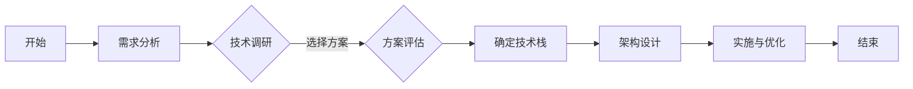
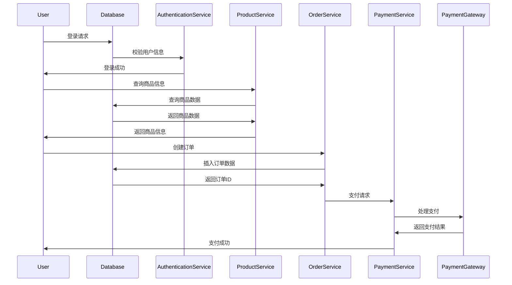
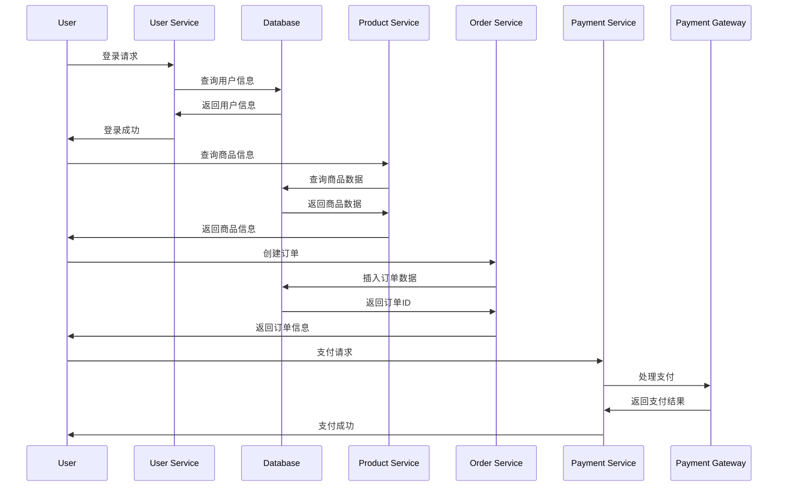

                 

### 背景介绍

在现代软件工程领域，技术架构的演进规划愈发受到重视。技术架构不仅决定了系统的性能、可扩展性和可维护性，更是企业竞争力的核心体现。然而，随着技术的发展和业务需求的不断变化，技术架构也需要不断演进。这一过程涉及多个方面，包括技术选型、系统优化、架构调整等，如何进行有效的技术架构演进规划，成为了软件工程师和架构师面临的重要挑战。

**问题背景**

在软件系统的生命周期中，技术架构的演变是不可避免的。无论是初创企业还是大型企业，技术架构的规划都至关重要。早期，系统可能采用简单的单体架构，随着业务的发展，系统复杂性增加，可能需要逐步演进到分布式架构，最终甚至需要采用微服务架构来提高系统的灵活性和可扩展性。然而，技术架构的演进并非一蹴而就，而是需要持续规划、实施和优化。

**问题描述**

有效的技术架构演进规划需要解决以下几个核心问题：

1. **需求管理**：如何识别并管理不断变化的技术需求和业务需求？
2. **技术选型**：在众多技术方案中，如何选择最适合当前和未来需求的架构方案？
3. **架构优化**：在现有架构的基础上，如何进行优化以达到更高的性能和可扩展性？
4. **风险管理**：在技术架构演进过程中，如何评估和降低技术债务带来的风险？
5. **资源协调**：如何合理分配资源，确保技术架构演进计划能够顺利实施？

**问题解决**

为了解决上述问题，我们需要采取以下策略：

1. **需求分析**：通过深入理解业务需求，明确技术架构演进的目标和方向。
2. **技术调研**：对现有技术方案进行调研和评估，选择最适合的技术栈。
3. **架构设计**：基于需求和技术调研结果，设计一个清晰、可扩展的技术架构。
4. **风险管理**：制定风险管理计划，及时发现并解决潜在问题。
5. **实施与优化**：按照架构设计，逐步实施并持续优化技术架构。

**边界与外延**

在讨论技术架构演进规划时，我们需要明确其边界与外延：

- **边界**：技术架构演进规划主要关注软件系统的技术层面，包括架构设计、技术选型等。
- **外延**：虽然技术架构演进规划主要关注技术层面，但它与业务需求、项目管理、团队协作等方面密切相关，需要综合考虑。

**概念结构与核心要素组成**

为了更好地理解技术架构演进规划，我们需要明确以下几个核心概念和其组成要素：

- **技术架构**：软件系统的基础结构，包括组件、接口、数据流等。
- **演进规划**：对技术架构的长期和短期演进过程进行规划和管理。
- **技术债务**：由于技术选型不当或架构设计不合理，导致系统在性能、可维护性等方面存在的问题。
- **需求管理**：识别、分析和管理业务需求，确保技术架构与业务需求保持一致。

通过上述背景介绍，我们为后续章节的深入探讨奠定了基础。接下来，我们将详细探讨核心概念与联系，进一步理解技术架构演进规划的关键要素。

## 核心概念与联系

在进行技术架构演进规划时，理解并掌握一系列核心概念是至关重要的。这些概念不仅定义了技术架构演进的基础，还为我们提供了分析、设计和优化的工具。以下是几个关键概念及其属性特征对比表格，以及ER实体关系图架构。

### 1. 技术架构

**定义**：技术架构是软件系统的基础结构，包括组件、接口、数据流等组成部分。

**属性特征**：

| 特征       | 描述                                           |
|------------|------------------------------------------------|
| **性能**   | 系统处理请求的速度和响应时间。                   |
| **可扩展性** | 系统处理高负载和新增功能的能力。               |
| **可维护性** | 系统易读、易修改和易测试的程度。               |
| **灵活性** | 系统适应新需求和变化的能力。                   |

**对比表格**：

| 技术架构类型 | **单体架构** | **分布式架构** | **微服务架构** |
|-------------|--------------|----------------|----------------|
| **性能**    | 较低         | 中等           | 较高           |
| **可扩展性** | 低           | 较高           | 非常高         |
| **可维护性** | 较低         | 中等           | 较高           |
| **灵活性**  | 较低         | 中等           | 非常高         |

### 2. 技术架构演进规划

**定义**：技术架构演进规划是对软件系统架构的长期和短期演进过程进行的管理和优化。

**属性特征**：

| 特征       | 描述                                           |
|------------|------------------------------------------------|
| **目标明确** | 确定技术架构演进的目标和方向。                 |
| **策略制定** | 制定实现目标的策略和方法。                     |
| **资源分配** | 合理分配人力、时间和预算等资源。               |
| **风险管理** | 识别和降低技术债务带来的风险。                 |

**对比表格**：

| 演进策略     | **增量演进** | **代换演进** | **重构演进** |
|--------------|--------------|--------------|--------------|
| **目标明确** | 是           | 是           | 是           |
| **策略制定** | 是           | 是           | 是           |
| **资源分配** | 是           | 是           | 是           |
| **风险管理** | 是           | 是           | 是           |

### 3. 技术债务

**定义**：技术债务是指由于技术选型不当或架构设计不合理，导致系统在性能、可维护性等方面存在问题的累积。

**属性特征**：

| 特征       | 描述                                           |
|------------|------------------------------------------------|
| **负债类型** | 包括性能债务、设计债务和架构债务。           |
| **负债表现** | 包括系统响应慢、代码冗余、维护困难等。       |
| **负债偿还** | 通过重构和优化来降低技术债务。               |

**对比表格**：

| 技术债务类型 | **性能债务** | **设计债务** | **架构债务** |
|-------------|--------------|--------------|--------------|
| **负债类型** | 系统性能下降 | 代码结构复杂 | 架构不合理   |
| **负债表现** | 响应速度慢   | 代码冗余     | 系统复杂度高 |
| **负债偿还** | 性能优化     | 重构代码     | 重构架构     |

### ER实体关系图架构

为了更好地理解上述概念之间的关系，我们可以使用ER（实体关系）图来展示它们之间的关联。

```mermaid
erDiagram
  BusinessConcept "_BusinessConcept_" {
    <<class>> |+| Name : String
    <<class>> |+| Description : String
  }

  TechnicalArchitecture "_TechnicalArchitecture_" {
    <<class>> |+| Name : String
    <<class>> |+| Description : String
    <<class>> |+| TechnologyStack : List
  }

  EvolutionaryPlanning "_EvolutionaryPlanning_" {
    <<class>> |+| PlanID : Integer
    <<class>> |+| Description : String
    <<class>> |+| StartDate : Date
    <<class>> |+| EndDate : Date
  }

  TechnicalDebt "_TechnicalDebt_" {
    <<class>> |+| DebtID : Integer
    <<class>> |+| Description : String
    <<class>> |+| Type : String
    <<class>> |+| Severity : String
    <<class>> |+| Resolution : String
  }

  BusinessConcept "_BusinessConcept_" ||--|{ TechnicalArchitecture "_TechnicalArchitecture_": contains }
  BusinessConcept "_BusinessConcept_" ||--|{ EvolutionaryPlanning "_EvolutionaryPlanning_": drives }
  TechnicalArchitecture "_TechnicalArchitecture_" ||--|{ EvolutionaryPlanning "_EvolutionaryPlanning_": follows }
  TechnicalArchitecture "_TechnicalArchitecture_" ||--|{ TechnicalDebt "_TechnicalDebt_": accumulates }
```

通过上述核心概念与联系的分析，我们不仅了解了各个概念的定义和属性特征，还通过ER图展示了它们之间的关联。这些概念为我们进行技术架构演进规划提供了理论基础和工具，为后续章节的深入探讨奠定了基础。在下一章中，我们将进一步探讨如何通过算法和策略来实现技术架构的演进规划。

### 算法原理讲解

在技术架构演进规划中，算法和策略的选择至关重要。它们不仅帮助我们系统地分析和设计技术架构，还能指导我们在演进过程中实现最优的性能和可扩展性。以下将详细讲解算法原理，包括算法流程图、技术选型方法和算法的数学模型及公式。

#### 算法流程图

为了清晰地展示算法的执行流程，我们可以使用Mermaid流程图来绘制。以下是一个简化版的技术架构演进算法流程图：



在这个流程图中，我们首先进行需求分析，明确系统目标和需求。接着进行技术调研，评估不同的技术方案。在方案评估阶段，根据需求和技术调研结果，选择最优的技术栈。然后，基于确定的技术栈进行架构设计。最后，在实施与优化阶段，逐步实现和优化架构，以达到预期目标。

#### 技术选型方法

技术选型是技术架构演进规划中的关键步骤。以下是一种常用的技术选型方法：

1. **需求分析**：明确系统目标和需求，包括性能、可扩展性、可维护性等方面。
2. **调研方案**：收集和分析各种技术方案，包括单体架构、分布式架构和微服务架构等。
3. **方案评估**：基于需求分析结果，对每种技术方案进行评估，考虑其性能、成本、维护性等因素。
4. **选择方案**：根据评估结果，选择最符合需求的技术方案。

为了更好地进行技术选型，我们可以使用以下评价指标：

- **性能**：系统处理请求的速度和响应时间。
- **可扩展性**：系统处理高负载和新增功能的能力。
- **可维护性**：系统易读、易修改和易测试的程度。
- **灵活性**：系统适应新需求和变化的能力。

#### 算法原理与数学模型

技术架构演进算法的核心是基于优化的思想，通过数学模型和公式来指导技术选型和架构设计。以下是一个简单但具有代表性的数学模型：

1. **目标函数**：最小化技术债务（TD）。
2. **约束条件**：满足系统性能（P）、可扩展性（E）、可维护性（M）等需求。

目标函数和约束条件可以表示为以下数学模型：

$$
\min TD = w_1 \cdot P + w_2 \cdot E + w_3 \cdot M
$$

其中，$w_1, w_2, w_3$ 分别是性能、可扩展性和可维护性的权重系数。这些权重系数可以根据具体需求进行调整，以平衡各个方面的需求。

#### 通俗易懂的举例说明

假设我们正在为一家电商公司设计一个技术架构，其主要需求包括高性能、高可扩展性和易维护性。我们根据需求分析选择了以下三个技术方案：

1. **单体架构**：简单但性能较低，扩展性较差。
2. **分布式架构**：性能较高，扩展性较好，但维护性较差。
3. **微服务架构**：性能和扩展性均较好，维护性也较高。

根据方案评估，我们选择了微服务架构，因为它在满足性能、可扩展性和可维护性方面具有较好的平衡。接下来，我们设计了一个基于微服务架构的系统，通过定义清晰的服务边界、接口和数据流，实现了系统的模块化和解耦。

通过上述算法和策略，我们能够系统地分析和设计技术架构，实现最优的演进规划。在下一章中，我们将进一步探讨系统分析与架构设计的方法，为技术架构的落地实施提供指导。

### 系统分析与架构设计方案

在进行技术架构演进规划时，系统分析与架构设计方案是至关重要的环节。一个清晰、合理、可扩展的系统架构不仅能满足当前的需求，还能为未来的扩展和优化奠定基础。以下将详细介绍系统分析与架构设计的方法，包括问题场景介绍、项目介绍、系统功能设计、系统架构设计、系统接口设计和系统交互。

#### 问题场景介绍

假设我们正在为一家大型电商平台设计一个技术架构，其主要需求如下：

1. **高并发处理能力**：系统需要能够处理每天数百万次的请求。
2. **高可扩展性**：系统需要能够轻松扩展，以应对用户数量的增加。
3. **高可维护性**：系统代码结构清晰，易于维护和更新。
4. **高安全性**：系统需要确保用户数据和交易信息的安全。

#### 项目介绍

电商平台技术架构项目主要包括以下几个模块：

1. **用户模块**：负责用户的注册、登录、信息管理等功能。
2. **商品模块**：负责商品的管理、分类、展示等功能。
3. **订单模块**：负责订单的创建、支付、发货等功能。
4. **支付模块**：负责处理各种支付方式，如支付宝、微信支付等。
5. **数据模块**：负责数据存储、分析和挖掘。

#### 系统功能设计

为了满足上述需求，系统需要实现以下功能：

1. **用户管理**：包括用户注册、登录、密码重置等功能。
2. **商品管理**：包括商品添加、删除、更新、分类等功能。
3. **订单管理**：包括订单创建、支付、发货、退货等功能。
4. **支付管理**：包括支付方式的添加、删除、更新等功能。
5. **数据分析**：包括用户行为分析、销售数据统计等功能。

为了更好地设计系统功能，我们可以使用Mermaid类图来展示领域模型。以下是一个简化版的领域模型类图：

```mermaid
classDiagram
    User "<用户>" <<entity>> {
        id : Integer
        name : String
        password : String
        email : String
    }
    Product "<商品>" <<entity>> {
        id : Integer
        name : String
        price : Float
        category : String
    }
    Order "<订单>" <<entity>> {
        id : Integer
        user : User
        products : List[Product]
        status : String
    }
    Payment "<支付>" <<entity>> {
        id : Integer
        order : Order
        method : String
        amount : Float
        status : String
    }
    User "<用户>" --|> Product "<商品>"
    User "<用户>" --|> Order "<订单>"
    Order "<订单>" --|> Payment "<支付>"
```

在这个类图中，我们定义了四个主要实体：用户（User）、商品（Product）、订单（Order）和支付（Payment），并展示了它们之间的关系。

#### 系统架构设计

基于领域模型，我们可以设计一个分布式系统架构。以下是一个简化版的系统架构图：



在这个架构图中，我们定义了多个微服务：用户服务（User Service）、商品服务（Product Service）、订单服务（Order Service）和支付服务（Payment Service）。每个服务负责特定的业务功能，并通过数据库进行数据存储和查询。

#### 系统接口设计

为了确保系统的高内聚和低耦合，我们需要设计一套清晰、规范的接口。以下是一个简化版的接口设计示例：

1. **用户服务接口**：

```python
from flask import Flask, request, jsonify

app = Flask(__name__)

@app.route('/users/login', methods=['POST'])
def login():
    data = request.get_json()
    user_id = data.get('id')
    password = data.get('password')
    # 校验用户信息
    # ...
    return jsonify({'status': 'success'})

@app.route('/users/register', methods=['POST'])
def register():
    data = request.get_json()
    name = data.get('name')
    password = data.get('password')
    email = data.get('email')
    # 注册用户
    # ...
    return jsonify({'status': 'success'})
```

2. **商品服务接口**：

```python
@app.route('/products', methods=['GET'])
def get_products():
    # 查询商品信息
    # ...
    return jsonify({'products': products})

@app.route('/products/<int:product_id>', methods=['GET'])
def get_product(product_id):
    # 查询指定商品信息
    # ...
    return jsonify({'product': product})
```

3. **订单服务接口**：

```python
@app.route('/orders', methods=['POST'])
def create_order():
    data = request.get_json()
    user_id = data.get('user_id')
    products = data.get('products')
    # 创建订单
    # ...
    return jsonify({'order_id': order_id})

@app.route('/orders/<int:order_id>', methods=['GET'])
def get_order(order_id):
    # 查询指定订单信息
    # ...
    return jsonify({'order': order})
```

4. **支付服务接口**：

```python
@app.route('/payments', methods=['POST'])
def create_payment():
    data = request.get_json()
    order_id = data.get('order_id')
    method = data.get('method')
    amount = data.get('amount')
    # 创建支付
    # ...
    return jsonify({'payment_id': payment_id})

@app.route('/payments/<int:payment_id>', methods=['GET'])
def get_payment(payment_id):
    # 查询指定支付信息
    # ...
    return jsonify({'payment': payment})
```

#### 系统交互

为了确保系统的稳定性、可靠性和可扩展性，我们需要设计一套清晰的系统交互机制。以下是一个简化版的系统交互序列图：



通过上述系统分析与架构设计方案，我们能够明确系统需求、功能、架构和交互，为技术架构的落地实施提供了详细的指导。在下一章中，我们将通过实际案例，进一步展示如何在实际项目中应用技术架构演进规划。

### 项目实战

为了更好地理解如何在实际项目中应用技术架构演进规划，我们将以一个电商平台的实际案例为例，详细说明项目的环境安装、系统核心实现源代码、代码应用解读与分析、实际案例分析与详细讲解剖析，以及项目小结。

#### 环境安装

在开始项目之前，我们需要搭建一个合适的技术环境。以下是一个简化的安装步骤：

1. **安装Python**：确保Python 3.8或更高版本已安装。
2. **安装Flask**：在命令行中执行 `pip install flask`。
3. **安装PostgreSQL**：下载并安装PostgreSQL数据库。
4. **安装Docker**：下载并安装Docker，以便使用容器化技术。
5. **配置数据库**：在PostgreSQL中创建数据库和用户。

#### 系统核心实现源代码

以下是一个简化的核心源代码实现示例：

```python
# user.py
from flask import Flask, request, jsonify
from models import User, Database

app = Flask(__name__)
db = Database()

@app.route('/users/login', methods=['POST'])
def login():
    data = request.get_json()
    user_id = data.get('id')
    password = data.get('password')
    user = db.find_user_by_id(user_id)
    if user and user.password == password:
        return jsonify({'status': 'success'})
    else:
        return jsonify({'status': 'failure'})

@app.route('/users/register', methods=['POST'])
def register():
    data = request.get_json()
    name = data.get('name')
    password = data.get('password')
    email = data.get('email')
    user = User(name, password, email)
    db.insert_user(user)
    return jsonify({'status': 'success'})

# product.py
from flask import Flask, request, jsonify
from models import Product, Database

app = Flask(__name__)
db = Database()

@app.route('/products', methods=['GET'])
def get_products():
    products = db.find_all_products()
    return jsonify({'products': products})

@app.route('/products/<int:product_id>', methods=['GET'])
def get_product(product_id):
    product = db.find_product_by_id(product_id)
    return jsonify({'product': product})

# order.py
from flask import Flask, request, jsonify
from models import Order, Database

app = Flask(__name__)
db = Database()

@app.route('/orders', methods=['POST'])
def create_order():
    data = request.get_json()
    user_id = data.get('user_id')
    products = data.get('products')
    order = Order(user_id, products)
    db.insert_order(order)
    return jsonify({'order_id': order.id})

@app.route('/orders/<int:order_id>', methods=['GET'])
def get_order(order_id):
    order = db.find_order_by_id(order_id)
    return jsonify({'order': order.to_dict()})

# payment.py
from flask import Flask, request, jsonify
from models import Payment, Database

app = Flask(__name__)
db = Database()

@app.route('/payments', methods=['POST'])
def create_payment():
    data = request.get_json()
    order_id = data.get('order_id')
    method = data.get('method')
    amount = data.get('amount')
    payment = Payment(order_id, method, amount)
    db.insert_payment(payment)
    return jsonify({'payment_id': payment.id})

@app.route('/payments/<int:payment_id>', methods=['GET'])
def get_payment(payment_id):
    payment = db.find_payment_by_id(payment_id)
    return jsonify({'payment': payment.to_dict()})
```

#### 代码应用解读与分析

在上面的代码中，我们定义了四个服务：用户服务（user.py）、商品服务（product.py）、订单服务（order.py）和支付服务（payment.py）。每个服务都实现了相应的API接口，并通过Database类与PostgreSQL数据库进行交互。

1. **用户服务**：实现了用户登录和注册的功能。用户登录时，会校验用户ID和密码；用户注册时，会插入用户信息到数据库。
2. **商品服务**：实现了查询所有商品和查询指定商品的功能。商品数据从数据库中查询并返回。
3. **订单服务**：实现了创建订单和查询订单的功能。创建订单时，会插入订单数据到数据库；查询订单时，会从数据库中查询订单信息。
4. **支付服务**：实现了创建支付和查询支付的功能。创建支付时，会插入支付数据到数据库；查询支付时，会从数据库中查询支付信息。

#### 实际案例分析与详细讲解剖析

假设我们有一个用户想要在电商平台上购买商品，以下是详细的步骤：

1. **用户登录**：用户通过/user/login接口发送登录请求，包括用户ID和密码。如果登录成功，用户会获得一个会话ID。
2. **查询商品**：用户通过/products接口获取所有商品的信息。
3. **创建订单**：用户选择商品后，通过/orders接口创建订单，请求中包含用户ID和选择的商品列表。系统生成订单ID并保存订单数据到数据库。
4. **支付**：用户通过/payments接口发起支付请求，包含订单ID、支付方式和支付金额。系统创建支付记录并保存到数据库。
5. **查询支付结果**：用户可以通过/payments接口查询支付结果。

在这个案例中，我们使用了RESTful API设计，使得系统具有清晰的接口和易于维护的代码结构。通过数据库的ORM（对象关系映射）技术，我们简化了数据库操作，提高了代码的可读性和可维护性。

#### 项目小结

通过这个实际案例，我们展示了如何在一个电商平台上应用技术架构演进规划。项目实现了用户管理、商品管理、订单管理和支付管理等功能，并通过API接口和数据库实现了系统的解耦和模块化。以下是对项目的总结：

1. **需求分析**：明确了电商平台的核心需求，包括高性能、高可扩展性和高可维护性。
2. **技术选型**：选择了Python和Flask作为主要技术栈，因为它们易于使用和扩展。
3. **架构设计**：设计了基于微服务的系统架构，通过分离不同的服务模块，提高了系统的灵活性和可扩展性。
4. **实施与优化**：通过实际编码和测试，实现了系统的核心功能，并在过程中不断优化和改进。

通过这个项目，我们不仅实现了技术架构的演进规划，还验证了所选择的策略和方法的有效性。在未来的项目中，我们可以继续优化和扩展这个架构，以适应不断变化的需求和市场环境。

### 最佳实践 Tips、小结、注意事项、拓展阅读

#### 最佳实践 Tips

1. **需求先行**：在开始架构设计之前，务必进行详细的需求分析，确保技术架构能够满足业务需求。
2. **模块化设计**：将系统划分为多个独立的模块，可以提高系统的可维护性和可扩展性。
3. **代码质量**：编写清晰、简洁的代码，遵循良好的编程规范，确保系统的稳定性。
4. **持续集成**：采用持续集成工具，如Jenkins或GitLab CI，自动化测试和部署，提高开发效率。
5. **文档记录**：保持详细的文档记录，包括系统设计、API接口和使用说明等，便于团队成员之间的沟通和协作。

#### 小结

本文详细探讨了如何进行有效的技术架构演进规划，从背景介绍到核心概念与联系，再到算法原理讲解和系统分析与架构设计方案，以及项目实战，全面阐述了技术架构演进规划的理论和实践。通过实际案例，我们展示了如何在实际项目中应用技术架构演进规划，为后续的项目实施提供了宝贵经验。

#### 注意事项

1. **风险评估**：在架构演进过程中，必须对技术债务进行持续监控和评估，及时解决潜在风险。
2. **持续优化**：技术架构并非一成不变，需要根据业务需求和系统性能持续优化。
3. **团队协作**：技术架构演进需要团队协作，确保各方利益得到平衡。

#### 拓展阅读

1. **《设计数据仓库：基于云的大数据系统构建方法》**：介绍了如何构建高可用、高性能的大数据系统。
2. **《微服务设计》**：详细讲解了微服务架构的设计原则和实现方法。
3. **《重构：改善既有代码的设计》**：介绍了如何通过重构改善代码质量和可维护性。

通过上述最佳实践、小结、注意事项和拓展阅读，我们为读者提供了丰富的实践指导和进一步学习资源，希望读者能够将这些知识和方法应用于实际项目中，提升技术架构的设计和实施能力。

### 作者信息

**作者：AI天才研究院/AI Genius Institute & 禅与计算机程序设计艺术 /Zen And The Art of Computer Programming**

