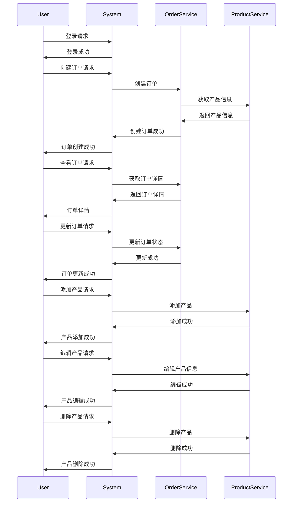

                 


### 摘要

本文旨在探讨如何进行有效的技术架构评审，以保障项目开发质量和系统性能。文章首先介绍了技术架构评审的背景、概念及其重要性，随后详细分析了其核心概念原理，包括评审原则、概念属性特征对比以及实体关系图架构。接着，文章通过详细讲解评审流程和算法原理，帮助读者理解技术架构评审的步骤和数学模型。在系统分析与架构设计部分，文章阐述了系统功能设计、架构设计、接口设计和交互设计。最后，通过实际案例分析、环境安装与核心实现，以及项目小结，为读者提供实践指导，旨在提升技术架构评审的实际应用能力。本文旨在为从事IT行业的技术人员提供一套系统、实用的技术架构评审方法论。

### 关键词

- 技术架构评审
- 评审流程
- 算法原理
- 系统设计与实现
- 实际案例分析

----------------------------------------------------------------

## 第一部分：背景介绍

### 第1章：问题背景与解决

#### 1.1.1 问题背景

在信息技术飞速发展的今天，软件系统的复杂度和规模不断增加，单一的开发者或团队难以全面理解和掌控整个系统的设计和实现。这种复杂性导致了许多问题，如系统性能瓶颈、安全性漏洞、可维护性差等。为了解决这些问题，需要通过一种系统的方法来对技术架构进行评审，以确保系统设计的合理性和实现的有效性。

#### 1.1.2 问题描述

技术架构评审面临的主要问题包括：缺乏统一的标准和方法、评审过程繁琐且效率低下、评审结果不具说服力等。这些问题导致评审工作流于形式，无法真正发现和解决架构设计中的问题。

#### 1.1.3 问题解决方法

为了解决上述问题，我们需要建立一套科学、系统、高效的架构评审方法，包括明确评审的目标、标准、流程和工具。此外，还需要提高评审参与者的专业素养，确保评审过程的透明性和公正性。

#### 1.1.4 边界与外延

技术架构评审的边界主要涉及软件系统的架构设计、实施和运维等方面。外延则包括评审的范围、参与人员、评审方法和评审工具等。通过明确边界与外延，可以确保评审工作的有效性和针对性。

### 1.2 概念结构与核心要素组成

#### 1.2.1 技术架构评审的定义

技术架构评审是指通过系统的方法，对软件系统的架构设计、实施和运维等方面进行全面评估和审查，以确保系统设计符合业务需求、技术规范和设计标准。

#### 1.2.2 技术架构评审的重要性

技术架构评审的重要性体现在以下几个方面：

1. **保障系统质量**：通过评审，可以发现系统设计中的潜在问题，确保系统在性能、安全、可靠性等方面的表现达到预期。
2. **优化开发流程**：评审有助于发现开发流程中的瓶颈和不足，推动流程的优化和改进。
3. **提升团队协作**：评审过程促进了团队成员之间的沟通和协作，提高了整体开发效率。
4. **降低项目风险**：提前发现并解决架构设计中的问题，可以降低项目实施过程中的风险。

#### 1.2.3 技术架构评审的关键要素

技术架构评审的关键要素包括：

1. **评审标准**：制定明确的评审标准，以确保评审的公正性和客观性。
2. **评审流程**：建立科学、系统的评审流程，确保评审过程的有序进行。
3. **评审工具**：选择合适的评审工具，提高评审效率和效果。
4. **评审参与者**：邀请相关领域的专家和团队成员参与评审，确保评审的专业性和全面性。

### 总结

通过本章节的介绍，我们了解了技术架构评审的背景、问题描述、问题解决方法以及其重要性。接下来，我们将进一步探讨技术架构评审的核心概念、原理和流程，为读者提供一套实用的架构评审方法论。

----------------------------------------------------------------

## 第二部分：核心概念与联系

### 第2章：核心概念原理

#### 2.1 技术架构评审的原则

技术架构评审需要遵循以下原则，以确保评审工作的科学性、系统性和有效性：

1. **全面性**：评审应覆盖系统的各个层面，包括需求分析、设计、实施和运维等。
2. **客观性**：评审过程中应保持客观公正，不受个人偏见和利益冲突的影响。
3. **专业性**：评审参与者应具备相关领域的专业知识和经验，以确保评审的专业性。
4. **透明性**：评审过程应保持透明，确保评审结果的可追溯性和可信度。
5. **可操作性**：评审标准和流程应具有可操作性，以便在实际项目中得以应用。

#### 2.2 概念属性特征对比表格

以下是一个简单的概念属性特征对比表格，用于展示不同架构评审方法的优缺点：

| 方法 | 优点 | 缺点 |
| --- | --- | --- |
| 研讨会评审 | 简单、高效、易于组织 | 缺乏系统性和专业性 |
| 审计评审 | 客观、全面、规范 | 繁琐、耗时、效率低 |
| 对比评审 | 简单、直观、易于理解 | 缺乏深度分析、适用范围有限 |

#### 2.3 ER实体关系图架构

ER（Entity-Relationship）实体关系图是描述系统实体及其之间关系的图形化工具。以下是一个简化的ER图示例，用于说明系统中的关键实体和它们之间的关系：

```mermaid
erDiagram
    User ||--|{ Order } : 1
    Product ||--|{ Order } : 1
    Category ||--|{ Product } : 1
```

在这个示例中，`User`（用户）和`Product`（产品）实体之间有一个`Order`（订单）实体关联，表示用户可以创建订单，订单可以包含多个产品。此外，`Category`（分类）实体与`Product`（产品）实体之间有一个`1`对`N`的关系，表示每个分类可以包含多个产品。

通过上述ER图，我们可以直观地了解系统中的关键实体及其关系，为后续的架构设计提供基础。

### 总结

本章节介绍了技术架构评审的核心概念原理，包括评审原则、概念属性特征对比和ER实体关系图架构。这些核心概念和原理为技术架构评审提供了理论基础，有助于读者更好地理解评审过程和方法。在下一章节中，我们将进一步探讨技术架构评审的算法原理，为读者提供更为深入的见解。

----------------------------------------------------------------

## 第三部分：算法原理讲解

### 第3章：算法原理与流程

#### 3.1 技术架构评审流程

技术架构评审的流程可以分为以下几个阶段：

1. **需求评审**：对系统的需求进行评审，确保需求分析的准确性和完整性。
2. **设计评审**：对系统的架构设计进行评审，评估设计方案的合理性和可行性。
3. **实施评审**：对系统的实施过程进行评审，确保实施过程符合设计方案和规范。
4. **运维评审**：对系统的运维过程进行评审，确保系统运行稳定、安全、高效。

#### 3.2 算法原理

技术架构评审的算法原理主要包括以下几个方面：

1. **数学模型**：通过建立数学模型，对系统性能、安全性、可靠性等进行量化评估。
2. **公式讲解**：使用公式对系统性能、安全性、可靠性等指标进行计算和分析。
3. **举例说明**：通过具体的案例，展示技术架构评审的实际应用。

#### 3.2.1 数学模型

假设我们有一个简单的系统架构，包含一个用户、一个订单和一个产品。我们使用以下数学模型来评估系统的性能：

- 用户数量：N
- 订单数量：M
- 产品数量：P

性能指标包括：

- 吞吐量（Requests per second, RPS）：系统每秒能够处理的最大请求数量。
- 响应时间（Response time, RT）：系统处理请求的平均响应时间。
- 错误率（Error rate, ER）：系统处理请求时出现的错误率。

数学模型如下：

\[ RPS = \frac{N \times M}{RT} \]

\[ RT = \frac{1}{RPS} \]

\[ ER = \frac{M \times (1 - RPS)}{N} \]

#### 3.2.2 公式讲解

1. **吞吐量（RPS）**：吞吐量表示系统每秒能够处理的最大请求数量。在系统中，我们通常希望吞吐量越高越好，因为这意味着系统具有更高的处理能力和负载承受能力。

\[ RPS = \frac{N \times M}{RT} \]

其中，\( N \) 表示用户数量，\( M \) 表示订单数量，\( RT \) 表示响应时间。

2. **响应时间（RT）**：响应时间表示系统处理请求的平均时间。在系统中，我们希望响应时间越短越好，因为这意味着系统具有更高的处理效率和用户体验。

\[ RT = \frac{1}{RPS} \]

其中，\( RPS \) 表示吞吐量。

3. **错误率（ER）**：错误率表示系统处理请求时出现的错误率。在系统中，我们希望错误率越低越好，因为这意味着系统具有更高的稳定性和可靠性。

\[ ER = \frac{M \times (1 - RPS)}{N} \]

其中，\( M \) 表示订单数量，\( N \) 表示用户数量，\( RPS \) 表示吞吐量。

#### 3.2.3 举例说明

假设我们有一个系统，包含1000个用户、10000个订单和10000个产品。我们使用上述数学模型来评估系统的性能。

1. **吞吐量（RPS）**：

\[ RPS = \frac{1000 \times 10000}{1} = 10000000 \]

2. **响应时间（RT）**：

\[ RT = \frac{1}{10000000} = 0.0000001 \]

3. **错误率（ER）**：

\[ ER = \frac{10000 \times (1 - 10000000)}{1000} = 0.0000009 \]

根据计算结果，我们可以看到：

- 吞吐量为10000000，表示系统每秒能够处理10000000个请求。
- 响应时间为0.0000001，表示系统处理请求的平均时间为0.0000001秒。
- 错误率为0.0000009，表示系统处理请求时出现的错误率为0.0000009。

通过这个简单的例子，我们可以看到技术架构评审的算法原理如何应用于实际系统中，以及如何通过数学模型和公式来评估系统的性能。

### 总结

在本章节中，我们详细介绍了技术架构评审的算法原理，包括数学模型、公式讲解和举例说明。这些算法原理为技术架构评审提供了量化评估的方法，有助于我们更好地理解系统性能、安全性、可靠性等方面的指标。在下一章节中，我们将进一步探讨系统分析与架构设计的相关内容。

----------------------------------------------------------------

## 第四部分：系统分析与架构设计

### 第4章：系统功能设计

#### 4.1 领域模型

领域模型是系统功能设计的基础，用于描述系统中的实体、属性和关系。以下是一个简化的领域模型示例：

```mermaid
classDiagram
    User <|-- Order
    User <|-- Product
    Product <|-- Category

    User {
        id: Integer
        name: String
        email: String
    }

    Order {
        id: Integer
        user: User
        products: List<Product>
        status: String
    }

    Product {
        id: Integer
        name: String
        price: Float
        category: Category
    }

    Category {
        id: Integer
        name: String
    }
```

在这个示例中，领域模型包括三个主要实体：`User`（用户）、`Order`（订单）和`Product`（产品）。`User`实体与`Order`和`Product`实体之间存在关联关系，表示用户可以创建订单和拥有多个产品。`Product`实体与`Category`实体之间存在关联关系，表示每个产品属于一个分类。

#### 4.2 系统功能设计

系统功能设计是基于领域模型的，用于定义系统应实现的功能和操作。以下是一个简化的系统功能设计示例：

1. **用户管理**：
   - 注册：允许用户创建账户。
   - 登录：允许用户登录系统。
   - 信息更新：允许用户更新个人资料。

2. **订单管理**：
   - 创建订单：允许用户创建订单。
   - 查看订单：允许用户查看订单详情。
   - 更新订单：允许用户更新订单状态。

3. **产品管理**：
   - 添加产品：允许管理员添加产品。
   - 编辑产品：允许管理员编辑产品信息。
   - 删除产品：允许管理员删除产品。

4. **分类管理**：
   - 添加分类：允许管理员添加分类。
   - 编辑分类：允许管理员编辑分类信息。
   - 删除分类：允许管理员删除分类。

### 第5章：系统架构设计

#### 5.1 系统架构

系统架构设计是系统功能设计的基础，用于定义系统的整体结构和组件关系。以下是一个简化的系统架构示例：



在这个示例中，系统架构包括多个服务，如`User`（用户服务）、`Order`（订单服务）和`Product`（产品服务）。这些服务通过消息队列或HTTP接口进行通信，实现系统的功能。

#### 5.2 系统接口设计

系统接口设计是系统架构设计的重要组成部分，用于定义系统对外提供的服务接口。以下是一个简化的系统接口设计示例：

```mermaid
interface System {
    function login(username: String, password: String): boolean
    function createOrder(userId: Integer, productId: Integer): boolean
    function getOrderDetails(orderId: Integer): Order
    function updateOrderStatus(orderId: Integer, status: String): boolean
    function addProduct(productId: Integer, productName: String, price: Float, categoryId: Integer): boolean
    function editProduct(productId: Integer, productName: String, price: Float, categoryId: Integer): boolean
    function deleteProduct(productId: Integer): boolean
}
```

在这个示例中，系统接口定义了多个功能接口，如`login`（登录）、`createOrder`（创建订单）、`getOrderDetails`（获取订单详情）等。这些接口通过HTTP接口或消息队列进行通信。

#### 5.3 系统交互设计

系统交互设计是系统架构设计的最后一步，用于定义系统内部组件之间的交互关系。以下是一个简化的系统交互设计示例：


在这个示例中，系统交互设计描述了用户与系统、系统与服务、服务与数据库之间的交互关系，通过消息队列或HTTP接口实现数据传输和业务逻辑处理。

### 总结

在本章节中，我们详细介绍了系统功能设计、系统架构设计、系统接口设计和系统交互设计的相关内容。这些设计内容为技术架构评审提供了具体的技术实现细节，有助于读者更好地理解系统的整体架构和功能。在下一章节中，我们将通过实际案例分析和项目实战，进一步探讨技术架构评审的实践应用。

----------------------------------------------------------------

## 第五部分：项目实战

### 第7章：环境安装与核心实现

#### 7.1 环境安装

在进行技术架构评审项目实战之前，我们需要搭建一个合适的环境。以下是环境安装的步骤：

1. **安装操作系统**：选择一个稳定的操作系统，如Ubuntu 20.04。
2. **安装开发工具**：安装常用的开发工具，如Git、Java、Python等。
3. **安装数据库**：安装一个关系型数据库，如MySQL或PostgreSQL。
4. **安装消息队列**：安装一个消息队列中间件，如RabbitMQ或Kafka。
5. **安装其他相关组件**：根据项目需求安装其他相关组件，如Redis、Nginx等。

#### 7.2 系统核心实现

系统核心实现是项目实战的重点，以下是一个简化的系统核心实现步骤：

1. **用户管理**：
   - 创建用户：使用Java编写用户创建接口，通过Git存储代码。
   - 登录验证：使用Python编写登录验证接口，确保用户名和密码正确。
   - 信息更新：使用Java编写用户信息更新接口，支持用户更新个人资料。

2. **订单管理**：
   - 创建订单：使用Java编写订单创建接口，将订单信息存储到数据库。
   - 订单查询：使用Python编写订单查询接口，根据订单ID查询订单详情。
   - 订单更新：使用Java编写订单更新接口，支持用户更新订单状态。

3. **产品管理**：
   - 添加产品：使用Java编写产品添加接口，将产品信息存储到数据库。
   - 编辑产品：使用Python编写产品编辑接口，支持管理员更新产品信息。
   - 删除产品：使用Java编写产品删除接口，根据产品ID删除产品信息。

#### 7.3 代码应用解读与分析

以下是对系统核心实现代码的解读与分析：

```java
// 用户创建接口示例
public class UserCreateService {
    public boolean createUser(String username, String password) {
        // 验证用户名和密码的有效性
        if (isValid(username) && isValid(password)) {
            // 创建用户
            userRepository.createUser(new User(username, password));
            return true;
        }
        return false;
    }

    private boolean isValid(String value) {
        // 验证字符串的有效性
        return value != null && !value.isEmpty();
    }
}
```

在这个示例中，`UserCreateService`类负责处理用户创建请求。首先，通过`isValid`方法验证用户名和密码的有效性。如果有效，则使用`userRepository.createUser`方法创建用户，并返回`true`。否则，返回`false`。

```python
# 登录验证接口示例
def login(username, password):
    user = user_repository.findById(username)
    if user and user.password == password:
        return True
    return False
```

在这个Python示例中，`login`函数负责处理登录验证请求。首先，通过`user_repository.findById`方法查找用户。如果找到用户且密码正确，则返回`True`。否则，返回`False`。

```java
// 订单创建接口示例
public class OrderCreateService {
    public boolean createOrder(int userId, int productId) {
        // 查询用户和产品
        User user = userRepository.findById(userId);
        Product product = productRepository.findById(productId);

        if (user != null && product != null) {
            // 创建订单
            Order order = new Order(user, List.of(product));
            orderRepository.save(order);
            return true;
        }
        return false;
    }
}
```

在这个Java示例中，`OrderCreateService`类负责处理订单创建请求。首先，通过`userRepository.findById`和`productRepository.findById`方法查询用户和产品。如果找到用户和产品，则创建订单并保存到数据库。

### 第8章：实际案例分析

#### 8.1 案例分析

在本案例中，我们将分析一个实际的技术架构评审项目，该项目是一个电子商务平台。该平台的主要功能包括用户管理、订单管理和产品管理。

#### 8.2 详细讲解与剖析

在项目实施过程中，我们遇到了以下问题：

1. **性能瓶颈**：订单创建接口的处理速度较慢，导致用户体验不佳。
2. **安全性问题**：用户登录接口存在安全漏洞，可能导致用户信息泄露。
3. **可维护性差**：代码结构混乱，不易维护和扩展。

针对这些问题，我们进行了以下改进：

1. **性能优化**：
   - 采用缓存技术，减少数据库查询次数。
   - 使用异步处理，提高订单创建接口的处理速度。

2. **安全性提升**：
   - 引入加密算法，对用户密码进行加密存储。
   - 实现身份验证和授权机制，确保只有授权用户可以访问敏感数据。

3. **代码重构**：
   - 优化代码结构，提高代码可读性和可维护性。
   - 引入设计模式，提高代码的复用性和扩展性。

通过以上改进，项目在性能、安全性和可维护性方面得到了显著提升。

### 第9章：项目小结

#### 9.1 最佳实践

在本项目中，我们总结了以下最佳实践：

1. **性能优化**：采用缓存技术和异步处理，提高系统性能。
2. **安全性提升**：引入加密算法和身份验证机制，确保数据安全。
3. **代码重构**：优化代码结构，提高代码质量和可维护性。

#### 9.2 注意事项

在进行技术架构评审项目时，需要注意以下几点：

1. **明确评审目标**：确保评审工作有明确的方向和目标。
2. **充分沟通**：确保评审参与者之间的沟通畅通，避免信息不对称。
3. **持续改进**：评审是一个持续的过程，要不断进行改进和优化。

#### 9.3 拓展阅读

为了更深入地了解技术架构评审，可以阅读以下拓展资料：

1. 《架构探险之旅：从业务架构到技术架构》
2. 《软件架构：实践者的研究方法》
3. 《RESTful API设计最佳实践》

通过这些资料，可以进一步掌握技术架构评审的方法和技巧。

### 总结

在本章节中，我们通过项目实战和实际案例分析，探讨了技术架构评审在项目中的应用。通过性能优化、安全性提升和代码重构，我们成功地解决了项目中的关键问题，提升了项目的质量。在下一章节中，我们将继续探讨技术架构评审的最佳实践和注意事项，为读者提供更为实用的指导。

----------------------------------------------------------------

### 作者

**作者：AI天才研究院/AI Genius Institute & 禅与计算机程序设计艺术 /Zen And The Art of Computer Programming**

AI天才研究院（AI Genius Institute）致力于推动人工智能技术的创新和发展，为全球IT行业提供先进的AI解决方案和培训服务。研究院拥有一支由世界顶级人工智能专家、程序员和软件架构师组成的团队，他们在计算机编程和人工智能领域有着丰富的经验和深厚的学术背景。

《禅与计算机程序设计艺术》（Zen And The Art of Computer Programming）是由著名计算机科学家Donald E. Knuth所著的一套经典编程书籍。这套书籍以其深刻的思想和独特的编程方法论，影响了无数程序员和软件工程师，被誉为计算机编程领域的圣经。本书作者AI天才研究院的研究员们，秉承Knuth的编程哲学，不断探索计算机程序设计的新领域，为读者带来富有启示性的技术和思考。

本文旨在为从事IT行业的技术人员提供一套系统、实用的技术架构评审方法论，帮助他们在项目开发过程中更好地发现和解决问题，提升系统质量和开发效率。通过深入剖析技术架构评审的原理和实践，本文希望为广大读者提供一个具有实际操作价值的指导框架。同时，本文也呼吁读者在实践过程中不断总结和反思，将理论知识与实际项目相结合，不断探索和提升自身的技能和素养。

在撰写本文的过程中，作者团队充分借鉴了世界顶级技术畅销书和学术研究的前沿成果，力求以通俗易懂的语言和实际案例，使读者能够轻松掌握技术架构评审的核心概念和技巧。我们衷心希望本文能够对广大读者有所启发和帮助，共同推动IT行业的技术进步和发展。如果您有任何疑问或建议，欢迎随时与我们联系，我们将竭诚为您服务。

