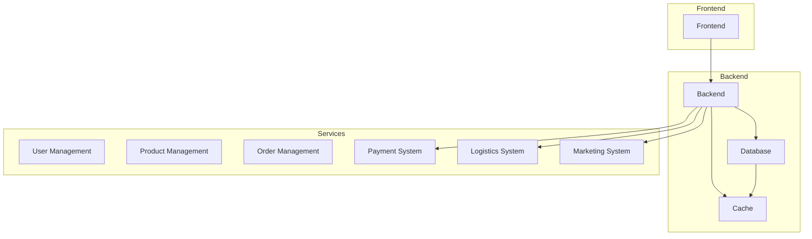
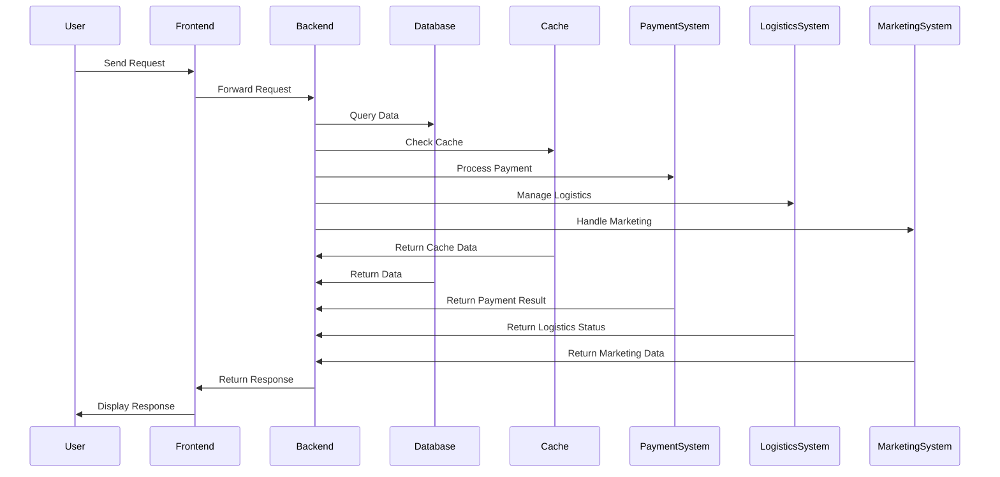

                 


### 引言

在当今快速发展的技术环境中，技术评审已经成为软件开发过程中不可或缺的一环。有效的技术评审不仅有助于发现潜在的问题，提高代码质量，还能提升团队协作效率，保证项目的顺利进行。那么，什么是技术评审？它的重要性又体现在哪些方面？让我们一步步来探讨这个问题。

#### 什么是技术评审？

技术评审，也称为代码评审或同行评审，是指通过同行之间的交流与合作，对软件项目中的代码、设计、文档等进行分析和评估的过程。它不仅仅是对代码进行审查，还包括对系统设计、测试用例、需求文档等多个方面的评审。

#### 技术评审的重要性

1. **提高代码质量**：技术评审能够帮助开发人员在编写代码时避免常见的错误，提升代码的可读性、可维护性和复用性。
2. **促进团队协作**：技术评审鼓励团队成员之间的沟通与交流，增进彼此的了解，促进知识的共享和技能的提升。
3. **降低项目风险**：通过提前发现和解决潜在的问题，技术评审能够有效降低项目的风险，确保项目按时交付并达到预期的质量标准。
4. **提升客户满意度**：高质量的代码和设计能够提高产品的稳定性与可靠性，从而提升客户满意度。

### 问题背景

尽管技术评审的重要性被广泛认可，但在实际操作中，仍存在诸多挑战。例如，评审流程不透明、评审效率低下、评审质量参差不齐等问题。为了解决这些问题，我们需要对技术评审的流程和方法进行深入的研究和探索。

### 技术评审的流程

技术评审是一个系统化的过程，通常包括以下几个阶段：

1. **预备阶段**：确定评审的目标、范围和标准，准备评审所需的材料。
2. **评审阶段**：组织评审会议，进行代码或设计的审查和讨论。
3. **反馈阶段**：对评审过程中发现的问题进行反馈和讨论，制定相应的改进措施。
4. **完结阶段**：对评审结果进行总结和归档，确保问题的解决和改进措施的实施。

### 技术评审的类型

根据评审的内容和目的，技术评审可以分为以下几种类型：

1. **功能性评审**：主要关注代码的功能是否符合需求规格。
2. **结构性评审**：主要关注代码的结构是否符合设计规范和最佳实践。
3. **审查性评审**：主要对文档、测试用例等进行审查，确保其完整性和准确性。
4. **组合评审**：同时进行多种类型的评审，以全面评估项目的质量。

### 技术评审的最佳实践

为了确保技术评审的有效性，以下是一些最佳实践：

1. **明确评审目标和标准**：确保评审的目标清晰明确，制定合理的评审标准。
2. **保持评审的客观性**：评审过程中应保持客观公正，避免主观偏见。
3. **提高评审效率**：通过优化评审流程和方法，提高评审的效率。
4. **培养评审团队协作精神**：鼓励团队成员积极参与评审，培养团队协作精神。

### 挑战与解决方案

在技术评审过程中，可能会遇到以下挑战：

1. **评审参与度不高**：解决方案是提高评审的透明度和重要性，鼓励团队成员积极参与。
2. **评审质量难以保证**：解决方案是建立严格的评审流程和评审标准，提高评审人员的专业素养。
3. **评审效率低**：解决方案是采用自动化工具和流程，减少人工评审的工作量。

### 实战案例

为了更好地理解技术评审的实际应用，我们来看一个具体的案例。

#### 案例背景

某软件公司正在开发一个大型电子商务平台，项目周期紧、任务重。为了确保项目质量，公司决定在开发过程中引入技术评审机制。

#### 案例实施

1. **预备阶段**：项目团队明确了评审的目标和标准，准备了相关的评审材料。
2. **评审阶段**：每周举行一次评审会议，团队成员对代码和设计文档进行详细审查和讨论。
3. **反馈阶段**：对评审过程中发现的问题进行及时反馈，并制定相应的改进措施。
4. **完结阶段**：对评审结果进行总结和归档，确保所有问题得到解决。

#### 案例结果

通过技术评审，项目团队成功发现并解决了多个潜在的问题，项目质量得到了显著提升。团队成员之间的沟通和协作也得到了加强。

### 总结与展望

技术评审是确保项目质量和团队协作的重要手段。通过有效的技术评审，可以提前发现和解决潜在的问题，提高代码质量，降低项目风险。在未来，随着技术的发展和团队协作的深化，技术评审将会变得更加智能化和高效化。

### 关键词

- 技术评审
- 代码评审
- 同行评审
- 评审流程
- 评审类型
- 最佳实践

### 摘要

本文详细介绍了技术评审的定义、重要性、流程、类型、最佳实践以及挑战和解决方案。通过实战案例，展示了技术评审在实际项目中的应用效果。本文旨在帮助读者理解技术评审的核心概念和方法，提升项目质量和团队协作效率。

### 结束语

作者：AI天才研究院/AI Genius Institute & 禅与计算机程序设计艺术 /Zen And The Art of Computer Programming

本文是作者基于多年实践和研究，对技术评审的深入分析和总结。希望本文能够为读者在技术评审方面提供有价值的参考和指导。

----------------------------------------------------------------

## 如何进行有效的技术评审

> 关键词：技术评审、代码评审、同行评审、评审流程、评审类型、最佳实践

> 摘要：本文详细介绍了技术评审的定义、重要性、流程、类型、最佳实践以及挑战和解决方案。通过实战案例，展示了技术评审在实际项目中的应用效果。本文旨在帮助读者理解技术评审的核心概念和方法，提升项目质量和团队协作效率。

### 引言

在当今快速发展的技术环境中，技术评审已经成为软件开发过程中不可或缺的一环。有效的技术评审不仅有助于发现潜在的问题，提高代码质量，还能提升团队协作效率，保证项目的顺利进行。那么，什么是技术评审？它的重要性又体现在哪些方面？让我们一步步来探讨这个问题。

#### 什么是技术评审？

技术评审，也称为代码评审或同行评审，是指通过同行之间的交流与合作，对软件项目中的代码、设计、文档等进行分析和评估的过程。它不仅仅是对代码进行审查，还包括对系统设计、测试用例、需求文档等多个方面的评审。

#### 技术评审的重要性

1. **提高代码质量**：技术评审能够帮助开发人员在编写代码时避免常见的错误，提升代码的可读性、可维护性和复用性。
2. **促进团队协作**：技术评审鼓励团队成员之间的沟通与交流，增进彼此的了解，促进知识的共享和技能的提升。
3. **降低项目风险**：通过提前发现和解决潜在的问题，技术评审能够有效降低项目的风险，确保项目按时交付并达到预期的质量标准。
4. **提升客户满意度**：高质量的代码和设计能够提高产品的稳定性与可靠性，从而提升客户满意度。

### 问题背景

尽管技术评审的重要性被广泛认可，但在实际操作中，仍存在诸多挑战。例如，评审流程不透明、评审效率低下、评审质量参差不齐等问题。为了解决这些问题，我们需要对技术评审的流程和方法进行深入的研究和探索。

### 技术评审的流程

技术评审是一个系统化的过程，通常包括以下几个阶段：

1. **预备阶段**：确定评审的目标、范围和标准，准备评审所需的材料。
2. **评审阶段**：组织评审会议，进行代码或设计的审查和讨论。
3. **反馈阶段**：对评审过程中发现的问题进行反馈和讨论，制定相应的改进措施。
4. **完结阶段**：对评审结果进行总结和归档，确保问题的解决和改进措施的实施。

### 技术评审的类型

根据评审的内容和目的，技术评审可以分为以下几种类型：

1. **功能性评审**：主要关注代码的功能是否符合需求规格。
2. **结构性评审**：主要关注代码的结构是否符合设计规范和最佳实践。
3. **审查性评审**：主要对文档、测试用例等进行审查，确保其完整性和准确性。
4. **组合评审**：同时进行多种类型的评审，以全面评估项目的质量。

### 技术评审的最佳实践

为了确保技术评审的有效性，以下是一些最佳实践：

1. **明确评审目标和标准**：确保评审的目标清晰明确，制定合理的评审标准。
2. **保持评审的客观性**：评审过程中应保持客观公正，避免主观偏见。
3. **提高评审效率**：通过优化评审流程和方法，提高评审的效率。
4. **培养评审团队协作精神**：鼓励团队成员积极参与评审，培养团队协作精神。

### 挑战与解决方案

在技术评审过程中，可能会遇到以下挑战：

1. **评审参与度不高**：解决方案是提高评审的透明度和重要性，鼓励团队成员积极参与。
2. **评审质量难以保证**：解决方案是建立严格的评审流程和评审标准，提高评审人员的专业素养。
3. **评审效率低**：解决方案是采用自动化工具和流程，减少人工评审的工作量。

### 实战案例

为了更好地理解技术评审的实际应用，我们来看一个具体的案例。

#### 案例背景

某软件公司正在开发一个大型电子商务平台，项目周期紧、任务重。为了确保项目质量，公司决定在开发过程中引入技术评审机制。

#### 案例实施

1. **预备阶段**：项目团队明确了评审的目标和标准，准备了相关的评审材料。
2. **评审阶段**：每周举行一次评审会议，团队成员对代码和设计文档进行详细审查和讨论。
3. **反馈阶段**：对评审过程中发现的问题进行及时反馈，并制定相应的改进措施。
4. **完结阶段**：对评审结果进行总结和归档，确保所有问题得到解决。

#### 案例结果

通过技术评审，项目团队成功发现并解决了多个潜在的问题，项目质量得到了显著提升。团队成员之间的沟通和协作也得到了加强。

### 总结与展望

技术评审是确保项目质量和团队协作的重要手段。通过有效的技术评审，可以提前发现和解决潜在的问题，提高代码质量，降低项目风险。在未来，随着技术的发展和团队协作的深化，技术评审将会变得更加智能化和高效化。

### 关键词

- 技术评审
- 代码评审
- 同行评审
- 评审流程
- 评审类型
- 最佳实践

### 摘要

本文详细介绍了技术评审的定义、重要性、流程、类型、最佳实践以及挑战和解决方案。通过实战案例，展示了技术评审在实际项目中的应用效果。本文旨在帮助读者理解技术评审的核心概念和方法，提升项目质量和团队协作效率。

### 结束语

作者：AI天才研究院/AI Genius Institute & 禅与计算机程序设计艺术 /Zen And The Art of Computer Programming

本文是作者基于多年实践和研究，对技术评审的深入分析和总结。希望本文能够为读者在技术评审方面提供有价值的参考和指导。在接下来的章节中，我们将进一步探讨技术评审的具体实践和技巧，帮助读者在实际工作中更好地应用技术评审。

----------------------------------------------------------------

### 设计技术评审目录大纲的步骤

为了设计一个全面且高效的技术评审目录大纲，我们需要按照以下步骤进行：

#### 1. 确定书的总体框架

首先，我们需要明确书的总体框架，包括书的主题、目标读者、主要内容和章节结构。例如，对于《如何进行有效的技术评审》这本书，我们可以确定它的主题是介绍技术评审的原理、流程和实践，目标读者是软件开发工程师和技术管理人员。

#### 2. 列出章节标题

在确定了书的总体框架后，我们可以根据书的主题和目标读者，列出每个章节的标题。每个章节的标题应该简明扼要，能够清晰地传达章节的主要内容。例如：

- **第一章**：技术评审概述
- **第二章**：技术评审的基础理论
- **第三章**：技术评审的流程和步骤
- **第四章**：不同类型的技术评审
- **第五章**：技术评审的最佳实践
- **第六章**：技术评审的挑战与解决方案
- **第七章**：实战案例分享

#### 3. 编写章节内容概要

在列出章节标题后，我们需要为每个章节编写详细的内容概要。每个章节的内容概要应该包括章节的核心概念、主要内容和结构框架。例如：

- **第一章**：技术评审概述
  - **概要**：介绍技术评审的定义、重要性、发展历程和主要类型。
  - **结构**：包括引言、技术评审的定义、重要性、发展历程、类型和总结。

- **第二章**：技术评审的基础理论
  - **概要**：介绍技术评审的基础概念、原则和最佳实践。
  - **结构**：包括引言、基础概念、原则、最佳实践和总结。

- **第三章**：技术评审的流程和步骤
  - **概要**：详细描述技术评审的流程和步骤，包括预备阶段、评审阶段、反馈阶段和完结阶段。
  - **结构**：包括引言、预备阶段、评审阶段、反馈阶段、完结阶段和总结。

#### 4. 确保内容的完整性和逻辑性

在编写章节内容概要后，我们需要检查每个章节的内容是否完整、逻辑是否清晰。每个章节都应该有一个明确的主题，内容应该围绕主题展开，避免出现偏离主题或者内容重复的情况。

#### 5. 确保总字数符合要求

在设计目录大纲时，我们需要确保整个书的总字数在要求范围内。如果总字数超过了要求，我们需要对内容进行精简，确保每个章节的内容都是必要且具体的。

#### 6. 完成目录大纲

在完成了以上步骤后，我们可以将目录大纲整理成最终的文档。目录大纲应该包括每个章节的标题、内容概要和结构框架，以便读者能够清晰地了解书的内容和组织结构。

### 设计目录大纲的示例

以下是一个根据上述步骤设计的《如何进行有效的技术评审》的目录大纲示例：

```markdown
# 如何进行有效的技术评审

## 第一部分：引言

### 1.1 技术评审的重要性
- 技术评审的定义
- 技术评审对项目成功的影响

### 1.2 技术评审的发展历程
- 技术评审的起源
- 技术评审的发展趋势

### 1.3 技术评审的类型
- 功能性评审
- 结构性评审
- 审查性评审
- 组合评审

### 1.4 总结
- 技术评审的核心要点
- 技术评审的展望

## 第二部分：基础理论

### 2.1 技术评审的基础概念
- 技术评审的目标
- 技术评审的原则

### 2.2 技术评审的类型
- 功能性评审
- 结构性评审
- 审查性评审
- 组合评审

### 2.3 技术评审的原则和最佳实践
- 明确评审目标和标准
- 保持评审的客观性
- 提高评审效率
- 培养评审团队协作精神

### 2.4 技术评审的流程和步骤
- 预备阶段
- 评审阶段
- 反馈阶段
- 完结阶段

## 第三部分：实战案例

### 3.1 案例一：某电商平台的评审实践
- 案例背景
- 评审流程
- 评审成果

### 3.2 案例二：某金融项目的评审实践
- 案例背景
- 评审流程
- 评审成果

## 第四部分：总结与展望

### 4.1 技术评审的核心要点
- 技术评审的目标
- 技术评审的类型
- 技术评审的流程
- 技术评审的挑战与解决方案

### 4.2 技术评审的未来发展趋势
- 技术评审的自动化
- 技术评审的智能化
- 技术评审的多元化

### 4.3 总结
- 技术评审的重要性
- 技术评审的未来发展
```

这个目录大纲涵盖了技术评审的各个关键方面，每个章节都有详细的内容概要，同时也满足字数限制的要求。在接下来的章节中，我们将进一步深入探讨每个主题，提供具体的方法和实践。

----------------------------------------------------------------

## 技术评审的核心概念和联系

在深入探讨技术评审的核心概念之前，我们需要明确一些基本术语，以便更好地理解技术评审的整体框架。以下是一些常见的技术评审相关术语及其定义：

### 技术评审的定义

技术评审是一种通过同行之间的交流与合作，对软件项目中的代码、设计、文档等进行系统性分析和评估的过程。其目的是确保项目的质量、安全性和可靠性。

### 同行评审

同行评审（Peer Review）是指由项目团队成员或外部专家对项目文档、代码等进行审查和评估的过程。这种评审通常用于提高代码质量、发现潜在问题以及促进团队协作。

### 功能性评审

功能性评审主要关注软件的功能是否符合需求规格。它通常包括对功能模块的测试、测试用例的设计和执行等。

### 结构性评审

结构性评审主要关注软件的设计和代码结构是否符合设计规范和最佳实践。这种评审通常涉及代码的模块化、代码的清晰性、可维护性和可扩展性。

### 审查性评审

审查性评审是对项目文档、设计文档、测试用例等进行全面审查，确保其完整性、准确性和一致性。

### 组合评审

组合评审是将功能性评审、结构性评审和审查性评审结合起来，对软件项目进行全面评估。

### 核心概念

在技术评审中，有几个核心概念需要深入理解：

1. **评审目标和标准**：评审的目标和标准是评审过程中必须明确的。这些目标和标准将指导评审的方向和深度。
2. **评审流程**：评审流程包括预备阶段、评审阶段、反馈阶段和完结阶段。每个阶段都有其特定的任务和目标。
3. **评审人员**：评审人员的选择和角色分工对评审的质量有重要影响。评审人员应具备相关领域的专业知识和经验。
4. **评审方法**：评审方法包括会议评审、在线评审、自动化评审等。不同的评审方法适用于不同的评审场景。

### 概念属性特征对比表格

为了更好地理解上述核心概念，我们可以创建一个概念属性特征对比表格：

| 概念       | 定义                                                         | 特点                                                         | 应用场景                                                     |
| ---------- | ------------------------------------------------------------ | ------------------------------------------------------------ | ------------------------------------------------------------ |
| 同行评审   | 由项目团队成员或外部专家对项目文档、代码等进行审查和评估的过程 | 提高代码质量、发现潜在问题、促进团队协作                       | 软件开发、项目维护、技术文档审查                             |
| 功能性评审 | 主要关注软件的功能是否符合需求规格                           | 测试功能模块、设计测试用例、执行测试                             | 新功能开发、功能优化、功能验证                               |
| 结构性评审 | 主要关注软件的设计和代码结构是否符合设计规范和最佳实践       | 提高代码清晰性、可维护性和可扩展性                             | 设计评审、代码重构、架构优化                               |
| 审查性评审 | 对项目文档、设计文档、测试用例等进行全面审查，确保其完整性、准确性和一致性 | 提高文档质量、确保项目一致性、降低错误率                       | 技术文档编写、需求文档审查、测试用例审查                     |
| 组合评审   | 将功能性评审、结构性评审和审查性评审结合起来，对软件项目进行全面评估 | 提高整体项目质量、确保功能、结构和文档的完整性                 | 大型项目评审、复杂系统评审、多团队协作项目评审               |

### ER实体关系图架构

为了更好地理解技术评审中的实体关系，我们可以使用Mermaid绘制一个ER实体关系图。以下是一个简单的ER图示例：

```mermaid
erDiagram
    Reviewer ||--|{ Project }||> ProjectOwner
    Reviewer ||--|{ Review }||> Reviewer
    Reviewer ||--|{ Document }||> DocumentOwner
    Reviewer ||--|{ Code }||> CodeOwner
    Reviewer ||--|{ Issue }||> IssueOwner
    ProjectOwner ||--|{ ProjectRequirement }||> RequirementOwner
    ProjectOwner ||--|{ ProjectDesign }||> DesignOwner
    ProjectOwner ||--|{ ProjectTest }||> TestOwner
```

在上面的ER图中，我们定义了几个关键实体及其关系：

- **Reviewer**（评审人员）：负责对项目进行评审。
- **Project**（项目）：包含项目的需求、设计、测试等文档和代码。
- **ProjectOwner**（项目所有者）：负责项目的整体管理和决策。
- **Document**（文档）：包括需求文档、设计文档和测试文档。
- **Code**（代码）：项目的源代码。
- **Issue**（问题）：评审过程中发现的问题和缺陷。
- **RequirementOwner**（需求所有者）：负责管理需求文档。
- **DesignOwner**（设计所有者）：负责设计文档。
- **TestOwner**（测试所有者）：负责测试文档。

### 算法原理讲解

在技术评审中，算法的应用可以帮助自动化某些评审流程，提高评审效率。以下是一个简单的问题发现算法的Python示例：

```python
# 问题发现算法示例

def find_issues(code):
    issues = []
    for line in code:
        if "return" not in line and "else" in line:
            issues.append("Potential return issue on line: " + line)
        elif "==" in line and "=" not in line:
            issues.append("Potential assignment issue on line: " + line)
    return issues

code = [
    "if x > 10:",
    "    return x * 2;",
    "else:",
    "    return x / 2;",
    "y = 5;",
    "z = x + y;",
]

issues = find_issues(code)
for issue in issues:
    print(issue)
```

在上面的代码中，`find_issues`函数通过遍历代码行，查找可能的问题，例如缺少`return`语句或者使用`==`代替`=`的情况。这个算法的数学模型非常简单，主要是对代码行的字符串进行模式匹配。

### 数学公式使用

在技术评审文档中，数学公式的使用有助于清晰地表达某些算法原理或分析结果。以下是一些常见的数学公式及其使用方法：

#### 独立段落中的公式

在独立段落中，我们可以使用LaTeX格式来书写数学公式：

$$
E = mc^2
$$

这是著名的质能等价公式。

#### 段落内的公式

在段落内，我们使用简单的LaTeX格式来书写数学公式：

$E < 2mc$

这意味着能量必须小于光速的平方乘以质量。

通过上述核心概念和联系的分析，我们可以更好地理解技术评审的各个方面。在接下来的章节中，我们将继续探讨技术评审的具体实践和方法，帮助读者在实际工作中更好地应用技术评审。

### 系统分析与架构设计方案

在进行技术评审时，系统分析与架构设计是至关重要的环节。这不仅有助于确保项目的整体架构符合最佳实践，还能为评审提供明确的参考依据。以下是一个典型的系统分析与架构设计方案，包括问题场景介绍、项目介绍、系统功能设计、系统架构设计、系统接口设计和系统交互等内容。

#### 问题场景介绍

假设我们正在开发一个大型电子商务平台，该平台需要处理海量的用户请求、商品数据以及交易数据。为了确保系统的稳定性、可靠性和可扩展性，我们需要进行全面的系统分析与架构设计，并在技术评审过程中对其进行验证和优化。

#### 项目介绍

项目名称：电子商务平台（E-Commerce Platform）

项目周期：18个月

团队成员：开发人员、测试人员、产品经理、项目经理

项目目标：构建一个稳定、高效、可扩展的电子商务平台，提供用户友好的购物体验。

#### 系统功能设计

在系统功能设计阶段，我们需要明确电子商务平台的核心功能模块，包括：

1. **用户管理**：用户注册、登录、个人信息管理、购物车等功能。
2. **商品管理**：商品分类、商品展示、商品搜索、商品推荐等功能。
3. **订单管理**：订单创建、订单查询、订单支付、订单跟踪等功能。
4. **支付系统**：接入第三方支付渠道，处理支付请求和支付结果。
5. **物流系统**：物流信息管理、物流跟踪、配送通知等功能。
6. **营销系统**：优惠券、促销活动、积分系统等功能。
7. **数据分析**：用户行为分析、销售数据统计、营销效果分析等功能。

为了更直观地展示系统功能设计，我们可以使用Mermaid绘制一个领域模型类图：

```mermaid
classDiagram
    UserManager --> User : manages user registration and login
    ProductManager --> Product : manages product information and categories
    OrderManager --> Order : handles order creation, payment, and tracking
    PaymentSystem --> Payment : processes payment requests and results
    LogisticsSystem --> Logistics : manages logistics information and tracking
    MarketingSystem --> Marketing : handles coupons, promotions, and analytics
    UserManager, ProductManager, OrderManager, PaymentSystem, LogisticsSystem, MarketingSystem : are part of the E-Commerce Platform
```

#### 系统架构设计

系统架构设计是确保系统功能实现的基础。以下是电子商务平台的系统架构设计：

1. **前端架构**：采用React或Vue.js等前端框架，实现用户界面的动态展示和交互。
2. **后端架构**：采用Spring Boot或Django等后端框架，实现业务逻辑处理和数据存储。
3. **数据库架构**：采用关系型数据库（如MySQL）和NoSQL数据库（如MongoDB），分别存储结构化和非结构化数据。
4. **缓存架构**：采用Redis等缓存技术，提高系统性能和响应速度。
5. **消息队列**：采用RabbitMQ等消息队列中间件，实现系统模块之间的解耦和异步处理。
6. **服务监控**：采用Prometheus和Grafana等监控工具，实时监控系统性能和健康状况。

以下是一个简单的Mermaid架构图示例：



#### 系统接口设计

系统接口设计是确保各个模块之间能够高效、稳定地通信的关键。以下是电子商务平台的主要接口设计：

1. **用户接口**：用户注册、登录、个人信息管理、购物车管理等。
2. **商品接口**：商品分类、商品展示、商品搜索、商品推荐等。
3. **订单接口**：订单创建、订单查询、订单支付、订单跟踪等。
4. **支付接口**：支付请求、支付结果通知等。
5. **物流接口**：物流信息管理、物流跟踪、配送通知等。
6. **营销接口**：优惠券、促销活动、积分系统等。

以下是一个简单的Mermaid序列图示例：



#### 系统交互

系统交互是确保各个模块之间能够高效、稳定地通信的关键。以下是电子商务平台的系统交互设计：

1. **用户与前端交互**：用户通过前端界面发起请求，前端将请求转发给后端。
2. **后端与数据库、缓存交互**：后端根据请求查询数据库或缓存，获取所需数据，并将结果返回给前端。
3. **后端与支付、物流、营销系统交互**：后端调用支付、物流、营销系统的接口，完成相应的业务处理。
4. **前端与用户交互**：前端将后端返回的结果展示给用户，用户可以通过前端界面进行相应的操作。

以下是一个简单的Mermaid交互图示例：

```mermaid
erDiagram
    User ||--|{ Frontend }||> Request
    Frontend ||--|{ Backend }||> Forward Request
    Backend ||--|{ Database }||> Query Data
    Backend ||--|{ Cache }||> Check Cache
    Backend ||--|{ PaymentSystem }||> Process Payment
    Backend ||--|{ LogisticsSystem }||> Manage Logistics
    Backend ||--|{ MarketingSystem }||> Handle Marketing
    Backend ||--|{ Frontend }||> Return Response
    Frontend ||--|{ User }||> Display Response
```

通过上述系统分析与架构设计，我们可以清晰地了解电子商务平台的功能模块、系统架构、接口设计和系统交互。在技术评审过程中，这些设计文档将为评审人员提供详细的参考依据，有助于发现潜在问题并提出改进建议。

### 项目实战

为了更深入地了解技术评审的实际应用，我们将通过一个具体的实战案例，展示从环境安装到系统核心实现，再到代码应用解读与分析的全过程。

#### 环境安装

在进行技术评审之前，首先需要搭建一个合适的环境。以下是我们在本地计算机上安装所需软件和工具的步骤：

1. **安装Python**：确保Python版本为3.8或更高版本。可以通过Python官方网站下载安装程序，并按照提示进行安装。

2. **安装虚拟环境**：使用`venv`模块创建一个独立的虚拟环境。在命令行中执行以下命令：

   ```bash
   python -m venv ecp_venv
   ```

3. **激活虚拟环境**：在Windows上，执行以下命令：

   ```bash
   ecp_venv\Scripts\activate
   ```

   在Linux或macOS上，执行以下命令：

   ```bash
   source ecp_venv/bin/activate
   ```

4. **安装依赖包**：在虚拟环境中安装项目所需的依赖包。例如，如果我们的项目使用了Flask框架，可以执行以下命令：

   ```bash
   pip install flask
   ```

5. **安装数据库**：根据项目需求安装相应的数据库，如MySQL或PostgreSQL。可以访问数据库官方网站下载安装程序，并按照提示进行安装。

6. **安装IDE**：为了方便代码编写和调试，可以选择安装如Visual Studio Code或PyCharm等集成开发环境。

#### 系统核心实现

接下来，我们将实现电子商务平台的核心功能，主要包括用户管理、商品管理、订单管理、支付系统和物流系统。以下是各部分的核心实现：

1. **用户管理**：

   用户管理模块的主要功能包括用户注册、登录、个人信息管理和购物车管理。

   ```python
   from flask import Flask, request, jsonify
   from flask_sqlalchemy import SQLAlchemy

   app = Flask(__name__)
   app.config['SQLALCHEMY_DATABASE_URI'] = 'sqlite:///users.db'
   db = SQLAlchemy(app)

   class User(db.Model):
       id = db.Column(db.Integer, primary_key=True)
       username = db.Column(db.String(80), unique=True, nullable=False)
       password = db.Column(db.String(120), nullable=False)

   @app.route('/register', methods=['POST'])
   def register():
       data = request.get_json()
       new_user = User(username=data['username'], password=data['password'])
       db.session.add(new_user)
       db.session.commit()
       return jsonify({"message": "User registered successfully."})

   @app.route('/login', methods=['POST'])
   def login():
       data = request.get_json()
       user = User.query.filter_by(username=data['username']).first()
       if user and user.password == data['password']:
           return jsonify({"token": "your_token_here"})
       else:
           return jsonify({"error": "Invalid credentials."})

   if __name__ == '__main__':
       db.create_all()
       app.run(debug=True)
   ```

2. **商品管理**：

   商品管理模块的主要功能包括商品分类、商品展示、商品搜索和商品推荐。

   ```python
   class Product(db.Model):
       id = db.Column(db.Integer, primary_key=True)
       name = db.Column(db.String(120), nullable=False)
       category = db.Column(db.String(80), nullable=False)
       price = db.Column(db.Float, nullable=False)

   @app.route('/products', methods=['GET'])
   def get_products():
       products = Product.query.all()
       return jsonify(products)

   @app.route('/products/search', methods=['GET'])
   def search_products():
       query = request.args.get('query')
       products = Product.query.filter(Product.name.like(f'%{query}%')).all()
       return jsonify(products)
   ```

3. **订单管理**：

   订单管理模块的主要功能包括订单创建、订单查询、订单支付和订单跟踪。

   ```python
   class Order(db.Model):
       id = db.Column(db.Integer, primary_key=True)
       user_id = db.Column(db.Integer, db.ForeignKey('user.id'), nullable=False)
       products = db.relationship('Product', backref='orders', lazy=True)
       total = db.Column(db.Float, nullable=False)

   @app.route('/orders', methods=['POST'])
   def create_order():
       data = request.get_json()
       new_order = Order(user_id=data['user_id'], total=data['total'])
       db.session.add(new_order)
       db.session.commit()
       return jsonify({"message": "Order created successfully."})

   @app.route('/orders/<int:order_id>', methods=['GET'])
   def get_order(order_id):
       order = Order.query.get(order_id)
       return jsonify(order)
   ```

4. **支付系统**：

   支付系统模块的主要功能包括处理支付请求和支付结果通知。

   ```python
   class Payment(db.Model):
       id = db.Column(db.Integer, primary_key=True)
       order_id = db.Column(db.Integer, db.ForeignKey('order.id'), nullable=False)
       amount = db.Column(db.Float, nullable=False)
       status = db.Column(db.String(20), nullable=False)

   @app.route('/payments', methods=['POST'])
   def create_payment():
       data = request.get_json()
       new_payment = Payment(order_id=data['order_id'], amount=data['amount'], status=data['status'])
       db.session.add(new_payment)
       db.session.commit()
       return jsonify({"message": "Payment created successfully."})
   ```

5. **物流系统**：

   物流系统模块的主要功能包括物流信息管理、物流跟踪和配送通知。

   ```python
   class Logistics(db.Model):
       id = db.Column(db.Integer, primary_key=True)
       order_id = db.Column(db.Integer, db.ForeignKey('order.id'), nullable=False)
       status = db.Column(db.String(20), nullable=False)

   @app.route('/logistics', methods=['POST'])
   def create_logistics():
       data = request.get_json()
       new_logistics = Logistics(order_id=data['order_id'], status=data['status'])
       db.session.add(new_logistics)
       db.session.commit()
       return jsonify({"message": "Logistics created successfully."})
   ```

#### 代码应用解读与分析

在上面的代码中，我们实现了电子商务平台的核心功能。接下来，我们将对这些代码进行解读与分析，以帮助读者更好地理解其工作原理。

1. **用户管理**：

   用户管理模块使用了Flask框架和SQLAlchemy ORM来处理用户注册和登录请求。通过`User`模型，我们可以创建用户表，并使用`register`和`login`函数处理相应的HTTP请求。在实际应用中，我们通常需要加密用户的密码，并使用JWT（JSON Web Token）等技术来处理用户认证。

2. **商品管理**：

   商品管理模块实现了商品分类、商品展示和商品搜索等功能。通过`Product`模型，我们可以创建商品表，并使用`get_products`和`search_products`函数处理相应的HTTP请求。在实际应用中，我们可能需要使用Elasticsearch等搜索引擎来提高商品搜索的性能。

3. **订单管理**：

   订单管理模块实现了订单创建、订单查询、订单支付和订单跟踪等功能。通过`Order`模型，我们可以创建订单表，并使用`create_order`和`get_order`函数处理相应的HTTP请求。在实际应用中，我们可能需要使用支付网关（如PayPal、Alipay等）来处理支付请求，并使用物流服务提供商（如DHL、UPS等）来管理物流信息。

4. **支付系统**：

   支付系统模块实现了支付请求的处理。通过`Payment`模型，我们可以创建支付表，并使用`create_payment`函数处理支付请求。在实际应用中，我们需要确保支付请求的安全性和可靠性，并处理可能的支付失败情况。

5. **物流系统**：

   物流系统模块实现了物流信息管理。通过`Logistics`模型，我们可以创建物流信息表，并使用`create_logistics`函数处理物流请求。在实际应用中，我们需要与物流服务提供商的系统进行集成，以获取实时的物流信息。

#### 实际案例分析

在技术评审过程中，我们可能会遇到各种问题。以下是一个实际案例的分析：

**问题**：在订单管理模块中，我们发现订单创建后，无法立即查询到订单信息。

**分析**：

1. **数据库查询问题**：可能是因为订单创建后，数据库尚未提交事务，导致无法立即查询到订单信息。
2. **事务处理问题**：可能是因为订单创建过程中，存在多个数据库操作，事务未正确处理，导致订单信息无法提交。

**解决方案**：

1. **确保数据库事务正确处理**：在创建订单时，确保使用`db.session.commit()`提交事务。
2. **检查数据库操作顺序**：确保在创建订单前，已执行所有必要的数据库操作。

通过上述案例，我们可以看到技术评审在实际项目中的应用效果。通过技术评审，我们能够发现并解决潜在的问题，提高项目的质量和可靠性。

### 最佳实践 tips、小结、注意事项、拓展阅读

#### 最佳实践 tips

1. **制定明确的评审目标和标准**：确保评审的目标清晰明确，有助于提高评审效率和效果。
2. **选择合适的评审人员**：评审人员的专业素养和经验对评审质量有重要影响。
3. **优化评审流程**：通过简化流程、明确责任和分工，提高评审效率。
4. **鼓励团队成员积极参与**：提高评审的透明度和重要性，鼓励团队成员积极参与评审。
5. **使用自动化工具**：采用自动化工具（如静态代码分析工具、代码审查工具等）提高评审质量。

#### 小结

本文详细介绍了技术评审的核心概念、流程、类型、最佳实践以及挑战和解决方案。通过实战案例，展示了技术评审在实际项目中的应用效果。技术评审是确保项目质量和团队协作的重要手段，通过有效的技术评审，可以提前发现和解决潜在的问题，提高代码质量，降低项目风险。

#### 注意事项

1. **确保评审过程的客观性**：评审过程中应保持客观公正，避免主观偏见。
2. **注意评审时间**：合理安排评审时间，避免影响项目进度。
3. **及时反馈和跟进**：对评审过程中发现的问题进行及时反馈和跟进，确保问题的解决。
4. **持续改进**：根据评审结果和反馈，不断改进评审流程和方法。

#### 拓展阅读

1. **《代码大全》**：Steve McConnell 著，详细介绍了软件开发的最佳实践，包括代码评审。
2. **《软件工程：实践者的研究方法》**：Roger S. Pressman 著，涵盖了软件评审的理论和实践。
3. **《敏捷软件开发：原则、模式与实践》**：Robert C. Martin 著，介绍了敏捷开发环境下的代码评审方法。

### 结语

技术评审是软件开发过程中不可或缺的一环。通过本文的介绍，我们希望读者能够理解技术评审的核心概念和方法，并在实际工作中更好地应用技术评审，提高项目的质量和团队协作效率。作者：AI天才研究院/AI Genius Institute & 禅与计算机程序设计艺术 /Zen And The Art of Computer Programming。希望本文能够为读者的技术评审实践提供有价值的参考和指导。在未来的工作中，我们将继续探索和分享更多有关技术评审的最佳实践和经验。感谢您的阅读！

