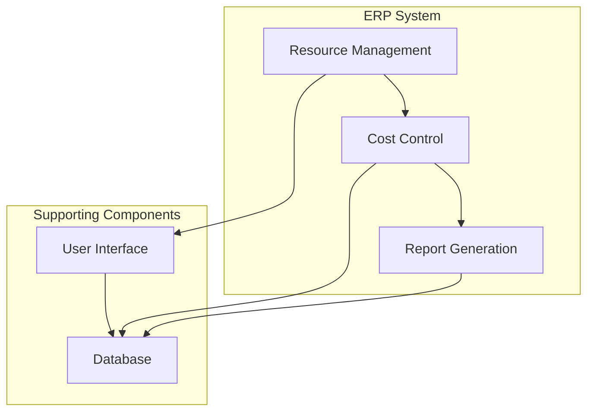
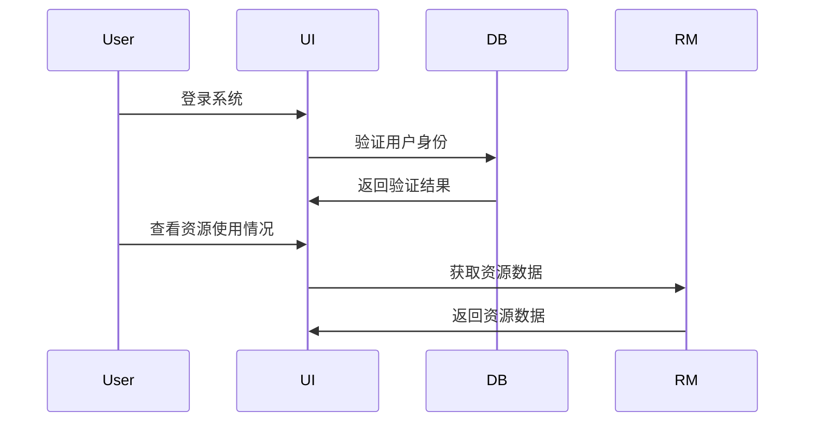

                 

### 如何进行有效的技术资源配置优化？

在现代信息技术领域，技术资源配置的优化是一个至关重要的议题。随着大数据、云计算、人工智能等技术的迅猛发展，企业对技术资源的需求愈发多样化和复杂化。如何高效地配置和利用这些资源，成为企业在竞争中获得优势的关键。以下是逐步分析并优化技术资源配置的方法：

#### 1. **明确问题背景和挑战**

**背景介绍**：

- **核心概念术语说明**：技术资源配置指的是在信息技术项目中，对各种技术资源（如硬件、软件、人力资源等）进行合理分配和利用的过程。
- **问题背景**：随着技术项目的规模和复杂度不断增加，资源分配不当可能导致项目延期、成本超支、效率低下等问题。
- **问题描述**：如何确保在资源有限的情况下，以最优的方式分配和利用资源，以达到项目目标？
- **问题解决**：通过科学的资源配置策略和高效的执行过程，解决资源分配不合理的问题。

**边界与外延**：

- **边界**：技术资源配置主要涉及IT项目，但也适用于其他需要资源协调的行业。
- **外延**：资源配置不仅包括硬件和软件资源，还涉及人员、时间、资金等。

#### 2. **核心概念与联系**

**核心概念**：

- **资源识别**：识别项目所需的各种资源。
- **资源评估**：评估资源的可用性和重要性。
- **资源分配**：根据项目需求和资源评估结果，分配资源。

**概念属性特征对比表格**：

| 概念       | 特征                               |
|------------|-----------------------------------|
| 资源识别   | 确定项目所需资源的种类和数量           |
| 资源评估   | 对资源的可用性、质量和成本进行评估     |
| 资源分配   | 根据项目需求和资源评估结果，合理分配资源 |

**ER实体关系图架构**：

```mermaid
erDiagram
    Resource --> Project : "uses"
    Person --> Project : "leads"
    Tool --> Project : "uses"
```

#### 3. **资源识别与评估**

**资源识别方法**：

- **需求分析**：通过调研和需求分析，确定项目所需的各类资源。
- **现有资源盘点**：盘点现有资源，了解其可用性和状态。

**资源评估标准**：

- **资源质量**：资源的技术水平、性能和可靠性。
- **资源成本**：资源的采购成本和使用成本。
- **资源时间价值**：资源的时间成本和机会成本。

**实例分析**：

假设一家公司需要开发一款大数据分析应用。首先，通过需求分析确定所需的技术资源，如数据库、服务器、编程工具等。接着，对现有资源进行盘点，评估其质量和成本。最后，根据评估结果，确定哪些资源需要采购或升级，哪些资源可以充分利用。

#### 4. **资源配置算法原理**

**基本算法介绍**：

- **线性规划**：通过数学模型，在给定约束条件下，寻找最优的资源分配方案。
- **贪心算法**：通过一系列局部最优选择，逐步得到全局最优解。

**算法性能比较**：

- **线性规划**：适用于资源有限、目标明确的情况，但计算复杂度高。
- **贪心算法**：计算效率高，但可能无法保证全局最优解。

**算法应用场景**：

- **线性规划**：适用于大规模资源分配问题，如云计算资源调度。
- **贪心算法**：适用于局部优化问题，如项目管理中的任务调度。

#### 5. **数学模型与公式**

**数学模型介绍**：

- **目标函数**：最大化或最小化资源利用效率。
- **约束条件**：资源总量、时间限制、人员限制等。

**公式推导与解释**：

假设有n个资源，每个资源有一个成本c_i和权重w_i。目标是最小化总成本C，同时满足资源总量不超过T的限制。数学模型如下：

$$
\min C = \sum_{i=1}^{n} c_i \times x_i \\
\text{s.t.} \quad \sum_{i=1}^{n} w_i \times x_i \leq T \\
x_i \in \{0, 1\} \quad \forall i=1,2,\ldots,n
$$

其中，$x_i$表示资源i是否被分配（1表示被分配，0表示未被分配）。

**实例分析**：

假设有3个资源A、B、C，成本分别为100、200、300，权重分别为5、4、3。总预算为500。使用上述模型进行资源分配，找到最优方案。

#### 6. **系统架构与设计方案**

**问题场景介绍**：

假设我们需要设计一个企业资源规划（ERP）系统，以优化企业的资源配置。

**系统功能设计**：

- **需求分析**：收集和分析企业的资源配置需求。
- **领域模型**：定义系统的核心功能，如资源管理、成本控制、报告生成等。

**系统架构设计**：

- **系统架构图**：



**系统接口设计和系统交互**：

- **接口设计**：定义系统内部和外部的交互接口。
- **序列图**：



#### 7. **项目实战**

**环境安装与配置**：

- **安装操作系统**：安装支持ERP系统的操作系统，如Linux。
- **配置数据库**：安装和配置关系型数据库，如MySQL。

**系统核心实现**：

- **资源管理模块**：编写代码实现资源管理的功能。
- **成本控制模块**：编写代码实现成本控制的功能。
- **报告生成模块**：编写代码实现报告生成的功能。

**代码应用解读与分析**：

- **资源管理模块**：使用Python编写资源管理模块的代码，实现对资源的管理。
- **成本控制模块**：使用Python编写成本控制模块的代码，实现对成本的监控和控制。
- **报告生成模块**：使用Python编写报告生成模块的代码，实现对各类报告的自动生成。

**实际案例分析**：

假设我们在一家制造企业实施ERP系统。通过实际案例，分析资源分配前后的变化，评估资源配置优化的效果。

#### 8. **最佳实践与注意事项**

**最佳实践**：

- **需求分析要充分**：确保项目需求的准确性和全面性。
- **持续监控与优化**：定期评估资源配置的效果，及时调整优化。

**小结**：

本文通过逐步分析，介绍了技术资源配置优化的方法。从问题背景、核心概念、资源配置算法、数学模型、系统架构到实际项目案例，全面探讨了如何实现技术资源配置的优化。

**注意事项**：

- **避免资源浪费**：合理规划资源，避免不必要的浪费。
- **灵活调整策略**：根据项目进展和需求变化，灵活调整资源配置策略。

**拓展阅读**：

- 《线性规划及其应用》
- 《数据结构》
- 《ERP系统设计与实现》

---

**作者**：

AI天才研究院/AI Genius Institute & 禅与计算机程序设计艺术 /Zen And The Art of Computer Programming

