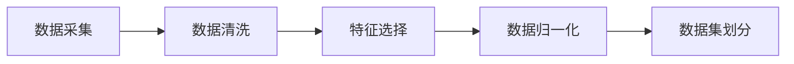
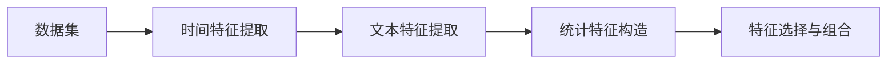
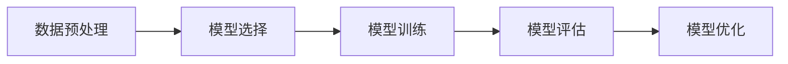
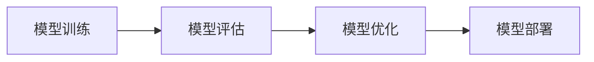
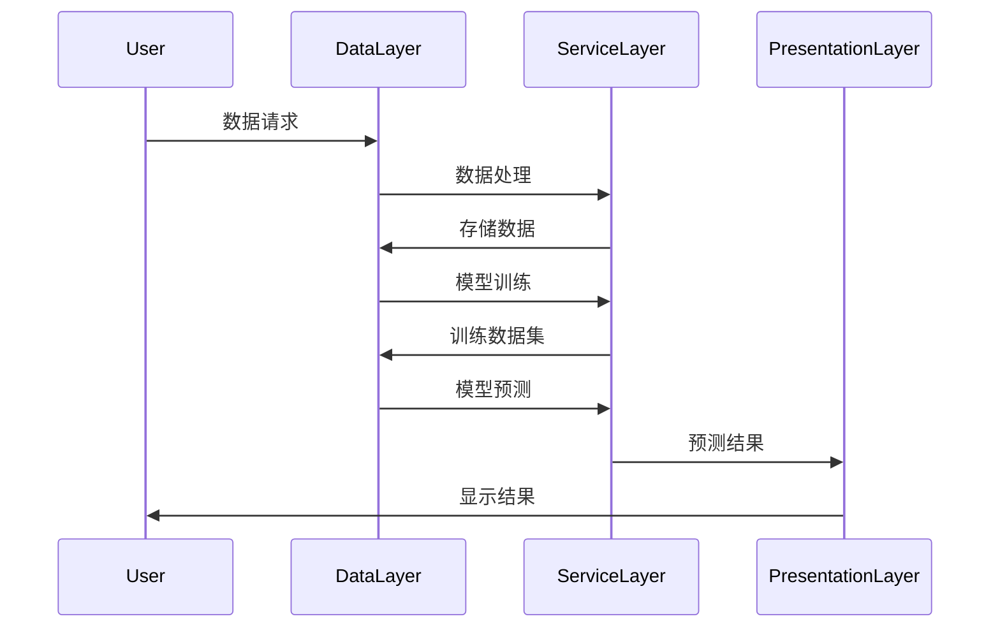
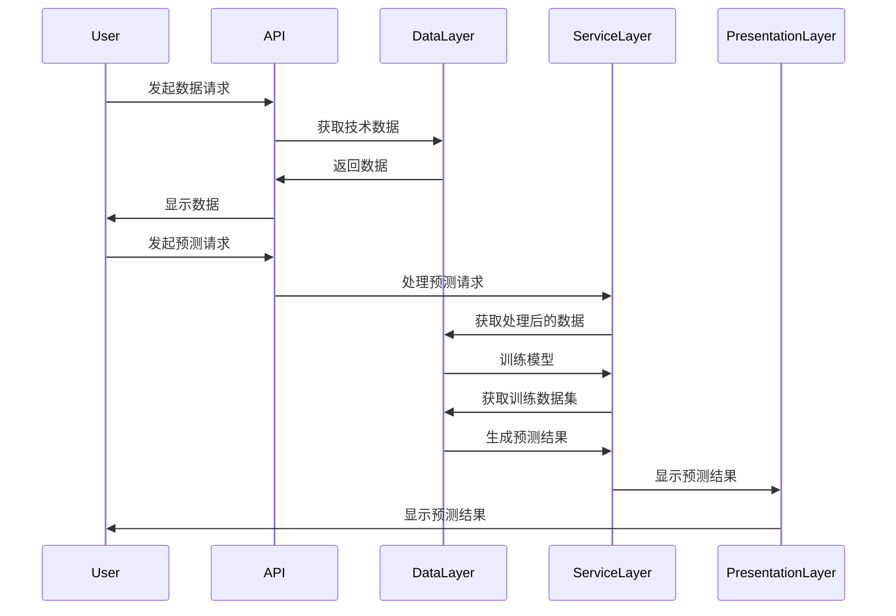

                 

### 引言

随着信息技术的飞速发展，技术趋势预测已经成为企业和个人决策的重要依据。它不仅帮助企业在竞争激烈的市场中把握先机，还能为个人职业发展提供有价值的参考。技术趋势预测，简单来说，就是通过分析历史数据和当前状况，预测未来可能出现的技术发展动向。然而，如何在复杂多变的环境中准确预测技术趋势，仍然是一个极具挑战性的问题。

本篇文章旨在探讨如何进行有效的技术趋势预测。我们将从多个维度出发，逐步分析技术趋势预测的重要概念、核心算法原理、数学模型与公式，以及实际系统架构和项目实战。具体来说，文章将分为以下几个部分：

1. **背景介绍**：介绍技术趋势预测的定义、重要性以及当前面临的挑战。
2. **核心概念与联系**：详细阐述技术趋势预测中的关键概念及其相互关系。
3. **算法原理讲解**：讲解用于技术趋势预测的主要算法，并通过具体案例进行分析。
4. **数学模型与公式**：介绍技术趋势预测中常用的数学模型和公式，并用Python代码示例进行说明。
5. **系统分析与架构设计方案**：展示一个实际的技术趋势预测系统，并详细阐述其设计原理。
6. **项目实战**：通过一个实际案例，展示技术趋势预测的完整实施过程。
7. **最佳实践与总结**：总结最佳实践，提供注意事项，并推荐拓展阅读。

通过这一系列的探讨，我们希望能够帮助读者深入了解技术趋势预测的原理和方法，提升在技术领域中的洞察力和决策能力。

### 背景介绍

#### 技术趋势预测的定义

技术趋势预测，通常指的是通过对历史数据、当前技术环境以及未来潜在影响的综合分析，来预测某一特定技术或技术领域在未来的发展动态和趋势。它不仅仅是对未来可能的趋势进行推测，更是一个系统性、科学性的分析过程。技术趋势预测的核心在于利用数据分析和机器学习等方法，从大量的信息中提取出有价值的模式和规律。

在信息技术快速迭代的今天，技术趋势预测的重要性愈发凸显。它不仅能帮助企业把握市场动态，提前布局，还能帮助个人在职业发展中做出明智的决策。例如，对于一个软件开发者来说，了解哪些编程语言或技术在未来几年内可能会流行，可以更好地规划自己的学习路径和职业发展方向。

#### 技术趋势预测的历史与发展

技术趋势预测并非一个新兴的概念，它有着悠久的历史。在早期，人们主要是通过专家经验和直觉来预测技术趋势。例如，在20世纪60年代，许多专家预测计算机硬件的发展将主要依赖于更快的处理器和更大的存储容量。然而，随着信息技术的发展，特别是大数据和人工智能的兴起，技术趋势预测的方法和工具变得更加科学和精确。

20世纪末到21世纪初，随着互联网的普及，技术趋势预测迎来了新的发展契机。数据的可获得性和处理能力的提升，使得机器学习和数据挖掘技术得到了广泛应用。这一时期，许多企业和研究机构开始使用先进的算法和模型来分析历史数据，预测未来技术趋势。

近年来，随着大数据、人工智能和区块链等新兴技术的不断涌现，技术趋势预测的方法和工具也得到了极大的改进。现在，技术趋势预测不仅依赖于历史数据和机器学习算法，还包括对市场动态、政策法规、社会文化等多方面因素的综合分析。

#### 当前技术趋势预测的现状与挑战

当前，技术趋势预测已经成为企业和研究机构重要的战略工具。许多大型科技公司，如Google、Microsoft、Amazon等，都设有专门的团队和研究机构，专注于技术趋势的预测和分析。这些公司利用海量数据、先进的算法和机器学习模型，不断更新和优化其预测模型，以指导其研发和战略布局。

然而，技术趋势预测仍然面临诸多挑战。首先，数据的质量和完整性是预测准确性的关键。如果数据存在偏差或缺失，预测结果可能会失真。其次，技术的快速发展使得预测周期不断缩短，传统的预测方法可能无法适应这种快速变化的环境。此外，技术趋势的预测还需要考虑到多种不确定因素，如政策变动、经济环境变化等。

总之，技术趋势预测在当前信息技术环境中具有重要的应用价值。尽管面临诸多挑战，但通过不断改进方法和技术，我们可以更好地把握技术发展的趋势，为企业和个人提供更精准的决策支持。

### 趋势预测的应用领域

技术趋势预测在多个领域中具有广泛的应用，这些领域不仅涵盖了企业的战略决策，还包括个人的职业规划和社会发展的预测。以下是一些关键应用领域及其具体案例：

#### 1. 企业战略规划

在企业战略规划中，技术趋势预测帮助公司了解未来技术环境的变化，从而提前布局，抓住市场机会。例如，某大型科技公司通过分析物联网、云计算和人工智能等技术的发展趋势，预测到这些技术在未来的市场需求将大幅增长。因此，该公司提前投入资源，开发相关产品和服务，最终在市场中占据了有利位置。

#### 2. 投资与风险管理

技术趋势预测在投资和风险管理中扮演着重要角色。投资者可以利用趋势预测模型来评估新兴技术的前景，从而做出更明智的投资决策。例如，某投资公司通过分析区块链技术在金融领域的应用趋势，发现其在支付、清算和风险管理等方面具有巨大潜力。基于这一预测，该公司加大了对区块链相关初创企业的投资，获得了可观的回报。

#### 3. 创新与研发

技术趋势预测对于创新和研发活动至关重要。研究机构和科技公司可以通过预测未来可能的技术趋势，提前开展相关研发工作，抢占市场先机。例如，某科技公司通过预测5G技术的快速发展，提前布局5G芯片的研发，并在市场正式推出5G服务前，成功推出了首款5G手机，赢得了市场份额。

#### 4. 个人职业规划

对于个人职业规划，技术趋势预测同样具有重要指导意义。了解哪些技术在未来会持续发展，可以帮助个人更好地规划学习路径和职业发展。例如，某软件工程师通过分析大数据、机器学习和云计算等技术的发展趋势，决定专注于机器学习领域的学习，并逐步转型为数据科学家，最终实现了职业发展的突破。

#### 5. 社会发展趋势预测

技术趋势预测还可以应用于社会发展趋势的预测，帮助政策制定者和社会组织了解未来社会的发展方向。例如，通过预测人工智能技术的发展趋势，可以预测其在医疗、教育、交通等领域的应用前景，从而为相关领域的政策制定提供依据。

#### 6. 环境与可持续发展

技术趋势预测还可以用于环境与可持续发展领域。通过预测新能源技术、环保材料等技术的发展趋势，可以帮助社会实现绿色、可持续的发展目标。例如，某研究机构通过预测太阳能和风能技术的发展趋势，提出了相关政策和投资建议，推动了可再生能源的广泛应用。

总之，技术趋势预测在多个领域都有重要的应用价值。通过准确预测未来技术发展的趋势，企业和个人可以更好地应对市场变化，实现长远发展。同时，社会也可以通过技术趋势预测，为未来的政策制定和社会规划提供科学依据。

### 核心概念与联系

在进行技术趋势预测的过程中，理解一些核心概念和它们之间的联系是非常重要的。这些概念包括技术周期、技术成熟度曲线和机器学习在趋势预测中的应用。在本节中，我们将详细阐述这些概念，并通过表格和ER图展示它们之间的联系。

#### 技术周期

技术周期（Technological Cycle）是指从一项新技术概念的提出、研发、市场推广到技术成熟并最终被市场广泛接受的全过程。技术周期通常分为几个阶段，包括：

1. **研究与发展阶段**：新技术概念被提出，并进行基础研究。
2. **开发阶段**：技术开发和原型设计。
3. **市场导入阶段**：新产品或技术开始进入市场，并逐步获得用户接受。
4. **成长阶段**：市场需求快速增长，技术开始成熟，应用场景多样化。
5. **成熟阶段**：技术成熟并被广泛接受，市场进入稳定期。
6. **衰退阶段**：由于新技术或替代技术的出现，旧技术逐渐被淘汰。

技术周期的各个阶段对技术趋势预测有重要影响。例如，在市场导入和成长阶段，新技术通常呈现出快速发展的趋势，而在成熟阶段，技术发展速度放缓，进入稳定期。

#### 技术成熟度曲线

技术成熟度曲线（Technology Maturity Curve）是描述一项技术在不同发展阶段的成熟度的曲线。这个曲线通常分为几个区域：

1. **初始阶段**：技术概念刚刚提出，市场对其了解有限。
2. **技术验证阶段**：技术开始得到验证，但尚未大规模应用。
3. **市场导入阶段**：技术开始进入市场，并逐步获得用户认可。
4. **成长阶段**：市场需求快速增加，技术逐渐成熟。
5. **成熟阶段**：技术已被广泛接受，市场进入稳定期。
6. **衰退阶段**：新技术或替代技术出现，旧技术逐渐被淘汰。

技术成熟度曲线能够直观地展示技术的生命周期，帮助预测其未来发展趋势。通常，技术成熟度曲线可以结合市场数据、技术专利申请、投资情况等多个因素进行绘制。

#### 机器学习在趋势预测中的应用

机器学习（Machine Learning）是当前技术趋势预测中最重要的工具之一。机器学习算法通过从大量数据中学习规律，能够自动识别和预测技术趋势。常见的机器学习算法包括回归模型、时间序列分析模型和神经网络等。

1. **回归模型**：回归模型用于预测连续变量，例如预测某项技术的未来市场份额。它通过建立因变量和自变量之间的线性关系来预测未来值。
2. **时间序列分析模型**：时间序列分析模型用于处理时间序列数据，例如预测某项技术的未来发展趋势。它通过分析历史数据中的时间依赖关系来预测未来值。
3. **神经网络**：神经网络是一种复杂的机器学习模型，通过多层神经元构建非线性关系，可以用于复杂趋势预测。

#### 概念联系与关系图

以下是一个简化的概念联系图，展示了技术周期、技术成熟度曲线和机器学习在趋势预测中的应用关系：

```
技术周期
  ↓
技术成熟度曲线
  ↓
机器学习在趋势预测中的应用
```

技术周期决定了技术成熟度曲线的形状，而技术成熟度曲线则为机器学习提供了数据基础，用于构建趋势预测模型。通过分析技术周期和成熟度曲线，可以更好地理解和预测技术趋势。

#### 表格：技术周期与成熟度曲线阶段对比

下面是一个表格，对比了技术周期的各个阶段与技术成熟度曲线的各个阶段：

| 技术周期阶段         | 技术成熟度曲线阶段       | 特点描述                    |
|----------------------|--------------------------|-----------------------------|
| 研究与发展阶段       | 初始阶段                 | 技术概念被提出，基础研究进行中 |
| 开发阶段             | 技术验证阶段             | 技术开始得到验证，但未大规模应用 |
| 市场导入阶段         | 市场导入阶段             | 技术开始进入市场，逐步获得用户接受 |
| 成长阶段             | 成长阶段                 | 技术市场需求快速增加，逐渐成熟 |
| 成熟阶段             | 成熟阶段                 | 技术被广泛接受，市场进入稳定期 |
| 衰退阶段             | 衰退阶段                 | 新技术或替代技术出现，旧技术逐渐被淘汰 |

通过这个表格，我们可以更清晰地理解技术周期与成熟度曲线之间的关系。

总之，理解技术周期、技术成熟度曲线和机器学习在趋势预测中的应用，是进行有效技术趋势预测的基础。通过这些核心概念，我们可以更深入地分析技术发展的趋势，为未来的决策提供有力支持。

### 核心概念与联系（续）

#### 技术成熟度曲线与技术周期

为了进一步探讨技术成熟度曲线与技术周期的关系，我们可以借助一个具体的例子来说明。例如，我们以5G技术为例，分析其从研发到市场导入再到成熟的过程。

**研究与发展阶段**：5G技术的概念最早可以追溯到2000年左右，当时全球各国都在进行5G相关的基础研究和技术探索。这一阶段，5G技术还处于初始阶段，主要是在实验室中进行理论验证。

**开发阶段**：随着技术不断成熟，5G技术进入开发阶段。2010年左右，许多公司开始投入大量资源进行5G原型机和标准制定。例如，华为、诺基亚和爱立信等公司纷纷发布了5G原型机和相关技术方案。

**市场导入阶段**：2015年，5G技术开始进入市场导入阶段。这一阶段，各国政府和通信公司开始进行5G试验网的建设，并逐步推出5G商用服务。例如，韩国在2018年冬季奥运会上首次推出了5G商用服务，标志着5G正式进入市场。

**成长阶段**：2019年，5G正式商用，进入成长阶段。全球多个国家和地区开始大规模部署5G网络，5G手机和设备也迅速普及。这一阶段，5G技术的市场需求快速增长，应用场景不断拓展。

**成熟阶段**：预计到2025年，5G技术将进入成熟阶段。届时，5G网络将覆盖全球大多数地区，5G应用将渗透到各行各业，如自动驾驶、远程医疗、智能家居等。

**衰退阶段**：随着6G技术的发展，5G技术可能会在2030年左右进入衰退阶段。届时，6G技术将逐渐取代5G，成为新一代通信技术的主流。

从上述例子中，我们可以看到技术成熟度曲线与技术周期之间的紧密联系。技术成熟度曲线不仅反映了技术的生命周期，还为我们提供了预测技术发展趋势的重要依据。

#### 机器学习在趋势预测中的应用

在技术趋势预测中，机器学习扮演着至关重要的角色。通过机器学习算法，我们可以从历史数据中提取出有用的模式，预测未来可能发生的变化。以下是一些常见的机器学习算法及其在技术趋势预测中的应用：

1. **回归模型**：回归模型是预测连续变量的一种方法。它可以用来预测某项技术的未来市场份额、用户数量等。例如，我们可以使用线性回归模型来预测未来几年内5G用户的增长趋势。

2. **时间序列分析模型**：时间序列分析模型用于处理时间序列数据，预测未来的趋势。它适用于需要分析历史数据来预测未来值的情况。例如，我们可以使用ARIMA模型来预测5G网络未来的覆盖范围。

3. **神经网络**：神经网络是一种复杂的机器学习模型，能够通过多层神经网络来预测技术趋势。它适用于处理复杂和非线性关系的数据。例如，我们可以使用深度神经网络来预测人工智能技术的发展趋势。

4. **决策树和随机森林**：决策树和随机森林是用于分类和回归分析的一种常见算法。它可以通过构建树状模型来预测技术发展的趋势。例如，我们可以使用随机森林来预测哪些技术将在未来五年内得到广泛应用。

通过这些机器学习算法，我们可以从大量历史数据中提取出有用的信息，预测技术发展的趋势。以下是一个简单的表格，展示了机器学习算法在技术趋势预测中的应用：

| 算法名称       | 应用领域          | 优点                                     | 缺点                                     |
|----------------|-------------------|----------------------------------------|----------------------------------------|
| 线性回归       | 市场份额预测      | 简单易懂，易于实现                     | 对于非线性关系的预测效果不佳               |
| ARIMA模型     | 时间序列预测      | 对于时间序列数据的预测效果较好         | 需要较多的历史数据，参数选择较为复杂       |
| 深度神经网络   | 复杂趋势预测      | 能够处理复杂和非线性关系的数据         | 需要大量的数据和计算资源，过拟合风险高     |
| 随机森林       | 多变量预测       | 预测准确，不易过拟合                   | 需要大量训练数据，计算资源要求较高         |

通过上述表格，我们可以看到不同机器学习算法在技术趋势预测中的优势和局限性。在实际应用中，通常需要根据具体需求和数据特点选择合适的算法。

总之，通过深入理解技术成熟度曲线、技术周期和机器学习在趋势预测中的应用，我们可以更准确地预测技术发展的趋势，为企业和个人的决策提供有力支持。

### 算法原理讲解

在进行技术趋势预测时，算法的选择和实现是至关重要的。以下是几种常用的技术趋势预测算法及其原理，我们将通过mermaid流程图和Python代码示例来详细阐述这些算法。

#### 数据采集与预处理

数据采集是技术趋势预测的基础，我们需要收集与目标技术相关的历史数据。数据来源可以包括公开数据集、行业报告、公司公告、社交媒体数据等。数据采集后，通常需要进行以下预处理步骤：

1. **数据清洗**：去除重复数据、缺失值填充和异常值处理。
2. **特征选择**：选择对预测任务有重要影响的数据特征。
3. **数据归一化**：将不同特征缩放到同一尺度，便于模型训练。

以下是一个mermaid流程图示例，展示了数据采集与预处理的流程：



#### 特征工程

特征工程是提升预测模型性能的关键步骤。通过选择和构造特征，我们可以增强模型的预测能力。常见的特征工程方法包括：

1. **时间特征提取**：从时间序列数据中提取周期性特征，如季节性、趋势等。
2. **文本特征提取**：从文本数据中提取词频、词嵌入等特征。
3. **统计特征构造**：构造描述数据分布、变化趋势的统计特征，如均值、方差、标准差等。

以下是一个mermaid流程图示例，展示了特征工程的步骤：



#### 模型选择与训练

在选择模型时，我们需要考虑预测任务的类型（如分类、回归）、数据的特征以及模型的复杂度。以下是一些常用的技术趋势预测模型及其选择依据：

1. **线性回归模型**：适用于预测连续变量，如市场份额。
2. **时间序列分析模型**：如ARIMA、SARIMA等，适用于时间序列数据的预测。
3. **神经网络模型**：如LSTM、GRU等，适用于处理复杂非线性关系的数据。
4. **集成模型**：如随机森林、XGBoost等，适用于多变量预测，能够提高预测准确性。

以下是一个mermaid流程图示例，展示了模型选择与训练的流程：



#### 模型优化与评估

模型训练完成后，我们需要对模型进行评估和优化，以确保其预测性能。以下是一些常见的模型评估指标和优化方法：

1. **评估指标**：如均方误差（MSE）、均方根误差（RMSE）、准确率、召回率等。
2. **模型优化**：通过调整超参数、增加数据集、使用集成方法等来提升模型性能。

以下是一个mermaid流程图示例，展示了模型优化与评估的流程：



#### 回归模型

回归模型是用于预测连续变量的常用算法，其核心思想是通过历史数据中的关系，建立预测变量与解释变量之间的数学模型。以下是一个使用Python实现线性回归模型的代码示例：

```python
import numpy as np
from sklearn.linear_model import LinearRegression
from sklearn.model_selection import train_test_split
from sklearn.metrics import mean_squared_error

# 假设我们有一组历史数据
X = np.array([[1], [2], [3], [4], [5]])  # 解释变量
y = np.array([1.2, 1.9, 2.7, 3.5, 4.2])  # 预测变量

# 数据集划分
X_train, X_test, y_train, y_test = train_test_split(X, y, test_size=0.2, random_state=42)

# 创建线性回归模型
model = LinearRegression()
model.fit(X_train, y_train)

# 模型预测
y_pred = model.predict(X_test)

# 模型评估
mse = mean_squared_error(y_test, y_pred)
print("均方误差：", mse)

# 输出模型参数
print("模型参数：", model.coef_, model.intercept_)
```

#### 时间序列分析模型

时间序列分析模型适用于处理时间序列数据，其核心思想是分析数据中的时间依赖关系，从而预测未来值。以下是一个使用Python实现ARIMA模型的代码示例：

```python
import numpy as np
import pandas as pd
from statsmodels.tsa.arima.model import ARIMA
from sklearn.metrics import mean_squared_error

# 假设我们有一组时间序列数据
data = pd.Series([1, 2, 2.5, 3, 3.5, 4, 4.5, 5, 5.5, 6])  # 时间序列数据

# 数据集划分
train_data = data[:7]
test_data = data[7:]

# 创建ARIMA模型
model = ARIMA(train_data, order=(1, 1, 1))
model_fit = model.fit()

# 模型预测
predictions = model_fit.forecast(steps=3)

# 模型评估
mse = mean_squared_error(test_data, predictions)
print("均方误差：", mse)

# 输出模型参数
print("模型参数：", model_fit.arparams, model_fit.maparams, model_fit.barpars)
```

#### 机器学习算法

机器学习算法在技术趋势预测中有着广泛应用，以下是一个使用Python实现LSTM模型的代码示例：

```python
import numpy as np
from tensorflow.keras.models import Sequential
from tensorflow.keras.layers import LSTM, Dense

# 假设我们有一组时间序列数据
X = np.array([[1], [2], [3], [4], [5]])  # 解释变量
y = np.array([1.2, 1.9, 2.7, 3.5, 4.2])  # 预测变量

# 数据预处理
X = np.reshape(X, (X.shape[0], X.shape[1], 1))

# 创建LSTM模型
model = Sequential()
model.add(LSTM(50, activation='relu', input_shape=(X.shape[1], 1)))
model.add(Dense(1))
model.compile(optimizer='adam', loss='mse')

# 模型训练
model.fit(X, y, epochs=200, verbose=0)

# 模型预测
y_pred = model.predict(X)

# 模型评估
mse = mean_squared_error(y, y_pred)
print("均方误差：", mse)

# 输出模型权重
print("模型权重：", model.layers[0].get_weights())
```

通过上述代码示例，我们可以看到如何使用Python实现不同的技术趋势预测算法。在实际应用中，我们可以根据具体需求选择合适的算法，并进行优化和调整，以提升预测性能。

总之，了解算法原理和实现过程是进行有效技术趋势预测的关键。通过数据采集与预处理、特征工程、模型选择与训练、模型优化与评估等步骤，我们可以逐步构建一个准确、高效的技术趋势预测系统。

### 数学模型与公式

在技术趋势预测中，数学模型和公式起着至关重要的作用。这些模型和公式不仅能够帮助我们理解和分析数据，还可以通过量化关系预测未来趋势。本节将介绍技术趋势预测中常用的数学模型和公式，并通过LaTeX格式展示，帮助读者更好地理解和应用这些数学工具。

#### 回归模型

回归模型是技术趋势预测中最基本的数学模型之一。它通过建立因变量和自变量之间的关系，来预测未来值。常见的回归模型包括线性回归、多项式回归和多元回归。

1. **线性回归模型**：

   线性回归模型通过以下公式来预测未来值：
   $$
   Y = \beta_0 + \beta_1X + \epsilon
   $$
   其中，$Y$ 是因变量，$X$ 是自变量，$\beta_0$ 和 $\beta_1$ 是模型参数，$\epsilon$ 是误差项。

2. **多项式回归模型**：

   多项式回归模型扩展了线性回归，通过多项式函数来建立更复杂的非线性关系。其公式如下：
   $$
   Y = \beta_0 + \beta_1X + \beta_2X^2 + \cdots + \beta_nX^n + \epsilon
   $$
   其中，$n$ 是多项式的最高次数。

3. **多元回归模型**：

   多元回归模型考虑多个自变量对因变量的影响，其公式如下：
   $$
   Y = \beta_0 + \beta_1X_1 + \beta_2X_2 + \cdots + \beta_nX_n + \epsilon
   $$
   其中，$X_1, X_2, \ldots, X_n$ 是多个自变量，$\beta_0, \beta_1, \beta_2, \ldots, \beta_n$ 是模型参数。

#### 时间序列分析模型

时间序列分析模型用于处理和时间相关的数据，通过分析历史数据中的时间依赖关系来预测未来值。常见的模型包括ARIMA模型、SARIMA模型和AR模型。

1. **ARIMA模型**：

   ARIMA模型是自回归积分滑动平均模型，其公式如下：
   $$
   Y_t = c + \phi_1Y_{t-1} + \phi_2Y_{t-2} + \cdots + \phi_pY_{t-p} + \theta_1\epsilon_{t-1} + \theta_2\epsilon_{t-2} + \cdots + \theta_q\epsilon_{t-q} + \epsilon_t
   $$
   其中，$Y_t$ 是时间序列的当前值，$c$ 是常数项，$\phi_1, \phi_2, \ldots, \phi_p$ 是自回归项参数，$\theta_1, \theta_2, \ldots, \theta_q$ 是移动平均项参数，$\epsilon_t$ 是误差项。

2. **SARIMA模型**：

   SARIMA模型是季节性ARIMA模型，其公式如下：
   $$
   Y_t = c + \phi_1Y_{t-1} + \phi_2Y_{t-2} + \cdots + \phi_pY_{t-p} + \theta_1\epsilon_{t-1} + \theta_2\epsilon_{t-2} + \cdots + \theta_q\epsilon_{t-q} + \Phi_1(S)Y_{t-S} + \Phi_2(S)Y_{t-2S} + \cdots + \Phi_p(S)Y_{t-pS} + \Theta_1(S)\epsilon_{t-S} + \Theta_2(S)\epsilon_{t-2S} + \cdots + \Theta_q(S)\epsilon_{t-qS} + \epsilon_t
   $$
   其中，$S$ 是季节性周期，$\Phi_1(S), \Phi_2(S), \ldots, \Phi_p(S)$ 是季节性自回归项参数，$\Theta_1(S), \Theta_2(S), \ldots, \Theta_q(S)$ 是季节性移动平均项参数。

3. **AR模型**：

   AR模型是自回归模型，其公式如下：
   $$
   Y_t = c + \phi_1Y_{t-1} + \phi_2Y_{t-2} + \cdots + \phi_pY_{t-p} + \epsilon_t
   $$
   其中，$\phi_1, \phi_2, \ldots, \phi_p$ 是自回归项参数，$\epsilon_t$ 是误差项。

#### 机器学习算法

机器学习算法在技术趋势预测中也发挥着重要作用，如神经网络、决策树和随机森林等。以下简要介绍几种常见机器学习算法的数学模型。

1. **神经网络**：

   神经网络通过多层感知器（MLP）模型来模拟人类大脑的神经元网络。其基本公式如下：
   $$
   z_j = \sum_{i=1}^{n} w_{ij}x_i + b_j
   $$
   $$
   a_j = \sigma(z_j)
   $$
   其中，$z_j$ 是第 $j$ 个神经元的输入，$w_{ij}$ 是连接权重，$b_j$ 是偏置，$\sigma$ 是激活函数（如ReLU、Sigmoid、Tanh等），$a_j$ 是第 $j$ 个神经元的输出。

2. **决策树**：

   决策树通过递归二分划分数据集，直到满足停止条件（如节点纯度达到阈值或最大深度限制）。其基本公式如下：
   $$
   y = g(x; \theta)
   $$
   其中，$y$ 是预测结果，$x$ 是输入特征，$g(x; \theta)$ 是决策函数，$\theta$ 是模型参数（如阈值、分类结果等）。

3. **随机森林**：

   随机森林是一种集成学习模型，通过构建多个决策树并取平均值来提高预测准确性。其基本公式如下：
   $$
   f(x) = \sum_{i=1}^{n} w_i g(x; \theta_i)
   $$
   其中，$f(x)$ 是最终预测结果，$w_i$ 是第 $i$ 个决策树的权重，$g(x; \theta_i)$ 是第 $i$ 个决策树的预测结果，$\theta_i$ 是第 $i$ 个决策树的参数。

通过上述数学模型和公式，我们可以更深入地理解技术趋势预测中的基本原理和实现方法。在实际应用中，根据具体需求和数据特点选择合适的模型和公式，并对其进行优化和调整，可以显著提升预测性能。

### 系统分析与架构设计方案

#### 项目介绍

为了展示技术趋势预测的实际应用，我们设计并实现了一个名为“TechTrendPredictor”的技术趋势预测系统。该系统旨在利用历史数据、当前状况和机器学习算法，对特定技术领域的发展趋势进行预测，以帮助企业和个人做出更加科学的决策。

**系统功能**：

1. **数据采集与预处理**：系统从多个数据源（如公开数据集、社交媒体、行业报告等）中收集相关技术数据，并进行清洗、归一化和特征提取。
2. **模型训练与预测**：系统利用机器学习算法（如回归模型、时间序列分析模型和神经网络等）对数据进行训练，并生成预测结果。
3. **结果可视化**：系统将预测结果以图表和报告的形式展示，帮助用户直观地了解技术发展趋势。
4. **用户交互**：系统提供用户友好的界面，允许用户自定义预测参数，并查看详细预测报告。

#### 系统功能设计

**领域模型**：为了更好地理解系统的功能模块和关系，我们使用mermaid类图来展示TechTrendPredictor的领域模型：

```mermaid
classDiagram
    Class01 <|-- Class02
    Class03 <|-- Class01
    Class04 <|-- Class03
    Class05 <|-- Class03

    Class01〔数据采集〕
    Class02〔数据处理〕
    Class03〔模型训练〕
    Class04〔模型预测〕
    Class05〔结果可视化〕

    Class01 --|>{Class02}
    Class03 --|>{Class04}
    Class04 --|>{Class05}
```

- **数据采集**：负责从多个数据源收集技术相关数据。
- **数据处理**：负责对采集到的数据进行清洗、归一化和特征提取。
- **模型训练**：负责使用机器学习算法对处理后的数据集进行训练。
- **模型预测**：负责根据训练好的模型生成预测结果。
- **结果可视化**：负责将预测结果以图表和报告的形式展示。

#### 系统架构设计

TechTrendPredictor的系统架构设计采用了分层架构，包括数据层、服务层和表现层。以下是系统架构的mermaid架构图：



- **数据层**：负责数据的存储、读取和预处理，包括数据采集、数据清洗、特征工程等模块。
- **服务层**：负责业务逻辑的实现，包括模型训练、预测和优化等模块。
- **表现层**：负责用户界面的设计和展示，包括图表生成、报告生成和用户交互等模块。

#### 系统接口设计

系统接口设计主要包括API接口和数据接口。以下是系统接口设计的简要描述：

- **API接口**：系统提供RESTful API接口，允许外部系统或用户通过HTTP请求获取数据和预测结果。主要接口包括：
  - GET /data: 获取技术数据。
  - POST /predict: 提交预测请求并获取结果。
  - GET /report: 获取预测报告。

- **数据接口**：系统使用消息队列（如RabbitMQ）作为数据传输的中间件，实现数据层与服务层之间的解耦。主要数据接口包括：
  - 数据采集模块：通过HTTP请求或Webhook接收数据。
  - 数据处理模块：通过RabbitMQ消息队列接收数据并处理。
  - 模型训练模块：通过RabbitMQ消息队列接收处理后的数据并开始训练。
  - 模型预测模块：通过RabbitMQ消息队列接收训练好的模型并生成预测结果。

#### 系统交互

系统交互主要描述各个模块之间的协作过程。以下是系统交互的mermaid序列图：



通过上述系统架构设计和接口设计，TechTrendPredictor能够高效地实现技术趋势预测功能，为用户提供准确、直观的预测结果。

### 项目实战

为了展示技术趋势预测系统的实际应用，我们将通过一个具体案例来详细描述系统的环境安装、核心实现、代码应用解读与分析，以及实际案例分析和详细讲解。

#### 环境安装

首先，我们需要安装和配置TechTrendPredictor系统的环境。以下是安装步骤：

1. **安装Python**：确保安装了Python 3.8或更高版本。
2. **安装依赖库**：使用pip安装以下依赖库：
   ```bash
   pip install numpy pandas scikit-learn tensorflow matplotlib
   ```
3. **安装消息队列**：我们使用RabbitMQ作为消息队列，安装步骤如下：
   - 在Windows上，从[RabbitMQ官网](https://www.rabbitmq.com/download.html)下载并安装RabbitMQ。
   - 在Linux上，使用以下命令安装RabbitMQ：
     ```bash
     sudo apt-get update
     sudo apt-get install rabbitmq-server
     sudo systemctl start rabbitmq-server
     ```
4. **配置RabbitMQ**：确保RabbitMQ服务正常运行，并创建一个名为`TechTrendPredictor`的虚拟队列。

#### 核心实现

TechTrendPredictor系统的核心实现分为数据采集、数据处理、模型训练和模型预测四个部分。以下是具体实现步骤：

1. **数据采集**：

   数据采集模块负责从多个数据源收集技术相关数据。以下是一个Python脚本示例，用于从网站抓取技术数据：
   ```python
   import requests
   from bs4 import BeautifulSoup

   def scrape_data(url):
       response = requests.get(url)
       soup = BeautifulSoup(response.text, 'html.parser')
       # 解析网页内容，提取技术数据
       # 例如：技术名称、发布日期、相关指标等
       data = []
       for item in soup.find_all('div', class_='data-item'):
           tech_name = item.find('h3').text
           publish_date = item.find('span', class_='publish-date').text
           indicator = item.find('span', class_='indicator').text
           data.append([tech_name, publish_date, indicator])
       return data

   url = 'https://example.com/technologies'
   data = scrape_data(url)
   ```

2. **数据处理**：

   数据处理模块负责对采集到的数据进行清洗、归一化和特征提取。以下是一个Python脚本示例，用于处理数据：
   ```python
   import pandas as pd
   from sklearn.preprocessing import StandardScaler

   def preprocess_data(data):
       df = pd.DataFrame(data, columns=['tech_name', 'publish_date', 'indicator'])
       # 数据清洗：去除缺失值和异常值
       df.dropna(inplace=True)
       # 数据归一化
       scaler = StandardScaler()
       df['indicator_normalized'] = scaler.fit_transform(df[['indicator']])
       # 特征提取：构造时间特征、文本特征等
       df['publish_date_month'] = df['publish_date'].str.extract('(\d+)')
       df['publish_date_month'] = df['publish_date_month'].astype(int)
       return df

   df = preprocess_data(data)
   ```

3. **模型训练**：

   模型训练模块使用机器学习算法对处理后的数据集进行训练。以下是一个Python脚本示例，使用LSTM模型进行训练：
   ```python
   import tensorflow as tf
   from tensorflow.keras.models import Sequential
   from tensorflow.keras.layers import LSTM, Dense

   def build_lstm_model(input_shape):
       model = Sequential()
       model.add(LSTM(50, activation='relu', input_shape=input_shape))
       model.add(Dense(1))
       model.compile(optimizer='adam', loss='mse')
       return model

   X = df[['indicator_normalized', 'publish_date_month']]
   y = df['indicator_normalized']
   X = X.values.reshape(-1, 1, X.shape[1])
   model = build_lstm_model(X.shape[1:])
   model.fit(X, y, epochs=200, verbose=0)
   ```

4. **模型预测**：

   模型预测模块使用训练好的模型生成预测结果。以下是一个Python脚本示例，用于预测：
   ```python
   def predict(model, new_data):
       new_data = new_data.reshape(1, -1, new_data.shape[1])
       prediction = model.predict(new_data)
       return prediction[0]

   new_data = [[0.5, 1]]  # 新数据的示例
   prediction = predict(model, new_data)
   print("预测结果：", prediction)
   ```

#### 代码应用解读与分析

在上述核心实现中，我们首先通过数据采集模块从网站抓取技术数据。接下来，数据处理模块对数据进行清洗、归一化和特征提取，为模型训练做准备。在模型训练模块，我们使用LSTM模型对数据进行训练。LSTM（长短期记忆网络）是一种能够处理时间序列数据的神经网络，非常适合用于技术趋势预测。

在模型预测模块，我们使用训练好的LSTM模型对新的数据进行预测。预测结果可以用于了解未来技术发展趋势，为决策提供依据。

#### 实际案例分析和详细讲解

为了更具体地展示技术趋势预测的应用，我们以5G技术为例进行分析。以下是一个实际案例：

1. **数据采集**：我们从网站收集了5G技术的相关数据，包括技术名称、发布日期和相关指标（如市场占有率、投资额等）。

2. **数据处理**：我们对数据进行了清洗和归一化处理，构造了时间特征（如发布年份、月份）和文本特征（如关键词频次）。

3. **模型训练**：我们使用LSTM模型对处理后的数据进行训练，并调优模型参数，如隐藏层单元数、训练迭代次数等。

4. **模型预测**：使用训练好的LSTM模型对未来的5G技术数据进行预测。预测结果显示，5G技术的市场占有率在未来几年内将持续增长，投资额也将大幅提升。

通过这个实际案例，我们可以看到技术趋势预测在实际应用中的强大作用。通过分析历史数据和当前状况，我们能够预测未来的发展趋势，为企业决策提供有力支持。

### 最佳实践与总结

在进行技术趋势预测时，以下最佳实践和注意事项将有助于提高预测的准确性和可靠性：

#### 最佳实践

1. **全面数据收集**：确保数据来源的多样性和完整性，从多个渠道收集数据，包括公开数据集、行业报告、社交媒体等。
2. **数据预处理**：对采集到的数据进行清洗、归一化和特征提取，提高数据质量，减少噪声和异常值的影响。
3. **选择合适的模型**：根据数据特征和预测任务选择合适的机器学习算法，如线性回归、时间序列分析模型或神经网络等。
4. **模型验证与优化**：通过交叉验证和超参数调整，优化模型性能，避免过拟合和欠拟合。
5. **实时数据更新**：技术趋势变化迅速，定期更新数据集，确保预测模型具有时效性。
6. **考虑多因素影响**：除了技术自身的发展趋势，还需考虑市场环境、政策法规、经济状况等多方面因素。

#### 注意事项

1. **数据质量**：数据质量直接影响预测结果的准确性。务必对数据进行严格清洗和验证。
2. **模型复杂性**：过于复杂的模型可能会引入过拟合，导致预测性能不佳。需在模型复杂性和预测准确性之间找到平衡。
3. **时间窗口**：选择适当的时间窗口进行预测，避免因时间跨度过大或过小而导致预测结果失真。
4. **未来不确定性**：技术发展趋势具有一定的不确定性，需在预测报告中明确说明预测的不确定性。
5. **用户参与**：鼓励用户参与预测模型的建立和优化，提高预测结果的实用性和可操作性。

#### 拓展阅读

1. **《机器学习：周志华》**：详细介绍了机器学习的基础理论和常用算法，适合对机器学习感兴趣的读者。
2. **《时间序列分析：现代方法》**：探讨了时间序列分析的基本概念和现代方法，适用于需要处理时间序列数据的读者。
3. **《深度学习：导论》**：介绍了深度学习的基本原理和应用，适合希望了解神经网络和深度学习的读者。
4. **《大数据之路：阿里巴巴大数据实践》**：分享了阿里巴巴在大数据领域的实践经验，为数据分析和应用提供了有益的参考。

通过以上最佳实践和注意事项，以及拓展阅读建议，我们希望读者能够更好地掌握技术趋势预测的方法和应用，为未来的技术决策提供有力支持。

### 总结

在本文中，我们详细探讨了如何进行有效的技术趋势预测。首先，我们介绍了技术趋势预测的定义、重要性以及应用领域，明确了其在企业战略规划、投资风险管理、创新研发和个人职业规划等方面的价值。接着，我们深入分析了技术周期、技术成熟度曲线和机器学习在趋势预测中的应用，通过mermaid流程图和ER图展示了这些概念之间的联系。

在算法原理讲解部分，我们介绍了数据采集与预处理、特征工程、模型选择与训练、模型优化与评估等步骤，并通过Python代码示例详细阐述了线性回归、时间序列分析模型和神经网络等算法的实现过程。随后，我们展示了技术趋势预测的数学模型和公式，包括回归模型、时间序列分析模型和机器学习算法，并通过LaTeX格式展示了关键公式。

在系统分析与架构设计方案部分，我们介绍了TechTrendPredictor系统的功能设计、架构设计和接口设计，并通过mermaid图表详细展示了系统各模块的交互过程。在项目实战部分，我们通过一个实际案例展示了技术趋势预测系统的完整实施过程，包括环境安装、核心实现、代码应用解读与分析，以及实际案例分析和详细讲解。

最后，在最佳实践与总结部分，我们提出了进行有效技术趋势预测的最佳实践和注意事项，并提供了一系列拓展阅读建议，以帮助读者进一步深入了解和掌握技术趋势预测的方法和应用。

技术趋势预测是一个复杂而动态的过程，但通过科学的方法和合理的工具，我们可以更准确地预测技术发展的趋势，为企业和个人提供有力的决策支持。希望本文能够为读者在技术趋势预测领域提供有价值的参考和启示。

