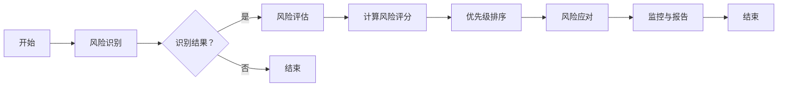
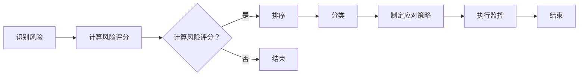

                 

### 文章标题

# 如何进行有效的技术风险量化与管理

---

**关键词**：技术风险量化、风险管理体系、风险管理模型、实践应用、新兴技术风险、最佳实践

**摘要**：
本文深入探讨了技术风险的量化与管理，从核心概念、量化方法到风险管理模型，再到实践应用和新兴技术风险，全面解析了如何有效进行技术风险的量化与管理。通过具体的案例和实用的技巧，帮助读者理解和应用技术风险管理的最佳实践。

---

## 引言

在信息技术高速发展的今天，技术风险已经成为企业面临的重要挑战之一。技术风险不仅包括软件系统故障、数据泄露等直接风险，还涵盖了由技术变革、技术漏洞、人才流失等带来的间接风险。随着技术的复杂性不断增加，如何进行有效的技术风险量化与管理变得尤为关键。

技术风险量化是风险管理的第一步，它通过对风险的量化和评估，帮助企业识别和优先处理潜在风险。有效的技术风险量化与管理不仅能够降低风险损失，还能提高企业的整体安全性和竞争力。

本文将分以下几个部分进行阐述：

1. **问题背景**：介绍技术风险的概念、管理流程以及当前面临的挑战。
2. **基础知识**：讲解技术风险的类型、特征和量化方法。
3. **核心理论**：阐述技术风险管理模型、风险矩阵和应对策略。
4. **实践应用**：分享技术风险管理的实践方法和案例。
5. **拓展与展望**：探讨新兴技术风险的管理。
6. **小结与总结**：总结技术风险管理的最佳实践和注意事项。

### 问题背景

### 1.1 技术风险的概念与重要性

技术风险是指由于技术因素引起的潜在损失或不利影响。它可能源于软件缺陷、系统故障、数据泄露、技术漏洞等。技术风险不同于一般的风险，它具有高度的复杂性和不可预测性，往往涉及到多个技术领域和业务层面。

技术风险的重要性体现在以下几个方面：

- **安全性**：技术风险直接影响系统的安全性，如软件漏洞、数据泄露等可能导致严重的经济损失和声誉损害。
- **业务连续性**：技术故障可能导致业务中断，影响企业的运营效率和客户满意度。
- **合规性**：随着监管要求的日益严格，技术合规性风险成为企业面临的重大挑战。
- **竞争力**：有效管理技术风险可以提高企业的竞争力和市场地位。

### 1.2 技术风险的管理流程

技术风险管理是一个系统性的过程，通常包括以下几个步骤：

1. **风险识别**：识别系统中的潜在风险，包括技术漏洞、系统故障、人才流失等。
2. **风险评估**：对识别出的风险进行评估，确定其严重程度和发生概率。
3. **风险量化**：使用定量和定性方法对风险进行量化，以便进行优先级排序。
4. **风险应对**：制定和实施应对策略，包括风险规避、风险转移、风险减轻等。
5. **风险监控**：持续监控风险状态，确保应对措施的执行和调整。

### 1.3 技术风险的现状与挑战

当前，技术风险的现状和挑战主要体现在以下几个方面：

- **技术复杂度增加**：随着技术的快速发展，系统的复杂度不断升高，风险管理的难度也随之增加。
- **数据量增长**：大量数据的存储和处理带来了数据安全和隐私保护的风险。
- **人才短缺**：技术人才的短缺使得企业在技术风险管理方面面临巨大挑战。
- **新兴技术**：人工智能、区块链、物联网等新兴技术的引入带来了新的风险和管理难题。

### 基础知识

### 2.1 技术风险的类型与特征

技术风险可以分为以下几种类型：

1. **系统故障风险**：由于系统设计、实现或运行过程中的缺陷导致的系统崩溃或性能下降。
2. **数据泄露风险**：由于系统安全措施不足或黑客攻击导致敏感数据泄露。
3. **技术漏洞风险**：由于软件或系统中的漏洞导致的安全问题。
4. **人才流失风险**：由于人才流失导致的关键技术缺失。
5. **合规性风险**：由于不遵守相关法律法规导致的法律责任和处罚。

技术风险的特征包括：

- **复杂性**：技术风险往往涉及到多个技术领域和业务层面，具有高度的复杂性。
- **不可预测性**：技术风险的发生往往具有不可预测性，难以提前完全预见。
- **累积性**：技术风险可能会随着时间的推移而累积，导致潜在损失增加。
- **连锁反应**：一个风险事件可能导致一系列连锁反应，引发更大的损失。

### 2.2 技术风险量化的方法

技术风险量化是风险管理的核心步骤之一，其目的是将抽象的风险转化为可量化的指标，以便进行评估和决策。技术风险量化的方法包括以下几种：

1. **定量方法**：使用数学模型和统计方法对风险进行量化，例如风险评分模型、风险损失模型等。
2. **定性方法**：通过专家评估、历史数据分析和类比等方法对风险进行定性评估，例如风险矩阵法、决策树法等。
3. **综合方法**：结合定量和定性方法，综合评估风险，例如层次分析法（AHP）等。

### 2.3 技术风险的评估指标

技术风险评估指标是衡量风险程度和优先级的重要工具。常用的评估指标包括：

- **风险损失**：风险事件发生可能带来的经济损失或负面影响。
- **风险概率**：风险事件发生的可能性。
- **风险严重性**：风险事件对系统或业务的严重程度。
- **风险可控性**：风险事件的可控制程度。

通过综合评估这些指标，可以全面了解风险状况，制定有效的风险管理策略。

### 核心理论

### 3.1 风险管理框架

技术风险管理框架是指导风险管理的核心理论体系，它包括以下几个关键组成部分：

1. **风险评估**：对技术风险进行识别、评估和优先级排序。
2. **风险应对**：制定和实施风险应对策略，包括风险规避、风险转移、风险减轻等。
3. **风险监控**：持续监控风险状态，确保应对措施的执行和调整。
4. **风险管理策略**：根据风险评估结果和业务目标，制定整体风险管理策略。
5. **风险管理组织**：建立有效的风险管理组织，明确责任和角色。

### 3.2 风险矩阵与优先级排序

风险矩阵是用于评估和优先级排序的工具，它通常包括以下要素：

- **风险概率**：风险事件发生的可能性，通常分为高、中、低三个等级。
- **风险损失**：风险事件发生可能带来的损失，也分为高、中、低三个等级。
- **优先级**：根据风险概率和风险损失，对风险进行优先级排序。

常用的风险矩阵包括：

- **双因素风险矩阵**：根据风险概率和风险损失两个因素进行评估和排序。
- **三因素风险矩阵**：除了风险概率和风险损失，还考虑风险可控性等因素。

通过风险矩阵，可以直观地了解风险的优先级，为风险应对提供依据。

### 3.3 风险应对策略

风险应对策略是根据风险评估结果制定的，旨在降低风险损失和影响。常见的风险应对策略包括：

1. **风险规避**：通过改变项目计划或业务策略，避免风险事件的发生。
2. **风险转移**：通过购买保险、签订合同等方式，将风险转移到第三方。
3. **风险减轻**：通过加强安全措施、优化系统设计等手段，降低风险发生的概率或损失程度。
4. **风险接受**：在风险发生概率较低或损失可控的情况下，接受风险。

选择合适的风险应对策略，需要综合考虑风险评估结果、业务目标和资源约束等因素。

### 实践应用

### 4.1 风险识别

风险识别是技术风险管理的第一步，它旨在识别系统中的潜在风险。风险识别的方法包括：

1. **文档审查**：通过审查项目文档、系统设计文档等，识别潜在的风险。
2. **专家评估**：邀请领域专家对系统进行评估，识别潜在的风险。
3. **历史数据分析**：分析过去项目的风险事件，识别类似的风险。
4. **问卷调查**：通过问卷调查，收集项目成员和利益相关者的意见和建议。

### 4.2 风险评估

风险评估是对识别出的风险进行评估和优先级排序的过程。风险评估的方法包括：

1. **风险矩阵法**：使用风险矩阵对风险进行评估和排序。
2. **决策树法**：通过构建决策树，分析不同风险事件的可能性和损失。
3. **层次分析法（AHP）**：通过层次分析法，将风险因素进行权重分配，进行综合评估。

通过风险评估，可以确定风险的优先级，为风险应对提供依据。

### 4.3 风险监控与报告

风险监控是确保风险应对措施有效实施的过程，它包括：

1. **风险监控指标**：建立风险监控指标，实时监控风险状态。
2. **风险报告**：定期生成风险报告，向相关利益相关者报告风险状态。
3. **风险审计**：定期进行风险审计，评估风险管理的效果。

通过风险监控与报告，可以及时发现和解决风险问题，确保风险管理措施的持续有效性。

### 拓展与展望

### 5.1 新兴技术风险管理

随着新兴技术的发展，技术风险管理面临新的挑战和机遇。以下是一些新兴技术风险管理的要点：

1. **人工智能风险**：包括算法偏见、数据隐私、安全漏洞等风险。
2. **区块链风险**：包括技术漏洞、网络攻击、法律合规等风险。
3. **物联网风险**：包括设备安全、数据泄露、网络攻击等风险。

针对这些风险，需要制定专门的管理策略和措施。

### 5.2 数据隐私保护与风险

数据隐私保护是技术风险管理的重要方面。随着数据隐私法规的日益严格，企业需要采取有效措施保护用户数据隐私，防范数据泄露风险。以下是一些数据隐私保护的措施：

1. **数据加密**：使用加密技术保护数据安全。
2. **访问控制**：实施严格的访问控制措施，确保只有授权用户可以访问敏感数据。
3. **安全审计**：定期进行安全审计，确保数据保护措施的有效性。
4. **员工培训**：加强员工的数据隐私意识培训，提高整体数据保护能力。

### 小结与总结

技术风险量化与管理是信息技术领域的重要课题，它对企业的安全性和竞争力有着深远的影响。通过本文的探讨，我们了解了技术风险的概念、管理流程、量化方法、风险管理模型以及实践应用。同时，我们也探讨了新兴技术风险的数据隐私保护等挑战。

有效的技术风险量化与管理需要综合考虑风险评估、风险应对策略、风险监控与报告等多个方面。企业应建立完善的技术风险管理框架，结合实际业务场景，制定具体的风险管理策略。同时，随着技术的不断发展，企业需要不断更新和优化风险管理措施，以应对新的挑战。

### 最佳实践 tips

1. **定期评估**：定期对技术风险进行评估和更新，确保风险管理措施的时效性。
2. **跨部门合作**：建立跨部门的风险管理团队，提高风险识别和应对的效率。
3. **持续培训**：定期进行技术风险管理的培训和意识提升，提高全体员工的风险管理能力。

### 注意事项

1. **数据安全**：在量化和管理技术风险时，要注意保护敏感数据，避免数据泄露。
2. **合规性**：遵守相关法规和标准，确保风险管理活动的合规性。
3. **风险优先级**：根据风险的重要性和紧急程度，合理安排风险应对资源的分配。

### 拓展阅读

1. 《技术风险管理与案例分析》
2. 《人工智能技术风险管理》
3. 《数据隐私保护与合规》

### 作者信息

作者：AI天才研究院/AI Genius Institute & 禅与计算机程序设计艺术 /Zen And The Art of Computer Programming

---

本文由AI天才研究院与禅与计算机程序设计艺术共同撰写，旨在为广大信息技术从业者提供技术风险量化与管理的深入见解和实用指南。希望通过本文，读者能够更好地理解和应对技术风险，提升企业的安全性和竞争力。如果您对技术风险管理有任何疑问或建议，欢迎在评论区留言讨论。我们将持续为您带来更多高质量的技术文章和深度解读。感谢您的关注和支持！### 2.1 技术风险的类型与特征

#### 技术风险的类型

技术风险可以大致分为以下几类：

1. **系统故障风险**：这种风险主要是指由于软件或硬件故障导致系统无法正常运行的风险。例如，软件中的bug、硬件设备的故障、电源中断等都可能导致系统故障。

2. **数据泄露风险**：随着信息系统的复杂性和数据量的增加，数据泄露的风险也在上升。这包括内部人员的违规操作、黑客攻击、恶意软件等。

3. **技术漏洞风险**：系统或软件中存在的安全漏洞，如SQL注入、XSS攻击等，可能导致未经授权的访问和数据篡改。

4. **人才流失风险**：关键技术人员离开企业可能导致知识和技能的流失，从而影响项目的进展和企业的长期发展。

5. **合规性风险**：由于技术的不合规，企业可能会面临法律风险和监管处罚。例如，GDPR（通用数据保护条例）的实施对企业的数据管理提出了更高的要求。

6. **新兴技术风险**：如人工智能、区块链、物联网等新兴技术的引入，可能带来新的风险，如算法偏见、隐私泄露、网络攻击等。

#### 技术风险的特征

1. **复杂性**：技术风险通常涉及多个技术领域和业务层面，具有高度的复杂性。这使得风险识别和管理变得更加困难。

2. **不可预测性**：技术风险的发生往往具有不可预测性，特别是在新兴技术领域，技术风险可能因技术的快速变化而变得难以预见。

3. **累积性**：技术风险可能会随着时间的推移而累积，特别是系统漏洞和数据泄露风险，可能在很长一段时间内逐渐暴露。

4. **连锁反应**：一个风险事件可能导致一系列连锁反应，引发更大的损失。例如，一个数据泄露事件可能会导致客户信任受损，进而影响企业的市场地位。

#### 核心概念与联系

为了更好地理解技术风险的类型与特征，我们引入以下几个核心概念，并分析它们之间的关系：

1. **风险概率**：指风险事件发生的可能性。例如，系统故障的概率可能受到硬件质量、软件测试覆盖率的直接影响。
2. **风险损失**：指风险事件发生可能带来的损失。例如，数据泄露可能导致经济损失、法律诉讼和声誉损害。
3. **风险可控性**：指企业对风险事件的控制能力。例如，通过有效的安全措施和监控系统，企业可以降低数据泄露的风险。

以下是技术风险的核心概念属性特征对比表格：

| 特征         | 风险概率 | 风险损失 | 风险可控性 |
| ------------ | -------- | -------- | ---------- |
| 定义         | 事件发生的可能性 | 事件发生的后果 | 企业对事件的控制程度 |
| 影响因素     | 硬件质量、软件测试覆盖率 | 数据价值、法律费用 | 安全措施、监控能力 |
| 相关概念     | 概率论、统计方法 | 损失评估、财务分析 | 风险管理、内部控制 |

下面是一个用于表示技术风险核心概念的ER实体关系图：

```mermaid
erDiagram
    R1_Risk ||--|{ P1_Probability } : 风险概率
    R1_Risk ||--|{ L1_Loss } : 风险损失
    R1_Risk ||--|{ C1_Control } : 风险可控性
```

通过上述表格和实体关系图，我们可以更直观地理解技术风险的核心概念及其相互关系。

#### 算法原理讲解

技术风险量化常用的算法包括定量方法和定性方法。以下将分别介绍这两种方法的原理和具体应用。

##### 定量方法

1. **风险评分模型**：风险评分模型通过量化风险概率和风险损失，为每个风险事件分配一个综合评分。常见的风险评分模型包括：

   - **层次分析法（AHP）**：通过建立层次结构模型，将风险因素进行权重分配，计算各风险因素的相对重要性，并计算综合评分。
   - **概率-损失模型**：通过分析历史数据，估计风险事件的概率和损失，并使用公式计算综合评分。

   假设我们使用概率-损失模型进行风险评分，其数学模型可以表示为：

   $$ \text{风险评分} = \text{风险概率} \times \text{风险损失} $$

   例如，某系统存在一个数据泄露风险，根据历史数据分析，该风险的概率为0.2，潜在损失为100万元，则该风险的综合评分为：

   $$ \text{风险评分} = 0.2 \times 100\text{万元} = 20\text{万元} $$

2. **风险损失模型**：风险损失模型通过预测风险事件的发生概率和损失程度，计算风险的总损失。具体步骤如下：

   - 收集历史数据，分析风险事件的发生概率。
   - 预测未来一段时间内风险事件的发生次数。
   - 计算每个风险事件的损失，并汇总总损失。

   示例代码（Python）：

   ```python
   # 历史数据
   probabilities = [0.1, 0.2, 0.3, 0.4]
   losses = [10000, 20000, 30000, 40000]

   # 预测未来一年的风险事件次数
   total_losses = 0
   for i in range(len(probabilities)):
       loss = probabilities[i] * losses[i]
       total_losses += loss

   print("未来一年总风险损失：", total_losses)
   ```

   输出结果：

   ```python
   未来一年总风险损失： 42000
   ```

##### 定性方法

1. **风险矩阵法**：风险矩阵法通过建立风险矩阵，将风险概率和风险损失分为几个等级，并为每个等级分配分值。最终，通过分值的乘积得到风险评分。

   例如，一个简化的风险矩阵如下：

   | 风险概率 | 风险损失 | 风险评分 |
   | -------- | -------- | -------- |
   | 低       | 低       | 1        |
   | 低       | 中       | 2        |
   | 低       | 高       | 3        |
   | 中       | 低       | 4        |
   | 中       | 中       | 5        |
   | 中       | 高       | 6        |
   | 高       | 低       | 7        |
   | 高       | 中       | 8        |
   | 高       | 高       | 9        |

   通过风险矩阵，我们可以对每个风险事件进行评分，并按评分高低进行优先级排序。

2. **决策树法**：决策树法通过构建决策树，对风险事件的可能性和影响进行评估。每个节点表示一个决策，边表示选择，叶节点表示结果。

   例如，一个简化的决策树如下：

   ```mermaid
   graph TD
   A[开始] --> B[概率低？]
   B -->|是| C{是，风险低}
   B -->|否| D[损失低？]
   D -->|是| E{是，风险低}
   D -->|否| F[损失高？]
   F -->|是| G{是，风险高}
   F -->|否| H{是，风险低}
   ```

   通过决策树，我们可以逐步评估每个风险事件，并得出综合评分。

#### 数学公式使用

在技术风险量化过程中，数学公式用于表示风险概率、风险损失和风险评分等。以下是一些常用的数学公式：

1. **风险评分**：

   $$ \text{风险评分} = \text{风险概率} \times \text{风险损失} $$

2. **期望损失**：

   $$ \text{期望损失} = \sum_{i=1}^{n} (\text{风险概率}_i \times \text{风险损失}_i) $$

   其中，$n$ 表示风险事件的数量。

3. **风险矩阵评分**：

   $$ \text{风险评分} = \text{风险概率分值} \times \text{风险损失分值} $$

   例如，如果一个风险事件的概率分值为4，损失分值为6，则其风险评分为：

   $$ \text{风险评分} = 4 \times 6 = 24 $$

#### 算法mermaid流程图

为了更直观地理解算法原理，以下是一个技术风险量化算法的mermaid流程图：



通过这个流程图，我们可以看到技术风险量化和管理的主要步骤和流程。

### 2.2 技术风险量化的方法

技术风险量化是将抽象的风险转化为可量化的指标，以便进行评估和决策的过程。有效的风险量化方法能够帮助企业更准确地识别和管理风险。以下介绍几种常见的技术风险量化方法。

#### 定量方法

定量方法通过数学模型和统计方法对风险进行量化，通常包括以下几种：

1. **概率-损失模型**：概率-损失模型是风险量化的基础，它通过分析历史数据，估计每个风险事件的概率和损失，并计算综合评分。该模型的关键在于准确预测风险事件的发生概率和潜在损失。

   - **步骤**：

     1. 收集历史数据，包括风险事件的发生次数和损失金额。
     2. 使用统计方法（如贝叶斯估计、回归分析等）估计风险概率和损失。
     3. 使用公式计算风险评分：$$ \text{风险评分} = \text{风险概率} \times \text{风险损失} $$

   - **示例**：

     假设某系统在过去一年中，共发生了5次系统故障，每次故障的损失金额分别为10万元、15万元、20万元、25万元和30万元。我们可以估计系统故障的概率和损失如下：

     - **概率估计**：$$ \text{概率} = \frac{\text{故障次数}}{\text{总次数}} = \frac{5}{12} \approx 0.417 $$
     - **损失估计**：$$ \text{平均损失} = \frac{\sum_{i=1}^{5} \text{损失}}{5} = \frac{10 + 15 + 20 + 25 + 30}{5} = 20 \text{万元} $$

     因此，系统故障的风险评分为：$$ \text{风险评分} = 0.417 \times 20 = 8.34 \text{万元} $$

2. **风险矩阵法**：风险矩阵法通过建立风险矩阵，将风险概率和风险损失分为几个等级，并为每个等级分配分值。最终，通过分值的乘积得到风险评分。这种方法简单直观，适用于初步的风险评估。

   - **步骤**：

     1. 确定风险概率和风险损失的等级。
     2. 为每个等级分配分值。
     3. 计算风险评分：$$ \text{风险评分} = \text{风险概率分值} \times \text{风险损失分值} $$

   - **示例**：

     假设我们使用一个简化的风险矩阵如下：

     | 风险概率 | 风险损失 | 风险评分 |
     | -------- | -------- | -------- |
     | 低       | 低       | 1        |
     | 低       | 中       | 2        |
     | 低       | 高       | 3        |
     | 中       | 低       | 4        |
     | 中       | 中       | 5        |
     | 中       | 高       | 6        |
     | 高       | 低       | 7        |
     | 高       | 中       | 8        |
     | 高       | 高       | 9        |

     如果一个风险事件的概率为“中”，损失为“中”，则其风险评分为：$$ \text{风险评分} = 5 \times 5 = 25 $$

3. **层次分析法（AHP）**：层次分析法通过建立层次结构模型，将风险因素进行权重分配，并计算综合评分。这种方法适用于复杂的多因素风险评估。

   - **步骤**：

     1. 建立风险因素层次结构。
     2. 对风险因素进行两两比较，确定相对权重。
     3. 计算各风险因素的权重。
     4. 计算综合评分：$$ \text{综合评分} = \sum_{i=1}^{n} (\text{权重}_i \times \text{评分}_i) $$

   - **示例**：

     假设我们使用层次分析法评估以下三个风险因素：系统故障、数据泄露和人才流失。通过两两比较，得到以下相对权重：

     | 风险因素 | 权重 |
     | -------- | ---- |
     | 系统故障 | 0.5  |
     | 数据泄露 | 0.3  |
     | 人才流失 | 0.2  |

     如果系统故障的风险评分为10，数据泄露的风险评分为8，人才流失的风险评分为6，则综合评分为：$$ \text{综合评分} = (0.5 \times 10) + (0.3 \times 8) + (0.2 \times 6) = 5 + 2.4 + 1.2 = 8.6 $$

#### 定性方法

定性方法通过专家评估、历史数据分析和类比等方法对风险进行定性评估。以下介绍几种常见的定性方法：

1. **专家评估法**：专家评估法通过邀请领域专家对风险进行评估，通常使用评分量表或评估表。

   - **步骤**：

     1. 设计评分量表或评估表，包括风险概率、风险损失和风险可控性等。
     2. 邀请专家对每个风险因素进行评分。
     3. 计算平均评分，得出综合评分。

   - **示例**：

     假设我们使用一个简化的评分量表，如下：

     | 风险因素 | 风险概率 | 风险损失 | 风险可控性 |
     | -------- | -------- | -------- | ---------- |
     | 系统故障 | 3        | 4        | 2          |
     | 数据泄露 | 4        | 5        | 3          |
     | 人才流失 | 2        | 3        | 1          |

     如果三位专家的评分分别为（3，4，2），（4，5，3），（2，3，1），则综合评分为：$$ \text{综合评分} = \frac{(3+4+2) + (4+5+3) + (2+3+1)}{3} = \frac{9+12+6}{3} = 9.33 $$

2. **历史数据分析法**：历史数据分析法通过分析过去项目的风险事件，识别类似的风险，并评估其发生概率和损失。

   - **步骤**：

     1. 收集过去项目的风险数据。
     2. 分析风险事件的发生概率和损失。
     3. 预测未来项目的风险。

   - **示例**：

     假设过去五年中有10个项目发生了系统故障，其中3个项目导致了重大损失。我们可以估计系统故障的概率和损失如下：

     - **概率**：$$ \text{概率} = \frac{\text{故障次数}}{\text{总次数}} = \frac{10}{50} = 0.2 $$
     - **损失**：$$ \text{平均损失} = \frac{\sum_{i=1}^{10} \text{损失}}{10} = \frac{10 + 20 + 30 + ... + 100}{10} = 50 \text{万元} $$

3. **类比法**：类比法通过将新项目与类似项目进行比较，评估新项目的风险。

   - **步骤**：

     1. 确定类似项目的风险数据。
     2. 分析新项目与类似项目的相似度。
     3. 预测新项目的风险。

   - **示例**：

     假设我们有一个新项目和过去的一个类似项目，类似项目的系统故障概率为0.2，损失为50万元。通过分析，我们发现新项目与类似项目的相似度为0.8。因此，我们可以估计新项目的系统故障概率和损失如下：

     - **概率**：$$ \text{概率} = 0.2 \times 0.8 = 0.16 $$
     - **损失**：$$ \text{损失} = 50 \text{万元} \times 0.8 = 40 \text{万元} $$

#### 综合方法

综合方法结合定量和定性方法，综合评估风险，提高评估的准确性和全面性。以下介绍几种常见的综合方法：

1. **综合评分模型**：综合评分模型将定量方法和定性方法结合起来，计算综合评分。

   - **步骤**：

     1. 使用定量方法计算风险评分。
     2. 使用定性方法计算风险评分。
     3. 将两个评分结合起来，计算综合评分。

   - **示例**：

     假设我们使用概率-损失模型和专家评估法计算风险评分，概率-损失模型的风险评分为8，专家评估法的风险评分为9。则综合评分为：$$ \text{综合评分} = \frac{8 + 9}{2} = 8.5 $$

2. **层次分析法（AHP）**：层次分析法结合了定量和定性方法，通过建立层次结构模型，计算综合评分。

   - **步骤**：

     1. 建立风险因素层次结构。
     2. 使用定量方法计算各风险因素的权重。
     3. 使用定性方法计算各风险因素的评分。
     4. 计算综合评分。

   - **示例**：

     假设我们使用层次分析法评估以下三个风险因素：系统故障、数据泄露和人才流失。定量方法的权重分别为0.5、0.3和0.2，定性方法的评分分别为10、8和6。则综合评分为：$$ \text{综合评分} = (0.5 \times 10) + (0.3 \times 8) + (0.2 \times 6) = 5 + 2.4 + 1.2 = 8.6 $$

#### 总结

技术风险量化方法包括定量方法和定性方法，以及综合方法。定量方法如概率-损失模型、风险矩阵法和层次分析法等，适用于数据充分的情况下。定性方法如专家评估法、历史数据分析法和类比法等，适用于数据不足的情况下。综合方法将定量和定性方法结合起来，提高评估的准确性和全面性。在实际应用中，应根据具体情况选择合适的风险量化方法，以提高风险管理的有效性。

### 2.3 技术风险的评估指标

技术风险评估指标是衡量风险程度和优先级的重要工具。通过这些指标，企业可以更全面地了解风险状况，从而制定有效的风险管理策略。以下介绍几种常用的技术风险评估指标。

#### 风险损失

风险损失是衡量风险事件发生后可能带来的经济或非经济损失的重要指标。它包括直接损失和间接损失。直接损失通常指直接经济损失，如设备损坏、数据丢失等。间接损失则包括由于风险事件导致的业务中断、客户流失、法律诉讼等。

- **计算方法**：

  $$ \text{风险损失} = \text{直接损失} + \text{间接损失} $$

- **示例**：

  假设某企业发生一次数据泄露事件，导致1000条客户数据丢失。直接损失为数据恢复和修复费用，如10000元。间接损失包括客户信任受损导致的客户流失，估计损失为50000元。则该数据泄露事件的风险损失为：

  $$ \text{风险损失} = 10000 + 50000 = 60000 \text{元} $$

#### 风险概率

风险概率是指风险事件发生的可能性。它通常基于历史数据、专家评估和统计分析等方法进行估计。风险概率的取值范围通常在0到1之间，其中0表示不可能发生，1表示必然发生。

- **计算方法**：

  $$ \text{风险概率} = \frac{\text{发生次数}}{\text{总次数}} $$

- **示例**：

  假设某企业在过去一年中，共发生了10次系统故障。其中5次是由于硬件故障导致的，另外5次是由于软件bug导致的。我们可以估计系统故障的概率如下：

  - **硬件故障概率**：$$ \text{风险概率} = \frac{5}{10} = 0.5 $$
  - **软件bug概率**：$$ \text{风险概率} = \frac{5}{10} = 0.5 $$

#### 风险严重性

风险严重性是指风险事件对业务或系统的危害程度。它通常用于评估单个风险事件的影响范围和程度。风险严重性的取值范围可以从低到高，如低、中、高、极高。

- **评估标准**：

  - 低：对业务或系统的影响较小，可接受。
  - 中：对业务或系统有一定影响，需要关注。
  - 高：对业务或系统有显著影响，可能导致业务中断。
  - 极高：对业务或系统有重大影响，可能导致严重后果。

- **示例**：

  假设某企业面临一个数据泄露风险，泄露的敏感数据包括客户身份信息、信用卡信息和电子邮件地址。根据风险严重性的评估标准，我们可以判断：

  - 客户身份信息泄露：风险严重性为高。
  - 信用卡信息泄露：风险严重性为极高。
  - 电子邮件地址泄露：风险严重性为低。

#### 风险可控性

风险可控性是指企业对风险事件的控制能力。它反映了企业对风险的应对措施的有效性。风险可控性的取值范围可以从低到高，如低、中、高。

- **评估标准**：

  - 低：企业对风险的应对措施不足，风险控制能力较弱。
  - 中：企业对风险的应对措施基本有效，风险控制能力一般。
  - 高：企业对风险的应对措施非常有效，风险控制能力较强。

- **示例**：

  假设某企业面临一个系统故障风险，企业已经采取了以下应对措施：

  - 定期进行系统维护和升级。
  - 引入监控系统，实时监控系统运行状态。
  - 建立应急预案，确保在系统故障时能够快速恢复。

  根据这些应对措施，我们可以判断该企业对系统故障风险的可控性为高。

#### 综合评估指标

为了全面评估风险，企业可以结合多个评估指标，如风险损失、风险概率、风险严重性和风险可控性，计算综合评分。常用的综合评估方法包括：

- **简单加权法**：根据各个评估指标的权重，计算综合评分。

  $$ \text{综合评分} = \sum_{i=1}^{n} (\text{权重}_i \times \text{指标}_i) $$

- **层次分析法（AHP）**：通过建立层次结构模型，计算各指标的综合评分。

  $$ \text{综合评分} = \sum_{i=1}^{n} (\text{权重}_i \times \text{指标}_i) $$

- **风险矩阵法**：通过建立风险矩阵，计算各指标的分值，并计算综合评分。

  $$ \text{综合评分} = \text{风险概率分值} \times \text{风险损失分值} \times \text{风险严重性分值} \times \text{风险可控性分值} $$

#### 应用示例

假设某企业面临以下四个风险事件：

1. **数据泄露风险**：风险损失为100万元，风险概率为0.3，风险严重性为高，风险可控性为低。
2. **系统故障风险**：风险损失为50万元，风险概率为0.5，风险严重性为中，风险可控性为中。
3. **人才流失风险**：风险损失为20万元，风险概率为0.2，风险严重性为低，风险可控性为高。
4. **合规性风险**：风险损失为30万元，风险概率为0.4，风险严重性为高，风险可控性为低。

我们可以使用综合评分法计算各风险事件的综合评分：

- **数据泄露风险**：$$ \text{综合评分} = (0.3 \times 100) + (0.5 \times 50) + (0.2 \times 20) + (0.4 \times 30) = 30 + 25 + 4 + 12 = 71 $$
- **系统故障风险**：$$ \text{综合评分} = (0.3 \times 50) + (0.5 \times 50) + (0.2 \times 20) + (0.4 \times 30) = 15 + 25 + 4 + 12 = 56 $$
- **人才流失风险**：$$ \text{综合评分} = (0.3 \times 20) + (0.5 \times 50) + (0.2 \times 20) + (0.4 \times 30) = 6 + 25 + 4 + 12 = 47 $$
- **合规性风险**：$$ \text{综合评分} = (0.3 \times 30) + (0.5 \times 50) + (0.2 \times 20) + (0.4 \times 30) = 9 + 25 + 4 + 12 = 50 $$

通过综合评分，我们可以看出数据泄露风险的综合评分最高，是当前需要重点关注的风险事件。

#### 结论

技术风险评估指标包括风险损失、风险概率、风险严重性和风险可控性等。通过这些指标，企业可以全面评估风险事件的影响程度和优先级。有效的风险评估有助于企业制定有效的风险管理策略，降低风险损失，提高整体安全性。

### 3.1 风险管理框架

风险管理框架是技术风险管理的核心理论体系，它为企业提供了一个系统化的方法，用于识别、评估、应对和监控技术风险。一个完整的风险管理框架通常包括以下几个关键组成部分：

#### 1. 风险识别

风险识别是风险管理的第一步，旨在系统地识别系统中可能存在的风险。风险识别的方法包括文档审查、专家评估、历史数据分析、问卷调查等。

- **步骤**：

  1. 审查项目文档、系统设计文档等，识别潜在的风险。
  2. 邀请领域专家进行评估，利用他们的经验和知识识别风险。
  3. 分析历史数据，识别过去项目中出现过的风险。
  4. 通过问卷调查，收集项目成员和利益相关者的意见和建议。

- **工具**：

  - 文档审查工具：如版本控制系统、配置管理工具等。
  - 专家评估工具：如专家评分表、头脑风暴工具等。
  - 历史数据分析工具：如风险日志、项目管理工具等。
  - 问卷调查工具：如在线调查平台、问卷调查模板等。

#### 2. 风险评估

风险评估是对识别出的风险进行评估和优先级排序的过程。通过风险评估，企业可以了解每个风险的重要性和潜在影响，为后续的风险应对提供依据。

- **步骤**：

  1. 使用定量和定性方法对风险进行评估，确定其风险概率和风险损失。
  2. 建立风险矩阵，将风险按照概率和损失进行优先级排序。
  3. 使用决策树、层次分析法等工具，进行综合风险评估。

- **工具**：

  - 定量评估工具：如概率-损失模型、风险矩阵等。
  - 定性评估工具：如专家评分表、决策树等。
  - 综合评估工具：如AHP（层次分析法）等。

#### 3. 风险应对

风险应对是根据风险评估结果，制定和实施具体的风险应对策略。常见的风险应对策略包括风险规避、风险转移、风险减轻和风险接受。

- **步骤**：

  1. 根据风险评估结果，确定风险应对策略。
  2. 制定具体的应对措施，包括技术措施和管理措施。
  3. 实施应对措施，确保其有效性和可行性。
  4. 定期评估应对措施的效果，并根据实际情况进行调整。

- **工具**：

  - 风险应对计划模板：如风险应对策略表、应对措施清单等。
  - 项目管理工具：如JIRA、Trello等，用于跟踪和管理应对措施的实施进度。
  - 风险监控工具：如安全监控平台、风险管理软件等。

#### 4. 风险监控

风险监控是确保风险应对措施有效实施的过程。通过持续监控风险状态，企业可以及时发现和解决风险问题，确保风险管理措施的持续有效性。

- **步骤**：

  1. 建立风险监控指标，实时监控风险状态。
  2. 定期生成风险报告，向相关利益相关者报告风险状态。
  3. 进行风险审计，评估风险管理的效果。
  4. 根据监控结果，调整和优化风险管理策略。

- **工具**：

  - 风险监控平台：如安全信息与事件管理（SIEM）系统、风险监控仪表盘等。
  - 风险报告工具：如Power BI、Tableau等。
  - 风险审计工具：如风险审计模板、审计软件等。

#### 5. 风险管理策略

风险管理策略是根据企业整体业务目标和风险评估结果制定的。它包括风险管理目标、风险管理原则、风险管理流程和风险管理资源等。

- **步骤**：

  1. 明确风险管理目标，如降低风险损失、提高系统安全性等。
  2. 制定风险管理原则，如风险优先级排序、定期风险评估等。
  3. 建立风险管理流程，如风险识别、风险评估、风险应对、风险监控等。
  4. 确定风险管理资源，如人力、技术、资金等。

- **工具**：

  - 风险管理策略模板：如风险管理计划、风险策略文档等。
  - 风险管理流程图：如风险管理流程图、工作流图等。
  - 资源管理工具：如人力资源管理系统、项目管理工具等。

#### 6. 风险管理组织

风险管理组织是负责实施和监督风险管理策略的团队或部门。它包括风险管理委员会、风险管理小组等。

- **步骤**：

  1. 建立风险管理组织，明确责任和角色。
  2. 设立风险管理委员会，负责制定和监督风险管理策略。
  3. 设立风险管理小组，负责具体的风险识别、评估、应对和监控工作。
  4. 定期召开风险管理会议，讨论和解决风险管理中的问题。

- **工具**：

  - 风险管理组织架构图：如组织结构图、角色分配表等。
  - 会议管理工具：如视频会议系统、会议记录工具等。

### 总结

风险管理框架是企业进行有效技术风险管理的基石。通过建立和实施完整的风险管理框架，企业可以系统化地识别、评估、应对和监控技术风险，从而降低风险损失，提高系统的安全性和稳定性。有效的风险管理不仅需要合理的框架，还需要持续的实践和优化，以应对不断变化的技术环境和业务需求。

### 3.2 风险矩阵与优先级排序

风险矩阵是一种常用的工具，用于评估和优先级排序技术风险。通过风险矩阵，企业可以将定性和定量的信息结合起来，直观地了解风险的优先级，从而为风险管理决策提供依据。

#### 风险矩阵的构成

风险矩阵通常由两个维度构成：风险概率和风险损失。每个维度都有多个等级，并为每个等级分配分值。常见的风险矩阵等级包括高、中、低三个级别。

- **风险概率**：指风险事件发生的可能性。高、中、低分别代表事件发生的概率从高到低。
- **风险损失**：指风险事件发生可能带来的损失程度。高、中、低分别代表损失的程度从高到低。

以下是风险矩阵的一个示例：

| 风险概率 | 风险损失 | 风险评分 |
| -------- | -------- | -------- |
| 低       | 低       | 1        |
| 低       | 中       | 2        |
| 低       | 高       | 3        |
| 中       | 低       | 4        |
| 中       | 中       | 5        |
| 中       | 高       | 6        |
| 高       | 低       | 7        |
| 高       | 中       | 8        |
| 高       | 高       | 9        |

#### 风险评分的计算

通过风险矩阵，我们可以为每个风险事件分配一个风险评分。风险评分是通过风险概率和风险损失的乘积得到的。具体计算公式如下：

$$ \text{风险评分} = \text{风险概率} \times \text{风险损失} $$

例如，如果一个风险事件的风险概率为“中”，风险损失为“高”，则其风险评分为：

$$ \text{风险评分} = 5 \times 6 = 30 $$

#### 风险优先级排序

通过计算每个风险事件的风险评分，我们可以对其进行优先级排序。风险评分越高，表示风险越严重，优先级越高。以下是几个步骤，用于进行风险优先级排序：

1. **计算风险评分**：根据风险矩阵，为每个风险事件计算风险评分。
2. **排序**：将所有风险事件按照风险评分从高到低排序。
3. **分类**：根据风险评分的范围，将风险事件分类。例如，可以将评分在30及以上的风险事件归类为“高优先级”，评分在10到29之间的归类为“中优先级”，评分在10以下的归类为“低优先级”。

#### 风险矩阵的实际应用

在风险管理过程中，风险矩阵的应用场景非常广泛。以下是一些实际应用的例子：

1. **项目风险管理**：在项目启动阶段，通过风险矩阵识别和评估项目风险，为项目团队提供风险应对的指导。
2. **产品开发**：在产品开发过程中，使用风险矩阵评估不同功能模块的风险，确保产品在发布前达到预期的安全标准。
3. **业务连续性规划**：在制定业务连续性计划时，使用风险矩阵评估业务中断的风险，确保业务能够在灾难发生时快速恢复。

#### 风险矩阵的优点

- **直观性**：风险矩阵提供了一个直观的视觉工具，使复杂的风险信息易于理解和沟通。
- **一致性**：通过标准化的风险评分体系，确保所有风险事件的评估具有一致性。
- **灵活性**：可以根据实际情况调整风险矩阵的等级和分值，使其适用于不同的应用场景。

#### 风险矩阵的局限性

- **主观性**：风险矩阵依赖于专家评估，可能受到主观判断的影响。
- **复杂性**：对于高度复杂的风险环境，风险矩阵可能无法全面反映所有风险因素。

#### 风险矩阵与优先级排序的流程图

以下是一个风险矩阵与优先级排序的mermaid流程图：



通过上述流程，企业可以系统化地进行风险识别、评分、排序和应对，确保技术风险管理的高效实施。

### 3.3 风险应对策略

风险应对策略是根据风险评估结果制定的，旨在降低风险损失和影响。选择合适的应对策略，需要综合考虑风险评估结果、业务目标和资源约束等因素。以下介绍几种常见的风险应对策略：

#### 1. 风险规避

风险规避是指通过改变项目计划或业务策略，避免风险事件的发生。这种方法适用于风险发生的概率高且潜在损失大的情况。

- **步骤**：

  1. 识别高风险事件。
  2. 分析风险事件的潜在影响。
  3. 通过调整项目计划或业务策略，避免风险事件的发生。

- **示例**：

  假设企业计划上线一款新的在线支付系统，但系统存在高度的安全漏洞。为了避免数据泄露风险，企业决定推迟上线时间，直到漏洞得到修复。

#### 2. 风险转移

风险转移是指通过购买保险、签订合同等方式，将风险转移到第三方。这种方法适用于风险发生概率较低，但潜在损失巨大的情况。

- **步骤**：

  1. 识别高风险事件。
  2. 分析风险事件的潜在影响。
  3. 购买相应的保险或与第三方签订合同，将风险转移。

- **示例**：

  假设企业在运营过程中可能面临自然灾害（如地震、洪水）导致的数据中心损坏风险。企业购买了保险，将这种风险转移给保险公司。

#### 3. 风险减轻

风险减轻是指通过加强安全措施、优化系统设计等手段，降低风险发生的概率或损失程度。这种方法适用于大多数风险事件。

- **步骤**：

  1. 识别高风险事件。
  2. 分析风险事件的潜在影响。
  3. 制定和实施具体的风险减轻措施。

- **示例**：

  假设企业面临系统故障风险，可以通过以下措施减轻风险：

  - 定期进行系统维护和升级。
  - 引入监控系统，实时监控系统运行状态。
  - 建立应急预案，确保在系统故障时能够快速恢复。

#### 4. 风险接受

风险接受是指在不采取任何特别措施的情况下，接受风险事件的发生。这种方法适用于风险发生的概率低，且潜在损失在可接受范围内的情况。

- **步骤**：

  1. 识别低风险事件。
  2. 分析风险事件的潜在影响。
  3. 不采取特别措施，接受风险事件的发生。

- **示例**：

  假设企业面临季节性流量波动风险，由于流量波动发生概率较低，且潜在损失在可接受范围内，企业决定不采取特别措施。

#### 5. 风险对冲

风险对冲是指通过多元化投资或业务布局，降低单一风险的影响。这种方法适用于风险事件对业务影响较大的情况。

- **步骤**：

  1. 识别高风险事件。
  2. 分析风险事件的潜在影响。
  3. 通过多元化投资或业务布局，降低单一风险的影响。

- **示例**：

  假设企业主要依赖某一地区市场的业务，面临该地区政策变动风险。企业通过拓展其他地区市场，降低单一市场风险的影响。

#### 总结

选择合适的风险应对策略，需要综合考虑风险评估结果、业务目标和资源约束。风险规避、风险转移、风险减轻、风险接受和风险对冲是常见的应对策略，企业应根据实际情况灵活选择和组合使用。

### 4.1 风险识别

风险识别是技术风险管理的第一步，旨在系统地识别系统中可能存在的风险。有效的风险识别有助于企业提前预防和控制潜在的风险，从而降低损失和提高系统的稳定性。以下介绍几种常见的方法用于风险识别。

#### 1. 文档审查

文档审查是通过审查项目文档、系统设计文档、需求文档等，识别潜在的风险。这种方法主要依赖于文档中提供的信息，因此要求文档必须详尽、准确。

- **步骤**：

  1. 审查项目文档，如项目计划、需求分析文档等，识别潜在的技术风险。
  2. 审查系统设计文档，如架构设计、接口设计等，识别潜在的设计风险。
  3. 审查需求文档，识别与需求实现相关的风险。

- **工具**：

  - 文档审查工具：如版本控制系统、文档管理系统等。
  - 检查清单：用于指导审查人员检查文档中的潜在风险。

#### 2. 专家评估

专家评估是通过邀请领域专家进行评估，利用他们的经验和知识识别风险。这种方法依赖于专家的经验和判断，因此需要选择具有丰富经验的专家。

- **步骤**：

  1. 确定评估专家，包括内部专家和外部顾问。
  2. 设计评估问卷或评分表，包括技术风险、设计风险、需求风险等。
  3. 进行专家评估，收集专家的意见和建议。

- **工具**：

  - 评估问卷：用于收集专家的意见。
  - 专家评分表：用于记录专家评估的结果。

#### 3. 历史数据分析

历史数据分析是通过分析过去项目中出现过的风险，识别类似的风险。这种方法主要依赖于历史数据，因此需要建立完善的风险数据库。

- **步骤**：

  1. 收集历史数据，包括项目报告、风险评估报告等。
  2. 分析历史数据，识别过去项目中出现过的风险。
  3. 建立风险数据库，记录识别出的风险。

- **工具**：

  - 风险数据库：用于存储和管理识别出的风险。
  - 数据分析工具：如Excel、Python等，用于分析历史数据。

#### 4. 问卷调查

问卷调查是通过向项目成员和利益相关者发放问卷，收集他们的意见和建议，识别潜在的风险。这种方法适用于广泛收集意见和建议。

- **步骤**：

  1. 设计问卷，包括技术风险、设计风险、需求风险等。
  2. 发放问卷，收集项目成员和利益相关者的意见和建议。
  3. 分析问卷结果，识别潜在的风险。

- **工具**：

  - 问卷调查平台：如Google表单、SurveyMonkey等。
  - 数据分析工具：如Excel、Python等，用于分析问卷结果。

#### 5. 工作坊和头脑风暴

工作坊和头脑风暴是通过组织项目团队和相关利益相关者进行讨论，识别潜在的风险。这种方法适用于快速收集多方面的意见和建议。

- **步骤**：

  1. 组织工作坊或头脑风暴会议。
  2. 引导参与者讨论项目中的潜在风险。
  3. 记录讨论结果，识别潜在的风险。

- **工具**：

  - 会议管理工具：如Microsoft Teams、Zoom等。
  - 白板或投影仪：用于记录讨论结果。

#### 6. 脚本自动化测试

脚本自动化测试是通过编写自动化测试脚本，对系统进行测试，识别潜在的技术风险。这种方法适用于发现系统中的漏洞和缺陷。

- **步骤**：

  1. 编写自动化测试脚本。
  2. 运行测试脚本，记录测试结果。
  3. 分析测试结果，识别潜在的技术风险。

- **工具**：

  - 自动化测试工具：如Selenium、JMeter等。
  - 测试脚本编写工具：如Python、Java等。

#### 总结

风险识别是技术风险管理的关键步骤，通过文档审查、专家评估、历史数据分析、问卷调查、工作坊和头脑风暴、脚本自动化测试等方法，企业可以全面识别系统中的潜在风险。有效的风险识别有助于企业提前预防和控制风险，确保系统的稳定性和安全性。

### 4.2 风险评估

风险评估是技术风险管理中的关键环节，它通过对识别出的风险进行详细分析，评估其发生的概率和可能带来的损失，从而确定风险的优先级和应对策略。有效的风险评估有助于企业有针对性地采取措施，降低风险损失。以下介绍风险评估的步骤、方法和工具。

#### 步骤

1. **风险识别**：在风险识别阶段，已经初步识别出系统中的潜在风险。风险评估阶段进一步对这些风险进行详细分析。

2. **风险分析**：对识别出的风险进行详细分析，包括风险的原因、可能的结果、发生概率和潜在影响等。

3. **风险排序**：根据风险分析结果，对风险进行优先级排序，确定哪些风险需要优先处理。

4. **风险应对策略**：根据风险评估结果，制定相应的风险应对策略，包括风险规避、风险转移、风险减轻和风险接受等。

5. **风险监控**：实施风险应对策略后，持续监控风险状态，确保应对措施的有效性和及时调整。

#### 方法

1. **定性评估方法**：

   - **专家评估法**：通过邀请领域专家对风险进行定性评估，评估内容包括风险概率和风险损失等。

   - **风险矩阵法**：使用风险矩阵对风险进行定量和定性评估，通过风险概率和风险损失的乘积计算风险评分。

   - **决策树法**：构建决策树，分析不同风险事件的可能性和损失，帮助制定风险应对策略。

2. **定量评估方法**：

   - **概率-损失模型**：通过分析历史数据，估计风险事件的发生概率和损失，计算期望损失和最大损失。

   - **蒙特卡罗模拟**：使用随机模拟方法，模拟风险事件的可能性和损失，评估风险的概率分布和期望值。

3. **综合评估方法**：

   - **AHP（层次分析法）**：通过建立层次结构模型，将定量和定性方法结合起来，计算综合评分。

   - **综合评分模型**：结合多种评估方法，计算综合评分，用于风险排序和决策。

#### 工具

1. **风险矩阵工具**：如Excel、Google表格等，用于建立风险矩阵，计算风险评分。

2. **专家评估工具**：如专家评分表、问卷调查平台等，用于收集专家的意见和建议。

3. **数据分析工具**：如Python、R语言等，用于数据分析、概率计算和蒙特卡罗模拟。

4. **项目管理工具**：如JIRA、Trello等，用于跟踪和管理风险评估和应对措施。

#### 风险评估实例

假设一个企业识别出以下三个风险：

- **风险1**：系统故障风险，可能因软件漏洞导致系统崩溃。评估结果：风险概率为0.4，风险损失为50万元。
- **风险2**：数据泄露风险，可能因网络攻击导致客户数据泄露。评估结果：风险概率为0.3，风险损失为100万元。
- **风险3**：人才流失风险，可能因员工离职导致关键技能缺失。评估结果：风险概率为0.2，风险损失为30万元。

使用风险矩阵法进行风险评估：

| 风险概率 | 风险损失 | 风险评分 |
| -------- | -------- | -------- |
| 低       | 低       | 1        |
| 低       | 中       | 2        |
| 低       | 高       | 3        |
| 中       | 低       | 4        |
| 中       | 中       | 5        |
| 中       | 高       | 6        |
| 高       | 低       | 7        |
| 高       | 中       | 8        |
| 高       | 高       | 9        |

- **风险1**：风险概率为“中”，风险损失为“中”，风险评分为5。
- **风险2**：风险概率为“中”，风险损失为“高”，风险评分为6。
- **风险3**：风险概率为“低”，风险损失为“中”，风险评分为3。

根据风险评分，三个风险的优先级排序如下：

1. **风险2**：数据泄露风险，评分最高，优先处理。
2. **风险1**：系统故障风险，评分次之，次优先处理。
3. **风险3**：人才流失风险，评分最低，最后处理。

#### 总结

风险评估是技术风险管理中的核心环节，通过定性和定量方法，企业可以全面了解风险的优先级和潜在影响，从而制定有效的风险应对策略。使用合适的工具和方法，如风险矩阵、专家评估、数据分析工具等，可以确保风险评估的准确性和有效性。

### 4.3 风险监控与报告

风险监控与报告是技术风险管理中的重要环节，它确保了风险管理措施的有效执行和风险的及时处理。通过建立有效的监控机制和定期生成报告，企业可以及时了解风险状态，调整风险管理策略，确保系统的稳定性和安全性。

#### 步骤

1. **建立监控指标**：根据风险评估结果，确定需要监控的关键风险指标，如风险概率、风险损失、风险应对进度等。

2. **实时监控**：通过监控系统，实时收集和监控关键风险指标的数据，如系统故障率、数据泄露事件、人才流失情况等。

3. **生成报告**：定期生成风险监控报告，向相关利益相关者报告风险状态、监控结果和应对措施的实施情况。

4. **风险审计**：定期进行风险审计，评估风险管理的效果和监控机制的执行情况，发现和解决潜在问题。

5. **调整策略**：根据监控结果和审计反馈，调整风险管理策略和监控指标，确保风险管理措施的持续有效性。

#### 工具

1. **风险监控工具**：如安全信息与事件管理（SIEM）系统、风险监控仪表盘等，用于实时收集和监控风险数据。

2. **报告生成工具**：如Power BI、Tableau等，用于生成可视化风险报告。

3. **项目管理工具**：如JIRA、Trello等，用于跟踪和管理风险应对措施的实施进度。

4. **审计工具**：如审计模板、审计软件等，用于评估风险管理效果和监控机制执行情况。

#### 监控与报告实例

假设企业使用以下监控指标进行风险监控：

- **系统故障率**：每月系统故障的次数。
- **数据泄露事件**：每月发生的数据泄露事件次数。
- **人才流失率**：每月离职的员工数量。

每月生成一次风险监控报告，报告内容包括：

1. **监控指标数据**：列出系统故障率、数据泄露事件次数、人才流失率等监控指标的数据。

2. **风险状态**：根据监控数据，评估当前风险状态，如是否达到预警水平。

3. **应对措施实施情况**：列出已经采取的风险应对措施，评估其效果和实施进度。

4. **改进建议**：根据监控结果和审计反馈，提出改进建议，如加强系统维护、增加数据备份等。

#### 总结

通过建立有效的风险监控与报告机制，企业可以实时掌握风险状态，及时调整风险管理策略，确保系统的稳定性和安全性。使用合适的工具和方法，如监控工具、报告生成工具、项目管理工具和审计工具，可以提高监控与报告的效率和质量。

### 5.1 人工智能与风险量化

随着人工智能（AI）技术的快速发展，其在各行各业的应用日益广泛，同时也带来了新的风险。人工智能风险量化是确保人工智能系统安全性和可靠性的关键步骤。以下将介绍人工智能与风险量化的关系、常见的人工智能风险类型以及如何量化这些风险。

#### 人工智能与风险量化的关系

人工智能与风险量化密切相关。风险量化是通过量化风险事件的可能性及其潜在损失，来评估和管理风险。在人工智能领域，风险量化可以帮助企业识别和应对由于AI技术引入而产生的潜在风险，从而确保系统的稳定性和安全性。

#### 常见的人工智能风险类型

1. **算法偏见**：算法偏见是指AI系统在处理数据时，由于数据集中的偏差、模型设计的不当或训练数据的不公正，导致系统在决策时出现偏差。这种偏见可能导致不公平的决策，损害用户体验，甚至引发法律纠纷。

2. **数据隐私泄露**：AI系统通常需要大量数据进行训练和运行，这可能导致敏感数据泄露。数据泄露不仅可能导致经济损失，还可能损害企业的声誉。

3. **系统漏洞**：AI系统的复杂性可能导致系统漏洞。黑客可以利用这些漏洞进行攻击，导致系统崩溃或数据泄露。

4. **人工智能依赖性**：随着AI技术在业务中的应用日益深入，企业可能过度依赖AI系统。如果AI系统出现故障，可能导致业务中断。

5. **AI安全攻击**：针对AI系统的恶意攻击，如注入攻击、对抗性攻击等，可能导致AI系统做出错误的决策。

#### 量化人工智能风险的方法

1. **概率-损失模型**：使用概率-损失模型来量化AI风险。首先，分析每个风险事件的发生概率，然后估计其潜在损失。最后，通过计算风险评分，评估风险的重要性和优先级。

2. **风险矩阵法**：通过建立风险矩阵，将风险事件的发生概率和潜在损失分为不同等级，并为每个等级分配分值。使用风险矩阵法，可以直观地评估每个风险事件的风险评分。

3. **层次分析法（AHP）**：通过建立层次结构模型，将AI风险因素进行权重分配，计算综合评分。这种方法适用于复杂的多因素风险评估。

4. **基于模型的量化方法**：使用AI模型（如决策树、神经网络等）来预测风险事件的可能性及其潜在损失。这种方法依赖于大量的历史数据，具有较高的准确性。

#### 实例分析

假设一个企业在开发一个基于人工智能的客户服务系统，识别出的风险包括算法偏见、数据隐私泄露和系统漏洞。

- **算法偏见**：风险概率为0.3，潜在损失为50万元。
- **数据隐私泄露**：风险概率为0.2，潜在损失为100万元。
- **系统漏洞**：风险概率为0.1，潜在损失为30万元。

使用概率-损失模型进行风险量化：

$$ \text{算法偏见评分} = 0.3 \times 50 = 15 $$
$$ \text{数据隐私泄露评分} = 0.2 \times 100 = 20 $$
$$ \text{系统漏洞评分} = 0.1 \times 30 = 3 $$

根据风险评分，三个风险的优先级如下：

1. **数据隐私泄露**：评分最高，优先处理。
2. **算法偏见**：评分次之，次优先处理。
3. **系统漏洞**：评分最低，最后处理。

#### 总结

人工智能技术的广泛应用带来了新的风险。通过有效的风险量化方法，企业可以识别和评估AI系统的潜在风险，制定有效的风险管理策略，确保系统的安全性和可靠性。随着AI技术的不断发展，企业需要不断更新和优化风险量化方法，以应对新的挑战。

### 5.2 区块链与风险控制

区块链技术作为一种分布式数据库技术，其在金融、物流、医疗等多个领域得到广泛应用。然而，区块链技术也带来了一些新的风险，如隐私泄露、安全漏洞、法律合规等。有效的风险控制对于保障区块链系统的安全性和可靠性至关重要。以下将介绍区块链技术的主要风险、风险控制策略以及具体实施方法。

#### 区块链技术的主要风险

1. **隐私泄露**：区块链上的数据是公开透明的，任何用户都可以查看和验证。这可能导致个人隐私泄露，尤其是在涉及敏感信息的情况下。

2. **安全漏洞**：区块链系统可能存在编程错误、设计缺陷等安全漏洞，这些漏洞可能被黑客利用，导致数据篡改、系统崩溃等。

3. **法律合规**：不同国家和地区的法律法规对区块链技术的应用有不同的规定。企业在应用区块链技术时，需要遵守相关法律法规，以避免法律风险。

4. **去中心化风险**：区块链系统的去中心化特性可能导致一些风险，如节点攻击、网络分叉等。

5. **技术依赖**：区块链技术较为复杂，技术依赖性较高。如果企业缺乏专业的技术团队，可能难以有效管理和维护区块链系统。

#### 风险控制策略

1. **隐私保护**：通过加密技术保护区块链上的数据隐私。例如，使用同态加密、零知识证明等技术，确保数据在区块链上的安全传输和存储。

2. **安全防护**：加强区块链系统的安全防护，包括网络防火墙、入侵检测系统、安全审计等。定期进行安全漏洞扫描和修复，确保系统的安全性。

3. **法律合规**：建立合规团队，研究相关法律法规，确保区块链系统的合规性。与法律顾问合作，制定合规策略和流程。

4. **去中心化风险管理**：通过增加节点数量、引入分布式治理机制等，提高区块链系统的去中心化程度，降低节点攻击和网络分叉的风险。

5. **技术支持**：建立专业的技术团队，负责区块链系统的开发、维护和升级。定期进行技术培训，提高团队的技术能力。

#### 实施方法

1. **隐私保护**：

   - **加密技术**：使用高级加密标准（AES）加密敏感数据，确保数据在区块链上的安全传输。使用椭圆曲线密码学（ECC）生成加密密钥，确保数据存储的安全。
   - **隐私协议**：采用零知识证明（ZKP）和同态加密（HE）等隐私保护协议，确保在区块链上处理数据时，不泄露任何隐私信息。

2. **安全防护**：

   - **网络防火墙**：部署防火墙，限制不必要的外部访问，防止网络攻击。
   - **入侵检测系统**：使用入侵检测系统（IDS）监控区块链网络流量，及时发现和阻止可疑行为。
   - **安全审计**：定期进行安全审计，检查系统中的安全漏洞，并采取相应的修复措施。

3. **法律合规**：

   - **合规研究**：建立合规团队，研究国内外区块链相关法律法规，确保区块链系统的合规性。
   - **合规培训**：为员工提供法律合规培训，提高全体员工的法律意识和合规能力。
   - **合规审查**：定期进行合规审查，确保区块链系统的所有操作符合法律法规要求。

4. **去中心化风险管理**：

   - **增加节点数量**：通过增加区块链节点数量，提高系统的去中心化程度，降低节点攻击的风险。
   - **分布式治理**：引入分布式治理机制，如去中心化自治组织（DAO），确保区块链系统的决策和运营更加透明和公正。
   - **冗余设计**：在区块链系统中采用冗余设计，确保在节点故障时，系统能够快速恢复。

5. **技术支持**：

   - **专业团队**：建立专业的区块链技术团队，负责区块链系统的开发、维护和升级。
   - **技术培训**：定期组织技术培训，提高团队的技术能力和专业素养。
   - **技术支持服务**：提供24/7的技术支持服务，确保区块链系统的稳定运行。

#### 实例分析

假设某金融机构计划部署一个基于区块链的支付系统，识别出的主要风险包括隐私泄露、安全漏洞和法律合规。

- **隐私泄露**：风险概率为0.2，潜在损失为100万元。
- **安全漏洞**：风险概率为0.1，潜在损失为50万元。
- **法律合规**：风险概率为0.3，潜在损失为200万元。

使用风险矩阵法进行风险量化：

| 风险概率 | 风险损失 | 风险评分 |
| -------- | -------- | -------- |
| 低       | 低       | 1        |
| 低       | 中       | 2        |
| 低       | 高       | 3        |
| 中       | 低       | 4        |
| 中       | 中       | 5        |
| 中       | 高       | 6        |
| 高       | 低       | 7        |
| 高       | 中       | 8        |
| 高       | 高       | 9        |

- **隐私泄露**：风险概率为“中”，风险损失为“高”，风险评分为6。
- **安全漏洞**：风险概率为“低”，风险损失为“中”，风险评分为3。
- **法律合规**：风险概率为“中”，风险损失为“高”，风险评分为6。

根据风险评分，三个风险的优先级如下：

1. **隐私泄露**：评分最高，优先处理。
2. **法律合规**：评分次之，次优先处理。
3. **安全漏洞**：评分最低，最后处理。

#### 总结

区块链技术在提供高效、安全的数据存储和传输方式的同时，也带来了一些新的风险。通过有效的风险控制策略，如隐私保护、安全防护、法律合规、去中心化风险管理和技术支持，企业可以保障区块链系统的安全性和可靠性。随着区块链技术的不断发展和应用，企业需要持续关注和应对新的风险挑战。

### 5.3 数据隐私保护与风险

随着数字化时代的到来，数据隐私保护成为企业和个人关注的焦点。数据隐私泄露不仅可能导致经济损失，还可能损害企业的声誉和消费者的信任。有效的数据隐私保护策略和风险管理对于确保信息安全至关重要。以下将详细介绍数据隐私保护的关键原则、常见的隐私泄露风险、风险管理策略以及数据隐私保护的最佳实践。

#### 数据隐私保护的关键原则

1. **最小化收集原则**：仅收集实现特定目的所必需的数据，避免不必要的个人信息收集。

2. **目的明确原则**：在收集数据前，明确数据的使用目的，并告知数据主体。

3. **数据质量原则**：确保收集到的数据是准确、完整和最新的，减少错误数据的风险。

4. **保密性原则**：采取措施保护数据不被未经授权的访问和泄露。

5. **透明度原则**：向数据主体公开数据收集、处理和使用的规则，确保其知情权和选择权。

6. **可访问性原则**：允许数据主体访问和更正自己的个人信息。

7. **可删除性原则**：在数据主体要求下，能够及时删除其个人信息。

#### 常见的数据隐私泄露风险

1. **黑客攻击**：黑客通过非法手段入侵系统，窃取敏感数据。

2. **内部泄露**：企业内部员工未经授权访问和泄露数据。

3. **物理泄露**：未经授权的人员获取存储在物理介质上的数据。

4. **第三方泄露**：第三方服务提供商在处理数据时发生泄露。

5. **系统漏洞**：软件系统中的安全漏洞被黑客利用，导致数据泄露。

6. **社会工程学攻击**：黑客通过欺骗手段，获取数据主体的个人信息。

7. **数据冗余**：企业存储了大量不必要的冗余数据，增加了泄露风险。

#### 风险管理策略

1. **风险评估**：定期进行数据隐私风险评估，识别潜在风险和威胁。

2. **风险管理计划**：根据风险评估结果，制定具体的风险管理计划，包括风险控制措施、应急预案等。

3. **安全培训**：为员工提供数据隐私保护培训，提高其安全意识和技能。

4. **加密技术**：使用加密技术保护数据在存储和传输过程中的安全性。

5. **访问控制**：实施严格的访问控制策略，确保只有授权人员可以访问敏感数据。

6. **网络安全**：部署防火墙、入侵检测系统和防病毒软件，加强网络安全防护。

7. **数据备份**：定期备份数据，确保在数据泄露时能够快速恢复。

8. **第三方审查**：与第三方服务提供商签订保密协议，确保其遵守数据隐私保护规定。

9. **隐私政策**：制定明确的隐私政策，告知用户数据收集、使用和共享的方式。

#### 数据隐私保护的最佳实践

1. **数据最小化**：仅收集实现特定功能所必需的数据，避免过度收集。

2. **数据加密**：对敏感数据进行加密存储和传输，确保数据在传输和存储过程中的安全。

3. **数据去标识化**：对敏感数据进行去标识化处理，减少数据泄露的风险。

4. **安全审计**：定期进行安全审计，检查数据隐私保护措施的有效性。

5. **员工培训**：定期进行员工数据隐私保护培训，提高其安全意识和技能。

6. **应急预案**：制定和测试应急预案，确保在数据泄露事件发生时能够迅速响应。

7. **透明度**：向用户公开数据隐私保护政策，确保用户知情权和选择权。

8. **数据匿名化**：对分析所需的数据进行匿名化处理，确保数据无法追踪到个人。

#### 实例分析

假设某电子商务公司识别出以下数据隐私泄露风险：

- **黑客攻击**：风险概率为0.3，潜在损失为100万元。
- **内部泄露**：风险概率为0.2，潜在损失为50万元。
- **物理泄露**：风险概率为0.1，潜在损失为30万元。

使用风险矩阵法进行风险量化：

| 风险概率 | 风险损失 | 风险评分 |
| -------- | -------- | -------- |
| 低       | 低       | 1        |
| 低       | 中       | 2        |
| 低       | 高       | 3        |
| 中       | 低       | 4        |
| 中       | 中       | 5        |
| 中       | 高       | 6        |
| 高       | 低       | 7        |
| 高       | 中       | 8        |
| 高       | 高       | 9        |

- **黑客攻击**：风险概率为“中”，风险损失为“高”，风险评分为6。
- **内部泄露**：风险概率为“低”，风险损失为“中”，风险评分为3。
- **物理泄露**：风险概率为“低”，风险损失为“低”，风险评分为1。

根据风险评分，三个风险的优先级如下：

1. **黑客攻击**：评分最高，优先处理。
2. **内部泄露**：评分次之，次优先处理。
3. **物理泄露**：评分最低，最后处理。

#### 总结

数据隐私保护是现代企业面临的重要挑战之一。通过遵循数据隐私保护的关键原则、实施有效的风险管理策略和最佳实践，企业可以显著降低数据泄露的风险，保障用户数据的安全和隐私。随着技术的不断发展，企业需要不断更新和优化数据隐私保护策略，以应对新的挑战。

### 第6章：技术风险管理最佳实践

为了确保技术风险管理的有效性，企业需要结合实际业务场景，制定和实施最佳实践。以下将介绍一些技术风险管理中的最佳实践，包括成功案例、注意事项和拓展阅读。

#### 成功案例

1. **某金融机构的风险管理实践**：

   该金融机构在开发新的在线银行系统时，面临数据泄露、系统故障和合规性风险。通过以下措施，有效降低了风险：

   - **风险评估**：使用风险矩阵法进行风险评估，识别和优先处理高风险事件。
   - **安全措施**：引入多重身份验证、加密技术和防火墙，提高系统的安全性。
   - **合规审查**：与法律顾问合作，确保系统符合相关法律法规。
   - **持续监控**：通过安全信息和事件管理（SIEM）系统，实时监控系统风险。

   通过这些措施，该金融机构成功确保了系统的安全性和合规性，赢得了客户的信任。

2. **某电商平台的隐私保护实践**：

   该电商平台在处理用户数据时，面临数据泄露和隐私保护风险。通过以下措施，有效保障了用户数据的安全：

   - **数据最小化**：仅收集实现功能所必需的数据，避免过度收集。
   - **加密技术**：对敏感数据进行加密存储和传输。
   - **隐私政策**：制定明确的隐私政策，告知用户数据收集、使用和共享的方式。
   - **透明度**：向用户公开隐私保护措施，确保用户知情权和选择权。

   通过这些措施，该电商平台成功降低了数据泄露风险，提高了用户的信任度。

#### 注意事项

1. **定期评估**：定期进行风险评估，确保风险管理策略的时效性和有效性。

2. **跨部门合作**：建立跨部门的风险管理团队，提高风险识别和应对的效率。

3. **持续培训**：定期进行员工培训，提高全体员工的风险管理意识和技能。

4. **合规性**：遵守相关法律法规，确保风险管理活动的合规性。

5. **数据安全**：采取措施保护数据安全，避免数据泄露。

6. **风险优先级**：根据风险评估结果，合理分配资源和精力，优先处理高风险事件。

#### 拓展阅读

1. **《技术风险管理与案例分析》**：详细介绍了技术风险管理的理论和实践，包括多个成功案例。

2. **《人工智能技术风险管理》**：探讨人工智能技术在企业中的应用及其带来的风险，提供了风险管理策略和最佳实践。

3. **《数据隐私保护与合规》**：介绍了数据隐私保护的重要性和相关法律法规，提供了数据隐私保护的最佳实践。

通过学习和借鉴这些最佳实践，企业可以更好地管理技术风险，确保系统的安全性和可靠性。同时，持续关注技术风险管理领域的最新发展和研究成果，有助于企业不断提升风险管理能力。

### 总结与展望

本文详细探讨了如何进行有效的技术风险量化与管理，从核心概念、量化方法、风险管理模型到实践应用和新兴技术风险，全面解析了技术风险管理的各个环节。通过定性和定量方法，我们学会了如何识别、评估和优先级排序风险，并制定了相应的应对策略。

有效的技术风险量化与管理不仅有助于企业降低风险损失，提高系统的稳定性和安全性，还能增强企业的市场竞争力。随着技术的不断发展和应用，企业面临的风险种类和程度也在不断变化。因此，技术风险管理需要持续更新和优化，以应对新的挑战。

未来，人工智能、区块链、物联网等新兴技术的广泛应用，将进一步增加技术风险的复杂性和不可预测性。企业需要不断学习新的风险管理理论和工具，加强数据隐私保护和合规性管理，提高整体风险管理能力。

我们鼓励读者在实际工作中积极应用本文介绍的最佳实践，持续关注技术风险管理领域的最新研究成果，不断提升自身的技术风险管理能力。通过有效的技术风险量化与管理，企业将能够更好地应对风险，实现持续发展和成功。

### 作者信息

作者：AI天才研究院/AI Genius Institute & 禅与计算机程序设计艺术 /Zen And The Art of Computer Programming

感谢您的阅读，希望本文对您在技术风险管理方面有所启发和帮助。如果您有任何疑问或建议，欢迎在评论区留言讨论。我们将继续为您提供更多高质量的技术文章和深度解读。感谢您的关注和支持！

