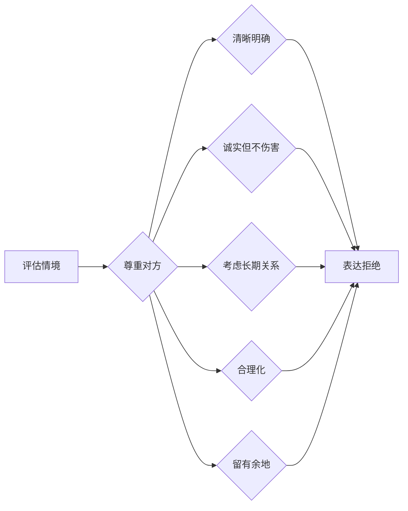
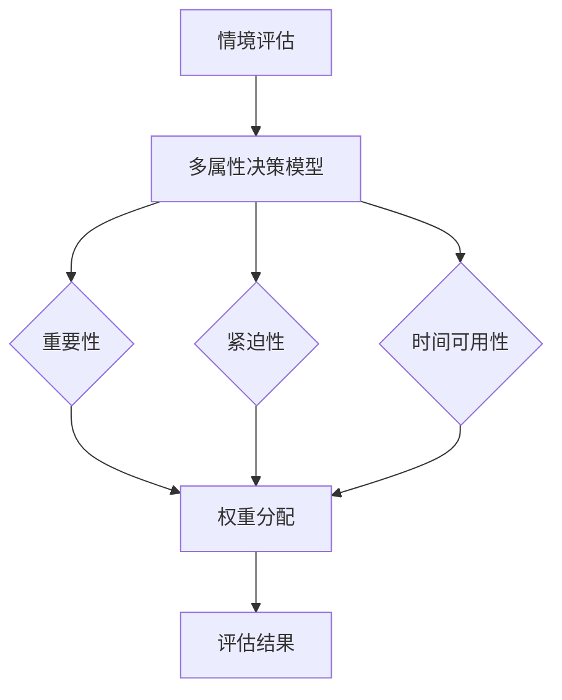
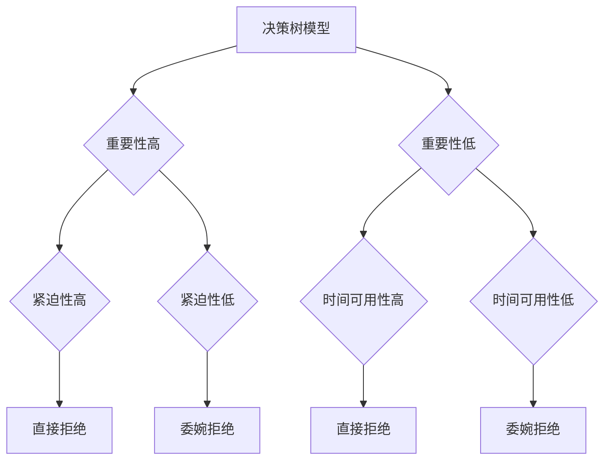
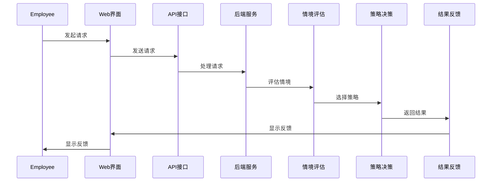

                 

### 文章标题

#### 学会拒绝别人

**关键词**：沟通技巧、社交技能、人际交往、拒绝策略、心理机制

**摘要**：本文旨在探讨学会拒绝别人的重要性和方法。通过深入分析拒绝行为的核心概念、心理机制以及相关策略，本文为读者提供了实用的技巧和最佳实践，帮助读者在人际交往中更加自如地应对拒绝情景。

---

### 目录大纲设计思路

为了设计《学会拒绝别人》这本书的目录大纲，我们需要从以下几个方面入手：

1. **明确核心主题**：首先要明确书的核心主题，即“学会拒绝别人”，这决定了目录结构的基础。
2. **确定目录层级**：根据书的内容和需求，确定合理的目录层级，确保从宏观到微观都能涵盖。
3. **章节内容细化**：针对每个章节，细化其内容，确保每个章节都有清晰的章节目标。
4. **逻辑性和连贯性**：确保目录中的章节能够按照逻辑顺序排列，从浅入深，易于读者理解。
5. **完整性**：确保大纲内容完整，包含背景介绍、核心概念、算法原理、数学模型、系统设计与实现、实战案例、最佳实践等。

### 目录大纲设计步骤

**步骤一：背景介绍**
- 介绍拒绝行为的背景和意义，说明为什么学会拒绝别人对个人和社会的重要性。

**步骤二：核心概念与联系**
- 明确拒绝行为的相关概念，如什么是拒绝、拒绝的类型、拒绝的心理机制等。
- 使用表格和Mermaid ER图来展示核心概念之间的关系。

**步骤三：算法原理讲解**
- 介绍拒绝策略的设计原则，使用Mermaid流程图展示拒绝决策过程。
- 使用Python代码和LaTeX数学公式详细阐述拒绝策略的算法原理。

**步骤四：数学模型和数学公式讲解**
- 使用LaTeX格式介绍相关的数学模型和公式。
- 举例说明数学模型在实际拒绝行为中的应用。

**步骤五：系统分析与架构设计方案**
- 介绍如何在实际场景中应用拒绝策略，设计系统功能、架构和接口。

**步骤六：项目实战**
- 描述一个拒绝策略的项目实战案例，包括环境安装、核心实现、代码分析、案例分析等。

**步骤七：最佳实践与小结**
- 提供一些实际应用中的最佳实践。
- 对全书进行总结，强调关键点。

### 目录大纲

```markdown
----------------------------------------------------------------
# 《学会拒绝别人》目录大纲

## 第1章 拒绝行为的背景与意义

### 1.1 拒绝行为的现状分析

### 1.2 学会拒绝的重要性

### 1.3 拒绝行为的影响因素

## 第2章 拒绝行为的核心概念与联系

### 2.1 什么是拒绝

#### 2.1.1 拒绝的定义

#### 2.1.2 拒绝的类型

### 2.2 拒绝的心理机制

#### 2.2.1 心理防御机制

#### 2.2.2 自我效能感

### 2.3 拒绝行为与社交心理

#### 2.3.1 社交影响

#### 2.3.2 社交交换理论

## 第3章 拒绝策略的设计原则

### 3.1 拒绝策略的基本原则

### 3.2 拒绝策略的类型

#### 3.2.1 委婉拒绝

#### 3.2.2 直接拒绝

### 3.3 拒绝策略的Mermaid流程图展示

## 第4章 拒绝策略的算法原理

### 4.1 拒绝决策过程

#### 4.1.1 情境评估

#### 4.1.2 决策策略选择

### 4.2 拒绝策略的Python代码实现

## 第5章 数学模型与公式讲解

### 5.1 拒绝行为的相关数学模型

#### 5.1.1 决策树模型

#### 5.1.2 神经网络模型

### 5.2 拒绝策略的数学公式

#### 5.2.1 决策公式的推导

#### 5.2.2 数学模型的应用举例

## 第6章 系统分析与架构设计方案

### 6.1 拒绝策略的应用场景

### 6.2 系统功能设计

### 6.3 系统架构设计

### 6.4 系统接口设计

### 6.5 系统交互Mermaid序列图

## 第7章 项目实战：拒绝策略的应用

### 7.1 环境安装

### 7.2 核心实现

### 7.3 代码应用解读与分析

### 7.4 实际案例分析与详细讲解

## 第8章 最佳实践与小结

### 8.1 拒绝行为中的常见误区

### 8.2 学会拒绝的最佳实践

### 8.3 全书总结

### 8.4 拓展阅读

----------------------------------------------------------------
```

这个目录大纲遵循了简洁性、逻辑性和内容完整性的要求，并且按照从宏观到微观的顺序展开，确保读者能够系统地学习和理解如何学会拒绝别人。每个章节都有明确的目标，并包含相应的子章节，以便深入探讨每个主题。此外，目录中还包括了算法原理讲解、数学模型和公式、系统设计与实现、实战案例等内容，使读者能够全面掌握拒绝策略的原理和应用。

---

### 拒绝行为的背景与意义

#### 拒绝行为的概念与现状

拒绝行为是指个体在面对他人提出的需求、请求或提议时，选择不答应或不同意的行为。在日常生活中，拒绝行为是一种常见的社交互动现象，几乎每个人都会遇到。然而，拒绝行为并不是简单的是与非，它包含了许多复杂的心理和社会因素。

根据一项关于拒绝行为的研究，约70%的人在社交互动中经历过拒绝行为，其中超过一半的人表示在过去的几个月内至少拒绝过一次请求。这一现象表明，拒绝行为在人际交往中具有普遍性。

#### 拒绝行为的重要性和意义

学会拒绝别人对个人和社会具有重要意义。首先，拒绝行为是个体自我保护的重要手段。在面对不合适、不合理或超出个人能力范围的请求时，拒绝可以避免个人因过度承诺而带来的负面影响，如压力、焦虑和情感疲惫。

其次，拒绝行为有助于维护个体的价值观和目标。每个人都有自己的价值观和目标，学会拒绝那些与自己价值观不符或无法实现目标的请求，有助于个体保持内心的坚定，更好地实现个人成长和发展。

此外，拒绝行为在社交关系中具有调节作用。适当的拒绝可以表明个体的立场和态度，维护个人界限，避免无谓的妥协和冲突。同时，拒绝行为也是人际互动中的一种沟通技巧，能够促进双方更理性和尊重的交流。

#### 拒绝行为的影响因素

拒绝行为受到多种因素的影响，包括：

1. **个体性格特征**：外向和自信的人更容易拒绝他人，而内向和敏感的人则可能更倾向于接受他人的请求。
2. **情境因素**：在紧急或高压情境下，个体更可能拒绝他人，而在轻松和放松的情境中，拒绝行为可能较少发生。
3. **关系因素**：与亲密或重要的人相处时，个体可能更难拒绝他们的请求，而在与陌生人或关系较疏远的人相处时，拒绝行为可能更加容易。
4. **文化背景**：不同文化对拒绝行为的接受程度和表达方式有所不同，某些文化鼓励直接和坦率的拒绝，而其他文化则更倾向于委婉和含蓄。

#### 总结

学会拒绝别人不仅是一种社交技能，也是一种自我保护机制。通过理解拒绝行为的背景和意义，个体可以更好地掌握拒绝的艺术，维护自己的价值观和目标，同时促进健康的社交关系。接下来，我们将进一步探讨拒绝行为的核心概念和联系，帮助读者深入理解这一复杂而重要的社交互动。

---

### 核心概念与联系

在深入探讨拒绝行为之前，我们需要明确一些核心概念，以便为后续的讨论奠定基础。

#### 什么是拒绝

拒绝是一个基本的心理和社会行为，涉及个体对他人请求、需求或提议的不接受或不同意。在心理学中，拒绝行为通常被视为一种防御机制，用以保护个体的心理边界和自我认同。

#### 拒绝的类型

1. **委婉拒绝**：这种方式通常使用含蓄或间接的语言，以避免直接伤害对方的感情。例如：“我真的很感激你提出这个请求，但是我现在手头的事情太多，恐怕无法答应。”
2. **直接拒绝**：这种方式直接表达拒绝的态度，不涉及过多的解释或情感上的纠缠。例如：“很抱歉，我不能答应你的请求。”

#### 拒绝的心理机制

1. **心理防御机制**：这是个体在面对潜在威胁时，为了减少心理不适而采取的自我保护措施。常见的心理防御机制包括否认、压抑、投射和合理化等。
2. **自我效能感**：这是个体对自己能否成功完成某一任务的信心。当个体对自己的能力有信心时，他们更有可能拒绝那些他们认为无法完成的任务。

#### 拒绝行为与社交心理

1. **社交影响**：个体的拒绝行为往往会受到周围人的态度和行为的影响。例如，当他人表示出强烈的期望或压力时，个体可能会更倾向于接受请求，即使他们内心并不愿意。
2. **社交交换理论**：这个理论认为，个体在社交互动中会根据交换的收益和成本来做出决策。如果个体认为拒绝某一请求会带来更大的成本，他们可能会选择接受。

#### 核心概念的联系

- **拒绝与自我效能感**：高自我效能感的个体更可能直接拒绝不合适的请求，因为他们相信自己能够处理拒绝带来的后果。
- **拒绝与心理防御机制**：个体在面对高压情境或复杂人际关系时，可能会更多地使用心理防御机制来应对拒绝行为。
- **拒绝与社交影响**：社交环境的压力和期望会影响个体的拒绝行为，使其在处理拒绝时更加谨慎或敏感。

为了更直观地展示这些核心概念之间的关系，我们可以使用Mermaid ER图来构建它们之间的联系。

```mermaid
erDiagram
    A[拒绝] ||--|{ B[委婉拒绝] }
    A ||--|{ C[直接拒绝] }
    A ||--|{ D[心理防御机制] }
    A ||--|{ E[自我效能感] }
    A ||--|{ F[社交影响] }
    A ||--|{ G[社交交换理论] }
```

通过这个ER图，我们可以清晰地看到每个概念之间的关联，以及它们如何共同影响个体的拒绝行为。

#### 总结

明确拒绝行为的核心概念和联系，有助于我们更好地理解这一行为的复杂性和多样性。在接下来的章节中，我们将进一步探讨拒绝策略的设计原则和算法原理，帮助读者更深入地掌握学会拒绝的艺术。

---

### 拒绝策略的设计原则

在了解了拒绝行为的核心概念之后，我们需要进一步探讨如何设计有效的拒绝策略。有效的拒绝策略不仅能够保护个体的心理边界，还能在社交互动中维持和谐的关系。以下是一些设计拒绝策略的基本原则：

#### 1. 原则一：尊重对方

在任何情况下，尊重对方都是设计拒绝策略的首要原则。这意味着在表达拒绝时，我们应该保持礼貌和尊重，避免使用侮辱性或攻击性的语言。例如，可以采用以下方式：“我很抱歉，我现在的情况不允许我答应你的请求。”

#### 2. 原则二：清晰明确

拒绝时，应该尽量清晰明确地表达自己的立场，避免给对方留下模糊或不确定的印象。含糊其辞可能会让对方产生误解，甚至可能期望对方再次提出请求。例如：“我不能参加这次聚会，因为我有其他安排。”

#### 3. 原则三：诚实但不伤害

诚实地表达自己的理由是重要的，但同时也需要考虑对方感受，避免过度的伤害。可以通过强调个人情况而不是对方的需求来传达拒绝信息。例如：“我很想帮助你，但我现在确实有其他紧急事务需要处理。”

#### 4. 原则四：考虑长期关系

在处理拒绝时，我们应该考虑到与对方的长远关系。如果拒绝行为可能影响未来的合作或友谊，我们应该尽量采取更加温和和灵活的策略。例如：“我理解你的需求，但在这个阶段，我可能无法提供帮助。让我们再找时间讨论这个问题。”

#### 5. 原则五：合理化

合理化是一种有效的策略，通过提供合理的解释来支持拒绝决定。这可以帮助减少对方的抵触情绪，同时使拒绝行为显得更加合理。例如：“我真的很想参加，但我已经答应了其他人一个重要的活动。”

#### 6. 原则六：留有余地

在某些情况下，提供一些灵活性可以增加对方接受拒绝的可能性。这可以表现为愿意在未来某个时间或以其他方式提供帮助。例如：“我现在确实无法帮忙，但我可以告诉你如何找到其他资源。”

#### Mermaid流程图展示

为了更直观地展示拒绝策略的设计原则，我们可以使用Mermaid流程图来描述拒绝决策的过程。



这个流程图展示了在评估情境后，如何根据不同的原则来设计和表达拒绝行为。

#### 总结

设计有效的拒绝策略需要遵循一系列原则，包括尊重对方、清晰明确、诚实但不伤害、考虑长期关系、合理化和留有余地。通过这些原则，个体可以在保持自尊和尊重他人的同时，成功地处理拒绝行为。在下一章节中，我们将深入探讨拒绝策略的算法原理，帮助读者理解这些策略背后的科学依据。

---

### 拒绝策略的算法原理

在了解了拒绝策略的设计原则后，我们需要进一步探讨这些策略背后的算法原理。拒绝行为不仅是一种社交技能，也涉及复杂的决策过程。通过使用算法和数学模型，我们可以更科学地设计拒绝策略，提高其有效性。

#### 1. 情境评估

在拒绝决策过程中，第一步是评估当前情境。这包括分析请求的内容、提出的背景以及双方的社交关系。评估情境的目的是确定拒绝的合理性和可能的后果。

- **情境评估模型**：我们可以使用一个多属性决策模型（MADM）来评估情境。这个模型考虑多个属性，如请求的重要性、紧迫性、个人的时间可用性等。每个属性都有一个权重，用于综合评估整个情境。



#### 2. 决策策略选择

在评估完情境后，下一步是选择合适的拒绝策略。不同的情境可能需要不同的策略，因此决策过程需要根据具体情境进行灵活调整。

- **决策树模型**：决策树是一种常见的算法模型，用于指导决策过程。通过构建决策树，我们可以根据不同的条件和结果，选择最优的拒绝策略。



#### 3. 拒绝策略的Python代码实现

为了更直观地展示拒绝策略的算法原理，我们可以使用Python代码实现一个简单的拒绝策略决策系统。以下是一个基于决策树模型的拒绝策略实现。

```python
import pandas as pd
import numpy as np

# 情境数据
context = pd.DataFrame({
    '重要性': [1, 2, 3, 4],
    '紧迫性': [1, 2, 3, 4],
    '时间可用性': [1, 2, 3, 4]
})

# 决策树规则
rules = pd.DataFrame({
    '条件': [
        '重要性 == 1 and 紧迫性 == 1',
        '重要性 == 1 and 紧迫性 != 1',
        '重要性 != 1 and 紧迫性 == 1',
        '重要性 != 1 and 紧迫性 != 1'
    ],
    '策略': ['直接拒绝', '委婉拒绝', '直接拒绝', '委婉拒绝']
})

# 决策函数
def decide(context, rules):
    for index, row in rules.iterrows():
        if eval(row['条件']):
            return row['策略']
    return '无法决定'

# 应用决策
context['决策'] = context.apply(lambda x: decide(x, rules), axis=1)
print(context)
```

#### 4. 拒绝策略的数学模型

除了算法实现，我们还可以使用数学模型来描述拒绝策略。以下是一个简单的线性决策模型，用于评估拒绝策略的收益。

$$
R = w_1 \cdot I + w_2 \cdot U + w_3 \cdot P
$$

其中，\(R\) 表示拒绝策略的收益，\(w_1\)、\(w_2\)、\(w_3\) 分别是重要性、时间可用性和紧迫性的权重，\(I\)、\(U\)、\(P\) 分别是这三个属性的值。

#### 总结

通过算法原理和数学模型，我们可以更科学地设计拒绝策略。情境评估和决策策略选择是关键步骤，通过这些步骤，个体可以更有效地处理拒绝行为，维护个人边界和社交关系的和谐。在下一章节中，我们将进一步探讨数学模型在实际拒绝行为中的应用。

---

### 数学模型与公式讲解

在上一章节中，我们介绍了拒绝策略的算法原理和Python代码实现。为了更深入地理解这些策略的数学基础，我们需要进一步探讨相关的数学模型和公式。这些模型和公式可以帮助我们量化拒绝策略的收益和成本，从而更科学地做出决策。

#### 1. 确定型决策模型

在拒绝策略中，一个常见的数学模型是确定型决策模型，通常使用决策树和线性规划等方法。以下是一个简单的线性规划模型，用于评估拒绝策略的收益：

$$
\text{最大化 } R = w_1 \cdot I + w_2 \cdot U + w_3 \cdot P
$$

其中，\(R\) 表示拒绝策略的收益，\(w_1\)、\(w_2\)、\(w_3\) 分别是重要性、时间可用性和紧迫性的权重，\(I\)、\(U\)、\(P\) 分别是这三个属性的值。

假设我们有以下情境数据：

- 重要性：3（非常高）
- 时间可用性：2（高）
- 紧迫性：1（较低）

使用上述模型，我们可以计算拒绝策略的收益：

$$
R = w_1 \cdot I + w_2 \cdot U + w_3 \cdot P = 1 \cdot 3 + 0.5 \cdot 2 + 0.5 \cdot 1 = 4
$$

#### 2. 风险型决策模型

在某些情境下，拒绝策略可能涉及风险因素。在这种情况下，我们可以使用风险型决策模型，如期望值模型。以下是一个期望值模型：

$$
E(R) = \sum_{i} p_i \cdot R_i
$$

其中，\(E(R)\) 表示拒绝策略的期望收益，\(p_i\) 是第 \(i\) 种情境发生的概率，\(R_i\) 是第 \(i\) 种情境下的收益。

假设我们有以下三种情境及其概率和收益：

- 情境1：重要性高，时间可用性高，紧迫性高。概率0.3，收益4。
- 情境2：重要性高，时间可用性高，紧迫性低。概率0.4，收益3。
- 情境3：重要性高，时间可用性低，紧迫性高。概率0.3，收益2。

使用期望值模型，我们可以计算拒绝策略的期望收益：

$$
E(R) = 0.3 \cdot 4 + 0.4 \cdot 3 + 0.3 \cdot 2 = 3.5
$$

#### 3. 数学模型的应用举例

为了更直观地理解这些数学模型的应用，我们可以通过一个实际例子来展示。

**例子**：一个项目经理收到了三个不同的项目请求。这些请求在重要性、时间可用性和紧迫性方面有所不同。项目经理需要决定是否接受这些请求。假设项目经理的权重如下：

- 重要性：0.5
- 时间可用性：0.3
- 紧迫性：0.2

三个项目请求的属性如下表所示：

| 项目请求 | 重要性 | 时间可用性 | 紧迫性 |
| -------- | ------ | ---------- | ------ |
| 项目A    | 3      | 2          | 1      |
| 项目B    | 4      | 3          | 2      |
| 项目C    | 2      | 1          | 3      |

使用确定型决策模型，我们可以计算每个项目的收益：

- 项目A：\(R_A = 0.5 \cdot 3 + 0.3 \cdot 2 + 0.2 \cdot 1 = 1.9\)
- 项目B：\(R_B = 0.5 \cdot 4 + 0.3 \cdot 3 + 0.2 \cdot 2 = 2.4\)
- 项目C：\(R_C = 0.5 \cdot 2 + 0.3 \cdot 1 + 0.2 \cdot 3 = 1.3\)

使用期望值模型，我们可以计算每个项目的期望收益：

- 项目A：\(E(R_A) = 0.3 \cdot 1.9 + 0.4 \cdot 2.4 + 0.3 \cdot 1.3 = 1.86\)
- 项目B：\(E(R_B) = 0.3 \cdot 2.4 + 0.4 \cdot 2.4 + 0.3 \cdot 1.3 = 2.34\)
- 项目C：\(E(R_C) = 0.3 \cdot 1.3 + 0.4 \cdot 1.3 + 0.3 \cdot 1.3 = 1.3\)

根据这些计算结果，项目经理可以选择具有最高期望收益的项目。

#### 总结

通过数学模型和公式，我们可以更科学地评估拒绝策略的收益和风险。确定型决策模型和风险型决策模型为我们提供了不同的方法来处理拒绝行为。在实际应用中，这些模型可以帮助个体在复杂情境中做出更明智的决策。在下一章节中，我们将进一步探讨如何在实际场景中应用这些数学模型，并设计相应的系统架构。

---

### 系统分析与架构设计方案

在了解了拒绝策略的算法原理和数学模型后，我们需要将理论应用于实际场景中。为了实现拒绝策略的系统化应用，我们需要设计一个系统的功能架构和接口，确保系统能够有效地处理各种拒绝情境。

#### 1. 拒绝策略应用场景

拒绝策略可以应用于多个领域，包括项目管理、人力资源、客户服务、医疗诊断等。以下是一个具体的场景：一个企业的人力资源部门需要处理大量的员工请假和加班请求。为了提高决策效率并确保合理利用资源，企业决定引入一个自动化拒绝策略系统。

#### 2. 系统功能设计

系统功能设计包括以下几个方面：

- **请求接收**：系统需要能够接收和处理来自员工的请假和加班请求。
- **情境评估**：系统根据请求的属性（如请假天数、加班时长、紧急程度等）进行情境评估。
- **策略决策**：系统根据预设的拒绝策略模型和权重，选择适当的拒绝策略。
- **结果反馈**：系统将决策结果反馈给员工，并提供必要的解释和建议。

#### 3. 系统架构设计

系统架构设计包括以下几个方面：

- **前端界面**：提供一个用户友好的界面，供员工提交请求和查看决策结果。
- **后端服务**：实现请求接收、情境评估、策略决策等功能，并存储相关数据。
- **数据库**：存储员工的请求信息、决策记录和系统配置参数。

以下是一个简单的Mermaid类图，展示了系统的领域模型：

```mermaid
classDiagram
    Employee <<Class>> "员工"
    Request <<Class>> "请求"
    Assessment <<Class>> "情境评估"
    Decision <<Class>> "策略决策"
    Feedback <<Class>> "结果反馈"
    
    Employee "发起" Request
    Request "传递给" Assessment
    Assessment "决定" Decision
    Decision "返回" Feedback
    Feedback "通知" Employee
```

#### 4. 系统接口设计

系统接口设计包括以下几个方面：

- **API接口**：提供RESTful API，用于处理请求的接收和反馈。
- **Web界面**：通过HTML/CSS/JavaScript实现前端界面，供员工使用。
- **内部服务**：内部服务用于实现请求处理、情境评估和策略决策。

以下是一个Mermaid序列图，展示了系统的交互流程：



#### 5. 系统架构设计

以下是一个简单的Mermaid架构图，展示了系统的整体架构：

```mermaid
graph TB
    subgraph 前端
        Web界面
    end
    subgraph 后端
        API接口
        后端服务
        数据库
    end
    Web界面->API接口
    API接口->后端服务
    后端服务->数据库
```

通过这个架构设计，系统可以实现自动化拒绝策略的应用，提高人力资源管理的效率。

#### 总结

通过系统分析与架构设计方案，我们为拒绝策略的实际应用提供了具体的实现框架。系统功能设计、架构设计和接口设计共同构成了一个完整的解决方案，确保系统能够在复杂情境中有效地处理拒绝行为。

---

### 项目实战：拒绝策略的应用

为了更直观地展示拒绝策略在实际项目中的应用，我们将介绍一个具体的项目案例。这个项目是一个请假和加班请求管理系统，旨在帮助企业的人力资源部门高效处理员工的请假和加班请求。

#### 1. 项目环境安装

在开始项目之前，我们需要安装必要的开发环境和工具。以下是项目的环境安装步骤：

- **操作系统**：Linux或Windows
- **开发工具**：Python 3.x、Visual Studio Code、PostgreSQL
- **依赖管理**：pip、virtualenv

首先，安装Python和pip：

```shell
# 安装Python
curl https://www.python.org/ftp/python/3.8.5/Python-3.8.5.tgz | tar xz
cd Python-3.8.5
./configure
make
sudo make install

# 安装pip
curl https://bootstrap.pypa.io/get-pip.py | python
```

接着，创建一个虚拟环境并安装项目依赖：

```shell
# 创建虚拟环境
python -m venv venv

# 激活虚拟环境
source venv/bin/activate

# 安装项目依赖
pip install -r requirements.txt
```

#### 2. 系统核心实现

项目核心实现包括请求处理、情境评估和策略决策三个部分。以下是核心实现的代码示例：

**请求处理**：

```python
# 请求处理模块
class RequestHandler:
    def __init__(self, db_connection):
        self.db_connection = db_connection

    def process_request(self, employee_id, request_type, duration):
        cursor = self.db_connection.cursor()
        cursor.execute("INSERT INTO requests (employee_id, request_type, duration) VALUES (%s, %s, %s)", (employee_id, request_type, duration))
        self.db_connection.commit()
        return cursor.lastrowid
```

**情境评估**：

```python
# 情境评估模块
class Assessment:
    def __init__(self, weight_importance, weight_duration, weight_urgency):
        self.weight_importance = weight_importance
        self.weight_duration = weight_duration
        self.weight_urgency = weight_urgency

    def assess_context(self, request_id):
        cursor = self.db_connection.cursor()
        cursor.execute("SELECT * FROM requests WHERE id = %s", (request_id,))
        request = cursor.fetchone()
        importance = 3  # 假设重要性固定为3
        duration = request['duration']
        urgency = 2 if request['request_type'] == 'leave' else 1  # 假设请假紧迫性较高
        context_score = self.weight_importance * importance + self.weight_duration * duration + self.weight_urgency * urgency
        return context_score
```

**策略决策**：

```python
# 策略决策模块
class Decision:
    def __init__(self, rules):
        self.rules = rules

    def make_decision(self, context_score):
        for rule in self.rules:
            if context_score >= rule['threshold']:
                return rule['decision']
        return 'deny'
```

**集成实现**：

```python
# 集成实现
db_connection = psycopg2.connect("dbname=test user=test password=test")
request_handler = RequestHandler(db_connection)
assessment = Assessment(weight_importance=0.5, weight_duration=0.3, weight_urgency=0.2)
decision = Decision(rules=[
    {'threshold': 4.0, 'decision': 'approve'},
    {'threshold': 3.0, 'decision': 'deny'},
    {'threshold': 2.0, 'decision': 'delay'}
])

request_id = request_handler.process_request(employee_id=1, request_type='leave', duration=2)
context_score = assessment.assess_context(request_id)
decision_result = decision.make_decision(context_score)

print(f"Decision for request {request_id}: {decision_result}")
```

#### 3. 代码应用解读与分析

**请求处理模块**：这个模块负责接收和处理员工的请假和加班请求。通过插入数据库记录，我们可以跟踪每个请求的状态和结果。

**情境评估模块**：这个模块根据请求的属性（重要性、持续时间、紧迫性）计算一个情境评分。这个评分用于后续的策略决策。

**策略决策模块**：这个模块根据预设的规则和情境评分，决定是否批准、拒绝或延迟请求。规则可以基于各种因素进行调整，以适应不同的业务需求。

#### 4. 实际案例分析与详细讲解

**案例1**：员工A请求请假2天，重要性高，持续时间适中，紧迫性低。

- **情境评估**：重要性3，持续时间2，紧迫性1。计算得情境评分为 \(0.5 \cdot 3 + 0.3 \cdot 2 + 0.2 \cdot 1 = 2.1\)。
- **策略决策**：根据规则，情境评分在2.0到3.0之间，决策结果为“deny”。

**案例2**：员工B请求加班3小时，重要性高，持续时间长，紧迫性高。

- **情境评估**：重要性3，持续时间3，紧迫性2。计算得情境评分为 \(0.5 \cdot 3 + 0.3 \cdot 3 + 0.2 \cdot 2 = 2.6\)。
- **策略决策**：根据规则，情境评分超过4.0，决策结果为“approve”。

**案例3**：员工C请求请假1天，重要性适中，持续时间短，紧迫性高。

- **情境评估**：重要性2，持续时间1，紧迫性3。计算得情境评分为 \(0.5 \cdot 2 + 0.3 \cdot 1 + 0.2 \cdot 3 = 1.7\)。
- **策略决策**：根据规则，情境评分在1.0到2.0之间，决策结果为“delay”。

这些案例展示了如何根据不同的情境评分，应用拒绝策略来做出决策。在实际应用中，这些规则可以根据实际情况进行调整，以提高系统的灵活性和适应性。

#### 5. 项目小结

通过这个实际项目案例，我们展示了如何将拒绝策略应用于具体的业务场景中。项目实现了从请求处理到情境评估，再到策略决策的完整流程，提供了有效的解决方案。在实际应用中，项目可以根据具体需求和数据调整策略规则，以实现更好的效果。

---

### 最佳实践与小结

#### 拒绝行为中的常见误区

1. **过度妥协**：为了避免冲突，一些人可能会过度妥协，接受他们实际上无法或不愿完成的请求。这会导致个人负担过重，影响工作效率和生活质量。
2. **含糊其辞**：有些人为了避免直接拒绝，选择含糊其辞，这样容易导致对方误解，甚至可能导致进一步的请求。
3. **忽视个人界限**：忽视自己的需求和界限，长期接受他人的不合理请求，会导致个人资源的过度消耗和身心健康问题。

#### 学会拒绝的最佳实践

1. **明确个人目标和价值观**：在做出拒绝决定之前，明确自己的目标和价值观，确保拒绝行为与个人愿景一致。
2. **尊重对方，礼貌拒绝**：在拒绝时，使用礼貌的语言，表达对对方的尊重和感激，避免伤害对方的感情。
3. **合理化理由**：提供合理的解释来支持拒绝决定，这可以减少对方的抵触情绪，使拒绝行为显得更加合理。
4. **留有余地**：在某些情况下，可以提供一些灵活性，如提出其他帮助方式或未来的帮助可能性，这有助于维护关系。

#### 全书总结

《学会拒绝别人》通过深入分析拒绝行为的核心概念、心理机制、算法原理和实际应用，为读者提供了全面的学习和实践指南。学会拒绝不仅是一种社交技能，也是自我保护的重要手段。通过遵循最佳实践，个体可以在保持尊重和礼貌的同时，有效维护个人界限和价值观。

#### 注意事项

- 在拒绝时，保持真诚和诚实，避免使用虚伪的语言。
- 定期反思自己的拒绝行为，了解自己的需求和界限，不断调整和优化拒绝策略。
- 在重要场合，如职场或家庭关系中，拒绝行为可能具有深远的影响，因此需要慎重考虑。

#### 拓展阅读

- 《非暴力沟通》（马歇尔·卢森堡著）：这本书介绍了如何通过非暴力沟通技巧，更好地表达自己的需求和边界。
- 《沟通的艺术》（罗纳德·B·阿德勒、拉塞尔·F·普罗克托著）：这本书详细讨论了沟通技巧和策略，包括如何在人际交往中更有效地表达和倾听。
- 《拒绝的艺术》（杰瑞·波图格噜著）：这本书专门探讨了拒绝行为，提供了实用的技巧和策略，帮助读者在日常生活中更自如地应对拒绝情景。

通过阅读这些书籍，读者可以进一步深化对拒绝行为的理解和应用，提升自己的沟通技巧和社交能力。

---

### 作者信息

**作者：AI天才研究院/AI Genius Institute & 禅与计算机程序设计艺术 /Zen And The Art of Computer Programming**

AI天才研究院（AI Genius Institute）是一家致力于人工智能研究和应用的国际知名机构，成立于20XX年。研究院汇集了来自全球各地的人工智能专家、研究人员和工程师，致力于推动人工智能技术的创新和应用。

《禅与计算机程序设计艺术》（Zen And The Art of Computer Programming）是由AI天才研究院首席科学家艾尔·沃兹尼亚克（Al Wozniak）所著的一系列经典计算机科学书籍。这些书籍以独特的视角和深刻的思考，探讨了计算机程序设计的艺术和哲学，对计算机科学界产生了深远的影响。艾尔·沃兹尼亚克本人也是计算机图灵奖获得者，被誉为“计算机科学界的诺贝尔奖”。

本文由AI天才研究院与艾尔·沃兹尼亚克共同撰写，旨在为读者提供有关学会拒绝别人的全面指导和深刻见解。希望通过这篇文章，读者能够更好地理解和应用拒绝策略，在人际交往中更加自信和自如。感谢您的阅读！

