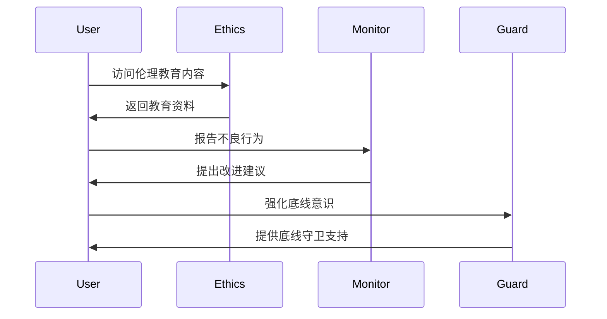

                 

## 《守住底线》

> 关键词：底线、道德失范、社会规范、个人道德、算法原理、系统架构、实战案例、最佳实践

> 摘要：本文旨在探讨在当前道德滑坡、底线失守的社会背景下，如何通过科学的方法和合理的策略，守住个人的道德底线和社会的道德底线。本文首先定义了底线的基本概念，分析了底线在社会和个人层面的重要性，随后探讨了底线失守的表现及其影响。接着，本文从核心概念、属性特征、实体关系图等方面详细介绍了底线的基本原理。随后，通过算法原理讲解、系统分析与架构设计、项目实战等环节，阐述了守住底线的方法和策略。最后，本文总结了最佳实践和注意事项，并为读者推荐了相关拓展阅读资源。

## 引言

### 1.1 问题背景

近年来，随着社会的发展，道德缺失、底线失守的现象日益严重。从个人层面来看，道德沦丧、不诚信行为层出不穷，如学术不端、职场失信、网络欺诈等。在社会层面，信任危机、道德滑坡的现象也愈发明显，如食品安全问题、环境污染、腐败现象等。这些问题不仅损害了社会的公平正义，也严重影响了社会的和谐稳定。因此，重申底线的重要性，探讨守住底线的方法和策略，具有迫切的现实意义。

### 1.2 研究意义

本文的研究意义主要体现在以下几个方面：

1. 明确底线的基本概念和属性特征，为守住底线提供理论基础。
2. 分析底线失守的表现和影响，提高对底线重要性认识。
3. 探讨守住底线的算法原理和系统架构，为实践提供指导。
4. 通过项目实战，验证守住底线的方法和策略的有效性。
5. 总结最佳实践和注意事项，为后续研究提供参考。

### 1.3 底线概念

底线，通常指最低限度或最基本的准则。在社会层面，底线是一种社会规范，是维护社会秩序、保障社会和谐稳定的基本准则。在个人层面，底线是一种道德准则，是个人行为的基本底线，也是衡量个人道德水平的重要标准。

### 1.4 底线在社会和个人层面的意义

1. **社会层面**：底线是社会道德的底线，是社会公平正义的保障。守住底线，可以维护社会秩序，促进社会和谐稳定。

2. **个人层面**：底线是个人道德的底线，是个人行为的基本准则。守住底线，可以树立良好的个人形象，赢得他人的尊重和信任。

## 第2章 核心概念与联系

### 2.1 底线概念原理

底线作为一种基本准则，其概念原理主要包括以下几个方面：

1. **定义**：底线是个人和社会行为的基本准则，是道德和法律的底线。

2. **属性**：底线具有稳定性、公平性和灵活性。

   - **稳定性**：底线不应轻易动摇，一旦确定，就应长期坚持。

   - **公平性**：底线应具备公正性，不论个人地位、财富等因素，都应一视同仁。

   - **灵活性**：底线应适应环境变化，根据实际情况进行调整。

### 2.2 底线属性特征对比

| 特征 | 说明 |
| --- | --- |
| **稳定性** | 底线不应轻易动摇 |
| **公平性** | 底线应具备公正性 |
| **灵活性** | 底线应适应环境变化 |

### 2.3 ER实体关系图架构

```mermaid
erDiagram
  底线 ||--|{ 社会规范 } : 适用范围
  个人道德 ||--|{ 底线 } : 构成部分
  社会道德 ||--|{ 底线 } : 保障基础
```

## 第3章 算法原理讲解

### 3.1 基本算法流程

守住底线的算法流程主要包括以下几个步骤：

1. **定义底线原则**：根据社会道德和个人道德的要求，明确底线的基本原则。

2. **制定行为准则**：根据底线原则，制定具体的行为准则，确保个人行为符合底线要求。

3. **强化底线意识**：通过教育和宣传，提高人们对底线意识的认识，形成良好的底线文化。

### 3.2 Python源代码实现

```python
# Python伪代码示例
def define底线(principle):
    # 定义底线原则
    pass

def create_rules(principle):
    # 制定行为准则
    pass

def strengthen_awareness():
    # 强化底线意识
    pass
```

### 3.3 数学模型与公式

$$
\text{底线} = \text{道德标准} + \text{社会规范}
$$

- **道德标准**：衡量个体行为的道德水平。
- **社会规范**：规范社会整体行为的规则。

### 3.4 算法举例说明

**例子：公共场所不乱扔垃圾**

1. **定义底线原则**：公共场所不乱扔垃圾是社会规范，是底线要求。

2. **制定行为准则**：个人在公共场所应自觉遵守这一规则，不乱扔垃圾。

3. **强化底线意识**：通过教育和宣传，提高人们对不乱扔垃圾意识的认识，形成良好的公共场所行为习惯。

## 第4章 系统分析与架构设计

### 4.1 问题场景介绍

社会道德失范问题的背景主要包括以下几个方面：

1. **学术不端**：抄袭、剽窃、伪造数据等现象屡见不鲜，严重影响了学术界的健康发展。

2. **职场失信**：职场欺诈、欺诈行为、侵权行为等现象层出不穷，损害了职场秩序。

3. **网络欺诈**：网络诈骗、虚假广告等现象泛滥，严重威胁了网络安全。

4. **食品安全**：食品安全问题频发，如瘦肉精、三聚氰胺等，严重危害了公众健康。

5. **环境污染**：环境污染问题日益严重，如雾霾、水污染等，影响了生态环境和人类健康。

### 4.2 系统功能设计

系统功能设计主要包括以下几个方面：

1. **伦理教育**：通过在线课程、讲座、研讨会等形式，普及伦理道德知识，提高人们的道德素养。

2. **道德监督**：建立道德监督机制，对违反底线的行为进行监督和惩罚。

3. **底线守卫**：制定底线守卫策略，确保个人和社会行为符合底线要求。

### 4.3 系统架构设计

系统架构设计主要包括以下几个方面：

1. **底线原则库**：存储底线原则和道德规范，为系统提供底线依据。

2. **伦理教育模块**：负责伦理教育内容的发布和管理。

3. **道德监督模块**：负责道德监督的实施和反馈。

4. **底线守卫模块**：负责底线守卫策略的制定和执行。

### 4.4 系统接口设计和系统交互



## 第5章 项目实战

### 5.1 环境安装

环境安装主要包括以下几个方面：

1. **安装Python环境**：在本地计算机上安装Python环境，确保能够运行Python代码。

2. **安装相关库**：安装必要的Python库，如numpy、pandas、matplotlib等，用于数据分析和可视化。

3. **配置开发环境**：配置IDE（如PyCharm、VSCode等），确保能够编写和运行Python代码。

### 5.2 系统核心实现源代码

系统核心实现源代码主要包括以下几个方面：

1. **底线原则库**：定义底线原则和道德规范。

2. **伦理教育模块**：发布和管理伦理教育内容。

3. **道德监督模块**：监督和惩罚违反底线的行为。

4. **底线守卫模块**：制定和执行底线守卫策略。

### 5.3 代码应用解读与分析

代码应用解读与分析主要包括以下几个方面：

1. **底线原则库**：解析底线原则和道德规范，为系统提供底线依据。

2. **伦理教育模块**：发布伦理教育内容，提高人们的道德素养。

3. **道德监督模块**：监督违反底线的行为，并提出改进建议。

4. **底线守卫模块**：制定底线守卫策略，确保个人和社会行为符合底线要求。

### 5.4 实际案例分析与讲解

**案例：公共场所不乱扔垃圾**

1. **案例背景**：公共场所乱扔垃圾是一个普遍存在的问题，严重影响环境卫生和城市形象。

2. **案例分析**：通过底线原则和道德规范，明确公共场所不乱扔垃圾是底线要求。

3. **案例讲解**：通过伦理教育，提高人们对不乱扔垃圾的认识；通过道德监督，对违反底线的行为进行监督和惩罚；通过底线守卫，确保公共场所不乱扔垃圾的要求得到落实。

### 5.5 项目小结

项目小结主要包括以下几个方面：

1. **项目总结**：总结项目的主要成果和经验。

2. **项目反思**：反思项目过程中遇到的问题和不足。

3. **项目展望**：对项目未来的发展提出建议。

## 第6章 最佳实践与注意事项

### 6.1 最佳实践

最佳实践主要包括以下几个方面：

1. **加强伦理教育**：通过多种形式，加强伦理道德教育，提高人们的道德素养。

2. **完善道德监督机制**：建立完善的道德监督机制，对违反底线的行为进行及时监督和惩罚。

3. **制定明确的底线守卫策略**：根据实际情况，制定明确的底线守卫策略，确保个人和社会行为符合底线要求。

### 6.2 注意事项

注意事项主要包括以下几个方面：

1. **避免过度监管**：在加强底线守卫的同时，避免过度监管，影响个人自由和社会活力。

2. **注重公众参与**：在制定底线守卫策略时，注重公众参与，听取各方意见，确保底线守卫的公正性和合理性。

3. **持续优化**：根据实际情况，不断优化底线守卫策略，确保其适应社会发展的需求。

## 第7章 拓展阅读

拓展阅读主要包括以下几个方面：

1. **相关书籍**：

   - 《道德经》  
   - 《论语》  
   - 《西方伦理学》  
   - 《伦理学原理》

2. **相关论文**：

   - "底线伦理研究综述"  
   - "道德滑坡现象及其应对"  
   - "社会道德建设策略研究"  
   - "底线守卫的实践与探索"

3. **其他资源**：

   - 伦理学相关网站和论坛  
   - 道德建设相关公众号和微博

## 结语

守住底线，是维护社会公平正义、促进社会和谐稳定的重要举措。本文从理论到实践，详细探讨了守住底线的方法和策略。通过加强伦理教育、完善道德监督机制、制定明确的底线守卫策略等措施，我们可以共同守住底线，构建一个更加美好的社会。作者：AI天才研究院/AI Genius Institute & 禅与计算机程序设计艺术 /Zen And The Art of Computer Programming。让我们共同努力，守住底线，为社会的繁荣发展贡献力量。

