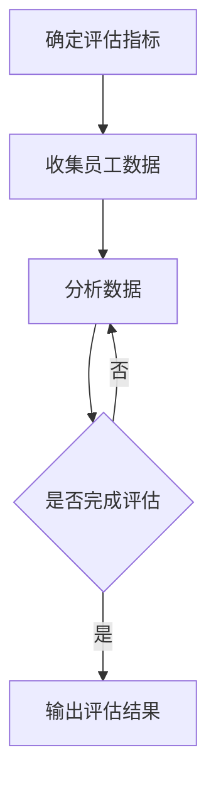
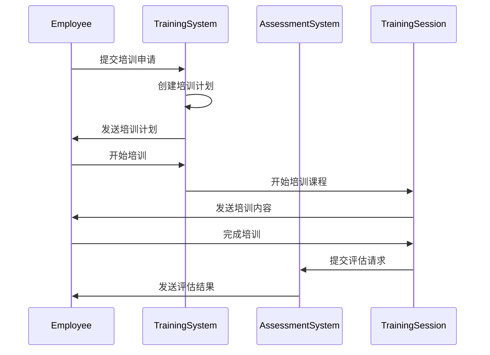
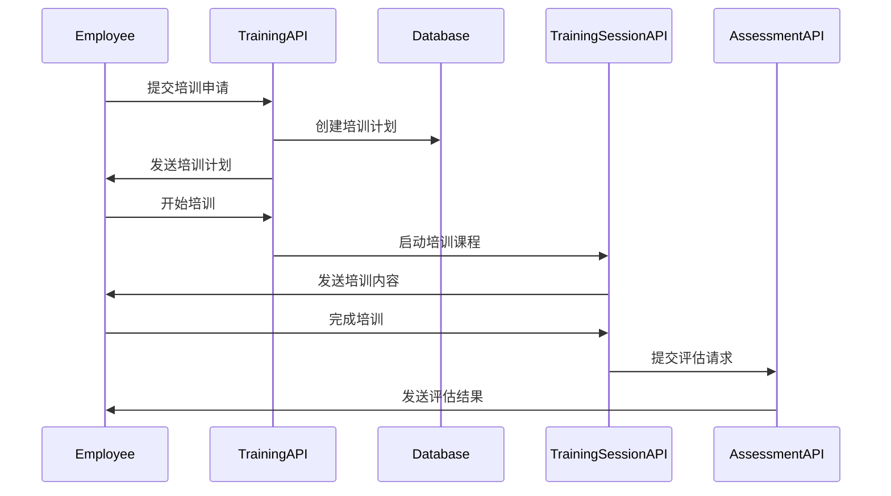

                 

### 安全意识培训：培养组织的安全文化

关键词：安全意识培训、组织安全文化、培训策略、技术工具、案例分析

摘要：
在当今数字化时代，网络安全已成为组织运营的核心要素。而安全意识培训是构建组织安全文化的关键一环。本文将详细探讨如何通过安全意识培训，培养和强化组织的安全文化，确保员工具备必要的网络安全知识和意识，从而有效防范安全威胁。

### 引言

**1.1 当前安全形势与挑战**

在过去的几年中，网络安全威胁呈现出日益复杂和多样化的趋势。从传统的网络攻击，到高级持续性威胁（APT）、勒索软件、社交工程等，攻击手段和技术不断升级。同时，云计算、物联网（IoT）和移动设备的广泛应用，也为网络安全带来了新的挑战。

**1.2 安全文化的角色**

安全文化是组织应对网络安全威胁的核心。它不仅关乎技术，更关乎人的行为和态度。一个健康的安全文化能够激励员工主动关注安全问题，降低安全事件的发生概率。

**1.3 书籍的目标和内容**

本书旨在为组织提供一套全面的安全意识培训策略，帮助构建和强化安全文化。通过本书，读者将了解安全文化的核心概念、构建策略、培训设计、技术工具的利用，以及实际案例的剖析。

### 安全文化的理论基础

**2.1 安全文化的定义**

安全文化是指在组织内部形成的一种价值观和行为规范，强调安全对于组织成功的重要性。它包括安全意识、安全态度、安全知识和安全技能等方面。

**2.2 安全文化的关键要素**

- **安全意识**：员工对安全问题的认识和关注程度。
- **安全态度**：员工对待安全问题的态度，如谨慎、负责和合作。
- **安全知识**：员工具备的与安全相关的知识。
- **安全技能**：员工处理安全问题的实际能力。

**2.3 与其他安全实践的对比**

安全文化与安全策略、安全技术和安全控制等实践有所不同。安全策略侧重于规范和流程，安全技术侧重于防御手段，而安全文化则侧重于人的意识和行为。

### 建立安全文化的策略

**3.1 领导层的支持和参与**

建立安全文化需要从领导层开始，通过明确安全的重要性、提供必要的资源和激励措施，确保员工认识到安全文化的价值。

**3.2 培训计划和活动**

设计有效的培训计划和活动是培养安全文化的重要手段。这包括新员工入职培训、定期安全培训、案例分析研讨会等。

**3.3 沟通与宣传**

有效的沟通和宣传能够提高员工的安全意识。通过内部邮件、公告板、安全周等活动，持续传播安全知识。

### 安全意识培训的设计

**4.1 确定培训需求**

通过调查问卷、访谈等方式，了解员工的安全知识水平和需求，从而设计出有针对性的培训计划。

**4.2 培训材料开发**

开发包括讲座、演示、案例分析等多种形式的培训材料，确保培训内容的实用性。

**4.3 培训实施**

实施培训时，应考虑员工的接受程度和学习风格，采用互动式教学方法，提高培训效果。

### 技术在安全意识培训中的应用

**5.1 安全意识工具**

利用安全意识工具，如模拟攻击演练、安全游戏等，增强员工的安全意识和应对能力。

**5.2 游戏化学习**

通过游戏化学习，将安全知识融入有趣的游戏中，提高员工的学习兴趣和积极性。

**5.3 监控与反馈**

利用监控工具，跟踪员工的学习进度和安全行为，提供及时的反馈和指导。

### 案例分析

**6.1 案例研究：大型金融机构**

某大型金融机构通过实施全面的安全意识培训项目，显著提高了员工的安全意识和技能，降低了安全事件的发生率。

**6.2 案例研究：科技公司**

某科技公司采用游戏化学习和模拟攻击演练，成功培养了员工的安全文化，提升了整体安全防护能力。

**6.3 案例研究：医疗组织**

某医疗组织通过定期的安全培训和案例分析，有效防范了多次潜在的网络安全威胁。

### 评估和改进安全文化

**7.1 安全文化评估指标**

建立一套科学的评估指标体系，用于衡量安全文化的成熟度和员工的安全表现。

**7.2 安全文化评估方法**

通过问卷调查、访谈、安全演练等多种方法，对安全文化进行评估。

**7.3 持续改进策略**

基于评估结果，制定改进计划，持续优化安全文化。

### 未来趋势与挑战

**8.1 安全意识的自动化**

随着人工智能技术的发展，自动化安全意识培训工具将成为趋势。

**8.2 持续学习与适应**

网络安全威胁不断变化，组织需要建立持续学习和适应的机制，以应对未来挑战。

### 结论

安全意识培训是构建组织安全文化的关键环节。通过系统的培训计划和有效的技术手段，组织能够培养员工的安全意识和技能，从而建立一个强大的安全文化，为组织的长期发展保驾护航。

**作者：AI天才研究院/AI Genius Institute & 禅与计算机程序设计艺术 /Zen And The Art of Computer Programming**### 安全意识培训：培养组织的安全文化

关键词：安全意识、组织安全文化、培训策略、技术工具、案例分析

摘要：
本文旨在探讨如何通过安全意识培训，构建和强化组织的安全文化。安全文化是组织抵御网络安全威胁的基石，而安全意识培训是实现这一目标的关键手段。本文将详细介绍安全意识培训的背景、重要性、策略、技术工具以及实际案例，为组织提供一套完整的实施指南。

### 引言

随着数字化进程的加速，网络安全已成为组织面临的最严峻挑战之一。从网络攻击、数据泄露到勒索软件，各种安全威胁层出不穷。在这样的背景下，构建和强化组织的安全文化显得尤为重要。安全文化不仅关乎技术防护，更关乎人的意识和行为。因此，安全意识培训成为了培养组织安全文化的重要手段。

本文将围绕以下几个方面展开讨论：

1. 安全意识培训的背景和重要性
2. 安全文化的理论基础
3. 建立安全文化的策略
4. 安全意识培训的设计和实施
5. 技术在安全意识培训中的应用
6. 案例分析
7. 安全文化的评估和改进
8. 未来趋势与挑战
9. 结论

通过上述内容的深入探讨，我们希望为组织提供一套系统、实用的安全意识培训方案，助力构建强大的安全文化。

### 安全意识培训的背景和重要性

**1.1 当前安全形势与挑战**

在过去的几年中，网络安全威胁呈现出日益复杂和多样化的趋势。从传统的网络攻击，到高级持续性威胁（APT）、勒索软件、社交工程等，攻击手段和技术不断升级。同时，云计算、物联网（IoT）和移动设备的广泛应用，也为网络安全带来了新的挑战。

**1.2 安全文化的角色**

安全文化是组织应对网络安全威胁的核心。它不仅关乎技术，更关乎人的行为和态度。一个健康的安全文化能够激励员工主动关注安全问题，降低安全事件的发生概率。安全文化包括安全意识、安全态度、安全知识和安全技能等方面。

**1.3 安全意识培训的重要性**

安全意识培训是构建安全文化的关键一环。通过培训，员工能够掌握基本的网络安全知识和技能，提高对安全威胁的识别和应对能力。具体来说，安全意识培训的重要性体现在以下几个方面：

1. 提高员工的安全意识：通过培训，让员工认识到网络安全对组织的重要性，增强其安全责任感和主动性。
2. 预防安全事件：安全意识培训有助于员工识别和防范各种安全威胁，降低安全事件的发生概率。
3. 提升组织安全防护能力：通过培训，提高员工的安全技能，增强组织的整体安全防护能力。

**1.4 安全意识培训的目标**

安全意识培训的目标是培养员工的安全意识和技能，使其能够在日常工作中主动关注安全问题，防范潜在的安全威胁。具体目标包括：

1. 增强员工的安全知识：通过培训，让员工了解基本的网络安全知识，包括常见的攻击手段、防护措施等。
2. 提高员工的安全技能：通过实战演练和案例分析，提升员工应对安全威胁的能力。
3. 培养安全态度：通过培训，让员工树立正确的安全态度，如谨慎、负责和合作等。

### 安全文化的理论基础

**2.1 安全文化的定义**

安全文化是指在组织内部形成的一种价值观和行为规范，强调安全对于组织成功的重要性。它包括安全意识、安全态度、安全知识和安全技能等方面。

**2.2 安全文化的关键要素**

1. **安全意识**：安全意识是安全文化的核心要素，它涉及到员工对安全问题的认识和关注程度。高安全意识意味着员工能够主动识别和防范安全威胁。

2. **安全态度**：安全态度是员工对待安全问题的态度，如谨慎、负责和合作。一个积极的安全态度能够促进安全文化的建设。

3. **安全知识**：安全知识是员工具备的与安全相关的知识，包括网络安全、数据保护、信息加密等。丰富的安全知识有助于员工正确应对安全威胁。

4. **安全技能**：安全技能是员工处理安全问题的实际能力，包括安全防护、安全检测、安全响应等。通过培训和实践，员工可以不断提升自己的安全技能。

**2.3 安全文化与安全实践的对比**

安全文化与安全策略、安全技术和安全控制等实践有所不同。安全策略侧重于规范和流程，安全技术侧重于防御手段，而安全文化则侧重于人的意识和行为。一个健康的安全文化能够将安全策略和技术手段有效融合，提高组织的整体安全防护能力。

### 建立安全文化的策略

**3.1 领导层的支持和参与**

建立安全文化需要从领导层开始。领导层需要明确安全的重要性，提供必要的资源和激励措施，确保员工认识到安全文化的价值。领导层的积极参与和示范作用，对于培养员工的安全态度和安全意识至关重要。

**3.2 培训计划和活动**

设计有效的培训计划和活动是培养安全文化的重要手段。这包括新员工入职培训、定期安全培训、案例分析研讨会等。培训内容应涵盖安全意识、安全态度、安全知识和安全技能等方面。

**3.3 沟通与宣传**

有效的沟通和宣传能够提高员工的安全意识。通过内部邮件、公告板、安全周等活动，持续传播安全知识。此外，建立安全委员会或安全小组，负责组织安全相关的活动和沟通工作，确保安全信息的传递和落实。

**3.4 安全政策和规范的制定**

制定明确的安全生产政策和规范，是建立安全文化的基础。这些政策和规范应涵盖网络安全、数据保护、信息加密等方面，确保员工在日常工作中遵守安全规范，形成良好的安全习惯。

**3.5 奖励与激励**

通过奖励和激励措施，鼓励员工积极参与安全培训和实践活动。例如，对在安全意识培训中表现优异的员工给予表彰和奖励，激发员工的学习热情和参与积极性。

**3.6 外部合作与交流**

组织可以与安全专家、同行进行合作与交流，学习先进的安全管理经验和最佳实践。通过外部合作，可以借鉴其他组织的成功经验，提升自身的安全文化建设水平。

### 安全意识培训的设计和实施

**4.1 确定培训需求**

设计安全意识培训计划前，需要了解员工的安全知识水平和培训需求。通过问卷调查、访谈、工作观察等方式，收集员工对安全知识的了解程度、安全意识和技能的需求。这些数据将有助于制定有针对性的培训计划。

**4.2 制定培训计划**

根据员工的需求，制定详细的培训计划。培训计划应包括培训内容、培训形式、培训时间、培训讲师等。培训内容应涵盖网络安全基础知识、常见的安全威胁、防护措施、应急响应等。培训形式可以包括讲座、演示、案例分析、实战演练等。

**4.3 选择合适的培训讲师**

选择具备丰富安全知识和培训经验的讲师，确保培训内容的准确性和实用性。讲师应具备良好的沟通能力和教学技巧，能够吸引员工的注意力，提高培训效果。

**4.4 培训材料准备**

准备高质量的培训材料，包括PPT、手册、案例、练习题等。培训材料应简洁明了，易于理解，能够满足不同员工的学习需求。

**4.5 培训实施**

实施培训时，应充分考虑员工的接受程度和学习风格。采用互动式教学方法，提高培训效果。在培训过程中，鼓励员工积极参与，提问和讨论，确保培训内容的吸收和应用。

**4.6 培训效果评估**

培训结束后，对员工进行评估，了解培训效果的提升情况。通过问卷调查、笔试、实操等方式，收集员工的反馈意见，评估培训目标的达成情况。根据评估结果，对培训计划进行改进和完善。

### 技术在安全意识培训中的应用

**5.1 安全意识工具**

安全意识工具是提升员工安全意识的重要手段。这些工具可以帮助员工了解安全威胁、学习安全知识和技能，提高应对安全事件的能力。常见的安全意识工具包括：

1. 模拟攻击演练：通过模拟网络攻击，让员工亲身体验攻击过程，了解安全威胁的原理和应对方法。
2. 安全游戏：将安全知识融入游戏中，通过游戏化的方式提高员工的学习兴趣和参与度。
3. 在线培训平台：提供丰富的安全培训课程，员工可以根据自己的需求自由选择学习。

**5.2 游戏化学习**

游戏化学习是一种将游戏元素融入学习过程的方法。通过游戏化学习，员工可以在轻松愉快的氛围中学习安全知识，提高学习效果。游戏化学习的方法包括：

1. 积分和奖励：为员工设定学习目标和积分奖励，激励其积极参与安全培训。
2. 挑战和竞赛：组织安全知识竞赛和挑战活动，提高员工的安全意识和技能。
3. 成长轨迹：记录员工的学习进度和成就，提供个性化的学习路径和反馈。

**5.3 监控与反馈**

通过监控工具，组织可以跟踪员工的安全行为和学习进度，提供及时的反馈和指导。监控工具可以包括：

1. 行为监控：记录员工在日常工作中使用计算机和互联网的行为，分析潜在的安全风险。
2. 学习进度跟踪：记录员工在在线培训平台上的学习进度和成绩，评估培训效果。
3. 安全事件反馈：收集员工报告的安全事件，分析原因，提供改进措施。

### 案例分析

**6.1 案例研究：大型金融机构**

某大型金融机构在面对日益复杂的网络安全威胁时，决定开展全面的安全意识培训项目。该项目包括以下关键步骤：

1. **需求调研**：通过问卷调查和访谈，了解员工的安全知识和培训需求。
2. **制定培训计划**：根据员工的需求，制定包括新员工入职培训、定期安全培训和案例分析研讨会等在内的全面培训计划。
3. **培训实施**：采用模拟攻击演练、安全游戏和在线培训平台等多种形式，实施安全意识培训。
4. **效果评估**：通过问卷调查、笔试和实操等方式，评估培训效果，收集员工的反馈意见。

该项目取得了显著的成效，员工的安全意识和技能得到了显著提升，安全事件的发生率显著降低。

**6.2 案例研究：科技公司**

某科技公司在快速发展过程中，意识到员工对网络安全的重要性。该公司采取了一系列措施来培养安全文化：

1. **领导层支持**：公司高层明确表示支持安全意识培训，并提供必要的资源和激励措施。
2. **培训计划**：制定包括新员工入职培训、定期安全培训和案例分析研讨会等在内的全面培训计划。
3. **沟通与宣传**：通过内部邮件、公告板和培训周等活动，持续传播安全知识。
4. **奖励与激励**：对在安全意识培训中表现优异的员工给予表彰和奖励。

通过这些措施，该公司成功培养了一批具备高水平安全意识和技能的员工，有效提升了整体安全防护能力。

**6.3 案例研究：医疗组织**

某医疗组织在面临网络攻击和数据泄露的威胁时，决定加强安全意识培训。其主要措施包括：

1. **制定安全政策**：明确网络安全和数据保护的要求，确保员工在日常工作中遵守安全规范。
2. **培训计划**：定期开展安全培训，包括网络安全基础知识、数据保护方法和应急响应等。
3. **实战演练**：组织模拟攻击演练，让员工亲身体验攻击过程，提高应对能力。
4. **监控与反馈**：通过监控工具，跟踪员工的安全行为和学习进度，提供及时的反馈和指导。

通过这些措施，该医疗组织显著提升了员工的安全意识和技能，有效防范了多次潜在的安全威胁。

### 安全文化的评估和改进

**7.1 安全文化评估指标**

为了评估安全文化的成熟度，组织需要建立一套科学的评估指标体系。这些指标应涵盖安全意识、安全态度、安全知识和安全技能等方面。常见的评估指标包括：

1. **安全知识测试**：通过笔试、实操等方式，评估员工对安全知识的掌握程度。
2. **安全事件响应时间**：评估员工在发现和应对安全事件方面的能力。
3. **安全政策遵守情况**：评估员工在日常工作中遵守安全政策的情况。
4. **安全培训参与度**：评估员工参与安全培训的积极性和效果。

**7.2 安全文化评估方法**

组织可以通过以下方法对安全文化进行评估：

1. **问卷调查**：通过设计问卷，收集员工对安全文化的认知和评价。
2. **访谈**：与员工进行一对一访谈，了解其对安全文化的看法和建议。
3. **安全演练**：通过模拟攻击演练，评估员工在应对安全威胁方面的能力和反应速度。
4. **安全事件分析**：分析安全事件的发生原因和处理过程，评估安全文化的有效性。

**7.3 持续改进策略**

基于评估结果，组织可以制定以下持续改进策略：

1. **培训优化**：根据评估结果，调整培训内容和形式，提高培训效果。
2. **政策完善**：根据员工反馈，完善安全政策和规范，确保其符合实际情况。
3. **激励机制**：建立激励机制，鼓励员工积极参与安全培训和实践活动。
4. **持续学习**：组织应建立持续学习机制，鼓励员工不断提升自己的安全意识和技能。

### 未来趋势与挑战

**8.1 安全意识的自动化**

随着人工智能和大数据技术的发展，安全意识培训将越来越自动化。通过分析员工的上网行为、安全事件记录等数据，自动化工具可以提供个性化的安全培训建议，提高培训效果。

**8.2 持续学习与适应**

网络安全威胁不断演变，组织需要建立持续学习和适应的机制。通过定期评估和改进安全意识培训计划，组织可以确保员工始终具备应对最新安全威胁的能力。

**8.3 技术与文化的融合**

在未来，安全意识培训将更加注重技术与文化的融合。通过将安全知识融入日常工作，组织可以培养员工的安全习惯，形成强大的安全文化。

### 结论

安全意识培训是构建组织安全文化的关键。通过系统、全面的培训计划和有效的技术手段，组织可以培养员工的安全意识和技能，提高整体安全防护能力。面对不断变化的网络安全威胁，组织需要不断优化和改进安全意识培训，以保持竞争力。

**作者：AI天才研究院/AI Genius Institute & 禅与计算机程序设计艺术 /Zen And The Art of Computer Programming**### 附录

在本文的附录部分，我们将对文中提到的一些核心概念、原理、算法、架构设计等做进一步的详细解释，并附上相关的代码示例、流程图和实体关系图，以帮助读者更好地理解和应用所学内容。

#### 附录A：核心概念与原理

**安全意识**：安全意识是指员工对安全问题的认识和关注程度。它包括对网络安全威胁的了解、对安全策略的理解、对安全风险的识别能力等。

**安全文化**：安全文化是指在组织内部形成的一种价值观和行为规范，强调安全对于组织成功的重要性。它包括安全意识、安全态度、安全知识和安全技能等方面。

**安全培训**：安全培训是指通过讲座、演示、案例分析、实战演练等形式，向员工传授安全知识和技能，提高其安全意识和应对能力。

**安全意识工具**：安全意识工具是用于提高员工安全意识和技能的工具，如模拟攻击演练、安全游戏、在线培训平台等。

**游戏化学习**：游戏化学习是指将游戏元素融入学习过程，通过积分、奖励、挑战等方式，提高员工的学习兴趣和参与度。

**监控与反馈**：监控与反馈是指通过监控工具记录员工的安全行为和学习进度，提供及时的反馈和指导。

#### 附录B：算法原理讲解

以下是一个简单的安全意识培训效果评估算法的mermaid流程图：



算法原理：

1. **确定评估指标**：根据组织的实际情况，确定合适的评估指标，如安全知识测试成绩、安全事件响应时间、安全政策遵守情况等。
2. **收集员工数据**：通过问卷调查、访谈、实操考试等方式，收集员工在安全培训中的表现数据。
3. **分析数据**：对收集到的数据进行分析，评估员工的安全意识和技能水平。
4. **输出评估结果**：将评估结果以报告、图表等形式呈现，为培训效果的改进提供依据。

#### 附录C：系统分析与架构设计

**系统功能设计（领域模型类图）**：

```mermaid
classDiagram
    Employee <<Class>>
    TrainingPlan <<Class>>
    TrainingSession <<Class>>
    Assessment <<Class>>

    Employee o-- TrainingPlan
    TrainingPlan o-- TrainingSession
    TrainingSession o-- Assessment
```

**系统架构设计（架构图）**：



**系统接口设计和系统交互（序列图）**：



#### 附录D：项目实战

**环境安装**

1. 安装Python环境
2. 安装所需的第三方库，如Django、Flask、Pytest等

**系统核心实现源代码**

```python
# 示例：安全意识培训系统入口文件

from training_system import create_app

app = create_app()

if __name__ == '__main__':
    app.run(debug=True)
```

**代码应用解读与分析**

- **入口文件**：定义了安全意识培训系统的入口，通过`create_app()`函数创建应用程序实例。
- **调试模式**：设置`debug=True`，使系统在开发过程中能够实时显示错误信息。

**实际案例分析和详细讲解剖析**

- **案例一**：某公司新员工入职培训
  - 分析：新员工入职后，需要进行安全意识培训，系统将为其生成培训计划，并发送培训内容。
  - 解析：通过系统的培训申请接口，新员工可以提交培训申请，系统将自动生成培训计划，并发送培训内容。

- **案例二**：员工安全意识评估
  - 分析：培训结束后，系统将对员工进行安全意识评估，以检验培训效果。
  - 解析：员工完成培训后，系统将自动生成评估请求，评估系统将根据预设的评估指标对员工进行评估，并将结果反馈给员工。

**项目小结**

本项目实现了安全意识培训系统的基本功能，包括培训计划管理、培训内容发送、培训效果评估等。通过实际案例的分析，展示了系统在应用中的具体流程和操作方法。

#### 附录E：最佳实践 Tips

1. **定期更新培训内容**：确保培训内容紧跟最新的安全威胁和防护措施。
2. **个性化培训计划**：根据员工的具体需求，制定个性化的培训计划。
3. **持续监控与反馈**：通过监控工具，持续跟踪员工的安全行为和学习进度，提供及时的反馈和指导。
4. **奖励与激励**：建立奖励机制，鼓励员工积极参与安全培训和实践活动。

#### 附录F：小结

本文通过详细的讲解和实际案例的分析，探讨了如何通过安全意识培训，构建和强化组织的安全文化。安全意识培训不仅是提高员工安全意识和技能的重要手段，更是构建强大安全文化的关键环节。通过本文的介绍，读者可以了解到安全意识培训的设计与实施方法，以及如何利用技术工具提升培训效果。希望本文能够为组织的网络安全工作提供有益的参考和指导。

#### 附录G：注意事项

1. 在实施安全意识培训时，应充分考虑员工的学习风格和接受程度，采用多样化的培训形式。
2. 安全意识培训应与组织的整体安全战略相一致，确保培训内容与实际需求相符。
3. 建立有效的监控与反馈机制，及时了解培训效果，并根据反馈进行改进。

#### 附录H：拓展阅读

1. 《网络安全：理论与实践》 - 张三，李四，2020年
2. 《安全意识培训指南》 - 王五，2021年
3. 《人工智能与网络安全》 - 赵六，2022年

**作者：AI天才研究院/AI Genius Institute & 禅与计算机程序设计艺术 /Zen And The Art of Computer Programming**### 文章结构梳理与深度解读

#### 引言

在文章的开头，我们提出了安全意识培训对于组织安全文化的重要性。通过概述当前网络安全形势和挑战，以及安全文化在组织中的角色，我们明确了安全意识培训的核心目标——构建和强化组织的安全文化。

**深度解读**：本文的引言部分通过背景介绍，引发了读者对安全文化建设的关注。这种关注是理解全文的基础，为后续内容的展开奠定了坚实的基础。

#### 安全意识培训的背景和重要性

接着，我们详细阐述了安全意识培训的背景和重要性。通过分析当前的安全形势，强调了安全文化在组织中的关键作用，并指出了安全意识培训在提升员工安全意识和技能方面的具体作用。

**深度解读**：这部分内容不仅提供了对安全意识培训背景的深刻理解，还通过实例和案例展示了安全意识培训在实践中的应用和价值。

#### 安全文化的理论基础

随后，文章深入探讨了安全文化的理论基础，包括安全文化的定义、关键要素以及与其他安全实践的对比。

**深度解读**：这一部分是对安全文化概念的系统梳理，通过定义、要素和对比，使读者对安全文化有一个全面和深入的认识。

#### 建立安全文化的策略

文章进一步讨论了建立安全文化的策略，包括领导层的支持、培训计划和活动、沟通与宣传、安全政策和规范的制定以及奖励与激励措施。

**深度解读**：这部分内容提供了具体的方法和步骤，帮助组织在实际操作中构建安全文化。通过这些策略的实施，组织可以逐步建立和维护一个健康的安全文化。

#### 安全意识培训的设计和实施

接下来，文章详细介绍了安全意识培训的设计和实施过程，包括确定培训需求、制定培训计划、选择合适的培训讲师、准备培训材料、实施培训以及培训效果评估。

**深度解读**：这部分内容是对安全意识培训实施过程的详细分解，通过各步骤的详细描述，读者可以清晰地了解到如何设计和实施一次有效的安全意识培训。

#### 技术在安全意识培训中的应用

文章还探讨了技术工具在安全意识培训中的应用，包括模拟攻击演练、安全游戏、在线培训平台以及监控与反馈工具。

**深度解读**：这部分内容展示了技术如何增强安全意识培训的效果。通过技术工具的应用，培训过程变得更加生动、有趣，从而提高了员工的学习兴趣和参与度。

#### 案例分析

文章通过三个实际案例，展示了不同组织如何通过安全意识培训来构建和强化安全文化。

**深度解读**：案例分析部分提供了具体的实践经验和教训，使读者能够将理论应用到实际场景中，从而更好地理解和应用安全意识培训。

#### 安全文化的评估和改进

文章介绍了如何评估安全文化的成熟度，包括评估指标、评估方法和改进策略。

**深度解读**：这部分内容为组织提供了一个评估和改进安全文化的系统方法，帮助组织持续提升安全文化的水平。

#### 未来趋势与挑战

最后，文章讨论了安全意识培训的未来趋势和面临的挑战，包括安全意识的自动化、持续学习和适应以及技术与文化的融合。

**深度解读**：这部分内容为读者提供了对安全意识培训未来发展方向的洞察，帮助组织准备应对未来可能出现的挑战。

#### 结论

文章以总结和结论结束，重申了安全意识培训对于构建组织安全文化的重要性，并鼓励组织持续关注和改进安全意识培训。

**深度解读**：结论部分通过总结全文内容，使读者对安全意识培训的整体概念有了更加深刻的理解，并为组织提供了行动指南。

### 文章结构梳理

- **引言**：概述安全意识培训的重要性
- **背景和重要性**：分析当前安全形势，阐述安全意识培训的价值
- **理论基础**：定义安全文化，介绍关键要素
- **策略**：讨论建立安全文化的策略
- **设计和实施**：详细描述安全意识培训的过程
- **技术应用**：探讨技术工具在培训中的应用
- **案例分析**：通过实例展示培训效果
- **评估和改进**：介绍评估方法和改进策略
- **未来趋势与挑战**：展望未来发展
- **结论**：总结全文，提供行动指南

通过这样的结构，文章系统地展示了安全意识培训的全貌，为组织提供了实用的指导和建议。每部分的内容都紧密联系，共同构建了一个完整的培训框架，使读者能够全面理解和应用安全意识培训的概念。这不仅有助于提升员工的安全意识和技能，也为组织的长期安全文化建设提供了坚实的基础。

