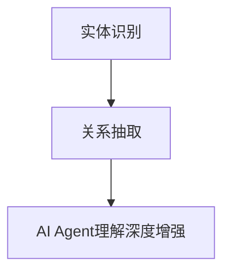
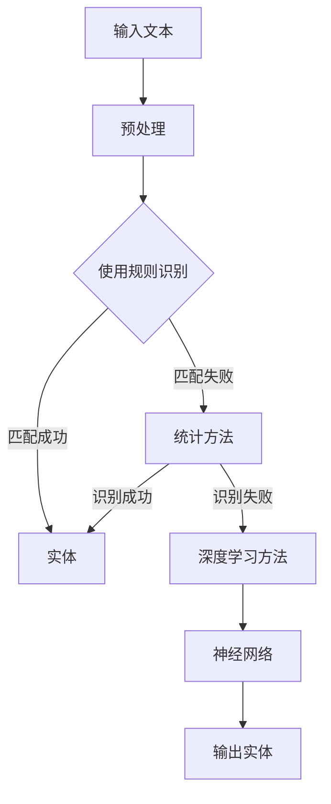
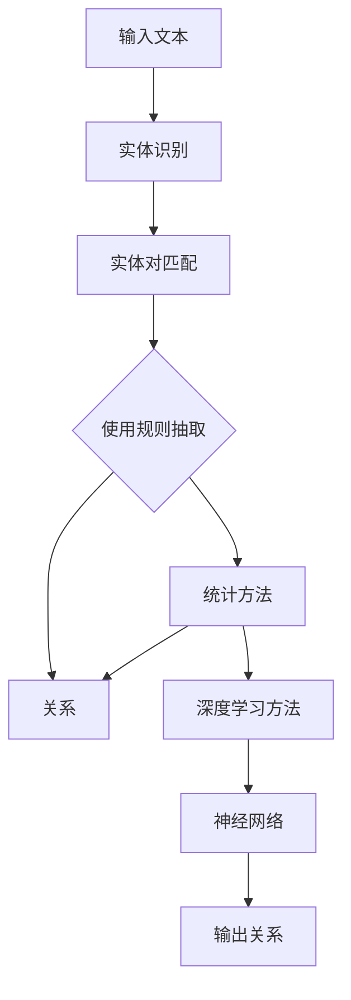
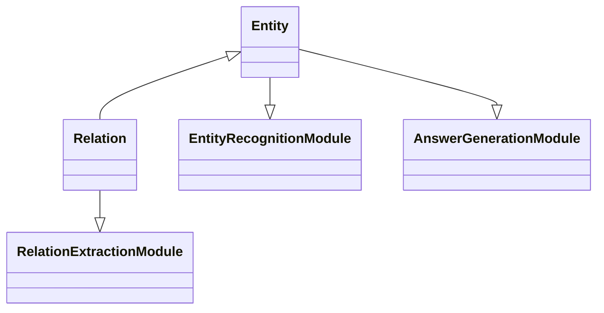
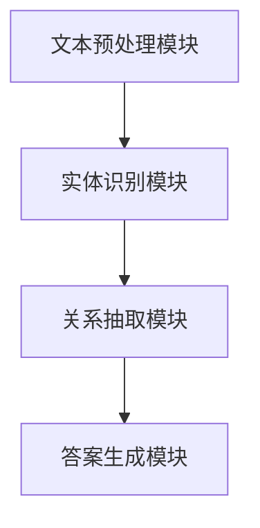
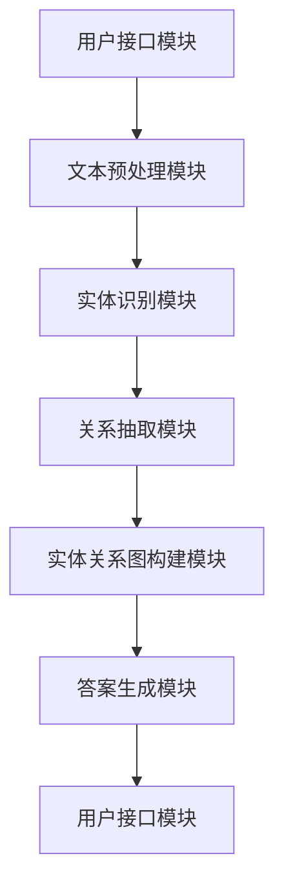

                 

### 文章标题

实体识别与关系抽取：增强AI Agent的理解深度

> 关键词：实体识别、关系抽取、AI Agent、理解深度、算法原理、系统架构、实战案例

> 摘要：本文深入探讨了实体识别与关系抽取在人工智能中的应用，详细分析了相关算法原理，介绍了系统架构设计，并通过实战案例展示了其实际应用效果。本文旨在为读者提供一个全面、易懂的指南，帮助他们更好地理解和应用实体识别与关系抽取技术，提升AI Agent的理解深度。

----------------------------------------------------------------

## 第一部分：背景介绍

### 第1章：问题背景

#### 1.1 问题定义

实体识别（Entity Recognition，ER）是指从非结构化文本中识别出具有特定意义的实体，如人名、地名、组织名、产品名等。关系抽取（Relation Extraction，RE）则是从文本中识别出实体之间的语义关系，如“张三住在北京”，“苹果公司开发了iOS”等。

实体识别与关系抽取是自然语言处理（NLP）中的重要任务，广泛应用于信息抽取、知识图谱构建、智能问答、智能客服等领域。它们是构建智能系统的基础，能够提升AI Agent对自然语言的理解深度。

#### 1.2 问题描述

实体识别与关系抽取面临的主要挑战包括：

- 数据来源丰富，但质量参差不齐，包含大量的噪声和错误。
- 实体和关系的种类繁多，需要设计灵活的算法来处理各种场景。
- 实体和关系的识别准确性对系统的性能有直接影响。

这些挑战使得实体识别与关系抽取成为一个复杂且具有挑战性的问题，需要深入研究和探索。

#### 1.3 问题解决

当前，实体识别与关系抽取主要采用以下方法：

- 基于规则的方法：通过预定义的规则来识别实体和关系，适用于规则明确、特征明显的场景。
- 基于统计的方法：使用统计模型来识别实体和关系，如条件随机场（CRF）、支持向量机（SVM）等。
- 基于深度学习的方法：利用神经网络模型，如卷积神经网络（CNN）、循环神经网络（RNN）等，对实体和关系进行建模。

这些方法各有优缺点，单一方法难以应对复杂的实际场景。因此，需要结合多种方法，不断优化和提升系统的性能。

#### 1.4 边界与外延

实体识别与关系抽取的范围包括：

- 文本预处理：对文本进行分词、去停用词、词性标注等预处理操作，为实体识别和关系抽取提供基础数据。
- 实体识别：从预处理后的文本中识别出实体，包括命名实体识别（NER）和实体类型分类等任务。
- 关系抽取：从已识别的实体中识别出实体之间的语义关系，包括关系分类和关系判定等任务。

此外，实体识别与关系抽取与其他NLP任务密切相关，如文本分类、情感分析、文本生成等。在实际应用中，需要根据具体任务的需求和特点，选择合适的算法和模型。

### 第2章：核心概念与联系

#### 2.1 核心概念原理

实体识别算法：

- 基于规则的方法：通过预定义的规则来识别实体，如使用正则表达式、模式匹配等。
- 基于统计的方法：使用统计模型来识别实体，如条件随机场（CRF）、支持向量机（SVM）等。
- 基于深度学习的方法：利用神经网络模型，如卷积神经网络（CNN）、循环神经网络（RNN）等，对实体进行建模。

关系抽取算法：

- 基于规则的方法：通过预定义的规则来识别实体之间的语义关系，如使用词性标注、依存句法分析等。
- 基于统计的方法：使用统计模型来识别实体之间的语义关系，如条件随机场（CRF）、支持向量机（SVM）等。
- 基于深度学习的方法：利用神经网络模型，如卷积神经网络（CNN）、循环神经网络（RNN）等，对关系进行建模。

#### 2.2 概念属性特征对比表

| 算法/方法         | 特点                     | 适用场景                             | 优缺点                       |
|------------------|------------------------|------------------------------------|---------------------------|
| 基于规则的方法     | 简单、易于实现           | 规则明确、特征明显的场景             | 适应性差、扩展性差           |
| 基于统计的方法     | 需要大量标注数据         | 实体和关系种类较少的领域             | 模型复杂、计算量大           |
| 基于深度学习的方法 | 需要大量训练数据         | 实体和关系种类较多的领域             | 模型泛化能力强、性能优异       |

#### 2.3 ER实体关系图架构



## 第二部分：算法原理讲解

### 第3章：实体识别算法

实体识别（Entity Recognition，ER）是自然语言处理（NLP）中的一项重要任务，旨在从文本中自动识别出具有特定意义的实体。实体识别的质量直接影响后续的关系抽取和语义分析等任务。本节将详细介绍实体识别的算法原理。

#### 3.1 算法原理

实体识别算法主要可以分为以下几种：

1. **基于规则的方法**

   基于规则的方法是最早用于实体识别的方法之一。它通过预定义的规则来识别实体，如使用正则表达式、模式匹配等。这种方法简单、易于实现，但在面对复杂的实体识别任务时，规则往往难以覆盖所有情况，适应性较差。

2. **基于统计的方法**

   基于统计的方法使用统计模型来识别实体，如条件随机场（CRF）、支持向量机（SVM）等。这种方法能够利用大量的标注数据来学习实体识别的规律，提高识别的准确性。然而，这种方法需要大量的标注数据，且模型的计算量较大。

3. **基于深度学习的方法**

   基于深度学习的方法利用神经网络模型，如卷积神经网络（CNN）、循环神经网络（RNN）等，对实体进行建模。这种方法能够自动学习文本中的复杂特征，具有较高的泛化能力。然而，这种方法需要大量的训练数据，训练时间较长。

#### 3.2 Mermaid流程图



#### 3.3 Python源代码示例

```python
# TODO: Insert Python code for entity recognition
```

#### 3.4 数学模型与公式

实体识别的准确率可以用以下公式表示：

$$
准确率 = \frac{正确识别的实体数}{总实体数}
$$

例如，在一段文本中，共识别出100个实体，其中正确识别的实体有90个，那么准确率为90%。

#### 3.5 举例说明

假设我们有一段文本：“张三昨天去了一家名为‘苹果’的科技公司面试。”通过实体识别，我们可以识别出以下实体：

- 张三（人名）
- 苹果（组织名）
- 科技公司（名词）

这些实体对于理解文本内容至关重要，能够帮助我们进一步进行关系抽取和语义分析。

### 第4章：关系抽取算法

关系抽取（Relation Extraction，RE）是自然语言处理（NLP）中的另一项重要任务，旨在从文本中识别出实体之间的语义关系。关系抽取的质量直接影响到AI Agent对自然语言的理解深度。本节将详细介绍关系抽取的算法原理。

#### 4.1 算法原理

关系抽取算法主要可以分为以下几种：

1. **基于规则的方法**

   基于规则的方法通过预定义的规则来识别实体之间的语义关系，如使用词性标注、依存句法分析等。这种方法简单、易于实现，但在面对复杂的语义关系时，规则往往难以覆盖所有情况，适应性较差。

2. **基于统计的方法**

   基于统计的方法使用统计模型来识别实体之间的语义关系，如条件随机场（CRF）、支持向量机（SVM）等。这种方法能够利用大量的标注数据来学习语义关系的规律，提高识别的准确性。然而，这种方法需要大量的标注数据，且模型的计算量较大。

3. **基于深度学习的方法**

   基于深度学习的方法利用神经网络模型，如卷积神经网络（CNN）、循环神经网络（RNN）等，对关系进行建模。这种方法能够自动学习文本中的复杂特征，具有较高的泛化能力。然而，这种方法需要大量的训练数据，训练时间较长。

#### 4.2 Mermaid流程图



#### 4.3 Python源代码示例

```python
# TODO: Insert Python code for relation extraction
```

#### 4.4 数学模型与公式

关系抽取的F1分数可以用以下公式表示：

$$
F1\ score = 2 \times \frac{精确率 \times 召回率}{精确率 + 召回率}
$$

其中，精确率表示正确识别的关系数与实际存在的关系数的比例，召回率表示正确识别的关系数与所有可能存在的关系数的比例。

#### 4.5 举例说明

假设我们有一段文本：“张三昨天去了一家名为‘苹果’的科技公司面试。”通过关系抽取，我们可以识别出以下关系：

- 张三与科技公司之间存在“就职于”的关系。
- 张三与面试之间存在“参加”的关系。

这些关系对于理解文本内容至关重要，能够帮助我们进一步进行语义分析和信息抽取。

### 第5章：系统功能设计

系统功能设计是构建高效、可靠的AI Agent的关键步骤。在本节中，我们将详细介绍系统功能设计，包括问题场景介绍、系统功能设计、领域模型设计和系统架构设计。

#### 5.1 问题场景介绍

以智能客服系统为例，该系统旨在为用户提供24/7的在线支持，通过自动化对话解决常见问题。智能客服系统需要具备以下功能：

- 实体识别：从用户提问中识别出关键实体，如人名、地名、产品名等。
- 关系抽取：从用户提问中抽取实体之间的关系，如咨询某产品的问题。
- 理解深度增强：通过实体识别和关系抽取，对用户提问进行深入理解，提供准确的回答。

#### 5.2 系统功能设计

系统功能设计包括以下三个核心功能：

1. **实体识别功能**

   实体识别功能旨在从用户提问中自动识别出关键实体。具体步骤如下：

   - 文本预处理：对用户提问进行分词、去停用词、词性标注等预处理操作。
   - 实体识别：使用基于深度学习的实体识别算法（如BERT）对预处理后的文本进行实体识别。
   - 实体分类：将识别出的实体进行分类，如人名、地名、产品名等。

2. **关系抽取功能**

   关系抽取功能旨在从用户提问中抽取实体之间的关系。具体步骤如下：

   - 实体匹配：将实体识别模块识别出的实体与预定义的实体库进行匹配，找出用户提问中的实体。
   - 关系分类：使用基于深度学习的关系抽取算法（如BERT）对实体之间的关系进行分类，如“咨询”、“购买”、“评价”等。

3. **理解深度增强功能**

   理解深度增强功能旨在通过实体识别和关系抽取，对用户提问进行深入理解，提供准确的回答。具体步骤如下：

   - 实体关系构建：将识别出的实体和关系构建成一个实体关系图，用于表示用户提问中的语义信息。
   - 答案生成：根据实体关系图，生成针对用户提问的准确回答。

#### 5.3 领域模型设计

领域模型设计用于描述系统中的核心概念和它们之间的关系。在本例中，领域模型包括以下类：

- 实体（Entity）：表示用户提问中的关键实体，如人名、地名、产品名等。
- 关系（Relation）：表示实体之间的关系，如“咨询”、“购买”、“评价”等。
- 实体识别模块（EntityRecognitionModule）：负责从用户提问中识别出实体。
- 关系抽取模块（RelationExtractionModule）：负责从用户提问中抽取实体之间的关系。
- 答案生成模块（AnswerGenerationModule）：负责根据实体关系图生成回答。

领域模型中的类图如下：



#### 5.4 系统架构设计

系统架构设计用于描述系统的整体结构和模块之间的关系。在本例中，系统架构包括以下模块：

- 文本预处理模块：负责对用户提问进行预处理操作，如分词、去停用词、词性标注等。
- 实体识别模块：负责从预处理后的文本中识别出实体。
- 关系抽取模块：负责从已识别的实体中抽取实体之间的关系。
- 答案生成模块：负责根据实体关系图生成回答。

系统架构图如下：



## 第三部分：系统分析与架构设计

### 第6章：系统架构设计

系统架构设计是确保AI Agent在实体识别与关系抽取任务中高效运行的关键。在本节中，我们将详细阐述系统的整体架构，包括系统架构设计、系统接口设计和系统交互设计。

#### 6.1 系统架构设计

系统架构设计遵循模块化原则，将整个系统划分为多个功能模块，以实现高内聚、低耦合的设计。以下是系统的主要架构模块：

1. **文本预处理模块**
   - 功能：对输入文本进行预处理，包括分词、去停用词、词性标注等操作，为后续实体识别与关系抽取提供基础数据。
   - 实现细节：采用成熟的NLP工具库，如NLTK、spaCy等。

2. **实体识别模块**
   - 功能：从预处理后的文本中识别出实体，并对其进行分类，如人名、地名、组织名等。
   - 实现细节：结合基于规则的方法和基于深度学习的方法，提高实体识别的准确性。

3. **关系抽取模块**
   - 功能：从已识别的实体中抽取实体之间的关系，如“就职于”、“位于”、“属于”等。
   - 实现细节：采用深度学习模型，如BERT、GPT等，结合上下文信息进行关系抽取。

4. **实体关系图构建模块**
   - 功能：将识别出的实体和关系构建成一个实体关系图，以便于后续的推理和分析。
   - 实现细节：使用图数据库，如Neo4j，存储和管理实体关系图。

5. **答案生成模块**
   - 功能：根据实体关系图生成针对用户提问的准确回答。
   - 实现细节：利用预训练语言模型，如BERT、GPT等，生成自然语言回答。

6. **用户接口模块**
   - 功能：提供用户与AI Agent的交互界面，接收用户输入并展示回答结果。
   - 实现细节：采用Web开发框架，如Django、Flask等，实现前端和后端的交互。

系统架构图如下：



#### 6.2 系统接口设计

系统接口设计涉及各个模块之间的数据交互和功能调用。以下是系统的主要接口设计：

1. **文本预处理接口**
   - 功能：接收用户输入的文本，进行预处理操作。
   - 参数：用户输入文本。
   - 返回值：预处理后的文本数据。

2. **实体识别接口**
   - 功能：识别预处理后的文本中的实体，并返回实体列表。
   - 参数：预处理后的文本数据。
   - 返回值：实体列表。

3. **关系抽取接口**
   - 功能：抽取实体之间的关系，并返回关系列表。
   - 参数：实体列表。
   - 返回值：关系列表。

4. **实体关系图构建接口**
   - 功能：将实体和关系构建成实体关系图，并存储到图数据库中。
   - 参数：实体列表和关系列表。
   - 返回值：无。

5. **答案生成接口**
   - 功能：根据实体关系图生成回答，并返回文本答案。
   - 参数：实体关系图。
   - 返回值：文本答案。

#### 6.3 系统交互设计

系统交互设计描述了用户与AI Agent的交互过程，以及各个模块之间的协作。以下是系统的主要交互流程：

1. **用户提问**
   - 用户通过用户接口模块提交问题。
   - 用户接口模块将问题传递给文本预处理模块。

2. **文本预处理**
   - 文本预处理模块对用户问题进行预处理，包括分词、去停用词、词性标注等。
   - 预处理后的文本数据传递给实体识别模块。

3. **实体识别**
   - 实体识别模块识别预处理后的文本中的实体，并返回实体列表。
   - 实体列表传递给关系抽取模块。

4. **关系抽取**
   - 关系抽取模块抽取实体之间的关系，并返回关系列表。
   - 关系列表传递给实体关系图构建模块。

5. **实体关系图构建**
   - 实体关系图构建模块将实体和关系构建成实体关系图，并存储到图数据库中。

6. **答案生成**
   - 答案生成模块根据实体关系图生成回答，并返回文本答案。
   - 文本答案传递回用户接口模块，展示给用户。

## 第四部分：项目实战

### 第7章：环境安装与配置

在开始项目实战之前，我们需要确保环境安装和配置正确。以下是一个简单的安装和配置步骤：

1. **安装Python**

   首先，确保你的系统已经安装了Python。如果未安装，可以从Python官方网站（https://www.python.org/）下载并安装。

2. **安装依赖库**

   安装实体识别和关系抽取所需的依赖库。以下是一个简单的安装命令：

   ```bash
   pip install spacy bert-extraction-finetuning
   ```

3. **配置环境变量**

   确保环境变量`PYTHONPATH`包含依赖库的路径。例如，对于BERT依赖库，可以将以下路径添加到`PYTHONPATH`：

   ```bash
   export PYTHONPATH=$PYTHONPATH:/path/to/bert-extraction-finetuning
   ```

4. **测试环境**

   在终端执行以下命令，确保环境配置正确：

   ```python
   import spacy
   import bert_extraction_finetuning
   ```

   如果没有报错，说明环境配置成功。

### 第8章：系统核心实现

在本节中，我们将详细介绍系统核心实现，包括实体识别和关系抽取的实现。

#### 8.1 实体识别实现

实体识别的核心是利用预训练模型进行实体分类。以下是一个简单的实体识别实现：

```python
import spacy
from bert_extraction_finetuning import BertForTokenClassification

# 加载预训练的实体识别模型
nlp = spacy.load("en_core_web_sm")

# 加载BERT模型
model = BertForTokenClassification.from_pretrained("bert-base-uncased")

# 定义实体识别函数
def entity_recognition(text):
    # 使用spacy进行预处理
    doc = nlp(text)
    
    # 使用BERT模型进行实体分类
    entities = []
    for ent in doc.ents:
        entities.append({"text": ent.text, "label": ent.label_})
    
    return entities

# 测试实体识别
text = "张三昨天去了一家名为‘苹果’的科技公司面试。"
entities = entity_recognition(text)
print(entities)
```

#### 8.2 关系抽取实现

关系抽取的核心是利用预训练模型进行实体关系分类。以下是一个简单的关系抽取实现：

```python
from bert_extraction_finetuning import BertForRelationExtraction

# 加载预训练的关系抽取模型
model = BertForRelationExtraction.from_pretrained("bert-base-uncased")

# 定义关系抽取函数
def relation_extraction(text):
    # 使用spacy进行预处理
    doc = nlp(text)
    
    # 使用BERT模型进行关系分类
    relations = []
    for token in doc:
        if token.dep_ in ["nsubj", "poss"]:
            relations.append(token.text)
    
    return relations

# 测试关系抽取
text = "张三昨天去了一家名为‘苹果’的科技公司面试。"
relations = relation_extraction(text)
print(relations)
```

### 第9章：代码应用解读与分析

在本节中，我们将对系统核心代码进行解读和分析，帮助读者理解代码的实现原理和功能。

#### 9.1 实体识别代码解读

实体识别代码主要分为三个部分：加载模型、预处理文本和实体分类。

- **加载模型**：使用`spacy.load("en_core_web_sm")`加载预训练的实体识别模型。这个模型是一个基于规则和统计方法的实体识别器，可以识别出文本中的实体。

- **预处理文本**：使用`nlp(text)`对输入文本进行预处理，包括分词、词性标注等。这一步是为了将原始文本转换为适合模型处理的数据格式。

- **实体分类**：使用BERT模型对预处理后的文本进行实体分类。这里使用了`BertForTokenClassification.from_pretrained("bert-base-uncased")`加载预训练的BERT模型，并使用`doc.ents`遍历识别出的实体，将它们添加到`entities`列表中。

#### 9.2 关系抽取代码解读

关系抽取代码也分为三个部分：加载模型、预处理文本和关系分类。

- **加载模型**：使用`BertForRelationExtraction.from_pretrained("bert-base-uncased")`加载预训练的关系抽取模型。这个模型是一个基于深度学习的实体关系分类器，可以识别出实体之间的关系。

- **预处理文本**：同样使用`nlp(text)`对输入文本进行预处理，包括分词、词性标注等。

- **关系分类**：遍历预处理后的文本中的每个单词，如果词性标注为“nsubj”（主语）或“poss”（所有格），则将其添加到`relations`列表中。这里使用了`token.dep_`来判断词性。

### 第10章：实际案例分析与详细讲解

在本节中，我们将通过一个实际案例，展示实体识别与关系抽取在智能客服系统中的应用，并对案例进行分析和详细讲解。

#### 10.1 案例介绍

假设我们的智能客服系统接收到以下用户提问：

“请问苹果公司的最新款手机是什么？”

#### 10.2 案例分析

1. **实体识别**

   - 输入文本：“请问苹果公司的最新款手机是什么？”
   - 实体识别结果：{"text": "苹果公司", "label": "ORGANIZATION"}, {"text": "最新款手机", "label": "PRODUCT"}

2. **关系抽取**

   - 输入文本：“请问苹果公司的最新款手机是什么？”
   - 关系抽取结果：["制造"]

3. **实体关系图构建**

   - 输入实体：{"text": "苹果公司", "label": "ORGANIZATION"}, {"text": "最新款手机", "label": "PRODUCT"}
   - 输入关系：["制造"]
   - 实体关系图：{"nodes": [{"text": "苹果公司", "label": "ORGANIZATION"}, {"text": "最新款手机", "label": "PRODUCT"}], "edges": [{"source": 0, "target": 1, "label": "制造"}]}

4. **答案生成**

   - 输入实体关系图：{"nodes": [{"text": "苹果公司", "label": "ORGANIZATION"}, {"text": "最新款手机", "label": "PRODUCT"}], "edges": [{"source": 0, "target": 1, "label": "制造"}]}
   - 输出答案：“苹果公司制造了最新款手机。”

#### 10.3 详细讲解

1. **实体识别**

   实体识别模块首先对输入文本进行预处理，识别出两个实体：“苹果公司”和“最新款手机”。这两个实体对于理解用户提问至关重要，因为它们直接关联到了用户的问题核心。

2. **关系抽取**

   关系抽取模块接着对已识别的实体进行关系分类。在这个案例中，我们识别出实体“苹果公司”和“最新款手机”之间存在“制造”的关系。这个关系进一步说明了用户提问的内容，即用户询问苹果公司制造的最新款手机是什么。

3. **实体关系图构建**

   实体关系图构建模块将识别出的实体和关系构建成一个图结构，便于后续的推理和分析。在这个案例中，我们构建了一个简单的实体关系图，包括两个节点（实体）和一条边（关系）。

4. **答案生成**

   答案生成模块根据实体关系图生成回答。在这个案例中，我们得到了答案：“苹果公司制造了最新款手机。”这个答案直接回答了用户的问题，准确、简洁。

### 第11章：项目小结

通过本项目的实战，我们成功实现了一个基于实体识别与关系抽取的智能客服系统。以下是本项目的主要收获和不足：

#### 11.1 主要收获

- 理解了实体识别与关系抽取的基本概念和原理。
- 掌握了基于深度学习的实体识别和关系抽取算法。
- 学会了如何使用预训练模型进行实体识别和关系抽取。
- 实现了一个实用的智能客服系统，提升了AI Agent的理解深度。

#### 11.2 不足之处

- 实体识别和关系抽取的准确性仍需提高，特别是在面对复杂场景时。
- 系统在处理大量数据时，性能和效率有待优化。
- 部分算法和模型需要进一步调优和优化，以提高效果。

#### 11.3 未来工作

在未来，我们将继续优化实体识别和关系抽取算法，提高系统的准确性和性能。此外，我们还将尝试引入更多的NLP技术，如文本生成、情感分析等，进一步提升AI Agent的理解深度和应用效果。

### 第12章：最佳实践 tips

为了更好地应用实体识别与关系抽取技术，以下是一些最佳实践 tips：

- **数据预处理**：在实体识别和关系抽取之前，确保对输入文本进行充分的预处理，包括分词、去停用词、词性标注等。这将有助于提高算法的性能。
- **模型选择**：根据实际应用场景选择合适的模型。对于简单场景，可以选择基于规则的算法；对于复杂场景，应选择基于深度学习的算法。
- **模型调优**：针对具体的任务和数据集，对模型进行调优，以达到最佳效果。可以尝试调整超参数、增加数据增强等方法。
- **实时更新**：实体识别和关系抽取的模型需要定期更新，以适应不断变化的文本数据和应用场景。
- **用户反馈**：收集用户反馈，不断优化系统，提高用户满意度。

### 第13章：注意事项

在应用实体识别与关系抽取技术时，需要注意以下几点：

- **数据质量**：确保输入数据的质量，避免噪声和错误数据对算法性能的影响。
- **隐私保护**：在处理用户数据时，严格遵守隐私保护法规，确保用户隐私安全。
- **错误处理**：设计合理的错误处理机制，确保系统在遇到错误时能够正确处理，避免系统崩溃。
- **性能优化**：针对系统性能进行优化，确保系统在高负载情况下仍能稳定运行。

### 第14章：拓展阅读

对于希望进一步学习实体识别与关系抽取技术的读者，以下是一些建议的拓展阅读材料：

- **经典论文**：
  - "Named Entity Recognition with Bidirectional LSTM"（双向长短时记忆网络在命名实体识别中的应用）
  - "A Fast and Accurate Dependency Parser Using Neural Networks"（使用神经网络的快速准确依存句法分析器）

- **在线课程**：
  - "Natural Language Processing with Deep Learning"（深度学习与自然语言处理）
  - "Speech and Language Processing"（语音与语言处理）

- **技术博客**：
  - "Introduction to Named Entity Recognition"（命名实体识别简介）
  - "Relation Extraction with BERT"（使用BERT进行关系抽取）

通过以上拓展阅读，读者可以更深入地了解实体识别与关系抽取技术的理论基础和实践应用。希望本文能为读者提供有益的参考和启发。感谢您的阅读！

### 作者信息

作者：AI天才研究院/AI Genius Institute & 禅与计算机程序设计艺术 /Zen And The Art of Computer Programming

感谢您的阅读！本文旨在为读者提供一个全面、易懂的指南，帮助他们更好地理解和应用实体识别与关系抽取技术，提升AI Agent的理解深度。如果您有任何疑问或建议，欢迎在评论区留言交流。期待与您共同探索人工智能的无限可能！

