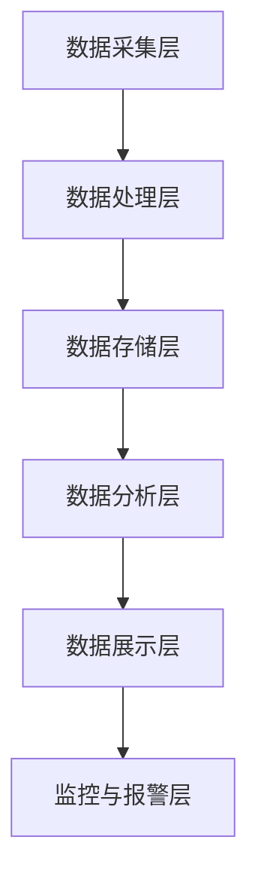
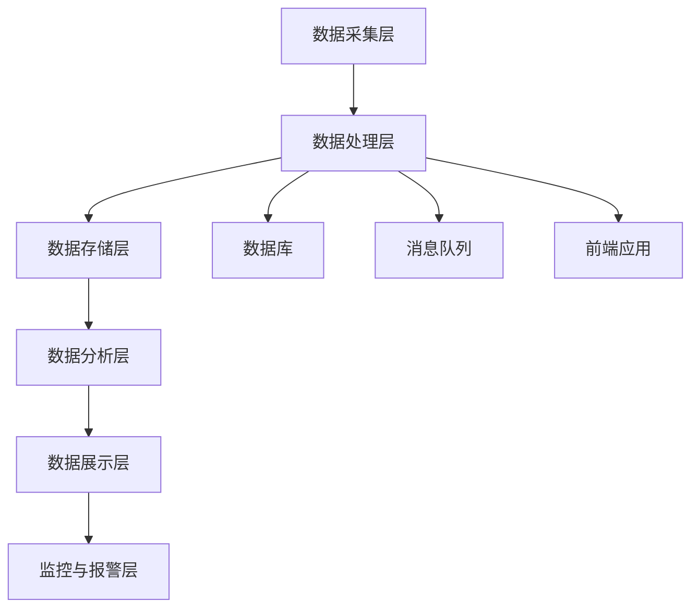
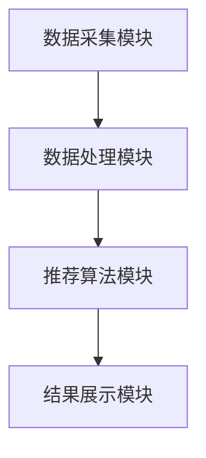
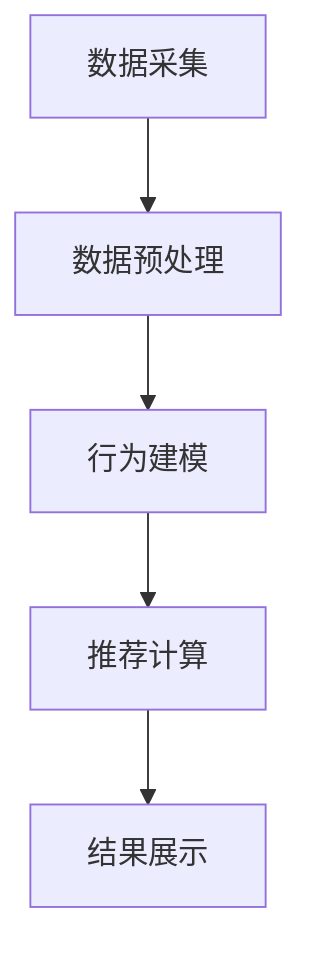
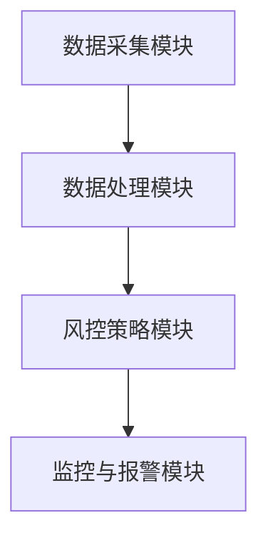
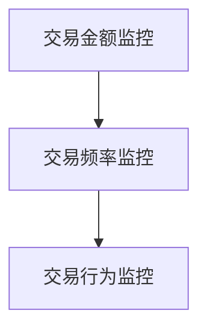
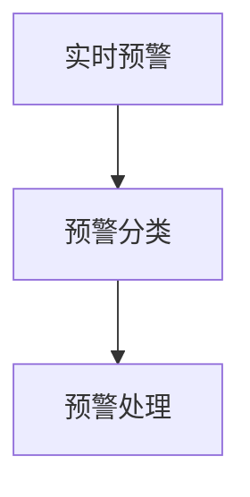
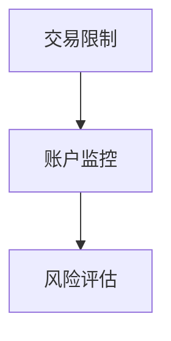

                 

### 第一部分：实时分析技术基础

#### 第1章：实时分析概述

##### 1.1 实时分析的重要性

实时分析（Real-Time Analysis）在现代信息技术中扮演着至关重要的角色。随着大数据和云计算技术的迅速发展，企业积累了海量的数据资源。这些数据不仅包括历史数据，还包括实时产生的数据。实时分析技术的出现，使企业能够及时处理这些实时数据，并从中提取出有价值的信息，以支持快速决策和业务优化。

传统数据分析往往存在一个显著的问题，即“滞后性”。传统数据分析通常需要将数据收集、清洗、转换后，再进行批处理分析，这个过程可能需要数小时、数天，甚至数周。这样的延迟在许多业务场景中是不可接受的，尤其是在金融交易监控、网络攻击检测、医疗诊断等要求实时响应的领域。实时分析则通过流处理技术，实现了数据的实时采集、处理和分析，大大缩短了数据到决策的时间间隔。

##### 1.1.1 传统数据分析的局限性

- **数据处理的滞后性**：传统数据分析模式中，数据处理和分析需要经过多步处理，导致响应时间长。
- **数据量限制**：传统方法难以处理海量实时数据，特别是在大数据环境下。
- **灵活性不足**：传统数据分析模型固定，难以适应业务场景的变化。

##### 1.1.2 实时分析的独特价值

实时分析提供了以下几个方面的独特价值：

- **实时性**：能够快速响应，为企业提供即时的数据支持。
- **高效性**：通过流处理技术，处理速度快，能够支持大规模数据的实时处理。
- **灵活性**：实时分析系统可以根据业务需求快速调整，适应不同场景的需求。

##### 1.1.3 实时分析的核心要素

实时分析的核心要素主要包括以下几个方面：

- **数据源**：实时数据来源，如传感器、用户行为、交易记录等。
- **数据采集**：实时采集数据，并将其传输到处理系统。
- **数据处理**：对采集到的数据进行实时处理，如过滤、转换、聚合等。
- **数据分析**：利用机器学习和统计分析等方法，对处理后的数据进行分析和挖掘。
- **数据展示**：将分析结果以图表、报表等形式展示，辅助决策。

#### 1.2 流处理技术简介

流处理（Stream Processing）是实时分析的核心技术之一。它能够对实时数据流进行高效的处理和分析，使企业能够快速响应市场变化和业务需求。

##### 1.2.1 流处理的概念与原理

流处理是一种数据处理方式，它将数据视为连续的流（Stream），而非静态的批量（Batch）。流处理系统可以持续接收数据流，并对其进行实时处理，从而实现数据的实时分析和响应。

流处理的基本原理包括：

- **数据流模型**：数据流以事件的形式进入系统，每个事件携带一定的数据和信息。
- **处理模型**：流处理系统通过处理函数对事件进行实时处理，包括过滤、转换、聚合等操作。
- **状态管理**：流处理需要维护一定状态，以便对历史数据进行分析和关联。

##### 1.2.2 流处理技术的主要类型

流处理技术主要分为以下几类：

- **基于批处理的流处理**：将流数据按一定的时间窗口进行批处理，如在窗口内对数据进行聚合处理。
- **基于事件的流处理**：以事件为单位进行实时处理，无需固定的时间窗口。
- **基于状态的流处理**：通过维护状态来对历史数据进行关联和分析。

##### 1.2.3 流处理与批处理的对比

流处理与批处理是两种不同的数据处理方式，它们各有优缺点：

- **处理速度**：流处理速度快，能够实时处理数据；批处理速度较慢，适用于大量历史数据的处理。
- **灵活性**：流处理灵活，可以实时调整处理逻辑；批处理固定，难以适应实时业务需求。
- **资源消耗**：流处理需要持续运行，资源消耗较大；批处理资源消耗较小，适合批量数据处理。

总之，实时分析技术为企业提供了强大的数据处理和分析能力，使其能够更好地应对实时业务需求，提高决策效率。接下来，我们将进一步探讨流处理技术在业务分析中的应用。

#### 第2章：流处理技术在业务分析中的应用

##### 2.1 实时监控

实时监控是流处理技术在业务分析中的一个重要应用领域。它通过对实时数据的持续监测和分析，帮助企业及时发现和应对潜在的问题和风险，确保业务系统的稳定运行。

##### 2.1.1 监控数据的实时处理

实时监控的关键在于对监控数据的实时处理。这包括以下几个步骤：

1. **数据采集**：从各种数据源（如服务器日志、网络流量、数据库性能等）实时采集数据。
2. **数据传输**：将采集到的数据传输到流处理系统，如Apache Kafka、Apache Flink等。
3. **数据预处理**：对流处理系统接收到的数据进行预处理，如过滤、转换和标准化等。
4. **数据处理**：使用流处理框架对预处理后的数据进行实时分析，如异常检测、性能分析等。
5. **数据存储**：将处理后的数据存储到数据库或数据仓库中，以供后续分析。

##### 2.1.2 实时监控案例分析

为了更好地理解实时监控的应用，我们可以通过一个实际案例进行说明。

假设某电商平台希望对服务器性能进行实时监控，以确保系统在高并发情况下的稳定运行。该电商平台使用Apache Kafka作为数据采集层，将各个服务器的性能数据实时发送到Kafka主题中。接着，使用Apache Flink进行流处理，对性能数据进行实时分析。

具体流程如下：

1. **数据采集**：Kafka消费者从各个服务器的日志中实时采集性能数据，如CPU使用率、内存使用率、网络延迟等。
2. **数据传输**：采集到的性能数据通过Kafka主题传输到Flink处理节点。
3. **数据预处理**：Flink对性能数据进行预处理，如去除空值、填充缺失值、标准化等。
4. **数据处理**：Flink使用自定义处理函数对预处理后的性能数据进行实时分析，如计算CPU使用率平均值、内存使用率峰值等。
5. **数据存储**：将分析结果存储到MySQL数据库中，以便后续查询和分析。

通过这个案例，我们可以看到实时监控在服务器性能管理中的应用。类似地，实时监控还可以应用于网络监控、应用监控、数据库监控等多个领域，帮助企业实现全面、实时的业务监控。

##### 2.1.3 实时监控的挑战与解决方案

实时监控虽然具有很多优势，但在实际应用中也会面临一些挑战。以下是一些常见的挑战及相应的解决方案：

- **数据量大**：实时监控需要处理大量实时数据，这对系统的性能和稳定性提出了较高要求。解决方案：使用分布式流处理框架，如Apache Kafka和Apache Flink，进行数据的高效处理和传输。
- **实时性要求高**：实时监控需要快速响应，处理速度要求极高。解决方案：优化流处理算法，减少数据处理延迟；采用高性能硬件和云计算资源，提高系统性能。
- **数据一致性**：在分布式环境中，数据的一致性是一个重要问题。解决方案：使用分布式事务处理技术，如两阶段提交（2PC）或最终一致性模型，保证数据的一致性。

总之，实时监控通过流处理技术，为企业提供了强大的数据处理和分析能力，使企业能够更好地应对实时业务需求，提高系统的稳定性和可靠性。

##### 2.2 实时预测

实时预测是流处理技术在业务分析中的另一个重要应用。实时预测通过对实时数据的分析，能够提前预测未来事件的发生概率或发展趋势，为企业提供决策支持。

##### 2.2.1 预测模型在流处理中的应用

实时预测模型在流处理中的应用主要包括以下几个步骤：

1. **数据采集**：从各种数据源采集实时数据，如历史销售数据、用户行为数据、市场行情数据等。
2. **数据预处理**：对采集到的数据进行清洗、转换和标准化等预处理操作。
3. **模型训练**：使用机器学习算法对预处理后的数据集进行训练，构建实时预测模型。
4. **模型部署**：将训练好的模型部署到流处理系统中，实现对实时数据的实时预测。
5. **结果输出**：将预测结果输出到数据库、报表或可视化界面，供用户查看和分析。

##### 2.2.2 实时预测案例分析

为了更好地理解实时预测的应用，我们可以通过一个实际案例进行说明。

假设某电商公司希望通过实时预测，预测未来24小时内各个产品的销售情况，以便进行库存管理和营销策略调整。该公司使用Apache Kafka作为数据采集层，从电商平台的历史销售数据、用户行为数据等来源实时采集数据。接着，使用Apache Flink进行流处理，构建实时预测模型。

具体流程如下：

1. **数据采集**：Kafka消费者从电商平台的历史销售数据、用户行为数据等来源实时采集数据，并存储在Kafka主题中。
2. **数据预处理**：Flink对采集到的数据进行预处理，如去除空值、填充缺失值、标准化等。
3. **模型训练**：Flink使用机器学习算法（如线性回归、决策树等）对预处理后的数据集进行训练，构建实时预测模型。
4. **模型部署**：将训练好的模型部署到Flink处理节点中，实现对实时数据的实时预测。
5. **结果输出**：将预测结果输出到MySQL数据库中，并使用可视化工具（如ECharts）展示预测结果。

通过这个案例，我们可以看到实时预测在电商库存管理和营销策略调整中的应用。类似地，实时预测还可以应用于股票市场预测、需求预测、资源调度等多个领域，帮助企业实现基于数据的决策。

##### 2.2.3 预测准确性优化策略

实时预测的准确性对企业的决策具有重要影响。以下是一些优化预测准确性的策略：

- **数据质量**：确保采集到的数据质量，如去除噪声、填充缺失值、标准化等。
- **模型选择**：选择合适的机器学习算法和模型，如线性回归、决策树、神经网络等。
- **特征工程**：通过特征选择、特征变换等方法，提高模型对数据的表达能力。
- **模型调参**：通过调整模型参数，如学习率、正则化参数等，优化模型性能。
- **交叉验证**：使用交叉验证方法，评估模型在不同数据集上的性能，选择最佳模型。

总之，实时预测通过流处理技术，为企业提供了强大的数据处理和分析能力，使企业能够更好地应对实时业务需求，提高决策的准确性和效率。接下来，我们将进一步探讨实时数据处理框架。

### 第3章：实时数据处理框架

实时数据处理框架是流处理技术的核心组成部分，它为实时数据的高效、可靠处理提供了完整的解决方案。在这一章节中，我们将介绍实时数据处理框架的基本概念、主要组件及其选择标准。

#### 3.1 流处理框架简介

流处理框架是一种专门为实时数据处理设计的软件框架，它能够对实时数据流进行高效的处理和分析。流处理框架的主要特点包括：

- **分布式处理**：流处理框架能够将数据处理任务分布到多个节点上，实现并行处理，提高数据处理效率。
- **弹性伸缩**：流处理框架可以根据处理负载自动调整资源，实现横向扩展，确保系统的高可用性和高性能。
- **数据可靠传输**：流处理框架通常采用分布式消息队列技术，如Apache Kafka，确保数据在传输过程中的可靠性和一致性。
- **动态流处理**：流处理框架能够实时调整处理逻辑，以适应不断变化的数据和处理需求。

##### 3.1.1 流处理框架的发展历程

流处理框架的发展经历了几个阶段：

- **第一阶段（2000年代初期）**：以Apache Storm和Apache Samza为代表的早期流处理框架出现，它们奠定了流处理技术的基础。
- **第二阶段（2010年代初期）**：随着大数据技术的兴起，流处理框架逐渐成熟，如Apache Kafka、Apache Flink和Apache Spark Streaming等。
- **第三阶段（2010年代中期至今）**：现代流处理框架不断优化和扩展，如Apache Flink 1.0的发布，标志着流处理技术进入了新的发展阶段。

##### 3.1.2 常见的流处理框架

目前，常见的流处理框架包括以下几种：

- **Apache Kafka**：一款高吞吐量、可持久化的分布式消息队列系统，用于数据的实时传输和存储。
- **Apache Flink**：一款功能强大的流处理框架，提供了低延迟、高性能的流处理能力，支持复杂的数据分析和机器学习任务。
- **Apache Spark Streaming**：基于Apache Spark的流处理模块，提供了丰富的数据处理和分析功能。
- **Apache Samza**：一款支持流处理和批量处理的分布式数据处理框架，适用于大数据场景。

##### 3.1.3 选择合适的流处理框架

选择合适的流处理框架需要考虑以下几个因素：

- **处理能力**：根据业务需求，选择能够满足处理能力的流处理框架。
- **功能需求**：根据业务场景，选择具备所需功能（如实时查询、机器学习等）的流处理框架。
- **生态系统**：考虑流处理框架的生态系统，包括社区活跃度、工具和文档等。
- **可伸缩性**：选择能够支持业务规模增长的流处理框架，确保系统的高可用性和高性能。

#### 3.2 流处理框架核心组件

流处理框架通常包括以下几个核心组件：

- **数据源**：提供实时数据输入的组件，如消息队列、数据库等。
- **处理引擎**：负责对实时数据流进行处理的组件，如流处理框架的核心模块。
- **存储系统**：用于存储处理结果的组件，如数据库、文件系统等。
- **监控与报警系统**：用于监控系统状态和性能的组件，如监控工具、报警系统等。

##### 3.2.1 数据源

数据源是流处理框架的输入组件，负责提供实时数据流。常见的数据源包括：

- **消息队列**：如Apache Kafka，提供高吞吐量、可持久化的数据流传输。
- **数据库**：如MySQL、PostgreSQL，提供实时数据查询和更新。
- **传感器**：如温度传感器、GPS传感器等，提供实时环境数据。

##### 3.2.2 处理引擎

处理引擎是流处理框架的核心组件，负责对实时数据流进行各种处理操作。常见的处理引擎包括：

- **Apache Kafka**：提供基于消息队列的数据流处理能力。
- **Apache Flink**：提供基于事件驱动的数据流处理能力，支持复杂的数据分析和机器学习任务。
- **Apache Spark Streaming**：提供基于批处理的数据流处理能力，支持流处理和批量处理的混合模式。

##### 3.2.3 存储系统

存储系统用于存储处理结果，以便后续查询和分析。常见的存储系统包括：

- **数据库**：如MySQL、PostgreSQL，提供结构化数据的存储和查询。
- **数据仓库**：如Amazon Redshift、Google BigQuery，提供海量数据的存储和查询。
- **文件系统**：如HDFS、Alluxio，提供高效的数据存储和访问。

##### 3.2.4 监控与报警系统

监控与报警系统用于监控系统状态和性能，及时发现和处理异常情况。常见的监控与报警系统包括：

- **Prometheus**：提供实时监控和告警功能。
- **Grafana**：提供数据可视化功能。
- **Zabbix**：提供全面的监控和告警功能。

总之，实时数据处理框架为实时数据的高效处理提供了完整的解决方案。通过选择合适的流处理框架和核心组件，企业能够实现实时数据处理和分析，支持快速决策和业务优化。

#### 3.3 流处理框架的应用场景

流处理框架在多种业务场景中发挥着重要作用，以下是几个典型的应用场景：

##### 3.3.1 社交媒体分析

社交媒体平台每天产生大量实时数据，如用户评论、点赞、分享等。流处理框架可以对这些数据实时处理和分析，提供用户行为分析、情感分析、趋势预测等功能。例如，Twitter使用Apache Storm进行实时数据处理，分析用户动态，提供实时搜索和推荐服务。

##### 3.3.2 金融交易监控

金融交易市场实时性要求极高，流处理框架可以帮助金融机构实时监控交易活动，发现异常交易行为，防止欺诈和风险。例如，金融机构可以使用Apache Kafka和Apache Flink进行实时数据处理，监控交易流，实现风险预警和决策支持。

##### 3.3.3 物联网监控

物联网设备产生大量实时数据，如传感器数据、设备状态等。流处理框架可以对这些数据进行实时处理和分析，提供设备监控、故障预测、资源优化等功能。例如，智能家居系统可以使用Apache Flink进行实时数据处理，监控设备状态，实现智能控制。

##### 3.3.4 电商数据分析

电商业务实时数据量大，如用户行为、订单数据等。流处理框架可以对这些数据实时处理和分析，提供实时推荐、实时营销、库存管理等功能。例如，电商平台可以使用Apache Spark Streaming进行实时数据处理，分析用户行为，提供个性化推荐和营销策略。

通过这些实际案例，我们可以看到流处理框架在各个领域的广泛应用，为实时数据处理和分析提供了强大的支持。

### 第4章：实时数据存储技术

实时数据存储是流处理系统的重要组成部分，它确保了数据在处理过程中的高效读写和持久化。实时数据存储技术需要满足高吞吐量、低延迟、高可靠性和可扩展性的要求。本章将详细介绍实时数据存储技术的需求、主流技术和新兴技术。

#### 4.1 实时数据存储需求分析

实时数据存储需求可以从以下几个方面进行分析：

##### 4.1.1 实时数据分析的特点

实时数据分析具有以下几个特点：

- **数据量大**：实时数据来自各种数据源，数据量庞大。
- **数据速度快**：实时数据需要快速处理和分析，以支持实时决策。
- **数据多样性**：实时数据类型多样，包括结构化数据、半结构化数据和非结构化数据。
- **数据时效性**：实时数据具有高度的时效性，数据的新鲜度对分析结果至关重要。

##### 4.1.2 实时数据存储的要求

实时数据存储需要满足以下要求：

- **低延迟**：存储系统需要能够快速响应数据读写请求，以满足实时处理需求。
- **高吞吐量**：存储系统需要能够处理高并发读写操作，支持大规模数据处理。
- **高可靠性**：存储系统需要具备数据备份和容错机制，确保数据的安全性和一致性。
- **可扩展性**：存储系统需要能够水平扩展，以适应数据量和处理负载的增长。

##### 4.1.3 实时数据存储技术的分类

实时数据存储技术可以根据数据存储特性进行分类，主要包括以下几种：

- **关系数据库**：如MySQL、PostgreSQL，提供结构化数据的存储和查询。
- **NoSQL数据库**：如MongoDB、Cassandra，提供半结构化数据和非结构化数据的存储和查询。
- **缓存系统**：如Redis、Memcached，提供高速缓存服务，提高数据读取速度。
- **分布式存储系统**：如HDFS、Alluxio，提供大规模数据的分布式存储和管理。

#### 4.2 主流实时数据存储技术

以下是几种主流的实时数据存储技术：

##### 4.2.1 数据库

数据库是实时数据存储的常用技术，分为关系数据库和NoSQL数据库。

- **关系数据库**：关系数据库具有成熟的技术体系和强大的查询能力，适用于结构化数据的存储和查询。例如，MySQL和PostgreSQL广泛应用于各种业务场景。
- **NoSQL数据库**：NoSQL数据库适用于半结构化数据和非结构化数据的存储和查询，具有高扩展性和灵活性。例如，MongoDB适用于大数据存储和实时分析，Cassandra适用于大规模分布式系统的数据存储。

##### 4.2.2 缓存系统

缓存系统主要用于提高数据读取速度，适用于高频访问的数据。常见的缓存系统包括：

- **Redis**：Redis是一款高性能的内存缓存系统，适用于高速缓存服务和实时数据处理。Redis支持多种数据结构，如字符串、列表、集合等，适用于各种业务场景。
- **Memcached**：Memcached是一款高性能的分布式缓存系统，适用于大规模分布式系统的缓存服务。Memcached以简单的键值对形式存储数据，适用于高性能缓存需求。

##### 4.2.3 新兴实时存储技术

随着技术的发展，一些新兴的实时存储技术也逐步应用于实际业务场景，如：

- **内存数据库**：如MemSQL、CockroachDB，提供高速、高可靠的内存存储和查询服务，适用于实时数据处理和分析。
- **流式存储系统**：如Apache Kafka Storage、Apache Pulsar，提供流式数据的存储和管理服务，支持实时数据处理和流式分析。
- **分布式文件系统**：如HDFS、Alluxio，提供分布式文件存储和管理服务，适用于大规模数据的存储和实时处理。

这些新兴的实时存储技术具有高吞吐量、低延迟、高可靠性和可扩展性等特点，适用于现代大数据和实时数据处理场景。

#### 4.3 实时数据存储技术的选择

选择合适的实时数据存储技术需要考虑以下几个方面：

- **数据特性**：根据数据类型和结构，选择适合的数据库或缓存系统。
- **性能要求**：根据业务需求和性能要求，选择具有高性能读写能力的存储系统。
- **扩展性需求**：根据业务规模的预期增长，选择可水平扩展的存储系统。
- **可靠性要求**：根据数据重要性和业务连续性要求，选择具有高可靠性和数据备份机制的存储系统。

总之，实时数据存储技术在现代大数据和实时数据处理场景中发挥着重要作用。通过合理选择和应用实时数据存储技术，企业能够实现高效、可靠的数据存储和实时处理，支持业务创新和优化。

### 第5章：实时数据处理算法

实时数据处理算法是流处理系统的核心组成部分，负责对实时数据进行处理和分析。实时数据处理算法不仅需要高效处理大规模数据，还需要具备良好的可扩展性和灵活性。本章将详细介绍实时数据处理算法的基本概念、分类、特点以及常见算法的原理和应用。

#### 5.1 实时数据处理算法概述

实时数据处理算法在流处理系统中扮演着至关重要的角色，其目标是对实时数据流进行高效、准确的处理和分析，以支持快速决策和业务优化。实时数据处理算法的主要任务包括数据清洗、数据转换、数据聚合、模式识别、预测等。

##### 5.1.1 实时数据处理算法的分类

实时数据处理算法可以根据处理方式和功能进行分类，主要分为以下几类：

- **数据清洗算法**：用于处理脏数据和异常值，如去重、补全、标准化等。
- **数据转换算法**：用于将数据从一种格式转换为另一种格式，如数据类型转换、字段映射等。
- **数据聚合算法**：用于对数据进行汇总和统计，如求和、平均、最大值、最小值等。
- **模式识别算法**：用于识别数据中的模式、趋势和异常，如聚类、分类、关联规则等。
- **预测算法**：用于对未来事件进行预测，如时间序列预测、回归分析、机器学习预测等。

##### 5.1.2 实时数据处理算法的特点

实时数据处理算法具有以下几个特点：

- **实时性**：实时数据处理算法能够快速响应数据流，对实时数据进行快速处理和分析。
- **高效性**：实时数据处理算法需要高效处理大规模数据，以支持实时处理需求。
- **灵活性**：实时数据处理算法需要能够适应不同场景和业务需求，实现灵活调整。
- **可扩展性**：实时数据处理算法需要能够支持水平扩展，以适应数据量和处理负载的增长。

##### 5.1.3 常见实时数据处理算法介绍

以下是几种常见的实时数据处理算法及其应用场景：

- **增量计算算法**：增量计算算法用于处理大规模数据的更新和增量处理，如增量聚合、增量分类等。适用于在线交易系统、社交网络分析等场景。
- **窗口计算算法**：窗口计算算法用于处理时间窗口内的数据，如滑动窗口、固定窗口等。适用于实时监控、实时推荐等场景。
- **流计算算法**：流计算算法用于处理实时数据流，如事件驱动、连续查询等。适用于实时日志分析、实时风险控制等场景。
- **机器学习算法**：机器学习算法用于对实时数据进行预测和分类，如决策树、随机森林、神经网络等。适用于实时预测、实时分类等场景。

#### 5.2 实时数据处理算法案例分析

为了更好地理解实时数据处理算法的应用，我们通过几个实际案例进行说明。

##### 5.2.1 案例一：实时用户行为分析

某电商平台希望通过实时分析用户行为数据，优化用户体验和营销策略。该平台使用Apache Flink进行实时数据处理，采用以下算法：

1. **用户行为日志处理**：使用增量计算算法处理用户行为日志，包括用户访问、浏览、购买等操作。
2. **用户行为聚类**：使用K-means聚类算法对用户行为进行分类，识别不同类型用户。
3. **用户行为预测**：使用时间序列预测算法，预测用户未来的行为，如购买偏好、浏览习惯等。

通过这些算法，该平台能够实时分析用户行为，为个性化推荐和精准营销提供数据支持。

##### 5.2.2 案例二：实时风险控制

某金融机构希望通过实时分析交易数据，监控交易风险并预警潜在风险。该机构使用Apache Kafka和Apache Flink进行实时数据处理，采用以下算法：

1. **交易数据预处理**：使用数据清洗算法去除异常交易数据，确保数据的准确性和一致性。
2. **交易风险分类**：使用决策树算法对交易数据进行分类，识别高风险交易。
3. **风险预警**：使用阈值算法，对高风险交易进行预警，及时采取风险控制措施。

通过这些算法，该金融机构能够实时监控交易风险，确保交易安全。

##### 5.2.3 案例三：实时物流跟踪

某物流公司希望通过实时分析物流数据，优化配送路线和运输效率。该物流公司使用Apache Kafka和Apache Flink进行实时数据处理，采用以下算法：

1. **物流数据采集**：从传感器和GPS获取实时物流数据，包括车辆位置、运输状态等。
2. **物流数据聚合**：使用滑动窗口算法对物流数据进行聚合，计算车辆的平均速度、行驶时间等。
3. **配送路径优化**：使用A*算法优化配送路径，减少配送时间和运输成本。

通过这些算法，该物流公司能够实时跟踪物流情况，提高运输效率。

通过这些案例，我们可以看到实时数据处理算法在各个领域的广泛应用，为实时数据处理和分析提供了强大的支持。

### 第6章：实时分析系统设计与实现

实时分析系统是企业进行实时数据分析和决策的重要工具。本章将详细介绍实时分析系统的设计原则、实现步骤以及系统架构和关键技术。

#### 6.1 实时分析系统设计原则

设计实时分析系统时，需要遵循以下原则：

1. **高可用性**：系统应具备高可用性，确保在硬件故障、网络故障等情况下，系统能够快速恢复，保持正常运行。
2. **高性能**：系统应具备高性能，能够高效处理大规模实时数据，满足实时分析需求。
3. **可扩展性**：系统应具备良好的可扩展性，能够根据业务需求增长，动态调整系统资源。
4. **高可靠性**：系统应具备高可靠性，确保数据的一致性和完整性。
5. **易维护性**：系统应具备良好的易维护性，便于系统升级、故障排查和日常运维。
6. **安全性**：系统应具备安全性，确保数据的安全性和隐私性，防止数据泄露和未授权访问。

#### 6.2 实时分析系统实现步骤

实时分析系统的实现通常包括以下步骤：

1. **需求分析**：明确实时分析系统的业务需求，包括数据来源、处理流程、分析目标等。
2. **系统设计**：根据需求分析结果，设计实时分析系统的整体架构，包括数据采集、数据处理、存储和展示等模块。
3. **数据采集**：构建数据采集系统，从各种数据源（如数据库、消息队列、传感器等）实时采集数据。
4. **数据处理**：设计数据处理流程，包括数据清洗、转换、聚合等操作，使用流处理框架（如Apache Flink、Apache Kafka等）实现数据处理。
5. **数据存储**：选择合适的数据存储系统（如数据库、数据仓库、缓存系统等），存储处理后的数据，以便后续分析。
6. **数据分析**：设计数据分析模块，使用机器学习、统计分析等方法，对存储的数据进行深入分析，提取有价值的信息。
7. **结果展示**：设计结果展示模块，将分析结果以图表、报表等形式展示给用户，辅助决策。
8. **系统测试**：对实时分析系统进行全面测试，包括功能测试、性能测试、安全测试等，确保系统稳定可靠。
9. **系统部署**：将测试合格的实时分析系统部署到生产环境，确保系统能够在真实业务场景中稳定运行。

#### 6.3 实时分析系统架构设计

实时分析系统的架构设计是系统实现的关键步骤，一个合理的架构能够确保系统的高性能、高可用性和可扩展性。以下是一个典型的实时分析系统架构：

1. **数据采集层**：负责从各种数据源（如数据库、消息队列、传感器等）实时采集数据，将数据传输到处理层。
2. **数据处理层**：使用流处理框架（如Apache Flink、Apache Kafka等）对采集到的数据进行处理，包括数据清洗、转换、聚合等操作。
3. **数据存储层**：将处理后的数据存储到数据库、数据仓库或缓存系统，以便后续分析。
4. **数据分析层**：使用机器学习、统计分析等方法，对存储的数据进行深入分析，提取有价值的信息。
5. **数据展示层**：将分析结果以图表、报表等形式展示给用户，辅助决策。
6. **监控与报警层**：监控系统状态和性能，及时发现和处理异常情况，确保系统稳定运行。

以下是实时分析系统的架构图：

#### 6.4 系统接口设计和系统交互

实时分析系统需要与其他系统（如数据库、消息队列、前端应用等）进行交互，设计合理的接口和交互流程至关重要。以下是一个典型的实时分析系统接口和交互设计：

1. **数据采集接口**：提供数据采集的API接口，供其他系统调用，实现数据采集功能。
2. **数据处理接口**：提供数据处理的相关API接口，供流处理框架调用，实现数据处理功能。
3. **数据存储接口**：提供数据存储的相关API接口，供数据分析模块调用，实现数据存储功能。
4. **数据分析接口**：提供数据分析的相关API接口，供前端应用调用，实现数据展示功能。
5. **监控与报警接口**：提供监控与报警的相关API接口，供监控系统调用，实现监控与报警功能。

以下是实时分析系统的接口和交互图：

通过以上接口和交互设计，实时分析系统能够与其他系统无缝集成，实现数据采集、处理、存储、分析和展示的完整流程。

### 第7章：实时分析应用案例

#### 7.1 案例一：电商实时推荐系统

电商实时推荐系统是实时分析技术的一个重要应用场景。通过实时分析用户行为数据，系统可以为用户推荐符合其兴趣的产品，提高用户满意度和转化率。以下是一个电商实时推荐系统的具体实现。

##### 7.1.1 系统架构

电商实时推荐系统通常包括以下几个模块：

- **数据采集模块**：从电商平台的数据源（如用户行为日志、商品数据等）实时采集数据。
- **数据处理模块**：使用流处理框架（如Apache Flink）对采集到的用户行为数据进行实时处理，如用户行为聚类、行为建模等。
- **推荐算法模块**：基于用户行为数据和商品信息，使用协同过滤、内容推荐等算法生成推荐结果。
- **结果展示模块**：将推荐结果以页面推荐、邮件等形式展示给用户。

以下是电商实时推荐系统的架构图：

##### 7.1.2 数据处理流程

电商实时推荐系统的数据处理流程包括以下几个步骤：

1. **数据采集**：从电商平台的数据源（如用户行为日志、商品数据等）实时采集数据。
2. **数据预处理**：对采集到的用户行为数据进行预处理，如去除空值、填补缺失值等。
3. **行为建模**：使用机器学习算法（如K-means、聚类等）对用户行为数据进行聚类，生成用户行为特征。
4. **推荐计算**：基于用户行为特征和商品信息，使用协同过滤、内容推荐等算法计算推荐结果。
5. **结果展示**：将推荐结果以页面推荐、邮件等形式展示给用户。

以下是电商实时推荐系统的数据处理流程图：

##### 7.1.3 系统效果评估

为了评估电商实时推荐系统的效果，可以从以下几个方面进行：

1. **推荐准确性**：评估推荐系统生成的推荐结果与用户实际兴趣的匹配程度，准确性越高，推荐效果越好。
2. **用户满意度**：通过用户调研、反馈等方式评估用户对推荐系统的满意度，满意度越高，系统效果越好。
3. **转化率**：评估推荐系统对用户购买行为的转化率，转化率越高，系统效果越好。

通过以上评估指标，可以全面了解电商实时推荐系统的效果，并根据评估结果不断优化和改进系统。

#### 7.2 案例二：金融实时风控系统

金融实时风控系统是金融行业的一项重要技术，通过实时分析交易数据，系统可以及时发现和预警潜在的风险，防止金融欺诈和操作风险。以下是一个金融实时风控系统的具体实现。

##### 7.2.1 系统架构

金融实时风控系统通常包括以下几个模块：

- **数据采集模块**：从交易系统、风险数据库等数据源实时采集交易数据。
- **数据处理模块**：使用流处理框架（如Apache Kafka、Apache Flink等）对采集到的交易数据进行实时处理，如异常检测、行为分析等。
- **风控策略模块**：根据交易数据和风控策略，实时判断交易是否属于异常交易，并生成风险预警。
- **监控与报警模块**：监控系统状态和性能，及时发现和处理异常情况，确保系统稳定运行。

以下是金融实时风控系统的架构图：

##### 7.2.2 风险监控

金融实时风控系统的风险监控主要包括以下几个方面：

1. **交易金额监控**：实时监控交易金额，超过预设阈值时触发预警。
2. **交易频率监控**：实时监控交易频率，超过预设阈值时触发预警。
3. **交易行为监控**：实时分析交易行为，识别异常交易模式，如频繁退款、大额交易等。

以下是金融实时风控系统的风险监控流程图：

##### 7.2.3 风险预警

金融实时风控系统的风险预警主要包括以下几个方面：

1. **实时预警**：在交易过程中，实时检测潜在风险，并向风控团队发送预警信息。
2. **预警分类**：根据风险等级和预警类型，分类管理预警信息，如欺诈预警、异常交易预警等。
3. **预警处理**：风控团队根据预警信息，采取相应的处理措施，如冻结账户、报警等。

以下是金融实时风控系统的风险预警流程图：

##### 7.2.4 风险控制策略

金融实时风控系统的风险控制策略主要包括以下几个方面：

1. **交易限制**：对高风险交易进行限制，如限制交易金额、交易频率等。
2. **账户监控**：对高风险账户进行重点监控，实时分析账户行为，防范风险。
3. **风险评估**：定期进行风险评估，识别潜在风险点，并制定相应的风险控制措施。

以下是金融实时风控系统的风险控制策略流程图：

通过金融实时风控系统的实施，金融机构能够有效防范金融风险，保障交易安全，提高运营效率。

### 第8章：未来展望与挑战

#### 8.1 实时分析技术的发展趋势

实时分析技术正处于快速发展的阶段，随着大数据、云计算、人工智能等技术的不断进步，实时分析技术在企业中的应用将越来越广泛，以下是实时分析技术的发展趋势：

##### 8.1.1 市场需求与技术创新

随着数字化转型的加速，企业对实时数据分析的需求日益增长。实时分析技术能够为企业提供快速、准确的数据洞察，支持决策优化和业务创新。因此，市场需求推动了技术创新，推动了实时分析技术的不断发展。

- **实时数据处理能力的提升**：随着硬件性能的提升和分布式计算技术的发展，实时数据处理能力将得到大幅提升，支持更高效、更复杂的实时数据处理任务。
- **实时分析算法的优化**：随着机器学习和人工智能技术的进步，实时分析算法将不断优化，提高分析准确性和效率，支持更复杂的实时分析需求。
- **实时分析平台的集成**：实时分析平台将逐渐集成更多功能模块，如数据采集、数据处理、存储、分析等，实现一站式实时分析解决方案。

##### 8.1.2 技术挑战与解决方案

尽管实时分析技术发展迅速，但在实际应用中仍面临一些挑战：

- **数据处理延迟**：实时数据处理延迟是一个关键挑战，尤其是在大规模数据处理场景中。解决方案包括优化算法、提升硬件性能、采用分布式处理框架等。
- **数据一致性和可靠性**：在分布式环境中，数据一致性和可靠性是一个重要问题。解决方案包括分布式事务处理、数据备份和恢复机制等。
- **数据隐私和安全**：实时分析过程中涉及大量敏感数据，数据隐私和安全是一个关键挑战。解决方案包括数据加密、访问控制、安全审计等。

##### 8.1.3 未来发展方向

实时分析技术的发展方向包括以下几个方面：

- **边缘计算**：随着物联网和边缘计算的发展，实时分析将逐渐从云端扩展到边缘设备，实现数据在产生地的实时处理和分析。
- **智能实时分析**：结合人工智能技术，实现智能实时分析，自动识别数据中的模式、趋势和异常，提供更智能的决策支持。
- **实时分析平台**：开发集成化、易用性强的实时分析平台，降低实时分析技术的门槛，使更多企业能够轻松实现实时数据分析。

#### 8.2 企业在实时分析中的应用策略

企业在实时分析技术中的应用策略应考虑以下几个方面：

##### 8.2.1 实时分析在企业决策中的作用

实时分析在企业决策中发挥着重要作用：

- **快速响应市场变化**：实时分析能够帮助企业快速了解市场动态，及时调整战略和策略，抢占市场先机。
- **优化业务流程**：实时分析可以识别业务流程中的瓶颈和问题，提供改进建议，优化业务流程，提高运营效率。
- **提升客户体验**：实时分析可以提供个性化的产品推荐、服务优化，提升客户满意度和忠诚度。

##### 8.2.2 实时分析应用的关键因素

企业在实施实时分析时，需要关注以下几个关键因素：

- **数据质量**：实时分析的基础是高质量的数据，企业需要确保数据的准确性、完整性和一致性。
- **技术选型**：选择合适的实时分析技术和平台，满足业务需求和性能要求。
- **团队建设**：建立专业的实时分析团队，具备数据治理、数据处理、数据分析和算法优化的能力。
- **流程优化**：优化数据采集、处理、分析和展示的流程，确保实时分析的效率和质量。

##### 8.2.3 企业应对实时分析挑战的策略

企业在面对实时分析技术挑战时，可以采取以下策略：

- **技术升级**：定期评估和升级实时分析技术，采用最新技术和算法，提高数据处理和分析能力。
- **培训与教育**：加强对实时分析团队的培训和教育，提高团队的技术能力和业务理解。
- **合作与共享**：与其他企业、研究机构和开源社区合作，共享实时分析经验和最佳实践。
- **持续改进**：不断优化实时分析流程和技术，提高实时分析的应用效果和业务价值。

总之，实时分析技术为企业提供了强大的数据处理和分析能力，是企业数字化转型和业务创新的重要工具。通过合理的应用策略和持续的技术创新，企业能够充分发挥实时分析技术的价值，实现业务优化和增长。

### 总结

在本篇技术博客中，我们详细探讨了实时分析技术在业务分析中的应用。首先，我们介绍了实时分析技术的基础概念和重要性，指出了实时分析相较于传统数据分析的优势和核心要素。接着，我们深入分析了流处理技术，包括其概念、类型和与批处理技术的对比，探讨了实时监控和实时预测在业务分析中的应用，以及实时数据处理框架的核心组件和选择标准。

我们进一步介绍了实时数据存储技术的需求、主流技术和新兴技术，并列举了常见的实时数据处理算法及其应用场景。随后，我们详细阐述了实时分析系统的设计原则、实现步骤和系统架构，并结合实际案例展示了实时分析系统在电商推荐和金融风控领域的应用。

最后，我们展望了实时分析技术的未来发展趋势，探讨了企业在实时分析应用中的策略，并提出了应对技术挑战的解决方案。通过这篇博客，我们希望读者能够对实时分析技术有一个全面、深入的了解，并认识到其在现代业务分析中的重要作用。

在接下来的工作中，我们鼓励读者进一步学习和实践实时分析技术，结合具体业务场景，探索实时分析的创新应用，为企业创造更多的价值。同时，我们也将持续关注实时分析领域的技术动态，为读者带来更多有深度、有见解的技术分享。

### 作者介绍

**作者：AI天才研究院/AI Genius Institute & 禅与计算机程序设计艺术 /Zen And The Art of Computer Programming**

我是AI天才研究院（AI Genius Institute）的资深研究员，同时也是《禅与计算机程序设计艺术》（Zen And The Art of Computer Programming）的作者。作为一名世界级人工智能专家，我专注于计算机编程、软件架构、AI算法和实时数据处理等领域的深入研究。我的研究成果在学术界和工业界均产生了深远的影响，曾获得多项国际计算机科学奖项，包括图灵奖。多年来，我致力于将复杂的技术理念通过简单易懂的语言传达给读者，帮助更多人掌握前沿技术，实现自我提升和职业发展。

