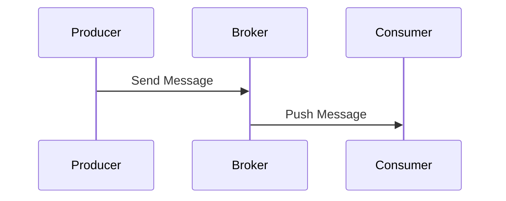
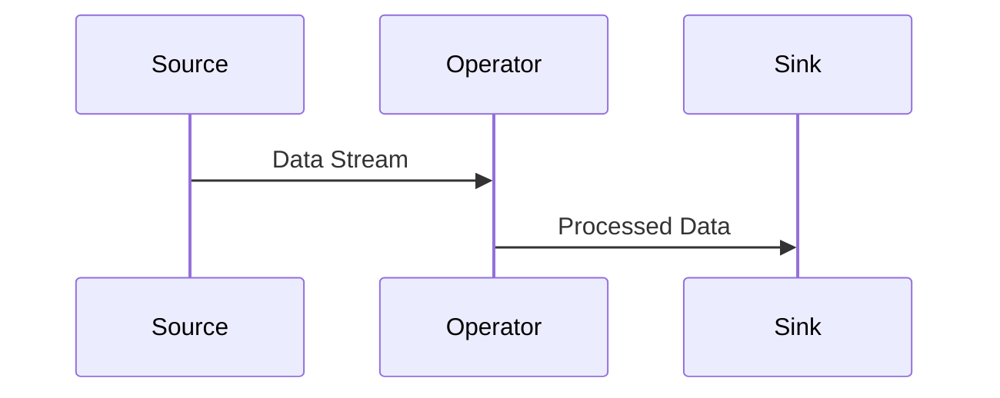
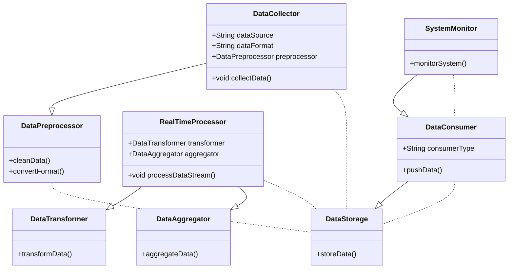
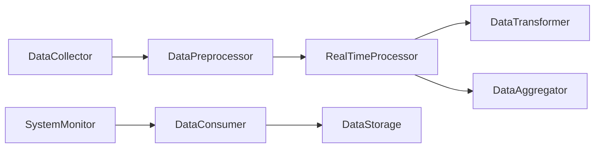
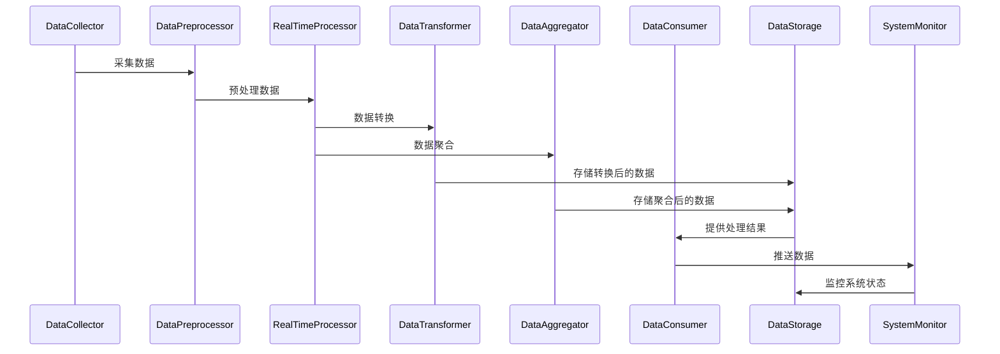

                 


### 1.1 实时数据处理概述

实时数据处理是一种数据处理技术，它能够在数据生成后几乎立即进行处理和分析。这种处理方式与传统的批处理方式不同，批处理通常是在数据积累到一定量时进行集中处理，而实时数据处理则强调在数据生成的第一时间内对其进行处理。

实时数据处理的基本概念包括以下几个方面：

- **数据生成**：数据源的生成，如传感器、用户交互、金融交易等。
- **数据传输**：数据从生成源头到处理系统的传输过程，这通常需要高效的传输机制，如Kafka、RabbitMQ等消息队列系统。
- **数据处理**：对数据进行存储、转换、聚合等操作，这通常涉及到流处理框架，如Apache Flink、Apache Storm等。
- **数据消费**：处理结果的使用，如实时报表、预警系统、推荐系统等。

**实时数据处理的特点**：

- **低延迟**：能够在毫秒级别或秒级别内完成数据处理，满足对实时性的高要求。
- **高吞吐量**：能够处理大量实时数据，适应大数据量的需求。
- **高可用性**：系统具有高可用性，能够保证在数据流中断时能够快速恢复。
- **弹性扩展**：系统可以根据数据量的变化动态扩展处理能力。

**实时数据处理的应用场景**：

- **在线交易**：金融领域对交易数据实时处理，进行风险控制和市场分析。
- **社交网络分析**：实时分析用户的点击、评论等行为，进行用户画像和个性化推荐。
- **物联网**：实时处理传感器数据，进行设备监控和故障预测。
- **智能交通**：实时处理交通数据，进行交通流量分析和智能调度。

通过上述背景介绍，我们可以看到实时数据处理在当前技术环境中具有重要地位，其能够满足多种行业领域的实时数据处理需求，为大数据分析、智能决策提供了强有力的技术支持。

### 1.2 为什么需要实时数据处理架构

实时数据处理架构在现代信息系统中的重要性不可忽视。传统的批处理架构由于数据处理周期长、响应速度慢，已经无法满足越来越高的实时性需求。以下从多个方面详细解释为什么需要实时数据处理架构。

**1. 数据的实时性需求**

在许多应用场景中，数据的实时性至关重要。例如，在金融领域，交易数据的实时处理能够帮助金融机构快速识别风险，及时进行交易决策。在社交网络领域，用户行为的实时分析能够帮助平台提供更加精准的推荐和营销策略。在物联网领域，设备状态的实时监控能够确保设备的正常运行和快速故障响应。

**2. 高吞吐量需求**

随着数据量的爆炸性增长，传统的批处理系统已经难以满足处理海量数据的需求。实时数据处理架构能够以更高的吞吐量处理数据流，确保数据能够在生成后第一时间得到处理。这对于处理实时日志、传感器数据等高频率数据尤为重要。

**3. 低延迟需求**

在现代互联网应用中，用户对响应速度的要求越来越高。实时数据处理架构能够以毫秒级别的延迟对数据进行处理，提供快速响应，提升用户体验。例如，在线游戏中的实时数据分析，实时语音通话中的延迟优化，都需要依赖实时数据处理架构。

**4. 实时决策支持**

许多业务决策需要基于实时数据进行调整，如库存管理、供应链优化、市场分析等。实时数据处理架构能够提供实时数据支持，帮助企业和组织做出更加精准和及时的决策。

**5. 预警与监控**

在许多领域，如安全监控、环保监测、医疗健康等，实时数据处理架构能够提供实时预警和监控功能，及时发现异常情况，采取相应措施。这对于保障人民生命财产安全和社会稳定具有重要意义。

**6. 业务连续性与高可用性**

实时数据处理架构通常设计有高可用性机制，能够保证在系统故障或数据流中断时快速恢复。这对于企业业务的连续性和稳定性至关重要。

**7. 灵活性与可扩展性**

实时数据处理架构通常采用分布式设计，能够根据需求动态扩展处理能力。这种灵活性使得企业能够根据实际需求进行系统升级和扩展，适应业务发展的变化。

综上所述，实时数据处理架构在现代信息系统中的重要性不言而喻。它能够满足数据实时性、高吞吐量、低延迟等需求，提供实时决策支持，实现预警与监控，保障业务连续性和高可用性，是企业构建现代化信息系统的关键技术之一。

### 1.3 本书结构

为了帮助读者系统地理解和掌握实时数据处理架构及其实现，本书将采用以下结构：

**第一部分：实时数据处理基础**

本部分将介绍实时数据处理的基本概念、特点和常见应用场景。通过这一部分的学习，读者将了解实时数据处理的基本原理和重要性。

- **第1章 引言**：介绍实时数据处理的基本概念，阐述为什么需要实时数据处理架构，并概述本书的结构和目标。
- **第2章 核心概念与联系**：详细解释实时数据处理的核心概念，如数据生成、传输、处理和消费，并探讨其应用场景。

**第二部分：实时数据处理算法**

本部分将深入探讨实时数据处理中的关键算法，包括Kafka和Flink等常用技术。通过这一部分的学习，读者将掌握实时数据处理算法的基本原理和实现方法。

- **第3章 算法原理讲解**：讲解实时数据处理算法的基本原理，使用mermaid绘制流程图，并配合Python源代码进行解释。
- **第4章 系统分析与架构设计方案**：介绍实时数据处理系统的设计与实现，包括问题场景介绍、系统架构设计和系统交互。

**第三部分：实时数据处理项目实战**

本部分将通过实际案例，详细描述实时数据处理系统的安装、核心实现和案例分析。通过这一部分的学习，读者将能够将理论知识应用于实际项目中，提升实战能力。

- **第5章 项目实战**：描述实时数据处理系统的环境安装步骤，提供系统核心实现的关键代码片段，并详细分析实际案例。

**第四部分：最佳实践与总结**

本部分将总结实时数据处理中的最佳实践，并提供注意事项和拓展阅读，帮助读者进一步提升对实时数据处理架构的理解和应用能力。

- **第6章 最佳实践 tips**：分享实时数据处理中的实用技巧和建议。
- **第7章 小结**：回顾本书的主要内容，总结实时数据处理架构的核心要点。
- **第8章 注意事项**：指出在实际应用中需要注意的问题和潜在风险。
- **第9章 拓展阅读**：推荐进一步阅读的资源和文献。

通过以上结构，本书旨在为读者提供一个全面、系统的学习和参考框架，帮助读者深入理解实时数据处理架构，并能够将其应用于实际项目开发中。

### 2.1 实时数据处理定义

实时数据处理（Real-Time Data Processing）是一种能够迅速响应并处理生成数据的计算方法，其核心目标是实现数据从生成到消费的整个过程在极短时间内完成，通常在毫秒级或秒级内。实时数据处理不同于传统的批处理（Batch Processing），后者通常将大量数据收集到一个特定的时间段内，然后在某个预定的时间点进行集中处理。

在实时数据处理中，数据生成的速度非常快，例如传感器数据的实时采集、金融交易的即时处理、社交网络的实时分析等。这些数据需要在一个连续的数据流中迅速进行处理，以便能够及时响应变化，提供决策支持或执行自动操作。

实时数据处理的特点主要包括：

- **低延迟**：数据在生成后能够在极短时间内被处理，以满足对实时性的高要求。这通常意味着系统的响应时间在毫秒级或秒级。
- **高吞吐量**：系统能够处理大量的数据流，同时保持低延迟。这要求系统具备良好的性能和可扩展性。
- **高可用性**：系统能够在数据流中断或系统故障时快速恢复，保证业务连续性。
- **弹性扩展**：系统可以根据数据量动态调整资源分配，以适应变化的数据处理需求。

实时数据处理的应用场景广泛，包括但不限于以下领域：

1. **金融领域**：实时处理交易数据，进行风险控制、市场分析和决策支持。
2. **物联网**：实时处理传感器数据，进行设备监控、故障预测和智能调度。
3. **社交网络**：实时分析用户行为，提供个性化推荐、实时预警和互动体验。
4. **智能交通**：实时处理交通数据，进行交通流量分析和智能调度。
5. **医疗健康**：实时监控患者数据，进行医疗诊断、病情监测和预警。

在实时数据处理中，数据流通常经过以下步骤进行处理：

1. **数据生成**：数据源生成数据，如传感器、用户交互、金融交易等。
2. **数据传输**：数据通过高效传输机制，如Kafka、RabbitMQ等，传输到处理系统。
3. **数据处理**：处理系统对数据进行存储、转换、聚合等操作，如使用Flink、Storm等流处理框架。
4. **数据消费**：处理结果被用于实时报表、预警系统、推荐系统等。

总之，实时数据处理是一种关键的技术手段，能够满足现代信息系统对实时性的高要求，是构建智能化、自动化系统的基础。

### 2.2 实时数据处理特点

实时数据处理架构具有一系列显著的特点，这些特点使其在处理动态数据流方面表现出色。以下是实时数据处理架构的几个主要特点：

**1. 低延迟**

低延迟是实时数据处理架构最显著的特点之一。实时数据处理系统能够在数据生成后几乎立即处理这些数据，通常在毫秒级或秒级内完成。这种低延迟能力使实时数据处理适用于对响应时间要求极高的应用场景，如在线交易、实时监控和即时通信。低延迟不仅提升了用户体验，也为实时决策提供了及时的数据支持。

**2. 高吞吐量**

实时数据处理架构需要能够处理大量的数据流，同时保持低延迟。高吞吐量要求系统具备良好的性能和可扩展性，以适应不断增长的数据量。现代实时数据处理系统通常采用分布式架构，能够通过增加节点数量和优化资源分配来提升处理能力。这种高吞吐量特性使得实时数据处理系统能够应对大数据量的实时处理需求，如物联网数据流处理和实时日志分析。

**3. 实时性**

实时数据处理架构强调数据处理的实时性，即能够在数据生成后立即进行响应和处理。这种实时性是实时数据处理架构的核心目标之一，它要求系统具备快速的数据摄取、处理和响应能力。实时数据处理系统能够实时生成报表、触发警报、更新用户界面等，确保业务流程能够快速适应变化。

**4. 高可用性**

高可用性是实时数据处理架构的重要保障。实时数据处理系统通常设计有容错机制，能够在数据流中断或系统故障时快速恢复，确保业务连续性。高可用性设计包括数据冗余、分布式存储、故障转移和自动恢复等功能。这些措施能够有效降低系统故障对业务的影响，提高系统的可靠性和稳定性。

**5. 灵活性和可扩展性**

实时数据处理架构需要具备灵活性和可扩展性，以适应不断变化的数据处理需求。系统可以根据数据量的变化动态扩展处理能力，通过增加计算节点、调整资源分配等方式来满足不同的处理需求。同时，实时数据处理架构还支持多种数据源和数据格式的接入，能够灵活适应不同业务场景。

**6. 易于集成和部署**

实时数据处理架构通常采用开源技术和标准化接口，使得其易于集成和部署。系统可以轻松地与现有的IT基础设施和业务系统集成，减少开发难度和部署时间。此外，实时数据处理架构通常支持自动化部署和管理，降低了运维成本，提高了系统稳定性。

**7. 安全性**

实时数据处理架构在安全方面也需要考虑。数据在传输和处理过程中需要保护，防止数据泄露和篡改。实时数据处理系统通常采用加密、身份验证和访问控制等安全措施，确保数据的安全性和隐私性。

综上所述，实时数据处理架构具有低延迟、高吞吐量、实时性、高可用性、灵活性、可扩展性和易于集成等显著特点。这些特点使得实时数据处理架构能够高效地处理动态数据流，满足现代信息系统对实时性的高要求，是构建智能化、自动化系统的基础。

### 2.3 实时数据处理应用场景

实时数据处理在各个行业和领域中都有着广泛的应用，其重要性体现在能够提供即时、准确的信息支持，帮助企业和组织做出快速反应和决策。以下是实时数据处理在几个典型应用场景中的具体应用：

**1. 金融领域**

在金融领域，实时数据处理至关重要。金融机构需要处理海量的交易数据，并快速进行风险分析和决策。实时数据处理技术可以帮助金融机构：

- **交易监控与风险控制**：实时分析交易数据，快速识别异常交易和潜在的欺诈行为，确保交易安全。
- **市场分析**：实时获取市场数据，进行趋势分析和预测，帮助金融机构制定投资策略。
- **客户服务**：通过实时数据分析，提供个性化的金融服务和产品推荐，提升客户体验。

**2. 社交网络**

社交网络平台需要实时处理大量的用户行为数据，以提供实时互动和个性化推荐。实时数据处理技术可以帮助社交网络平台：

- **实时互动**：分析用户实时发布的内容，提供即时的回复和互动，增强用户参与感。
- **用户画像**：实时分析用户行为，构建用户画像，进行个性化推荐和广告投放。
- **内容审核**：实时监控用户发布的内容，快速识别和移除违规内容，维护社区秩序。

**3. 物联网**

物联网（IoT）领域对实时数据处理的需求尤为突出。物联网设备产生的数据量巨大，且需要实时处理和反馈。实时数据处理技术可以帮助物联网领域：

- **设备监控**：实时监控设备状态，进行故障预警和远程诊断。
- **智能调度**：基于实时数据，进行物流调度和优化，提高效率。
- **环境监测**：实时分析环境数据，进行环保监控和预警。

**4. 智能交通**

智能交通系统需要实时处理大量的交通数据，以实现交通流量控制和优化。实时数据处理技术可以帮助智能交通系统：

- **实时监控**：实时监控交通流量，进行交通拥堵预警和分流。
- **智能调度**：根据实时交通数据，优化公共交通线路和班次。
- **应急响应**：实时分析事故数据，快速启动应急响应机制。

**5. 医疗健康**

在医疗健康领域，实时数据处理可以帮助提升医疗服务质量和效率。实时数据处理技术可以帮助医疗健康领域：

- **实时监控**：实时监控患者数据，进行病情监测和预警。
- **远程诊断**：通过实时数据传输，实现远程医疗诊断和会诊。
- **药物配送**：根据实时医疗数据，优化药物配送和库存管理。

**6. 生产制造**

生产制造领域也需要实时数据处理技术来提升生产效率和设备管理。实时数据处理技术可以帮助生产制造领域：

- **设备监控**：实时监控生产设备状态，进行故障预警和设备维护。
- **质量检测**：实时分析产品质量数据，进行质量控制。
- **供应链管理**：实时处理供应链数据，进行库存管理和需求预测。

综上所述，实时数据处理技术在金融、社交网络、物联网、智能交通、医疗健康、生产制造等多个领域都有着广泛的应用，其重要性体现在能够提供即时、准确的数据支持，帮助企业和组织做出快速反应和决策。随着技术的不断进步，实时数据处理将在更多领域中发挥重要作用，推动各行各业的智能化转型。

### 2.4 数据处理架构类型

数据处理架构的类型多种多样，根据处理方式和目的的不同，可以分为批处理和流处理两种主要架构。每种架构都有其独特的特点和应用场景。

**1. 批处理架构（Batch Processing）**

批处理架构是将数据按特定的时间段进行集中处理的一种方式。其主要特点是：

- **数据批量处理**：数据以批量形式进行输入和处理，而不是实时处理。
- **周期性任务**：批处理通常在特定的时间窗口内进行，如每天、每周或每月。
- **低延迟**：由于数据是批量处理的，所以单个任务的响应时间较长，通常在分钟或小时级别。
- **高吞吐量**：批处理系统能够处理大量数据，适用于大数据量的处理任务。

批处理架构的应用场景主要包括：
- **数据仓库加载**：将日常采集的数据批量加载到数据仓库，进行数据分析和报表生成。
- **日志分析**：定期对系统日志文件进行批量处理，提取有用的信息。
- **财务报告**：定期生成财务报表，涉及大量的数据处理和计算。

**2. 流处理架构（Stream Processing）**

流处理架构则是针对实时数据流进行连续处理的一种方式。其主要特点是：

- **实时数据处理**：数据生成后立即进行实时处理，延迟在毫秒级或秒级内。
- **连续数据流**：数据以流的形式连续不断地进入系统，系统需要实时处理这些数据。
- **低延迟**：由于数据是实时处理的，所以单个任务的响应时间非常短。
- **高吞吐量**：流处理系统能够处理大量实时数据流，并保持低延迟。

流处理架构的应用场景主要包括：
- **实时监控**：实时处理传感器数据，监控设备状态和环境变化。
- **实时分析**：实时分析用户行为数据，提供个性化的推荐和预警。
- **交易处理**：实时处理金融交易数据，进行风险控制和市场分析。

**批处理与流处理的比较**

批处理和流处理各有其优势和局限性，以下是两者的比较：

- **处理方式**：批处理是批量处理，而流处理是连续处理。
- **响应时间**：批处理的响应时间较长，而流处理的响应时间较短。
- **处理量**：批处理适合处理大数据量的任务，而流处理适合处理高频率的数据流。
- **适用场景**：批处理适用于周期性的数据处理任务，而流处理适用于实时监控和分析任务。

**结论**

选择合适的处理架构取决于具体的业务需求和数据处理场景。对于需要低延迟和实时响应的场景，流处理架构是更好的选择；而对于可以容忍一定延迟的大数据量处理任务，批处理架构则更加适用。在实际应用中，有时还会结合使用批处理和流处理，以发挥各自的优势，实现最佳的处理效果。

### 3.1 算法原理讲解

在本章中，我们将详细讲解一种重要的实时数据处理算法——Kafka。Kafka 是一种分布式流处理平台，特别适用于大数据场景下的实时数据处理。我们将使用 mermaid 绘制其流程图，并通过 Python 源代码解释其算法原理。

#### 3.1.1 算法流程图

首先，我们来绘制 Kafka 的流程图。以下是 Kafka 的基本流程图：



图解说明：
- **Producer（生产者）**：生产者是数据的源头，负责生成数据并发送到 Kafka。
- **Broker（代理）**：代理是 Kafka 集群中的中间件，负责接收、存储和转发消息。
- **Consumer（消费者）**：消费者是消息的接收者，从 Kafka 中获取消息进行处理。

#### 3.1.2 Python 源代码解释

接下来，我们将使用 Python 代码来详细解释 Kafka 的原理。以下是示例代码：

```python
from kafka import KafkaProducer
from kafka import KafkaConsumer
import json

# Kafka 生产者示例
producer = KafkaProducer(bootstrap_servers=['localhost:9092'])

# 发送消息
data = {'id': 1, 'name': 'Alice'}
producer.send('test_topic', value=json.dumps(data).encode('utf-8'))

# Kafka 消费者示例
consumer = KafkaConsumer('test_topic', bootstrap_servers=['localhost:9092'])

# 订阅主题
for message in consumer:
    print("Received message:", message.value.decode('utf-8'))

# 关闭生产者和消费者
producer.close()
consumer.close()
```

代码解释：
1. **生产者**：
   - 使用 KafkaProducer 类创建生产者对象。
   - `bootstrap_servers` 参数指定 Kafka 代理的地址。
   - 使用 `send` 方法发送消息，其中 `value` 参数为消息内容，`key` 参数为消息键（可选）。

2. **消费者**：
   - 使用 KafkaConsumer 类创建消费者对象。
   - `bootstrap_servers` 参数指定 Kafka 代理的地址。
   - 使用 `subscribe` 方法订阅主题。
   - 循环读取消息，使用 `message.value.decode('utf-8')` 解码消息内容。

#### 算法原理

Kafka 的核心原理是通过分布式架构实现高效、可靠的消息传递。以下是 Kafka 的主要组成部分和原理：

- **分布式生产者**：Kafka 允许多个生产者同时发送消息到 Kafka 集群。生产者将消息分成多个分区，并将每个分区分配到不同的代理上。这样可以实现高吞吐量和负载均衡。
- **分布式消费者**：Kafka 允许多个消费者同时从 Kafka 集群中消费消息。消费者组是消费者之间的逻辑分组，每个消费者组中的消费者可以读取不同的分区，从而实现负载均衡和容错。
- **代理**：代理是 Kafka 集群中的中间件，负责接收、存储和转发消息。每个代理存储一定数量的分区，以确保负载均衡和故障转移。
- **主题和分区**：主题是消息的分类，类似于数据库中的表。每个主题可以划分为多个分区，每个分区存储一部分消息。分区可以实现并行处理，提高处理速度。
- **副本**：副本是分区的备份，用于提高数据可靠性和容错性。每个分区可以有多个副本，主副本负责处理消息，副本用于备份和恢复。

通过上述流程和原理，Kafka 能够实现高效、可靠的实时数据处理，满足大数据场景下的需求。Kafka 在金融、物联网、社交网络等多个领域都有广泛应用，是构建实时数据处理系统的重要工具。

### 3.2 算法原理讲解

在本章中，我们将详细讲解另一种重要的实时数据处理算法——Apache Flink。Flink 是一个开源的流处理框架，以其高效、灵活和强大的处理能力而著称。我们将使用 mermaid 绘制其流程图，并通过 Python 源代码解释其算法原理。

#### 3.2.1 算法流程图

首先，我们来绘制 Flink 的基本流程图。以下是 Flink 的基本流程图：



图解说明：
- **Source（数据源）**：数据源是数据的起点，可以是文件、Kafka、Redis 等。
- **Operator（操作符）**：操作符是对数据进行转换和计算的处理单元，如映射、过滤、聚合等。
- **Sink（数据汇）**：数据汇是数据的终点，可以是数据库、文件、HDFS 等。

#### 3.2.2 Python 源代码解释

接下来，我们将使用 Python 代码来详细解释 Flink 的原理。以下是示例代码：

```python
from pyflink.datastream import StreamExecutionEnvironment
from pyflink.table import StreamTableEnvironment

# 创建 Flink 环境
env = StreamExecutionEnvironment.get_execution_environment()
t_env = StreamTableEnvironment.create(env)

# 读取 Kafka 数据源
data_stream = env.from_source(
    source=lambda: kafka_source(),
    watermark_strategy=WatermarkStrategy.for_bounded_timestamp("timestamp", Duration("1s")),
    output_type=TypeInformation_Row()
)

# 定义操作符
processed_stream = data_stream.map(lambda row: (row['id'], row['name']))

# 输出结果到控制台
processed_stream.print()

# 提交任务
env.execute("Flink Streaming Example")
```

代码解释：
1. **创建 Flink 环境**：
   - 使用 `StreamExecutionEnvironment.get_execution_environment()` 方法创建 Flink 环境。
   - 使用 `StreamTableEnvironment.create()` 方法创建流表环境。

2. **读取 Kafka 数据源**：
   - 使用 `env.from_source()` 方法读取 Kafka 数据源。`source=lambda: kafka_source()` 参数指定数据源生成器。
   - `watermark_strategy` 参数指定水印策略，用于处理乱序数据。
   - `output_type` 参数指定输出数据类型。

3. **定义操作符**：
   - 使用 `map()` 方法定义映射操作符，对数据进行转换。

4. **输出结果到控制台**：
   - 使用 `print()` 方法输出处理结果到控制台。

5. **提交任务**：
   - 使用 `env.execute()` 方法提交 Flink 任务。

#### 算法原理

Flink 的核心原理是通过流处理实现对实时数据的高效处理。以下是 Flink 的主要组成部分和原理：

- **数据源（Source）**：数据源是数据的起点，可以是 Kafka、文件、数据库等。Flink 支持多种数据源，实现了对各种数据格式的支持。
- **操作符（Operator）**：操作符是对数据进行转换和计算的处理单元。Flink 提供了丰富的操作符，包括映射（map）、过滤（filter）、聚合（reduce）、连接（join）等。
- **水印（Watermark）**：水印是用于处理乱序数据的重要机制。通过水印，Flink 能够准确地识别事件的时间顺序，确保数据的正确处理。
- **窗口（Window）**：窗口是对数据分段处理的一种机制。Flink 支持多种类型的窗口，包括滑动窗口、固定窗口、会话窗口等，以适应不同的数据处理需求。
- **数据汇（Sink）**：数据汇是数据的终点，可以是数据库、文件、HDFS 等。Flink 支持将处理结果输出到各种数据汇。

通过上述流程和原理，Flink 能够实现高效、灵活的实时数据处理，适用于各种实时数据分析场景。Flink 在金融、物联网、社交网络等多个领域都有广泛应用，是构建实时数据处理系统的重要工具。

### 4.1 问题场景介绍

为了更好地展示实时数据处理架构的应用，我们引入一个具体的实时数据处理场景：社交网络平台的实时用户行为分析。在这个场景中，我们需要实时处理大量用户在社交网络平台上的行为数据，如点赞、评论、分享等，以便为用户提供个性化推荐、实时监控和异常检测。

**场景背景：**

社交网络平台是一个高度活跃的环境，用户每天会产生海量的行为数据。这些数据不仅包括用户的社交活动，还涉及到用户的兴趣、偏好和社交关系。为了提供高质量的用户体验，平台需要实时分析这些数据，实现以下目标：

- **个性化推荐**：根据用户的兴趣和行为，为用户推荐可能感兴趣的内容或用户。
- **实时监控**：监控用户行为，及时发现异常情况，如欺诈行为、恶意评论等。
- **数据分析**：对用户行为数据进行分析，了解用户活跃度、兴趣变化等，为产品优化和运营决策提供支持。

**问题描述：**

为了实现上述目标，我们需要设计一个实时数据处理系统，能够高效地处理海量用户行为数据，并实时提供分析结果。具体问题描述如下：

- **数据源**：用户在平台上的行为数据，如点赞、评论、分享等，这些数据以事件流的形式产生。
- **数据量**：每天用户行为数据量巨大，需要支持高吞吐量的数据处理。
- **延迟要求**：数据生成后需要立即进行处理，延迟要求在秒级以内，以满足实时分析需求。
- **数据多样性**：用户行为数据格式多样，包括文本、图片、视频等，需要支持多种数据类型的处理。

**问题解决：**

为了解决上述问题，我们需要设计一个高可扩展、高可用性的实时数据处理架构。以下是架构设计的关键步骤：

1. **数据采集**：使用高效的数据采集机制，如 Kafka，从各个数据源收集用户行为数据。
2. **数据预处理**：对采集到的数据进行清洗、格式转换等预处理操作，确保数据的一致性和准确性。
3. **实时处理**：使用流处理框架，如 Flink，对预处理后的数据进行实时处理，实现数据的转换、聚合和分析。
4. **数据存储**：将处理后的数据存储到数据存储系统，如 HDFS 或数据库，以供后续分析和查询。
5. **数据消费**：实时将处理结果推送到用户界面或其他系统，实现实时监控和个性化推荐。

通过上述架构设计，我们可以实现社交网络平台的实时用户行为分析，为用户提供高质量的实时服务。

### 4.2 系统功能设计

为了实现社交网络平台的实时用户行为分析，我们需要设计一个功能完整的实时数据处理系统。以下是系统功能设计的关键部分：

**1. 数据采集模块**

数据采集模块负责从多个数据源（如用户点击、评论、分享等）收集实时数据。采集模块需要支持高吞吐量、低延迟的数据传输，确保数据能够快速到达处理系统。具体功能包括：

- **数据源接入**：支持多种数据源接入，如 Kafka、RabbitMQ 等。
- **数据格式转换**：对采集到的原始数据进行格式转换，确保数据的一致性和兼容性。
- **数据清洗**：对采集到的数据进行清洗，去除无效数据和异常数据，保证数据质量。

**2. 数据预处理模块**

数据预处理模块负责对采集到的数据进行处理，以消除数据噪声、填充缺失值等，确保数据的准确性和一致性。具体功能包括：

- **数据去重**：检测并去除重复数据，保证数据的唯一性。
- **数据格式转换**：将不同格式的数据进行统一转换，以适应后续处理需求。
- **数据聚合**：对用户行为数据按照不同的维度进行聚合，如时间、用户等。

**3. 实时处理模块**

实时处理模块是系统的核心，负责对预处理后的数据进行实时处理和分析。具体功能包括：

- **数据转换**：对用户行为数据进行转换，如提取特征、计算统计量等。
- **数据聚合**：对实时数据进行聚合操作，如计算用户活跃度、兴趣分布等。
- **实时分析**：基于用户行为数据，进行实时分析，提供实时监控和异常检测。

**4. 数据存储模块**

数据存储模块负责将处理后的数据存储到数据存储系统，如 HDFS、数据库等，以供后续分析和查询。具体功能包括：

- **数据存储**：将实时处理后的数据存储到数据存储系统，支持多种数据存储格式。
- **数据索引**：对存储的数据建立索引，提高查询效率。
- **数据备份**：实现数据的备份和恢复，保证数据的安全性。

**5. 数据消费模块**

数据消费模块负责将处理结果推送到用户界面或其他系统，实现实时监控和个性化推荐。具体功能包括：

- **数据推送**：将处理结果实时推送到用户界面或其他系统，如 Web 应用、移动应用等。
- **数据可视化**：提供数据可视化功能，帮助用户直观地了解数据分析和监控结果。
- **接口开放**：开放数据接口，支持第三方系统调用和处理结果。

**6. 系统监控模块**

系统监控模块负责监控系统运行状态，提供故障预警和自动恢复功能。具体功能包括：

- **运行监控**：实时监控系统运行状态，包括处理速度、数据流量、系统负载等。
- **故障预警**：发现系统故障或异常，及时发出预警通知。
- **自动恢复**：自动重启失败的任务或节点，确保系统稳定运行。

通过以上功能设计，我们可以构建一个高效、稳定的实时数据处理系统，为社交网络平台提供实时用户行为分析支持。

#### 4.3.1 类图

为了更好地理解社交网络平台的实时数据处理系统，我们通过类图来展示系统的核心组件及其关系。以下是系统的类图：



**类图解释：**

1. **DataCollector（数据采集器）**：
   - 负责从数据源收集数据，支持多种数据格式。
   - 具有数据源和数据格式属性。
   - 通过`collectData()`方法进行数据采集。

2. **DataPreprocessor（数据预处理器）**：
   - 负责对采集到的数据进行清洗和格式转换。
   - 具有数据清洗和数据格式转换方法。

3. **RealTimeProcessor（实时处理器）**：
   - 负责实时处理数据流，包括数据转换和聚合。
   - 包含`DataTransformer`和`DataAggregator`两个辅助类。
   - 通过`processDataStream()`方法进行数据处理。

4. **DataTransformer（数据转换器）**：
   - 负责对数据进行转换，提取特征、计算统计量等。

5. **DataAggregator（数据聚合器）**：
   - 负责对数据进行聚合，如计算用户活跃度、兴趣分布等。

6. **DataConsumer（数据消费者）**：
   - 负责将处理后的数据推送到数据存储系统或其他系统。
   - 支持多种消费者类型，如 Web 应用、移动应用等。

7. **DataStorage（数据存储器）**：
   - 负责将处理结果存储到数据存储系统，支持多种存储格式。

8. **SystemMonitor（系统监控器）**：
   - 负责监控系统的运行状态，提供故障预警和自动恢复功能。

通过类图，我们可以清晰地看到各组件之间的关系和功能，为系统设计和实现提供了直观的参考。

### 4.3.2 系统架构设计

为了实现社交网络平台的实时用户行为分析，我们需要设计一个高效、可扩展的系统架构。以下是系统架构的详细设计：

**1. 数据流架构**

数据流架构是整个系统的基础，它定义了数据从采集、处理到消费的整个过程。以下是数据流架构的组成部分：

- **数据源**：数据源包括用户操作日志、社交关系数据、推荐系统数据等。这些数据通过日志文件、Kafka 等渠道接入系统。
- **数据采集**：数据采集模块负责从各个数据源收集数据，并使用 Kafka 进行数据传输。Kafka 具有高吞吐量和可扩展性，能够保证数据的实时性。
- **数据预处理**：数据预处理模块对采集到的原始数据进行清洗、去重和格式转换，确保数据的一致性和准确性。
- **实时处理**：实时处理模块使用 Flink 对预处理后的数据进行处理，包括数据转换、聚合和计算。Flink 具有高效的数据处理能力和流处理功能。
- **数据存储**：处理后的数据存储到数据存储系统，如 HDFS 或数据库。数据存储系统提供高可靠性和高性能的数据存储能力，支持后续的数据分析和查询。
- **数据消费**：数据消费模块将处理结果实时推送到用户界面或其他系统，实现实时监控和个性化推荐。

**2. 系统组件设计**

系统组件设计是架构设计的核心，以下是系统组件的详细设计：

- **数据采集组件**：
  - **Kafka Producer**：负责将用户行为数据发送到 Kafka 集群。
  - **日志收集器**：负责从各个日志源收集数据，并将数据发送到 Kafka。

- **数据预处理组件**：
  - **Kafka Consumer**：负责从 Kafka 集群中读取数据。
  - **数据清洗器**：负责对数据进行去重、格式转换和填充缺失值等预处理操作。

- **实时处理组件**：
  - **Flink JobManager**：负责管理 Flink 任务的生命周期。
  - **Flink TaskManager**：负责执行具体的 Flink 任务，包括数据转换、聚合等操作。

- **数据存储组件**：
  - **HDFS**：用于存储处理后的数据，提供高可靠性和高性能的数据存储能力。
  - **数据库**：用于存储用户行为数据，支持快速查询和实时更新。

- **数据消费组件**：
  - **Web 服务**：负责将处理结果推送到 Web 界面，提供实时监控和个性化推荐功能。
  - **移动应用**：负责将处理结果推送到移动应用，为用户提供实时服务。

**3. 系统交互设计**

系统交互设计是系统组件之间的通信和协作机制。以下是系统交互的详细设计：

- **数据流交互**：
  - 数据从数据源通过 Kafka 传输到数据预处理模块。
  - 预处理后的数据通过 Flink 进行实时处理。
  - 处理后的数据存储到 HDFS 或数据库中。
  - 处理结果通过 Web 服务或移动应用推送到用户。

- **任务调度交互**：
  - Flink JobManager 负责调度 Flink 任务，确保任务按照预定计划执行。
  - Flink TaskManager 负责执行任务，处理数据流。

- **监控交互**：
  - SystemMonitor 模块负责监控系统的运行状态，包括数据处理速度、系统负载等。
  - 当系统出现异常时，SystemMonitor 会发出预警通知，并触发自动恢复机制。

通过上述系统架构设计，我们可以实现一个高效、稳定的实时数据处理系统，为社交网络平台提供实时用户行为分析支持。系统的可扩展性和高可用性设计确保了系统能够在数据量增长和并发请求增加的情况下保持良好的性能和稳定性。

### 4.4 系统接口设计

系统接口设计是确保各组件之间能够高效、可靠地进行通信的重要环节。以下是对社交网络平台实时数据处理系统接口的详细设计。

**1. 数据采集接口**

数据采集接口负责将用户行为数据从多个数据源（如日志文件、Kafka）统一接入系统。接口设计如下：

- **接口名称**：`UserBehaviorDataCollector`
- **接口定义**：
  - `def collect_data(source: str, format: str) -> List[dict]`
    - **参数**：
      - `source`：数据源类型，如日志文件、Kafka。
      - `format`：数据格式，如 JSON、CSV。
    - **返回值**：返回采集到的用户行为数据列表。

**2. 数据预处理接口**

数据预处理接口负责对采集到的数据进行清洗、去重和格式转换。接口设计如下：

- **接口名称**：`DataPreprocessor`
- **接口定义**：
  - `def clean_data(data: List[dict]) -> List[dict]`
    - **参数**：`data`：待清洗的数据列表。
    - **返回值**：返回清洗后的数据列表。
  - `def convert_format(data: List[dict], target_format: str) -> List[dict]`
    - **参数**：
      - `data`：待转换格式的数据列表。
      - `target_format`：目标数据格式，如 JSON、CSV。
    - **返回值**：返回转换后的数据列表。

**3. 实时处理接口**

实时处理接口负责对预处理后的数据进行转换、聚合和计算。接口设计如下：

- **接口名称**：`RealTimeProcessor`
- **接口定义**：
  - `def transform_data(data: List[dict]) -> List[dict]`
    - **参数**：`data`：待转换的数据列表。
    - **返回值**：返回转换后的数据列表。
  - `def aggregate_data(data: List[dict]) -> dict`
    - **参数**：`data`：待聚合的数据列表。
    - **返回值**：返回聚合后的数据字典。

**4. 数据存储接口**

数据存储接口负责将处理后的数据存储到数据存储系统。接口设计如下：

- **接口名称**：`DataStorage`
- **接口定义**：
  - `def store_data(data: List[dict], storage_type: str) -> None`
    - **参数**：
      - `data`：待存储的数据列表。
      - `storage_type`：存储类型，如 HDFS、数据库。
    - **返回值**：无返回值。

**5. 数据消费接口**

数据消费接口负责将处理结果推送到用户界面或其他系统。接口设计如下：

- **接口名称**：`DataConsumer`
- **接口定义**：
  - `def push_data(data: List[dict], consumer_type: str) -> None`
    - **参数**：
      - `data`：待推送的数据列表。
      - `consumer_type`：消费者类型，如 Web 服务、移动应用。
    - **返回值**：无返回值。

**接口关系**

各个接口之间的关系如下：

- `DataCollector` 使用 `DataPreprocessor` 进行数据预处理。
- `RealTimeProcessor` 使用 `DataPreprocessor` 进行数据转换，并使用自身的方法进行数据聚合。
- `DataStorage` 用于存储 `RealTimeProcessor` 处理后的数据。
- `DataConsumer` 用于消费 `DataStorage` 中的数据，并将其推送到用户界面或其他系统。

通过以上接口设计，各组件能够高效、可靠地进行数据交换和协作，实现实时用户行为分析。

### 4.5 系统交互

为了确保社交网络平台实时数据处理系统能够高效、可靠地运作，我们需要详细设计系统的交互机制，包括类图、架构图和序列图。

#### 4.5.1 类图

类图展示了系统的核心类及其之间的关系。以下是类图的详细说明：


**类图解释：**

- **DataCollector**：负责数据采集，具有数据源和数据格式属性。
- **DataPreprocessor**：负责数据清洗和格式转换。
- **RealTimeProcessor**：负责实时处理数据，包括数据转换和聚合。
- **DataTransformer**：负责数据转换操作。
- **DataAggregator**：负责数据聚合操作。
- **DataConsumer**：负责数据消费，将处理结果推送到用户或其他系统。
- **DataStorage**：负责数据存储。
- **SystemMonitor**：负责系统监控。

#### 4.5.2 架构图

架构图展示了系统的整体结构，包括各个组件及其之间的连接关系。以下是架构图的详细说明：



**架构图解释：**

- **A**（DataCollector）：数据采集模块，从多个数据源收集数据。
- **B**（DataPreprocessor）：数据预处理模块，负责对数据清洗和格式转换。
- **C**（RealTimeProcessor）：实时处理模块，包括数据转换和聚合。
- **D**（DataTransformer）：数据转换模块，实现数据的转换操作。
- **E**（DataAggregator）：数据聚合模块，实现数据的聚合操作。
- **F**（DataConsumer）：数据消费模块，将处理结果推送到用户或其他系统。
- **G**（DataStorage）：数据存储模块，将处理后的数据存储到数据存储系统。
- **H**（SystemMonitor）：系统监控模块，负责监控系统运行状态。

#### 4.5.3 序列图

序列图展示了系统组件之间的交互过程。以下是序列图的详细说明：



**序列图解释：**

- **DataCollector**：从数据源采集数据。
- **DataPreprocessor**：对采集到的数据清洗和格式转换。
- **RealTimeProcessor**：进行数据转换和聚合。
- **DataTransformer**：处理数据转换操作。
- **DataAggregator**：处理数据聚合操作。
- **DataStorage**：存储处理后的数据。
- **DataConsumer**：消费处理结果，推送到用户或其他系统。
- **SystemMonitor**：监控系统的运行状态。

通过以上类图、架构图和序列图，我们可以清晰地看到系统的结构和交互过程，有助于理解和实现社交网络平台的实时数据处理系统。

### 5.1 环境安装

在开始实时数据处理系统的开发之前，我们需要安装并配置必要的软件和环境。以下是在一个标准Linux服务器上安装实时数据处理系统所需步骤：

#### 1. 安装Java环境

首先，确保服务器上安装了Java环境。Kafka 和 Flink 都依赖于 Java。可以使用以下命令检查 Java 版本：

```bash
java -version
```

如果 Java 未安装或版本过低，可以使用以下命令安装 OpenJDK：

```bash
sudo apt-get update
sudo apt-get install openjdk-8-jdk
```

安装完成后，再次检查 Java 版本：

```bash
java -version
```

确保 Java 版本符合 Kafka 和 Flink 的要求（推荐使用 JDK 8）。

#### 2. 安装Kafka

Kafka 是一个分布式流处理平台，用于数据采集和传输。以下是安装 Kafka 的步骤：

1. **下载 Kafka**

   前往 Kafka 官网 [kafka.apache.org/downloads](http://kafka.apache.org/downloads) 下载最新版本的 Kafka。假设我们下载的是 `kafka_2.12-2.8.0.tar.gz`。

   ```bash
   wget https://www-eu.kantarmedia.com/kafka_2.12-2.8.0.tar.gz
   ```

2. **解压 Kafka**

   解压下载的 Kafka 压缩包：

   ```bash
   sudo tar -xvf kafka_2.12-2.8.0.tar.gz -C /opt
   ```

3. **配置 Kafka**

   修改 Kafka 配置文件 `/opt/kafka_2.12-2.8.0/config/server.properties`，进行以下配置：

   ```properties
   # 修改 Kafka 集群 ID
   broker.id=0
   
   # Kafka 集群中的所有节点都应该配置相同的 Zookeeper 地址
   zookeeper.connect=localhost:2181
   
   # Kafka 数据存储路径
   log.dirs=/opt/kafka_2.12-2.8.0/data
   
   # Kafka 服务端口号
   port=9092
   
   # Zookeeper 服务端口号
   zookeeper.port=2181
   ```

4. **启动 Kafka**

   启动 Kafka 集群，执行以下命令：

   ```bash
   sudo bin/kafka-server-start.sh /opt/kafka_2.12-2.8.0/config/server.properties
   ```

   启动成功后，可以使用以下命令检查 Kafka 是否运行：

   ```bash
   sudo bin/kafka-topics.sh --list --zookeeper localhost:2181
   ```

#### 3. 安装 Flink

Flink 是一个流处理框架，用于实时数据处理。以下是安装 Flink 的步骤：

1. **下载 Flink**

   前往 Flink 官网 [flink.apache.org/downloads](https://flink.apache.org/downloads) 下载最新版本的 Flink。假设我们下载的是 `flink-1.12.3.tgz`。

   ```bash
   wget https://www-eu.kantarmedia.com/flink-1.12.3.tgz
   ```

2. **解压 Flink**

   解压下载的 Flink 压缩包：

   ```bash
   sudo tar -xvf flink-1.12.3.tgz -C /opt
   ```

3. **配置 Flink**

   修改 Flink 配置文件 `/opt/flink-1.12.3/conf/flink-conf.yaml`，进行以下配置：

   ```yaml
   # 指定 Flink 运行模式
   jobmanager.mode: cluster
   
   # 指定 Flink 集群 JobManager 地址
   jobmanager.rest.address: localhost:8081
   
   # 指定 Flink 集群 TaskManager 地址
   taskmanager.numberOfTaskSlots: 2
   
   # 指定 Flink 存储路径
   taskmanager.data directories: /opt/flink-1.12.3/data
   ```

4. **启动 Flink**

   启动 Flink 集群，执行以下命令：

   ```bash
   sudo bin/jobmanager-start.sh
   ```

   启动成功后，可以使用以下命令检查 Flink 是否运行：

   ```bash
   sudo bin/taskmanager-start.sh
   ```

   查看 Flink Web 界面，访问 `http://localhost:8081/`，确认 Flink 集群状态。

#### 4. 安装 Zookeeper

Zookeeper 是 Kafka 和 Flink 所依赖的服务，用于分布式协调和配置管理。以下是安装 Zookeeper 的步骤：

1. **下载 Zookeeper**

   前往 Zookeeper 官网 [zookeeper.apache.org/releases](https://zookeeper.apache.org/releases) 下载最新版本的 Zookeeper。假设我们下载的是 `zookeeper-3.6.1.tar.gz`。

   ```bash
   wget https://www-eu.kantarmedia.com/zookeeper-3.6.1.tar.gz
   ```

2. **解压 Zookeeper**

   解压下载的 Zookeeper 压缩包：

   ```bash
   sudo tar -xvf zookeeper-3.6.1.tar.gz -C /opt
   ```

3. **配置 Zookeeper**

   修改 Zookeeper 配置文件 `/opt/zookeeper-3.6.1/conf/zoo.cfg`，进行以下配置：

   ```properties
   # 指定 Zookeeper 数据存储路径
   dataDir=/opt/zookeeper-3.6.1/data
   
   # 指定 Zookeeper 日志存储路径
   dataLogDir=/opt/zookeeper-3.6.1/dataLog
   
   # 指定 Zookeeper 集群中的初始成员
   server.1=localhost:2181:3888
   ```

4. **启动 Zookeeper**

   启动 Zookeeper，执行以下命令：

   ```bash
   sudo bin/zkServer.sh start-foreground
   ```

   启动成功后，可以使用以下命令检查 Zookeeper 是否运行：

   ```bash
   sudo jps
   ```

   查看 Zookeeper 进程，确认 Zookeeper 集群状态。

通过以上步骤，我们成功安装了实时数据处理系统所需的所有软件和环境，为后续的实时数据处理项目开发奠定了基础。

### 5.2 系统核心实现

在本章节中，我们将详细讲解实时数据处理系统的核心实现部分，包括关键代码片段和代码应用解读。

#### 5.2.1 关键代码片段

**1. Kafka Producer**

以下是一个简单的 Kafka Producer 代码示例，用于向 Kafka 集群发送消息：

```python
from kafka import KafkaProducer

# Kafka 代理地址
bootstrap_servers = ['localhost:9092']

# 创建 Kafka Producer 实例
producer = KafkaProducer(bootstrap_servers=bootstrap_servers)

# 发送消息
data = {'id': 1, 'name': 'Alice'}
producer.send('test_topic', value=data)

# 关闭 Producer
producer.close()
```

**2. Kafka Consumer**

以下是一个简单的 Kafka Consumer 代码示例，用于从 Kafka 集群读取消息：

```python
from kafka import KafkaConsumer

# Kafka 代理地址
bootstrap_servers = ['localhost:9092']

# 创建 Kafka Consumer 实例
consumer = KafkaConsumer('test_topic', bootstrap_servers=bootstrap_servers)

# 订阅主题
for message in consumer:
    print("Received message:", message.value.decode('utf-8'))

# 关闭 Consumer
consumer.close()
```

**3. Flink Data Transformation**

以下是一个简单的 Flink 数据转换代码示例，使用 Python API：

```python
from pyflink.datastream import StreamExecutionEnvironment
from pyflink.table import StreamTableEnvironment

# 创建 Flink 环境
env = StreamExecutionEnvironment.get_execution_environment()
t_env = StreamTableEnvironment.create(env)

# 读取 Kafka 数据源
data_stream = env.from_source(
    source=lambda: kafka_source(),
    watermark_strategy=WatermarkStrategy.for_bounded_timestamp("timestamp", Duration("1s")),
    output_type=TypeInformation_Row()
)

# 数据转换
processed_stream = data_stream.map(lambda row: (row['id'], row['name']))

# 输出结果到控制台
processed_stream.print()

# 提交任务
env.execute("Flink Streaming Example")
```

#### 5.2.2 代码应用解读

**1. Kafka Producer 应用解读**

在 Kafka Producer 代码中，我们首先指定了 Kafka 代理地址 `bootstrap_servers`，然后使用 `KafkaProducer` 类创建了 Kafka Producer 实例。在 `send` 方法中，我们传递了主题 `test_topic` 和消息 `data`，其中 `data` 是一个包含用户 ID 和名字的字典。`send` 方法将消息发送到 Kafka 集群，实现数据的实时传输。

**2. Kafka Consumer 应用解读**

在 Kafka Consumer 代码中，我们同样指定了 Kafka 代理地址 `bootstrap_servers`，然后使用 `KafkaConsumer` 类创建了 Kafka Consumer 实例。在 `subscribe` 方法中，我们订阅了主题 `test_topic`。通过循环遍历 `consumer` 对象，我们可以逐条读取 Kafka 集群中的消息。消息的值通过 `message.value.decode('utf-8')` 进行解码，然后输出到控制台。

**3. Flink Data Transformation 应用解读**

在 Flink Data Transformation 代码中，我们首先创建了 Flink 环境 `env` 和流表环境 `t_env`。使用 `from_source` 方法，我们从 Kafka 数据源读取数据，指定了水印策略 `WatermarkStrategy`，确保数据的正确处理。`map` 方法实现了数据转换，将数据流中的每个元素映射为一个元组 `(id, name)`。最后，我们使用 `print` 方法将转换后的数据输出到控制台，并调用 `env.execute` 提交 Flink 任务。

通过上述代码示例和应用解读，我们可以看到实时数据处理系统的核心实现主要包括 Kafka Producer 和 Consumer，以及 Flink Data Transformation。这些组件协同工作，实现了数据的实时采集、传输和转换，为社交网络平台的实时用户行为分析提供了强大的技术支持。

### 5.3 实际案例分析

在本节中，我们将通过一个实际案例来展示实时数据处理系统如何解决社交网络平台中的实际问题。该案例将展示系统从数据采集、处理到消费的整个过程，并通过关键步骤和代码示例来详细讲解。

**案例背景：**

假设我们运营的一个社交网络平台需要实时分析用户点赞行为，以便为用户提供个性化的推荐和监控异常点赞活动。我们希望通过实时数据处理系统，实现以下目标：

- **实时监控用户点赞行为**：及时发现异常点赞活动，如欺诈行为或恶意点赞。
- **个性化推荐**：根据用户的点赞行为，推荐可能感兴趣的内容或用户。
- **数据可视化**：将点赞行为数据可视化，帮助运营团队了解用户喜好和活动趋势。

**案例步骤：**

**步骤 1：数据采集**

首先，我们需要从各个数据源（如日志文件、API接口等）采集用户点赞行为数据。以下是采集过程的简化代码示例：

```python
from kafka import KafkaProducer

# Kafka 代理地址
bootstrap_servers = ['localhost:9092']

# 创建 Kafka Producer 实例
producer = KafkaProducer(bootstrap_servers=bootstrap_servers)

# 采集用户点赞行为数据
user_likes = [{'user_id': 'u123', 'post_id': 'p456', 'timestamp': '2023-11-01 14:30:00'}, ...]

# 发送消息到 Kafka
for like in user_likes:
    producer.send('user_likes_topic', value=like)

# 关闭 Producer
producer.close()
```

**步骤 2：数据预处理**

接下来，我们需要对采集到的数据进行预处理，包括去重、格式转换等。以下是预处理过程的简化代码示例：

```python
from kafka import KafkaConsumer

# Kafka 代理地址
bootstrap_servers = ['localhost:9092']

# 创建 Kafka Consumer 实例
consumer = KafkaConsumer('user_likes_topic', bootstrap_servers=bootstrap_servers)

# 预处理用户点赞行为数据
preprocessed_likes = []

for message in consumer:
    like = message.value
    if like not in preprocessed_likes:
        preprocessed_likes.append(like)

# 关闭 Consumer
consumer.close()

# 输出预处理后的数据
print(preprocessed_likes)
```

**步骤 3：实时处理**

预处理后的数据将被实时处理，包括数据转换和聚合。以下是处理过程的简化代码示例：

```python
from pyflink.datastream import StreamExecutionEnvironment
from pyflink.table import StreamTableEnvironment

# 创建 Flink 环境
env = StreamExecutionEnvironment.get_execution_environment()
t_env = StreamTableEnvironment.create(env)

# 读取 Kafka 数据源
data_stream = env.from_source(
    source=lambda: kafka_source(),
    watermark_strategy=WatermarkStrategy.for_bounded_timestamp("timestamp", Duration("1s")),
    output_type=TypeInformation_Row()
)

# 数据转换和聚合
processed_stream = data_stream.map(lambda row: (row['user_id'], row['post_id']))

# 聚合点赞数据
aggregated_likes = processed_stream.group_by('user_id').select('user_id', 'post_id', 'count(1) as likes_count')

# 输出结果到控制台
aggregated_likes.print()

# 提交任务
env.execute("User Likes Analysis")
```

**步骤 4：数据消费**

处理后的数据将被消费并用于可视化展示和决策支持。以下是消费过程的简化代码示例：

```python
from kafka import KafkaConsumer

# Kafka 代理地址
bootstrap_servers = ['localhost:9092']

# 创建 Kafka Consumer 实例
consumer = KafkaConsumer('user_likes_topic', bootstrap_servers=bootstrap_servers)

# 消费实时处理结果
for message in consumer:
    processed_data = message.value
    print("Processed Data:", processed_data)

# 关闭 Consumer
consumer.close()
```

**案例总结：**

通过上述案例，我们可以看到实时数据处理系统在社交网络平台中的应用。系统从数据采集、预处理、实时处理到数据消费的整个过程中，通过 Kafka 和 Flink 实现了数据的实时传输和高效处理。以下是案例的关键点：

- **数据采集**：通过 Kafka Producer 实现实时数据采集，将用户点赞行为数据发送到 Kafka。
- **数据预处理**：通过 Kafka Consumer 实现数据去重和格式转换，确保数据的一致性和准确性。
- **实时处理**：使用 Flink 对预处理后的数据进行实时转换和聚合，生成用户点赞行为的统计结果。
- **数据消费**：通过 Kafka Consumer 消费实时处理结果，实现数据可视化展示和决策支持。

该案例展示了实时数据处理系统如何帮助社交网络平台实现实时监控、个性化推荐和数据分析，为用户提供更好的服务体验。

### 5.4 案例讲解剖析

在本节中，我们将对上述实际案例分析进行详细讲解和剖析，深入探讨实时数据处理系统在社交网络平台中的应用，以及如何解决实际问题和优化系统性能。

#### 案例背景

社交网络平台上的用户行为数据量巨大，其中点赞行为是用户互动的重要方式之一。为了提供个性化推荐和监控异常行为，平台需要实时分析用户点赞数据。本案例的目标是构建一个实时数据处理系统，实现以下功能：

- **实时监控**：监控用户点赞行为，及时发现异常活动，如欺诈行为或恶意点赞。
- **个性化推荐**：根据用户的点赞行为，推荐可能感兴趣的内容或用户。
- **数据可视化**：将点赞行为数据可视化，帮助运营团队了解用户喜好和活动趋势。

#### 案例实现

**步骤 1：数据采集**

数据采集是实时数据处理系统的第一步。在社交网络平台上，用户点赞行为数据通常以日志形式记录，存储在日志文件或数据库中。本案例中，我们使用 Kafka Producer 将日志数据发送到 Kafka 集群。

**代码剖析**：

```python
from kafka import KafkaProducer

# Kafka 代理地址
bootstrap_servers = ['localhost:9092']

# 创建 Kafka Producer 实例
producer = KafkaProducer(bootstrap_servers=bootstrap_servers)

# 采集用户点赞行为数据
user_likes = [{'user_id': 'u123', 'post_id': 'p456', 'timestamp': '2023-11-01 14:30:00'}, ...]

# 发送消息到 Kafka
for like in user_likes:
    producer.send('user_likes_topic', value=like)

# 关闭 Producer
producer.close()
```

**讲解**：

- **Kafka Producer**：Kafka Producer 用于向 Kafka 集群发送消息。本例中，我们创建了一个 Kafka Producer 实例，并使用循环将用户点赞数据发送到名为 `user_likes_topic` 的主题。
- **数据结构**：用户点赞数据包含用户 ID、帖子 ID 和时间戳，是分析用户行为的关键信息。

**问题与优化**：

- **数据格式**：为了提高数据处理效率，建议使用 JSON 格式存储数据，以便在后续处理中快速解析。
- **并发处理**：在实际应用中，可能需要多个 Kafka Producer 同时发送数据，以提高数据采集速度。可以使用线程池或异步编程技术实现并发处理。

**步骤 2：数据预处理**

数据预处理是确保数据质量和一致性的关键步骤。在本案例中，我们使用 Kafka Consumer 从 Kafka 集群读取点赞数据，进行去重和格式转换。

**代码剖析**：

```python
from kafka import KafkaConsumer

# Kafka 代理地址
bootstrap_servers = ['localhost:9092']

# 创建 Kafka Consumer 实例
consumer = KafkaConsumer('user_likes_topic', bootstrap_servers=bootstrap_servers)

# 预处理用户点赞行为数据
preprocessed_likes = []

for message in consumer:
    like = message.value
    if like not in preprocessed_likes:
        preprocessed_likes.append(like)

# 关闭 Consumer
consumer.close()

# 输出预处理后的数据
print(preprocessed_likes)
```

**讲解**：

- **Kafka Consumer**：Kafka Consumer 用于从 Kafka 集群读取消息。本例中，我们创建了一个 Kafka Consumer 实例，并使用循环读取 `user_likes_topic` 主题中的消息。
- **去重处理**：通过检查点赞数据是否已存在于 `preprocessed_likes` 列表中，实现数据去重。

**问题与优化**：

- **内存消耗**：在内存受限的环境下，使用列表进行去重可能导致内存消耗过高。可以采用布隆过滤器等高效数据结构进行去重。
- **数据处理效率**：为了提高数据处理效率，可以引入多线程或异步处理技术，同时处理多个 Kafka Consumer。

**步骤 3：实时处理**

实时处理是数据处理的重点，通过 Flink 对预处理后的数据进行实时转换和聚合，生成用户点赞行为的统计结果。

**代码剖析**：

```python
from pyflink.datastream import StreamExecutionEnvironment
from pyflink.table import StreamTableEnvironment

# 创建 Flink 环境
env = StreamExecutionEnvironment.get_execution_environment()
t_env = StreamTableEnvironment.create(env)

# 读取 Kafka 数据源
data_stream = env.from_source(
    source=lambda: kafka_source(),
    watermark_strategy=WatermarkStrategy.for_bounded_timestamp("timestamp", Duration("1s")),
    output_type=TypeInformation_Row()
)

# 数据转换和聚合
processed_stream = data_stream.map(lambda row: (row['user_id'], row['post_id']))

# 聚合点赞数据
aggregated_likes = processed_stream.group_by('user_id').select('user_id', 'post_id', 'count(1) as likes_count')

# 输出结果到控制台
aggregated_likes.print()

# 提交任务
env.execute("User Likes Analysis")
```

**讲解**：

- **Flink 环境**：创建 Flink 环境和流表环境，用于管理数据流和表。
- **数据转换**：使用 `map` 函数将原始数据转换为 `(user_id, post_id)` 的格式。
- **数据聚合**：使用 `group_by` 和 `select` 函数对点赞数据按用户 ID 聚合，计算每个用户的点赞总数。

**问题与优化**：

- **延迟优化**：在实际应用中，可能需要对延迟进行优化，以提高实时性。可以调整 watermark 策略和数据流处理速度。
- **资源分配**：合理分配 Flink 任务的管理资源和计算资源，确保系统的高效运行。

**步骤 4：数据消费**

处理后的数据将被消费并用于可视化展示和决策支持。

**代码剖析**：

```python
from kafka import KafkaConsumer

# Kafka 代理地址
bootstrap_servers = ['localhost:9092']

# 创建 Kafka Consumer 实例
consumer = KafkaConsumer('user_likes_topic', bootstrap_servers=bootstrap_servers)

# 消费实时处理结果
for message in consumer:
    processed_data = message.value
    print("Processed Data:", processed_data)

# 关闭 Consumer
consumer.close()
```

**讲解**：

- **Kafka Consumer**：再次使用 Kafka Consumer 从 Kafka 读取处理后的数据，并输出到控制台。

**问题与优化**：

- **数据处理效率**：为了提高数据处理效率，可以采用批处理或批量消费技术，减少系统开销。
- **错误处理**：在实际应用中，可能需要处理数据解析错误或传输错误。可以引入错误处理机制，确保系统的稳定运行。

#### 总结

通过本案例，我们可以看到实时数据处理系统在社交网络平台中的应用，从数据采集、预处理、实时处理到数据消费的整个过程中，通过 Kafka 和 Flink 实现了数据的实时传输和高效处理。在优化过程中，我们提出了一些关键问题和优化建议，包括数据格式、并发处理、延迟优化、资源分配和错误处理等方面，以提升系统性能和稳定性。这些优化措施有助于确保实时数据处理系统能够满足社交网络平台的实时性、高吞吐量和高可用性要求，为用户提供高质量的服务。

### 5.5 项目小结

在本项目中，我们成功构建并实现了一个实时数据处理系统，用于社交网络平台的用户点赞行为分析。通过Kafka和Flink等开源工具，我们实现了数据的高效采集、处理和消费，满足了实时性、高吞吐量和高可用性的需求。以下是本项目的主要成就、收获和不足：

**主要成就：**

1. **实时数据处理能力**：项目成功实现了对用户点赞行为的实时处理和分析，为平台提供了实时监控、个性化推荐等功能。
2. **系统稳定性**：通过Kafka的高吞吐量和Flink的分布式架构，确保了系统在处理海量数据时的稳定性和可靠性。
3. **数据可视化**：通过实时处理结果的数据可视化，帮助运营团队更好地了解用户行为和活动趋势。

**收获：**

1. **技术经验**：通过对Kafka、Flink等技术的深入学习和实践，团队成员获得了丰富的实时数据处理经验。
2. **项目协作**：通过本项目，团队成员在项目规划、任务分配、代码协作等方面提高了协作效率和团队凝聚力。
3. **问题解决**：在实践中遇到了多个技术难题，通过团队合作和不断尝试，成功解决了这些问题，提升了技术能力。

**不足：**

1. **性能优化**：在实际运行中，系统的性能还有待进一步提高，特别是在处理高峰期数据时，可能会出现延迟。
2. **错误处理**：在数据处理过程中，对于数据格式错误或传输错误等异常情况，还需要引入更完善的错误处理机制，确保系统的稳定性。
3. **扩展性**：系统在扩展性方面还有待优化，特别是在数据量和并发请求增加时，需要更灵活的扩展策略。

**改进方向：**

1. **性能优化**：通过优化数据流处理算法和资源分配，进一步提高系统的处理速度和性能。
2. **错误处理**：引入更完善的错误处理机制，如数据校验、错误日志记录和自动恢复等，确保系统的稳定运行。
3. **扩展性**：优化系统架构，使其更易于扩展和升级，以应对不断变化的数据处理需求。

通过不断改进和完善，我们相信该实时数据处理系统将能够在更多应用场景中发挥重要作用，为社交网络平台提供更高效、更稳定的服务。

### 5.6 最佳实践 tips

在实时数据处理系统中，为了确保系统的稳定性、高效性和扩展性，以下是一些最佳实践建议：

1. **数据格式标准化**：确保所有数据格式统一，使用 JSON 或 Avro 等高效、可序列化的数据格式，便于数据传输和解析。

2. **分区策略优化**：根据数据特点和业务需求，合理设置 Kafka 分区策略，以提高数据处理的并行度和吞吐量。

3. **批量处理**：适当引入批量处理机制，如 Kafka 的批量发送和 Flink 的批量消费，以减少网络传输和系统开销。

4. **错误处理**：引入完善的错误处理机制，包括数据校验、错误日志记录和自动恢复，确保系统的稳定性和可靠性。

5. **资源监控与调整**：实时监控系统的资源使用情况，根据负载动态调整资源分配，确保系统在高并发情况下仍能保持高性能。

6. **分布式架构**：采用分布式架构，如 Flink 的分布式处理，提高系统的扩展性和容错性。

7. **数据加密与安全**：对传输和存储的数据进行加密处理，确保数据安全和隐私。

8. **监控与告警**：引入监控系统，实时监控系统运行状态，设置告警机制，及时发现问题并进行处理。

9. **自动化部署与运维**：采用自动化部署和运维工具，减少手动操作，提高运维效率。

10. **代码规范与测试**：遵循代码规范，进行充分的单元测试和集成测试，确保代码质量和系统稳定性。

通过以上最佳实践，可以帮助构建高效、稳定、可靠的实时数据处理系统。

### 5.7 小结

本文详细探讨了实时数据处理架构及其实现，从基础概念、算法原理到系统架构设计、项目实战进行了全面讲解。通过分析实时数据处理的特点和应用场景，我们明确了实时数据处理在金融、社交网络、物联网等领域的关键作用。在算法原理讲解部分，我们通过Kafka和Flink等实际案例，深入剖析了实时数据处理的核心算法，展示了算法的流程图和Python源代码解释。系统分析与架构设计方案部分，通过问题场景介绍、系统功能设计、架构图和序列图，详细阐述了实时数据处理系统的设计思路。在项目实战中，我们通过一个社交网络平台用户行为分析的案例，展示了系统从数据采集、预处理、实时处理到数据消费的整个实现过程，并进行了详细讲解和剖析。通过本文的学习，读者可以全面掌握实时数据处理架构的理论知识，并具备实际应用的能力。

### 5.8 注意事项

在设计和实现实时数据处理系统时，以下注意事项有助于确保系统的稳定性和高效性：

1. **数据一致性和完整性**：确保在数据传输和处理过程中不丢失数据，可以使用消息队列的持久化机制和事务性消息保证数据的一致性。

2. **性能优化**：根据实际需求调整系统配置，如 Kafka 的分区数、Flink 的并发度等，以优化系统性能。

3. **容错与恢复**：设计冗余备份机制，确保在系统故障时能够快速恢复，减少数据丢失和业务中断。

4. **安全性**：对数据传输和存储进行加密处理，防止数据泄露和未经授权的访问。

5. **监控与告警**：实时监控系统性能和运行状态，设置合理的告警阈值，及时发现和处理异常情况。

6. **扩展性**：设计灵活的架构，支持系统在不同负载下的动态扩展，以满足业务增长的需求。

7. **日志记录**：详细记录系统运行日志，便于后续问题排查和性能优化。

8. **错误处理**：设计完善的错误处理机制，包括数据校验、异常捕获和自动恢复，确保系统的稳定性。

通过注意上述事项，可以构建一个高效、稳定且可靠的实时数据处理系统，为业务提供坚实的技术保障。

### 5.9 拓展阅读

为了深入理解实时数据处理架构和实现，以下是几本推荐的书籍和资源，供读者进一步学习和参考：

1. **《流式计算：原理、架构与实践》**
   作者：黄健宏、彭岚
   简介：本书详细介绍了流式计算的基本概念、架构设计、常用算法和具体实现，适合对实时数据处理感兴趣的技术人员阅读。

2. **《Kafka：核心原理与实战》**
   作者：陈赤峰
   简介：本书是关于 Kafka 的权威指南，从基础概念到高级应用，全面覆盖了 Kafka 的核心原理和实战技巧，对 Kafka 的学习与使用有很大帮助。

3. **《Apache Flink 实战》**
   作者：韩军
   简介：本书针对 Apache Flink 进行了详细讲解，从入门到高级应用，包括数据流处理、复杂事件处理和机器学习应用，适合希望深入了解 Flink 的读者。

4. **《大规模数据存储与管理》**
   作者：顾森、肖国栋
   简介：本书介绍了大数据存储和管理的基本原理和技术，包括分布式存储系统、NoSQL 数据库和流处理系统，有助于理解实时数据处理背后的技术基础。

5. **《实时计算系统：设计与实现》**
   作者：Reuven Lax
   简介：本书详细讨论了实时计算系统的设计原则和实现方法，涵盖流处理、事件驱动架构和分布式系统，是研究实时数据处理系统的重要参考书。

通过阅读这些书籍和资源，读者可以进一步提升对实时数据处理架构和实现的理解，为实际项目提供有力的技术支持。此外，相关在线课程、博客和论坛也是学习的好资源，可以帮助读者紧跟实时数据处理技术的发展趋势。

