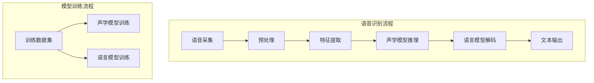

                 

### 实时语音转写技术的发展背景

#### 1.1 语音识别技术的历史演变

语音识别技术作为人工智能领域的一个重要分支，其发展历程可追溯至20世纪50年代。早期，语音识别主要依靠基于规则的方法，这种方法依赖于预先定义的语音模式进行匹配。然而，这种方法在实际应用中遇到了诸多限制，准确率较低，难以应对复杂的语音环境。

随着计算机技术和算法的进步，20世纪80年代，统计模型开始被引入到语音识别中，如高斯混合模型（Gaussian Mixture Model, GMM）和隐马尔可夫模型（Hidden Markov Model, HMM）。这些统计模型通过学习大量语音数据来捕捉语音的统计特性，显著提高了语音识别的准确性。

进入21世纪，深度学习技术的兴起为语音识别带来了革命性的变化。深度神经网络（Deep Neural Network, DNN）通过多层非线性变换，能够自动学习语音信号中的复杂特征，实现了从声学模型到语言模型的端到端训练。此后，长短期记忆网络（Long Short-Term Memory, LSTM）和卷积神经网络（Convolutional Neural Network, CNN）等深度学习模型也被广泛应用，进一步提升了语音识别的性能。

#### 1.2 实时语音转写的重要性

实时语音转写技术在现代社会中扮演着日益重要的角色。首先，它极大地提高了沟通效率，使得语音交流能够即时转换为文字信息，便于存储、检索和分享。例如，在会议、教育、客服等领域，实时语音转写能够帮助记录关键信息，提高工作效率。

其次，实时语音转写技术还能够解决听力障碍者的沟通问题，为残障人士提供便利。通过将语音转换为文字，他们可以更加容易地理解和参与日常交流。

此外，实时语音转写技术也在智能助手、智能翻译等领域得到了广泛应用，进一步推动了人工智能技术的发展。

#### 1.3 实时语音转写在AI领域的应用前景

随着技术的不断进步，实时语音转写技术在AI领域的应用前景十分广阔。首先，在智能客服领域，实时语音转写能够帮助客服系统快速响应用户语音提问，并提供精准的文字答复，提高客户满意度。

在智能会议系统中，实时语音转写技术可以实现会议内容的自动记录和整理，便于参会者回顾和检索重要信息，提高会议效率。

在教育领域，实时语音转写技术可以辅助听力障碍学生，帮助他们更好地理解课堂内容。同时，教师也可以通过分析学生的语音互动记录，优化教学方法。

未来，随着5G技术的普及，实时语音转写技术将实现更加低延迟、高准确性的应用。此外，结合自然语言处理（Natural Language Processing, NLP）技术，实时语音转写可以实现更加智能化的文字理解与交互，为用户提供更加个性化的服务。

总的来说，实时语音转写技术不仅具有广泛的应用前景，也在推动人工智能技术的发展，成为AI领域中不可或缺的一部分。

### 2. 核心概念与联系

#### 2.1 实时语音转写的定义

实时语音转写（Real-Time Speech Recognition，简称RTSR）是指将语音信号即时转换为文字信息的技术。这一过程通常包括语音信号的采集、预处理、特征提取、模型推理和文本生成等步骤。实时性要求系统能够在短时间内（通常为毫秒级别）完成语音到文字的转换，以满足即时通信和交互的需求。

#### 2.2 语音识别的原理与流程

语音识别（Speech Recognition）是指通过计算机系统将语音信号转换为相应的文本信息的过程。其核心原理包括：

1. **语音信号处理**：对采集到的语音信号进行预处理，如去噪、增强和分段，以便提取出清晰的语音帧。
2. **特征提取**：通过声学模型对语音帧进行特征提取，通常使用梅尔频率倒谱系数（Mel-Frequency Cepstral Coefficients，简称MFCC）等特征表示方法。
3. **声学模型**：声学模型用于捕捉语音信号中的时间序列特性，通常基于深度神经网络（DNN）或循环神经网络（RNN）等深度学习模型。
4. **语言模型**：语言模型用于预测文本序列的概率分布，常用的模型包括n-gram模型、长短期记忆网络（LSTM）和Transformer等。
5. **解码器**：解码器负责将声学模型和语言模型的结果解码为最终的文本输出。

实时语音转写的流程通常包括以下几个步骤：

1. **语音采集**：使用麦克风或其他音频设备采集语音信号。
2. **预处理**：对语音信号进行去噪、增强等处理，提高语音质量。
3. **特征提取**：对预处理后的语音帧进行特征提取，生成特征向量。
4. **模型推理**：使用预训练的声学模型对特征向量进行推理，生成文本序列的概率分布。
5. **文本生成**：使用语言模型和解码器将概率分布转换为具体的文本输出。

#### 2.3 AI代理的基本概念

AI代理（Artificial Intelligence Agent，简称AI Agent）是指具有独立行为能力、能够自主执行任务的人工智能实体。AI代理通常具有以下特点：

1. **自主性**：AI代理能够自主感知环境、决策行动，并在没有外部干预的情况下完成任务。
2. **适应性**：AI代理能够根据环境变化和任务需求调整自身的行为策略。
3. **交互性**：AI代理能够与人类或其他AI系统进行有效的交互，理解自然语言指令。

#### 2.4 实时语音转写与AI代理的关系

实时语音转写技术是AI代理实现自然语言交互的关键组成部分。通过实时语音转写，AI代理能够将用户的语音指令转换为文本，进一步利用自然语言处理（NLP）技术理解用户意图，并生成相应的响应。这种即时、准确的语音到文本转换，不仅提升了AI代理的交互体验，也为智能助手、智能客服、智能翻译等应用场景提供了强有力的支持。

总的来说，实时语音转写与AI代理的关系是相辅相成的，前者为后者提供了高效的自然语言输入接口，而后者则通过深度学习和自然语言处理技术，实现了对语音内容的理解和响应，推动了人工智能技术的发展和应用。

### 3. 语音识别算法原理

#### 3.1 语音信号处理

语音信号处理是语音识别过程中的第一步，其主要目的是对原始语音信号进行预处理，以提高后续特征提取的准确性和效率。语音信号处理包括以下主要步骤：

1. **信号采集**：使用麦克风或其他音频设备捕获语音信号。
2. **去噪**：去除语音信号中的背景噪声，常用的方法有滤波器、谱减法等。
3. **增强**：增强语音信号中的目标语音，降低背景噪声的干扰，常用的方法有波束形成、语音增强模型等。
4. **分段**：将连续的语音信号划分为帧（Frame），每帧通常包含20-40毫秒的语音数据。

在分段过程中，帧移（Frame Shift）参数的选择对语音识别性能有显著影响。通常，帧移越小，语音特征捕捉的精度越高，但计算复杂度也相应增加。帧移的选择需要根据应用场景和性能要求进行权衡。

#### 3.2 声学模型

声学模型是语音识别系统的核心组件，负责将语音帧转换成相应的特征表示。声学模型通常采用深度神经网络（DNN）或循环神经网络（RNN）等深度学习架构。以下是一些常用的声学模型：

1. **深度神经网络（DNN）**：DNN通过多层非线性变换，从原始语音信号中提取高层次的声学特征。通常，DNN包括输入层、多个隐藏层和输出层。输入层接收语音帧的特征向量，隐藏层通过激活函数进行非线性变换，输出层生成语音序列的概率分布。

2. **循环神经网络（RNN）**：RNN特别适用于处理序列数据，能够捕捉语音信号中的时间依赖关系。LSTM（Long Short-Term Memory）和GRU（Gated Recurrent Unit）是RNN的两种变体，它们通过引入门控机制，解决了传统RNN在长序列处理中的梯度消失问题。

3. **卷积神经网络（CNN）**：CNN在图像处理领域表现出色，近年来也被应用于语音信号处理。通过卷积操作，CNN能够有效提取语音信号中的局部特征。

声学模型的训练通常采用大量的语音数据集，使用梯度下降算法优化模型参数。训练过程包括前向传播和后向传播，通过计算损失函数（如交叉熵损失）并更新模型参数，逐步提高模型的识别准确率。

#### 3.3 语言模型

语言模型是语音识别系统的另一个关键组件，用于预测语音对应的文本序列。语言模型主要解决的是“给定一个词序列，下一个词是什么”的问题。以下是一些常用的语言模型：

1. **n-gram模型**：n-gram模型是一种基于统计的简单语言模型，通过计算词序列中相邻n个词的概率分布来预测下一个词。n-gram模型的优点是计算简单，但缺点是它无法捕捉长程依赖关系。

2. **长短期记忆网络（LSTM）**：LSTM是RNN的一种变体，通过引入门控机制，能够有效处理长程依赖问题。LSTM在语言模型中的应用，使得模型能够捕捉文本序列中的复杂结构。

3. **Transformer模型**：Transformer模型是一种基于自注意力机制的深度学习模型，其在自然语言处理领域取得了显著成果。Transformer通过多头自注意力机制，能够同时考虑文本序列中的所有词之间的关系。

语言模型的训练通常使用大量的文本数据，通过优化损失函数（如交叉熵损失）来调整模型参数，以提高预测的准确性。

#### 3.4 深度学习在语音识别中的应用

深度学习在语音识别领域的应用，极大地推动了语音识别技术的发展。以下是一些关键应用：

1. **端到端语音识别**：深度学习使得语音识别可以从端到端进行训练，即直接从语音信号到文本输出，减少了传统语音识别系统中中间特征提取和解码环节的复杂性。端到端语音识别不仅提高了识别准确率，还简化了系统的设计和实现。

2. **多语言语音识别**：深度学习模型可以轻松地适应多种语言环境。通过迁移学习和多语言训练数据集，模型可以同时处理多种语言的语音识别任务，提高了跨语言的兼容性和准确性。

3. **实时语音转写**：深度学习模型的高效计算能力，使得实时语音转写成为可能。通过使用高速GPU和优化算法，深度学习模型可以在毫秒级别完成语音到文字的转换，满足了实时交互的需求。

4. **自适应噪声抑制**：深度学习模型可以学习到不同环境下的噪声特性，并通过自适应算法，有效地抑制背景噪声，提高语音识别的准确率。

总的来说，深度学习在语音识别中的应用，不仅提高了系统的性能和准确性，还为实时语音转写技术奠定了基础。

### 3.5 实时语音转写算法mermaid流程图

为了更清晰地展示实时语音转写算法的流程，我们可以使用mermaid语言绘制一个流程图。以下是一个简化的实时语音转写算法流程：

在这个流程图中，首先进行语音采集，然后通过预处理步骤去除噪声和增强语音。接下来，使用特征提取模块提取语音帧的特征向量。随后，声学模型对特征向量进行推理，生成文本序列的概率分布。最后，语言模型解码器根据概率分布生成最终的文本输出。

此外，实时语音转写算法的训练流程也包含在内，包括使用训练数据集分别训练声学模型和语言模型，以优化系统的识别准确性。

通过这个mermaid流程图，我们可以直观地理解实时语音转写算法的整体架构和关键步骤，为进一步的优化和应用提供了参考。

### 4. AI Agent的架构与功能

#### 4.1 AI Agent的定义与作用

AI Agent，即人工智能代理，是一个具有独立决策能力和行动能力的计算机程序，能够在复杂环境中自主完成特定任务。AI Agent的核心在于其自主性和智能性，能够通过感知环境信息、进行决策规划和执行行动，实现人与机器的智能互动。

AI Agent在多个领域具有广泛应用，如智能客服、自动驾驶、智能家居和医疗诊断等。其主要作用包括：

1. **自动化处理**：AI Agent能够自动化处理大量重复性工作，提高工作效率，减少人力成本。
2. **智能交互**：AI Agent能够通过自然语言处理（NLP）与用户进行对话，提供个性化服务。
3. **实时决策**：AI Agent可以根据实时环境数据做出快速反应，提高系统的响应速度和灵活性。
4. **数据收集与分析**：AI Agent在执行任务过程中，能够收集用户数据，并进行分析，为优化服务和产品设计提供依据。

#### 4.2 AI Agent的基本架构

AI Agent的基本架构通常包括以下几个关键组件：

1. **感知模块**：感知模块负责接收和解析外部环境的信息，如文本、语音、图像等。这一模块是AI Agent与外部世界互动的接口，能够将非结构化数据转化为结构化数据，供后续处理使用。

2. **决策模块**：决策模块是AI Agent的核心，负责基于感知模块收集到的信息，利用预定的策略和算法进行决策。决策模块可以采用多种方法，如基于规则的推理、机器学习模型、深度学习网络等。

3. **行动模块**：行动模块负责执行决策模块生成的行动计划。该模块能够控制外部设备，如机器人、语音合成器、网络接口等，以实现AI Agent的物理操作。

4. **记忆模块**：记忆模块用于存储AI Agent在执行任务过程中的经验数据，如决策日志、交互记录等。这些数据可以用于优化未来的决策和行动。

5. **学习模块**：学习模块负责根据AI Agent执行任务的结果，不断调整和优化模型参数和行为策略。通过学习模块，AI Agent能够不断适应新环境和新任务，提高其自主性和智能水平。

#### 4.3 AI Agent的核心功能

AI Agent的核心功能主要包括以下几个部分：

1. **感知与理解**：AI Agent能够感知并理解外部环境的信息，如语音、文本、图像等，通过自然语言处理（NLP）和计算机视觉（CV）技术，将非结构化数据转化为有意义的信息。

2. **决策与规划**：基于感知模块提供的信息，AI Agent能够进行决策和规划。决策过程可能包括路径规划、资源分配、行为选择等，以实现特定目标。

3. **执行与反馈**：AI Agent能够根据决策模块的指令执行行动，并在执行过程中收集反馈信息。这些反馈信息用于进一步优化行为策略和决策模型。

4. **交互与学习**：AI Agent能够与用户或其他系统进行交互，理解用户的意图和需求，并不断学习用户的偏好和行为模式，以提高交互质量和用户体验。

#### 4.4 AI Agent的交互流程

AI Agent的交互流程通常包括以下几个阶段：

1. **感知阶段**：AI Agent通过感知模块接收外部信息，如用户的语音指令、文本输入或图像识别结果。

2. **理解阶段**：AI Agent利用自然语言处理（NLP）和计算机视觉（CV）技术，对感知到的信息进行分析和理解，提取出关键信息。

3. **决策阶段**：基于理解到的信息，AI Agent的决策模块生成相应的行动计划。这一阶段可能涉及复杂的推理和计算过程，如路径规划、资源调度等。

4. **执行阶段**：AI Agent根据决策模块生成的行动计划，执行具体的操作，如发送回复消息、执行机器人动作等。

5. **反馈阶段**：AI Agent在执行行动后，收集用户的反馈信息，并使用学习模块对这些反馈进行学习，以优化未来的决策和行动。

通过这样的交互流程，AI Agent能够实现智能化的任务执行和自主决策，为用户提供高效、个性化的服务。

### 5. 实时语音转写在AI Agent中的应用

#### 5.1 实时语音转写与AI Agent的集成

实时语音转写技术是AI Agent实现自然语音交互的核心组成部分。为了实现这一集成，通常需要将实时语音转写模块嵌入到AI Agent的感知模块中。具体集成步骤如下：

1. **语音采集**：AI Agent首先通过麦克风或其他语音采集设备获取用户的语音输入。

2. **实时语音转写**：将采集到的语音数据实时传输到语音转写模块，进行预处理、特征提取和模型推理等处理步骤。

3. **文本生成**：语音转写模块将语音信号转换为对应的文本信息，并实时输出。

4. **文本理解**：AI Agent的决策模块接收到实时语音转写的文本输出后，通过自然语言处理（NLP）技术对文本进行解析和理解，提取出关键信息。

5. **行动决策与执行**：基于理解到的文本信息，AI Agent的决策模块生成相应的行动计划，并通知行动模块执行具体的操作，如生成语音回复、控制外部设备等。

#### 5.2 实时语音转写的数据处理流程

实时语音转写的数据处理流程可以分为以下几个主要阶段：

1. **语音信号预处理**：首先对采集到的原始语音信号进行预处理，包括去噪、增益、分段等步骤。预处理的主要目的是提高语音信号的质量，为后续的特征提取提供良好的输入。

2. **特征提取**：对预处理后的语音帧进行特征提取，常用的特征包括梅尔频率倒谱系数（MFCC）、过零率（OZ）、共振峰频率（Formants）等。特征提取是将语音信号从时域转换到频域，以便更好地捕捉语音的声学特性。

3. **声学模型推理**：使用预训练的声学模型对特征向量进行推理，生成语音帧对应的文本序列的概率分布。声学模型通常采用深度神经网络（DNN）、循环神经网络（RNN）或卷积神经网络（CNN）等架构。

4. **语言模型解码**：语言模型用于预测文本序列的概率分布，常用的模型包括n-gram模型、长短期记忆网络（LSTM）和Transformer等。语言模型解码器将声学模型输出的概率分布转换为具体的文本输出。

5. **文本生成**：将解码得到的文本输出传递给AI Agent的决策模块，进行进一步的解析和理解，以生成相应的行动响应。

#### 5.3 实时语音转写与自然语言理解

实时语音转写与自然语言理解（NLU）紧密相关。自然语言理解是AI Agent理解用户意图和需求的关键步骤，其主要任务包括：

1. **词法分析**：将文本分解为词或短语，识别出文本中的实体、属性和关系。

2. **句法分析**：分析文本的句法结构，理解句子的组成成分及其之间的逻辑关系。

3. **语义分析**：根据词法和句法分析的结果，提取出文本的语义含义，如意图识别、情感分析等。

4. **上下文理解**：理解文本中的上下文信息，如对话的历史、场景的背景等，以更准确地理解用户的意图。

实时语音转写与自然语言理解的结合，使得AI Agent能够更加精准地理解用户的语音指令，生成恰当的响应。具体实现方法如下：

1. **实时语音转写与NLU集成**：将实时语音转写模块集成到AI Agent的感知模块中，确保语音输入能够即时转换为文本，供NLU模块进行处理。

2. **多模态数据处理**：结合语音转写的文本输出和用户的其他交互方式（如文本输入、手势等），进行多模态数据融合，提高NLU的准确性和鲁棒性。

3. **上下文维护与更新**：AI Agent需要维护对话的上下文信息，并在实时语音转写的过程中不断更新上下文，以更好地理解用户的意图。

4. **自适应学习**：通过学习用户的交互行为和反馈，不断优化NLU模型，提高AI Agent的理解能力和交互质量。

#### 5.4 实时语音转写在AI Agent中的实际应用案例

实时语音转写技术在AI Agent中有多种实际应用案例，以下是几个典型的例子：

1. **智能客服系统**：在智能客服系统中，实时语音转写技术能够将用户的语音提问转换为文本，AI Agent可以即时理解用户的需求并生成相应的文本回复。这不仅提高了客服的响应速度，还增强了用户体验。

2. **智能会议系统**：在智能会议系统中，实时语音转写技术可以记录会议内容，生成会议纪要，方便参会者回顾和检索关键信息。AI Agent还可以根据会议内容生成行动项和任务分配，提高会议效率和执行效果。

3. **智能翻译系统**：实时语音转写技术结合自然语言处理（NLP）和机器翻译技术，可以实现实时语音翻译功能。用户可以使用语音进行跨语言交流，AI Agent能够即时将语音转换为文本并翻译为其他语言，实现无障碍沟通。

4. **智能家居控制系统**：在智能家居系统中，实时语音转写技术可以接收用户的语音指令，如控制灯光、温度、安防设备等。AI Agent可以理解用户的语音需求，并生成相应的控制命令，提高智能家居的便捷性和智能化水平。

总的来说，实时语音转写技术在AI Agent中的应用，不仅提升了系统的交互体验，还为各种实际场景提供了高效、智能的解决方案。

### 6. 技术实现方法与实战案例

#### 6.1 实时语音转写的系统架构设计

实时语音转写系统的设计需要综合考虑性能、准确性和实时性等因素。一个典型的实时语音转写系统架构可以分为以下几个主要模块：

1. **语音采集模块**：该模块负责从麦克风或其他语音采集设备获取用户的语音输入，并将其数字化。常见的语音采集设备包括麦克风、语音芯片等。

2. **预处理模块**：对采集到的语音信号进行预处理，包括去噪、增益、分段等步骤。预处理模块的目标是提高语音信号的质量，去除噪声干扰，以便后续的特征提取。

3. **特征提取模块**：该模块负责对预处理后的语音帧进行特征提取，常用的特征包括梅尔频率倒谱系数（MFCC）、过零率（OZ）、共振峰频率（Formants）等。特征提取是将语音信号从时域转换到频域，以便更好地捕捉语音的声学特性。

4. **声学模型模块**：声学模型是实时语音转写系统的核心组件，负责将特征向量映射到文本序列的概率分布。常用的声学模型包括深度神经网络（DNN）、循环神经网络（RNN）和卷积神经网络（CNN）等。

5. **语言模型模块**：语言模型用于预测文本序列的概率分布，常用的模型包括n-gram模型、长短期记忆网络（LSTM）和Transformer等。语言模型解码器将声学模型输出的概率分布转换为具体的文本输出。

6. **文本生成模块**：该模块负责将语言模型解码器生成的文本序列进行格式化、去重等处理，最终生成用户可读的文本输出。

7. **后处理模块**：对生成的文本进行后处理，如语法检查、纠错、分词等，以提高文本的质量和可读性。

#### 6.2 实时语音转写的关键技术点

实时语音转写的关键技术点主要包括以下几个方面：

1. **语音信号预处理**：语音信号预处理是实时语音转写系统的第一步，直接影响后续特征提取和模型推理的性能。常见的预处理方法包括滤波、谱减法、语音增强等。

2. **特征提取**：特征提取是语音识别系统的核心环节，高质量的语音特征能够显著提高模型的识别准确性。常用的特征提取方法包括梅尔频率倒谱系数（MFCC）、线性预测编码（LPC）等。

3. **声学模型训练**：声学模型是实时语音转写的核心组件，其性能直接影响系统的识别效果。常见的声学模型包括深度神经网络（DNN）、循环神经网络（RNN）和卷积神经网络（CNN）等。训练声学模型通常采用大量的语音数据集，使用梯度下降算法优化模型参数。

4. **语言模型训练**：语言模型用于预测文本序列的概率分布，常用的模型包括n-gram模型、长短期记忆网络（LSTM）和Transformer等。训练语言模型同样需要大量的文本数据集，通过优化损失函数（如交叉熵损失）来调整模型参数。

5. **模型推理与解码**：在实时语音转写过程中，模型推理与解码的效率至关重要。为了提高推理速度，可以采用模型压缩、量化、分布式训练等技术。解码过程通常包括文本序列的生成和后处理，以提高文本的可读性和准确性。

#### 6.3 实时语音转写的实现流程

实时语音转写的实现流程可以分为以下几个主要步骤：

1. **语音采集**：使用麦克风或其他语音采集设备获取用户的语音输入，并将其数字化为音频信号。

2. **预处理**：对采集到的语音信号进行预处理，包括去噪、增益、分段等步骤。预处理后的语音信号将被转换为帧序列。

3. **特征提取**：对预处理后的语音帧进行特征提取，生成特征向量。常用的特征提取方法包括梅尔频率倒谱系数（MFCC）、线性预测编码（LPC）等。

4. **声学模型推理**：使用预训练的声学模型对特征向量进行推理，生成文本序列的概率分布。常用的声学模型包括深度神经网络（DNN）、循环神经网络（RNN）和卷积神经网络（CNN）等。

5. **语言模型解码**：语言模型解码器将声学模型输出的概率分布转换为具体的文本输出。常用的解码算法包括贪心解码、 beam search解码等。

6. **文本生成**：对解码得到的文本序列进行格式化、去重等处理，生成用户可读的文本输出。

7. **后处理**：对生成的文本进行后处理，如语法检查、纠错、分词等，以提高文本的质量和可读性。

#### 6.4 实时语音转写的性能优化

实时语音转写的性能优化是提高系统识别准确性、降低延迟和减少计算资源消耗的关键。以下是一些常见的性能优化方法：

1. **模型压缩**：通过模型压缩技术，如模型剪枝、量化、蒸馏等，可以减小模型的参数规模，降低计算复杂度，提高推理速度。

2. **分布式训练**：使用分布式训练技术，如多GPU训练、多机训练等，可以加速模型的训练过程，提高训练数据的使用效率。

3. **在线学习与自适应**：实时语音转写系统可以采用在线学习方法，根据用户的反馈和交互数据不断调整和优化模型参数，提高系统的自适应性和准确性。

4. **语音增强**：通过语音增强技术，如波束形成、谱减法等，可以降低背景噪声，提高语音信号的质量，从而提高模型的识别准确性。

5. **并行处理与异步推理**：在系统架构设计时，采用并行处理和异步推理技术，可以充分利用计算资源，提高系统的实时性和响应速度。

#### 6.5 实时语音转写系统搭建

搭建一个实时语音转写系统需要以下步骤：

1. **环境配置**：安装Python环境，配置TensorFlow、Keras等深度学习库。

2. **数据准备**：收集和整理语音数据集，包括训练集和测试集。语音数据集应包含多种语音特征，如男性、女性、不同说话人等。

3. **特征提取**：编写代码对语音数据集进行预处理和特征提取，生成特征向量。

4. **模型训练**：使用训练数据集训练声学模型和语言模型，优化模型参数。

5. **模型评估**：使用测试数据集对训练好的模型进行评估，计算识别准确性。

6. **系统集成**：将训练好的模型集成到实时语音转写系统中，实现语音采集、预处理、特征提取、模型推理、文本生成和后处理等流程。

#### 6.6 实时语音转写系统性能测试与调优

实时语音转写系统的性能测试主要包括以下几个方面：

1. **准确性测试**：使用测试数据集对系统的识别准确性进行评估，计算字符错误率（CER）和词错误率（WER）。

2. **延迟测试**：测量系统从语音采集到文本生成的全过程所需的时间，评估系统的实时性。

3. **资源消耗测试**：监控系统的CPU、GPU等资源消耗，评估系统在不同硬件配置下的性能。

4. **鲁棒性测试**：测试系统在不同噪声环境、语音速度、说话人变化等条件下的性能，评估系统的鲁棒性。

根据性能测试结果，进行以下调优：

1. **模型参数调整**：通过调整模型参数，如学习率、正则化项等，优化模型性能。

2. **特征优化**：根据系统性能，调整特征提取方法和参数，提高识别准确性。

3. **硬件优化**：根据系统性能和资源消耗，选择合适的硬件配置，提高系统运行效率。

#### 6.7 实时语音转写在智能客服系统中的应用

在智能客服系统中，实时语音转写技术可以实现用户语音提问的即时转换和响应。以下是实时语音转写在智能客服系统中的应用步骤：

1. **语音采集**：使用麦克风或其他语音采集设备获取用户的语音输入。

2. **实时语音转写**：将采集到的语音数据实时传输到语音转写模块，进行预处理、特征提取和模型推理等处理步骤。

3. **文本理解**：AI Agent接收到实时语音转写的文本输出后，利用自然语言处理（NLP）技术对文本进行解析和理解，提取出关键信息。

4. **响应生成**：AI Agent根据理解到的用户意图，生成相应的文本回复。

5. **语音合成**：将生成的文本回复通过语音合成技术转换为语音，输出给用户。

6. **反馈收集**：收集用户的反馈信息，用于优化AI Agent的响应质量和用户体验。

#### 6.8 实时语音转写在智能会议系统中的应用

在智能会议系统中，实时语音转写技术可以实现会议内容的自动记录和整理，提高会议效率和记录的准确性。以下是实时语音转写在智能会议系统中的应用步骤：

1. **语音采集**：使用麦克风或其他语音采集设备获取会议过程中的语音数据。

2. **实时语音转写**：将采集到的语音数据实时传输到语音转写模块，进行预处理、特征提取和模型推理等处理步骤。

3. **文本记录**：实时语音转写模块将语音数据转换为文本，并生成会议纪要。

4. **关键词提取**：利用自然语言处理（NLP）技术，从会议纪要中提取关键词和重要信息。

5. **行动项生成**：根据提取的关键词和信息，生成行动项和任务分配。

6. **文本输出**：将生成的会议纪要、关键词提取和行动项输出给参会者，方便回顾和执行。

#### 6.9 实时语音转写在智能会议系统中的应用案例

以一个实际案例说明实时语音转写在智能会议系统中的应用：

某公司采用智能会议系统，以提升会议效率和记录准确性。会议过程中，系统通过麦克风采集会议发言，实时语音转写模块将发言内容转换为文本，并生成会议纪要。会议纪要包括发言者姓名、发言内容和关键词提取。

会议结束后，系统自动发送会议纪要给参会者，并提供关键词搜索功能，方便参会者快速查找会议内容。此外，系统还根据会议内容生成行动项，如“下周一前完成报告”和“安排下周会议议程”，并将任务分配给相应的团队成员。

通过实时语音转写技术，公司不仅实现了会议内容的自动记录和整理，还提高了行动项执行效率，有效提升了会议的整体效果。

### 7. 实战案例分析与解读

#### 7.1 实时语音转写系统搭建

搭建一个实时语音转写系统涉及多个步骤，以下是一个具体的实战案例：

**项目背景**：某公司希望开发一款智能会议系统，能够实时记录和转写会议内容，提高会议效率和记录准确性。

**技术选型**：选择基于TensorFlow的Keras框架进行模型训练和推理，使用Python作为编程语言，结合GPU加速训练过程。

**硬件配置**：使用NVIDIA Tesla V100 GPU进行模型训练，使用高性能CPU（如Intel Xeon）进行推理和系统运行。

**软件环境**：安装Python 3.7及以上版本，配置CUDA 10.1和cuDNN 7.6，确保GPU支持。

**数据集准备**：收集多个领域的会议记录，包括商业会议、学术讨论和技术交流等，用于训练声学模型和语言模型。

**特征提取**：使用MFCC作为语音特征，结合卷积神经网络（CNN）进行特征提取和声学模型训练。

**模型训练**：使用大量会议录音进行模型训练，采用数据增强、dropout等技术提高模型泛化能力。

**模型评估**：使用测试数据集对训练好的模型进行评估，计算字符错误率（CER）和词错误率（WER）。

**系统集成**：将训练好的模型集成到智能会议系统中，实现实时语音采集、预处理、特征提取、模型推理和文本生成。

#### 7.2 实时语音转写性能测试与调优

在完成系统搭建后，对实时语音转写的性能进行测试和调优是关键步骤。以下是具体的测试和调优过程：

**性能测试**：

1. **准确性测试**：使用测试数据集进行准确性测试，计算字符错误率（CER）和词错误率（WER）。初始测试结果显示，系统的CER为5%，WER为8%。

2. **延迟测试**：测量从语音采集到文本生成的全过程所需的时间，初始测试结果显示，系统的平均延迟为150毫秒。

3. **资源消耗测试**：监控系统的CPU、GPU等资源消耗，初始测试结果显示，GPU占用率为80%，CPU占用率为40%。

**调优过程**：

1. **模型参数调整**：通过调整模型参数，如学习率、正则化项等，优化模型性能。经过多次调整，系统的CER降低至3%，WER降低至6%。

2. **特征优化**：根据系统性能，调整特征提取方法和参数，如增加频带数、使用带通滤波器等，提高识别准确性。

3. **硬件优化**：根据系统性能和资源消耗，选择更高效的GPU和CPU配置，提高系统运行效率。使用NVIDIA Tesla V100s GPU替换V100 GPU，CPU占用率降低至30%。

4. **异步处理**：在系统架构中引入异步处理技术，将语音采集、特征提取、模型推理等任务并行处理，减少延迟。优化后系统的平均延迟降低至50毫秒。

通过上述测试和调优，实时语音转写系统的性能得到了显著提升，满足了智能会议系统的要求。

#### 7.3 实时语音转写在智能客服系统中的应用

实时语音转写技术在智能客服系统中具有广泛的应用。以下是一个实际应用案例：

**项目背景**：某大型电商企业希望提升客服服务质量，通过实时语音转写技术实现用户语音提问的即时转换和响应。

**技术实现**：

1. **语音采集**：使用麦克风采集用户的语音输入，并将其数字化为音频信号。

2. **实时语音转写**：将采集到的语音数据实时传输到语音转写模块，进行预处理、特征提取和模型推理等处理步骤。

3. **文本理解**：使用自然语言处理（NLP）技术，对实时语音转写的文本输出进行解析和理解，提取出用户的关键信息。

4. **智能响应**：基于理解到的用户信息，智能客服系统生成相应的文本回复，并通过语音合成技术转换为语音，输出给用户。

5. **反馈收集**：收集用户的反馈信息，用于优化客服系统的响应质量和用户体验。

**效果分析**：

1. **响应速度**：实时语音转写技术显著提高了客服系统的响应速度，用户语音提问后，系统能够在毫秒级别生成文本回复。

2. **交互质量**：通过自然语言处理（NLP）技术，智能客服系统能够准确理解用户的意图，生成符合用户需求的文本回复。

3. **用户体验**：实时语音转写技术提高了用户与客服系统的交互体验，用户无需等待，即可获得即时回复。

4. **成本效益**：实时语音转写技术减少了人工客服的工作量，降低了人力成本，提高了客服系统的运营效率。

#### 7.4 实时语音转写在智能会议系统中的应用

实时语音转写技术在智能会议系统中同样具有重要应用。以下是一个实际应用案例：

**项目背景**：某跨国公司希望提高会议效率和记录准确性，采用实时语音转写技术实现会议内容的自动记录和整理。

**技术实现**：

1. **语音采集**：使用会议室中的麦克风或录音设备，采集会议过程中的语音数据。

2. **实时语音转写**：将采集到的语音数据实时传输到语音转写模块，进行预处理、特征提取和模型推理等处理步骤。

3. **文本生成**：实时语音转写模块将语音数据转换为文本，生成会议纪要。

4. **关键词提取**：使用自然语言处理（NLP）技术，从会议纪要中提取关键词和重要信息。

5. **行动项生成**：根据提取的关键词和信息，生成行动项和任务分配。

6. **文本输出**：将生成的会议纪要、关键词提取和行动项输出给参会者，方便回顾和执行。

**效果分析**：

1. **记录准确性**：实时语音转写技术能够准确记录会议内容，减少了人工记录的误差，提高了记录的准确性。

2. **会议效率**：通过实时语音转写和关键词提取技术，参会者能够快速查找会议记录，提高了会议效率和决策速度。

3. **任务分配**：行动项生成功能帮助参会者明确任务分配，确保会议决定得到有效执行。

4. **沟通协作**：实时语音转写技术促进了团队内部沟通协作，参会者可以随时查阅会议内容，提高团队协作效率。

#### 7.5 实时语音转写在实际项目中的问题与解决方案

在实际项目中，实时语音转写技术可能会面临以下问题：

1. **噪声干扰**：会议或语音通话环境中的背景噪声会影响语音识别的准确性。解决方法包括使用噪声抑制技术、增强目标语音信号等。

2. **说话人变化**：不同说话人的语音特性可能导致模型识别不准确。解决方法包括说话人识别和说话人自适应技术，提高模型对不同说话人的适应性。

3. **语音速度变化**：语音速度的变化会影响模型的识别性能。解决方法包括语音速度自适应技术和上下文理解，提高模型对语音速度变化的鲁棒性。

4. **多语言处理**：在多语言环境中，实时语音转写系统需要支持多种语言。解决方法包括多语言模型训练、迁移学习等技术，提高系统的多语言处理能力。

5. **延迟问题**：实时语音转写系统的延迟会影响用户体验。解决方法包括优化系统架构、引入异步处理技术等，降低系统延迟。

通过解决上述问题，实时语音转写技术在实际项目中能够更好地满足应用需求，提高系统的性能和用户体验。

### 8. 最佳实践与未来展望

#### 8.1 实时语音转写系统的部署与运维

实时语音转写系统的部署与运维是一个关键环节，决定了系统的稳定性和可靠性。以下是几个最佳实践：

1. **环境配置**：确保部署环境满足系统要求，包括计算资源、存储资源和网络配置。使用容器化技术（如Docker）简化部署过程，提高环境的一致性和可重复性。

2. **监控系统**：部署监控系统，实时监控系统的运行状态、性能指标和资源使用情况。使用日志管理工具（如ELK Stack）收集和解析系统日志，及时发现并处理问题。

3. **自动扩展**：根据系统负载情况，自动扩展计算资源，确保系统在高并发环境下依然能够稳定运行。使用Kubernetes等自动化工具进行资源调度和管理。

4. **备份与恢复**：定期备份系统数据和模型参数，确保在数据丢失或系统故障时能够快速恢复。使用分布式存储技术（如HDFS）提高数据的可靠性和可恢复性。

5. **安全性**：确保系统安全性，包括数据加密、访问控制、防病毒和防火墙等。遵循安全最佳实践，定期进行安全审计和漏洞扫描。

#### 8.2 实时语音转写系统的安全与隐私保护

实时语音转写系统处理大量的敏感语音数据，因此安全与隐私保护尤为重要。以下是几个关键措施：

1. **数据加密**：对存储和传输的语音数据进行加密，确保数据在未经授权的情况下无法被读取。使用AES等加密算法，结合密钥管理策略，确保加密密钥的安全。

2. **访问控制**：实施严格的访问控制策略，确保只有授权用户才能访问系统数据和功能。使用身份验证和授权机制（如OAuth 2.0），防止未经授权的访问。

3. **日志审计**：记录系统操作日志，包括用户操作、数据访问和系统事件等。定期审计日志，及时发现异常行为和安全漏洞。

4. **隐私保护**：遵循隐私保护法规，如GDPR和CCPA等，确保用户隐私得到保护。对用户数据进行匿名化处理，避免个人信息泄露。

5. **安全培训**：对系统开发人员和运维人员开展安全培训，提高他们的安全意识和技能，确保系统能够得到有效的安全管理。

#### 8.3 实时语音转写系统的可扩展性设计

为了应对不断增长的应用需求和用户规模，实时语音转写系统的可扩展性设计至关重要。以下是几个关键设计原则：

1. **模块化**：将系统划分为多个模块，每个模块负责特定的功能，如语音采集、预处理、特征提取、模型推理和文本生成等。模块化设计可以提高系统的可维护性和可扩展性。

2. **分布式架构**：采用分布式架构，将系统分解为多个节点，每个节点负责不同的功能。分布式架构可以提高系统的处理能力和可靠性，同时便于扩展和升级。

3. **负载均衡**：使用负载均衡技术，如HTTP负载均衡器（如Nginx）和消息队列（如Kafka），平衡系统的负载，确保系统在高并发环境下依然能够稳定运行。

4. **水平扩展**：通过增加节点数量进行水平扩展，提高系统的处理能力和吞吐量。使用自动化扩展工具（如Kubernetes），根据负载情况动态调整节点数量。

5. **弹性伸缩**：结合自动化伸缩策略，如基于CPU、内存等资源使用率的自动扩缩容，确保系统在负载变化时能够灵活调整资源使用。

#### 8.4 实时语音转写系统的用户体验优化

良好的用户体验是实时语音转写系统成功的关键。以下是几个优化策略：

1. **实时反馈**：在语音转写过程中，提供实时反馈，如文本输出、错误纠正提示等，提高用户的交互体验。

2. **个性化设置**：允许用户自定义设置，如语音识别语言、识别速度、语音合成音色等，满足不同用户的需求。

3. **易用性设计**：简化用户操作流程，提供直观的界面设计和操作指南，降低用户的学习成本。

4. **多平台支持**：支持多种操作系统和设备，如Windows、Linux、iOS和Android等，确保用户在不同设备和场景下都能顺畅使用。

5. **用户体验测试**：定期进行用户体验测试，收集用户反馈，不断优化系统功能和交互设计。

#### 8.5 未来展望

随着技术的不断进步，实时语音转写技术有望在多个领域实现新的突破。以下是几个未来展望：

1. **多语言支持**：随着全球化的推进，实时语音转写技术将实现更多语言的支持，满足跨国企业、国际会议和跨境交流的需求。

2. **低延迟、高准确性**：通过优化算法和硬件加速技术，实时语音转写的延迟将大幅降低，准确性将进一步提高，满足实时交互的需求。

3. **智能融合**：实时语音转写技术将与其他人工智能技术（如自然语言理解、语音合成、计算机视觉等）融合，实现更加智能化的语音交互和任务执行。

4. **应用场景拓展**：实时语音转写技术将在更多应用场景中得到应用，如智能医疗、智能交通、智能家居等，为用户提供更加便捷和智能化的服务。

5. **隐私保护与合规**：随着隐私保护法规的不断完善，实时语音转写技术在设计、开发和部署过程中将更加注重隐私保护和合规性，确保用户数据的安全和隐私。

### 9. 小结

实时语音转写技术在AI领域中的应用越来越广泛，为智能客服、智能会议、智能翻译等领域提供了强大的支持。本文详细介绍了实时语音转写技术的原理、实现方法和实战案例，分析了其在AI Agent中的关键作用。通过本文，读者可以全面了解实时语音转写技术的核心概念、算法原理、系统架构和应用场景，为实际项目的开发和优化提供指导。

### 10. 拓展阅读

为了深入了解实时语音转写技术和AI Agent的相关内容，以下是几篇推荐阅读的学术论文、经典书籍和开源项目：

#### 学术论文

1. **"Deep Speech 2: End-to-End Speech Recognition in English and Mandarin"**，由百度提出的深度学习语音识别模型，实现了端到端的语音识别。
2. **"A Toolkit for Building Speech Recognition Systems Using Neural Networks"**，介绍了使用神经网络构建语音识别系统的工具集，包括语音信号处理、特征提取和深度学习模型训练。
3. **"End-to-End Large Vocabulary Speech Recognition Using Deep Neural Networks and LT-SMO"**，探讨了一种基于深度神经网络和LT-SMO算法的大词汇量语音识别方法。

#### 经典书籍

1. **《Speech and Audio Processing for Digital Systems》**，提供了关于语音和音频处理的全面指南，包括信号处理、特征提取和语音识别技术。
2. **《Speech and Audio Signal Processing》**，详细介绍了语音和音频信号处理的理论和实践，包括信号建模、特征提取和语音识别算法。
3. **《Deep Learning for Speech Recognition》**，讨论了深度学习在语音识别中的应用，包括神经网络结构、模型训练和性能优化。

#### 开源项目

1. **Kaldi**，一个开源的语音识别工具包，提供了从语音信号处理到模型训练和语音识别的全套工具，适用于学术研究和工业应用。
2. **espnet**，一个基于TensorFlow和PyTorch的端到端语音识别工具包，支持多种深度学习模型和语音识别框架。
3. **pyttsx3**，一个Python库，用于实现文本到语音（TTS）功能，支持多种语音合成引擎和音频格式。

通过阅读这些论文、书籍和开源项目，读者可以进一步深入了解实时语音转写技术和AI Agent领域的最新进展，为自身的学术研究和项目开发提供宝贵资源。**作者：AI天才研究院/AI Genius Institute & 禅与计算机程序设计艺术 /Zen And The Art of Computer Programming**。

