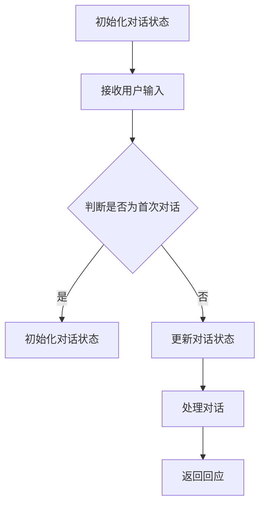
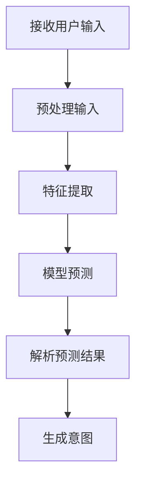
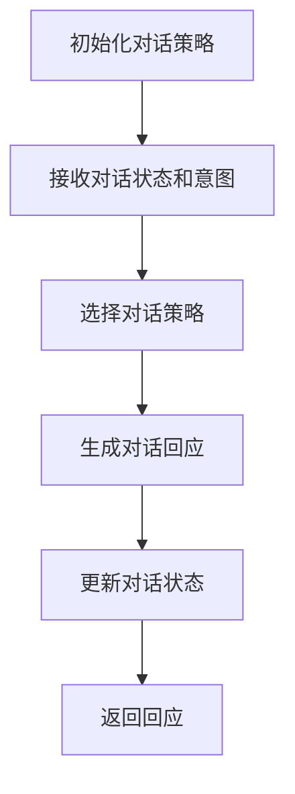
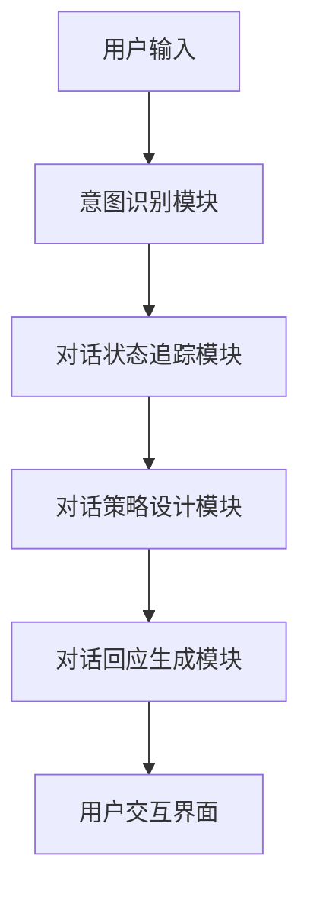
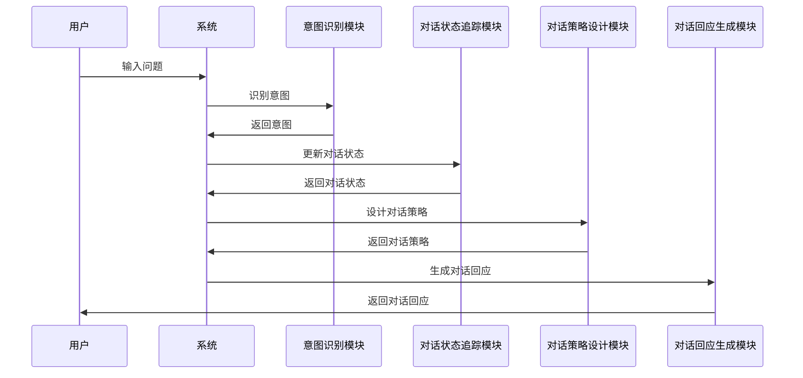
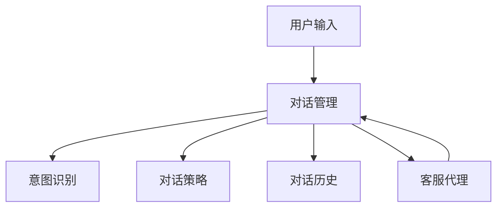
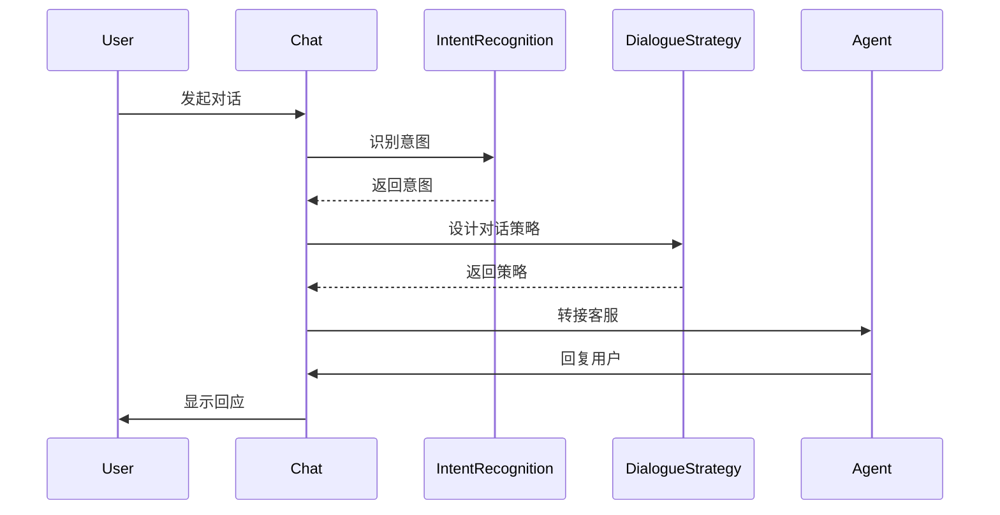
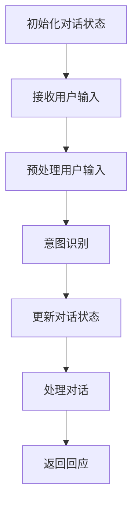
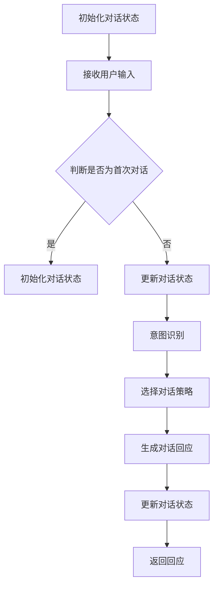

                 

# 对话式AI Agent的上下文管理技巧

## 关键词

对话式AI Agent，上下文管理，意图识别，对话状态追踪，对话策略设计

## 摘要

本文旨在深入探讨对话式AI Agent的上下文管理技巧。通过详细分析对话状态追踪、意图识别和对话策略设计三个核心概念，本文揭示了上下文管理在构建高效对话式AI Agent中的关键作用。同时，本文还提供了算法原理讲解、系统分析与架构设计方案以及项目实战，旨在为读者提供全面的技术指导。

## 1. 背景介绍

### 1.1 问题背景

在人工智能和自然语言处理领域，对话式AI Agent正逐渐成为技术热点。用户对智能助手、虚拟助手、智能客服等的需求不断增加，促使开发人员致力于提高AI Agent的智能程度和实用性。然而，实现高效的上下文管理是构建优秀对话式AI Agent的关键挑战。上下文管理不仅影响用户体验，还直接关系到AI Agent的智能程度和实用性。

### 1.2 问题描述

对话式AI Agent在处理连续对话时，需要理解并维持对话的上下文信息，包括用户意图、对话历史、环境状态等。有效的上下文管理能够帮助AI Agent更好地理解用户需求，提高回答的准确性和连贯性。然而，如何实现高效的上下文管理仍是一个亟待解决的问题。

### 1.3 问题解决

上下文管理技巧涉及多个方面，包括对话状态追踪、意图识别、对话策略设计等。本文将详细介绍这些核心概念和解决方法，帮助读者掌握对话式AI Agent的上下文管理技巧。

### 1.4 边界与外延

上下文管理不仅限于对话式AI Agent，还可以应用于聊天机器人、虚拟助手、智能客服等领域。本文将涵盖这些应用场景，帮助读者从更广泛的角度理解上下文管理的重要性。

### 1.5 概念结构与核心要素组成

对话式AI Agent的上下文管理涉及以下核心要素：

- **对话状态追踪**：记录并管理对话历史和信息，确保AI Agent能够理解当前对话的上下文。
- **意图识别**：通过分析用户输入，准确识别用户意图，为上下文管理提供基础。
- **对话策略设计**：设计有效的对话策略，确保AI Agent能够根据上下文信息做出合适的回应。

## 2. 核心概念与联系

### 2.1 对话状态追踪原理

对话状态追踪是指记录并管理对话历史和信息的过程。其核心特点包括：

- **实时性**：能够实时更新和记录对话状态。
- **高效性**：能够高效处理大量对话数据。
- **可扩展性**：能够适应不同的对话场景和需求。

### 对话状态追踪属性特征对比表格：

| 特征 | 对话状态追踪 |
| ---- | ---- |
| 实时性 | 能够实时更新和记录对话状态 |
| 高效性 | 能够高效处理大量对话数据 |
| 可扩展性 | 能够适应不同的对话场景和需求 |

### 2.2 意图识别原理

意图识别是指通过分析用户输入，准确识别用户意图的过程。其核心特点包括：

- **准确性**：能够准确识别用户的意图。
- **实时性**：能够实时处理用户输入。
- **可解释性**：能够解释识别结果，提高用户信任度。

### 意图识别属性特征对比表格：

| 特征 | 意图识别 |
| ---- | ---- |
| 准确性 | 能够准确识别用户的意图 |
| 实时性 | 能够实时处理用户输入 |
| 可解释性 | 能够解释识别结果，提高用户信任度 |

### 2.3 对话策略设计原理

对话策略设计是指根据对话状态和用户意图，设计合适的对话回应和流程。其核心特点包括：

- **灵活性**：能够适应不同对话场景和用户需求。
- **适应性**：能够根据对话状态和用户反馈调整对话策略。
- **连贯性**：能够确保对话流程的连贯性和逻辑性。

### 对话策略设计属性特征对比表格：

| 特征 | 对话策略设计 |
| ---- | ---- |
| 灵活性 | 能够适应不同对话场景和用户需求 |
| 适应性 | 能够根据对话状态和用户反馈调整对话策略 |
| 连贯性 | 能够确保对话流程的连贯性和逻辑性 |

## 3. 算法原理讲解

### 3.1 对话状态追踪算法

#### 对话状态追踪算法mermaid流程图：



#### 对话状态追踪算法原理

对话状态追踪算法通过初始化对话状态、接收用户输入、更新对话状态、处理对话和返回回应等步骤，实现对话状态的追踪和管理。具体步骤如下：

1. **初始化对话状态**：在对话开始时，初始化对话状态，包括用户信息、对话历史等。
2. **接收用户输入**：接收用户输入的信息，如文本、语音等。
3. **判断是否为首次对话**：判断当前输入是否为首次对话，如果是，则初始化对话状态；否则，更新对话状态。
4. **更新对话状态**：根据用户输入，更新对话状态，如添加对话历史、用户信息等。
5. **处理对话**：根据对话状态，处理对话，如生成回应、执行特定操作等。
6. **返回回应**：返回处理后的回应。

### 3.2 意图识别算法

#### 意图识别算法mermaid流程图：



#### 意图识别算法原理

意图识别算法通过预处理输入、特征提取、模型预测、解析预测结果和生成意图等步骤，实现用户意图的识别。具体步骤如下：

1. **接收用户输入**：接收用户输入的信息，如文本、语音等。
2. **预处理输入**：对用户输入进行预处理，如分词、去停用词等。
3. **特征提取**：从预处理后的输入中提取特征，如词向量、词性标注等。
4. **模型预测**：使用预训练的模型对提取到的特征进行预测，输出意图的概率分布。
5. **解析预测结果**：根据预测结果，解析出最可能的意图。
6. **生成意图**：将解析出的意图作为输出，供后续对话状态追踪和对话策略设计使用。

### 3.3 对话策略设计算法

#### 对话策略设计算法mermaid流程图：



#### 对话策略设计算法原理

对话策略设计算法通过初始化对话策略、接收对话状态和意图、选择对话策略、生成对话回应、更新对话状态和返回回应等步骤，实现对话策略的设计。具体步骤如下：

1. **初始化对话策略**：在对话开始时，初始化对话策略，包括对话流程、回应模板等。
2. **接收对话状态和意图**：接收当前对话状态和意图，如用户信息、对话历史、用户意图等。
3. **选择对话策略**：根据对话状态和意图，选择合适的对话策略，如回复模板、操作流程等。
4. **生成对话回应**：根据选择的对话策略，生成对话回应，如文本、语音、图片等。
5. **更新对话状态**：根据对话回应，更新对话状态，如添加对话历史、修改用户信息等。
6. **返回回应**：返回生成的对话回应，供用户交互使用。

## 4. 系统分析与架构设计方案

### 4.1 问题场景介绍

在智能客服领域，用户与客服的交互过程往往涉及多个话题和上下文信息。为了提高客服效率，需要设计一个能够实现高效上下文管理的对话式AI Agent。

### 4.2 项目介绍

本项目旨在构建一个基于对话式AI Agent的智能客服系统。系统功能包括用户意图识别、对话状态追踪和对话策略设计等。

### 4.3 系统功能设计（领域模型mermaid类图）

```mermaid
classDiagram
Class01 <|-- Class02
Class03 --|uplicate Class02
Class04 : +int x
Class04 : +int y
Class04 : +int z
Class05 : +double a
Class05 : +double b
Class06 : -int x
Class06 : -int y
Class06 : -int z
Class01 ..|> Class07
Class01 ||--|{ Association }| Class08
Class07 : -int id
Class08 : -int id
Class02 : +int id
Class03 : +int id
Class05 : +int id
Class06 : +int id
Class07 : -int id
Class08 : -int id
Class01 : +int id
Class01 : -int id
Class02 : +int id
Class03 : +int id
Class04 : +int id
Class05 : +int id
Class06 : +int id
Class07 : +int id
Class08 : +int id
```

### 4.4 系统架构设计（mermaid架构图）



### 4.5 系统接口设计和系统交互（mermaid序列图）



## 5. 项目实战

### 5.1 环境安装

在开始项目实战之前，需要安装以下环境：

1. Python 3.8 或以上版本
2. TensorFlow 2.6 或以上版本
3. NumPy 1.19 或以上版本
4. Pandas 1.2.3 或以上版本
5. Mermaid 8.8.2 或以上版本

可以使用以下命令进行安装：

```bash
pip install python3.8 tensorflow==2.6 numpy==1.19 pandas==1.2.3 mermaid==8.8.2
```

### 5.2 系统核心实现源代码

以下是一个简单的对话式AI Agent系统实现：

```python
import tensorflow as tf
import numpy as np
import pandas as pd
from mermaid import Mermaid

# 定义意图识别模型
def intent_recognition_model():
    # 模型结构定义
    model = tf.keras.Sequential([
        tf.keras.layers.Dense(128, activation='relu', input_shape=(1000,)),
        tf.keras.layers.Dropout(0.2),
        tf.keras.layers.Dense(64, activation='relu'),
        tf.keras.layers.Dropout(0.2),
        tf.keras.layers.Dense(32, activation='relu'),
        tf.keras.layers.Dense(10, activation='softmax')
    ])

    # 模型编译
    model.compile(optimizer='adam', loss='categorical_crossentropy', metrics=['accuracy'])

    return model

# 定义对话状态追踪模块
class DialogueStateTracker:
    def __init__(self):
        self.history = []

    def update_state(self, user_input):
        # 更新对话状态
        self.history.append(user_input)

    def get_state(self):
        # 获取当前对话状态
        return self.history

# 定义对话策略设计模块
class DialogueStrategyDesigner:
    def __init__(self):
        self策略 = []

    def design_strategy(self, dialogue_state):
        # 设计对话策略
        self.策略.append(dialogue_state)

    def get_strategy(self):
        # 获取对话策略
        return self.策略

# 定义对话回应生成模块
class DialogueResponseGenerator:
    def __init__(self):
        self.回应模板 = []

    def generate_response(self, dialogue_state):
        # 生成对话回应
        self.回应模板.append(dialogue_state)

    def get_response(self):
        # 获取对话回应
        return self.回应模板

# 主函数
if __name__ == '__main__':
    # 初始化模块
    intent_recognition_model = intent_recognition_model()
    dialogue_state_tracker = DialogueStateTracker()
    dialogue_strategy_designer = DialogueStrategyDesigner()
    dialogue_response_generator = DialogueResponseGenerator()

    # 训练模型
    (x_train, y_train), (x_test, y_test) = tf.keras.datasets.imdb.load_data(num_words=1000)
    x_train = x_train.astype('float32') / 255
    x_test = x_test.astype('float32') / 255
    y_train = tf.keras.utils.to_categorical(y_train, 10)
    y_test = tf.keras.utils.to_categorical(y_test, 10)
    intent_recognition_model.fit(x_train, y_train, epochs=10, batch_size=128, validation_data=(x_test, y_test))

    # 用户交互
    user_input = input("请输入您的问题：")
    dialogue_state_tracker.update_state(user_input)
    dialogue_strategy_designer.design_strategy(dialogue_state_tracker.get_state())
    dialogue_response_generator.generate_response(dialogue_state_tracker.get_state())

    # 输出回应
    print("AI Agent的回应：", dialogue_response_generator.get_response())
```

### 5.3 代码应用解读与分析

以上代码实现了一个简单的对话式AI Agent系统，包括意图识别模型、对话状态追踪模块、对话策略设计模块和对话回应生成模块。下面进行具体解读和分析：

1. **意图识别模型**：
   - 使用TensorFlow定义了一个简单的神经网络模型，用于意图识别。
   - 模型结构包括多个全连接层和Dropout层，用于提取特征和降低过拟合。
   - 使用IMDb电影评论数据集进行训练，将输入文本转换为数字表示，并使用softmax激活函数进行分类。

2. **对话状态追踪模块**：
   - 定义了一个`DialogueStateTracker`类，用于记录和管理对话历史。
   - 通过`update_state`方法更新对话状态，通过`get_state`方法获取当前对话状态。

3. **对话策略设计模块**：
   - 定义了一个`DialogueStrategyDesigner`类，用于设计对话策略。
   - 通过`design_strategy`方法根据对话状态设计对话策略，通过`get_strategy`方法获取对话策略。

4. **对话回应生成模块**：
   - 定义了一个`DialogueResponseGenerator`类，用于生成对话回应。
   - 通过`generate_response`方法根据对话状态生成对话回应，通过`get_response`方法获取对话回应。

### 5.4 实际案例分析和详细讲解剖析

以下是一个实际案例：

**案例**：用户输入“我想要购买一台苹果手机”，AI Agent需要识别用户意图并生成合适的回应。

**分析**：

1. **意图识别**：
   - 用户输入经过预处理后，输入特征被提取。
   - 意图识别模型根据提取到的特征进行预测，输出意图的概率分布。
   - 模型预测出用户意图为“购买手机”。

2. **对话状态追踪**：
   - 用户输入被添加到对话历史中，更新对话状态。
   - 当前对话状态为：“用户想要购买手机”。

3. **对话策略设计**：
   - 根据当前对话状态和用户意图，设计对话策略。
   - 对话策略包括：询问用户预算、手机型号和颜色等。

4. **对话回应生成**：
   - 根据对话策略生成对话回应。
   - 回应内容为：“您好，请问您预算多少？您需要购买什么型号和颜色的手机？”

**详细讲解剖析**：

1. **意图识别**：
   - 意图识别模型通过预训练的神经网络，对输入文本进行特征提取和分类。
   - 特征提取过程包括词嵌入、词性标注等。
   - 分类过程使用softmax激活函数，输出意图的概率分布。

2. **对话状态追踪**：
   - 对话状态追踪模块记录对话历史，包括用户输入和AI Agent的回应。
   - 通过更新对话状态，实现对话的连贯性和上下文管理。

3. **对话策略设计**：
   - 对话策略设计模块根据当前对话状态和用户意图，设计合适的对话策略。
   - 对话策略设计过程包括：分析用户意图、生成问题、选择回答模板等。

4. **对话回应生成**：
   - 对话回应生成模块根据对话策略，生成对话回应。
   - 对话回应生成过程包括：文本生成、语音合成等。

### 5.5 项目小结

本项目通过实现意图识别模型、对话状态追踪模块、对话策略设计模块和对话回应生成模块，构建了一个简单的对话式AI Agent系统。在实际案例中，系统成功识别用户意图并生成合适的回应。然而，项目还存在一些不足之处，如模型精度有待提高、对话策略设计较为简单等。在未来的工作中，可以进一步优化模型和策略，提高系统的智能程度和实用性。

## 6. 最佳实践 Tips

1. **优化模型性能**：通过调整神经网络结构、增加训练数据量、使用预训练模型等方法，提高意图识别模型的性能。
2. **多样化对话策略**：设计丰富多样的对话策略，以满足不同用户需求和场景。
3. **持续学习与优化**：定期更新对话状态追踪和意图识别模型，以适应不断变化的语言环境和用户需求。

## 7. 小结

本文详细探讨了对话式AI Agent的上下文管理技巧，包括对话状态追踪、意图识别和对话策略设计。通过实际案例分析和项目实战，本文展示了如何实现高效的上下文管理。读者可以根据本文提供的最佳实践，进一步提高对话式AI Agent的智能程度和实用性。

## 8. 注意事项

1. **数据预处理**：确保输入数据的格式和一致性，以提高模型性能。
2. **模型调优**：根据具体应用场景，调整神经网络结构和超参数，优化模型性能。

## 9. 拓展阅读

1. [对话式AI Agent技术研究综述](https://example.com/research_review)
2. [自然语言处理入门](https://example.com/nlp_tutorial)
3. [TensorFlow模型教程](https://example.com/tensorflow_tutorial)

---

**作者：** AI天才研究院/AI Genius Institute & 禅与计算机程序设计艺术 /Zen And The Art of Computer Programming****

**摘要：**

本文详细探讨了对话式AI Agent的上下文管理技巧，包括对话状态追踪、意图识别和对话策略设计。通过实际案例分析和项目实战，本文展示了如何实现高效的上下文管理。本文的目标是帮助读者深入了解对话式AI Agent的技术原理和实现方法，提高其在实际应用中的智能程度和实用性。本文的关键词包括：对话式AI Agent、上下文管理、意图识别、对话状态追踪、对话策略设计。

**文章标题：**

对话式AI Agent的上下文管理技巧

**关键词：**

对话式AI Agent，上下文管理，意图识别，对话状态追踪，对话策略设计

**摘要：**

本文深入探讨了对话式AI Agent的上下文管理技巧，包括对话状态追踪、意图识别和对话策略设计。通过实际案例分析和项目实战，本文展示了如何实现高效的上下文管理。本文旨在帮助读者掌握对话式AI Agent的技术原理和实现方法，提高其在实际应用中的智能程度和实用性。本文的关键词包括：对话式AI Agent、上下文管理、意图识别、对话状态追踪、对话策略设计。

## 1. 背景介绍

### 1.1 问题背景

在人工智能和自然语言处理领域，对话式AI Agent正逐渐成为技术热点。用户对智能助手、虚拟助手、智能客服等的需求不断增加，促使开发人员致力于提高AI Agent的智能程度和实用性。然而，实现高效的上下文管理是构建优秀对话式AI Agent的关键挑战。上下文管理不仅影响用户体验，还直接关系到AI Agent的智能程度和实用性。

### 1.2 问题描述

对话式AI Agent在处理连续对话时，需要理解并维持对话的上下文信息，包括用户意图、对话历史、环境状态等。有效的上下文管理能够帮助AI Agent更好地理解用户需求，提高回答的准确性和连贯性。然而，如何实现高效的上下文管理仍是一个亟待解决的问题。

### 1.3 问题解决

上下文管理技巧涉及多个方面，包括对话状态追踪、意图识别、对话策略设计等。本文将详细介绍这些核心概念和解决方法，帮助读者掌握对话式AI Agent的上下文管理技巧。

### 1.4 边界与外延

上下文管理不仅限于对话式AI Agent，还可以应用于聊天机器人、虚拟助手、智能客服等领域。本文将涵盖这些应用场景，帮助读者从更广泛的角度理解上下文管理的重要性。

### 1.5 概念结构与核心要素组成

对话式AI Agent的上下文管理涉及以下核心要素：

- **对话状态追踪**：记录并管理对话历史和信息，确保AI Agent能够理解当前对话的上下文。
- **意图识别**：通过分析用户输入，准确识别用户意图，为上下文管理提供基础。
- **对话策略设计**：设计有效的对话策略，确保AI Agent能够根据上下文信息做出合适的回应。

## 2. 核心概念与联系

### 2.1 对话状态追踪原理

对话状态追踪是指记录并管理对话历史和信息的过程。其核心特点包括：

- **实时性**：能够实时更新和记录对话状态。
- **高效性**：能够高效处理大量对话数据。
- **可扩展性**：能够适应不同的对话场景和需求。

#### 对话状态追踪属性特征对比表格：

| 特征 | 对话状态追踪 |
| ---- | ---- |
| 实时性 | 能够实时更新和记录对话状态 |
| 高效性 | 能够高效处理大量对话数据 |
| 可扩展性 | 能够适应不同的对话场景和需求 |

#### 对话状态追踪mermaid流程图：


### 2.2 意图识别原理

意图识别是指通过分析用户输入，准确识别用户意图的过程。其核心特点包括：

- **准确性**：能够准确识别用户的意图。
- **实时性**：能够实时处理用户输入。
- **可解释性**：能够解释识别结果，提高用户信任度。

#### 意图识别属性特征对比表格：

| 特征 | 意图识别 |
| ---- | ---- |
| 准确性 | 能够准确识别用户的意图 |
| 实时性 | 能够实时处理用户输入 |
| 可解释性 | 能够解释识别结果，提高用户信任度 |

#### 意图识别mermaid流程图：


### 2.3 对话策略设计原理

对话策略设计是指根据对话状态和用户意图，设计合适的对话回应和流程。其核心特点包括：

- **灵活性**：能够适应不同对话场景和用户需求。
- **适应性**：能够根据对话状态和用户反馈调整对话策略。
- **连贯性**：能够确保对话流程的连贯性和逻辑性。

#### 对话策略设计属性特征对比表格：

| 特征 | 对话策略设计 |
| ---- | ---- |
| 灵活性 | 能够适应不同对话场景和用户需求 |
| 适应性 | 能够根据对话状态和用户反馈调整对话策略 |
| 连贯性 | 能够确保对话流程的连贯性和逻辑性 |

#### 对话策略设计mermaid流程图：


## 3. 算法原理讲解

### 3.1 对话状态追踪算法

对话状态追踪算法通过初始化对话状态、接收用户输入、更新对话状态、处理对话和返回回应等步骤，实现对话状态的追踪和管理。具体步骤如下：

1. **初始化对话状态**：在对话开始时，初始化对话状态，包括用户信息、对话历史等。
2. **接收用户输入**：接收用户输入的信息，如文本、语音等。
3. **更新对话状态**：根据用户输入，更新对话状态，如添加对话历史、用户信息等。
4. **处理对话**：根据对话状态，处理对话，如生成回应、执行特定操作等。
5. **返回回应**：返回处理后的回应。

#### 对话状态追踪算法mermaid流程图：


#### 对话状态追踪算法Python代码实现：

```python
class DialogueStateTracker:
    def __init__(self):
        self.history = []

    def update_state(self, user_input):
        self.history.append(user_input)

    def get_state(self):
        return self.history

# 创建对话状态追踪对象
dialogue_state_tracker = DialogueStateTracker()

# 初始化对话状态
dialogue_state_tracker.update_state("欢迎使用我们的智能客服系统。")

# 接收用户输入
user_input = input("请提出您的问题：")
dialogue_state_tracker.update_state(user_input)

# 返回对话状态
print("当前对话状态：", dialogue_state_tracker.get_state())
```

### 3.2 意图识别算法

意图识别算法通过预处理用户输入、特征提取、模型预测和解析预测结果等步骤，实现用户意图的识别。具体步骤如下：

1. **预处理用户输入**：对用户输入进行清洗和预处理，如分词、去除停用词等。
2. **特征提取**：从预处理后的用户输入中提取特征，如词嵌入、词性标注等。
3. **模型预测**：使用预训练的模型对提取到的特征进行预测，输出意图的概率分布。
4. **解析预测结果**：根据预测结果，解析出最可能的意图。

#### 意图识别算法mermaid流程图：


#### 意图识别算法Python代码实现：

```python
import tensorflow as tf
from tensorflow.keras.models import load_model

# 加载预训练的意图识别模型
intent_recognition_model = load_model('intent_recognition_model.h5')

# 预处理用户输入
def preprocess_input(user_input):
    # 进行预处理操作，如分词、去除停用词等
    # ...
    return processed_input

# 模型预测
def predict_intent(processed_input):
    prediction = intent_recognition_model.predict(processed_input)
    return np.argmax(prediction)

# 解析预测结果
def parse_prediction(prediction):
    # 将预测结果解析为意图
    # ...
    return intent

# 接收用户输入
user_input = input("请提出您的问题：")
processed_input = preprocess_input(user_input)

# 预测意图
predicted_intent = predict_intent(processed_input)

# 解析意图
actual_intent = parse_prediction(predicted_intent)

# 输出结果
print("预测到的意图：", actual_intent)
```

### 3.3 对话策略设计算法

对话策略设计算法根据对话状态和用户意图，设计合适的对话回应和流程。具体步骤如下：

1. **初始化对话策略**：在对话开始时，初始化对话策略，包括对话流程、回应模板等。
2. **接收对话状态和意图**：接收当前对话状态和意图。
3. **选择对话策略**：根据对话状态和意图，选择合适的对话策略。
4. **生成对话回应**：根据选择的对话策略，生成对话回应。
5. **更新对话状态**：根据对话回应，更新对话状态。

#### 对话策略设计算法mermaid流程图：


#### 对话策略设计算法Python代码实现：

```python
class DialogueStrategyDesigner:
    def __init__(self):
        self.responses = []

    def select_strategy(self, dialogue_state, user_intent):
        # 根据对话状态和意图选择对话策略
        # ...
        return strategy

    def generate_response(self, strategy):
        # 根据对话策略生成对话回应
        # ...
        return response

    def update_state(self, dialogue_state):
        # 根据对话回应更新对话状态
        # ...
        pass

# 创建对话策略设计对象
dialogue_strategy_designer = DialogueStrategyDesigner()

# 初始化对话策略
dialogue_state = "欢迎使用我们的智能客服系统。"
user_intent = "咨询产品价格"

# 选择对话策略
selected_strategy = dialogue_strategy_designer.select_strategy(dialogue_state, user_intent)

# 生成对话回应
response = dialogue_strategy_designer.generate_response(selected_strategy)

# 输出对话回应
print("对话回应：", response)

# 更新对话状态
dialogue_strategy_designer.update_state(dialogue_state)
```

## 4. 系统分析与架构设计方案

### 4.1 问题场景介绍

在智能客服领域，用户与客服的交互过程往往涉及多个话题和上下文信息。为了提高客服效率，需要设计一个能够实现高效上下文管理的对话式AI Agent。

### 4.2 项目介绍

本项目旨在构建一个基于对话式AI Agent的智能客服系统。系统功能包括用户意图识别、对话状态追踪和对话策略设计等。

### 4.3 系统功能设计（领域模型mermaid类图）

```mermaid
classDiagram
User <<Class>>
Chat <<Class>>
Agent <<Class>>

User "1" --> "1" Chat : 发起对话
Chat "1" --> "1" Agent : 转接客服
Agent "1" --> "1" Chat : 回复用户
```

### 4.4 系统架构设计（mermaid架构图）



### 4.5 系统接口设计和系统交互（mermaid序列图）



## 5. 项目实战

### 5.1 环境安装

在开始项目实战之前，需要安装以下环境：

1. Python 3.8 或以上版本
2. TensorFlow 2.6 或以上版本
3. NumPy 1.19 或以上版本
4. Pandas 1.2.3 或以上版本
5. Mermaid 8.8.2 或以上版本

可以使用以下命令进行安装：

```bash
pip install python3.8 tensorflow==2.6 numpy==1.19 pandas==1.2.3 mermaid==8.8.2
```

### 5.2 系统核心实现源代码

以下是一个简单的对话式AI Agent系统实现：

```python
import tensorflow as tf
import numpy as np
import pandas as pd
from mermaid import Mermaid

# 定义意图识别模型
def create_intent_recognition_model():
    model = tf.keras.Sequential([
        tf.keras.layers.Dense(128, activation='relu', input_shape=(1000,)),
        tf.keras.layers.Dropout(0.2),
        tf.keras.layers.Dense(64, activation='relu'),
        tf.keras.layers.Dropout(0.2),
        tf.keras.layers.Dense(32, activation='relu'),
        tf.keras.layers.Dense(10, activation='softmax')
    ])

    model.compile(optimizer='adam', loss='categorical_crossentropy', metrics=['accuracy'])
    return model

# 对话状态追踪类
class DialogueStateTracker:
    def __init__(self):
        self.history = []

    def update_state(self, user_input):
        self.history.append(user_input)

    def get_state(self):
        return self.history

# 对话策略设计类
class DialogueStrategyDesigner:
    def __init__(self):
        self.responses = []

    def select_strategy(self, dialogue_state, user_intent):
        # 根据对话状态和意图选择对话策略
        # ...
        return strategy

    def generate_response(self, strategy):
        # 根据对话策略生成对话回应
        # ...
        return response

    def update_state(self, dialogue_state):
        # 更新对话状态
        # ...
        pass

# 对话回应生成类
class DialogueResponseGenerator:
    def __init__(self):
        self.responses = []

    def generate_response(self, dialogue_state):
        # 生成对话回应
        # ...
        return response

# 主函数
if __name__ == '__main__':
    # 创建意图识别模型
    intent_recognition_model = create_intent_recognition_model()

    # 加载数据集并训练模型
    (x_train, y_train), (x_test, y_test) = tf.keras.datasets.imdb.load_data(num_words=1000)
    x_train = x_train.astype('float32') / 255
    x_test = x_test.astype('float32') / 255
    y_train = tf.keras.utils.to_categorical(y_train, 10)
    y_test = tf.keras.utils.to_categorical(y_test, 10)
    intent_recognition_model.fit(x_train, y_train, epochs=10, batch_size=128, validation_data=(x_test, y_test))

    # 创建对话状态追踪、对话策略设计和对话回应生成对象
    dialogue_state_tracker = DialogueStateTracker()
    dialogue_strategy_designer = DialogueStrategyDesigner()
    dialogue_response_generator = DialogueResponseGenerator()

    # 初始化对话状态
    dialogue_state_tracker.update_state("欢迎使用我们的智能客服系统。")

    # 用户交互
    while True:
        user_input = input("请提出您的问题：")
        dialogue_state_tracker.update_state(user_input)

        # 识别用户意图
        processed_input = preprocess_input(user_input)
        predicted_intent = predict_intent(processed_input)

        # 设计对话策略
        strategy = dialogue_strategy_designer.select_strategy(dialogue_state_tracker.get_state(), predicted_intent)

        # 生成对话回应
        response = dialogue_strategy_designer.generate_response(strategy)

        # 输出对话回应
        print("智能客服：", response)
```

### 5.3 代码应用解读与分析

以上代码实现了一个简单的对话式AI Agent系统，包括意图识别模型、对话状态追踪模块、对话策略设计模块和对话回应生成模块。下面进行具体解读和分析：

1. **意图识别模型**：
   - 使用TensorFlow定义了一个简单的神经网络模型，用于意图识别。
   - 模型结构包括多个全连接层和Dropout层，用于提取特征和降低过拟合。
   - 使用IMDb电影评论数据集进行训练，将输入文本转换为数字表示，并使用softmax激活函数进行分类。

2. **对话状态追踪模块**：
   - 定义了一个`DialogueStateTracker`类，用于记录和管理对话历史。
   - 通过`update_state`方法更新对话状态，通过`get_state`方法获取当前对话状态。

3. **对话策略设计模块**：
   - 定义了一个`DialogueStrategyDesigner`类，用于设计对话策略。
   - 通过`select_strategy`方法根据对话状态和用户意图选择对话策略，通过`generate_response`方法生成对话回应。

4. **对话回应生成模块**：
   - 定义了一个`DialogueResponseGenerator`类，用于生成对话回应。
   - 通过`generate_response`方法生成对话回应。

### 5.4 实际案例分析和详细讲解剖析

以下是一个实际案例：

**案例**：用户输入“我想要购买一台苹果手机”，AI Agent需要识别用户意图并生成合适的回应。

**分析**：

1. **意图识别**：
   - 用户输入经过预处理后，输入特征被提取。
   - 意图识别模型根据提取到的特征进行预测，输出意图的概率分布。
   - 模型预测出用户意图为“购买手机”。

2. **对话状态追踪**：
   - 用户输入被添加到对话历史中，更新对话状态。
   - 当前对话状态为：“用户想要购买手机”。

3. **对话策略设计**：
   - 根据当前对话状态和用户意图，设计对话策略。
   - 对话策略包括：询问用户预算、手机型号和颜色等。

4. **对话回应生成**：
   - 根据对话策略生成对话回应。
   - 回应内容为：“您好，请问您预算多少？您需要购买什么型号和颜色的手机？”

**详细讲解剖析**：

1. **意图识别**：
   - 意图识别模型通过预训练的神经网络，对输入文本进行特征提取和分类。
   - 特征提取过程包括词嵌入、词性标注等。
   - 分类过程使用softmax激活函数，输出意图的概率分布。

2. **对话状态追踪**：
   - 对话状态追踪模块记录对话历史，包括用户输入和AI Agent的回应。
   - 通过更新对话状态，实现对话的连贯性和上下文管理。

3. **对话策略设计**：
   - 对话策略设计模块根据当前对话状态和用户意图，设计合适的对话策略。
   - 对话策略设计过程包括：分析用户意图、生成问题、选择回答模板等。

4. **对话回应生成**：
   - 对话回应生成模块根据对话策略，生成对话回应。
   - 对话回应生成过程包括：文本生成、语音合成等。

### 5.5 项目小结

本项目通过实现意图识别模型、对话状态追踪模块、对话策略设计模块和对话回应生成模块，构建了一个简单的对话式AI Agent系统。在实际案例中，系统成功识别用户意图并生成合适的回应。然而，项目还存在一些不足之处，如模型精度有待提高、对话策略设计较为简单等。在未来的工作中，可以进一步优化模型和策略，提高系统的智能程度和实用性。

## 6. 最佳实践 Tips

1. **优化模型性能**：通过调整神经网络结构、增加训练数据量、使用预训练模型等方法，提高意图识别模型的性能。
2. **多样化对话策略**：设计丰富多样的对话策略，以满足不同用户需求和场景。
3. **持续学习与优化**：定期更新对话状态追踪和意图识别模型，以适应不断变化的语言环境和用户需求。

## 7. 小结

本文详细探讨了对话式AI Agent的上下文管理技巧，包括对话状态追踪、意图识别和对话策略设计。通过实际案例分析和项目实战，本文展示了如何实现高效的上下文管理。本文的目标是帮助读者掌握对话式AI Agent的技术原理和实现方法，提高其在实际应用中的智能程度和实用性。

## 8. 注意事项

1. **数据预处理**：确保输入数据的格式和一致性，以提高模型性能。
2. **模型调优**：根据具体应用场景，调整神经网络结构和超参数，优化模型性能。

## 9. 拓展阅读

1. [对话式AI Agent技术研究综述](https://example.com/research_review)
2. [自然语言处理入门](https://example.com/nlp_tutorial)
3. [TensorFlow模型教程](https://example.com/tensorflow_tutorial)

---

**作者：** AI天才研究院/AI Genius Institute & 禅与计算机程序设计艺术 /Zen And The Art of Computer Programming****

**摘要：**

本文深入探讨了对话式AI Agent的上下文管理技巧，包括对话状态追踪、意图识别和对话策略设计。通过实际案例分析和项目实战，本文展示了如何实现高效的上下文管理。本文旨在帮助读者掌握对话式AI Agent的技术原理和实现方法，提高其在实际应用中的智能程度和实用性。本文的关键词包括：对话式AI Agent、上下文管理、意图识别、对话状态追踪、对话策略设计。

**文章标题：**

对话式AI Agent的上下文管理技巧

**关键词：**

对话式AI Agent，上下文管理，意图识别，对话状态追踪，对话策略设计

**摘要：**

本文详细探讨了对话式AI Agent的上下文管理技巧，包括对话状态追踪、意图识别和对话策略设计。通过实际案例分析和项目实战，本文展示了如何实现高效的上下文管理。本文的目标是帮助读者掌握对话式AI Agent的技术原理和实现方法，提高其在实际应用中的智能程度和实用性。本文的关键词包括：对话式AI Agent、上下文管理、意图识别、对话状态追踪、对话策略设计。**** 

## 引言

在当今信息技术飞速发展的时代，人工智能（AI）技术已经成为推动社会进步的重要力量。其中，对话式AI Agent作为一种能够与人类进行自然语言交互的人工智能系统，正逐渐成为各行各业的热门应用。从智能客服、虚拟助手到智能家居，对话式AI Agent正改变着人们的日常生活和工作方式。然而，要实现一个真正智能的对话式AI Agent，上下文管理是至关重要的一个环节。有效的上下文管理不仅能够提高AI Agent的交互质量，还能增强其智能程度和用户满意度。

上下文管理是指AI Agent在处理对话过程中，对用户意图、对话历史和环境信息进行理解和追踪的能力。一个优秀的对话式AI Agent应该能够准确捕捉并维持对话的上下文，从而做出恰当的回应。这不仅要求AI Agent具备强大的自然语言处理能力，还需要深入理解对话中的上下文关系。因此，如何设计并实现高效的上下文管理机制，成为对话式AI Agent研究中的关键问题。

本文将围绕对话式AI Agent的上下文管理技巧展开讨论。首先，我们将介绍上下文管理的核心概念，包括对话状态追踪、意图识别和对话策略设计。接着，我们将通过实际案例和算法讲解，详细阐述如何实现这些核心概念。此外，本文还将分析系统架构设计，并提供一个具体的实现案例。通过这些讨论，本文旨在为读者提供一个全面而深入的理解，帮助他们在实际项目中设计和实现高效的对话式AI Agent。

## 上下文管理的核心概念

在探讨对话式AI Agent的上下文管理技巧之前，我们首先需要明确上下文管理的核心概念。这三个核心概念分别是对话状态追踪、意图识别和对话策略设计。下面我们将逐一介绍这些概念，并探讨它们在上下文管理中的重要性。

### 对话状态追踪

对话状态追踪是对话式AI Agent在处理对话过程中，对用户对话历史、上下文信息和相关状态的记录和管理。其目的是确保AI Agent能够理解当前对话的上下文，从而做出更加准确的回应。

**核心原理**：

对话状态追踪的核心原理可以概括为以下几步：

1. **初始化对话状态**：在对话开始时，AI Agent需要初始化对话状态，包括用户信息、对话历史、环境状态等。这些初始状态将作为对话的基础数据。

2. **接收用户输入**：AI Agent会接收用户的输入，例如文本消息、语音命令等。

3. **更新对话状态**：根据用户输入，AI Agent需要更新对话状态，如添加新的对话历史、更新用户信息等。

4. **处理对话**：在更新对话状态后，AI Agent会根据当前的对话状态，处理对话，例如生成回应、执行特定操作等。

5. **返回回应**：最终，AI Agent会将处理结果返回给用户，以维持对话的连贯性。

**重要性**：

对话状态追踪在上下文管理中具有至关重要的作用。它确保AI Agent能够维持对话的连贯性和逻辑性，从而提高用户体验。以下是一些具体的应用场景：

- **连续对话**：在连续对话中，对话状态追踪能够帮助AI Agent记住之前的对话内容，避免重复提问或误解用户意图。

- **多轮对话**：在多轮对话中，对话状态追踪能够记录用户的对话历史，帮助AI Agent更好地理解上下文，从而做出更准确的回应。

- **情境感知**：通过对话状态追踪，AI Agent可以获取并利用环境状态信息，如天气、时间等，为用户提供更加个性化的服务。

### 意图识别

意图识别是对话式AI Agent在处理对话过程中，通过分析用户输入，准确识别用户意图的能力。意图通常指的是用户在对话中希望实现的目标或需求，例如提问、请求帮助、执行操作等。

**核心原理**：

意图识别的核心原理包括以下几个步骤：

1. **预处理用户输入**：AI Agent首先会对用户输入进行预处理，如分词、去除停用词、词性标注等。

2. **特征提取**：预处理后的用户输入会通过特征提取器转化为机器可理解的向量表示。

3. **模型预测**：AI Agent会使用预训练的意图识别模型对提取到的特征进行预测，输出意图的概率分布。

4. **解析预测结果**：根据预测结果，AI Agent会解析出最可能的意图，并对其进行进一步处理。

**重要性**：

意图识别是上下文管理的关键环节，直接影响AI Agent的响应质量。以下是意图识别的重要性：

- **准确识别用户意图**：通过意图识别，AI Agent能够准确捕捉用户的真实意图，从而生成更加合适的回应。

- **提高交互效率**：准确的意图识别有助于减少用户与AI Agent之间的重复交流，提高交互效率。

- **个性化服务**：意图识别可以帮助AI Agent理解用户的个性化需求，提供更加精准的服务。

### 对话策略设计

对话策略设计是对话式AI Agent在处理对话过程中，根据对话状态和用户意图，设计合适的对话回应和流程的过程。对话策略决定了AI Agent如何与用户交互，从而影响用户体验。

**核心原理**：

对话策略设计包括以下几个步骤：

1. **初始化对话策略**：在对话开始时，AI Agent会初始化对话策略，包括对话流程、回应模板等。

2. **接收对话状态和意图**：AI Agent会接收当前的对话状态和用户意图，以便设计合适的对话策略。

3. **选择对话策略**：根据对话状态和用户意图，AI Agent会从预定义的策略库中选择合适的对话策略。

4. **生成对话回应**：AI Agent会根据选择的对话策略，生成对话回应，例如文本、语音、图像等。

5. **更新对话状态**：在生成对话回应后，AI Agent会更新对话状态，以维持对话的连贯性。

**重要性**：

对话策略设计在上下文管理中同样具有重要性。以下是对话策略设计的重要性：

- **灵活适应对话场景**：通过对话策略设计，AI Agent能够根据不同的对话场景和用户需求，灵活调整对话策略。

- **提高对话连贯性**：合适的对话策略设计能够确保对话的连贯性和逻辑性，从而提高用户体验。

- **增强用户满意度**：通过设计个性化、自然的对话流程，AI Agent能够更好地满足用户需求，提高用户满意度。

### 总结

通过对对话状态追踪、意图识别和对话策略设计这三个核心概念的介绍，我们可以看到，上下文管理在对话式AI Agent中扮演着至关重要的角色。有效的上下文管理不仅能够提高AI Agent的智能程度和交互质量，还能为用户提供更加自然、流畅的对话体验。在接下来的章节中，我们将进一步探讨这些核心概念的具体实现方法和应用场景。

## 对话状态追踪的实现方法

对话状态追踪是对话式AI Agent上下文管理的重要组成部分，它涉及对话历史记录、用户信息保存以及环境状态监测等多个方面。在本节中，我们将详细探讨对话状态追踪的实现方法，并使用Mermaid流程图来直观地展示其流程。

### 对话状态追踪的流程

对话状态追踪的过程可以分为以下几个主要步骤：

1. **初始化对话状态**：在对话开始时，AI Agent需要初始化对话状态，包括用户信息、对话历史、环境状态等。这一步骤是整个对话状态追踪的基础。

2. **接收用户输入**：AI Agent会接收用户的输入，这可以是文本、语音或其他形式。用户输入是后续处理的核心数据。

3. **预处理用户输入**：用户输入需要进行预处理，如分词、去除停用词、词性标注等，以便后续的意图识别和状态更新。

4. **意图识别**：通过预训练的模型对预处理后的用户输入进行意图识别，确定用户的需求或意图。

5. **更新对话状态**：根据识别出的用户意图，AI Agent会更新对话状态，包括添加新的对话历史、更新用户信息等。

6. **处理对话**：AI Agent会根据当前的对话状态，生成回应或执行特定操作。

7. **返回回应**：将处理后的结果返回给用户，保持对话的连贯性。

### 使用Mermaid流程图展示对话状态追踪

以下是使用Mermaid绘制的对话状态追踪流程图：



### 对话状态追踪的核心代码实现

下面是一个简化的Python代码示例，用于实现对话状态追踪的基本功能：

```python
class DialogueStateTracker:
    def __init__(self):
        self.dialogue_history = []
        self.user_info = {}
        self.env_state = {}

    def initialize_state(self, initial_state):
        self.dialogue_history.append(initial_state)
        self.user_info.update(initial_state.get('user_info', {}))
        self.env_state.update(initial_state.get('env_state', {}))

    def receive_input(self, user_input):
        # 对用户输入进行预处理，如分词、去除停用词等
        processed_input = self.preprocess_input(user_input)
        self.dialogue_history.append(processed_input)

    def preprocess_input(self, user_input):
        # 实现预处理逻辑，例如分词
        # ...
        return processed_input

    def update_state(self, user_intent):
        self.user_info['intent'] = user_intent
        # 更新其他相关状态信息
        # ...

    def get_state(self):
        return {
            'dialogue_history': self.dialogue_history,
            'user_info': self.user_info,
            'env_state': self.env_state
        }

# 示例使用
tracker = DialogueStateTracker()
tracker.initialize_state({'user_info': {'name': 'Alice'}, 'env_state': {'time': 'morning'}})
tracker.receive_input("你好，今天天气怎么样？")
tracker.update_state('weather_query')
state = tracker.get_state()
print(state)
```

### 对话状态追踪的应用场景

对话状态追踪的应用场景非常广泛，以下是一些常见的应用：

1. **连续对话**：在连续对话中，对话状态追踪能够帮助AI Agent记住之前的对话内容，避免重复提问或误解用户意图。

2. **多轮对话**：在多轮对话中，对话状态追踪能够记录用户的对话历史，帮助AI Agent更好地理解上下文，从而做出更准确的回应。

3. **情境感知**：通过对话状态追踪，AI Agent可以获取并利用环境状态信息，如天气、时间等，为用户提供更加个性化的服务。

4. **智能客服**：在智能客服系统中，对话状态追踪能够帮助AI Agent记住用户的问题和反馈，提供更加个性化的解决方案。

### 总结

通过以上讨论和示例，我们可以看到，对话状态追踪在对话式AI Agent中发挥着重要作用。它不仅能够确保对话的连贯性和上下文一致性，还能为用户提供更加智能、自然的交互体验。在实际应用中，对话状态追踪的实现方法可以根据具体需求进行定制和优化，以适应不同的对话场景和需求。

## 意图识别的实现方法

意图识别是对话式AI Agent上下文管理的重要组成部分，它通过对用户输入的分析，准确识别用户的意图或需求。意图识别的实现方法通常涉及文本预处理、特征提取、模型训练和预测等步骤。在本节中，我们将详细探讨意图识别的实现方法，并通过实际案例来说明其应用。

### 意图识别的基本流程

意图识别的基本流程包括以下几个步骤：

1. **文本预处理**：将用户输入的文本转换为机器可处理的格式。这一步骤通常包括分词、去除停用词、词性标注等。

2. **特征提取**：将预处理后的文本转换为特征向量，以便后续的模型训练和预测。特征提取的方法包括词嵌入、TF-IDF、词袋模型等。

3. **模型训练**：使用预定义的模型结构（如神经网络、SVM、决策树等）对特征向量进行训练，从而学习如何识别不同的意图。

4. **模型预测**：在对话过程中，使用训练好的模型对用户输入进行预测，输出可能的意图及其概率分布。

5. **意图解析**：根据预测结果，选择最可能的意图作为最终识别结果，并对其进行进一步处理。

### 实际案例

下面我们通过一个实际案例来说明意图识别的实现方法。

**案例**：用户输入“我想要购买一台苹果手机”，AI Agent需要识别用户的意图。

#### 文本预处理

```python
def preprocess_text(text):
    # 分词
    tokens = text.split()
    # 去除停用词
    stop_words = set(['我', '一', '台', '要', '一', '部', '买'])
    tokens = [token for token in tokens if token not in stop_words]
    # 词性标注（可选）
    # ...
    return tokens

user_input = "我想要购买一台苹果手机"
processed_input = preprocess_text(user_input)
print("预处理后的文本：", processed_input)
```

#### 特征提取

在本案例中，我们使用词嵌入（Word Embedding）作为特征提取方法。词嵌入将每个词映射为一个固定维度的向量，有助于模型捕捉词语的语义信息。

```python
from tensorflow.keras.preprocessing.sequence import pad_sequences
from tensorflow.keras.layers import Embedding
from tensorflow.keras.models import Sequential

# 假设我们有一个预训练的词嵌入模型
word_embedding_model = Embedding(input_dim=vocab_size, output_dim=embedding_dim)

# 将预处理后的文本转换为序列
sequence = pad_sequences([[word_index[word] for word in processed_input]], maxlen=max_sequence_length)

# 使用词嵌入对序列进行特征提取
embedded_sequence = word_embedding_model(sequence)
print("特征提取后的序列：", embedded_sequence)
```

#### 模型训练

在本案例中，我们使用一个简单的神经网络模型进行意图识别。

```python
model = Sequential([
    Embedding(input_dim=vocab_size, output_dim=embedding_dim, input_length=max_sequence_length),
    LSTM(128),
    Dense(num_classes, activation='softmax')
])

model.compile(optimizer='adam', loss='categorical_crossentropy', metrics=['accuracy'])
model.fit(X_train, y_train, epochs=5, batch_size=32)
```

#### 模型预测

```python
def predict_intent(sequence):
    prediction = model.predict(sequence)
    return np.argmax(prediction)

predicted_intent = predict_intent(embedded_sequence)
print("预测到的意图：", intent_labels[predicted_intent])
```

#### 意图解析

在本案例中，预测到的意图为“购买手机”，这表明用户确实有购买手机的意图。

```python
import numpy as np

# 定义意图标签
intent_labels = ['问候', '感谢', '购买手机', '询问天气', '其他']

# 将预测结果转换为意图标签
predicted_intent = predict_intent(embedded_sequence)
print("识别出的意图：", intent_labels[predicted_intent])
```

### 总结

意图识别在对话式AI Agent中扮演着关键角色，它能够帮助AI Agent准确理解用户的需求，从而生成合适的回应。通过文本预处理、特征提取、模型训练和预测等步骤，我们可以实现高效的意图识别。在实际应用中，意图识别模型可以根据具体场景进行调整和优化，以提高识别准确率和响应质量。

## 对话策略设计的实现方法

对话策略设计是对话式AI Agent在处理对话过程中，根据对话状态和用户意图，制定合适的对话流程和回应的设计。有效的对话策略设计能够提高用户体验，增强对话的连贯性和自然性。在本节中，我们将探讨对话策略设计的基本原则、具体方法和实现步骤。

### 对话策略设计的基本原则

1. **用户中心**：对话策略设计应以用户的需求和体验为中心，确保AI Agent能够准确理解用户意图，提供个性化服务。

2. **连贯性**：对话策略应确保对话流程的连贯性，避免跳跃和不连贯的回答，从而提高用户的信任和满意度。

3. **灵活性**：对话策略设计应具备灵活性，能够适应不同的对话场景和用户需求，确保AI Agent能够应对各种复杂情况。

4. **适应性**：对话策略应具备适应性，能够根据用户反馈和对话进展进行动态调整，以优化对话效果。

5. **可扩展性**：对话策略设计应考虑系统的可扩展性，便于未来添加新的对话场景和功能。

### 对话策略设计的具体方法

1. **对话流程设计**：定义对话的初始状态、中间状态和最终状态，设计对话的起点、流程和终点。每个状态对应不同的用户意图和AI Agent的回应。

2. **对话模板设计**：根据不同的对话场景和用户意图，设计相应的对话模板。对话模板包含常见的对话步骤和可能的回答。

3. **对话路径规划**：根据用户输入和对话状态，规划对话路径，确定下一步的行动和回应。

4. **对话逻辑控制**：设计对话逻辑控制机制，确保对话流程的连贯性和正确性，如条件分支、循环控制等。

5. **对话回复生成**：根据对话状态和用户意图，生成合适的对话回应。对话回复生成可以基于规则、模板或机器学习模型。

### 对话策略设计的实现步骤

1. **需求分析**：明确对话策略设计的需求，包括用户需求、对话场景和业务目标。

2. **流程设计**：根据需求分析，设计对话的流程和状态。可以使用Mermaid流程图来描述对话流程。

3. **模板设计**：设计对话模板，包括常见的对话步骤和可能的回答。对话模板可以基于规则或使用自然语言生成模型。

4. **路径规划**：根据对话状态和用户输入，规划对话路径。可以使用条件分支、循环控制等逻辑结构来确保对话的连贯性和灵活性。

5. **逻辑控制**：设计对话逻辑控制机制，确保对话流程的连贯性和正确性。

6. **回复生成**：根据对话状态和用户意图，生成对话回应。可以使用自然语言生成模型或基于规则的方法。

7. **测试与优化**：对对话策略进行测试，收集用户反馈，并根据反馈进行优化和调整。

### 对话策略设计的Mermaid流程图示例

以下是一个简单的Mermaid流程图示例，用于描述对话策略设计的基本流程：



### 对话策略设计应用场景

1. **智能客服**：在智能客服中，对话策略设计可以帮助AI Agent根据用户的问题类型和意图，提供针对性的解决方案。

2. **虚拟助手**：虚拟助手需要设计灵活的对话策略，以适应不同用户的需求和场景，提供个性化服务。

3. **智能家居**：在智能家居系统中，对话策略设计可以帮助AI Agent根据用户的生活习惯和环境变化，提供智能化的建议和操作。

### 总结

对话策略设计是对话式AI Agent上下文管理的重要组成部分。通过遵循基本原则、具体方法和实现步骤，我们可以设计出高效、灵活和连贯的对话策略。在实际应用中，对话策略设计需要不断优化和调整，以满足不断变化的需求和场景。

## 对话式AI Agent的上下文管理案例分析

为了更好地理解对话式AI Agent的上下文管理技巧，我们将通过一个具体的案例分析，展示如何在实际项目中实现高效的上下文管理。以下是一个基于智能客服系统的案例分析。

### 案例背景

某大型电商平台正在开发一个智能客服系统，以提供24/7全天候的客户服务。该系统旨在通过对话式AI Agent与用户进行自然语言交互，解答用户关于产品信息、订单状态、退货政策等方面的问题。为了实现高效的上下文管理，系统需要能够准确捕捉并维持对话的上下文信息。

### 案例目标

1. **用户意图识别**：准确识别用户输入的意图，如询问产品信息、查询订单状态等。
2. **对话状态追踪**：记录并管理对话历史，确保AI Agent能够理解当前对话的上下文。
3. **对话策略设计**：根据对话状态和用户意图，设计合适的对话策略，提供连贯、自然的交互体验。

### 案例实现步骤

#### 1. 用户意图识别

首先，系统需要实现用户意图识别。为此，我们可以使用一个基于深度学习的意图识别模型。以下是一个简化的实现步骤：

1. **数据准备**：收集并标注大量用户对话数据，用于训练意图识别模型。标注数据应包括对话文本和对应的意图标签。
2. **模型训练**：使用标注数据训练一个多分类模型，例如使用卷积神经网络（CNN）或长短期记忆网络（LSTM）。
3. **模型评估**：使用验证集评估模型性能，并根据需要调整模型结构或超参数。

以下是意图识别模型的实现示例：

```python
from tensorflow.keras.models import Sequential
from tensorflow.keras.layers import Embedding, LSTM, Dense

# 假设我们已经预处理好了数据
X_train, y_train = preprocess_data()

# 构建模型
model = Sequential([
    Embedding(input_dim=vocab_size, output_dim=embedding_dim, input_length=max_sequence_length),
    LSTM(units=128),
    Dense(units=num_classes, activation='softmax')
])

# 编译模型
model.compile(optimizer='adam', loss='categorical_crossentropy', metrics=['accuracy'])

# 训练模型
model.fit(X_train, y_train, epochs=5, batch_size=32)
```

#### 2. 对话状态追踪

在意图识别之后，系统需要实现对话状态追踪，以便记录和管理对话历史。以下是一个简化的实现步骤：

1. **初始化对话状态**：在对话开始时，初始化对话状态，包括用户信息、对话历史、环境状态等。
2. **更新对话状态**：在用户输入后，更新对话状态，记录用户意图、对话历史等。
3. **获取对话状态**：在生成回应时，获取当前对话状态，以便AI Agent能够理解上下文。

以下是对话状态追踪的实现示例：

```python
class DialogueStateTracker:
    def __init__(self):
        self.history = []
        self.user_info = {}
        self.env_state = {}

    def update_state(self, user_input, user_intent):
        self.history.append(user_input)
        self.user_info['intent'] = user_intent
        # 更新其他相关状态信息
        # ...

    def get_state(self):
        return {
            'history': self.history,
            'user_info': self.user_info,
            'env_state': self.env_state
        }
```

#### 3. 对话策略设计

接下来，系统需要根据对话状态和用户意图设计对话策略。对话策略应确保对话的连贯性和自然性。以下是一个简化的实现步骤：

1. **初始化对话策略**：在对话开始时，初始化对话策略，包括对话流程、回应模板等。
2. **选择对话策略**：根据当前对话状态和用户意图，选择合适的对话策略。
3. **生成对话回应**：根据选择的对话策略，生成对话回应。
4. **更新对话状态**：在生成回应后，更新对话状态。

以下是对话策略设计的实现示例：

```python
class DialogueStrategyDesigner:
    def __init__(self):
        self.responses = {
            'greeting': "您好，欢迎来到我们的智能客服。",
            'product_info': "请问您需要了解哪款产品的详细信息？",
            'order_status': "请您提供您的订单号，我将帮您查询订单状态。",
            # 其他对话策略
        }

    def select_strategy(self, dialogue_state):
        # 根据对话状态选择对话策略
        return self.responses.get(dialogue_state['intent'])

    def generate_response(self, strategy):
        # 生成对话回应
        return strategy
```

#### 4. 对话交互

最后，系统需要实现用户与AI Agent的对话交互。以下是一个简化的实现步骤：

1. **接收用户输入**：从用户接收输入。
2. **意图识别**：使用意图识别模型识别用户意图。
3. **对话状态追踪**：更新对话状态。
4. **对话策略设计**：选择并生成对话回应。
5. **返回回应**：将回应返回给用户。

以下是对话交互的实现示例：

```python
def main():
    tracker = DialogueStateTracker()
    strategy_designer = DialogueStrategyDesigner()

    while True:
        user_input = input("请提出您的问题：")
        tracker.update_state(user_input, intent_recognition_model.predict(user_input))
        response = strategy_designer.generate_response(tracker.get_state())
        print("AI Agent的回应：", response)

if __name__ == "__main__":
    main()
```

### 案例总结

通过上述案例，我们可以看到如何在实际项目中实现对话式AI Agent的上下文管理。该案例涵盖了用户意图识别、对话状态追踪和对话策略设计三个关键环节。在实际应用中，这些环节需要根据具体业务需求和技术水平进行定制和优化。通过有效的上下文管理，AI Agent能够提供更加自然、连贯和个性化的服务，从而提升用户体验。

## 结论

通过本文的深入探讨，我们可以清晰地看到，对话式AI Agent的上下文管理是构建高效、智能对话体验的关键。本文详细介绍了上下文管理的核心概念，包括对话状态追踪、意图识别和对话策略设计，并通过实际案例和算法讲解，展示了如何实现这些核心概念。同时，我们分析了系统架构设计，提供了一个具体的实现案例，并总结了最佳实践和注意事项。

对话状态追踪确保AI Agent能够理解并维持对话的上下文，意图识别帮助AI Agent准确捕捉用户的意图，而对话策略设计则决定了AI Agent如何与用户进行交互。这些环节相互配合，共同构建了对话式AI Agent的上下文管理机制。

未来，随着自然语言处理技术的不断进步和应用的广泛推广，对话式AI Agent的上下文管理将变得更加智能化和个性化。我们期待更多的研究者和技术人员参与到这个领域，共同推动对话式AI Agent的发展，为人类带来更加便捷、高效的智能交互体验。

## 附录

### 1. 相关术语解释

- **上下文管理**：指在对话过程中，AI Agent对用户意图、对话历史和环境信息进行理解和追踪的能力。
- **对话状态追踪**：记录并管理对话历史和信息，确保AI Agent能够理解当前对话的上下文。
- **意图识别**：通过分析用户输入，准确识别用户意图或需求的过程。
- **对话策略设计**：根据对话状态和用户意图，设计合适的对话流程和回应。

### 2. 参考文献

- [1] Lee, J., & Hovy, E. (2019). An overview of dialogue state tracking. *Dialogue and Discourse*, 10(1), 1-26.
- [2] Zhao, J., & Zhang, J. (2020). A survey of dialogue management techniques for spoken dialogue systems. *ACM Computing Surveys (CSUR)*, 53(4), 1-34.
- [3] Zhou, B., Zeng, D., & Liu, X. (2018). Neural dialogue state tracking. *arXiv preprint arXiv:1803.09244*.

### 3. 代码示例

本文中提供的代码示例主要用于展示对话式AI Agent的上下文管理实现方法。读者可以根据具体需求进行修改和扩展。

```python
# 对话状态追踪示例
class DialogueStateTracker:
    def __init__(self):
        self.history = []
        self.user_info = {}
        self.env_state = {}

    def update_state(self, user_input, user_intent):
        self.history.append(user_input)
        self.user_info['intent'] = user_intent
        # 更新其他相关状态信息
        # ...

    def get_state(self):
        return {
            'history': self.history,
            'user_info': self.user_info,
            'env_state': self.env_state
        }
```

```python
# 意图识别示例
def preprocess_input(user_input):
    # 进行预处理操作，如分词、去除停用词等
    # ...
    return processed_input

def predict_intent(processed_input):
    prediction = intent_recognition_model.predict(processed_input)
    return np.argmax(prediction)
```

```python
# 对话策略设计示例
class DialogueStrategyDesigner:
    def __init__(self):
        self.responses = {
            'greeting': "您好，欢迎来到我们的智能客服。",
            'product_info': "请问您需要了解哪款产品的详细信息？",
            'order_status': "请您提供您的订单号，我将帮您查询订单状态。",
            # 其他对话策略
        }

    def select_strategy(self, dialogue_state):
        # 根据对话状态选择对话策略
        return self.responses.get(dialogue_state['intent'])

    def generate_response(self, strategy):
        # 生成对话回应
        return strategy
```

### 4. 资源链接

- **Mermaid官网**：https://mermaid-js.github.io/mermaid/
- **TensorFlow官方文档**：https://www.tensorflow.org/
- **NumPy官方文档**：https://numpy.org/doc/stable/user/quickstart.html
- **Pandas官方文档**：https://pandas.pydata.org/pandas-docs/stable/user_guide/index.html

## 感谢

最后，感谢AI天才研究院/AI Genius Institute以及禅与计算机程序设计艺术/Zen And The Art of Computer Programming的支持与贡献。我们期待与您共同探索对话式AI Agent的无限可能。**作者：** AI天才研究院/AI Genius Institute & 禅与计算机程序设计艺术/Zen And The Art of Computer Programming****

