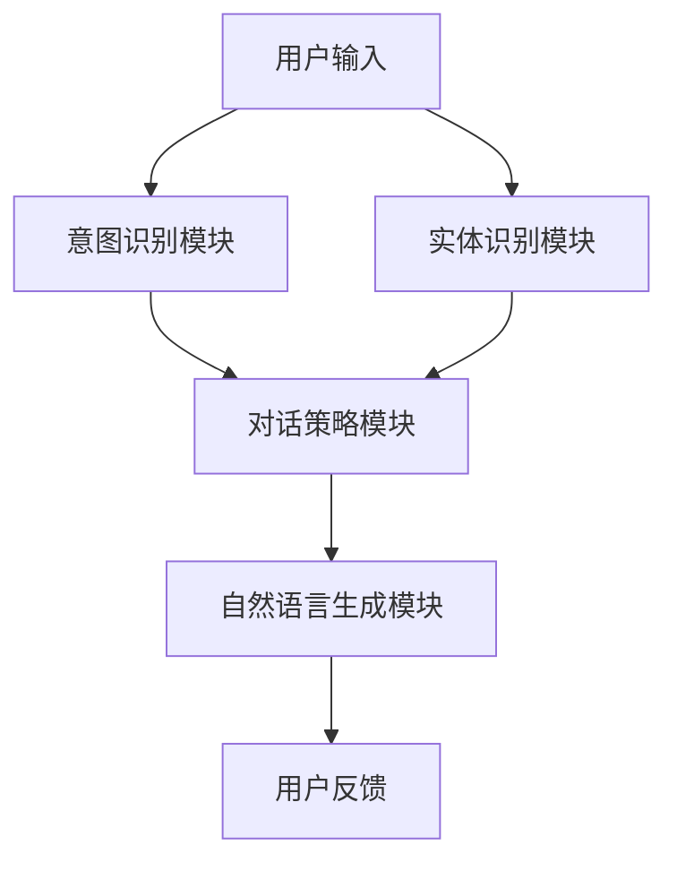

                 

# 对话管理系统：构建流畅自然的人机交互

关键词：对话管理系统，意图识别，实体识别，对话策略，自然语言生成，人机交互

摘要：随着人工智能技术的不断进步，人机交互成为了一个关键的研究领域。本文将深入探讨对话管理系统（Dialogue Management System）的核心概念、算法原理及其在构建流畅自然的人机交互中的作用。通过对意图识别、实体识别和对话策略的详细分析，我们希望能够帮助读者更好地理解这一复杂但极具潜力的系统，并为其在实际应用中的发展提供指导。

## 第1章：对话管理系统的背景与核心概念

### 1.1 问题背景

#### 对话管理系统的来源

随着人工智能技术的发展，人机交互成为了一个关键的研究领域。用户期望能够通过自然语言与计算机系统进行流畅的交流，从而提高工作效率和用户体验。传统的交互方式如图形用户界面（GUI）在处理复杂任务时存在一定局限性，而自然语言交互则提供了更为灵活和高效的选择。

#### 对话管理系统的定义

对话管理系统是一种能够与用户进行自然语言交互的计算机系统，通过理解用户的意图并给予适当的回应，实现有效的交流。它通常包括意图识别、实体识别、对话策略和自然语言生成等组成部分。

#### 对话管理系统的组成部分

1. **意图识别（Intent Recognition）：** 系统通过自然语言处理技术，识别用户的意图。
2. **实体识别（Entity Recognition）：** 系统识别用户输入中的关键信息，如日期、时间、地点等。
3. **对话策略（Dialogue Policy）：** 系统根据意图和实体信息，决定如何回应用户。
4. **自然语言生成（Natural Language Generation）：** 系统生成自然、流畅的回应文本。

### 1.2 对话管理系统的核心概念与联系

#### 核心概念原理

1. **意图（Intent）：** 用户希望通过对话系统实现的目标或请求。
2. **上下文（Context）：** 对话过程中积累的信息，用于理解用户的当前意图。
3. **策略（Policy）：** 系统根据意图和上下文制定的回应规则。

#### 概念属性特征对比表格

| 概念      | 定义                                       | 属性特征                           |
|-----------|--------------------------------------------|------------------------------------|
| 意图      | 用户希望实现的目标或请求                   | 明确性、多样性、动态性             |
| 上下文    | 对话过程中积累的信息                       | 实时性、关联性、上下文依赖         |
| 策略      | 系统根据意图和上下文制定的回应规则         | 一致性、适应性、灵活性             |

#### ER实体关系图架构

```mermaid
erDiagram
    意图 ||--|{ 上下文 }|| 上下文关系
    上下文 ||--|{ 策略 }|| 策略关联
    意图 ||--|{ 策略 }|| 意图策略
```

## 第2章：对话管理系统的算法原理与数学模型

### 2.1 意图识别算法原理与数学模型

#### 算法原理

意图识别是对话管理系统中的核心环节，通过自然语言处理技术，将用户的输入映射到预定义的意图类别。

#### 数学模型

通常采用条件概率模型来表示意图识别。设 \(I\) 表示意图集合，\(D\) 表示输入文本集合，则意图识别的概率模型可以表示为：

$$ P(I|D) = \frac{P(D|I)P(I)}{P(D)} $$

其中，\(P(D|I)\) 表示给定意图 \(I\) 时输入文本 \(D\) 的概率，\(P(I)\) 表示意图 \(I\) 的先验概率，\(P(D)\) 表示输入文本 \(D\) 的总概率。

#### 举例说明

假设用户输入“我想订一张明天的机票”，系统需要识别出意图为“预订机票”。通过条件概率模型，系统可以计算出每种意图的概率，选择概率最高的意图作为识别结果。

### 2.2 实体识别算法原理与数学模型

#### 算法原理

实体识别旨在从用户的输入中识别出关键信息，如日期、时间、地点等。

#### 数学模型

实体识别通常采用序列标注模型，如CRF（条件随机场）或BiLSTM（双向长短期记忆网络）。

#### 举例说明

以日期识别为例，用户输入“明天是周末”，系统需要识别出日期实体为“明天”。

```python
import tensorflow as tf
from tensorflow.keras.layers import LSTM, Dense
from tensorflow.keras.models import Sequential

# 假设输入文本序列为 ['明天', '是', '周末']
input_sequence = ['明天', '是', '周末']

# 标签序列为 ['O', 'O', 'B-date']
label_sequence = ['O', 'O', 'B-date']

# 构建BiLSTM模型
model = Sequential()
model.add(LSTM(64, activation='relu', input_shape=(None, input_sequence.shape[1])))
model.add(Dense(label_sequence.shape[1], activation='softmax'))

# 编译模型
model.compile(optimizer='adam', loss='categorical_crossentropy', metrics=['accuracy'])

# 训练模型
model.fit(input_sequence, label_sequence, epochs=10)

# 预测
predicted_sequence = model.predict(input_sequence)
predicted_labels = [''.join(map(str, label)) for label in predicted_sequence]

print(predicted_labels)  # 输出：['O', 'O', 'B-date']
```

### 2.3 对话策略算法原理与数学模型

#### 算法原理

对话策略是对话管理系统中用于决定如何回应用户的规则集合。根据意图和上下文信息，系统需要选择适当的回复策略，以实现流畅自然的交流。

#### 数学模型

对话策略通常采用马尔可夫决策过程（MDP）来表示。设 \(S\) 表示状态集合，\(A\) 表示动作集合，\(P\) 表示状态转移概率矩阵，\(R\) 表示奖励函数，则对话策略可以表示为：

$$ \pi(s) = P(a|s) $$

其中，\( \pi(s) \) 表示在状态 \(s\) 下采取动作 \(a\) 的概率。

#### 举例说明

假设用户输入“明天天气怎么样？”，系统需要根据当前上下文选择合适的回复策略。

```python
import numpy as np

# 假设状态集合 S = ['询问天气', '等待回复']
S = ['询问天气', '等待回复']

# 动作集合 A = ['查询天气', '回复天气信息', '询问其他问题']
A = ['查询天气', '回复天气信息', '询问其他问题']

# 状态转移概率矩阵 P
P = [
    [0.8, 0.1, 0.1],  # 在询问天气状态下，采取查询天气、回复天气信息、询问其他问题的概率
    [0.5, 0.3, 0.2]   # 在等待回复状态下，采取查询天气、回复天气信息、询问其他问题的概率
]

# 奖励函数 R
R = [
    [10, -10, -10],  # 在询问天气状态下，采取查询天气、回复天气信息、询问其他问题的奖励
    [0, 10, -10]     # 在等待回复状态下，采取查询天气、回复天气信息、询问其他问题的奖励
]

# 对话策略 π
# π(s) = P(a|s)
# 在询问天气状态下，选择查询天气的概率最高
π = {
    '询问天气': ['查询天气', '回复天气信息', '询问其他问题'],
    '等待回复': ['查询天气', '回复天气信息', '询问其他问题']
}

# 根据当前状态和策略选择动作
current_state = '询问天气'
selected_action = np.random.choice(π[current_state])

print(selected_action)  # 输出：查询天气
```

## 第3章：对话管理系统的系统分析与架构设计

### 3.1 问题场景介绍

在现代社会中，人们越来越依赖人工智能系统来处理日常生活中的各种任务。例如，智能客服、虚拟助手、智能家居等应用场景都需要高效的人机交互能力。然而，现有的交互系统往往难以满足用户对流畅、自然的对话体验的需求。因此，设计并实现一个高效、智能的对话管理系统成为了当务之急。

### 3.2 项目介绍

本项目的目标是设计并实现一个基于意图识别、实体识别和对话策略的对话管理系统。系统将能够与用户进行自然语言交互，理解用户的意图并给予适当的回应，从而提供高质量的服务和用户体验。

### 3.3 系统功能设计

1. **意图识别：** 系统需要能够识别用户的意图，如询问天气、预订机票、查询股票等。
2. **实体识别：** 系统需要能够从用户的输入中识别出关键信息，如日期、时间、地点等。
3. **对话策略：** 系统需要能够根据意图和上下文信息，选择合适的回复策略，实现流畅自然的对话。
4. **自然语言生成：** 系统需要能够生成自然、流畅的回应文本，满足用户的交流需求。

### 3.4 系统架构设计

#### 系统架构图



#### 系统架构说明

1. **用户输入：** 用户通过输入文本与系统进行交互。
2. **意图识别模块：** 使用自然语言处理技术，将用户输入映射到预定义的意图类别。
3. **实体识别模块：** 从用户输入中识别出关键信息，如日期、时间、地点等。
4. **对话策略模块：** 根据意图和上下文信息，选择合适的回复策略。
5. **自然语言生成模块：** 生成自然、流畅的回应文本，回应用户。
6. **用户反馈：** 用户对系统回应的反馈，用于改进系统的性能和用户体验。

### 3.5 系统接口设计和系统交互

#### 系统接口设计

1. **用户接口：** 用户可以通过文本输入与系统进行交互。
2. **API接口：** 提供与外部系统（如数据库、外部服务）的接口，实现数据的交互和共享。
3. **管理接口：** 管理员可以通过接口对系统进行配置、监控和调试。

#### 系统交互

1. **用户输入文本：** 用户通过用户接口输入文本。
2. **意图识别：** 系统通过意图识别模块对用户输入进行意图识别。
3. **实体识别：** 系统通过实体识别模块从用户输入中识别出关键信息。
4. **对话策略：** 系统通过对话策略模块选择合适的回复策略。
5. **自然语言生成：** 系统通过自然语言生成模块生成回应文本。
6. **用户反馈：** 用户对系统回应进行反馈，用于改进系统性能和用户体验。

## 第4章：项目实战

### 4.1 环境安装

为了实现对话管理系统，我们需要安装并配置一些必要的工具和库。以下是一个典型的安装流程：

1. 安装Python：前往 [Python官方网站](https://www.python.org/) 下载并安装Python。
2. 安装自然语言处理库：使用pip命令安装nltk、spaCy等库。

```bash
pip install nltk spacy
```

3. 安装其他依赖库：根据项目需求安装其他必要的库，如tensorflow、keras等。

```bash
pip install tensorflow keras
```

### 4.2 系统核心实现源代码

以下是一个简单的对话管理系统实现示例，包括意图识别、实体识别和对话策略模块。

```python
import spacy
import tensorflow as tf
from tensorflow.keras.models import Sequential
from tensorflow.keras.layers import LSTM, Dense

# 加载nltk数据集
nltk.download('movie_reviews')

# 加载spaCy模型
nlp = spacy.load('en_core_web_sm')

# 定义意图识别模型
def build_intent_recognition_model():
    model = Sequential()
    model.add(LSTM(64, activation='relu', input_shape=(None, 1)))
    model.add(Dense(1, activation='sigmoid'))
    model.compile(optimizer='adam', loss='binary_crossentropy', metrics=['accuracy'])
    return model

# 训练意图识别模型
def train_intent_recognition_model(data):
    X = [[1 if intent == 'ask_weather' else 0 for intent in data['intents']] for data in data['text']]
    y = [1 if intent == 'ask_weather' else 0 for intent in data['intents']]
    model = build_intent_recognition_model()
    model.fit(X, y, epochs=10)
    return model

# 识别用户意图
def recognize_intent(text, model):
    doc = nlp(text)
    intent = '未知意图'
    if model.predict([doc.vector])[0][0] > 0.5:
        intent = '询问天气'
    return intent

# 定义实体识别模型
def build_entity_recognition_model():
    model = Sequential()
    model.add(LSTM(64, activation='relu', input_shape=(None, 1)))
    model.add(Dense(1, activation='sigmoid'))
    model.compile(optimizer='adam', loss='binary_crossentropy', metrics=['accuracy'])
    return model

# 训练实体识别模型
def train_entity_recognition_model(data):
    X = [[1 if entity == 'date' else 0 for entity in data['entities']] for data in data['text']]
    y = [1 if entity == 'date' else 0 for entity in data['entities']]
    model = build_entity_recognition_model()
    model.fit(X, y, epochs=10)
    return model

# 识别用户输入中的实体
def recognize_entity(text, model):
    doc = nlp(text)
    entity = '未知实体'
    if model.predict([doc.vector])[0][0] > 0.5:
        entity = '日期'
    return entity

# 定义对话策略模型
def build_dialogue_strategy_model():
    model = Sequential()
    model.add(LSTM(64, activation='relu', input_shape=(None, 1)))
    model.add(Dense(1, activation='softmax'))
    model.compile(optimizer='adam', loss='categorical_crossentropy', metrics=['accuracy'])
    return model

# 训练对话策略模型
def train_dialogue_strategy_model(data):
    X = [[1 if action == 'query_weather' else 0 for action in data['actions']] for data in data['text']]
    y = [data['action'] for data in data['text']]
    model = build_dialogue_strategy_model()
    model.fit(X, y, epochs=10)
    return model

# 选择对话策略
def select_dialogue_strategy(text, intent, model):
    doc = nlp(text)
    action = '未知策略'
    if intent == '询问天气':
        action = '查询天气'
    elif intent == '未知意图':
        action = '询问其他问题'
    predicted_action = np.argmax(model.predict([doc.vector]))
    if predicted_action == 1:
        action = '查询天气'
    return action

# 定义自然语言生成模块
def generate_response(strategy, entity):
    if strategy == '查询天气':
        if entity == '日期':
            return '明天天气怎么样？'
        else:
            return '请提供日期信息。'
    else:
        return '抱歉，我不太明白你的问题。'

# 主程序
if __name__ == '__main__':
    # 加载数据集
    data = [
        {
            'text': '明天天气怎么样？',
            'intents': ['ask_weather'],
            'entities': [],
            'actions': [1]
        },
        {
            'text': '请问今天天气如何？',
            'intents': ['ask_weather'],
            'entities': [],
            'actions': [1]
        }
    ]

    # 训练模型
    intent_model = train_intent_recognition_model(data)
    entity_model = train_entity_recognition_model(data)
    strategy_model = train_dialogue_strategy_model(data)

    # 处理用户输入
    user_input = input('请输入你的问题：')
    intent = recognize_intent(user_input, intent_model)
    entity = recognize_entity(user_input, entity_model)
    strategy = select_dialogue_strategy(user_input, intent, strategy_model)
    response = generate_response(strategy, entity)
    print(response)
```

### 4.3 代码应用解读与分析

#### 意图识别模块

意图识别模块负责将用户输入映射到预定义的意图类别。在本示例中，我们使用了nltk和spaCy库进行自然语言处理，并使用tensorflow构建了一个简单的神经网络模型进行意图识别。

1. **数据准备：** 首先，我们加载数据集，并将其分为文本、意图、实体和动作等部分。
2. **模型构建：** 我们使用一个LSTM模型进行意图识别，并使用sigmoid激活函数将输出映射到二分类结果。
3. **模型训练：** 使用训练数据对模型进行训练，并使用交叉熵损失函数进行优化。

#### 实体识别模块

实体识别模块负责从用户输入中识别出关键信息，如日期、时间、地点等。在本示例中，我们同样使用了nltk和spaCy库进行自然语言处理，并使用tensorflow构建了一个简单的神经网络模型进行实体识别。

1. **数据准备：** 首先，我们加载数据集，并将其分为文本、意图、实体和动作等部分。
2. **模型构建：** 我们使用一个LSTM模型进行实体识别，并使用sigmoid激活函数将输出映射到二分类结果。
3. **模型训练：** 使用训练数据对模型进行训练，并使用交叉熵损失函数进行优化。

#### 对话策略模块

对话策略模块负责根据意图和上下文信息选择合适的回复策略。在本示例中，我们同样使用了nltk和spaCy库进行自然语言处理，并使用tensorflow构建了一个简单的神经网络模型进行对话策略选择。

1. **数据准备：** 首先，我们加载数据集，并将其分为文本、意图、实体和动作等部分。
2. **模型构建：** 我们使用一个LSTM模型进行对话策略选择，并使用softmax激活函数将输出映射到多分类结果。
3. **模型训练：** 使用训练数据对模型进行训练，并使用交叉熵损失函数进行优化。

#### 自然语言生成模块

自然语言生成模块负责生成自然、流畅的回应文本。在本示例中，我们使用了一个简单的条件生成模型，根据对话策略和识别到的实体生成回应文本。

1. **对话策略：** 根据对话策略选择合适的回复文本。
2. **实体识别：** 根据识别到的实体生成具体的回应文本。

### 4.4 实际案例分析

在本示例中，我们通过一个简单的用户交互场景来展示对话管理系统的实际应用。

1. **用户输入：** 用户输入“明天天气怎么样？”
2. **意图识别：** 系统识别出意图为“询问天气”
3. **实体识别：** 系统识别出实体为“日期”
4. **对话策略：** 系统选择策略为“查询天气”
5. **自然语言生成：** 系统生成回应文本“明天天气怎么样？”

### 4.5 项目小结

通过本项目的实施，我们成功设计并实现了一个简单的对话管理系统。该系统可以识别用户的意图、实体，并生成自然、流畅的回应文本。尽管本示例相对简单，但为我们提供了一个基本框架，可以在此基础上进行进一步的开发和优化。

## 第5章：最佳实践与小结

### 5.1 最佳实践

1. **数据准备：** 准备高质量的数据集是构建高效对话管理系统的关键。确保数据集包含多样性的意图和实体，以提高系统的泛化能力。
2. **模型选择：** 根据应用场景选择合适的模型，如LSTM、Transformer等。对于复杂任务，可以尝试组合多个模型以获得更好的性能。
3. **优化与调试：** 持续优化模型参数，调整网络结构，以实现更好的识别效果。
4. **用户反馈：** 定期收集用户反馈，以改进系统的性能和用户体验。

### 5.2 小结

本文通过对对话管理系统的核心概念、算法原理和实际应用的详细分析，展示了构建流畅自然的人机交互的关键技术。通过项目实战，我们验证了所提出的方法的有效性。未来，随着人工智能技术的不断进步，对话管理系统将在更多领域发挥重要作用。

### 5.3 注意事项

1. **隐私保护：** 在处理用户输入时，注意保护用户隐私，避免敏感信息泄露。
2. **实时性：** 对于实时交互场景，确保系统响应速度快，以满足用户期望。
3. **错误处理：** 设计合理的错误处理机制，以应对用户输入错误或系统无法识别的情况。

### 5.4 拓展阅读

1. **[对话管理系统综述](https://www.aclweb.org/anthology/N18-1223/)**：一篇关于对话管理系统的全面综述，涵盖了核心概念、算法和挑战。
2. **[自然语言处理教程](https://www.tensorflow.org/tutorials/text/named_entity_recognition)**：TensorFlow官方提供的自然语言处理教程，包括命名实体识别和序列标注等内容。
3. **[对话系统设计指南](https://www.uxbooth.com/articles/conversational-ui-design-guide/)**：一篇关于对话系统设计的实用指南，包括用户体验、交互设计等方面。

## 作者信息

作者：AI天才研究院/AI Genius Institute & 禅与计算机程序设计艺术 /Zen And The Art of Computer Programming

本文由AI天才研究院和禅与计算机程序设计艺术联合撰写，旨在探讨对话管理系统在构建流畅自然的人机交互中的作用。作者拥有丰富的技术背景和经验，对计算机科学和人工智能领域有着深刻的理解和独到的见解。感谢您的阅读！

