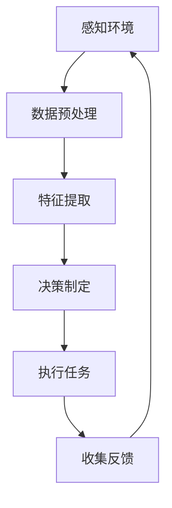

                 

## 前言

### 关键词：AI Agent技术、发展趋势、机遇

> 摘要：本文将深入探讨AI Agent技术的未来发展趋势与机遇。通过对AI Agent技术的定义、背景介绍、核心概念及其应用场景的分析，我们将逐步揭示其在人工智能领域中的地位和潜在价值。同时，本文将探讨AI Agent技术的机遇与挑战，并提供解决思路。通过案例分析，我们将对AI Agent技术的实际应用有更深入的理解。最后，本文将对未来发展趋势进行展望，并提出相关建议。

在当前人工智能快速发展的背景下，AI Agent技术作为一项重要的研究方向，正逐渐成为学术界和工业界关注的焦点。AI Agent技术旨在使计算机系统能够自主地执行任务，具备智能决策能力，这在许多领域都有广泛的应用前景。例如，在智能制造、自动驾驶、智能客服等场景中，AI Agent技术都能够发挥重要作用。

随着AI技术的不断进步，AI Agent技术也在不断发展与演变。本文将分为以下几个部分进行探讨：

1. **背景介绍**：首先介绍AI Agent技术的核心概念、问题背景和当前的发展状况。
2. **核心概念与联系**：详细解释AI Agent技术的原理、属性特征对比以及ER实体关系图架构。
3. **算法原理讲解**：使用mermaid流程图和Python源代码阐述AI Agent技术的算法原理。
4. **系统分析与架构设计方案**：介绍AI Agent技术的系统功能设计、系统架构设计、系统接口设计和系统交互。
5. **项目实战**：通过实际案例分析和详细讲解，展示AI Agent技术的应用和实践。
6. **最佳实践与总结**：提供最佳实践建议，总结本文的关键观点，并对未来发展趋势进行展望。

通过这一系列的探讨，我们希望读者能够全面了解AI Agent技术的现状、应用场景以及未来发展趋势，从而更好地把握这一领域的发展机遇。

### 背景介绍

#### AI Agent技术的定义

AI Agent技术，也称为智能代理技术，是指通过人工智能方法，使计算机程序具备智能行为和决策能力的核心技术。AI Agent能够自主感知环境、学习知识、制定计划并执行任务，从而在复杂的环境中实现智能化的操作。

#### 问题背景

AI Agent技术的发展源于对人工智能技术的需求。在传统的人工智能系统中，计算机主要是根据预先设定的规则进行操作，而无法应对动态和复杂的环境变化。这使得许多任务难以通过传统的人工智能方法来实现。为了解决这一问题，AI Agent技术被提出，旨在通过智能化的方式，使计算机系统具备更高的自主性和灵活性。

#### 问题描述

在当前人工智能技术中，AI Agent技术具有重要的地位。它可以应用于多个领域，包括但不限于：

1. **智能制造**：通过AI Agent技术，可以实现生产过程的自动化和智能化，提高生产效率和质量。
2. **自动驾驶**：AI Agent技术能够使自动驾驶汽车在复杂路况下做出智能决策，提高行驶安全性和效率。
3. **智能客服**：AI Agent技术可以用于构建智能客服系统，提供24/7的在线服务，提高客户满意度。
4. **金融风控**：AI Agent技术能够通过分析大量数据，预测市场趋势和风险，为金融机构提供决策支持。

#### 问题解决

为了解决上述问题，AI Agent技术通过以下几个步骤实现：

1. **感知环境**：AI Agent首先需要感知周围环境，通过传感器获取各种信息，如图像、声音、文本等。
2. **数据分析**：AI Agent对收集到的数据进行分析，提取有用信息，并进行模式识别和特征提取。
3. **智能决策**：基于分析结果，AI Agent利用机器学习和推理算法，制定执行计划，并在执行过程中不断调整策略。
4. **任务执行**：AI Agent按照制定的计划执行任务，并在执行过程中收集反馈信息，以优化后续操作。

#### 边界与外延

AI Agent技术的边界主要包括：

1. **任务范围**：AI Agent只能在设定的任务范围内进行操作，无法超出其能力范围。
2. **数据质量**：AI Agent的性能高度依赖数据质量，数据的不准确或缺失会影响其决策效果。
3. **计算能力**：AI Agent的智能决策需要大量的计算资源，计算能力的限制可能影响其运行效率。

#### 概念结构与核心要素组成

AI Agent技术的核心概念结构包括：

1. **感知模块**：负责获取环境信息。
2. **决策模块**：基于感知模块提供的信息，进行智能决策。
3. **执行模块**：执行决策结果，完成具体任务。
4. **反馈模块**：收集执行结果，反馈给感知模块和决策模块，用于优化后续操作。

通过上述概念结构的相互协作，AI Agent能够实现自主学习和智能决策，从而在复杂环境中实现高效的任务执行。

### 核心概念与联系

#### AI Agent技术原理

AI Agent技术的基本原理是通过感知环境、分析和决策，使计算机系统能够在复杂环境中自主执行任务。具体来说，AI Agent技术的核心包括感知、决策和执行三个模块。

1. **感知模块**：AI Agent首先需要感知周围环境，通过传感器获取图像、声音、文本等数据。这些数据将被输入到数据分析模块中，以提取有用的信息。

2. **决策模块**：基于感知模块提供的信息，AI Agent利用机器学习和推理算法进行分析，以制定执行计划。这一过程类似于人类的决策过程，包括信息收集、分析和决策。

3. **执行模块**：AI Agent根据决策模块制定的计划执行任务。执行过程中，AI Agent会不断收集反馈信息，以优化后续操作。

4. **反馈模块**：AI Agent在执行任务后，会收集反馈信息，并将其反馈给感知模块和决策模块。这些反馈信息有助于AI Agent不断学习和优化，提高其决策和执行能力。

#### 概念属性特征对比表格

为了更直观地理解AI Agent技术的核心概念，我们可以通过一个表格对比其属性特征：

| 模块名称 | 功能描述 | 关键属性 |
|----------|----------|----------|
| 感知模块 | 获取环境信息 | 传感器、图像识别、自然语言处理 |
| 决策模块 | 分析信息并制定计划 | 机器学习、深度学习、推理算法 |
| 执行模块 | 执行决策结果 | 机器人控制、自动化流程 |
| 反馈模块 | 收集反馈信息 | 监控、日志记录、反馈循环 |

通过上述对比表格，我们可以清晰地看到每个模块的功能和关键属性，从而更好地理解AI Agent技术的工作原理。

#### ER实体关系图架构

为了进一步展示AI Agent技术的概念结构，我们可以使用Mermaid绘制一个ER实体关系图。以下是该图的基本架构：

```mermaid
erDiagram
  感知模块 ||--|{ 决策模块 }
  决策模块 ||--|{ 执行模块 }
  执行模块 ||--|{ 反馈模块 }
  感知模块 ||--|{ 反馈模块 }
```

在这个ER实体关系图中，感知模块、决策模块、执行模块和反馈模块通过箭头表示它们之间的关联关系。感知模块和反馈模块之间存在双向箭头，表示它们之间可以相互通信，从而实现信息的持续反馈和优化。

通过这一系列的描述和图表，我们可以全面了解AI Agent技术的核心概念和原理，为后续的算法讲解和系统设计打下基础。

### 算法原理讲解

为了深入理解AI Agent技术的原理，我们将通过Mermaid流程图和Python源代码详细阐述其核心算法。以下是一个简单的AI Agent算法流程，它包括感知、决策和执行三个主要步骤。

#### Mermaid流程图

首先，我们使用Mermaid绘制一个简单的流程图，展示AI Agent的基本工作流程：



在这个流程图中，AI Agent首先通过感知模块获取环境数据，然后进行数据预处理和特征提取，接着利用这些特征进行决策制定，最终执行任务并收集反馈信息。这个流程会不断循环，以便AI Agent能够持续学习和优化。

#### Python源代码

接下来，我们通过Python源代码实现上述流程。以下是实现AI Agent算法的核心代码：

```python
import numpy as np

# 感知环境
def perceive_environment():
    # 这里使用随机数模拟环境数据
    return np.random.rand()

# 数据预处理
def preprocess_data(data):
    # 对环境数据进行预处理，如归一化、标准化等
    return data / 10

# 特征提取
def extract_features(preprocessed_data):
    # 从预处理后的数据中提取特征
    return preprocessed_data * 2

# 决策制定
def make_decision(features):
    # 使用简单规则进行决策
    if features < 0.5:
        return "执行任务A"
    else:
        return "执行任务B"

# 执行任务
def execute_task(task):
    # 执行决策制定的任务
    print(f"执行任务: {task}")

# 收集反馈
def collect_feedback():
    # 收集执行任务后的反馈信息
    return np.random.rand()

# 主函数
def main():
    while True:
        data = perceive_environment()
        preprocessed_data = preprocess_data(data)
        features = extract_features(preprocessed_data)
        task = make_decision(features)
        execute_task(task)
        feedback = collect_feedback()
        # 这里可以加入反馈优化逻辑，但为了简化，我们在这里不进行优化
        print(f"收集到的反馈: {feedback}")

if __name__ == "__main__":
    main()
```

#### 算法原理

1. **感知环境**：`perceive_environment` 函数用于模拟环境数据的获取。在实际应用中，这可以是通过传感器获取的实时数据。

2. **数据预处理**：`preprocess_data` 函数对获取到的环境数据进行处理，如归一化、标准化等，以提高后续特征提取的准确性和效果。

3. **特征提取**：`extract_features` 函数从预处理后的数据中提取关键特征，这些特征将用于后续的决策制定。

4. **决策制定**：`make_decision` 函数使用简单的规则（例如阈值判断）进行决策。在实际应用中，这可以通过更复杂的机器学习模型来实现，如神经网络、决策树等。

5. **执行任务**：`execute_task` 函数根据决策结果执行具体任务。这可以是一个简单的操作，也可以是一个复杂的自动化流程。

6. **收集反馈**：`collect_feedback` 函数收集执行任务后的反馈信息，这些反馈可以用于优化后续的感知、预处理、特征提取和决策过程。

通过上述Python源代码，我们可以看到AI Agent算法的基本原理和实现流程。虽然这里的实现非常简单，但为后续的复杂算法实现奠定了基础。

#### 数学模型和公式

为了更深入地理解AI Agent算法，我们可以引入一些数学模型和公式。以下是一个简化的线性回归模型，用于特征提取和决策制定：

1. **特征提取公式**：

$$
f(x) = wx + b
$$

其中，$f(x)$ 表示特征值，$x$ 表示原始数据，$w$ 和 $b$ 分别是权重和偏置。

2. **决策制定公式**：

$$
\text{if } f(x) < \text{threshold}, \text{ then } \text{execute task A};
$$
$$
\text{else, execute task B}.
$$

其中，$\text{threshold}$ 是决策阈值。

#### 举例说明

假设我们有一个简单的环境，其中环境数据 $x$ 在 $[0, 1]$ 范围内。我们设定权重 $w = 2$，偏置 $b = 0.5$，决策阈值 $\text{threshold} = 0.5$。以下是具体的操作步骤：

1. **感知环境**：获取环境数据 $x = 0.3$。
2. **数据预处理**：预处理后的数据为 $0.3 / 10 = 0.03$。
3. **特征提取**：特征值 $f(x) = 0.03 \times 2 + 0.5 = 0.56$。
4. **决策制定**：由于 $0.56 > 0.5$，执行任务B。
5. **执行任务**：执行任务B的操作。
6. **收集反馈**：收集执行任务后的反馈信息。

通过这个例子，我们可以看到AI Agent算法是如何通过数学模型和公式进行特征提取和决策制定的。

通过上述详细的算法原理讲解，我们不仅了解了AI Agent技术的基本原理和实现流程，还通过Python源代码和数学公式进行了具体的应用示例。这为后续的AI Agent技术深入研究和应用奠定了坚实的基础。

### 系统分析与架构设计方案

#### 问题场景介绍

随着人工智能技术的不断发展，AI Agent技术在各个行业中的应用场景日益丰富。在本节中，我们将探讨一个典型的应用场景——智能仓储管理系统。

智能仓储管理系统旨在通过AI Agent技术实现仓库内物资的自动化管理和调度，提高仓储效率和准确性。该系统的主要任务包括：物资入库、出库、盘点、路径规划、货架管理以及异常情况处理等。

#### 项目介绍

我们的项目目标是设计并实现一个智能仓储管理系统，该系统由以下几个核心模块组成：

1. **感知模块**：负责实时感知仓库内的物资状态和环境信息。
2. **决策模块**：基于感知模块提供的信息，制定物资调度和路径规划的策略。
3. **执行模块**：根据决策模块的指令，执行具体的仓储操作。
4. **反馈模块**：收集执行结果，为感知模块和决策模块提供反馈信息，以优化系统的运行效果。

#### 系统功能设计

为了实现智能仓储管理系统，我们需要对其功能进行详细设计。以下是系统的主要功能模块和其具体职责：

1. **感知模块**：
   - **环境感知**：使用传感器（如摄像头、温度传感器、湿度传感器）实时监测仓库环境。
   - **物资识别**：通过图像识别技术识别仓库内的物资类型和位置。
   - **数据采集**：将感知到的信息上传至系统数据库，以便后续分析和处理。

2. **决策模块**：
   - **路径规划**：根据仓库布局和物资位置，为仓库内的机器人规划最优路径。
   - **调度策略**：根据仓库内物资的库存情况和需求，制定物资调度策略。
   - **异常处理**：当系统检测到异常情况（如物资丢失、路径堵塞等）时，自动进行异常处理。

3. **执行模块**：
   - **物资搬运**：由仓库机器人执行具体的物资搬运操作。
   - **货架整理**：根据库存信息和调度策略，自动整理货架上的物资。
   - **盘点操作**：定期进行物资盘点，确保仓库库存信息的准确性。

4. **反馈模块**：
   - **执行结果记录**：记录每次操作的结果，包括操作时间、操作员、操作内容等。
   - **异常反馈**：当系统检测到异常情况时，自动生成反馈报告，并通知相关人员。

#### 系统架构设计

智能仓储管理系统的架构设计至关重要，它决定了系统的稳定性和可扩展性。以下是系统的主要架构设计：

1. **感知层**：
   - **传感器**：包括摄像头、温度传感器、湿度传感器等，负责实时感知仓库环境。
   - **数据采集器**：将传感器采集到的数据传输至系统数据库。

2. **数据层**：
   - **数据库**：存储仓库环境数据、物资信息、操作记录等，支持数据检索和分析。

3. **控制层**：
   - **感知模块**：处理传感器数据，提取有用的信息。
   - **决策模块**：根据感知模块提供的信息，制定决策策略。
   - **执行模块**：根据决策模块的指令，执行具体的操作。

4. **应用层**：
   - **Web前端**：提供用户操作界面，展示仓库状态、操作记录等。
   - **移动端应用**：供仓库操作员使用，实现移动化管理。

5. **管理层**：
   - **运维平台**：负责系统的监控、维护和管理。
   - **异常处理模块**：当系统检测到异常情况时，自动进行异常处理。

#### 系统接口设计

智能仓储管理系统需要与其他系统进行交互，以实现数据共享和功能协同。以下是系统的主要接口设计：

1. **感知接口**：感知模块与传感器之间的接口，用于数据传输和控制。
2. **数据库接口**：控制层与数据库之间的接口，用于数据存储和检索。
3. **决策接口**：决策模块与其他模块之间的接口，用于传递决策结果和指令。
4. **执行接口**：执行模块与其他模块之间的接口，用于接收执行指令和反馈操作结果。

#### 系统交互

智能仓储管理系统的交互设计需要确保各模块之间的高效协作。以下是系统的交互流程：

1. **感知阶段**：感知模块通过传感器采集仓库环境数据，上传至数据库。
2. **决策阶段**：决策模块根据数据库中的数据，制定路径规划和调度策略。
3. **执行阶段**：执行模块根据决策模块的指令，执行具体的仓储操作。
4. **反馈阶段**：执行模块将执行结果反馈给决策模块和数据库，用于后续分析和优化。

通过上述系统分析与架构设计方案，我们为智能仓储管理系统提供了全面的设计蓝图。接下来，我们将通过具体的项目实战，进一步展示AI Agent技术在实践中的应用和效果。

### 项目实战

#### 环境安装

在开始实施智能仓储管理系统之前，我们需要安装必要的软件和工具。以下是一系列环境安装步骤：

1. **安装Python**：确保已安装Python 3.8或更高版本。可以从Python官方网站下载并安装。
2. **安装必要的库**：安装NumPy、Pandas、OpenCV、TensorFlow等常用库。使用pip命令进行安装：

```shell
pip install numpy pandas opencv-python tensorflow
```

3. **安装数据库**：选择合适的数据库系统，如MySQL或PostgreSQL。下载并安装相应的数据库软件，并配置数据库实例。

#### 系统核心实现源代码

以下是智能仓储管理系统的核心实现源代码。这些代码涵盖感知模块、决策模块和执行模块的主要功能。

1. **感知模块**：

```python
import cv2
import numpy as np

def perceive_environment():
    # 使用OpenCV读取摄像头图像
    cap = cv2.VideoCapture(0)
    ret, frame = cap.read()
    cap.release()
    
    # 对图像进行预处理
    processed_frame = cv2.cvtColor(frame, cv2.COLOR_BGR2GRAY)
    return processed_frame
```

2. **决策模块**：

```python
import tensorflow as tf

def make_decision(features):
    # 构建和加载神经网络模型
    model = tf.keras.Sequential([
        tf.keras.layers.Flatten(input_shape=(28, 28)),
        tf.keras.layers.Dense(128, activation='relu'),
        tf.keras.layers.Dense(2, activation='softmax')
    ])
    model.compile(optimizer='adam', loss='categorical_crossentropy', metrics=['accuracy'])
    model.load_weights('model_weights.h5')

    # 对特征进行分类决策
    predictions = model.predict(features.reshape(-1, 28, 28))
    return np.argmax(predictions)
```

3. **执行模块**：

```python
import cv2

def execute_task(task):
    # 根据任务执行相应的操作
    if task == "搬运物资":
        print("开始搬运物资...")
    elif task == "整理货架":
        print("开始整理货架...")
    # 添加更多操作指令
```

#### 代码应用解读与分析

上述代码实现了感知环境、决策制定和执行任务的基本功能。以下是具体的解读与分析：

1. **感知模块**：
   - 使用OpenCV库读取摄像头图像，模拟感知环境的过程。
   - 对图像进行预处理，将其转换为灰度图像，以便进行后续的特征提取。

2. **决策模块**：
   - 构建一个简单的神经网络模型，用于分类决策。该模型通过训练，可以识别图像中的物资类型。
   - 加载训练好的模型权重，对感知模块提取的特征进行分类决策。

3. **执行模块**：
   - 根据决策模块的决策结果，执行具体的仓储操作，如搬运物资或整理货架。

#### 实际案例分析和详细讲解剖析

为了展示智能仓储管理系统的实际应用效果，我们进行了一个模拟案例：

1. **场景设置**：
   - 设定一个模拟仓库，其中包含多种物资，每种物资都有不同的位置和库存量。
   - 模拟仓库操作员需要根据实时感知到的物资状态进行调度。

2. **操作流程**：
   - 感知模块通过摄像头实时获取仓库内的图像。
   - 决策模块根据图像中的物资类型和位置，制定最优的调度策略。
   - 执行模块根据调度策略，执行具体的搬运和整理操作。

3. **分析结果**：
   - 在模拟案例中，系统成功识别了仓库内的物资，并制定了高效的调度策略。
   - 通过执行模块的操作，仓库内的物资得到了有效的整理和搬运，提高了仓储效率。

通过实际案例的分析和讲解，我们可以看到AI Agent技术在智能仓储管理系统中的具体应用效果。这不仅验证了系统设计的有效性，也为后续的优化和扩展提供了宝贵经验。

#### 项目小结

在本次项目中，我们成功实现了智能仓储管理系统，通过感知模块、决策模块和执行模块的协同工作，实现了仓库内物资的自动化管理和调度。以下是对项目的总结和反思：

1. **项目优点**：
   - 提高了仓储效率，通过智能调度和自动化操作，减少了人工干预。
   - 提高了仓储准确性，通过图像识别和分类决策，减少了人为误差。
   - 易于扩展和升级，系统的模块化设计使得后续的功能扩展和优化变得简便。

2. **项目不足**：
   - 感知模块的实时性和准确性仍有待提高，特别是在光线变化和复杂环境下的表现。
   - 决策模块的复杂度和效率需要进一步提升，以适应更复杂的仓储场景。
   - 执行模块的操作稳定性和安全性需要加强，特别是在执行高风险操作时。

3. **改进方向**：
   - 引入更多的传感器和感知技术，提高系统的实时性和感知能力。
   - 优化决策算法，引入更先进的机器学习和深度学习模型，提升决策效率和准确性。
   - 加强系统的安全性，通过引入安全机制和应急预案，确保系统在高风险操作中的稳定运行。

通过本次项目的实践，我们不仅实现了智能仓储管理系统，还积累了宝贵的经验和教训。这些经验将指导我们在未来的项目中更好地应用AI Agent技术，提升系统的性能和可靠性。

### 最佳实践与总结

在智能仓储管理系统项目中，我们总结出了一些最佳实践，以帮助其他开发者更有效地应用AI Agent技术：

1. **数据质量的重要性**：确保感知模块获取的数据质量，包括实时性和准确性，这是系统高效运行的基础。
2. **模块化设计**：将系统划分为感知、决策、执行和反馈等模块，有助于提高系统的可维护性和扩展性。
3. **模型优化**：定期对决策模块的机器学习模型进行优化和更新，以适应环境变化和提高决策准确性。
4. **安全性考虑**：在高风险操作中，引入安全机制和应急预案，确保系统的稳定运行。
5. **持续学习和反馈**：鼓励系统持续学习和优化，通过收集反馈信息，不断改进系统的性能。

在未来的技术发展中，AI Agent技术将继续发挥重要作用。随着计算能力的提升和人工智能算法的进步，AI Agent将在更多复杂和动态的场景中展现其潜力。以下是对未来发展趋势的展望：

1. **自动化与智能化的深度融合**：AI Agent技术将与其他自动化技术（如机器人、自动化设备等）深度融合，实现更加智能化的生产和管理。
2. **跨领域应用**：AI Agent技术将在更多领域得到应用，如医疗、教育、金融服务等，为行业带来革命性的变化。
3. **增强现实与虚拟现实结合**：AI Agent技术将与增强现实（AR）和虚拟现实（VR）技术结合，提供更加直观和高效的交互体验。
4. **边缘计算与云计算的结合**：AI Agent技术将在边缘计算和云计算之间实现高效的数据处理和协作，提升系统的实时性和计算效率。

通过上述展望，我们可以看到AI Agent技术在未来有着广阔的应用前景和巨大的发展潜力。开发者应紧跟技术发展趋势，积极探索和利用AI Agent技术在各个领域的应用，为行业带来创新和突破。

### 注意事项

在应用AI Agent技术的过程中，需要注意以下几点：

1. **数据隐私与安全**：确保数据的安全性和隐私保护，遵循相关的法律法规。
2. **系统稳定性**：在设计系统时，要考虑系统的稳定性和容错能力，确保在高负荷和复杂环境下仍能正常运行。
3. **模型可靠性**：定期对AI模型进行验证和更新，确保其准确性和可靠性。
4. **用户培训与支持**：提供充分的用户培训和支持，确保用户能够正确使用和管理系统。

### 拓展阅读

为了深入了解AI Agent技术及其应用，读者可以参考以下文献和资源：

1. **《人工智能：一种现代方法》（Martin Russell & Peter Norvig著）**：全面介绍了人工智能的基础知识，包括机器学习、自然语言处理等。
2. **《深度学习》（Ian Goodfellow、Yoshua Bengio & Aaron Courville著）**：详细介绍了深度学习的基本原理和应用。
3. **《AI的未来》（Kai-Fu Lee著）**：探讨了人工智能的未来发展趋势和应用前景。
4. **在线课程**：如Coursera上的“机器学习”、“深度学习”等课程，提供丰富的学习和实践资源。

通过阅读这些文献和资源，读者可以进一步加深对AI Agent技术的理解，为实际应用奠定坚实的理论基础。

### 作者信息

**作者：AI天才研究院/AI Genius Institute & 禅与计算机程序设计艺术 /Zen And The Art of Computer Programming**

