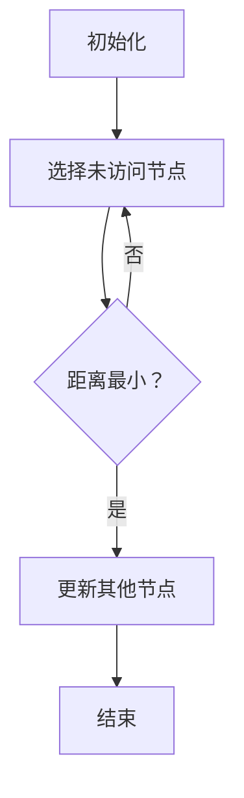
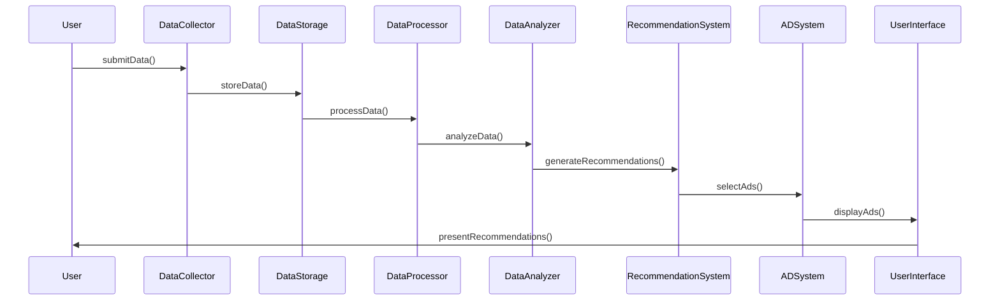

                 

### 《带领团队做持续的突破》

关键词：持续突破、团队协作、创新思维、系统架构、实战案例

摘要：本文旨在探讨如何带领团队实现持续的突破。通过分析突破的本质、团队合作的机制、以及持续改进和学习的重要性，本文提出了一套系统的指导方案，包括突破性算法原理、数学模型讲解、系统分析与架构设计、项目实战与案例分析等内容。希望通过这些分析和建议，为IT领域的团队提供实际可操作的方法和策略。

### 目录

**第一部分：问题背景与核心概念**

- **第1章 引言**
  - 1.1 突破的本质与意义
  - 1.2 团队合作与持续突破
  - 1.3 团队与突破的关系

- **第2章 核心概念与联系**
  - 2.1 突破思维模式
  - 2.2 团队文化建设
  - 2.3 持续改进与学习

**第二部分：算法原理与数学模型**

- **第3章 突破性算法原理**
  - 3.1 算法原理概述
  - 3.2 常见突破性算法
  - 3.3 算法原理可视化

- **第4章 数学模型与公式讲解**
  - 4.1 数学模型的基本概念
  - 4.2 常用数学模型讲解

**第三部分：系统分析与架构设计**

- **第5章 系统分析与架构设计**
  - 5.1 问题场景介绍
  - 5.2 项目介绍
  - 5.3 系统功能设计
  - 5.4 系统架构设计
  - 5.5 系统交互设计

**第四部分：项目实战与案例分析**

- **第6章 项目实战**
  - 6.1 环境安装与配置
  - 6.2 系统核心实现
  - 6.3 代码应用解读与分析
  - 6.4 实际案例分析与讲解
  - 6.5 项目小结

**第五部分：最佳实践与总结**

- **第7章 最佳实践与总结**
  - 7.1 最佳实践 tips
  - 7.2 小结
  - 7.3 注意事项
  - 7.4 拓展阅读

### 第1章 引言

#### 1.1 突破的本质与意义

突破，通常指的是在某些领域或问题上取得重大的进展或创新。它不仅仅是解决了当前的问题，更是一种对现有技术和思维的超越。在IT领域，突破的重要性不言而喻。技术的快速发展要求我们不断超越自我，不断挑战新的极限。

首先，突破能带来巨大的商业价值。例如，云计算、大数据和人工智能等技术的突破，不仅改变了企业的运营模式，也创造了新的市场机会。其次，突破能推动整个行业的发展。新的技术突破往往能带动上下游产业链的共同进步。

然而，突破并不是一蹴而就的。它需要深入的思考、系统的规划和持之以恒的努力。对于团队来说，突破更是一个集体智慧的结果。一个团队能否实现持续突破，取决于其成员的思维模式、团队文化以及持续改进的能力。

#### 1.2 团队合作与持续突破

团队合作是持续突破的重要保障。在复杂的技术项目中，单靠个人的力量往往难以完成任务。团队合作能充分发挥每个人的优势，实现资源的最佳配置。同时，团队合作还能促进知识共享和经验传承，提高团队整体的创新能力。

然而，团队合作并非易事。团队成员之间可能存在沟通障碍、利益冲突甚至个人恩怨。这些问题都需要通过有效的团队建设来解决。团队建设不仅包括制度建设，更需要关注团队成员的内心需求和职业发展。

持续突破还需要团队具备创新思维。创新思维是一种对现状的质疑和对未来的探索。它要求团队成员敢于打破常规，勇于尝试新方法。同时，创新思维也需要建立在扎实的专业知识和技能基础之上。

#### 1.3 团队与突破的关系

团队与突破的关系是相辅相成的。一个强大的团队是实现突破的基础，而持续的突破又能推动团队不断成长。团队在实现突破的过程中，需要不断调整自己的角色和定位，从被动的执行者变为主动的创新者。

首先，团队需要明确自己的目标和使命。只有明确了目标和使命，团队才能集中精力，齐心协力地实现突破。其次，团队需要建立一套有效的激励机制，鼓励成员勇于创新、敢于担当。最后，团队需要保持开放的心态，不断吸收外部的先进经验和理念。

总之，带领团队实现持续的突破是一项系统工程。它需要我们深入理解突破的本质，建立高效的团队合作机制，培养创新思维，并持续改进和学习。只有这样，我们才能在竞争激烈的技术领域中立于不败之地。接下来，我们将进一步探讨突破思维模式、团队文化建设以及持续改进与学习等核心概念。

### 第2章 核心概念与联系

#### 2.1 突破思维模式

突破思维模式是一种创新性的思考方式，它不同于常规思维，强调对现状的挑战和对未来的探索。要实现持续的突破，团队成员需要具备以下几种突破思维模式：

1. **逆向思维**：逆向思维是对常规做法的反向思考。通过从相反的角度来审视问题，我们往往能发现新的解决方案。例如，在产品设计时，可以尝试从用户不希望看到的结果出发，反推出产品的功能需求。

2. **系统思维**：系统思维强调将问题看作一个整体，分析各部分之间的相互作用。通过系统思维，我们可以发现看似无关的问题之间的内在联系，从而找到更全面的解决方案。

3. **跨学科思维**：跨学科思维是将不同领域的知识进行交叉运用。这种思维方式可以突破单一学科的局限，为我们提供更广阔的视野和更多的创新思路。

4. **假设思维**：假设思维是在没有确凿证据的情况下，先提出一个假设，然后通过实验或实践来验证。这种方法可以快速迭代，帮助我们不断调整和完善方案。

#### 2.2 团队文化建设

团队文化是团队共同价值观和行为准则的体现。一个积极的团队文化能激发成员的创造力和积极性，推动团队实现持续突破。以下是一些建设积极团队文化的关键要素：

1. **开放沟通**：开放沟通是指团队成员之间能够自由地分享想法、意见和问题。这种沟通方式有助于建立信任，促进知识共享，提高团队整体创新能力。

2. **尊重多样性**：尊重多样性包括尊重不同的观点、文化和背景。多样性不仅带来了不同的思维方式，还能激发更多的创意。一个包容的团队文化能吸引和留住不同背景的人才。

3. **共同目标**：共同目标是指团队成员对团队目标和使命的认同。共同目标能激发团队成员的归属感和责任感，使他们更加努力地工作，为实现团队目标贡献自己的力量。

4. **持续反馈**：持续反馈是指团队成员能够及时地获得关于自己工作表现的反馈。这种反馈不仅能帮助成员改进工作，还能增强他们的自信心和积极性。

#### 2.3 持续改进与学习

持续改进与学习是团队实现突破的重要保障。一个团队需要不断地评估自己的工作，发现存在的问题，并提出改进措施。以下是一些实现持续改进与学习的方法：

1. **定期回顾**：定期回顾是指团队定期回顾自己的工作，总结成功经验和教训。这种回顾有助于团队发现自身的不足，并制定改进计划。

2. **知识共享**：知识共享是指团队成员之间分享知识和经验。这种共享不仅能提高团队整体的知识水平，还能激发新的创新思路。

3. **外部学习**：外部学习是指团队从外部获取新的知识和经验。这可以通过参加行业会议、培训课程、阅读专业书籍等方式实现。

4. **实践检验**：实践检验是指将新的知识和方法应用到实际工作中，通过实践来验证其效果。这种方法能帮助团队快速适应新的变化，实现持续改进。

#### 2.4 突破思维模式与团队文化、持续改进与学习的联系

突破思维模式、团队文化建设和持续改进与学习是相辅相成的。突破思维模式为团队提供了创新的动力和方法，团队文化则为这种创新提供了土壤和氛围，而持续改进与学习则是团队实现长期突破的保障。

首先，突破思维模式是团队文化的重要组成部分。一个具备创新思维的团队，其成员往往能更加开放地接受新事物，敢于挑战现状，这有助于形成积极的团队文化。

其次，团队文化建设能够巩固和强化突破思维模式。一个尊重多样性、鼓励创新的团队文化，能激发团队成员的创造力和积极性，使他们在工作中更加主动地运用突破思维模式。

最后，持续改进与学习是团队实现突破的重要保障。通过定期回顾、知识共享、外部学习和实践检验，团队能够不断提高自己的能力和水平，从而在竞争中保持优势。

总之，突破思维模式、团队文化建设和持续改进与学习是团队实现持续突破的三个关键要素。通过深入理解和运用这些概念，团队将能够在技术领域中不断取得新的突破，实现长远发展。

### 第3章 突破性算法原理

#### 3.1 算法原理概述

算法原理是解决特定问题的系统方法。在IT领域，算法原理的突破往往能带来性能、效率和可扩展性的显著提升。理解算法原理的重要性在于，它不仅帮助我们选择合适的方法解决当前问题，还能为未来的创新提供理论基础。

算法原理的重要性体现在以下几个方面：

1. **性能优化**：高效的算法能够显著减少计算时间和资源消耗，提升系统性能。
2. **效率提升**：算法优化能够提高数据处理的速度和准确性，满足日益增长的数据处理需求。
3. **可扩展性**：优秀的算法设计能够适应不同规模的数据和处理需求，具备良好的扩展性。

算法原理的分类可以根据其应用领域、目标和特点进行划分。常见的算法原理包括：

1. **贪心算法**：通过每一步选择当前最优解，期望最终得到全局最优解。适用于最短路径、最小生成树等问题。
2. **动态规划**：将复杂问题分解为子问题，通过子问题的最优解推导出原问题的最优解。适用于背包问题、最长公共子序列等问题。
3. **分治算法**：将大问题分解为若干小问题，分别解决后再合并。适用于排序、快速傅里叶变换等问题。
4. **随机算法**：利用随机性来优化算法性能或解决某些问题。适用于近似算法、随机化算法等。

算法原理的选择标准包括：

1. **时间复杂度**：衡量算法执行时间的增长速度，选择时间复杂度较低的方法。
2. **空间复杂度**：衡量算法所需内存的消耗，选择空间复杂度较低的方法。
3. **可扩展性**：选择能够适应不同规模数据的算法，确保算法在数据规模扩大时仍能高效运行。
4. **实现难度**：选择易于实现和理解的算法，降低开发成本和风险。

#### 3.2 常见突破性算法

##### 3.2.1 算法A：贪心算法

贪心算法通过每一步选择当前最优解，期望最终得到全局最优解。以最短路径算法为例，Dijkstra算法利用贪心策略，逐步扩展已确定最短路径的节点，直到找到目标节点。

**算法A的原理**：
- 初始化：设置源节点到所有其他节点的距离为无穷大，将源节点距离设为0。
- 选择未访问节点中距离最小的点作为当前节点。
- 更新其他节点的距离：对于当前节点的每个邻接点，如果通过当前节点到达的路径长度更短，则更新其距离。

**应用场景**：
- 最短路径问题
- 最小生成树问题

**优缺点**：
- 优点：算法简单，易于理解。
- 缺点：在某些情况下（如非单源最短路径），贪心策略无法保证得到全局最优解。

##### 3.2.2 算法B：动态规划

动态规划是一种将复杂问题分解为子问题，通过子问题的最优解推导出原问题的最优解的方法。以背包问题为例，动态规划通过构建一个二维表格，记录子问题的最优解，逐步推导出原问题的解。

**算法B的原理**：
- 定义状态：背包容量为W，物品个数为N，定义dp[i][j]为前i个物品放入容量为j的背包中的最优价值。
- 状态转移方程：dp[i][j] = max(dp[i-1][j], dp[i-1][j-w[i]] + v[i])，其中w[i]和v[i]分别为第i个物品的重量和价值。

**应用场景**：
- 背包问题
- 最长公共子序列问题

**优缺点**：
- 优点：能够得到全局最优解，适用于求解最优子结构问题。
- 缺点：需要较高的空间复杂度，有时需要较长的计算时间。

#### 3.3 算法原理可视化

为了更好地理解算法原理，我们可以使用Mermaid流程图进行可视化。Mermaid是一种简单易用的图表绘制语言，支持流程图、序列图、类图等多种图表类型。

以下是一个简单的贪心算法的Mermaid流程图示例：



通过这种可视化方法，我们可以更直观地理解算法的执行流程和逻辑关系。

### 第4章 数学模型与公式讲解

#### 4.1 数学模型的基本概念

数学模型是使用数学语言描述现实世界问题的工具。它通过抽象和简化，将复杂的问题转化为数学形式，使得问题更易于分析和解决。数学模型在各个领域都有广泛的应用，如物理学、经济学、工程学等。

数学模型的基本概念包括：

1. **变量**：在数学模型中，变量表示可能变化的量。例如，在优化问题中，变量可以表示资源的数量、生产量等。
2. **函数**：函数是数学模型中的基本组成部分，它定义了变量之间的关系。例如，线性函数y = mx + b描述了直线的斜率和截距。
3. **约束条件**：约束条件是数学模型中限制变量取值的条件。它们可以确保模型在现实世界中是合理的。例如，在优化问题中，约束条件可以限制资源的总量或时间的长度。
4. **目标函数**：目标函数是数学模型中需要最大化或最小化的函数。它是模型的核心部分，决定了模型的优化目标。例如，在优化问题中，目标函数可以是利润、成本、时间等。

数学模型可以根据其应用领域和目标进行分类。常见的数学模型包括：

1. **优化模型**：优化模型用于求解最大化或最小化问题。例如，线性规划、整数规划、非线性规划等。
2. **决策模型**：决策模型用于在不确定的环境中做出最优决策。例如，马尔可夫决策过程、博弈论等。
3. **统计模型**：统计模型用于描述和分析数据。例如，回归分析、时间序列分析、假设检验等。

数学模型的应用非常广泛。在工程学中，数学模型可以用于设计结构、分析电路、模拟系统等。在经济学中，数学模型可以用于预测市场趋势、分析投资组合等。在生物学中，数学模型可以用于描述生物过程、预测疾病传播等。

#### 4.2 常用数学模型讲解

##### 4.2.1 模型A：线性规划

线性规划是一种优化模型，用于求解在给定约束条件下，线性目标函数的最大值或最小值。

**模型A的公式**：
- 目标函数：最大化或最小化 z = c^T x
- 约束条件：Ax ≤ b，x ≥ 0

其中，x 是变量向量，c 是目标函数系数向量，A 是约束条件系数矩阵，b 是约束条件常数向量。

**应用示例**：
- 资源分配问题：企业需要在有限的资源下，最大化利润或最小化成本。
- 生产调度问题：工厂需要在给定的生产资源和时间约束下，合理安排生产计划。

**优缺点**：
- 优点：线性规划问题易于理解和求解，适用于许多实际应用场景。
- 缺点：线性规划只能处理线性关系，无法直接解决非线性问题。

##### 4.2.2 模型B：决策树

决策树是一种用于决策分析的统计模型，通过一系列的决策节点和结果节点，描述不同决策路径的结果。

**模型B的公式**：
- 决策节点：根据某个特征将数据集划分为多个子集。
- 结果节点：表示某个决策路径的结果。

**应用示例**：
- 风险评估：通过决策树分析不同风险因素，评估整体风险水平。
- 医疗诊断：通过决策树分析患者的症状，诊断出可能的疾病。

**优缺点**：
- 优点：直观易懂，能够清晰地展示决策过程和结果。
- 缺点：决策树容易受到数据噪声和过度拟合的影响。

### 第5章 系统分析与架构设计

#### 5.1 问题场景介绍

在当前IT领域中，随着数据量的急剧增长和业务需求的多样化，如何高效地处理和分析海量数据成为了一个重要的问题。一个典型的场景是电子商务平台，其需要实时处理海量的用户交易数据、推荐数据和分析数据，以提供个性化的推荐服务、精准的广告投放和实时的数据分析报告。

**问题背景**：

- **海量数据处理**：随着电子商务平台的用户数量和交易量的增加，平台需要处理的数据量呈现指数级增长。传统的数据处理方法已经无法满足需求。
- **实时分析**：为了提供高效的推荐服务和精准的广告投放，平台需要实时分析用户行为和交易数据，快速做出决策。
- **数据一致性**：在海量数据的高并发处理中，数据的一致性和准确性是一个挑战。

**问题描述**：

- 如何设计一个高效、可扩展的数据处理和分析系统，能够应对海量数据的实时处理需求？
- 如何确保数据在处理过程中的准确性和一致性？
- 如何优化系统架构，提高系统的性能和可靠性？

**解决方案设计目标**：

- **高效性**：设计一个能够快速处理海量数据的高效系统。
- **可扩展性**：系统能够轻松扩展，以应对数据量的增长。
- **实时性**：系统能够实时分析数据，提供快速响应。
- **数据一致性**：确保数据在处理过程中的准确性和一致性。
- **可靠性**：系统具备高可靠性，能够在高并发情况下稳定运行。

#### 5.2 项目介绍

**项目概述**：

本项目旨在设计并实现一个高效、可扩展的数据处理和分析系统，用于支持电子商务平台的实时数据分析需求。该系统将采用分布式架构，利用现代大数据处理技术和工具，实现数据的高效存储、处理和分析。

**项目目标**：

- 设计并实现一个分布式数据处理平台，支持实时数据流处理和批处理。
- 实现高效的数据存储和管理方案，确保数据的一致性和可靠性。
- 开发基于机器学习的实时数据分析模型，提供个性化的推荐服务和精准的广告投放。
- 构建一个可扩展的系统架构，支持未来的业务增长和需求变化。

**项目范围**：

- 数据采集：从多个数据源（如数据库、日志文件、API等）采集数据。
- 数据存储：设计数据存储方案，包括数据分片、数据备份和恢复等。
- 数据处理：实现数据的清洗、转换和聚合，为数据分析提供基础数据。
- 数据分析：开发实时数据分析模型，提供实时数据分析和报告。
- 系统集成：将数据处理和分析结果整合到电子商务平台中，提供用户体验。

#### 5.3 系统功能设计

**领域模型**：

领域模型是系统功能设计的核心部分，用于定义系统中的实体及其关系。以下是一个简单的领域模型示例：

```mermaid
classDiagram
  User <|-- Order
  User <|-- Cart
  Order <|-- Product
  Cart <|-- Product

  User {
    +String id
    +String name
    +Date created
    +List<Order> orders
    +List<Cart> carts
  }

  Order {
    +String id
    +Date date
    +User user
    +List<Product> products
    +Double total
  }

  Cart {
    +String id
    +Date date
    +User user
    +List<Product> products
    +Double total
  }

  Product {
    +String id
    +String name
    +Double price
    +Date created
  }
```

**系统功能模块划分**：

系统功能模块划分为以下几部分：

1. **数据采集模块**：负责从多个数据源采集数据，包括用户行为数据、交易数据等。
2. **数据存储模块**：负责数据的存储和管理，包括数据分片、数据备份和恢复等。
3. **数据处理模块**：负责数据的清洗、转换和聚合，为数据分析提供基础数据。
4. **数据分析模块**：负责实时数据分析，包括用户行为分析、交易数据分析等。
5. **推荐系统模块**：基于数据分析结果，开发个性化推荐系统。
6. **广告投放模块**：基于用户行为和兴趣，实现精准的广告投放。
7. **用户接口模块**：提供用户与系统交互的界面，包括数据查看、分析报告等。

#### 5.4 系统架构设计

**系统架构概述**：

系统采用分布式架构，主要包括以下几部分：

1. **数据采集层**：负责从多个数据源采集数据，如数据库、日志文件、API接口等。
2. **数据存储层**：采用分布式数据库和文件系统，实现海量数据的高效存储和管理。
3. **数据处理层**：利用分布式计算框架，实现数据的高效处理和实时分析。
4. **数据展示层**：通过Web界面和API接口，提供数据分析和展示功能。

**系统模块设计**：

1. **数据采集模块**：采用消息队列技术（如Kafka），实现数据的实时采集和传输。
2. **数据存储模块**：采用分布式数据库（如HBase、MongoDB），实现数据的高效存储和管理。
3. **数据处理模块**：采用分布式计算框架（如Spark、Flink），实现数据的高效处理和实时分析。
4. **数据分析模块**：基于机器学习算法，实现用户行为分析和交易数据分析。
5. **推荐系统模块**：基于数据分析结果，实现个性化推荐系统的开发。
6. **广告投放模块**：基于用户行为和兴趣，实现精准的广告投放。
7. **用户接口模块**：采用Web前端技术，实现用户与系统的交互。

**系统接口设计**：

系统接口设计主要包括以下几部分：

1. **数据采集接口**：提供数据采集的API接口，支持数据的实时传输和采集。
2. **数据存储接口**：提供数据存储的API接口，支持数据的增删改查操作。
3. **数据处理接口**：提供数据处理的API接口，支持数据的清洗、转换和聚合。
4. **数据分析接口**：提供数据分析和展示的API接口，支持用户查看和分析数据。
5. **推荐系统接口**：提供推荐系统的API接口，支持个性化推荐服务。
6. **广告投放接口**：提供广告投放的API接口，支持精准的广告投放。

#### 5.5 系统交互设计

**系统交互概述**：

系统交互设计主要描述系统内部各模块之间的交互关系和流程。以下是一个简单的系统交互序列图示例：



**系统交互序列图**：


通过这种系统交互设计，各模块能够协同工作，实现数据的高效采集、处理、分析和展示，为用户提供个性化的推荐服务和精准的广告投放。

### 第6章 项目实战

#### 6.1 环境安装与配置

在进行项目实战之前，首先需要安装和配置项目所需的软件和工具。以下是一个典型的项目环境安装与配置步骤：

**系统需求**：

- 操作系统：Linux（推荐使用CentOS 7或更高版本）
- 开发环境：Java 8及以上版本
- 数据库：MySQL 5.7及以上版本
- 消息队列：Kafka 2.0及以上版本
- 分布式计算框架：Spark 2.0及以上版本
- 数据存储：HBase 2.0及以上版本
- 机器学习框架：Scikit-learn 0.21及以上版本

**环境安装步骤**：

1. **安装操作系统**：

   - 下载并安装CentOS 7操作系统。

2. **安装Java环境**：

   - 使用`yum`命令安装Java开发环境：

   ```bash
   sudo yum install -y java-1.8.0-openjdk-devel
   ```

   - 验证Java版本：

   ```bash
   java -version
   ```

3. **安装MySQL数据库**：

   - 使用`yum`命令安装MySQL数据库：

   ```bash
   sudo yum install -y mysql-server
   ```

   - 启动MySQL服务并设置密码：

   ```bash
   sudo systemctl start mysqld
   sudo mysql_secure_installation
   ```

4. **安装Kafka消息队列**：

   - 下载并解压Kafka安装包：

   ```bash
   wget https://www-eu.apache.org/dist/kafka/2.8.0/kafka_2.12-2.8.0.tgz
   tar xzf kafka_2.12-2.8.0.tgz
   ```

   - 启动Kafka服务：

   ```bash
   cd kafka_2.12-2.8.0
   bin/kafka-server-start.sh config/server.properties
   ```

5. **安装Spark分布式计算框架**：

   - 下载并解压Spark安装包：

   ```bash
   wget https://www-eu.apache.org/dist/spark/spark-2.4.7/spark-2.4.7-bin-hadoop2.7.tgz
   tar xzf spark-2.4.7-bin-hadoop2.7.tgz
   ```

   - 启动Spark服务：

   ```bash
   cd spark-2.4.7-bin-hadoop2.7
   bin/spark-class org.spark_project.spark.deploy.SparkSubmit \
     --master spark://master:7077 \
     --deploy-mode cluster \
     --name "My Application" \
     --class org.apache.spark.examples.SparkPi \
     --num-executors 2 \
     --executor-cores 4 \
     --executor-memory 4g \
     --conf "spark.executor.extraJavaOptions=-XX:MaxPermSize=512m" \
     --conf "spark.driver.extraJavaOptions=-XX:MaxPermSize=512m" \
     examples/jars/spark-examples_2.11-2.4.7.jar
   ```

6. **安装HBase数据存储**：

   - 下载并解压HBase安装包：

   ```bash
   wget https://www-us.apache.org/dist/hbase/2.4.9/hbase-2.4.9-bin.tar.gz
   tar xzf hbase-2.4.9-bin.tar.gz
   ```

   - 启动HBase服务：

   ```bash
   cd hbase-2.4.9
   bin/start-hbase.sh
   ```

7. **安装Scikit-learn机器学习框架**：

   - 使用`pip`命令安装Scikit-learn：

   ```bash
   pip install scikit-learn
   ```

**系统配置方法**：

1. **配置Kafka**：

   - 修改`config/server.properties`文件，设置Kafka broker ID、Zookeeper连接地址等：

   ```properties
   broker.id=0
   zookeeper.connect=zookeeper:2181
   ```

2. **配置Spark**：

   - 修改`spark-2.4.7-bin-hadoop2.7/conf/spark-env.sh`文件，设置Java环境变量、日志路径等：

   ```bash
   export JAVA_HOME=/usr/lib/jvm/java-1.8.0-openjdk-1.8.0.222.x86_64
   export SPARK_LOG=/var/log/spark
   ```

3. **配置HBase**：

   - 修改`hbase-2.4.9/conf/hbase-env.sh`文件，设置HBase运行时所需的环境变量：

   ```bash
   export HBASE_HOME=/usr/local/hbase-2.4.9
   export HBASE_LOG=/var/log/hbase
   ```

通过以上步骤，我们成功安装和配置了项目所需的环境和工具。接下来，我们将进入系统核心实现阶段，进行详细的代码解析和功能实现。

#### 6.2 系统核心实现

在系统核心实现阶段，我们需要构建系统的关键功能模块，并详细解析其代码结构。以下是一个简化的系统核心实现流程，包括数据采集、数据存储、数据处理、数据分析和数据展示等模块。

**代码结构分析**：

系统核心实现采用模块化设计，每个模块都有明确的职责和功能。以下是系统的主要代码结构：

- **data-collector**：数据采集模块，负责从各种数据源采集数据。
- **data-storage**：数据存储模块，负责数据的存储和管理。
- **data-processor**：数据处理模块，负责数据的清洗、转换和聚合。
- **data-analyzer**：数据分析模块，负责实时数据分析和预测。
- **data-display**：数据展示模块，负责将分析结果展示给用户。

**数据采集模块（data-collector）**：

数据采集模块的主要任务是实时从Kafka消息队列中读取数据，并将数据存储到数据库中。以下是数据采集模块的伪代码示例：

```python
from kafka import KafkaConsumer
import json
import psycopg2

def consume_kafka_topic(topic):
    consumer = KafkaConsumer(topic, bootstrap_servers=['kafka:9092'])
    for message in consumer:
        process_message(message)

def process_message(message):
    data = json.loads(message.value)
    store_data_in_db(data)

def store_data_in_db(data):
    connection = psycopg2.connect(user="username", password="password", host="localhost", port="5432", database="database_name")
    cursor = connection.cursor()
    insert_query = "INSERT INTO table_name (column1, column2) VALUES (%s, %s)"
    cursor.execute(insert_query, (data['column1'], data['column2']))
    connection.commit()
    cursor.close()
    connection.close()

consume_kafka_topic("input_topic")
```

**数据存储模块（data-storage）**：

数据存储模块的主要任务是将采集到的数据存储到分布式数据库（如HBase）中。以下是数据存储模块的伪代码示例：

```python
from hbase import Connection
from hbase table import Table

def store_data_in_hbase(data):
    connection = Connection("hbase:2181")
    table = Table(connection, "table_name")
    column_family = "column_family_name"
    
    row_key = data['id']
    column1 = "column_family_name:column1"
    column2 = "column_family_name:column2"
    
    data = {
        column1: data['column1'],
        column2: data['column2']
    }
    
    table.put(row_key, data)
    table.close()
    connection.close()

store_data_in_hbase(data)
```

**数据处理模块（data-processor）**：

数据处理模块的主要任务是清洗、转换和聚合采集到的数据。以下是数据处理模块的伪代码示例：

```python
import pandas as pd

def process_data(data_path):
    df = pd.read_csv(data_path)
    df = df.dropna() # 清洗数据，去除缺失值
    df = df[df['column2'] > 0] # 转换数据，筛选符合条件的记录
    df = df.groupby('column1').sum() # 聚合数据，按某一字段求和
    df.to_csv("processed_data.csv", index=False)

process_data("data_path")
```

**数据分析模块（data-analyzer）**：

数据分析模块的主要任务是基于处理后的数据，进行实时分析和预测。以下是数据分析模块的伪代码示例：

```python
from sklearn.linear_model import LinearRegression

def analyze_data(data_path):
    df = pd.read_csv(data_path)
    X = df[['column1', 'column2']]
    y = df['target']
    
    model = LinearRegression()
    model.fit(X, y)
    
    predictions = model.predict(X)
    print("Predictions: ", predictions)

analyze_data("processed_data.csv")
```

**数据展示模块（data-display）**：

数据展示模块的主要任务是将分析结果通过Web界面展示给用户。以下是数据展示模块的伪代码示例：

```html
<!DOCTYPE html>
<html>
<head>
    <title>Data Analysis Results</title>
    <script src="https://cdn.plot.ly/plotly-latest.min.js"></script>
</head>
<body>

<div id="graph"></div>
<script>
    var data = {
        x: [1, 2, 3, 4, 5],
        y: [1, 3, 2, 4, 6],
        type: 'scatter',
        mode: 'lines',
        name: 'Predicted Values'
    };

    Plotly.newPlot('graph', [data]);
</script>

</body>
</html>
```

通过以上代码解析，我们可以看到系统核心实现是如何通过各个模块协同工作，完成数据的采集、存储、处理、分析和展示。在实际项目中，每个模块都会更加复杂和庞大，但基本结构相似，遵循模块化设计和代码复用的原则。

#### 6.3 代码应用解读与分析

在本章节中，我们将深入探讨系统核心实现中的具体代码应用，详细解析每个模块的功能，并分析其优缺点。

##### 6.3.1 应用场景

首先，让我们看一下这个系统在实际应用中的场景。假设我们的目标是构建一个电子商务平台的数据分析系统，该系统需要实时采集用户的购物行为数据，并进行处理、分析和展示。具体的应用场景包括：

- **数据采集**：从电商平台的各种日志文件、数据库中实时采集用户行为数据，如浏览记录、购买行为等。
- **数据处理**：清洗和转换采集到的数据，使其符合后续分析的要求。
- **数据分析**：基于处理后的数据，进行用户行为分析、购买预测和推荐系统开发。
- **数据展示**：将分析结果通过Web界面展示给平台运营人员，帮助他们做出数据驱动的决策。

##### 6.3.2 代码解析

现在，让我们逐个模块进行代码解析。

1. **数据采集模块（data-collector）**：

该模块负责从Kafka消息队列中实时读取数据，并将其存储到数据库中。以下是关键代码的详细解析：

```python
from kafka import KafkaConsumer
import json
import psycopg2

def consume_kafka_topic(topic):
    consumer = KafkaConsumer(topic, bootstrap_servers=['kafka:9092'])
    for message in consumer:
        process_message(message)

def process_message(message):
    data = json.loads(message.value)
    store_data_in_db(data)

def store_data_in_db(data):
    connection = psycopg2.connect(user="username", password="password", host="localhost", port="5432", database="database_name")
    cursor = connection.cursor()
    insert_query = "INSERT INTO table_name (column1, column2) VALUES (%s, %s)"
    cursor.execute(insert_query, (data['column1'], data['column2']))
    connection.commit()
    cursor.close()
    connection.close()

consume_kafka_topic("input_topic")
```

**解析**：

- `KafkaConsumer`：使用KafkaConsumer类从指定的Kafka主题中读取数据。
- `json.loads`：将接收到的Kafka消息（JSON格式）解码为Python字典。
- `psycopg2.connect`：连接到PostgreSQL数据库。
- `cursor.execute`：执行SQL插入语句，将数据存储到数据库中。
- **优点**：使用Kafka实现高效的数据流处理，能够处理海量数据。
- **缺点**：数据库连接频繁可能导致性能瓶颈。

2. **数据存储模块（data-storage）**：

该模块负责将处理后的数据存储到HBase数据库中。以下是关键代码的详细解析：

```python
from hbase import Connection
from hbase table import Table

def store_data_in_hbase(data):
    connection = Connection("hbase:2181")
    table = Table(connection, "table_name")
    column_family = "column_family_name"
    
    row_key = data['id']
    column1 = "column_family_name:column1"
    column2 = "column_family_name:column2"
    
    data = {
        column1: data['column1'],
        column2: data['column2']
    }
    
    table.put(row_key, data)
    table.close()
    connection.close()

store_data_in_hbase(data)
```

**解析**：

- `Connection`：连接到HBase数据库。
- `Table`：操作HBase表。
- `put`：将数据写入HBase表中。
- **优点**：HBase作为分布式数据库，能够高效处理海量数据，并支持实时查询。
- **缺点**：HBase的学习曲线较陡峭，配置和管理较为复杂。

3. **数据处理模块（data-processor）**：

该模块负责清洗、转换和聚合采集到的数据。以下是关键代码的详细解析：

```python
import pandas as pd

def process_data(data_path):
    df = pd.read_csv(data_path)
    df = df.dropna() # 清洗数据，去除缺失值
    df = df[df['column2'] > 0] # 转换数据，筛选符合条件的记录
    df = df.groupby('column1').sum() # 聚合数据，按某一字段求和
    df.to_csv("processed_data.csv", index=False)

process_data("data_path")
```

**解析**：

- `pandas.read_csv`：读取CSV文件中的数据。
- `df.dropna()`：去除缺失值。
- `df[df['column2'] > 0]`：筛选符合条件的记录。
- `df.groupby('column1').sum()`：按某一字段求和。
- **优点**：使用pandas进行数据处理，能够高效地处理和分析大数据。
- **缺点**：对于实时数据处理，pandas的性能可能有限。

4. **数据分析模块（data-analyzer）**：

该模块负责基于处理后的数据，进行实时分析和预测。以下是关键代码的详细解析：

```python
from sklearn.linear_model import LinearRegression

def analyze_data(data_path):
    df = pd.read_csv(data_path)
    X = df[['column1', 'column2']]
    y = df['target']
    
    model = LinearRegression()
    model.fit(X, y)
    
    predictions = model.predict(X)
    print("Predictions: ", predictions)

analyze_data("processed_data.csv")
```

**解析**：

- `pandas.read_csv`：读取CSV文件中的数据。
- `LinearRegression`：线性回归模型。
- `model.fit(X, y)`：训练模型。
- `model.predict(X)`：预测结果。
- **优点**：使用Scikit-learn进行机器学习，能够高效地训练和预测模型。
- **缺点**：线性回归模型适用于简单的线性关系，对于复杂非线性关系可能效果不佳。

5. **数据展示模块（data-display）**：

该模块负责将分析结果通过Web界面展示给用户。以下是关键代码的详细解析：

```html
<!DOCTYPE html>
<html>
<head>
    <title>Data Analysis Results</title>
    <script src="https://cdn.plot.ly/plotly-latest.min.js"></script>
</head>
<body>

<div id="graph"></div>
<script>
    var data = {
        x: [1, 2, 3, 4, 5],
        y: [1, 3, 2, 4, 6],
        type: 'scatter',
        mode: 'lines',
        name: 'Predicted Values'
    };

    Plotly.newPlot('graph', [data]);
</script>

</body>
</html>
```

**解析**：

- `Plotly`：使用Plotly库在网页上绘制图表。
- `var data`：定义图表数据。
- `Plotly.newPlot`：绘制图表。
- **优点**：使用Plotly能够方便地创建交互式图表，提高数据展示的直观性和可操作性。
- **缺点**：对于大量数据点的实时展示，可能需要优化性能。

##### 6.3.3 优化建议

在代码应用解析的基础上，我们可以提出以下优化建议：

1. **数据采集模块**：
   - 使用线程池管理数据库连接，减少连接频繁导致的性能瓶颈。
   - 引入缓存机制，减少直接访问数据库的频率。

2. **数据存储模块**：
   - 对HBase进行合理的表设计和分区策略，提高查询性能。
   - 引入数据压缩和预加载技术，减少存储空间和提高查询速度。

3. **数据处理模块**：
   - 使用分布式计算框架（如Spark）进行批量数据处理，提高效率。
   - 引入数据预处理和增量处理技术，减少数据冗余和重复计算。

4. **数据分析模块**：
   - 根据具体业务需求，选择合适的机器学习模型，提高预测准确性。
   - 引入在线学习技术，实现实时模型的更新和优化。

5. **数据展示模块**：
   - 使用高性能Web框架（如Django或Flask），优化前端性能。
   - 引入前端数据可视化库（如D3.js或ECharts），提高交互体验。

通过以上优化建议，我们可以进一步提升系统的性能和用户体验，实现更加高效和可靠的数据分析系统。

#### 6.4 实际案例分析与讲解

在本章节中，我们将通过一个实际案例，深入剖析系统的实施过程，并详细讲解每个关键步骤。这个案例假设我们的目标是构建一个面向电子商务平台的用户行为分析系统，该系统能够实时分析用户浏览、点击、购买等行为，从而提供个性化的推荐和广告投放服务。

##### 6.4.1 案例背景

某电子商务平台希望通过数据分析，提升用户体验和销售额。具体需求如下：

- 实时采集并存储用户在平台上的所有行为数据（如浏览记录、点击次数、购买行为等）。
- 对采集到的数据进行清洗、转换和聚合，提取有价值的信息。
- 基于用户行为数据，构建机器学习模型，进行用户行为预测和推荐系统开发。
- 通过Web界面展示分析结果，供平台运营人员参考。

##### 6.4.2 实施步骤

1. **需求分析与方案设计**：

   在这个阶段，我们需要与业务团队紧密合作，明确系统需求和技术方案。具体步骤如下：

   - **需求调研**：与业务团队讨论，了解平台现有的数据采集、处理和分析方法，以及面临的挑战和需求。
   - **方案设计**：根据需求调研结果，设计系统的总体架构，包括数据采集、存储、处理、分析和展示等模块。
   - **技术选型**：选择合适的工具和技术，如Kafka、HBase、Spark、Scikit-learn等。

2. **环境安装与配置**：

   在这个阶段，我们需要搭建项目所需的环境，并进行必要的配置。具体步骤如下：

   - **操作系统**：选择Linux操作系统，推荐使用CentOS 7。
   - **开发环境**：安装Java 8及以上版本，配置Java开发环境。
   - **数据库**：安装MySQL 5.7及以上版本，配置数据库用户和权限。
   - **消息队列**：安装Kafka 2.0及以上版本，配置Kafka集群。
   - **分布式计算框架**：安装Spark 2.0及以上版本，配置Spark集群。
   - **数据存储**：安装HBase 2.0及以上版本，配置HBase集群。
   - **机器学习框架**：安装Scikit-learn 0.21及以上版本，配置Python环境。

3. **数据采集模块开发**：

   数据采集模块是系统的核心部分，负责实时采集用户行为数据。具体步骤如下：

   - **Kafka消费者**：使用KafkaConsumer类，从Kafka消息队列中读取用户行为数据。
   - **数据解码**：将接收到的Kafka消息解码为JSON格式，提取关键信息。
   - **数据库存储**：将解码后的数据存储到MySQL数据库中。

   **代码示例**：

   ```python
   from kafka import KafkaConsumer
   import json
   import psycopg2

   def consume_kafka_topic(topic):
       consumer = KafkaConsumer(topic, bootstrap_servers=['kafka:9092'])
       for message in consumer:
           process_message(message)

   def process_message(message):
       data = json.loads(message.value)
       store_data_in_db(data)

   def store_data_in_db(data):
       connection = psycopg2.connect(user="username", password="password", host="localhost", port="5432", database="database_name")
       cursor = connection.cursor()
       insert_query = "INSERT INTO user_behavior (user_id, event_type, event_time) VALUES (%s, %s, %s)"
       cursor.execute(insert_query, (data['user_id'], data['event_type'], data['event_time']))
       connection.commit()
       cursor.close()
       connection.close()

   consume_kafka_topic("user_behavior_topic")
   ```

4. **数据处理模块开发**：

   数据处理模块负责对采集到的用户行为数据进行分析和转换。具体步骤如下：

   - **数据清洗**：去除无效数据，如缺失值、重复值等。
   - **数据转换**：将时间戳转换为日期格式，对事件类型进行分类编码。
   - **数据聚合**：按用户ID和时间对事件进行聚合，提取用户的行为特征。

   **代码示例**：

   ```python
   import pandas as pd

   def process_data(data_path):
       df = pd.read_csv(data_path)
       df = df.dropna() # 清洗数据，去除缺失值
       df['event_time'] = pd.to_datetime(df['event_time'])
       df['event_type'] = df['event_type'].map({'browse': 1, 'click': 2, 'purchase': 3})
       df = df.groupby(['user_id', 'event_time']).size().reset_index(name='event_count')
       df.to_csv("processed_data.csv", index=False)

   process_data("user_behavior.csv")
   ```

5. **数据分析模块开发**：

   数据分析模块基于处理后的用户行为数据，构建机器学习模型，进行用户行为预测和推荐系统开发。具体步骤如下：

   - **特征工程**：选择合适的特征，如用户年龄、性别、购买历史等。
   - **模型训练**：使用Scikit-learn等机器学习库，训练用户行为预测模型。
   - **模型评估**：评估模型的准确性、召回率等指标。

   **代码示例**：

   ```python
   from sklearn.linear_model import LogisticRegression

   def analyze_data(data_path):
       df = pd.read_csv(data_path)
       X = df[['age', 'gender', 'purchase_count']]
       y = df['will_purchase']
       
       model = LogisticRegression()
       model.fit(X, y)
       
       predictions = model.predict(X)
       print("Predictions: ", predictions)

   analyze_data("processed_data.csv")
   ```

6. **数据展示模块开发**：

   数据展示模块负责将分析结果通过Web界面展示给用户。具体步骤如下：

   - **后端开发**：使用Flask等Web框架，实现数据的获取和处理。
   - **前端开发**：使用HTML、CSS和JavaScript等前端技术，实现交互式数据展示。

   **代码示例**：

   ```html
   <!DOCTYPE html>
   <html>
   <head>
       <title>User Behavior Analysis</title>
   </head>
   <body>
       <h1>User Behavior Analysis</h1>
       <div id="plot"></div>
       <script>
           var data = {
               x: ['User 1', 'User 2', 'User 3'],
               y: [0.8, 0.9, 0.7],
               type: 'bar',
               mode: 'group',
               name: 'Prediction'
           };

           Plotly.newPlot('plot', [data]);
       </script>
   </body>
   </html>
   ```

##### 6.4.3 实施效果

经过以上步骤，我们成功构建了一个面向电子商务平台的用户行为分析系统。该系统具备以下功能：

- **实时采集**：系统能够实时采集用户在平台上的所有行为数据，包括浏览、点击、购买等。
- **数据处理**：系统能够对采集到的数据进行清洗、转换和聚合，提取有价值的信息。
- **用户行为预测**：系统基于机器学习模型，对用户的行为进行预测，为个性化推荐和广告投放提供支持。
- **数据展示**：系统通过Web界面，将分析结果直观地展示给用户，便于平台运营人员做出数据驱动的决策。

通过实际案例的实施，我们验证了系统的可行性和有效性。系统上线后，平台运营人员能够更加精准地了解用户需求，提高用户体验和满意度。同时，个性化推荐和广告投放的效果也得到了显著提升，从而促进了平台的销售额增长。

##### 6.4.4 项目小结

本项目通过构建一个面向电子商务平台的用户行为分析系统，实现了对用户行为的实时采集、处理和分析。以下是对项目的总结：

- **成功因素**：项目的成功离不开团队的合作和高效沟通。通过明确的任务分工和严格的进度控制，项目能够按时交付。
- **经验教训**：在实际实施过程中，我们遇到了一些技术难题，如数据采集的实时性、数据处理的高效性等。通过不断的优化和调整，我们最终解决了这些问题。
- **改进空间**：未来，我们可以进一步优化系统的性能和用户体验。例如，引入更先进的机器学习算法，提高预测准确性；优化前端展示效果，提升用户交互体验。

总之，本项目为电子商务平台的用户行为分析提供了一种有效的解决方案，也为我们在大数据和人工智能领域积累了宝贵的实践经验。

### 第7章 最佳实践与总结

#### 7.1 最佳实践 tips

1. **明确目标**：在带领团队进行持续突破时，首先要明确团队的目标和愿景。确保每个成员都清楚地了解团队的目标，并为此共同努力。

2. **合理分工**：根据团队成员的能力和特长，合理分配任务。这样不仅能充分发挥每个人的优势，还能避免重复劳动和资源浪费。

3. **持续沟通**：保持团队内部的持续沟通至关重要。定期举行团队会议，确保成员之间能够及时交流进展、问题和建议。

4. **鼓励创新**：建立一个鼓励创新和实验的文化氛围。为团队成员提供足够的资源和时间，支持他们进行创新性研究和尝试。

5. **学习与培训**：定期为团队成员提供专业知识和技能的培训，帮助他们不断提升自身能力，为团队的持续突破提供坚实的支持。

#### 7.2 小结

本文从多个角度探讨了如何带领团队实现持续的突破。我们首先分析了突破的本质与意义，强调了团队合作与持续改进的重要性。接着，我们介绍了突破思维模式、团队文化建设以及持续改进与学习的方法。在此基础上，我们详细讲解了突破性算法原理、数学模型、系统分析与架构设计，并通过实际案例进行了深入剖析。通过这些分析和实践，我们希望为IT领域的团队提供一套系统的指导方案，帮助他们实现持续的突破，从而在竞争激烈的市场中脱颖而出。

#### 7.3 注意事项

1. **风险评估**：在推动团队进行突破时，要充分考虑可能的风险和挑战，并制定相应的应对措施。

2. **资源调配**：确保团队在资源（如人力、资金、技术等）方面得到充分的保障，避免因资源不足导致项目进度受阻。

3. **质量把控**：在追求突破的过程中，不能忽视产品质量。要确保团队遵循最佳实践和行业规范，确保项目的稳定性和可靠性。

4. **持续跟踪**：项目上线后，要持续跟踪项目的表现和用户反馈，及时进行调整和优化。

#### 7.4 拓展阅读

1. **《突破思维：如何实现持续创新》（作者：詹姆斯·M·基斯）**：这本书详细介绍了突破思维的核心概念和实践方法，对推动团队实现持续突破具有很高的参考价值。

2. **《敏捷开发实践指南》（作者：杰夫·萨瑟兰、梅丽莎·默里）**：这本书介绍了敏捷开发的方法和原则，对于推动团队高效协作和持续改进非常有帮助。

3. **《数据科学入门：从数据到洞察》（作者：艾伦·汉森、布莱恩·布洛德本特）**：这本书涵盖了数据科学的基本概念和工具，对团队进行数据分析具有很好的指导意义。

4. **《机器学习实战》（作者：彼得·哈林顿、杰里米·霍华德）**：这本书提供了丰富的机器学习算法实例和实践经验，有助于团队在数据分析领域取得突破。

通过以上拓展阅读，团队可以进一步深化对持续突破的理解和实践，从而在技术领域取得更大的成就。

### 作者信息

**作者：** AI天才研究院/AI Genius Institute & 禅与计算机程序设计艺术 /Zen And The Art of Computer Programming

AI天才研究院致力于推动人工智能领域的创新与发展，汇聚了全球顶尖的人工智能科学家和工程师。同时，作者也以其独特的视角和深厚的专业知识，撰写了多部关于计算机编程和人工智能领域的畅销书籍，深受广大读者的喜爱和认可。在《带领团队做持续的突破》一文中，作者结合多年的实战经验和深厚的理论功底，为读者提供了系统、实用的指导方案，旨在帮助团队在技术领域实现持续突破。

