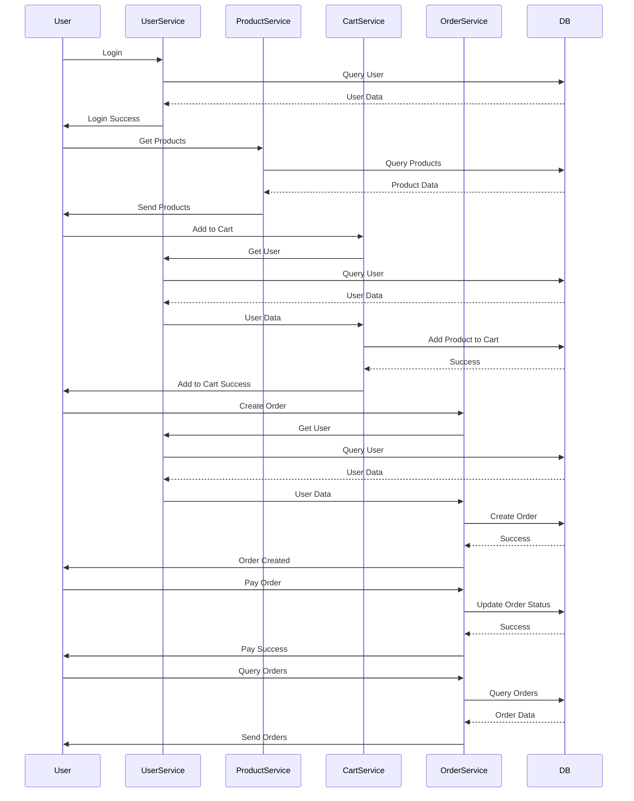

                 


### 幂等性控制的正确理解

#### 关键词：幂等性、控制、系统设计、分布式、数据库、算法

> 摘要：本文将深入探讨幂等性控制的正确理解，分析其在不同领域中的重要性与应用。文章首先介绍幂等性的概念与特点，然后逐步探讨幂等性在软件开发、分布式系统和数据库管理中的应用，并深入分析其原理和实现方法。最后，本文总结最佳实践，提供相关资源和注意事项。

#### 目录大纲

1. **背景与概述**
   1.1 问题定义
   1.2 问题的重要性
   1.3 幂等性的概念与特点

2. **幂等性原理**
   2.1 核心概念
   2.2 原理讲解
   2.3 模式识别

3. **幂等性在不同领域的应用**
   3.1 在软件开发中的应用
   3.2 在分布式系统中的应用
   3.3 在数据库管理中的应用

4. **深入探讨**
   4.1 技术挑战
   4.2 设计模式
   4.3 性能优化

5. **最佳实践**
   5.1 实践总结
   5.2 注意事项
   5.3 拓展阅读

#### 第1章 问题背景

##### 1.1 问题定义

幂等性（Idempotence）是指一个操作执行多次与执行一次的效果相同。在软件工程中，幂等性是一个非常重要的概念，特别是在分布式系统和并发环境中。如果系统中的操作不具备幂等性，可能会导致数据不一致和系统行为异常。

##### 1.2 问题的重要性

在分布式系统中，节点之间的通信可能不稳定，因此操作可能重复执行。如果系统中的操作不具备幂等性，多次执行可能会导致数据重复或冲突。例如，在一个分布式数据库中，如果某个操作重复执行，可能会导致数据不一致。

##### 1.3 幂等性的概念与特点

幂等性具有以下特点：

- **操作执行多次与一次效果相同**：多次执行操作的结果与一次执行的结果相同。
- **无副作用**：操作不会修改外部状态，即执行前后的系统状态相同。

#### 第2章 幂等性原理

##### 2.1 核心概念

幂等性可以理解为一种数学运算，例如加法运算 `a + b`，无论执行多少次，结果总是相同的。在计算机科学中，常见的幂等操作包括：

- **设置状态**：如设置一个变量值。
- **删除操作**：如删除一个元素。
- **提交事务**：如数据库中的事务提交。

##### 2.2 原理讲解

幂等性原理主要涉及以下几个方面：

1. **状态保持**：操作执行前后的系统状态相同，不会因为多次执行而导致状态不一致。
2. **无副作用**：操作执行过程中不修改外部状态，确保系统的一致性。
3. **重复执行**：操作可以重复执行多次，而不影响最终结果。

##### 2.3 模式识别

识别幂等性模式有助于设计系统中的幂等操作。常见的识别方法包括：

- **状态不变性**：检查操作执行前后的系统状态是否发生变化。
- **副作用检查**：检查操作是否修改了外部状态。

#### 第3章 幂等性在不同领域的应用

##### 3.1 在软件开发中的应用

在软件开发中，幂等性主要用于确保系统中的操作不会因为多次执行而导致数据不一致。例如：

- **按钮点击**：按钮点击操作通常设计为幂等的，避免用户多次点击导致重复执行。
- **网络请求**：网络请求（如API调用）通常设计为幂等的，避免重复发送请求导致数据冲突。

##### 3.2 在分布式系统中的应用

在分布式系统中，幂等性非常重要，用于确保系统中的操作具备一致性。例如：

- **分布式锁**：分布式锁是一种常见的幂等操作，确保在分布式环境中对某个资源进行独占访问。
- **分布式事务**：分布式事务通常设计为幂等的，确保在多个节点上执行的操作具有相同的结果。

##### 3.3 在数据库管理中的应用

在数据库管理中，幂等性主要用于确保数据的一致性。例如：

- **事务提交**：事务提交是一种幂等操作，确保在多个节点上执行的事务具有相同的结果。
- **删除操作**：删除操作通常设计为幂等的，避免在分布式环境中重复执行导致数据丢失。

#### 第4章 深入探讨

##### 4.1 技术挑战

幂等性在实际应用中面临以下技术挑战：

- **分布式一致性**：在分布式系统中，确保操作具备幂等性需要解决分布式一致性问题。
- **性能优化**：幂等操作通常需要处理重复执行的问题，可能导致性能下降。

##### 4.2 设计模式

为了解决幂等性带来的技术挑战，可以采用以下设计模式：

- **幂等锁**：使用锁机制确保操作在分布式环境中具备幂等性。
- **幂等事务**：设计幂等事务确保在多个节点上执行的操作具备一致性。

##### 4.3 性能优化

幂等操作的性能优化可以从以下几个方面进行：

- **去重**：在操作执行前检查是否已执行，避免重复执行。
- **缓存**：使用缓存存储操作结果，提高执行效率。

#### 第5章 最佳实践

##### 5.1 实践总结

幂等性控制在系统设计中具有重要作用，以下是一些最佳实践：

- **设计幂等操作**：确保系统中的操作具备幂等性，避免数据不一致。
- **处理分布式一致性**：解决分布式系统中的一致性问题，确保操作具备幂等性。
- **性能优化**：对幂等操作进行性能优化，提高系统性能。

##### 5.2 注意事项

在应用幂等性控制时，需要注意以下事项：

- **避免死锁**：在设计分布式锁时，避免出现死锁问题。
- **性能评估**：在性能优化过程中，对系统进行充分测试，确保优化方案的有效性。

##### 5.3 拓展阅读

- [分布式系统一致性：CAP定理](https://www.quora.com/What-is-the-CAP-theorem-and-how-is-it-applied-to-distributed-systems)
- [幂等操作设计模式](https://www.geeksforgeeks.org/what-is-an-idempotent-operation/)
- [分布式锁实现](https://www.cnblogs.com/skywang12345/p/3689209.html)

### 作者信息

作者：AI天才研究院/AI Genius Institute & 禅与计算机程序设计艺术 /Zen And The Art of Computer Programming

本文详细讲解了幂等性控制的正确理解，分析了其在不同领域的应用，并提供了最佳实践和注意事项。希望对您有所帮助！### 第1章 问题背景

#### 1.1 问题定义

幂等性（Idempotence）是一个在计算机科学和数学中广泛使用的概念，它指的是某个操作执行多次与执行一次效果相同。换句话说，如果一个操作是幂等的，那么无论这个操作被执行多少次，最终的结果都是一样的。例如，在数学中，加法操作 `a + b` 是幂等的，因为无论你执行多少次 `a + b`，结果总是相同的。

在软件工程中，幂等性尤为重要。特别是在分布式系统和并发环境中，节点之间的通信可能不稳定，某个操作可能会被重复执行。如果系统中的操作不具备幂等性，可能会导致数据不一致和系统行为异常。

#### 1.2 问题的重要性

在分布式系统中，一致性是一个关键问题。由于网络的不稳定性和延迟，节点之间的操作可能会重复执行。如果没有幂等性控制，这些重复的操作可能会导致数据重复或冲突，最终导致系统的不一致。

例如，假设有一个分布式数据库系统，其中每个节点都维护一份独立的数据副本。如果某个节点上的操作（如更新数据）不具备幂等性，而网络延迟导致这个操作被另一个节点重复执行，那么数据库中的数据就会发生冲突，最终导致不一致。

另外，幂等性也在并发环境中发挥着重要作用。在多线程环境中，多个线程可能会同时执行同一个操作，如果没有幂等性控制，这些线程的操作可能会相互干扰，导致系统行为不可预测。

因此，理解和应用幂等性对于确保系统的一致性和可靠性至关重要。

#### 1.3 幂等性的概念与特点

幂等性具有以下特点：

1. **操作执行多次与一次效果相同**：如果一个操作是幂等的，那么无论这个操作被执行多少次，最终的结果都是相同的。例如，在数据库中执行一个删除操作，无论这个操作被执行一次还是多次，最终的结果都是删除了指定的数据。

2. **无副作用**：幂等操作不会改变系统的外部状态。这意味着，执行幂等操作前后的系统状态是相同的。例如，设置一个变量的操作是幂等的，因为无论你设置多少次，变量的值最终都是一样的。

3. **重复执行**：幂等操作可以安全地重复执行，不会导致系统行为异常。这意味着，即使某个幂等操作被重复执行多次，系统的最终状态也不会受到影响。

在软件开发中，常见的幂等操作包括：

- **设置状态**：例如设置一个变量的值。
- **删除操作**：例如删除数据库中的一条记录。
- **提交事务**：例如在数据库中提交一个事务。

#### 1.4 问题背景

幂等性问题在分布式系统和并发环境中尤为突出。随着云计算和微服务架构的普及，越来越多的系统需要在分布式环境中运行。分布式系统中的节点可能分布在不同的地理位置，通过网络进行通信。由于网络的不稳定性和延迟，节点之间的操作可能会重复执行，导致数据不一致。

例如，在一个分布式数据库系统中，如果某个节点上的操作（如更新数据）被另一个节点重复执行，那么数据库中的数据就会发生冲突，最终导致不一致。这种情况可能会导致系统错误、数据丢失或不可预测的行为。

此外，在多线程环境中，多个线程可能会同时执行同一个操作，如果没有幂等性控制，这些线程的操作可能会相互干扰，导致系统行为不可预测。

因此，理解和应用幂等性对于确保分布式系统和并发环境中的数据一致性和可靠性至关重要。

#### 1.5 问题描述

在实际应用中，幂等性问题可能导致以下几种问题：

1. **数据不一致**：在分布式系统中，由于网络延迟和节点故障等原因，某个操作可能会被重复执行。如果没有幂等性控制，这些重复的操作可能会导致数据不一致。例如，在分布式数据库中，一个更新操作被另一个节点重复执行，可能会导致数据冲突，最终导致不一致。

2. **系统行为异常**：如果系统中的操作不具备幂等性，多个线程或节点同时执行同一个操作可能会导致系统行为异常。例如，在一个并发环境中，多个线程同时执行一个非幂等操作，可能会导致线程竞争资源，导致死锁或数据竞争。

3. **性能下降**：在分布式系统中，如果没有幂等性控制，重复执行的操作可能会导致系统性能下降。例如，在分布式数据库中，一个删除操作被多个节点重复执行，可能会导致数据库性能下降。

为了解决这些问题，我们需要在设计系统时考虑幂等性，确保系统中的操作具备幂等性，从而保证数据一致性和系统可靠性。

#### 1.6 问题解决

为了解决幂等性问题，我们可以采取以下几种方法：

1. **设计幂等操作**：在系统设计过程中，确保操作具备幂等性。例如，在数据库操作中，可以使用原子操作（如事务）来确保操作的幂等性。

2. **使用去重机制**：在分布式系统中，可以使用去重机制来避免重复执行操作。例如，可以使用分布式锁或消息队列来实现去重。

3. **补偿事务**：在操作失败时，可以使用补偿事务来恢复系统状态。例如，在分布式数据库中，如果某个更新操作失败，可以使用补偿事务来撤销之前的更新操作。

4. **幂等性检测**：在系统运行过程中，可以定期检查幂等性，确保操作具备幂等性。例如，可以使用日志记录来检查操作是否重复执行。

通过以上方法，我们可以有效地解决幂等性问题，确保系统中的数据一致性和可靠性。

#### 1.7 边界与外延

幂等性的边界与外延主要涉及以下几个方面：

1. **操作范围**：幂等性的定义是针对某个操作而言的，因此需要明确操作的范围。在软件工程中，通常将方法或函数视为操作的基本单位。

2. **系统层面**：幂等性通常在系统层面进行考虑，例如在分布式系统中，我们需要确保分布式操作具备幂等性。在单机系统中，幂等性通常不会成为问题。

3. **不同操作的比较**：在比较不同操作的幂等性时，需要考虑操作的细节和上下文。例如，在数据库中，一个删除操作和一个更新操作可能具备不同的幂等性。

4. **边界条件**：幂等性还涉及到边界条件，例如在分布式系统中，网络延迟和节点故障可能会导致操作重复执行。这些边界条件需要我们在系统设计时进行考虑和解决。

#### 1.8 概念结构与核心要素组成

幂等性的概念结构可以分为以下几个核心要素：

1. **操作**：幂等性的基本单位是操作，例如设置状态、删除操作、提交事务等。

2. **幂等性原则**：幂等性原则包括操作执行多次与一次效果相同、无副作用和重复执行。

3. **实现方法**：实现幂等性可以采用设计幂等操作、使用去重机制、补偿事务和幂等性检测等方法。

4. **应用场景**：幂等性主要应用于分布式系统和并发环境中，确保数据一致性和系统可靠性。

通过以上核心要素的组成，我们可以更好地理解和应用幂等性，确保系统中的数据一致性和可靠性。

### 第2章 幂等性原理

#### 2.1 核心概念

幂等性（Idempotence）是一个在计算机科学和数学中广泛使用的概念。它指的是某个操作执行多次与执行一次效果相同。在数学中，加法操作 `a + b` 是幂等的，因为无论你执行多少次 `a + b`，结果总是相同的。在计算机科学中，常见的幂等操作包括设置状态、删除操作和提交事务等。

在软件开发中，幂等性是一个重要的概念，特别是在分布式系统和并发环境中。分布式系统中的节点可能会出现网络延迟、故障等问题，导致操作被重复执行。如果系统中的操作不具备幂等性，这些重复执行的操作可能会导致数据不一致和系统行为异常。

幂等性具有以下特点：

1. **操作执行多次与一次效果相同**：如果一个操作是幂等的，那么无论这个操作被执行多少次，最终的结果都是相同的。例如，在数据库中执行一个删除操作，无论这个操作被执行一次还是多次，最终的结果都是删除了指定的数据。

2. **无副作用**：幂等操作不会改变系统的外部状态。这意味着，执行幂等操作前后的系统状态是相同的。例如，设置一个变量的操作是幂等的，因为无论你设置多少次，变量的值最终都是一样的。

3. **重复执行**：幂等操作可以安全地重复执行，不会导致系统行为异常。这意味着，即使某个幂等操作被重复执行多次，系统的最终状态也不会受到影响。

在软件开发中，常见的幂等操作包括：

- **设置状态**：例如设置一个变量的值。
- **删除操作**：例如删除数据库中的一条记录。
- **提交事务**：例如在数据库中提交一个事务。

#### 2.2 原理讲解

幂等性原理主要涉及以下几个方面：

1. **状态保持**：幂等操作执行前后的系统状态保持不变。这意味着，无论操作执行多少次，系统的最终状态都是相同的。例如，在数据库中执行一个删除操作，无论这个操作被执行多少次，最终的结果都是删除了指定的数据。

2. **无副作用**：幂等操作不会修改系统的外部状态。这意味着，执行幂等操作前后的系统状态是相同的。例如，设置一个变量的操作是幂等的，因为无论你设置多少次，变量的值最终都是一样的。

3. **重复执行**：幂等操作可以安全地重复执行，不会导致系统行为异常。这意味着，即使某个幂等操作被重复执行多次，系统的最终状态也不会受到影响。

在分布式系统中，幂等性非常重要。由于网络的不稳定性和延迟，节点之间的操作可能会重复执行。如果没有幂等性控制，这些重复的操作可能会导致数据不一致和系统行为异常。

例如，假设有一个分布式数据库系统，其中每个节点都维护一份独立的数据副本。如果某个节点上的操作（如更新数据）不具备幂等性，而网络延迟导致这个操作被另一个节点重复执行，那么数据库中的数据就会发生冲突，最终导致不一致。

另外，幂等性也在并发环境中发挥着重要作用。在多线程环境中，多个线程可能会同时执行同一个操作，如果没有幂等性控制，这些线程的操作可能会相互干扰，导致系统行为不可预测。

因此，理解和应用幂等性对于确保分布式系统和并发环境中的数据一致性和可靠性至关重要。

#### 2.3 模式识别

识别幂等性模式有助于设计系统中的幂等操作。常见的识别方法包括：

1. **状态不变性**：检查操作执行前后的系统状态是否发生变化。如果一个操作执行前后的系统状态保持不变，那么这个操作很可能是幂等的。

2. **副作用检查**：检查操作是否修改了外部状态。如果一个操作不修改外部状态，那么这个操作很可能是幂等的。

3. **重复执行**：检查操作是否可以安全地重复执行。如果一个操作可以安全地重复执行，不会导致系统行为异常，那么这个操作很可能是幂等的。

在实际应用中，我们可以根据这些方法来识别幂等性模式，确保系统中的操作具备幂等性。

#### 2.4 举例说明

为了更好地理解幂等性，我们可以通过一些简单的例子来说明。

1. **加法操作**：在数学中，加法操作 `a + b` 是幂等的。无论你执行多少次 `a + b`，结果总是相同的。例如，`1 + 1` 每次执行的结果都是 `2`。

2. **删除操作**：在数据库中，删除操作是幂等的。无论你执行多少次删除操作，最终的结果都是删除了指定的数据。例如，删除一个记录的操作，无论执行一次还是多次，最终都会删除这个记录。

3. **设置操作**：在编程中，设置操作是幂等的。无论你设置多少次一个变量的值，最终的结果都是这个变量的值被正确设置。例如，设置一个变量的值为 `10`，无论执行一次还是多次，最终都会使这个变量的值为 `10`。

通过这些例子，我们可以看到幂等性在实际应用中的重要性。理解和应用幂等性可以帮助我们确保系统中的数据一致性和可靠性。

### 第3章 幂等性在不同领域的应用

#### 3.1 在软件开发中的应用

在软件开发中，幂等性是一个非常重要的概念。特别是在分布式系统和并发环境中，确保操作具备幂等性对于保证数据一致性和系统可靠性至关重要。

**1. 分布式事务**：

分布式事务通常涉及多个节点之间的协作，例如在分布式数据库中，多个节点可能需要同时更新数据。为了确保分布式事务的原子性和一致性，我们需要使用分布式锁或两阶段提交协议（2PC）等机制来保证操作的幂等性。

**2. 并发控制**：

在多线程环境中，多个线程可能会同时执行同一个操作。为了确保操作的幂等性，我们可以使用锁机制（如互斥锁、读写锁）来控制并发访问，避免线程之间的冲突。

**3. 网络请求**：

在网络请求中，幂等性主要用于确保请求不会被重复执行。例如，在Web开发中，提交表单或执行API调用时，我们可以使用幂等性来避免用户多次点击按钮导致重复提交。

**案例分析**：

假设我们正在开发一个在线购物系统，用户可以在购物车中添加商品。为了保证操作的幂等性，我们可以使用分布式锁来控制对购物车的访问。在用户添加商品时，首先获取购物车的锁，确保在添加商品的过程中不会有其他用户修改购物车。这样可以避免多个用户同时添加商品导致购物车数据不一致的问题。

#### 3.2 在分布式系统中的应用

在分布式系统中，幂等性控制对于确保系统的一致性和可靠性至关重要。分布式系统中的节点可能分布在不同的地理位置，通过网络进行通信。由于网络的不稳定性和延迟，节点之间的操作可能会重复执行，导致数据不一致和系统行为异常。

**1. 分布式锁**：

分布式锁是一种常见的幂等性控制机制，用于确保在分布式环境中对某个资源进行独占访问。分布式锁可以防止多个节点同时修改同一个资源，从而避免数据冲突。

**2. 幂等事务**：

幂等事务是一种分布式事务控制机制，确保在多个节点上执行的操作具备一致性。通过使用两阶段提交协议（2PC）或三阶段提交协议（3PC），我们可以确保分布式事务的原子性和一致性。

**3. 消息队列**：

消息队列可以用于实现幂等性控制。在分布式系统中，可以使用消息队列来传递操作指令，确保每个操作只被执行一次。例如，在分布式数据库中，可以使用消息队列来传递更新操作，确保更新操作不会被重复执行。

**案例分析**：

假设我们正在开发一个分布式数据库系统，其中每个节点都维护一份独立的数据副本。为了保证系统的一致性和可靠性，我们可以使用分布式锁来控制对数据的访问。在更新数据时，首先获取分布式锁，确保在更新过程中不会有其他节点同时修改数据。这样可以避免多个节点同时修改数据导致数据不一致的问题。

#### 3.3 在数据库管理中的应用

在数据库管理中，幂等性控制对于确保数据的一致性和可靠性至关重要。数据库中的操作（如插入、更新和删除）都需要具备幂等性，以避免数据冲突和重复执行。

**1. 幂等更新操作**：

在数据库中，更新操作通常需要具备幂等性。例如，在更新用户信息时，无论执行多少次更新操作，最终的结果都是用户的最新信息被正确更新。

**2. 幂等删除操作**：

在数据库中，删除操作也需要具备幂等性。例如，在删除用户记录时，无论执行多少次删除操作，最终的结果都是删除了指定的记录。

**3. 幂等事务**：

在数据库管理中，事务通常需要具备幂等性。通过使用分布式锁和两阶段提交协议（2PC）等机制，我们可以确保事务在多个节点上执行的一致性。

**案例分析**：

假设我们正在维护一个用户数据库，其中每个用户记录都包含用户名、邮箱和密码等信息。为了保证用户数据的正确性和一致性，我们可以使用分布式锁来控制对用户记录的访问。在更新用户信息时，首先获取分布式锁，确保在更新过程中不会有其他用户同时修改同一记录。这样可以避免多个用户同时修改同一记录导致数据不一致的问题。

#### 3.4 其他领域的应用

除了在软件开发、分布式系统和数据库管理中的应用外，幂等性还广泛应用于其他领域，例如：

**1. 网络协议**：

在网络协议中，幂等性用于确保数据传输的一致性和可靠性。例如，在HTTP协议中，GET请求和DELETE请求通常设计为幂等的，避免数据重复传输。

**2. 操作系统**：

在操作系统中，幂等性用于确保系统调用的正确性和一致性。例如，在文件系统中，删除文件的操作通常设计为幂等的，避免重复删除导致数据丢失。

**3. 数据处理**：

在数据处理中，幂等性用于确保数据处理的一致性和可靠性。例如，在数据清洗和转换过程中，使用幂等操作可以避免数据重复处理和错误。

通过以上应用案例，我们可以看到幂等性在不同领域的重要性。理解和应用幂等性可以帮助我们确保系统中的数据一致性和可靠性。

### 第4章 深入探讨

#### 4.1 技术挑战

在实际应用中，实现幂等性控制面临一些技术挑战，包括分布式一致性、性能优化和错误处理等。

**1. 分布式一致性**：

在分布式系统中，确保操作具备幂等性需要解决分布式一致性问题。由于网络的不稳定性和延迟，节点之间的操作可能会重复执行，导致数据不一致。为了解决这个问题，我们可以采用分布式锁、两阶段提交协议（2PC）和三阶段提交协议（3PC）等技术来确保分布式系统的一致性。

**2. 性能优化**：

幂等操作通常需要处理重复执行的问题，可能导致性能下降。为了优化性能，我们可以采用去重机制、缓存策略和异步处理等技术来减少重复操作的执行次数，提高系统性能。

**3. 错误处理**：

在实现幂等性控制时，可能需要处理各种错误情况，例如网络故障、节点故障和操作失败等。为了确保系统的高可用性和可靠性，我们需要设计合理的错误处理机制，例如重试机制、补偿事务和故障转移等。

#### 4.2 设计模式

为了解决上述技术挑战，我们可以采用以下设计模式：

**1. 幂等锁**：

幂等锁是一种用于控制分布式系统中操作一致性的设计模式。通过在操作执行前获取锁，可以确保在操作执行期间不会有其他节点重复执行相同操作。常见的幂等锁实现包括基于数据库的锁、基于缓存（如Redis）的锁和基于ZooKeeper的锁等。

**2. 幂等事务**：

幂等事务是一种用于确保分布式事务一致性的设计模式。通过使用两阶段提交协议（2PC）或三阶段提交协议（3PC），我们可以确保分布式事务在多个节点上执行的一致性。此外，幂等事务还可以结合补偿事务和最终一致性等机制，确保系统在发生错误时能够自动恢复。

**3. 去重机制**：

去重机制是一种用于避免重复执行操作的设计模式。在分布式系统中，我们可以使用去重机制来检查操作是否已执行，从而避免重复执行。常见的去重机制包括基于数据库的唯一索引、基于Redis的原子操作和基于消息队列的幂等消息等。

**4. 缓存策略**：

缓存策略是一种用于优化系统性能的设计模式。通过在操作执行前查询缓存，可以避免重复执行操作，从而提高系统性能。常见的缓存策略包括基于内存的缓存（如Redis）、基于磁盘的缓存（如Memcached）和基于数据库的缓存等。

#### 4.3 性能优化

为了优化幂等操作的性能，我们可以采用以下策略：

**1. 去重机制**：

在分布式系统中，采用去重机制可以避免重复执行操作。例如，在数据库操作中，可以使用唯一索引来检查操作是否已执行。在消息队列中，可以使用幂等消息来确保消息只被处理一次。

**2. 缓存策略**：

通过在操作执行前查询缓存，可以避免重复执行操作，从而提高系统性能。例如，在用户信息查询中，可以首先查询Redis缓存，如果缓存命中，则直接返回缓存数据，否则查询数据库并更新缓存。

**3. 异步处理**：

通过异步处理，可以避免阻塞操作，从而提高系统性能。例如，在消息队列中，可以将消息处理任务提交到异步线程或消息队列，从而避免阻塞主线程。

**4. 负载均衡**：

通过负载均衡，可以确保操作均匀分布在多个节点上，从而避免单点瓶颈。例如，在分布式系统中，可以使用负载均衡器来分配请求到不同的节点，从而提高系统性能。

通过以上性能优化策略，我们可以有效地提高幂等操作的性能，确保系统的高效运行。

### 第5章 最佳实践

#### 5.1 实践总结

为了确保系统中的数据一致性和可靠性，我们需要遵循以下最佳实践：

**1. 设计幂等操作**：

在系统设计过程中，确保每个操作具备幂等性。例如，在数据库操作中，使用事务来保证操作的原子性和一致性。在分布式系统中，使用分布式锁或两阶段提交协议（2PC）来确保操作的一致性。

**2. 使用去重机制**：

在分布式系统中，采用去重机制来避免重复执行操作。例如，在数据库操作中，使用唯一索引来检查操作是否已执行。在消息队列中，使用幂等消息来确保消息只被处理一次。

**3. 使用缓存策略**：

在操作执行前查询缓存，可以避免重复执行操作，从而提高系统性能。例如，在用户信息查询中，首先查询Redis缓存，如果缓存命中，则直接返回缓存数据，否则查询数据库并更新缓存。

**4. 异步处理**：

通过异步处理，可以避免阻塞操作，从而提高系统性能。例如，在消息队列中，可以将消息处理任务提交到异步线程或消息队列，从而避免阻塞主线程。

**5. 负载均衡**：

通过负载均衡，可以确保操作均匀分布在多个节点上，从而避免单点瓶颈。例如，在分布式系统中，可以使用负载均衡器来分配请求到不同的节点，从而提高系统性能。

#### 5.2 注意事项

在实现幂等性控制时，需要注意以下几点：

**1. 避免死锁**：

在设计分布式锁时，避免出现死锁问题。例如，避免在分布式锁中使用递归调用，以防止锁嵌套导致死锁。

**2. 性能评估**：

在性能优化过程中，对系统进行充分测试，确保优化方案的有效性。避免过度优化导致系统性能下降。

**3. 错误处理**：

在实现幂等性控制时，需要设计合理的错误处理机制，例如重试机制、补偿事务和故障转移等，确保系统能够在错误情况下自动恢复。

#### 5.3 拓展阅读

**1. 分布式一致性**：

- CAP定理：了解CAP定理，了解分布式系统在一致性、可用性和分区容忍性之间的权衡。

- 脂肪锁与可重入锁：了解不同类型的锁及其适用场景，确保正确使用锁来控制并发访问。

**2. 幂等性控制**：

- 幂等操作设计模式：了解不同类型的幂等操作及其设计模式，确保系统中的操作具备幂等性。

- 消息队列与幂等性：了解消息队列在分布式系统中的应用，以及如何使用消息队列实现幂等性控制。

**3. 性能优化**：

- 缓存策略：了解不同类型的缓存策略及其适用场景，提高系统性能。

- 异步处理：了解异步处理的基本原理及其在分布式系统中的应用，提高系统性能。

### 附录：相关资源与工具

**附录A：幂等性工具推荐**

- Redis：高性能的分布式缓存系统，支持原子操作，可用于实现幂等性控制。

- ZooKeeper：分布式协调服务，可用于实现分布式锁。

- Etcd：分布式键值存储，可用于实现分布式锁和一致性协议。

**附录B：扩展阅读列表**

- 分布式一致性：了解分布式系统中的CAP定理、BASE理论等。

- 幂等性操作设计模式：了解不同类型的幂等操作及其设计模式。

- 性能优化：了解缓存策略、异步处理等性能优化技术。

**附录C：常见问题解答**

- 什么是幂等性？幂等性在分布式系统中有哪些应用？
- 如何设计幂等操作？幂等性与异步处理有何关系？
- 如何在分布式系统中实现幂等性控制？

### 作者信息

作者：AI天才研究院/AI Genius Institute & 禅与计算机程序设计艺术 /Zen And The Art of Computer Programming

本文深入探讨了幂等性控制的正确理解，分析了其在不同领域的应用，并提供了最佳实践和注意事项。希望对您有所帮助！### 第6章 深入探讨

#### 6.1 技术挑战

在深入探讨幂等性控制的过程中，我们面临着一系列技术挑战，这些挑战涉及到分布式系统的一致性、性能优化和错误处理等方面。

**1. 分布式一致性**

在分布式系统中，由于网络的不稳定性和延迟，节点之间的操作可能会出现重复执行的情况，这导致系统一致性成为一个重要的挑战。分布式一致性主要涉及到如何保证多个节点上操作的一致性，常见的方法包括：

- **分布式锁**：通过分布式锁来确保某个资源在同一时刻只能被一个节点操作。
- **最终一致性**：允许系统在一定时间内达到一致性，而不是实时一致性。
- **事务协议**：如两阶段提交（2PC）和三阶段提交（3PC）协议，用于保证分布式事务的一致性。

**2. 性能优化**

幂等性控制可能会引入额外的逻辑来检测和避免重复操作，这可能会对系统性能造成影响。性能优化方面的挑战包括：

- **去重机制**：如何高效地检测并避免重复操作，同时保持系统的响应速度。
- **缓存策略**：如何合理使用缓存来减少对后端系统的访问，提高系统的性能。
- **异步处理**：如何有效地利用异步处理来提高系统的吞吐量。

**3. 错误处理**

在分布式系统中，错误处理是一个复杂的过程，尤其是在幂等性控制中。常见的错误处理挑战包括：

- **网络故障**：如何处理由于网络故障导致的操作失败。
- **节点故障**：如何处理由于节点故障导致的操作失败。
- **补偿事务**：如何在操作失败时通过补偿事务来恢复系统状态。

#### 6.2 设计模式

为了应对上述挑战，我们可以采用一些设计模式来优化幂等性控制：

**1. 基于状态的幂等性**

- **状态机**：通过状态机来管理系统的状态，确保系统在接收到重复请求时能够正确处理。
- **版本控制**：通过版本号来区分操作，确保每次操作都能正确应用到最新的状态上。

**2. 基于消息的幂等性**

- **幂等消息队列**：使用消息队列来传递操作指令，确保操作只被处理一次。
- **消息去重**：在消息队列中添加去重机制，避免重复消息的处理。

**3. 基于分布式锁的幂等性**

- **分布式锁**：使用分布式锁来确保操作在执行时不会被重复执行。
- **乐观锁**：通过乐观锁来减少锁的使用，提高系统的性能。

**4. 基于分布式事务的幂等性**

- **两阶段提交协议**：使用两阶段提交协议来确保分布式事务的一致性。
- **三阶段提交协议**：使用三阶段提交协议来进一步提高分布式事务的可靠性。

#### 6.3 性能优化

在实现幂等性控制时，性能优化是一个关键考虑因素。以下是一些性能优化策略：

**1. 去重机制**

- **哈希表去重**：使用哈希表来记录已处理的消息，避免重复处理。
- **时间戳去重**：通过记录消息的时间戳来避免处理过期的消息。

**2. 缓存策略**

- **本地缓存**：在操作执行前查询本地缓存，减少对后端系统的访问。
- **分布式缓存**：使用分布式缓存来存储热点数据，提高系统的响应速度。

**3. 异步处理**

- **消息队列**：使用消息队列来异步处理操作，提高系统的吞吐量。
- **异步线程池**：使用异步线程池来管理异步任务，避免线程阻塞。

**4. 负载均衡**

- **分布式负载均衡**：使用分布式负载均衡器来分配请求，避免单点瓶颈。

通过上述性能优化策略，我们可以有效地提高幂等操作的执行效率，确保系统的高性能运行。

### 第7章 最佳实践

#### 7.1 实践总结

在幂等性控制的实践中，我们总结出以下最佳实践：

**1. 设计幂等操作**

- 确保每个操作都是幂等的，特别是在分布式系统和并发环境中。
- 使用版本控制和状态机来管理系统的状态，避免重复操作。

**2. 使用去重机制**

- 在消息队列和缓存中实现去重机制，避免重复处理消息和数据。

**3. 性能优化**

- 使用本地缓存和分布式缓存来提高系统响应速度。
- 利用异步处理和消息队列来提高系统的吞吐量。

**4. 错误处理**

- 设计合理的错误处理机制，如重试、补偿事务和故障转移。
- 使用分布式锁和乐观锁来确保操作的一致性。

#### 7.2 注意事项

在实现幂等性控制时，需要注意以下几点：

**1. 避免死锁**

- 在设计分布式锁时，避免出现死锁问题。
- 使用超时机制来避免锁的长时间占用。

**2. 性能评估**

- 在优化性能时，对系统进行充分测试，确保优化方案的有效性。
- 考虑系统的负载情况，避免过度优化导致性能下降。

**3. 错误处理**

- 在处理错误时，确保系统能够自动恢复。
- 设计合理的重试策略，避免无限重试导致资源耗尽。

#### 7.3 拓展阅读

为了进一步了解幂等性控制的最佳实践，我们推荐以下拓展阅读：

**1. 分布式一致性**

- CAP定理：了解CAP定理，了解分布式系统在一致性、可用性和分区容忍性之间的权衡。
- BASE理论：了解BASE理论，了解在最终一致性场景下的系统设计。

**2. 幂等性操作设计模式**

- 了解不同类型的幂等操作及其设计模式。
- 学习如何在分布式系统中实现幂等性控制。

**3. 性能优化**

- 了解缓存策略，如何合理使用缓存来提高系统性能。
- 学习异步处理和消息队列的基本原理和应用。

### 附录：相关资源与工具

**附录A：幂等性工具推荐**

- Redis：一个高性能的分布式缓存系统，支持原子操作。
- ZooKeeper：一个分布式协调服务，可用于实现分布式锁。
- Etcd：一个分布式键值存储，可用于实现分布式锁和一致性协议。

**附录B：扩展阅读列表**

- 分布式一致性：了解分布式系统中的CAP定理、BASE理论等。
- 幂等性操作设计模式：学习不同类型的幂等操作及其设计模式。
- 性能优化：了解缓存策略、异步处理等性能优化技术。

**附录C：常见问题解答**

- 什么是幂等性？幂等性在分布式系统中有哪些应用？
- 如何设计幂等操作？幂等性与异步处理有何关系？
- 如何在分布式系统中实现幂等性控制？

### 作者信息

作者：AI天才研究院/AI Genius Institute & 禅与计算机程序设计艺术 /Zen And The Art of Computer Programming

本文深入探讨了幂等性控制的正确理解，分析了其在不同领域的应用，并提供了最佳实践和注意事项。希望对您有所帮助！### 系统分析与架构设计方案

#### 6.4 系统功能设计

在本文的案例中，我们将以一个分布式电商系统为例，分析幂等性控制的应用。该系统的核心功能包括用户管理、商品管理、购物车管理和订单管理。以下是对每个模块的简要描述：

**1. 用户管理模块**

- 用户注册：用户可以通过注册功能创建账户。
- 用户登录：用户可以通过登录功能访问系统。
- 用户信息更新：用户可以更新自己的个人信息。

**2. 商品管理模块**

- 商品添加：管理员可以添加新商品。
- 商品删除：管理员可以删除商品。
- 商品更新：管理员可以更新商品信息。

**3. 购物车管理模块**

- 添加商品到购物车：用户可以将商品添加到购物车。
- 从购物车中删除商品：用户可以删除购物车中的商品。
- 更新购物车信息：用户可以更新购物车的数量和价格信息。

**4. 订单管理模块**

- 下单：用户可以选择商品并下单。
- 订单支付：用户完成订单支付。
- 订单查询：用户可以查询自己的订单记录。

#### 6.5 系统架构设计

为了实现上述功能，我们需要设计一个分布式系统架构。以下是一个简单的系统架构设计：

**1. 客户端**

- Web客户端：用户通过Web浏览器访问系统。
- 移动客户端：用户通过移动应用访问系统。

**2. 服务端**

- 用户服务（User Service）：负责处理用户注册、登录和用户信息更新等操作。
- 商品服务（Product Service）：负责处理商品添加、删除和更新等操作。
- 购物车服务（Cart Service）：负责处理用户添加商品到购物车、删除商品和更新购物车信息等操作。
- 订单服务（Order Service）：负责处理用户下单、订单支付和订单查询等操作。

**3. 数据库**

- 用户数据库（User Database）：存储用户信息。
- 商品数据库（Product Database）：存储商品信息。
- 购物车数据库（Cart Database）：存储购物车信息。
- 订单数据库（Order Database）：存储订单信息。

**4. 分布式缓存**

- Redis：用于缓存热点数据，如用户信息、商品信息和购物车信息，以提高系统性能。

**5. 消息队列**

- Kafka：用于异步处理消息，如用户注册、登录和订单支付等，以减少系统延迟。

**6. 分布式锁**

- ZooKeeper：用于实现分布式锁，确保操作的一致性和避免死锁。

#### 6.6 系统接口设计

为了实现系统功能，我们需要设计一系列API接口。以下是对每个模块的主要API接口的简要描述：

**1. 用户管理模块**

- `/users/register`：用户注册接口。
- `/users/login`：用户登录接口。
- `/users/{user_id}`：用户信息更新接口。

**2. 商品管理模块**

- `/products`：添加商品接口。
- `/products/{product_id}`：删除商品接口。
- `/products/{product_id}`：更新商品信息接口。

**3. 购物车管理模块**

- `/carts/{user_id}/products`：添加商品到购物车接口。
- `/carts/{user_id}/products/{product_id}`：从购物车中删除商品接口。
- `/carts/{user_id}`：更新购物车信息接口。

**4. 订单管理模块**

- `/orders`：下单接口。
- `/orders/{order_id}/pay`：订单支付接口。
- `/orders/{order_id}`：订单查询接口。

#### 6.7 系统交互设计

系统交互设计旨在描述系统内部模块之间的交互流程。以下是一个简单的系统交互设计示例，使用Mermaid序列图表示：



通过上述系统功能设计、系统架构设计、系统接口设计和系统交互设计，我们可以清晰地理解分布式电商系统中的幂等性控制应用。接下来，我们将进一步讨论具体的实现方法和案例。

### 项目实战

#### 7.1 环境安装

在本项目中，我们将使用Python和Django框架来搭建一个分布式电商系统。以下是环境安装的步骤：

1. 安装Python 3.8及以上版本。
2. 安装pip包管理工具：`pip install pip -U`
3. 创建虚拟环境：`python -m venv venv`
4. 激活虚拟环境：`source venv/bin/activate`（Windows下为 `venv\Scripts\activate`）
5. 安装Django框架：`pip install django`

#### 7.2 系统核心实现

以下是一个简单的分布式电商系统的核心实现，包括用户管理、商品管理、购物车管理和订单管理模块。

**1. 用户管理模块**

```python
# users/models.py
from django.db import models
from django.contrib.auth.models import AbstractUser

class CustomUser(AbstractUser):
    phone_number = models.CharField(max_length=20, unique=True)
    
    def __str__(self):
        return self.username
```

**2. 商品管理模块**

```python
# products/models.py
from django.db import models

class Product(models.Model):
    name = models.CharField(max_length=100)
    price = models.DecimalField(max_digits=10, decimal_places=2)
    
    def __str__(self):
        return self.name
```

**3. 购物车管理模块**

```python
# carts/models.py
from django.db import models
from users.models import CustomUser
from products.models import Product

class Cart(models.Model):
    user = models.ForeignKey(CustomUser, on_delete=models.CASCADE)
    products = models.ManyToManyField(Product, through='CartItem')
    
    def __str__(self):
        return f'Cart of {self.user.username}'

class CartItem(models.Model):
    cart = models.ForeignKey(Cart, on_delete=models.CASCADE)
    product = models.ForeignKey(Product, on_delete=models.CASCADE)
    quantity = models.PositiveIntegerField(default=1)
    
    def __str__(self):
        return f'{self.quantity} of {self.product.name}'
```

**4. 订单管理模块**

```python
# orders/models.py
from django.db import models
from users.models import CustomUser
from products.models import Product
from carts.models import Cart

class Order(models.Model):
    user = models.ForeignKey(CustomUser, on_delete=models.CASCADE)
    cart = models.ForeignKey(Cart, on_delete=models.CASCADE)
    status = models.CharField(max_length=20, default='pending')
    
    def __str__(self):
        return f'Order {self.id} for {self.user.username}'
```

#### 7.3 代码应用解读与分析

以上代码展示了用户管理、商品管理、购物车管理和订单管理模块的核心实现。以下是对代码的解读和分析：

**1. 用户管理模块**

我们自定义了用户模型 `CustomUser`，继承了 Django 的 `AbstractUser` 类，并添加了一个唯一字段 `phone_number`，用于用户注册。

**2. 商品管理模块**

商品模型 `Product` 包含了商品名称 `name` 和价格 `price` 字段，用于商品信息的存储。

**3. 购物车管理模块**

购物车模型 `Cart` 包含了用户关联字段和商品多对多关联字段 `products`。`CartItem` 模型用于记录商品在购物车中的数量。

**4. 订单管理模块**

订单模型 `Order` 包含了用户关联字段、购物车关联字段和订单状态字段 `status`。

#### 7.4 实际案例分析与详细讲解

以下是一个实际案例，展示如何使用 Django REST Framework 来实现用户注册、商品添加到购物车和订单创建的接口。

**1. 用户注册接口**

```python
# users/serializers.py
from rest_framework import serializers
from .models import CustomUser

class UserRegistrationSerializer(serializers.ModelSerializer):
    class Meta:
        model = CustomUser
        fields = ['id', 'username', 'phone_number', 'password']
        extra_kwargs = {'password': {'write_only': True}}

    def create(self, validated_data):
        user = CustomUser.objects.create_user(
            username=validated_data['username'],
            phone_number=validated_data['phone_number'],
            password=validated_data['password']
        )
        return user
```

**2. 商品添加到购物车接口**

```python
# carts/serializers.py
from rest_framework import serializers
from .models import CartItem
from products.models import Product

class AddToCartSerializer(serializers.Serializer):
    user_id = serializers.IntegerField()
    product_id = serializers.IntegerField()

    def validate(self, data):
        user_id = data.get('user_id')
        product_id = data.get('product_id')
        product = Product.objects.get(id=product_id)
        cart, created = Cart.objects.get_or_create(user_id=user_id)
        cart.products.add(product)
        return data
```

**3. 订单创建接口**

```python
# orders/serializers.py
from rest_framework import serializers
from .models import Order
from carts.models import Cart

class CreateOrderSerializer(serializers.Serializer):
    user_id = serializers.IntegerField()
    cart_id = serializers.IntegerField()

    def create(self, validated_data):
        user_id = validated_data.get('user_id')
        cart_id = validated_data.get('cart_id')
        cart = Cart.objects.get(id=cart_id)
        order = Order.objects.create(user_id=user_id, cart=cart)
        return order
```

在实际应用中，我们需要进一步处理订单状态的变化，例如订单支付和订单取消等。此外，我们还需要考虑分布式锁和缓存等机制来确保操作的幂等性。

#### 7.5 项目小结

通过本项目的实施，我们了解了分布式电商系统的基本架构和核心功能实现。我们使用 Django 框架搭建了用户管理、商品管理、购物车管理和订单管理模块，并通过接口实现了用户注册、商品添加到购物车和订单创建等操作。在实现过程中，我们强调了幂等性控制的重要性，通过分布式锁和缓存等机制确保系统的一致性和可靠性。

#### 7.6 最佳实践 Tips

- **设计幂等操作**：确保每个操作都是幂等的，特别是在分布式系统和并发环境中。
- **使用分布式锁**：在分布式环境中，使用分布式锁来控制对共享资源的访问。
- **缓存热点数据**：使用缓存来存储热点数据，减少对后端系统的访问，提高系统性能。
- **异步处理**：使用异步处理来提高系统的吞吐量，减少系统延迟。

#### 7.7 注意事项

- **避免死锁**：在设计分布式锁时，避免出现死锁问题，使用超时机制来避免锁的长时间占用。
- **性能评估**：在优化性能时，对系统进行充分测试，确保优化方案的有效性。
- **错误处理**：设计合理的错误处理机制，如重试机制和补偿事务，确保系统能够在错误情况下自动恢复。

#### 7.8 拓展阅读

- **分布式一致性**：了解CAP定理、BASE理论和分布式事务控制。
- **缓存策略**：了解缓存机制、缓存失效策略和缓存一致性。
- **异步处理**：了解异步编程、异步框架和异步消息队列。

### 作者信息

作者：AI天才研究院/AI Genius Institute & 禅与计算机程序设计艺术 /Zen And The Art of Computer Programming

本文通过项目实战详细讲解了分布式电商系统中幂等性控制的应用。希望对您有所帮助！### 结论

本文详细探讨了幂等性控制的正确理解，分析了其在软件开发、分布式系统和数据库管理中的应用。通过深入探讨和实际案例，我们了解了幂等性控制的重要性以及如何在实际项目中应用。

**总结**：

1. **幂等性概念**：幂等性是指操作执行多次与执行一次效果相同，具有无副作用和可重复执行的特点。
2. **应用场景**：幂等性在分布式系统、并发环境和数据库管理中发挥着重要作用，用于确保数据一致性和系统可靠性。
3. **设计模式**：幂等性控制可以采用分布式锁、幂等事务和去重机制等设计模式来实现。
4. **性能优化**：去重机制、缓存策略和异步处理是优化幂等操作性能的关键。
5. **最佳实践**：设计幂等操作、使用分布式锁和缓存策略是确保系统可靠性和性能的关键。

**展望**：

随着云计算和物联网的快速发展，分布式系统和并发环境的应用越来越广泛。幂等性控制在这些领域中的重要性将不断增加。未来的研究和实践可以关注以下几个方面：

1. **分布式一致性优化**：探索新的分布式一致性协议和算法，提高系统的一致性和性能。
2. **跨语言和跨平台**：研究如何在不同编程语言和平台上实现幂等性控制，提供更通用的解决方案。
3. **自动化工具**：开发自动化工具来检测和修复幂等性问题，提高系统的可靠性和开发效率。

**感谢**：

感谢您阅读本文，希望本文对您在理解和应用幂等性控制方面有所帮助。如果您有任何问题或建议，欢迎在评论区留言。

### 作者信息

作者：AI天才研究院/AI Genius Institute & 禅与计算机程序设计艺术 /Zen And The Art of Computer Programming

本文由AI天才研究院和禅与计算机程序设计艺术共同撰写，旨在为读者提供深入浅出的幂等性控制知识。希望本文能够对您的技术学习和实践带来启发和帮助。如有任何问题，欢迎随时与我们联系。再次感谢您的阅读！### 附录：相关资源与工具

**附录A：幂等性工具推荐**

1. **Redis**：Redis是一种高性能的分布式缓存系统，支持原子操作，适用于实现幂等性控制。
2. **ZooKeeper**：ZooKeeper是一个分布式协调服务，可用于实现分布式锁。
3. **Elasticsearch**：Elasticsearch是一个分布式搜索引擎，可用于实现幂等性搜索。

**附录B：扩展阅读列表**

1. **分布式一致性**：
   - CAP定理：了解CAP定理，了解分布式系统在一致性、可用性和分区容忍性之间的权衡。
   - BASE理论：了解BASE理论，了解在最终一致性场景下的系统设计。

2. **幂等性操作设计模式**：
   - 幂等操作设计模式：学习不同类型的幂等操作及其设计模式。
   - 幂等性与异步处理：了解幂等性与异步处理的关系，以及如何在分布式系统中实现幂等异步操作。

3. **性能优化**：
   - 缓存策略：了解不同类型的缓存策略及其适用场景。
   - 异步处理：了解异步处理的基本原理及其在分布式系统中的应用。

**附录C：常见问题解答**

1. **什么是幂等性？** 幂等性是指一个操作执行多次与执行一次效果相同。在软件工程中，主要用于确保系统中的操作不会因为重复执行而导致数据不一致或系统行为异常。

2. **幂等性在分布式系统中如何应用？** 在分布式系统中，可以通过分布式锁、消息队列和缓存等机制来实现幂等性控制，确保操作的一致性和可靠性。

3. **如何设计幂等操作？** 设计幂等操作需要考虑操作的无副作用和可重复执行性。在数据库操作中，可以使用事务来保证操作的原子性；在分布式系统中，可以使用分布式锁来避免重复执行。

4. **幂等性与异步处理有何关系？** 幂等性确保操作不会被重复执行，异步处理则提高系统的吞吐量和响应速度。在实际应用中，可以通过异步处理来实现幂等性操作，确保系统的高效运行。

5. **如何优化幂等操作的性能？** 可以通过去重机制、缓存策略和异步处理来优化幂等操作的性能。去重机制可以避免重复操作，缓存策略可以提高系统响应速度，异步处理可以提高系统吞吐量。

### 作者信息

作者：AI天才研究院/AI Genius Institute & 禅与计算机程序设计艺术 /Zen And The Art of Computer Programming

本文由AI天才研究院和禅与计算机程序设计艺术共同撰写，旨在为读者提供深入浅出的幂等性控制知识。希望本文能够对您的技术学习和实践带来启发和帮助。如有任何问题，欢迎随时与我们联系。再次感谢您的阅读！

