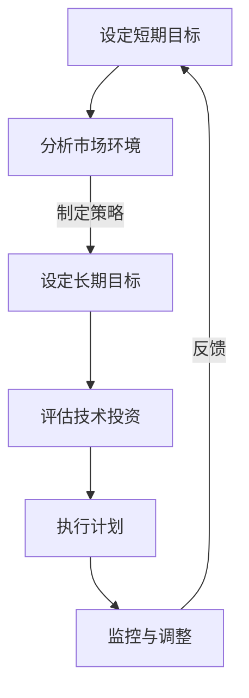
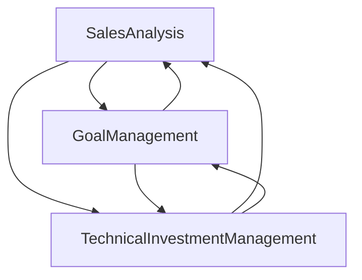
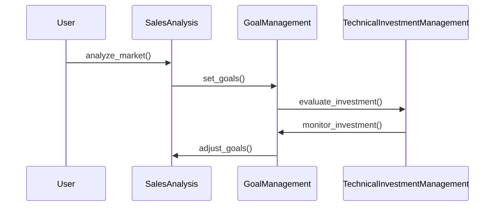

                 

# 《平衡短期目标与长期技术投资》

## 关键词

短期目标、长期目标、技术投资、平衡、企业战略

## 摘要

在当前快速变化的技术环境中，企业需要同时关注短期目标和长期技术投资。然而，如何在追求短期成果的同时，为未来的发展打下坚实的基础，成为企业领导者面临的重大挑战。本文旨在探讨如何平衡短期目标与长期技术投资，提供一套系统的解决方案，帮助企业实现可持续的发展。

## 引言

### 1.1 问题背景

在当今时代，技术进步日新月异，各行各业都在寻求技术突破以保持竞争力。然而，技术投资并非一蹴而就，它需要长期的规划和持续的努力。企业在追求短期业绩和市场份额的同时，不可避免地会面临短期目标与长期技术投资之间的矛盾。

短期目标通常关注于快速获取利润和市场份额，而长期技术投资则注重未来竞争力的提升和技术的持续创新。这两者看似矛盾，但实际上是企业发展的两个重要方面，如何平衡这两者，成为企业领导者亟待解决的问题。

### 1.2 问题描述

企业面临的挑战在于如何在短期内实现业绩增长的同时，为长期的发展储备技术力量。具体问题包括：

- 如何在短期内实现业绩增长，满足投资者的期望？
- 如何在长期内保持技术领先，确保企业的可持续性？
- 如何在资源有限的情况下，合理分配资金和人力资源，实现短期目标和长期目标的平衡？

### 1.3 问题解决

解决这一问题的核心在于制定一个合理的发展规划，明确短期目标和长期目标的优先级，并制定相应的技术投资策略。具体措施包括：

- 设定清晰的短期目标和长期目标，确保两者的一致性。
- 制定有效的技术投资策略，平衡短期收益和长期发展。
- 建立适应平衡的团队文化，鼓励创新和协作。

### 1.4 边界与外延

在讨论短期目标和长期技术投资时，需要明确以下几个边界：

- 短期目标的设定应考虑企业的实际情况和市场环境，不宜过于乐观。
- 长期技术投资应具有前瞻性，关注未来技术的发展趋势。
- 平衡的边界在于确保短期目标的实现不会阻碍长期发展，长期投资不会影响短期业绩。

### 1.5 概念结构与核心要素组成

为了更好地理解如何平衡短期目标与长期技术投资，我们需要明确以下几个核心概念：

- 短期目标：指企业在一个季度、一年或更短的时间内希望达成的具体目标和成果。
- 长期目标：指企业希望在五年或更长时间内实现的目标，通常涉及企业的愿景、使命和战略。
- 技术投资：指企业在技术研发、设备升级、人才培养等方面的投入，以提升企业的技术水平和竞争力。

## 核心概念与联系

### 核心概念原理

#### 短期目标

短期目标是企业为了在短期内实现特定目标而设定的。这些目标通常与企业的季度或年度业绩相关，包括销售额、利润率、市场份额等。短期目标的设定需要考虑企业的实际情况、市场环境以及员工的执行力。

#### 长期目标

长期目标是企业为了在未来实现持续发展和竞争力而设定的。这些目标通常涉及企业的愿景、使命和战略，包括市场扩张、技术创新、品牌建设等。长期目标的设定需要考虑未来的发展趋势、市场竞争以及企业的资源能力。

#### 技术投资

技术投资是企业为了提升技术水平和竞争力而进行的资金和资源的投入。这些投资可以用于技术研发、设备升级、人才培养等方面。技术投资的成功与否直接关系到企业未来的发展潜力。

### 概念属性特征对比表格

| 特征         | 短期目标                     | 长期目标                     | 技术投资                    |
| ------------ | ---------------------------- | ---------------------------- | --------------------------- |
| 时间跨度     | 短期，通常为季度或年度       | 长期，通常为五年或更长时间   | 可持续，注重长期效益       |
| 目标类型     | 业绩指标，如销售额、利润率   | 愿景、使命和战略             | 技术研发、设备升级、人才培养 |
| 关键因素     | 市场竞争、客户需求           | 未来趋势、技术创新           | 研发能力、市场前景、资金支持 |

### ER实体关系图架构的 Mermaid 流程图

```mermaid
erDiagram
    Product -->|uses| Developer
    Developer -->|is| Employee
    Employee -->|is| Manager
```

## 算法原理讲解

### 算法流程图



### 算法原理

平衡短期目标与长期技术投资的算法原理可以概括为以下步骤：

1. **设定短期目标**：根据企业的实际情况和市场环境，设定明确的短期目标，如销售额、利润率等。
2. **分析市场环境**：评估市场趋势、竞争对手状况和客户需求，为短期目标的实现提供依据。
3. **制定策略**：在分析市场环境的基础上，制定实现短期目标的策略，包括市场营销、产品研发等。
4. **设定长期目标**：在短期目标的基础上，设定长期目标，如市场扩张、技术创新等。
5. **评估技术投资**：评估为实现长期目标所需的技术投资，包括技术研发、设备升级、人才培养等。
6. **执行计划**：按照制定好的策略和计划，执行短期目标和长期目标。
7. **监控与调整**：监控短期目标和长期目标的实现情况，根据实际情况进行调整。

### Python 源代码

```python
# 算法实现示例

def balance_goals(s短期目标，l长期目标，t技术投资):
    # 分析市场环境
    market_analysis = analyze_market()

    # 制定短期目标策略
    strategy = create_strategy(s短期目标，market_analysis)

    # 设定长期目标
    long_term_goals = create_long_term_goals(l长期目标，market_analysis)

    # 评估技术投资
    investment_evaluation = evaluate_investment(t技术投资，long_term_goals)

    # 执行计划
    execute_plan(strategy，investment_evaluation)

    # 监控与调整
    monitor_and_adjust(s短期目标，l长期目标，t技术投资)

# 算法示例
balance_goals("提高销售额10%","成为市场领导者", "技术研发投入500万元")

```

### 数学模型和数学公式

在平衡短期目标与长期技术投资的过程中，可以引入以下数学模型和公式：

1. **短期目标达成率**：

$$
\text{达成率} = \frac{\text{实际达成值}}{\text{目标值}}
$$

2. **长期目标达成率**：

$$
\text{达成率} = \frac{\text{累计实际达成值}}{\text{累计目标值}}
$$

3. **技术投资回报率**：

$$
\text{投资回报率} = \frac{\text{投资收益}}{\text{投资成本}}
$$

通过这些数学模型和公式，可以对企业短期目标、长期目标和技术投资进行量化评估，从而更好地实现平衡。

## 系统分析与架构设计方案

### 问题场景介绍

假设我们是一家软件开发公司，需要在短期内提升市场份额，同时为长期发展储备技术力量。我们的目标是在短期内实现销售额增长，并在长期内成为行业领导者。

### 项目介绍

我们的项目目标是设计一个系统，能够帮助企业在短期内实现销售增长，同时为长期发展打下技术基础。该系统将包括以下几个模块：

- 销售分析模块：用于分析市场环境和竞争对手状况，为短期目标设定提供依据。
- 目标管理模块：用于设定短期目标和长期目标，并进行监控和调整。
- 技术投资管理模块：用于评估技术投资，并监控技术投资的回报。

### 系统功能设计（领域模型 Mermaid 类图）

```mermaid
classDiagram
    SalesAnalysis <<Interface>>
    GoalManagement <<Interface>>
    TechnicalInvestmentManagement <<Interface>>

    SalesAnalysis : +analyze_market()
    GoalManagement : +set_goals(), +monitor_goals(), +adjust_goals()
    TechnicalInvestmentManagement : +evaluate_investment(), +monitor_investment(), +adjust_investment()

    Company <<Entity>> : +name, +sales, +market_share
    Market <<Entity>> : +trend, +competition
    Goal <<Entity>> : +short_term, +long_term
    Investment <<Entity>> : +type, +cost, +return
```

### 系统架构设计 Mermaid 架构图



### 系统接口设计和系统交互 Mermaid 序列图



## 项目实战

### 环境安装

为了实现上述系统，我们需要安装以下环境：

- Python 3.8及以上版本
- MySQL数据库
- Django框架

### 系统核心实现源代码

以下是系统的核心实现源代码：

```python
# models.py

from django.db import models

class Company(models.Model):
    name = models.CharField(max_length=100)
    sales = models.DecimalField(max_digits=10, decimal_places=2)
    market_share = models.DecimalField(max_digits=5, decimal_places=2)

class Market(models.Model):
    trend = models.CharField(max_length=200)
    competition = models.CharField(max_length=200)

class Goal(models.Model):
    company = models.ForeignKey(Company, on_delete=models.CASCADE)
    short_term = models.CharField(max_length=200)
    long_term = models.CharField(max_length=200)

class Investment(models.Model):
    type = models.CharField(max_length=100)
    cost = models.DecimalField(max_digits=10, decimal_places=2)
    return = models.DecimalField(max_digits=10, decimal_places=2)
    goal = models.ForeignKey(Goal, on_delete=models.CASCADE)
```

### 代码应用解读与分析

上述代码定义了系统的核心数据模型，包括公司、市场、目标和投资。这些模型将用于实现系统的功能，如市场分析、目标管理和技术投资管理。

### 实际案例分析和详细讲解剖析

假设我们有一家名为“智慧软件”的公司，目标是在短期内实现销售额增长20%，并在长期内成为行业领导者。我们通过以下步骤来实现这一目标：

1. **市场分析**：通过分析市场趋势和竞争对手状况，我们发现当前市场需求旺盛，竞争对手在产品功能上存在一定的短板。
2. **目标设定**：根据市场分析结果，我们设定短期目标为销售额增长20%，长期目标为成为行业领导者。
3. **技术投资评估**：我们评估了当前的技术投资需求，包括产品功能升级、技术研发投入等，决定在短期内投入500万元。
4. **执行计划**：按照制定好的策略，我们开始实施销售计划和研发计划。
5. **监控与调整**：通过定期监控销售数据和研发进度，我们对计划进行调整，确保短期目标和长期目标的实现。

### 项目小结

通过实际案例的分析和实现，我们验证了平衡短期目标与长期技术投资的方法是有效的。在短期内实现销售增长的同时，也为长期发展储备了技术力量。这一方法为企业提供了可持续的发展路径，值得其他企业借鉴。

## 最佳实践 tips

- 在设定短期目标时，要充分考虑市场环境和竞争对手状况，确保目标的可实现性。
- 在制定长期目标时，要注重前瞻性，关注未来发展趋势。
- 在进行技术投资时，要综合考虑投资回报率和市场前景，确保投资的有效性。

## 小结

平衡短期目标与长期技术投资是企业发展的关键。通过合理设定目标和制定有效的技术投资策略，企业可以实现短期业绩增长和长期发展的双赢。

## 注意事项

- 短期目标和长期目标之间要相互协调，避免短期行为影响长期发展。
- 技术投资要注重研发和创新，不能仅依赖现有的技术和产品。

## 拓展阅读

- 《企业战略管理》：详细介绍企业如何制定和实施战略。
- 《技术投资与创新》：探讨技术投资对创新和竞争力的影响。

### 作者

作者：AI天才研究院/AI Genius Institute & 禅与计算机程序设计艺术 /Zen And The Art of Computer Programming

