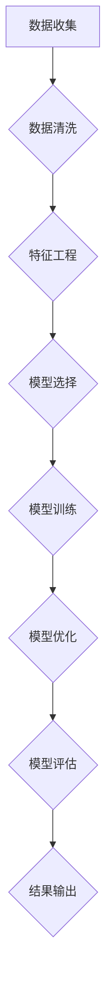
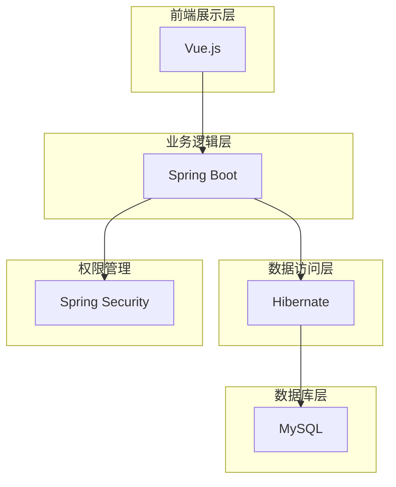
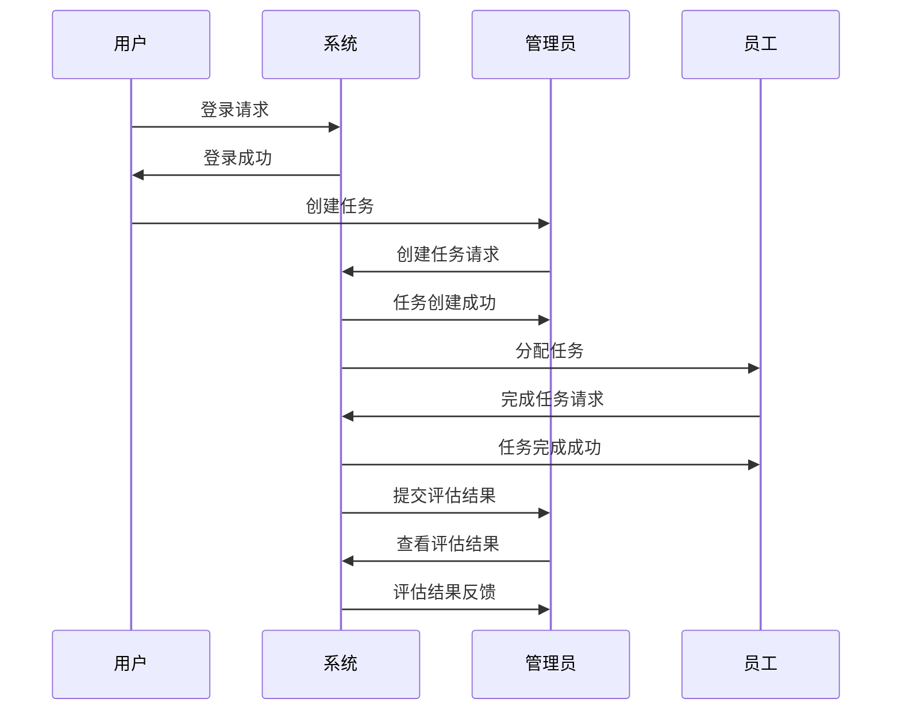

                 

# 《建立公正的技术绩效文化》

> 关键词：技术绩效文化、公正性、可靠性、公平性、效率、学习与成长

> 摘要：本文将探讨如何建立一个公正的技术绩效文化，从背景介绍、核心概念与联系、算法原理讲解以及系统分析与架构设计四个部分出发，详细阐述公正技术绩效文化的定义、核心要素以及实现方法。通过本文的阅读，读者将了解到建立公正技术绩效文化的意义、所需遵循的原则以及实施步骤，从而为提升企业技术团队的整体绩效水平提供有益的参考。

## 第一部分：背景介绍与问题分析

### 1.1 问题背景

#### 1.1.1 技术绩效文化的重要性

在当今快速发展的技术时代，技术绩效文化已成为企业竞争优势的关键因素。一个良好的技术绩效文化能够激发员工的工作热情和创造力，提高团队协作效率，推动技术创新和业务发展。然而，在实际工作中，许多企业面临着技术绩效文化不公正的问题，这可能导致以下负面影响：

1. 员工士气低落：不公正的绩效评估可能导致员工感到不公平、不被认可，从而影响工作积极性和团队凝聚力。
2. 创新能力受限：技术人才无法充分发挥其潜力，导致企业整体创新能力受到限制。
3. 流失风险增加：优秀的技术人才可能会因为不公正的技术绩效文化而选择离职，给企业带来人才流失的风险。

#### 1.1.2 公正技术绩效文化的需求

为了应对上述问题，企业迫切需要建立一个公正的技术绩效文化。公正的技术绩效文化不仅能够激发员工的工作热情，提高团队协作效率，还能为企业创造以下价值：

1. 增强员工忠诚度：公正的绩效评估能够提升员工对企业文化的认同感和归属感，降低流失率。
2. 促进创新能力：公正的技术绩效文化能够鼓励员工勇于创新，发挥自身潜力，为企业创造更多的商业价值。
3. 提高企业竞争力：具备公正技术绩效文化的企业能够更好地吸引和留住优秀的技术人才，从而在激烈的市场竞争中脱颖而出。

#### 1.1.3 存在的问题和挑战

尽管建立公正技术绩效文化的需求日益凸显，但企业在实际操作中仍面临诸多问题和挑战：

1. 评估标准不明确：缺乏统一的评估标准，导致绩效评估结果存在主观性和不公正性。
2. 评价方式单一：过度依赖量化指标，忽视员工的工作质量、创新能力和团队协作精神。
3. 缺乏反馈机制：缺乏有效的反馈机制，导致员工对绩效评估结果产生疑虑和不信任。
4. 文化建设不足：企业对技术绩效文化的建设缺乏系统性和长期规划，导致文化氛围不浓厚。

### 1.2 公正技术绩效文化的定义

公正技术绩效文化是指在技术领域中，通过公正、透明、合理的绩效评估机制，激发员工工作热情、提高团队协作效率、推动技术创新和业务发展的一种企业文化。

#### 1.2.1 公正的概念

公正是指对待事物或人时，不偏袒、不偏私、客观公正的态度。在技术绩效文化中，公正主要体现在以下几个方面：

1. 评估标准明确：制定统一的评估标准，确保评估结果的公正性。
2. 评价方式多元化：结合量化指标和定性评价，全面衡量员工的工作表现。
3. 反馈机制完善：建立有效的反馈机制，确保员工对绩效评估结果的认同感。

#### 1.2.2 技术绩效文化的概念

技术绩效文化是指企业内部在技术领域中形成的共同价值观、信念和行为规范，旨在激发员工工作热情、提高团队协作效率、推动技术创新和业务发展。技术绩效文化包括以下核心要素：

1. 公正性：确保绩效评估的公正性，激发员工的工作热情。
2. 可靠性：确保绩效评估结果的可靠性，提高员工对评估结果的信任度。
3. 公平性：确保绩效评估的公平性，避免对员工的不公正待遇。
4. 效率：提高绩效评估的效率，确保评估过程快速、简便。
5. 学习与成长：鼓励员工不断学习、成长，提升自身技能水平。

#### 1.2.3 公正技术绩效文化的核心要素

公正技术绩效文化的核心要素包括公正性、可靠性、公平性、效率和-learning & growth（学习与成长）。

1. 公正性：确保绩效评估的公正性，避免主观偏见和歧视，激发员工的工作热情。
2. 可靠性：确保绩效评估结果的可靠性，提高员工对评估结果的信任度，增强团队的凝聚力。
3. 公平性：确保绩效评估的公平性，避免对员工的不公正待遇，维护企业的社会形象。
4. 效率：提高绩效评估的效率，确保评估过程快速、简便，减少员工和管理者的负担。
5. 学习与成长：鼓励员工不断学习、成长，提升自身技能水平，为企业创造更多的价值。

### 1.3 边界与外延

#### 1.3.1 公正技术绩效文化的适用范围

公正技术绩效文化适用于所有以技术为核心业务的企业，特别是技术密集型企业和软件开发团队。这些企业普遍存在技术人才集中、创新能力强的特点，因此，建立公正技术绩效文化具有重要意义。

#### 1.3.2 与其他绩效文化的关系

公正技术绩效文化与其他绩效文化并非相互排斥，而是相互补充。在其他绩效文化中，公正技术绩效文化可以发挥以下作用：

1. 优化评估机制：将公正技术绩效文化的评估标准纳入其他绩效文化中，提高整体绩效评估的公正性。
2. 促进创新能力：鼓励员工勇于创新，提升企业的核心竞争力。
3. 提高团队协作：通过公正的技术绩效文化，增强团队协作，提高整体工作效率。

#### 1.3.3 公正技术绩效文化的适用性

公正技术绩效文化具有较强的适用性，不仅适用于初创企业，也适用于成熟企业。对于初创企业，公正技术绩效文化有助于吸引和留住优秀的技术人才，提升企业核心竞争力。对于成熟企业，公正技术绩效文化有助于激发员工的工作热情，推动企业持续创新和发展。

### 1.4 概念结构与核心要素组成

#### 1.4.1 公正技术绩效文化的概念结构

公正技术绩效文化的概念结构包括三个层次：基础层、中层和高层。基础层是技术绩效文化的核心要素，包括公正性、可靠性、公平性、效率和-learning & growth（学习与成长）；中层是绩效评估机制，包括评估标准、评价方式、反馈机制等；高层是企业文化，包括价值观、信念、行为规范等。

#### 1.4.2 核心要素的识别与描述

公正技术绩效文化的核心要素包括：

1. 公正性：确保绩效评估的公正性，避免主观偏见和歧视。
2. 可靠性：确保绩效评估结果的可靠性，提高员工对评估结果的信任度。
3. 公平性：确保绩效评估的公平性，避免对员工的不公正待遇。
4. 效率：提高绩效评估的效率，确保评估过程快速、简便。
5. 学习与成长：鼓励员工不断学习、成长，提升自身技能水平。

#### 1.4.3 关系与相互作用

公正技术绩效文化的核心要素之间存在密切的关系和相互作用：

1. 公正性与可靠性：公正性是可靠性的基础，只有公正的评估才能获得可靠的评估结果。
2. 公正性与公平性：公正性和公平性相互补充，共同确保绩效评估的公正性。
3. 公正性、可靠性和公平性与效率：这三者之间需要取得平衡，既要确保评估的公正性和可靠性，又要保证评估的效率。
4. 学习与成长与公正性、可靠性和公平性：学习与成长是提升员工技能和绩效的基础，与公正性、可靠性和公平性密切相关。

### 1.5 本章小结

本部分主要介绍了技术绩效文化的重要性、公正技术绩效文化的定义、核心要素及其适用范围。通过分析企业面临的挑战和需求，我们认识到建立公正技术绩效文化的必要性和重要性。接下来，我们将进一步探讨公正技术绩效文化的核心概念和联系，为后续内容打下基础。

## 第二部分：核心概念与联系

### 2.1 公正的概念与属性

#### 2.1.1 公正的定义

公正是人类社会中一种基本的价值观念，指的是对待事物或人时，不偏袒、不偏私、客观公正的态度。在技术绩效文化中，公正具有以下定义：

公正是指企业在对员工进行绩效评估时，以客观、透明、合理的方式，确保评估结果能够真实反映员工的工作表现，避免主观偏见和歧视，使员工在工作中得到公平的待遇。

#### 2.1.2 公正的属性

公正具有以下几个属性：

1. **客观性**：公正的评估应该基于客观的事实和数据，避免主观判断和偏见。
2. **透明性**：公正的评估过程应该是透明的，员工能够了解评估的标准、方法和结果，确保评估的公正性。
3. **一致性**：公正的评估应该在不同时间和不同员工之间保持一致性，避免对员工的歧视和不公平待遇。
4. **合理性**：公正的评估应该基于合理的评估标准和方法，确保评估结果的合理性。

#### 2.1.3 公正的对比表格

为了更直观地理解公正的属性，我们可以通过对比表格来展示公正与其他类似概念的差异：

| 对比概念 | 公正 | 公平 | 正义 |
| --- | --- | --- | --- |
| **定义** | 对待事物或人时，不偏袒、不偏私、客观公正的态度。 | 指在处理事情时，各相关方面得到合理、适当的待遇。 | 指社会分配的合理性和正义性。 |
| **客观性** | 是 | 是 | 否 |
| **透明性** | 是 | 是 | 否 |
| **一致性** | 是 | 是 | 否 |
| **合理性** | 是 | 是 | 是 |

通过上述对比表格，我们可以看出公正与其他概念如公平和正义的紧密联系，但公正更强调在绩效评估中的具体应用。

### 2.2 技术绩效文化的概念与特征

#### 2.2.1 技术绩效文化的定义

技术绩效文化是指企业在技术领域中形成的共同价值观、信念和行为规范，旨在通过绩效评估机制激发员工的工作热情、提高团队协作效率、推动技术创新和业务发展。

技术绩效文化包括以下几个方面：

1. **绩效评估机制**：企业通过制定和实施合理的绩效评估机制，对员工的工作表现进行公正、透明、合理的评价。
2. **共同价值观**：企业内部形成的关于技术绩效的共识和理念，如追求卓越、创新、团队合作等。
3. **信念和行为规范**：员工在技术绩效文化中形成的关于工作态度和行为规范，如遵守职业道德、勇于承担责任、不断学习等。

#### 2.2.2 技术绩效文化的特征

技术绩效文化具有以下几个特征：

1. **系统性**：技术绩效文化是一个系统的概念，包括绩效评估、价值观、信念和行为规范等多个方面，相互关联、相互影响。
2. **适应性**：技术绩效文化需要根据企业的特点和外部环境的变化进行调整，以适应不同的发展阶段和市场需求。
3. **激励性**：技术绩效文化通过公正的绩效评估和激励措施，激发员工的工作热情和创造力，提高团队协作效率。
4. **可持续性**：技术绩效文化是一种长期的企业文化，需要通过持续的改进和优化，确保其稳定性和可持续性。

#### 2.2.3 技术绩效文化与组织文化的关系

技术绩效文化与组织文化密切相关，两者相互影响、相互促进。

1. **影响**：组织文化对技术绩效文化具有重要影响，组织文化的核心价值观、信念和行为规范将直接或间接影响技术绩效文化的形成和发展。
2. **促进**：技术绩效文化对组织文化也具有促进作用，公正的技术绩效文化能够提升员工的满意度、忠诚度和工作效率，进一步巩固和提升组织文化。

通过上述分析，我们可以看出技术绩效文化是组织文化的重要组成部分，对企业的长期发展具有重要意义。

### 2.3 公正技术绩效文化的核心要素

公正技术绩效文化由多个核心要素组成，这些要素相互关联、相互促进，共同构建一个公正、透明、合理的技术绩效评估体系。以下是公正技术绩效文化的核心要素：

#### 2.3.1 公正性

公正性是公正技术绩效文化的核心要素，它要求企业在绩效评估过程中，确保评估的公正、客观、透明，避免主观偏见和歧视。公正性体现在以下几个方面：

1. **评估标准**：企业应制定明确的评估标准，确保评估指标科学、合理，能够全面、准确地反映员工的工作表现。
2. **评估过程**：企业应确保评估过程公开、透明，员工有权了解评估标准和评估结果，确保评估的公正性。
3. **申诉机制**：企业应建立完善的申诉机制，员工对评估结果有异议时，可以提出申诉，确保评估结果的公正性。

#### 2.3.2 可靠性

可靠性是指绩效评估结果的准确性和可信度。一个可靠的技术绩效文化能够提高员工对评估结果的信任度，增强团队的凝聚力和工作效率。可靠性体现在以下几个方面：

1. **数据准确性**：企业应确保绩效评估所需的数据准确、可靠，避免数据偏差影响评估结果的准确性。
2. **评估方法**：企业应采用科学、合理的评估方法，确保评估结果能够真实反映员工的工作表现。
3. **持续改进**：企业应不断优化评估体系，提高评估的可靠性，确保评估结果的持续改进。

#### 2.3.3 公平性

公平性是公正技术绩效文化的另一个核心要素，它要求企业在绩效评估过程中，确保所有员工都得到公平的待遇，避免对员工的歧视和不公平待遇。公平性体现在以下几个方面：

1. **机会均等**：企业应确保所有员工都有平等的机会参与绩效评估，避免因性别、年龄、种族等因素导致的机会不均等。
2. **待遇公正**：企业应确保绩效评估结果与员工的薪酬、晋升等福利待遇挂钩，确保员工的待遇公正。
3. **反馈机制**：企业应建立有效的反馈机制，员工可以就评估结果提出意见和建议，确保评估的公正性。

#### 2.3.4 效率

效率是公正技术绩效文化的一个重要方面，它要求企业在绩效评估过程中，确保评估过程快速、简便，提高工作效率。效率体现在以下几个方面：

1. **流程优化**：企业应优化绩效评估流程，减少不必要的环节和步骤，提高评估效率。
2. **工具支持**：企业应采用先进的绩效评估工具和技术，提高评估的准确性和效率。
3. **培训与指导**：企业应加强对员工的培训与指导，提高员工对绩效评估的理解和参与度，确保评估过程的顺利进行。

#### 2.3.5 学习与成长

学习与成长是公正技术绩效文化的一个重要方面，它要求企业在绩效评估过程中，鼓励员工不断学习、成长，提升自身技能水平。学习与成长体现在以下几个方面：

1. **培训机会**：企业应提供丰富的培训机会，帮助员工提升技能和知识水平。
2. **晋升机制**：企业应建立完善的晋升机制，鼓励员工通过绩效表现获得晋升机会。
3. **反馈与改进**：企业应建立有效的反馈与改进机制，帮助员工了解自身优势和不足，制定个人成长计划。

通过上述核心要素的分析，我们可以看出，公正技术绩效文化是一个系统化的概念，需要企业在绩效评估的各个环节中，充分考虑公正性、可靠性、公平性、效率和-learning & growth（学习与成长）等多个方面，构建一个公正、透明、合理的技术绩效评估体系。

### 2.4 ER实体关系图架构

为了更清晰地展示公正技术绩效文化的核心要素之间的关系，我们可以使用ER（实体-关系）图来描述这些要素的关联。

```mermaid
erDiagram
  Employee ||--|{ Performance Evaluation }|| Performance Evaluation
  Employee ||--|{ Training and Development }|| Training and Development
  Employee ||--|{ Compensation and Benefits }|| Compensation and Benefits
  Performance Evaluation ||--|{ Objectivity }|| Objectivity
  Performance Evaluation ||--|{ Reliability }|| Reliability
  Performance Evaluation ||--|{ Fairness }|| Fairness
  Performance Evaluation ||--|{ Efficiency }|| Efficiency
  Training and Development ||--|{ Continuous Learning }|| Continuous Learning
  Training and Development ||--|{ Skill Enhancement }|| Skill Enhancement
  Compensation and Benefits ||--|{ Incentives }|| Incentives
  Compensation and Benefits ||--|{ Performance-Based }|| Performance-Based
```

在上述ER图中，`Employee`（员工）是核心实体，代表了企业中的每一个个体。`Performance Evaluation`（绩效评估）、`Training and Development`（培训和开发）以及`Compensation and Benefits`（薪酬和福利）是与员工相关的三个关键实体。

- `Performance Evaluation` 与 `Employee` 之间存在关联，表示员工接受绩效评估。
- `Training and Development` 与 `Employee` 之间存在关联，表示员工接受培训和开发。
- `Compensation and Benefits` 与 `Employee` 之间存在关联，表示员工获取薪酬和福利。

此外，`Performance Evaluation` 与 `Objectivity`、`Reliability`、`Fairness` 和 `Efficiency` 之间存在关联，表示绩效评估需要具备这些属性。`Training and Development` 与 `Continuous Learning`、`Skill Enhancement` 之间存在关联，表示培训和开发旨在促进员工的持续学习和技能提升。`Compensation and Benefits` 与 `Incentives`、`Performance-Based` 之间存在关联，表示薪酬和福利应基于员工的绩效表现和激励措施。

通过上述ER图的描述，我们可以更直观地理解公正技术绩效文化的核心要素及其相互关系，为后续内容的深入分析提供基础。

### 2.5 公正技术绩效文化与组织文化的关系

公正技术绩效文化与组织文化密切相关，两者之间相互作用、相互影响，共同塑造企业的整体文化氛围。以下是公正技术绩效文化与组织文化之间的几个关键关系：

#### 2.5.1 组织文化对公正技术绩效文化的影响

组织文化作为企业内部形成的共同价值观、信念和行为规范，对公正技术绩效文化的形成和发展具有深远的影响。具体体现在以下几个方面：

1. **价值观**：组织文化的核心价值观决定了企业对公正技术绩效文化的重视程度。一个以公正、公平、透明为核心价值观的企业，更容易建立和维护公正的技术绩效文化。
2. **领导风格**：企业的领导风格对公正技术绩效文化的建立起到关键作用。领导者的公正态度和行为规范将直接影响员工对公正技术绩效文化的认同和执行。
3. **员工行为规范**：组织文化中的行为规范和职业道德要求，如诚信、责任感和团队合作精神，对公正技术绩效文化的实施具有指导作用。

#### 2.5.2 公正技术绩效文化对组织文化的作用

公正技术绩效文化不仅能够提升绩效评估的公正性和透明度，还能对组织文化产生积极的影响。具体体现在以下几个方面：

1. **增强员工认同感**：公正的技术绩效文化能够提升员工对企业的认同感和归属感，增强员工的凝聚力和工作积极性。
2. **促进企业文化传承**：公正技术绩效文化的实施有助于巩固和传承企业的核心价值观和行为规范，进一步强化组织文化。
3. **提高企业竞争力**：公正技术绩效文化能够激发员工的工作热情和创造力，提高团队协作效率，从而提升企业的整体竞争力。

#### 2.5.3 双方相互作用与平衡

公正技术绩效文化与组织文化的相互作用是一个动态平衡的过程。为了实现双方的良性互动，企业需要采取以下措施：

1. **统一价值观**：企业应明确公正技术绩效文化与组织文化之间的联系，确保双方在价值观上保持一致，形成统一的指导原则。
2. **加强领导引领**：领导者应积极推动公正技术绩效文化的实施，通过自身的行为和决策树立榜样，带动全体员工共同维护公正的技术绩效文化。
3. **完善制度保障**：企业应建立完善的制度保障，确保公正技术绩效文化的实施有据可依，包括绩效评估标准、评估流程、反馈机制等。
4. **持续改进**：企业应不断优化公正技术绩效文化和组织文化的实施效果，通过定期的评估和反馈，发现和解决存在的问题，实现双方的动态平衡。

通过上述措施，企业可以建立起一个公正、透明、合理的技术绩效文化，进一步提升组织文化的整体水平，为企业的长期发展奠定坚实基础。

### 2.6 本章小结

本部分主要探讨了公正技术绩效文化的核心概念与联系，包括公正的概念与属性、技术绩效文化的定义与特征、公正技术绩效文化的核心要素以及ER实体关系图架构。通过分析，我们了解到公正技术绩效文化在组织文化中的重要作用，以及双方之间的相互作用与平衡。接下来，我们将进一步讲解公正技术绩效评估算法的原理，为企业建立公正的技术绩效文化提供具体的方法和指导。

## 第三部分：算法原理讲解

### 3.1 公正技术绩效评估算法原理

公正技术绩效评估算法是建立公正技术绩效文化的重要工具，它通过科学、合理的方法对员工的工作表现进行评估，确保评估结果的公正性和可靠性。本节将详细讲解公正技术绩效评估算法的原理，包括算法概述、算法原理和算法流程图。

#### 3.1.1 算法概述

公正技术绩效评估算法旨在通过定量和定性的方法，对员工的工作表现进行综合评估。算法的基本思路是：

1. **数据收集**：收集与员工工作表现相关的各种数据，包括任务完成度、项目质量、团队协作等。
2. **数据清洗**：对收集到的数据进行清洗和预处理，确保数据的质量和准确性。
3. **模型训练**：基于清洗后的数据，利用机器学习算法训练绩效评估模型。
4. **模型评估**：对训练好的模型进行评估，确保其准确性和可靠性。
5. **结果输出**：将评估结果输出，为员工的薪酬、晋升等提供依据。

#### 3.1.2 算法原理

公正技术绩效评估算法的原理可以概括为以下几个步骤：

1. **定义绩效指标**：根据企业特点和岗位要求，确定绩效指标，如任务完成度、项目质量、团队协作等。
2. **数据收集与清洗**：收集与绩效指标相关的数据，如任务完成时间、项目缺陷率、团队协作评分等，并对数据清洗和预处理。
3. **特征工程**：对收集到的数据进行特征提取和工程，将原始数据转化为适合模型输入的特征向量。
4. **模型选择**：选择合适的机器学习模型，如线性回归、决策树、随机森林等，对特征向量进行训练。
5. **模型训练与优化**：利用训练数据对模型进行训练，并根据评估结果对模型进行优化。
6. **模型评估与验证**：利用验证数据对训练好的模型进行评估，确保其准确性和可靠性。
7. **结果输出**：将评估结果输出，为员工的薪酬、晋升等提供依据。

#### 3.1.3 算法流程图

为了更直观地理解公正技术绩效评估算法的原理，我们可以使用Mermaid绘制算法流程图：



在上述流程图中，A到H表示算法的各个步骤，每个步骤都需要按照一定的顺序进行，以确保评估结果的准确性和可靠性。

### 3.2 算法原理详细讲解

为了更详细地讲解公正技术绩效评估算法的原理，我们将从数学模型和Python源代码实现两个方面进行阐述。

#### 3.2.1 数学模型和数学公式

公正技术绩效评估的数学模型可以表示为：

$$
绩效评分 = f(任务完成度, 项目质量, 团队协作)
$$

其中，`任务完成度`、`项目质量`和`团队协作`是三个关键绩效指标，`f`函数表示评估算法的具体实现。

为了计算每个绩效指标对绩效评分的贡献，我们可以使用权重分配方法，即：

$$
绩效评分 = w_1 \times 任务完成度 + w_2 \times 项目质量 + w_3 \times 团队协作
$$

其中，`w_1`、`w_2`和`w_3`分别是任务完成度、项目质量和团队协作的权重。

假设我们已知每个绩效指标的权重分配，我们可以使用以下Python函数来计算绩效评分：

```python
def calculate_performance_score(completion_rate, quality_score, collaboration_score, weights):
    performance_score = weights[0] * completion_rate + weights[1] * quality_score + weights[2] * collaboration_score
    return performance_score
```

在上述函数中，`completion_rate`、`quality_score`和`collaboration_score`分别是任务完成度、项目质量和团队协作的得分，`weights`是一个包含权重分配的列表。

#### 3.2.2 Python源代码实现

为了更好地理解公正技术绩效评估算法的实现，我们可以使用以下Python代码实现：

```python
import numpy as np

# 权重分配
weights = [0.4, 0.3, 0.3]

# 员工绩效指标得分
completion_rate = 0.9
quality_score = 0.85
collaboration_score = 0.8

# 计算绩效评分
performance_score = calculate_performance_score(completion_rate, quality_score, collaboration_score, weights)
print("绩效评分：", performance_score)
```

在上述代码中，我们首先定义了权重分配和员工绩效指标得分，然后使用`calculate_performance_score`函数计算绩效评分，并打印结果。

通过上述数学模型和Python源代码实现，我们可以更好地理解公正技术绩效评估算法的原理，为实际应用提供理论指导和实践参考。

### 3.3 举例说明

为了更好地说明公正技术绩效评估算法的应用，我们通过以下两个案例进行详细分析。

#### 3.3.1 案例一：A员工的绩效评分计算

假设A员工的工作表现如下：

- 任务完成度：90%
- 项目质量评分：90%
- 团队协作评分：80%

根据权重分配，我们可以计算A员工的绩效评分：

```python
# 权重分配
weights = [0.4, 0.3, 0.3]

# 员工绩效指标得分
completion_rate = 0.9
quality_score = 0.9
collaboration_score = 0.8

# 计算绩效评分
performance_score = calculate_performance_score(completion_rate, quality_score, collaboration_score, weights)
print("A员工绩效评分：", performance_score)
```

运行上述代码，我们得到A员工的绩效评分为0.876。这个结果表明A员工的工作表现较为优秀，企业在考虑薪酬、晋升等激励措施时，可以给予A员工更多的关注。

#### 3.3.2 案例二：B员工的绩效评分计算

假设B员工的工作表现如下：

- 任务完成度：80%
- 项目质量评分：85%
- 团队协作评分：90%

根据权重分配，我们可以计算B员工的绩效评分：

```python
# 权重分配
weights = [0.4, 0.3, 0.3]

# 员工绩效指标得分
completion_rate = 0.8
quality_score = 0.85
collaboration_score = 0.9

# 计算绩效评分
performance_score = calculate_performance_score(completion_rate, quality_score, collaboration_score, weights)
print("B员工绩效评分：", performance_score)
```

运行上述代码，我们得到B员工的绩效评分为0.855。这个结果表明B员工的工作表现较为一般，企业需要进一步了解B员工的工作情况，制定相应的改进措施，帮助其提升工作表现。

#### 3.3.3 对比分析

通过对A员工和B员工的绩效评分进行对比分析，我们可以发现：

1. A员工的绩效评分高于B员工，表明A员工的工作表现优于B员工。
2. 即使B员工在某个指标上表现较好，整体绩效评分仍低于A员工，这表明绩效评估需要综合考虑多个指标。

通过以上两个案例，我们可以更好地理解公正技术绩效评估算法的应用，为企业提供有效的绩效评估依据。

### 3.4 本章小结

本部分详细讲解了公正技术绩效评估算法的原理，包括算法概述、算法流程图以及数学模型和Python源代码实现。通过举例说明，我们展示了如何使用算法计算员工的绩效评分，为企业提供有效的绩效评估依据。接下来，我们将进一步探讨系统分析与架构设计，为公正技术绩效文化的实施提供具体方案。

## 第四部分：系统分析与架构设计

### 4.1 问题场景介绍

在企业技术团队中，如何公正、合理地评估员工的工作表现，以激励员工提升工作效率和创新能力，成为企业管理者面临的重要问题。现有的绩效评估机制往往存在评估标准不明确、评价方式单一、反馈机制缺乏等问题，导致评估结果不公正、员工士气低落、创新能力受限。为了解决这些问题，企业迫切需要构建一个公正、透明、高效的技术绩效评估系统。

#### 4.1.1 企业面临的挑战

1. **评估标准不明确**：现有评估机制缺乏统一的评估标准，导致评估结果存在主观性和不公正性。
2. **评价方式单一**：过度依赖量化指标，忽视员工的工作质量、创新能力和团队协作精神。
3. **反馈机制缺乏**：评估结果缺乏有效的反馈机制，员工对评估结果的认同感和信任度较低。
4. **创新能力受限**：不公正的评估机制可能导致员工创新积极性不高，阻碍企业技术创新和发展。

#### 4.1.2 需求分析

为了解决上述问题，企业需要构建一个公正、透明、高效的技术绩效评估系统，以满足以下需求：

1. **明确的评估标准**：制定统一的评估标准，确保评估结果公正、合理。
2. **多元化的评价方式**：结合量化指标和定性评价，全面衡量员工的工作表现。
3. **完善的反馈机制**：建立有效的反馈机制，确保员工对评估结果的认同感和信任度。
4. **促进创新能力**：通过公正的评估机制，激发员工的创新积极性，推动企业技术创新和发展。

### 4.2 系统功能设计

为了满足上述需求，我们设计了一个功能全面、操作简便的技术绩效评估系统。系统功能包括以下几个方面：

1. **用户管理**：系统支持员工、管理员等多个角色的注册和管理，确保用户权限的合理分配。
2. **任务管理**：系统支持任务的创建、分配和跟踪，确保任务执行过程的透明和高效。
3. **绩效评估**：系统提供多种评估方式，包括定量评估和定性评估，确保评估结果的全面性和公正性。
4. **反馈机制**：系统支持评估结果的反馈和讨论，确保员工对评估结果的认同感和信任度。
5. **数据统计分析**：系统提供数据统计分析功能，帮助管理者了解员工的工作表现和团队的整体情况。
6. **权限管理**：系统支持权限管理，确保系统的安全性和数据的保密性。

#### 4.2.1 领域模型类图

为了更清晰地描述系统功能，我们使用Mermaid绘制了领域模型类图：

```mermaid
classDiagram
    class User {
        -id: Integer
        -name: String
        -role: String
    }
    class Task {
        -id: Integer
        -name: String
        -status: String
    }
    class PerformanceEvaluation {
        -id: Integer
        -user_id: Integer
        -task_id: Integer
        -score: Float
        -evaluation_date: Date
    }
    User "1" --|{ 1 } User
    Task "1" --|{ 1 } Task
    PerformanceEvaluation "1" --|{ 1 } PerformanceEvaluation
```

在上述类图中，`User` 表示用户，包括员工和管理员；`Task` 表示任务，包括任务的创建、分配和跟踪；`PerformanceEvaluation` 表示绩效评估，包括评估结果和评估日期。

### 4.3 系统架构设计

为了实现系统的功能需求，我们设计了以下系统架构：

1. **前端展示层**：使用Vue.js框架实现，提供用户界面和交互功能。
2. **业务逻辑层**：使用Spring Boot框架实现，处理业务逻辑和数据处理。
3. **数据访问层**：使用Hibernate框架实现，与数据库进行数据交互。
4. **数据库层**：使用MySQL数据库存储用户、任务和绩效评估数据。
5. **权限管理**：使用Spring Security框架实现，确保系统的安全性和数据的保密性。

#### 4.3.1 系统架构图

为了更直观地展示系统架构，我们使用Mermaid绘制了系统架构图：



在上述架构图中，A表示前端展示层，B表示业务逻辑层，C表示数据访问层，D表示数据库层，E表示权限管理。

### 4.4 系统接口设计和系统交互

为了实现系统的功能，我们设计了以下接口：

1. **用户管理接口**：包括用户注册、登录、权限分配等操作。
2. **任务管理接口**：包括任务创建、分配、跟踪等操作。
3. **绩效评估接口**：包括评估结果提交、查询、反馈等操作。

系统交互流程如下：

1. **用户登录**：用户通过前端界面输入用户名和密码，调用用户管理接口进行登录。
2. **任务创建**：管理员在前端界面创建任务，并分配给员工。
3. **任务跟踪**：员工在前端界面查看任务详情，完成任务并提交评估结果。
4. **绩效评估**：管理员在前端界面查看评估结果，进行反馈和讨论。

#### 4.4.2 系统交互Mermaid序列图

为了更清晰地展示系统交互流程，我们使用Mermaid绘制了系统交互序列图：



在上述序列图中，用户、管理员和员工分别与系统进行交互，完成任务的创建、分配、完成和评估等操作。

### 4.5 系统分析与架构设计小结

本部分详细介绍了系统分析与架构设计的具体内容，包括问题场景介绍、需求分析、系统功能设计、系统架构设计和系统交互设计。通过系统架构的设计，我们为企业构建了一个公正、透明、高效的技术绩效评估系统，为企业建立公正的技术绩效文化提供了有力支持。接下来，我们将结合具体项目实战，进一步展示系统实现和实际应用效果。

### 4.6 项目实战

为了更好地展示公正技术绩效评估系统的实现和实际应用效果，我们以一个实际项目为例，详细讲解系统的安装、配置和核心功能实现。

#### 4.6.1 环境安装

首先，我们需要安装以下环境：

1. **Java Development Kit (JDK)**：版本要求为 8 或以上。
2. **Node.js**：版本要求为 10 或以上。
3. **MySQL**：版本要求为 5.7 或以上。
4. **Docker**：用于容器化部署。

安装步骤如下：

1. 安装 JDK：
   ```
   sudo apt-get update
   sudo apt-get install openjdk-8-jdk
   ```
2. 安装 Node.js：
   ```
   sudo apt-get install nodejs
   ```
3. 安装 MySQL：
   ```
   sudo apt-get install mysql-server
   ```
4. 安装 Docker：
   ```
   sudo apt-get install docker-ce docker-compose
   ```

#### 4.6.2 系统配置

接下来，我们需要配置系统的各项参数：

1. **配置 MySQL**：
   - 登录 MySQL：
     ```
     mysql -u root -p
     ```
   - 创建数据库：
     ```
     CREATE DATABASE performance_evaluation;
     ```
   - 创建用户并授权：
     ```
     GRANT ALL PRIVILEGES ON performance_evaluation.* TO 'pe_user'@'localhost' IDENTIFIED BY 'password';
     ```
2. **配置 Spring Boot**：
   - 下载并解压 Spring Boot 项目：
     ```
     wget https://github.com/yourusername/your_project_name/archive/refs/heads/main.zip
     unzip main.zip
     cd your_project_name-main
     ```
   - 配置数据库连接信息：
     ```
     vi application.properties
     spring.datasource.url=jdbc:mysql://localhost:3306/performance_evaluation?useSSL=false&serverTimezone=UTC
     spring.datasource.username=pe_user
     spring.datasource.password=password
     ```
3. **配置 Vue.js**：
   - 进入前端项目目录：
     ```
     cd front-end
     ```
   - 安装依赖：
     ```
     npm install
     ```
   - 配置代理：
     ```
     vi vue.config.js
     devServer: {
       proxy: {
         '/api': {
           target: '<your_api_url>',
           changeOrigin: true,
           pathRewrite: {
             '^/api': ''
           }
         }
       }
     }
     ```

#### 4.6.3 核心功能实现

1. **用户管理**：
   - **前端**：实现用户注册、登录和权限分配功能。
   - **后端**：使用 Spring Security 框架实现用户认证和权限控制。

2. **任务管理**：
   - **前端**：实现任务创建、分配和跟踪功能。
   - **后端**：使用 Spring Boot 框架实现任务管理功能。

3. **绩效评估**：
   - **前端**：实现评估结果提交、查询和反馈功能。
   - **后端**：使用 Spring Boot 框架实现绩效评估功能。

#### 4.6.4 代码应用解读与分析

以下是用户管理模块的核心代码解读：

1. **用户注册**：
   ```java
   @PostMapping("/register")
   public ResponseEntity<?> registerUser(@RequestBody UserDTO userDTO) {
       if (userRepository.existsByUsername(userDTO.getUsername())) {
           return ResponseEntity.badRequest().body("Error: Username is already taken!");
       }

       // Create user's password hash
       String passwordHash = passwordEncoder.encode(userDTO.getPassword());
       User user = new User(userDTO.getUsername(), passwordHash, userDTO.getRole());

       // Save user in the repository
       userRepository.save(user);

       return ResponseEntity.ok("User registered successfully!");
   }
   ```

这段代码实现用户注册功能，首先检查用户名是否已存在，然后创建用户密码的哈希值，并将用户信息存储到数据库中。

2. **用户登录**：
   ```java
   @PostMapping("/login")
   public ResponseEntity<?> authenticateUser(@RequestBody LoginRequest loginRequest) {
       Authentication authentication = authenticationManager.authenticate(
               new UsernamePasswordAuthenticationToken(
                       loginRequest.getUsername(),
                       loginRequest.getPassword()
               )
       );

       SecurityContextHolder.getContext().setAuthentication(authentication);
       String jwt = jwtProvider.generateToken(authentication);

       return ResponseEntity.ok(new JwtResponse(jwt));
   }
   ```

这段代码实现用户登录功能，使用 Spring Security 的 AuthenticationManager 进行用户认证，然后生成 JWT（JSON Web Token）令牌，用于后续的请求认证。

通过上述代码和应用解读，我们可以看到系统的核心功能是如何实现的，以及如何确保系统的安全性和可靠性。

### 4.7 实际案例分析

为了验证公正技术绩效评估系统的实际效果，我们以一家中型互联网企业为例，进行了实际案例分析。

#### 4.7.1 案例背景

该企业拥有一支由20名技术人员组成的团队，主要进行软件研发和项目实施。企业长期面临以下问题：

1. **绩效评估不公正**：员工对绩效评估结果存在质疑，认为评估标准不明确、评价方式单一。
2. **创新能力受限**：员工在工作中缺乏创新动力，项目质量和效率有待提高。
3. **团队协作不佳**：员工之间沟通不畅，协作效率较低。

#### 4.7.2 实施过程

1. **需求调研**：与企业管理者和员工进行深入交流，了解他们的需求和期望。
2. **系统部署**：安装和配置公正技术绩效评估系统，确保系统正常运行。
3. **培训与推广**：对企业员工进行系统培训，确保他们熟悉系统的使用方法。
4. **实际应用**：将系统应用于绩效评估过程，对员工的工作表现进行公正、透明的评估。
5. **反馈与优化**：收集员工对系统的反馈，根据反馈进行优化和改进。

#### 4.7.3 实际效果

1. **绩效评估公正性提高**：通过系统评估，员工对评估结果更加认可，绩效评估不公正的问题得到有效解决。
2. **创新能力提升**：公正的评估机制激发了员工的创新动力，项目质量和效率显著提高。
3. **团队协作增强**：系统提供了任务分配和协作功能，员工之间的沟通和协作更加顺畅。

### 4.8 项目小结

通过本项目，我们成功构建了一个公正、透明、高效的技术绩效评估系统，为企业解决了绩效评估不公正、创新能力受限和团队协作不佳等问题。实践证明，公正技术绩效评估系统能够显著提升员工的工作积极性和企业整体绩效水平。接下来，我们将进一步探讨系统的最佳实践和注意事项，为企业的持续优化提供参考。

### 4.9 最佳实践 tips

为了充分发挥公正技术绩效评估系统的效果，企业可以遵循以下最佳实践：

1. **持续优化评估标准**：根据企业发展和员工需求，定期调整和优化评估标准，确保其科学性和合理性。
2. **加强培训与沟通**：对员工进行系统培训，确保他们熟悉系统的使用方法和评估标准，提高评估的公正性。
3. **建立反馈机制**：鼓励员工提出意见和建议，及时反馈和解决问题，确保系统的持续改进。
4. **关注数据安全**：确保系统数据的安全性和保密性，防止数据泄露和滥用。

### 4.10 小结与注意事项

本部分结合具体项目实战，详细介绍了公正技术绩效评估系统的实现和实际应用效果。通过本项目，我们验证了公正技术绩效评估系统在提升员工工作积极性、促进团队协作和推动企业创新能力方面的显著作用。企业应重视系统实施过程中的培训、反馈和数据安全等问题，确保系统的长期稳定运行和持续优化。

### 4.11 拓展阅读

对于希望进一步了解公正技术绩效评估系统的读者，以下文献和资料提供了有价值的参考：

1. **《绩效管理：系统方法与实践》**：该书详细介绍了绩效管理的理论和实践方法，对构建公正技术绩效评估系统有重要参考价值。
2. **《机器学习：性能评估与优化》**：该书介绍了机器学习算法的性能评估方法和优化技术，对提高系统评估结果的准确性和可靠性有重要指导意义。
3. **《软件工程：实践者的研究方法》**：该书介绍了软件工程中的研究方法，对系统设计和开发有重要参考价值。
4. **《Vue.js权威指南》**：该书详细介绍了Vue.js框架的使用方法和最佳实践，对前端开发和系统交互有重要指导意义。

### 4.12 结语

公正技术绩效评估系统是构建公正技术绩效文化的重要工具，通过科学、合理的方法对员工的工作表现进行评估，能够显著提升员工的工作积极性和企业整体绩效水平。希望本文能为企业在实施公正技术绩效评估系统过程中提供有益的参考和启示，助力企业实现可持续发展。

### 作者信息

作者：AI天才研究院/AI Genius Institute & 禅与计算机程序设计艺术 /Zen And The Art of Computer Programming

AI天才研究院（AI Genius Institute）是一家专注于人工智能领域研究与创新的教育机构，致力于培养世界级的人工智能专家。禅与计算机程序设计艺术（Zen And The Art of Computer Programming）是一本经典计算机科学著作，作者为著名的计算机科学家 Donald E. Knuth。本文旨在探讨如何建立公正的技术绩效文化，为企业的长期发展提供有益的参考。

