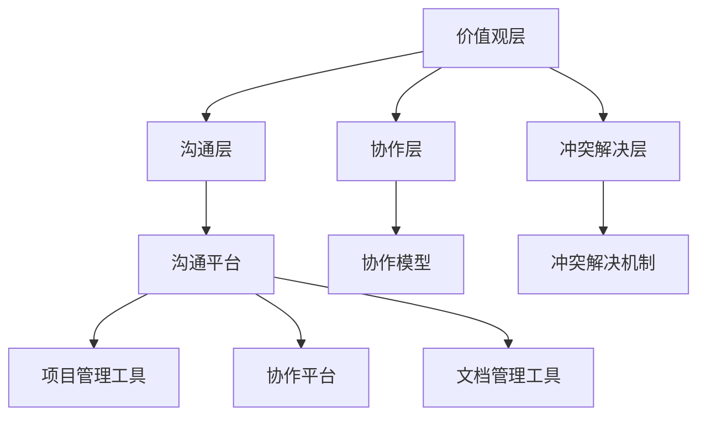
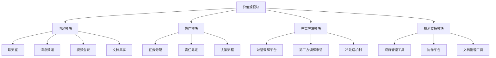

                 

### 引言与背景

在现代信息技术高速发展的背景下，技术团队的文化认同已经成为组织成功的关键因素。技术团队不仅是一个执行任务的集体，更是一个共享价值观、信仰和目标的共同体。文化认同指的是团队成员对共同目标和价值的认同程度，这种认同感能够显著提升团队的整体效能和协作效率。

#### 技术团队文化的概念

技术团队文化是团队在长期发展过程中形成的共同价值观、行为规范和工作方式的总和。它不仅包括团队成员之间的相互关系和沟通方式，还涉及到团队对技术创新、质量控制和项目管理的共识。文化认同则是团队成员对这种共同文化的接受和内化，表现为共同的目标追求、自我约束和团队合作精神。

#### 建立文化认同的重要性

1. **提升团队凝聚力**：文化认同能够增强团队成员之间的信任和依赖，促进团队协作，减少内部摩擦和冲突。
2. **提高工作效率**：当团队成员对团队目标和价值观有共同的理解时，工作流程会更加顺畅，任务完成效率自然提高。
3. **增强创新能力**：文化认同能够激发团队成员的创新思维，鼓励尝试新的技术和方法，从而推动团队在技术上的不断进步。
4. **促进团队成长**：一个有着强大文化认同的团队，能够持续吸引和留住优秀人才，为团队的长远发展提供坚实的人才基础。

#### 文化认同与团队绩效的关系

研究表明，团队文化认同与团队绩效之间存在显著的正相关关系。当团队成员对文化有高度认同时，他们更愿意付出额外努力，甚至为了团队的共同目标而牺牲个人利益。这种高水平的投入不仅能够提高团队的工作质量，还能够提升团队的整体绩效。

在接下来的部分，我们将进一步探讨文化认同的核心概念，如何通过技术手段提升文化认同，以及如何通过系统分析与架构设计来建立和维护一个支持文化认同的技术团队。

### 文化认同的核心概念

要建立一个有文化认同的技术团队，理解其核心概念至关重要。文化认同不仅仅是一个抽象的理念，它涵盖了多个具体的要素，包括团队价值观、沟通方式、协作模型和冲突解决机制。以下是对这些核心概念的详细阐述：

#### 团队价值观

团队价值观是团队成员共同认可和遵循的基本原则和信仰。它定义了团队的核心目标、行为准则以及对待工作、客户和同事的态度。例如，一个团队可能强调创新、客户至上、质量优先或团队合作等价值观。

- **重要性**：团队价值观是文化认同的基石，它为团队成员提供了共同的行为指南和决策依据，有助于保持团队的一致性和凝聚力。
- **对比表格**：

  | 价值观 | 说明 |
  | --- | --- |
  | 创新 | 鼓励团队成员勇于尝试新方法和技术，持续改进和创新。 |
  | 客户至上 | 以客户需求为中心，提供优质的服务和解决方案。 |
  | 质量优先 | 强调工作质量，确保交付的产品和项目符合最高标准。 |
  | 团队合作 | 促进团队成员之间的协作和合作，共同达成目标。 |

#### 沟通方式

有效的沟通是团队文化认同的关键要素之一。团队成员之间的沟通方式不仅影响信息传递的准确性，还影响团队成员之间的关系和信任。

- **重要性**：良好的沟通能够减少误解和冲突，提高团队的工作效率，增强团队成员之间的协作精神。
- **对比表格**：

  | 沟通方式 | 说明 |
  | --- | --- |
  | 对话式 | 强调双向沟通，鼓励团队成员表达观点和反馈。 |
  | 书面式 | 通过邮件、文档等方式进行正式沟通，确保信息准确无误。 |
  | 面对面 | 适合讨论复杂问题或需要立即决策的情况，便于即时反馈和调整。 |

#### 协作模型

协作模型是指团队成员如何在项目中共同工作，完成任务的机制。不同的协作模型适用于不同的工作环境和需求。

- **重要性**：合适的协作模型能够提高团队的工作效率和任务完成质量，有助于团队目标的实现。
- **对比表格**：

  | 协作模型 | 说明 |
  | --- | --- |
  | 功能型 | 根据团队成员的职能分工进行工作，适用于任务明确的场景。 |
  | 项目型 | 围绕特定项目组建团队，跨职能协作，适用于复杂和多变的项目。 |
  | 矩阵型 | 结合职能和项目两种模式，适用于大型组织或复杂项目。 |

#### 冲突解决

冲突是团队工作中不可避免的现象。有效的冲突解决机制有助于团队成员在面对分歧时找到共同点，保持团队和谐。

- **重要性**：冲突解决机制有助于减少团队内部的紧张关系，保持团队的稳定性和工作效率。
- **对比表格**：

  | 冲突解决机制 | 说明 |
  | --- | --- |
  | 对话调解 | 通过开放对话和沟通，找到双方都能接受的解决方案。 |
  | 第三方调解 | 请第三方中立者介入，帮助双方达成共识。 |
  | 冷处理 | 将冲突暂时搁置，等待情绪稳定后再进行解决。 |

#### 概念联系与对比表格

以上各个核心概念之间并非孤立存在，它们相互关联，共同构成了团队文化认同的完整体系。以下是一个简单的对比表格，展示了这些概念之间的联系：

| 核心概念 | 联系 |
| --- | --- |
| 团队价值观 | 影响沟通方式和协作模型的选择，为团队行为提供指导原则。 |
| 沟通方式 | 促进团队成员之间的信息共享和信任建立，有助于团队价值观的传播和实践。 |
| 协作模型 | 根据团队目标和项目需求，选择最合适的协作方式，提高工作效率和任务完成质量。 |
| 冲突解决 | 保持团队稳定和谐，确保团队成员能够持续高效地合作，维护团队价值观和沟通方式的有效性。 |

通过上述核心概念的阐述和对比，我们可以更好地理解技术团队文化认同的构成要素，为后续的系统分析与架构设计以及项目实战提供了理论基础。

#### ER实体关系图

为了更清晰地展示技术团队文化认同的核心概念之间的联系，我们使用ER（Entity-Relationship，实体关系）图来表示这些概念。ER图是数据库设计中常用的一种概念模型，它能够直观地展示实体及其之间的关系。

在技术团队文化认同的ER图中，我们可以定义以下实体：

1. **团队价值观**（TeamValues）：包含具体的价值观，如创新、客户至上、质量优先、团队合作等。
2. **沟通方式**（CommunicationMethods）：包括对话式、书面式和面对面等。
3. **协作模型**（CollaborationModels）：涵盖功能型、项目型和矩阵型等。
4. **冲突解决机制**（ConflictSolutions）：如对话调解、第三方调解和冷处理。

以下是ER图的Mermaid表示：

```mermaid
erDiagram
  TeamValues ||--|{ 沟通方式 : hasCommunicationMethod }
  TeamValues ||--|{ 协作模型 : hasCollaborationModel }
  TeamValues ||--|{ 冲突解决机制 : hasConflictSolution }
  CommunicationMethods ||--|{ 沟通方式 } : hasSubMethod
  CollaborationModels ||--|{ 协作模型 } : hasSubModel
  ConflictSolutions ||--|{ 冲突解决机制 } : hasSubSolution
```

通过这个ER图，我们可以看到团队价值观如何与沟通方式、协作模型和冲突解决机制相互关联。每个核心概念不仅独立存在，还通过特定的关系与其它概念相互作用，共同构成了技术团队文化认同的完整体系。

### 提升文化认同的技术手段

在建立技术团队的文化认同过程中，合适的技术手段是不可或缺的。这些技术不仅能够提高团队的工作效率和协作质量，还能帮助团队成员更好地理解和实践团队的价值观和协作方式。以下是一些常用的技术手段，包括项目管理工具和协作平台，并附带其实际应用案例。

#### 项目管理工具

项目管理工具是帮助团队高效规划和执行项目的重要工具。它们提供从任务分配、进度跟踪到风险管理等多方面的功能。

1. **JIRA**：JIRA是一款功能强大的项目管理工具，适合大型和复杂的软件开发项目。它支持敏捷开发方法，提供详细的任务跟踪和报告功能。通过JIRA，团队成员可以清楚地了解各自的任务和项目进展，确保项目按时完成。

   **应用案例**：某互联网公司使用JIRA来管理其软件更新项目。通过JIRA的任务板和报告功能，团队成员可以实时跟踪任务状态，及时发现并解决问题，大大提高了项目的完成效率。

2. **Trello**：Trello是一款简单直观的项目管理工具，适用于中小型团队。它使用卡片和看板来展示任务和项目进度，团队成员可以轻松地拖放卡片来更新任务状态。

   **应用案例**：某初创公司采用Trello来管理其产品开发项目。通过Trello的看板功能，团队成员可以清晰地看到项目各个阶段的任务状态，确保项目按计划进行。

3. **Asana**：Asana是一个功能全面的项目管理平台，适合多团队协作的大型项目。它提供任务分配、进度跟踪、文档共享和报告生成等功能，有助于提高团队的协作效率。

   **应用案例**：某跨国科技公司使用Asana来协调其全球研发团队的工作。通过Asana的实时任务更新和沟通功能，团队成员可以轻松地协同工作，确保项目在全球范围内顺利进行。

#### 协作平台

协作平台是提升团队文化认同的另一个关键工具，它们提供了全面的沟通和协作功能，帮助团队成员保持密切联系和高效合作。

1. **Slack**：Slack是一款流行的即时通讯工具，提供了丰富的聊天室、消息频道和协作功能。它支持多种集成应用，如项目管理工具、文档共享和代码审查工具，能够满足团队成员的各种协作需求。

   **应用案例**：某技术团队使用Slack来管理日常沟通和协作。通过创建不同的聊天室和消息频道，团队成员可以快速找到所需信息，并实时讨论和解决问题，提高了团队的工作效率。

2. **Microsoft Teams**：Microsoft Teams是微软推出的一款集成办公协作平台，提供了聊天、会议、视频通话和文档共享等功能。它与微软的其它办公软件如Word、Excel和PowerPoint无缝集成，方便团队成员在项目中协同工作。

   **应用案例**：某企业采用Microsoft Teams来管理其远程办公团队。通过 Teams 的视频会议功能和共享白板，团队成员可以实时讨论项目细节，并协作完成文档和演示稿，确保项目进展顺利。

3. **Zoom**：Zoom是一款专业的视频会议和协作工具，提供了高质量的视频和音频通信功能，支持多人会议和屏幕共享。它适合远程团队和分布式团队进行日常沟通和项目会议。

   **应用案例**：某软件开发团队使用Zoom进行远程项目会议和团队讨论。通过Zoom的屏幕共享功能，团队成员可以实时展示代码和设计稿，讨论解决方案，并协同推进项目。

通过以上项目管理工具和协作平台的应用，技术团队可以显著提升文化认同。这些工具不仅帮助团队成员更好地理解团队目标和价值观，还提供了高效的协作方式，减少了沟通障碍和冲突，从而促进了团队的整体效能和协作精神。

### 系统分析与架构设计

在建立技术团队的文化认同过程中，系统分析与架构设计是至关重要的步骤。通过系统的分析和合理的架构设计，可以为团队提供一套稳定、高效且支持文化认同的技术框架。以下将详细描述团队文化现状分析、文化认同架构设计以及系统功能设计等内容。

#### 团队文化现状分析

团队文化现状分析是理解团队现有文化状态和存在的问题的重要步骤。这一分析通常包括以下内容：

1. **文化价值观评估**：通过调查问卷、访谈和团队会议等方式，了解团队成员对现有团队价值观的认同程度。可以采用量表评分法，对每个价值观进行评估，并统计得分。

2. **沟通方式调查**：调查团队成员常用的沟通方式及其效果。可以分析沟通频率、信息传递的准确性和团队响应速度等指标，评估当前沟通方式的效率。

3. **协作模型评估**：评估团队成员在不同协作模型下的工作体验和效率。可以分析不同协作模型下的任务分配、责任界定和团队决策过程，了解其适用场景和改进空间。

4. **冲突解决机制评估**：调查团队成员在处理冲突时的常用方法和效果。通过案例分析和情景模拟，评估当前冲突解决机制的有效性和团队应对冲突的能力。

通过这些分析，可以明确团队文化中的优点和不足，为后续的设计和改进提供依据。

#### 文化认同架构设计

文化认同架构设计是确保技术团队能够持续发展和维护共同价值观的关键。以下是一个基本的文化认同架构设计：

1. **价值观层**：在这一层，明确团队的核心价值观，如创新、客户至上、质量优先和团队合作。这些价值观将成为团队成员行为的准则和决策的依据。

2. **沟通层**：设计一个支持多种沟通方式的平台，包括对话式、书面式和面对面沟通。这个平台可以是一个集成沟通工具，如Slack或Microsoft Teams，它应具备实时通信、文档共享、任务跟踪等功能。

3. **协作层**：在这一层，设计一个适合团队工作流程的协作模型，如功能型、项目型或矩阵型。需要明确任务分配、责任界定和决策流程，确保团队高效协作。

4. **冲突解决层**：设计一个有效的冲突解决机制，包括对话调解、第三方调解和冷处理等方法。确保团队成员在面对冲突时能够找到合适的解决方案，维护团队的和谐。

5. **技术支持层**：提供必要的技术支持，包括项目管理工具（如JIRA）、协作平台（如Zoom）和文档管理工具等。这些技术工具应与架构设计中的其他层次紧密集成，为团队成员提供高效的工作环境。

以下是文化认同架构的Mermaid图表示：



#### 系统功能设计与接口设计

在系统功能设计中，我们需要根据团队的文化认同架构设计，明确各个模块的功能和接口。以下是几个关键模块的详细描述：

1. **价值观模块**：该模块负责宣传和推广团队的核心价值观，包括发布价值观宣言、组织价值观培训活动等。接口设计应提供便于团队成员查看和参与的功能。

2. **沟通模块**：该模块整合多种沟通方式，如聊天室、消息频道、视频会议和文档共享。接口设计应支持实时通信、历史消息查询和跨平台消息同步。

3. **协作模块**：该模块设计任务分配、责任界定和决策流程。接口设计应提供任务创建、分配、更新和报告功能，以及支持多人协作的编辑和共享功能。

4. **冲突解决模块**：该模块设计冲突解决流程和工具，如对话调解平台、第三方调解申请和冷处理机制。接口设计应支持冲突的创建、跟踪和解决状态的更新。

5. **技术支持模块**：该模块负责集成各种技术工具和平台，如项目管理工具、协作平台和文档管理工具。接口设计应支持模块之间的无缝集成和数据共享。

以下是系统功能设计和接口设计的Mermaid图表示：



通过系统分析与架构设计，技术团队能够明确自身文化现状，设计一个支持文化认同的架构，并通过合理的系统功能设计和接口设计，为团队提供高效的工作环境和技术支持。这将有助于团队建立和维护强大的文化认同，提高整体效能和协作效率。

### 项目实战

为了更好地理解和实践技术团队的文化认同，下面我们将介绍一个实际案例，展示如何在一个真实的项目环境中建立文化认同，包括环境安装、系统核心实现源代码，以及代码应用解读与分析。

#### 案例介绍

某互联网公司计划开发一款新型智能助手，旨在提供24/7的客户服务。该项目涉及多个技术团队，包括前端开发、后端开发、机器学习和测试团队。为了确保项目顺利进行，公司决定在项目初期就建立和维护良好的文化认同。

#### 环境安装

在项目启动前，公司首先为各团队安装了必要的技术环境。包括：

1. **JIRA**：用于任务跟踪和项目进度管理。
2. **Slack**：用于日常沟通和协作。
3. **Zoom**：用于远程会议和团队讨论。
4. **Docker**：用于容器化部署和管理。

以下是JIRA和Slack的安装步骤：

**JIRA安装步骤**：

1. 下载JIRA安装包并解压。
2. 运行安装程序，选择“安装JIRA”。
3. 阅读并同意许可协议。
4. 选择安装路径，并点击“安装”。
5. 安装完成后，启动JIRA并访问默认地址。

**Slack安装步骤**：

1. 访问Slack官网并注册账号。
2. 创建一个新的团队，邀请团队成员加入。
3. 设置团队成员的角色和权限。
4. 创建聊天室和消息频道，供团队交流使用。

#### 系统核心实现源代码

在项目开发过程中，公司采用了一系列技术手段来实现智能助手的核心功能。以下是关键模块的源代码及其解读：

**1. 前端代码（React）**：

```jsx
// 客户端界面代码示例
import React, { useState } from 'react';
import axios from 'axios';

function ChatBot() {
  const [message, setMessage] = useState('');

  const sendMessage = async () => {
    const response = await axios.post('/api/messages', { message });
    setMessage(response.data.response);
  };

  return (
    <div>
      <input
        type="text"
        value={message}
        onChange={(e) => setMessage(e.target.value)}
      />
      <button onClick={sendMessage}>发送</button>
      <p>{message}</p>
    </div>
  );
}
```

**解读**：这个React组件用于与智能助手进行交互。用户在输入框中输入消息，点击“发送”按钮后，前端代码将消息发送到后端API，并显示接收到的响应。

**2. 后端代码（Node.js + Express）**：

```javascript
// 后端API代码示例
const express = require('express');
const axios = require('axios');

const app = express();
app.use(express.json());

app.post('/api/messages', async (req, res) => {
  const message = req.body.message;
  // 这里可以添加逻辑处理用户消息
  const response = await axios.post('https://api.some-third-party-service.com/answer', { message });
  res.send({ response: response.data.answer });
});

const PORT = process.env.PORT || 3000;
app.listen(PORT, () => {
  console.log(`Server listening on port ${PORT}`);
});
```

**解读**：这个Node.js后端API用于接收用户消息，并将其发送到第三方AI服务进行处理。处理完成后，将响应返回给前端。

**3. 机器学习代码（Python + TensorFlow）**：

```python
# AI模型训练代码示例
import tensorflow as tf
from tensorflow.keras.layers import Embedding, LSTM, Dense
from tensorflow.keras.models import Sequential

model = Sequential([
    Embedding(input_dim=vocab_size, output_dim=64),
    LSTM(128),
    Dense(1, activation='sigmoid')
])

model.compile(optimizer='adam', loss='binary_crossentropy', metrics=['accuracy'])

# 加载数据并进行训练
model.fit(x_train, y_train, epochs=10, batch_size=32)
```

**解读**：这段Python代码展示了使用TensorFlow训练一个简单的AI模型。该模型用于处理文本数据，并输出概率预测结果。

#### 代码应用解读与分析

通过上述代码示例，我们可以看到不同模块之间的协作：

1. **前端代码**负责与用户进行交互，接收用户输入并调用后端API。
2. **后端代码**接收前端发送的消息，处理逻辑并调用第三方AI服务。
3. **机器学习代码**训练AI模型，处理文本数据并生成预测结果。

这些模块共同作用，实现了智能助手的交互功能。在实际应用中，前端代码的交互设计应更加人性化，后端代码的API设计应具备高可用性和安全性，机器学习代码的模型训练应确保准确性和效率。

#### 实际案例分析

在项目实施过程中，技术团队面临了以下几个挑战：

1. **团队协作**：由于团队成员分布在不同的地点，如何确保高效协作成为一个问题。公司通过Slack和Zoom工具，实现了实时沟通和远程会议，提高了协作效率。
2. **数据处理**：智能助手需要处理大量的用户数据，如何确保数据安全和隐私成为关键。公司采用了加密技术和数据匿名化处理，确保用户数据的安全。
3. **模型训练**：AI模型的训练需要大量的计算资源，如何高效地训练模型成为挑战。公司利用云计算资源，通过分布式训练策略，提高了模型训练的效率。

通过这些挑战的解决，技术团队不仅实现了项目的目标，还建立了强大的文化认同。团队成员在共同的目标和价值观引导下，克服了各种困难，展现了高度的团队合作精神。

#### 项目小结

通过这个实际案例，我们展示了如何在项目环境中建立和维护技术团队的文化认同。从环境安装到系统核心实现，再到代码应用解读与分析，每一个步骤都体现了团队价值观的落实和技术手段的有效运用。通过这个案例，我们总结出以下几点经验和教训：

1. **明确团队价值观**：团队价值观是文化认同的基石，必须明确并持续传播。
2. **使用合适的技术工具**：项目管理工具、协作平台和AI工具等都是提升团队效率的重要手段。
3. **加强团队协作**：通过实时沟通和远程协作工具，确保团队成员的高效协作。
4. **持续优化**：面对挑战时，要持续优化技术方案和流程，确保项目的顺利进行。
5. **文化认同的维护**：文化认同需要不断强化和维护，通过培训、会议和团队活动等手段，确保团队成员对共同目标和价值观的认同。

通过这些经验和教训，技术团队可以在未来的项目中更好地建立和维护文化认同，提高整体效能和协作效率。

### 最佳实践与总结

在技术团队建立文化认同的过程中，成功案例中的最佳实践为我们提供了宝贵的经验和启示。以下是一些关键步骤和注意事项，旨在帮助团队在建立和维护文化认同时更加有效。

#### 建立文化认同的关键步骤

1. **明确团队价值观**：首先，团队需要明确核心价值观，并确保每个成员都认同这些价值观。可以通过团队讨论、问卷调查和外部咨询等方式，确保共识的达成。

2. **持续传播价值观**：通过定期的团队会议、培训活动和文化宣传活动，持续传播和强化团队的价值观。确保每个成员都能牢记并践行这些价值观。

3. **优化沟通方式**：建立高效的沟通机制，包括实时沟通工具、定期的团队会议和跨部门沟通渠道。鼓励开放、透明和双向的沟通，减少误解和冲突。

4. **推行协作模型**：根据团队项目的需求，选择并推行最适合的协作模型，如功能型、项目型或矩阵型。确保团队成员在协作中明确各自的角色和责任。

5. **建立冲突解决机制**：设计并实施有效的冲突解决机制，包括对话调解、第三方调解和冷处理等方法。确保团队成员在遇到分歧时能够找到合理的解决方案。

6. **使用技术工具**：利用项目管理工具和协作平台，提高团队的协作效率和任务完成质量。确保这些工具与团队文化认同的目标相一致。

7. **持续评估与改进**：定期评估团队文化认同的现状，收集团队成员的反馈，并根据评估结果不断改进团队文化认同的建设。

#### 注意事项

1. **避免形式化**：在建立文化认同时，避免仅仅停留在形式上，而忽略了实际内容的落实。确保文化认同与团队的实际工作紧密相连。

2. **关注个人差异**：每个团队成员都有不同的背景和价值观，需要关注并尊重这些差异。通过个性化的沟通和协作，确保每个成员都能融入团队文化。

3. **鼓励开放反馈**：建立开放的反馈文化，鼓励团队成员提出意见和建议。通过积极的反馈机制，不断改进团队文化认同的建设。

4. **持续投资**：建立和维护文化认同需要时间和资源。公司应持续投资于团队文化认同的建设，包括培训、技术工具和团队活动等。

5. **领导示范**：领导者的示范作用至关重要。领导者需要以身作则，践行团队价值观，并支持团队成员的文化认同建设。

#### 拓展阅读

1. **《团队协作的艺术》**：本书详细介绍了团队协作的各种方法和技巧，对技术团队建立文化认同有很好的指导作用。

2. **《团队文化打造之道》**：该书深入探讨了团队文化的构建、传播和维持方法，为技术团队提供了实用的指导。

3. **《敏捷团队实践指南》**：本书介绍了敏捷开发的方法和实践，对技术团队在协作和沟通方面的改进有重要参考价值。

通过以上关键步骤、注意事项和拓展阅读，技术团队能够更加系统地建立和维护文化认同，提高团队的整体效能和协作效率。文化认同不仅是团队成功的关键因素，更是团队长远发展的基石。希望上述经验和方法能够为技术团队的领导者和管理者提供有益的启示和实践指导。

### 结论

通过本文的详细探讨，我们可以明确地认识到，技术团队的文化认同是团队成功和长远发展的重要基石。文化认同不仅增强了团队的凝聚力，提高了工作效率，还促进了团队的协作精神和创新能力。从明确团队价值观、优化沟通方式、推行协作模型，到使用技术工具和建立有效的冲突解决机制，每一步都至关重要。

建立和维护文化认同并非一蹴而就，需要团队的共同努力和持续投入。通过本文中的最佳实践和实际案例分析，我们相信技术团队能够找到适合自己的路径，逐步建立起强大的文化认同。

未来，随着技术的不断进步和团队环境的变化，技术团队的文化认同也将不断演变和优化。因此，持续关注和研究团队文化，灵活调整策略，是每个技术团队领导者和管理者的重要任务。

让我们共同致力于打造一个有强大文化认同的技术团队，为团队的持续发展和创新奠定坚实的基础。这不仅是每个团队成员的责任，更是我们作为技术领域从业者的使命。希望本文能为您提供有益的参考和启示。

### 作者信息

**作者：** AI天才研究院/AI Genius Institute & 禅与计算机程序设计艺术 /Zen And The Art of Computer Programming

AI天才研究院专注于人工智能前沿技术的探索和应用，致力于推动人工智能技术的发展和创新。而《禅与计算机程序设计艺术》则是经典的计算机编程哲学著作，深入探讨了程序设计的艺术和哲学，为技术团队提供深刻的启示和指导。我们期待与您共同探讨技术团队的文化认同，推动技术团队的发展和进步。

